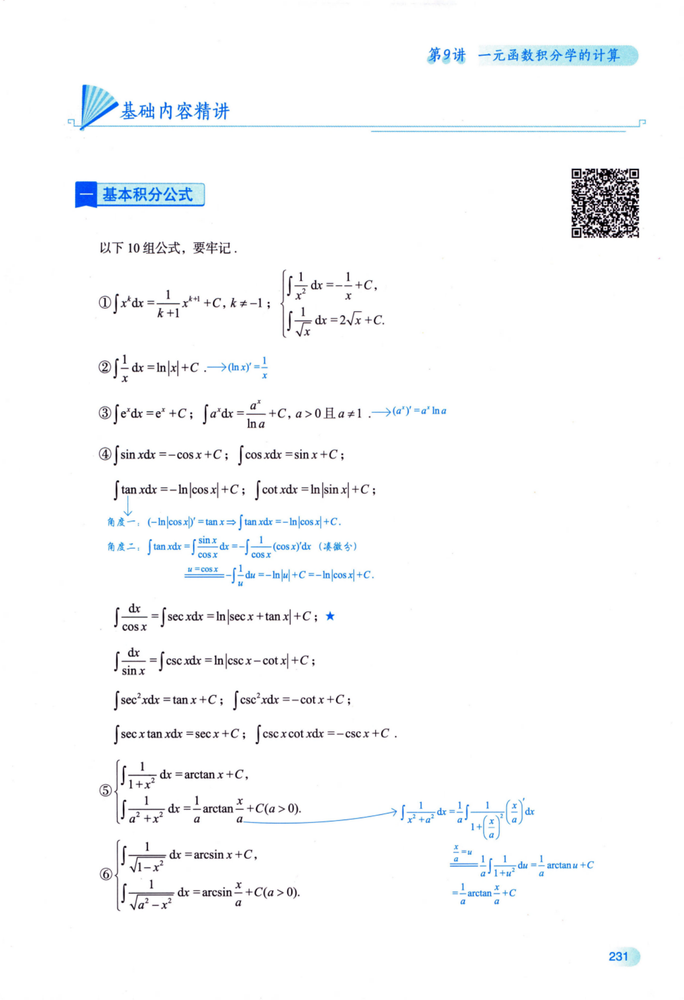
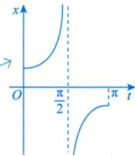
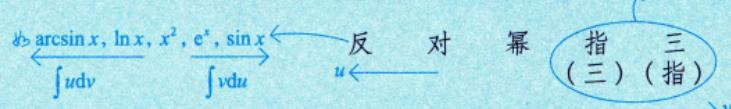
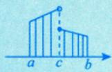
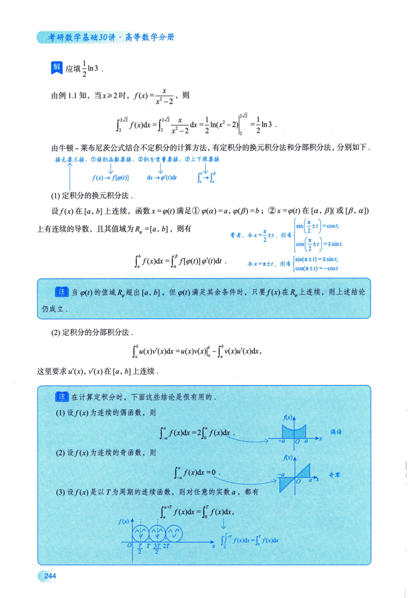
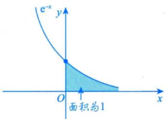
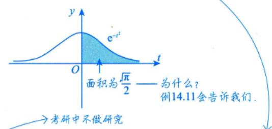
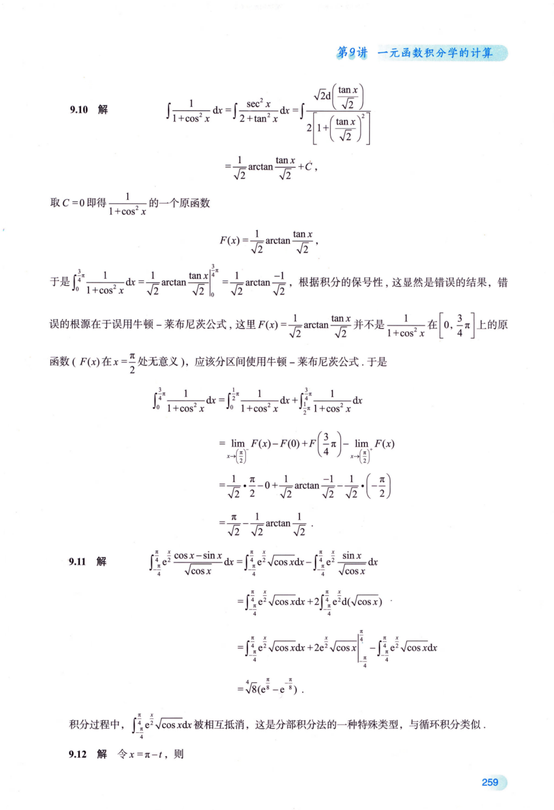

## 第9讲一元函数积分学的计算

<table><tr><td rowspan=1 colspan=1>考题</td><td rowspan=1 colspan=1>不定积分、定积分、变限积分和反常积分的计算</td></tr><tr><td rowspan=1 colspan=1>题型</td><td rowspan=1 colspan=1>选择题、填空题、解答题</td></tr><tr><td rowspan=1 colspan=1>目标</td><td rowspan=1 colspan=1>①掌握不定积分的基本公式，掌握不定积分与定积分的换元积分法与分部积分法；②会求有理函数、三角函数有理式和简单无理函数的积分；③掌握牛顿－莱布尼茨公式；④会计算反常积分</td></tr><tr><td rowspan=1 colspan=1>重难点</td><td rowspan=1 colspan=1>①不定积分和反常积分的计算；②定积分的计算和方法；③变限积分的计算和结论；④有些原函数无法用基本初等函数进行表示</td></tr></table>

## 基础知识结构

基本积分公式的由来： $\begin{aligned}\left[F(x)\right]^{\prime} = f(x) \Rightarrow \int f(x) \mathrm{d}x = F(x) + C , \quad \left(\frac{1}{k+1} x^{k+1}\right)^{\prime} = x^k \Rightarrow \int x^k \mathrm{d}x = \frac{1}{k+1} x^{k+1} + C . \\ 乐笑狈今中四大狈今方法  \leqslant \quad F^{\prime}(x) \quad f(x) \quad \int f(x) \mathrm{d}x \quad F(x)\end{aligned}$

需要牢记，是所有积分计算的基础！！！所有的积分计算通过客种方法最后都化为基本积分公式。

$$
\frac{F^{\prime}(x) = f(x)}{ 逆 }
$$

两个难点： ，使用基本的积分方法找不到 $F ( x )$

→引入中间变量

②有的原函数无法用基本初等函数进行表示。

## 基本积分公式

以下10组公式，要牢记.

①∫xdx = 1 xk+1 +C, k ≠−1; $\left\{ \begin{aligned} \frac{1}{x^{2}} \mathrm{d}x = - \frac{1}{x} + C, \\ \int \frac{1}{\sqrt{x}} \mathrm{d}x = 2\sqrt{x} + C. \end{aligned} \right.$ k +1

② $\int \frac{1}{x} \mathrm{d}x = \ln |x| + C \quad \Longrightarrow \quad (\ln x)^{\prime} = \frac{1}{x}$

③ $\int \mathrm{e}^{x} \mathrm{d}x = \mathrm{e}^{x} + C$ on $\int a^{x} \mathrm{d}x = \frac{a^{x}}{\ln a} + C, a > 0$ 且 $a \ne 1 \quad \longrightarrow (a^x)' = a^x \ln a$

④ $\int \sin x \mathrm{d}x = -\cos x + C ; \int \cos x \mathrm{d}x = \sin x + C$

$$
\int \tan x \mathrm{d}x = -\ln \left| \cos x \right| + C ; \int \cot x \mathrm{d}x = \ln \left| \sin x \right| + C ;
$$

$$
\left( - \ln \left| \cos x \right| \right)^{\prime} = \tan x \Rightarrow \int \tan x   dx = - \ln \left| \cos x \right| + C
$$

角度二： $\int \tan x   dx = \int \frac{\sin x}{\cos x}   dx = -\int \frac{1}{\cos x} \left( \cos x \right)^{\prime}   dx \quad (凑徽今) \\ \frac{u = \cos x}{} - \int \frac{1}{u}   du = -\ln |u| + C = -\ln |\cos x| + C.$

$$
<!-- DIRECTED-REPAIR-FALLBACK:FALLBACK-HIGH-CH9-P237-TAN-SUBSTITUTION -->
> [!WARNING]
> 原 PDF 第 237 页回退：tan x积分的手写换元 u=cos x 被识成空分母分式，版式标注无法从纯文本无损恢复。

\int \frac{\mathrm{d}x}{\cos x} = \int \sec x \mathrm{d}x = \ln \left| \sec x + \tan x \right| + C ; \quad \lambda
$$

$$
\int \frac{\mathrm{d}x}{\sin x} = \int \csc x \mathrm{d}x = \ln |\csc x - \cot x| + C;
$$

$$
\int \sec^{2} x \mathrm{d}x = \tan x + C ; \int \csc^{2} x \mathrm{d}x = -\cot x + C ;
$$

$$
\int \sec x \tan x \mathrm{d}x = \sec x + C ; \int \csc x \cot x \mathrm{d}x = -\csc x + C .
$$

$$
\int \frac{1}{1 + x^{2}}\mathrm{d}x = \arctan x + C, \quad \int \frac{1}{a^{2} + x^{2}}\mathrm{d}x = \frac{1}{a}\arctan\frac{x}{a} + C(a > 0).
$$

$$
\int \frac{1}{\sqrt{1 - x^{2}}}   dx = \arcsin x + C, \quad \int \frac{1}{\sqrt{a^{2} - x^{2}}}   dx = \arcsin \frac{x}{a} + C (a > 0).
$$

$$
\begin{aligned}\int \frac{1}{x^{2} + a^{2}}\mathrm{d}x = & \frac{1}{a}\int \frac{1}{1 + \left( \frac{x}{a} \right)^{2}}\left( \frac{x}{a} \right)^{\prime}\mathrm{d}x \\\xlongequal{\frac{x}{a} = u} & \frac{1}{a}\int \frac{1}{1 + u^{2}}\mathrm{d}u = \frac{1}{a}\arctan u + C \\= & \frac{1}{a}\arctan\frac{x}{a} + C\end{aligned}
$$

$$
\int \frac{1}{\sqrt{x^{2} + a^{2}}}   dx = \ln(x + \sqrt{x^{2} + a^{2}}) + C \quad ( 常见    a = 1), \quad \int \frac{1}{\sqrt{x^{2} - a^{2}}}   dx = \ln\left| x + \sqrt{x^{2} - a^{2}} \right| + C \quad (|x| > |a|).
$$

$$
\int \frac{1}{x^{2} - a^{2}} \mathrm{d}x = \frac{1}{2a} \ln \left| \frac{x - a}{x + a} \right| + C \left( \int \frac{1}{a^{2} - x^{2}} \mathrm{d}x = \frac{1}{2a} \ln \left| \frac{x + a}{x - a} \right| + C \right)
$$

$$
\int \sqrt{a^{2}-x^{2}} \mathrm{d}x=\frac{a^{2}}{2}\arcsin \frac{x}{a}+\frac{x}{2}\sqrt{a^{2}-x^{2}}+C(a>|x|\geqslant0)
$$

$$
\int \frac{1}{a^{2}-x^{2}} \mathrm{d}x=-\int \frac{1}{x^{2}-a^{2}} \mathrm{d}x=-\frac{1}{2a} \ln \left|\frac{x-a}{x+a}\right|+C \quad 且 \quad \frac{1}{2a} \ln \left|\frac{x+a}{x-a}\right|+C.
$$

10 $\int \sin ^{2}x\mathrm{d}x=\frac{x}{2}-\frac{\sin 2x}{4}+C\left ( \sin ^{2}x=\frac{1-\cos 2x}{2} \right )$ ；—→记住2次方即可，3次方不用再记

$$
\int \cos ^{2}x\mathrm{d}x=\frac{x}{2}+\frac{\sin 2x}{4}+C\left ( \cos ^{2}x=\frac{1+\cos 2x}{2} \right ) ;
$$

$$
\int \tan ^{2} x \mathrm{d}x = \tan x - x + C \left( \tan ^{2} x = \sec ^{2} x - 1 \right);
$$

$$
\int \cot ^{2} x\mathrm{d}x = -\cot x - x + C\left( \cot ^{2} x = \csc ^{2} x - 1 \right)
$$

## 不定积分的积分法

## 凑微分法

$$
g(x) = u
$$

$\int f[g(x)]g^{\prime}(x)\mathrm{d}x = \int f[g(x)]\mathrm{d}[g(x)] = \int f(u)\mathrm{d}u$ →若可以代入基本积分公式，则结束

注当被积函数比较复杂时，拿出一部分放到d后面去，若能凑成 $\int f(u) \mathrm{d}u$ 的形式，则凑微分成功.比如，

$$
\int \frac{\ln^{5}x}{x}\mathrm{d}x = \int \ln^{5}x \cdot \frac{1}{x}\mathrm{d}x = \int \ln^{5}x\mathrm{d}(\ln x) = \frac{\ln^{6}x}{6} + C.
$$

即注2的⑤

$$
\int\limits_{0}^{1} \left| \int_{0}^{x} x \cdot (\ln x)^{\prime} \mathrm{d}x \right|
$$

## →放入d后面要熟练

## 注2常用的凑微分公式：

①由于 $x\mathrm{d}x = \frac{1}{2}\mathrm{d}(x^{2})$ ，故 $\int x f(x^2) \mathrm{d}x = \frac{1}{2} \int f(x^2) \mathrm{d}(x^2) = \frac{1}{2} \int f(u) \mathrm{d}u.$

②由于 $\sqrt{x} \mathrm{d}x = \frac{2}{3} \mathrm{d}(x^{\frac{3}{2}})$ ，故 $\int \sqrt{x} f(x^{\frac{3}{2}}) \mathrm{d}x = \frac{2}{3} \int f(x^{\frac{3}{2}}) \mathrm{d}(x^{\frac{3}{2}}) = \frac{2}{3} \int f(u) \mathrm{d}u.$

③由于 $\frac{\mathrm{d}x}{\sqrt{x}} = 2\mathrm{d}(\sqrt{x})$ $\int \frac{f(\sqrt{x})}{\sqrt{x}} \mathrm{d}x = 2\int f(\sqrt{x}) \mathrm{d}(\sqrt{x}) = 2\int f(u) \mathrm{d}u$

④由于 $\frac{\mathrm{d}x}{x^{2}} = \mathrm{d}\left( - \frac{1}{x} \right)$ $\int \frac{f\left( - \frac{1}{x} \right)}{x^{2}}\mathrm{d}x = \int f\left( - \frac{1}{x} \right)\mathrm{d}\left( - \frac{1}{x} \right) = \int f(u)\mathrm{d}u$

⑤由于当x>0时， $\frac{1}{x}\mathrm{d}x = \mathrm{d}(\ln x)$ 故 $\int \frac{f(\ln x)}{x} \mathrm{d}x = \int f(\ln x) \mathrm{d}(\ln x) = \int f(u) \mathrm{d}u.$

⑥由于 $\mathrm{e}^{x} \mathrm{d}x = \mathrm{d}(\mathrm{e}^{x})$ ，故 $\int \mathrm{e}^{x} f(\mathrm{e}^{x}) \mathrm{d}x = \int f(\mathrm{e}^{x}) \mathrm{d}(\mathrm{e}^{x}) = \int f(u) \mathrm{d}u$

⑦由于 $a^{x}\mathrm{d}x = \frac{1}{\ln a}\mathrm{d}(a^{x}), a > 0, a \neq 1.$ 故， $\int a^{x} f(a^{x}) \mathrm{d}x = \frac{1}{\ln a} \int f(a^{x}) \mathrm{d}(a^{x}) = \frac{1}{\ln a} \int f(u) \mathrm{d}u.$

⑧由于 $\sin x   dx = \mathrm{d}(-\cos x)$ ，故 $\int \sin x \cdot f(-\cos x) \mathrm{d}x = \int f(-\cos x) \mathrm{d}(-\cos x) = \int f(u) \mathrm{d}u$

⑨由于 $\cos x \mathrm{d}x = \mathrm{d}(\sin x)$ ，故 $\int \cos x \cdot f(\sin x) \mathrm{d}x = \int f(\sin x) \mathrm{d}(\sin x) = \int f(u) \mathrm{d}u$

⑩由于 $\frac{\mathrm{d}x}{\cos^{2}x}=\sec^{2}x\mathrm{d}x=\mathrm{d}(\tan x)$ 故， $\int \frac{f(\tan x)}{\cos^{2}x}\mathrm{d}x = \int f(\tan x)\mathrm{d}(\tan x) = \int f(u)\mathrm{d}u.$

①由于 $\frac{\mathrm{d}x}{\sin^{2}x}=\csc^{2}x\mathrm{d}x=\mathrm{d}(-\cot x)$ 故 $\int \frac{f(-\cot x)}{\sin^2 x}   dx = \int f(-\cot x)   d(-\cot x) = \int f(u)   du$

②由于 $\frac{1}{1 + x^{2}}\mathrm{d}x = \mathrm{d}(\arctan x)$ $\int \frac{f(\arctan x)}{1 + x^{2}}\mathrm{d}x = \int f(\arctan x)\mathrm{d}(\arctan x) = \int f(u)\mathrm{d}u$

B由于 $\frac{1}{\sqrt{1 - x^{2}}}\mathrm{d}x = \mathrm{d}(\arcsin x)$ 做， $\int \frac{f(\arcsin x)}{\sqrt{1 - x^{2}}} \mathrm{d}x = \int f(\arcsin x) \mathrm{d}(\arcsin x) = \int f(u) \mathrm{d}u$

$$
\int\frac{\left( \arcsin x \right)^{2}}{\sqrt{1 - x^{2}}}\mathrm{d}x = \int\left( \arcsin x \right)^{2}\mathrm{d}\left( \arcsin x \right)\arcsin x = \int u^{2}\mathrm{d}u = \frac{1}{3}u^{3} + C = \frac{1}{3}\arcsin^{3}x + C
$$

选择复杂部分求导 $\frac{\left( \arcsin x \right)^{\prime}}{\sqrt{1 - x^{2}}}$

例9.1 求不定积分 $\int\frac{\sqrt{x}}{\sqrt{4 - x^{3}}}\mathrm{d}x$

解

$$
\int\frac{\sqrt{x}}{\sqrt{4 - x^{3}}}\mathrm{d}x = \frac{2}{3}\int\frac{\mathrm{d}(x^{\frac{3}{2}})}{\sqrt{4 - (x^{\frac{3}{2}})^{2}}} = \frac{2}{3}\int\frac{\mathrm{d}(x^{\frac{3}{2}})}{2\sqrt{1 - \left(\frac{1}{2}x^{\frac{3}{2}}\right)^{2}}}
$$

$$
\frac{2}{3}\int\frac{\mathrm{d}\left(\frac{1}{2}x^{\frac{3}{2}}\right)}{\sqrt{1-\left(\frac{1}{2}x^{\frac{3}{2}}\right)^{2}}}=\frac{2}{3}\arcsin\left(\frac{1}{2}x^{\frac{3}{2}}\right)+C.
$$

例9.2 求不定积分 $\int \mathrm{e}^{\frac{\sin \theta}{\cos \theta + \sin \theta}} \cdot \frac{1}{\left( \cos \theta + \sin \theta \right)^{2}} \mathrm{d}\theta$ .(真题中大题最后一步)

分析若不是常用的凑微分公式，则可对被积函数的复杂部分 $g(x)$ 求导，若 $g^{\prime}(x) = f(x)$ ，即 $\mathrm{d}[g(x)] = f(x)\mathrm{d}x$ 则 $\int f(x)g(x)\mathrm{d}x = \int g(x)\mathrm{d}[g(x)]$ ，凑微分成功.

解对复杂部分求导：

$$
\left( \frac{\sin \theta}{\cos \theta + \sin \theta} \right)' = \frac{\cos \theta (\cos \theta + \sin \theta) - \sin \theta (-\sin \theta + \cos \theta)}{(\cos \theta + \sin \theta)^2} = \frac{1}{(\cos \theta + \sin \theta)^2}
$$

故

$$
\mathrm{d}\left( \frac{\sin \theta}{\cos \theta + \sin \theta} \right) = \frac{1}{\left( \cos \theta + \sin \theta \right)^{2}} \mathrm{d}\theta,
$$

于是

## 2 换元法

$$
\int \frac{\left| \frac{\sin \theta}{\cos \theta + \sin \theta} \right|}{\sqrt{\left[ g(x) \right]^{\prime}}} \mathrm{d}\left( \frac{\sin \theta}{\frac{\cos \theta + \sin \theta}{\sqrt{\left[ g(x) \right]^{\prime}}}} \right) = \mathrm{e}^{\frac{\sin \theta}{\cos \theta + \sin \theta}} + C
$$

(1) 基本思想.

$$
\int f(x) \mathrm{d}x \xlongequal{x = g(u)} \int f[g(u)] \mathrm{d}[g(u)] = \int f[g(u)] g'(u) \mathrm{d}u .
$$

本质：f(x)比较复杂，如 V $\sqrt{ \mathrm{e}^{x} + 1 } , \sqrt{ \frac{2x + 1}{x + 1} } , \frac{1}{\sqrt{ \mathrm{e}^{2x} + 1 } }$

引入新的自变量u，将原式化简为 $\int h(u) \mathrm{d}u.$ ，可代入公式

注(1)当被积函数不容易积分(比如含有根式或含有反三角函数)时，可以通过换元的方法从d后面拿出一部分放到前面来，就成为 $\int f[g(u)]g^{\prime}(u)\mathrm{d}u$ 的形式，若 $f[g(u)]g^{\prime}(u)$ 容易积分，则换元成功

(2) $x = g(u)$ 须是单调可导函数，且不要忘记计算结束后用反函数 $u = g^{-1}(x)$ 回代.

(2) 常用换元法.

①三角函数代换——当被积函数含有如下根式时，可作三角函数代换，这里 $a > 0$

√a²−x²→令x=asint,|t|<元

√a2 +x2 →令x = a tant, $\left| t \right| < \frac{\pi}{2}   ,$

$x > 0$ 则 $0 < t < \frac{\pi}{2}$

若x<0,则 $\frac{\pi}{2} < t < \pi.$

②恒等变形后作三角函数代换——当被积函数含有根式 $\sqrt{ax^{2}+bx+c}$ 时，可先化为以下三种形式：

$$
\sqrt { \varphi ^ { 2 } ( x ) + k ^ { 2 } } , \sqrt { \varphi ^ { 2 } ( x ) - k ^ { 2 } } , \sqrt { k ^ { 2 } - \varphi ^ { 2 } ( x ) } ,
$$

再作三角函数代换.

解题利器：“令复杂=t”

举重若轻 77★★★③根式代换——当被积函数含有根式 $\sqrt[n]{ax + b}, \sqrt{\frac{ax + b}{cx + d}}, \sqrt{ae^{bx} + c}$ 等时，一般令根式 $\underline { { \underline { { \sqrt { * } } } = \underline { { t } } } }$ (因为事实上，很难通过根号内换元的办法凑成平方，所以根号无法去掉).对既含有 $\sqrt [ n ] { a x + b }$ ，也含有$\sqrt[m]{ax + b}$ 的函数，一般取m，n的最小公倍数l，令 $\sqrt[l]{ax + b} = t$

→比如，含有√ax+b，√ax+b的函数，令 $t = \sqrt[6]{ax + b}$

④倒代换——当被积函数分母的幂次比分子高两次及两次以上时，作倒代换，令 $x = \frac{1}{t}$

未必一定用，如 ↓ $\begin{aligned}\int \frac{1}{x(x^3 + 1)} \mathrm{d}x = & \int \frac{x^2}{x^3(x^3 + 1)} \mathrm{d}x = \frac{1}{3} \int \frac{1}{x^3(x^3 + 1)} \mathrm{d}(x^3) \\\xlongequal{x^3 = t} & \frac{1}{3} \int \frac{1}{t(t + 1)} \mathrm{d}t = \frac{1}{3} \int \left( \frac{1}{t} - \frac{1}{t + 1} \right) \mathrm{d}t \\= & \frac{1}{3} (\ln \left| t \right| - \ln \left| t + 1 \right|) + C \\= & \frac{1}{3} \ln \left| \frac{x^3}{x^3 + 1} \right| + C\end{aligned}$

⑤复杂函数的直接代换——当被积函数中含有 $a^{x}   ,   \mathbf{e}^{x}$ ，ln x，arcsin x，arctan x等时，可考虑直接令复杂函数等于t，值得指出的是，当ln x，arcsinx，arctan x与 $P _ { n } ( x )$ 或 $\mathsf { e } ^ { a x }$ 作乘法时(其中 $P_{n}(x)$ 为x的n次多项式)，优先考虑分部积分法.

例9.3 求不定积分 $\int \sqrt{a^{2}-x^{2}} \mathrm{d}x (a>0)$

$$
\xrightarrow{-a \leqslant x \leqslant a,-\frac{\pi}{2} \leqslant t \leqslant \frac{\pi}{2}}
$$

解设 $x = a \sin t$ ，则 $\mathrm{d}x = a\cos l$ tdt , $t = \arcsin \frac{x}{a}$ ，所以

$$
\begin{aligned}\int \sqrt{a^{2}-x^{2}} \mathrm{d}x = & \int \sqrt{a^{2}-a^{2} \sin ^{2} t} \cdot a \cos t \mathrm{d}t = a^{2} \int \cos ^{2} t \mathrm{d}t = \frac{a^{2}}{2} \int (1+\cos 2t) \mathrm{d}t \\= & \frac{a^{2}}{2} t+\frac{a^{2}}{4} \sin 2t+C=\frac{a^{2}}{2} t+\frac{a^{2}}{2} \sin t \cos t+C \\= & \frac{a^{2}}{2} \arcsin \frac{x}{a}+\frac{x}{2} \sqrt{a^{2}-x^{2}}+C.\end{aligned}
$$

## ③分部积分法

(1) $\int\limits_{\substack{u \mathrm{d}v \\ \mathrm{ 难算 }}} = uv - \int v\mathrm{d}u$

注1这个方法主要适用于求 udv 比较困难，而 vdu 比较容易的情形.

注2积分后会“简单”些的函数宜取作ν；微分后会“简单”些的函数宜取作μ.故u，ν的选取原则为 指、三均可为u

相对位置在左边的宜选作μ，用来求导；相对位置在右边的宜选作ν，用来积分，即

(1) 被积函数为 $P_{n}(x)\mathrm{e}^{kx}, P_{n}(x)\sin ax, P_{n}(x)\cos ax$ 等形式时，一般来说选取 $u = P_{n}(x)$

(2) 被积函数为 $\mathrm{e}^{ax}\sin bx,\mathrm{e}^{ax}\cos bx$ 等形式时，μ可以取两因子中的任意一个；

(3)被积函数为 $P_{n}(x)\ln x,\;P_{n}(x)\arcsin x,\;P_{n}(x)\arctan x$ 等形式时，一般分别选取

$$
u = \ln x , u = \arcsin x , u = \arctan x.
$$

$$
\begin{aligned}\int \frac{\mathrm{d}x}{u} \int \ln(1 + x^2) \mathrm{d}x = & \int \ln(1 + x^2) \cdot x^{\prime} \mathrm{d}x \\= & \ln(1 + x^2) \cdot x - \int x \cdot \frac{2x}{1 + x^2} \mathrm{d}x \\= & x \ln(1 + x^2) - 2\int \frac{x^2 + 1 - 1}{x^2 + 1} \mathrm{d}x \\= & x \ln(1 + x^2) - 2x + 2\arctan x + C.\end{aligned}
$$

$$
\begin{aligned}\iint_{D} x^{3} \mathrm{e}^{x} \mathrm{d}x = & \int x^{3} \mathrm{d}(\mathrm{e}^{x}) = x^{3} \mathrm{e}^{x} - \int \mathrm{e}^{x} \cdot 3x^{2} \mathrm{d}x \\= & x^{3} \mathrm{e}^{x} - 3\int x^{2} \mathrm{d}(\mathrm{e}^{x}) \\= & x^{3} \mathrm{e}^{x} - 3\left(x^{2} \mathrm{e}^{x} - \int \mathrm{e}^{x} \cdot 2x \mathrm{d}x\right) \\= & x^{3} \mathrm{e}^{x} - 3x^{2} \mathrm{e}^{x} + 6x \mathrm{e}^{x} - 6\mathrm{e}^{x} + C\end{aligned}
$$

(2)分部积分法的推广公式与 $\int P_{n}(x)e^{kx}\mathrm{d}x,\int P_{n}(x)\sin ax\mathrm{d}x,\int P_{n}(x)\cos bx\mathrm{d}x$

设函数 $u = u(x)$ 与 $\nu = \nu(x)$ 具有直到第n+1阶的连续导数，并根据分部积分公式

$$
\int u \mathrm{d}v = uv - \int v \mathrm{d}u   ,
$$

则有

$$
\int u v ^ { ( n + 1 ) } \mathrm { d } x = u v ^ { ( n ) } - u ^ { \prime } v ^ { ( n - 1 ) } + u ^ { n } v ^ { ( n - 2 ) } - \cdots + ( - 1 ) ^ { n } u ^ { ( n ) } v + ( - 1 ) ^ { n + 1 } \int u ^ { ( n + 1 ) } v \mathrm { d } x .
$$

注证明n=3时，如下：

证

$$
\begin{aligned}\int u v^{(4)} \mathrm{d}x &= u v^{(3)} - u^{\prime} v^{\prime \prime} + u^{\prime \prime} v^{\prime} - u^{(3)} v + \int u^{(4)} v \mathrm{d}x . \\\int u v^{(4)} \mathrm{d}x &= \int u \mathrm{d}[v^{(3)}] = u v^{(3)} - \int u^{\prime} v^{(3)} \mathrm{d}x , \\\int u^{\prime} v^{(3)} \mathrm{d}x &= \int u^{\prime} \mathrm{d}(v^{\prime \prime}) = u^{\prime} v^{\prime \prime} - \int u^{\prime \prime} v^{\prime \prime} \mathrm{d}x , \\\int u^{\prime \prime} v^{\prime \prime} \mathrm{d}x &= \int u^{\prime \prime} \mathrm{d}(v^{\prime}) = u^{\prime \prime} v^{\prime} - \int u^{(3)} v^{\prime} \mathrm{d}x , \\\int u^{(3)} v^{\prime} \mathrm{d}x &= \int u^{(3)} \mathrm{d}v = u^{(3)} v - \int u^{(4)} v \mathrm{d}x .\end{aligned}
$$

联立以上式子，得

$$
\int u v^{(4)} \mathrm{d}x = u v^{(3)} - u^{\prime} v^{\prime \prime} + u^{\prime \prime} v^{\prime} - u^{(3)} v + \int u^{(4)} v \mathrm{d}x
$$

事实上，可写成如下表格：

<table><tr><td rowspan=1 colspan=1>u的各阶导数</td><td rowspan=1 colspan=1> $u$ </td><td rowspan=1 colspan=1> $u ^ { \prime }$ </td><td rowspan=1 colspan=1></td><td rowspan=1 colspan=1></td><td rowspan=1 colspan=1>CT $\frac{u^{(4)}}{\Phi}$ </td></tr><tr><td rowspan=1 colspan=1> $\nu ^ { ( 4 ) }$ 的各阶原函数</td><td rowspan=1 colspan=1> $\nu ^ { ( 4 ) }$ </td><td rowspan=1 colspan=1> $\nu ^ { ( 3 ) }$ </td><td rowspan=1 colspan=1></td><td rowspan=1 colspan=1></td><td rowspan=1 colspan=1></td></tr></table>

计算方法：以μ作起点左上、右下错位相乘，各项符号 $ \text{" }+ \text{" }- \text{" }$ 相间，最后一项为 $\int u^{(4)} \nu \mathrm{d}x$ 比如，求不定积分 $\int \left( x^{3} + 2x + 6 \right) \mathrm{e}^{2x} \mathrm{d}x$ ，则

<table><tr><td rowspan=1 colspan=1> $x^{3} + 2x + 6$ </td><td rowspan=1 colspan=1> $3 x ^ { 2 } + 2$ </td><td rowspan=1 colspan=1> $6 x$ </td><td rowspan=1 colspan=1>6</td><td rowspan=1 colspan=1>0</td></tr><tr><td rowspan=1 colspan=1> $\psi _ { - } ^ { ( 4 ) }$  $\mathbf{e}^{2x}$ </td><td rowspan=1 colspan=1> $\frac{1}{2}e^{2x}$ </td><td rowspan=1 colspan=1> $\frac{1}{4}\mathrm{e}^{2x}$ </td><td rowspan=1 colspan=1>+ $\frac{1}{8}e^{2x}$ </td><td rowspan=1 colspan=1> $\frac{1}{16}\mathrm{e}^{2x}$ </td></tr></table>

利用上述表格，可得

$$
\begin{aligned}= (x^{3} + 2x + 6)\left(\frac{1}{2}e^{2x}\right) - (3x^{2} + 2)\left(\frac{1}{4}e^{2x}\right) + 6x\left(\frac{1}{8}e^{2x}\right) - 6\left(\frac{1}{16}e^{2x}\right) + \int 0 \cdot \left(\frac{1}{16}e^{2x}\right)dx \\= \left(\frac{1}{2}x^{3} - \frac{3}{4}x^{2} + \frac{7}{4}x + \frac{17}{8}\right)e^{2x} + C.\end{aligned}
$$

例9.4 求不定积分 $\int \frac{x\mathrm{e}^{x}}{\sqrt{\mathrm{e}^{x} - 1}}\mathrm{d}x$

分析 ① $\int_{\frac{1}{2}} \mathrm{d}x \rightarrow \int_{\frac{1}{2}} \mathrm{d}x$ .②带√且无平方项，整体代换令其为 $\pmb { u }$ 稳定不好求易求

解本题主要考查换元法、分部积分法.

区 $u = \sqrt{\mathrm{e}^{x} - 1}$ ，则 $x = \ln(1 + u^{2})$ , dx $\frac{2u}{1 + u^{2}}\mathrm{d}u$ ，从而

$$
\begin{aligned}\int \frac{x \mathrm{e}^{x}}{\sqrt{\mathrm{e}^{x}-1}} \mathrm{d}x &= \int \frac{\left(1+u^{2}\right) \ln \left(1+u^{2}\right)}{u} \cdot \frac{2 u}{1+u^{2}} \mathrm{d}u = 2 \int \ln \left(1+u^{2}\right) \mathrm{d}u \\&= 2 u \ln \left(1+u^{2}\right) - \int \frac{4 u^{2}}{1+u^{2}} \mathrm{d}u = 2 u \ln \left(1+u^{2}\right) - 4 u + 4 \arctan u + C \\&= 2 x \sqrt{\mathrm{e}^{x}-1}-4 \sqrt{\mathrm{e}^{x}-1}+4 \arctan \sqrt{\mathrm{e}^{x}-1}+C .\end{aligned}
$$

例9.5 求不定积分 $\int\frac{xe^{\arctan x}}{(1 + x^{2})^{\frac{3}{2}}}$ dx .

分析 带 $\leftharpoondown$ 且有平方项→三角代换 $x = \tan t \rightarrow$ 消 $\leftharpoondown$

解本题涉及换元法、分部积分法.

设 $x = \tan t$ ，则

又

$$
\int \frac{x\mathrm{e}^{x\tan t}}{\left( 1 + x^{2} \right)^{\frac{3}{2}}}\mathrm{d}x = \int \frac{\mathrm{e}^{t}\tan t}{\left( 1 + \tan^{2}t \right)^{\frac{3}{2}}}\sec^{2}t\mathrm{d}t = \int \mathrm{e}^{t}\sin t\mathrm{d}t, \quad \int \mathrm{e}^{t}\sin t\mathrm{d}t = \int \mathrm{e}^{t}\sin t\mathrm{d}t = \int \mathrm{e}^{t}\mathrm{d}\left( \cos t - \left( \mathrm{e}^{t}\cos t - \int \mathrm{e}^{t}\cos t\mathrm{d}t \right) \right) = \int \mathrm{e}^{t}\cos t\mathrm{d}t = \int \mathrm{e}^{t}\sin t\mathrm{d}t
$$

故原式 $\int \mathrm{e}^{t} \sin t \mathrm{d}t = \frac{1}{2} \mathrm{e}^{t} \left( \sin t - \cos t \right) + C = \frac{(x - 1)\mathrm{e}^{\arctan x}}{2\sqrt{1 + x^{2}}} + C$

注(\*)处亦可直接套用如下公式：

$$
\int \mathrm{e}^{ax} \sin bx   dx = \frac{\left| \left( \mathrm{e}^{ax} \right)^{\prime} \left( \sin bx \right)^{\prime} \right|}{\mathrm{e}^{ax} \sin bx} + C = \frac{a\mathrm{e}^{ax} \sin bx - b\mathrm{e}^{ax} \cos bx}{a^{2} + b^{2}} + C
$$

$$
\int \mathrm{e}^{ax} \cos bx   dx = \frac{\left| \left( \mathrm{e}^{ax} \right)^{\prime} \left( \cos bx \right)^{\prime} \right|}{\mathrm{e}^{ax} \cos bx} + C = \frac{a\mathrm{e}^{ax} \cos bx + b\mathrm{e}^{ax} \sin bx}{a^2 + b^2} + C
$$

再如， $\int \mathrm{e}^{-x} \sin nx   dx = \frac{-\mathrm{e}^{-x} \sin nx - n\mathrm{e}^{-x} \cos nx}{(-1)^2 + n^2} + C.$

例9.6 设 $f(\ln x) = \frac{\ln(1 + x)}{x}$ ，计算 $\int f(x) \mathrm{d}x$

分析首先，本题要求出f(x)的表达式，一般方法是令t=lnx.其次，计算具体积分，或先凑微分再分部积分，或换元再分部积分.

解设lnx=t，则 $x = \mathrm{e}^{t}, f(t) = \frac{\ln(1 + \mathrm{e}^{t})}{\mathrm{e}^{t}}$ ，故

$$
\begin{aligned}\int f(x) \mathrm{d}x = & \int \frac{\ln(1 + \mathrm{e}^{x})}{\mathrm{e}^{x}} \mathrm{d}x = - \int \ln(1 + \mathrm{e}^{x}) \mathrm{d}(\mathrm{e}^{-x}) \\= & - \mathrm{e}^{-x} \ln(1 + \mathrm{e}^{x}) + \int \frac{1}{1 + \mathrm{e}^{x}} \mathrm{d}x \\= & - \mathrm{e}^{-x} \ln(1 + \mathrm{e}^{x}) + \int \left(1 - \frac{\mathrm{e}^{x}}{1 + \mathrm{e}^{x}}\right) \mathrm{d}x \\= & - \mathrm{e}^{-x} \ln(1 + \mathrm{e}^{x}) + x - \ln(1 + \mathrm{e}^{x}) + C \\= & x - (1 + \mathrm{e}^{-x}) \ln(1 + \mathrm{e}^{x}) + C .\end{aligned}
$$

例9.7 计算不定积分 $\int \mathrm{e}^{2x} \left( \tan x + 1 \right)^2 \mathrm{d}x$

分析展开平方，利用三角函数公式化简.

解

$$
\begin{aligned}\int \mathrm{e}^{2x}(\tan x + 1)^2 \mathrm{d}x &= \int \mathrm{e}^{2x}(\sec^2 x + 2\tan x) \mathrm{d}x \\&= \int \mathrm{e}^{2x} \sec^2 x \mathrm{d}x + 2\int \mathrm{e}^{2x} \tan x \mathrm{d}x \\&= \int \mathrm{e}^{2x} \mathrm{d}(\tan x) + 2\int \mathrm{e}^{2x} \tan x \mathrm{d}x \\&= \mathrm{e}^{2x} \tan x \boxed{-2\int \mathrm{e}^{2x} \tan x \mathrm{d}x + 2\int \mathrm{e}^{2x} \tan x \mathrm{d}x} \rightarrow \frac{ 连这令都积令 }{ 负荷点动积令 } \quad  虽线正 . \\&= \mathrm{e}^{2x} \tan x + C .\end{aligned}
$$

## 4有理函数的积分

(1)定义.

形如 $\int \frac{P_{n}(x)}{Q_{m}(x)} \mathrm{d}x (n < m)$ 的积分称为有理函数的积分，其中 $P_{n}(x), Q_{m}(x)$ 分别是x的n次多项式和m次$\frac{P_{n}(x)}{Q_{m}(x)} \left\{ \begin{aligned} n < m \\ n \geq m \end{aligned} \right.$ 真分式，多项式. 假分式=多项式+真分式.比如： $\frac{x^{2}}{x + 1} = \frac{x^{2} - 1 + 1}{x + 1} = x - 1 + \frac{1}{x + 1}$

(2) 思想.

若 $\mathcal { Q } _ { m } ( x )$ 在实数域内可因式分解，则因式分解后再把 $\frac{P_{n}(x)}{Q_{m}(x)}$ 拆成若干项最简有理分式之和.

有理式=最简有理分式之和 其中最简有理分式分为 $\frac{A}{ax + b}, \quad \frac{A_{k}}{(ax + b)^{k}}, \quad \frac{Ax + B}{px^{2} + qx + r}, \quad \frac{A_{k}x + B_{k}}{(px^{2} + qx + r)^{k}}$ $(k = 2,3,\cdots)$ 积分易算

比如

$$
\int \frac{1}{x + 1} \mathrm{d}x = \ln |x + 1| + C ,
$$

$$
\int \frac{2}{\left ( 2x - 1 \right ) ^{2} }\mathrm{d}x = \int \frac{1}{\left ( 2x - 1 \right ) ^{2} }\mathrm{d}\left ( 2x - 1 \right ) = - \frac{1}{2x - 1} + C
$$

$$
\int \frac{x - 1}{x^{2} + 1}\mathrm{d}x = \int \frac{1}{2}\frac{2x}{x^{2} + 1}\mathrm{d}x - \int \frac{1}{x^{2} + 1}\mathrm{d}x = \frac{1}{2}\ln(x^{2} + 1) - \arctan x + C .
$$

利用分部积分逆推 $I = \int \frac{\mathrm{d}x}{\left( 1 + x^{2} \right)^{2}}$ ，由于

$$
\begin{aligned}\int \frac{1}{1 + x^{2}} \mathrm{d}x = & \frac{x}{1 + x^{2}} + \int x \cdot \frac{2x}{\left( 1 + x^{2} \right)^{2}} \mathrm{d}x \\= & \frac{x}{1 + x^{2}} + 2\int \frac{x^{2} + 1 - 1}{\left( 1 + x^{2} \right)^{2}} \mathrm{d}x \\= & \frac{x}{1 + x^{2}} + 2\arctan x - 2I,\end{aligned}
$$

因此 $\frac{x}{2(1 + x^{2})} + \frac{1}{2}\arctan x + C$

(3)方法（如何拆）.

① $\mathcal { Q } _ { m } ( x )$ 的一次单因式 $ax + b$ 产生一项 $\frac{A}{ax + b}$

② $\mathcal{Q}_{m}(x)$ 的k重一次因式 $(ax + b)^{k}$ 生k项，分别为 $\frac{A_{1}}{ax + b}, \frac{A_{2}}{(ax + b)^{2}}, \cdots, \frac{A_{k}}{(ax + b)^{k}} (k = 2, 3, \cdots)$

③ $\mathcal { Q } _ { m } ( x )$ 的二次单因式 $px^{2}+qx+r$ 产生一项 $\frac{Ax + B}{px^{2} + qx + r}$

④ $\mathcal { Q } _ { m } ( x )$ 的k重二次因式 $(px^{2}+qx+r)^{k}$ 产生k项，分别为

$$
\frac{A_{1}x + B_{1}}{px^{2} + qx + r}, \frac{A_{2}x + B_{2}}{(px^{2} + qx + r)^{2}}, \cdots, \frac{A_{k}x + B_{k}}{(px^{2} + qx + r)^{k}}
$$

比如， $Q_{m}(x)=(ax+b)^{2}(px^{2}+qx+r)^{2}$ ，则有

$$
\frac{P}{Q}=\frac{A_{1}}{ax+b}+\frac{A_{2}}{(ax+b)^{2}}+\frac{A_{3}x+B}{px^{2}+qx+r}+\frac{A_{4}x+C}{(px^{2}+qx+r)^{2}}
$$

例 9.8 求 $\int\frac{4x^{2}-6x-1}{(x+1)(2x-1)^{2}}\mathrm{d}x$

解 本题主要考查有理函数的积分.

先将被积函数分解为最简有理分式之和.这时应有分解式

$$
\frac{4x^{2}-6x-1}{(x+1)(2x-1)^{2}}=\frac{A}{x+1}+\frac{B}{2x-1}+\frac{C}{(2x-1)^{2}}
$$

问题是如何定出A，B，C这三个数.右边通分后等号左、右两边的分子应恒等，即

$$
4x^{2}-6x-1=A(2x-1)^{2}+B(x+1)(2x-1)+C(x+1)\tag{*}
$$

由此恒等式不难定出A，B，C来，常用的方法有两种.

一种方法是将等式右端展开，得到

$$
4x^{2}-6x-1=(4A+2B)x^{2}+(-4A+B+C)x+(A-B+C)
$$

因为这是恒等式，等号左、右两边x的同次幂的系数应该相等，故应有

$$
\begin{cases}4A + 2B = 4, \\- 4A + B + C = - 6, \\A - B + C = - 1,\end{cases}
$$

解得 $A = 1, \; B = 0, \; C = -2$

这种方法比较死板，且解系数满足的方程组有时较烦琐.我们希望能求得A，B，C应满足的较简单的条件.

另一种方法是根据在恒等式中以变量x的任意值代入等号两边应该得到相同的值，利用这一性质，赋予x适当的值，可以得到A，B，C应满足的简单条件.例如，在(\*)式中

$x = -1$ ，有 $9 = 9A,   A = 1$

令 $x = \frac{1}{2}$ ，有 $-3 = \frac{3}{2}C,   C = -2$

令x $x = 0$ ，有 $-1 = A - B + C$ ，可求出 $B = 0$

两种方法求得的结果一致：

$$
\frac{4x^{2}-6x-1}{\left ( x+1 \right ) \left ( 2x-1 \right )^{2} }=\frac{1}{x+1}-\frac{2}{\left ( 2x-1 \right )^{2} }
$$

因此可求得

$$
\int \frac{4x^{2} - 6x - 1}{(x + 1)(2x - 1)^{2}} \mathrm{d}x = \int \frac{\mathrm{d}x}{x + 1} - \int \frac{2}{(2x - 1)^{2}} \mathrm{d}x \\= \ln |x + 1| + \frac{1}{2x - 1} + C_{1}
$$

例 9.9 求 $\int\frac{x}{x^{3}-x^{2}+x-1}\mathrm{d}x$ x .

分析对分母进行因式分解（不会很难）→拆分母，求参数→对最简有理分式积分.

解本题主要考查有理函数的积分.

因为 $x^{3}-x^{2}+x-1=(x-1)(x^{2}+1)$ ，设

$$
\frac{x}{x^{3}-x^{2}+x-1}=\frac{A}{x-1}+\frac{Bx+C}{x^{2}+1}
$$

这时应有

$$
x \equiv A(x^{2} + 1) + (Bx + C)(x - 1),\tag{*}
$$

在(\*)式中，令x=1，得 $1 = 2A,\; A = \frac{1}{2}$ ；令 $x = 0$ ，得 $0 = A - C,\ C = \frac{1}{2}$

比较(\*) 式两端 $x^{2}$ 的系数，有 $0 = A + B$ ，已求得 $A   =   \frac { 1 } { 2 }$ ，故有 $B = - \frac { 1 } { 2 }$ . 于是可得

$$
\begin{aligned}\int \frac{x}{x^{3}-x^{2}+x-1} \mathrm{d}x = & \frac{1}{2} \int \frac{\mathrm{d}x}{x-1}-\frac{1}{2} \int \frac{x-1}{x^{2}+1} \mathrm{d}x \\= & \frac{1}{2} \ln |x-1|-\frac{1}{4} \ln (x^{2}+1)+\frac{1}{2} \arctan x+C_{1} \\= & \frac{1}{4} \ln \frac{(x-1)^{2}}{x^{2}+1}+\frac{1}{2} \arctan x+C_{1} .\end{aligned}
$$

注①形如 R(sinx，cosx)的有理式称为三角函数有理式：有理函数

a.令 $t = \tan \frac{x}{2}$ $\sin x = \frac{2t}{1 + t^{2}}$ $\cos x = \frac{1 - t^{2}}{1 + t^{2}}$ （万能公式)，则有

$$
\int R(\sin x,\cos x)\mathrm{d}x=\int R\left(\frac{2t}{1+t^{2}},\frac{1-t^{2}}{1+t^{2}}\right)\frac{2}{1+t^{2}}\mathrm{d}t=\int\frac{P_{n}(t)}{Q_{m}(t)}\mathrm{d}t\ .
$$

b. 若 $R(\sin x,\cos x)=-R(-\sin x,\cos x)$ ，令 $\cos x = t$ 凑微分.

若 $R(\sin x,\cos x)=-R(\sin x,-\cos x)$ ，令 sinx =t凑微分.

若 $R(\sin x,\cos x)=R(-\sin x,-\cos x)$ ，令 tan x =t 凑微分.

② $\int f(\sqrt{a^{2}+x^{2}})dx=a\tan t$ 有理函数.

$\int f\left( \sqrt{\frac{ax + b}{cx + d}} \right) \mathrm{d}x = \sqrt{\frac{ax + b}{cx + d}}$ 有理函数

例9.10 $\frac{2x + 3}{x^{2} - x + 1}$ dx =

解应填 $\ln(x^{2}-x+1)+\frac{8\sqrt{3}}{3}\arctan\frac{2x-1}{\sqrt{3}}+C$

已是最简有理分式，请注意看接下来的积分方法

$$
\int \frac{2x + 3}{x^{2} - x + 1}\mathrm{d}x = \int \frac{2x - 1 + 4}{x^{2} - x + 1}\mathrm{d}x = \int \frac{\frac{u}{u}\mathrm{d}x - \int \frac{du}{u}\mathrm{d}u}{x^{2} - x + 1} + \int \frac{4}{x^{2} - x + 1}\mathrm{d}x = \int \frac{1}{x^{2} - x + 1}\mathrm{d}x
$$

$$
\begin{aligned}= & \ln(x^2 - x + 1) + 4\int \frac{1}{\left(x - \frac{1}{2}\right)^2 + \left(\frac{\sqrt{3}}{2}\right)^2} \mathrm{d}\left(x - \frac{1}{2}\right) \\= & \ln(x^2 - x + 1) + \frac{8\sqrt{3}}{3}\arctan\frac{2x - 1}{\sqrt{3}} + C .\end{aligned}
$$

## 定积分的计算

→牛顿-莱布尼茨公式及其推广

设函数F(x)是连续函数f(x)在[a,b]上的一个原函数，则

$$
\int _ { a } ^ { b } f ( x ) \mathrm { d } x = F ( x ) \big | _ { a } ^ { b } = F ( b ) - F ( a ) .
$$

牛顿 (1643—1727)

证令 $G(x)=\int_{a}^{x}f(t)\mathrm{d}t,\;a\leqslant x\leqslant b.$ ，则有

$$
G ( b ) = \int _ { a } ^ { b } f ( t ) \mathrm { d } t , G ( a ) = 0 ,
$$

又 $F^{\prime}(x) = f(x)$ 且 $G(x) = F(x) + C$ ，则

$$
\int _ { a } ^ { b } f ( x ) \mathrm { d } x = G ( b ) - G ( a ) = F ( b ) - F ( a ) .
$$

小故事 莱布尼茨写求 信 给北柜 康京绝 熙创 皇立善 帝 请在被 研 究院 则可能此公式会被称为康熙公式

## 注2 牛顿 － 莱布尼茨公式推广

(1) 若f(x)在[a, b]上有原函数 F(x)，则 $\int_{a}^{b} f(x) \mathrm{d}x = F(b) - F(a)$

★ (2)若f(x)在[a, b]上分段有原函数，如[a, c)上有原函数 $F_{1}(x)$ ，(c,b] 上有原函数 $F_{2}(x)$ ，则

$$
\begin{aligned}\int_{a}^{b} f(x) \mathrm{d}x = & \int_{a}^{c} f(x) \mathrm{d}x + \int_{c}^{b} f(x) \mathrm{d}x \\= & F_{1}(c - 0) - F_{1}(a) + F_{2}(b) - F_{2}(c + 0)\end{aligned}
$$

  
莱布尼茨 (1646—1716)

若 $F_{1}(c - 0), \; F_{2}(c + 0)$ 存在，则 $\int_{a}^{b} f(x) \mathrm{d}x$ 收敛，见习题 9.10.

若 $F_{1}(c - 0), F_{2}(c + 0)$ 至少有一个不存在，则 $\int_{a}^{b} f(x) \mathrm{d}x$ 发散.

例9.11 设 $f\left(x+\frac{1}{x}\right)=\frac{x+x^{3}}{1+x^{4}}$ ，则 $\int_{2}^{2\sqrt{2}}f(x)\mathrm{d}x =$

分析求f(x)→计算积分.

解应填 $\frac{1}{2} \ln 3$

由例1.1知，当 $x   \geqslant   2$ 时， $f(x) = \frac{x}{x^{2} - 2}$ ，则

$$
\int_{2}^{2\sqrt{2}}f(x)\mathrm{d}x=\int_{2}^{2\sqrt{2}}\frac{x}{x^{2}-2}\mathrm{d}x=\frac{1}{2}\ln(x^{2}-2)\bigg|_{2}^{2\sqrt{2}}=\frac{1}{2}\ln3
$$

由牛顿-莱布尼茨公式结合不定积分的计算方法，有定积分的换元积分法和分部积分法，分别如下.换元要三换：①被积函数要换：②积分变量要换：③上下限要换

$$
\begin{aligned} &\int_{a}^{b} \int_{a}^{b} f(x) \mathrm{d}x \mathrm{d}x \mathrm{d}x \mathrm{d}x \int_{a}^{b} \int_{a}^{b} \int_{a}^{\beta} \mathrm{d}x \mathrm{d}x \mathrm{d}x \mathrm{d}x \mathrm{d}x \mathrm{d}x \mathrm{d}x \mathrm{d}x \mathrm{d}x \mathrm{d}x \mathrm{d}x \mathrm{d}x \mathrm{d}x \mathrm{d}x \mathrm{d}x \mathrm{d}x \mathrm{d}x \mathrm{d}x \mathrm{d}x \mathrm{d}x \mathrm{d}x \mathrm{d}x \mathrm{d}x \mathrm{d}x \mathrm{d}x \mathrm{d}x \mathrm{d}x \mathrm{d}x \mathrm{d}x \mathrm{d}x \mathrm{d}x \mathrm{d}x \mathrm{d}x \mathrm{d}x \mathrm{d}x \mathrm{d}x \mathrm{d}x \mathrm{d}x \mathrm{d}x \mathrm{d}x \mathrm{d}x \mathrm{d}x \mathrm{d}x \mathrm{d}x \mathrm{d}x \mathrm{d}x \mathrm{d}x \mathrm{d}x \mathrm{d}x \mathrm{d}x \mathrm{d}x \mathrm{d}x \mathrm{d}x \mathrm{d}x \mathrm{d}x \mathrm{d}x \mathrm{d}x \mathrm{d}x \mathrm{d}x \mathrm{d}x \mathrm{d}x \mathrm{d}x \mathrm{d}x \mathrm{d}x \mathrm{d}x \mathrm{d}x \mathrm{d}x \mathrm{d}x \mathrm{d}x \mathrm{d}x \mathrm{d}x \mathrm{d}x \mathrm{d}x \mathrm{d}x \mathrm{d}x \mathrm{d}x \mathrm{d}x \mathrm{d}x \mathrm{d}x \mathrm{d}x \mathrm{d}x \mathrm{d}x \mathrm{d}x \mathrm{d}x \mathrm{d}x \mathrm{d}x \mathrm{d}x \mathrm{d}x \mathrm{d}x \mathrm{d}x \mathrm{d}x \mathrm{d}x \mathrm{d}x \mathrm{d}x \mathrm{d}x \mathrm{d}x \mathrm{d}x \mathrm{d}x \mathrm{d}x \mathrm{d}x \mathrm{d}x \mathrm{d}x \mathrm{d}x \mathrm{d}x \mathrm{d}x \mathrm{d}x \mathrm{d}x \mathrm{d}x \mathrm{d}x \mathrm{d}x \mathrm{d}x \mathrm{d}x \mathrm{d}x \mathrm{d}x \mathrm{d}x \mathrm{d}x \mathrm{d}x \mathrm{d}x \mathrm{d}x \mathrm{d}x \mathrm{d}x \mathrm{d}x \mathrm{d}x \mathrm{d}x \mathrm{d}x \mathrm{d}x \mathrm{d}x \mathrm{d}x \mathrm{d}x \mathrm{d}x \mathrm{d}x \mathrm{d}x \mathrm{d}x \mathrm{d}x \mathrm{d}x \mathrm{d}x \mathrm{d}x \mathrm{d}x \mathrm{d}x \mathrm{d} \mathrm{d}x \mathrm{d}x \mathrm{d}x \mathrm{d}x \mathrm{d}x \mathrm{d}x \mathrm{d} \mathrm{d}x \mathrm{d}x \mathrm{d}x \mathrm{d}x \mathrm{d} \mathrm{d}x \mathrm{d}x \mathrm{d}x \mathrm{d}x \mathrm{d} \mathrm{d}x \mathrm{d}x \mathrm{d}x \mathrm{d} \mathrm{d}x \mathrm{d}x \mathrm{d} \mathrm{d}x \mathrm{d}x \mathrm{d} \mathrm{d}x \mathrm{d}x \mathrm{d} \mathrm{d}x \mathrm{d}x \mathrm{d} \mathrm{d}x \mathrm{d}x \mathrm{d} \mathrm{d}x \mathrm{d}x \mathrm{d} \mathrm{d}x \mathrm{d}x \mathrm{d} \mathrm{d}x \mathrm{d} \mathrm{d}x \mathrm{d}x \mathrm{d} \mathrm{d}x \mathrm{d} \mathrm{d}x \mathrm{d}x \mathrm{d} \mathrm{d}x \mathrm{d} \mathrm{d}x \mathrm{d} \mathrm{d}x \mathrm{d} \mathrm{d}x \mathrm{d} \mathrm{d}x \mathrm{d} \mathrm{d}x \mathrm{d} \mathrm{d}x \mathrm{d} \mathrm{d}x \mathrm{d} \mathrm{d}x \ \end{aligned}
$$

<!-- DIRECTED-REPAIR-FALLBACK:FALLBACK-HIGH-CH9-P250-INTEGRATION-METHODS -->
> [!WARNING]
> 原 PDF 第 250 页回退：定积分换元与分部积分公式总表被2638字符的重复dx长串覆盖，整块无法从现有文本安全恢复。

(1) 定积分的换元积分法.

设f(x)在[a,b]上连续，函数 $x = \varphi(t)$ 满足① $\varphi(\alpha)=a,\ \varphi(\beta)=b$ ; ② $x = \varphi(t)$ 在 $[ \alpha , \beta ] ($ 或 $[ \beta ,   \alpha ] )$ 上有连续的导数，且其值域为 $R_{\varphi} = [a,   b]$ ，则有 $\begin{aligned} &\left\{ \begin{aligned}\\ &\sin\left( \frac{\pi}{2} \pm t \right) = \cos t; \\&\cos\left( \frac{\pi}{2} \pm t \right) = \mp \sin t.\\ &\end{aligned} \right.\\ \end{aligned}$ 常考： $x = \frac{\pi}{2} \pm t$ ，则有

$$
\int _ { a } ^ { b } f ( x ) \mathrm { d } x = \int _ { \alpha } ^ { \beta } f [ \varphi ( t ) ] \varphi ^ { \prime } ( t ) \mathrm { d } t .
$$

令x=π±t，则有 $\left\{ \begin{aligned} \sin(\pi \pm t) = & \mp \sin t; \\ \cos(\pi \pm t) = & -\cos t. \end{aligned} \right.$

注当 $\varphi(t)$ 的值域 $R_{\varphi}$ 超出[a,b]，但 $\varphi(t)$ 满足其余条件时，只要f(x)在 $R_{\varphi}$ 上连续，则上述结论仍成立.

(2) 定积分的分部积分法.

$$
\int _ { a } ^ { b } u ( x ) v ^ { \prime } ( x ) \mathrm { d } x = u ( x ) v ( x ) \big | _ { a } ^ { b } - \int _ { a } ^ { b } v ( x ) u ^ { \prime } ( x ) \mathrm { d } x ,
$$

这里要求 $u^{\prime}(x),   v^{\prime}(x)$ 在[a，b]上连续.

## 注在计算定积分时，下面这些结论是很有用的.

(1) 设f(x)为连续的偶函数，则

$$
\int_{-a}^{a} f(x) \mathrm{d}x = 2\int_{0}^{a} f(x) \mathrm{d}x
$$

(2) 设f(x)为连续的奇函数，则

$$
\int_{-a}^{a} f(x) \mathrm{d}x = 0
$$

(3)设f(x)是以T为周期的连续函数，则对任意的实数a，都有

$$
\int _ { a } ^ { a + T } f ( x ) \mathrm { d } x = \int _ { 0 } ^ { T } f ( x ) \mathrm { d } x ,
$$

即在长度为一个周期的区间上的定积分，与该区间的起点位置无关，其证明见例9.16.

(4) 设f(x)为连续函数，则

$$
\int _ { a } ^ { b } f ( x ) \mathrm { d } x = \int _ { a } ^ { b } f ( a + b - x ) \mathrm { d } x ,
$$

这叫“区间再现公式”，其证明见例9.17.

$\int_{0}^{\frac{\pi}{2}}\sin^{n}x\mathrm{d}x=\int_{0}^{\frac{\pi}{2}}\cos^{n}x\mathrm{d}x=\left\{\begin{aligned}&\frac{n-1}{n}\cdot\frac{n-3}{n-2}\cdot\cdots\cdot\frac{2}{3}\cdot1,\\&\frac{n-1}{n}\cdot\frac{n-3}{n-2}\cdot\cdots\cdot\frac{1}{2}\cdot\frac{\pi}{2},\end{aligned}\right.$ n为大于1的奇数，n为正偶数.

$$
\int_{0}^{\pi}\sin^{n}x\mathrm{d}x=\left\{\begin{aligned}&2\cdot\frac{n-1}{n}\cdot\frac{n-3}{n-2}\cdot\cdots\cdot\frac{2}{3}\cdot1,\\&2\cdot\frac{n-1}{n}\cdot\frac{n-3}{n-2}\cdot\cdots\cdot\frac{1}{2}\cdot\frac{\pi}{2},\end{aligned}\right.
$$

n为大于1的奇数，

n为正偶数，

$$
\int_{0}^{\pi}\cos^{n}x\mathrm{d}x=\left\{\begin{aligned}&0,\\&2\cdot\frac{n-1}{n}\cdot\frac{n-3}{n-2}\cdot\cdots\cdot\frac{1}{2}\cdot\frac{\pi}{2},\end{aligned}\right.
$$

n为正奇数，

n为正偶数.

$$
\int_{0}^{2\pi}\cos^{n}x\mathrm{d}x=\int_{0}^{2\pi}\sin^{n}x\mathrm{d}x=\left\{\begin{aligned}&0,\\&4\cdot\frac{n-1}{n}\cdot\frac{n-3}{n-2}\cdot\cdots\cdot\frac{1}{2}\cdot\frac{\pi}{2},\end{aligned}\right.
$$

n为正奇数，

n为正偶数.

(5)，(6)，(7)叫华里士公式，利用华里士公式可快速计算某些特殊的定积分，如

$$
\int_{0}^{\frac{\pi}{2}}\sin^{8}x\mathrm{d}x=\frac{7}{8}\cdot\frac{5}{6}\cdot\frac{3}{4}\cdot\frac{1}{2}\cdot\frac{\pi}{2}=\frac{35\pi}{256}
$$

“点火公式”

$$
\int_{0}^{\pi}\sin^{9}x\mathrm{d}x=2\int_{0}^{\frac{\pi}{2}}\sin^{9}x\mathrm{d}x=2\cdot\frac{8}{9}\cdot\frac{6}{7}\cdot\frac{4}{5}\cdot\frac{2}{3}\cdot1=\frac{256}{315}
$$

例9.12 $\lim_{n \to \infty} \frac{1}{n} \sum_{i=1}^{n} \left[ \ln(3n-2i) - \ln(n+2i) \right]$

分析 $\ln(3n - 2i) - \ln(n + 2i) = \ln\frac{3n - 2i}{n + 2i} = \ln\frac{3 - 2\frac{i}{n}}{1 + 2\frac{i}{n}}$

应填0.

$$
\begin{aligned} \lim_{n \to \infty} \frac{1}{n} \sum_{i=1}^n \ln \frac{3n - 2i}{n + 2i} = \int_0^1 \ln \frac{3-2x}{1+2x} \mathrm{d}x \end{aligned}
$$

由于 $\ln \frac{1 - t}{1 + t} = \ln(1 - t) - \ln(1 + t)$ 为奇函数，故原式 $= 0 ,$

例9.13 求 $\int_{-1}^{1} x^2 \sqrt{1-x^2}   dx$

分析 $\sqrt { \phantom { \frac { 1 } { 2 } } }$ 中含平方项→三角函数代换.

解因被积函数为偶函数，故

$$
\int _ { - 1 } ^ { 1 } x ^ { 2 } \sqrt { 1 - x ^ { 2 } } \mathrm { d } x = 2 \int _ { 0 } ^ { 1 } x ^ { 2 } \sqrt { 1 - x ^ { 2 } } \mathrm { d } x .
$$

再作三角变换，令 $x = \sin t$ ，当x=0时，可取t=0；当x=1时，可取 $t = \frac{\pi}{2}$ ，且当 $t \in \left[ 0, \frac{\pi}{2} \right]$ 时，$x = \sin t$ 不超出原上、下限的区间[0,1]，在 $\left[ 0 , \frac { \pi } { 2 } \right]$ 上， $x^{\prime} = x^{\prime}(t) = \cos t$ 连续.于是

$$
2\int_{0}^{\frac{\pi}{2}}x^{2}\sqrt{1 - x^{2}}\mathrm{d}x = 2\int_{0}^{\frac{\pi}{2}}\sin^{2}t\cos^{2}t\mathrm{d}t = 2\left( \int_{0}^{\frac{\pi}{2}}\sin^{2}t\mathrm{d}t - \int_{0}^{\frac{\pi}{2}}\sin^{4}t\mathrm{d}t \right) = 2\left( \frac{1}{2} \times \frac{\pi}{2} - \frac{3}{4} \times \frac{1}{2} \times \frac{\pi}{2} \right) = \frac{\pi}{8} .
$$

注从原则上讲，作变换 $x = \sin t  后$ ，当x=0时，可取 $t = 0 , \pm \pi , \pm 2 \pi , \cdots ;$ 当x=1时，可取 $t =$ $\frac{\pi}{2}, \frac{\pi}{2} \pm 2\pi, \cdots$ 上、下限有多种组合可满足定理条件.但被积函数中 $\sqrt{1 - x^{2}} = \sqrt{1 - \sin^{2}t} = \left| \cos t \right|$ 在不同组合中，此绝对值的处理有简有繁，应引起注意，不要自找麻烦.

例9.14 $\int_{0}^{1} \arcsin \sqrt{1 - x^{2}}   dx =$

分析① $\int \arcsin \sqrt{1 - x^{2}}   dx \rightarrow \int u   dv$ (易算).

② $\sqrt { \phantom { \frac { 1 } { 2 } } }$ 中含平方项→三角函数代换.

解应填1.

方法一 分部积分法.

$$
\begin{aligned}\int_{0}^{1} \arcsin \sqrt{1 - x^{2}}   dx = & \left. x \arcsin \sqrt{1 - x^{2}} \right|_{0}^{1} - \int_{0}^{1} x \mathrm{d}(\arcsin \sqrt{1 - x^{2}}) \\= - \int_{0}^{1} x \mathrm{d}(\arcsin \sqrt{1 - x^{2}}) = & \int_{0}^{1} x \frac{1}{\sqrt{1 - x^{2}}}   dx = - \frac{1}{2} \int_{0}^{1} \frac{\mathrm{d}(1 - x^{2})}{\sqrt{1 - x^{2}}} \\= - \sqrt{1 - x^{2}} \bigg|_{0}^{1} = & 1 .\end{aligned}
$$

方法二 换元法.

$$
\begin{aligned}\int_{0}^{1} \arcsin \sqrt{1 - x^{2}}   dx = & \cos t \int_{-\frac{\pi}{2}}^{0} \arcsin(-\sin t) \cdot (-\sin t)   dt \\= & \int_{-\frac{\pi}{2}}^{0} t \sin t   dt = -t \cos t \bigg|_{-\frac{\pi}{2}}^{0} + \sin t \bigg|_{-\frac{\pi}{2}}^{0} = 1 .\end{aligned}
$$

例9.15 $\int_{0}^{1} x \arcsin \sqrt{4x - 4x^2}   dx =$ ·(重要题源)

分析 $\sqrt{4x - 4x^{2}} = \sqrt{1^{2} - (1 - 2x)^{2}}$ 角函数代换，令 $1 - 2x = \cos t$ (从头开始)

$\Rightarrow 1 - 2x = t$ (利用例9.14方法一的结论).

解应填 $\frac { 1 } { 2 }$ .

$$
\begin{aligned} &\int_{0}^{1}x\arcsin\sqrt{4x - 4x^{2}}\mathrm{d}x = \int_{0}^{1}x\arcsin\sqrt{1 - (1 - 2x)^{2}}\mathrm{d}x \\&\frac{1 - 2x = t}{x = \frac{1}{2}(1 - t)}\frac{1}{2}\int_{1}^{- 1}(1 - t)\arcsin\sqrt{1 - t^{2}}\left( - \frac{1}{2}\mathrm{d}t \right) = \frac{1}{4}\int_{- 1}^{1}(1 - t)\arcsin\sqrt{1 - t^{2}}\mathrm{d}t \\&= \frac{1}{4}\int_{- 1}^{1}\arcsin\sqrt{1 - t^{2}}\mathrm{d}t - \frac{1}{4}\int_{- 1}^{1}t\arcsin\sqrt{1 - t^{2}}\mathrm{d}t \\&= \frac{1}{2}\int_{0}^{1}\arcsin\sqrt{1 - t^{2}}\mathrm{d}t ,\\ \end{aligned}
$$

由例9.14知， $\int_{0}^{1} \arcsin \sqrt{1 - t^{2}}   dt = 1$ ，故原式 $= \frac{1}{2}$

例9.16 证明：若函数f(x)是以T为周期的连续函数，则对任意的实数a，都有

$$
\int_{a}^{a + T} f(x) \mathrm{d}x = \int_{0}^{T} f(x) \mathrm{d}x .
$$

证 $\int_{a}^{a + T}f(x)\mathrm{d}x = \int_{a}^{0}f(x)\mathrm{d}x + \int_{0}^{T}f(x)\mathrm{d}x + \int_{T}^{a + T}f(x)\mathrm{d}x$

设 $t = x - T$ ，则

$$
\int _ { T } ^ { a + T } f ( x ) \mathrm { d } x = \int _ { 0 } ^ { a } f ( t + T ) \mathrm { d } t = \int _ { 0 } ^ { a } f ( t ) \mathrm { d } t = \int _ { 0 } ^ { a } f ( x ) \mathrm { d } x ,
$$

所以

$$
\int_{a}^{a + T}f(x)\mathrm{d}x = \int_{a}^{0}f(x)\mathrm{d}x + \int_{0}^{T}f(x)\mathrm{d}x + \int_{0}^{a}f(x)\mathrm{d}x = \int_{0}^{T}f(x)\mathrm{d}x .
$$

注若函数f(x)是连续且以 T为周期的奇函数，则 $\int_{0}^{T} f(x) \mathrm{d}x = 0$

例9.17 设f(x)为连续函数，证明 $\int_{a}^{b} f(x) \mathrm{d}x = \int_{a}^{b} f(a + b - x) \mathrm{d}x$

证作变量代换，令 $x = a + b - t$ ，则

$$
\int_{a}^{b} f(x) \mathrm{d}x = \int_{b}^{a} f(a + b - t)(- \mathrm{d}t)
$$

$$
\int _ { a } ^ { b } f ( a + b - t ) \mathrm { d } t = \int _ { a } ^ { b } f ( a + b - x ) \mathrm { d } x ,
$$

证毕.

注(1)此结论的证明过程比较简单，但其用处很大.

(2)若f(x)复杂， $f(x) + f(a + b - x)$ 简单，则考虑 $\int_{a}^{b} f(x) \mathrm{d}x = \int_{a}^{b} \frac{f(x) + f(a + b - x)}{2} \mathrm{d}x$ 比如

$$
\int_{0}^{\frac{\pi}{4}}\ln(1 + \tan x)\mathrm{d}x = \int_{0}^{\frac{\pi}{4}}\ln\left[1 + \tan\left(\frac{\pi}{4} - x\right)\right]\mathrm{d}x = \int_{0}^{\frac{\pi}{4}}\ln\frac{2}{1 + \tan x}\mathrm{d}x = \int_{0}^{\frac{\pi}{4}}\ln\left(1 + \tan x\right) + \ln\frac{2}{1 + \tan x}\mathrm{d}x = \frac{\pi}{8}\ln 2
$$

例9.18 设f(x)在[0,1]上连续，证明 $\int_{0}^{\pi}xf(\sin x)\mathrm{d}x = \frac{\pi}{2}\int_{0}^{\pi}f(\sin x)\mathrm{d}x$ ，并计算 $\int_{0}^{\pi}x\sin^{9}x\mathrm{d}x$ 分析 $\int_{0}^{\pi}xf(\sin x)\mathrm{d}x \xrightarrow{ 难算 }$ 区间再现.

解令 $x = \pi - t$ ，作区间再现换元，有

$$
\begin{aligned}\int_{0}^{\pi}xf(\sin x)\mathrm{d}x = & \int_{\pi}^{0}(\pi - t)f[\sin(\pi - t)](-\mathrm{d}t) \\= & \int_{0}^{\pi}(\pi - t)f(\sin t)\mathrm{d}t = \int_{0}^{\pi}(\pi - x)f(\sin x)\mathrm{d}x \\= & \pi\int_{0}^{\pi}f(\sin x)\mathrm{d}x - \int_{0}^{\pi}xf(\sin x)\mathrm{d}x ,\end{aligned}
$$

$$
\int _ { 0 } ^ { \pi } x f ( \sin x ) \mathrm { d } x = \frac { \pi } { 2 } \int _ { 0 } ^ { \pi } f ( \sin x ) \mathrm { d } x .
$$

$$
\int_{0}^{\pi}x\sin^{9}x\mathrm{d}x=\frac{\pi}{2}\int_{0}^{\pi}\sin^{9}x\mathrm{d}x=\pi\times\frac{8}{9}\times\frac{6}{7}\times\frac{4}{5}\times\frac{2}{3}=\frac{128\pi}{315}
$$

例9.19 设 $f(x) = \int_{1}^{x^{2}} \mathrm{e}^{- t^{2}}  \mathrm{d}t$ ，则 $\int_{0}^{1} x f(x) \mathrm{d}x = \left( \begin{array}{ccc} & & \\ & & \end{array} \right)$ (A) $\frac{1}{4}(\mathbf{e}^{-1}+1)$ (B) $\frac{1}{4}(\mathrm{e}^{-1} - 1)$ (C) $\frac{1}{4}(\mathbf{e} + 1)$ (D) $\frac{1}{4}(\mathbf{e} - 1)$

分析①可积不可求积函数见例14.6的注；

②变限积分求导公式见“四、变限积分的计算”；

③ $\int u \mathrm{d}v = uv - \int v \mathrm{d}u$ (不可求积先求导).

解应选 (B).

由于 $f(x) = \int_{1}^{x^{2}} \mathrm{e}^{- t^{2}}  \mathrm{d}t$ 不能积出来，故由分部积分公式有 $\int_{0}^{1} x f(x) \mathrm{d}x = \frac{x^{2}}{2} f(x) \bigg|_{0}^{1} - \int_{0}^{1} \frac{x^{2}}{2} \cdot f^{\prime}(x) \mathrm{d}x$ ，可见，

如果能得出f(1)，f′(x)，即可求解本题.

令x=1，由f(x)表达式可得 $f(1) = \int_{1}^{1} \mathrm{e}^{-t^2}   dt = 0$ ，又 $f^{\prime}(x) = \mathrm{e}^{-x^{4}}(x^{2})^{\prime} = 2x\mathrm{e}^{-x^{4}}$ ，因此

$$
\begin{aligned}\int_{0}^{1}xf(x)\mathrm{d}x &= -\int_{0}^{1}\frac{x^{2}}{2}\cdot 2xe^{-x^{4}}\mathrm{d}x = -\int_{0}^{1}x^{3}e^{-x^{4}}\mathrm{d}x = \frac{1}{4}\int_{0}^{1}e^{-x^{4}}\mathrm{d}(-x^{4}) \\&= \frac{1}{4}e^{-x^{4}}\bigg|_{0}^{1} = \frac{1}{4}(e^{-1} - 1) .\end{aligned}
$$

故选(B).

## 变限积分的计算

## 求导公式

设 $F(x) = \int_{\varphi_{1}(x)}^{\varphi_{2}(x)} f(t) \mathrm{d}t$ ，其中f(x)在[a,b]上连续，可导函数 $\varphi_{1}(x)$ 和 $\varphi _ { 2 } ( x )$ 的值域在 $\left[ a ,   b \right]$ 上，则在函数 $\varphi_{1}(x)$ 和 $\varphi_{2}(x)$ 的公共定义域上，有

$$
F^{\prime}(x)=\frac{\mathrm{d}}{\mathrm{d}x}\left[\int_{\varphi_{1}(x)}^{\varphi_{2}(x)}f(t)\mathrm{d}t\right]=f\left[\varphi_{2}(x)\right]\varphi_{2}^{\prime}(x)-f\left[\varphi_{1}(x)\right]\varphi_{1}^{\prime}(x)\ .
$$

注」我们称上面公式中的x为“求导变量”，t为“积分变量”.当被积函数中只含“积分变量”t时，才能用求导公式，若被积函数中有“求导变量”x，则必须通过恒等变形（比如变量代换等）将其移出被积函数，才能使用变限积分求导公式.f(xt)中令x=u（x当作常量）

例9.20 曲线 $y = \int_{0}^{\sin x} \mathrm{e}^{t^{2}}   dt$ 在点(0，0)处的法线方程为（ ).(A) $y = \frac{1}{2}x$ (B) $y=-\frac{1}{2}x$ (C) $y = x$ (D) $y = - x$

分析）欲求曲线在给定点处的法线方程，应先检查此点是否在曲线上，如果此点在曲线上，再求该点处切线的斜率，最后利用点斜式求法线方程.

解应选(D).

易知点(0,0)在曲线 $y = \int_{0}^{\sin x} \mathrm{e}^{t^{2}}   dt$ 上.

由于 $y^{\prime} = \mathrm{e}^{\sin^{2}x} \cdot \cos x, \left. y^{\prime} \right|_{x = 0} = 1$ ，可知切线斜率k=1，法线斜率为 $-\frac{1}{k} = -1$ ，因此所求法线方程为$y = - x$ .故选(D).

★★★例9.21 $F(x)=\int_{0}^{\frac{\pi}{2}}\left|\sin x-\sin t\right|dt(x\geqslant0)$ 在 $x \to 0 ^ { + }$ 处的二次泰勒多项式为 $a+bx+cx^{2}$ ，则

abc =

分析 $\int_{a}^{b} f(x,   t) \mathrm{d}t = F(x)$ 不是一个定积分，而是一个函数.

解应填 $-\frac{\pi}{2}$

$$
\begin{aligned} |f(x)|, f(|x|) \text{ 求极限、求导与求积分} \end{aligned}
$$

当 $x \to 0^{+}$ 时，

$$
\begin{aligned}F(x) &= \int_{0}^{x}(\sin x - \sin t)dt + \int_{x}^{\frac{\pi}{2}}(\sin t - \sin x)dt \\&= x\sin x + (\cos x - 1) + \cos x - \sin x \cdot \left(\frac{\pi}{2} - x\right) \\&= \left(2x - \frac{\pi}{2}\right)\sin x + 2\cos x - 1 .\end{aligned}
$$

方法一 直接展开.

$$
\sin x = x + o(x^{2})
$$

$$
\cos x = 1 - \frac{1}{2}x^{2} + o(x^{2})
$$

$$
\begin{aligned}F(x) = & \left( 2x - \frac{\pi}{2} \right) \left[ x + o(x^2) \right] + 2 \left[ 1 - \frac{1}{2} x^2 + o(x^2) \right] - 1 \\= & 1 - \frac{\pi}{2} x + x^2 + o(x^2) ,\end{aligned}
$$

因此 $a = 1 ,   b = - \frac{\pi}{2} ,   c = 1$ ，故 $abc = -\frac{\pi}{2}$

方法二由

故

$$
\begin{aligned} F^{\prime}(x) &= 2\sin x + \left(2x - \frac{\pi}{2}\right)\cos x - 2\sin x = \left(2x - \frac{\pi}{2}\right)\cos x , \\&F^{\prime\prime}(x) = 2\cos x - \left(2x - \frac{\pi}{2}\right)\sin x , \\&F(0) = 1, F_{+}^{\prime}(0) = -\frac{\pi}{2}, F_{+}^{\prime\prime}(0) = 2 , \\&F(x) = F(0) + F_{+}^{\prime}(0)x + \frac{F_{+}^{\prime\prime}(0)}{2!}x^2 + \cdots \\&= 1 - \frac{\pi}{2}x + x^2 + \cdots ,\\ \end{aligned}
$$

即 $a = 1 ,   b = - \frac{\pi}{2} ,   c = 1$ ，故 $abc = -\frac{\pi}{2}$

## 例9.22 设函数f(x)可导，且 $f(x) < -2xf'(x)$ ，则曲线 $F(x) = \int_{0}^{x} t f(x^2 - t^2)   dt$ ( ).

(A)在x=0处取极大值 (B)在x=0处取极小值

<!-- PDF pages 257-384; chunk 0003_p000257-000384 -->

(C) 拐点是(0,0)

(D)在(0,0)处既非极值点也非拐点

分析 ①对于 $f(x^{2}-t^{2})$ ，令 $x^{2}-t^{2}=u \Rightarrow f(u)$

②换元后对x求导，利用极值充分判别法.

解应选(A).

$x^{2}-t^{2}=u$ ，则

$$
F(x) = \frac{1}{2} \int_{0}^{x^{2}} f(u) \mathrm{d}u ,
$$

于是

$$
F^{\prime}(x)=\frac{1}{2}\cdot 2xf(x^{2})=xf(x^{2})
$$

$$
F''(x) = f(x^2) + 2x^2f'(x^2)
$$

因为 $f(x) < -2xf'(x)$ ，所以 $f(x^{2}) + 2x^{2}f^{\prime}(x^{2}) < 0$ ，即 $F''(x) < 0$ ，另外， $F(0) = F^{\prime}(0) = 0$ ，故由判别极值的第二充分条件，F(x)在x=0处取极大值，选(A).

## 2 重要结论

$\Rightarrow \begin{aligned} \int_{0}^{x} f(t) \mathrm{d}t \\ \int_{a}^{x} f(t) \mathrm{d}t \end{aligned}$ 为偶函数， (1) f(x)为可积的奇函数 ↓ 为偶函数 $( a \neq 0 )$ f'(x)偶

注(1)若f(x)为连续的奇函数，则 $\int_{a}^{x} f(t) \mathrm{d}t + C$ 也是偶函数，故f(x)的全体原函数均为偶函数(2)只需要被积函数可积，即可有变限积分的相关性质，只有被积函数连续时，才能谈原函数的相关性质，以下同.

$\begin{aligned} &\int_{0}^{x}f(t)\mathrm{d}t  为奇函数 \\ &\begin{aligned}\\ &\int_{a}^{x}f(t)\mathrm{d}t(a \neq 0)\mathrm{d}t\\ &\end{aligned}\\ \end{aligned}$ 数， (2) f(x)为可积的偶函数⇒ 若 $\begin{aligned}\int_{a}^{x} f(t) \mathrm{d}t = \int_{0}^{x} f(t) \mathrm{d}t, \\\int_{a}^{x} f(t) \mathrm{d}t \neq \int_{0}^{x} f(t) \mathrm{d}t.\end{aligned}$ ，为奇函数， ↓ 若 ，为非奇非偶函数. f'(x)奇

注若f(x)为连续的偶函数，则f(x)的全体原函数中，只有 $\int_{0}^{x} f(t) \mathrm{d}t$ 是奇函数.

(3)f(x)是可积的且以T为周期的周期函数，则 $\int_{0}^{x} f(t) \mathrm{d}t$ 是以T为周期的周期函数 $\Leftrightarrow \int_{0}^{T} f(x) \mathrm{d}x = 0$ $f^{\prime}(x) \neq \cdots \neq T$ 为周期

注 $\int_{a}^{x} f(t) \mathrm{d}t = \int_{a}^{0} f(t) \mathrm{d}t + \int_{0}^{x} f(t) \mathrm{d}t$ 亦是以T为周期的周期函数 $(a \neq 0)$ 常数 周期函数

例9.23 证明连续的奇函数的一切原函数都是偶函数；连续的偶函数的原函数中仅有一个原函数是奇函数.

证设f(x)是连续函数，则其一个原函数可以表示为 $F(x) = \int_{a}^{x} f(t)   dt$

若f(x)是连续的奇函数，即有 $f(x) = -f(-x)$ ，且 $\int_{-a}^{a} f(t) \mathrm{d}t = 0$ ，则

$$
F(-x)=\int_{a}^{-x}f(t)dt=-\int_{-a}^{x}f(-u)du=\int_{-a}^{a}f(u)du+\int_{a}^{x}f(u)du=0+F(x)=F(x),
$$

所以连续的奇函数的一切原函数都是偶函数

若f(x)是连续的偶函数，即有 $f(-x) = f(x)$ ，且 $\int_{-a}^{a} f(t) \mathrm{d}t = 2\int_{0}^{a} f(t) \mathrm{d}t$ ，则

$$
F(-x)=\int_{a}^{-x}f(t)dt=-\int_{-a}^{x}f(-u)du=-\int_{-a}^{a}f(u)du-\int_{a}^{x}f(u)du=-2\int_{0}^{a}f(u)du-F(x),
$$

只有当 $\int_{0}^{a} f(u) \mathrm{d}u = 0$ 时， $F(-x) = -F(x)$ ，即连续的偶函数的原函数中仅有一个原函数为奇函数.

★★例9.24设奇函数f(x)在 $(-\infty, +\infty)$ 上具有连续导数，则（）.

(A) $\int_{0}^{x} \left[ \cos f(t) + f^{\prime}(t) \right]$ dt是奇函数 (B) $\int_{0}^{x} \left[ \cos f(t) + f^{\prime}(t) \right]$ dt是偶函数(C) $\int_{0}^{x} \left[ \cos f^{\prime}(t) + f(t) \right] \mathrm{d}t$ 是奇函数 (D) $\int_{0}^{x} \left[ \cos f^{\prime}(t) + f(t) \right] \mathrm{d}t$ 是偶函数

分析内偶则偶，内奇同外.

cos f(t)⇒偶， $\cos f^{\prime}(t) \Rightarrow$ 偶；

$\cos f(t) + f^{\prime}(t) \Rightarrow$ 偶， $\cos f^{\prime}(t) + f(t) \Rightarrow$ 非奇非偶.

解应选(A).

由题设可知cosf(x)和f′(x)均为偶函数，则由上述重要结论(2)知， $\int_{0}^{x} \left[ \cos f(t) + f^{\prime}(t) \right]$ dt为奇函数.

题一练判别函数 $f(x) = \int_{0}^{\sin x} \cos t^{2}   dt$ 的奇偶性.

分析 $h(x) = \int_{0}^{x} \cos t^{2}   dt$ ，则 $f(x) = h(\sin x) = h[g(x)]$ ，又有内奇同外，且h(x)为奇函数，故f(x)为奇函数.

例9.25 设f(x)连续且以T为周期， $F(x) = \int_{a}^{x} f(t)   dt$

证明：(1)当且仅当 $\int_{0}^{T} f(x) \mathrm{d}x = 0$ 时，F(x)以T为周期；

(2) $F(x)-\frac{\int_{0}^{T}f(x)\mathrm{d}x}{T}x$ 以T为周期.

$$
F(x+T)=\int_{a}^{x+T}f(t)\mathrm{d}t=\int_{a}^{x}f(t)\mathrm{d}t+\int_{x}^{x+T}f(t)\mathrm{d}t
$$

因为f(x)以T为周期，于是 $\int_{x}^{x + T}f(t)\mathrm{d}t = \int_{0}^{T}f(t)\mathrm{d}t$ ，即 $F(x+T)-F(x)=\int_{0}^{T}f(t)\mathrm{d}t$ ，所以当且仅当

$\int_{0}^{T} f(t) \mathrm{d}t = 0$ ，即 $\int_{0}^{T} f(x) \mathrm{d}x = 0$ 时， $F ( x )$ 以T为周期.

(2)记

$$
\varphi ( x ) = F ( x ) - \frac { \int _ { 0 } ^ { T } f ( x ) \mathrm { d } x } { T } x = \int _ { a } ^ { x } f ( t ) \mathrm { d } t - \frac { \int _ { 0 } ^ { T } f ( x ) \mathrm { d } x } { T } x ,
$$

于是

$$
\begin{aligned}\varphi(x + T) - \varphi(x) = & \int_{a}^{x + T}f(t)\mathrm{d}t - \frac{\int_{0}^{T}f(x)\mathrm{d}x}{T}(x + T) - \left[\int_{a}^{x}f(t)\mathrm{d}t - \frac{\int_{0}^{T}f(x)\mathrm{d}x}{T}x\right] \\= & \int_{x}^{x + T}f(t)\mathrm{d}t - \frac{\int_{0}^{T}f(x)\mathrm{d}x}{T} \cdot T = \int_{0}^{T}f(t)\mathrm{d}t - \int_{0}^{T}f(x)\mathrm{d}x = 0,\end{aligned}
$$

故 $\varphi(x) = F(x) - \frac{\int_{0}^{T} f(x) \mathrm{d}x}{T}$ 以T为周期.

## 反常积分的计算

在计算反常积分时，注意识别奇点（端点、内部.小心！

例9.26 计算反常积分 $\int_{\frac{1}{2}}^{\frac{3}{2}} \frac{\mathrm{d}x}{\sqrt{\left | x-x^{2} \right | }} .$

分析 注意内部的点x=1为瑕点， $\lim_{x \to 1} \frac{1}{\sqrt{\left | x - x^{2} \right | }} = \infty$ 反常积分拆区间去绝对值.

解注意到被积函数含有绝对值符号且x=1是其无穷间断点，故

$$
\int_{\frac{1}{2}}^{1} \frac{\mathrm{d}x}{\sqrt{x - x^2}} + \int_{1}^{\frac{3}{2}} \frac{\mathrm{d}x}{\sqrt{x^2 - x}}
$$

而

$$
\int_{\frac{1}{2}}^{1}\frac{\mathrm{d}x}{\sqrt{x - x^{2}}} = \int_{\frac{1}{2}}^{1}\frac{\mathrm{d}x}{\sqrt{\frac{1}{4} - \left( x - \frac{1}{2} \right)^{2}}} = \arcsin\left( 2x - 1 \right)\bigg|_{\frac{1}{2}}^{1} = \arcsin 1 = \frac{\pi}{2}
$$

$$
\int_{1}^{\frac{3}{2}} \frac{\mathrm{d}x}{\sqrt{x^2 - x}} = \int_{1}^{\frac{3}{2}} \frac{\mathrm{d}x}{\sqrt{\left(x - \frac{1}{2}\right)^2 - \frac{1}{4}}} = \ln\left[\left(x - \frac{1}{2}\right) + \sqrt{\left(x - \frac{1}{2}\right)^2 - \frac{1}{4}}\right]_{\frac{3}{2}}^{\frac{3}{2}}
$$

因此

$$
\int _ { \frac { 1 } { 2 } } ^ { \frac { 3 } { 2 } } \frac { \mathrm { d } x } { \sqrt { \left| x - x ^ { 2 } \right| } } = \frac { \pi } { 2 } + \ln ( 2 + \sqrt { 3 } ) .
$$

例9.27 求 $\int_{3}^{+\infty} \frac{\mathrm{d}x}{(x - 1)^4 \sqrt{x^2 - 2x}}$

解

$$
\begin{aligned}\int_{3}^{+\infty} \frac{\mathrm{d}x}{(x-1)^4 \sqrt{(x-1)^2 - 1}} &= \int_{\frac{\pi}{3}}^{\frac{\pi}{2}} \frac{\sec \theta \tan \theta}{\sec^4 \theta \tan \theta} \mathrm{d}\theta \\= \int_{\frac{\pi}{3}}^{\frac{\pi}{2}} (1-\sin^2 \theta) \cos \theta \mathrm{d}\theta &= \frac{2}{3} - \frac{3\sqrt{3}}{8} .\end{aligned}
$$

注在收敛的条件下，通过换元可能实现反常积分与定积分的相互转化.

★★★例9.28 计算 $I_{n} = \int_{0}^{+ \infty}x^{n}\mathrm{e}^{- x}\mathrm{d}x$ (n为非负整数).

分析分部积分法可能会建立递推式 $I_{n} = f(I_{n - 1})$

由分部积分法，得

$$
I _ { n } = - \int _ { 0 } ^ { + \infty } x ^ { n } \mathrm { d } \left( \mathrm { e } ^ { - x } \right) = \left( - x ^ { n } \mathrm { e } ^ { - x } \right) \Big | _ { 0 } ^ { + \infty } + n \int _ { 0 } ^ { + \infty } x ^ { n - 1 } \mathrm { e } ^ { - x } \mathrm { d } x = n I _ { n - 1 } , n = 1 , 2 , \cdots ,
$$

其中 $\lim_{x \to +\infty} x^n \mathrm{e}^{-x} = 0$ .又因为

$$
I _ { 0 } = \int _ { 0 } ^ { + \infty } \mathrm { e } ^ { - x } \mathrm { d } x = - \mathrm { e } ^ { - x } \Big | _ { 0 } ^ { + \infty } = 1 ,
$$

所以

$$
I_{n}=nI_{n-1}=n(n-1)I_{n-2}=\cdots=n(n-1)\cdots I_{0}=I_{0}=n!.
$$

注计算积分时，若能用上“Γ函数”的知识，会既快速又准确.

(1) 定义: $\Gamma ( \alpha ) = \int _ { 0 } ^ { + \infty } x ^ { \alpha - 1 } \mathrm { e } ^ { - x } \mathrm { d } x = \int _ { 0 } ^ { + \infty } t ^ { 2 \alpha - 1 } \mathrm { e } ^ { - t ^ { 2 } } \mathrm { d } t ( x , t > 0 )$

(2) 递推式: $\Gamma ( \alpha + 1 ) = \int _ { 0 } ^ { + \infty } x ^ { \alpha } \mathrm { e } ^ { - x } \mathrm { d } x = - \int _ { 0 } ^ { + \infty } x ^ { \alpha } \mathrm { d } ( \mathrm { e } ^ { - x } ) = - x ^ { \alpha } \mathrm { e } ^ { - x } \Big | _ { 0 } ^ { + \infty } + \int _ { 0 } ^ { + \infty } \mathrm { e } ^ { - x } \alpha x ^ { \alpha - 1 } \mathrm { d } x = \alpha \Gamma ( \alpha ) ,$

其中 $\Gamma(1)=1,\;\Gamma\left(\frac{1}{2}\right)=\sqrt{\pi}$ $\Gamma(n + 1) = n!, \Gamma(2) = 1, \Gamma\left(\frac{5}{2}\right) = \frac{3}{2} \cdot \frac{1}{2} \cdot \Gamma\left(\frac{1}{2}\right) = \frac{3}{4}\sqrt{\pi}.$

$$
\Gamma(1)=\int_{0}^{+\infty} \mathrm{e}^{-x} \mathrm{d}x = 1
$$

$$
\int \left( \frac{1}{2} \right) = 2 \int_{0}^{+ \infty} \mathrm{e}^{- t^{2}} \mathrm{d}t = \sqrt{\pi}
$$

诺贝尔物理学奖得主费曼喜欢“在积分号下求导” 这种彼数学家认为不严谨甚至“荒唐”的方法. $\int_{0}^{+\infty} \mathrm{e}^{-x} \mathrm{d}x = 1$ ，简单推广为$\int_{0}^{+\infty} \mathrm{e}^{-ax} \mathrm{d}x = \frac{1}{a}, a > 0.$ 一个有意思的现象是：视a为变量，等式两边对a求导，注意左边是在积分号下对a求导，有 $\int_{0}^{+\infty} \left( \mathrm{e}^{-ax} \right)_{a}^{\prime} \mathrm{d}x = \left( \frac{1}{a} \right)_{a}^{\prime}$ 即 $-\int_{0}^{+\infty} x \cdot \mathrm{e}^{-ax} \mathrm{d}x = -\frac{1}{a^2}$ ，重复 $\underline{\hspace{1em}}  上述工作$ ，直到 $(-1)^{n}\int_{0}^{+\infty}x^{n}\mathrm{e}^{-ax}\mathrm{d}x=(-1)^{n}\frac{n!}{a^{n+1}}$ ，再令a=1，得 $\int_{0}^{+\infty} x^n \mathrm{e}^{-x} \mathrm{d}x = n!$ .费曼对自己的这个“戏法”非常得意，他说：“无论用什么方法，即使是戏法，只有答案对了，才是唯一重要的。”

例9.29 设 $\begin{aligned}f(x) = \left\{ \begin{aligned} \frac{4x^{2}}{a^{3}\sqrt{\pi}}e^{-\frac{x^{2}}{a^{2}}}, \quad x > 0, \\ 0, \quad x \leq 0, \end{aligned} \right.\end{aligned}$ a为正常数，则 $\int_{0}^{+\infty} x^{2} f(x) \mathrm{d}x =$

解应填 $\frac{3}{2}a^{2}$

$$
\begin{aligned}\int_{0}^{+ \infty}x^{2}f(x)\mathrm{d}x = \frac{2a^{2}}{\sqrt{\pi}} \cdot 2\int_{0}^{+ \infty}\left( \frac{x}{a} \right)^{2} \cdot \frac{\left( \frac{x}{a} \right)^{2}}{2}\mathrm{d}\left( \frac{x}{a} \right) = \frac{2a^{2}}{\sqrt{\pi}} \cdot \Gamma\left( \frac{5}{2} \right) \\= \frac{2a^{2}}{\sqrt{\pi}} \cdot \frac{3}{2} \cdot \frac{1}{2} \cdot \Gamma\left( \frac{1}{2} \right) = \frac{3}{2}a^{2} .\end{aligned}
$$

## 注

$$
\Gamma ( \alpha ) = \int _ { 0 } ^ { + \infty } x ^ { \alpha - 1 } \mathrm { e } ^ { - x } \mathrm { d } x = \int _ { 0 } ^ { 1 } x ^ { \alpha - 1 } \mathrm { e } ^ { - x } \mathrm { d } x + \int _ { 1 } ^ { + \infty } x ^ { \alpha - 1 } \mathrm { e } ^ { - x } \mathrm { d } x .
$$

①当 $\alpha - 1 \geq 0$ 时，

$$
\lim_{x \to +\infty} \frac{x^{\alpha - 1}\mathrm{e}^{-x}}{\frac{1}{x^2}} = \lim_{x \to +\infty} x^{\alpha + 1}\mathrm{e}^{-x} = 0
$$

由于 $\int_{1}^{+\infty} \frac{1}{x^2}   dx$ 收敛，因此 $\int_{1}^{+\infty} x^{\alpha - 1} \mathrm{e}^{-x}   dx$ 收敛.

②当 $\alpha - 1 < 0$ 时， $\int_{0}^{1} \frac{1}{x^{1 - \alpha}} \mathrm{e}^{-x} \mathrm{d}x$ 等价于研究 $\int_{0}^{1} \frac{1}{x^{1 - \alpha}}   dx$ 的敛散性，则 $1 - \alpha < 1$ 即当 $0 < \alpha < 1$ 时，$\int_{0}^{1} \frac{1}{x^{1 - \alpha}} \mathrm{e}^{-x} \mathrm{d}x$ 收敛，显然 $\int_{1}^{+\infty} \frac{1}{x^{1-\alpha}} \mathrm{e}^{-x} \mathrm{d}x$ 收敛.

综上所述，当 $\alpha > 0$ 时，Γ(α)收敛.

## 基础习题精练

## 习题

9.1 若 $\int x f(x) \mathrm{d}x = \arcsin x + C$ ，则 $\int \frac{1}{f(x)}   dx =$

9.2 若 $f(x) = \frac{1}{1 + x^{2}} + x^{3}\int_{0}^{1}f(x)\mathrm{d}x$ ，则 $\int_{0}^{1} f(x)   \mathrm{d}x =$

9.3极限 $\lim_{x \to +\infty} \frac{\int_{\mathrm{e}}^{x} \left(1 - \frac{1}{t}\right)^t \cdot \mathrm{e}^{\mathrm{e}t}   dt}{\mathrm{e}^{\mathrm{e}x}}$

9.4 设f(x)的一个原函数为 $\mathbf{l}\mathbf{n}^{2}\;x$ ，则∫xf′(x)dx =

9.5 $\int \frac{\arcsin \sqrt{x}}{\sqrt{x}}   dx =$

9.6 $\int_{2}^{+\infty} \frac{\mathrm{d}x}{(x + 7)\sqrt{x - 2}} =$

9.7 计算 $\int \arcsin \sqrt{\frac{x}{a + x}}   dx$ (a是大于0的常数).

9.8 求 $\int \frac{\arctan e^{x}}{e^{x}}   dx$

9.9求 $\int \max \{ 1, |x| \} dx$

9.10 求定积分 $\int_{0}^{\frac{3}{4}\pi}\frac{1}{1 + \cos^{2}x}\mathrm{d}x$

9.11 计算 $\int_{-\frac{\pi}{4}}^{\frac{\pi}{4}} \mathrm{e}^{\frac{x}{2}} \frac{\cos x - \sin x}{\sqrt{\cos x}}   dx$

9.12 计算 $\int_{0}^{\pi} \frac{x \sin x}{1 + \cos^2 x}   dx$

9.13 求 $\int_{-1}^{1} \frac{x + 1}{1 + \sqrt[3]{x^2}}   dx$

9.14设 $\begin{aligned}f(x) = \left\{ \begin{aligned} \frac{1}{1 + \sin x}, \quad x \geq 0, \\ \frac{1}{1 + \mathrm{e}^{x}}, \quad x < 0, \end{aligned} \right.\end{aligned}$ 求 $\int_{-1}^{\frac{\pi}{4}} f(x) \mathrm{d}x$

9.15 设x≥-1，求 $\int_{-1}^{x} (1 - |t|) \mathrm{d}t$

9.16 求连续函数f(x)，使它满足 $\int_{0}^{1} f(tx) \mathrm{d}t = f(x) + x \sin x$

9.17 设 $f(x) = \int_{0}^{1} t \left| t - x \right| \mathrm{d}t$ ，求f'(x).

## 解答

9.1 $-\frac{1}{3}(1 - x^{2})^{\frac{3}{2}} + C_{1}$ 解由 $\int xf(x)\mathrm{d}x = \arcsin x + C$ 求导可得 $xf(x) = \frac{1}{\sqrt{1 - x^{2}}}$ ，则 $\frac{1}{f(x)} = x \sqrt{1 - x^{2}}$ 故

$$
\int \frac{1}{f(x)} \mathrm{d}x = \int x \sqrt{1 - x^2} \mathrm{d}x = - \frac{1}{3} \left( 1 - x^2 \right)^{\frac{3}{2}} + C_1
$$

9.2 $\frac{\pi}{3}$ 解定积分 $\int_{0}^{1} f(x) \mathrm{d}x$ 是一个常数，所以等式两端同时在[0，1]上对x进行积分得

$$
\int _ { 0 } ^ { 1 } f ( x ) \mathrm { d } x = \int _ { 0 } ^ { 1 } \frac { 1 } { 1 + x ^ { 2 } } \mathrm { d } x + \int _ { 0 } ^ { 1 } \left[ x ^ { 3 } \int _ { 0 } ^ { 1 } f ( x ) \mathrm { d } x \right] \mathrm { d } x ,
$$

即

$$
\begin{aligned}\int_{0}^{1} f(x) \mathrm{d}x = \left. \arctan x \right|_{0}^{1} + \int_{0}^{1} f(x) \mathrm{d}x \int_{0}^{1} x^3 \mathrm{d}x \\= \frac{\pi}{4} + \frac{1}{4} \int_{0}^{1} f(x) \mathrm{d}x,\end{aligned}
$$

解得 $\int_{0}^{1} f(x) \mathrm{d}x = \frac{\pi}{3}$

9.3 $\frac{1}{\mathbf{e}^{2}}$ 解原式 $\lim_{x \to +\infty} \frac{\left(1 - \frac{1}{x}\right)^x \cdot \mathrm{e}^{\mathrm{e}x}}{\mathrm{e} \cdot \mathrm{e}^{\mathrm{e}x}} = \frac{\mathrm{e}^{-1}}{\mathrm{e}} = \frac{1}{\mathrm{e}^2}$

9.4 $2\ln x - \ln^{2}x + C$ 解被积函数中有 $f^{\prime}(x)$ ，用分部积分法.

$$
\int x f^{\prime}(x) \mathrm{d}x = \int x \mathrm{d}[f(x)] = x f(x) - \int f(x) \mathrm{d}x = x f(x) - \ln^{2} x + C,
$$

其中

$$
f(x) = \left( \ln^{2} x \right)^{\prime} = \frac{2 \ln x}{x}
$$

于是

$$
\int x f^{\prime}(x) \mathrm{d}x = 2\ln x - \ln^{2}x + C .
$$

9.5 $2\sqrt{x}\arcsin\sqrt{x}+2\sqrt{1-x}+C$ 解 去掉根号将会使计算变得简单.令 $\sqrt{x}=t,\;x=t^{2}$ ，则

$$
\int \frac{\arcsin \sqrt{x}}{\sqrt{x}} \mathrm{d}x = 2\int \arcsin t \mathrm{d}t = 2(t \arcsin t + \sqrt{1 - t^2}) + C
$$

9.6 $\frac{\pi}{3}$ 解令 $t = \sqrt{x - 2}$ ，则 $x = t^{2} + 2, \mathrm{d}x = 2t\mathrm{d}t$ .当 $x = 2$ 时， $t = 0$ ；当 $x \to + \infty$ 时， $t \to + \infty$

$$
\int_{0}^{+ \infty}\frac{2t\mathrm{d}t}{(t^{2} + 9)t} = \lim_{b \rightarrow + \infty}\left( \left. \frac{2}{3}\arctan\frac{t}{3} \right|_{0}^{b} \right) = \frac{\pi}{3}
$$

9.7 解令 $\arcsin \sqrt{\frac{x}{a + x}} = t, x = \frac{a \sin^2 t}{1 - \sin^2 t} = a \tan^2 t.$ ，于是

$$
\begin{aligned}\int \arcsin \sqrt{\frac{x}{a + x}} \mathrm{d}x &= \int t \mathrm{d}\left( a \tan^{2} t \right) = a t \tan^{2} t - a \int \tan^{2} t \mathrm{d}t \\&= a t \tan^{2} t + a \int \left( 1 - \sec^{2} t \right) \mathrm{d}t = a t \tan^{2} t + a t - a \tan t + C \\&= (a + x) \arcsin \sqrt{\frac{x}{a + x}} - \sqrt{a x} + C .\end{aligned}
$$

9.8 解 因为不满足凑微分法的条件，所以要用分部积分法.

方法一

$$
\begin{aligned}\int \frac{\arctan \mathrm{e}^{x}}{\mathrm{e}^{x}} \mathrm{d}x &= -\int \arctan \mathrm{e}^{x} \mathrm{d}(\mathrm{e}^{-x}) = -\mathrm{e}^{-x} \arctan \mathrm{e}^{x} + \int \frac{\mathrm{d}x}{1 + \mathrm{e}^{2x}} \\&= -\mathrm{e}^{-x} \arctan \mathrm{e}^{x} + \int \left(1 - \frac{\mathrm{e}^{2x}}{1 + \mathrm{e}^{2x}}\right) \mathrm{d}x \\&= -\mathrm{e}^{-x} \arctan \mathrm{e}^{x} + x - \frac{1}{2} \ln(1 + \mathrm{e}^{2x}) + C .\end{aligned}
$$

方法二令 $\mathbf{e}^{x} = t$ ，则

$$
\begin{aligned}\int \frac{\arctan \mathrm{e}^{x}}{\mathrm{e}^{x}} \mathrm{d}x = & \int \frac{\arctan t}{t^{2}} \mathrm{d}t = - \int \arctan t \mathrm{d}\left( \frac{1}{t} \right) = - \frac{1}{t} \arctan t + \int \frac{\mathrm{d}t}{t(1 + t^{2})} \\= & - \frac{1}{t} \arctan t + \int \frac{\mathrm{d}t}{t} - \int \frac{\mathrm{d}t}{1 + t^{2}} = - \frac{1}{t} \arctan t + \ln t - \frac{1}{2} \ln(1 + t^{2}) + C \\= & - \frac{1}{\mathrm{e}^{x}} \arctan \mathrm{e}^{x} + x - \frac{1}{2} \ln(1 + \mathrm{e}^{2x}) + C .\end{aligned}
$$

9.9 解设 $f(x) = \max \left\{ 1, |x| \right\}$ ，则

$$
f(x)=\begin{cases}-x, & x<-1, \\1, & -1 \leq x \leq 1, \\x, & x>1.\end{cases}
$$

由于f(x)在 $(-\infty, +\infty)$ 上连续，因此必存在原函数 $F ( x )$ ，即

$$
\begin{aligned}F(x) = \left\{ \begin{aligned} -\frac{x^{2}}{2} + C_{1}, \quad & x < -1, \\ x + C_{2}, \quad & -1 \leq x \leq 1, \\ \frac{x^{2}}{2} + C_{3}, \quad & x > 1, \end{aligned} \right.\end{aligned}
$$

又 $F ( x )$ 在 $(-\infty, +\infty)$ 上处处连续，可得 $\left\{ \begin{aligned} -\frac{1}{2} + C_{1} = -1 + C_{2}, \\ 1 + C_{2} = \frac{1}{2} + C_{3}, \end{aligned} \right.$ 2区 $C_{1} = C$ ，则可得 $C_{2}=\frac{1}{2}+C,\;C_{3}=1+C$ .故

$$
\begin{aligned}& 原式 =\left\{\begin{aligned}-\frac{x^{2}}{2}+C, & \quad x <-1, \\x+\frac{1}{2}+C, & \quad -1 \leq x \leq 1, \\\frac{x^{2}}{2}+1+C, & \quad x > 1.\end{aligned}\right.\end{aligned}
$$

注事实上，本题是一个分段函数的不定积分，这类问题的关键是分段求出每段上的原函数后，适当调整每一段上的常数使其原函数在分段函数的分段点处连续.

9.10 解

$$
\int \frac{1}{1 + \cos^{2} x}   dx = \int \frac{\sec^{2} x}{2 + \tan^{2} x}   dx = \int \frac{\sqrt{2}   d\left( \frac{\tan x}{\sqrt{2}} \right)}{2\left[ 1 + \left( \frac{\tan x}{\sqrt{2}} \right)^{2} \right]} = \frac{1}{\sqrt{2}} \arctan \frac{\tan x}{\sqrt{2}} + C ,
$$

取C=0即得 $\frac{1}{1 + \cos^{2}x}$ 的一个原函数

$$
F(x) = \frac{1}{\sqrt{2}}\arctan\frac{\tan x}{\sqrt{2}}
$$

于是 $\int_{0}^{\frac{3}{4}\pi}\frac{1}{1 + \cos^{2}x}\mathrm{d}x = \left.\frac{1}{\sqrt{2}}\arctan\frac{\tan x}{\sqrt{2}}\right|_{0}^{\frac{3}{4}\pi} = \frac{1}{\sqrt{2}}\arctan\frac{- 1}{\sqrt{2}}$ ，根据积分的保号性，这显然是错误的结果，错误的根源在于误用牛顿-莱布尼茨公式，这里 $F(x) = \frac{1}{\sqrt{2}}\arctan\frac{\tan x}{\sqrt{2}}$ 并不是 $\frac{1}{1 + \cos^{2}x}$ 在 $\left[ 0 , \frac { 3 } { 4 } \pi \right]$ 上的原函数(F(x)在 $x { = } { \frac { \pi } { 2 } }$ 处无意义)，应该分区间使用牛顿-莱布尼茨公式.于是

$$
\begin{aligned}\int_{0}^{\frac{3}{4}\pi} \frac{1}{1 + \cos^{2}x} \mathrm{d}x = & \int_{0}^{\frac{1}{2}\pi} \frac{1}{1 + \cos^{2}x} \mathrm{d}x + \int_{\frac{1}{2}\pi}^{\frac{3}{4}\pi} \frac{1}{1 + \cos^{2}x} \mathrm{d}x \\= & \lim_{x \rightarrow \left(\frac{\pi}{2}\right)^{-}} F(x) - F(0) + F\left(\frac{3}{4}\pi\right) - \lim_{x \rightarrow \left(\frac{\pi}{2}\right)^{+}} F(x) \\= & \frac{1}{\sqrt{2}} \cdot \frac{\pi}{2} - 0 + \frac{1}{\sqrt{2}}\arctan\frac{-1}{\sqrt{2}} - \frac{1}{\sqrt{2}} \cdot \left(-\frac{\pi}{2}\right) \\= & \frac{\pi}{\sqrt{2}} - \frac{1}{\sqrt{2}}\arctan\frac{1}{\sqrt{2}} .\end{aligned}
$$

9.11 解

$$
\begin{aligned}\int_{-\frac{\pi}{4}}^{\frac{\pi}{4}} \frac{x}{\frac{\pi}{4}} \frac{\cos x - \sin x}{\sqrt{\cos x}} \mathrm{d}x = & \int_{-\frac{\pi}{4}}^{\frac{\pi}{4}} \frac{x}{\frac{\pi}{4}} \sqrt{\cos x} \mathrm{d}x - \int_{-\frac{\pi}{4}}^{\frac{\pi}{4}} \frac{x}{\frac{\pi}{4}} \frac{\sin x}{\sqrt{\cos x}} \mathrm{d}x \\= & \int_{-\frac{\pi}{4}}^{\frac{\pi}{4}} \frac{x}{\frac{\pi}{4}} \sqrt{\cos x} \mathrm{d}x + 2\int_{-\frac{\pi}{4}}^{\frac{\pi}{4}} \frac{x}{\frac{\pi}{4}} \mathrm{d}(\sqrt{\cos x}) \\= & \int_{-\frac{\pi}{4}}^{\frac{\pi}{4}} \frac{x}{\frac{\pi}{4}} \sqrt{\cos x} \mathrm{d}x + 2\int_{-\frac{\pi}{4}}^{\frac{\pi}{4}} \sqrt{\cos x} \bigg|_{-\frac{\pi}{4}}^{\frac{\pi}{4}} - \int_{-\frac{\pi}{4}}^{\frac{\pi}{4}} \frac{x}{\frac{\pi}{4}} \sqrt{\cos x} \mathrm{d}x \\= & \sqrt{8}(e^{\frac{\pi}{8}} - e^{-\frac{\pi}{8}}) .\end{aligned}
$$

<!-- DIRECTED-REPAIR-FALLBACK:FALLBACK-HIGH-CH9-P265-ANSWER9-11 -->
> [!WARNING]
> 原 PDF 第 265 页回退：答案9.11中 e^{x/2}、被积函数、分部积分边界项和最终结果多处变成另一组语法合法数学，整条推导不可信。

积分过程中， $\int_{-\frac{\pi}{4}}^{\frac{\pi}{4}} \mathrm{e}^{\frac{x}{2}} \sqrt{\cos x}   dx$ 被相互抵消，这是分部积分法的一种特殊类型，与循环积分类似.

9.12 解 令x=π-t，则

$$
\begin{aligned}I = & \int_{0}^{\pi}\frac{x\sin x}{1 + \cos^{2}x}\mathrm{d}x = \int_{\pi}^{0}\frac{(\pi - t)\sin(\pi - t)}{1 + \cos^{2}(\pi - t)}(- \mathrm{d}t) = \int_{0}^{\pi}\frac{(\pi - t)\sin t}{1 + \cos^{2}t}\mathrm{d}t \\= & \pi\int_{0}^{\pi}\frac{\sin t}{1 + \cos^{2}t}\mathrm{d}t - \int_{0}^{\pi}\frac{t\sin t}{1 + \cos^{2}t}\mathrm{d}t = \pi\int_{0}^{\pi}\frac{\sin t}{1 + \cos^{2}t}\mathrm{d}t - I\end{aligned}
$$

于是

$$
I = \frac{\pi}{2}\int_{0}^{\pi}\frac{\sin t}{1 + \cos^{2}t}\ dt = - \frac{\pi}{2}\int_{0}^{\pi}\frac{1}{1 + \cos^{2}t}\ d(\cos t) = - \frac{\pi}{2} \cdot \arctan(\cos t)\bigg|_{0}^{\pi} = \frac{\pi^{2}}{4}
$$

9.13 解 如果作变换 $\sqrt[3]{x^{2}} = t$ ，则 $x = \pm \sqrt{t^{3}}$ .在x的区间[-1,1]上的积分，应分两段[-1,0]与[0,1]来处理(即相应地，在前一段上取 $x = - \sqrt{t^{3}}$ ；在后一段上取 $x = \sqrt{t^{3}}$ .如果作变换 $\sqrt[3]{x} = t$ ，则 $x = t ^ { 3 }$ 虽然不必将区间[-1,1]分两段处理，但也不是最好的办法.经仔细审题发现

$$
\int_{- 1}^{1}\frac{x + 1}{1 + \sqrt[3]{x^{2}}}\mathrm{d}x = \int_{- 1}^{1}\frac{x}{1 + \sqrt[3]{x^{2}}}\mathrm{d}x + \int_{- 1}^{1}\frac{1}{1 + \sqrt[3]{x^{2}}}\mathrm{d}x = 0 + 2\int_{0}^{1}\frac{1}{1 + \sqrt[3]{x^{2}}}\mathrm{d}x
$$

其中前一项因为被积函数是奇函数，故在对称区间上的积分应为0；后一项因为被积函数在对称区间上是偶函数.

再作积分变量代换，令 $\sqrt[3]{x^{2}} = t$ ，有 $x = \sqrt{t^{3}} , \mathrm{d}x = \frac{3}{2}\sqrt{t}\mathrm{d}t$ .当 $x = 0$ 时， $t = 0$ ；当 $x = 1$ 时， $t = 1$ .于是

$$
3\int_{0}^{1}\frac{\sqrt{t}}{1 + t}\ dt = 6\int_{0}^{1}\frac{u^{2}}{1 + u^{2}}\ du = 6 - 6\arctan 1 = 6 - \frac{3}{2}\pi.
$$

注可见仔细审题，利用积分性质，会给解题带来方便.

9.14 解 $\int_{- 1}^{\frac{\pi}{4}}f(x)\mathrm{d}x = \int_{- 1}^{0}f(x)\mathrm{d}x + \int_{0}^{\frac{\pi}{4}}f(x)\mathrm{d}x = \int_{- 1}^{0}\frac{\mathrm{d}x}{1 + \mathrm{e}^{x}} + \int_{0}^{\frac{\pi}{4}}\frac{\mathrm{d}x}{1 + \sin x}$

$$
\int_{- 1}^{0}\frac{\mathrm{d}x}{1 + \mathrm{e}^{x}} = \int_{\mathrm{e}^{- 1}}^{1}\frac{1}{1 + t} \cdot \frac{1}{t}\mathrm{d}t = \int_{\mathrm{e}^{- 1}}^{1}\left( \frac{1}{t} - \frac{1}{1 + t} \right)\mathrm{d}t = \left. \ln\frac{t}{1 + t} \right|_{\mathrm{e}^{- 1}}^{1} = - \ln 2 + \ln(1 + \mathrm{e})
$$

$$
\begin{aligned}\int_{0}^{\frac{\pi}{4}} \frac{\mathrm{d}x}{1 + \sin x} &= \int_{0}^{\frac{\pi}{4}} \frac{1 - \sin x}{\cos^2 x} \mathrm{d}x = \int_{0}^{\frac{\pi}{4}} \sec^2 x \mathrm{d}x - \int_{0}^{\frac{\pi}{4}} \frac{\sin x}{\cos^2 x} \mathrm{d}x \\&= \tan x \bigg|_{0}^{\frac{\pi}{4}} - \frac{1}{\cos x} \bigg|_{0}^{\frac{\pi}{4}} = 1 - (\sqrt{2} - 1) = 2 - \sqrt{2},\end{aligned}
$$

从而

$$
\int _ { - 1 } ^ { \frac { \pi } { 4 } } f ( x ) \mathrm { d } x = - \ln 2 + \ln ( 1 + \mathrm { e } ) + 2 - \sqrt { 2 }
$$

9.15 解当 $-1 \le x < 0$ 时，

$$
\int_{-1}^{x} (1+t) \mathrm{d}t = \frac{1}{2}(1+t)^2 \bigg|_{-1}^{x} = \frac{1}{2}(1+x)^2
$$

当 $x   \geqslant   0$ 时，

$$
\int_{-1}^{0} (1+t) \mathrm{d}t + \int_{0}^{x} (1-t) \mathrm{d}t = 1 - \frac{1}{2}(1-x)^2
$$

9.16 解当 $x \neq 0$ 时，令 $t x   =   u$ ，则原式 $\frac{1}{x}\int_{0}^{x}f(u)du=f(x)+x\sin x$ ，即

$$
\int _ { 0 } ^ { x } f ( u ) \mathrm { d } u = x f ( x ) + x ^ { 2 } \sin x ,
$$

两边对x求导，得

$$
f(x) = f(x) + x f^{\prime}(x) + 2 x \sin x + x^{2} \cos x ,
$$

即

$$
f^{\prime}(x) = - 2\sin x - x\cos x
$$

积分，得

$$
f(x)=2\cos x-\int x\mathrm{d}(\sin x)=2\cos x-x\sin x-\cos x+C
$$

当 $x = 0$ 时，上式f(0)仍满足题干.

注不要把 $\int_{0}^{1} f(tx)   dt$ 误认为定积分.

9.17 解当 $x   \leqslant   0$ 时，

$$
f(x)=\int_{0}^{1}t(t-x)\mathrm{d}t=\frac{1}{3}-\frac{x}{2};
$$

当 $0<x\le1$ 时，

$$
\begin{aligned}f(x) = & \int_{0}^{x}t(x - t)\mathrm{d}t + \int_{x}^{1}t(t - x)\mathrm{d}t \\= & \frac{1}{3} - \frac{x}{2} + \frac{x^{3}}{3} ;\end{aligned}
$$

当 $x   >   1$ E 时，

$$
f(x)=\int_{0}^{1}t(x-t)\mathrm{d}t=\frac{x}{2}-\frac{1}{3}
$$

则

$$
f^{\prime}(x)=\left\{\begin{aligned}&-\frac{1}{2} , &x<0 , \\&x^{2}-\frac{1}{2} , &0<x<1 , \\&\frac{1}{2} , &x>1.\end{aligned}\right.
$$

又

$$
f_{-}^{\prime}(0)=\lim_{x \to 0^{-}}\frac{\frac{1}{3}-\frac{x}{2}-\frac{1}{3}}{x-0}=-\frac{1}{2}, \quad f_{+}^{\prime}(0)=\lim_{x \to 0^{+}}\frac{\frac{1}{3}-\frac{x}{2}+\frac{x^{3}}{3}-\frac{1}{3}}{x-0}=-\frac{1}{2}
$$

可知 $f_{-}^{\prime}(0)=f_{+}^{\prime}(0)$ ，故 $f^{\prime}(0)=-\frac{1}{2}$

又

$$
f_{-}^{\prime}(1)=\lim_{x \to 1^{-}}\frac{\frac{1}{3}-\frac{x}{2}+\frac{x^{3}}{3}-\frac{1}{6}}{x-1}=\frac{1}{2}, \quad f_{+}^{\prime}(1)=\lim_{x \to 1^{+}}\frac{\frac{x}{2}-\frac{1}{3}-\frac{1}{6}}{x-1}=\frac{1}{2}
$$

可知 $f_{-}^{\prime}(1) = f_{+}^{\prime}(1)$ ，故 $f^{\prime}(1) = \frac{1}{2}$

综上，

$$
f^{\prime}(x)=\left\{\begin{aligned}&-\frac{1}{2} , &x<0 , \\&x^{2}-\frac{1}{2} , &0\leq x<1 , \\&\frac{1}{2} , &x\geq1.\end{aligned}\right.
$$
