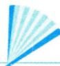
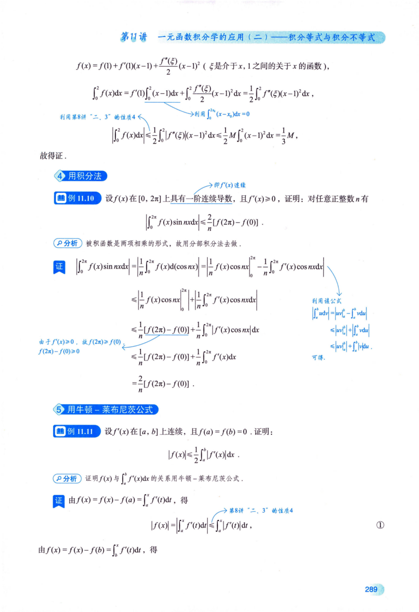

## 第11讲 一元数学的应不

<table><tr><td rowspan=1 colspan=1>考题</td><td rowspan=1 colspan=1>积分等式、积分不等式的求法</td></tr><tr><td rowspan=1 colspan=1>题型</td><td rowspan=1 colspan=1>解答题</td></tr><tr><td rowspan=1 colspan=1>目标</td><td rowspan=1 colspan=1>①掌握定积分中值定理，掌握用夹逼准则求一类积分极限与证明某些特殊的积分等式；②掌握函数单调性、拉格朗日中值定理、泰勒公式、换元积分法与分部积分法、牛顿－莱布尼茨公式，并会证明积分形式的不等式</td></tr><tr><td rowspan=1 colspan=1>重难点</td><td rowspan=1 colspan=1>①求积分；②积分后求极限</td></tr></table>

## 基础知识结构

## 基础内容精讲

积分等式问题主要涉及积分形式的中值定理(见例11.1，例11.2)，用夹逼准则求一类积分的极限(见例11.3\~11.5)与证明某些特殊的积分等式[见例11.6(1)]；积分不等式问题主要涉及积分形式的不等式

证明，可用函数的单调性(见例11.7)、拉格朗日中值定理(见例11.8)、泰勒公式(见例11.9)、积分法(见例11.10)与牛顿-莱布尼茨公式(见例11.11)来解决.

## 积分等式

## 用中值定理

g(x)恒正、恒负或恒为0

例11.1 (1)设f(x),g(x)在[a,b]上连续，且g(x)在[a,b]上不变号，证明：存在 $\xi \in (a,   b)$ ，使得

$\int_{a}^{b} f(x) g(x) \mathrm{d}x = f(\xi) \int_{a}^{b} g(x) \mathrm{d}x ;$ 推广的积分中值定理（考试可直接使用）

当 $g(x) = 1 > 0$ 时，即 V $\int_{a}^{b} f(x) \mathrm{d}x = f(\xi)(b - a)$ ，ξ∈[a，b](积分中值定理）

★★★★(2)设f(x)在[1，2]上连续，计算 $\lim_{n \to \infty} \int_{1}^{2} f(x) e^{-x^n}   dx \quad > \quad \lim_{n \to \infty} \int_{a}^{b} \varphi \int_{a}^{b} \lim_{n \to \infty}$

(1)证若g(x)≡0，结论显然成立；

若 $g ( x ) \neq 0$ ，由于不变号，不妨设 $g(x) > 0$ .令

$$
F(x)=\int_{a}^{x}f(t)g(t)\mathrm{d}t,\;G(x)=\int_{a}^{x}g(t)\mathrm{d}t,
$$

在[a，b]上应用柯西中值定理，有 $\frac{F(b) - F(a)}{G(b) - G(a)} = \frac{F^{\prime}(\xi)}{G^{\prime}(\xi)}$ ，即活田于西个品数 适用于两个函数

$$
\frac{\int_{a}^{b} f(x) g(x) \mathrm{d} x - 0}{\int_{a}^{b} g(x) \mathrm{d} x - 0} = \frac{f(\xi) g(\xi)}{g(\xi)} = f(\xi),
$$

$$
\int _ { a } ^ { b } f ( x ) g ( x ) \mathrm { d } x = f ( \xi ) \int _ { a } ^ { b } g ( x ) \mathrm { d } x , \xi \in ( a , b ) ,
$$

其中 $\int_{a}^{b} g(x) \mathrm{d}x > 0$ .同理可得 $g(x) < 0$ 时成立. 得证.

利用积分保号性 g(x)>0 见注(2)

(2)解由(1)知， $\int_{1}^{2} f(x) \mathrm{e}^{-x^n} \mathrm{d}x = f(\xi_n) \int_{1}^{2} \mathrm{e}^{-x^n} \mathrm{d}x, \quad 1 < \xi_n < 2.$ .因f(x)在[1，2]上连续，则 $f(\xi_n)$ 有界；

又在(1，2)内， $\mathrm{e}^{x^{n}}>x^{n}+1>0$ ，即 $\frac{1}{e^{x^{n}}} < \frac{1}{x^{n} + 1} < \frac{1}{x^{n}}$ 放缩法见第2讲“6.夹逼准则”的注(2)⑩

于是

$$
0 < \int_{1}^{2}e^{-x^{n}}\mathrm{d}x < \frac{\int_{1}^{2}x^{-n}\mathrm{d}x}{1 - n} = \frac{1}{1 - n}x^{1 - n}\bigg|_{1}^{2} = \frac{1}{1 - n}(2^{1 - n} - 1)
$$

$$
\lim_{n \to \infty} \frac{1}{1 - n} \left( 2^{1 - n} - 1 \right) = 0
$$

由夹逼准则得 $\lim_{n \to \infty} \int_{1}^{2} \mathrm{e}^{-x^n}   dx = 0$ .故 $\lim_{n \to \infty} \int_{1}^{2} f(x) e^{-x^n}   dx = \lim_{n \to \infty} f(\xi_n) \lim_{n \to \infty} \int_{1}^{2} e^{-x^n}   dx = 0$ 有界×无穷小量

注(1)由于 $\xi \in (a,   b) \subset [a,   b]$ ，故闭区间上结论亦成立，即设f(x)，g(x)在[a,b]上连续且$g(x)$ 不变号，则至少存在一点 $\xi \in [a, b]$ ，使得 $\int _ { a } ^ { b } f ( x ) g ( x ) \mathrm { d } x = f ( \xi ) \int _ { a } ^ { b } g ( x ) \mathrm { d } x.$

(2) 对于 $\int_{1}^{2} f(x) \mathrm{e}^{-x^n}   dx$ 虽然上下限为常数，但被积函数 $f(x)e^{-x^{n}}$ 与n有关，故中值 $\xi_{n}$ 与n有关.同理，对于 $\int_{1}^{2} \mathrm{e}^{-x^{n}}  \mathrm{d}x$ 若写成 $\int _ { 1 } ^ { 2 } \mathrm { e } ^ { - x ^ { n } } \mathrm { d } x = \mathrm { e } ^ { - \eta _ { n } ^ { n } } , \eta _ { n } \in ( 1 , 2 ) , \eta _ { n }$ 亦与n有关，考生需注意，此时不能用 $\lim_{n \to \infty} \mathrm{e}^{-\eta_n^n} = 0.$

拓展：对于 $\int_{a}^{b} f(x) \mathrm{d}x = f(\xi)(b - a)$ ，当改变区间[a,b]→[a，x]时，ξ=ξ(x)：

当改变被积函数f(x)→f(x,n)或fn(x)(函数组)时，ξ=ξ(n).

★★例11.2设f(x)在 $\left[ 0 , \frac { \pi } { 2 } \right]$ 上有二阶导数，且 $f(0) = 2,\ f\left(\frac{\pi}{2}\right) = 1,\ \int_{0}^{\frac{\pi}{2}}f(x)\mathrm{e}^{\sin x}\cos x\mathrm{d}x =$ 2(e-1).证明：存在 $\xi \in \left(0, \frac{\pi}{2}\right)$ ，使 $f^{\prime\prime}(\xi) < 0$

证 由推广的积分中值定理知，存在 $\eta \in \left( 0, \frac{\pi}{2} \right)$ ，使得 $f(\eta)\int_{0}^{\frac{\pi}{2}}\mathrm{e}^{\sin x}\cos x\mathrm{d}x=2(\mathrm{e}-1)$

又 $\int_{0}^{\frac{\pi}{2}}\mathrm{e}^{\sin x}\cos x\mathrm{d}x=\mathrm{e}^{\sin x}\bigg|_{0}^{\frac{\pi}{2}}=\mathrm{e}-1$ ，于是 $f(\eta) \cdot (\mathrm{e} - 1) = 2(\mathrm{e} - 1)$ ，即存在 $\eta \in \left( 0, \frac{\pi}{2} \right)$ ，使得 $f(\eta) = 2$

因 $f(0) = f(\eta) = 2$ .由罗尔定理知，存在 $\xi_{1} \in (0, \eta)$ ，使得 $f^{\prime}(\xi_{1}) = 0$ .又因为 $f\left(\frac{\pi}{2}\right)=1,\ f(\eta)\neq f\left(\frac{\pi}{2}\right)$ 由拉格朗日中值定理知，存在 $\xi_{2} \in \left( \eta, \frac{\pi}{2} \right)$ ，使得 罗 拉0 ξ1

$$
f^{\prime}(\xi_{2}) = \frac{f\left(\frac{\pi}{2}\right) - f(\eta)}{\frac{\pi}{2} - \eta} = \frac{1 - 2}{\frac{\pi}{2} - \eta} < 0
$$

拓展： $f(a) = f(b) = f(c)$ ，用三次罗尔定 a b C f'(ξ) =f'(ξ2) =0. f"(ξ)=0.

若 $f(a) \neq f(b) \neq f(c)$ ，用三次拉格朗日中值定理。 a C 由 $f^{\prime}(\xi_1) < 0, f^{\prime}(\xi_2) > 0$ ，由 $f^{\prime}(\xi_1) > 0, f^{\prime}(\xi_2) < 0$ 得 $f''(\xi) > 0$ 得 $f ^ { \prime \prime } ( \xi )   <   0$ (习题11.1)

再由拉格朗日中值定理知，存在 $\xi \in (\xi_1, \xi_2) \subset \left(0, \frac{\pi}{2}\right)$ ，使得 $f^{\prime\prime}(\xi) = \frac{f^{\prime}(\xi_2) - f^{\prime}(\xi_1)}{\xi_2 - \xi_1} < 0$

## 2 用夹逼准则

例11.3 $\lim_{n \to \infty} \int_{0}^{1} (n + 1)x^{n} \ln(1 + x) \mathrm{d}x = ( \quad )$

(A) ln 2

(B) 1

(C) $\mathsf { e } ^ { 2 }$

解 应选(A).

(D) $+ \infty$

$$
\int_{0}^{1} \frac{x^{n + 1}}{(n + 1)x^{n}\ln(1 + x)} \mathrm{d}x = \int_{0}^{1} \ln(1 + x)\mathrm{d}(x^{n + 1}) \\= \left. x^{n + 1}\ln(1 + x) \right|_{0}^{1} - \int_{0}^{1} \frac{x^{n + 1}}{1 + x} \mathrm{d}x \\= \ln 2 - \int_{0}^{1} \frac{x^{n + 1}}{1 + x} \mathrm{d}x,
$$

对于 $\lim_{n \to \infty} \int_{0}^{1} \frac{x^{n+1}}{1+x}   dx$ ,利用放缩法. 由于 $0 \leqslant \frac{x^{n + 1}}{1 + x} \leqslant x^{n + 1}, 0 \leqslant x \leqslant 1$ ，故

$$
0 \leqslant \int_{0}^{1} \frac{x^{n + 1}}{1 + x} \mathrm{d}x \leqslant \int_{0}^{1} x^{n + 1} \mathrm{d}x = \frac{1}{n + 2}
$$

当 $n \to \infty$ 时，由夹逼准则，有 $\lim_{n \to \infty} \int_{0}^{1} \frac{x^{n+1}}{1+x}   dx = 0$ .于是原式=ln2.

→ 作为第(2)问的提示

例11.4 (1) 比较 $\int_{0}^{1} \left| \ln t \right| \left[ \ln(1 + t) \right]^{n} \mathrm{d}$ lt与 $\int _ { 0 } ^ { 1 } t ^ { n } \left| \ln t \right| \mathrm { d } t ( n = 1 , 2 , \cdots )$ 的大小，说明理由；

(2)记 $u_{n} = \int_{0}^{1} \left| \ln t \right| \left[ \ln(1 + t) \right]^{n} \mathrm{d}t (n = 1, 2, \cdots)$ ，求 $\lim_{n \to \infty} u_n \to$ 典型考研命题形式

解（1)当 $0 \leqslant t \leqslant 1$ 时， $0 \leqslant \ln(1 + t) \leqslant t$ ，则 $0 \leqslant \left[ \ln(1 + t) \right]^n \leqslant t^n$ ，两边同时乘以lnt，有

$$
0 \leqslant \left| \ln t \right| \left[ \ln (1 + t) \right]^n \leqslant t^n \left| \ln t \right| ,
$$

根据积分的保号性，得

$$
\int _ { 0 } ^ { 1 } \left| \ln t \right| \left[ \ln ( 1 + t ) \right] ^ { n } \mathrm { d } t \leqslant \int _ { 0 } ^ { 1 } t ^ { n } \left| \ln t \right| \mathrm { d } t .
$$

(2)由(1)知，

$$
0 \leqslant u _ { n } = \int _ { 0 } ^ { 1 } \left| \ln t \right| \left[ \ln ( 1 + t ) \right] ^ { n } \mathrm{d}t \leqslant \int _ { 0 } ^ { 1 } t ^ { n } \left| \ln t \right| \mathrm{d}t .
$$

$$
\int_{0}^{1}t^{n}\left|\ln t\right|dt=-\int_{0}^{1}t^{n}\overbrace{\ln t}dt=-\frac{1}{n+1}\left|\ln t\right|_{0}^{1}+\frac{1}{n+1}\int_{0}^{1}t^{n}dt=0+\frac{1}{n+1}\left|\frac{\ln t}{n+1}\right|_{0}^{1}+\frac{1}{(n+1)^{2}}\left|\ln t\right|_{0}^{1}=\frac{1}{(n+1)^{2}}
$$

所以 $\lim _ { n \rightarrow \infty } \int _ { 0 } ^ { 1 } t ^ { n } \left| \ln t \right| \mathrm { d } t = 0$ ，于是由夹逼准则得 $\lim_{n \to \infty} u_n = 0$

注更为一般的结论：设f(x)在[0,1]上连续，则 $\lim _ { n \rightarrow \infty } \int _ { 0 } ^ { 1 } x ^ { n } f ( x ) \mathrm { d } x = 0$

证 由f(x)在[0,1]上连续，则f(x)在[0,1]上有最大值M和最小值m，即 $m \leq f(x) \leq M$ ，于是$mx^{n} \leqslant x^{n}f(x) \leqslant Mx^{n}$ .根据积分的保号性，有 $\int_{0}^{1}mx^{n}\mathrm{d}x \leqslant \int_{0}^{1}x^{n}f(x)\mathrm{d}x \leqslant \int_{0}^{1}Mx^{n}\mathrm{d}x$ 即 $\frac{m}{n + 1} \leqslant \int_{0}^{1}x^{n}f(x)\mathrm{d}x \leqslant$ $\frac{M}{n + 1}$ .根据夹逼准则，有 $\lim _ { n \rightarrow \infty } \int _ { 0 } ^ { 1 } x ^ { n } f ( x ) \mathrm { d } x = 0$

如例 11.4 中所取的 $f(x)=\begin{cases}x\left|\ln x\right|,&0<x\leqslant1,\\0,&x=0,\end{cases}$ 则有 $\lim_{n \to \infty} \int_{0}^{1} x^{n-1} x \left| \ln x \right| \mathrm{d}x = \lim_{n \to \infty} \int_{0}^{1} x^n \left| \ln x \right| \mathrm{d}x = 0.$

例11.5 设函数f(x)=x-[x]，其中[x]表示不超过x的最大整数，则 $\lim_{x \to +\infty} \frac{1}{x} \int_{0}^{x} f(t)   dt =$ 分析 $\lim_{x \to +\infty} \frac{\int_{0}^{x} f(t)   dt}{x} \left( \frac{\infty}{\infty} \right)$ 不能用洛必达法则，因为包含跳跃间断点的函数f(x)无原函数.

解应填 $\frac { 1 } { 2 }$

由例1.13可知f(x)是周期为1的周期函数，其图像如图11-1所示.

$\int_{0}^{n} f(t) \mathrm{d}t = n \int_{0}^{1} f(t) \mathrm{d}t$ ，表示n个三角形的面积.每个三角形的面积为 $\frac{1}{2}$ ，故为 $\frac { \pi } { 2 }$ 7

  
图 11-1

→分子的取值范围

I当 $\frac{n \leq x < n + 1}{ 丿 }$ ，即 $\frac{1}{n + 1} < \frac{1}{x} \leq \frac{1}{n}$ 时， $\frac{n}{2}=\int_{0}^{n}f(t)\mathrm{d}t\leqslant\int_{0}^{x}f(t)\mathrm{d}t<\int_{0}^{n+1}f(t)\mathrm{d}t=\frac{n+1}{2}$ ，于是

分母的取值范围

$$
\frac{n}{2(n + 1)} = \frac{1}{n + 1}\int_{0}^{n}f(t)dt < \frac{1}{x}\int_{0}^{x}f(t)dt < \frac{1}{n}\int_{0}^{n + 1}f(t)dt = \frac{n + 1}{2n}
$$

当 $0<a<y<b, 0<c<x<d$ 时，当 $x \to + \infty$ 时，n→∞，由夹逼准则，有 $\lim_{x \to +\infty} \frac{1}{x} \int_{0}^{x} f(t)   dt = \frac{1}{2}$ 有 $\frac{a}{d} < \frac{y}{x} < \frac{b}{c}$

## ③用积分法→恒等变形、换元法、分部积分法

例11.6设f(x)的二阶导数f"(x)在[0,1]上连续，且f(0)=f(1)=0，证明：

(1) $\int_{0}^{1} f(x) \mathrm{d}x = \frac{1}{2} \int_{0}^{1} x(x - 1) f''(x) \mathrm{d}x$

(2) $\left| \int_{0}^{1} f(x) \mathrm{d}x \right| \leqslant \frac{1}{12} \max_{0 \leqslant x \leqslant 1} \left\{ \left| f''(x) \right| \right\}$

分析第(1)问出现函数和函数的二阶导数，用两次分部积分法.

证(1) $\frac{1}{2}\int_{0}^{1}x(x - 1)f^{\prime\prime}(x)\mathrm{d}x = \frac{1}{2}\int_{0}^{1}x(x - 1)\mathrm{d}\left\lbrack \frac{f^{\prime}(x)}{y} \right\rbrack^{- 1}$ 分部积分法： $\int u \mathrm{d}v = uv - \int v \mathrm{d}u.$

$$
\begin{aligned}= & \frac{1}{2}x(x - 1)f^{\prime}(x)\bigg|_{0}^{1} - \frac{1}{2}\int_{0}^{1}f^{\prime}(x)\overbrace{(2x - 1)\mathrm{d}x}^{ 凑微今法 } \\= & - \frac{1}{2}\int_{0}^{1}(2x - 1)\mathrm{d}\left[ f(x) \right] \\= & - \frac{1}{2}(2x - 1)f(x)\bigg|_{0}^{1} + \int_{0}^{1}f(x)\mathrm{d}x\end{aligned}
$$

由条件f(0)=f(1)=0，知结论成立.

(2)记 $M = \max_{0 \leq x \leq 1} \left\{ \left| f''(x) \right| \right\}$ ，则由(1)有

$$
\left| \int_{0}^{1} f(x) \mathrm{d}x \right| = \frac{1}{2} \left| \int_{0}^{1} x(x-1) f''(x) \mathrm{d}x \right| \leqslant \frac{1}{2} \left| \int_{0}^{1} x(x-1) \right| \left| f''(x) \right| \mathrm{d}x \leqslant \frac{M}{2} \int_{0}^{1} x(1-x) \mathrm{d}x = \frac{M}{2} \left( \frac{1}{2} - \frac{1}{3} \right) = \frac{M}{12}
$$

得证.

利用第8讲“二、3”的性质4

## 积分不等式

## 1用函数的单调性

通常的做法：首先将某一积分限(通常取上限)变量化，然后移项构造辅助函数，由辅助函数的单调性来证明不等式，此方法多用于所给条件为 $ \text{" } f(x)$ 在[a,b]上连续”的情形. g(x)有界

★★★例11.7 设函数f(x)，g(x)在区间[a，b]上连续，且f(x)单调增加， $0 \leq g(x) \leq 1$ .证明：

(1) $0 \leqslant \int_{a}^{x}g(t)\mathrm{d}t \leqslant x - a,\;x \in \left [ a,\;b \right ]$ i

(2) $\int_{a}^{a + \int_{a}^{b}g(t)\mathrm{d}t}f(x)\mathrm{d}x \leqslant \int_{a}^{b}f(x)g(x)\mathrm{d}x$

分析（1)中，因为 $a   \leqslant   x$ ，所以 $\int_{a}^{x}g(t)\mathrm{d}t$ 是正向的积分，可直接用积分的保号性；

(2)中，该题是考研以来上限较复杂的定积分，做题时要注意形式的复杂性.

证(1)因为 $0 \leqslant g(x) \leqslant 1$ ，所以当 $x   \in   [ a   ,   b ]$ 时，有 $\int_{a}^{x} 0 \mathrm{d}t \leqslant \int_{a}^{x} g(t) \mathrm{d}t \leqslant \int_{a}^{x} 1 \mathrm{d}t.$ ，即

$$
0 \leqslant \int_{a}^{x} g(t) \mathrm{d}t \leqslant x - a .
$$

(2)令 $F(x)=\int_{a}^{a+\int_{a}^{x}g(u)du}f(t)dt-\int_{a}^{x}f(t)g(t)dt,\ x\in[a,b]$ 三个变量要区分开

因为f(x)，g(x)在区间[a,b]上连续，所以F(x)在区间[a,b]上可导，且

$$
F ^ { \prime } ( x ) = f \left[ a + \int _ { a } ^ { x } g ( u ) \mathrm { d } u \right] g ( x ) - f ( x ) g ( x ) = \left\{ f \left[ a + \int _ { a } ^ { x } g ( u ) \mathrm { d } u \right] - f ( x ) \right\} g ( x ) .
$$

由(1)知， $\int_{a}^{x} g(u)   du \leq x - a$ ，即 $a + \int_{a}^{x} g(u) \mathrm{d}u \leqslant x, \; x \in [a,   b]$ .又因为f(x)单调增加，且 $g(x) \geqslant 0$ 所以 $F^{\prime}(x) \leqslant 0$ ，从而F(x)在区间[a,b]上单调减少. y又 $F(a) = 0$ ，故 $F(b) \leqslant 0$ ，即 $\int_{a}^{a + \int_{a}^{b}g(t)\mathrm{d}t}f(x)\mathrm{d}x \leqslant \int_{a}^{b}f(x)g(x)\mathrm{d}x.$ 0 a 6x 减且F(a)=0 F(x)单调递

## 2用拉格朗日中值定理

## →这是由拉格朗日中值定理的条件决定的

此方法多用于所给条件为 $ \text{" }f(\overset{\frown}{x})$ 一阶可导”且某一端点值较简单(甚至为0)的题目.

例11.8 设f(x)在[0,1]上具有一阶连续导数，且 $f(0) = f(1) = 0$ .记 $M = \max_{x \in [0,1]} \left\{ \left| f^{\prime}(x) \right| \right\}$ .证明：$ 夹见到  f(x) , f^{\prime}(x)$ ，想拉格朗日中值定理 $\left| \int_{0}^{1} f(x) \mathrm{d}x \right| \leq \frac{1}{4} M$ →即f'(x)连续

证 将大区间[0,1]分成两个小区间[0，x]和[x，1].

在[0，x]上对f(x)使用拉格朗日中值定理，得 $f(x) - f(0) = f(x) = f^{\prime}(\xi_1)x$ ，其中 $\xi_{1} \in (0, x)$ ，于是0 ξ1 x $\left| f(x) \right| = \left| f^{\prime}(\xi_1) \right| x$

在[x,1]上对f(x)使用拉格朗日中值定理，得 $f(1)-f(x)=-f(x)=f^{\prime}(\xi_{2})(1-x)$ ，其中 $\xi_{2} \in (x,1)$ 于是 $\left| f(x) \right| = \left| f^{\prime}(\xi_2) \right| (1 - x)$

当x∈[0,1]时，因为 $M = \max \left\{ \left| f^{\prime}(x) \right| \right\}$ ，所以

$$
\left| f(x) \right| \leqslant Mx,\ \left| f(x) \right| \leqslant M(1-x),
$$

于是

利用不等式|a+b≤|a|+|b，见第2讲“6.夹逼准则”的注(2)①

$$
\begin{aligned}\left| \int_{0}^{1} f(x) \mathrm{d}x \right| = & \left| \int_{0}^{x} f(t) \mathrm{d}t + \int_{x}^{1} f(t) \mathrm{d}t \right| \leq \left| \int_{0}^{x} f(t) \mathrm{d}t \right| + \left| \int_{x}^{1} f(t) \mathrm{d}t \right| \leq \left| \int_{0}^{x} \left| f(t) \right| \mathrm{d}t + \int_{x}^{1} \left| f(t) \right| \mathrm{d}t \right| \\\leq & M \int_{0}^{x} t \mathrm{d}t + M \int_{x}^{1} (1 - t) \mathrm{d}t = M \left[ \frac{x^2}{2} + \frac{(1 - x)^2}{2} \right],\end{aligned}
$$

其中， $\frac{x^{2}}{2}+\frac{(1-x)^{2}}{2}=x^{2}-x+\frac{1}{2}=\left(x-\frac{1}{2}\right)^{2}+\frac{1}{4}\geqslant\frac{1}{4}$ ，故得证.

## ③用泰勒公式

此方法多用于所给条件为“f(x)二阶可导”且题中有简单函数值(甚至为0)的题目.

例11.9 设f(x)在[0，2]上二阶导数连续，且f(1)=0.当 $x \in [0,   2]$ 时，记 $M = \max \left\{ \left| f''(x) \right| \right\}$ ，证明： $\left| \int_{0}^{2} f(x) \mathrm{d}x \right| \leq \frac{1}{3} M$ 即f"(x)连续

分析当无法用牛顿-莱布尼茨公式时，可考虑用泰勒公式将被积函数f(x)展开成多项式再做.

证根据题设，选取点 $x_{0} = 1$ 展开成泰勒公式，则

$f(x) = f(1) + f'(1)(x - 1) + \frac{f''(\xi)}{2}(x - 1)^2$ (ξ是介于x,1之间的关于x的函数)，

$$
\int _ { 0 } ^ { 2 } f ( x ) \mathrm { d } x = f ^ { \prime } ( 1 ) \int _ { 0 } ^ { 2 } ( x - 1 ) \mathrm { d } x + \int _ { 0 } ^ { 2 } \frac { f ^ { \prime \prime } ( \xi ) } { 2 } ( x - 1 ) ^ { 2 } \mathrm { d } x = \frac { 1 } { 2 } \int _ { 0 } ^ { 2 } f ^ { \prime \prime } ( \xi ) ( x - 1 ) ^ { 2 } \mathrm { d } x ,
$$

利用第8讲“二、 $3 ^ { \circ }$ 的性质4

>利用 $\int_{0}^{2x_{0}} (x - x_{0}) \mathrm{d}x = 0$

$$
\left| \int_{0}^{2} f(x) \mathrm{d}x \right| \leqslant \frac{1}{2} \int_{0}^{2} \left| f''(\xi) \right| (x-1)^2 \mathrm{d}x \leqslant \frac{1}{2} M \int_{0}^{2} (x-1)^2 \mathrm{d}x = \frac{1}{3} M,
$$

故得证.

## 用积分法

例11.10 设f(x)在[0,2π]上具有一阶连续导数，且 $f^{\prime}(x) \geqslant 0$ ，证明：对任意正整数n有

$$
\left| \int_{0}^{2\pi} f(x) \sin nx   dx \right| \leqslant \frac{2}{n} \left[ f(2\pi) - f(0) \right] .
$$

分析被积函数是两项相乘的形式，故用分部积分法去做.

$$
\begin{aligned} \begin{aligned}\left| \int_{0}^{2\pi} f(x) \sin nx \mathrm{d}x \right| = \left| \frac{1}{n} \int_{0}^{2\pi} f(x) \mathrm{d}(\cos nx) \right| \leqslant \left| f(2\pi) \right| \geqslant 0 \left( 0 \right) \leqslant \left| f(2\pi) \right| \geqslant 0 \left( 0 \right) \leqslant \left| \frac{1}{n} f(2\pi) \right| \leqslant \left| \frac{1}{n} \int_{0}^{2\pi} f(x) \cos nx \right| \leqslant \left| \frac{1}{n} \int_{0}^{2\pi} f^{\prime}(x) \cos nx \mathrm{d}x \right| \\\leqslant \left| \frac{1}{n} f(x) \cos nx \right| \leqslant \left| \frac{1}{n} f(2\pi) \right| \geqslant 0 \left( 0 \right) \leqslant \left| \frac{1}{n} f(2\pi) \right| \geqslant f(0) \end{aligned} 由于  f^{\prime}(x) \geqslant 0  , 故  f(2\pi) \geqslant 0  , 故  f(2\pi) \geqslant f(0) \leqslant \left| \frac{1}{n} \right| \leqslant \frac{1}{n} \int_{0}^{2\pi} f^{\prime}(x) \left| \frac{1}{n} \right| \frac{1}{n} \int_{0}^{2\pi} f^{\prime}(x) \left| f^{\prime}(x) \cos nx \right| \mathrm{d}x \end{aligned} 有周  \begin{aligned}\left| \int_{0}^{\frac{\pi}{n}} \mathrm{d}x \right| \leqslant \left| \frac{1}{n} \right| \mathrm{d}x \\\left| \int_{0}^{\frac{\pi}{n}} \mathrm{d}x \right| \left| \mathrm{d}x \right| \left| \mathrm{d}x \right| \leqslant \left| \frac{1}{n} \right| \mathrm{d}x \left| \mathrm{d}x \right| \leqslant \left| \frac{1}{n} \right| \mathrm{d}x \left| \mathrm{d}x \right| \leqslant \left| \frac{1}{n} \right| \mathrm{d}x \left| \mathrm{d}x \right| \left| \mathrm{d}x \right| \leqslant \left| \frac{1}{n} \right| \mathrm{d}x \left| \mathrm{d}x \right| \leqslant \left| \frac{1}{n} \right| \mathrm{d}x \left| \mathrm{d}x \right| \end{aligned}
$$

<!-- DIRECTED-REPAIR-FALLBACK:FALLBACK-HIGH-CH11-P295-EXAMPLE11-10-PROOF -->
> [!WARNING]
> 原 PDF 第 295 页回退：例11.10分部积分证明的关键等式和不等式估计链整体损坏，无法安全转写。

## 5 用牛顿－莱布尼茨公式

例11.11 设f'(x)在[a，b]上连续，且 $f(a) = f(b) = 0$ .证明：

$$
\left| f ( x ) \right| \leqslant \frac { 1 } { 2 } \int _ { a } ^ { b } \left| f ^ { \prime } ( x ) \right| \mathrm { d } x .
$$

分析证明f(x)与 $\int_{a}^{b} f^{\prime}(x) \mathrm{d}x$ 的关系用牛顿-莱布尼茨公式

证由 $f(x) = f(x) - f(a) = \int_{a}^{x} f^{\prime}(t) \mathrm{d}t$ ，得

$$
3 ^ { \circ }
$$

$$
\left| f ( x ) \right| = \left| \int _ { a } ^ { x } f ^ { \prime } ( t ) \mathrm { d } t \right| \leqslant \int _ { a } ^ { x } \left| f ^ { \prime } ( t ) \right| \mathrm { d } t ,\tag{①}
$$

由 $f(x) = f(x) - f(b) = \int_{b}^{x} f^{\prime}(t) \mathrm{d}t$ ，得

→第8讲“二、3”的性质4

$$
\left| f(x) \right| = \left| \int_{b}^{x} f^{\prime}(t) \mathrm{d}t \right| = \left| \int_{x}^{b} f^{\prime}(t) \mathrm{d}t \right| \leqslant \int_{x}^{b} \left| f^{\prime}(t) \right| \mathrm{d}t .\tag{②}
$$

式① + 式②，得 $2 \left| f(x) \right| \leqslant \int_{a}^{x} \left| f^{\prime}(t) \right| \mathrm{d}t + \int_{x}^{b} \left| f^{\prime}(t) \right| \mathrm{d}t = \int_{a}^{b} \left| f^{\prime}(t) \right| \mathrm{d}t$ ，即

$$
\left| f ( x ) \right| \leqslant \frac { 1 } { 2 } \int _ { a } ^ { b } \left| f ^ { \prime } ( x ) \right| \mathrm { d } x .
$$

## 基础习题精练

## 习题

11.1 若函数φ(x)具有二阶导数，且满足 $\varphi(2) > \varphi(1), \; \varphi(2) > \int_{2}^{3} \varphi(x) \mathrm{d}x$ ，证明：至少存在一点 $\xi \in$ (1,3)，使得 $\varphi''(\xi) < 0$

11.2 证明： $\int_{0}^{\frac{\pi}{2}}\frac{\cos x}{1 + x^{2}}\mathrm{d}x \geq \int_{0}^{\frac{\pi}{2}}\frac{\sin x}{1 + x^{2}}\mathrm{d}x$

11.3 设φ(x)是可微函数f(x)的反函数，且 $f(1) = 0$ ，证明：

$$
\int _ { 0 } ^ { 1 } \left[ \int _ { 0 } ^ { f ( x ) } \varphi ( t ) \mathrm { d } t \right] \mathrm { d } x = 2 \int _ { 0 } ^ { 1 } x f ( x ) \mathrm { d } x .
$$

11.4 设f(x)在[a,b]上连续且严格单调增加，证明：

$$
(a + b)\int_{a}^{b}f(x)\mathrm{d}x < 2\int_{a}^{b}xf(x)\mathrm{d}x .
$$

11.5 设f'(x)在[0，a]上连续，且f(0)=0，证明：

$$
\left| \int_{0}^{a} f(x) \mathrm{d}x \right| \leq \frac{Ma^{2}}{2}
$$

其中 $M = \max_{0 \leq x \leq a} |f'(x)|$

11.6 设f(x)在区间[0,1]上有二阶导数，且 $f\left(\frac{1}{2}\right)=1, f''(x)>0$ ，证明： $\int_{0}^{1} f(x) \mathrm{d}x \geqslant 1$

## 解答

11.1 证明 由积分中值定理，可知至少存在一点 $\eta \in (2,   3]$ ，使得

$$
\int _ { 2 } ^ { 3 } \varphi ( x ) \mathrm { d } x = \varphi ( \eta ) ( 3 - 2 ) = \varphi ( \eta ) .
$$

对φ(x)在[1，2]和[2，η]上分别应用拉格朗日中值定理，并注意到 $\varphi(1) < \varphi(2), \; \varphi(\eta) < \varphi(2)$ ，得

$$
\varphi ^ { \prime } ( \xi _ { 1 } ) = \frac { \varphi ( 2 ) - \varphi ( 1 ) } { 2 - 1 } > 0 , 1 < \xi _ { 1 } < 2 ,
$$

$$
\varphi ^ { \prime } ( \xi _ { 2 } ) = \frac { \varphi ( \eta ) - \varphi ( 2 ) } { \eta - 2 } < 0 , 2 < \xi _ { 2 } < \eta \leqslant 3 .
$$

在 $\left[ \xi _ { 1 } ,   \xi _ { 2 } \right]$ 上对导函数φ′(x)应用拉格朗日中值定理，有

$$
\varphi ^ { \prime } ( \xi ) = \frac { \varphi ^ { \prime } ( \xi _ { 2 } ) - \varphi ^ { \prime } ( \xi _ { 1 } ) } { \xi _ { 2 } - \xi _ { 1 } } < 0 , \xi \in ( \xi _ { 1 } , \xi _ { 2 } ) \subset ( 1 , 3 ) .
$$

11.2 证明 要证原不等式成立，只需证 $\int_{0}^{\frac{\pi}{2}}\frac{\cos x-\sin x}{1+x^{2}}\mathrm{d}x\geqslant0$

方法一 $\int_{0}^{\frac{\pi}{2}}\frac{\cos x-\sin x}{1+x^{2}}\mathrm{d}x=\int_{0}^{\frac{\pi}{4}}\frac{\cos x-\sin x}{1+x^{2}}\mathrm{d}x+\int_{\frac{\pi}{4}}^{\frac{\pi}{2}}\frac{\cos x-\sin x}{1+x^{2}}\mathrm{d}x$

在上式右边第二项积分中，令 $x = \frac{\pi}{2} - t$ ，得

$$
\int_{0}^{\frac{\pi}{2}}\frac{\cos x-\sin x}{1+x^{2}}\mathrm{d}x=\int_{0}^{\frac{\pi}{4}}\frac{\cos x-\sin x}{1+x^{2}}\mathrm{d}x+\int_{0}^{\frac{\pi}{4}}\frac{\sin t-\cos t}{1+\left(\frac{\pi}{2}-t\right)^{2}}\mathrm{d}t
$$

故原式得证.

方法二

$$
\begin{aligned} &\int_{0}^{\frac{\pi}{2}}\frac{\cos x-\sin x}{1+x^{2}}\mathrm{d}x \\=&\int_{0}^{\frac{\pi}{4}}\frac{\cos x-\sin x}{1+x^{2}}\mathrm{d}x+\int_{\frac{\pi}{4}}^{\frac{\pi}{2}}\frac{\cos x-\sin x}{1+x^{2}}\mathrm{d}x \\=&\frac{1}{1+\xi^{2}}\int_{0}^{\frac{\pi}{4}}(\cos x-\sin x)\mathrm{d}x+\frac{1}{1+\eta^{2}}\int_{\frac{\pi}{4}}^{\frac{\pi}{2}}(\cos x-\sin x)\mathrm{d}x \\=&(\sqrt{2}-1)\left(\frac{1}{1+\xi^{2}}-\frac{1}{1+\eta^{2}}\right),\end{aligned}
$$

其中 $0 \leqslant \xi \leqslant \frac{\pi}{4}, \frac{\pi}{4} \leqslant \eta \leqslant \frac{\pi}{2}$ ，从而有

$$
\int _ { 0 } ^ { \frac { \pi } { 2 } } \frac { \cos x - \sin x } { 1 + x ^ { 2 } }   dx \geqslant 0 ,
$$

故原式得证.

11.3 分析 左端定积分的被积函数为变限积分，考虑分部积分法.

证明

$$
\begin{aligned}\int_{0}^{1}\left[\int_{0}^{f(x)} \varphi(t) \mathrm{d} t\right] \mathrm{d} x &= x \int_{0}^{f(x)} \varphi(t) \mathrm{d} t \bigg|_{0}^{1} - \int_{0}^{1} x \varphi[f(x)] \cdot f^{\prime}(x) \mathrm{d} x \\&= - \int_{0}^{1} x^{2} \cdot f^{\prime}(x) \mathrm{d} x = - \int_{0}^{1} x^{2} \mathrm{d}[f(x)] \\&= - x^{2} f(x) \bigg|_{0}^{1} + 2 \int_{0}^{1} x f(x) \mathrm{d} x = 2 \int_{0}^{1} x f(x) \mathrm{d} x .\end{aligned}
$$

11.4 分析 $(a + b)\int_{a}^{b}f(x)\mathrm{d}x < 2\int_{a}^{b}xf(x)\mathrm{d}x \Leftrightarrow (a + b)\int_{a}^{b}f(x)\mathrm{d}x - 2\int_{a}^{b}xf(x)\mathrm{d}x < 0$ ，可构造辅助函数，用单调性证明.

证明令 $F(t)=(a+t)\int_{a}^{t}f(x)\mathrm{d}x-2\int_{a}^{t}xf(x)\mathrm{d}x,\;t\in[a,\;b]$ ，则

$$
\begin{aligned}F^{\prime}(t) = & \int_{a}^{t}f(x)\mathrm{d}x + (a + t)f(t) - 2tf(t) = \int_{a}^{t}f(x)\mathrm{d}x - (t - a)f(t) \\= & \int_{a}^{t}f(x)\mathrm{d}x - \int_{a}^{t}f(t)\mathrm{d}x = \int_{a}^{t}[f(x) - f(t)]\mathrm{d}x .\end{aligned}
$$

因为 $f(x)$ 在 $\left[ a , b \right]$ 上严格单调增加，所以 $f(x) - f(t) < 0$ ，于是有

$$
F^{\prime}(t)=\int_{a}^{t}\left[f(x)-f(t)\right]\mathrm{d}x<0,
$$

即 $F(t)  严$ 格单调减少，又 $F(a) = 0$ ，所以 $F(b) < 0$ ，即

$$
(a + b)\int_{a}^{b}f(x)\mathrm{d}x - 2\int_{a}^{b}xf(x)\mathrm{d}x < 0,
$$

即

$$
(a + b)\int_{a}^{b}f(x)\mathrm{d}x < 2\int_{a}^{b}xf(x)\mathrm{d}x .
$$

11.5 证明 方法一 任取 $x \in (0,   a]$ ，由微分中值定理有

$$
f(x)-f(0)=f^{\prime}(\xi)x,\ \xi\in(0,x)
$$

又因 $f(0) = 0$ ，故 $f(x) = f^{\prime}(\xi)x, \; x \in (0, a]$ ，于是

$$
\left| \int_{0}^{a} f(x) \mathrm{d}x \right| = \left| \int_{0}^{a} f^{\prime}(\xi) x \mathrm{d}x \right| \leqslant \int_{0}^{a} \left| f^{\prime}(\xi) \right| x \mathrm{d}x \leqslant M \int_{0}^{a} x \mathrm{d}x = \frac{M}{2} a^{2} .
$$

方法二 设 $x \in [0,   a]$ ，由 $f(0) = 0$ 知

$$
\int _ { 0 } ^ { x } f ^ { \prime } ( t ) \mathrm { d } t = f ( x ) - f ( 0 ) = f ( x ) ,
$$

于是

$$
\left| f ( x ) \right| = \left| \int _ { 0 } ^ { x } f ^ { \prime } ( t ) \mathrm { d } t \right| \leqslant \int _ { 0 } ^ { x } \left| f ^ { \prime } ( t ) \right| \mathrm { d } t \leqslant \int _ { 0 } ^ { x } M \mathrm { d } t = M x ,
$$

故

$$
\left| \int_{0}^{a} f(x) \mathrm{d}x \right| \leqslant \int_{0}^{a} \left| f(x) \right| \mathrm{d}x \leqslant \int_{0}^{a} M x \mathrm{d}x = \frac{M a^{2}}{2} .
$$

注对积分 $\left| \int_{0}^{a} f(x) \mathrm{d}x \right|$ 作估计，只要对被积函数f(x)作估计即可.条件中给出导数f'(x)及$f(0) = 0$ 的信息，自然想办法把f(x)和f'(x)联系起来.在高等数学中，联系f(x)和f'(x)有两种常用的办法，一是微分学中的拉格朗日中值定理(方法一),二是积分学中的牛顿–莱布尼茨公式(方法二).

11.6 证明

$$
f(x)=f\left(\frac{1}{2}\right)+f^{\prime}\left(\frac{1}{2}\right)\left(x-\frac{1}{2}\right)+\frac{f^{\prime\prime}(\xi)}{2!}\left(x-\frac{1}{2}\right)^{2},
$$

其中ξ介于x与 $\frac { 1 } { 2 }$ 之间.又由 $f''(x) > 0$ ，则 $f^{\prime\prime}(\xi) > 0$ ，于是

$$
f(x) \geqslant f\left(\frac{1}{2}\right) + f^{\prime}\left(\frac{1}{2}\right)\left(x - \frac{1}{2}\right)
$$

两边在区间[0,1]上对x积分，得

$$
\begin{aligned}\int_{0}^{1} f(x) \mathrm{d}x & \geqslant \int_{0}^{1} \left[ f\left(\frac{1}{2}\right) + f^{\prime}\left(\frac{1}{2}\right)\left(x - \frac{1}{2}\right) \right] \mathrm{d}x \\& = f\left(\frac{1}{2}\right) + f^{\prime}\left(\frac{1}{2}\right) \int_{0}^{1} \left(x - \frac{1}{2}\right) \mathrm{d}x = f\left(\frac{1}{2}\right) = 1\end{aligned}
$$
