<!-- DIRECTED-REPAIR-MOVE:A-MOVE-HIGH-CH14-TABLE-PREFIX -->
<table><tr><td rowspan=1 colspan=1>考题</td><td rowspan=1 colspan=1>

二重积分</td></tr><tr><td rowspan=1 colspan=1>题型</td><td rowspan=1 colspan=1>解答题</td></tr><tr><td rowspan=1 colspan=1>目标</td><td rowspan=1 colspan=1>①理解二重积分的概念，了解二重积分的基本性质，了解二重积分的中值定理；②掌握二重积分的计算方法（直角坐标、极坐标）</td></tr><tr><td rowspan=1 colspan=1>重难点</td><td rowspan=1 colspan=1>计算二重积分</td></tr></table>

## 基础知识结构

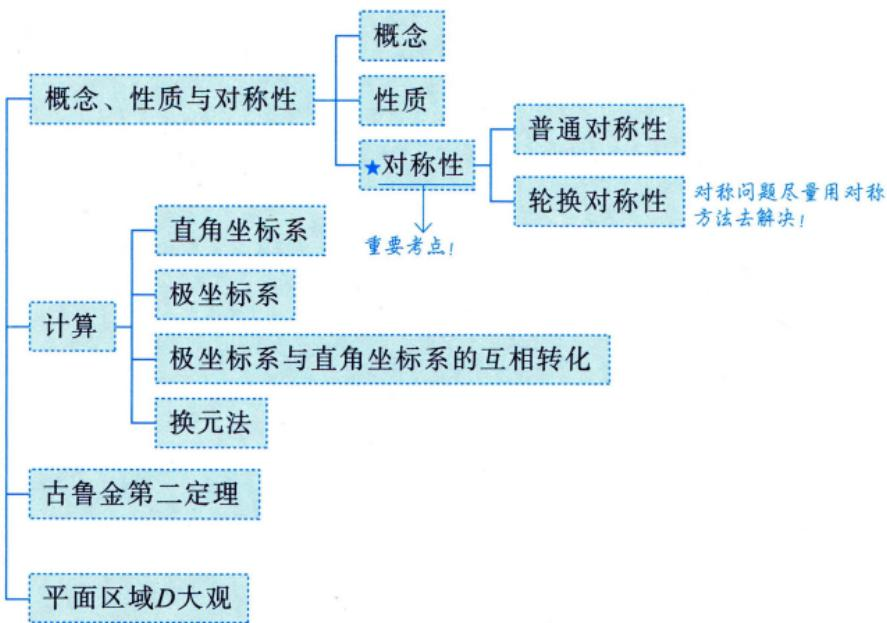

思考问题：

1. 直角坐标系中先积x，还是先积y？

2. 极坐标系r，θ谁先积？

3.极坐标系和直角坐标系如何互相转化?

→概念可以联系前面所学的定积分！

## 概念、性质与对称性

设有界函数

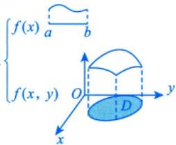

## 1概念

定积分中是对线段的分割，这按照第8讲中给出定积分定义的方法，可以得到二重积分的定义. →里是平面区域的分割！设 $f(x,   y)$ 是有界闭区域D上的有界函数，将闭区域D任意分成n个小闭区域小柱体体积的近似，定积分f(ξ)∆x是面积的近似 $\Delta \sigma_{1}, \Delta \sigma_{2}, \cdots, \Delta \sigma_{n}$

其中 $\Delta \sigma _ { i }$ 表示第i个小闭区域，也表示它的面积.在每个 $\Delta \sigma_{i}$ 上任取一点 $(\xi_{i}, \eta_{i})$ ，作乘积  
$f(\xi_i, \eta_i) \Delta \sigma_i(i = 1, 2, \cdots, n)$ ，并作和 $\sum_{i = 1}^{n} f(\xi_{i}, \eta_{i}) \Delta \sigma_{i}$ ，如果当各小闭区域的直径中的最大值λ趋于零时，→取极限  
和的极限总存在（与 $\Delta \sigma_{i}$ 的分法及点 $(\xi_{i}, \eta_{i})$ 的取法均无关），则称此极限值为函数 $f(x,y)$ 在闭区域D  
上的二重积分，记作 $\iint_{D} f(x, y) \mathrm{d}\sigma$ ，即 >定积分是 $\sum_{i = 1}^{n} f(\xi_{i}) \Delta x_{i}$ ，注意 $\Delta x _ { i }$ 的取值：要求 $\max\{\Delta x_{i}\}=\lambda\to0$ ，这里也是

$$
\iint _ { D } f ( x , y ) \mathrm { d } \sigma = \lim _ { \lambda \rightarrow 0 } \sum _ { i = 1 } ^ { n } f ( \xi _ { i } , \eta _ { i } ) \Delta \sigma _ { i } ,
$$

$$
\max\{\Delta\sigma_{i}\}=\lambda\to0
$$

$\lambda \stackrel { \rightarrow } { \rightarrow } 0$ ，这不是一个方向的积分，区域为二维，则有2个积分符号，即∬其中 $f(x,   y)$ 称为被积函数， $f(x,y) \mathrm{d}\sigma$ 称为被积表达式，dσ称为面积元素，x与y称为积分变量，D称为积分区域， $\sum_{i = 1}^{n} f(\xi_{i}   ,   \eta_{i}) \Delta \sigma_{i}$ 称为积分和. dσ>0

若 $f(x,   y)$ 在有界闭区域D上连续，则二重积分 $\iint_{D} f(x, y) \mathrm{d}\sigma$ 一定存在.

实际问题：

细质杆（可看成一条线）.→定积分

平面薄板.→二重积分

通常它们的每一点处的密度不同，如何求它们的总质量？

一维： $\int_{a}^{b} f(x) \mathrm{d}x$ 二维： $\iint _ { D } f ( x , y ) \mathrm { d } \sigma$ 三维： $\iiint \limits _ { \Omega } f ( x , y , z ) \mathrm { d } \nu$

数学思想：先把它们分得足够细，也就是测度足够小，在这个测度上近似认为函数值是常数，则一小块的质量为 $f(\xi_i,\eta_i)\Delta\sigma_i($ 定积分是 $f(\xi_{i})\Delta x_{i})$ ，再求和，最后求极限！

后面所讲的三重积分也是这个思想！ $\left( \lim _ { \lambda \rightarrow 0 } \sum _ { i = 1 } ^ { n } f ( \xi _ { i } , \eta _ { i } , \zeta _ { i } ) \cdot \Delta v _ { i } = \iiint _ { \Omega } f ( x , y , z ) \mathrm { d } v \right)$

注(1)设 $f(x,y) \geqslant 0$ ，如图 14-1 所示，被积函数 $f(x,y)$ 可作为曲顶柱体在点(x，y)处的柱体微元

的竖坐标(高)，用底面积dσ乘以高 $f(x,y)$ ，得到一个“小竖条”的体积，再在区域D上把所有的“小竖条”累加起来，就得到了整个曲顶柱体的体积.

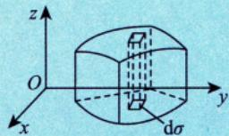

(2) 如果f(x, y)是负的，柱体就在xOy面的下方，二重积分的绝对值仍等于柱体的体积，但二重积分的值是负的.（类似于定积分）

图14-1

(3) 如果f(x,y)在D的若干部分区域上是正的，而在其他部分区域上是

负的，那么，f(x，y)在D上的二重积分就等于xOy面上方的柱体体积减去xOy面下方的柱体体积所得之差.（类似于定积分)

## 2 性质(与一元函数类似

性质1(求区域面积) $\iint_{D} 1 \cdot \mathrm{d}\sigma = \iint_{D} \mathrm{d}\sigma = A$ ，其中A为D的面积.

性质2(可积函数必有界）当 $f(x,   y)$ 在有界闭区域D上可积时，f(x，y)在D上必有界.

性质3(积分的线性性质)设 $k_{1},   k_{2}$ 为常数，则

$$
\iint_{D} \left[ k_{1} f(x, y) \pm k_{2} g(x, y) \right] \mathrm{d} \sigma = k_{1} \iint_{D} f(x, y) \mathrm{d} \sigma \pm k_{2} \iint_{D} g(x, y) \mathrm{d} \sigma
$$

性质4(积分的可加性)设f(x，y)在有界闭区域D上可积，且 $D_{1} \cup D_{2} = D, D_{1} \cap D_{2} = \varnothing$ ，则

$$
\iint _ { D } f ( x , y ) \mathrm { d } \sigma = \iint _ { D _ { 1 } } f ( x , y ) \mathrm { d } \sigma + \iint _ { D _ { 2 } } f ( x , y ) \mathrm { d } \sigma .
$$

性质5(积分的保号性)当 $f(x,   y),   g(x,   y)$ 在有界闭区域D上可积时，若在D上有

$$
f(x, y) \leqslant g(x, y),
$$

则有

$$
\iint _ { D } f ( x , y ) \mathrm { d } \sigma \leqslant \iint _ { D } g ( x , y ) \mathrm { d } \sigma .
$$

→保持原有的不等关系

特殊地，有

$$
\left| \iint_{D} f(x, y) \mathrm{d} \sigma \right| \leq \iint_{D} \left| f(x, y) \right| \mathrm{d} \sigma .
$$

性质6(二重积分的估值定理) 设M，m分别是 $f(x,   y)$ 在有界闭区域D上的最大值和最小值，A为D的面积，则有

$$
mA \leqslant \iint_{D} f(x,y) \mathrm{d}\sigma \leqslant MA. \longrightarrow m \leqslant f(x,y) \leqslant M.
$$

性质7(二重积分的中值定理）设函数 $f(x,y)$ 在有界闭区域D上连续，A为D的面积，则在D上至少存在一点 $(\xi,   \eta)$ ，使得

$$
\iint_{D} f(x, y) \mathrm{d} \sigma = f(\xi, \eta) A. \quad \int_{a}^{b} f(x) \mathrm{d} x = f(\xi)(b - a), \quad \xi \in (a, b).
$$

$$
L_{1}:x^{2}+y^{2}=1,\ L_{2}:x^{2}+y^{2}=2,
$$

$$
L_{3}:x^{2}+2y^{2}=2\ ,L_{4}:2x^{2}+y^{2}=2
$$

围成的平面区域，记

$\iint_{D_{i}} \left(1 - x^{2} - \frac{1}{2}y^{2}\right) \mathrm{d}x\mathrm{d}y$ →在不同的区域上对同一个被积函数做二重积分

$$
\max\{I_{1}, I_{2}, I_{3}, I_{4}\} = ( \quad )
$$

$$
I _ { 1 }
$$

$$
I _ { 2 }
$$

$$
I _ { 3 }
$$

$$
I _ { 4 }
$$

分析此题是同一个函数在不同区域的积分比大小的问题，不需要计算二重积分，应研究在不同积分区域下，被积函数的正负情形.被积函数 $1 - x^{2} - \frac{1}{2}y^{2} \geqslant 0$ 正好对应的区域为 $D _ { 4 }$ ，而 $D_{1} < D_{4}$ ，故 $I_{1} < I_{4} , \quad D_{4} < D_{2}$ ，在$D _ { 2 } - D _ { 4 }$ 区域，被积函数值为负，所以 $I_{2} < I_{4}$ ，同理 $I_{3} < I_{4}$

解应选(D).

曲线 $L_{i}(i = 1,2,3,4)$ 如图14-2所示.记被积函数为 $f(x, y) =$ $1 - \left( x^{2} + \frac{1}{2}y^{2} \right)$ ，由于 $L_{4}:2x^{2}+y^{2}=2$ ，则 $D _ { 4 }$ 内部为 $x^{2}+\frac{y^{2}}{2}<1$ ，于是在 $D _ { 4 }$ 内部有 $f(x,   y) > 0$ ，而在 $D _ { 4 }$ 外部有 $f(x, y) < 0$

①比较 $I _ { 1 }$ 与 $I_{4}$

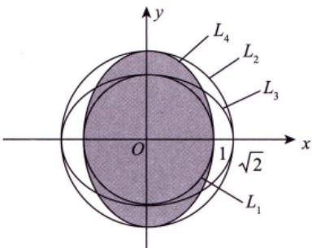

$$
\begin{aligned}I_{4} = \iint_{D_{4}} f(x, y) \mathrm{d}x \mathrm{d}y = \iint_{D_{1}} f(x, y) \mathrm{d}x \mathrm{d}y + \iint_{D_{4} - D_{1}} f(x, y) \mathrm{d}x \mathrm{d}y \\= I_{1} + \iint_{\frac{D_{4} - D_{1}}{2}} f(x, y) \mathrm{d}x \mathrm{d}y > I_{1} . \\ 与 I_{4} .\end{aligned}
$$

图 14-2

②比较 $I _ { 2 }$

$$
\begin{aligned}I_{2} = & \iint_{D_{2}} f(x, y) \mathrm{d}x \mathrm{d}y = \iint_{D_{4}} f(x, y) \mathrm{d}x \mathrm{d}y + \iint_{D_{2} - D_{4}} f(x, y) \mathrm{d}x \mathrm{d}y \\= & I_{4} + \iint_{D_{2} - D_{4}} f(x, y) \mathrm{d}x \mathrm{d}y < I_{4} . \\& \Longrightarrow f(x, y) < 0\end{aligned}
$$

③比较 $I _ { 3 }$ 与 $I _ { 4 }$ .如图14-3所示，将 $D_{3}$ ， $D_{4}$ 中互不重合的部分分别记为 $D_{31}, D_{32}, D_{41}, D_{42}$ ，则

$$
\iint_{D_{3}} f(x, y) \mathrm{d}x \mathrm{d}y + \iint_{D_{2}} f(x, y) \mathrm{d}x \mathrm{d}y + \iint_{D_{3} \cap D_{4}} f(x, y) \mathrm{d}x \mathrm{d}y
$$

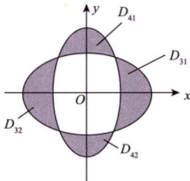  
图 14-3

$$
\begin{aligned} &\left\{ \begin{array} { l } \displaystyle \iint _ { D _ { 4 1 } } f ( x , y ) \mathrm { d } x \mathrm { d } y + \iint _ { D _ { 4 2 } } f ( x , y ) \mathrm { d } x \mathrm { d } y + \iint _ { D _ { 3 } \cap D _ { 4 } } f ( x , y ) \mathrm { d } x \mathrm { d } y \\ \displaystyle \int _ { ( 1 , 2 ) } f ( x , y ) > 0 \leqslant \end{array} \right.\\ &= I _ { 4 } .\\ \end{aligned}
$$

所以 $\max\{I_{1}, I_{2}, I_{3}, I_{4}\} = I_{4}$ ，即应选(D).

注事实上， $D_{4}$ 是使得 $\left( 1 - x^{2} - \frac{1}{2}y^{2} \right)$ dxdy取得最大值的区域，因为 $D_{4}$ 包含了所有使 $1 - x^{2} - \frac{1}{2}y^{2}$ 大于零的区域，而不包含任何使 $1 - x^{2} - \frac{1}{2}y^{2}$ 小于零的区域，由二重积分的性质知 $I_{4}$ 最大.

方法总结寻找二重积分的最大值的区域，即是寻找被积函数大于等于零的区域.

例14.2 设

$$
D(t)=\left\{(x,\ y)\left|2x^{2}+3y^{2}\leqslant6t\right.\right\}(t\geqslant0)
$$

$$
f(x,y)=\left\{\begin{aligned}&\frac{\sqrt[3]{1-\left(x^{2}+y^{2}\right)}-1}{\mathrm{e}^{x^{2}+y^{2}}-1}, \quad (x,y)\neq(0,0), \\&a, \quad (x,y)=(0,0)\end{aligned}\right.
$$

为连续函数，令 $F(t) = \iint_{D(t)} f(x, y) \mathrm{d}x \mathrm{d}y$ ，则F1(0) =

分析本题积分区域为动态区域D(t)，当t→0时， $D ( t ) \to 0$

本题研究的是在一点处的导数，所以用导数的定义，当 $\iint_{D} f(x, y) \mathrm{d}\sigma$ 难计算时，可以利用二重积分的中值定理来处理.

应填 $-\frac{\sqrt{6}\pi}{3}$

由例 13.2 可知 $a = -\frac{1}{3}$

由二重积分的中值定理知，存在 $(\xi, \eta) \in D(t)$ ，使得

$$
F(t) = \iint_{D(t)} f(x, y) \mathrm{d}x \mathrm{d}y = \sqrt{6} \pi f(\xi, \eta) .
$$

于是，

$$
\begin{aligned}F_{+}^{\prime}(0) &= \lim_{t \rightarrow 0^{+}}\frac{F(t) - F(0)}{t - 0} = \lim_{t \rightarrow 0^{+}}\frac{\sqrt{6}\pi tf(\xi,\ \eta)}{t} = \lim_{t \rightarrow 0^{+}}\sqrt{6}\pi f(\xi,\ \eta) \\&= \sqrt{6}\pi f(0,\ 0) = -\frac{\sqrt{6}\pi}{3} .\end{aligned}
$$

注此题的被积函数被命制成具体函数，但 $\iint_{D(t)} f(x, y) \mathrm{d}\sigma$ 难以计算，故考虑利用二重积分的中值定理来处理.同理，若被积函数被命制成抽象函数，也可以考虑利用二重积分中值定理来处理，如：设f(x，y)具有二阶连续偏导数，

$$
D(t)=\left\{(x,\ y)|0\leqslant x\leqslant t,0\leqslant y\leqslant t\right\}
$$

令 $F(t) = \iint_{D(t)} f''(x, y) \mathrm{d}x \mathrm{d}y$ ，求 $F_{+}^{\prime}(0)$

解

$$
\begin{aligned}F_{+}^{\prime}(0)=\lim_{t \rightarrow 0^{+}} \frac{F(t)-F(0)}{t-0}=\lim_{t \rightarrow 0^{+}} \frac{\iint\limits_{D(t)} f_{xy}^{\prime \prime}(x, y) \mathrm{d} x \mathrm{d} y}{t-0} \\ \xlongequal{ 二重积分的中值定理 } \lim_{t \rightarrow 0^{+}} \frac{f_{xy}^{\prime \prime}(\xi, \eta) \cdot t^{2}}{t}=\lim_{t \rightarrow 0^{+}} \frac{f_{xy}^{\prime \prime}(0,0)}{t}\end{aligned}
$$

方法总结当 $\iint_{D} f(x, y) \mathrm{d}\sigma$ 难计算或者 $f(x,y)$ 为抽象型时，可考虑利用二重积分的中值定理来处理.

公式 $\iint _ { D } f ( x , y ) \mathrm { d } \sigma = f ( \xi , \eta ) \cdot S _ { D } , ( \xi , \eta ) \in D$ ，其中 $S _ { p }$ 为D的面积.

## ③普通对称性与轮换对称性 必考题！

(1) 普通对称性.

设区域D关于y轴对称，如图14-4所示，取对称的两块小面积dσ，对称点分别为(x，y)与(-x，y)，则对称点处的高分别为 $f(x,   y)$ 与 $f(-x,   y)$ .依据定义，对称位置的两个“小竖条”的体积分别为 $f(x,y) \mathrm{d}\sigma$ 与 $f(-x,   y) \mathrm{d}\sigma$ 因为dσ一样，所以，当 $f(x, y) = f(-x, y)$ 时， $f(x,   y) \mathrm{d}\sigma = f(-x,   y) \mathrm{d}\sigma$ 体积相同，此时只需计算对称区域的一半，然后乘以2即可得到整个积分值而当 $f(x, y) = -f(-x, y)$ 时， $f(x,   y) \mathrm{d}\sigma = - f(-x,   y) \mathrm{d}\sigma$ ，对称区域的体积正好相反，这样累加起来的总体积自然就是0.于是，我们有

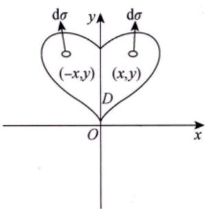  
图 14-4

$$
\iint _ { D } f ( x , y ) \mathrm { d } x \mathrm { d } y = \left\{ \begin{aligned} & 2 \iint _ { D _ { 1 } } f ( x , y ) \mathrm { d } x \mathrm { d } y , \quad f ( x , y ) = f ( - x , y ) , \\ & 0 , \quad f ( x , y ) = - f ( - x , y ) , \end{aligned} \right.
$$

把对称点代入，函数值相同，即2倍：函数值相反，即为0(偶倍奇零)

其中 $D _ { 1 }$ 是D在y轴右侧的部分.

你看，用这种基于概念的分析方法，不用死记硬背，而且真正理解了性质的本质.现将二重积分有关的对称性全面总结如下.

①若D关于y轴对称，则

$$
\iint _ { D } f ( x , y ) \mathrm { d } \sigma = \left\{ \begin{aligned} & 2 \iint _ { D _ { 1 } } f ( x , y ) \mathrm { d } \sigma , \quad f ( x , y ) = f ( - x , y ) , \\ & 0 , \quad f ( x , y ) = - f ( - x , y ) , \end{aligned} \right.
$$

其中 $D _ { 1 }$ 是D在y轴右侧的部分.

$\iint_{D} (x - a) \mathrm{d}\sigma$ ，因 $f(x, y) = x - a$ ，而 $f(2a-x,y)=a-x$ ，故 $\iint _ { D \Gamma } ( x - a ) \mathrm { d } \sigma = 0$ DN

注若D关于 $x = a (a \neq 0)$ 对称，(x，y)关于 $x = a$ 的对称点为 $(2a - x, y)$ ，则

相当于将x=0平 $\iint _ { D } f ( x , y ) \mathrm { d } \sigma = \left\{ 2 \iint _ { D _ { 1 } } f ( x , y ) \mathrm { d } \sigma , \quad f ( x , y ) = f ( 2 a - x , y ) , \right.$ 移了a个单位长度

其中 $D_{1}$ 是D在 $x = a$ 右侧的部分.

②若D关于x轴对称，则

$$
\iint _ { D } f ( x , y ) \mathrm { d } \sigma = \left\{ \begin{aligned} & 2 \iint _ { D _ { 1 } } f ( x , y ) \mathrm { d } \sigma , \quad f ( x , y ) = f ( x , - y ) , \\ & 0 , \quad f ( x , y ) = - f ( x , - y ) , \end{aligned} \right.
$$

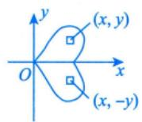

其中 $D_{1}$ 是D在x轴上侧的部分.

注若D关于 $y = a ( a \neq 0 )$ 对称，(x，y)关于 $y = a$ 的对称点为 $(x, 2a - y)$ ，则

$$
\iint _ { D } f ( x , y ) \mathrm { d } \sigma = \left\{ \begin{aligned} & 2 \iint _ { D _ { 1 } } f ( x , y ) \mathrm { d } \sigma , \quad f ( x , y ) = f ( x , 2 a - y ) , \\ & 0 , \quad f ( x , y ) = - f ( x , 2 a - y ) , \end{aligned} \right.
$$

其中 $D_{1}$ 是D在 $y = a$ 上侧的部分.

关键两点：

①看D关于谁对称；

②将点代入f(x，y)，相等则2倍，相反则为0.

③若D关于原点对称，则

(x，y)关于原点的对称 → $\iint _ { D } f ( x , y ) \mathrm { d } \sigma = \left\{ \begin{aligned} 2 \iint _ { D _ { 1 } } f ( x , y ) \mathrm { d } \sigma , \quad f ( x , y ) = f ( - x , - y ) , \\ 0 , \quad f ( x , y ) = - f ( - x , - y ) , \end{aligned} \right.$ 点为(-x,-y)

其中 $D_{1}$ 是D关于原点对称的半个部分.

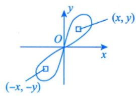

④若D关于 $y = x$ 对称，则

x, y对调， $f(x, y) = f(y, x)$

(x,y)关于y=x的

对称点为(y，x)

$$
\iint _ { D } f ( x , y ) \mathrm { d } \sigma = \left\{ \begin{aligned} & 2 \iint _ { D _ { 1 } } f ( x , y ) \mathrm { d } \sigma , \quad f ( x , y ) = f ( y , x ) , \\ & 0 , \quad f ( x , y ) = - f ( y , x ) , \end{aligned} \right.
$$

其中 $D _ { 1 }$ 是D关于y=x对称的半个部分.

例14.3设 $\iint_{D_{i}} \sqrt[3]{x - y}   dx   dy (i = 1, 2, 3)$ ,其中D1 ={(x, y)|0≤x≤1, 0≤y≤1}， $D_{2}=\left\{\left(x, y\right) \mid 0 \leq\right.$ $x \leqslant 1, \; 0 \leqslant y \leqslant \sqrt{x}$ ,D3 ={(x,y)|0≤x≤1,x²≤y≤1}，则().(A) $J_{1} < J_{2} < J_{3}$ (B) $J_{3} < J_{1} < J_{2}$ (C) $J_{2} < J_{3} < J_{1}$ (D) $J_{2} < J_{1} < J_{3}$

分析）本题先画出每部分的积分区域图，然后研究同一函数在不同区域的积分值的大小.本题是结合对称性和被积函数正负的问题.  
因 $D _ { 1 }$ 关于y=x对称， $f(y,   x) = -f(x,   y)$ ，故 $J_{_1} = 0$   
$D _ { z }$ 不对称，但可以作辅助曲线，创造对称性，对称部分积分为0，另一部分 $f(x, y) \geq 0$ ，故 $J_{_2} > 0$ 同理， $D _ { 3 }$ 也可作辅助曲线，对称部分积分为0，另一部分 $f(x,   y) \leq 0$ ，故 $J_{_3} < 0$

## 解应选(B).

如图 14-5(a) 所示， $D _ { 1 }$ 被直线y=x分成 $D _ { 1 1 }$ 和 $D _ { 1 2 }$ 两部分，故 $\iint_{D_{1}} \sqrt[3]{x - y}   dx   dy = \iint_{D_{11} + D_{12}} \sqrt[3]{x - y}   dx   dy$ ，由于$\sqrt[3]{x - y} = - \sqrt[3]{y - x}$ ，故由普通对称性，有 $\iint_{D_{1}} \sqrt[3]{x - y}   dx   dy = 0$

如图14-5(b)所示，作辅助线 $y = x^{2}$ ，将 $D _ { z }$ 分为 $D _ { 2 1 }$ 和 $D_{22}$ 两部分，由普通对称性知，$\iint_{D_{21}}^{3} \sqrt{x - y}   dx   dy = 0$ .而在 $D_{22}$ 上， $\sqrt[3]{x - y} \geq 0$ ，由保号性知，

$$
\iint_{D_{2}} \sqrt[3]{x - y}   dx   dy = \iint_{D_{22}} \sqrt[3]{x - y}   dx   dy > 0
$$

如图14-5(c)所示，作辅助线 $y = \sqrt{x}$ ，将 $D _ { 3 }$ 分为 $D_{31}$ 和 $D_{32}$ 两部分，由普通对称性知，$\iint_{D_{32}}^{3} \sqrt{x - y}   dx   dy = 0$ .而在 $D_{31}$ 上， $\sqrt[3]{x - y} \leq 0$ ，由保号性知，

$$
\iint_{D_{3}} \sqrt[3]{x - y}   dx   dy = \iint_{D_{31}} \sqrt[3]{x - y}   dx   dy < 0
$$

综上， $J_{3} < J_{1} < J_{2}$

  
(a)

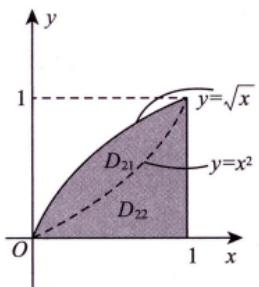  
(b)  
图 14-5

  
(c)

公式当D关于y=x对称， $f(x, y) = -f(y, x)$ 时， $\iint_{D} f(x, y) = 0$

(2)轮换对称性（一定是直角坐标系下）.

引例1

将x，y对调后，相等吗？

$$
\iint_{D_{1}:\frac{x^{2}}{4}+\frac{y^{2}}{3}\leq1}\left(2x^{2}+3y^{2}\right)dxdy=\iint_{D_{2}:\frac{y^{2}}{4}+\frac{x^{2}}{3}\leq1}\left(2y^{2}+3x^{2}\right)dydx
$$

解 因为上述两个积分只是将x与y这两个字母对调了，而积分值与用什么字母表示是无关的，故它们是相等的. 相当于字母x变v，字母v变x

引例2

$$
\iint_{D:\frac{x^{2}}{4}+\frac{y^{2}}{4}\leq1}\left(2x^{2}+3y^{2}\right)dxdy=\iint_{D:\frac{x^{2}}{4}+\frac{y^{2}}{4}\leq1}\left(2y^{2}+3x^{2}\right)dydx
$$

解理由如上，它们也是相等的.

引例2中的区域D有个特点，就是当你把x与y对调后，区域D不变（事实上，区域D关于 $y = x$ 对称）.于是抽象化写出的式子为

$$
\iint _ { D } f ( x , y ) \mathrm { d } x \mathrm { d } y = \iint _ { D } f ( y , x ) \mathrm { d } y \mathrm { d } x .
$$

整理一下，我们可以这样来描述：

在直角坐标系下，若把x与 $y$ 对调后，区域D不变（或区域D关于y=x对称），则

$$
\iint_{D} f(x, y) \mathrm{d} \sigma = \iint_{D} f(y, x) \mathrm{d} \sigma , \quad \mathrm{d} \sigma = \mathrm{d} x \mathrm{d} y = \mathrm{d} y \mathrm{d} x
$$

这就是轮换对称性.

轮换对称性的应用： $\iint_{D} f(x, y) \mathrm{d}\sigma \left( \iint_{D} f(y, x) \mathrm{d}\sigma \right)$ 难计算，但 $f(x,   y) + f(y,   x)$ 之和式子简单，如注(1)

例如：当 $D = \left\{ (x, y) \mid x^{2} + y^{2} \leqslant 1, x > 0, y > 0 \right\}$ 时，

$$
\begin{aligned}&\iint_{D}\frac{a\sqrt{f(x)} + b\sqrt{f(y)}}{\sqrt{f(x)} + \sqrt{f(y)}}\mathrm{d}\sigma \\=& \iint_{D}\frac{a\sqrt{f(y)} + b\sqrt{f(x)}}{\sqrt{f(y)} + \sqrt{f(x)}}\mathrm{d}\sigma \\=& \frac{1}{2}\iint_{D}(a + b)\mathrm{d}\sigma \\=& \frac{a + b}{2} \cdot \frac{1}{4} \cdot \pi \cdot 1^{2} . \quad \rightarrow \quad 1^{\frac{1}{4}} 个圆勒面积 .\end{aligned}
$$

$\left\{ \begin{aligned} \textcircled{1} D  关于  y = x \\ \textcircled{2} f(x, y) = f(y) \end{aligned} \right.$ 对称； ①D关于y = x对称；普通对称性 轮换对称性,x)或 $f(x, y) = -f(y, x)$ ②利用 $f(x,   y) + f(y,   x)$ 简化计算.

注(1)在直角坐标系中，若 $f(x, y) + f(y, x) = a$ ，则

$$
I = \frac{1}{2} \iint_{D} \left[ f(x, y) + f(y, x) \right] \mathrm{d}x \mathrm{d}y = \frac{1}{2} \iint_{D} a \mathrm{d}x \mathrm{d}y = \frac{a}{2} S_D .
$$

(2)要注意区分普通对称性中的④与这里轮换对称性的区别与联系.虽然它们都是D关于y=x对称，但普通对称性考查的是f(x，y)与f(y，x)是相等还是相反，轮换对称性考查的是 $f(x, y) + f(y, x)$ 是否简单.事实上，当 $f(x, y) = -f(y, x)$ 时，它们是一回事.

例14.4 设 $f(x)=\iint_{D(x)}\frac{v\ln\sqrt{u^{2}+v^{2}}}{u+v}\mathrm{d}u\mathrm{d}v,\ D(x)=\left\{(u,v)\left|\frac{1}{4}\leqslant u^{2}+v^{2}\leqslant x^{2},u>0,v>0\right.\right\}\left(x>\frac{1}{2}\right)$ ，则$f(x) \; = \; ( 関関関 )$ (A) $\frac{1}{4} \iint_{D(x)} \ln(u^2 + v^2)   du   dv$ (B) $\frac{1}{2}\iint_{D(x)}\ln(u^{2}+v^{2})\mathrm{d}u\mathrm{d}v$ (C) $\iint_{D(x)} \ln(u^2 + v^2)   du   dv$ (D) $2 \iint_{D(x)} \ln(u^2 + v^2)   du   dv$

分析D中u，ν互换位置，D不变，接着看g(u，v)与 $g(\nu, u)$ 的关系既不相等，也不相反，考虑将其加起来，$g(u, v) + g(v, u)$ 计算简单，所以考虑轮换对称性.

应选(A).

由轮换对称性，有

$$
\begin{aligned}f(x) = \iint_{D(x)} \frac{v \ln \sqrt{u^2 + v^2}}{u + v} \mathrm{d}u \mathrm{d}v = \iint_{D(x)} \frac{u \ln \sqrt{u^2 + v^2}}{u + v} \mathrm{d}u \mathrm{d}v \\= \frac{1}{2} \iint_{D(x)} \ln \sqrt{u^2 + v^2} \mathrm{d}u \mathrm{d}v = \frac{1}{4} \iint_{D(x)} \ln(u^2 + v^2) \mathrm{d}u \mathrm{d}v.\end{aligned}
$$

方法总结当D关于y=x对称， $f(x, y) = -f(y, x)$ 或 $f(x,   y) = f(y,   x)$ 时，考虑普通对称性，若不满足，可看 $f(x,   y) + f(y,   x)$ 是否简单，考虑轮换对称性.

## 计算

## 直角坐标系下的计算方法

直角坐标系用平行于坐标系的线切割.

问题：先对x积分，还是对y积分？

dσ=dxdy直角坐标系下的标志

在直角坐标系下，按照积分次序的不同，一般将二重积分的计算分为两种情况，如图14-6所示.

后积先定限。限内画条线，先交写下限。后交写上限.

  
(a)

  
(b)  
图 14-6

先上下的 后积 再定，的上下限≥下限 型区城的特点是内部平行于y

(1) $\iint _ { D } f ( x , y ) \mathrm { d } \sigma = \int _ { | g | } ^ { b } \mathrm { d } x \int _ { \left| \frac { \varphi _ { 2 } ( x ) } { \varphi _ { 1 } ( x ) } \right| } ^ { \left| \frac { \varphi _ { 2 } ( x ) } { \varphi _ { 1 } ( x ) } \right| } f ( x , y ) \mathrm { d } y$ ，其中D为X型区域： $\varphi_{1}(x) \leqslant y \leqslant \varphi_{2}(x), a \leqslant x \leqslant b$ ，如图 $14-6(a)$ 所示.积分区域是X型区域的后积x，类似还有其他几种（见批注图）.

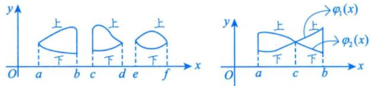

$$
\iint_{D} f(x, y) \mathrm{d} \sigma = \int_{a}^{c} \mathrm{d} x \int_{\varphi_{1}(x)}^{\varphi_{2}(x)} f(x, y) \mathrm{d} y + \int_{c}^{b} \mathrm{d} x \int_{\varphi_{2}(x)}^{\varphi_{1}(x)} f(x, y) \mathrm{d} y
$$

先定y的 再定x的上下限上下限个后积y注意，这里上限≥下限

Y型区域的特点是：穿过D内部且平行于x 轴的直线与D的边界相交不多于两点

(2) $\iint _ { D } f ( x , y ) \mathrm { d } \sigma = \int _ { \left| c \right| } ^ { d } \mathrm { d } y \int _ { \frac { \phi _ { 2 } ( y ) } { \phi _ { 1 } ( y ) } } ^ { \left| \frac { \phi _ { 2 } ( y ) } { \phi _ { 1 } ( y ) } \right| } f ( x , y ) \mathrm { d } x$ ，其中D为Y型区域： $\psi _ { 1 } ( y ) \leqslant x \leqslant \psi _ { 2 } ( y ) , c \leqslant y \leqslant d$ ，如图14-6(b)所示.积分区域是Y型区域的后积y.→二重积分交换上下限添负号 →二重积分交换上下限添负号

$$
\int_{a}^{b} \mathrm{d}x \int_{\varphi_{1}(x)}^{\varphi_{2}(x)} f(x, y) \mathrm{d}y = \left| - \int_{a}^{b} \mathrm{d}x \int_{\varphi_{2}(x)}^{\varphi_{1}(x)} f(x, y) \mathrm{d}y \right| (a < b, \varphi_{1}(x) > \varphi_{2}(x)).
$$

注(1)有一点需要指出，这里的下限都必须小于等于上限.dx>0，dy>0，dσ>0

(2)若被积函数f(x， y)易于对y积分或积分区域D是X型区域，则选择先y后x的积分次序；  
若被积函数f(x，y)易于对x积分或积分区域D是Y型区域，则选择先x后y的积分次序.

(3)计算二重积分的关键是确定积分限，为此，要画好积分区域D的边界图形，当D的边界图形不易画出时，要写出D的不等式表达式，从而确定上下限. D不易画时，采用分析法

例14.5 设函数f(x，y)连续，则二次积分 $\int _ { \frac { \pi } { 2 } } ^ { \pi } \mathrm { d } x \int _ { \sin x } ^ { 1 } f ( x , y ) \mathrm { d } y = ( \quad )$ (A) $\int_{0}^{1} \mathrm{d}y \int_{\pi + \arcsin y}^{\pi} f(x, y) \mathrm{d}x$ (B) $\int_{0}^{1} \mathrm{d}y \int_{\pi - \arcsin y}^{\pi} f(x, y) \mathrm{d}x$ (C) $\int_{0}^{1} \mathrm{d}y \int_{\frac{\pi}{2}}^{\pi + \arcsin y} f(x, y) \mathrm{d}x$ (D) $\int_{0}^{1} \mathrm{d}y \int_{\frac{\pi}{2}}^{\pi - \arcsin y} f(x, y) \mathrm{d}x.$

分析题干是后积x，选项是后积y，可知本题考虑的是交换积分顺序，应先确定积分区域，然后先积x，后积y，写成累次积分的形式.后积y，先定限，下限为0，上限为1，再定x的限，限内画平行于x轴的直线，当$\frac{\pi}{2} < x \leq \pi$ 时， $x = \pi - \arcsin y$ ，所以下限为 $x = \pi - \arcsin y$ ，上限为x=π.

根据所给二次积分得到积分区域为D： $\left\{ \begin{aligned} \sin x < y < 1, \\ \frac{\pi}{2} < x < \pi, \end{aligned} \right.$ 如图14-7所示，则

$$
\int _ { \frac { \pi } { 2 } } ^ { \pi } \mathrm { d } x \int _ { \sin x } ^ { 1 } f ( x , y ) \mathrm { d } y = \int _ { 0 } ^ { 1 } \mathrm { d } y \int _ { \frac { \pi - \arcsin y } { 2 } } ^ { \pi } f ( x , y ) \mathrm { d } x.
$$

图 14-7

由例1.12得，当 $\frac{\pi}{2} < x \leq \frac{3}{2}\pi$ 时， $x = \pi - \arcsin y$

方法总结）交换积分顺序的题目，应先确定积分区域，然后交换积分顺序写成相应的累次积分.

$$
\frac{\int_{\frac{\pi}{2}}^{\pi}\mathrm{d}x\int_{1}^{\sin x}f(x, y)\mathrm{d}y}{\int_{\frac{\pi}{2}}^{\pi}\mathrm{d}x\int_{1}^{\sin x}f(x, y)\mathrm{d}y} \quad \sin x < 1 \quad ( 不是二重积分,仅是累次积分布式) \\ = -\frac{\int_{\frac{\pi}{2}}^{\pi}\mathrm{d}x\int_{1}^{\sin x}f(x, y)\mathrm{d}y}{\int_{\frac{\pi}{2}}^{\pi}\mathrm{d}x\int_{1}^{\sin x}f(x, y)\mathrm{d}y} \quad . \quad 二重积分
$$

例14.6当 $x \to 0 ^ { + }$ 时， $f(x) = \int_{0}^{x^{2}} \mathrm{d}y \int_{x}^{\sqrt{y}} \sin \frac{y}{t} \mathrm{d}t$ 与 $g(x) = ax^b$ 是等价无穷小量，则 ab =

分析 $\sin { \frac { y } { x } }$ 若对x积分，则没有初等函数形式的原函数表达，若对y积分，可用初等函数形式表示，所以先积y后积x，本题属于交换积分顺序的题目.

又因为 $0 \leqslant y \leqslant x^{2}$ ，所以 $\sqrt { y }   \leqslant   x$ ，故 $\int_{0}^{x^{2}}\mathrm{d}y\int_{x}^{\sqrt{y}}\sin\frac{y}{t}$ dt先添一个负号变为 $-\int_{0}^{x^{2}}\mathrm{d}y\int_{\sqrt{y}}^{x}\sin\frac{y}{t}\mathrm{d}t$ ，变为二重积分后，画出积分区域图，再交换积分顺序.

解应填 $-\frac{1}{2}$

交换上下限，保证上限大于等于下限

$$
\begin{aligned}f(x) = & \int_{0}^{x^{2}} \mathrm{d}y \int_{\left| \frac{y}{x} \right|}^{\sqrt{y}} \sin \frac{y}{t} \mathrm{d}t = - \int_{0}^{x^{2}} \mathrm{d}y \int_{\left| \frac{y}{x} \right|}^{\sqrt{x}} \sin \frac{y}{t} \mathrm{d}t \\= & - \iint_{D} \sin \frac{y}{t} \mathrm{d}\sigma = - \int_{0}^{x} \mathrm{d}t \int_{0}^{t^{2}} \sin \frac{y}{t} \mathrm{d}y \\= & \int_{0}^{x} t \cdot \left( \cos \frac{y}{t} \right) \Bigg|_{\left| \frac{y = 0}{t} \right|}^{\sqrt{y = t^{2}}} \mathrm{d}t \Bigg|_{\left| \frac{y = 0}{t} \right|}^{\sqrt{x}} \mathrm{d}t \Bigg|_{\left| \frac{y = 0}{t} \right|}^{\sqrt{x}} \mathrm{d}t \Bigg|_{\left| \frac{y = 0}{t} \right|}^{\sqrt{x}} \mathrm{d}t \Bigg|_{\left| \frac{y = 0}{t} \right|}^{\sqrt{x}}\end{aligned}
$$

于是 $\lim_{x \to 0^{+}} \frac{f(x)}{g(x)} = \lim_{x \to 0^{+}} \frac{\frac{2}{x}(\cos x - 1)}{abx^{b - 1}} = \lim_{x \to 0^{+}} \frac{- \frac{1}{2}x^{3}}{abx^{b - 1}} = 1$ ，故 $ab = -\frac{1}{2}$

注(1) $\frac{\sin x}{x}, \frac{\cos x}{x}, \frac{\ln(1 + x)}{x}, \frac{1}{\ln x}, \sin x^{2}, \cos x^{2}, \sin \frac{1}{x}, \cos \frac{1}{x}, \frac{\tan x}{x}, \frac{e^{x}}{x}, \tan x^{2}, e^{\ln^{2}+\ln x}(a \neq 0)$ 均没有初等函数形式的原函数，见到它们，一般都要交换积分次序，避免先对x求积分.

(2)事实上， $a = - \frac{1}{8},   b = 4.$

方法总结当累次积分无法积分，即没有初等函数形式的原函数表达式时，可考虑交换积分顺序.

公式 $\int \sin \frac{y}{t}   dy = -t \cos \frac{y}{t} + C$

当 $x \to 0 ^ { + }$ 时， $f(x) \sim g(x)$ ，则 $\int_{0}^{x} f(t) \mathrm{d}t \sim \int_{0}^{x} g(t) \mathrm{d}t$ .(可用洛必达法则证明)

例14.7 计算 $\int_{0}^{1} \mathrm{d}y \int_{y}^{1} \arcsin \sqrt{4x - 4x^{2}} \mathrm{d}x$

分析被积函数只含有x，而且先对x积分较困难，所以考虑交换积分顺序.

解先对x积分较困难，交换积分次序.

$$
\int_{0}^{1} \mathrm{d}x \int_{0}^{x} \arcsin \sqrt{4x - 4x^2} \mathrm{d}y = \int_{0}^{1} \arcsin \sqrt{4x - 4x^2} \mathrm{d}x = \frac{1}{2}
$$

方法总结 $\int_{c}^{d} \mathrm{d}y \int_{x_{1}(y)}^{x_{2}(y)} f(x) \mathrm{d}x$ 对x积分比较困难时，可转化为先积y，即 $\int_{a}^{b} \mathrm{d}x \int_{y_{1}(x)}^{y_{2}(x)} f(x) \mathrm{d}y$

@公式 $\int_{0}^{1} \arcsin \sqrt{1 - x^{2}}   dx = 1 , \quad \int_{0}^{1} x \arcsin \sqrt{4x - 4x^{2}}   dx = \frac{1}{2}$

## 2极坐标系下的计算方法

因为是中心对称图像，一般先积r，后积θ

极坐标系：与中心对称图像有关！

直角坐标与极坐标关系 $\left\{ \begin{aligned} x = r \cos \theta, \\ y = r \sin \theta. \end{aligned} \right.$ →转换桥梁

$$
r = r _ { 0 } , \theta = \theta _ { 0 }
$$

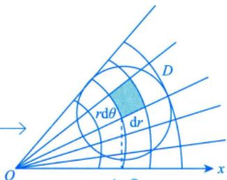

则有 $\mathrm{d}\sigma = \mathrm{d}r \cdot r\mathrm{d}\theta = r\mathrm{d}r\mathrm{d}\theta$ 近似看成矩形.

(r, θ)

在极坐标系下，按照积分区域与极点位置关系的不同，一般将二重积分的计算分为三种情况，如图14-8所示.

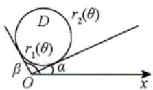  
(a)

  
(b)

  
图 14-8  
(c)

从Ox轴逆时针出发，先碰到积分区域时，记 $\theta = \alpha$ ，后离开区域时，记 $\theta = \beta$ ，所以θ的下限为 $\alpha$ ，上限为 $\beta$ ，然后限内画条线，先交内曲线记 $\boldsymbol { r } = \boldsymbol { r } _ { 1 } ( \boldsymbol { \theta } )$ ，然后交外曲线 $r = r_{2}(\theta)$

(1) $\iint _ { D } f ( x , y ) \mathrm { d } \sigma = \int _ { \alpha } ^ { \beta } \mathrm { d } \theta \int _ { r _ { 1 } ( \theta ) } ^ { r _ { 2 } ( \theta ) } f ( r \cos \theta , r \sin \theta ) r \mathrm { d } r$ (极点O在区域D外部);

(2) $\iint _ { D } f ( x , y ) \mathrm { d } \sigma = \int _ { \alpha } ^ { \beta } \mathrm { d } \theta \int _ { 0 } ^ { r ( \theta ) } f ( r \cos \theta , r \sin \theta ) r \mathrm { d } r$ (极点O在区域D边界上);

(3) $\iint _ { D } f ( x , y ) \mathrm { d } \sigma = \int _ { 0 } ^ { 2 \pi } \mathrm { d } \theta \int _ { 0 } ^ { r ( \theta ) } f ( r \cos \theta , r \sin \theta ) r \mathrm { d } r$ (极点O在区域D内部)

注极坐标系与直角坐标系选择的一般原则.

一般来说，给出一个二重积分 是否用极坐标系计算主要看①.

①看被积函数是否为 $f(x^{2}+y^{2}),f\left(\frac{y}{x}\right),f\left(\frac{x}{y}\right)$ 等形式；

②看积分区域是否为圆或者圆的一部分.

如果①，②至少满足其中之一，那么优先选用极坐标系，否则，就优先考虑直角坐标系.

例14.8 设区域 $D=\left\{ (x, y) \mid x^{2}+y^{2} \leq \sqrt{2} \right\}$ ，则 $\iint_{D} \left( x^{2} + \frac{y^{2}}{2} \right) \mathrm{d}x\mathrm{d}y$ =

分析积分区域是圆，但被积函数不是平方和，这里注意到x与y互换时，积分区域D不变，说明D关于$y = x$ 对称，此时考虑轮换对称性，最后在极坐标系下计算此二重积分

解应填 $\frac{3\pi}{4}$

$$
\begin{aligned}\iint_{D} \left( x^{2} + \frac{y^{2}}{2} \right) \mathrm{d}x\mathrm{d}y = \iint_{D} \left( y^{2} + \frac{x^{2}}{2} \right) \mathrm{d}x\mathrm{d}y = \frac{1}{2} \left( 1 + \frac{1}{2} \right) \iint_{D} \left( x^{2} + y^{2} \right) \mathrm{d}x\mathrm{d}y \\= \frac{1}{2} \left( 1 + \frac{1}{2} \right) \int_{0}^{2\pi} \mathrm{d}\theta \int_{0}^{\frac{\pi}{2}} \left( r^{2} \cos^{2} \theta + r^{2} \sin^{2} \theta \right) r \mathrm{d}r = \frac{3\pi}{4}\end{aligned}
$$

方法总结积分区域D关于y=x对称，考虑轮换对称性，即利用 $\iint _ { D } f ( x , y ) \mathrm { d } \sigma = \frac { 1 } { 2 } \iint _ { D } \left[ f ( x , y ) + f ( y , x ) \right] \mathrm { d } \sigma$ ★★★二重积分复习标杆

例14.9 设平面有界区域D位于第一象限，由曲线 $x^{2}+y^{2}-xy=1, x^{2}+y^{2}-xy=2$ 与直线 $y =$ $\sqrt{3}x, y = 0$ 围成，计算 $\iint_{D} \frac{1}{3x^{2} + y^{2}}   dx   dy$

分析对于 $x^{2}+y^{2}-xy=1 , \quad x^{2}+y^{2}-xy=2$ ，将x，y互换，式子不变，所以图像关于y=x对称，根据一些特殊的点及 $y^{\prime}(0)=\frac{1}{2}>0\ , y^{\prime}(1)=-1<0$ 确定单调性，最后将积分区域草图确定下来，根据积分区域来确定θ，而且曲线含有 $x^{2} + y^{2}$ ，被积函数分母有平方，则考虑极坐标系下计算.

在考试时，有些D的边界图形不易画出，考生可根据D的表达式来确定上下限.

解由 $x^{2}+y^{2}-xy=1$ ，得 $r^{2}-r^{2}\sin\theta\cos\theta=1$ ，故 $r = \sqrt{\frac{1}{1 - \cos \theta \sin \theta}}$ ；由 $x^{2}+y^{2}-xy=2$ 得$r^{2}-r^{2}\sin\theta\cos\theta=2$ ，故 $r = \sqrt{\frac{2}{1 - \cos \theta \sin \theta}}$ .又 $y = \sqrt{3}x$ ，得 $r \sin \theta = \sqrt{3} r \cos \theta$ ，有 $\tan \theta = \sqrt{3}$ ，则 $\theta = \frac{\pi}{3}$

$$
\int \frac{\mathrm{d}x}{a^{2} + x^{2}} = \frac{1}{a} \arctan \frac{x}{a} + C(a > 0) \quad \leq \quad \frac{\int_{0}^{\frac{\pi}{3}} \mathrm{d}\theta}{\frac{1}{a}} \int_{\frac{1}{\sqrt{1 - \cos^{2}\theta}}}^{\frac{1}{\sqrt{1 - \cos^{2}\theta}}} \frac{1}{\frac{1}{a^{2}}} \mathrm{d}\theta \quad \leq \quad \frac{\int_{0}^{\frac{1}{\sqrt{1 - \cos^{2}\theta}}}}{\frac{1}{\sqrt{1 - \sin^{2}\theta}}} \cdot \frac{1}{\frac{1}{a^{2}}} \int_{\frac{1}{\sqrt{1 - \sin^{2}\theta}}}^{\frac{1}{\sqrt{1 - \cos^{2}\theta}}} \frac{1}{\frac{1}{a^{2}}} \mathrm{d}\theta \quad \leq \quad \frac{\int_{0}^{\frac{1}{\sqrt{1 - \cos^{2}\theta}}}}{\frac{1}{\sqrt{1 - \sin^{2}\theta}}} \cdot \frac{1}{\frac{1}{a^{2}}} \int_{\frac{1}{\sqrt{1 - \sin^{2}\theta}}}^{\frac{1}{\sqrt{1 - \cos^{2}\theta}}} \frac{1}{\frac{1}{a^{2}}} \mathrm{d}\theta \quad \leq \quad \frac{\int_{0}^{\frac{1}{\sqrt{1 - \cos^{2}\theta}}}}{\frac{1}{\sqrt{1 - \sin^{2}\theta}}} \cdot \frac{1}{\frac{1}{a^{2}}} \int_{\frac{1}{\sqrt{1 - \sin^{2}\theta}}}^{\frac{1}{\sqrt{1 - \sin^{2}\theta}}} \frac{1}{\frac{1}{a^{2}}} \mathrm{d}\theta \quad \leq \quad \frac{\int_{0}^{\frac{1}{\sqrt{1 - \cos^{2}\theta}}}}{\frac{1}{\sqrt{1 - \sin^{2}\theta}}} \cdot \frac{1}{\frac{1}{a^{2}}} \int_{\frac{1}{\sqrt{1 - \sin^{2}\theta}}}^{\frac{1}{\sqrt{1 - \sin^{2}\theta}}} \frac{1}{\frac{1}{a^{2}}} \mathrm{d}\theta \quad \leq \quad \frac{\int_{0}^{\frac{1}{\sqrt{1 - \cos^{2}\theta}}}}{\frac{1}{\sqrt{1 - \sin^{2}\theta}}} \cdot \frac{1}{\frac{1}{a^{2}}} \int_{\frac{1}{\sqrt{1 - \sin^{2}\theta}}}^{\frac{1}{\sqrt{1 - \sin^{2}\theta}}} \frac{1}{\frac{1}{a^{2}}} \mathrm{d}\theta \quad \leq \quad \frac{\int_{0}^{\frac{1}{\sqrt{1 - \sin^{2}\theta}}}}{\frac{1}{\sqrt{1 - \sin^{2}\theta}}} \cdot \frac{1}{\frac{1}{a^{2}}} \int_{\frac{1}{\sqrt{1 - \sin^{2}\theta}}}^{\frac{1}{\sqrt{1 - \sin^{2}\theta}}} \frac{1}{\frac{1}{a^{2}}} \mathrm{d}\theta \quad \leq \quad \frac{1}{a^{2}} \int_{0}^{\frac{1}{\sqrt{1 - \sin^{2}\theta}}} \frac{1}{\sqrt{1 - \sin^{2}\theta}} \cdot \frac{1}{a^{2}} \mathrm{d}\theta \quad \leq \quad \frac{1}{a^{2}} \int_{0}^{\frac{1}{\sqrt{1 - \sin^{2}\theta}}} \frac{1}{\sqrt{1 - \sin^{2}\theta}} \mathrm{d}\theta \quad \leq \quad \frac{1}{a^{2}} \int_{0}^{\frac{1}{\sqrt{1 - \sin^{2}\theta}}} \frac{1}{\sqrt{1 - \sin^{2}\theta}} \mathrm{d}\theta \quad
$$

<!-- DIRECTED-REPAIR-FALLBACK:FALLBACK-HIGH-CH14-P358-EXAMPLE14-9-DERIVATION -->
> [!WARNING]
> 原 PDF 第 358 页回退：例14.9的极坐标二重积分计算被重复积分符号和错误上下限覆盖；原页同时保留与后续画图说明的连续关系。

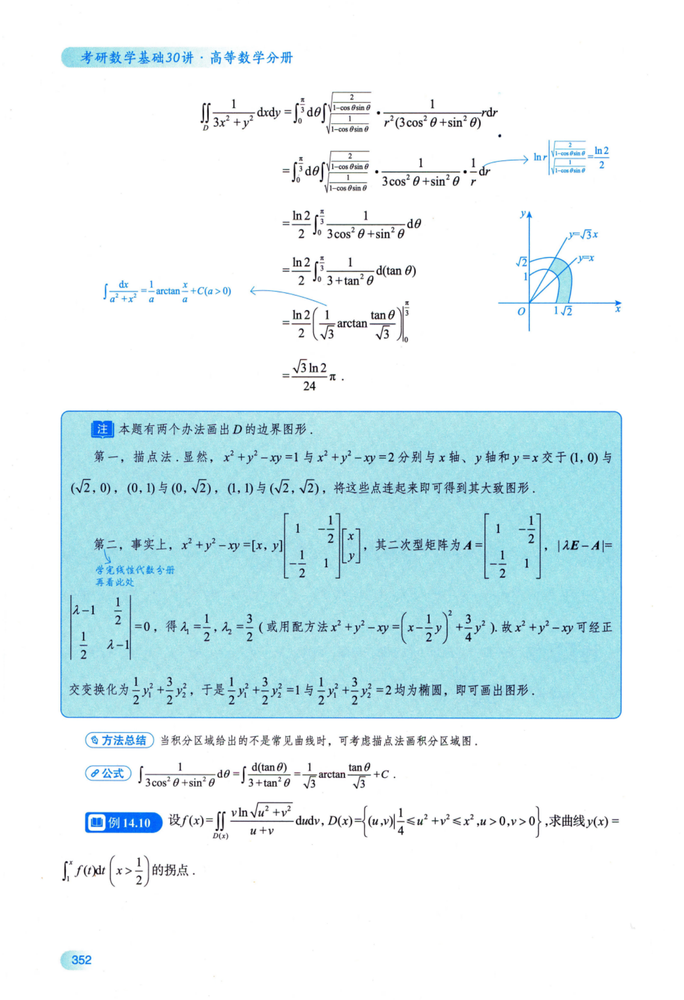

注本题有两个办法画出D的边界图形.

第一，描点法.显然， $x^{2}+y^{2}-xy=1$ 与 $x^{2} + y^{2} - xy = 2$ 分别与x轴、y轴和 $y = x$ 交于(1, 0) 与$(\sqrt{2}, 0), (0, 1)$ 与 $(0,\sqrt{2})$ ，(1,1)与 $(\sqrt{2}, \sqrt{2})$ ，将这些点连起来即可得到其大致图形

第二，事实上， $x^{2}+y^{2}-xy=\left [ x \right ]$ $\left[ \begin{array}{cc}1 & -\dfrac{1}{2} \\-\dfrac{1}{2} & 1\end{array} \right] \left[ \begin{array}{l}x \\y\end{array} \right]$ 其二次型矩阵为 $\boldsymbol{A} = \begin{bmatrix}
1 & -\dfrac{1}{2} \\
-\dfrac{1}{2} & 1
\end{bmatrix}$ $| \lambda \boldsymbol{E} - \boldsymbol{A} | =$ 学完线性代数分册  
再看此处  
$\left| \begin{matrix}
\lambda { - } 1 & \dfrac{1}{2} \\
\dfrac{1}{2} & \lambda { - } 1
\end{matrix} \right| = 0$ 得 $\lambda_{1} = \frac{1}{2}, \lambda_{2} = \frac{3}{2}$ (或用配方法 $x^{2}+y^{2}-xy=\left(x-\frac{1}{2}y\right)^{2}+\frac{3}{4}y^{2}$ 故 $x^{2}+y^{2}-xy$ 可经正交变换化为 $\frac{1}{2}y_{1}^{2}+\frac{3}{2}y_{2}^{2}$ 于是 $\frac{1}{2}y_{1}^{2}+\frac{3}{2}y_{2}^{2}=1$ 与 $\frac{1}{2}y_{1}^{2}+\frac{3}{2}y_{2}^{2}=2$ 均为椭圆，即可画出图形.

方法总结当积分区域给出的不是常见曲线时，可考虑描点法画积分区域图.

$$
\int \frac{1}{3\cos^{2}\theta + \sin^{2}\theta}\mathrm{d}\theta = \int \frac{\mathrm{d}(\tan\theta)}{3 + \tan^{2}\theta} = \frac{1}{\sqrt{3}}\arctan\frac{\tan\theta}{\sqrt{3}} + C
$$

例14.10 设 $f(x)=\iint_{D(x)}\frac{\nu\ln\sqrt{u^{2}+\nu^{2}}}{u+\nu}\mathrm{d}u\mathrm{d}\nu,D(x)=\left\{(u,\nu)\left|\frac{1}{4}\leqslant u^{2}+\nu^{2}\leqslant x^{2}\right.,u>0,\nu>0\right\}$ ,求曲线 $y ( x ) =$ $\int_{1}^{x} f(t) \mathrm{d}t \left( x > \frac{1}{2} \right)$ 的拐点.

分析积分区域关于y=x对称，同时观察被积函数的特点，所以考虑轮换对称性.又因为积分区域是 $\frac{1}{4}$ 个圆环，且被积函数含有平方和，所以考虑极坐标计算

因为本题最终求的是y(x)的二阶导数，即f(x)的一阶导数，所以不必要真正计算出二重积分，只转化为变限积分即可.

解由轮换对称性，根据例14.4知，有

$$
\begin{aligned}f(x) = & \frac{1}{4}\iint_{D(x)}\ln(u^{2} + v^{2})\mathrm{d}u\mathrm{d}v \\= & \frac{1}{4}\int_{0}^{\frac{\pi}{2}}\mathrm{d}\theta\int_{\frac{1}{2}}^{x}\ln r^{2} \cdot r\mathrm{d}r \\= & \frac{\pi}{4}\int_{\frac{1}{2}}^{x}r\ln r\mathrm{d}r,\end{aligned}
$$

故 $y^{\prime}(x) = f(x), \quad y^{\prime\prime}(x) = f^{\prime}(x) = \frac{\pi}{4}x\ln x \xlongequal{令} 0.$ ，得x=1.当 $\frac{1}{2} < x < 1$ 时， $y''(x) < 0$ ，当 $x > 1$ 时， $y''(x) > 0$ 于是(1,0)为y(x)的拐点.

方法总结积分区域D关于y=x对称，考虑轮换对称性，即利用 $\iint _ { D } f ( x , y ) \mathrm { d } \sigma = \frac { 1 } { 2 } \iint _ { D } \left[ f ( x , y ) + f ( y , x ) \right] \mathrm { d } \sigma$

$$
\int_{0}^{+\infty} \mathrm{e}^{-x^2}   dx
$$

分析因为 $\mathrm{e}^{ax^{2}+bx+c}(a \neq 0)$ 没有初等函数形式下的原函数，积分与字母无关，所以 $I = \int_{0}^{+ \infty} \mathrm{e}^{- x^{2}} \mathrm{d}x = \int_{0}^{+ \infty} \mathrm{e}^{- y^{2}} \mathrm{d}y$ 又因为 $\iint_{D} \mathrm{e}^{-(x^2 + y^2)}   d\sigma$ 易计算，所以计算 $I ^ { 2 }$ . 根据被积函数为 $x^{2} + y^{2}$ 的表达式，选择极坐标计算，将第一象限看成广义的 $\frac{1}{4}$ 个圆，其半径 $r   \rightarrow   + \infty$

解设 $I = \int_{0}^{+ \infty} \mathrm{e}^{- x^{2}} \mathrm{d}x$ ，则简化版解法

$$
\begin{aligned}I^{2} = & \int_{0}^{+ \infty}\mathrm{e}^{- x^{2}}\mathrm{d}x \cdot \int_{0}^{+ \infty}\mathrm{e}^{- x^{2}}\mathrm{d}x = \int_{0}^{+ \infty}\mathrm{e}^{- x^{2}}\mathrm{d}x \cdot \int_{0}^{+ \infty}\mathrm{e}^{- y^{2}}\mathrm{d}y \\= & \int_{0}^{+ \infty}\mathrm{d}x\int_{0}^{+ \infty}\mathrm{e}^{- (x^{2} + y^{2})}\mathrm{d}y = \iint_{0 \leq x < + \infty \atop 0 \leq y < + \infty}\mathrm{e}^{- (x^{2} + y^{2})}\mathrm{d}x\mathrm{d}y \\= & \int_{0}^{\frac{\pi}{2}}\mathrm{d}\theta \cdot \int_{0}^{+ \infty}\mathrm{e}^{- r^{2}}\mathrm{d}r = \frac{\pi}{2} \cdot \left( - \frac{1}{2} \right)\int_{0}^{+ \infty}\mathrm{e}^{- r^{2}}\mathrm{d}( - r^{2}) \\= & - \frac{\pi}{4}\mathrm{e}^{- r^{2}}\bigg|_{0}^{+ \infty} = \frac{\pi}{4},\end{aligned}
$$

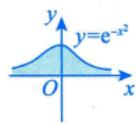

$\int_{-\infty}^{+\infty} \mathrm{e}^{-x^2}   dx = \sqrt{\pi}$ ，这叫高斯积分，如同欧拉公式 $\mathrm{e}^{\pi \mathrm{i}} + 1 = 0$ 样美妙.它们都同时包含e，π

由积分的保号性知 $I > 0$ ，故 $I = \int_{0}^{+ \infty} \mathrm{e}^{- x^{2}} \mathrm{d}x = \frac{\sqrt{\pi}}{2}$

注应记住这一结果，它经常被用到，如例14.12.

方法总结积分与字母用谁无关！

$$
\iint _ { D _ { y y } } f ( x , y ) \mathrm { d } x \mathrm { d } y = \iint _ { D _ { y x } } f ( y , x ) \mathrm { d } y \mathrm { d } x , \int _ { a } ^ { b } f ( x ) \mathrm { d } x = \int _ { a } ^ { b } f ( t ) \mathrm { d } t .
$$

公式 $\int \mathrm{e}^{-x} \mathrm{d}x = -\mathrm{e}^{-x} + C$

例14.12 计算 $\int_{-\infty}^{+\infty} x^2 \mathrm{e}^{-x^2}   dx$

分析 被积函数为偶函数，因为 $\int_{-\infty}^{+\infty} x^2 \mathrm{e}^{-x^2}   dx$ 收敛，所以可以用对称性处理，然后借助Γ函数计算结果.

解 $\int_{-\infty}^{+\infty} x^2 \mathrm{e}^{-x^2}   dx = 2\int_{0}^{+\infty} x^2 \mathrm{e}^{-x^2}   dx$ ，又由例9.28知， $2\int_{0}^{+\infty} x^{2}e^{-x^{2}} \mathrm{d}x = 2\int_{0}^{+\infty} x^{2}e^{-x^{2}} \mathrm{d}x = \Gamma\left(\frac{3}{2}\right) = \frac{1}{2} \cdot \Gamma\left(\frac{1}{2}\right) =$ $\frac{\sqrt{\pi}}{2}$ .故 $\int_{-\infty}^{+\infty} x^2 \mathrm{e}^{-x^2}  \mathrm{d}x = \frac{\sqrt{\pi}}{2}$

注本题若不用Γ函数，对于 $\int_{0}^{+\infty} x^{2} \mathrm{e}^{-x^{2}} \mathrm{d}x$ ，要这样算：

$$
\begin{aligned}\int_{0}^{+\infty} x^{2} \mathrm{e}^{-x^{2}} \mathrm{d}x = & \int_{0}^{+\infty} \left(-\frac{1}{2}\right) x \mathrm{e}^{-x^{2}} \mathrm{d}(-x^{2}) = \int_{0}^{+\infty} \left(-\frac{1}{2}\right) x \mathrm{d}(\mathrm{e}^{-x^{2}}) \\= & -\frac{1}{2} x \mathrm{e}^{-x^{2}} \bigg|_{0}^{+\infty} - \int_{0}^{+\infty} \left(-\frac{1}{2}\right) \mathrm{e}^{-x^{2}} \mathrm{d}x \\= & 0 + \frac{1}{2} \int_{0}^{+\infty} \mathrm{e}^{-x^{2}} \mathrm{d}x = \frac{\sqrt{\pi}}{4},\end{aligned}
$$

故 $\int_{-\infty}^{+\infty} x^2 \mathrm{e}^{-x^2}  \mathrm{d}x = \frac{\sqrt{\pi}}{2}$ 显然，这是相对麻烦的

方法总结 Γ函数的相关结论要牢记： $\Gamma(\alpha) = \int_{0}^{+\infty} x^{\alpha-1} \mathrm{e}^{-x}   dx$ $\Gamma ( \alpha + 1 ) = \alpha \Gamma ( \alpha )$

例14.13 已知 $\lim_{x \to +\infty} \frac{\int_{0}^{x} t^2 \mathrm{e}^{x^2 - t^2}   dt + a \mathrm{e}^{x^2}}{x^b} = -\frac{1}{2}$ ，求 $a , b$ 的值.

分析一开始，可能看不出是什么类型的未定式，作恒等变形(分子分母同时除以 $\mathrm{e}^{x^{2}} \; )$ 再看.

解

$$
\lim_{x \to +\infty} \frac{\int_{0}^{x} t^2 e^{-t^2}   dt + a}{x^b e^{-x^2}} = -\frac{1}{2}
$$

此时不论b取何值， $\lim_{x \to +\infty} x^b \mathrm{e}^{-x^2} = 0$ ，即判定为 $ \text{" }\frac{0}{0} \text{" }$ 型(事实上，变形前为 $ \text{" }\frac{\infty}{\infty} \text{" }$ 型).

故

$$
\lim _ { x \rightarrow + \infty } \left( \int _ { 0 } ^ { x } t ^ { 2 } \mathrm { e } ^ { - t ^ { 2 } } \mathrm { d } t + a \right) = 0 ,
$$

于是

$$
a = - \int_{0}^{+ \infty} t^{2} e^{- t^{2}} \mathrm{d}t = - \frac{\sqrt{\pi}}{4}
$$

则

$$
\begin{aligned}\lim_{x \rightarrow +\infty} \frac{\int_{0}^{x} t^{2} \mathrm{e}^{-t^{2}} \mathrm{d}t - \frac{\sqrt{\pi}}{4}}{x^{b} \mathrm{e}^{-x^{2}}} & \xlongequal{洛必达法则} \lim_{x \rightarrow +\infty} \frac{x^{2} \mathrm{e}^{-x^{2}}}{bx^{b-1} \mathrm{e}^{-x^{2}} + x^{b} \mathrm{e}^{-x^{2}}(-2x)} \\= \lim_{x \rightarrow +\infty} \frac{x^{2}}{bx^{b-1} - 2x^{b+1}} & = -\frac{1}{2},\end{aligned}
$$

故b=1.

方法总结当分母→0时，若分式的极限不为0，则可知分子→0.

$$
\lim_{x \to +\infty} \frac{e^{x^2}}{\int_{0}^{x} \left( \left| \int_{0}^{x} t^2 e^{-t^2}   dt \right| + a \right)} = \infty
$$

无穷大 常数常数

公式 $\int_{0}^{+\infty} t^{2} \mathrm{e}^{-t^{2}} \mathrm{d}t = \frac{\sqrt{\pi}}{4}$

## ③极坐标系与直角坐标系的互相转化

一是用好 $\begin{cases}x = r \cos \theta, \\y = r \sin \theta\end{cases}$ 这个公式；二是画出区域D的边界图形，做好上限、下限的转化

例14.14 $\int_{0}^{1} \mathrm{d}x \int_{1 - x}^{\sqrt{1 - x^{2}}} \frac{x + y}{x^{2} + y^{2}} \mathrm{d}y$ =

分析本题乍一看，也许我们会先考虑题目是否在积分次序上设置了障碍，是否需要交换积分次序再做积分，但是，细致做来，我们会发现不管是先对x积分，还是先对y积分，都不容易计算.看来这不是积分次序上的问题，这时想想看是不是选择何种坐标系的问题呢？被积函数中含有 $x^{2} + y^{2}$ 的形式，且积分区域是圆的一部分，如图14-9所示，显然应该优先考虑极坐标系，题目给出的却是直角坐标系，我们需要改变一下.

  
图 14-9

即使发现区域D关于y=x对称，使用轮换对称性 $f(x,   y) + f(y,   x)$ 的等式仍复杂，所以不用轮换对称性，只需要放在极坐标下计算即可.

应填 $2 - \frac{\pi}{2}$

$$
\begin{aligned} \int_0^{\frac{\pi}{2}} \mathrm{d}\theta \int_{\frac{1}{\cos\theta+\sin\theta}}^1 \frac{r\cos\theta + r\sin\theta}{r^2} r \mathrm{d}r = \int_0^{\frac{\pi}{2}} (\cos\theta+\sin\theta)\left(1 - \frac{1}{\cos\theta+\sin\theta}\right) \mathrm{d}\theta \end{aligned}
$$

方法总结当题目是累次积分时，通常考虑换积分顺序或者换坐标系.

公式 $\int \cos \theta \mathrm{d}\theta = \sin \theta + C , \quad \int \sin \theta \mathrm{d}\theta = -\cos \theta + C$

## 4换元法

二重积分亦有和定积分一脉相承的换元法，有时很有用，现介绍于此，供参考，若能够用上，可直接使用，不必证明.

先回顾一元函数积分换元法，见 $ \text{" } \textcircled{1}  \text{" }$ ，再看二重积分换元法，见 $ \text{" } \textcircled{2}  \text{" }$

① $\int _ { a } ^ { b } f ( x ) \mathrm { d } x = \varphi ( t ) \int _ { a } ^ { \beta } f [ \varphi ( t ) ] \varphi ^ { \prime } ( t ) \mathrm { d } t$ a. $\left. \begin{aligned} & f(x) \rightarrow f[\varphi(t)] . \\ & \int_{a}^{b} \rightarrow \int_{\alpha}^{\beta} . \\ & \mathrm{d}x \rightarrow \varphi^{\prime}(t) \mathrm{d}t . \end{aligned} \right\}$   
b. 换元的三换   
C.

注意： $x = \varphi(t)$ 单调，存在一阶连续导数.

② $\iint _ { D _ { u v } } f ( x , y ) \mathrm { d } x \mathrm { d } y \frac { x = x ( u , v ) } { y = y ( u , v ) } \iint _ { D _ { u v } } f [ x ( u , v ) , y ( u , v ) ] \left| \frac { \partial ( x , y ) } { \partial ( u , v ) } \right| \mathrm { d } u \mathrm { d } v$   
a. $f(x, y) \to f[x(u, v), y(u, v)]$   
b. $\iint\limits_{D_{xy}} \rightarrow \iint\limits_{D_{uv}}$   
C. $\mathrm{d}x\mathrm{d}y \to \left| \frac{\hat{\sigma}(x, y)}{\hat{\sigma}(u, v)} \right| \mathrm{d}u\mathrm{d}v$ J行列式的绝对值

注意：其中 $\begin{cases}x = x(u, v), \\y = y(u, v)\end{cases}$ 是(x，y)面到(u, ν)面的一对一映射， $x = x(u, v), y = y(u, v)$ 存在一阶连续偏导数， $\frac{\partial(x, y)}{\partial(u, \nu)} = \frac{\left| \begin{matrix}
\widehat{\partial x} & \widehat{\partial x} \\
\widehat{\partial u} & \widehat{\partial \nu} \\
\widehat{\partial y} & \widehat{\partial y}
\end{matrix} \right|}{\left| \begin{matrix}
\widehat{\partial y} & \widehat{\partial y} \\
\widehat{\partial u} & \widehat{\partial \nu}
\end{matrix} \right|} \neq 0$ 二阶行列式，称为J行列式

另外，令 $\begin{cases}x = r \cos \theta, \\y = r \sin \theta,\end{cases}$ 则

$$
\begin{aligned}\iint_{D_{xy}} f(x, y) \mathrm{d}x\mathrm{d}y = & \iint_{D_{xy}} f(r \cos \theta, r \sin \theta) \left| \begin{matrix}
\partial x & \partial x \\
\partial r & \partial \theta \\
\partial y & \partial \theta
\end{matrix} \right| \mathrm{d}r\mathrm{d}\theta \quad  换元法  \quad \\= & \iint_{D_{xy}} f(r \cos \theta, r \sin \theta) \left| \begin{matrix}
\cos \theta & -r \sin \theta \\
\sin \theta & r \cos \theta
\end{matrix} \right| \mathrm{d}r\mathrm{d}\theta = \iint_{D_{xy}} f(r \cos \theta, r \sin \theta) r \mathrm{d}r\mathrm{d}\theta .\end{aligned}
$$

这就是直角坐标系到极坐标系的换元过程.

例14.15 设平面区域 $D = \left\{ (x, y) \mid 0 \leqslant x \leqslant 1 - y, 0 \leqslant y \leqslant 1 \right\}$ ，计算二重积分 $\iint_{D} \mathrm{e}^{\frac{y}{x + y}} \mathrm{d}\sigma$

分析虽然积分区域简单，但是无论是先积x，还是先积y，都比较困难.若考虑极坐标系，由于积分区域是三角形，计算量也很大，主要是e的指数为 $\frac{y}{x + y}$ ，造成“头重脚轻”，可以考虑换元，令 $\begin{cases}x + y = u, \\y = v,\end{cases}$ 则 $\frac{y}{x + y}$ 就变为 $\frac { \nu } { u }$ 此时积分区域变为另一个三角形区域，被积函数也变得简单.

解令 $\begin{cases}x + y = u, \\y = v,\end{cases}$ 则 $\begin{cases}x = u - v, \\y = v,\end{cases}$

$$
J = \left| \begin{aligned} \frac{\partial x}{\partial u} & \quad \frac{\partial x}{\partial \nu} \\ \frac{\partial y}{\partial u} & \quad \frac{\partial y}{\partial \nu} \end{aligned} \right| = \left| \begin{aligned} 1 & \quad -1 \\ 0 & \quad 1 \end{aligned} \right| = 1 ,
$$

且由 $\begin{cases}0 \leqslant x \leqslant 1 - y, \\0 \leqslant y \leqslant 1,\end{cases}$ 知 $\begin{cases}v \leqslant u \leqslant 1, \\0 \leqslant v \leqslant 1,\end{cases}$ 如图14-10所示.故

  
图 14-10

$$
\begin{aligned}I = & \iint_{D} \mathrm{e}^{\frac{y}{x + y}} \mathrm{d}\sigma = \iint_{D_{uv}} \mathrm{e}^{\frac{y}{u}} \left| J \right| \mathrm{d}u \mathrm{d}v = \int_{0}^{1} \mathrm{d}u \int_{0}^{u} \mathrm{e}^{\frac{y}{u}} \mathrm{d}v \\= & \int_{0}^{1} u \mathrm{e}^{u} \bigg|_{v = 0}^{v = u} \mathrm{d}u = \int_{0}^{1} u(\mathrm{e} - 1) \mathrm{d}u = \frac{1}{2}(\mathrm{e} - 1).\end{aligned}
$$

注此题亦可用常规方法（极坐标系，见图14-11）求解：

$$
\begin{aligned} I = & \int_{0}^{\frac{\pi}{2}} \mathrm{d}\theta \int_{0}^{\frac{1}{\cos \theta + \sin \theta}} \mathrm{e}^{\frac{\sin \theta}{\cos \theta + \sin \theta}} r \mathrm{d}r \\ = & \int_{0}^{\frac{\pi}{2}} \mathrm{e}^{\frac{\sin \theta}{\cos \theta + \sin \theta}} \bullet \frac{r^2}{r} \bigg|_{0}^{\frac{1}{\cos \theta + \sin \theta}} \mathrm{d}\theta \\ \\ = & \frac{1}{2} \int_{0}^{\frac{\pi}{2}} \mathrm{e}^{\frac{\sin \theta}{\cos \theta + \sin \theta}} \frac{1}{\left( \cos \theta + \sin \theta \right)^2} \mathrm{d}\theta \\ = & \frac{1}{2} \int_{0}^{\frac{\pi}{2}} \mathrm{e}^{\frac{\sin \theta}{\cos \theta + \sin \theta}} \mathrm{d}\left( \frac{\sin \theta}{\cos \theta + \sin \theta} \right) \\ = & \frac{1}{2} \mathrm{e}^{\frac{\sin \theta}{\cos \theta + \sin \theta}} \bigg|_{0}^{\frac{\pi}{2}} = \frac{1}{2} (\mathrm{e} - 1) . \end{aligned}
$$

  
图 14-11

方法总结二重积分的换元：注意“三换”，换积分区域，换被积函数，换积分变量.极坐标换元 $\begin{cases}x = r \cos \theta, \\y = r \sin \theta\end{cases}$ 仅是一种换元法.

如图14-12所示，将平面有界闭区域D任意分成n个小闭区域， $\Delta \sigma_{i}(i = 1,2,\cdots,n)$ 为面积，在$\Delta \sigma _ { i }$ 中任取一点 $(\xi_{i}, \eta_{i})$ ，记 $\lambda = \max_{i} \{ \Delta \sigma_{i} \}$ ，则

$$
\Delta V _ { i } = 2 \pi r _ { i } \Delta \sigma _ { i } = 2 \pi \frac { \left| a \xi _ { i } + b \eta _ { i } + c \right| } { \sqrt { a ^ { 2 } + b ^ { 2 } } } \Delta \sigma _ { i } ,
$$

故

$$
\begin{aligned}V = & \lim_{\lambda \rightarrow 0} \sum_{i = 1}^{n} \Delta V_{i} = \lim_{\lambda \rightarrow 0} \sum_{i = 1}^{n} 2\pi \frac{\left| a\xi_{i} + b\eta_{i} + c \right|}{\sqrt{a^{2} + b^{2}}} \Delta \sigma_{i} \\= & \iint_{D} 2\pi \frac{\left| ax + by + c \right|}{\sqrt{a^{2} + b^{2}}} \mathrm{d}\sigma \\= & \frac{2\pi}{\sqrt{a^{2} + b^{2}}} \iint_{D} \left| ax + by + c \right| \mathrm{d}\sigma .\end{aligned}\tag{14-1}
$$

与第12讲的公式(12-5) 比较，得

即

$$
\begin{aligned}r(\overline{x}, \overline{y}) = & \frac{M_{L_0}}{M} = \frac{2\pi M_{L_0}}{2\pi M} = \frac{V}{2\pi \bullet S} , \\\frac{V}{\sqrt{}} = & 2\pi \bullet S \cdot \underline{r(\overline{x}, \overline{y})} . \star \\\overset{ 炭轮体 }{\underset{ 岭体积 }{=}} \quad & \overset{ 平面区域 }{\underset{ 岭体 }{=}} \quad \overset{\text{1 }}{\underset{ 彩心 }{\rightleftharpoons}} (\overline{x}, \overline{y})  到  \\ 岭体积  \quad & D  岭面积  \quad \overset{\text{2 }}{\underset{ 炭轮轴 }{=}} \overset{\text{3 }}{\underset{ 岭面 }{=}} \overset{\text{4 }}{\underset{ 岭面 }{\rightleftharpoons}}\end{aligned}
$$

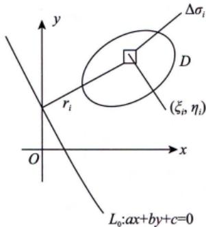  
图 14-12

例14.16曲线 $y = \sin x ( 0 \leqslant x \leqslant 2 \pi )$ 与x轴所围区域D绕直线 $y = - x$ 旋转一周所成的旋转体的体积为

解应填 $4 \sqrt { 2 } \pi ^ { 2 }$

由古鲁金第二定理，有

$$
\begin{aligned}V &= 2\pi \cdot S \cdot \frac{r(\bar{x}, \bar{y})}{\sqrt{2}} \\&= 2\pi \cdot 4 \cdot \frac{\pi}{\sqrt{2}} = 4\sqrt{2}\pi^{2} .\end{aligned}
$$

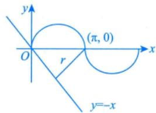

例14.17设D为 $(x - 1)^{2} + y^{2} = 1$ 与 $(x - 2)^{2} + y^{2} = 2^{2}$ 及x轴所围区域在第一象限的部分，则D的形心(x，y)= D

解应填 $\left( \frac{7}{3}, \frac{28}{9\pi} \right)$

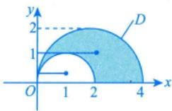

D绕y轴旋转一周所成的旋转体的体积

$$
V = 2\pi \cdot \frac{\pi \cdot 2^{2}}{2} \cdot 2 - 2\pi \cdot \frac{\pi \cdot 1^{2}}{2} \cdot 1 = 7\pi^{2}
$$

故D的形心到y轴的距离为 $r(\bar{x}, \bar{y}) = \frac{V}{2\pi S} = \frac{7\pi^{2}}{2\pi(\pi \cdot 2^{2} - \pi \cdot 1^{2}) \cdot \frac{1}{2}} = \frac{7}{3}$

显然，即 $\overline{x} = \frac{7}{3}$ .同理可求得 $\overline{y} = \frac{28}{9\pi}$

注的求解较稍微复杂一些，要先求出半圆域 $(x - 1)^{2} + y^{2} \leqslant 1 (y \geqslant 0)$ 与半圆域 $(x - 2)^{2} + y^{2} \leq$ $2^{2}(y \geqslant 0)$ 的形心竖坐标 $\overline{y}_{1}, \overline{y}_{2}$

由 $\bar{y}_{1}=\frac{\iint y\mathrm{d}\sigma}{\iint\mathrm{d}\sigma}=\frac{\int_{0}^{\frac{\pi}{2}}\mathrm{d}\theta\int_{0}^{2\cos\theta}r\sin\theta\cdot r\mathrm{d}r}{\pi\cdot1^{2}\cdot\frac{1}{2}}=\frac{4}{3\pi}$ 得 $\overline{y}_{1}=\frac{4}{3\pi}$ 同理可得 $\overline{y}_{2}=\frac{8}{3\pi}$ 则D绕x轴旋转一周所成的旋转体的体积

$$
V_{x}=2\pi\cdot\frac{\pi\cdot2^{2}}{2}\cdot\frac{8}{3\pi}-2\pi\cdot\frac{\pi\cdot1^{2}}{2}\cdot\frac{4}{3\pi}=\frac{28\pi}{3}
$$

故D的形心到x轴的距离为

$$
r(\overline{x}, \overline{y}) = \frac{V_{x}}{2\pi S} = \frac{\frac{28\pi}{3}}{2\pi(\pi \cdot 2^{2} - \pi \cdot 1^{2}) \cdot \frac{1}{2}} = \frac{28}{9\pi},
$$

即 $\overline{y} = \frac{28}{9\pi}$

## 平面区域D大观

要想正确计算二重积分，准确画出平面区域D是必不可少的基本功，本讲最后，总 回结出常见的平面区域D的图形及表达，考生应多画、多练，这些图不是背的，而是训练画区域能力的素材.

## 直角坐标系下直线边界型

考生应能熟练画出平面区域D.

(1) $D = \left\{ (x,y) \mid 0 \leqslant x \leqslant 1, 0 \leqslant y \leqslant 1 \right\}$

(3) $D = \left\{ (x,y) \mid 0 \leqslant x \leqslant 1, 0 \leqslant y \leqslant x \right\}$

(2) $\left\{ (x,y) \mid x+y \leq 1, x \geq 0, y \geq 0 \right\}$

(4) $\left\{ (x,y) \mid 0 \leqslant x \leqslant 2, x \leqslant y \leqslant \sqrt{3}x \right\}$

(5) $D = \left\{ (x,y) \mid 0 \leqslant x \leqslant \pi, 0 \leqslant y \leqslant 1 \right\}$

(6) $\left\{ (x,y) \mid 1 \leqslant x + y \leqslant 2, x \geqslant 0, y \geqslant 0 \right\}$

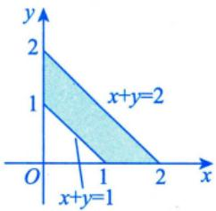

(7) $D=\left\{ (x,y) \mid 0 \leqslant x \leqslant 3,0 \leqslant y \leqslant 3,\frac{\sqrt{3}}{3}x \leqslant y \leqslant \sqrt{3}x \right\}$ .(8) $\left\{ (x,y) \mid 1 \leqslant x + y \leqslant 2, 0 \leqslant y \leqslant x \right\}$

(9) $\left\{ (x,y) \mid 0 \leqslant x + y \leqslant 1, 0 \leqslant y \leqslant 1 \right\}$

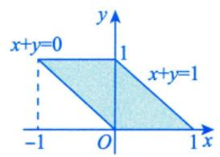

(11) $\begin{aligned}D = \left\{ (x,y) \mid x \leqslant 1, y \geqslant -1, y \leqslant x \right\}\end{aligned}$

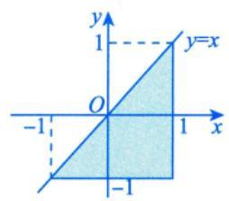

(13) $D = \left\{ (x,y) \mid 0 \leqslant x \leqslant 1, x \leqslant y \leqslant 1 + x \right\}$

(15) $D = \left\{ (x,y) \mid |x| + |y| \leq 1 \right\}$

(10) $D = \left\{ (x,y) \mid 0 \leqslant x \leqslant 1, x \leqslant y \leqslant 1 \right\}$

(12) $\left\{ (x,y) \middle| \frac{1}{4} \leqslant y \leqslant \frac{1}{2}, y \leqslant x \leqslant \frac{1}{2} \right\}$

(14) $\begin{aligned}D = \{ (x,y) | x \leqslant 3y,y \leqslant 3x,x + y \leqslant 8 \}\end{aligned}$

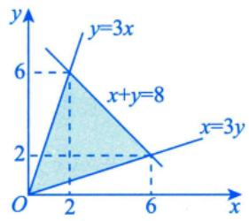

$$
\left( 1 6 \right) D = \left\{ \left( x , y \right) \bigg| 0 \leqslant x \leqslant 1 , 0 \leqslant y \leqslant 1 , \left| x - y \right| \leqslant \frac { 1 } { 2 } \right\} .
$$

(17) $D = \left\{ (x,y) \mid |x| \leq 1, |y| \leq 1 \right\}$

## 2直角坐标系下曲线边界型

考生应能熟练画出平面区域D.

(1) $\left\{ (x,y) \mid 0 \leqslant x \leqslant 1,\sqrt[3]{x} \leqslant y \leqslant 1 \right\}$

(2) $\left\{ (x,y) \mid 0 \leqslant x \leqslant 1, \arctan x \leqslant y \leqslant \frac{\pi}{4} \right\}$

(3) $D=\left\{ (x,y) \mid 0 \leqslant x \leqslant 1,0 \leqslant y \leqslant 1,(x-1)^{2}+(y-1)^{2} \leqslant 1 \right\}$ . (4) $\left\{ (x,y) \mid 0 \leqslant y \leqslant x,x^{2} + y^{2} \leqslant 1 \right\}$

(5) $\begin{aligned}D = \left\{ (x,y) \mid 1 \leq x^{2} + y^{2} \leq \mathrm{e}^{2}, x \geq 0, y \geq 0 \right\}\end{aligned}$

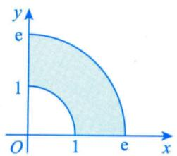

(7) $\left\{ (x,y) \mid (x-1)^{2}+(y-1)^{2} \leqslant 2,0 \leqslant x+y \leqslant 4 \right\}$

(9) $\left\{ (x,y) \mid 0 \leqslant x \leqslant \ln 2, \mathrm{e}^{x} \leqslant y \leqslant 2 \right\}$

(6) $D = \left\{ (x,y) \mid y \geq -x, x^2 + y^2 \leq 4 \right\}$

$$
x^{2}+y^{2}\geqslant 2x,y\geqslant 0\}
$$

(8) $\left\{ (x,y) \middle| \frac{1}{4} \leqslant x^{2} + y^{2},x^{2} + y^{2} \geqslant x^{4} + y^{4} \right.,$

(10) $D=\left\{ (x,y) \middle| 0 \leqslant y \leqslant 1,0 \leqslant x \leqslant 1-\sqrt{2y-y^{2}} \right\}$

(11) $\left\{ (x,y) \mid x^{2} + y^{2} \leqslant \sqrt{2}x,0 \leqslant y \leqslant x,\sqrt{x^{2} + y^{2}} \leqslant 1 \right\}$ .(12) $\begin{aligned}D = \left\{ (x,y) \mid (x^2 + y^2)^2 \leq 2xy, x \geq 0, y \geq 0 \right\}\end{aligned}$

(13) $D = \left\{ (x,y) \mid x \geqslant 1, x^2 \leqslant y \right\}$

(15) $\left\{ (x,y) \left| \frac{1-x}{1+x} \leqslant y \leqslant \sqrt{1-x^{2}} \right. , 0 \leqslant x \leqslant 1 \right\}$

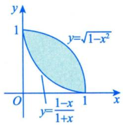

(17) $\left\{ (x,y) \mid y \leqslant \sqrt{1-x^{2}} , y \geqslant 1-\sqrt{1-x^{2}} \right\}$

(19) $\begin{aligned}D = \left\{ (x,y) \mid (x^2 + y^2)^2 \leq 2xy \right\}\end{aligned}$

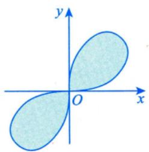

(14) $\left\{ (x,y) \mid y \leqslant \sqrt{2x - x^{2}} ,x + y \geqslant 2 \right\}$

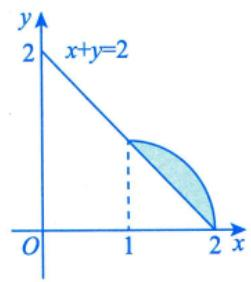

(16) $\begin{aligned}D = \left\{ (x,y) \mid x + y + xy \geq 1, x^2 + y^2 \leq 1, x \geq 0, y \geq 0 \right\}\end{aligned}$

(18) $\begin{aligned}D = \left\{ (x,y) \mid x^{2} + y^{2} \leqslant 4,2x - x^{2} - y^{2} \leqslant 0 \right\}\end{aligned}$

(20) $\left\{ (x,y) \mid 0 \leqslant y \leqslant 1, - \sqrt{1 - y^{2}} \leqslant x \leqslant 1 - y \right\}$

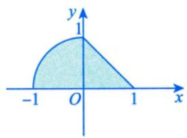

(21) $D=\left\{(x,y)\left|\sqrt{1-x^{2}}\leqslant y\leqslant\sqrt{4-x^{2}},-x\leqslant y,y\geqslant0\right.\right\}. \quad D=\left\{(x,y)\left|1\leqslant x^{2}+y^{2}\leqslant2x,y\geqslant0\right.\right\}$

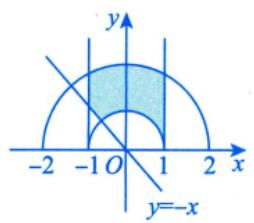

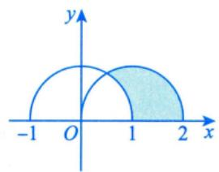

(23) $\begin{aligned}D = \left\{ (x,y) \mid (x^2 + y^2)^2 \leq x^2 - y^2, x \geq 0 \right\}\end{aligned}$

(24) $\left\{ (x,y) \mid 0 \leqslant x \leqslant 2,0 \leqslant y \leqslant 4 - x^{2} \right\}$

(25) $\left\{ (x,y) \middle| \sin x \leqslant y \leqslant 1, \frac{\pi}{2} \leqslant x \leqslant \pi \right\} .$

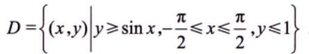

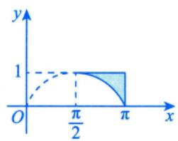

(27) $\left\{ (x,y) \mid 2xy \leqslant 1,4xy \geqslant 1,y \geqslant x,y \leqslant \sqrt{3}x \right\}$

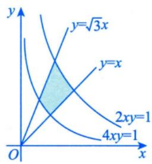

(28) $\begin{aligned}D = \left\{ (x,y) \mid -1 \leqslant x \leqslant 0, -x \leqslant y \leqslant 2 - x^{2} \right\}\end{aligned}$

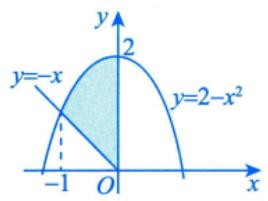

(29) $\begin{aligned}D = \left\{ (x,y) \mid 4x^{2} \leqslant y \leqslant 9x^{2} ,x \geqslant 0 \right\}\end{aligned}$

(31) $\left\{ (x,y) \mid x \geqslant - 2,0 \leqslant y \leqslant 2,x \leqslant - \sqrt{2y - y^{2}} \right\}$

(33) $\begin{aligned}D = \left\{ (x,y) \mid x^{2} + y^{2} \leqslant 4,(x + 1)^{2} + y^{2} \geqslant 1 \right\}\end{aligned}$

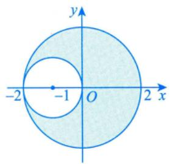

(35) $\begin{aligned}D = \left\{ (x,y) \mid x \leqslant \sqrt{1 + y^{2}}, x + \sqrt{2}y \geqslant 0 \right\}\end{aligned}$

$$
x - \sqrt{2} y \geqslant 0 \Big \}
$$

(30) $D=\left\{ (x,y) \mid 0 \leqslant y \leqslant 1,\sqrt{y} \leqslant x \leqslant \sqrt{2-y^{2}} \right\}$

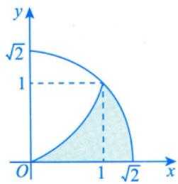

(32) $\left\{ (x,y) \middle| 0 \leqslant y \leqslant \frac{1}{4},y \leqslant x \leqslant \sqrt{y} \right\}$

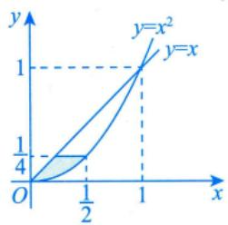

(34) $\begin{aligned}D_{1}=\left\{(x, y) \mid x^{2}+y^{2} \leqslant 1, x \geqslant 0, y \geqslant 0\right\}\end{aligned}$

$$
D_{2}=\left\{ (x,y) \mid x^{2}+y^{2} \geqslant 1,0 \leqslant x \leqslant 1,0 \leqslant y \leqslant 1 \right\} .
$$

(36) $D = \left\{ (x,y) \mid 0 \leqslant x \leqslant 1, 0 \leqslant y \leqslant \sqrt{x} \right\} .$

(44)

(37) $\begin{aligned}D = \left\{ (x,y) \mid 0 \leqslant x \leqslant 1, x^2 \leqslant y \leqslant 1 \right\}\end{aligned}$

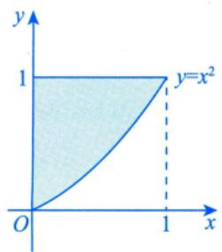

(39) $\left\{ (x,y) \mid 2 \leq x \leq 4, \sqrt{x} \leq y \leq 2 \right\}$

(41) $\left\{ (x,y) \middle| \frac{1}{2} \leqslant y \leqslant 1, y \leqslant x \leqslant \sqrt{y} \right\}$

(43) $\begin{aligned}D = \left\{ (x,y) \mid x^{2} + y^{2} + xy \leq 1 \right\}\end{aligned}$

(38) $D = \left\{ (x,y) \mid 1 \leqslant x \leqslant 2, \sqrt{x} \leqslant y \leqslant x \right\}$

(40) $\left\{ (x,y) \middle| \frac{1}{4} \leqslant y \leqslant \frac{1}{2}, \frac{1}{2} \leqslant x \leqslant \sqrt{y} \right\}$

(42) $\begin{aligned}D = \left\{ (x,y) \mid 2 \leqslant 2x^{2} + y^{2} \leqslant 4,x \geqslant 0,y \geqslant 0 \right\}\end{aligned}$

$$
D = \left\{ (x,y) \middle| 0 \leqslant x \leqslant 2, 0 \leqslant y \leqslant 2, y \leqslant \frac{1}{x} \right\}
$$

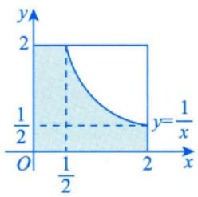

## ③ 极坐标方程型

考生应能熟练画出平面区域D.

(1) $\left\{ (r,\theta) \middle| 0 \leqslant r \leqslant \frac{1}{\sin \theta}, \frac{\pi}{4} \leqslant \theta \leqslant \frac{\pi}{2} \right\}$

(3) $D = \left\{ (r,\ \theta) \middle| 0 \leq \theta \leq 2\pi, \frac{\theta}{2} \leq r \leq \pi \right\}$

(5) $\left\{ (r,\ \theta) \middle| \frac{1}{\sqrt{\sin \theta \cos \theta}} \leqslant r \leqslant \frac{2}{\cos \theta} \right\}$

$$
\arctan \frac{1}{4} \leqslant \theta \leqslant \frac{\pi}{4}
$$

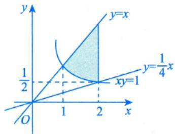

$$
\left( \left( r , \theta \right) \bigg| 0 \leqslant r \leqslant \sqrt{\sin 2\theta} , 0 \leqslant \theta \leqslant \frac{\pi}{2} \right\} .
$$

(2) $D = \left\{ (r,\theta) \middle| 0 \leqslant r \leqslant \sec \theta, 0 \leqslant \theta \leqslant \frac{\pi}{4} \right\}$

(4) $D = \left\{ (r,\theta) \middle| 0 \leqslant r \leqslant 1, 0 \leqslant \theta \leqslant \frac{\pi}{4} \right\}$

$$
D = \left\{ (r,\theta) \middle| 2 \leq r \leq 2(1 + \cos \theta), - \frac{\pi}{2} \leq \theta \leq \frac{\pi}{2} \right\}
$$

$$
\left( \textrm{8} \right) D = \left\{ \left( r , \theta \right) \bigg| 0 \leqslant \theta \leqslant \frac{\pi}{2} , 0 \leqslant r \leqslant 2 \cos \theta \right\}
$$

$$
0 \leqslant r \leqslant \frac{2}{\cos \theta + \sin \theta}
$$

(9)D=(r,)0<≤2,−aros≤<accs] .(10)D={(r,θ)|0≤r≤2(sinθ+cosθ), π ≤θ≤3π

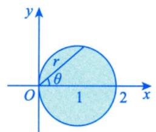

(11) D={(r,)|0≤r≤2sinθ,0≤0≤π]

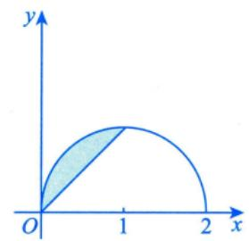

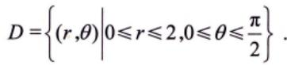

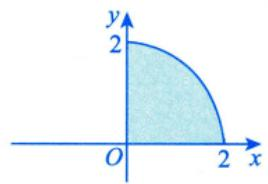

(15) $D = \left\{ (r,\theta) | 1 \leq r \leq u, 0 \leq \theta \leq v \right\}$

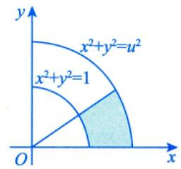

注有些D是用直角坐标系下的表达式描述的，但实际上用极坐标方程更方便，要归到这里来如2019年考研真题数学二（18）的平面区域为 $\begin{aligned}D = \left\{ (x,y) \mid |x| \leqslant y, (x^{2} + y^{2})^{3} \leqslant y^{4} \right\}\end{aligned}$

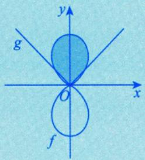

$$
g:y=\left | x \right | ,f:y^{4}=\left ( x^{2}+y^{2} \right ) ^{3}
$$

## 4参数方程型

考生应能熟练画出平面区域D

(1) $D=\left\{(x,y)\mid 0\leqslant y\leqslant t-x,0\leqslant x\leqslant t,0<t\leqslant1\right\}$

(2) $D = \left\{ (x,y) \mid 0 \leqslant x \leqslant t, x \leqslant y \leqslant t \right\}$

(3) $D = \left\{ (x,y) \mid 0 \leqslant x \leqslant t, 0 \leqslant y \leqslant x, t > 0 \right\}$

(4) $\left\{ (u,v) \mid 0 \leqslant u \leqslant x^{4},\sqrt[4]{u} \leqslant v \leqslant x \right\}$

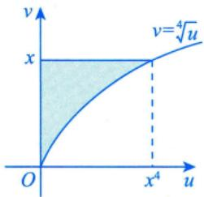

(5) $\left\{ (x,y) \left| x^{2} + (y - 1)^{2} \leqslant 1, \frac{2}{3}x^{2} + \frac{2}{9}y^{2} \leqslant a^{2}, a > 0 \right. \right\}$

  
(a)

  
(b)

  
(c)

(6) $\left\{ (x,y) \mid 0 < y < \sqrt{2ax - x^{2}} ,x > y,a > 0 \right\}$ (7) $D = \left\{ (x,y) \mid 0 \leqslant x \leqslant 2t, 0 \leqslant y \leqslant t, t > 0 \right\}$

(8) $D=\left\{ (x,y) \mid y \geqslant -x,y \leqslant -a+\sqrt{a^{2}-x^{2}} ,a>0 \right\}$ . (9) $\left\{ (x,y) \mid y \leqslant x \leqslant t,1 \leqslant y \leqslant t,t > 1 \right\}$

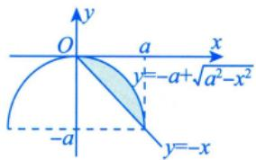

## 基础习题精练

## 习题

14.1 $\lim_{n \to \infty} \sum_{i=1}^{n} \sum_{j=1}^{n} \frac{n}{(n+i)(n^2+j^2)} = ( \quad )$

(A) $\int_{0}^{1} \mathrm{d}x \int_{0}^{x} \frac{1}{(1 + x)(1 + y^2)} \mathrm{d}y$ (B) $\int_{0}^{1} \mathrm{d}x \int_{0}^{x} \frac{1}{(1 + x)(1 + y)} \mathrm{d}y$

(C) $\int_{0}^{1} \mathrm{d}x \int_{0}^{1} \frac{1}{(1 + x)(1 + y)} \mathrm{d}y$ (D) $\int_{0}^{1} \mathrm{d}x \int_{0}^{1} \frac{1}{(1 + x)(1 + y^2)} \mathrm{d}y$

14.2 设函数f(t)连续，区域 $\begin{aligned}D = \left\{ (x, y) \mid x^{2} + y^{2} \leqslant 2y \right\}\end{aligned}$ ，则 $\iint_{D} f(xy)   dx   dy = ( \quad )$

(A) $\int_{-1}^{1} \mathrm{d}x \int_{-\sqrt{1-x^2}}^{\sqrt{1-x^2}} f(xy) \mathrm{d}y$ (B) $2\int_{0}^{2} \mathrm{d}y \int_{0}^{\sqrt{2y - y^{2}}} f(xy) \mathrm{d}x.$

(C) $\int_{0}^{\pi} \mathrm{d}\theta \int_{0}^{2\sin\theta} f(r^2 \sin\theta \cos\theta) \mathrm{d}r$ (D) $\int_{0}^{\pi} \mathrm{d}\theta \int_{0}^{2\sin\theta} f(r^2 \sin\theta \cos\theta) r \mathrm{d}r$

14.3 累次积分 $\int_{0}^{\frac{\pi}{2}} \mathrm{d}\theta \int_{0}^{\cos \theta} f(r \cos \theta, r \sin \theta) r \mathrm{d}r$ 可以写成（ ).(A) $\int_{0}^{1} \mathrm{d}y \int_{0}^{\sqrt{y - y^{2}}} f(x, y) \mathrm{d}x$ (B) $\int_{0}^{1} \mathrm{d}y \int_{0}^{\sqrt{1 - y^{2}}} f(x, y) \mathrm{d}x.$ (C) $\int_{0}^{1} \mathrm{d}x \int_{0}^{1} f(x, y) \mathrm{d}y$ (D) $\int_{0}^{1} \mathrm{d}x \int_{0}^{\sqrt{x - x^{2}}} f(x, y) \mathrm{d}y$

14.4 $\int_{-1}^{1} \mathrm{d}x \int_{|x|}^{\sqrt{2-x^2}} \sin(x^2 + y^2) \mathrm{d}y = ( \quad )$ (A) $\frac{\pi}{4}(\cos 2 - 1)$ (B) $\frac{\pi}{4}(-\cos 2+1)$ (C) $\frac{\pi}{4}(\cos 2 + 1)$ (D) $\frac{\pi}{4}(-\cos 2-1)$

14.5 设 $a>0,\;f(x)=g(x)=\begin{cases}a,\;0\leqslant x\leqslant1,\\0,\; 其他 ,\end{cases}$ 而D表示全平面，则 $\iint_{D} f(x)g(y - x)\mathrm{d}x\mathrm{d}y =$

14.6 设f(x)为连续函数， $F(t) = \int_{1}^{t} \mathrm{d}y \int_{y}^{t} f(x) \mathrm{d}x$ ，则 $F^{\prime}(t) =$

14.7 设区域D是由曲线y =sinx与直线 $x = \pm \frac{\pi}{2}, y = 1$ 围成的平面区域，则 $\iint_{D} (xy^{5} - 1) \mathrm{d}\sigma =$

14.8 设区域 $\begin{aligned}D = \left\{ (x, y) \mid x^{2} + y^{2} \leqslant 1, x \geqslant 0 \right\}\end{aligned}$ ，计算二重积分 $\iint_{D}\frac{1 + xy}{1 + x^{2} + y^{2}}\mathrm{d}x\mathrm{d}y$

14.9 计算二重积分 $\iint_{D} \mathrm{e}^{\max\{x^2, y^2\}} \mathrm{d}x\mathrm{d}y$ ，其中 $D = \left\{ (x, y) | 0 \leqslant x \leqslant 1, 0 \leqslant y \leqslant 1 \right\}$

14.10 计算二重积分 $\iint_{D} r^{2} \sin \theta \sqrt{1 - r^{2} \cos 2 \theta}   dr   d\theta$ ，其中

$$
D = \left\{ (r,\ \theta) \middle| 0 \leqslant r \leqslant \sec \theta,\ 0 \leqslant \theta \leqslant \frac{\pi}{4} \right\}
$$

14.11 计算二重积分 $\iint_{D} r^{2} \mathrm{e}^{-r^{2} \sin^{2} \theta} \cos \theta \mathrm{d} r \mathrm{d} \theta$ ，其中 $\left\{ (r,\theta) \middle| r \geqslant 0, \frac{\pi}{4} \leqslant \theta \leqslant \frac{\pi}{2} \right\}$

14.12 (1)设积分区域D能使二重积分 $\iint_{D} (1 - 2x^2 - y^2) \mathrm{d}\sigma$ 的值达到最大，求出该积分区域D；

(2)对(1)中的二重积分 $\iint_{D} \left( 1 - 2x^{2} - y^{2} \right) \mathrm{d}\sigma$ ，求出其最大值.

## 解答

14.1 (D) 解 设 $D = \left\{ (x, y) \mid 0 < x \leq 1, 0 < y \leq 1 \right\}$ ，记 $f(x, y) = \frac{1}{(1 + x)(1 + y^2)}$

用直线 $x = x_{i} = \frac{i}{n} (i = 1, 2, \cdots, n)$ 与 $y = y_{j} = \frac{j}{n} (j = 1, 2, \cdots, n)$ 将D分成 $n ^ { 2 }$ 等份，和式

$$
\sum_{i = 1}^{n}\sum_{j = 1}^{n}\frac{1}{\left( 1 + x_{i} \right)\left( 1 + y_{j}^{2} \right)}\frac{1}{n^{2}} = \sum_{i = 1}^{n}\sum_{j = 1}^{n}\frac{1}{\left( 1 + \frac{i}{n} \right)\left( 1 + \frac{j^{2}}{n^{2}} \right)}\frac{1}{n^{2}} = \sum_{i = 1}^{n}\sum_{j = 1}^{n}\frac{n}{\left( n + i \right)\left( n^{2} + j^{2} \right)}
$$

是函数f(x，y)在D上的一个二重积分，所以

$$
\sum_{i = 1}^{n}\sum_{j = 1}^{n}\frac{n}{(n + i)(n^{2} + j^{2})} = \iint_{D}\frac{1}{(1 + x)(1 + y^{2})}\mathrm{d}x\mathrm{d}y = \int_{0}^{1}\mathrm{d}x\int_{0}^{1}\frac{1}{(1 + x)(1 + y^{2})}\mathrm{d}y
$$

注(1)实际还可以用“配凑法”，直接从题干出发.

$$
\begin{aligned}\lim_{n \rightarrow \infty} \sum_{i = 1}^{n} \sum_{j = 1}^{n} \frac{n}{(n + i)(n^2 + j^2)} = \lim_{n \rightarrow \infty} \sum_{i = 1}^{n} \sum_{j = 1}^{n} \frac{1}{(1 + \frac{i}{n})(1 + \frac{j^2}{n^2})} \cdot \frac{1}{n^2} \\= \lim_{n \rightarrow \infty} \sum_{i = 1}^{n} \sum_{j = 1}^{n} \frac{1}{1 + \frac{i}{n}} \cdot \frac{1}{1 + \frac{j^2}{n^2}} \cdot \frac{1}{n} \cdot \frac{1}{n} \\= \int_{0}^{1} \mathrm{d}x \int_{0}^{1} \frac{1}{(1 + x)(1 + y^2)} \mathrm{d}y .\end{aligned}
$$

(2) 此题结果为 $\frac{\pi}{4} \ln 2$

14.2 (D) 解 所给问题为直角坐标系下的二重积分，积分区域 $D=\left\{ (x,y) \mid x^{2}+y^{2} \leqslant 2y \right\}$ 在直角坐标系下可以表示为 $x^{2}+(y-1)^{2} \leq 1$ ，即圆心在(0，1)，半径为1的圆域.因此区域D可表示为

$$
-1 \leqslant x \leqslant 1, 1-\sqrt{1-x^{2}} \leqslant y \leqslant 1+\sqrt{1-x^{2}}
$$

也可以表示为

$$
0 \leqslant y \leqslant 2, - \sqrt{2y - y^{2}} \leqslant x \leqslant \sqrt{2y - y^{2}}
$$

因此

$$
\iint _ { D } f ( x y ) \mathrm { d } x \mathrm { d } y = \int _ { - 1 } ^ { 1 } \mathrm { d } x \int _ { 1 - \sqrt { 1 - x ^ { 2 } } } ^ { 1 + \sqrt { 1 - x ^ { 2 } } } f ( x y ) \mathrm { d } y ,
$$

可知(A)不正确.又

$$
\iint _ { D } f ( x y ) \mathrm { d } x \mathrm { d } y = \int _ { 0 } ^ { 2 } \mathrm { d } y \int _ { - \sqrt { 2 y - y ^ { 2 } } } ^ { \sqrt { 2 y - y ^ { 2 } } } f ( x y ) \mathrm { d } x ,
$$

且题设中没有给出f为偶函数的条件，可知(B)也不正确.

在极坐标系下， $x^{2} + y^{2} = 2y$ 转化为 $r = 2 \sin \theta$ .因此D可以表示为

$$
0 \leqslant \theta \leqslant \pi, 0 \leqslant r \leqslant 2\sin\theta,
$$

因此

$$
\iint _ { D } f ( x y ) \mathrm { d } x \mathrm { d } y = \int _ { 0 } ^ { \pi } \mathrm { d } \theta \int _ { 0 } ^ { 2 \sin \theta } f ( r ^ { 2 } \cos \theta \sin \theta ) r \mathrm { d } r ,
$$

可知(C)不正确，(D)正确.故选(D).

14.3 (D) 解 积分区域 $D=\left\{ (r,\ \theta) \middle| 0 \leqslant \theta \leqslant \frac{\pi}{2},\ 0 \leqslant r \leqslant \cos \theta \right\}$ 化为直角坐标，可表示为$\begin{aligned}D = & \left\{ (x, y) \middle| 0 \leq x \leq 1, 0 \leq y \leq \sqrt{x - x^2} \right\} \\= & \left\{ (x, y) \middle| 0 \leq y \leq \frac{1}{2}, \frac{1}{2} - \sqrt{\frac{1}{4} - y^2} \leq x \leq \frac{1}{2} + \sqrt{\frac{1}{4} - y^2} \right\}\end{aligned}$

14.4 (B) 解 先画出积分区域D，如图14-13所示，因积分区域D的边界曲线为 $y = \left| x \right|$ 与$y = \sqrt{2 - x^{2}}$ ，其交点为(1,1)与(-1,1)，故D可用极坐标表示为 y

$$
D = \left\{ (r, \theta) \middle| 0 \leqslant r \leqslant \sqrt{2}, \frac{\pi}{4} \leqslant \theta \leqslant \frac{3\pi}{4} \right\}
$$

则

$$
\int_{- 1}^{1}\mathrm{d}x\int_{|x|}^{\sqrt{2 - x^{2}}}\sin\left( x^{2} + y^{2} \right)\mathrm{d}y = \int_{\frac{\pi}{4}}^{\frac{3\pi}{4}}\mathrm{d}\theta\int_{0}^{\sqrt{2}}r\sin r^{2}\mathrm{d}r
$$

图 14-13

$$
\frac{\pi}{2} \times \frac{1}{2} \left( - \cos r^{2} \right) \bigg|_{0}^{\sqrt{2}} = \frac{\pi}{4} \left( - \cos 2 + 1 \right)
$$

14.5 $a ^ { 2 }$ 解 $g(y-x)=\begin{cases}a, 0 \leqslant y-x \leqslant 1, \\0,  其他 \end{cases} \Rightarrow g(y-x)=\begin{cases}a,  x \leqslant y \leqslant 1+x, \\0,   其他 .\end{cases}$

设 $D_{1}=\left\{ (x,y) \mid 0 \leqslant x \leqslant 1, x \leqslant y \leqslant 1+x \right\}$ ，如图14-14所示，令 $D_{2}=D-D_{1}$ ，故

$$
f(x)g(y - x) = \begin{cases} a^{2}, \; (x, y) \in D_{1}, \\ 0, \; (x, y) \in D_{2}, \end{cases}
$$

所以

$$
\begin{aligned}I = & \iint_{D} f(x)g(y - x)\mathrm{d}x\mathrm{d}y = \iint_{D_{1}} a^{2}\mathrm{d}x\mathrm{d}y + \iint_{D_{2}} 0\mathrm{d}x\mathrm{d}y \\= & \int_{0}^{1}\mathrm{d}x\int_{x}^{1 + x} a^{2}\mathrm{d}y = a^{2}\int_{0}^{1}y\Big|_{x}^{1 + x}\mathrm{d}x \\= & a^{2}\int_{0}^{1}(1 + x - x)\mathrm{d}x = a^{2} .\end{aligned}
$$

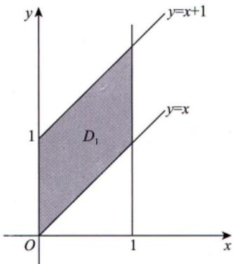  
图 14-14

14.6 (t-1)f(t) 解 所给积分为二次变限积分，它是变量t的函数，故求 $F ^ { \prime } ( t )$ 需先将二次变限积分化为变限的单积分.为此考虑所给二次积分的特点，由于依给定的积分次序，不能化为变限单积分，因此先交换积分次序，可得

$$
F(t)=\int_{1}^{t} \mathrm{d}y \int_{y}^{t} f(x) \mathrm{d}x=\int_{1}^{t} \mathrm{d}x \int_{1}^{x} f(x) \mathrm{d}y=\int_{1}^{t}(x-1) f(x) \mathrm{d}x,
$$

于是 $F^{\prime}(t) = (t - 1)f(t)$

14.7 -π 解 所给积分区域如图 14-15 所示.

记 $A\left(-\frac{\pi}{2},-1\right),B\left(-\frac{\pi}{2},1\right),C\left(\frac{\pi}{2},1\right)$ .作辅助线 $y = -\sin x$ ，则曲线BO将区域D划分为 $D_{1},   D_{2}$ 两个子区域，区域 $D _ { 1 }$ 关于 $x$ 轴对称，区域 $D _ { 2 }$ 关于y轴对称.而 $xy^{5}$ 既为x的奇函数，也为 $\left( \begin{array}{c} y \\  \end{array} \right.$ 的奇函数，从而 $\iint _ { D _ { 1 } } x y ^ { 5 } \mathrm { d } x \mathrm { d } y = 0 , \iint _ { D _ { 2 } } x y ^ { 5 } \mathrm { d } x \mathrm { d } y = 0$ ，因此

  
图 14-15

$$
-\iint_{D} \mathrm{d}x\mathrm{d}y = -\int_{-\frac{\pi}{2}}^{\frac{\pi}{2}} \mathrm{d}x \int_{\sin x}^{1} \mathrm{d}y = -\int_{-\frac{\pi}{2}}^{\frac{\pi}{2}} (1 - \sin x) \mathrm{d}x = -2\int_{0}^{\frac{\pi}{2}} \mathrm{d}x = -\pi
$$

14.8 解 因为 $I_{1} = \iint_{D}\frac{1}{1 + x^{2} + y^{2}}\mathrm{d}x\mathrm{d}y = \int_{- \frac{\pi}{2}}^{\frac{\pi}{2}}\mathrm{d}\theta\int_{0}^{1}\frac{1}{1 + r^{2}}r\mathrm{d}r = \frac{\pi}{2}\ln\left( 1 + r^{2} \right)\bigg|_{0}^{1} = \frac{\pi}{2}\ln 2$

$$
I_{2}=\iint_{D}\frac{xy}{1+x^{2}+y^{2}}\mathrm{d}x\mathrm{d}y=\int_{-\frac{\pi}{2}}^{\frac{\pi}{2}}\mathrm{d}\theta\int_{0}^{1}\frac{r^{3}\cos\theta\sin\theta}{1+r^{2}}\mathrm{d}r=\int_{-\frac{\pi}{2}}^{\frac{\pi}{2}}\cos\theta\sin\theta\mathrm{d}\theta\int_{0}^{1}\frac{r^{3}}{1+r^{2}}\mathrm{d}r=0,
$$

所以

$$
I = I_{1} + I_{2} = \frac{\pi}{2} \ln 2
$$

14.9 解设 $D_{1}=\left\{ (x,y)|0 \leq x \leq 1,\ 0 \leq y \leq x \right\}, D_{2}=\left\{ (x,y)|0 \leq x \leq 1,\ x \leq y \leq 1 \right\}$ ，则

$$
\begin{aligned}\iint_{D} \mathrm{e}^{\max\left\{x^{2}, y^{2}\right\}} \mathrm{d}x \mathrm{d}y = & \iint_{D_{1}} \mathrm{e}^{\max\left\{x^{2}, y^{2}\right\}} \mathrm{d}x \mathrm{d}y + \iint_{D_{2}} \mathrm{e}^{\max\left\{x^{2}, y^{2}\right\}} \mathrm{d}x \mathrm{d}y = \iint_{D_{1}} \mathrm{e}^{x^{2}} \mathrm{d}x \mathrm{d}y + \iint_{D_{2}} \mathrm{e}^{y^{2}} \mathrm{d}x \mathrm{d}y \\= & \int_{0}^{1} \mathrm{d}x \int_{0}^{x} \mathrm{e}^{x^{2}} \mathrm{d}y + \int_{0}^{1} \mathrm{d}y \int_{0}^{y} \mathrm{e}^{y^{2}} \mathrm{d}x = \int_{0}^{1} x \mathrm{e}^{x^{2}} \mathrm{d}x + \int_{0}^{1} y \mathrm{e}^{y^{2}} \mathrm{d}y = \mathrm{e} - 1\end{aligned}
$$

14.10 解 先画出积分区域D（见图14-16)，然后将积分化为直角坐标系下的二重积分，再去计算，即

$$
I = \iint_{D} r^{2} \sin \theta \sqrt{1 - r^{2} \cos^{2} \theta + r^{2} \sin^{2} \theta} \mathrm{d}r \mathrm{d}\theta = \iint_{D} y \sqrt{1 - x^{2} + y^{2}} \mathrm{d}x \mathrm{d}y \mathrm{d}\theta = \iint_{D} y \sqrt{1 - x^{2} + y^{2}} \mathrm{d}x \mathrm{d}y \mathrm{d}\theta = \iint_{D} \left[ \int_{0}^{1} \left( 1 - x^{2} + y^{2} \right)^{\frac{3}{2}} \left( 1 - x^{2} + y^{2} \right)^{\frac{3}{2}} \right]_{0}^{1} \mathrm{d}x \mathrm{d}y \mathrm{d}\theta = \iint_{D} \left[ 1 - \left( 1 - x^{2} \right)^{\frac{3}{2}} \right]_{0}^{1} \mathrm{d}x \mathrm{d}\theta = \iint_{D} \left[ 1 - \left( 1 - x^{2} \right)^{\frac{3}{2}} \right]_{0}^{1} \mathrm{d}x \mathrm{d}\theta = \iint_{D} \left[ 1 - \left( 1 - x^{2} \right)^{\frac{3}{2}} \right]_{0}^{1} \mathrm{d}x \mathrm{d}\theta = \iint_{D} \left[ 1 - \left( 1 - x^{2} \right)^{\frac{3}{2}} \right]_{0}^{1} \mathrm{d}x \mathrm{d}\theta = \iint_{D} \left[ 1 - \left( 1 - x^{2} \right)^{\frac{3}{2}} \right]_{0}^{1} \mathrm{d}x \mathrm{d}\theta = \iint_{D} \left[ 1 - \left( 1 - x^{2} \right)^{\frac{3}{2}} \right]_{0}^{1} \mathrm{d}x \mathrm{d}\theta = \iint_{D} \left[ 1 - \left( 1 - x^{2} \right)^{\frac{3}{2}} \right]_{0}^{1} \mathrm{d}x \mathrm{d}\theta = \iint_{D} \left[ 1 - \left( 1 - x^{2} \right)^{\frac{3}{2}} \right]_{0}^{1} \mathrm{d}x \mathrm{d}\theta = \iint_{D} \left[ 1 - \left( 1 - x^{2} \right)^{\frac{3}{2}} \right]_{0}^{1} \mathrm{d}x \mathrm{d}\theta = \iint_{D} \left[ 1 - \left( 1 - x^{2} \right)^{\frac{3}{2}} \right]_{0}^{1} \mathrm{d}x \mathrm{d}\theta = \iint_{D} \left[ 1 - \left( 1 - x^{2} \right)^{\frac{3}{2}} \right]_{0}^{1} \mathrm{d}x \mathrm{d}\theta = \iint_{D} \left[ 1 - \left( 1 - x^{2} \right)^{\frac{3}{2}} \right]_{0}^{1} \mathrm{d}x \mathrm{d}\theta = \iint_{D} \left[ 1 - \left( 1 - x^{2} \right)^{\frac{3}{2}} \right]_{0}^{1} \mathrm{d}x \mathrm{d}\theta = \iint_{D} \left[ 1 - \left( 1 - x^{2} \right)^{\frac{3}{2}} \right]_{0}^{1} \mathrm{d}x \mathrm{d}\theta = \iint_{D} \left[ 1 - \left( 1 - x^{2} \right)^{\frac{3}{2}} \right]_{0}^{1} \mathrm{d}x \mathrm{d}x \mathrm{d}\theta \mathrm{d}\theta = \iint_{D} \left[ 1 - \left( 1 - x^{2} \right)^{\frac{3}{2}} \right]_{0}^{1} \mathrm{1} \mathrm{d}x \mathrm{d}x \mathrm{d}\mathrm{d}\theta \theta \mathrm{d}\theta \theta \mathrm{d} \theta \mathrm{d} \theta \mathrm{d} \theta 
$$

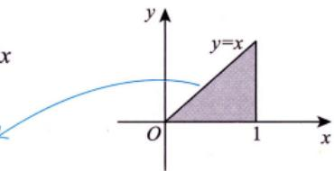  
图 14-16

<!-- DIRECTED-REPAIR-FALLBACK:FALLBACK-HIGH-CH14-P381-ANSWER14-10 -->
> [!WARNING]
> 原 PDF 第 381 页回退：答案14.10的坐标变换与积分等号链被2320字符重复项破坏，无法安全逐式回写。

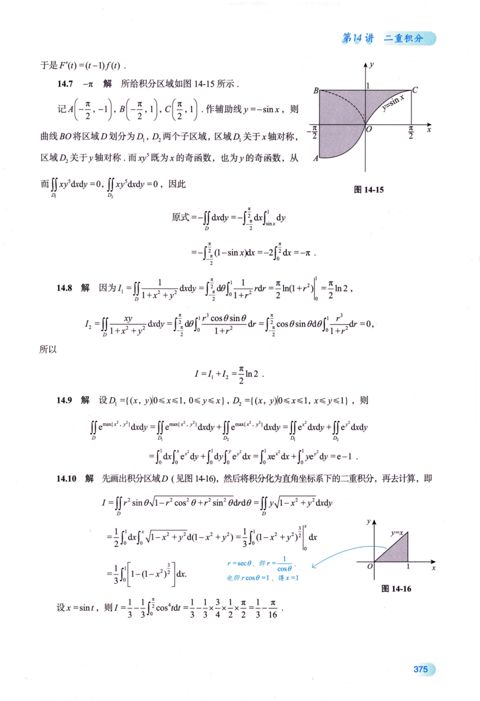

设 $x = \sin t$ ，则 $\frac{1}{3}-\frac{1}{3}\int_{0}^{\frac{\pi}{2}}\cos^{4}tdt=\frac{1}{3}-\frac{1}{3}\times\frac{3}{4}\times\frac{1}{2}\times\frac{\pi}{2}=\frac{1}{3}-\frac{\pi}{16}$

14.11 解 积分区域D为图14-17中阴影部分，转换成直角坐标系进行计算.

$$
I = \iint_{D} xe^{-y^2} \mathrm{d}x\mathrm{d}y = \int_{0}^{+\infty} e^{-y^2} \mathrm{d}y \int_{0}^{y} x\mathrm{d}x = \frac{1}{2} \int_{0}^{+\infty} y^2 e^{-y^2} \mathrm{d}y = \frac{\sqrt{\pi}}{8}
$$

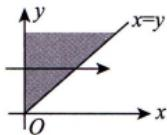  
图 14-17

14.12 解 (1)由二重积分的性质可知，当积分区域D包含了所有使被积函数 $1 - 2x^{2} - y^{2}$ 大于等于零的区域，而不包含使被积函数 $1 - 2x^{2} - y^{2}$ 小于零的区域，即当D是椭圆 $2x^{2} + y^{2} = 1$ 所围的平面闭区域时，此二重积分的值达到最大.

(2)由(1)知 $\left\{ (x, y) \middle| 2x^{2} + y^{2} \leq 1 \right\}$ ，此时令 $\begin{cases}x = \frac{1}{\sqrt{2}} r \cos \theta, \\y = r \sin \theta,\end{cases}$ 则

$$
\begin{aligned}\iint_{D} (1 - 2x^2 - y^2) \mathrm{d}\sigma = & \int_{0}^{2\pi} \mathrm{d}\theta \int_{0}^{1} (1 - r^2 \cos^2 \theta - r^2 \sin^2 \theta) \cdot \left| \frac{\partial x}{\partial r} \frac{\partial x}{\partial \theta} \right| \mathrm{d}r \\= & \int_{0}^{2\pi} \mathrm{d}\theta \int_{0}^{1} (1 - r^2) \frac{1}{\sqrt{2}} r \mathrm{d}r \\= & 2\pi \cdot \frac{1}{\sqrt{2}} \int_{0}^{1} (r - r^3) \mathrm{d}r \\= & \sqrt{2} \pi \left( \frac{1}{2} r^2 - \frac{1}{4} r^4 \right) \bigg|_{0}^{1} = \frac{\sqrt{2} \pi}{4} .\end{aligned}
$$
