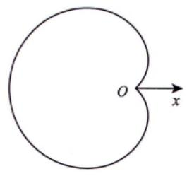
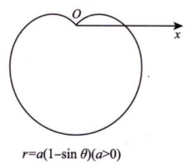
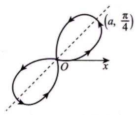
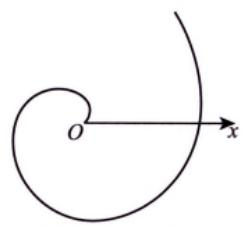
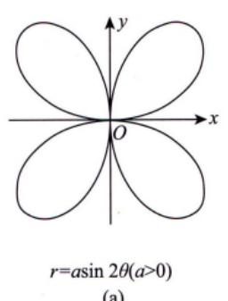
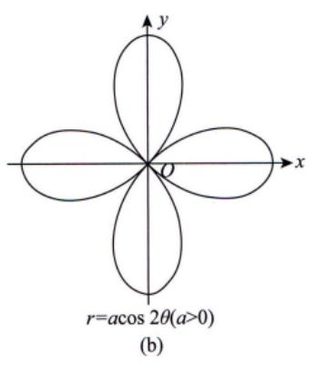

(1)心形线（外摆线的一种）.

  
(a)

(2) 伯努利双纽线.

  
(b)

(3) 阿基米德螺线.

## (4) 对数螺线.

(5) 双曲螺线.

(6) 三叶玫瑰线.

(7) 四叶玫瑰线.

(8)摆线（平摆线）.

(9)星形线（内摆线的一种）.

(10)笛卡儿叶形线.

$$
x^{3}+y^{3}-3axy=0  或  \left\{\begin{aligned}x=\frac{3at}{1+t^{3}}, \\y=\frac{3at^{2}}{1+t^{3}}\end{aligned}\right. (a>0).
$$
