# 第 5 章

# 树与二叉树

## 【考纲内容】

（一）树的基本概念

（二）二叉树

二叉树的定义及其主要特征；二叉树的顺序存储结构和链式存储结构：

二叉树的遍历；线索二叉树的基本概念和构造

  

## （三）树、森林

树的存储结构；森林与二叉树的转换；树和森林的遍历

（四）树与二叉树的应用

哈夫曼（Huffman）树和哈夫曼编码；并查集及其应用；堆及其应用

## 【知识框架】

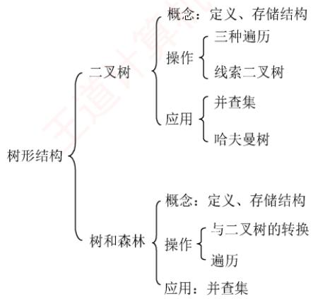

## 【复习提示】

本章内容主要以选择题和综合题形式考查，统考中也可能出现与树遍历相关的算法题。树与二叉树的基本性质、遍历操作、相互转换、存储结构及操作特性，以及满二叉树、完全二叉树、线索二叉树和哈夫曼树的定义与性质，均为选择题的高频考点。

## 5.1 树的基本概念

## 5.1.1 树的定义

树是 $n (n \geqslant 0)$ 个结点的有限集。当n=0时，称为空树。在任意一棵非空树中必须满足：

1）有且仅有一个特定的结点称为根结点。

2）当n>1时，其余结点可分为 $m (m > 0)$ 个互不相交的有限集 $T _ { 1 } ,   T _ { 2 } , \cdots ,   T _ { m }$ ，其中每个集合本身又是一棵树，称为根的子树。 临村

显然，树的定义是递归的一一在定义中引用了自身，因此树是一种典型的递归数据结构。作为一种逻辑结构，树同时也是一种分层结构，具有以下两个特征：

1）根结点没有前驱，除根结点外的每个结点有且仅有一个前驱。

2）所有结点均可拥有零个或多个后继。

树适用于表示具有层次结构的数据。除根结点外，树中任一结点最多只与上一层的一个结点（其父结点）存在直接关联：根结点则无上层结点。因此，在包含n个结点的树中，恰好存在n-1

## 5.1.2 基本术语

下面结合图5.1中的树来说明一些基本术语和概念。

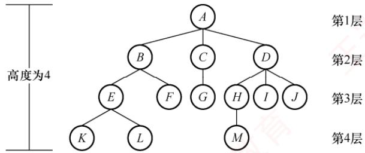  
图 5.1 树的树形表示

1）祖先、子孙、双亲、孩子、兄弟和堂兄弟。

考虑结点K，从根A到结点K的唯一路径上所经过的所有其他结点，称为K的祖先。例如，结点B是K的祖先，而K是B的子孙；B的子孙包括E,F,K,L。该路径上最接近K的结点E称为K的双亲，K则是E的孩子。根结点A是树中唯一没有双亲的结点。具有相同双亲的结点互为兄弟，如K与L的双亲均为E，故K与L为兄弟。若两个结点的双亲位于同一层，则它们互为堂兄弟，如G与E,F,H,I,J互为堂兄弟。

2）结点的层次、深度和高度。

结点的层次从根开始定义：根为第1层，其孩子为第2层，以此类推。结点的深度即为其所在的层次。树的高度（或深度）是树中结点的最大层数。而结点的高度是指以其为根的子树的高度。图5.1中树的高度为4。 KON

3）结点的度和树的度。

树中一个结点的孩子个数称为该结点的度；树中所有结点的度的最大值称为树的度。例如，结点B的度为2，结点D的度为3，因此该树的度为3。

4）分支结点和叶结点。

度大于0的结点称为分支结点（也称非终端结点）；度为0（无孩子）的结点称为叶结点（也称终端结点）。在分支结点中，每个结点的分支数即为其度。

5）有序树和无序树。

若树中各结点的子树从左到右具有固定次序、不可互换，则称为有序树；否则称为无序树。假设图5.1为有序树，若交换某结点的子结点位置，则得到一棵不同的树。

6）路径和路径长度。

树中两个结点之间的路径是由从一个结点到另一个结点所经过的结点序列构成的，路径长度则是该路径上边的数目。

7）森林。

## 考点追踪森林中树的数量、边数和结点数的关系（2016）

森林是 $m (m \geqslant 0)$ 棵互不相交的树的集合。森林与树的概念密切相关：将树的根结点移除后，其各子树构成一个森林；反之，若为m棵独立的树添加一个新结点，并将其作为这m棵树的共同根，则森林便转化为一棵树。

## 注意

上述概念无须死记硬背，结合实例理解即可。考研通常不会直接考查定义，而是融入具体题目中综合考查。做题时若遇到不熟悉的概念，可随时查阅；随着练习增多，自然能够熟练掌握。

## 5.1.3 树的性质

树具有如下基本性质：

考点追踪树中结点数和度数的关系分析（2010、2016）

1）树的结点数n等于所有结点的度数之和加1。

结点与其每个孩子都有唯一的边相连，因此树中所有结点的度数之和等于边数；又因除根结点外每个结点均有唯一双亲，故结点数n等于边数加1，即所有结点的度数之和加1。

2）度为m的树中，第i层上至多有 $m ^ { i - 1 }$ 个结点（i≥1）。第1层至多有1个结点（根结点）；第2层至多有m个结点；第3层至多有 $m ^ { 2 }$ 个结点，以此类推。通过数学归纳法可以证明，第i层至多有 $m ^ { i - 1 }$ 个结点。

3）高度为 h 的 m叉树至多有 $(m^h - 1)/(m - 1)$ 个结点。当各层结点数达到最大时，树中至多有 $1+m+m^{2}+\cdots+m^{h-1}=(m^{h}-1)/(m-1)$ 个结点。

## 考点追踪指定结点数的三叉树的最小高度分析（2022）

4）度为m、具有n个结点的树的最小高度h为 $\log _ { m } ( n ( m - 1 ) + 1 ) ] .$

要使高度最小，树应尽可能饱满，即前h-1层每层的结点数均达到最大值。前h-1层最多有 $( m ^ { h - 1 } - 1 ) / ( m - 1 )$ 个结点，前h层最多有 $( m ^ { h } - 1 ) / ( m - 1 )$ 个结点。因此， $( m ^ { h - I } - 1 ) / ( m - 1 ) < n$ $\leqslant \left( m^{h} - 1 \right) / (m - 1)$ 即 $h - 1 < \log_{m}(n(m - 1) + 1) \leq h$ ，解得 $h_{\min} = \left\lceil \log_{m}(n(m - 1) + 1) \right\rceil$ 育

5）度为m、具有n个结点的树的最大高度h为 $n   -   m   +   1$

树的度为m，因此至少有一个结点有m个孩子，它们处于同一层。为使树的高度最大，其他层可仅有一个结点，因此最大高度（层数）为 $n   -   m   +   1$ 。由此，也可逆推出高度为h、度为m的树至少包含 $h + m - 1$ 个结点。 -XX

## 5.1.4 本节试题精选

## 一、单项选择题

01.树最适合用来表示（）的数据。A. 有序 B. 无序C. 任意元素之间具有多种联系 D.元素之间具有分支层次关系

02.一棵有n个结点的树的所有结点的度数之和为（）。A. n−1 B. n C. n + 1 D. 2n

03. 树的路径长度是从树根到每个结点的路径长度的（）。A. 总和 B. 最小值 C. 最大值 D. 平均值

04. 对于一棵具有n个结点、度为4的树来说，（）。A. 树的高度至多是n-3 B. 树的高度至多是n-4C. 第i层上至多有 4(i-1)个结点\_ D. 至少在某一层上正好有4个结点

05.度为4、高度为 h的树，（）。A. 至少有 h+ 3 个结点 王道2 B. 至多有 4h-1 个结点C. 至多有 4h 个结点 D. 至少有 h +4个结点

06. 假定一棵度为3的树中，结点数为50，则其最小高度为（）。A. 3 B. 4C. 5 教育 D. 6

07. 设有一棵度为3的树，其中度为3的结点数 $n _ { 3 } = ~ 2$ ，度为2的结点数 $n_{2}=1$ ，叶结点数$n _ { \mathrm { 0 } }   =   6$ ，则该树的结点总数为（）。A. 12 B. 9 道计算C. 10 D. ≥9 的任意整数

08. 设一棵 m 叉树中有 $N _ { 1 }$ 个度数为1的结点， $N _ { 2 }$ 个度数为2 的结点 ${ \cdots \cdots } N _ { m }$ 个度数为 m 的结点，则该树中共有（）个叶结点。A. $\sum _ { i = 1 } ^ { m } ( i - 1 ) N _ { i }$ B. $\sum _ { i = 1 } ^ { m } N _ { i }$ C. $\sum_{i = 2}^{m} (i - 1)N_{i}$ D. $\sum _ { i = 2 } ^ { m } ( i   -   1 ) N _ { _ i } + 1$

09.【2010统考真题】在一棵度为4的树T中，若有20个度为4的结点，10个度为3的结点1个度为2的结点，10个度为1的结点，则树T的叶结点数是（）。A. 41 B. 82 X C. 113 D. 122

10.【2016统考真题】若森林F有15条边、25个结点，则F包含树的个数是（）。A. 8 B. 9 C. 10 D. 11

## 二、综合应用题

01. 含有n个结点的三叉树的最小高度是多少？

02. 已知一棵度为4的树中，度为0,1,2,3的结点数分别为14,4,3,2，求该树的结点总数n和度为4的结点数，并给出推导过程。

03. 已知一棵度为 m的树中，有 $n _ { 1 }$ 个度为1的结点，有 $n _ { 2 }$ 个度为2 的结点……有 $n _ { m }$ 个度为m的结点，问该树有多少个叶结点？

## 5.1.5 答案与解析

## 一、单项选择题

01. D

树是一种分层结构，它特别适合组织那些具有分支层次关系的数据。

02. A

除根结点外，其他每个结点都是某个结点的孩子，因此树中所有结点的度数加1等于结点数，即所有结点的度数之和等于总结点数减1。这是一个重要的结论，做题时经常用到。

03. A

树的路径长度是指树根到每个结点的路径长的总和，根到每个结点的路径长度的最大值应是树的高度减1。注意与哈夫曼树的带权路径长度相区别。

## 04. A

要使得具有n个结点、度为4的树的高度最大，就要使得每层的结点数尽可能少，类似右图所示的树，除最后一层外，每层的结点数是1，最终该树的高度为n-3。树的度为4只能说明存在某结点正好（也最多）有4个孩子结点，选项D错误。

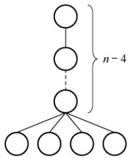

## 05. A

要使得度为4、高度为h的树的总结点数最少，需要满足以下两个条件： XIT

①至少有一个结点有4个分支。

②每层的结点数尽可能少。

情况类似右图所示的树，结点数为 $h + 3$

要使得度为4、高度为h的树的总结点数最多，应使每个非叶结点的度均为4，即满树，总结点数最多为 $1 + 4 + 4 ^ { 2 } + \cdots + 4 ^ { h - 1 }$


对于上面的两题，应画出草图来求解，就能一目了然。

## 06. C

要求满足条件的树，那么该树是一棵完全三叉树。在度为3的完全三叉树中，第1层有1个结点，第2层有 $3 ^ { 1 } = 3$ 个结点，第3层有 $3 ^ { 2 } = 9$ 个结点，第4层有 $3 ^ { 3 }   =   2 7$ 个结点，因此结点数之和为 $1 + 3 + 9 + 27 = 40$ ，第5层的结点数 $50 - 40 = 10$ 个，因此最小高度为5。

## 07. D

总结点数 $n = n_{0} + n_{1} + n_{2} + n_{3} = 6 + n_{1} + 1 + 2 = n_{1} + 9$ ，总度数= $\cdot n   -   1   =$   
$n_{1}+2n_{2}+3n_{3}=n_{1}+2+6=n_{1}+8$ ，根据题目条件无法得出n的具体  
值，只能证明n是一个大于或等于9的任意整数。画出满足题目条  
件的树，可以是右图所示的一棵树，该树中无法确定n的具体数量。08 D 08. D

##

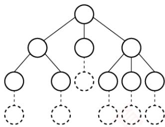

设叶结点数为 $N _ { 0 }$ ，总结点数为N，则 $N = N_{1} + 2N_{2} + 3N_{3} + \cdots +$ $m N _ { m } + 1$ ，又因为 $N = N_{0} + N_{1} + N_{2} + N_{3} + \cdots + N_{m}$ 所以 $N_{0}=N_{2}+2N_{3}+\cdots+$ $(m - 1)N_{m} + 1 = \sum_{i = 2}^{m}(i - 1)N_{i} + 1$ 0

## 09. B

设树中度为 i（i = 0, 1,2,3, 4）的结点数分别为 ni，树中结点总数为 n，则 n = 分支数 + 1，而分支数又等于树中各结点的度之和，即 $n = 1 + n_{1} + 2n_{2} + 3n_{3} + 4n_{4} = n_{0} + n_{1} + n_{2} + n_{3} + n_{4}$ 。依题意， $n_{1} + 2n_{2} + 3n_{3} + 4n_{4} = 10 + 2 + 30 + 80 = 122, \quad n_{1} + n_{2} + n_{3} + n_{4} = 10 + 1 + 10 + 20 = 41$ ，可得出$n _ { 0 }   = 8 2$ ，即树T的叶结点的个数是82。

## 10. C

解法1：树有一个重要性质，即在n个结点的树中有n-1条边，“那么对于每棵树，其结点数比边数多1”。本题森林中的结点数比边数多 $10 \left( 25 - 15 = 10 \right)$ ，显然共有10棵树。

解法2：仔细分析后发现此题也是考查图的性质：生成树和生成森林。对于图的生成树有一个重要的性质，即图中顶点数若为n，则其生成树含有n-1条边。对比解法1中树的性质，不难发现两种解法都用到了性质“树中结点数比边数多1”，后面的分析如解法1。

## 二、综合应用题

## 01.【解答】

要求含有n个结点的三叉树的最小高度，那么满足条件的一定是一棵完全三叉树，设含有n个结点的完全三叉树的高度为h，第h层至少有1个结点，至多有 $3 ^ { h - 1 }$ 个结点。则有

$$
1 + 3^{1} + 3^{2} + \cdots + 3^{n - 2} < n \leqslant 1 + 3^{1} + 3^{2} + \cdots + 3^{n - 2} + 3^{n - 1}
$$

即 $( 3 ^ { h - 1 } - 1 ) / 2 < n \leq ( 3 ^ { h } - 1 ) / 2$ ，得 $3^{h - 1} < 2n + 1 \leq 3^h$ ，即 $h < \log_{3}(2n + 1) + 1, \quad h \geqslant \log_{3}(2n + 1).$

因为h只能为正整数， $h = \lceil \log_{3}(2n + 1) \rceil$ ，所这种三叉树的最小高度是 $\left[ \log_{3}(2n + 1) \right]$

## 02. 【解答】

设树中度为 $i \left( i = 0,1,2,3,4 \right)$ 的结点数为 $n _ { i } ,$ 则结点总数 $n = n_{0} + n_{1} + n_{2} + n_{3} + n_{4}$ ，即 $n = 23 + n_{4},$ 根据“树中所有结点的度数加1等于结点数”的结论，有 $n = 0 + n _ { 1 } + 2 n _ { 2 } + 3 n _ { 3 } + 4 n _ { 4 } + 1$ ，即有 $n =$ $1 7 \pm 4 n _ { 4 }$ K利

综合两式得 $n_{4}=2,\ n=25$ 。所以该树的结点总数为25，度为4的结点数为2。

## 03.【解答】

树中的结点数等于所有结点的度数加1，因此有 $n = \sum_{i = 0}^{m}in_{i} + 1 = n_{1} + 2n_{2} + 3n_{3} + \cdots + mn_{m} + 1$

又有 $n = n_{0} + n_{1} + n_{2} + \cdots + n_{m}$ ，所以

$$
n_{0}=\left(n_{1}+2 n_{2}+3 n_{3}+\cdots+m n_{m}+1\right)-\left(n_{1}+n_{2}+\cdots+n_{m}\right) \\ =n_{2}+2 n_{3}+\cdots+(m-1) n_{m}+1=1+\sum_{i=2}^{m}(i-1) n_{i}
$$

## 注意

综合以上几题，常用于求解树结点与度之间关系的有：

①总结点数 $n_{0}+n_{1}+n_{2}+\cdots+n_{m}$

② 总分支数 $\begin{aligned}= \ln_{1} + 2n_{2} + \cdots + mn_{m}\end{aligned}$ (度为m的结点引出m条分支）。

③总结点数= 总分支数 + 1。

这类题目常在选择题中出现，读者对以上关系应当熟练掌握并灵活应用。

## 5.2 二叉树的概念

## 5.2.1 二叉树的定义及其主要特性

## 1. 二叉树的定义

二叉树是一种特殊的树形结构，其核心特征在于：每个结点至多拥有两棵子树（不存在度大于2的结点），且这两棵子树具有明确的左右之分，其次序是固定的，不可交换。

与树类似，二叉树也以递归的方式定义。二叉树是包含 $n (n \geqslant 0)$ 个结点的有限集合：

①或者为空二叉树，即 $n   =   0$

②或者由一个根结点以及两棵互不相交的被称为根的左子树和右子树构成，且左右子树本身也均为二叉树。

二叉树属于有序树。即使某个结点仅有一棵子树，也要区分它是左子树还是右子树；若交换某结点的左右子树，则会得到另一棵不同的二叉树。二叉树的5种基本形态如图5.2所示。

(a) 空二叉树  
(b) 只有根结点  
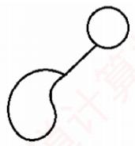  
(c) 只有左子树

  
(d)左右子树都有

  
(e) 只有右子树  
图 5.2 二叉树的 5 种基本形态

注意，二叉树与度为2的有序树有本质区别：

①度为2的树至少包含3个结点，而二叉树可以为空。

②在度为2的有序树中，若某结点只有一个孩子，则无须区分左右次序（因为左右关系是相对于另一个孩子而言的）；而在二叉树中，无论结点是否拥有两个孩子，其子树的左右位置都是确定且不可省略的，这种次序并非相对概念，而是结构本身的固有属性。

## 2. 几种特殊的二叉树

1）满二叉树。一棵高度为h且包含2″-1个结点的二叉树称为满二叉树，即每一层都含有该层所能容纳的最大结点数，如图5.3(a)所示。满二叉树的所有叶结点均位于最下一层，且除叶结点外，其余每个结点的度均为2。

可对满二叉树按层序进行编号：约定根结点编号为1，自上而下，自左向右依次编号。在此编号规则下，对于编号为i的结点，若其存在双亲，则双亲编号为i/2]；若存在左孩子，则左孩子编号为2i；若存在右孩子，则右孩子编号为2i+1。

## 考点追踪完全二叉树的特性（2009、2011、2018、2025）

2）完全二叉树。高度为h且包含n个结点的二叉树，当且仅当其每个结点与高度为h的满二叉树中编号为1～n的结点一一对应时，称为完全二叉树，如图5.3(b)所示。

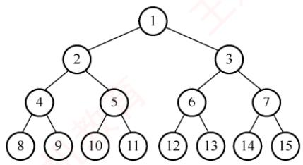  
(a) 满二叉树

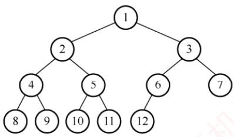  
(b) 完全二叉树  
图5.3 两种特殊形态的二叉树

3）二叉排序树。其左子树上所有结点的关键字均小于根结点的关键字；右子树上所有结点X 的关键字均大于根结点的关键字，且左子树和右子树本身也各是一棵二叉排序树。

4）平衡二叉树。树中任意一个结点的左子树和右子树的高度之差的绝对值不超过1。关于二叉排序树和平衡二叉树的详细介绍，见本书第7.3节。

考点追踪正则k叉树树高和结点数的关系的应用（2016）

5）正则二叉树。树中每个分支结点均有2个孩子，即树中仅有度为0或2的结点。

## 3. 二叉树的性质

考点追踪二叉树中结点数的关系（2025）

1）非空二叉树的叶结点数等于度为2的结点数加1，即 $n _ { 0 }   =   n _ { 2 } + 1$

设度为0,1和2的结点数分别为 $n _ { \mathrm { 0 } } , n _ { \mathrm { 1 } }$ 和 $n _ { 2 } ,$ 结点总数 $n = n _ { 0 } + n _ { 1 } + n _ { 2 }$ 0

再考虑二叉树中的分支数，除根结点外，其余结点都有一个分支进入，设B为分支总数，则 $n   =   B   +   1$ 。这些分支是由度为1或2的结点射出的，因此有 $B = n_{1} + 2n_{2}$

由此得出 $n_{0}+n_{1}+n_{2}=n_{1}+2n_{2}+1$ ，从而得出 $n _ { 0 } = n _ { 2 } + 1$

## 注意

该性质在选择题中经常出现，希望读者牢记并灵活应用。

2）非空二叉树的第k层最多有 $2 ^ { k - 1 }$ 个结点 $(k \geq 1)$ o

例如，第1层最多有 $2 ^ { 1 - 1 }   =   1$ 个结点（根），第2层最多有 $2 ^ { 2 - 1 } = 2$ 个结点，以此类推，这构成一个首项为1、公比为2的等比数列，通项为 $2 ^ { k - 1 }$

3）高度为h的二叉树至多有 $2 ^ { h }   -   1$ 个结点 $(h \geqslant 1)$ o

该性质可通过性质2求前h项的和得到，即等比数列求和的结果。

## 注意

性质 2 和 3 可拓展到 m 叉树的情况，即 m叉树的第 k层最多有 $m ^ { k - 1 }$ 个结点，高度为 h 的 m 叉树至多有 $( m ^ { h }   -   1 ) / ( m   -   1 )$ 个结点。

4）对完全二叉树按从上到下、从左到右的顺序依次编号 $1,2,\cdots,n,$ 则有以下关系：

①最后一个分支结点的编号为 $\lfloor n / 2 \rfloor$ ，若 $i \leq \lfloor n / 2 \rfloor$ ，则结点i为分支结点，否则为叶结点。

②叶结点只可能出现在最后两层上（相当于在相同高度的满二叉树的最底层、最右侧减少一些连续叶结点；当减少两个及以上叶结点时，次底层将出现叶结点）。

③若存在度为1的结点，则最多只可能有一个，且该结点只有左孩子而无右孩子（度为1的分支结点只可能是最后一个分支结点，其结点编号为 $\lfloor n / 2 \rfloor )$ )。

④按层序编号后，一旦某个结点i为叶结点或仅有左孩子，则所有编号大于i的结点均为叶结点（与上述结论①和结论③一致）。

⑤若n为奇数，则每个分支结点都有左右孩子；若n为偶数，则编号最大的分支结点（编号为n/2）只有左孩子，没有右孩子，其余分支结点都有左右孩子。 K

⑥ 当 i>1 时，结点i的双亲结点的编号为 $[ i / 2 ]$ o

⑦若结点i有左右孩子，则左孩子编号为2i，右孩子编号为 $2 i + 1$ 0

⑧结点i所在层次（深度）为 $\lfloor \log _ { 2 } i \rfloor + 1$

5）具有n个 $( n > 0 )$ 结点的完全二叉树的高度为 $\left\lceil \log _ { 2 } ( n + 1 ) \right\rceil$ 或 $\left\lfloor \log_{2}n \right\rfloor + 1$

设高度为h，根据性质3和完全二叉树的定义有

$$
2^{h - 1} - 1 < n \leq 2^h - 1 \quad  或者  \quad 2^{h - 1} \leq n \leq 2^h
$$

得出 $2^{h - 1} < n + 1 \leq 2^h$ ，即 $h - 1 < \log_{2}(n + 1) \leq h$ ，因为h为正整数，所以 $h = \left\lceil \log_{2}(n + 1) \right\rceil$ 或者得出 $h - 1 \leq \log_{2}n < h$ ，所以 $h = \left\lfloor \log_{2} n \right\rfloor + 1$

## 5.2.2 二叉树的存储结构

## 1. 顺序存储结构

二叉树的顺序存储是指使用一组连续的存储单元，按照自上而下、自左至右的层序，依次存储完全二叉树中的结点元素。即将编号为i的结点存储在一维数组下标为i-1的位置中。

依据二叉树的性质，完全二叉树和满二叉树特别适合采用顺序存储，其结点编号能够唯一反

映结点之间的逻辑关系，既能最大限度地节省存储空间，又可直接通过数组下标快速确定结点在二叉树中的位置及其父子、兄弟关系。 顺村

## 考点追踪二叉树的顺序存储结构相关应用（2020、2025）

然而，对于一般的二叉树，若仍想通过数组下标反映逻辑结构，则需插入若于“空结点”，使其结构与同高度的完全二叉树一致，再将所有结点（包括空结点）按层序存入数组，这种做法在最坏情况下效率极低。例如，一个高度为h且仅有h个结点的单支树，却需要占用近 $2 ^ { h }   -   1$ 个存储单元。图5.4展示了二叉树的顺序存储结构，其中用0表示空结点。

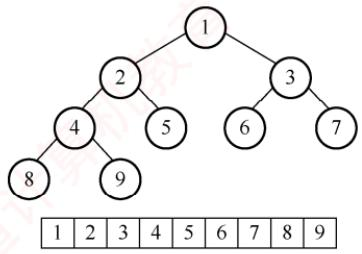  
(a)完全二叉树的顺序存储结构

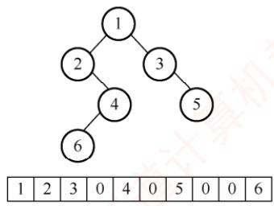  
(b)一般二叉树的顺序存储结构  
图5.4 二叉树的顺序存储结构

## 注意

建议从数组下标1开始存储树中结点，保证数组下标与结点编号一致。

## 2. 链式存储结构

由于顺序存储的空间利用率较低，二叉树通常采用链式存储结构，即使用链表结点来存储二叉树中的每个结点。在二叉树的链式存储中，每个结点通常包括若干数据域和指针域。二叉链表至少包含3个域：左指针域1child、数据域data和右指针域rchild，如图5.5所示。

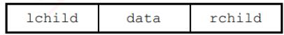  
图 5.5 二叉树链式存储的结点结构

图5.6展示了一棵二叉树及其对应的二叉链表。在实际应用中，还可根据需要扩展结点结构，例如增加指向父结点的指针域，从而形成三叉链表的存储结构。

  
图5.6 二叉链表的存储结构

二叉树的链式存储结构可定义如下：

typedef struct BiTNode{  
ElemType data; //数据域  
struct BiTNode \*lchild,\*rchild; //分别指向左右孩子的指针  
}BiTNode,\*BiTree;

不同的存储结构会导致二叉树操作算法的实现不同，因此应根据实际应用场景（如二叉树的

形态特征及所需执行的运算类型）选择合适的存储方式。

容易验证，在含有n个结点的二叉链表中，共有n+1个空链域（重要结论），常出现在选择题中。下一节将利用这些空链域构造一种新的链表结构——线索链表。

## 5.2.3 本节试题精选

## 一、单项选择题

01.下列关于二叉树的说法中，正确的是（）。A. 度为2的有序树就是二叉树B. 含有n个结点的二叉树的高度为 $\lfloor \log _ { 2 } n \rfloor + 1$ C. 在完全二叉树中，若一个结点没有左孩子，则它必是叶结点D. 含有 n 个结点的完全二叉树的高度为「1og2n

02.“二叉树为空”意味着二叉树（）。 直计A. 根结点没有子树 B. 不存在1 C. 没有结点 D. 由一些没有赋值的空结点构成

03.下列关于完全二叉树的说法中，正确的是（）。 YA. 在完全二叉树中，叶结点的双亲的左兄弟（若存在）一定不是叶结点B. 任何一棵二叉树中，叶结点数为度为2的结点数减1，即 $n _ { 0 }   =   n _ { 2 }   -   1$ C. 完全二叉树不适合顺序存储结构，只有满二叉树适合顺序存储结构D. 结点按完全二叉树层序编号的二叉树中，第i个结点的左孩子的编号为2i

04. 具有10个叶结点的二叉树中有（）个度为2的结点。A. 8 B. 9 Y C. 10 D. 11

05. 设高度为h的二叉树上只有度为0和度为2的结点，则此类二叉树中所包含的结点数至少为（）。A. h C. 2h+ 1 D. h + 1

06. 具有n个结点且高度为 n的二叉树的数目为（）。A. log₂n B. $n / 2$ C. n D. $2 ^ { n - 1 }$

07. 假设一棵二叉树的结点数为50，则它的最小高度是（）。A. 4 妆B. 5 C. 6 D. 7

08. 设二叉树有 2n 个结点，且 $m \leq n .$ ，则不可能存在（）的结点。A. n 个度为 0 B. 2m 个度为 0 C. 2m 个度为 1 D. 2m 个度为 2

09. 一个具有1025 个结点的二叉树的高 h为（）。A.11 B. 10 C. 11\~1025 D.10\~1024

10.设二叉树只有度为0和2的结点，其结点数为15，则该二叉树的最大深度为（）。A. 4 B. 5 C. 8 D. 9

11. 高度为h的完全二叉树最少有（）个结点。A. $2 ^ { h }$ B. $2 ^ { h } + 1$ C. $2 ^ { h - 1 }$ D. $2 ^ { h }   -   1$

12. 已知一棵完全二叉树的第6层（设根为第1层）有8个叶结点，则完全二叉树的结点数最少是（）。A. 39 B. 52 C. 111 D. 119

13. 若一棵深度为6的完全二叉树的第6层有3个叶结点，则该二叉树共有（）个叶结点。A. 17 B. 18 C. 19 D. 20

14. 一棵完全二叉树上有1001个结点，其中叶结点的个数是（）。A. 250 B. 500 C. 254 D. 501

15. 若一棵二叉树有126个结点，在第7层（根结点在第1层）至多有（）个结点。A. 32 B. 64 C. 63 D. 不存在第7层

16.一棵有124个叶结点的完全二叉树，最多有（）个结点。A. 247 B. 248 C. 249 D. 250

17. 某完全二叉树T中，结点数最大的层有8个结点，则T中至多有（）个结点。A. 8 B. 15 C. 23 D. 31

18. 一棵有n个结点的二叉树采用二叉链存储结点，其中空指针数为（）。A. n 妆B. n + 1 C. n−1 D. 2n

19. 设有n（n≥1）个结点的二叉树采用三叉链表表示，其中每个结点包含三个指针，分别指向其左孩子、右孩子及双亲（若不存在，则置为空），则下列说法中正确的是（）。I. 树中空指针的数量为 n + 2 Ⅱ. 所有度为2的结点均被三个指针指向Ⅲ.每个叶结点均被一个指针所指向A. I B. I、II C. I、ⅢII

20. 在一棵完全二叉树中，其根的序号为1，（）可判定序号为p和q的两个结点是否在同一层。A. $\lfloor \log _ { 2 } p \rfloor = \lfloor \log _ { 2 } q \rfloor$ B. $\log_{2}p = \log_{2}q$ C. $\lfloor \log _ { 2 } p \rfloor + 1 = \lfloor \log _ { 2 } q \rfloor$ D. $\lfloor \log _ { 2 } p \rfloor = \lfloor \log _ { 2 } q \rfloor + 1$

21. 在一个用数组表示的完全二叉树中，根结点的下标为1，那么下标为17和19的结点的最近公共祖先的下标是（）。A. 1 B. 2 C. 4 D. 8

22. 假定一棵三叉树的结点数为50，则它的最小高度为（）。A. 3 B. 4 C. 5 D. 6

23. 具有n个结点的三叉树用三叉链表表示，则树中空指针域的个数为（）。A. 3n + 1 B. $2 n + 1$ C. 3n − 1 D. 3n

24. 对于一棵满二叉树，共有n个结点和m个叶结点，高度为h，则（）。A. $n = h + m$ B. $n + m = 2h$ C. $m = h - 1$ D. $n   =   2 ^ { h }   -   1$

25.【2009统考真题】已知一棵完全二叉树的第6层（设根为第1层）有8个叶结点，则该完全二叉树的结点数最多是（）。A. 39 B. 52 C. 111 D. 119

26.【2011统考真题】若一棵完全二叉树有768个结点，则该二叉树中叶结点的个数是（）。YA. 257 B. 258 C. 384 D. 385

27. 【2018统考真题】设一棵非空完全二叉树T的所有叶结点均位于同一层，且每个非叶结点都有 2个子结点。若T有 k个叶结点，则 T的结点总数是（）。A. 2k−1 B. 2k C. $k ^ { 2 }$ T D. $2 ^ { k }   -   1$

28.【2020统考真题】对于任意一棵高度为5且有10个结点的二叉树，若采用顺序存储结构保存，每个结点占1个存储单元（仅存放结点的数据信息），则存放该二叉树需要的存储单元数量至少是（）。A. 31 B. 16 C. 15 D. 10

29. 【2022统考真题】若三叉树T中有244个结点（叶结点的高度为1），则T的高度至少是（）。

A. 8 B. 7 C. 6KXT D. 5

30.【2025统考真题】若二叉树的结点值均为正整数，采用顺序存储方式保存在数组R中，用-1表示结点不存在，则下列数组中，不能表示一棵二叉树的是（）。A. $\mathrm{R}[] = \{ 20, 15, 40, -1, -1, 35 \}$ B. $\mathrm{R}[]=\{15,40,10,18,35,-1,-1\}$ C. $\mathrm{R}[] = \{15, 40, 10, -1, -1, -1, 12\}$ D. $\mathrm{R}[] = \{17,20,35,-1,18,45,-1,-1,19,27\}$

## 二、综合应用题

01. 在一棵完全二叉树中，含有 $n _ { 0 }$ 个叶结点，当度为1的结点数为1时，该树的高度是多少？当度为1的结点数为0时，该树的高度是多少？

02. 一棵有n个结点的满二叉树有多少个分支结点和多少个叶结点？该满二叉树的高度是多少？

03. 已知完全二叉树的第9层有240个结点，则整个完全二叉树有多少个结点？有多少个叶结点？

04.一棵高度为h的满m叉树有如下性质：根结点所在层次为第1层，第h层上的结点都是叶结点，其余各层上每个结点都有m棵非空子树，若按层次自顶向下，同一层自左向右，顺序从1开始对全部结点进行编号，试问：

1）各层的结点数是多少？

2）编号为i的结点的双亲结点（若存在）的编号是多少？

3）编号为i的结点的第k个孩子结点（若存在）的编号是多少？

4）编号为i的结点有右兄弟的条件是什么？其右兄弟结点的编号是多少？

05. 已知一棵二叉树按顺序存储结构进行存储，设计一个算法，求编号分别为i和j的两个结点的最近的公共祖先结点的值。

06.【2016统考真题】若一棵非空 $k ( k \geqslant 2 )$ 叉树T中的每个非叶结点都有k个孩子，则称T为正则k叉树。请回答下列问题并给出推导过程。

1）若T有m个非叶结点，则T中的叶结点有多少个？

2)若 T的高度为 h(单结点的树 $h   = 1 \; )$ ，则T的结点数最多为多少个？最少为多少个？

## 5.2.4 答案与解析

## 一、单项选择题

## 01. C

在二叉树中，若某个结点只有一个孩子，则这个孩子的左右次序是确定的：而在度为2的有序树中，若某个结点只有一个孩子，则这个孩子就无须区分其左右次序，选项A错误。选项B仅当是完全二叉树时才有意义，对于任意一棵二叉树，高度可能为 $\left\lfloor \log _ { 2 } n \right\rfloor + 1 \sim n .$ ，在完全二叉树中，若有度为1的结点，则只可能有一个，且该结点只有左孩子而无右孩子，选项C正确。完全二叉树的高度为 $\left\lceil \log _ { 2 } ( n + 1 ) \right\rceil$ 或 $\left\lfloor \log _ { 2 } n \right\rfloor + 1$ ，也可通过举例n=4来排除，选项D错误。

## 02. C

“二叉树为空”意味着二叉树中没有结点，但并不意味着二叉树不存在。注意，线性表可以是空表，树可以是空树，但图不能是空图（图中不能没有结点）。

## 03. A

在完全二叉树中，叶结点的双亲的左兄弟的孩子一定在其前面（且一定存在），所以双亲的左兄弟（若存在）一定不是叶结点，选项A正确。 $n _ { 0 }$ 应等于 $n _ { 2 } + 1$ ，选项B错误。完全二叉树和满二叉树均可以采用顺序存储结构，选项C错误。第i个结点的左孩子不一定存在，选项D错误。

选项B的这种通用公式适用于所有二叉树，我们应能立即联想到采用特殊值代入法验证，如画一个只含3个结点的满二叉树的草图来验证是否满足条件。

## 04. B

由二叉树的性质 $n _ { 0 }   =   n _ { 2 } + 1$ ，得 $n_{2}=n_{0}-1=10-1=9$

【另解】画出草图，如下图所示。首先画出10个叶结点，然后每2个结点向上合并，构造一个新的度为2的分支结点，直到构成如下图所示的二叉树，其中度为2的分支结点数为9。


## 05.B

结点最少的情况如下图所示。除根结点层只有1个结点外，其他h-1层均有两个结点，结点总数 $2(h - 1) + 1 = 2h - 1$ o

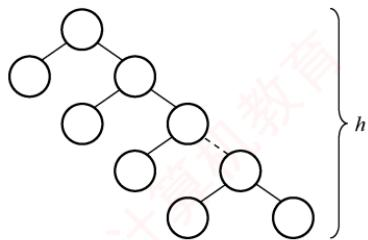

## 06. D

除根结点外，在其余n-1个结点中，每个结点要么是其父结点的左孩子，要么是其父结点的右孩子，每个结点都有两种可能，n-1个结点共有 $2 ^ { n - 1 }$ 种不同的组合形态。

## 07. C

要求满足条件的树，分析可知当这50个结点构成一棵完全二叉树时高度最小， $h = \left\lfloor \log_{2} n \right\rfloor + 1 =$ $\left \lfloor \log_{2}50 \right \rfloor + 1 = 6$

【另解】第1层最多有1个结点，第2层最多有 $2 ^ { 1 }$ 个结点，第3层最多有 $2 ^ { 2 }$ 个结点，第4层最多有 $2 ^ { 3 }$ 个结点，以此类推，可以得到h最少为6。

## 08. C

由二叉树的性质1可知 $n _ { 0 }   =   n _ { 2 }   +   1$ ，结点总数 $2n = n_{0} + n_{1} + n_{2} = n_{1} + 2n_{2} + 1$ ，则 $n_{1}=2(n-n_{2})-1$ 所以 $n _ { 1 }$ 为奇数，说明该二叉树中不可能有2m个度为1的结点。 +2m2+

## 09. C

当二叉树为单支树时具有最大高度，即每层上只有一个结点，最大高度为1025。而当树为完全二叉树时，其高度最小，最小高度为 $\left\lfloor \log _ { 2 } n \right\rfloor + 1 = 1 1$ I

## 10. C

建议画图，第一层有1个结点，其余h-1层各有2个结点，总结点数 $1+2(h-1)=15,\ h=8$

## 11. C

高度为h的完全二叉树中，第1层～第h-1层构成一个高度为h-1的满二叉树，结点数为$2 ^ { h - 1 } - 1$ 。第h层至少有一个结点，所以最少的结点数 $( 2 ^ { h - 1 } - 1 ) + 1 = 2 ^ { h - 1 }$

## 12. A

第6层有叶结点说明完全二叉树的高度可能为6或7，显然树高为6时结点最少。若第6层上有8个叶结点，则前5层为满二叉树，所以完全二叉树的结点数最少为 $2^{5}-1+8=39$ 0

## 13. A

深度为6的完全二叉树，第5层共有 $2^{4} = 16$ 个结点。第6层最左边有3个叶结点，其对应的双亲结点为第5层最左边的两个结点，所以第5层剩余的结点均为叶结点，共有 $1 6   -   2   =   1 4$ 个，加上第6层的3个叶结点，共有17个叶结点。

## 14. D

由完全二叉树的性质，最后一个分支结点的序号为 $\left \lfloor 1001/2 \right \rfloor = 500$ ，所以叶结点数为501。【另解】 $n = n_{0} + n_{1} + n_{2} = n_{0} + n_{1} + (n_{0} - 1) = 2n_{0} + n_{1} - 1$ ，因为 $n   =   1 0 0 1$ ，而在完全二叉树中，$n _ { 1 }$ 只能取0或1。当 $n_{1} = 1$ 时， $n _ { 0 }$ 为小数，不符合题意。所以 $n _ { 1 } = 0$ ，于是有 $n _ { 0 } = 5 0 1$ 。

## 15. C

要使二叉树第7层的结点数最多，只考虑树高为7层的情况，7层满二叉树有127个结点，126仅比127少1个结点，只能少在第7层，所以第7层最多有 $2^{6} - 1 = 63$ 个结点。

## 16. B

在非空的二叉树当中，由度为0和2的结点数的关系 $n _ { 0 }   =   n _ { 2 } + 1$ 可知 $n _ { 2 } = 1 2 3$ ；总结点数 $n =$ $n_{0}+n_{1}+n_{2}=247+n_{1}$ ，其最大值为 $2 4 8 \: \left( n _ { 1 } \right.$ 的取值为1或0，当 $n _ { 1 } = 1$ 时结点最多）。注意，由完全二叉树总结点数的奇偶性可以确定 $n _ { 1 }$ 的值，但不能根据 $n _ { 0 }$ 来确定 $n _ { 1 }$ 的值。

【另解】 $1 2 4 \leq 2 ^ { 7 } = 1 2 8$ ，所以第8层没满，前7层为完全二叉树，由此可推算第8层可能有120个叶结点，第7层的最右4个为叶结点，考虑最多的情况，这4个叶结点中的最左边可以有1个左孩子（不改变叶结点数），因此结点总数 $2^{7}-1+120+1=248$ o

## 17. C

在完全二叉树中，第4层刚好最多有8个结点（前4层对应高度为4的满二叉树），若第5层也有8个结点，则对应于结点数最多的情况，此时树高为5，总结点数为 $1 5 + 8 = 2 3$

## 18. B

非空指针数=总分支数=n-1，空指针数=2×结点总数-非空指针数 $2n - (n - 1) = n + 1$

【另解】在树中，1个指针对应1个分支，n个结点的树共有n-1个分支，即n-1个非空指针，每个结点都有2个指针域，所以空指针数 $2n - (n - 1) = n + 1$

## 19. A

二叉链表表示的二叉树中空指针的数量为n+1，三叉链表表示的二叉树多了一个根结点指向双亲的空指针，所以树中空指针的数量为n+2，说法Ⅰ正确。若根结点的度为2，则只有左右两个孩子指向它，说法Ⅱ错误。若整棵树只有一个根结点，则没有指针指向它，说法Ⅲ错误。

## 20. A

由完全二叉树的性质，编号为 $i (i \geqslant 1)$ 的结点所在的层次为 $\log_{2}i + 1$ ，若两个结点位于同一层，则一定有 $\lfloor \log _ { 2 } p \rfloor + 1 = \lfloor \log _ { 2 } q \rfloor + 1$ ，因此有 $\lfloor \log _ { 2 } p \rfloor = \lfloor \log _ { 2 } q \rfloor$ 成立。

## 21. C

当根结点下标为1时，下标为i的结点的父结点下标为 $. i / 2 .$ ，那么下标为17的祖先的下标有8,4,2,1，下标为19的祖先的下标有9,4,2,1，因此两者最近的公共祖先的下标是4。

## 22. C

分析可知，满足条件的三叉树可以是完全三叉树，这棵树的第 $i ( i \geqslant 1 )$ 层最多有 $3 ^ { i - 1 }$ 个结点。设高度为h，则 $3^{0}+3^{1}+\cdots+3^{h-1}=(3^{h}-1)/2$ 是结点数的上限，问题是求解 $5 0 \leqslant ( 3 ^ { h } - 1 ) / 2$ 的最小h值，即 $h \geqslant \log_{3}101$ ，有 $h = \left\lceil \log_{3}101 \right\rceil = 5$

## 23. B

三叉树采用三叉链表表示，每个结点均有3个指针域指向3个孩子，共有3n个指针域，但n个结点构成的一棵树中只需要n-1个指针（对于n-1条边），因此空指针域有2n+1个。

## 24. D

对于高度为h的满二叉树，结点总数 $n = 2^{0} + 2^{1} + \cdots + 2^{h - 1} = 2^{h} - 1$ ，叶结点数 $m   =   2 ^ { h - 1 }$ 0

## 25. C

第6层有叶结点，完全二叉树的高度可能为6或7，显然树高为7时结点最多。完全二叉树与满二叉树相比，只是在最下一层的右边缺少部分叶结点，而最后一层之上是个满二叉树，且只有最后两层上有叶结点。若第6层上有8个叶结点，则前6层为满二叉树，而第7层缺失 $8 \times 2 = 16$ 个叶结点，所以完全二叉树的结点数最多为 $2^{7}-1-16=111$

## 26. C

最后一个分支结点的编号为 $\left \lfloor 768/2 \right \rfloor = 384$ ，所以叶结点的个数为 $768-384=384$

【另解】 $n = n_{0} + n_{1} + n_{2} = n_{0} + n_{1} + (n_{0} - 1) = 2n_{0} + n_{1} - 1$ ，其中 $n = 7 6 8$ ，而在完全二叉树中，$n _ { 1 }$ 只能取0或1，当 $n _ { 1 }   =   0$ 时， $n _ { 0 }$ 为小数，不符合题意。因此 $n _ { 1 } = 1$ ，所以 $n _ { 0 } = 3 8 4$

## 27. A

非叶结点的度均为2，且所有叶结点都位于同一层的完全二叉树就是满二叉树。对于一棵高度为h的满二叉树（空树 $h   =   0 )$ ，其最后一层全部是叶结点，数目为 $2 ^ { h - 1 }$ ；总结点数为 $2 ^ { h } { - } 1$ 。因此当 $2 ^ { h - 1 } = k$ 时，可以得到 $2 ^ { h } - 1 = 2 k - 1$

## 28. A

二叉树采用顺序存储时，用数组下标来表示结点之间的父子关系。对于一棵高度为5的二叉树，为了满足任意性，其1～5层的所有结点都要被存储起来，即考虑为一棵高度为5的满二叉树，共需要存储单元的数量为 $1+2+4+8+16=31$

## 29. C

高度一定的三叉树中结点数最多的情况是满三叉树。高度为5的满三叉树的结点数 $= 3 ^ { 0 } + 3 ^ { 1 } +$ $3^{2}+3^{3}+3^{4}=121$ ，高度为6的满三叉树的结点数 $3^{0}+3^{1}+3^{2}+3^{3}+3^{4}+3^{5}=364$ 。三叉树T的结点数为244， $1 2 1 < 2 4 4 < 3 6 4$ ，因此 T的高度至少为6。

## 30. D

在二叉树的顺序存储结构中，结点按完全二叉树的层次顺序存放：根在下标0，对于任意非根结点R[i]，其父结点为 $\mathrm { R } [ \lfloor ( i - 1 ) / 2 \rfloor ]$ 。若某结点为空，则其所有后代位置必须也为空，<!-- DIRECTED-REPAIR-FALLBACK:FALLBACK-QA-R2-DS-CH05-P150-TRUNCATION -->
> [!WARNING]
> 原 PDF 第 150 页回退：题30解析在'空'字后截断一整段

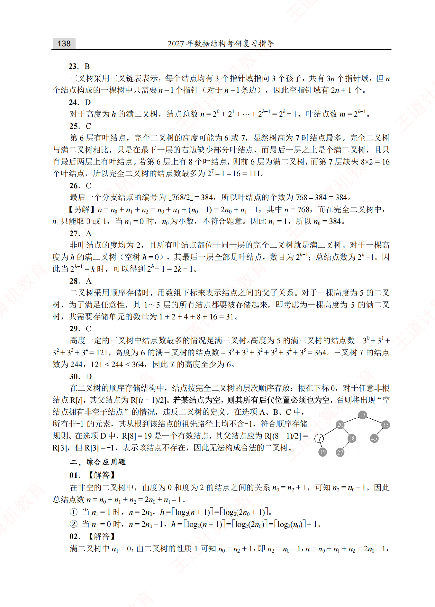

否则将出现“空

所有非-1的元素，其从根到该结点的祖先路径上均不含-1，符合顺序存储规则。在选项D中， $\mathrm { R } [ 8 ]   =   1 9$ 是一个有效结点，其父结点应为 $\mathrm{R}[\lfloor(8 - 1)/2\rfloor] =$ R[3]，但 $\operatorname { R } [ 3 ]   =   - 1$ ，表示该结点不存在，因此无法构成合法的二叉树。

## 二、综合应用题


## 01. 【解答】

在非空的二叉树中，由度为0和度为2的结点之间的关系 $n _ { 0 }   =   n _ { 2 }   +   1$ ，可知 $n _ { 2 }   =   n _ { 0 }   - 1$ 。因此总结点数 $n = n_{0} + n_{1} + n_{2} = 2n_{0} + n_{1} - 1$ 0

①当 $n _ { 1 } = 1$ 时， $n = 2 n _ { 0 } , \quad h = \lceil \log _ { 2 } ( n + 1 ) \rceil = \lceil \log _ { 2 } ( 2 n _ { 0 } + 1 ) \rceil .$

②当 $n _ { 1 } = 0$ 时， $n = 2n_{0} - 1, \quad h = \lceil \log_{2}(n + 1) \rceil = \lceil \log_{2}(2n_{0}) \rceil = \lceil \log_{2}(n_{0}) \rceil + 1 。$

## 02. 【解答】

满二叉树中 $n _ { 1 } = 0$ ，由二叉树的性质1可知 $n _ { 0 }   =   n _ { 2 } + 1$ ，即 $n_{2}=n_{0}-1,n=n_{0}+n_{1}+n_{2}=2n_{0}-1$

则 $n _ { 0 } = ( n + 1 ) / 2$ 。分支结点数 $n_{2}=n-(n+1)/2=(n-1)/2$ 。高度为h的满二叉树的结点数 $n = 1 + 2 ^ { 1 } +$ $2 ^ { 2 } + \cdots + 2 ^ { h - 1 } = 2 ^ { h } - 1$ ，即高度 $h = \log_{2}(n + 1)$

## 03.【解答】

在完全二叉树中，若第9层是满的，则结点数 $2^{9 - 1} = 256$ ，而现在第9层只有240个结点，说明第9层未满，是最后一层。1～8层是满的，所以总结点数 $2^{8}-1+240=495$

因为第9层是最后一层，所以第9层的结点都是叶结点。且第9层的240个结点的双亲在第8层中，其双亲个数为120，即第8层有120个分支结点，其余为叶结点，所以第8层的叶结点数为 $2^{8 - 1} - 120 = 8$ 。因此，总的叶结点数 $8+240=248$ 0 XTA

【另解】总结点数 $n = n_{0} + n_{1} + n_{2}, \quad n_{2} = n_{0} - 1, \quad n = n_{0} + n_{1} + n_{2} = 2n_{0} + n_{1} - 1$ 。若 $n_{1} = 1$ ，则 $2n_{0}+n_{1}-1=2n_{0}=495$ ，不符合；若 $n _ { 1 } = 0$ ，则 $2n_{0}+n_{1}-1=2n_{0}-1=495$ ，则 $n_{0} = 248$

## 注意

对于本题，应理解完全二叉树中只有最底层的结点是不满的，其他各层的结点都是满的。

## 04.【解答】

1）第1层有 $m ^ { 0 }   = 1$ 个结点，第2层有 $m ^ { 1 }$ 个结点，第3层有 $m ^ { 2 }$ 个结点……一般地，第i层有$m ^ { i - 1 }$ 个结点 $( 1 \leqslant i \leqslant h )$

2）在m叉树的情形下，结点i的第1个孩子编号为 $j = (i - 1)m + 2$ ，反过来，结点i的双亲的编号是L $(i - 2)/m \downarrow + 1$ ，根结点没有双亲，所以要求i>1。

3）因为结点i的第1个孩子编号为 $l ( i - 1 ) m + 2$ ，若设该结点孩子的序号为 $k   =   1 , 2 , \cdots , m$ ，则第k个孩子结点的编号为 $(i - 1)m + k + 1 \quad (1 \leq k \leq m)$

4）结点i不是其双亲的第m个孩子时才有右兄弟。设其双亲编号为j，可得 $j = \left\lfloor (i + m - 2)/m \right\rfloor$ 结点j的第m个孩子的编号为 $\exists (j-1)m+m+1=jm+1=\left\lfloor (i+m-2)/m \right\rfloor m+1$ ，所以当结点的编号 $i \leqslant \left\lfloor (i + m - 2)/m \right\rfloor m$ 时才有右兄弟，右兄弟的编号为 $i + 1   \mathrm { { _ { c } } }$ ，或者，对于任意一个双亲结点j，其第m个孩子结点的编号是 $j m + 1$ ，故若不为第m个孩子结点，则 $(i - 1)^{n} \% m ! = 0$

## 05.【解答】

首先，必须明确二叉树中任意两个结点必然存在最近的公共祖先结点，最坏的情况下是根结点（两个结点分别在根结点的左右分支中），而且从最近的公共祖先结点到根结点的全部祖先结点都是公共的。由二叉树顺序存储的性质可知，任意一个结点i的双亲结点的编号为 $i / 2$ 。求解 i和i最近公共祖先结点的算法步骤如下（设从数组下标1开始存储）：

1）若 $i \geq j ,$ 则结点i所在层次大于或等于结点j所在层次。结点i的双亲结点为结点 $i / 2$ 若 $i / 2 = j,$ 则结点i2是原结点i和结点i的最近公共祖先结点，若 $i / 2   \neq   j$ ，则令 $i = i / 2$ 即以该结点i的双亲结点为起点，采用递归的方法继续查找。

2）若 $j \geq i ,$ 则结点j所在层次大于或等于结点i所在层次。结点j的双亲结点为结点 $j / 2$ 若 $j / 2 = i$ ，则结点 $j / 2$ 是原结点i和结点j的最近公共祖先结点，若 $j / 2   \neq   i$ ，则令 $j   =   j / 2$ 重复上述过程，直到找到它们最近的公共祖先结点为止。

本题代码如下：

```c
ElemType Comm Ancestor(SqTree T,int i,int j){
//本算法在二叉树中查找结点i 和结点 j的最近公共祖先结点
$\begin{aligned}\texttt{i f (T [i] !=}& \# \texttt{' s g T [j] !=} \# \texttt{' ) \{} } \\\texttt{wh i l e (i !=j) \{} } \\\texttt{i f (i>j)} \\\texttt{i=i/2 ;}\end{aligned}$ //结点存在
//两个编号不同时循环
//向上找 i 的祖先
```

else  
j=j/2; //向上找 j 的祖先  
}  
return T[i]; 计算机  
1  
1

由解题中算法的步骤描述可知，本题也很容易地联想到采用递归的方法求解。

## 06. 【解答】

1）正则k叉树中仅含有两类结点；叶结点（个数记为 $n _ { 0 } )$ 和度为k的分支结点（个数记为 $n _ { k } )$ 。树 T 中的结点总数 $n = n_{0} + n_{k} = n_{0} + m.$ 。树中所含的边数 $e = n - 1$ ，这些边均是从m个度为k的结点发出的，即 $e   =   m k .$ 。整理得 $n_{0}+m=mk+1$ ，所以 $n_{0} = (k - 1)m + 1$ 0

2）高度为h的正则k叉树T中，含最多结点的树形为：除第h层外，第1到第h-1层的结点都是度为k的分支结点；而第h层均为叶结点，即树是“满”树。此时第 $j ( 1 \leqslant j \leqslant h )$ 层的结点数为 $k ^ { j - 1 }$ ，结点总数 $M _ { 1 }$ 为

$$
M_{1}=\sum_{j = 1}^{h}k^{j - 1}=\frac{k^{h}-1}{k - 1}
$$

含最少结点的正则k叉树的树形为：第1层只有根结点，第2到第h-1层仅含1个分支结点和k-1个叶结点，第h层有k个叶结点。也就是说，除根外，第2到第h层中每层的结点数均为k，所以T中所含结点总数 $M _ { 2 }$ 为

$$
M_{2}=1+(h-1)k
$$

## 5.3 二叉树的遍历和线索二叉树

## 5.3.1 二叉树的遍历

二叉树的遍历是指按照某种搜索路径访问树中的每个结点，使得每个结点均被访问一次且仅  
被访问一次。由于二叉树是一种非线性结构，每个结点最多有两棵子树，因此需要确定一种系统  
性的访问顺序，将树中结点排列成一个线性序列，以便于后续处理。V

考点追踪二叉树遍历的相关分析（2009、2011、2012）

考点追踪（算法题）二叉树遍历的应用（2014、2017、2022）

根据二叉树的递归定义，遍历一棵二叉树的关键在于确定对根结点（N）、左子树（L）和右子树（R）的访问顺序。在遵循“先左后右”的原则下，常见的遍历方式有三种：先序遍历（NLR）、中序遍历（LNR）和后序遍历（LRN），其中“序”指的是根结点在遍历序列中的位置。

## 1. 先序遍历（PreOrder）

若二叉树为空，则不执行任何操作；否则，

1）访问根结点；

2）先序遍历左子树；

3）先序遍历右子树。

图5.7中的虚线表示对该二叉树进行先序遍历的访问路径，所得先序遍历序列为124635。

对应的递归算法如下：

  
图 5.7 二叉树的先序遍历

```c
void PreOrder(BiTree T) {
if(T!=NULL) {
visit(T); //访问根结点
PreOrder(T->lchild) ; 算 //递归遍历左子树
PreOrder(T->rchild); //递归遍历右子树
道
```

## 2. 中序遍历（InOrder）

若二叉树为空，则不执行任何操作；否则，

1）中序遍历左子树；

2）访问根结点；

3）中序遍历右子树。


## 考点追踪中序序列中结点关系的分析（2017、2024）

图5.8中的虚线表示对该二叉树进行中序遍历的访问路径，所得中序遍历序列为264135。

图 5.8 二叉树的中序遍历

对应的递归算法如下：

void InOrder(BiTree T){  
if(T!=NULL) {  
InOrder(T->lchild); //递归遍历左子树  
visit(T); //访问根结点  
InOrder(T->rchild); //递归遍历右子树

## 3. 后序遍历（PostOrder）

若二叉树为空，则不执行任何操作；否则，

1）后序遍历左子树；

2）后序遍历右子树；

3）访问根结点。


图5.9中的虚线表示对该二叉树进行后序遍历的访问路径，所得后序遍历序列为642531。

对应的递归算法如下：

图 5.9 二叉树的后序遍历  
```c
void PostOrder(BiTree T) {
if(T!=NULL) {
PostOrder(T->lchild); //递归遍历左子树
PostOrder(T->rchild); //递归遍历右子树
王道 visit(T); //访问根结点
2
```

上述三种遍历算法中，递归遍历左右子树的顺序都是固定的，区别仅在于访问根结点的时机

不同。不论采用哪种遍历方法，每个结点都被访问一次且仅一次，时间复杂度均为O(n)。在递归实现中，系统工作栈的深度等于树的高度，在最坏情况下（如单支树），空间复杂度为O(n)。

## 4. 层次遍历

图5.10展示了二叉树的层次遍历过程，即按照1,2,3,4的层次顺序，以及箭头所指方向，从上到下、从左到右逐层访问二叉树中的各结点。

  
图 5.10 二叉树的层次遍历

层次遍历需要借助一个队列，其基本思想如下：首先将根结点入队，随后不断出队并访问队头结点，同时将其存在的左右孩子依次加入队尾，直至队列为空。

## 二叉树的层次遍历算法如下：

```c
void LevelOrder(BiTree T){
BiTree p; InitQueue(Q); 王道 //初始化辅助队列
EnQueue (Q,T) ; //将根结点入队
while(!IsEmpty(Q)){ //队列不空则循环
DeQueue (Q, p); //队头结点出队
visit(p); //访问出队结点
if(p->lchild!=NULL)
EnQueue(Q,p->lchild); //若左孩子不空，则左孩子入队
if(p->rchild!=NULL)
EnQueue(Q,p->rchild); //若右孩子不空，则右孩子入队
```

读者可将上述层次遍历算法作为一个模板，熟练掌握其执行过程，并达到熟练手写的程度。

## 注意

遍历是二叉树各类操作的基础。例如，对于一棵给定二叉树，求结点的双亲、查找孩子结点、计算树的深度、统计叶结点数、判断两棵二叉树是否相同等操作，本质上都是在某种遍历过程中完成的。因此，必须深入理解并灵活运用各种遍历方法，以解决实际问题。

## 5. 由遍历序列构造二叉树

考点追踪先序序列对应的不同二叉树的分析（2015）

对于一棵给定的二叉树，其先序序列、中序序列、后序序列和层序序列都是唯一确定的。然而，仅凭这四种遍历序列中的任意一种，却无法唯一确定这棵二叉树。但若已知中序序列，并辅以其他三种遍历序列中的任意一种，则可以唯一地重构出该二叉树。

## （1）由先序序列和中序序列构造二叉树

考点追踪先序序列和中序序列相同时确定的二叉树（2017）

## 考点追踪由先序序列和中序序列构造一棵二叉树（2020、2021）

在先序序列中，第一个结点必定是整棵二叉树的根结点；而在中序遍历中，根结点将中序序列划分为两个子序列：左侧子序列为左子树的中序序列，右侧子序列为右子树的中序序列。由于左右子树的结点数在先序和中序序列中一致，因此可据此从先序序列中分离出左右子树各自的先序子序列，如图5.11所示。通过递归地对左右子树重复上述过程，即可唯一地确定整棵二叉树。

  
图5.11 由先序序列和中序序列构造二叉树

例如，求先序序列（ABCDEFGHI）和中序序列（BCAEDGHFI）所确定的二叉树。首先，由先序序列可知A为根结点。在中序序列中，A左侧的BC构成左子树的中序序列，右侧的EDGHFI构成右子树的中序序列。然后，由先序序列可知B是左子树的根结点，D是右子树的根结点。以此类推，将剩余结点递归分解，最终构造出的二叉树如图5.12(c)所示。


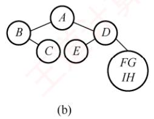

  
图 5.12 一棵二叉树的构造过程

## （2）由后序序列和中序序列构造二叉树

## 考点追踪由后序序列和树形构造一棵二叉树（2017、2023）

同理，后序序列与中序序列也可唯一确定一棵二叉树。后序序列的最后一个结点即为整棵树的根结点，它同样能将中序序列划分为左右子树的中序序列。随后，根据左右子树的结点数，可从后序序列中分离出对应的左右子树的后序序列，并递归构造，如图5.13所示。

  
图5.13 由后序序列和中序序列构造二叉树  
请读者分析后序序列（CBEHGIFDA）和中序序列（BCAEDGHFI）所确定的二叉树。

## (3）由层序序列和中序序列构造二叉树

在层序序列中，第一个结点必为二叉树的根结点，由此可在中序序列中划分出左右子树的中序序列。若存在左子树，则层序序列的第二个结点一定是左子树的根，可以进一步划分左子树；若存在右子树，则层序序列中紧接着的下一个结点一定是右子树的根，可以进一步划分右子树，如图514所示。通过逐层确定各子树的根结点并递归划分，即可唯一确定这棵二叉树。 NO

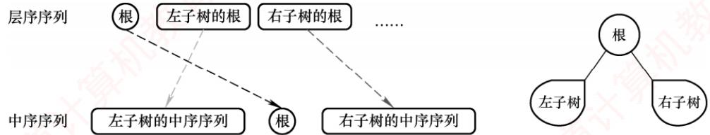  
图5.14 由层序序列和中序序列构造二叉树

请读者分析层序序列（ABDCEFGIH）和中序序列（BCAEDGHFI）所确定的二叉树。

注意，仅凭先序、后序和层序序列中的任意两种组合，通常无法唯一确定一棵二叉树。例如，图5.15所示的两棵二叉树的先序序列均为AB，后序序列均为BA，层序序列均为AB。 1

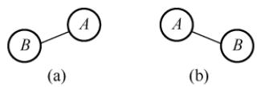  
图 5.15 两棵不同的二叉树

## 5.3.2 线索二叉树

## 1. 线索二叉树的基本概念

遍历二叉树是按照特定规则将树中所有结点排列成一个线性序列，从而得到相应的遍历序

列。在该序列中，除首尾结点外，每个结点都有唯一的直接前驱和直接后继。

考点追踪线索二叉树的定义（2010）

传统的二叉链表结构仅能反映父子关系，无法直接获取结点在某种遍历序列中的前驱或后继。前面提到，在含有n个结点的二叉树中，共有n+1个空指针域：每个叶结点贡献2个空指针，每个度为1的结点贡献1个空指针，因此空指针总数为 $2n_{0}+n_{1}, 又 n_{0}=n_{2}+1$ ，可得空指针总数 $n_{0}+n_{1}+n_{2}+1=n+1$ 由此，自然想到：可否利用这些空指针，直接指向结点在遍历序列中的前驱或后继？若能实现，便可像遍历链表一样高效地遍历二叉树，线索二叉树正是基于这一思想设计的。

具体规定如下：

● 若某结点无左子树，则将1child指向其在指定遍历序列中的前驱结点。

● 若某结点无右子树，则将rchild指向其在指定遍历序列中的后继结点。

为区分指针域指向的是孩子还是线索，需在结点结构中增设两个标志域，如图5.16所示。

<table><tr><td>1child</td><td>1tag</td><td>data</td><td>rtag</td><td>rchild</td></tr><tr><td></td><td></td><td></td><td></td><td></td></tr></table>

图5.16 线索二叉树的结点结构

标志域1tag 和rtag的含义如下：

● 1tag=0 表示 1child 指向左孩子，1tag=1 表示 1child 指向前驱。

● rtag=0 表示 rchild 指向右孩子，rtag=1 表示 rchild 指向后继。

线索二叉树的存储结构可定义为：

typedef struct ThreadNode{  
ElemType data; //数据元素  
struct ThreadNode \*lchild,\*rchild; //左右孩子指针  
int ltag,rtag; //左右线索标志  
}ThreadNode,\*ThreadTree;

采用上述结构的二叉链表称为线索链表，其中指向前驱或后继的指针称为线索。这种带有线索的二叉树称为线索二叉树。

## 2. 中序线索二叉树的构造

二叉树的线索化是指将二叉链表中的空指针域替换为指向前驱或后继的线索。由于结点的前驱和后继关系只能在遍历过程中确定，因此线索化本质上就是对二叉树进行一次遍历。

考点追踪中序线索二叉树中线索的指向（2014）

以中序线索二叉树的构造为例：设指针pre指向刚刚访问过的结点，指针p指向当前正在访问的结点，pre即为p的中序前驱。在中序遍历过程中：检查p的左指针是否为空，若为空则令其指向 pre；检查pre的右指针是否为空，若为空则令其指向p，如图5.17所示。

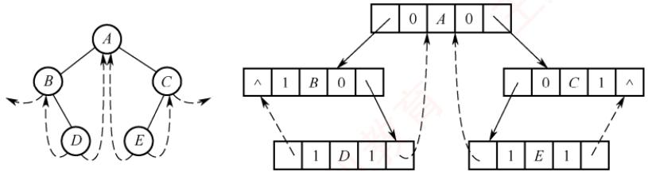  
图5.17 中序线索二叉树及其二叉链表示

通过中序遍历对二叉树线索化的递归算法如下：

void InThread(ThreadTree &p,ThreadTree &pre) {   
if(p!=NULL) {

```c
InThread(p->lchild,pre); //递归，线索化左子树
if(p->lchild==NULL) { //当前结点的左子树为空
p->lchild=pre; //建立当前结点的前驱线索
p->1tag=1;
if(pre!=NULL&&pre->rchild==NULL){//前驱结点非空且其右子树为空
pre->rchild=p; //建立前驱结点的后继线索
pre->rtag=1;
}
pre=p; //标记当前结点成为刚刚访问过的结点
InThread(p->rchild,pre); //递归，线索化右子树
1
```

建立中序线索二叉树的主过程如下：

```c
void CreateInThread(ThreadTree T) {
ThreadTree pre=NULL;
if(T!=NULL) { //非空二叉树，线索化
InThread(T,pre); //线索化二叉树
pre->rchild=NULL; //处理遍历的最后一个结点
pre->rtag=1;
2
```

为方便遍历，可在线索链表上增设一个头结点：其1child指向根结点；rchilα指向中序序列的最后一个结点；中序序列的第一个结点的1child和最后一个结点的rchilα均指向头结点。如此，便形成一个双向循环线索链表，从而支持正向与反向的高效遍历，如图5.18所示。

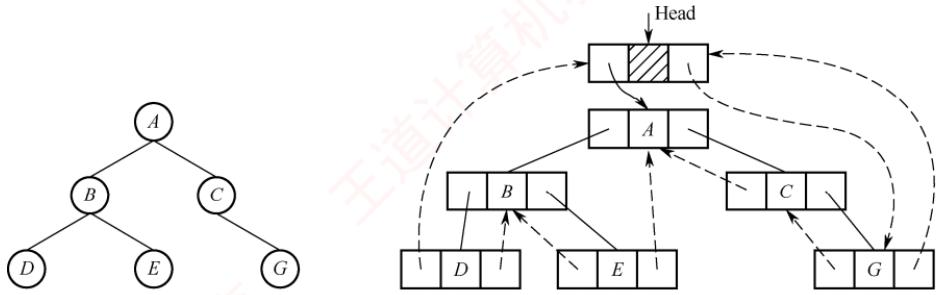  
图5.18 带头结点的中序线索二叉树

## 3. 中序线索二叉树的遍历

中序线索二叉树的结点中已隐含前驱和后继信息，因此遍历时无须借助栈或递归。只需先找到中序序列的第一个结点，然后依次查找每个结点的后继，直至后继为空（或回到头结点）。在中序线索二叉树中，查找结点后继的规则如下：若结点的rtag为1，则rchi1d直接指向其后继；若rtag为0，则其后继为右子树中最左下结点（右子树的中序第一个结点）。

不含头结点的中序线索二叉树遍历相关算法如下。

1）求中序序列中的第一个结点：

ThreadNode \*Firstnode(ThreadNode \*p) {  
while(p->ltag==0) p=p->lchild； //沿左孩子链走到最左下结点  
return p;  
}

2）求结点p在中序序列中的后继：

ThreadNode \*Nextnode(ThreadNode \*p) {   
if(p->rtag==0) return Firstnode(p->rchild); //右子树中最左下结点   
else return p->rchild; //若 rtag==1 则直接返回后继线索   
}

请读者自行完成求中序序列中的最后一个结点和结点p的中序前驱的运算①。

3）利用上面两个算法，可实现非递归的中序遍历：

```lisp
void Inorder(ThreadNode *T) {
for(ThreadNode *p=Firstnode(T);p!=NULL; p=Nextnode(p))
visit(p);
1 道
```

## 4. 先序线索二叉树和后序线索二叉树

建立先序或后序线索二叉树的方法与中序类似，只需调整递归调用顺序及线索建立的位置。以图5.19(a)的二叉树为例，手工构造先序线索二叉树的过程如下（先序序列为ABCDF，依次处理每个结点，若其左或右指针为空，则将其替换为对应前驱或后继的线索）： VI

结点A、B均有左右孩子，无须修改指针；结点C无左孩子，将其1chi1α指向前驱B，无右孩子，将其rchi1α指向后继D；结点D无左孩子，将其1chilα指向前驱C，无右孩子，将其rchild指向后继F；结点F无左孩子，将其1chilα指向前驱D，无右孩子且无后继，将其rchild置为空，最终得到的先序线索二叉树如图5.19(b)所示。

构造后序线索二叉树的过程类似（后序序列为CDBFA）：

结点C无左孩子且无前驱，将1child 置空，无右孩子，将rchilα 指向后继 $D;$ 结点D无左孩子，将lchild指向前驱C,无右孩子，将rchild指向后继 $B ;$ 结点F无左孩子，将lchild指向前驱B，无右孩子，将rchild指向后继A，得到的后序线索二叉树如图5.19(c)所示。

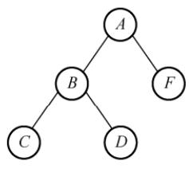  
(a)一颗二叉树

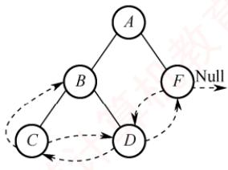  
(b) 先序线索二叉树

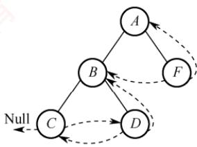  
(c) 后序线索二叉树  
图5.19 先序线索二叉树和后序线索二叉树

在先序线索二叉树中查找某结点的后继较为直接：若该结点有左孩子，则左孩子为其后继；

## 考点追踪后序线索二叉树的特点（2013）

而在后序线索二叉树中查找后继则较为复杂，需要分以下三种情况：①若结点x是整棵二叉树的根，则其后继为空；②若结点x是其双亲的右孩子，或是其双亲的左孩子且该双亲无右子树，则x的后继即为其双亲；③若结点x是其双亲的左孩子，且该双亲存在右子树，则x的后继为该右子树中按后序遍历访问的第一个结点（右子树中最左下结点）。

值得注意的是，图5.19(c)中，结点B的后继是A，但无法直接通过线索找到后继，需要回溯到其双亲。因此，在后序线索二叉树中高效查找后继通常需要知道结点的父结点信息。为此，通常采用带父指针的三叉链表作为存储结构，而非标准的二叉线索链表。

## 5.3.3 本节试题精选

## 一、单项选择题

01. 在下列关于二叉树遍历的说法中，正确的是（）。

A. 若有一个结点是二叉树中某个子树的中序遍历结果序列的最后一个结点，则它一定是该子树的先序遍历结果序列的最后一个结点  
B. 若有一个结点是二叉树中某个子树的先序遍历结果序列的最后一个结点，则它一定是该子树的中序遍历结果序列的最后一个结点  
C. 若有一个叶结点是二叉树中某个子树的中序遍历结果序列的最后一个结点，则它一定是该子树的先序遍历结果序列的最后一个结点  
D. 若有一个叶结点是二叉树中某个子树的先序遍历结果序列的最后一个结点，则它一定是该子树的中序遍历结果序列的最后一个结点 XTA

02. 在任何一棵二叉树中，若结点a有左孩子b、右孩子c，则在结点的先序序列、中序序列、后序序列中，（）。 机A. 结点 b一定在结点a的前面 B. 结点a一定在结点c的前面C. 结点 b一定在结点c的前面 D. 结点 a一定在结点 b 的前面

03. 设n,m为一棵二叉树上的两个结点，在中序遍历时，n在m前的条件是（）。A. n 在 m 右方 B. n 是 m 祖先 C. n 在 m 左方 D. n 是 m 子孙

04.设n,m为一棵二叉树上的两个结点，在后序遍历时，n在m前的充分条件是（）。A. n 在 m 右方 B. n 是 m 祖先 C. n 在 m 左方 D. n 是 m 子孙

05. 某非空二叉树采用顺序存储结构，树中的结点信息按完全二叉树的层次序列依次存放在如下所示的一维数组中，则该二叉树的后序遍历序列为（）。

<table><tr><td rowspan=1 colspan=1>0</td><td rowspan=1 colspan=1>1</td><td rowspan=1 colspan=1>2</td><td rowspan=1 colspan=1>3</td><td rowspan=1 colspan=1>4</td><td rowspan=1 colspan=1>5</td><td rowspan=1 colspan=1>6</td><td rowspan=1 colspan=1>1</td><td rowspan=1 colspan=1>8</td><td rowspan=1 colspan=1>9</td><td rowspan=1 colspan=1>10</td><td rowspan=1 colspan=1>11</td><td rowspan=1 colspan=1>12</td></tr><tr><td rowspan=1 colspan=1>a</td><td rowspan=1 colspan=1>b</td><td rowspan=1 colspan=1>c</td><td rowspan=1 colspan=1></td><td rowspan=1 colspan=1>d</td><td rowspan=1 colspan=1>e</td><td rowspan=1 colspan=1></td><td rowspan=1 colspan=1></td><td rowspan=1 colspan=1></td><td rowspan=1 colspan=1>g</td><td rowspan=1 colspan=1></td><td rowspan=1 colspan=1></td><td rowspan=1 colspan=1>h</td></tr></table>

A. ghbefhca B. gbdehcfa C. gdbhefca D. bgdehcfa

06. 在二叉树的先序序列、中序序列和后序序列中，所有叶结点的先后顺序（）。A. 都不相同 B. 完全相同C. 先序和中序相同，而与后序不同D. 中序和后序相同，而与先序不同

07. 对二叉树的结点从1开始进行连续编号，要求每个结点的编号大于其左右孩子的编号，同一结点的左右孩子中，其左孩子的编号小于其右孩子的编号，可采用（）次序的遍历实现编号。A. 先序遍历 B. 中序遍历 C. 后序遍历

08. 按某种顺序对二叉树的结点进行编号，编号为1,2,…,n，规定：树中任一结点ν，其编号等于ν的左子树上的最小编号减1，而ν的右子树中的最小编号等于ν的左子树上的最大编号加1，则说明该二叉树是按（）次序编号的。  
A. 中序遍历 B. 先序遍历 C. 后序遍历

09. 先序序列为 A, B, C，后序序列为 C, B, A 的二叉树共有（）。A. 1 棵 B. 2 棵 C. 3 棵 D. 4 棵

10. 一棵完全二叉树的后序遍历序列为CDBFGEA，则其先序遍历序列是（）。A. CBDAFEG B. ABECDFG C. ABCDEFG D. 无法确定

11. 设结点X和Y是二叉树中任意的两个结点。在该二叉树的先序遍历序列中X在Y之前，而在其后序遍历序列中X在Y之后，则X和Y的关系是（）。A. X是Y的左兄弟 B. X是 Y的右兄弟C. X是Y的祖先 D. X是Y的后裔

12. 若二叉树中结点的先序序列是…a…b…，中序序列是…b…a…，则（）。A. 结点a和结点b分别在某结点的左子树和右子树中B. 结点 b 在结点 a 的右子树中C. 结点 b 在结点 a的左子树中 计D. 结点 a和结点b分别在某结点的两棵非空子树中

13. 一棵二叉树的先序遍历序列为1234567，它的中序遍历序列可能是（）。A. 3124567 B. 1234567 C. 4135627 D. 1463572

14. 下列序列中，不能唯一地确定一棵二叉树的是（）。A. 层次序列和中序序列 B. 先序序列和中序序列C. 后序序列和中序序列 D. 先序序列和后序序列

15. 若一棵二叉树的中序序列和后序序列相同，则（）。A. 二叉树为空树或二叉树任一结点没有左子树B.二叉树为空树或二叉树任一结点没有右子树C. 二叉树为空树或二叉树中每个结点的度为1D. 二叉树为空树或二叉树为满二叉树

16. 已知一棵二叉树的后序序列为DABEC，中序序列为DEBAC，则先序序列为（）。A. ACBED B. DECAB C. DEABC D. CEDBA

17. 已知一棵二叉树的先序遍历结果为ABCDEF，中序遍历结果为 CBAEDF，则后序遍历的结果为（）。A. CBEFDA B. FEDCBA C. CBEDFA D. 不确定

18. 已知一棵二叉树的层次序列为ABCDEF，中序序列为BADCFE，则先序序列为（）。A. ACBEDF B. ABCDEF C. BDFECA D. FCEDBA

19. 某二叉树中结点 x在先序、中序、后序遍历序列中的编号分别为 pre(x)、in(x)、post(x)(假设都从1开始依次顺序编号)，a和b是该二叉树中的两个结点，其中 a是b的祖先，则下列选项中不可能出现的是（）。A. pre(a) < pre(b) B. post(a) < post(b) C. in(a) < in(b) D. in(a) > in(b)

20. 某二叉树采用二叉链表存储结构，若要删除该二叉链表中的所有结点，并释放它们占用的存储空间，则采用（）遍历方法最合适。A. 中序 B. 层次 C. 后序 D. 先序 机

21. 某二叉树T采用二叉链表存储结构，T的中序遍历序列为一个升序序列，要求采用某种方法对T进行某种操作之后得到一棵新的二叉树T′，要求T'的中序遍历序列为一个降序序列，则下列关于该算法的叙述中，正确的是（）。A. 采用中序遍历的方法最合适 B. 采用后序遍历的方法最合适C. T'中的根结点一定不是原T中的根结点D. T'中的叶结点不一定是原 T中的叶结点

22. 引入线索二叉树的目的是（）。A. 加快查找结点的前驱或后继的速度 B. 为了能在二叉树中方便插入和删除C. 为了能方便找到双亲 D. 使二叉树的遍历结果唯一

23. n个结点的线索二叉树上含有的线索数为（）。A. 2n B. n-1 C. n+ 1 D. n

24. 判断线索二叉树中\*p结点有右孩子结点的条件是（）。A. p!=NULL B. p->rchild!=NULL

C. p->rtag==0 D. p->rtag==1

25.一棵左子树为空的二叉树在先序线索化后，其中空的链域的个数是（）。A. 不确定 B. 0个 C. 1个 D. 2 个

26.在线索二叉树中，下列说法不正确的是（）。A. 在中序线索树中，若某结点有右孩子，则其后继结点是它的右子树的最左下结点B. 在中序线索树中，若某结点有左孩子，则其前驱结点是它的左子树的最右下结点C. 线索二叉树是利用二叉树的n+1个空指针来存放结点的前驱和后继信息的D. 每个结点通过线索都可以直接找到它的前驱和后继 XTA

27.二叉树在线索化后，仍不能有效求解的问题是（）。A. 先序线索二叉树中求先序后继 B. 中序线索二叉树中求中序后继C. 中序线索二叉树中求中序前驱 D. 后序线索二叉树中求后序后继

28. 若X是二叉中序线索树中一个有左孩子的结点，且X不为根，则X的前驱为（）。A. X的双亲 B. X的右子树中最左的结点C. X的左子树中最右的结点 D. X的左子树中最右的叶结点

29. 若X是后序线索二叉树中的叶结点，且X存在左兄弟Y，则X的右线索指向的是（）。A. X的双亲 B. 以 Y为根的子树的最左下结点C. X的左兄弟 Y D. 以Y为根的子树的最右下结点

30. 某二叉树的先序序列和后序序列正好相反，则该二叉树一定是（）。A. 空或只有一个结点 B. 高度等于其结点数C. 任意一个结点无左孩子 D. 任意一个结点无右孩子

31. 某非空二叉树的先序序列和中序序列正好相反，则下列叙述中正确的是（）。A. 该二叉树一定只有一个结点B. 只有一个叶结点的二叉树一定满足条件C. 任意一个结点无左孩子的二叉树一定满足条件D. 任意一个结点无右孩子的二叉树一定满足条件

32.【2009统考真题】给定二叉树如右图所示。设N代表二叉树的根，L代表根结点的左子树，R代表根结点的右子树。若遍历后的结点序列是3175624，则其遍历方式是（）。A. LRN B. NRL C. RLN D. RNL


33.【2010统考真题】下列线索二叉树中（用虚线表示线索），符合后序线索树定义的是（）。 汝


A.


B.


C.


D.

34. 【2011统考真题】一棵二叉树的先序遍历序列和后序遍历序列分别为1,2,3,4和4,3,2,1，该二叉树的中序遍历序列不会是（）。A. 1, 2, 3, 4 B. 2, 3, 4,1 C. 3, 2, 4, 1 D. 4, 3, 2, 1

35. 【2012统考真题】若一棵二叉树的先序遍历序列为 $a , e , b , d , c ,$ 后序遍历序列为 $b , c , d , e ,$ a，则根结点的孩子结点（）。A. 只有 e B. 有e、b C. 有e、c D. 无法确定

36. 【2013统考真题】若X是后序线索二叉树中的叶结点，且X存在左兄弟结点Y，则X的右线索指向的是（）。 王道A. X的父结点 B. 以 Y为根的子树的最左下结点C. X的左兄弟结点Y D. 以 Y为根的子树的最右下结点

37.【2014统考真题】若对右图所示的二叉树进行中序线索化，则结点X的左右线索指向的结点分别是（）。A. $e ,   c$ B. $e , a$ C. $d , c$ D. $b , a$

38. 【2015统考真题】先序序列为 $a , b , c , d$ 的不同二叉树的个数是（）。A. 13 B. 14 C. 15 D. 16


39.【2017统考真题】某二叉树的树形如右图所示，其后序序列为 $e,a,c,b,d,$ $g , f ,$ 树中与结点a同层的结点是（）。 道A. c B. d C. f D. g

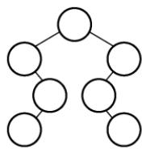

40.【2017统考真题】要使一棵非空二叉树的先序序列与中序序列相同，其所有非叶结点须满足的条件是（）。A. 只有左子树 B. 只有右子树C. 结点的度均为1 D. 结点的度均为2

41.【2022统考真题】若结点p与q在二叉树T的中序遍历序列中相邻，且p在q之前，则下列p与q的关系中，不可能的是（）。I. q 是p的双亲 II. q 是p 的右孩子III. q是p的右兄弟 道计 IV. q 是p的双亲的双亲A. 仅I B. 仅Ⅲ C. 仅Ⅱ、Ⅲ D. 仅ⅡI、IV

42.【2023统考真题】已知一棵二叉树的树形如右图所示，若其后序遍历序列为 $f d b e c a$ ，则其先（前）序遍历序列是（）。A. $a e d f b c$ B. acebdfC. $c a b e f d$ 教育 D. dfebac


43. 【2024统考真题】若p、q和ν均为二叉树T中的结点，ν有两个孩子结点，T的中序遍历序列形如 $ ``  \cdots ,p,v,q,\cdots  ''$ ，则在下列叙述中，正确的是（）。A. p没有右孩子，q没有左孩子 B. p没有右孩子，q有左孩子C. p有右孩子，q没有左孩子 D. p有右孩子，q有左孩子

## 二、综合应用题

01. 若某非空二叉树的先序序列和后序序列正好相反，则该二叉树的形态是什么？

02. 若某非空二叉树的先序序列和后序序列正好相同，则该二叉树的形态是什么？

03. 假设二叉树采用二叉链表存储结构，设计一个非递归算法求二叉树的高度。

04. 二叉树按二叉链表形式存储，试编写一个判别给定二叉树是否是完全二叉树的算法。

05. 假设二叉树采用二叉链表存储结构存储，试设计一个算法，计算一棵给定二叉树的所有双分支结点数。

06. 设树B是一棵采用链式结构存储的二叉树，编写一个把树B中所有结点的左右子树进行交换的函数。

07. 假设二叉树采用二叉链存储结构存储，设计一个算法，求先序遍历序列中第k（1≤k≤二叉树中结点数）个结点的值。

08. 已知二叉树以二叉链表存储，编写算法完成：对于树中每个元素值为x的结点，删除以它为根的子树，并释放相应的空间。

09. 在二叉树中查找值为x的结点，试编写算法（用C语言）打印值为x的结点的所有祖先，假设值为x的结点不多于一个。

10. 设一棵二叉树的结点结构为(LLINK，INFO，RLINK)，ROOT为指向该二叉树根结点的指针，p和q分别为指向该二叉树中任意两个结点的指针，试编写算法ANCESTOR(ROOT,p，q,r)，找到p和q的最近公共祖先结点r。

11. 假设二叉树采用二叉链表存储结构，设计一个算法，求非空二叉树b的宽度（具有结点数最多的那一层的结点数）。

12. 设有一棵满二叉树（所有结点值均不同），已知其先序序列为pre，设计一个算法求其后序序列 post。

13. 设计一个算法将二叉树的叶结点按从左到右的顺序连成一个单链表，表头指针为head。  
二叉树按二叉链表方式存储，链接时用叶结点的右指针域来存放单链表指针。

14. 试设计判断两棵二叉树是否相似的算法。所谓二叉树 $T _ { 1 }$ 和 $T _ { 2 }$ 相似，指的是 $T _ { 1 }$ 和 $T _ { 2 }$ 都是空的二叉树或都只有一个根结点；或者 $T _ { 1 }$ 的左子树和 $T _ { 2 }$ 的左子树是相似的，且 $T _ { 1 }$ 的右子树和 $T _ { 2 }$ 的右子树是相似的。 XOT

15.【2014统考真题】二叉树的带权路径长度（WPL）是二叉树中所有叶结点的带权路径长度之和。给定一棵二叉树T，采用二叉链表存储，结点结构为

<table><tr><td>left</td><td>weight</td><td>right</td></tr><tr><td></td><td></td><td></td></tr></table>

其中叶结点的 weight 域保存该结点的非负权值。设 root 为指向 T的根结点的指针，请设计求 T的 WPL 的算法，要求：

1）给出算法的基本设计思想。

2）使用C或C++语言，给出二叉树结点的数据类型定义。

3）根据设计思想，采用C或C++语言描述算法，关键之处给出注释。

16.【2017统考真题】请设计一个算法，将给定的表达式树（二叉树）转换为等价的中缀表达式（通过括号反映操作符的计算次序）并输出。例如，当下列两棵表达式树作为算法的输入时：，

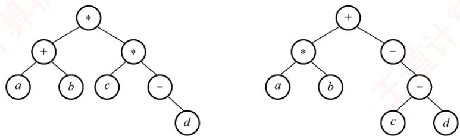

输出的等价中缀表达式分别为 $(a+b) \star (c \star (-d))$ 和(a\*b)+(−(c−d))。

二叉树结点定义如下：

typedef struct node{   
char data[10]; //存储操作数或操作符   
struct node \*left, \*right;   
}BTree;

要求：

1）给出算法的基本设计思想。

2）根据设计思想，采用C或C++语言描述算法，关键之处给出注释。

17.【2022统考真题】已知非空二叉树T的结点值均为正整数，采用顺序存储方式保存，数据结构定义如下：

typedef struct { //MAX SIZE为已定义常量  
int SqBiTNode[MAX SIZE]; //保存二叉树结点值的数组  
int ElemNum; //实际占用的数组元素个数  
} SqBiTree;

T中不存在的结点在数组 SqBiTNode中用-1 表示。例如，对于下图所示的两棵非空二叉树 $T _ { 1 }$ 和 $T _ { 2 }$ 2 T


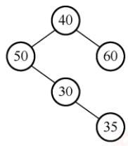

$T _ { 1 }$ 的存储结果如下：

<table><tr><td rowspan=1 colspan=1>T1.SqBiTNode</td><td rowspan=1 colspan=1>40</td><td rowspan=1 colspan=1>25</td><td rowspan=1 colspan=1>60</td><td rowspan=1 colspan=1>-1</td><td rowspan=1 colspan=1>30</td><td rowspan=1 colspan=1>-1</td><td rowspan=1 colspan=1>80</td><td rowspan=1 colspan=1>-1</td><td rowspan=1 colspan=1>-1</td><td rowspan=1 colspan=1>27</td><td rowspan=1 colspan=1></td><td rowspan=1 colspan=1></td></tr></table>

T1.ElemNum=10

$T _ { 2 }$ 的存储结果如下：

<table><tr><td rowspan=1 colspan=1>T2.SqBiTNode</td><td rowspan=1 colspan=1>40</td><td rowspan=1 colspan=1>50</td><td rowspan=1 colspan=1>60</td><td rowspan=1 colspan=1>-1</td><td rowspan=1 colspan=1>30</td><td rowspan=1 colspan=1>-1</td><td rowspan=1 colspan=1>-1</td><td rowspan=1 colspan=1>-1</td><td rowspan=1 colspan=1>-1</td><td rowspan=1 colspan=1>-1</td><td rowspan=1 colspan=1>35</td><td rowspan=1 colspan=1></td></tr></table>

T2.ElemNum=11

请设计一个尽可能高效的算法，判定一棵采用这种方式存储的二叉树是否为二叉搜索树，若是，则返回true，否则，返回false。要求：

1）给出算法的基本设计思想。

2）根据设计思想，采用C或C++语言描述算法，关键之处给出注释。

## 5.3.4 答案与解析

## 一、单项选择题

01. C

二叉树中序遍历的最后一个结点一定是从根开始沿右孩子指针链走到底的结点，设用p指示。若结点p不是叶结点（其左子树非空），则先序遍历的最后一个结点在它的左子树中，选项A、B错误；若结点p是叶结点，则先序与中序遍历的最后一个结点就是它，选项C正确。若中序遍历的最后一个结点p不是叶结点，它还有一个左孩子q，结点q是叶结点，那么结点g是先序遍历的最后一个结点，但不是中序遍历的最后一个结点，选项D错误。

02. C

三种遍历方式中，都先遍历左子树，再遍历右子树，因此b一定在c的前面访问。

03. C

中序遍历时，先访问左子树，再访问根结点，后访问右子树。n在m前的3种可能性如右图所示，从中看出n 总是在 m的左方。

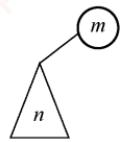

【另解】设n和m的最近公共祖先p，则有以下可能：

(a)

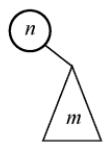


(b)

(c)

情形1，m和n分别在p的左右（右左）分支上；情形2，m或n为p结点，另一结点在 $p$ 的分支上。只有n和 m分别处于p的左右分支上，m为祖先结点且 n位于 m的左分支，n为祖先结点且m位于n的右分支，符合题意。 临村

## 04. D

后序遍历的顺序是LRN，若n在N的左子树上，m在N的右子树上，则在后序遍历的过程中n在m之前访问；若n是m的子孙，设m在N的位置，则n无论是在m的左子树还是在右子树，在后序遍历的过程中n都在m之前访问。其他都不可以。选项C要成立，就需加上两个结点位于同一层这个条件。

## 05. C

在二叉树的数组存储结构中，下标为i的结点的左右孩子的下标分别为2i +1和2i +2（若存在），画出二叉树的形态如下右图所示，则后序遍历序列为 gdbhefca。

## 06. B

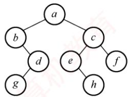

三种遍历方式中，访问左右子树的先后顺序是不变的，只是访问根结点的顺序不同，因此叶结点的先后顺序完全相同。此外，读者可以采用特殊值法，画一个结点数为3的满二叉树，采用三种遍历方式来验证答案的正确性。 X

## 07. C

对每个顶点从1开始按序编号，要求结点编号大于其左右孩子编号，并且左孩子编号小于右孩子编号。编号越大说明遍历顺序越靠后，因此，三者遍历顺序为先左子树、再右子树、后根结点。4个选项中仅后序遍历满足要求。

## 08. B

结点y的编号比其左子树上的最小编号还小，而ν的右子树中的最小编号大于y的左子树中的最大编号，因此ν的编号比其左右子树上的所有编号都小，显然是按先序遍历次序。

## 09. D

先序为A、B、C的不同二叉树共有5种，其中后序为C、B、A的有4种（前4种），都是单支树，如下图所示。

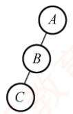

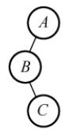


## 10. C

7个结点的完全二叉树是一棵3层的满二叉树，画出相应二叉树的树形，根据后序遍历序列填入相应的结点，得到相应的完全二叉树，求得其先序遍历序列为ABCDEFG。

## 11. C

二叉树的先序遍历为NLR，后序遍历为LRN。根据题意，在先序序列中X在Y之前，在后序序列中X在Y之后，若设X在根的位置，Y在其左子树或右子树中，即满足要求。

## 12. C

先序序列是…a… b，因此a和b结点的3种情况如下图(a)～(c)所示。中序序列是…b…a…，因此a和 b结点的3种情况如下图(d)～(f)所示，相同部分是b在a的左子树中。

  
(a)

  
(b)


(c)

  
(d)

  
(e)

  
(f)

## 13. B

解法1：由题可知，1为根结点，2为1的孩子。对于选项A，3应为1的左孩子，先序序列应为13…，不符题意。类似地，选项C也是错误的。对于选项B，2为1的右孩子，3为2的右孩子………满足题意。对于选项D，463572应为1的右子树，2为1的右孩子，46357为2的左子树，3为2的左孩子，46为3的左子树，57为3的右子树，先序序列4、6应相连，5、7应相连，不符题意。

解法2：先序遍历时需要借助栈。二叉树的先序序列和中序序列的关系相当于以先序序列作为入栈次序，以中序序列作为出栈次序。题中以1234567入栈；对于选项A，第一个出栈的是3，所以1不可能在2之前出栈，错误。对于选项C，1不可能在3之前出栈，错误。对于选项D，6第三个出栈，此时栈顶元素是5，不是3，错误。选项B正确。 K

解法3：因先序序列和中序序列可以确定一棵二叉树，所以可试着用题目中的序列构造出相应的二叉树，即可得知，只有选项B的序列可以构造出二叉树。

## 14. D

先序序列为NLR，后序序列为LRN，虽然可以唯一确定树的根结点，但无法划分左右子树。例如，先序序列为AB，后序序列为BA，则其对应的二叉树如右图所示。


## 15. B

中序遍历是“左根右”，后序遍历是“左右根”，当任一结点没有右子树时，两种遍历都是“左根”。显然，当二叉树为空树或只有根结点时，其中序序列和后序序列也相同。

## 16. D

根据后序序列与中序序列可构造出二叉树，如下图所示。由图可知先序序列为CEDBA。

  
(a) 确定根结点

  
(b)确定左子树根结点

  
(c)确定剩下的子树

## 17. A

对于这种遍历序列问题，先根据遍历的性质排除若干项，若还无法确定答案，则再根据遍历结果得到二叉树，找到对应遍历序列。例如，在本题中，已知先序和中序遍历结果，可知本树的根结点为A，左子树有C和B，其余为右子树，则后序遍历结果中，A一定在最后，并且C和B一定在前面，排除选项B和D。又因先序中有DEF，中序中有EDF，则D为这个子树的根，所以D在后序中排在EF之后。 道

根据二叉树的递归定义，要确定二叉树，就要分别找到根结点和左右子树。因此，根据遍历结果，必定要确定根结点位置和如何划分左右子树，才可以确定最终的二叉树。因此，仅有先序和后序遍历不能唯一确定一棵二叉树，而二者之一加上中序遍历都可以唯一确定一棵二叉树。如在本题中，根据先序和中序遍历的结果确定二叉树的过程如下图所示。

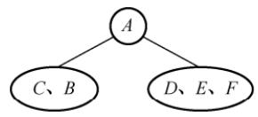  
(a) 确定根结点

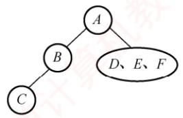  
(b) 确定左子树

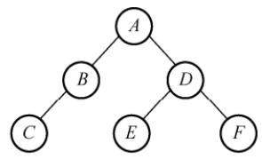  
(c) 确定右子树

## 18. B

可构造出二叉树如下图所示。因此，先序序列为ABCDEF。

  
(a) 确定根结点

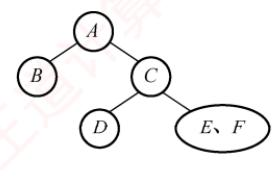  
(b)确定右子树的根结点

  
(c) 确定剩下的子树

## 19. B

先序遍历是根左右，祖先a先于子孙b访问，即 $\mathrm{pre}(a) < \mathrm{pre}(b)$ ，因此选项A一定成立。后序遍历是左右根，子孙b先于祖先a访问，即 $\mathrm { p o s t } ( b ) < \mathrm { p o s t } ( a )$ ，因此选项B一定不成立。中序遍历是左根右，左子树中的子孙先于祖先访问，右子树中的子孙后于祖先访问，因此子孙的编号可能小于祖先的编号，也可能大于祖先的编号，选项C和D都有可能。 XV

## 20. C

删除一个结点时，需要先递归地删除它的左右孩子，并释放它们所占的存储空间，然后删除该结点，并删除它所占的存储空间，这正好和后序遍历的访问顺序相吻合。

## 21. B

1 只要交换T中所有分支结点的左右子树，就能得到一棵中序遍历序列为降序序列的树，而这并不会改变根结点，叶结点也仅仅交换位置，仍是原T中的叶结点，选项C、D错误。交换T中所有分支结点的左右子树，要么先处理根结点，然后递归地处理左右子树，即先序遍历；要么先处理左右子树，然后处理根结点，即后序遍历：中序遍历是不适合的。选项A错误，选项B正确。

## 22. A

线索是前驱结点和后继结点的指针，引入线索的目的是加快对二叉树的遍历。

## 23. C

n个结点共有链域指针2n个，其中，除根结点外，每个结点都被一个指针指向。剩余的链域建立线索，共2n−(n−1)=n+1个线索。 YTA

## 24. C

线索二叉树中用1tag/rtag标识结点的左/右指针域是否为线索，其值为1时，对应指针域为线索，其值为0时，对应指针域为左/右孩子。

## 25. D

对左子树为空的二叉树进行先序线索化，根结点的左子树为空并且也没有前驱结点（先遍历根结点），先序遍历的最后一个元素为叶结点，左右子树均为空且有前驱无后继结点，所以线索化后，树中空链域有2个。 X

## 26. D

不是每个结点通过线索都可以直接找到它的前驱和后继。在先序线索二叉树中查找一个结点的先序后继很简单，而查找先序前驱必须知道该结点的双亲结点。同样， 的先序后继很简单，而查找先序前驱必须知道该结点的双亲结点。同样，

在后序线索二叉树中查找一个结点的后序前驱也很简单，而查找后序后继也必须知道该结点的双亲结点，二叉链表中没有存放双亲的指针。

## 27. D

后序线索二叉树不能有效解决求后序后继的问题。如右图所示，结点E的右指针指向右孩子，而在后序序列中E的后继结点为B，在查找

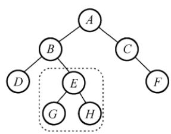

E的后继时仍然只能按常规方法来查找。

## 28. C

在二叉中序线索树中，某结点若有左孩子，则按照中序“左根右”的顺序，该结点的前驱结点为左子树中最右的一个结点（注意，并不一定是最右叶结点）。

## 29. A

在二叉树的后序遍历中，叶结点X的后继是其双亲，因此X的右线索应指向该结点。

## 30. B

非空二叉树的先序序列和后序序列相反，即“根左右”与“左右根”顺序相反，因此树只有根结点，或根结点只有左子树或右子树，其子树也有同样的性质，任意结点只有一个孩子，才能满足先序序列和后序序列正好相反。此时树形应为一个长链，树中仅有一个叶结点。

## 31. D

非空二叉树的先序序列和中序序列相反，即“根左右”与“左根右”顺序相反，因此树只有根结点，或任意一个结点只有左孩子，此时树形应该是一棵向左倾斜的单支树，这棵单支树只有一个叶结点。但是，只有一个叶结点的二叉树不能保证任意一个结点无右孩子。

## 32. D

分析遍历后的结点序列，可以看出根结点是在中间被访问的，而且右子树结点在左子树之前，则遍历的方法是RNL。本题考查的遍历方法并不是二叉树遍历的3种基本遍历方法，对于考生而言，重要的是掌握遍历的思想。 K

## 33. D

题中所给二叉树的后序序列为dbca。结点d无前驱和左子树，左链域空，无右子树，右链域 指向其后继结点 $b ;$ 结点b无左子树，左链域指向其前驱结点 $d ;$ 结点c无左子树，左链域指向其 前驱结点b，无右子树，右链域指向其后继结点a。

## 34. C

先序序列为NLR，后序序列为LRN，因为先序序列和后序序列刚好相反，所以不可能存在一个结点同时有左右孩子，即二叉树的高度为4。1为根结点，根结点只能有左孩子（或右孩子），因此在中序序列中，1或在序列首或在序列尾，选项A、B、C、D皆满足要求。仅考虑以1的孩子结点2为根结点的子树，它也只能有左孩子（或右孩子），因此在中序序列中，2或在序列首或在序列尾，选项A、B、D皆满足要求。

【另解】画出各选项与题干信息所对应的二叉树如下，所以选项A、B、D均满足。

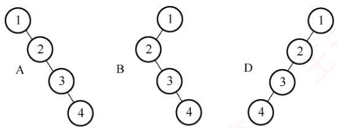

## 35. A

先序序列和后序序列不能唯一确定一棵二叉树，但可以确定二叉树中结点的祖先关系：当两个结点的先序序列为XY与后序序列为X时，则X为Y的祖先。考虑先序序列 $a , e , b , d , c _ { \mathrm { { } ^ { \prime } } }$ 后序序列 $b , c , d , e , a$ ，可知a为根结点，e为a的孩子结点；此外，由a的孩子结点的先序序列 $e , b , d ,$ c、后序序列 $b , c , d , e$ ，可知e是bcd的祖先，所以根结点的孩子结点只有e。

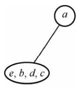  
(a)

  
(b)

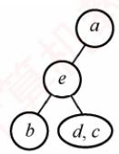  
(c)

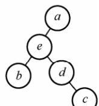  
(d)

排除法：显然a为根结点，且确定e为a的孩子结点，排除选项D。各种遍历算法中左右子树的遍历次序是固定的，若b也为a的孩子结点，则在先序序列和后序序列中e、b的相对次序应是不变的，所以排除选项B，同理排除选项C。 XTA

特殊法：先序序列和后序序列对应多棵不同的二叉树树形，我们只需画出满足该条件的任意一棵二叉树即可，任意一棵二叉树必定满足正确选项的要求。

显然选择选项A，最终得到的二叉树满足题设中先序序列和后序序列的要求。

## 36. A。

根据后序线索二叉树的定义，X结点为叶结点且有左兄弟，因此这个结点为右孩子结点，利用后序遍历的方式可知X结点的后序后继是其父结点，即其右线索指向的是父结点。为了更加形象，在解题的过程中可以画出如右所示的草图。

## 37. D

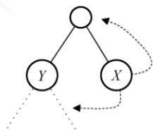

线索二叉树的线索实际上指向的是相应遍历序列特定结点的前驱结点和后继结点，所以先写出二叉树的中序遍历序列debxac，中序遍历中在x左边和右边的字符，就是它在中序线索化的左右线索，即 b, a。 顺村

## 38. B

根据二叉树先序遍历和中序遍历的递归算法中递归工作栈的状态变化得出：先序序列和中序序列的关系相当于以先序序列为入栈次序，以中序序列为出栈次序。因为先序序列和中序序列可以唯一地确定一棵二叉树，所以题意相当于“以序列 $a , \; b , \; c , \; d$ 为入栈次序，则出栈序列的个数为？”，对于n个不同元素入栈，出栈序列的个数为 $\begin{array} { r } { \frac { 1 } { n + 1 } C _ { 2 n } ^ { n } = 1 4 . } \end{array}$

## 39. B

后序序列先访问左子树，接着访问右子树，最后访问父结点，递归进行。根结点左子树的叶结点首先被访问，它是e。接下来是它的父结点a，然后是a的父结点 $c _ { \circ }$ 接着访问根结点的右子树。它的叶结点b首先被访问，然后是b的父结点 $d ,$ 再后是 $d$ 的父结点 $g ,$ 最后是根结点 $f ,$ 如右图所示。因此 $d$ 与a同层，选项B正确。

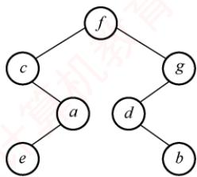

## 40. B

先序序列先访问父结点，接着访问左子树，然后访问右子树。中序序列先访问左子树，接着访问父结点，然后访问右子树，递归进行。若所有非叶结点只有右子树，则先序序列和中序序列都先访问父结点，后访问右子树，递归进行。

## 41. B

对于此类题，每种情况只需举出一个反例即可。如图1所示，q是p的双亲，中序遍历序列为 $\{ p ,   q \}$ ，说法Ⅰ可能。如图2所示，q是p的右孩子，中序遍历序列为 $\{ p ,   q \}$ ，说法Ⅱ可能。如图4所示， $q$ 是 $p$ 的双亲的双亲，中序遍历序列为 $\{ x ,   p ,   q \}$ ，说法IV可能。如图3所示， $q$ 是 $p$ 的右兄弟，F是q和p的父结点，中序遍历要求先遍历左子树，再访问根结点，最后遍历右子树，因此一定先访问p，再访问F，最后访问q，p和q不可能相邻出现，说法Ⅲ不可能。

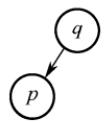  
图1

  
图2

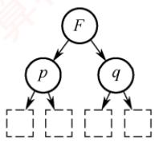  
图3

  
图4

## 42. A

根据二叉树的树形和后序遍历序列，可以轻松地将各字母填入结点中，如右图所示。

然后对该二叉树进行先序遍历，得到序列aedfbc。

## 43. A

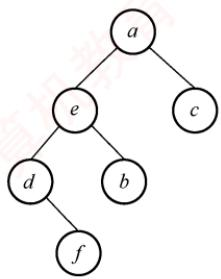

根据中序遍历的特点，ν有左右子树，以ν为根的子树的中序序列为：ν的左子树的中序序列, v, ν的右子树的中序序列。又因为 T 的中序序列为“…, p, ν,${ \bf \Phi } q , \cdots { \bf \Phi } ^ { \prime \prime }$ ，可知p属于ν的左子树，q属于ν的右子树。在ν的左子树的中序序列

中：假设p有右孩子，则p的右孩子在中序序列中应在p之后，与p是最后一个遍历结点矛盾，因此p不存在右孩子。在ν的右子树的中序序列中：假设q存在左孩子，则q的左孩子在中序序列中应在q之前，与q是第一个遍历结点矛盾，因此q不存在左孩子。

## 二、综合应用题

## 01.【解答】

二叉树的先序序列是NLR，后序序列是LRN。要使NLR=NRL（后序序列反序）成立，L或R应为空，这样的二叉树每层只有一个结点，即二叉树的形态是其高度等于结点数。以3个结点 a, b, c 为例，其形态如下图所示。


## 02. 【解答】

二叉树的先序序列是NLR，后序序列是LRN。要使NLR=LRN成立，L和R均应为空，所以满足条件的二叉树只有一个根结点。

## 03.【解答】

采用层次遍历的算法，设置变量1eve1 记录当前结点所在的层数，设置变量1ast指向当前层的最右结点，每次层次遍历出队时与1ast指针比较，若两者相等，则层数加1，并让1ast指向下一层的最右结点，直到遍历完成。1eve1的值即二叉树的高度。

算法实现如下：

int Btdepth(BiTree T){  
//采用层次遍历的非递归方法求解二叉树的高度if(!T)return 0; //树空，高度为0int front=-1,rear=-1;int last=0,level=0; //last 指向当前层的最右结点

BiTree Q[MaxSize]; //设置队列Q，元素是二叉树结点指针且容量足够  
Q[++rear]=T; //将根结点入队  
BiTree p;  
while(front<rear) { //队不空，则循环  
p=Q[++front]; //队列元素出队，即正在访问的结点  
if(p->lchild)  
Q[++rear]=p->lchild;//左孩子入队  
if (p->rchild)  
Q[++rear]=p->rchild;//右孩子入队  
if(front==last) { //处理该层的最右结点  
level++; //层数增1  
last=rear; //last 指向下层  
1 算机教育  
return level;

求某层的结点数、每层的结点数、树的最大宽度等，都可采用与此题类似的思想。当然，此题可编写为递归算法，其实现如下：

int Btdepth2(BiTree T){  
if(T==NULL)  
return 0; //空树，高度为0  
1dep=Btdepth2(T->lchild); //左子树高度  
rdep=Btdepth2(T->rchild); //右子树高度  
if (1dep>rdep)  
return ldep+1; //树的高度为子树最大高度加根结点  
else  
return rdep+1; 算机

## 04.【解答】

根据完全二叉树的定义，具有n个结点的完全二叉树与满二叉树中编号从1～n的结点一一对应。算法思想：采用层次遍历算法，将所有结点加入队列（包括空结点）。遇到空结点时，查看其后是否有非空结点。若有，则二叉树不是完全二叉树。

算法实现如下：

```c
bool IsComplete(BiTree T) {
//本算法判断给定二叉树是否为完全二叉树
InitQueue(Q);
if(!T)
return true; //空树为满二叉树
EnQueue (Q, T) ; 道计算
while(!IsEmpty(Q)){
道 DeQueue (Q,p) ;
if (p) { //结点非空，将其左右子树入队列
EnQueue(Q,p->lchild) ;
EnQueue(Q,p->rchild) ;
}
else //结点为空，检查其后是否有非空结点
while(!IsEmpty(Q)){
DeQueue (Q, p) ;
if (p) //结点非空，则二叉树为非完全二叉树
return false;
return true; 道计
```

```c
void swap(BiTree b) {
//本算法递归地交换二叉树的左右子树
if(b) {
swap(b->lchild) ; //递归地交换左子树
swap(b->rchild) ; //递归地交换右子树
temp=b->lchild; //交换左右孩子结点
b->lchild=b->rchild;
b->rchild=temp;
```

## 05.【解答】

计算一棵二叉树b中所有双分支结点数的递归模型f(b)如下：

f (b) =0 若b=NULL   
f (b) =f (b->lchild) +f (b->rchild)+1 若\*b为双分支结点   
f (b) =f (b->lchild) +f (b->rchild) 其他情况（\*b为单分支结点或叶结点）

具体算法实现如下：

```c
int DsonNodes(BiTree b){
if(b==NULL)
return 0;
else if(b->lchild!=NULL&&b->rchild!=NULL) ∥双分支结点
return DSonNodes (b->lchild) +DsonNodes (b->rchild)+1;
else
return DSonNodes (b->lchild)+DsonNodes (b->rchild) ;
```

当然，本题也可以设置一个全局变量Num，每遍历到一个结点时，判断每个结点是否为分支结点（左右结点都不为空，注意是双分支），若是，则Num++。 道

## 06.【解答】

采用递归算法实现交换二叉树的左右子树，首先交换b结点的左孩子的左右子树，然后交换b结点的右孩子的左右子树，最后交换b结点的左右孩子，当结点为空时递归结束（后序遍历的思想）。算法实现如下：

## 07.【解答】

设置一个全局变量i（初值为1）来表示进行先序遍历时，当前访问的是第几个结点。然后可以借用先序遍历的代码模型，先序遍历二叉树。当二叉树b为空时，返回特殊字符'#'；当k==i时，该结点即要找的结点，返回b->data；当k≠i时，递归地在左子树中查找，若找到则返回该值，否则继续递归地在右子树中查找，并返回其结果。对应的递归模型如下：

f (b,k) ='#' 当 b=NULL 时   
f(b,k) =b->data 当i=k时   
f(b,k) =((ch=f(b->lchild,k))=='#'?f(b->rchild,k):ch) 其他情况   
管法的实现加下

算法的实现如下：

```c
int i=1; //遍历序号的全局变量
ElemType PreNode(BiTree b,int k) {
//本算法查找二叉树先序遍历序列中第k个结点的值
if(b==NULL) //空结点，则返回特殊字符
return '#';
if(i==k) 计算机 //相等，则当前结点即第k个结点
return b->data;
i++; //下一个结点
ch=PreNode(b->lchild,k); //左子树中递归寻找
```

```c
if(ch!='#')
return ch;
ch=PreNode(b->rchild,k);
return ch;
```

本题实质上就是一个遍历算法的实现，只不过用一个全局变量来记录访问的序号，求其他遍历序列的第k个结点也采用相似的方法。二叉树的遍历算法可以引申出大量的算法题，因此考生务必要熟练掌握二叉树的遍历算法。

## 08. 【解答】

删除以元素值×为根的子树，只要能删除其左右子树，就可以释放值为×的根结点，因此宜采用后序遍历。算法思想：删除值为x的结点，意味着应将其父结点的左（右）孩子指针置空，用层次遍历易于找到某结点的父结点。本题要求删除树中每个元素值为×的结点的子树，因此要遍历完整棵二叉树。算法实现如下：

```c
void DeleteXTree(BiTree &bt) { //删除以 bt 为根的子树
if (bt) {
王道 DeleteXTree(bt->lchild);
DeleteXTree(bt->rchild); //删除bt的左子树、右子树
free(bt); //释放被删结点所占的存储空间
}
//在二叉树上查找所有以×为元素值的结点，并删除以其为根的子树
void Search(BiTree bt,ElemType x) {
BiTree Q[]; //Q是存放二叉树结点指针的队列，容量足够大
if (bt) {
if (bt->data==x) { //若根结点值为x，则删除整棵树
DeleteXTree(bt);
exit(0);
InitQueue(Q);
EnQueue (Q,bt);
while(!IsEmpty(Q)){
DeQueue (Q, p) ;
if(p->lchild) //若左孩子非空
if(p->lchild->data==x) { //左子树符合则删除左子树
DeleteXTree(p->lchild);
p->lchild=NULL;
1 //父结点的左孩子置空
王道计算机教 else
EnQueue(Q,p->lchild)； //左子树入队列
if(p->rchild) //若右孩子非空
if(p->rchild->data==x) { //右孩子符合则删除右子树
DeleteXTree(p->rchild);
p->rchild=NULL;
//父结点的右孩子置空
else
EnQueue(Q,p->rchild) ; //右孩子入队列
}
```

## 09.【解答】

算法思想：采用非递归后序遍历，最后访问根结点，访问到值为×的结点时，栈中所有元素均为该结点的祖先，依次出栈打印即可。算法实现如下：

```c
typedef struct{
BiTree t;
int tag;
}stack； ∥/tag=0 表示左孩子被访问，tag=1 表示右孩子被访问
void Search(BiTree bt,ElemType x) {
//在二叉树bt中，查找值为×的结点，并打印其所有祖先
stack s[]; //栈容量足够大
top=0;
while(bt!=NULLlltop>0) {
while(bt!=NULL&&bt->data!=x) { //结点入栈
s[++top].t=bt;
s[top].tag=0;
bt=bt->lchild; //沿左分支向下
if(bt!=NULL&&bt->data==x) {
printf("所查结点的所有祖先结点的值为：\n")； ∥/找到x
for(i=1;i<=top;i++)
王道计算 printf("%d",s[i].t->data); //输出祖先值后结束
exit(1);
王
while(top!=0&&s[top].tag==1)
top--; //退栈（空遍历）
if(top!=0) {
s[top].tag=1;
bt=s[top].t->rchild; //沿右分支向下遍历
1 机教育
} /while(bt!=NULL||top>0)
```

因为查找的过程就是后序遍历的过程，所以使用的栈的深度不超过树的深度。

## 10. 【解答】

后序遍历最后访问根结点，即在递归算法中，根是压在栈底的。本题要找p和σ的最近公共祖先结点r，不失一般性，设p在σ的左边。算法思想：采用后序非递归算法，栈中存放二叉树结点的指针，当访问到某结点时，栈中所有元素均为该结点的祖先。后序遍历必然先遍历到结点p，栈中元素均为p的祖先。先将栈复制到另一辅助栈中。继续遍历到结点g时，将栈中元素从栈顶开始逐个到辅助栈中去匹配，第一个匹配（相等）的元素就是结点p和g的最近公共祖先。算法实现如下：

```c
typedef struct{
BiTree t;
int tag；//tag=0 表示左孩子已被访问，tag=1 表示右孩子已被访问
}stack;
stack s[],s1[]; //栈，容量足够大
BiTree Ancestor(BiTree ROOT,BiTNode *p,BiTNode *q){
//本算法求二叉树中 p 和 σ 指向结点的最近公共结点
top=0;bt=ROOT;
while(bt!=NULLl|top>0) {
while(bt!=NULL) {
s[++top].t=bt;
s[top].tag=0; 机教育
bt=bt->lchild;
} //沿左分支向下
while(top!=0&&s[top].tag==1) {
//假定 p在 q的左侧，遇到p时，栈中元素均为p的祖先
if(s[top].t==p) {
for(i=1;i<=top;i++)
```

```c
s1[i]=s[i];
top1=top; 算机教
} //将栈 s 的元素转入辅助栈 s1 保存
if(s[top].t==q) //找到 g 结点
for(i=top;i>0;i--) {//将栈中元素的树结点到 s1 中去匹配
for(j=top1;j>0;j--)
if(s1[j].t==s[i].t)
return s[i].t；//p 和g 的最近公共祖先已找到
top--; //退栈
} ∥while
if (top!=0) {
s[top].tag=1;
bt=s[top].t->rchild; //沿右分支向下遍历 计算机教
} /while
return NULL; //p 和 q 无公共祖先
```

## 11.【解答】

采用层次遍历的方法求出所有结点的层次，并将所有结点和对应的层次放在一个队列中。然后通过扫描队列求出各层的结点总数，最大的层结点总数即二叉树的宽度。算法实现如下：

typedef struct{   
BiTree data[MaxSize]; //保存队列中的结点指针   
int level[MaxSize]; //保存 data 中相同下标结点的层次   
int front,rear;   
}Qu;   
int BTWidth(BiTree b) {   
BiTree p; 王道计算机   
int k,max,i,n;   
Qu.front=Qu.rear=-1; //队列为空   
Qu.rear++;   
Qu.data[Qu.rear]=b; //根结点指针入队   
Qu.level[Qu.rear]=1; //根结点层次为1   
while(Qu.front<Qu.rear) {   
Qu.front++; //出队   
p=Qu.data[Qu.front]; //出队结点   
k=Qu.level[Qu.front]; //出队结点的层次   
if(p->lchild!=NULL) { //左孩子入队   
Qu.rear++;   
Qu.data[Qu.rear]=p->lchild;   
道计算 Qu.level[Qu.rear]=k+1;   
1 王道计算   
if(p->rchild!=NULL) { //右孩子入队   
Qu.rear++;   
Qu.data[Qu.rear]=p->rchild;   
Qu.level[Qu.rear]=k+1;   
}   
}//while   
max=0;i=0; //max保存同一层最多的结点数   
k=1; //k 表示从第一层开始查找   
while(i<=Qu.rear) { //i扫描队中所有元素   
n=0; //n 统计第k层的结点数   
while(i<=Qu.rear&&Qu.level[i]==k){   
n++;   
i++;

k=Qu.level[i];  
if(n>max) max=n; //保存最大的 n  
1  
return max;

## 注意

本题队列中的结点，在出队后仍需要保留在队列中，以便求二叉树的宽度，所以设置的队列采用非环形队列，否则在出队后可能被其他结点覆盖，无法再求二叉树的宽度。

## 12. 【解答】

对一般二叉树，仅根据先序或后序序列，不能确定另一个遍历序列。但对满二叉树，任意一个结点的左右子树均含有相等的结点数，同时，先序序列的第一个结点作为后序序列的最后一个结点，由此得到将先序序列pre[11..h1]转换为后序序列post[12..h2]的递归模型如下：

```csv
f(pre,11,h1,post,12,h2)=不做任何事情 h1<11时
f(pre,11,h1,post,12, h2)=post[h2]=pre[11] 其他情况
取中间位置half=(h1-11)/2;
将pre[11+1,11+half]左子树转换为post[12,12+half-1]，
即f(pre,11+1,11+half,post,12,12+half-1);
将pre[11+half+1,h1]右子树转换为post[12+half,h2-1]，
即f(pre,11+half+1,h1,post,12+half,h2-1)。
```

其中，post[h2]=pre[11]表示后序序列的最后一个结点（根结点）等于先序序列的第一个结点（根结点）。相应的算法实现如下： -X

void PreToPost (ElemType pre[],int 11,int h1,ElemType post[],int 12,int h2) {   
int half;   
if(h1>=11) {   
post[h2]=pre[11];   
half=(h1-11)/2;   
PreToPost(pre,11+1,11+half,post,12,12+half-1); //转换左子树   
PreToPost(pre,11+half+1,h1,post,12+half,h2-1); //转换右子树   
}

例如，有以下代码：

ElemType \*pre="ABCDEFG";   
ElemType post[MaxSize];   
PreToPost(pre,0,6,post,0,6) ;   
printf("后序序列：")；   
for(int i=0;i<=6;i++)   
printf("%c",post[i]);   
printf("\n") ;

执行结果如下：

后序序列：C D B F G E A

## 13. 【解答】

通常使用的先序、中序和后序遍历对于叶结点的访问顺序都是从左到右，这里选择中序递归遍历。算法思想：设置前驱结点指针pre，初始为空。第一个叶结点由指针heaα指向，遍历到叶结点时，就将它前驱的rchilα指针指向它，最后一个叶结点的rchild为空。算法实现如下：

LinkedList head, pre=NULL;

//全局变量

```c
LinkedList InOrder(BiTree bt) {
if(bt) { 草机孝
InOrder(bt->lchild); //中序遍历左子树
if(bt->lchild==NULL&&bt->rchild==NULL) //叶结点
if(pre==NULL) {
head=bt; pre=bt; 王道
} //处理第一个叶结点
else{
pre->rchild=bt;
pre=bt;
//将叶结点链入链表
InOrder(bt->rchild); //中序遍历右子树
pre->rchild=NULL; //设置链表尾
return head;
```

上述算法的时间复杂度为 O(n)，辅助变量使用 head 和pre，栈空间复杂度为 O(n)。

## 14.【解答】

本题采用递归的思想求解，若 $T _ { 1 }$ 和 $T _ { 2 }$ 都是空树，则相似；若有一个为空另一个不空，则必然不相似；否则递归地比较它们的左右子树是否相似。递归函数的定义如下：

1）f(T1,T2)=1；若T1==T2==NULL。

2）f(T1，T2)=0；若T1和T2之一为NULL，另一个不为NULL。

3)f(T1,T2)=f(T1->lchild,T2->lchild) &&f(T1->rchild,T2->rchild);若T1  
和 T2 均不为 NULL。

因此，算法实现如下：

```c
int similar(BiTree T1,BiTree T2){
//采用递归的算法判断两棵二叉树是否相似
int leftS,rightS;
if(T1==NULL&&T2==NULL) //两棵树皆空
return 1;
else if(T1==NULL|IT2==NULL) //只有一棵树为空
return 0;
else{ //递归判断
leftS=similar(T1->lchild,T2->lchild);
rightS=similar(T1->rchild,T2->rchild);
return leftS&&rightS;
```

## 15.【解答】

二叉树的带权路径长度有两种常见的计算方法：①根据二叉树的带权路径长度的定义，二叉树的WPL值=树中全部叶结点的带权路径长度之和。②根据带权二叉树的性质，二叉树的WPL值=树中所有非叶结点的权值之和（记住该结论即可，不要求证明）。根据两种常见的计算方法，本题不难写出下列两种解法。 TIT

## 1）算法的基本设计思想。

①本问题可采用递归算法实现。根据定义：

二叉树的 WPL值=树中全部叶结点的带权路径长度之和  
=根结点左子树中全部叶结点的带权路径长度之和+  
根结点右子树中全部叶结点的带权路径长度之和

叶结点的带权路径长度 = 该结点的 weight 域的值×该结点的深度

设根结点的深度为0，若某结点的深度为d时，则其孩子结点的深度为d+1。

在递归遍历二叉树结点的过程中，若遍历到叶结点，则返回该结点的带权路径长度，否则返回其左右子树的带权路径长度之和。

② 若借用非叶结点的 weight 域保存其孩子结点中 weight 域值的和，则树的 WPL 等于树中所有非叶结点 weight 域值之和。

采用后序遍历策略，在遍历二叉树T时递归计算每个非叶结点的 weight 域的值，则树 T的 WPL 等于根结点左子树的 WPL 加上右子树的 WPL，再加上根结点中 weight 域的值。在递归遍历二叉树结点的过程中，若遍历到叶结点，则return 0并且退出递归，否则递归计算其左右子树的WPL和自身结点的权值。 教

2）二叉树结点的数据类型定义如下。

```c
typedef struct node{
int weight;
struct node *left,*right;
}BTree;
```

3）算法的代码如下。

①基于方法1的算法实现：

```c
int WPL(BTree *root) //根据WPL的定义采用递归算法实现
return WPL1(root,0);
int WPL1(BTree *root,int d) //d 为结点深度
if(root->left==NULL&&root->right==NULL)
return(root->weight*d) ;
else
return (WPL1(root->left,d+1)+WPL1(root->right,d+1));
1
```

②基于方法2的算法实现：

```c
int WPL(BTree *root) //基于递归的后序遍历算法实现
int w l,w r;
if(root->left==NULL&&root->right==NULL)
return 0;
else
w l=WPL(root->left); //计算左子树的 WPL
w_r=WPL(root->right); //计算右子树的 WPL
root->weight=root->left->weight+root->right->weight;
//填写非叶结点的 weight 域
return (w l+w r+root->weight); /返回WPL值
1
```

## 注意

上述两种算法为官方标准答案，当遍历到度为1的结点时，会传入空指针，导致空指针异常。但是，作为408考试的算法题，不要求考虑特殊的边界条件，只要算法思想正确，代码逻辑正确，即可得满分。因此，在复习过程中，无须花过多的时间抠代码的各种边界条件。

## 16. 【解答】

1）算法的基本设计思想。

表达式树的中序序列加上必要的括号即等价的中缀表达式。可以基于二叉树的中序遍历策略

得到所需的表达式。

表达式树中分支结点所对应的子表达式的计算次序，由该分支结点所处的位置决定。为得到正确的中缀表达式，需要在生成遍历序列的同时，在适当位置增加必要的括号。显然，表达式的最外层（对应根结点）和操作数（对应叶结点）不需要添加括号。

## 2）算法实现。

将二叉树的中序遍历递归算法稍加改造即可得本题的答案。除根结点和叶结点外，遍历到其他结点时在遍历其左子树之前加上左括号，遍历完右子树后加上右括号。

```c
void BtreeToE(BTree *root) {
BtreeToExp(root,1); //根的高度为 1
void BtreeToExp( BTree *root,int deep) {
if(root==NULL) return; //空结点返回
else if(root->left==NULL&&root->right==NULL) //若为叶结点
printf("%s", root->data); //输出操作数，不加括号
else {
if(deep>1) printf("("); //若有子表达式则加一层括号
王道 BtreeToExp(root->left, deep+1);
printf("%s", root->data); //输出操作符
BtreeToExp(root->right, deep+1);
if(deep>1) printf(")"); //若有子表达式则加一层括号
}
```

## 17. 【解答1】

## 1）算法的基本设计思想。

对于采用顺序存储方式保存的二叉树，根结点保存在 SqBiTNode[0]中；当某结点保存在SqBiTNode[i]中时，若有左孩子，则其值保存在 SqBiTNode[2i+1]中；若有右孩子，则其值保存在 SqBiTNode[2i+2]中；若有双亲结点，则其值保存在 SqBiTNode[(i-1)/2]中。

二叉搜索树需要满足的条件是：任意一个结点值大于其左子树中的全部结点值，小于其右子树中的全部结点值。中序遍历二叉搜索树得到一个升序序列。

使用整型变量va1记录中序遍历过程中已遍历结点的最大值，初值为一个负整数。若当前遍历的结点值小于或等于val，则算法返回false，否则，将val的值更新为当前结点的值。

## 2）算法实现。

```c
#define false 0
#define true 1
typedef int bool;
bool judgeInOrderBST(SqBiTree bt,int k,int *val) {//初始调用时 k 的值是0
if(k<bt.ElemNum&&bt.SqBiTNode[k]!=-1) {
if(!judgeInOrderBST(bt,2*k+1,val)) return false;
if(bt.SqBiTNode[k]<=*val) return false;
*val=bt.SqBiTNode[k];
if(!judgeInOrderBST(bt,2*k+2,val)) return false;
1
return true; 育
```

## 【解答2】

## 1）算法的基本设计思想。

对于采用顺序存储方式保存的二叉树，根结点保存在 SqBiTNode[0]中；当某结点保存在SqBiTNode[i]中时，若有左孩子，则其值保存在 SqBiTNode[2i+1]中；若有右孩子，则其值保存在 SqBiTNode[2i+2]中；若有双亲结点，则其值保存在 SqBiTNode[(i-1)/2]中。

二叉搜索树需要满足的条件是：任意一个结点值大于其左子树中的全部结点值，小于其右子树中的全部结点值。设置两个数组 pmax和pmin。根据二叉搜索树的定义，SqBiTNode[i]中的值应该大于以 SqBiTNode[2i+1]为根的子树中的最大值（保存在 pmax[2i+1]中），小于以SqBiTNode[2i+2]为根的子树中的最小值（保存在 pmin[2i+1]中）。初始时，用数组SqBiTNode 中前 ElemNum 个元素的值对数组 pmax 和 pmin 初始化。

在数组SqBiTNode中从后向前扫描，扫描过程中逐一验证结点与子树之间是否满足上述的大小关系。

## 2）算法实现。

```c
#define false 0
#define true 1
typedef int bool;
bool judgeBST(SqBiTree bt) { int k,m,*pmin,*pmax; 道计算机教育
pmin=(int *)malloc(sizeof(int)*(bt.ElemNum));
pmax=(int *)malloc(sizeof(int)*(bt.ElemNum));
for(k=0;k<bt.ElemNum;k++) //辅助数组初始化
王道 pmin[k]=pmax[k]=bt.SqBiTNode[k];
for(k=bt.ElemNum-1;k>0;k--) { //从最后一个叶结点向根遍历
if (bt.SqBiTNode[k]!=-1) {
m=(k-1)/2; //双亲
if(k%2==1&&bt.SqBiTNode[m]>pmax[k]) //其为左孩子
pmin[m]=pmin[k];
else if(k%2==0&&bt.SqBiTNode[m]<pmin[k]) //其为右孩子
pmax[m]=pmax[k];
else return false;
道计算机
return true;
```

## 5.4 树、森林

## 5.4.1 树的存储结构

树的存储方式有多种，既可采用顺序存储结构，也可采用链式存储结构。无论采用何种方式，都必须能够唯一地反映树中各结点之间的逻辑关系。下面介绍三种常用的存储结构。

## 1. 双亲表示法

双亲表示法使用一组连续的存储空间（如数组）来存放树中的所有结点。每个结点除包含数据域外，还增设一个“伪指针”域，用于指示其双亲结点在数组中的下标。如图5.20所示，根结点位于下标0处，其双亲域设为-1，表示无双亲。

双亲表示法的存储结构定义如下：

```c
#define MAX TREE SIZE 100 //树中最多结点数
typedef struct{ //树的结点定义
ElemType data; //数据元素
int parent; 算机 //双亲位置域
} PTNode ;
typedef struct{ //树的类型定义
PTNode nodes [MAX_TREE_ SIZE]; //双亲表示
```

//结点数  
int n; }PTree;  
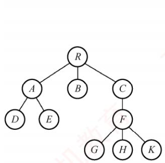  
(a)一棵树

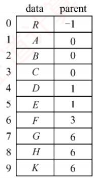  
(b) 双亲表示

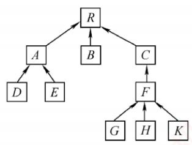  
(c) 双亲指针图示  
图 5.20 树的双亲表示法

双亲表示法利用了每个结点（除根结点外）有且仅有一个双亲的性质。因此，查找任意结点的双亲非常高效；然而，查找某结点的孩子则需遍历整个数组，效率较低。

## 注意

区分树与二叉树的顺序存储结构。在树的双亲表示法中，数组下标用于标识结点，结点间的父子关系通过parent域显式记录。而在二叉树的顺序存储结构中（如完全二叉树的数组表示），下标隐含了父子关系（例如，结点i的左孩子为2i+1，右孩子为2i+2）。二叉树是树的特例，因此可以使用树的存储结构表示。但是，一般的树不能直接使用二叉树的顺序存储方式。

## 2. 孩子表示法

孩子表示法将每个结点的所有孩子视为一个线性表，并用单链表存储。整棵树则由n个这样的孩子链表组成（叶结点对应空链表）。为便于访问，所有孩子链表的头指针被集中存放在一个顺序表（如数组）中，每个位置对应一个结点。图5.21(a)展示了图5.20(a)中树的孩子表示法。

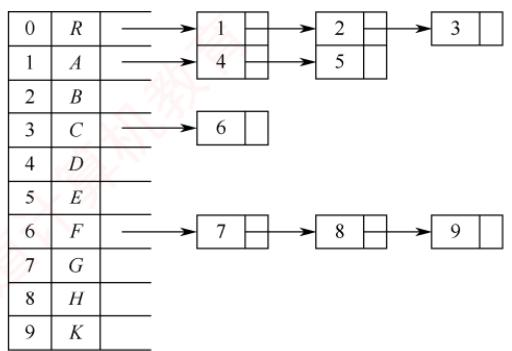  
(a) 孩子表示法

  
(b)孩子兄弟表示法  
图5.21 树的孩子表示法和孩子兄弟表示法

与双亲表示法相反，孩子表示法便于查找结点的孩子，但若要查找某结点的双亲，则需遍历所有孩子链表，检查是否包含该结点，效率较低。

## 3. 孩子兄弟表示法

孩子兄弟表示法也称二叉树表示法，采用二叉链表作为树的存储结构。每个结点包含三部分：

数据域、指向第一个孩子的指针、指向下一个兄弟的指针（沿此指针可依次访问该结点的所有右侧兄弟），如图5.21(b)所示。这种结构以“左孩子-右兄弟”的方式，将树映射为二叉树形式。

孩子兄弟表示法的存储结构描述如下：

```c
typedef struct CSNode{
ElemType data; //数据域
struct CSNode *firstchild,*nextsibling; //第一个孩子和右兄弟指针
}CSNode, *CSTree;
```

孩子兄弟表示法具有良好的灵活性，其最大优点是能自然地将树转换为二叉树，从而复用二叉树的算法。查找孩子非常高效。然而，从当前结点高效回溯到其双亲较为困难。若在结点中增设一个parent指针域，则可高效查询双亲，形成一种三叉链表的存储结构。 灿育

## 5.4.2 树、森林与二叉树的转换

二叉树和树均可用二叉链表作为存储结构。从物理结构上看，树的孩子兄弟表示法与二叉树的二叉链表表示法完全相同，因此可以用同一存储结构的不同解释将一棵树转换为二叉树。

## 1. 树转换为二叉树

考点追踪树和二叉树的转换及相关性质的推理（2009、2011）

树转换为二叉树的规则：每个结点的左指针指向其第一个孩子：右指针指向其在原树中的下一个右兄弟，这个规则也被称为“左孩子-右兄弟”原则。由于根结点没有兄弟，因此由树转换而来的二叉树的根结点必无右子树，如图5.22 所示。

  
图5.22 树与二叉树的对应关系

树转换为二叉树的手工画法：

1）在所有兄弟结点之间添加连线；

2）对每个结点，仅保留其与第一个孩子的连线，删除与其他孩子的连线；

3）以树根为轴心，顺时针旋转45°，使其呈现二叉树形态。

## 2. 森林转换为二叉树

## 考点追踪森林和二叉树的转换及相关性质的推理（2014）

森林是若干棵树的集合，其转换基于单棵树的转换方法。首先将森林中的每棵树分别转换为

对应的二叉树；由于每棵转换后的二叉树根结点均无右子树，可将这些根结点视为兄弟；将第二棵二叉树作为第一棵二叉树根的右子树……以此类推，最终形成一棵完整的二叉树。

森林转换为二叉树的手工画法：

1）将森林中的每棵树转换为相应的二叉树；

2）每棵树的根也可视为兄弟关系，在各树的根之间依次添加连线；

3）以第一棵树的根为轴心，顺时针旋转45°。

等效做法是：先在各树的根之间添加连线，然后整体应用树转二叉树的方法处理。

## 3. 二叉树转换为森林

考点追踪由遍历序列构造一棵二叉树并转换为对应的森林（2020、2021）

若给定的二叉树非空，则其转换为森林的规则：二叉树的根及其左子树对应第一棵树的二叉树表示；将根的右指针断开，其右子树即代表剩余森林转换后的二叉树：对右子树递归应用相同规则，不断分离出下一棵树，直至右子树为空：最后将每棵分离出的二叉树还原为普通树，即可得到原始森林。此过程如图5.23所示。二叉树转换为树或森林的结果是唯一的。

  
图5.23 森林与二叉树的对应关系

## 5.4.3 树和森林的遍历

## 1. 树的遍历

## 考点追踪树与二叉树遍历方法的对应关系（2019）

树的遍历是指以某种方式访问树中的每个结点，且仅访问一次。主要有两种方式：

1）先根遍历。若树非空，则按如下规则遍历：

• 先访问根结点。

●再依次遍历根结点的每棵子树，遍历子树时仍遵循先根后子树的规则。

其遍历序列与这棵树相应二叉树的先序序列相同。

2）后根遍历。若树非空，则按如下规则遍历：

● 先依次遍历根结点的每棵子树，遍历子树时仍遵循先子树后根的规则。

• 再访问根结点。

其遍历序列与这棵树相应二叉树的中序序列相同。

图5.22 的树的先根遍历序列为ABEFCDG，后根遍历序列为 EFBCGDA。

此外，树也支持层次遍历，与二叉树的层次遍历原理相似，即按层序依次访问各个结点。

## 2. 森林的遍历

基于森林和树相互递归的定义，可得出森林的两种遍历方法。

1）先序遍历森林。若森林为非空，则按如下规则遍历：

● 访问森林中第一棵树的根结点。

● 先序遍历第一棵树中根结点的子树森林。

● 先序遍历除去第一棵树后的剩余森林。

2）中序遍历森林。若森林为非空，则按如下规则遍历：

● 中序遍历第一棵树中根结点的子树森林。

● 访问森林中第一棵树的根结点。

● 中序遍历除去第一棵树后的剩余森林。

图 5.23 的森林的先序遍历序列为 ABCDEFGHI，中序遍历序列为 BCDAFEHIG。

## 考点追踪森林与二叉树遍历方法的对应关系（2020）

当森林转换成二叉树时，第一棵树的子树森林会转换为左子树，剩余森林则转换为右子树。因此，森林的先序、中序遍历与其对应二叉树的先序、中序遍历相同。

树和森林的遍历与二叉树的遍历关系见表5.1。

表5.1 树和森林的遍历与二叉树遍历的对应关系
<table><tr><td rowspan=1 colspan=1>树</td><td rowspan=1 colspan=1>森林</td><td rowspan=1 colspan=1>二叉树</td></tr><tr><td rowspan=1 colspan=1>先根遍历</td><td rowspan=1 colspan=1>先序遍历</td><td rowspan=1 colspan=1>先序遍历</td></tr><tr><td rowspan=1 colspan=1>后根遍历</td><td rowspan=1 colspan=1>中序遍历</td><td rowspan=1 colspan=1>中序遍历</td></tr></table>

## 注意

森林遍历方法的命名按照严蔚敏老师的教材。有些教材也将森林的中序遍历称为后序遍历，称中序遍历是相对其二叉树而言的，称后序遍历是因为根确实是在最后才被访问的。

## 5.4.4 本节试题精选

## 一、单项选择题

01.下列关于树的说法中，正确的是（）。I. 对于有n个结点的二叉树，其高度为 $\log _ { 2 }   n$ Ⅱ. 完全二叉树中，若一个结点没有左孩子，则它必是叶结点Ⅲ. 高度为h（h>0）的完全二叉树对应的森林所含的树的个数一定是hIV. 一棵树中的叶子数一定等于与其对应的二叉树的叶子数A. I和III B. IV C. I和Ⅱ D. ⅡI

02.利用二叉链表存储森林时，根结点的右指针是（）。A. 指向最左兄弟 B. 指向最右兄弟 C. 一定为空 D. 不一定为空

03. 设森林F中有3棵树，第1、2、3棵树的结点数分别为 $M_{1},M_{2}$ 和 $M _ { 3 } ,$ ，与森林F对应的二叉树根结点的右子树上的结点数是（）。A. $M _ { 1 }$ B. $M _ { 1 } + M _ { 2 }$ C. $M _ { 3 }$ D. $M _ { 2 } + M _ { 3 }$

04. 设森林 F中有4 棵树，第1、2、3、4 棵树的结点数分别为a、b、c和 $d ,$ 与森林F对应的二叉树的根结点的左子树上的结点数是（）。A. a B. $b + c + d$ XC. a - 1 D. $a + b + c$

05. 设森林 F对应的二叉树为 B，它有 m个结点，B 的根为 p，p 的右子树结点数为 n，森林F中第一棵树的结点数是（）。

A. m−n B. m-n−1 C. n+1 D. 条件不足，无法确定

06. 设森林F对应的二叉树是一棵具有16个结点的完全二叉树，则森林F中树的数目和结点最多的树的结点数分别是（）。 XA. 2和8 C. 4和8 D. 4和9

07. 森林 $T = (T_1, T_2, \cdots, T_m)$ 转化为二叉树BT的过程为：若m=0，则BT为空，若 $m \neq 0$ 则（）。A. 将中间子树 $T_{ mid } ( mid  = (1 + m)/2)$ 的根作为BT的根；将 $(T_1, T_2, \cdots, T_{\mathrm{mid}-1})$ 转换为 BT的左子树；将 $(T_{\mathrm{mid}+1}, \cdots, T_m)$ 转换为BT的右子树B. 将子树 $T _ { 1 }$ 的根作为 BT 的根；将 $T _ { 1 }$ 的子树森林转换成BT的左子树；将 $(T_{2}, T_{3}, \cdots, T_{m})$ 转换成BT的右子树C. 将子树 $T _ { 1 }$ 的根作为BT的根；将 $T _ { 1 }$ 的左子树森林转换成BT的左子树；将 $T _ { 1 }$ 的右子树森林转换为BT的右子树；其他以此类推D. 将森林 T的根作为 BT 的根；将 $( T _ { 1 } , \; T _ { 2 } , \cdots , \; T _ { m } )$ 转化为该根下的结点，得到一棵树，然后将这棵树再转化为二叉树BT

08. 设F是一个森林，B是由F变换来的二叉树。若F中有n个非终端结点，则B 中右指针域为空的结点有（）个。A. n-1 B. n C. n+1 D. n + 2

09. 设某树的孩子兄弟链表示中共有6个空的左指针域、7个空的右指针域，包括5个结点的左右指针域都为空，则该树中叶结点的个数是（）。A. 7 B. 6 C. 5 D. 不能确定

10. 若 $T _ { 1 }$ 是由有序树T转换而来的二叉树，则T中结点的后根序列就是 $T _ { 1 }$ 中结点的（）序列。A. 先序 B. 中序  C. 后序 D. 层序

11. 某二叉树结点的中序序列为 BDAECF，后序序列为 DBEFCA，则该二叉树对应的森林包括（）棵树。A. 1 B. 2 C. 3 D. 4

12. 设X是树T中的一个非根结点，B是T所对应的二叉树。在 B 中，X是其双亲结点的右孩子，下列结论中正确的是（）。A. 在树 T中，X是其双亲结点的第一个孩子B. 在树 T中，X一定无右边兄弟 首计算机教育C. 在树T中，X一定是叶结点D. 在树T中，X一定有左边兄弟

13. 右图是一棵逻辑上的树T，则在关于该树的存储结构的叙述中，错误的是（）。A. 若T采用双亲表示法，则有9个指向双亲的指针B. 若T采用孩子表示法，则在 T 中查找某个结点的孩子比双亲表示法更方便C. 若T采用孩子兄弟表示法，则在T中查找某个结点的双亲的时间复杂度为O(1)D. 双亲表示法是顺序存储结构，孩子表示法和孩子兄弟表示

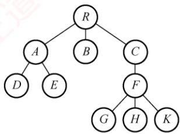

14. 在森林的二叉树表示中，结点M和结点N是同一父结点的左孩子和右孩子，则在该森林中（）。

A. M和N有同一双亲 B. M和N可能无公共祖先C. M是N的孩子 K D. M是N的左兄弟

15.【2009统考真题】将森林转换为对应的二叉树，若在二叉树中，结点u是结点ν的父结点的父结点，则在原来的森林中，u和ν可能具有的关系是（）。I. 父子关系 Ⅱ. 兄弟关系 .u的父结点与ν的父结点是兄弟关系A. 只有Ⅱ B. I和Ⅱ C. I和III D. I、ⅡI 和 ⅢII

16.【2011统考真题】已知一棵有2011个结点的树，其叶结点数为116，该树对应的二叉树中无右孩子的结点数是（）。A. 115 B. 116 C. 1895 D. 1896 育

17.【2014统考真题】将森林F转换为对应的二叉树T，F中叶结点的个数等于（）。A. T中叶结点的个数 B. T 中度为 1 的结点数C. T中左孩子指针为空的结点数 D. T中右孩子指针为空的结点数

18.【2019统考真题】若将一棵树T转化为对应的二叉树BT，则下列对BT的遍历中，其遍历序列与T的后根遍历序列相同的是（）。 王道A. 先序遍历 B. 中序遍历C. 后序遍历 D. 按层遍历

19. 【2020 统考真题】已知森林F及与之对应的二叉树 T，若 F的先根遍历序列是 a, b, c, d,$e , f ,$ 后根遍历序列是 $b , a , d , f , e , c ,$ 则 T的后序遍历序列是（）。A. $b , a , d , f , e , c$ B. $b , d , f , e , c , a$ C. $b , f , e , d , c , a$ D. $[ f , e , d , c , b , a$

20. 【2021统考真题】某森林 F对应的二叉树为T，若T的先序遍历序列是 $a , b , d , c , e , g , f ,$ 中序遍历序列是 $b , d , a , e , g , c , f ,$ 则F中树的棵数是（）。A. 1 B. 2 C. 3 D. 4

21.【2025统考真题】下列关于二叉树及森林的叙述中，正确的是（）。A. 完全二叉树中不存在度为1的结点B. 任意一个森林都可以转换为一棵二叉树C. 二叉树的分支结点数比叶结点数少D. 表达式树的根中保存的是最先计算的运算符

## 二、综合应用题

01. 给定一棵树的先根遍历序列和后根遍历序列，能否唯一确定一棵树？若能，请举例说明；若不能，请给出反例。

02. 将下面一个由3棵树组成的森林转换为二叉树。

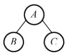

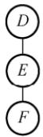

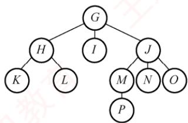

03. 已知某二叉树的先序序列和中序序列分别为 ABDEHCFIMGJKL 和 DBHEAIMFCGKLJ,请画出这棵二叉树，并画出二叉树对应的森林。

04. 编程求以孩子兄弟表示法存储的森林的叶结点数。

05. 以孩子兄弟链表为存储结构，请设计递归算法求树的深度。

## 5.4.5 答案与解析

## 一、单项选择题

## 01. D

若n个结点的二叉树是一棵单支树，则其高度为n。完全二叉树中最多存在一个度为1的结点且只有左孩子，若不存在左孩子，则一定也不存在右孩子，因此必是叶结点，说法Ⅱ正确。只有满二叉树才具有性质Ⅲ，如下图所示。

  
(a) 满二叉树转化为对应的森林

  
(b) 非满二叉树转化为对应的森林

在树转换为二叉树时，若有几个叶结点具有共同的双亲，则转换成二叉树后只有一个叶结点（最右边的叶结点），如下图所示，说法IV错误。注意，若树中的任意两个叶结点都不存在相同的双亲，则树中的叶子数才有可能与其对应的二叉树中的叶子数相等。


## 02. D

森林与二叉树具有对应关系，因此，我们存储森林时应先将森林转换成二叉树，转换的方法就是“左孩子右兄弟”，与树不同的是，若存在第二棵树，则二叉链表的根结点的右指针指向的是森林中的第二棵树的根结点。若此森林只有一棵树，则根结点的右指针为空。因此，右指针可能为空也可能不为空。 X

## 03. D

与树转换为二叉树不同，森林中的每棵树是独立的，因此先要将每棵树的根结点全部视为兄弟结点的关系。森林转换为二叉树后，树2作为树1的根结点的右子树，树3作为树2的根结点的右子树，因此森林F对应的二叉树根结点的右子树上的结点数是 $M _ { 2 } + M _ { 3 }$

## 04. C

森林转换为二叉树后，二叉树的根结点为第1棵树的根结点，二叉树的根结点的左子树包含第1棵树的所有孩子，因此森林F对应的二叉树的根结点的左子树上的结点数是a-1。

## 05. A

森林转换成二叉树时采用孩子兄弟表示法，根结点及其左子树为森林中的第一棵树。右子树为其他剩余的树。所以，第一棵树的结点数为m-n。

## 06. D

森林转换为二叉树后，二叉树的根结点及其左子树由第1棵树转换得到，二叉树的根结点的右子树由剩余的森林转换得到，以此类推，可以划分出第2,3,…棵树的结点。具有16个结点的完全二叉树的形态如右图所示，沿二叉树的根结点往右下遍历，共有4个结点，可知森林中有4棵树，其中第1棵树的结点数最多，


有9个。

## 07. B

将森林中每棵树的根结点视为兄弟结点的关系，再按照“左孩子右兄弟”的规则来进行转化。

## 08. C

根据森林与二叉树转换规则“左孩子右兄弟”。二叉树B中右指针域为空代表该结点没有兄弟结点。森林中每棵树的根结点从第二个开始依次连接到前一棵树的根的右孩子，因此最后一棵树的根结点的右指针为空。另外，每个非终端结点，其所有孩子结点在转换之后，最后一个孩子的右指针也为空，所以树B中右指针域为空的结点有n+1个。 XTA

## 09. B

在树的孩子兄弟表示法中，若一个结点没有孩子（叶结点），则表现为该结点的左指针域为空，因此本题答案为“6”。至于“5个结点的左右指针域都为空”，表示树中有5个结点既没有孩子又没有右兄弟，约束条件比题中的“求叶结点的个数”要求更严格。

## 10. B

有序树T转换成二叉树 $T _ { 1 }$ 时，T的后根序列是对应 $T _ { 1 }$ 的中序序列还是后序序列呢（显然树的后根序列不可能对应二叉树的先序序列和层序序列）？看右图所示的例子，在树T中，叶结点

B应最先访问，在 $T _ { 1 }$ 中，B的右兄弟C转换为它的右孩子，若对应 $T _ { 1 }$ 的后序序列，则C应在B的前面访问，所以T的后根序列不可能对应 $T _ { 1 }$ 的后序序列。 k


## 11. C

根据二叉树的先序序列和中序序列可以确定一棵二叉树。根据后序序列，A是二叉树的根结点。根据中序序列，二叉树的形态如下图(a)所示。对于A的左子树，根据后序序列，B比D后被访问，因此B必为D的父结点，又根据中序序列，D是B的右孩子。对于A的右子树，同理可确定结点E、C、F的关系。此二叉树的形态如下图(b)所示。

  
(a)

  
(b)

再根据二叉树与森林的对应关系，森林中树的棵数即其对应二叉树（向右上旋转 $4 5 ^ { \circ }$ 后）的根结点A及其右兄弟数，或解释为：对应二叉树从根结点A开始不断往右孩子访问，所访问到的结点数。可知此森林中有3棵树，根结点分别为A、C和F。

## 12. D

在二叉树B中，X是其双亲的右孩子，因此在树T中，X必是其双亲结点的右兄弟，换句话说，X在树中必有左兄弟。

## 13. C

若T采用双亲表示法存储，则除根结点外，其余每个结点都有指向其双亲的指针，T共有10个结点，于是有9个指向双亲的指针，选项A正确。若T采用孩子表示法存储，则每个结点的孩子被视为一个线性表，且以单链表作为存储结构，只要遍历该单链表，就能找到某个结点的所有孩子，而双亲表示法要寻找某个结点的孩子，就必须遍历整棵树，选项B正确。若刀采用孩子兄弟表示法，则在T中查找某个结点的双亲也必须遍历整棵树，时间复杂度为O(n)，选项C错误。选项D显然正确。 顺村

## 14. B

在森林的二叉树表示中，当M和N的父结点是二叉树根结点时，M和N在不同的树上。因此M和N可能无公共祖先。

## 15. B

森林与二叉树的转换规则为“左孩子右兄弟”。在最后生成的二叉树中，父子关系在对应森林关系中可能是兄弟关系或者原本就是父子关系。 XTA

说法I：若结点ν是结点u的第二个孩子结点，转换时，结点ν就变成结点μ第一个孩子的右孩子，符合要求。说法Ⅱ：结点μ和ν是兄弟结点的关系，但二者之中还有一个兄弟结点k，则转换后结点ν就变为结点k的右孩子，而结点k则是结点μ的右孩子，符合要求。

  
图I

  
图Ⅱ

说法Ⅲ：若结点u的父结点与ν的父结点是兄弟关系，则转换后，结点u和ν分别在两者最左父结点的两棵子树中，不可能出现在同一条路径中。 X


图ⅢI  


【另解】由题意可知u是ν的父结点的父结点，如下图所示，有四种情况：

  
(1)


(2)

  
(3)

  
(4)

根据树与二叉树的转换规则，将这四种情况转换成树中结点的关系。（1）在原来的树中μ是ν的父结点的父结点；（2）在树中μ是ν的父结点；（3）在树中μ是ν的父结点的兄弟；（4）在树中u与ν是兄弟关系。由此可知说法Ⅰ和Ⅱ正确。

## 16. D

树转换为二叉树时，树的每个分支结点的所有子结点中的最右子结点无右孩子，根结点转换后也没有右孩子，因此，对应二叉树中无右孩子的结点数=分支结点数 $+ 1 = 2011 - 116 + 1 = 1896$

通常本题应采用特殊法求解，设题意中的树是如右图所示的结构，则对应的二叉树中仅有前115个叶结点有右孩子，所以无右孩子的结点数 $2011 - 115 = 1896$ X


## 17. C

将森林转化为二叉树相当于用孩子兄弟表示法来表示森林。在变化过程中，原森林某结点的

第一个孩子结点作为它的左子树，它的兄弟作为它的右子树。森林中的叶结点没有孩子结点，转化为二叉树时，该结点就没有左结点，因此F中叶结点的个数等于T中左孩子指针为空的结点数。此题还可通过一些特例来排除选项A、B和D。

## 18. B

后根遍历树可分为两步：①从左到右访问双亲结点的每个孩子（转化为二叉树后，先访问根结点，再访问右子树）：②访问完所有孩子后，再访问它们的双亲结点（转化为二叉树后，先访问左子树，再访问根结点），因此树的后根遍历序列与其相应二叉树的中序遍历序列相同。对于此类题，采用特殊值法求解通常会更便捷，左下图树T转换为二叉树BT的过程如下图所示，树的后序遍历序列显然和其相应二叉树的中序遍历序列相同，均为5,6,7,2,3,4,1. A


## 19. C

森林F的先根遍历序列对应于其二叉树T的先序遍历序列，森林F的后根遍历序列对应于其二叉树T的中序遍历序列。即T的先序遍历序列为 $a , b , c , d , e , f ,$ 中序遍历序列为 $b , a , d , f , e , c \circ$ 根据二叉树T的先序序列和中序序列可以唯一确定它的结构，构造过程如下：


可以得到二叉树T的后序序列为 $b , f , e , d , c , a \circ$

## 20. C

由二叉树T的先序序列和中序序列可以构造出T，如右图所示。由森林转化成二叉树的规则可知，森林中每棵树的根结点以右子树的方式相连，所以T中的结点a、c、f为F中树的根结点，森林F中有3棵树。

## 21. B

完全二叉树中至多存在一个度为1的结点（最后一个非叶结点仅当总结点数为偶数时出现），选项A错误。根据“左孩子右兄弟”表示法，


任意森林均可唯一地转换为一棵二叉树，即将每棵树的根视为兄弟，各树内部按左孩子、右兄弟关系重构，选项B正确。在任意非空二叉树中，叶结点数 $n _ { 0 }$ 等于度为2的结点数 $n _ { 2 }$ 加1。但分支结点包括度为1和度为2的结点，其总数不一定少于叶结点数。例如，一条单支二叉树中，叶结点仅1个，而分支结点有n-1个，远多于叶结点。选项C错误。表达式树的结构体现运算优先级，根结点对应最后执行的运算符，而非最先计算的。最先计算的操作位于最深层的子树中，选项D错误。

## 二、综合应用题

## 01.【解答】

一棵树的先根遍历结果与其对应二叉树的先序遍历结果相同，树的后根遍历结果与其对应二叉

树表示的中序遍历结果相同。二叉树的先序序列和中序序列能够唯一地确定这棵二叉树，因此，根据题目给出的条件，利用树的先根遍历序列和后根遍历序列能够唯一地确定这棵树。例如，对于右图所示的树，对应二叉树的先序序列为1,2,3,4,5,6,8,7，中序序列为3,4,8,6,7,5,2,1。原树的先根遍历序列为1,2,3,4,5,6,8,7，后根遍历序列为3,4,8,6,7,5,2,1。


注意

树的先根遍历、后根遍历与对应二叉树的先序遍历、中序遍历对应。

## 02.【解答】

根据树与二叉树“左孩子右兄弟”的转换规则，将森林转换为二叉树的过程如下：①将每棵树的根结点也视为兄弟关系，在兄弟结点之间加一连线。②对每个结点，只保留它与第一个子结点的连线，与其他子结点的连线全部抹掉。③以树根为轴心，顺时针旋转45°。结果如下图所示。


03. 【解答】

知道二叉树的先序和中序遍历后，可以唯一确定这棵树的结构。然后把二叉树转换到树和森林的方式是，若结点x是双亲y的左孩子，则把x的右孩子、右孩子的右孩子……都与y用连线连起来，最后去掉所有双亲到右孩子的连线。

得到的二叉树及对应的森林如下图所示。


## 04.【解答】

当森林（树）以孩子兄弟表示法存储时，若结点没有孩子（fch=NULL），则它必是叶子，总的叶结点数是孩子子树（fch）上的叶子数和兄弟子树（nsib）上的叶结点数之和。

算法代码如下：

```c
typedef struct node
{
ElemType data; //数据域
struct node *fch,*nsib; //孩子与兄弟域
}*Tree;
int Leaves(Tree t) { //计算以孩子兄弟表示法存储的森林的叶子数
if(t==NULL)
return 0; //树空返回0
if(t->fch==NULL) //若结点无孩子，则该结点必是叶子
return 1+Leaves(t->nsib)； //返回叶结点和其兄弟子树中的叶结点数
else //孩子子树和兄弟子树中叶子数之和
return Leaves(t->fch) +Leaves(t->nsib);
```

## 05.【解答】

由孩子兄弟链表表示的树，求高度的算法思想：采用递归算法，若树为空，高度为零；否则，高度为第一个孩子树高度加1和兄弟子树高度的大者。其非递归算法使用队列，逐层遍历树，取得树的高度。算法代码如下：

```c
int Height(CSTree bt){
//递归求以孩子兄弟链表表示的树的深度 int hc,hs; 算机教
if(bt==NULL)
return 0;
else{//否则，高度取孩子高度+1 和兄弟子树高度的大者
hc=Height(bt->firstchild); //第一个孩子树高
hs=Height(bt->nextsibling); //兄弟树高
if(hc+1>hs)
return hc+1;
else
return hs;
```

## 5.5 树与二叉树的应用

## 5.5.1 哈夫曼树和哈夫曼编码

## 1. 哈夫曼树的定义

在介绍哈夫曼树之前，先明确几个相关概念：

在许多实际应用中，树中的结点常被赋予一个具有特定意义的数值，称为该结点的权。从树的根结点到某一结点的路径长度与该结点权值的乘积，称为该结点的带权路径长度。树中所有叶结点的带权路径长度之和称为该树的带权路径长度（WPL），记为

$$
\mathrm{WPL} = \sum_{i = 1}^{n} w_{i} l_{i}
$$

式中， $w _ { i }$ 为第i个叶结点的权值， $l _ { i }$ 为该叶结点到根结点的路径长度。

若将各叶结点的权值视为其出现的频度或概率，则每个叶结点的路径长度以其权值为权重所计算出的加权平均值称为加权平均长度，记为

$$
 加权平均长度  =  WPL  /  各叶结点的权值之和
$$

在含有n个带权叶结点的二叉树中，WPL最小的二叉树称为哈夫曼树，也称最优二叉树。图 5.24 中的 3 棵二叉树均包含4 个叶结点 $a,b,c,d,$ 权值分别为7,5,2,4，对应的WPL分别为

  
(a)

  
(b)

  
(c)  
图5.24 具有不同带权路径长度的二叉树

(a) $\mathrm{WPL}=7 \times 2+5 \times 2+2 \times 2+4 \times 2=36$

(b) $\mathrm{WPL}=4 \times 2+7 \times 3+5 \times 3+2 \times 1=46$

(c) $\mathrm{WPL}=7 \times 1+5 \times 2+2 \times 3+4 \times 3=35$

其中，图5.24(c)树的WPL最小，可验证其恰好为对应权值集合的哈夫曼树。

## 2. 哈夫曼树的构造

给定n个权值分别为 $w_{1},w_{2},\cdots,w_{n}$ 的结点，构造哈夫曼树的步骤如下：

1）将这n个结点分别视为n棵仅含一个结点的二叉树，构成森林 $F _ { \circ }$

考点追踪分析哈夫曼树的路径上权值序列的合法性（2010）

2）构造一个新结点，从F中选取两棵根结点权值最小的树作为其左右子树，并将新结点的权值设为左右子树根结点的权值之和。

3）从F中删除所选的两棵树，并将新生成的树加入F。

4）重复步骤2）和3），直至F中仅剩一棵树为止，最终得到的树即为哈夫曼树。

## 考点追踪哈夫曼树的性质（2010、2019）

由上述构造过程可归纳出哈夫曼树的以下性质：

1）每个初始结点最终都成为叶结点，且权值越小的结点，其到根的路径长度越大

2）构造过程中共新建了n-1个结点（双分支结点），因此哈夫曼树的结点总数为2n-1。

3）每次合并均选取两棵树，故哈夫曼树中不存在度为1的结点（为严格二叉树）。

例如，权值集合{7,5,2,4}的哈夫曼树构造过程如图5.25所示。

  
(a)


(b)  
  
(c)

  
(d)  
图5.25 哈夫曼树的构造过程

## 3. 哈夫曼编码

在数据通信中，若对每个字符使用相同长度的二进制位表示，称这种编码方式为固定长度编码；若允许不同字符使用不同长度的二进制位表示，则称为可变长度编码。合理的可变长度编码（如哈夫曼编码）比固定长度编码要好得多，其特点是对出现频率高的字符赋予较短编码，而对频率低的字符赋予较长编码，从而降低字符的平均编码长度，起到压缩数据的效果。

## 考点追踪根据哈夫曼编码对编码序列进行译码（2017）

若一个编码集合中，没有任何一个编码是另一个编码的前缀，则称该编码为前缀编码。例如，为字符A.B和C分配编码0.10和110，这是一个前缀编码。由于编码互不为前缀，解码过程简单且无歧义：从左到右扫描码串，一旦识别出一个有效编码，即可立即译出对应字符。例如，码串0010110可唯一译为AABC。反之，若再为字符D分配编码11，则11是110的前缀，导致上述码串的后3位无法确定是DA，还是直接表示C，从而破坏唯一可译性。

## 考点追踪哈夫曼树的构造及相关的分析（2012、2018、2021、2023）

## 考点追踪前缀编码的分析及应用（2014、2020）

可利用二叉树设计二进制前缀编码。例如，为字符A,B,CD设计前缀编码，可用图5.26所示的二叉树表示：四个叶结点分别对应这四个字符，并约定左分支标记为0，右分支标记为1。将根到各叶结点路径上的分支标记（0/1）拼接成的字符串，作为对应字符的编码，字符 A, B,C, D的编码分别为 0,10, 110，111。可以证明，如此生成的编码必为前缀编码。

  
图 5.26 前缀编码示例

## 考点追踪哈夫曼编码和定长编码的差异（2022）

哈夫曼编码是一种非常高效的数据压缩编码方法。由哈夫曼树生成哈夫曼编码的过程十分自然。首先，将每个字符视为一个独立的叶结点，其权值为其出现的频度（或次数）；构造对应的哈夫曼树；然后，将从根到各叶结点路径上分支标记的字符串，作为该字符的编码。图5.27展示了一个由哈夫曼树构造哈夫曼编码的示例，图中矩形结点标注了字符及其出现频次。

  
图5.27 由哈夫曼树构造哈夫曼编码

该哈夫曼树的 WPL 为

$$
\mathrm{WPL}=1 \times 45+3 \times(13+12+16)+4 \times(5+9)=224
$$

此处的WPL表示对100个字符编码后的二进制总长度，共224位。若采用3位固定长度编码（共6个不同字符，需至少3位），则总长度为 $3 \times 100 = 300$ 位。因此，哈夫曼编码实现了约25%的数据压缩率。由此可见，利用哈夫曼树可以设计出总长度最短的二进制前缀编码。

## 注意

左分支和右分支分别表示0还是1并无强制规定，因此构造出的哈夫曼树在形态上可能不唯一。此外，当存在多个权值相同的结点时，合并顺序的不同也可能导致结构不同的哈夫曼树。但无论具体形态如何，其带权路径长度WPL始终相同且达到最小值，即最优性不受影响。

## 5.5.2 并查集

## 1. 并查集的概念

并查集是一种处理不相交集合的合并与查询问题的树状数据结构，它支持三种基本操作：

1）Initial(S)：将集合s中的每个元素都初始化为一个独立的单元素子集合。

2) Union(S,Root1,Root2)：将集合s 中的子集合 Root2 并入子集合 Root1。要求 Root1和Root2属于不同的子集合，否则不执行合并操作。

3）Find(S,x)：在集合S中查找单元素×所属的子集合，并返回该子集合的根结点。

## 2. 并查集的存储结构

并查集通常采用树的双亲表示法作为其存储结构：每个子集合用一棵树来表示，所有子集合对应的树共同构成一个森林，并统一存储在一个数组中。在该数组中，数组下标代表集合中的元素编号，而每个元素所存的值为其双亲结点的下标；对于根结点，其双亲域设为负数一一通常取该子集合元素数量的相反数，既标识其为根，又记录了集合的规模。 XX

例如，设有一个全集合为S={0,1,2,3,4,5,6,7,8,9}，初始化时每个元素自成一个单元素子集合，对应数组中每个位置的值均为-1，如图5.28所示。 X


  
(b)初始化时形成的(森林)双亲表示  
图 5.28 并查集的初始化

经过若于合并操作后，这些子集合可能被合并为三个更大的子集合： $S _ { 1 } = \{ 0 , 6 , 7 , 8 \}$ $S _ { 2 }   =   \{ 1 , 4 , 9 \}$ $S _ { 3 }   =   \{ 2 , 3 , 5 \}$ ，此时并查集的树形及其对应的数组存储形式如图5.29所示。

  
(b)集合S1、S2和S3的(森林)双亲表示  
图 5.29 用树表示并查集

要实现两个子集合的并操作 $( S _ { 1 } \cup S _ { 2 } )$ ，只需将其中一个子集合根结点在数组中的值设为另一个子集合的根结点下标。例如，将 $S _ { 2 }$ 的根指向 $S _ { 1 }$ 的根后，所得结构如图5.30所示。

<table><tr><td rowspan=1 colspan=5></td></tr><tr><td rowspan=1 colspan=1></td><td rowspan=1 colspan=1></td><td rowspan=1 colspan=1></td><td rowspan=1 colspan=1>00</td><td rowspan=1 colspan=1></td></tr></table>

图 5.30 $S _ { 1 } \cup S _ { 2 }$ 的表示方法

在该存储方案中，集合元素的编号从0到SIZE-1，其中SIZE表示集合中元素的最大数量。

## 3. 并查集的基本实现

并查集的结构定义如下：

int Find(int S[],int x){   
while(S[x]>=0) //循环寻找×的根   
x=S[x];   
return x; //根的S []小于0   
}

下面是并查集主要运算的实现。

（1）并查集的初始化操作

```lisp
void Initial(int S[]){
for(int i=0;i<SIZE;i++)
S[i]=-1;
}
```

将每个元素对应的数组值设为-1，表示这些元素各自为根。

## (2) 并查集的 Find 操作

在并查集中查找并返回包含元素×的树的根。

判断两个元素是否属于同一集合，只需分别找到它们的根，再比较根是否相同即可。

## (3）并查集的 Union 操作

合并两个不相交子集合的操作。当要合并两个元素所在的集合时，需要先找到这两个元素的根，然后让一棵子集树的根指向另一棵子集树的根。

```c
void Union(int S[],int Root1,int Root2) {
if(Root1==Root2) return; //要求 Root1 与 Root2 是不同的集合
S[Root2]=Root1; //将根 Root2 连接到另一根 Root1 下面
```

Find和 Union操作的时间复杂度分别为 O(d)和 O(1)，其中 d为树的深度。

## 4. 并查集实现的优化

在极端情况下，由n个元素构成的集合树可能退化为一条链，深度达到n，此时Find操作的最坏时间复杂度为O(n)。改进的办法是：在执行Union操作前先比较两个子集合的规模，将规模较小的树作为子树挂到规模较大的树的根下，即“小树并入大树”。为此，可利用根结点的绝对值（其绝对值即为集合大小）来记录该集合中包含的元素个数。

(1）改进的 Union 操作

void Union(int S[l,int Root1,int Root2) {  
if(Root1==Root2) return;  
if (S [Root2]>S[Root1]) { //Root2 结点数更少  
S[Root1]+=S[Root2]; ∥/累加集合中的元素总数  
S[Root2]=Root1; //小树合并到大树  
else { //Root1 结点数更少  
S[Root2]+=S[Root1]; //累加结点总数  
S[Root1]=Root2; //小树合并到大树  
1

采用这种按集合大小合并的策略后，所构造的集合树深度不超过Llog2n+1。

然而，随着子集不断合并，集合树的深度仍可能逐渐增大。为进一步缩短查找时间，还可对上述Finα操作进一步优化：引入路径压缩机制一—在找到根结点后，将从×到根路径上的所有中间结点直接挂接到根结点下，从而“压平”整条路径。

## (2) 改进的 Find 操作

int Find(int S[],int x){   
int root=x;

while(S[root]>=0)   
root=S[root];   
while(x!=root) {   
int t=S[x];   
S[x]=root;   
x=t;   
return root;

采用按大小合并与路径压缩两种优化后，并查集的操作效率得到极大提升，使得集合树的深度不超过 O(α(n))，其中 α(n)是一个增长极其缓慢的函数，对于常见的正整数n，通常 α(n)≤4。

关于并查集的实际应用示例，请参见本书配套视频。

## 5.5.3 本节试题精选

## 一、单项选择题

01. 在有n个叶结点的哈夫曼树中，非叶结点的总数是（）。A. n-1 B. n C. 2n-1 D. 2n

02. 给定整数集合{3,5,6,9,12}，与之对应的哈夫曼树是（）。


A.


B.


C.


D.

03.下列编码中，（）不是前缀码。A. {00, 01, 10, 11} 王道计 B. {0, 1, 00, 11}C. {0, 10, 110, 111} D. {10, 110, 1110, 1111}

04. 设哈夫曼编码的长度不超过4，若已对两个字符编码为1和01，则还最多可对（）个字符编码。A. 2 B. 3 C. 4 D. 5

05.一棵哈夫曼树共有215个结点，对其进行哈夫曼编码，共能得到（）个不同的码字。A. 107 B. 108 C. 214 D. 215X

06. 设某哈夫曼树有5个叶结点，则该哈夫曼树的高度最高可以是（）。A. 3 B. 4 C. 5 D. 6

07.以下对于哈夫曼树的说法中，错误的是（） 道A. 用一组权值构造出的哈夫曼树可能不唯一，但带权路径长度唯一B. 哈夫曼树具有最小的带权路径长度C. 哈夫曼树中没有度为1的结点D. 哈夫曼树中除了度为1的结点，还有度为2的结点和叶结点

08. 下列关于哈夫曼树的说法中，错误的是（）。I. 哈夫曼树的总结点数不能是偶数I. 哈夫曼树中度为1的结点数等于度为2和0的结点数之差Ⅲ. 哈夫曼树的带权路径长度等于其所有分支结点的权值之和A. 仅ⅢI B. I和Ⅱ C. 仅Ⅱ D. I、ⅡI和 III

09. 若度为m的哈夫曼树中，叶结点数为n，则非叶结点的个数为（）。A. n-1 B. [n/m−1C. [(n−1)/(m−1)] D. [n/(m−1)]−1

10.并查集的结构是一种（）。A. 二叉链表存储的二叉树 主道订 B. 双亲表示法存储的树C. 顺序存储的二叉树 D. 孩子表示法存储的树

11.并查集中最核心的两个操作是：①查找，查找两个元素是否属于同一个集合；②合并，若两个元素不属于同一个集合，且所在的两个集合互不相交，则合并这两个集合。假设初始长度为10（0\~9）的并查集，按1-2、3-4、5-6、7-8、8-9、1-8、0-5、1-9的顺序进行查找和合并操作，最终并查集共有（）个集合。A. 1KK B. 2 C. 3

12.下列关于并查集的说法中，正确的是（）（注，本题涉及图的考点）。A.并查集不能检测图中是否存在环路的问题B. 通过路径优化后的并查集在最坏情况下的高度仍是O(n)C. Find操作返回集合中元素个数的相反数，它用来作为某个集合的标志D. Union操作时可根据当前集合的规模，将小集合合并到大集合中

13.下列关于并查集的叙述中，（）是错误的（注意，本题涉及图的考点）。A. 并查集是用双亲表示法存储的树B. 并查集可用于实现克鲁斯卡尔算法 机教育C. 并查集可用于判断无向图的连通性D. 在长度为 n的并查集中进行查找操作的时间复杂度为 O(log2n)

14.【2010统考真题】n（n≥2）个权值均不相同的字符构成哈夫曼树，关于该树的叙述中，错误的是（）。A. 该树一定是一棵完全二叉树B. 树中一定没有度为1的结点C. 树中两个权值最小的结点一定是兄弟结点D. 树中任意一个非叶结点的权值一定不小于下一层任意一个结点的权值 收育

15.【2014统考真题】5个字符有如下4种编码方案，不是前缀编码的是（）。A. 01,0000,0001,001,1 B. 011,000,001,010,1C. 000,001,010,011,100 D. 0,100,110,1110,1100

16.【2015统考真题】下列选项给出的是从根分别到达两个叶结点路径上的权值序列，能属于同一棵哈夫曼树的是（）。A. 24, 10, 5 和 24, 10, 7 B. 24,10, 5 和 24, 12, 7C. 24, 10, 10 和 24, 14, 11 D. 24, 10, 5 和 24, 14, 6

17. 【2017 统考真题】已知字符集{a, b, c, d, e, f, g, h}，各字符的哈夫曼编码依次是 0100, 10, 0000,0101,001,011,11,0001，编码序列0100011001001011110101的译码结果是（）。 A. acgabfh B. ad bagbb C. afbeagd D. afeefgd

18. 【2018统考真题】已知字符集{a, b, c, d, e, f}，若各字符出现的次数分别为 6, 3,8,2, 10,4，则对应字符集中各字符的哈夫曼编码可能是（）。A. 00, 1011,01, 1010, 11, 100 道计 B. 00, 100, 110, 000, 0010, 01C. 10, 1011, 11,0011, 00, 010 D. 0011, 10, 11,0010, 01, 000

19. 【2019统考真题】对n个互不相同的符号进行哈夫曼编码。若生成的哈夫曼树共有115个结点，则n的值是（）。A. 56 B. 57 C. 58 D. 60

20. 【2021统考真题】若某二叉树有5个叶结点，其权值分别为10,12,16,21,30，则其最小的带权路径长度（WPL）是（）。A. 89 B. 200 X C. 208 D. 289

21. 【2022统考真题】对任意给定的含 $n ( n > 2 )$ 个字符的有限集S，用二叉树表示S的哈夫曼编码集和定长编码集，分别得到二叉树 $T _ { 1 }$ 和 $T _ { 2 }$ 。下列叙述中，正确的是（）。A. $T _ { 1 }$ 与 $T _ { 2 }$ 的结点数相同 B. $T _ { 1 }$ 的高度大于 $T _ { 2 }$ 的高度C. 出现频次不同的字符在 $T _ { 1 }$ 中处于不同的层 机教育D. 出现频次不同的字符在 $T _ { 2 }$ 中处于相同的层

22. 【2023统考真题】在由6个字符组成的字符集S中，各字符出现的频次分别为3,4,5，6,8,10，为S构造的哈夫曼编码的加权平均长度为（）。A. 2.4 B. 2.5 C. 2.67 D. 2.75

23.【2025统考真题】设字符集S中包含7个字符，各字符出现的频次分别为2,3,4,6,8,10,11。现为S中的各字符构造哈夫曼编码，编码长度不小于3的字符数是（）。A. 2 B. 3 C. 4 D. 5

## 二、综合应用题

01. 设给定权集 w = {5,7,2,3,6,8,9}，试构造关于 w 的一棵哈夫曼树，并求其加权路径长度WPL。

02. 【2012 统考真题】设有 6 个有序表 A, B, C, D, E, F，分别含有 10,35, 40, 50, 60 和 200个数据元素，各表中的元素按升序排列。要求通过5次两两合并，将6个表最终合并为1个升序表，并使最坏情况下比较的总次数达到最小。请回答下列问题：1）给出完整的合并过程，并求出最坏情况下比较的总次数。2）根据你的合并过程，描述 $n (n \geqslant 2)$ 个不等长升序表的合并策略，并说明理由。

03.【2020统考真题】若任意一个字符的编码都不是其他字符编码的前缀，则称这种编码具有前缀特性。现有某字符集（字符个数≥2）的不等长编码，每个字符的编码均为二进制的0、1序列，最长为L位，且具有前缀特性。请回答下列问题：1）哪种数据结构适宜保存上述具有前缀特性的不等长编码？2）基于你所设计的数据结构，简述从0/1串到字符串的译码过程。 计算机3）简述判定某字符集的不等长编码是否具有前缀特性的过程。

## 5.5.4 答案与解析

## 一、单项选择题

01. A

由哈夫曼树的构造过程可知，哈夫曼树中只有度为0和2的结点。在非空二叉树中，有 $n _ { 0 } =$ $n _ { 2 } + 1$ ，所以 $n _ { 2 }   =   n   -   1$ 0

【另解】n个结点构造哈夫曼树需要n-1次合并过程，每次合并新建一个分支结点，所以选择选项A。

02. C

首先，3和5构造为一棵子树，其根权值为8，然后该子树与6构造为一棵新子树，根权值

为14，再后9与12构造为一棵子树，最后两棵子树共同构造为一棵哈夫曼树。

## 03. B

若没有一个编码是另一个编码的前缀，则称这样的编码为前缀编码。在选项B中，0是00的前缀，1是11的前缀。 XAN

## 04. C

在哈夫曼编码中，一个编码不能是任何其他编码的前缀。3位编码可能是001，对应的4位

编码只能是0000和0001。3位编码也可能是000，对应的4位编码只能是0010和0011。若全采用4位编码，则可以为0000,0001,0010和0011。题中问的是最多，所以选择选项C。

【另解】若哈夫曼编码的长度只允许小于或等于4，则哈夫曼树的高度最高是5，已知一个字符编码为1，另一个字符编码为01，这说明第二层和第三层各有一个叶结点，为使得该树从第3层起能够对尽可能多的字符编码，余下的二叉树应该是满二叉树，如右图所示，底层可以有4个叶结点，最多可以再对4个字符编码。


## 05. B

根据上题的结论，叶结点数为 $( 2 1 5 + 1 ) / 2 = 1 0 8$ ，所以共有108个不同的码字。

【另解】在哈夫曼树中只有度为0和2的结点，结点总数 $n = n _ { 0 } + n _ { 2 }$ ，且 $n _ { 0 } = n _ { 2 } + 1$ ，由题知$n = 215, \quad n_0 = 108$

## 06. C

在哈夫曼树的构造中，每个初始结点最终都成为叶结点，5个初始结点构造的哈夫曼树共新建4个双分支结点，4个双分支结点所构成的高度最高的哈夫曼树如右图所示，其高度为5。 道

## 07. D


在哈夫曼树的构造过程中，每次选根的权值最小的两棵树，一棵作为左子树，一棵作为右子树，生成新的二叉树，新的二叉树根的权值应为其左右两棵子

树根结点权值的和。至于谁做左子树，谁做右子树，没有限制，所以构造的哈夫曼树是不唯一的，但其带权路径长度是最小的和唯一的。哈夫曼树只有度为0和2的结点，度为0的结点是外结点，带有权值，没有度为1的结点。

## 08. C

由n个初始结点构造的哈夫曼树，会新建n-1个双分支结点，因此总结点数为 $2 n   -   1$ ，必为奇数，说法Ⅰ正确。哈夫曼树中没有度为1的结点，说法Ⅱ错误。哈夫曼的带权路径长度有两种计算方法：①所有叶结点的带权路径长度之和；②所有分支结点的权值之和，说法Ⅲ正确。

## 09. C

一棵度为m的哈夫曼树应只有度为0和 m的结点，设度为m的结点有 $n _ { m }$ 个，度为0的结点有$n _ { 0 }$ 个，又设结点总数为N， $N = n_{0} + n_{m}$ ，因N个结点的哈夫曼树有N-1条分支，则 $m n _ { m } = N - 1 = n _ { m } +$ $n _ { \mathrm { 0 } }   -   1$ ，整理得 $(m - 1)n_{m} = n_{0} - 1,\ n_{m} = (n_{0} - 1)/(m - 1)$ 。啦

## 10. B

并查集的存储结构是用双亲表示法存储的树，主要是为了方便两个重要的操作。

## 11. C

初始时，0～9各自成一个集合。查找1-2时，合并{1}和{2}；查找3-4时，合并{3}和{4}；

查找5-6时，合并{5}和{6}；查找7-8时，合并{7}和{8}；查找8-9时，合并{7，8}和{9}；查找1-8时，合并{1,2}和{7,8,9}；查找0-5时，合并{0}和{5,6}；查找1-9时，它们属于同一个集合。最终的集合为{0,5,6}、{1,2,7,8,9}和{3,4}，因此答案选择选项C。

## 12. D

依次探测图的各条边，用并查集检查该边依附的两个顶点是否已属于同一集合（两个顶点的根结点是否相同）。若是，则说明图中存在环路，选项A错误。经过路径优化后，并查集在最坏情况下的高度远小于O(n)，选项B错误。Find操作总返回当前根结点作为集合的标志，选项C错误。 XTA XTT

## 13. D

在用并查集实现Kruskal算法求图的最小生成树时：判断是否加入一条边之前，先查找这条边关联的两个顶点是否属于同一个集合（判断加入这条边之后是否形成回路），若形成回路，则继续判断下一条边：若不形成回路，则将该边和边对应的顶点加入最小生成树T，并继续判断下一条边，直到所有顶点都已加入最小生成树T。选项B正确。用并查集判断无向图连通性的方法：遍历无向图的边，每遍历到一条边，就把这条边连接的两个顶点合并到同一个集合中，处理完所有边后，只要是相互连通的顶点都会被合并到同一个子集合中，相互不连通的顶点一定在不同的子集合中。选项C正确。未做路径优化的并查集在最坏情况下的高度为n，此时查找操作的时间复杂度为O(n)，时间复杂度通常指最坏情况下的时间复杂度。选项D错误。

## 14. A

哈夫曼树为带权路径长度最小的二叉树，不一定是完全二叉树。哈夫曼树中没有度为1的结点，选项B正确。构造哈夫曼树时，最先选取两个权值最小的结点作为左右子树构造一棵新的二叉树，选项C正确。哈夫曼树中任意一个非叶结点的权值为其左右子树根结点的权值之和，可知，哈夫曼树中任意一个非叶结点的权值一定不小于下一层任意一个结点的权值。

## 15. D

前缀编码的定义是在一个字符集中，任何一个字符的编码都不是另一个字符编码的前缀。选项D中的编码110是编码1100的前缀，违反了前缀编码的规则，所以选项D不是前缀编码。

## 16. D

在哈夫曼树中，左右孩子权值之和为父结点权值。仅以分析选项A为例：若两个10分别属于两棵不同的子树，则根的权值不等于其孩子的权值和，不符；若两个10属同棵子树，则其权值不等于其两个孩子（叶结点）的权值和，不符。选项B、C选项的排除方法相同。

## 17. D

哈夫曼编码是前缀编码，各个编码的前缀不同，因此直接拿编码序列与哈夫曼编码一一比对即可。序列可分割为0100011001001011110101，译码结果是afeefgd。选项D正确。

## 18. A

根据各字符出现的次数构造的哈夫曼树如右图所示。由图可知，a、c和e的编码长度应该相同；a和c的第1个编码应该相同，且与e的第1个编码不同；b和d的前3个编码应该相同。

## 19. C

n个符号构造成哈夫曼树的过程中，共新建了n-1个结点（双分支结点），因此哈夫曼树的结点总数为2n-1=115，n的值为 58。


## 20. B

对于带权值的结点，构造出哈夫曼树的带权路径长度（WPL）最小，哈夫曼树的构造过程如下图所示。求得其 $\mathrm{WPL}=(10+12)\times3+(30+16+21)\times2=200$ 0


## 21. D

第二步  


可以画一个简单的特例来证明。图1是满足条件的二叉树 $T _ { 1 }$ ，图2是满足条件的二叉树 $T _ { 2 }$ 结点中有值表示这个结点是编码字符。 $T _ { 1 }$ 和 $T _ { 2 }$ 的结点数不同，选项A错误。 $T _ { 1 }$ 的高度等于 $T _ { 2 }$ 的高度，选项B错误。出现频次不同的字符在 $T _ { 1 }$ 中也可能处于相同的层，选项C错误。对于定长编码集，所有字符一定都在 $T _ { 2 }$ 中处于相同的层，而且都是叶结点。

  
图1

  
图2

## 22. B

构建哈夫曼树的过程如下图所示。


对叶结点的哈夫曼编码，共有4个长度为3的叶结点、2个长度为2的叶结点，编码的加权平均长度为 $\left[ (3+4+5+6) \times 3+(8+10) \times 2 \right] / (3+4+5+6+8+10) = 2.5$

## 23. D

哈夫曼编码的编码长度等于该字符在哈夫曼树中的路径深度（从根到该叶结点的边数）。一个字符所在子树参与后续合并的轮数越多，其深度越大。合并过程如下：①合并2和3→新结点 $5 ;$ ②合并4和5→新结点$9 ; \textcircled{3}$ 合并6和8→新结点14；④合并9和10→新结点19；⑤合并11和14→新结点25；⑥合并19和25→根结点44。最终构建的哈夫曼树如右图所示。因此，编码长度不小于3的字符为4、2、3、6、8，共5个。


## 二、综合应用题

## 01.【解答】

根据哈夫曼树的构造方法，每次从森林中选取两个根结点值最小的树合并成一棵树，将原先的两棵树作为左右子树，且新根结点的值为左右孩子关键字之和。构造过程如下图所示。


由构造出的哈夫曼树可得 $\mathrm{WPL}=(2+3)\times4+(5+6+7)\times3+(8+9)\times2=108$

## 注意

哈夫曼树并不唯一，但带权路径长度一定是相同的。

## 02.【解答】

1）最先合并的表中的元素在后续的每次合并中都会再次参与比较，因此求最小合并次数类似于求最小带权路径长度，此时可立即想到哈夫曼树。根据哈夫曼树的构造过程，每次选择表集合中长度最小的两个表进行合并。6个表的合并顺序如右图所示。根据图中的哈夫曼树，6个序列的合并过程如下：

①在表集合{10,35,40,50,60,200}中，选择表A与表B合并，生成含45个元素的表AB。


②在表集合{40,45,50,60,200}中，将表AB与表C合并，生成含85个元素的表ABC。

③ 在表集合{50,60,85,200}中，表D与表E合并，生成含110个元素的表DE。

④在表集合{85,110,200}中，表 ABC与表DE合并，生成含195个元素的表 ABCDE。

⑤当前表集合为{195,200}，表ABCDE与表F合并，生成含395个元素的表ABCDEF。因为合并两个长度分别为m和n的有序表，最坏情况下需要比较 $m + n - 1$ 次，所以最坏情况下比较的总次数计算如下：

第1次合并：最多比较次数=10+35-1=44。

第2次合并：最多比较次数=40+45-1=84。

第3次合并：最多比较次数=50+60-1=109。

第4次合并：最多比较次数=85+110-1=194。

第5次合并：最多比较次数=195+200-1=394。

比较的总次数最多为 44+84+109+194+394= 825。

2）各表的合并策略是：对多个有序表进行两两合并时，若表长不同，则最坏情况下总的比较次数依赖于表的合并次序。可以借助哈夫曼树的构造思想，依次选择最短的两个表进行合并，此时可以获得最坏情况下的最佳合并效率。

## 03.【解答】

1）使用一棵二叉树保存字符集中各字符的编码，每个编码对应于从根开始到达某叶结点的一条路径，路径长度等于编码位数，路径到达的叶结点中保存该编码对应的字符。

2）从左至右依次扫描0/1串中的各位。从根开始，根据串中当前位沿当前结点的左子指针或右子指针下移，直到移动到叶结点时为止。输出叶结点中保存的字符。然后从根开始重X 复这个过程，直到扫描到0/1串结束，译码完成。 X

3）二叉树既可用于保存各字符的编码，又可用于检测编码是否具有前缀特性。判定编码是否具有前缀特性的过程，也是构建二叉树的过程。初始时，二叉树中仅含有根结点，其左子指针和右子指针均为空。

依次读入每个编码C，建立/寻找从根开始对应于该编码的一条路径，过程如下：

对每个编码，从左至右扫描C的各位，根据C的当前位（0或1）沿结点的指针（左子指针或右子指针）向下移动。当遇到空指针时，创建新结点，让空指针指向该新结点并继续移动。沿指针移动的过程中，可能遇到三种情况：

①若遇到了叶结点（非根），则表明不具有前缀特性，返回。

②若在处理C的所有位的过程中，均没有创建新结点，则表明不具有前缀特性，返回。

③若在处理C的最后一个编码位时创建了新结点，则继续验证下一个编码。

若所有编码均通过验证，则编码具有前缀特性。

## 归纳总结

本章内容较为丰富，其中二叉树是极其重要的考查重点。在历年统考真题中，已多次出现基于二叉树的算法设计题，考生需特别关注。 道

遍历是二叉树各类操作的基础，统考常结合遍历过程考查对结点的各种附加操作。建议读者重点掌握各种遍历方法的代码实现，并在此基础上灵活完成相关操作。其中，递归算法结构简洁、逻辑清晰，在考试中出现的概率较高，切勿掉以轻心。应熟练掌握先序、中序、后序遍历的程序模板，并通过足量习题训练，方能在考试中快速写出规范、高效的代码。

二叉树遍历的通用递归框架如下：

```c
void Track(BiTree *p){
if(p!=NULL) {
∥(1)
Track(p->lchild);
∥(2)
Track(p->rchild);
```

11(3)

将访问操作visit()放在位置(1)、(2)或(3)，分别对应先序遍历、中序遍历和后序遍历。但在具体题目中，需根据问题要求灵活调整和扩展该模板。

例如，设二叉树采用二叉链表存储结构，请编写有关二叉树的递归算法。

1）统计二叉树中度为1的结点数。

2）统计二叉树中度为2的结点数。

3）统计二叉树中度为0的结点（叶结点）个数。

4）求二叉树的高度。

5）求二叉树的宽度（各层中结点数的最大值）。

6）删除二叉树中的所有叶结点。

7）计算指定结点\*p所在的层次。

8）求二叉树中所有结点数据值的最大值。

9）交换二叉树中每个结点的左右孩子。

10）以先序次序输出二叉树中每个结点的数据值及其所在层次。

## 思维拓展

输入一个整数data和一棵二元树。从树的根结点开始往下访问一直到叶结点，所经过的所有结点形成一条路径。打印出路径及与data相等的所有路径。例如，输入整数22和右图所示的二元树，则打印出两条路径10,12和10,5,7。


注意

使用数组或栈保存访问的路径，并记录当前路径上所有元素的和sum。若当前结点为叶结点，且当前结点值与sum的和等于data，则满足条件，打印当前路径。然后递归返回到父结点，注意在递归返回之前要先减去当前结点元素的值。使用先序遍历操作的递归算法模板可以简化程序。


