# 第8 章

## 排序

## 【考纲内容】

（一）排序的基本概念

（二）插入排序

直接插入排序；折半插入排序；希尔排序（shell sort）

（三）交换排序冒泡排序（bubble sort）；快速排序

（四）选择排序 简单选择排序；堆排序

（五）2路归并排序（merge sort）

  

（六）基数排序

（七）外部排序

（八）排序算法的分析和应用

## 【知识框架】

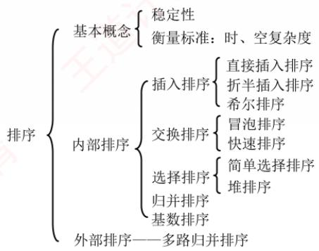

## 【复习提示】

堆排序、快速排序和归并排序是本章的重点与难点。读者应深入掌握各类算法的思想、排序过程（能动手模拟）及其特性，包括初始状态的影响、时空复杂度、稳定性和适用场景等。考试通常以选择题形式考查不同算法的对比。此外，应对常用排序算法的关键代码做到熟练编写，并能根据给定序列的特点，结合算法特性选择最合适的排序方法。

## 8.1 排序的基本概念

## 8.1.1 排序的定义

排序是指将表中的元素重新排列，使其按关键字有序的过程。在许多应用中，为了便于后续查找，通常会将表组织成有序形式。排序的确切定义如下。

输入：n个记录 $R _ { 1 } , R _ { 2 } , \cdots , R _ { n } ,$ 对应的关键字为 $k_{1},k_{2},\cdots,k_{n} 。$

输出：输入序列的一个重排 $R_{1}^{\prime},R_{2}^{\prime},\cdots,R_{n}^{\prime}$ ，使得 $k_{1}^{\prime} \leqslant k_{2}^{\prime} \leqslant \cdots \leqslant k_{n}^{\prime}$ (其中 $ \text{" } \leqslant  \text{" }$ 可根据需要替换为其他比较关系）。

算法的稳定性。若待排序表中有两个元素 $R _ { i }$ 和 $R _ { j }$ ，则其关键字相同 $\left( \mathrm{key}_{i} = \mathrm{key}_{j} \right)$ ，且排序前 $R _ { i }$ 位于 $R _ { j }$ 之前；若使用某一排序算法排序后， $R _ { i }$ 仍位于 $R _ { j }$ 之前，则称该排序算法是稳定的，否则，称为不稳定的。需要注意的是，稳定性并不能用来衡量算法的优劣，而只是描述其性质之一。当待排序关键字互不重复时，排序结果唯一，此时算法是否稳定就无关紧要了。

注意

对于不稳定的排序算法，只需举出一组关键字的实例，证明它的不稳定性即可。

在排序过程中，根据数据是否全部存放在内存中，可将排序算法分为两类：①内部排序，指排序期间所有元素都存放在内存中；②外部排序，指排序期间元素无法全部装入内存，需要在排序过程中频繁地在内、外存之间交换数据。

一般情况下，内部排序算法在执行过程中主要涉及两种基本操作：比较和移动。通过比较关键字的大小来确定元素的相对顺序，并通过移动元素使整个序列达到有序状态。当然，并非所有内部排序都基于比较操作一一例如，基数排序就是一种典型的非比较排序。

各类排序算法各有优缺点，适用于不同场景。通常可将排序算法分为五大类：插入排序、交换排序、选择排序、归并排序和基数排序，后续几节将分别介绍。内部排序算法的性能主要由其时间复杂度和空间复杂度决定，而时间复杂度通常取决于比较和移动操作的次数。

注意

大多数内部排序算法更适用于顺序存储的线性表。

## 8.1.2 本节试题精选

## 单项选择题

01. 下述排序算法中，不属于内部排序算法的是（）。A. 插入排序B. 选择排序 C. 拓扑排序 D. 冒泡排序

02. 排序算法的稳定性是指（）。A. 经过排序后，能使关键字相同的元素保持原顺序中的相对位置不变B. 经过排序后，能使关键字相同的元素保持原顺序中的绝对位置不变C.排序算法的性能与被排序元素个数关系不大D.排序算法的性能与被排序元素的个数关系密切

03.下列关于排序的叙述中，正确的是（）。 王A. 稳定的排序算法优于不稳定的排序算法B. 对同一线性表使用不同的排序算法进行排序，得到的排序结果可能不同C. 排序算法都是在顺序表上实现的，在链表上无法实现排序算法D. 在顺序表上实现的排序算法在链表上也可以实现

## 8.1.3 答案与解析

## 单项选择题

01. C

拓扑排序是将有向图中所有结点排成一个线性序列，虽然也是在内存中进行的，但它不属于

我们这里所提到的内部排序范畴，也不满足前面排序的定义。

## 02. A

注意，这里的绝对位置是指若在排序前元素R在位置i，则绝对位置就是i，即排序后R的位置不发生变化，显然选项B是不对的。选项C、D与题目要求无关。

## 03. B

算法的稳定性与算法优劣无关，选项A排除。使用链表也可以进行排序，只是有些排序算法不再适用，因为这时定位元素只能顺序逐链查找，如折半插入排序。

## 8.2 插入排序

插入排序是一种简单直观的排序算法，其基本思想是：每次将一个待排序的记录，按其关键字大小插入到前面已经排好序的子序列中，直到所有记录都插入完毕。基于这一思想，可以引申出三种重要的排序算法：直接插入排序、折半插入排序和希尔排序。

## 8.2.1 直接插入排序①

根据上述插入排序的思想，不难得出一种最简单也最直观的直接插入排序算法。假设在排序过程中，待排序表L「1...n1在某一时刻的状态如下： K NIT

<table><tr><td>有序序列L[1...i-1]</td><td>L (i)</td><td>无序序列L[i+1...n]</td></tr><tr><td></td><td></td><td></td></tr></table>

要将元素L(i)插入到已有序的子序列L[1...i-1]中，需执行以下操作（为避免混淆，下文中用L[]表示一个表，而用L（）表示一个元素）：

1）查找L(i)在L[1...i-1]中的插入位置k。

2）将L[k...i-1]中的所有元素依次后移一个位置。

3）将L(i)放入位置k。

为实现对整个表L[1...n]的排序，可从L(2)开始，依次将L(2)到L(n)插入其前面已排好序的子序列中。初始时，[11可视为一个长度为1的有序子序列。上述过程共执行n-1次，最终得到一个有序表。直接插入排序通常采用原地排序（空间复杂度为O(1)）。在从后往前的比较过程中，需要将已排序的元素逐个后移，为新元素腾出插入位置。

以下是直接插入排序的实现，其中再次使用了前面提到的“哨兵”（作用相同）。

$$
\begin{aligned}& void \ [  Inset \_  isset \_ [ [[[], ]\_ \_ \_ ] \_ ] \_ \\&\quad \{  int \_ ; ; ; \} \\&\quad\quad \{  for \ (  i=2;  i<=n; ; ; ++ ) \\&\quad\quad\quad \} \{ \&\ \& \& \& \& \& \& \& \& \& \& \& \& \& \& \& \& \& \& \& \& \& \& \& \& \& \& \& \& \& \& \& \& \& \& \& \& \& \& \& \& \& \& \& \& \& \& \& \& \& \& \& \& \& \& \& \& \& \& \& \& \& \& \& \& \& \& \& \& \& \& \& \& \& \& \& \& \& \& \& \& \& \& \& \& \& \& \& \& \& \& \& \& \& \& \& \& \& \& \& \& \& \& \& \& \& \& \& \& \& \& \& \& \& \& \& \& \& \& \& \& \& \& \& \& \& \& \& \& \& \& \& \& \& \& \& \& \& \& \& \& \& \& \& \& \& \& \& \& \& \& \& \& \& \& \& \& \& \& \& \& \& \& \& \& \& \& \& \& \& \& \& \& \& \& \& \& \& \& \& \& \& \& \& \& \& \& \& \& \& \& \& \& \& \& \& \& \& \& \& \& \& \& \& \& \& \& \& \& \& \& \& \& \& \& \& \& \& \& \& \& \& \& \& \& \& \& \& \& \& \& \& \& \& \& \& \& \& \& \& \& \& \& \& \& \& \& \& \& \& \& \& \& \& \& \& \& \& \& \& \& \& \& \& \& \& \& \& \& \& \& \& \& \& \& \& \& \& \& \& \& \& \& \& \& \& \& \& \& \& \& \& \& \& \& \& \& \& \& \& \& \& \& \& \& \& \& \& \& \& \& \& \& \& \& \& \& \& \& \& \& \& \& \& \& \& \& \& \& \& \& \& \& \& \& \& \& \& \& \& \& \& \& \& \& \& \& \& \& \& \& \& \& \& \& \& \& \& \& \& \& \& \& \& \& \& \& \& \& \& \& \& \& \& \& \& \& \& \& \& \& \& \& \& \& \& \& \& \& \& \& \& \& \& \& \& \& \& \& \& \& \& \& \& \& \& \& \& \& \& \& \& \& \& \& \& \& \& \& \& \& \& \& \& \& \& \& \& \& \& \& \& \& \& \& \& \& \& \& \& \& \& \& \& \& \& \& \& \& \& \& \& \& \& \& \& \& \& \& \& \& \& \& \& \& \& \& \& \& \&  \end{aligned}
$$

<!-- DIRECTED-REPAIR-FALLBACK:FALLBACK-408-CAND_a8262fb147305e93 -->
> [!WARNING]
> 原 PDF 第 345 页回退：直接插入排序完整函数代码结构损坏。；物理页345代码清晰但源块大面积乱码，不能安全逐字修补。

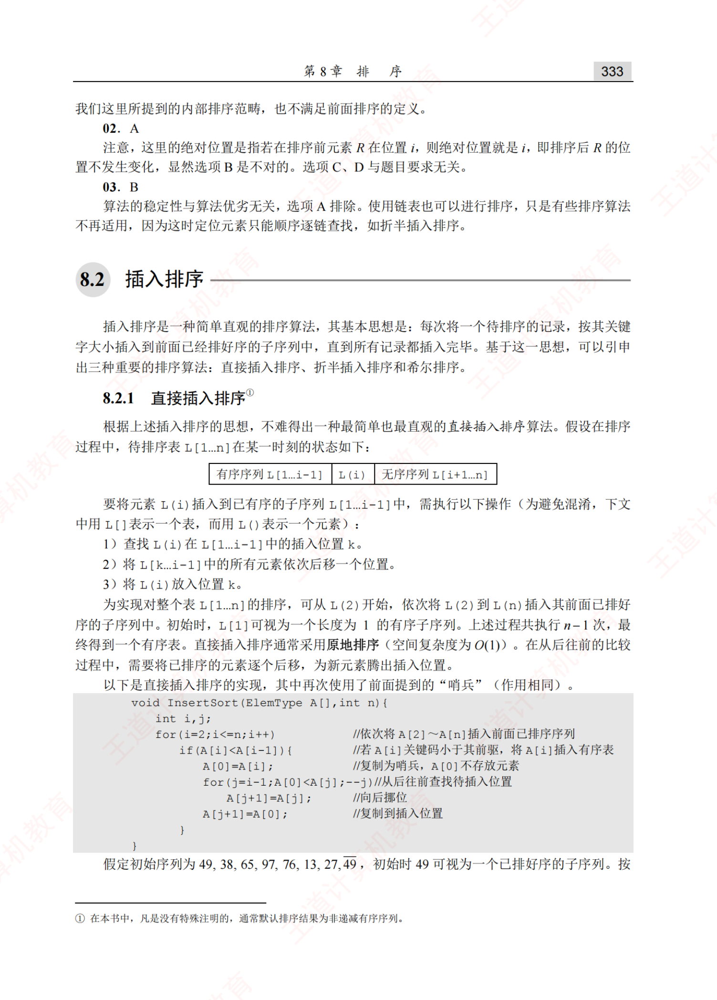

假定初始序列为49,38,65,97,76,13,27,49，初始时49可视为一个已排好序的子序列。按

照上述算法进行直接插入排序的过程如图8.1所示，括号内为当前已排好序的子序列。

<table><tr><td>[初始关键字]:</td><td></td><td>(49) V</td><td>38</td><td>65</td><td>97</td><td>76</td><td>13</td><td>27</td><td>49</td></tr><tr><td>i=2:</td><td>(38)</td><td>(38</td><td>49)</td><td>65 V</td><td>97</td><td>76</td><td>13</td><td>27</td><td>49</td></tr><tr><td>i=3:</td><td>(65)</td><td>(38</td><td>49</td><td>65)</td><td>97 V</td><td>76</td><td>13</td><td>27</td><td>49</td></tr><tr><td>i=4:</td><td>(97)</td><td>(38</td><td>49</td><td>65</td><td>97) V</td><td>76</td><td>13</td><td>27</td><td>49</td></tr><tr><td>i=5:</td><td>(76)</td><td>(38</td><td>49</td><td>65</td><td>76</td><td>97)</td><td>13</td><td>27</td><td>49</td></tr><tr><td>i=6:</td><td>(13)</td><td>(13 V</td><td>38 V</td><td>49</td><td>65</td><td>76</td><td>97)</td><td>27</td><td>49</td></tr><tr><td>育 i=7:</td><td>(27)</td><td>(13</td><td>27</td><td>38</td><td>49</td><td>65</td><td>76</td><td>97)</td><td>49</td></tr><tr><td>i=8：</td><td>(49)</td><td>(13</td><td>27</td><td>38</td><td>49</td><td>V 49</td><td>65</td><td>76</td><td>97)</td></tr><tr><td></td><td>监视哨L.R[0]</td><td></td><td></td><td></td><td></td><td></td><td></td><td></td><td></td></tr></table>

图8.1 直接插入排序示例

直接插入排序的性能分析如下。

空间效率：仅使用常数个辅助单元，空间复杂度为O(1)。

时间效率：整个排序过程共进行n-1趟插入操作，每趟包括关键字比较和元素移动，具体次数取决于初始序列的状态。最好情况下，表中元素已有序。每插入一个元素只需一次比较，无须移动，时间复杂度为 $O ( n )$ 。最坏情况下，表中元素完全逆序。此时每趟插入需比较i-1次并移动i-1个元素，总时间复杂度为 $O ( n ^ { 2 } )$ 。平均情况下，假设元素随机排列，平均比较次数和移动次数均约为 $n ^ { 2 } / 4$ ，故时间复杂度仍为 $O ( n ^ { 2 } )$ 。因此直接插入排序算法的时间复杂度为 $O ( n ^ { 2 } )$ 0

稳定性：由于插入时总是从后往前比较，并在找到插入位置后才移动元素，因此相同关键字的元素相对顺序不会改变。直接插入排序是稳定的排序算法。

适用性：该算法适用于顺序存储和链式存储的线性表，采用链式存储时无须移动元素。

## 8.2.2 折半插入排序

从直接插入排序算法可以看出，每趟插入过程包含两项操作：①在前面的有序子表中查找待插入元素的正确位置：②为该位置腾出空间，并将待插入元素放入其中。在直接插入排序中，总是边比较边移动元素。而折半插入排序则将二者分离：先通过折半查找确定插入位置，再统一移动元素。当排序表采用顺序存储时，可以在查找有序子表时使用折半查找来提高效率。一旦确定了插入位置，便可将该位置及其后的所有元素统一后移一位，从而空出插入位置。

折半插入排序的排序过程示例见本书配套视频，其代码实现如下：

void BInsertSort(ElemType A[],int n) {   
int i,j,low,high,mid;   
for(i=2;i<=n;i++) { ∥/依次将A[2]～A[n]插入前面的已排序序列   
A[0]=A[i]; //将A[i]暂存到A[0]   
low=1;high=i-1; //设置折半查找的范围   
while(low<=high) { //折半查找(默认递增有序)   
mid=(1ow+high) /2; //取中间点   
if(A[mid]>A[0]) high=mid-1；//查找左半子表   
else low=mid+1; //查找右半子表   
for(j=i-1;j>=high+1;--j)   
A[j+1]=A[j]; //统一后移元素，空出插入位置   
A[high+1]=A[0]; //插入操作   
道

考点追踪直接插入排序和折半插入排序的比較（2012）

空间效率：与直接插入排序相同，仅使用常数个辅助单元，空间复杂度为 $O ( 1 )$ o

时间效率：折半插入排序的主要改进在于减少了关键字的比较次数。由于采用折半查找，比较次数约为O(nlogn)，仅取决于元素个数n。然而，元素的移动次数并未减少，仍然依赖于初始序列的有序程度。因此，折半插入排序的时间复杂度仍为 $O ( n ^ { 2 } )$ o

稳定性：在插入过程中保持了相同关键字元素的相对顺序，因此是稳定的排序算法。

适用性：该算法仅适用于顺序存储的线性表。

## 8.2.3 希尔排序

由前文分析可知，直接插入排序的时间复杂度为 $O ( n ^ { 2 } )$ ，但在待排序列接近正序时，其时间效率可提升至 $O ( n )$ 。因此，该算法更适用于基本有序或数据量较小的排序场景。希尔排序正是基于这一特性对直接插入排序进行改进，也称为缩小增量排序。 X

考点追踪希尔排序的特性与分析（2014、2015、2018、2025）

希尔排序的基本思想是：通过逐步缩小增量的方式，对表中相隔一定距离的元素构成的子序列进行多次直接插入排序，使整个表逐渐趋于基本有序，最终通过一趟完整的直接插入排序完成全局排序。具体而言，算法首先选取一个小于n的初始增量 $d _ { 1 }$ ，将待排序表划分为 $d _ { 1 }$ 个子序列（每个子序列包含下标间隔为 $d _ { 1 }$ 的记录），并对各子序列分别进行直接插入排序；随后依次取更小的增量 $d _ { 2 } , d _ { 3 } , \cdots$ (满足 $d_{1} > d_{2} > \cdots > d_{t} = 1$ ，重复分组与排序操作。当增量减至1时，所有记录属于同一子序列，且序列已高度有序，此时执行最后一趟直接插入排序，即可快速获得最终结果。

注意，目前尚未找到理论上最优的增量序列。仍以8.2.1节的关键字为例，假定第一趟取 $d _ { 1 }   =   5$ 形成5个子序列（对应图中第2至第6行），排序后结果如第7行所示；第二趟取 $d _ { 2 }   =   3$ ，对3个子序列排序，结果见第11行：最后对整个序列进行一趟排序，完整过程如图8.2所示。

  
图 8.2 希尔排序示例

希尔排序的算法实现如下：

void ShellSort(ElemType A[],int n){

//A[0]只是暂存单元，不是哨兵，当 $j < = 0$ 时，插入位置已到int dk,i,j;

$$
\begin{aligned}& for   (\text{dk=n/2;dk>=1;dk=dk/2}) \quad // 增量变化  ( 无统一规定 ) \\& \quad  for   (\text{dk=dk+1;i<=n;+1}) \\& \quad \text { i f } (\text{h[ i <=0;i<=k;)}) \quad // 需将  h[ i ] 插入有序增量子表 \\& \quad \text { h[ 0]=h[ i ] ; } \quad // 借存在  \text{h[ 0] } \\& \quad  for   (j=i-dk;j>0;6 线 [ 0]<h[ j ; j==dk ) \\& \quad \text { h[ j+dk]=h[ j ] ; } \quad // 汇录后移 ,  查找插入的位置  \\& \quad \text { h[ j+dk]=h[ 0] ; } \quad // 插入  \\& \quad ) \end{aligned}
$$

希尔排序算法的性能分析如下：

空间效率：仅使用常数个辅助单元，空间复杂度为O(1)。

时间效率：时间复杂度依赖于所选增量序列，而最优增量序列仍是数学上的未解难题，因此精确分析较为困难。当n在常见范围内时，时间复杂度约为 $O ( n ^ { 1 . 3 } )$ ；最坏情况下退化为 $O ( n ^ { 2 } )$ 0

稳定性：当相同关键字的记录被划分到不同子表时，可能会改变它们的相对次序，因此希尔排序是不稳定的排序算法。例如，图8.2中49与49在排序过程中相对顺序发生了变化。

适用性：希尔排序仅适用于顺序存储的线性表。

## 8.2.4 本节试题精选

## 一、单项选择题

01. 对5个不同的数据元素进行直接插入排序，最多需要进行的比较次数是（）。注意，哨兵的比较不计入次数。A. 8 B. 10 C. 15 D. 25

02. 在待排序的元素序列基本有序的前提下，效率最高的排序算法是（）。A. 直接插入排序 B. 简单选择排序 C. 快速排序 D. 归并排序

03. 对有n个元素的顺序表采用直接插入排序算法进行排序，在最坏情况下所需的比较次数是（），在最好情况下所需的比较次数是（）。A. n-1 B. n + 1 C. n/2 D. n(n−1)/2

04. 数据序列{8,10,13,4,6,7,22,2,3}只能是（）两趟排序后的结果。A. 简单选择排序B. 冒泡排序 C. 直接插入排序 D. 堆排序

05. 用直接插入排序算法对下列4个表进行（从小到大）排序，比较次数最少的是（）。A. 94, 32, 40, 90, 80, 46, 21, 69 B. 21, 32, 46, 40, 80, 69, 90, 94 机C. 32, 40, 21, 46, 69, 94, 90, 80 D. 90, 69, 80, 46, 21, 32, 94, 40

06.在下列算法中，（）算法可能出现下列情况：在最后一趟开始之前，所有元素都不在最终位置上。A. 堆排序 B. 冒泡排序 C. 直接插入排序 D. 快速排序

07. 希尔排序属于（）。A. 插入排序 B. 交换排序 C. 选择排序 D. 归并排序

08. 对序列{15,9,7,8,20,-1,4}采用希尔排序，经一趟后序列变为{15,-1,4,8,20,9,7}，则该次采用的增量是（）。A. 1 B. 4 C. 3 D. 2

09. 若序列{15,9,7,8,20,-1,4}经一趟排序后变成{9,15,7,8,20,-1,4}，则采用的是（)方法。A. 选择排序 B. 快速排序 C. 直接插入排序 D. 冒泡排序

10. 对序列{98,36,-9,0,47,23,1,8,10,7}采用希尔排序，下列序列（）是增量为4的一趟排序结果。A. {10, 7, −9, 0, 47, 23, 1, 8, 98, 36} B. {−9, 0, 36, 98, 1, 8, 23, 47, 7, 10 }C. {36, 98, −9, 0, 23, 47, 1, 8, 7, 10} D. 以上都不对

11. 对序列{E, A, S, Y, Q, U, E, S, T, I, O,N}按照字典顺序排序，采用增量 d = 6, 3, 1 的希尔排序算法。则前两趟排序后，关键字的总比较次数为（）。A. 15 B. 17 C. 16 D. 18

12. 已知输入序列{13,24,7,1,8,9,11,56,34,51,2,77,5}，增量序列 d= 5,3,1，采用希尔排序算法进行排序，则两趟排序后的结果为（）。A. 1, 7, 8, 9, 13, 24, 11, 34, 51, 2, 5, 56, 77B. 1, 7, 5, 2, 8, 9, 24, 11, 34, 51, 13, 77, 56 首计算机教育C. 2, 11, 5, 1, 8, 9, 24, 7, 34, 51, 13, 77, 56D. 2, 5, 11, 1, 8, 9, 7, 24, 34, 13, 51, 77, 56

13. 折半插入排序算法的时间复杂度为（）。A. O(n) B. O(nlog₂n) C. $O ( n ^ { 2 } )$ D. $O ( n ^ { 3 } )$

14.有些排序算法在每趟排序过程中，都会有一个元素被放置到其最终位置上，（）算法不一定会出现此种情况。A. 希尔排序 B. 堆排序 C. 冒泡排序 D. 快速排序

15. 以下排序算法中，不稳定的是（）。A. 冒泡排序 B. 直接插入排序C. 希尔排序 D. 归并排序

16. 以下排序算法中，稳定的是（）。A. 快速排序 B. 堆排序 C. 直接插入排序 D. 简单选择排序

17.【2012统考真题】对同一待排序序列分别进行折半插入排序和直接插入排序，两者之间可能的不同之处是（）。A. 排序的总趟数 B. 元素的移动次数C. 使用辅助空间的数量 D. 元素之间的比较次数

18.【2014统考真题】用希尔排序算法对一个数据序列进行排序时，若第一趟排序结果为9,1,4,13,7,8,20,23,15，则该趟排序采用的增量（间隔）可能是（）。A. 2 K B. 3 C. 4 D. 5

19.【2015统考真题】希尔排序的组内排序采用的是（）。A.直接插入排序 B. 折半插入排序C. 快速排序 D.归并排序

20.【2018统考真题】对初始数据序列(8,3,9,11,2,1,4,7,5,10,6)进行希尔排序。若第一趟排序结果为(1,3,7,5,2,6,4,9,11,10,8)，第二趟排序结果为(1,2,6,4,3,7,5,8,11,10,9)，则两趟排序采用的增量（间隔）依次是（）。A. 3, 1 B. 3,2 C. 5,2 D. 5, 3

## 二、综合应用题

01. 给出关键字序列{4,5,1,2,6,3}的直接插入排序过程。

02. 给出关键字序列{50,26,38,80,70,90,8,30,40,20}的希尔排序过程（取增量序列为 $d   =$ {5,3,1}，排序结果为从小到大排列）。

## 8.2.5 答案与解析

## 一、单项选择题

## 01. B

直接插入排序在最坏的情况下要做n(n-1)/2次关键字的比较，当n=5时，关键字的比较次数为10。注意不考虑与哨兵的比较。

## 02. A

序列初始基本有序，因此使用直接插入排序算法的时间复杂度接近O(n)，而使用其他算法的时间复杂度均大于 O(n)。

## 03. D、A

待排序表为反序时，直接插入排序需要进行 n(n-1)/2次比较(从前往后依次需要比较1,2,…，n-1次）；待排序表为正序时，只需进行n-1次比较。注意本题不考虑与哨兵的比较。

## 04. C

冒泡排序和选择排序经过两趟排序后，应该有两个最大（或最小）元素放在其最终位置；插入排序经过两趟排序后，前三个元素应该是局部有序的。只可能是插入排序。

## 注意

在排序过程中，每趟都能确定一个元素在其最终位置的有冒泡排序、简单选择排序、堆排序、快速排序，其中前三者能形成全局有序的子序列，后者能确定枢轴元素的最终位置。

## 05. B

越接近正序的序列，直接插入排序的比较次数就越少。选项B和C是比较接近正序的，然后分别判断两个序列的比较次数，以选项B为例：第一趟，插入32，比较1次；第二趟，插入46，比较1次；第三趟，插入40，因为40比46小但比32大，所以比较2次；第四趟，插入80，比较1次；第五趟，插入69，比较2次；以此类推，共比较9次。同理求出选项C的比较次数为11次。所以选择选项B。

## 06. C

在直接插入排序中，若待排序列中的最后一个元素应插入表中的第一个位置，则前面的有序子序列中的所有元素都不在最终位置上。

## 07. A

希尔排序是对直接插入排序算法改进后提出来的，本质上仍属于插入排序的范畴。

## 08. B

希尔排序将序列分成若干组，记录只在组内进行交换。由观察可知，经过一趟后9和-1交换，7和4交换，可知增量为4。 X

## 09. C

前两个元素已经局部有序，很明显一趟直接插入排序算法有效。再排除其他算法即可。

## 10. A

增量为4意味着所有相距为4的记录构成一组，然后在组内进行直接插入排序，经观察，只有选项A满足要求。

## 11. B

第一趟：EE为一组，比较；AS为一组，比较；ST为一组，比较；YI为一组，比较后交换；QO为一组，比较后交换；UN为一组，比较后交换，结果为EASIONESTYQU。第二趟：EIEY为一组，用直接插入排序需要依次比较I和E、E和I、E和E、Y和I；AOSQ为一组，依次比较O和A、S

和O、Q和S、Q和O；SNTU为一组，依次比较N和S、T和S、U和T。第一趟比较次数为6，第二趟比较次数为11，总比较次数为17。

## 12. B

第一趟增量d=5，第一趟排序后，结果为2,11,5,1,8,9,24,7,34,51,13,77,56。第二趟增量d=3，第二趟排序后，结果为1,7,5,2,8,9,24,11,34,51,13,77,56。

## 13. C

虽然折半插入排序是对直接插入排序的改进，但它改进的只是比较的次数，而移动次数未发生变化，时间复杂度仍为O(n²)1

## 14. A

因为希尔排序是基于插入排序算法提出的，所以它不一定在每趟排序过程后将某一元素放置到最终位置上。

## 15. C

希尔排序是一种复杂的插入排序算法，它是一种不稳定的排序算法。

## 16. C

基于插入、交换、选择的三类排序算法中，通常简单方法是稳定的（直接插入、折半插入、冒泡），但有一个例外就是简单选择，复杂方法都是不稳定的（希尔排序、快速排序、堆排序）。

## 17. D

折半插入排序与直接插入排序都将待插入元素插入前面的有序子表，区别是：确定当前记录在前面有序子表中的位置时，直接插入排序采用顺序查找法，而折半插入排序采用折半查找法。排序的总趟数取决于元素个数n，两者都是n-1趟。元素的移动次数都取决于初始序列，两者相同。使用辅助空间的数量也都是O(1)。折半插入排序的比较次数与序列初态无关，时间复杂度为O(nlog2n)；而直接插入排序的比较次数与序列初态有关，时间复杂度为O(n)～O(n²)。

## 18. B

首先，第二个元素为1，是整个序列中的最小元素，可知该希尔排序为从小到大排序。然后考虑增量问题，若增量为2，则第1+2个元素4明显比第1个元素9要小，排除选项A。若增量为3，则第ii+3,i+6（i=1,2,3）个元素都为有序序列，符合希尔排序的特点。若增量为4，则第1个元素9比第1±4个元素7要大，排除选项C。若增量为5，则第1个元素9比第1±5个元素8要大，排除选项D。

## 19. A

希尔排序的思想是：先将待排元素序列分割成若于子序列（由相隔某个“增量”的元素组成），分别进行直接插入排序，然后依次缩减增量再进行排序，待整个序列中的元素基本有序（增量足够小）时，再对全体元素进行一次直接插入排序。

## 20. D

如下图所示。

初始序列： 8, 3, 9, 11,2, 1, 4,7, 5, 10, 6


第一趟分组：8,1,6；3,4；9,7；11,5；2,10；间隔为5，排序后组内递增。  
第二趟分组：1,5,4,10；3,2,9,8；7,6,11；间隔为3，排序后组内递增。  
因此，选择选项D。

## 二、综合应用题

## 01. 【解答】

直接插入排序过程如下。

<table><tr><td>初始序列：</td><td>4,5, 1, 2, 6, 3</td><td></td></tr><tr><td>第一趟：</td><td>4, 5, 1, 2, 6, 3</td><td>(将5插入{4})</td></tr><tr><td>第二趟：</td><td>1,4,5, 2, 6,3</td><td>(将1插入{4,5})</td></tr><tr><td>第三趟：</td><td>1,2,4, 5, 6, 3</td><td>(将2插入{1,4,5})</td></tr><tr><td>第四趟：</td><td>1,2,4, 5, 6, 3</td><td>(将6插入{1,2,4,5})</td></tr><tr><td>第五趟：</td><td>1,2,3, 4,5,6</td><td>(将3插入{1,2,4,5,6})</td></tr></table>

## 02. 【解答】

原始序列：第一趟（增量5）：第二趟（增量3）：第三趟（增量1）：

## 8.3 交换排序

所谓交换，是指根据序列中两个元素关键字的比较结果，互换它们在序列中的位置。基于交换思想的排序算法有很多，本书主要介绍冒泡排序与快速排序。其中，冒泡排序实现简单，一般较少直接考查；而快速排序则因效率高、应用广，通常是考查的重点。

## 8.3.1 冒泡排序

冒泡排序的基本思想是：从后往前（或从前往后）依次比较相邻元素的关键字，若为逆序（A「i-11>A「i1），则交换它们的位置。每一趟排序都会将当前未排序部分中的最小（或最大）元素放到其最终位置一一最小元素如气泡上浮至水面（或最大元素如石头下沉至水底）。具体而言，第一趟冒泡将最小元素移至序列首部（或最大元素移至尾部）；第二趟对剩余子序列重复此过程，已确定位置的元素不再参与比较。如此最多进行n-1趟冒泡，即可完成整个排序。

图8.3所示为冒泡排序的过程，第一趟冒泡时：27<49，不交换；13<27，不交换；76>13，交换；97>13，交换；65>13，交换；38>13，交换；49>13，交换。通过第一趟冒泡后，元素13被移至第一个位置，及其最终位置；第二趟对后续子序列采用同样方法进行排序，如此重复，到第五趟结束后，未发生任何交换，说明序列已有序，算法提前终止。

冒泡排序算法的代码如下：

void BubbleSort(ElemType A[],int n){  
for(int i=0;i<n-1;i++) {  
bool flaq=false; //表示本趟冒泡是否发生交换的标志  
for(int j=n-1;j>i;j--) //一趟冒泡过程  
if(A[j-1]>A[j]){ //若为逆序  
swap(A[j-1],A[j]); //使用封装的 swap 函数①交换  
flag=true;  
}  
if(flag==false)  
return; //本趟遍历后没有发生交换，说明表已经有序  
算机

  
图 8.3 冒泡排序示例

冒泡排序的性能分析如下。

空间效率：仅使用常数个辅助单元，空间复杂度为O(1)。

时间效率：最好情况下（初始序列有序），仅需第一趟冒泡，共n-1次比较，0次移动，时间复杂度为O(n)；最坏情况下（序列初始逆序），需n-1趟排序，第i趟进行n-i次比较，且每次比较后都需3次移动来完成交换元素位置。这种情况下，

总比较次数 $\sum_{i = 1}^{n - 1}(n - i) = \frac{n(n - 1)}{2}$ ，移动次数 $\sum_{i = 1}^{n - 1}3(n - i) = \frac{3n(n - 1)}{2}$

因此，最坏情况下的时间复杂度为 $O ( n ^ { 2 } )$ 。平均时间复杂度也为 $O ( n ^ { 2 } )$

稳定性：比较相邻元素时，相等元素不会被交换，因此冒泡排序是稳定的排序算法。

适用性：冒泡排序适用于顺序存储和链式存储的线性表。

注意

冒泡排序每趟产生的有序子序列具有全局有序性一一已排序部分的所有元素均小于（或大于）未排序部分的所有元素。与直接插入排序的局部有序不同，冒泡排序每趟能将一个元素精确放置到其最终位置

## 8.3.2 快速排序

## 考点追踪快速排序的思想（2024）

快速排序的基本思想是：在待排序表L[1...n]中任取一个元素作为枢轴（pivot，也称基准，通常取首元素），通过一趟排序将原表划分为两个独立的子表L「1...k-11和L[k+1...n1，使得左子表中所有元素的关键字均小于枢轴，右子表中所有元素的关键字均大于或等于枢轴。此时，枢轴元素被放在了其最终位置工（k）上，这个过程称为一次划分。随后，分别对两个子表递归地执行相同的划分操作，直至每个子表仅包含一个元素或为空，此时整个序列已完全有序。

一趟快速排序的划分过程本质上是一个双向交替扫描与元素移动的过程，下面通过实例来介绍，附设两个指针i和j，初值分别为low和 high，取第一个元素49为枢轴pivot。

j从右向左扫描，找到第一个小于枢轴的元素27，将其复制到i所指位置。


i 从左向右扫描，找到第一个大于枢轴的元素65，将其复制到j所指位置。

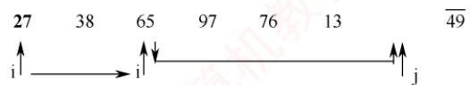

j继续向左扫描，找到小于枢轴的元素13，将其复制到i所指位置。


i继续向右扫描，找到大于枢轴的元素97，将其复制到j所指位置。


如此交替进行，直到i与j相遇（i==j）。


考点追踪快速排序的中间过程的分析（2014、2019、2023）

此时，i左侧的所有元素均小于49，右侧的所有元素均大于或等于49。将枢轴49放入i所指位置，即完成第一趟划分。原序列被分割为两个子序列，分别位于枢轴的左右两侧。

第一趟后： {27 38 13} 49 {76 97 65 49}

接下来，对这两个子序列分别递归地应用同样的快速排序过程。若某子序列仅包含一个元素，则该子序列自然有序，无须进一步处理。

第二趟后： {13} 27 {38} 49 {49 65} {97}

第三趟后： 13 2738 49 49 {65} 76 97

第四趟后： 13 27 38 49 49 65 76 97

整个递归调用的层次结构可以用一棵二叉树来表示，如图8.4所示。

第一层快排处理后：

第二层快排要处理的部分：


第一层快排处理后：

第二层快排处理后：

第三层快排要处理的部分：


(a)第一层快排处理后

(b)第二层快排处理后

第一层快排处理后：

第一层快排处理后：

第二层快排处理后：

第二层快排处理后：

第四层快排要处理的部分：

第四层快排处理后：

(c)第三层快排处理后

(d)第四层快排处理后：最终结果

图8.4 快速排序的递归执行过程

假设划分操作已封装为函数Partition()，其功能是对子表A[low...high]进行一趟划分，并返回枢轴元素的最终位置k。在此基础上，快速排序的递归实现如下：

```c
void QuickSort(ElemType A[],int low,int high) {
if(low<high) { //递归跳出的条件
//Partition()就是划分操作，将表A[low…high]划分为满足上述条件的两个子表
int pivotpos=Partition(A,low,high); //划分
QuickSort(A,low,pivotpos-1);//依次对两个子表进行递归排序
QuickSort (A,pivotpos+1,high) ;
```

## 考点追踪（算法题）快速排序中划分操作的应用（2016）

考研所考查的划分操作，通常以子表的第一个元素作为枢轴来对表进行划分，将比枢轴小的元素逐步移至左侧，比枢轴大的元素移至右侧，最终使枢轴归位。典型实现如下：

int Partition(ElemType A[],int low,int high){ ∥—趟划分  
ElemType pivot=A[low]； //将当前表中第一个元素设为枢轴，对表进行划分  
while(low<high){ //循环跳出条件  
while(low<high&&A[high]>=pivot) --high;  
A[low]=A[highl；//将比枢轴小的元素移动到左端  
while(low<high&&A[low]<=pivot) ++low;  
A[high]=A[low]； //将比枢轴大的元素移动到右端  
A[low]=pivot; //枢轴元素存放到最终位置  
return low; //返回存放枢轴的最终位置  
}

快速排序的性能高度依赖于划分的平衡性，其性能分析如下。

## 考点追踪快速排序中递归次数的影响因素分析（2010）

空间效率：由于采用递归实现，算法需借助系统栈保存每层递归的上下文信息，栈的容量等于递归调用的最大层数。最好情况下（每次划分均分）为O(log2n)；最坏情况下（划分极不平衡），需进行 n−1 次递归调用，栈的容量为 O(n)；平均情况下为 O(log2n)。

时间效率：最坏情况发生在初始序列基本有序或基本逆序时，每趟划分仅减少一个元素，总比较次数约为n(n-1)/2，时间复杂度为 $O ( n ^ { 2 } )$ 。最好情况是每次划分都将序列等分为两部分，此时时间复杂度为O(nlog₂n)。值得注意的是，快速排序的平均运行时间非常接近其最优情况，远优于最坏情况，因此它是所有内部排序算法中平均性能最优的排序方法。

有很多方法可以提高划分的平衡性：一种是三数取中法，从子序列的首、尾及中间三个位置各取一个元素，以其中位数作为枢轴；或者随机选取子序列中的某个元素作为枢轴。

稳定性：在划分过程中，若右侧区域有两个关键字相等，且均小于枢轴，则交换到左侧区域后，它们的相对位置会发生改变，因此快速排序是不稳定的排序算法。例如，表L={3,2,2}，经过一趟排序后L={2,2,3}，也是最终排序结果，显然，2与2的相对次序已发生了变化。

## 考点追踪快速排序适合采用的存储方式（2011）

适用性：快速排序要求能够随机访问元素，因此仅适用于顺序存储的线性表。

## 注意

快速排序在每趟划分后并不产生全局有序的子序列。然而，每趟划分都能确保当前所选的枢轴元素被精确放置到其在整个序列中的最终位置上。这一特性是快速排序高效性的关键所在。

## 8.3.3 本节试题精选

## 一、单项选择题

01. 对n个不同的元素利用冒泡法从小到大排序，在（）情况下元素交换的次数最多。A. 从大到小排列好的 B. 从小到大排列好的王道C. 元素无序 D. 元素基本有序

02. 若用冒泡排序算法对序列{10,14,26,29,41,52}从大到小排序，则需进行（）次比较。A. 3 B. 10 C. 15 D. 25

03. 用某种排序算法对线性表{25,84,21,47,15,27,68,35,20}进行排序时，元素序列的变化情况如下：1)25, 84, 21, 47, 15, 27, 68, 35, 202)20, 15, 21, 25, 47, 27, 68, 35, 84 王道计算机教3)15, 20, 21, 25, 35, 27, 47, 68, 844)15, 20, 21, 25, 27, 35, 47, 68, 84则所采用的排序算法是（）。A. 选择排序 B. 插入排序 C. 2 路归并排序 D. 快速排序

04. 一组记录的关键码为(46,79,56,38,40,84)，则利用快速排序算法，以第一个记录为基准，从小到大得到的一次划分结果为（）。A. (38, 40, 46, 56, 79, 84) B. (40, 38, 46, 79, 56, 84)C. (40, 38, 46, 56, 79, 84) D. (40, 38, 46, 84, 56, 79)

05. 快速排序算法在（）情况下最不利于发挥其长处。A. 要排序的数据量太大 B. 要排序的数据中含有多个相同值C. 要排序的数据个数为奇数 D. 要排序的数据已基本有序

06. 就平均性能而言，目前最好的内部排序算法是（）。A. 冒泡排序 B. 直接插入排序C. 希尔排序 D. 快速排序

07. 数据序列F= {2,1,4,9,8,10,6,20}只能是下列排序算法中的（）两趟排序后的结果。A. 快速排序B. 冒泡排序 C. 选择排序 D. 插入排序N

08. 对元素序列{8,9,10,4,5,6,20,1,2}采用冒泡排序（从后往前次序进行，要求升序），需要进行元素交换的趟数至少是（）（不考虑无元素交换的最后一趟）。A. 3 B. 4 C. 5 D. 8

09. 双向冒泡排序是指对一个序列在正反两个方向交替进行扫描，第一趟把最大值放在序列的最右端，第二趟把最小值放在序列的最左端，之后在缩小的范围内进行同样的扫描，放在次右端、次左端，直至序列有序。对数组{4,7,8,3,5,6,10,9,1,2}进行双向冒泡排序，则排序趟数是（）。（第一趟从左往右开始，从左往右或从右往左都称为一趟。）A. 7 B. 6 C. 8 D. 9

10. 对下列关键字序列用快速排序进行排序时，每次选取的基准元素都为待处理序列的第一个元素，速度最快的情形是（），速度最慢的情形是（）。A. {21, 25, 5, 17, 9, 23, 30} B. {25, 23, 30, 17, 21, 5, 9}C. {21, 9, 17, 30, 25, 23, 5} 算 D. {5, 9, 17, 21, 23, 25, 30}

11. 对下列4个序列，以第一个关键字为基准用快速排序算法进行排序，在第一趟过程中移动记录次数最多的是（）。）

A. 92, 96, 88, 42, 30, 35, 110, 100 B. 92, 96, 100, 110, 42, 35, 30, 88   
C. 100, 96, 92, 35, 30, 110, 88, 42 D. 42, 30, 35, 92, 100, 96, 88, 110

12. 下列序列中，（）可能是执行第一趟快速排序后所得到的序列（按从大到小排序和从小到大排序来分别讨论）。I. {68, 11, 18, 69, 23, 93, 73 } 王道计 II. {68, 11, 69, 23, 18, 93, 73}III. {93, 73, 68, 11, 69, 23, 18} IV. {68, 11, 69, 23, 18, 73, 93}A. I、IV B. II、III C. III、IV D. 只有 IV

13. 对n个关键字进行快速排序，最大递归深度为（），最小递归深度约为（）。A. 1 K B. n C. log2n D. nlog2n xX

14. 对8个元素的序列进行快速排序，在最好情况下的关键字比较次数是（）。A. 7N B. 8 C. 12 D. 13

15.【2010统考真题】采用递归方式对顺序表进行快速排序。下列关于递归次数的叙述中，正确的是（）。A.递归次数与初始数据的排列次序无关 王道计B. 每次划分后，先处理较长的分区可以减少递归次数C. 每次划分后，先处理较短的分区可以减少递归次数D. 递归次数与每次划分后得到的分区的处理顺序无关

16.【2011统考真题】为实现快速排序算法，待排序序列宜采用的存储方式是（）。A. 顺序存储 B. 散列存储 C. 链式存储 D. 索引存储

17.【2014统考真题】下列选项中，不可能是快速排序第二趟排序结果的是（）。A. 2, 3, 5, 4, 6, 7, 9 C. 3,2, 5,4, 7, 6,9 专计 B. 2, 7, 5, 6, 4, 3, 9 D. 4, 2, 3, 5, 7, 6,9

18. 【2019统考真题】排序过程中，对尚未确定最终位置的所有元素进行一遍处理称为一趟。下列序列中，不可能是快速排序第二趟结果的是（）。A. 5, 2, 16, 12, 28, 60, 32, 72 B. 2, 16, 5, 28, 12, 60, 32, 72C. 2, 12, 16, 5, 28, 32, 72, 60 D. 5, 2, 12, 28, 16, 32, 72, 60 XTA

19.【2023统考真题】使用快速排序算法对数据进行升序排序，若经过一次划分后得到的数据序列是68,11,70,23,80,77,48,81,93,88，则该次划分的枢轴是（）。A. 11K B. 70 C. 80 D. 81

20.【2024统考真题】使用快速排序算法对含n（n≥3）个元素的数组M进行排序，若第一趟排序将M中除枢轴外的n-1个元素划分为均不为空的P和Q两块，则下列叙述中，正确的是（）。A. P 与 Q 块间有序 B. P 与 Q 均块内有序C. P和O的元素个数大致相等 D. P 中和 Q 中均不存在相等的元素

## 二、综合应用题

01.已知线性表按顺序存储，且每个元素都是不相同的整数型元素，设计把所有奇数移动到所有偶数前边的算法（要求时间最短，辅助空间最小）。

02. 试编写一个算法，使之能够在数组L[1...n]中找出第k小的元素（从小到大排序后处于第k个位置的元素）。

03.荷兰国旗问题：设有一个仅由红、白、蓝三种颜色的条块组成的条块序列，存储在

一个顺序表中，请编写一个时间复杂度为 $\mathcal { O } ( n )$ 的算法，使得这些条块按红、白、蓝的顺序排好，即排成荷兰国旗图案。请完成算法实现：

typedef enum{RED, WHITE, BLUE} color; //设置枚举数组   
void Flag_Arrange(color a[],int n) {  }

04.【2016统考真题】已知由 $n (n \geqslant 2)$ 个正整数构成的集合 $A = \{ a_{k} | 0 \leqslant k < n \}$ ，将其划分为两个不相交的子集 $A _ { 1 }$ 和 $A_{2};$ 元素个数分别是 $n _ { 1 }$ 和 $n _ { 2 }$ $A _ { 1 }$ 和 $A _ { 2 }$ 中的元素之和分别为 $S _ { 1 }$ 和 $S _ { 2 }$ 。设计一个尽可能高效的划分算法，满足 $| n _ { 1 }   -   n _ { 2 } |$ 最小且 $| S _ { 1 }   -   S _ { 2 } |$ 最大。要求：

1）给出算法的基本设计思想。

2）根据设计思想，采用C或C++语言描述算法，关键之处给出注释。

3）说明所设计算法的平均时间复杂度和空间复杂度。

## 8.3.4 答案与解析

## 一、单项选择题

## 01. A

冒泡排序最少进行1趟冒泡，最多进行n-1趟冒泡。初始序列为逆序时，需进行n-1趟冒泡，并且元素交换的次数最多。初始序列为正序时，进行1趟冒泡（无交换）就可结束算法。

## 02. C

冒泡排序始终在调整“逆序”，因此交换次数为排列中逆序的个数。对逆序序列进行冒泡排序，每个元素向后调整时都需要进行比较，因此共需要比较 $5+4+3+2+1=15$ 次。

## 03. D

选择排序在每趟结束后可以确定一个元素的最终位置，不对。插入排序，第i趟后前i+1个元素应该是有序的，不对。第二趟{20,15}和{21,25}是反序的，因此不是归并排序。快速排序每趟都将基准元素放在其最终位置，然后以它为基准将序列划分为两个子序列。观察题中的排序过程，可知是快速排序。

## 04. C

以46为基准元素，首先从后往前扫描比46小的元素，并与之进行交换，而后从前往后扫描比46大的元素并将46与该元素交换，得到(40.46.56.38.79.84)。此后，继续重复从后往前扫描与从前往后扫描的操作，直到46处于最终位置。

## 05. D

当待排序数据为基本有序时，每次选取第n个元素为基准，会导致划分区间分配不均匀，不利于发挥快速排序算法的优势。相反，当待排序数据分布较为随机时，基准元素能将序列划分为两个长度大致相等的序列，这时才能发挥快速排序的优势。

## 06. D

这里问的是平均性能，选项A、B的平均性能都会达到 $O ( n ^ { 2 } )$ ，而希尔排序虽然大大降低了直接插入排序的时间复杂度，但其平均性能不如快速排序。另外，虽然众多排序算法的平均时间复杂度也是O(nlog₂n)，但快速排序算法的常数因子是最小的。

## 07. A

若为插入排序，则前三个元素应该是有序的，显然不对。而冒泡排序和选择排序经过两趟排序后应该有两个元素处于最终位置（最左/右端），无论是按从小到大还是从大到小排序，数据序列中都没有两个满足这样的条件的元素，因此只可能选择选项A。

【另解】先写出排好序的序列，并和题中的序列进行对比。

题中序列：2 1 4 9 8 10 6 20

已排好序序列：1 2 4 6 8 9 10 20

在已排好序的序列中，与题中序列相同的元素有4、8和20，最左和最右两个元素与题中的序列不同，所以不可能是冒泡排序、选择排序或插入排序。

## 08. C

从后往前冒泡的过程为，第一趟{1,8,9,10,4,5,6,20,2}，第二趟{1,2,8,9,10,4,5,6,20}，第三趟{1,2,4,8,9,10,5, 6,20},第四趟{1, 2,4,5,8,9, 10,6,20},第五趟{1, 2, 4, 5,6,8,9, 10, 20},经过第五趟冒泡后，序列已经全局有序，因此选择选项C。实际每趟冒泡发生交换后可以判断是否会产生新的逆序对，若不会产生，则本趟冒泡之后序列全局有序，所以最少5趟即可。

## 09. B

第一趟从左往右的排序结果为4,7,3,5,6,8,9,1,2,10；第二趟从右往左的排序结果为1,4,7,3,5,6,8,9,2,10；第三趟从左往右的排序结果为1,4,3,5,6,7,8,2,9,10；第四趟从右往左的排序结果为1,2,4,3,5,6,7,8,9,10；第五趟从左往右的排序结果为1,2,3,4,5,6,7,8,9,10，此时序列已有序，但仍需进行一趟无交换的排序才能确定序列已有序，因此共需6趟排序。

## 10. A、D

当每趟的枢轴值都把表等分为长度相近的两个子表时，速度是最快的：当表本身已经有序或逆序时，速度最慢。选项D中的序列已按关键字排好序，因此它是最慢的，而选项A中第一趟枢轴值21将表划分为两个子表{9,17,5}和{25,23,30}，而后对两个子表划分时，枢轴值再次将它们等分，所以该序列是快速排序最优的情况，速度最快。针对其他选项，可以进行类似的分析。

## 11. B

对各序列分别执行一趟快速排序，可做如下分析（以选项A为例）：枢轴值为92，因此35移动到第一个位置，96移动到第六个位置，30移动到第二个位置，再将枢轴值移动到30所在的单元，即第五个位置，所以选项A中序列移动的次数为4。同样，可以分析出选项B中序列的移动次数为8，选项C中序列的移动次数为4，选项D中序列的移动次数为2。

## 12. C

显然，若按从小到大排序，则最终有序的序列是{11,18,23,68,69,73,93}；若按从大到小排序，则最终有序的序列是{93.73.69.68.23.18.11}。对比可知说法I、Ⅱ中没有处于最终位置的元素，所以说法I、Ⅱ都不可能。说法Ⅲ中73和93处于从大到小排序后的最终位置，而且73将序列分割成大于73和小于73的两部分，所以说法Ⅲ是有可能的。说法IV中73和93处于从小到大排列后的最终位置，73也将序列分割成大于73和小于73的两部分。 -X

## 13. B、C

快速排序过程构成一个递归树，递归深度即递归树的高度。枢轴值每次都将子表等分时，递归树的高为log₂n；枢轴值每次都是子表的最大值或最小值时，递归树退化为单链表，树高为n。

## 14. D

快速排序的最好情况是每次划分将待排序列划分为等长的两部分。因此，第一趟将第1个元素与后面的7个元素进行比较，将原序列划分为长度为3和4的两个子表，比较7次：第二趟对两个子表进行划分，将长度为3的子表划分为长度为1的两个子表（不用继续划分），比较2次，将长度为4的子表划分为长度为1和2的两个子表，比较3次：第三趟将长度为2的子表划分为长度为1的子表，比较1次。至此，排序结束，共进行的比较次数是7+2+3+1=13。

## 15. D

快速排序的递归次数与元素的初始排列有关。若每次划分后分区比较平衡，则递归次数少：若划分后分区不平衡，则递归次数多。递归次数与分区处理顺序无关。

## 16. A

对于绝大部分内部排序而言，只适用于顺序存储结构。快速排序在排序的过程中，既要从后往前查找，也要从前往后查找，因此宜采用顺序存储。

## 17. C

对n个元素进行第一趟快速排序后，会确定一个基准元素，根据这个基准元素在数组中的位置，有两种情况：①）基准元素在数组的首端或尾端，接下来对剩下的n-1个元素构成的子序列进行第二趟快速排序，再确定一个基准元素。这样，在两趟排序后就至少能确定两个元素的最终位置，其中至少有一个元素是在数组的首端或尾端。②基准元素不在数组的首端或尾端，第二趟快速排序对基准元素划分开的两个子序列分别进行一次划分，两个子序列各确定一个基准元素。这样，两趟排序后就至少能确定三个元素的最终位置。基于上述结论，观察题中的四个选项，选项A的2,3,6,7,9符合第一种或第二种情况；选项B中2,9符合第一种情况；选项D中5,9符合第一种情况；最后看选项C，只有9处于最终位置，因此不可能是快速排序第二趟的结果。

## 18. D

基于上题中分析得出的结论，观察题中的四个选项，选项A的28.72符合第一种情况：选项B的2,72符合第一种情况；选项C的2,28,32符合第一种或第二种情况；最后看选项D，只有12和32处于最终位置，既不符合第一种情况，又不符合第二种情况。

## 19. D

第一趟划分后得到的序列中只有一个枢轴，因此可将当前序列和最终排好序的序列进行比较如下表所示。枢轴会出现在两个序列的相同位置，可以看出枢轴只可能是77、81，选项只有81。在当前序列中，77左边有比它大的元素80，因此77不是枢轴；而81左边都是比它小的元素，右边都是比它大的元素，因此81是枢轴。

<table><tr><td rowspan=1 colspan=1>当前序列</td><td rowspan=1 colspan=1>68</td><td rowspan=1 colspan=1>11</td><td rowspan=1 colspan=1>70</td><td rowspan=1 colspan=1>23</td><td rowspan=1 colspan=1>80</td><td rowspan=1 colspan=1>77</td><td rowspan=1 colspan=1>48</td><td rowspan=1 colspan=1>81</td><td rowspan=1 colspan=1>93</td><td rowspan=1 colspan=1>88</td></tr><tr><td rowspan=1 colspan=1>最终序列</td><td rowspan=1 colspan=1>11</td><td rowspan=1 colspan=1>23</td><td rowspan=1 colspan=1>48</td><td rowspan=1 colspan=1>68</td><td rowspan=1 colspan=1>70</td><td rowspan=1 colspan=1>77</td><td rowspan=1 colspan=1>80</td><td rowspan=1 colspan=1>81</td><td rowspan=1 colspan=1>88</td><td rowspan=1 colspan=1>93</td></tr></table>

## 20. A

依题意，对数组M进行第一趟快速排序后，会将M划分为三部分：小于枢轴值的块P，枢轴元素，大于枢轴值的块Q。P和Q块内都是无序的，但是P块内的数据≤枢轴值，Q块内的数据≥枢轴值，因此P块内的数据≤Q块内的数据，即P与Q块间有序。 KN

## 二、综合应用题

## 01.【解答】

本题可采用基于快速排序的划分思想来设计算法，只需遍历一次即可，其时间复杂度为O(n)，空间复杂度为O(1)。假设表为L[1...n]，基本思想是：先从前往后找到一个偶数元素L(i)，再从后往前找到一个奇数元素L(j)，将二者交换；重复上述过程直到i大于j。

算法的实现如下：

```c
void move(ElemType A[],int len){
//对表A按奇偶进行一趟划分
int i=0,j=len-1; //i表示左端偶数元素的下标；表示右端奇数元素的下标
while(i<j) {
while(i<j&&A[i]%2!=0) i++； ∥从前往后找到一个偶数元素
while(i<j&&A[j]%2!=1) j--； ∥从后往前找到一个奇数元素
if (i<j){
```

```c
Swap(A[i],A[j]); //交换这两个元素
i++; j--;
} 十算机
}
1
```

## 02.【解答】

显然，本题最直接的做法是用排序算法对数组先进行从小到大的排序，然后直接提取L(k)便得到了第k小的元素，但其平均时间复杂度将达到O(nlog2n)以上。此外，还可采用小顶堆的方法，每次堆顶元素都是最小值元素，时间复杂度为O(n+klog2n)。下面介绍一个更精彩的算法，它基于快速排序的划分操作。 XTO

这个算法的主要思想如下：从数组L[1...n]中选择枢轴 pivot（随机或直接取第一个）进行和快速排序一样的划分操作后，表L[1...n]被划分为L[1...m-1]和L[m+1...n]，其中L(m)=pivot。

讨论 m 与 k的大小关系：

1）当m= k时，显然pivot就是所要寻找的元素，直接返回pivot即可。

2）当m<k时，所要寻找的元素一定落在L[m+1...n]中，因此可对L[m+1...n]递归地查找第k−m小的元素。

3）当m> k时，所要寻找的元素一定落在L[1...m-1]中，因此可对L[1...m-1]递归地查找第k小的元素。

该算法的时间复杂度在平均情况下可以达到 O(n)，而所占空间的复杂度则取决于划分的方法。算法的实现如下：

```c
int kth elem(int a[],int low,int high,int k){
int pivot=a[low];
int low temp=low; //由于下面会修改low 与 high，在递归时又要用到它们
int high temp=high;
while(low<high) {
while(low<high&&a[high]>=pivot)
--high;
a[low]=a[high];
while(low<high&&a[low]<=pivot)
++low;
a[high]=a[low];
}
a[low]=pivot; 算机教育
∥上面为快速排序中的划分算法
//以下是本算法思想中所述的内容
if(low==k) //由于与 k 相同，直接返回 pivot 元素
return a[low];
else if(low>k) //在前一部分表中递归寻找 王道
return kth_elem(a,low_temp,low-1,k);
else //在后一部分表中递归寻找
return kth_elem(a,low+1,high_temp,k);
1
```

## 03.【解答】

算法思想：顺序扫描线性表，将红色条块交换到线性表的最前面，蓝色条块交换到线性表的最后面。为此，设立三个指针，其中，i为工作指针，表示当前扫描的元素，i以前的元素全部为红色，k以后的元素全部为蓝色。根据j所指示元素的颜色，决定将其交换到序列的前部或尾部。初始时i =0，k=n-1，算法的实现如下：

typedef enum{RED,WHITE,BLUE} color; //设置枚举数组

```c
void Flag_Arrange(color a[],int n){
int i=0,j=0,k=n-1;
while(j<=k)
switch(a[j]){//判断条块的颜色
case RED: Swap(a[i],a[j]);i++;j++;break;
//红色，则和i交换
case WHITE: j++;break;
case BLUE: Swap(a[j],a[k]);k--;
//蓝色，则和k交换
//这里没有j++语句，以防止交换后a[j]仍为蓝色
}
```

例如，将元素值正数、负数和零排序为前面都是负数，接着是0，最后是正数，也用同样的方法。思考：为什么case RED语句不用考虑交换后a[j]仍为红色，而case BLUE语句中却需要考虑交换后a[j]仍为蓝色？

## 04.【解答】

## 1）算法的基本设计思想

由题意可知，将最小的 $[ n / 2 ]$ 个元素放在 $A _ { 1 }$ 中，其余的元素放在 $A _ { 2 }$ 中，分组结果即可满足题目要求。仿照快速排序的思想，基于枢轴将n个整数划分为两个子集。根据划分后枢轴所处的位置i分别处理：

①若 $i   =   \lfloor n / 2 \rfloor ,$ 则分组完成，算法结束。

②若 $i   <   \lfloor n / 2 \rfloor$ ，则枢轴及之前的所有元素均属于 $A_{1}$ ，继续对i之后的元素进行划分。

③若 $i   >   \lfloor n / 2 \rfloor$ ，则枢轴及之后的所有元素均属于 $A _ { 2 }$ ，继续对i之前的元素进行划分。

基于该设计思想实现的算法，无须对全部元素进行全排序，其平均时间复杂度是 $O ( n )$ ，空间复杂度是 O(1)。

## 2）算法实现

int setPartition(int a[], int n){   
int pivotkey, low=0,low0=0,high=n-1,high0=n-1,flag=1,k=n/2,i;   
int s1=0,s2=0;   
while(flag) {   
pivotkey=a[low]; //选择枢轴   
while(low<high) { //基于枢轴对数据进行划分   
while(low<high && a[high]>=pivotkey) --high; 算机教育   
if(low!=high) a[low]=a[high];   
while(low<high && a[low]<=pivotkey) ++low;   
if(low!=high) a[high]=a[low];   
王道计算机 } ∥end of while(low<high)   
a[low]=pivotkey;   
if(1ow==k-1) //若枢轴是第 n/2 小的元素，划分成功   
flag=0;   
else{ //是否继续划分   
if(low<k−1) {   
low0=++low;   
high=high0;   
}   
else{   
high0=--high; 计算机教育   
low=low0;   
1   
}   
}   
for(i=0;i<k;i++) s1+=a[i];

```c
for(i=k;i<n;i++) s2+=a[i];
return s2-s1;
1
```

3）本算法的平均时间复杂度是O(n)，空间复杂度是O(1)。

## 8.4 选择排序

选择排序的基本思想是：每一趟（如第i趟）在后面 $n - i + 1 \quad (i = 1, 2, \cdots, n - 1)$ 个待排序元素中选取关键字最小的元素，作为有序子序列的第i个元素。直到第n-1趟排序完成，待排序元素只剩下1个，无须再选。选择排序中的堆排序是历年统考考查的重点。

## 8.4.1 简单选择排序

根据上述选择排序的思想，可直观得出简单选择排序的算法思想：假设排序表为L[1...n]，第i趟排序从L「i...n]中选出关键字最小的元素，并将其与L（i）交换。每一趟排序均可确定一个元素的最终位置，经过n-1趟排序后，整个表即有序。

简单选择排序的过程较为直观，具体示例可参考配套视频。其代码实现如下：

```c
void SelectSort(ElemType A[],int n) {
for(int i=0;i<n-1;i++){ //共进行 n-1 趟
int min=i; //记录最小元素位置
for(int j=i+1;j<n;j++) //在 A[i...n-1]中选择最小元素
if(A[j]<A[min]) min=j; //更新最小元素位置
if(min!=i) swap(A[i],A[min]); //swap()函数共移动元素3次
```

简单选择排序算法的性能分析如下。

空间效率：仅使用常数个辅助单元，空间复杂度为O(1)。

考点追踪简单选择排序的性能分析（2025）

时间效率：排序过程中，总移动次数很少，最多不超过3(n-1)次，最好情况下为0次，即序列初始有序；但总比较次数与序列初态无关，始终为 $n ( n   -   1 ) / 2$ 次，因此时间复杂度恒为 $\mathcal { O } ( n ^ { 2 } )$

稳定性：在交换过程中，若被选中的最小元素与当前位置元素之间存在相同关键字的记录，则会改变其相对顺序。例如，表L= {2,2,1}，经过一趟排序后 $L = \{ 1 , 2 , 2 \}$ ，也是最终排序结果，显然，2与2的相对次序已发生改变。因此，简单选择排序是不稳定的排序算法。

适用性：简单选择排序适用于顺序存储和链式存储的线性表，尤其适合关键字较少的情况。

## 8.4.2 堆排序

堆的定义如下，n个关键字序列L[1...n]称为堆，当且仅当该序列满足以下条件之一：

① L(i) ≥L(2i) 且 $\mathrm{L}(\mathrm{i}) \geqslant \mathrm{L}(2 \mathrm{i}+1)$ 或

② L (i) ≤L(2i) 且 $\mathrm{L}\left(\mathrm{i}\right) \leqslant \mathrm{L}\left(2 \mathrm{i}+1\right) \quad(1 \leqslant i \leqslant\left\lfloor n / 2\right\rfloor)$

考点追踪堆的性质与特点（2020）

可将堆视为一棵完全二叉树。满足条件①的堆称为大根堆（大顶堆），其最大元素位于根结点，且任意非根结点的值均不大于其双亲结点。满足条件②的堆称为小根堆（小顶堆），其最小元素位于根结点，性质与大根堆恰好相反。图8.5所示为一个大根堆。

  
图 8.5 一个大根堆示意图

最新统考大纲新增了“堆的应用”考点，堆的主要应用包括堆排序、Top-K问题和优先队列（见本节综合题7），Top-K问题和优先队列均利用了堆的结构特性，本节主要介绍堆排序。

堆排序的基本思路是：首先将待排序序列「1...n1构建成初始堆（以大顶堆为例），此时堆顶即为最大值。随后，交换堆顶元素与堆底元素，使最大值归位；接着将剩余n-1个元素重新调整为堆，再取出新的堆顶。重复此过程，直至堆中仅剩一个元素。因此，堆排序需解决两个问题：①如何将无序序列构造成初始堆？②输出堆顶后，如何高效调整剩余元素为新堆？

考点追踪初始建堆的操作（2018、2021）

堆排序的关键在于初始堆的构建。建堆的基本策略是：按自底向上的顺序（从最后一个分支结点到根结点），依次对每个分支结点执行自上而下的筛选操作：若其不满足堆的性质，则调整其对应的子树。对于含n个结点的完全二叉树，最后一个分支结点的编号为n/2」。因此，建堆过程从 $i   =   \lfloor n / 2 \rfloor$ 开始，依次向前处理至i=1。具体而言：对每个结点i，若其关键字小于左右子结点中的较大者（大根堆情形），则将其与该较大的子结点交换：交换后可能破坏下层子树的堆性质，因此需要继续沿该路径向下调整，直至当前子树重新满足堆的定义。通过依次对各分支结点执行上述的向下调整操作，最终可将整个无序序列构建成一个完整的堆。

如图8.6所示，初始时调整L(4)子树，09<32，交换后满足堆定义；接着调整L(3)子树，78<左右孩子中的较大者87，交换后满足堆定义；再调整L(2)子树，17 <左右孩子中的较大者45，交换后满足堆定义；继续调整根结点L(1)，53 <左右孩子中的较大者87，交换后破坏了L(3)子树的堆，于是对L(3)重新调整，53<左右孩子中的较大者78，交换后，该完全二叉树满足堆定义。

  
图8.6 自下往上逐步调整为大根堆

## 考点追踪堆的删除操作及调整分析（2015、2024）

每次输出堆顶后，将堆底元素移至堆顶，此时堆的性质可能被破坏，需要自上而下地进行筛选：将新堆顶与其左右孩子中的较大者比较，若小于该子结点，则交换；重复此过程，直至恢复堆性质。例如，当09移至堆顶后，先与左右孩子中的较大者78交换，交换后破坏了L(3)子树的堆；继续对L(3)子树向下筛选，将09与65交换，最终得到新堆，调整过程如图8.7所示。

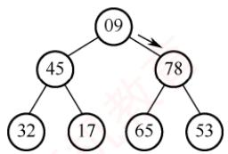

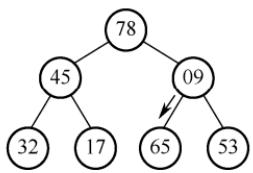

  
图8.7 输出堆顶后再将剩余元素调整成新堆

建立大根堆的算法如下：

void BuildMaxHeap(ElemType A[],int len) {  
for(int i=len/2;i>0;i--) //从最后一个分支结点到根结点  
HeapAdjust(A,i,len); //反复调整子树  
1  
void HeapAdjust(ElemType A[],int k,int len) {  
//对以k为根的子树进行调整  
A[0]=A[k]; //A[0]暂存子树的根结点  
for(int i=2\*k;i<=len;i\*=2) { //沿关键字较大的子结点向下筛选  
if(i<len&&A[i]<A[i+1])  
i++; //取关键字较大的子结点的下标  
if(A[0]>=A[i]) break; //筛选结束  
else {  
A[k]=A[i]; //将较大结点上移  
k=i; //修改k值，以便继续向下筛选  
A[k]=A[0]; //被筛选结点的值放入最终位置  
}

堆调整的时间复杂度与树高成正比，为O(h)。构建含n个元素的堆时，关键字的总比较次数不超过4n，故建堆时间复杂度为O(n)，即可以在线性时间内将无序数组建成堆。

堆排序的完整算法如下：

```c
void HeapSort(ElemType A[],int len){
BuildMaxHeap(A,len); //初始建堆
for(int i=len;i>1;i--){ //执行 n-1 趟排序
Swap(A[i],A[1]); //输出堆顶元素（与堆底元素交换）
HeapAdjust(A,1,i-1); //把剩余i-1个元素重新整理为堆
1
}
```

## 考点追踪堆的插入操作及调整操作分析（2009、2011）

同时，堆也支持插入操作。插入时，先将新元素置于堆末端，然后自下而上地与其父结点比较：若违反堆性质，则交换，直至满足堆定义。图8.8展示了大根堆的插入操作示例。

  
(a)初始，尾部插入63


  
图8.8 大根堆的插入操作示例

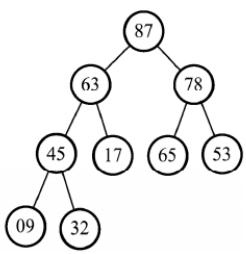

## 考点追踪堆在海量数据中选出最小k个数的应用及效率分析（2022）

堆排序适用于大规模数据的排序场景，还常用于解决Top-K问题。例如，在1亿个数中选出最大的100个数。首先使用一个大小为100的数组，读入前100个数，构建小顶堆，而后依次读入后续数字，若小于堆顶则舍弃，否则用该数替换堆顶并向下调整，待数据读取完毕，堆中100个数为所求。此方法的时间复杂度为O(nlog2k)，空间复杂度为O(k)，效率远高于全排序。

堆排序算法的性能分析如下。

空间效率：仅使用了常数个辅助单元，空间复杂度为O(1)。

时间效率：建堆的时间复杂度为O(n)，随后需进行n-1次堆顶输出与调整操作，每次调整的时间复杂度为O(log2n)。因此，堆排序在最好、最坏和平均情况下的时间复杂度均为O(nlog2n)。

稳定性：在堆调整过程中，相等关键字的元素可能因交换而改变其原始相对位置，因此堆排序是不稳定的排序算法。例如，表L = {1,2,2}，建堆时可能将2 交换到堆顶，此时L = {2,1,2}最终排序序列为L= {1,2,2}，显然，2与2的相对次序已发生变化。

适用性：堆排序依赖完全二叉树的随机访问特性，因此仅适用于顺序存储的线性表。

## 8.4.3 本节试题精选

## 一、单项选择题

01. 在以下排序算法中，每趟从待排序记录中选出关键字最小的记录，并将其与当前待排序部分的首记录交换，从而使有序区从前向后逐步扩大的是（）。 育A. 简单选择排序 B. 冒泡排序 C. 堆排序 D. 直接插入排序

02. 简单选择排序算法的比较次数和移动次数分别为（）。A. O(n), O(log2n) B. $O ( \log _ { 2 } n ) , O ( n ^ { 2 } )$ C. $O(n^{2}), \; O(n)$ D. O(nlog2n), O(n)

03. 若只想得到100000个元素组成的序列中第10个最小元素之前的部分排序的序列，用（）方法最快。A. 冒泡排序 B. 快速排序 C. 归并排序 D. 堆排序

04.下列（）是一个堆。A. 19, 75, 34, 26, 97, 56 B. 97, 26, 34, 75, 19, 56C. 19, 56, 26, 97, 34, 75 D. 19, 34, 26, 97, 56, 75

05.在含有n个元素的小根堆中（下标从1开始），关键字最大的元素可能存储在（）位置。A. n/2 B. n/2 + 2 K C. 1 D. n/2−1

06. 向具有n个结点的堆中插入一个新元素的时间复杂度为（），删除一个元素的时间复杂度为（）。 道计A. O(1) B. O(n) C. O(log₂n) D. $O ( n \log _ { 2 } n )$

07. 构建n个记录的初始堆，其时间复杂度为（）；对n个记录进行堆排序，最坏情况下其时间复杂度为（）。A. O(n) B. $O ( n ^ { 2 } )$ C. $O ( \log _ { 2 }   n )$ D. $O ( n \log _ { 2 } n )$

08.下列4种排序算法中，排序过程中的比较次数与序列初始状态无关的是（）。A. 简单选择排序 B. 直接插入排序C. 快速排序 D. 冒泡排序

09. 对由相同的n个整数构成的二叉排序树和小根堆，下列说法中不正确的是（）。A. 二叉排序树的高度大于或等于小根堆的高度B. 对二叉排序树进行中序遍历可以得到从小到大的序列C. 从小根堆的根结点到任意叶结点的路径构成从小到大的序列D. 对小根堆进行层序遍历可以得到从小到大的序列

10. 有一组数据(15,9,7,8,20,-1,7,4)，用堆排序的筛选方法建立的初始小根堆为（）。A. −1, 4, 8, 9, 20, 7, 15, 7 B. −1, 7, 15, 7, 4, 8, 20, 9C. –1, 4, 7, 8, 20, 15, 7, 9 D. A、B、C均不对

11. 对关键字序列{23,17,72,60,25,8,68,71,52}进行堆排序，输出两个最小关键字后的剩余堆为（）。A. {23, 72, 60, 25, 68, 71, 52} B. {23, 25, 52, 60, 71, 72, 68}C. {71, 25, 23, 52, 60, 72, 68} D. {23, 25, 68, 52, 60, 72, 71}

12. 堆排序分为两个阶段：第一阶段将给定的序列构造成一个初始堆，第二阶段逐次输出堆顶元素，并调整使其保持堆的性质。设有给定序列{48,62,35,77,55,14,35,98}，若在堆排序的第一阶段将该序列构造成一个大根堆，则交换元素的次数为（）。A. 5 B. 6 V C. 7 D. 8

13. 已知大根堆{62,34,53,12,8,46,22}，删除堆顶元素后需要重新调整堆，则在此过程中关键字的比较次数为（） 王道A. 2 B. 3 C. 4 D. 5

14. 从根结点到任意叶结点的路径都是有序的数据结构是（）。A. 红黑树 B. 二叉查找树 C. 哈夫曼树 D. 堆

15.【2009统考真题】已知关键字序列{5,8,12,19,28,20,15,22}是小根堆，插入关键字3， 调整好后得到的小根堆为（）。 A. 3, 5, 12, 8, 28, 20, 15, 22, 19 B. 3, 5, 12, 19, 20, 15, 22, 8, 28 机 C. 3, 8, 12, 5, 20, 15, 22, 28, 19 D. 3, 12, 5, 8, 28, 20, 15, 22, 19

16. 【2011统考真题】已知序列{25,13,10,12,9}是大根堆，在序列尾部插入新元素18，再将其调整为大根堆，调整过程中元素之间进行的比较次数是（）。王 A. 1 B. 2 C. 4 D. 5

17.【2015统考真题】已知小根堆为8,15,10,21,34,16,12，删除关键字8之后需重建堆，在此过程中，关键字之间的比较次数是（）。A. 1 B. 2 C. 3 D. 4

18. 【2018统考真题】在将序列(6,1,5,9,8,4,7)建成大根堆时，正确的序列变化过程是（）。A. $6 , 1 , 7 , 9 , 8 , 4 , 5 \rightarrow 6 , 9 , 7 , 1 , 8 , 4 , 5 \rightarrow 9 , 6 , 7 , 1 , 8 , 4 , 5 \rightarrow 9 , 8 , 7 , 1 , 6 , 4 , 5$ B. $6 , 9 , 5 , 1 , 8 , 4 , 7 \rightarrow 6 , 9 , 7 , 1 , 8 , 4 , 5 \rightarrow 9 , 6 , 7 , 1 , 8 , 4 , 5 \rightarrow 9 , 8 , 7 , 1 , 6 , 4 , 5$ C. $6 , 9 , 5 , 1 , 8 , 4 , 7 \rightarrow 9 , 6 , 5 , 1 , 8 , 4 , 7 \rightarrow 9 , 6 , 7 , 1 , 8 , 4 , 5 \rightarrow 9 , 8 , 7 , 1 , 6 , 4 , 5$ D. 6, 1, 7, 9, 8, 4, 5 → 7, 1, 6, 9, 8, 4, 5 → 7, 9, 6, 1, 8, 4, 5 → 9, 7, 6, 1, 8, 4, 5 → 9, 8, 6, 1, 7, 4, 5

19.【2020统考真题】下列关于大根堆（至少含2个元素）的叙述中，正确的是（）。I. 可以将堆视为一棵完全二叉树Ⅱ. 可以采用顺序存储方式保存堆Ⅲ. 可以将堆视为一棵二叉排序树IV. 堆中的次大值一定在根的下一层A. 仅I、Ⅱ B. 仅Ⅱ、ⅢI C. 仅I、ⅡI和IV D. I、ⅢII和 IV

20. 【2021 统考真题】将关键字 6,9,1,5,8,4,7依次插入初始为空的大根堆 H，得到的 H是( )。A. 9,8,7,6,5,4,1 B. 9,8,7,5,6,1,4 C. 9,8,7,5,6,4,1 D. 9,6,7,5,8,4,1

21.【2024统考真题】已知关键字序列28,22,20,19,8,12,15,5是大根堆（最大堆），对该堆进行两次删除操作后，得到的新堆为（）。A. 20, 19, 15, 12, 8, 5 B. 20, 19, 15, 5, 8, 12 算机教C. 20, 19, 12, 15, 8, 5 D. 20, 19, 8, 12, 15, 5

## 二、综合应用题

01. 指出堆和二叉排序树的区别？

02.画出一棵二叉树，使得它既满足大根堆的要求又满足二叉排序树的要求。

03. 若只想得到一个序列中第k（k≥5）个最小元素之前的部分的排序序列，则最好采用什么排序算法？

04. 通常使用的堆也称二叉堆，因为它是用完全二叉树来实现的，树中结点最多只有两个孩子。同理可以有m叉堆，即用完全m叉树来实现的堆。

1）下图是一个m叉小根堆，问m值是多少？向这个堆插入一个元素65后，堆中的元素如何变化？再删除堆顶元素呢？请画出变化后的树形。


2）从0开始对完全4叉树中的结点从左到右、从上到下进行编号。若给定一个结点k，其父结点的编号是多少？（若存在），其第i（i=1,2,3,4）个孩子的编号是多少？

3）在m叉堆中进行插入和删除操作的时间复杂度是多少？

05. 编写一个算法，在基于单链表表示的待排序关键字序列上进行简单选择排序。

06. 试设计一个算法，判断一个数据序列是否构成一个小根堆。

07.优先队列（PriorityQueue）是一种数据结构，它类似于普通队列，但每个元素都有一个优先级。元素在入队时会根据其优先级来排序，而不按照先入先出的顺序来排序。每次从优先队列中出队时，出队的是优先级最高的元素，而不是最早进入队列的元素。队列中的元素的数据结构的定义如下： XTA

typedef struct{   
int value; //元素的值   
int priority; ∥/元素的优先级，priority越大，优先级越高 }PriorityQueueElement;

请设计一个优先队列，要求满足：①初始时队列为空；②入队时，不允许增加队列的占用空间；③出队后，出队元素所占用的空间可重复使用，即整个队列所占用的空间不变；④入队操作和出队操作的时间复杂度始终保持为O(log2n)。请回答：

1）该队列是应选择链式存储结构，还是选择顺序存储结构？

2）给出优先队列的数据结构的定义。

3）用伪代码给出入队操作和出队操作的基本过程（关键之处可用文字描述）。

08.【2022统考真题】现有n（n>100000）个数保存在一维数组M中，需要查找M中最小的10个数。请回答下列问题。

1）设计一个完成上述查找任务的算法，要求平均情况下的比较次数尽可能少，简述其算法思想（不需要编程实现）。

2）说明你所设计的算法平均情况下的时间复杂度和空间复杂度。

## 8.4.4 答案与解析

## 一、单项选择题

## 01. A

该算法描述的是简单选择排序：每趟从待排序部分顺序扫描，选出最小关键字记录，与首元素交换，使有序区从前向后扩展。这一过程强调“选择最小”和“一次定位”。

## 02. C

注意，读者应熟练掌握各种排序算法的思想、过程和特点。

## 03. D

采用堆排序时，读入前10个元素，建立含10个元素的大根堆，而后依次扫描剩余元素，若大于堆顶，则舍弃，否则用该元素取代堆顶并重新调整堆，当元素全部扫描完毕，堆中保存的即是最小的10个元素。冒泡排序需要从后往前执行10趟冒泡才能得到10个最小的元素。两者的时间复杂度都和数据规模n线性相关，但显然堆排序的常系数更小。而快速排序、归并排序的每一趟都不能保证得到当前序列的最小值，也无法达到线性时间复杂度。

## 04. D

可将每个选项中的序列表示成完全二叉树，再看父结点与子结点的关系是否全部满足堆的定义。例如，选项A中序列对应的完全二叉树如右图所示。显然，最小元素19在根结点，因此可能是小根堆，但75与26的关系却不满足小根堆的定义，所以选项A中的序列不是一个堆。其他选项采用类似的过程分析。


## 05. B

在小根堆中，关键字最大的元素一定存储在该堆所对应的完全二叉树的叶结点中（位于最底层或次底层）。又因为二叉树中的最后一个非叶结点存储在n/2中，所以关键字最大的元素的存储范围为 $n / 2 \rfloor + 1 \sim n 。$ 注意，读者可类比在大根堆中求关键字最小的元素的存储范围。

## 06. C、C

在向有n个元素的堆中插入一个新元素时，需要调用一个向上调整的算法，比较次数最多等于树的高度减1，因为树的高度为log₂n+1，所以堆的向上调整算法的比较次数最多等于log2n。此处需要注意，调整堆和建初始堆的时间复杂度是不一样的，读者可以仔细分析两个算法的具体执行过程。

## 07. A、D

建堆过程中，向下调整的时间与树高h有关，为O(h)。每次向下调整时，大部分结点的高度都较小。因此，可以证明在元素个数为n的序列上建堆，其时间复杂度为O(n)。无论是在最好情况下还是在最坏情况下，堆排序的时间复杂度均为O(nlog2n)。

## 08. A

简单选择排序的比较次数始终为n(n-1)/2，与序列状态无关。

## 09. D

堆是顺序存储的完全二叉树，因此其高度小于或等干结点数相同的二叉排序树，选项A正确。选项B显然正确。根据小根堆的定义，其根结点到任意叶结点的路径构成从小到大的序列，选项C正确。堆的各层结点之间没有大小要求，因此层序遍历不能保证得到有序序列，选项D错误。

## 10. C

从 $\lfloor n / 2 \rfloor   \sim   1$ 依次筛选堆的过程如下图所示，显然选择选项C。


## 11. D

筛选法初始建堆为{8,17,23,52,25,72,68,71,60},输出8后重建的堆为{17,25,23,52,60,72, 68,71}，输出17后重建的堆为{23,25,68,52,60,72,71}。 XTA

## 12. B

初始序列是一棵顺序存储的完全二叉树，然后根据大根堆的要求，按照从下到上、从右到左的顺序进行调整。98和77比较，98和77交换（交换1次）；14和35比较，35和35比较，不交换；98和55比较，98和62比较，98和62交换（交换1次）；62和77比较，77和62交换（交换1次）；98和35比较，98和48比较，98和48交换（交换1次）；77和55比较，77和48比较，77和48交换（交换1次）；48和62比较，62和48交换（交换1次），共交换6次。

## 13. B

删除堆顶62后，将堆尾22放入堆顶，然后自上而下调整。首先34与53比较(第一次比较），较大者53与根22比较（第二次比较），53被换至堆顶；22只有一个孩子，直接与其左孩子46比较（第3次比较），22与46交换，至此大根堆调整结束，具体过程如下图所示。

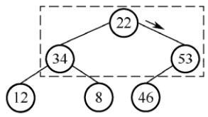


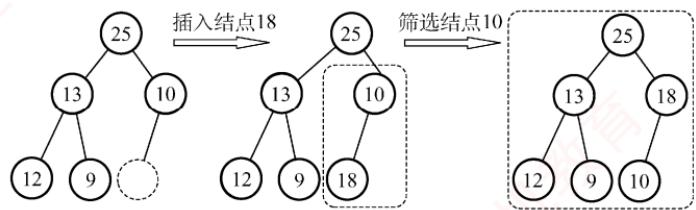

## 14. D

红黑树和二叉查找树的中序序列是有序序列，从根结点到任意叶结点的路径不能保证是有序的。哈夫曼树是根据权值按一定规则构造的树，和关键字次序无关。若是小根堆，则从根结点到任意叶结点的路径是升序序列；若是大根堆，则从根结点到叶结点的路径是降序序列。

## 15. A

插入关键字3后，堆的变化过程如下图所示。

  
(a) 原始堆

  
(b)插入3

  
(c) 调整结束

## 16. B

首先18与10比较，交换；18与25比较，不交换。共比较2次，调整过程如下图所示。


## 17. C

删除8后，将12移动到堆顶，第一次是15和10比较，第二次是10和12比较并交换，第三次还需比较12和16，所以比较次数为3。

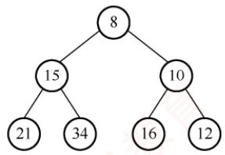


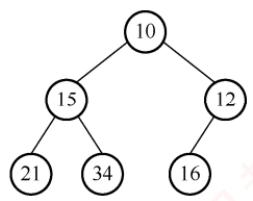

## 18. A

要熟练掌握建堆和调整堆的方法，从序列末尾开始向前遍历，变换过程如下图所示。

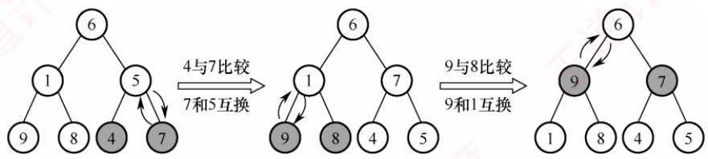


## 19. C

简单概念题。堆是一棵完全树，采用一维数组存储，说法Ⅰ正确，说法Ⅱ正确。大根堆只要求根结点值大于左右孩子值，并不要求左右孩子值有序，说法Ⅲ错误。堆的定义是递归的，所以其左右子树也是大根堆，所以堆的次大值一定是其左孩子或右孩子，说法IV正确。

## 20. B

要熟练掌握调整堆的方法，建堆的过程如下图所示，所以选择选项B。

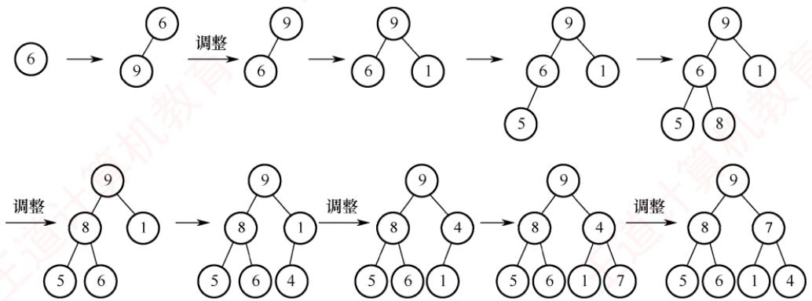

注意，给定序列依次插入空堆的结果与给定序列直接调整成堆的结果是不同的，最终得到的堆的形式也不同。若对序列6,9,1,5,8,4,7直接调整成堆，则会误选选项C。

## 21. B

该序列已调整成大根堆，接下来进行第一次删除操作：删除28后，将5放入堆顶；然后自上而下调整。22和20比较，较大者22与5比较，交换；19和8比较，较大者19与5比较，交换。


接下来进行第二次删除操作：删除22后，将15放入堆顶；然后自上而下调整。19和20比较，较大者20与15比较，交换；15直接与其仅有的左孩子12比较，不交换。

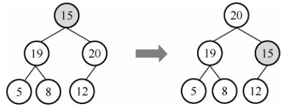  
因此，进行两次删除操作后，得到的新堆是20,19,15,5,8,12。

## 二、综合应用题

## 01. 【解答】

以小根堆为例，堆的特点是双亲结点的关键字必然小于或等于该孩子结点的关键字，而两个孩子结点的关键字没有次序规定。在二叉排序树中，每个双亲结点的关键字均大于左子树结点的关键字，均小于右子树结点的关键字，也就是说，每个双亲结点的左右孩子的关键字有次序关系。这样，当对两种树执行中序遍历后，二叉排序树会得到一个有序的序列，而堆则不一定能得到一个有序的序列。

## 02. 【解答】

大根堆要求根结点的关键字值既大于或等于左孩子的关键字值，又大于或等于右孩子的关键字值。二叉排序树要求根结点的关键字值大于左孩子的关键字值，同时小于右孩子的关键字值。两者的交集是：根结点的关键字值大于左孩子的关键字值。这意味着它是一棵左斜单支树，但大根堆要求是完全二叉树，因此最后得到的只能是如右图所示的两个结点的二叉树。


读者也可能会注意到，当只有一个结点时，显然是满足题意的，但我们不举一个结点的例子是为了体现出排序树与大根堆的区别。

## 03. 【解答】

在基于比较的排序算法中，插入排序、快速排序和归并排序只有在将元素全部排完序后，才能得到前k个最小的元素序列，算法的效率不高。 K

冒泡排序、堆排序和简单选择排序可以，因为它们在每一趟中都可以确定一个最小的元素。采用堆排序最合适，对于n个元素的序列，建立初始堆的时间不超过4n，取得第k个最小元素之前的排序序列所花的时间为log₂n，总时间为 $4 n + k \log _ { 2 } n$ ；冒泡和简单选择排序完成此功能所花的时间为kn，当k≥5时，通过比较可以得出堆排序最优。

## 注意

求前k个最小元素的顺序排列可采用的排序算法有冒泡排序、堆排序和简单选择排序。

## 04.【解析】

1）除最后一个分支结点外，其余每个分支结点都有4个孩子，所以该树是完全4叉树。插入元素65后，再删除堆顶元素的树形分别如下图1和图2所示。

  
图1 插入 65后的树形

  
图2 删除堆顶元素后的树形

2）父结点的编号为(k-1)/4，第i个孩子的编号为 $4k + i, \quad i = 1, 2, 3, 4 。$

3）与二叉堆类似，插入和删除操作都有向上、向下调整的过程，操作时间都与树的高度有关。因此，插入和删除操作的时间复杂度都为 $O ( \log _ { m } n )$ ，其中n为元素个数。

## 05.【解答】

算法的思想是：每趟在原始链表中摘下关键字最大的结点，把它插入结果链表的最前端。在原始链表中摘下的关键字越来越小，在结果链表前端插入的关键字也越来越小，因此最后形成的结果链表中的结点将按关键字非递减的顺序有序链接。

单链表的定义如第2章所述，假设它不带表头结点。

```c
void selectSort(LinkedList& L){
//对不带表头结点的单链表工执行简单选择排序
LinkNode *h=L,*p,*q,*r,*s;
L=NULL;
while(h!=NULL){ //持续扫描原链表
p=s=h;q=r=NULL;
//指针 s 和r记忆最大结点和其前驱；p为工作指针，g 为其前驱
while(p!=NULL) { //扫描原链表寻找最大结点s
if(p->data>s->data) {s=p;r=q;} //找到更大的，记忆它和它的前驱
q=p;p=p->1ink; //继续寻找
}
if(s==h)
h=h->link; //最大结点在原链表前端 教育
else
r->link=s->link; //最大结点在原链表表内
s->link=L;L=s; //结点 s 插入结果链前端
```

## 06.【解答】

将顺序表L「1...n1视为一个完全二叉树，扫描所有分支结点，遇到孩子结点的关键字小于根结点的关键字时返回false，扫描完后返回true。算法的实现如下：

```c
bool IsMinHeap(ElemType A[],int len) {
if(1en%2==0){ //1en为偶数，有一个单分支结点
if(A[len/2]>A[len]) //判断单分支结点
return false;
for(i=len/2-1;i>=1;i--) //判断所有双分支结点
if(A[i]>A[2*i]l|A[i]>A[2*i+1])
return false;
else { //1en为奇数时，没有单分支结点
for(i=len/2;i>=1;i--) ∥/判断所有双分支结点
if(A[i]>A[2*i]||A[i]>A[2*i+1])
return false;
1
return true;
```

## 07.【解答】

1）题目要求整个队列所占用的空间不变，入队操作和出队操作的时间复杂度始终保持为O(log2n)，则应采用顺序存储结构，即用数组实现大根堆。 X

## 2）优先队列的数据结构定义如下：

typedef struct{   
PriorityQueueElement heap[MAX SIZE]; //用数组实现堆   
int size; //当前堆中元素的数量   
}PriorityQueue

## 3）入队操作：

void enqueue(PriorityQueue \*pq,int value,int priority) {  
if(pq->size>=MAX SIZE) {  
队列已满，无法入队；  
return;  
将新元素添加到堆的末尾; 机教育  
向上调整堆；  
}

出队操作：

PriorityQueueElement dequeue(PriorityQueue \*pq) {   
if(pq->size==0) {

队列为空时直接退出；  
1  
获取堆顶元素（优先级最高的元素）；  
将堆的最后一个元素放到堆顶；  
向下调整堆；  
返回出队元素； 道

## 08.【解答】

## 1）算法思想。

【方法1】定义含10个元素的数组A，初始时元素值均为该数组类型能表示的最大数MAX。for M中的每个元素s

if (s<A[9]) 丢弃A[9]并将s 按升序插入 A；

当数据全部扫描完毕，数组A[0]～A[9]保存的就是最小的10个数。

【方法2】定义含10个元素的大根堆H，元素值均为该堆元素类型能表示的最大数MAX。

for 中的每个元素s

if (s<H 的堆顶元素） 删除堆顶元素并将 s 插入H；

当数据全部扫描完毕，堆H中保存的就是最小的10个数。

2）算法平均情况下的时间复杂度是O(n)，空间复杂度是O(1)。

## 8.5 归并排序、基数排序和计数排序

## 8.5.1 归并排序

## 考点追踪2路归并操作的功能（2022）

归并排序不同于基于交换或选择的排序方法，其核心思想是“归并”一一即将两个或多个有序序列合并为一个更长的有序序列。具体地，对于含有n个记录的待排序表，可将其视为n个长度为1的有序子表；然后两两归并，得到n/2个长度为2（或1）的有序子表；继续两两归并……

图8.9展示了一个2路归并排序的示例，经过三趟归并后合并为一个完整的有序序列。

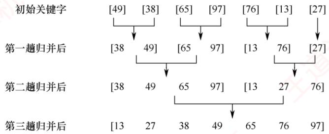  
图 8.9 2 路归并排序示例

## 考点追踪（算法题）归并排序思想的应用（2011）

归并操作由函数Merge()实现，其功能是将同一顺序表中前后相邻的两个有序子表合并为一个有序表。首先将这两个子表的所有元素复制到辅助数组B中。随后，设置两个指针分别指向B中两段的起始位置，依次比较当前元素的关键字，将较小者放入原数组A的对应位置。其中一段的所有元素均已复制完毕后，将另一段的剩余部分直接复制到A中。具体实现如下：

```c
ElemType *B=(ElemType *)malloc((n+1)*sizeof(ElemType)); ∥/辅助数组B
void Merge(ElemType A[l,int low,int mid,int high) {
//表 A 的两段A[low...mid]和A[mid+1...high]各自有序，将它们合并成一个有序表
int i,j,k;
for(k=low;k<=high;k++)
B[k]=A[k]; //将 A 中所有元素复制到B 中
for(i=low,j=mid+1,k=i;i<=mid&&j<=high;k++) {
if(B[i]<=B[j]) //比较B 的两个段中的元素
A[k]=B[i++]; //将较小值复制到A中
else
A[k]=B[j++];
1
while(i<=mid) A[k++]=B[i++1； //若第一个表未检测完，复制
while(j<=high) A[k++]=B[j++]； ∥/若第二个表未检测完，复制
```

## 注意

在上述代码中，最后两个while循环仅有一个会执行。

在非递归的归并排序中，一趟归并操作是指：将当前序列划分为若干长度为h的有序段，然后两两归并，形成长度为2h的有序段。若序列总长度为n，则每趟需调用 $\left[ n / ( 2 h ) \right]$ l次 Merge()函数。整个排序过程共需进行[1og2n趟归并。 V

递归形式的2路归并排序基于分治策略，其过程如下。

分解：将含n个元素的待排序表从中间分为两个子表，每个子表含约n/2个元素。

递归求解：对两个子表分别递归地进行归并排序。

合并：合并两个已排序的子表得到排序结果。

2路归并排序的递归实现如下：

```c
void MergeSort(ElemType A[],int low,int high) {
if (low<high) {
int mid=(low+high)/2; //从中间划分两个子序列
MergeSort(A,low,mid); //对左侧子序列进行递归排序
MergeSort (A,mid+1,high); //对右侧子序列进行递归排序
Merge(A,low,mid,high); //归并
}
```

## 考点追踪2路归并比较次数的分析（2024）

2路归并排序算法的性能分析如下：

空间效率：归并操作需要一个与待排序表等长的辅助数组，因此空间复杂度为O(n)。

时间效率：每趟归并需要遍历所有n个元素，时间复杂度为O(n)；共需进行「1og2n趟，总时间复杂度为 O(nlog2n)。

稳定性：在归并过程中，当两个元素关键字相等时，优先取自前一段，从而保持了相同关键字元素的相对次序。因此2路归并排序是稳定的排序算法。

适用性：归并排序仅需顺序访问元素，因此适用于顺序存储和链式存储的线性表。

## 注意

一般而言，对N个元素进行k路归并排序时，排序的趟数m满足kⁿ=N，从而m=logkN，又考虑到m为整数，因此 $m = \lceil \log _ { k } N \rceil .$ 这与前述的2路归并排序算法是一致的。

## 8.5.2 基数排序

基数排序是一种很特别的排序算法，它不依赖于元素间的比较，而基于关键字各位的大小进行排序。基数排序是一种借助多关键字排序的思想对单逻辑关键字进行排序的方法。

假设长度为n的线性表中，每个结点 a的关键字由 $a _ { j }$ $d$ 个分量 $(k_{j}^{d - 1},k_{j}^{d - 2},\cdots,k_{j}^{1},k_{j}^{0})$ 组成，满足 $0 \leqslant k_{j}^{i} \leqslant r - 1 \quad (0 \leqslant j < n, 0 \leqslant i \leqslant d - 1)$ 。其中 $k _ { j } ^ { d - 1 }$ 为最高位关键字， $k _ { j } ^ { 0 }$ 为最低位关键字。

为实现多关键字排序，通常有两种方法：第一种是最高位优先（MSD）法，按关键字位权重递减依次逐层划分成若干更小的子序列，最后将所有子序列依次连接成一个有序序列；第二种是最低位优先（LSD）法，按关键字位权重递增依次进行排序，最后形成一个有序序列。

以下描述以基数r进行的最低位优先基数排序过程。算法使用r个队列 $Q_{0},Q_{1},\cdots,Q_{r-1}$ 对每一位 $i = 0 , 1 , \cdots , d - 1$ ，依次执行一次分配和收集操作（每轮本质上是一次稳定的排序）：

①分配：初始化所有队列为空，然后依次扫描线性表中的每个结点 $a_{j} (j = 0, 1, \cdots, n-1)$ 若 $a _ { j }$ 在当前位上的关键字值为 $k ,$ 则将其加入队列 $Q _ { k }$ 七字

②收集：按 $Q _ { 0 } ,$ 到 $\mathcal { Q } _ { r - 1 }$ 的顺序，依次将各队列中的结点连接起来，形成新的线性表。

## 考点追踪基数排序的中间过程的分析（2013、2021）

通常采用链式基数排序。例如，对以下10个记录进行排序：

$$
\begin{array}{l}一 一 \boxed{278} 一 一 \boxed{109} 一 一 \boxed{063} 一 一 \boxed{930} 一 一 \boxed{589} 一 一 \boxed{184} 一 一 \boxed{505} 一 \boxed{269} 一 \boxed{008} 一 \boxed{083}\end{array}
$$

假设所有关键字均为小于1000的正整数，基数 $r = 1 0$ ，在排序过程中需借助10个链队列，关键字由3位子关键字构成： $\mathrm { K } ^ { 1 } \mathrm { K } ^ { 2 } \mathrm { K } ^ { 3 }$ ，分别代表百位、十位和个位，共需进行三趟分配与收集操作。第一趟分配用最低位子关键字 $\mathrm { K } ^ { 3 }$ （个位）进行，将所有记录按个位数字分配到 $Q _ { 0 }$ 到 $Q _ { 9 }$ 中，如图8.10(a)所示，随后按队列顺序收集，结果如图8.10(b)所示。

  
(a) 第一趟分配后

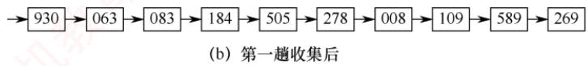  
图8.10 第一趟链式基数排序操作

第二趟分配用次低位子关键字 $\mathrm { K } ^ { 2 }$ （十位）进行，将所有十位相等的记录分配到同一个队列，如图8.11(a)所示。第二趟收集后的结果如图8.11(b)所示。

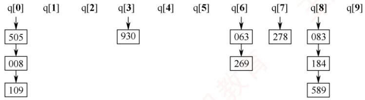  
(a) 第二趟分配后

  
(b) 第二趟收集后  
图8.11 第二趟链式基数排序操作

第三趟分配用最高位子关键字 $\mathrm { K } ^ { 1 }$ （百位）进行，将所有百位相等的记录分配到同一个队列，如图8.12(a)所示，第三趟收集后的结果如图8.12(b)所示，至此整个排序结束。

  
图8.12 第三趟链式基数排序操作

基数排序算法的性能分析如下。

空间效率：一趟排序需要的辅助空间为r（r个队列：r个队头指针和r个队尾指针），但这些结构在后续各趟排序中可重复使用，因此空间复杂度为O(r)。

## 考点追踪元素的移动次数与序列初态无关的排序算法（2015）

时间效率：共需进行d趟分配与收集。每趟分配需遍历n个元素，所需时间为O(n)；每趟收集需处理r个队列，所需时间为 $O ( r )$ 。总时间复杂度为O(d(n+ r))，它与序列的初始状态无关。

稳定性：由于每趟分配按原序列顺序入队，收集按队列编号顺序出队，相同关键字的元素相对次序不会改变，因此基数排序是稳定的排序算法。

适用性：基数排序适用于顺序存储和链式存储的线性表，链式结构尤其适合。

## \*8.5.3 计数排序

考点追踪（算法题）计数排序思想的应用（2013、2015、2018）

计数排序也是一种不依赖于比较的排序算法。其核心思想是：对每个待排序元素x，统计小于x的元素个数，从而确定x在有序序列中的位置。例如，若有8个元素小于x，则x应排在第9位。当存在重复元素时，需对算法稍做调整，以保证排序的稳定性。

## 注意

计数排序并不在统考大纲的范围内，但其排序思想在历年真题中多次涉及。

在计数排序的实现中，假设输入是一个数组An]，序列长度为n。算法还需两个辅助数组：B[n]用于存放排序结果，C[k]用于存储计数值。具体做法是：以A中的元素值作为C的下标（索引），而C「×1保存的是值为×的元素出现的次数。算法实现如下：

## 考点追踪计数排序相关的思想和代码的分析（2021）

```c
void CountSort(ElemType A[],ElemType B[],int n,int k){
int i,C[k];
for(i=0;i<k;i++)
C[i]=0; //初始化计数数组
for(i=0;i<n;i++) //遍历输入数组，统计每个元素出现的次数
C[A[i]]=C[A[i]]+1; //C[A[i]]保存的是等于 A[i]的元素个数
for(i=1;i<k;i++)
C[i]=C[i]+C[i-1]; //C[x]保存的是小于或等于x的元素总数
for(i=n-1;i>=0;i--){ //从后往前遍历输入数组
B[C[A[i]]-1]=A[i]; //将元素A[i]放置到输出数组B[]的正确位置
```


第一个for循环将计数数组c初始化为0。第二个for循环遍历输入数组A，对每个元素$\mathbf { x } \mathbf { = } \mathbb { A } \left[ \mathbf { \Delta } \mathbf { i } \right]$ ，将C[x]加1；循环结束后，C[x]保存的是值等于×的元素个数。第三个for循环通过累加计算后，使C×]变为小于或等于×的元素总数，即×在最终有序序列中的最后可能出现的位置（从1开始计数）。第四个for循环从后往前遍历A：对于每个A[i]，将其放入输出数组B的 $\mathbb { C } \left[ \mathbb { A } \left[ \mathbb { \partial } \mathbb { \partial } \mathbb { \partial } \right] \right] - \mathbb { 1 }$ 位置（下标从0开始），然后将C[A[i]]减1。若A中无重复元素，则C[A[i]]-1即为A[i]在B 中的唯一正确位置；若存在重复元素，“从后往前遍历+计数递减”的策略确保在A中先出现的相同元素，在B中仍排在前面，从而保证排序的稳定性。

假设输入数组A[]={2,4,3,0,2,3}，第二个for循环结束后，辅助数组c的状态如图8.13(a)所示；第三个for循环结束后，C的状态如图8.13(b)所示。图8.13(c)至图8.13(h)分别展示了第四个for循环每次迭代后，输出数组B和辅助数组C的变化情况。

  
图 8.13 计数排序的过程

由上述过程可知，计数排序利用了数组下标天然有序的特性：将元素值映射为辅助数组的下标，通过统计频次并累加，再反向填充输出数组，从而完成排序。 uK

计数排序算法的性能分析如下。

空间效率：计数排序是一种以空间换时间的算法。输出数组B的长度为n；计数数组C的长度为k，空间复杂度为 $O ( n + k )$ 。若不将输出数组视为辅助空间，则空间复杂度为O(k)。算法要求待排序元素为非负整数，取值范围（如0\~k-1）不宜过大，否则会导致辅助空间浪费。

时间效率：上述代码的第1和第3个for循环耗时O(k)，第2和第4个 $\mathbb { E O r }$ 循环耗时 O(n),总时间复杂度为 $O ( n + k )$ 。因此，当 $k   =   O ( n )$ 时，计数排序可达线性时间 $\mathcal { O } ( n )$ ；但当 $k \gg O(n \log_2 n)$ 时，其效率反而不如基于比较的排序算法（如快速排序、堆排序等）。

稳定性：上述代码的第4个for循环从后往前遍历输入数组，相同元素在输出数组中的相对次序得以保持，因此计数排序是稳定的排序算法。

适用性：计数排序适用于顺序存储的线性表。

## 8.5.4 本节试题精选

## 一、单项选择题

01. 以下排序算法中，（）在一趟结束后不一定能选出一个元素放在其最终位置上。

A. 简单选择排序 B. 冒泡排序 C. 归并排序 D. 堆排序

02. 以下排序算法中，（）不需要进行关键字的比较。A. 快速排序 B. 归并排序 C. 基数排序 D. 堆排序

03. 在下列排序算法中，平均情况下空间复杂度为O(n)的是（），最坏情况下空间复杂度为O(n)的是（）。I. 希尔排序 ⅡI. 堆排序 III. 冒泡排序IV. 归并排序 V. 快速排序 VI. 基数排序A. I、IV、VI B. ⅡI、V C. IV、 V D. IV XTA

04.下列排序算法中，排序过程中比较次数的数量级与序列初始状态无关的是（）。A. 归并排序 B. 插入排序 C. 快速排序 D. 冒泡排序

05. 2路归并排序中，归并趟数的数量级是（）。A. O(n) B. O(log2n) C. $O ( n \log _ { 2 } n )$ D. $O(n^{2})$

06. 若对27个元素只进行三趟多路归并排序，则选取的归并路数最少为（）。A. 2 B. 3 C. 4 D. 5

07.将两个各有N个元素的有序表合并成一个有序表，最少的比较次数是（），最多的比较次数是（）。A. N B. 2N-1 C. 2N D. N-1

08. 用归并排序算法对序列{1,2,6,4,5,3,8,7}进行排序，共需要进行（）次比较。A. 12 B. 13 C. 14 D. 15

09. 一组经过第一趟2 路归并排序后的记录的关键字为{25,50, 15,35,80,85,20,40,36,70}，其中包含5个长度为2的有序表，用2路归并排序算法对该序列进行第二趟归并后的结果为（）。A. 15, 25, 35, 50, 80, 20, 85, 40, 70, 36 B. 15, 25, 35, 50, 20, 40, 80, 85, 36, 70C. 15, 25, 50, 35, 80, 85, 20, 36, 40, 70 D. 15, 25, 35, 50, 80, 20, 36, 40, 70, 85

10.若将中国人按照生日（不考虑年份，只考虑月、日）来排序，则使用下列排序算法时，最快的是（）。A. 归并排序 育 B. 希尔排序 C. 快速排序 D. 基数排序

11. 设线性表中每个元素有两个数据项 $k _ { 1 }$ 和 $k _ { 2 }$ ，现对线性表按以下规则进行排序：先看数据项 $k_{1},\ k_{1}$ 值小的元素在前，大的元素在后；在 $k _ { 1 }$ 值相同的情况下，再看 $k_{2}, k_{2}$ 值小的元素在前，大的元素在后。满足这种要求的排序算法是（）。A. 先按 $k _ { 1 }$ 进行直接插入排序，再按 $k _ { 2 }$ 进行简单选择排序 王道计算B. 先按 $k _ { 2 }$ 进行直接插入排序，再按 $k _ { 1 }$ 进行简单选择排序C. 先按 $k _ { 1 }$ 进行简单选择排序，再按 $k _ { 2 }$ 进行直接插入排序D. 先按 $k _ { 2 }$ 进行简单选择排序，再按 $k _ { 1 }$ 进行直接插入排序

12. 对{05,46,13,55,94,17,42}进行基数排序，一趟排序的结果是（）。A. 05, 46, 13, 55, 94, 17, 42 B. 05, 13, 17, 42, 46, 55, 94C. 42, 13, 94, 05, 55, 46, 17 D. 05, 13, 46, 55, 17, 42, 94

13. 有n个十进制整数进行基数排序，其中最大的整数为5位，则基数排序过程中临时建立的队列个数是（）。A. n B. 2 计 C. 5 D. 10

14.下列各种排序算法中，（）需要的附加存储空间最大。

A. 快速排序 B. 堆排序 C. 归并排序 D. 插入排序

15.【2013统考真题】已知两个长度分别为m和n的升序链表，若将它们合并为长度为 $m +$ n的一个降序链表，则最坏情况下的时间复杂度为（）。A. O(n) B. O(mn)  C. O(min(m, n)) D. O(max(m, n))

16. 【2013统考真题】对给定的关键字序列110,119,007,911,114,120,122进行基数排序，第二趟分配、收集后得到的关键字序列为（）。A. 007, 110, 119, 114, 911, 120, 122 B. 007, 110, 119, 114, 911, 122, 120C. 007, 110, 911, 114, 119, 120, 122 D. 110, 120, 911, 122, 114, 007, 119 YTA

17.【2015统考真题】下列排序算法中，元素的移动次数与关键字的初始状态无关的是（）。A. 直接插入排序 B. 冒泡排序 C. 基数排序 D. 快速排序

18. 【2021 统考真题】设数组S[]={93,946,372,9,146,151,301,485,236,327,43,892}，采用最低位优先（LSD）基数排序将S排列成升序序列。第一趟分配、收集后，元素372之前、之后紧邻的元素分别为（）。A. 43, 892 B. 236, 301 C. 301, 892 D. 485, 301

19. 【2022统考真题】使用2路归并排序对含n个元素的数组M进行排序时，2路归并排序的功能是（）。A. 将两个有序表合并为一个新的有序表B. 将划分为两部分，两部分的元素个数大致相等C. 将划分为n个部分，每个部分中仅含有一个元素D. 将Μ划分为两部分，一部分元素的值均小于另一部分元素的值

20. 【2024统考真题】现有由关键字组成的3个有序序列(3,5)、(7,9)和(6)，若按从左至右的次序选择有序序列进行2路归并排序，则关键字之间的总比较次数是（）。A. 3 B. 4 道 C. 5 D. 6

## 二、综合应用题

01. 已知序列{503,87,512,61,908,170,897,275,653,462}，采用非递归的 2路归并排序算法对该序列做升序排序时需要几趟排序？给出每一趟的结果。 V

02. 设待排序的关键字序列为{12,2,16,30,28,10,16\*,20,6,18}，试写出使用最低位优先(LSD）基数排序算法每趟排序后的结果。 1

03.【2021统考真题】已知某排序算法如下：

```c
void cmpCountSort(int a[],int b[],int n){
int i,j,*count;
count=(int *)malloc(sizeof(int)*n);
//C++语言： count=new int[n];
for(i=0;i<n;i++) count[i]=0;
for(i=0;i<n-1;i++)
for(j=i+1;j<n;j++)
if(a[i]<a[j]) count[j]++;
else count[i]++;
for(i=0;i<n;i++) b[count[i]]= a[i];
free(count); //C++语言： delete count;
```

请回答下列问题。

1) 若有 int a[]={25,-10,25,10,11,19},b[6];, 则调用 cmpCountSort(a,b,6)后数组b中的内容是什么？

2）若a中含有n个元素，则算法执行过程中，元素之间的比较次数是多少？

3）该算法是稳定的吗？若是，阐述理由；否则，修改为稳定排序算法。

## 8.5.5 答案与解析

## 一、单项选择题

## 01. C

我们知道插入排序不能保证在一趟排序结束后一定有元素放在最终位置上。事实上，归并排序也不能保证。例如，序列{6,5,7,8,2,1,4,3}进行一趟2路归并排序（从小到大）后为{5,6,7,8,1,2,3,4}，显然它们都未被放在最终位置上。 XTI

## 02. C

基数排序是基于关键字各位的大小进行排序的，而不是基于关键字的比较进行的。

## 03. D、C

归并排序在平均情况和最坏情况下的空间复杂度都是O(n)，快速排序只在最坏情况下才是O(n)，平均情况是O(log2n)。因此，归并排序是本章所有排序算法中占用辅助空间最多的。

## 04. A

前面已讲过选择排序的比较次数与序列初始状态无关，归并排序的比较次数的数量级也与序列的初始状态无关。读者应能从算法的原理方面来考虑为什么和初始状态无关。

## 05. B

N个元素进行k路归并排序的趟数m满足 $k ^ { m }   =   N$ 即 $m = \left\lceil \log_{k}N \right\rceil$ ，本题中为 $\lceil \log _ { 2 } n \rceil _ { \circ }$

## 06. B

N个元素进行 k路归并排序的趟数m满足 $k^{m} = N,$ ，这里要求的是k，代入可得k=3。

## 07. A、B

注意，当一个表中的最小元素比另一个表中的最大元素还大时，比较的次数是最少的，仅比较N次；而当两个表中的元素依次间隔地比较时，即 $a_{1} < b_{1} < a_{2} < b_{2} < \cdots < a_{n} < b_{n}$ 时，比较的次数是最多的，为2N-1次。

建议读者对此举一反三：若将本题中的两个有序表的长度分别设为M和N，则最多（或最少）的比较次数是多少？时间复杂度又是多少？ XTA

## 08. C

第一趟归并后{1,2}, {4,6}, {3,5}, {7,8}，共比较4 次；第二趟归并后{1,2,4,6}, {3,5,7,8}，共比较4次；第三趟归并后{1,2,3,4,5,6,7,8}，共比较6次。三趟归并共需进行14次比较。

## 09. B

这里采用2路归并排序算法，且是第二趟排序，因此每4个元素放在一起归并，可将序列划分为{25,50,15,35},{80,85,20,40}和{36,70}，分别对它们进行排序后有{15,25,35,50},{20,40,80, 85}和{36, 70}。

## 10. D

按照所有中国人的生日排序，一方面N是非常大的，另一方面关键字所含的排序码数为2，且一个排序码的基数为12，另一个排序码的基数为31，都是较小的常数值，因此采用基数排序可以在O(M)内完成排序过程。

## 11. D

本题思路来自基数排序的LSD，首先应确定 $k _ { 1 }$ 、 $k _ { 2 }$ 的排序顺序，若先排 $k _ { 1 }$ 再排 $k _ { 2 } ,$ ，则排序结果不符合题意，排除选项A和C。再考虑排序的稳定性，当 $k _ { 2 }$ 排好序后，再对 $k _ { 1 }$ 排序，若对 $k _ { 1 }$ 排序采

用的方法是不稳定的，则对于 $k _ { 1 }$ 相同而 $k _ { 2 }$ 不同的元素可能会改变相对次序，从而不一定能满足题设要求。直接插入排序是稳定的，而简单选择排序是不稳定的，只能选择选项D。

## 12. C

基数排序有MSD和LSD两种，基数排序是稳定的。对于选项A，不符合LSD和MSD；对于选项B，符合MSD，但关键字42、46的相对位置发生了变化；对于选项D，不符合LSD和MSD。

## 13. D

基数排序中建立的队列个数等于进制数。

## 14. C

快速排序的平均空间复杂度是O(log2n)，归并排序的空间复杂度是O(n)，其他都是O(1)。

## 15. D

考虑两个升序链表合并，两两比较表中元素，每比较一次，确定一个元素的链接位置（取较小元素，头插法）。当一个链表比较结束后，将另一个链表的剩余元素插入即可。最坏的情况是两个链表中的元素依次进行比较，因为2max(m, n)≥m+n，所以时间复杂度为O(max(m, n))。此外，每次比较把两个链表中的较小结点插入新链表的表头，直到一个链表为空，因为原链表是升序排列的，要求合并后为降序排列的，因此还要把另一个链表剩下的结点一一插入新链表的表头，不论是最好情况还是最坏情况，都需要遍历两个链表中的所有结点。

## 16. C

基数排序的第一趟排序是按照个位数字的大小来进行的，第二趟排序是按照十位数字的大小来进行的，排序的过程如下图所示。


## 17. C

基数排序的元素移动次数与序列初态无关，而其他三种排序算法都与序列初态有关。

## 18. C

基数排序是一种稳定的排序算法。因为采用最低位优先（LSD）的基数排序，即第一趟对个位进行分配和收集操作，所以第一趟分配和收集后的结果是{151,301,372,892,93,43,485,946.146,236,327,9}，元素372之前、之后紧邻的元素分别为301和892。

## 19. A。

送分题。本书对归并的定义原话是“归并的含义是将两个或两个以上的有序表合并成一个新的有序表”，而2路归并是将两个有序表合并为一个新的有序表。

20. C

从左至右对这三个有序序列进行2路归并排序的过程如下。

①合并(3,5)和(7,9)：比较3和7（1次），选择3；比较5和7（1次），选择5；剩余元素7和9直接加入。②合并(3,5,7,9)和(6)：比较3和6（1次），选择3；比较5和6（1次），选择5；比较7和6（1次），选择6；剩余元素7和9直接加入。总共比较5次。

## 二、综合应用题

## 01. 【解答】

n= 10，需要排序的趟数 =「1og₂10= 4，各趟的排序结果如下：

初始序列：503,87,512,61,908,170,897,275,653,462

第一趟：87,503,61,512,170,908,275,897,462,653（长度为2）

第二趟：61,87,503,512,170,275,897,908,462,653（长度为4)

第三趟：61,87,170,275,503,512,897,908,462,653（长度为8)

第四趟：61,87,170,275,462,503,512,653,897,908（长度为10）

## 02.【解答】

使用链式队列的基数排序的排序过程如下图所示。

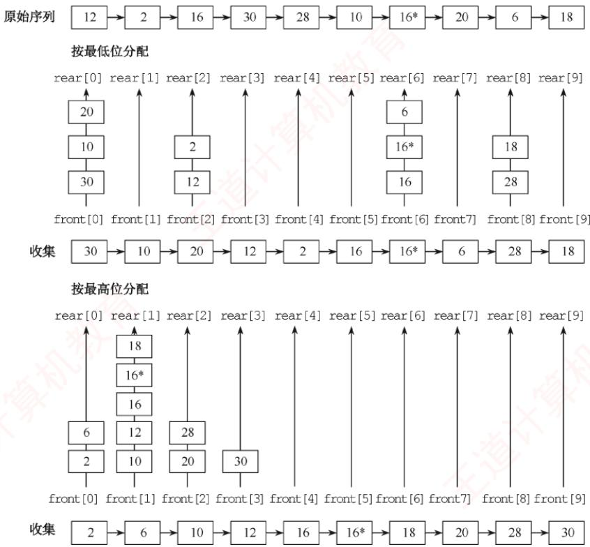

需要通过2次分配和收集完成排序。

## 03.【解答】

cmpCountSort算法基于计数排序的思想，对序列进行排序。cmpCountSort算法遍历数组中的元素，count数组记录比对应待排序数组元素下标大的元素个数，例如，count[1]=3的意思是数组a中有三个元素比a[1]小，即a[1]是第四大元素，a[1]的正确位置应是b[3]。

1）排序结果为b[6]={-10,10,11,19,25,25}。

<!-- PDF pages 385-404; chunk 0004_p000385-000404 -->

2）由代码 $\mathrm{f}\circ\mathrm{r}(\mathrm{i}=0;\mathrm{i}<\mathrm{n}-1;\mathrm{i}++)$ 和 $\mathrm{f} \circ \mathrm{r} (\mathrm{j}=\mathrm{i}+1 ; \mathrm{j}<\mathrm{n} ; \mathrm{j}++)$ 可知，在循环过程中，每个元素都与它后面的所有元素比较一次（所有元素都两两比较一次），比较次数之和为$(n - 1) + (n - 2) + \cdots + 1$ ，所以总比较次数为n(n-1)/2。

3）不是。需要将程序中的if语句修改如下：

$$
\begin{array} { l } { \mathtt { i i f } \; ( \mathtt { a } \; [ \; \mathtt { i } \; ] < = \mathtt { a } \; [ \; \mathtt { j } \; ] \; ) \quad \mathtt { c o u n t } \; [ \; \mathtt { j } \; ] + + ; } \\ { \mathtt { e l s e } \quad \mathtt { c o u n t } \; [ \; \mathtt { i } \; ] + + ; } \end{array}
$$

若不加等号，两个相等的元素比较时，前面元素的count值会加1，则导致原序列中靠 前的元素在排序后的序列中处于靠后的位置。

## 8.6 各种内部排序算法的比较及应用

## 8.6.1 内部排序算法的比较

前面讨论的排序算法很多，各种排序算法的对比是考研常考的内容。通常从五个方面进行对比：时间复杂度、空间复杂度、稳定性、适用性和过程特征。 X

## 考点追踪各种排序算法的特点和对比（2009、2010、2017、2020、2022、2025）

从时间复杂度看：简单选择排序、直接插入排序和冒泡排序在平均情况下的时间复杂度均为${ \cal O } ( n ^ { 2 } )$ ，且实现较为简单。其中，直接插入排序和冒泡排序在最好情况下可达O(n)，而简单选择排序的时间复杂度与序列初始状态无关。希尔排序作为插入排序的改进，对较大规模的数据通常具有较高效率，但目前未知其精确的渐近时间。堆排序利用堆这种数据结构，可在O(n)时间内完成建堆，整个排序过程的时间复杂度为O(nlog₂n)。快速排序基于分治思想，最坏情况下的时间复杂度为 $O ( n ^ { 2 } )$ ，但平均性能可达O(nlog2n)，在实际应用中快速排序通常表现优异。归并排序同样基于分治思想，其分割过程与初始序列无关，因此最好、最坏和平均时间复杂度均为O(nlog₂n)。

从空间复杂度看：简单选择排序、插入排序、冒泡排序、希尔排序和堆排序仅需常数级辅助空间，空间复杂度为O(1)。快速排序需要递归工作栈，平均空间复杂度为O(log₂n)，最坏情况下可能达到O(n)。2路归并排序在合并操作中需要额外的辅助数组用于元素复制，空间复杂度为O(n)。虽有方法可减少辅助空间，但通常会导致算法复杂度显著增加，甚至影响时间效率。

## 考点追踪各种排序算法的稳定性及分析（2021、2023）

从稳定性看：插入排序、冒泡排序、归并排序和基数排序是稳定的排序算法，而简单选择排序、快速排序、希尔排序和堆排序都是不稳定的。在平均时间复杂度为O(nlog2n)的排序算法中，只有归并排序是稳定的。判断排序算法是否稳定，关键在于分析其操作是否会改变相等元素的相对次序；对于不稳定的算法，通常可通过构造一个反例加以验证。

## 考点追踪各种排序算法的适用性（2017）

从适用性看：折半插入排序、希尔排序、快速排序和堆排序适用于顺序存储。直接插入排序、冒泡排序、简单选择排序、归并排序和基数排序既适用于顺序存储，也适用于链式存储。

## 考点追踪各种排序算法的过程特征（2012）

从过程特征看：不同排序算法在一趟或几趟处理后的中间结果通常是不同的。考研题目常给出初始序列和部分排序后的结果，要求判断所用的排序方法。这就要求考生熟练掌握各类算法的过程特征。如冒泡排序、简单选择排序和堆排序在每趟处理后都能确定当前最大（或最小）元素的最终位置，而快速排序在一趟划分后，至少能确定一个元素（枢轴）的最终位置等。

表8.1列出了各种排序算法的时空复杂度和稳定性情况。其中，空间复杂度仅列出平均情况：由于希尔排序的时间复杂度依赖于所选的增量序列，因此无法给出精确表达式。

表8.1 各种排序算法的性质
<table><tr><td rowspan=1 colspan=1>算法种类</td><td rowspan=1 colspan=3>时间复杂度</td><td rowspan=2 colspan=1>空间复杂度</td><td rowspan=2 colspan=1>是否稳定</td></tr><tr><td rowspan=1 colspan=1></td><td rowspan=1 colspan=1>最好情况</td><td rowspan=1 colspan=1>平均情况</td><td rowspan=1 colspan=1>最坏情况</td></tr><tr><td rowspan=1 colspan=1>直接插入排序</td><td rowspan=1 colspan=1>O(n)</td><td rowspan=1 colspan=1> $\boxed { \mathcal { O } ( n ^ { 2 } ) }$ </td><td rowspan=1 colspan=1> $\overline { { \mathcal { O } ( n ^ { 2 } ) } }$ </td><td rowspan=1 colspan=1>0(1)</td><td rowspan=1 colspan=1>是</td></tr><tr><td rowspan=1 colspan=1>冒泡排序</td><td rowspan=1 colspan=1>O(n)</td><td rowspan=1 colspan=1>O(n2)</td><td rowspan=1 colspan=1>O(n2)</td><td rowspan=1 colspan=1>0(1)</td><td rowspan=1 colspan=1>是</td></tr><tr><td rowspan=1 colspan=1>简单选择排序</td><td rowspan=1 colspan=1>O(n2)</td><td rowspan=1 colspan=1>O(n2)</td><td rowspan=1 colspan=1>O(n2)</td><td rowspan=1 colspan=1>0(1)</td><td rowspan=1 colspan=1>否</td></tr><tr><td rowspan=1 colspan=1>希尔排序</td><td rowspan=1 colspan=3></td><td rowspan=1 colspan=1>O(1)</td><td rowspan=1 colspan=1>否</td></tr><tr><td rowspan=1 colspan=1>快速排序</td><td rowspan=1 colspan=1>O(nlog2n)</td><td rowspan=1 colspan=1>O(nlog2n)</td><td rowspan=1 colspan=1>O(n2)</td><td rowspan=1 colspan=1>O(log2n)</td><td rowspan=1 colspan=1>否</td></tr><tr><td rowspan=1 colspan=1>堆排序</td><td rowspan=1 colspan=1>O(nlog2n)</td><td rowspan=1 colspan=1>O(nlog2n)</td><td rowspan=1 colspan=1>O(nlog2n)</td><td rowspan=1 colspan=1>0(1)</td><td rowspan=1 colspan=1>否</td></tr><tr><td rowspan=1 colspan=1>2路归并排序</td><td rowspan=1 colspan=1>O(nlog2n)</td><td rowspan=1 colspan=1>O(nlog2n)</td><td rowspan=1 colspan=1>O(nlog2n)</td><td rowspan=1 colspan=1>O(n)</td><td rowspan=1 colspan=1>是</td></tr><tr><td rowspan=1 colspan=1>基数排序</td><td rowspan=1 colspan=1>O(d(n + r))</td><td rowspan=1 colspan=1>O(d(n + r))</td><td rowspan=1 colspan=1>O(d(n + r))</td><td rowspan=1 colspan=1>O(r)</td><td rowspan=1 colspan=1>是</td></tr></table>

## 8.6.2 内部排序算法的应用

通常情况，对排序算法的比较和应用应考虑以下情况。

考点追踪选取排序算法时需要考虑的因素（2019）

## 1. 选取排序算法需要考虑的因素

1）待排序元素的个数n。

2）待排序序列的初始状态（如是否基本有序）。

3）关键字的结构及其分布情况。

4）对稳定性的要求。

5）存储结构类型及辅助空间的限制等。

## 2. 排序算法选型小结

1）若n较小，可采用直接插入排序或简单选择排序。直接插入排序的记录移动次数通常多于简单选择排序，因此当记录本身信息量较大时，简单选择排序更为合适。

2）若n较大，应采用时间复杂度为O(nlog₂n)的排序算法，如快速排序、堆排序或归并排序。当关键字随机分布时，快速排序通常被认为是最高效的基于比较的内部排序算法。堆排序所需辅助空间少于快速排序，且不会退化到最坏情况，但两者均为不稳定排序。若既要求稳定性，又希望达到O(nlog2n)的时间复杂度，则应选用归并排序。

3）若初始序列已基本有序，则直接插入或冒泡排序更为高效，因其最好时间复杂度为O(n)。

4）在基于比较的排序算法中，每次比较两个关键字仅有两种可能的结果，因此其执行过程可用一棵判定树来描述。由此可证明：对于n个关键字的随机排列，任何基于比较的排序算法，在最坏情况下至少需要O(nlog2n)的时间。

5）若n很大，且关键字位数较少、可分解为多个子关键字（如整数、字符串），则基数排序是更优选择，因其时间复杂度可接近线性。

6）当记录本身信息量较大（如包含大量字段或大对象）时，为避免因频繁移动记录而产生高昂开销，宜采用链表作为存储结构，此时插入类或归并类排序更具优势。

## 8.6.3 本节试题精选

## 一、单项选择题

01. 若要求排序是稳定的，且关键字为实数，则在下列排序算法中应选（）。

A. 直接插入排序 B. 选择排序 C. 基数排序 D. 快速排序

02. 以下排序算法中时间复杂度为O(nlog2n)且稳定的是（）。A. 堆排序 B. 快速排序 C. 归并排序 D. 直接插入排序

03. 设被排序的结点序列共有n个结点，在该序列中的结点已十分接近有序的情况下，用直接插入排序、归并排序和快速排序对其进行排序，这些算法的时间复杂度应为（）。A. O(n), O(n), O(n) B. $O ( n ) , O ( n \log _ { 2 } n ) , O ( n \log _ { 2 } n )$ C. $O(n),O(n\log_{2}n),O(n^{2})$ D. $O(n^{2}),O(n\log_{2}n),O(n^{2})$

04. 下列排序算法中属于稳定排序的是（①），平均时间复杂度为O(nlog2n)的是（②），在最好的情况下，时间复杂度可以达到线性时间的有（③）。（注：多选题）I. 冒泡排序 Ⅱ. 堆排序 I. 选择排序 IV. 直接插入排序 直机教育V. 希尔排序 VI. 归并排序 VI. 快速排序

05.就排序算法所用的辅助空间而言，堆排序、快速排序和归并排序的关系是（）。A. 堆排序<快速排序<归并排序 B. 堆排序<归并排序<快速排序C.堆排序>归并排序>快速排序 D. 堆排序>快速排序>归并排序

06.排序趟数与序列的初始状态无关的排序算法是（）。I. 快速排序 I. 简单选择排序 I. 冒泡排序 IV. 基数排序A. I、III B. II、IV C. I、II、IV D. I、 IV

07. 排序趟数与序列的初始状态有关的排序算法是（）。A. 直接插入排序 B. 2 路归并排序 C. 快速排序 D. 堆排序

08. 对n个元素进行排序，其排序趟数肯定为n-1趟的排序算法是（）。A. 直接插入排序和快速排序 B. 冒泡排序和快速排序C. 简单选择排序和直接插入排序 D. 简单选择排序和冒泡排序

09. 若序列的初始状态为{1,2,3,4,5,10,6,7,8,9}，要想使得排序过程中的元素比较次数最少，则应该采用（）方法。A. 插入排序 B. 选择排序 C. 希尔排序 D. 冒泡排序

10. 对于元素个数相同的不同初始序列，总比较次数大致相同的排序算法是（）。A. 折半插入排序和简单选择排序 B. 基数排序和归并排序C. 冒泡排序和快速排序 D. 堆排序 老

11.一般情况下，以下查找效率最低的数据结构是（）。 KNA. 有序顺序表 B. 二叉排序树C. 堆 D. 平衡二叉树

12. 一台计算机具有多核CPU，可以同时执行相互独立的任务。归并排序的各个归并段可以并行执行，在下列排序算法中，不可以并行执行的有（）。I. 基数排序 II. 快速排序 III. 冒泡排序 IV. 堆排序A. I、ⅢII B. I、Ⅱ C. I、III、IV D. II、IV

13.【2009统考真题】若数据元素序列{11,12,13,7,8,9,23,4,5}是采用下列排序算法之一得到的第二趟排序后的结果，则该排序算法只能是（）。A. 冒泡排序 B. 插入排序 C. 选择排序 D. 2 路归并排序

14.【2010统考真题】对一组数据(2,12,16,88,5,10)进行排序，若前3趟排序结果如下：第一趟排序结果：2,12,16,5,10,88第二趟排序结果：2,12,5,10,16,88第三趟排序结果：2,5,10,12,16,88

则采用的排序算法可能是（）。A. 冒泡排序 B. 希尔排序 C. 归并排序 D. 基数排序

15.【2012统考真题】在内部排序过程中，对尚未确定最终位置的所有元素进行一遍处理称为一趟排序。下列排序算法中，每趟排序结束都至少能够确定一个元素最终位置的方法是（）。I. 简单选择排序 Ⅱ. 希尔排序 I. 快速排序 IV. 堆排序 V. 2 路归并排序A. 仅I、ⅢII、IV B.仅I、ⅢI、VC. 仅Ⅱ、ⅢI、IV D. 仅ⅢII、IV、V

16.【2017统考真题】在内部排序时，若选择了归并排序而未选择插入排序，则可能的理由是（）。I. 归并排序的程序代码更短 I. 归并排序的占用空间更少 机教I. 归并排序的运行效率更高A. 仅ⅡI B. 仅I C. 仅I、ⅡI D. 仅I、III

17.【2017统考真题】下列排序算法中，若将顺序存储更换为链式存储，则算法的时间效率会降低的是（）。王I. 插入排序 Ⅱ. 选择排序 . 冒泡排序 IV. 希尔排序 V. 堆排序A. 仅I、Ⅱ B. 仅ⅡI、ⅢII C. 仅Ⅲ、IV D. 仅IV、V

18.【2019统考真题】选择一个排序算法时，除算法的时空效率外，下列因素中，还需要考虑的是（）。I. 数据的规模 Ⅱ. 数据的存储方式 I. 算法的稳定性 IV. 数据的初始状态A. 仅ⅢII B. 仅I、Ⅱ C.仅ⅡI、ⅢII、IV D. I、ⅡI、ⅢII、IV

19.【2020统考真题】对大部分元素已有序的数组排序时，直接插入排序比简单选择排序效率更高，其原因是（）。I. 直接插入排序过程中元素之间的比较次数更少Ⅱ. 直接插入排序过程中所需的辅助空间更少Ⅲ. 直接插入排序过程中元素的移动次数更少A. 仅I B.仅Ⅲ C. 仅I、ⅡI D. I、ⅡI和ⅢII

20.【2022统考真题】对数据进行排序时，若采用直接插入排序而不采用快速排序，则可能的原因是（）。I. 大部分元素已有序 Ⅱ. 待排序元素数量很少 算机II. 要求空间复杂度为 O(1) IV. 要求排序算法是稳定的A.仅I、Ⅱ B. 仅ⅢII、IV C.仅I、II、IVD.I、ⅡI、III、IV

21：【2023统考真题】下列排序算法中，不稳定的是（）。I. 希尔排序 II. 归并排序 III. 快速排序 IV. 堆排序 V. 基数排序A. 仅I、Ⅱ B. 仅Ⅱ、V C. 仅I、III、IVD. 仅ⅢII、IV、V

22.【2025统考真题】在下列排序算法中，最坏情况下元素移动次数最少的是（）。A. 起泡排序 B. 直接插入排序C. 快速排序 D. 简单选择排序

23.【2025统考真题】对含9个关键字的初始序列进行排序，若序列的变化情况如下表所示，则下列排序算法中，采用的是（）。

<table><tr><td rowspan=1 colspan=1>初始序列</td><td rowspan=1 colspan=1>5,25,40, 30, 10, 20,45, 15, 35</td></tr><tr><td rowspan=1 colspan=1>第1趟排序后的序列</td><td rowspan=1 colspan=1>5, 10, 20, 30, 15, 35, 45, 25, 40</td></tr><tr><td rowspan=1 colspan=1>第2趟排序后的序列</td><td rowspan=1 colspan=1>5, 10, 15, 25, 20, 30, 40, 35, 45</td></tr></table>

A. 希尔排序 B. 基数排序 C. 归并排序 D. 折半插入排序

## 二、综合应用题

01. 设关键字序列为{3,7,6,9,7,1,4,5,20}，对其进行排序的最小交换次数是多少？

02. 设顺序表用数组A[]表示，表中元素存储在数组下标1～m+n的范围内，前m个元素递增有序，后n个元素递增有序，设计一个算法，使得整个顺序表有序。

1）给出算法的基本设计思想。

2）根据设计思想，采用C/C++描述算法，关键之处给出注释。

3）说明你所设计算法的时间复杂度与空间复杂度。

03. 设有一个数组中存放了一个无序的关键序列 $K_{1},K_{2},\cdots,K_{n} 。$ 现要求将 $K _ { n }$ 放在将元素排序后的正确位置上，试编写实现该功能的算法，要求比较关键字的次数不超过n。

## 8.6.4 答案与解析

## 一、单项选择题

01. A

采用排除法。题目要求是稳定排序，因此排除选项B和D，又基数排序不能对float型和double型的实数进行排序，因此排除选项C。

02. C

堆排序和快速排序不是稳定排序算法，而直接插入排序算法的时间复杂度为 $O ( n ^ { 2 } )$ o

## 03. C

各种排序算法的时间和空间复杂度、稳定性等见表8.1。

04. ①I、IV、VI ② ⅡI、VI、VII ③ I、IV

读者应能从算法的原理上理解算法的稳定性情况。堆排序和归并排序在最坏情况下的时间复杂度与最好情况下的时间复杂度是同一数量级的，都是O(nlog2n)。

## 05. A

堆排序的空间复杂度为O(1)，因此快速排序的空间复杂度在最坏情况下为O(n)，平均空间复杂度为 O(log2n)，归并排序的空间复杂度为O(n)。

06. B

冒泡排序的趟数为1～n-1，和序列初态有关。简单选择排序每趟都选出一个最小（或最大）的元素，排序趟数固定为n-1。基数排序每趟都要进行分配和收集，排序趟数固定为d。快速排序的趟数和枢轴的选取有关，即和划分是否对称有关，当划分的两个区域分别包含0个元素和n-1个元素时，这种最大限度的不对称性发生在序列初态基本有序时。

07. C

直接插入排序的趟数始终为n-1，而与序列的初始状态无关。2路归并排序的趟数始终为「1og₂n，而与序列的初始状态无关。堆排序每趟选出一个最大元素或最小元素，然后调整堆，初始建好堆后，需要n-1趟输出和调整堆的操作，而与序列的初始状态无关。

08. C

简单选择排序和直接插入排序的趟数始终为n-1。冒泡排序的趟数为1～n-1，快速排序的趟数为log2n\~n-1，具体取决于序列的初始状态（快速排序还取决于划分方法）。

09. A

选择排序和序列初态无关，直接排除。初始序列基本有序时，插入排序比较次数较少。本题中，插入排序仅需比较n-1+4次，而希尔排序和冒泡排序的比较次数均远大于此。

## 10. A

简单选择排序的总比较次数显然是确定的。折半插入排序每趟的比较次数都为O(1og2m)（m为当前已排好序的子序列的长度），因此总比较次数也是确定的。基数排序不是基于比较的排序算法。其他几种排序算法的比较次数显然和序列的初始状态有关。

## 11. C

堆是用于排序的，在查找时它是无序的，所以效率没有其他查找结构的高。

## 12. A

基数排序每趟需要利用前一趟已排好的序列，无法并行执行。快速排序每趟划分的子序列互不影响，可以并行执行。冒泡排序每趟对未排序的所有元素进行一趟处理，无法并行执行。堆排序可以并行执行，因为根结点的左右子树构成的子堆在执行过程中是互不影响的。

## 13. B

每趟冒泡和选择排序后，总会有一个元素被放置在最终位置上。显然，这里{11,12}和{4,5}所处的位置并不是最终位置，因此不可能是冒泡和选择排序。2路归并算法经过第二趟后应该是每4个元素有序的，但{11,12,13,7}并非有序，因此也不可能是2路归并排序。

## 14. A

题中给出的排序过程，每一趟都是从前往后依次比较使最大值沉底，符合冒泡排序的特点。分别用其他3种排序算法尝试，归并排序第一趟后的结果为(2,12,16,88,5,10)，基数排序第一趟

## 15. A

对于说法Ⅰ，简单选择排序每次选择未排序序列中的最小元素放入其最终位置。对于说法Ⅱ，希尔排序每次对划分的子表进行排序，得到局部有序的结果，所以不能保证每趟结束都能确定一个元素的最终位置。对于说法Ⅲ，快速排序每趟结束后都将枢轴元素放到最终位置。对于说法IV，堆排序属于选择排序，每次都将大根堆的根结点与表尾结点交换，确定其最终位置。对于选项V，2路归并排序每趟对子表进行两两归并，从而得到若于局部有序的结果，但无法确定最终位置。

## 16. B

归并排序的代码比插入排序的代码更为复杂，前者的空间复杂度为 $O ( n )$ ，后者为O(1)。但是前者的时间复杂度为O(nlog2n)，后者为 $O ( n ^ { 2 } )$ IKNIT

## 17. D

在顺序存储的条件下，插入排序、选择排序、冒泡排序的时间复杂度都是 $O(n^{2})$ ，更换为链式存储后的时间复杂度还是 $O ( n ^ { 2 } )$ 。希尔排序和堆排序都利用了顺序存储的随机访问特性，而链式存储不支持这种性质，所以时间复杂度会增加。

## 18. D

当数据规模较小时可选择复杂度为 $O ( n ^ { 2 } )$ 的简单排序算法，当数据规模较大时应选择复杂度为 $O ( n \log _ { 2 } n )$ 的排序算法，当数据规模大到内存无法放下时需选择外部排序算法，说法Ⅰ正确。数据的存储方式主要分为顺序存储和链式存储，有些排序算法（如堆排序）只能用于顺序存储方式，说法Ⅱ正确。若对数据稳定性有要求，则不能选择不稳定的排序算法，说法Ⅲ显然正确。当数据初始基本有序时，直接插入排序的效率最高，冒泡排序和直接插入排序的时间复杂度都为$O ( n )$ ，而归并排序的时间复杂度仍然为 $O ( n \log _ { 2 } n )$ ，说法IV正确。

## 19. A

考虑比较极端的情况，对于有序数组，直接插入排序的比较次数为n-1，简单选择排序的比较次数始终为 $1+2+\cdots+n-1=n(n-1)/2$ ，说法Ⅰ正确。两种排序算法的辅助空间都为O(1)，无

差别，说法Ⅱ错误。初始有序时，移动次数均为0；对于通常情况，直接插入排序每趟插入都需要依次向后挪位，而简单选择排序只需与找到的最小元素交换位置，后者的移动次数少很多，说法Ⅲ错误。

## 20. D

直接插入排序和快速排序的特点如下表所示。

<table><tr><td rowspan=1 colspan=1></td><td rowspan=1 colspan=1>适合初始序列情况</td><td rowspan=1 colspan=1>适合元素数量</td><td rowspan=1 colspan=1>空间复杂度</td><td rowspan=1 colspan=1>稳定性</td></tr><tr><td rowspan=1 colspan=1>直接插入排序</td><td rowspan=1 colspan=1>大部分元素有序</td><td rowspan=1 colspan=1>较少</td><td rowspan=1 colspan=1>0(1)</td><td rowspan=1 colspan=1>稳定</td></tr><tr><td rowspan=1 colspan=1>快速排序</td><td rowspan=1 colspan=1>基本无序</td><td rowspan=1 colspan=1>较多</td><td rowspan=1 colspan=1>O(log2n)</td><td rowspan=1 colspan=1>不稳定</td></tr></table>

可见，说法I、Ⅱ、Ⅲ、IV都是采用直接插入排序而不采用快速排序的可能原因。

## 21. C

稳定的内部排序算法：插入排序、冒泡排序、归并排序和基数排序。不稳定的内部排序算法： 简单选择排序、快速排序、希尔排序和堆排序。 V

## 22. D

简单选择排序每趟从未排序部分选出最小（或最大）元素，与未排序部分的首元素交换。无论输入如何，最多执行n-1次交换，总移动次数为O(n)，是所有选项中最少的。而起泡排序、直接插入排序和快速排序在最坏情况下均需O(n²)次移动（如逆序时起泡和插入需要大量移位，快排递归分割导致频繁交换）。因此，简单选择排序在最坏情况下的元素移动次数最少。

## 23. A

第1趟排序后，序列呈现出以间隔3分组的局部有序特征：下标模3相同的元素各自有序（如位置1,4,7上的25,10,15变为10,15,25；位置2,5,8上的40,20,35变为20,35,40），这是希尔排序在增量d=3时对各子序列进行插入排序的典型特征。第2趟进一步调整，符合增量缩小至1的结果。而其他三种排序方法均无法产生这种跨距离分组、局部有序的中间状态。

## 二、综合应用题

## 01.【解答】

直接插入排序的交换次数更多，因此应当采用简单选择排序。

初始序列：3,7,6,9,7,1,4,5,20

第一次：1,7,6,9,7,3,4,5,20 交换1,3

第二次：1,3,6,9,7,7,4,5,20 交换3,7

第三次：1,3,4,9,7,7,6,5,20 交换4,6

第四次：1,3,4,5,7,7,6,9,20 交换5,9

第五次：1,3,4,5,6,7,7,9,20 交换6,7

所以最小交换次数为5（注意这里求的是交换次数，而不是移动次数或比较次数）。

## 02.【解答】

1）算法的基本设计思想如下：将数组A[1...m+n]视为一个已经过m趟插入排序的表，则从m+1趟开始，将后n个元素依次插入前面的有序表中。

2）算法的实现如下：

```c
void Insert Sort(ElemType A[],int m,int n){
int i,j;
for(i=m+1;i<=m+n;i++){ //依次将A[m+1...m+n]插入有序表
A[0]=A[i]; //复制为哨兵
for(j=i-1;A[j]>A[0];j--) //从后往前插入
A[j+1]=A[j]; //元素后移
A[j+1]=A[0]; //插入
```

3）时间复杂度由m和n共同决定，从上面的算法不难看出，在最坏情况下元素的比较次数为O(mn)，而元素移动的次数为O(mn)，所以时间复杂度为 O(mn)。

因为算法只用到了常数个辅助空间，所以空间复杂度为O(1)。

此外，本题也可采用归并排序，将A[1...m]和A[m+1...m+n]视为两个待归并的有序子序列，算法的时间复杂度为 O(m + n)，空间复杂度为 O(m + n)。

## 03. 【解答】

基本思想：以 $K _ { n }$ 为枢轴进行一趟快速排序。将快速排序算法改为以最后一个元素为枢轴，先从前往后，再从后往前。算法的代码如下：

int Partition(ElemType K[],int n) {  
//交换序列κ[1..n]中的记录，使枢轴到位，并返回其所在位置  
int i=1,j=n; //设置两个交替变量初值分别为1和n  
ElemType pivot=K[j]; //枢轴  
while(i<j){ while(i<j&&K[i]<=pivot) //循环跳出条件 道  
i++; //从前往后找比枢轴大的元素  
if (i<j)  
K[j]=K[i]; //移动到右端  
while(i<j&&K[j]>=pivot)  
j--; //从后往前找比枢轴小的元素  
if (i<j)  
K[i]=K[j]; //移动到左端  
} ∥while  
K[i]=pivot; //枢轴存放在最终位置  
return i; //返回存放枢轴的位置

## 8.7 外部排序

外部排序可能会考查相关概念、方法及排序过程。本节的主要内容包括：

①外部排序是指对大文件进行排序，即待排序记录存储在外存中，且无法一次性全部装入内存，需在内存与外存之间多次交换数据，以完成整个文件的排序。

②为减少多路平衡归并中外存读/写次数可采取的方法：增大归并路数和减少归并段数。

③利用败者树可高效实现多路归并，从而增大归并路数。

④利用置换-选择排序可生成更长的初始归并段，从而减少归并段个数。

⑤由长度不等的归并段进行多路平衡归并时，需要构造最佳归并树。

## 8.7.1 外部排序的基本概念

此前介绍的排序算法均假设所有数据可一次性载入内存（称为内部排序）。而在许多应用中，常需对大规模文件进行排序；由于记录数量庞大，无法将整个文件一次性装入内存。此时，待排序记录必须存储在外存中，排序时仅能将部分数据调入内存处理，并通过多次内外存之间的数据交换，逐步完成整体排序。这类依赖内外存协同操作的排序算法，称为外部排序。

## 8.7.2 外部排序的方法

文件通常以块为单位存储在磁盘上，操作系统也按块对磁盘信息进行读/写操作。由于磁盘读/写的机械动作耗时远高于内存运算时间（相比而言后者可忽略不计），因此外部排序的时间代价主要取决于访问磁盘的次数，即I/O 次数。

## 考点追踪对大文件排序时使用的排序算法（2016）

外部排序通常采用归并排序策略，包含两个阶段：①生成初始归并段。根据内存缓冲区大小，将外存上的文件划分为若干子文件，依次读入内存，利用内部排序算法对每个子文件排序后写回外存，形成多个有序的初始归并段（也称顺串）；②多路归并。对这些初始归并段进行逐趟多路归并，每趟将多个有序段合并为更长的有序段，逐步减少段数，最终得到整个有序文件。

例如，一个包含2000个记录的文件，每个磁盘块可容纳125个记录。首先通过8次内部排序，得到8个初始归并段R1～R8，每段包含250条记录。随后，对该文件执行如图8.15所示的2路归并，直至获得一个有序文件。具体实现时，可将内存工作区划分为三个缓冲区（见图8.14）：两个输入缓冲区和一个输出缓冲区。首先，从归并段R1和R2中各读入一个磁盘块，分别存入两个输入缓冲区：然后在内存中进行2路归并，将归并结果依次写入输出缓冲区：若输出缓冲区已满，则将其内容写入新的归并段R1'，清空后继续接收后续归并结果：若某个输入缓冲区取空，则从对应的归并段中读入下一块数据，继续参与归并。如此反复，直至R1与R2的所有记录均被归并完毕。接着归并R3与R4、R5与R6、R7与R8，完成第一趟归并。第二趟归并R1′与R2'、R3'与R4′。第三趟归并R1"与R2”，最终得到完整的有序文件，整个过程共进行3趟归并。

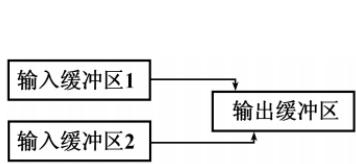  
图 8.14 2 路归并

  
图 8.15 2 路归并的排序过程

在外部排序中实现两两归并时，通常无法将两个输入有序段及归并结果同时驻留于内存中，因此必须频繁地将数据从外存读入、再将结果写回磁盘，这会消耗大量时间。一般而言，有

$$
 外部排序总时间  =  内部排序时间  +  外存读 / 写时间  +  内部归并时间
$$

显然，外存读/写时间远大于内部排序与内部归并所需的时间，因此应着力减少I/O次数。由于外存的读/写操作以磁盘块为单位进行，结合前例可知，每趟归并需进行16次读和16次写，共32次I/O；3趟归并加上初始内部排序阶段的32次I/O，总计32×3+32=128次I/O操作。

若改用4路归并，则仅需2趟归并，总I/O次数降至32×2+32=96次。由此可见，增大归并路数可有效减少归并趟数，从而显著降低总的磁盘I/O次数，如图8.16所示。

  
图8.16 4 路归并的排序过程

一般地，对r个初始归并段进行k路归并（每趟将k个或更少的有序子文件合并为一个）。第一趟可将r个归并段合并为「r/k]个，后续每趟归并将m个归并段合并为「m/k]个，直至只剩一个

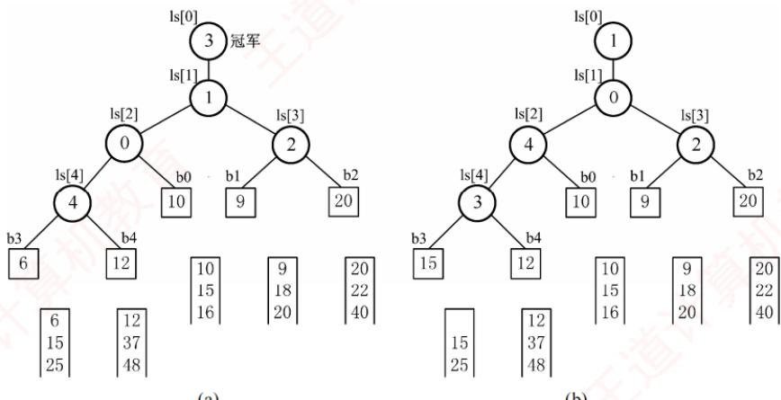  
图8.17 实现 5 路归并的败者树

归并段。树的高度-1 =「1ogkr]= 归并趟数 $S _ { \circ }$ 因此，增大归并路数k，或减少初始归并段个数r，均可减少归并趟数S，进而减少磁盘I/O次数，有效提升外部排序效率。

## 8.7.3 多路平衡归并与败者树

增大归并路数k可减少归并趟数S，从而降低I/O次数。然而，随着k的增大，内部归并的时间开销也会显著增加。这是因为在k个元素中选出关键字最小者，每次选择需要进行k-1次比较；每趟归并n个元素，共需 $( n   -   1 ) ( k   -   1 )$ 次比较。S趟归并的总比较次数为①

$$
S(n - 1)(k - 1) = \left\lceil \log_{k}r \right\rceil(n - 1)(k - 1) = \left\lceil \log_{2}r \right\rceil(n - 1)(k - 1) / \left\lceil \log_{2}k \right\rceil
$$

式中，（k-1)1og₂k随k增大而增大，因此内部归并时间也随之增长，这将部分抵消因减少I/O次数带来的性能收益。因此，不能直接使用普通的多路归并方法。

为使内部归并的时间复杂度不受k增大的影响，引入了败者树。败者树是树形选择排序的一种变体，可视为一棵完全二叉树。其k个叶结点分别存放k个归并段当前参与比较的元素，内部结点用于记录左右子树比较中的“败者”（关键字较大者），而“胜者”（较小者）继续向上参与比较，最终胜者的段号存于s[0]，其对应的关键字即为当前最小值。 道

## 考点追踪败者树的实现原理（2024）

如图8.17(a)所示，考虑5路归并，叶结点为b0,b1,b2,b3,b4：b3与b4比较，b4为败者，将其段号4写入父结点1s[4]；b1与b2比较，b2为败者，将段号2写入1s[3]；胜者b3与b0比较，b0为败者，将段号0写入1s[2]；最后，两个子树的胜者b3与b1比较，b1为败者，将段号1写入ls[1];而将胜者b3的段号3写入1s[0]，表明当前最小关键字来自第3段。输出b3中的关键字后，从第3段读入下一个关键字，更新b3，并沿路径向上重新调整败者树。

由于k路归并的败者树深度为 $\lceil \log _ { 2 } k \rceil + 1$ ，因此从k个记录中选出最小关键字，仅需 $\left[ \log _ { 2 } \vec { k } \right]$ 次比较。此时，总的比较次数约为 uK VI

$$
S(n - 1)\left[ \log_{2}k \right] = \left[ \log_{k}r \right](n - 1)\left[ \log_{2}k \right] = (n - 1)\left[ \log_{2}r \right]
$$

可见，使用败者树后，内部归并的比较次数与归并路数k无关。因此，在内存空间允许的前提下，增大k可有效降低归并树高度，减少I/O次数，从而提高外部排序的效率。

值得注意的是，归并路数k并非越大越好。增大k需要增加输入缓冲区的数量。若总内存容量固定，则每个缓冲区的容量将相应减小，导致每趟归并中外存读/写的次数增加。当k过大时，尽管归并趟数减少，但总体I/O次数反而可能增加，从而抵消性能增益。

## 8.7.4 置换-选择排序（生成初始归并段）

由8.7.2节可知，减少初始归并段个数r同样可减少归并趟数S。若待排序记录总数为n，每个归并段的平均长度为l，则归并段个数 $r = \lceil n / \ell \rceil$ 。采用普通内部排序方法生成的初始归并段长度通常固定（除最后一段外），其长度受限于内存工作区的大小。因此，有必要探索新方法以生成更长的初始归并段，从而减少r，这就是本节要介绍的置换-选择算法。

## 考点追踪置换-选择排序生成初始归并段的实例（2023）

设初始待排文件为FI，归并段输出文件为FO，内存工作区为WA，其中 WA可容纳w个记录，初始时FO与WA均为空。置换-选择算法的执行步骤如下： X

1）从 FI读入 w个记录至工作区WA。

2）从WA中选出当前关键字最小的记录，记为MINIMAX记录。

3）将该 MINIMAX记录写入FO。

4）若FI非空，则从FI读入下一个记录至WA。

5）从WA中所有关键字不小于当前MINIMAX关键字的记录中，选出关键字最小者，作为新的 MINIMAX记录。 长

6）重复步骤3）～5），直至WA中不存在关键字不小于当前MINIMAX的记录为止，此时完成一个初始归并段的输出。 KK

7）重复步骤2）～6），直至FI与WA均为空，从而生成全部初始归并段。

通过该方法，初始归并段长度不再受限于内存大小w，而取决于输入数据的分布。理想情况下（如输入基本有序），可生成长度远超w的归并段，显著减少归并段总数。

设待排文件 FI = {17,21,05,44,10,12,56,32,29}，WA 容量为3，排序过程如表8.2所示。

表8.2 置换-选择排序过程示例
<table><tr><td rowspan=1 colspan=1>输出文件FO</td><td rowspan=1 colspan=1>工作区</td><td rowspan=1 colspan=3>WA</td><td rowspan=1 colspan=1></td><td rowspan=1 colspan=1>输入文件FI</td></tr><tr><td rowspan=1 colspan=1></td><td rowspan=1 colspan=5></td><td rowspan=1 colspan=1>17,21,05, 44, 10, 12,56,32,29</td></tr><tr><td rowspan=1 colspan=1></td><td rowspan=1 colspan=3>17 2105</td><td rowspan=1 colspan=2></td><td rowspan=1 colspan=1>44, 10, 12, 56, 32, 29</td></tr><tr><td rowspan=1 colspan=1>05</td><td rowspan=1 colspan=5>1721 44</td><td rowspan=1 colspan=1>10, 12, 56, 32, 29</td></tr><tr><td rowspan=1 colspan=1>05 17</td><td rowspan=1 colspan=2>10214</td><td rowspan=1 colspan=3>4</td><td rowspan=1 colspan=1>12, 56, 32, 29</td></tr><tr><td rowspan=1 colspan=1>05 17 21</td><td rowspan=1 colspan=5>10 124</td><td rowspan=1 colspan=1>56, 32,29</td></tr><tr><td rowspan=1 colspan=1>05 17 21 44</td><td rowspan=1 colspan=5>10 12 56</td><td rowspan=1 colspan=1>32,29</td></tr><tr><td rowspan=1 colspan=1>05 17 21 44 56</td><td rowspan=1 colspan=5>10 12 32</td><td rowspan=1 colspan=1>29</td></tr><tr><td rowspan=1 colspan=1>05 17 21 44 56 #</td><td rowspan=1 colspan=5>1012 32</td><td rowspan=1 colspan=1>29</td></tr><tr><td rowspan=1 colspan=1>10</td><td rowspan=1 colspan=2>29123</td><td rowspan=1 colspan=3>2</td><td rowspan=1 colspan=1></td></tr><tr><td rowspan=1 colspan=1>10 12</td><td rowspan=1 colspan=5>29  32</td><td rowspan=1 colspan=1></td></tr><tr><td rowspan=1 colspan=1>10 12 29</td><td rowspan=1 colspan=2>32</td><td rowspan=1 colspan=3></td><td rowspan=1 colspan=1>xy</td></tr><tr><td rowspan=1 colspan=1>10 12 29 32</td><td rowspan=1 colspan=5>-</td><td rowspan=1 colspan=1></td></tr><tr><td rowspan=1 colspan=1>10 12 29 32 #</td><td rowspan=1 colspan=5></td><td rowspan=1 colspan=1></td></tr></table>

上述算法，在WA中选择MINIMAX记录的过程需利用败者树来实现。

## 8.7.5 最佳归并树

文件经过置换-选择排序后，得到长度不等的初始归并段。下面讨论如何安排这些长度不等

的归并段的归并顺序，使得I/O次数最少。假设通过置换-选择排序得到9个初始归并段，其长度依次为9,30,12,18,3,17,2,6,24。若采用3路平衡归并，一种可能的归并树如图8.18所示。

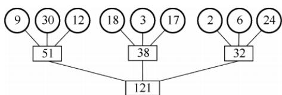

在图8.18中，各叶结点表示一个初始归并段，其上的权值表示该段的长度；叶结点到根的路径长度表示该图8.18 3 路平衡归并的归并树

段参与归并的趟数；非叶结点表示归并生成的新段；根结点对应最终有序文件。树的带权路径长度WPL等于归并过程中读取的总记录数，因此总的I/O次数 $2 \times  WPL = 484$

## 考点追踪构造三叉哈夫曼树及相关的分析和计算（2013）

显然，不同的归并方案对应不同的归并树，其WPL（I/O次数）也不同。为最小化I/O开销，可将哈夫曼编码的思想推广至k叉树情形：优先归并长度较小的段，延后归并长度较大的段，从而构造出I/O次数最少的最佳归并树。对上述9个归并段，按此原则构造的最佳3路归并树如图8.19所示，按此方案归并，总I/O次数仅为446，显著优于普通方案。


图8.19所示的归并树是一棵严格三叉树，即树中只有度为3或0的结点。然而，当初始归并段的数量不足以构成严格图8.19 3路平衡归并的最佳归并树

k叉树（也称正则k叉树）时，直接进行k路归并会导致某些归并轮次不足k路，从而降低效率。例如，若只有8个初始归并段（如删除上例中长度为30的段），如果强行在最后一次归并时降

为2路，其余仍为3路，则I/O次数将高达386，这并非最优方案。更优的做法是：引入若干长度为0的“虚段”（不包含实际数据的空归并段），使每趟归并都能满路（每次归并都处理3个段）。这些虚段不会产生实际的I/O开销，但能让归并树的结构更接近哈夫曼最优形态一一权值较小的段（包括虚段）被安排在更深的位置，避免过早参与归并。按照这一思路构造的最佳归并树如图8.20所示，其I/O次数显著降低至326。

  
图8.20 8个归并段的最佳归并树

如何判定添加虚段的数目？

设度为0的结点有 $n _ { 0 }$ 个，度为k的结点有 $n _ { k }$ 个，归并树的结点总数为n，则有：

$n = n_{k} + n_{0}$ (总结点数 = 度为 k的结点数 + 度为 0的结点数)

$n = k n _ { k } + 1$ （总结点数 = 所有结点的度数之和 +1)

因此，对严格k叉树有 $n _ { 0 } = ( k - 1 ) n _ { k } + 1$ ，由此可得 $n _ { k } = ( n _ { 0 } - 1 ) / ( k - 1 )$ o

接下来，根据 $n _ { 0 }$ 和k的关系，判断是否需要添加虚段：

若 $(n_{0}-1)\%(k-1)=0$ （%为取模运算），则说明这 $n _ { 0 }$ 个叶结点（初始归并段）正好可以构成一棵严格的k叉归并树。此时，内结点有 $n _ { k }$ 个。

若 $(n_{0}-1)\%(k-1)=u\neq0$ ，则说明对于这 $n _ { 0 }$ 个叶结点，其中有u个多余，不能直接纳入k叉归并树。为构造包含所有 $n _ { 0 }$ 个初始归并段的k叉归并树，应在原有 $n _ { k }$ 个内结点的基础上再增加1个内结点。该内结点将代替一个叶结点的位置，被代替的叶结点连同多出的u个叶结点，再加上k-u-1个空归并段，即可构建完整的归并树。

考点追踪实现最佳归并时需补充的虚段数量的分析（2019）

以图8.20为例，用8个归并段构造三叉树时， $(n_{0}-1)\%(k-1)=(8-1)\%(3-1)=1\ne0$ ，表明当前叶结点数无法构成严格的三叉树。因此，需要添加3-1-1=1个虚段，使叶结点总数增至9，满足 $(9 - 1)\%(3 - 1) = 0$ ，这样就可以构建一棵完整的严格三叉树。

## 8.7.6 本节试题精选

## 一、单项选择题

01. 外部排序和内部排序的主要区别是（）。A. 内部排序的数据量小，而外部排序的数据量大B.内部排序不涉及内、外存数据交换，而外部排序涉及内、外存数据交换C. 内部排序的速度快，而外部排序的速度慢D. 内部排序所需的内存小，而外部排序所需的内存大 +算

02. 下列关于外部排序的说法中，正确的是（）。A.置换选择排序得到的初始归并段的长度一定相等B. 内外存交换数据的时间只占总排序时间的一小部分C. 败者树是一棵完全二叉树D. 外部排序不涉及对文件的读/写操作

03.多路平衡归并的作用是（）。A. 减少归并趟数 B. 减少初始归并段的个数C. 便于实现败者树 D. 以上都对

04. 设在磁盘上存放有375000个记录，进行5路平衡归并排序，内存工作区能容纳600个记录，为把所有记录排好序，需要进行（）趟归并排序。A. 3 B. 4 C. 5 D. 6

05. 在下列关于外部排序过程输入/输出缓冲区作用的叙述中，不正确的是（）。A. 暂存输入/输出记录 B. 内部归并的工作区C. 产生初始归并段的工作区 D. 传送用户界面的消息

06. 若只需3趟排序就可完成64个元素的多路归并排序，则选取的归并路数最少是（）。A. 2 妆B. 3 C. 4 D. 5

07.置换-选择排序的作用是（）。A. 用于生成外部排序的初始归并段B.完成将一个磁盘文件排序成有序文件的有效的外部排序算法C.生成的初始归并段的长度是内存工作区的2倍D. 对外部排序中输入/归并/输出的并行处理 王

08. 一个无序文件的n个记录采用置换选择排序产生 m 个有序段，则 m和 n的关系是（）。A. m 与 n 成正比 B. $m = \log _ { 2 } n$ C. m 与 n 成反比 D. 以上都不对

09. 在由k路归并构建的败者树中选取一个关键字最小的记录，则所需时间为（）。A. O(1) B. O(k) C. O(log2k) D. 以上都不对

10.下列关于小顶堆和败者树的说法中，正确的是（）。I. 败者树从下往上维护，每上一层，只需和失败结点比较1次Ⅱ. 败者树的每次维护，必定要从叶结点一直走到根结点，不可能从中间停止Ⅲ.堆从上往下维护，每下一层，若其左右孩子均不为空，则需比较2次

IV. 堆的每次维护，必定要从根结点一直走到叶结点，不可能从中间停止A. I、III B. II、III K C.I、ⅡI、III D. I、III、IV

11. 最佳归并树在外部排序中的作用是（）。A. 完成 m 路归并排序 B. 设计m路归并排序的优化方案C. 产生初始归并段 D. 与锦标赛树的作用类似

12. 在由m个初始归并段构建的k阶最佳归并树中，不需要补充虚段，则度为k的结点个数是（）。A. (m − 1)/k B. m/k C. (m−1)/(k−1) D. 无法确定

13. 【2013统考真题】已知三叉树T中6个叶结点的权分别是2,3,4,5,6,7，T的带权（外部）路径长度最小是（）。A. 27 B. 46 C. 54 D. 56

14.【2016统考真题】对10TB的数据文件进行排序，应使用的方法是（）。A. 希尔排序 B. 堆排序 C. 快速排序 D. 归并排序

15.【2019统考真题】设外存上有120个初始归并段，进行12路归并时，为实现最佳归并，需要补充的虚段个数是（）。HA. 1 B. 2 C. 3 D. 4

16.【2024统考真题】在外排序中，利用败者树对初始为升序的归并段进行多路归并，败者树中记录“冠军”的结点保存的是（）。TA. 最大关键字 B. 最小关键字C. 最大关键字所在的归并段号 D. 最小关键字所在的归并段号

## 二、综合应用题

01.若某个文件经内部排序得到80个初始归并段，试问：1）若使用多路平衡归并执行3趟完成排序，则应取得的归并路数至少应为多少？2)若操作系统要求一个程序同时可用的输入/输出文件的总数不超过15个，则按多路归并至少需要几趟可以完成排序？若限定这个趟数，可取的最低路数是多少？

02. 假设文件有4500个记录，在磁盘上每个块可放75个记录。计算机中用于排序的内存区可容纳450个记录。试问：1）可以建立多少个初始归并段？每个初始归并段有多少记录？存放于多少个块中？2）应采用几路归并？请写出归并过程及每趟需要读/写磁盘的块数。

03. 设初始归并段为(10, 15, 31), (9, 20), (22, 34, 37), (6, 15, 42),(12, 37), (84, 95)。试利用败者 树进行m路归并，手工执行选择最小的5个关键字的过程。 FD

04. 给出12个初始归并段，其长度分别为30,44,8,6,3,20,60,18,9,62,68,85。现要做4路外归并排序，试画出表示归并过程的最佳归并树，并计算该归并树的带权路径长度WPL。

05.【2023统考真题】对含有n（n>0）个记录的文件进行外部排序，采用置换-选择排序生成初始归并段时需要使用一个工作区，工作区中能保存m个记录。请回答：1)若文件中含有19 个记录,其关键字依次是51,94,37,92, 14,63,15,99,48, 56,23,60, 31,17,43,8,90,166,100，则当m=4时，可生成几个初始归并段？各是什么？

2)对任意的 $m \left( n \gg m > 0 \right)$ ，生成的第一个初始归并段的长度最大值和最小值分别是多少？

## 8.7.7 答案与解析

## 一、单项选择题

01. B

外部排序和内部排序最主要的区别是是否涉及内存、外存的数据交换。

## 02. C

置换选择排序得到的是长度不一定相等的归并段，选项A错误。外部排序的主要时间消耗在内外存之间的数据交换上，选项B错误。败者树是一棵完全二叉树，选项C正确。外部排序包括两个阶段：生成初始归并段和对初始归并段进行归并，这两个阶段都涉及对文件的读/写操作，选项D错误。

## 03. A

多路平衡归并的目的是减少归并趟数，因为当m个初始归并段采用k路平衡归并时，所需趟数 $s = \lceil \log _ { k } m \rceil ,$ ，若不采用多路平衡归并，则其归并趟数大于s。

## 04. B

初始归并段的个数 $r=375000/600=625$ ，因此，归并趟数 $S = \lceil \log_{m} r \rceil = \lceil \log_{5} 625 \rceil = 4$ 。第一趟把625个归并段归并成625/5=125个；第二趟把125个归并段归并成125/5=25个；第三趟把25个归并段归并成25/5=5个；第四趟把5个归并段归并成5/5=1个。

## 05. D

在外部排序过程中输入/输出缓冲区就是排序的内存工作区，例如进行m路平衡归并需要m个输入缓冲区和1个输出缓冲区，用以存放参加归并的和归并完成的记录。在产生初始归并段时也可用作内部排序的工作区。它没有传送用户界面的消息的任务。

## 06. C

归并趟数= 「1ogkn]，其中 k 表示归并的路数，n表示元素个数，当 k = 4、n = 64 时，归并趟数恰好等于3，因此选取的归并路数至少是4。

## 07. A

置换-选择排序是外部排序中生成初始归并段的方法，用此方法得到的初始归并段的长度是不等长的，其长度平均是传统等长初始归并段的2倍，从而使得初始归并段数减少到原来的近二分之一。但是，置换-选择排序不是一种完整的生成有序文件的外部排序算法。

## 08. D

设内存工作区w=1，则文件{1,2,3,4,5}产生1个有序段，而文件{5,4,3,2,1}产生5个有序段，因此m与待排文件、内存工作区大小 w和 n都有关，但不是选项A、B、C 描述的直接关系。

## 09. C

在败者树中选取最小关键字的时间复杂度取决于败者树的高度，所需时间为 $O ( \log _ { 2 } k )$

## 10. C

说法Ⅰ正确，是败者树的性质。在败者树的维护过程中，会让胜利者一直调整到根结点，说法Ⅱ正确。以小根堆为例，每次调整时，先比较下一层的两个元素（1次），找出较小值，然后比较当前元素和下一层的较小元素（1次），以决定是否向下交换位置，说法Ⅲ正确。堆在维护时，可能会在中间某层停止（若此处无须调整），而不一定要走到叶结点，说法IV错误。

## 11. B

最佳归并树在外部排序中的作用是设计m路归并排序的优化方案，仿照构造哈夫曼树的方法，以初始归并段的长度为权值，构造具有最小带权路径长度的m叉哈夫曼树，可以有效地减少归并过程中的读/写记录数，加快外部排序的速度。 长

## 12. C

k阶最佳归并树中只有度为0和k的结点。设结点总数为n，度为0的结点数为 $n _ { 0 }$ ，度为k的结点数为 $n _ { k }$ ，则 $n_{0}=m、n-1=kn_{k},n=n_{0}+n_{k},$ 因此 $k n _ { k } = m + n _ { k } - 1$ ，求得 $n _ { k }   =   ( m   -   1 ) / ( k   -   1 )$

## 13. B

题中的三叉树为使WPL最小，必须构造三叉哈夫曼树，应满足 $(n_{0}-1)\%(3-1)=0$ 的条件，因

14. D

此需添加1个权值为0的虚叶结点，说明7个叶结点刚好可构成一棵严格的三叉树。按照哈夫曼树的原则，权为0的叶结点应离树根最远，构造三叉哈夫曼树的过程如下：

① 合并权值最小的三个结点 0,2,3，得到新结点的权值 = 5，剩下 5,4,5,6,7。

②合并权值最小的三个结点4,5,5，得到新结点的权值 = 14，剩下14,6,7。

③合并权值最小的三个结点6,7,14，得到新结点的权值=27，仅有27，建树完成。

$$
\mathrm{WPL}=\sum_{i=1}^{n} \mathrm{K}_{i} \left(W_{叶结点 i} \times \mathrm{ 深度 } D_{叶结点 i}=(2+3) \times 3+(4+5) \times 2+(6+7) \times 1=46\right)
$$

或

$$
\mathrm{WPL}=\sum_{1}^{m}\mathrm{权值}W_{ 分支结点 j}=27+14+5=46
$$

每个分支结点的权值都累加了其下面所有分支结点的权值，因此采用第二种方法更方便。


外部排序指的是大文件的排序，即待排序的记录存储在外存中，待排序的文件无法一次性装入内存，需要在内存和外存之间进行多次数据交换，以达到排序整个文件的目的。外部排序通常采用归并排序算法。选项A、B、C都是内部排序的方法。

## 15. B

在12路归并树中只存在度为0和度为12的结点，设度为0的结点数、度为12的结点数和要补充的结点数分别为 $n _ { 0 }  、 n _ { 1 2 }$ 和n，则有 $n_{ 补 }$ $n_{0}=120+n_{补}, \quad n_{0}=(12-1)n_{12}+1$ ，可得 $n_{12} = (120 - 1 + n_{补}) / (12 - 1)$ 因为结点数 $n _ { 1 2 }$ 为整数，所以 $n_{ 补 }$ 是使上式整除的最小整数，求得 $n_{ 补 } = 2$ 0

此外，题中为实现最佳归并，应满足12叉哈夫曼树， $n = 120, m = 12$ ，不满足 $(n - 1)\%(m - 1) = 0$ 的条件，因此需要添加两个权值为0的叶结点，使得 $n   =   1 2 2$ ，才能满足条件。

## 16. D

利用败者树归并升序归并段，每次需要得到当前的最小关键字，因此记录“冠军”的结点保存的只能是最小关键字或最小关键字所在的归并段号。通过败者树找出最小关键字后，还需要找到该关键字所在的归并段，并移动段内元素，以继续比较下一个元素，下面分别进行讨论：①假设记录“冠军”的结点保存的是最小关键字所在的归并段号，则能直接得到最小关键字及其所在的段，时间复杂度低。②假设记录“冠军”的结点保存的是最小关键字，则查找其所在的段需要检索所有段的首元素是否与该最小关键字相等，时间复杂度高。为了提高效率，记录“冠军”的结点保存的是最小关键字所在的归并段号，而不是最小关键字。 X

## 二、综合应用题

## 01. 【解答】

1）设归并路数为m，初始归并段个数 $r   = 8 0$ ，根据归并趟数计算公式 $S = \left\lceil \log_{m}r \right\rceil = \left\lceil \log_{m}80 \right\rceil =$ 3，得 $\log _ { m } 8 0 \leqslant 3 , m ^ { 3 } \geqslant 8 0$ 。由此解得 $m   \geq   5$ ，即应取的归并路数至少为5。

2）设多路归并的归并路数为m，需要m个输入缓冲区和1个输出缓冲区。一个缓冲区对应一个文件，有 $m + 1 = 1 5$ ，因此 $m = 1 4$ ，可做14路归并。由 $S = \lceil \log_{m} r \rceil = \lceil \log_{14} 80 \rceil = 2$ 即至少需要2趟归并可完成排序。若限定趟数为2，由 $S = \left\lceil \log_{m}80 \right\rceil = 2$ ，有 $8 0 { \leqslant } m ^ { 2 }$ ，可取的最低路数为9。即要在2趟内完成排序，进行9路归并排序即可。

## 02. 【解答】

1）文件有4500个记录，用于排序的内存区可容纳450个记录，可建立的初始归并段有4500/450=10个。每个初始归并段中有450个记录，存于450/75=6个块中。

2）内存区可容纳6个块，可建立6个缓冲区，其中5个缓冲区用于输入，1个缓冲区用于输出，因此可采用5路归并，归并过程如下图所示。

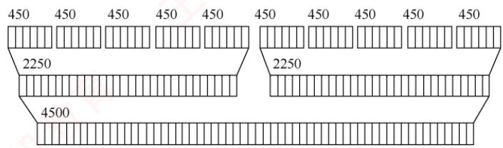

共进行了2趟归并，每趟需要读60块、写60块。

03.【解答】

进行6路归并排序，选择最小的5个关键字的败者树如下图所示。


04. 【解答】

设初始归并段个数 n =12，外归并路数 k = 4，计算(n−1)%(k −1)=11%3 =2≠0，说明不能做完全的4路归并，因为多出了两个初始归并段，必须添加k-2-1=1个长度为0的空归并段，才能构成严格的4路归并树，即每次归并都有k个归并段参加归并。 V

此时，归并树的内结点应有(n−1+1)/(k−1)=12/3=4个，如下图所示。

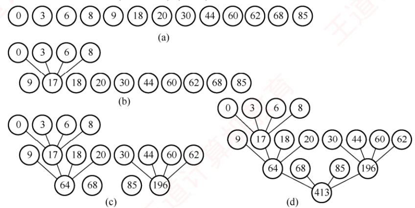

$$
\mathrm{WPL}=(3+6+8)\times3+(9+18+20+30+44+60+62)\times2+(68+85)\times1=51+486+153=690。
$$

## 05.【解答】

1）当文件中的n个记录升序排列时，只生成一个归并段，长度达到最大，为n。若初始工作区内的m个元素都大于输入文件中剩下的所有记录，则第一个归并段的长度就为m，此时为第一个归并段长度最小的情况。排序过程如下表所示。

<table><tr><td rowspan=1 colspan=1>输出文件FO</td><td rowspan=1 colspan=1>工作区WA</td><td rowspan=1 colspan=1>输入文件FI</td></tr><tr><td rowspan=1 colspan=1></td><td rowspan=1 colspan=1></td><td rowspan=1 colspan=1>51, 94, 37, 92, 14, 63, 15, 99, 48, 56, 23, 60, 31, 17, 43, 8, 90, 166, 100</td></tr><tr><td rowspan=1 colspan=1></td><td rowspan=1 colspan=1>51,94,37,92</td><td rowspan=1 colspan=1>14,63,15,99,48,56,23,60,31,17,43,8,90,166,100</td></tr><tr><td rowspan=1 colspan=1>37</td><td rowspan=1 colspan=1>51,94, 14,92</td><td rowspan=1 colspan=1>63, 15, 99, 48, 56, 23, 60, 31, 17, 43, 8, 90, 166, 100</td></tr><tr><td rowspan=1 colspan=1>37,51</td><td rowspan=1 colspan=1>94, 14, 92,63</td><td rowspan=1 colspan=1>15,99, 48, 56,23,60, 31, 17,43, 8,90, 166, 100</td></tr><tr><td rowspan=1 colspan=1>37,51,63</td><td rowspan=1 colspan=1>15,94,14,92</td><td rowspan=1 colspan=1>99, 48, 56, 23, 60, 31, 17, 43, 8, 90, 166, 100</td></tr><tr><td rowspan=1 colspan=1>37,51,63,92</td><td rowspan=1 colspan=1>15,94, 14,99</td><td rowspan=1 colspan=1>48, 56, 23, 60, 31, 17, 43, 8, 90, 166, 100</td></tr><tr><td rowspan=1 colspan=1>37,51, 63,92, 94</td><td rowspan=1 colspan=1>15,14,99,48</td><td rowspan=1 colspan=1>56, 23, 60, 31, 17, 43, 8, 90, 166, 100</td></tr><tr><td rowspan=1 colspan=1>37,51,63,92,94,99</td><td rowspan=1 colspan=1>15, 14, 56,48</td><td rowspan=1 colspan=1>23, 60, 31, 17, 43, 8, 90, 166, 100</td></tr><tr><td rowspan=1 colspan=1>37,51,63,92,94,99#</td><td rowspan=1 colspan=1>15, 14, 56,48</td><td rowspan=1 colspan=1>23, 60, 31, 17, 43, 8, 90, 166, 100</td></tr><tr><td rowspan=1 colspan=1>14</td><td rowspan=1 colspan=1>15,23,56,48</td><td rowspan=1 colspan=1>60, 31, 17, 43, 8, 90, 166, 100</td></tr><tr><td rowspan=1 colspan=1>14,15</td><td rowspan=1 colspan=1>60,23,56,48</td><td rowspan=1 colspan=1>31, 17, 43, 8, 90, 166, 100</td></tr><tr><td rowspan=1 colspan=1>14, 15,23</td><td rowspan=1 colspan=1>60,31,56,48</td><td rowspan=1 colspan=1>17, 43, 8, 90, 166, 100</td></tr><tr><td rowspan=1 colspan=1>14,15,23,31</td><td rowspan=1 colspan=1>60, 17,56,48</td><td rowspan=1 colspan=1>43, 8, 90, 166, 100</td></tr><tr><td rowspan=1 colspan=1>14,15,23,31,48</td><td rowspan=1 colspan=1>60, 17,56,43</td><td rowspan=1 colspan=1>8,90, 166, 100</td></tr><tr><td rowspan=1 colspan=1>14,15,23,31,48,56</td><td rowspan=1 colspan=1>60,17,8,43</td><td rowspan=1 colspan=1>90, 166, 100</td></tr><tr><td rowspan=1 colspan=1>14, 15, 23,31,48,56, 60</td><td rowspan=1 colspan=1>90, 17,8, 43</td><td rowspan=1 colspan=1>166, 100</td></tr><tr><td rowspan=1 colspan=1>14, 15, 23, 31,48, 56,60, 90</td><td rowspan=1 colspan=1>166,17,8,43</td><td rowspan=1 colspan=1>100</td></tr><tr><td rowspan=1 colspan=1>14, 15, 23, 31, 48, 56, 60, 90, 166</td><td rowspan=1 colspan=1>100,17,8,43</td><td rowspan=1 colspan=1></td></tr><tr><td rowspan=1 colspan=1>14, 15, 23, 31,48, 56, 60, 90, 166#</td><td rowspan=1 colspan=1>100,17,8,43</td><td rowspan=1 colspan=1></td></tr><tr><td rowspan=1 colspan=1>8</td><td rowspan=1 colspan=1>100, 17,43</td><td rowspan=1 colspan=1></td></tr><tr><td rowspan=1 colspan=1>8,17</td><td rowspan=1 colspan=1>100,43</td><td rowspan=1 colspan=1></td></tr><tr><td rowspan=1 colspan=1>8,17,43</td><td rowspan=1 colspan=1>100</td><td rowspan=1 colspan=1></td></tr><tr><td rowspan=1 colspan=1>8,17,43, 100</td><td rowspan=1 colspan=1></td><td rowspan=1 colspan=1></td></tr><tr><td rowspan=1 colspan=1>8,17,43, 100#</td><td rowspan=1 colspan=1></td><td rowspan=1 colspan=1></td></tr></table>

生成三个初始归并段,分别是37,51,63,92,94,99;14,15,23,31,48,56,60,90,166;8,17,43,100。2）最大值为n，最小值为m。 V

## 归纳总结

下面对本章所介绍的排序算法进行一次系统的比较与复习。

## 1.基本排序算法：适用于元素个数n不是很大（n<10000）的情形。

直接插入排序、冒泡排序和简单选择排序均属于此类，平均时间复杂度均为 $O ( n ^ { 2 } )$ ，实现简单。直接插入排序在小规模数据 $(n \leq 25)$ 时效率较高：在最好情况下，仅需n-1次比较。冒泡排序在最好情况下只需1趟扫描和n-1次比较。简单选择排序的比较次数恒为 $O ( n ^ { 2 } )$ ，与初始排列无关，但移动次数受初始状态影响，最多不超过 $3(n - 1)$ 次。这三类算法的空间复杂度均为O(1)，仅需一个辅助变量。其中，直接插入排序和冒泡排序是稳定的，而简单选择排序不稳定。

2. 对于中等规模数据 $(n \leqslant 1000)$ ，希尔排序是一种很好的选择。

它通过逐步缩小增量对子序列进行插入排序，初期移动距离大，后期接近有序，从而显著减

少总的比较与移动次数。希尔排序代码简洁，空间开销小（开销为O(1)），但属于不稳定排序。

## 3. 大规模高效排序算法：当 n很大时，应选用时间复杂度为O(nlog2n)的算法。

快速排序是最通用的高效内部排序方法，平均时间复杂度为O(nlog2n)，平均空间复杂度为O(log2n)，虽然在最坏情况下（如输入已有序）退化为O(n²)，但可通过“三者取中”等策略有效规避。堆排序的时间复杂度稳定为O(nlog₂n)，无性能退化问题，且仅需O(1)的额外空间，但平均性能通常略逊于快速排序。归并排序的时间复杂度始终为O(nlog2n)，与输入无关，稳定性好，但需要O(n)的额外存储空间。基数排序具有线性时间复杂度O(d(n+ r))，但其实际效率受限于关键字结构和平台支持，通用性较弱，应用不如比较类排序广泛。

## 4. 混合策略：

实际系统常结合多种算法以扬长避短。例如，在归并排序或快速排序的递归底层切换为直接插入排序，可减少函数调用开销并提升局部效率。 V

综上，排序算法的选择应综合考虑数据规模、内存限制、稳定性要求及输入特性。深入理解各类算法的优劣，有助于在实际应用中做出更合理、高效的决策。

## 思维拓展

一道看似吓人的题目：对n个整数进行排序，要求时间复杂度为O(n)，空间复杂度为O(1)。

## 提示

设待排序整数的范围为0\~65535，设定一个数组intcount[65535]并初始化为0，则所需空间与n无关，为O(1)。扫描一遍待排序列X[]，count[X[i]]++，时间复杂度为O(n);再扫描一次count[]，当count[i]>0时，输出count[i]个i，排序完毕所需的时间复杂度也为O(n);所以总时间复杂度为O(n)，空间复杂度为O(1)。另外，读者可能会问假如有负整数怎么办，这种情况下可以给所有整数都加上一个偏移量，使之都变成正整数，再使用上述方法。


## 参考文献

[1] 严蔚敏，吴伟民． 数据结构（C语言版）[M]. 北京：清华大学出版社，2018.

[2] 科尔曼，雷瑟尔森，李维斯特，等．算法导论[M]．3版．殷建平，徐云，刘晓光，等译．北京：机械工业出版社，2013. TA XTA

[3]李春葆，陈良臣，尹为民，等．数据结构教程（C++语言描述）[M]． 北京：清华大学出版社，2009.

[4]陈守孔，胡潇琨，李玲．算法与数据结构考研试题精析[M]. 北京：机械工业出版社，2007.

[5]夏清国． 数据结构考研教案[M]. 西安：西北工业大学出版社，2006.

[6]全国考研计算机大纲配套教材专家委员会．全国硕士研究生入学统一考试计算机专业基础综合考试大纲解析[M].北京：高等教育出版社，2023.

[7]李春葆，尹为民，陈良臣．数据结构联考辅导教程[M].北京：清华大学出版社，2010.
