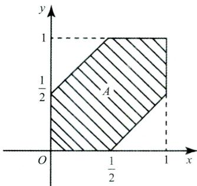
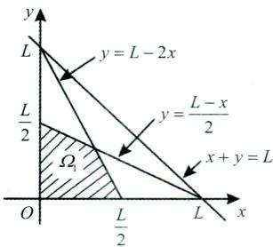

# 第一章 随机事件和概率

# 【题型一事件的关系与运算】

<基础知识回顾>

## 一、事件的关系

(1)包含关系： $A \subset B$ ,它表示事件A发生一定导致B发生.

(2)事件相等:若 $A \subset B$ 且 $B \subset A$ ,则称事件A与B相等，即 $A = B .$

(3)A和B的和事件：称事件 $A \cup B = \left\{ x \mid x \in A  或  x \in B \right\}$ 为A和 B的和事件.它表示A,B 两个事件至少有一个发生时事件A∪B发生，A∪B也记为A+B.

类似地，称 $\bigcup_{k = 1}^{n} A_{k}$ 为n个事件 $A_{1},A_{2},\cdots,A_{n}$ 的和事件.

(4)A和B的积事件：称事件 $A \cap B = \left\{ x \mid x \in A  且  x \in B \right\}$ 为A和 B的积事件.它表示A,B 两个事件同时发生时事件A∩B发生，A∩B也记为AB.

类似地，称 $\bigcap_{k = 1}^{n} A_{k}$ 为n个事件 $A_{1},A_{2},\cdots,A_{n}$ 的积事件.

(5)A和B的差事件：事件 $A-B=\left\{x\mid x\in A 且 x\notin B\right\}$ 称为事件A 和 B 的差事件.它表示 A发生且 B 不发生时事件A-B发生.A-B也可记为AB

(6)互斥事件(互不相容):当 $AB = \varnothing$ 时，称事件A与B互不相容(或互斥).它表示事件A与B不能同时发生.

(7)对立事件(逆事件):若 $A \cup B = O$ 且 $A \bigcap B = \varnothing$ ,则称A与B互为逆事件，也称互为对立事件.A的对 立事件记为A.

(8)完全(备)事件组:若事件组 $A_{1},A_{2},\cdots,A_{n}$ 满足： $A_{1} \cup A_{2} \cup \cdots \cup A_{n} = \Omega, A_{i}A_{j} = \varnothing, 1 \leq i \neq j \leq n$ ,则称事件$A_{1},A_{2},\cdots,A_{n}$ 是一个完全(备)事件组，也称为样本空间的一个划分

## 二、随机事件的运算律

(1)交换律： $A \cup B = B \cup A; A \cap B = B \cap A.$

(2)结合律： $A \cup (B \cup C) = (A \cup B) \cup C; A \cap (B \cap C) = (A \cap B) \cap C.$

(3)分配律： $A \cup (B \cap C) = (A \cup B) \cap (A \cup C); \quad A \cap (B \cup C) = (A \cap B) \cup (A \cap C).$

(4)对偶律(德摩根律): $\overline{A \cup B} = \overline{A} \cap \overline{B}, \overline{A \cap B} = \overline{A} \cup \overline{B}.$

## <精选例题>

【例1.1】以A表示事件“甲种产品畅销，乙种产品滞销”，则其对立事件À为().(A)“甲种产品滞销，乙种产品畅销” (B)“甲、乙两种产品均畅销”(C)“甲种产品滞销” (D)“甲种产品滞销或乙种产品畅销”

【解析】设事件B表示“甲种产品畅销”，事件C表示“乙种产品滞销”，故 $A = BC, \overline{A} = \overline{BC} = \overline{B} \cup \overline{C}$ ,所以A表示“甲种产品滞销或乙种产品畅销”.故应选(D).

【例1.2】对任意两事件A和B,与 $A \cup B = B$ 不等价的是( ).(A $) A \subset B$ (B $) \overline{B} \subset \overline{A}$ $A\overline{B} = \varnothing$ (D $\bar{A}B = \varnothing$

【解析 $A \cup B = B$ 等价于 $A \subset B$ 或 ${ \bar { \overline { { B } } } } \subset { \overline { { A } } }$ ,也说明A与 $\overline { { B } }$ 没有公共部分，即 $A\bar{B} = \varnothing.$ 故 $A \cup B = B$ 与(A)、(B)、(C)选项都等价.应选(D).

## 【题型二概率的性质】

## <基础知识回顾>

## 一、概率的性质

①非负性：设A为随机事件，则 $0 \leq P(A) \leq 1$

②规范性： $P(\varnothing)=0,P(\Omega)=1$

③有限可加性：设 $A_{1},A_{2},\cdots,A_{n}$ 是两两互不相容的事件，即对于 $i \ne j, A_i A_j = \varnothing, i, j = 1, 2, \cdots, n,$ 则有$P(A_{1} \cup A_{2} \cdots \cup A_{n}) = P(A_{1}) + P(A_{2}) + \cdots + P(A_{n})$

④逆事件的概率：对于任一事件A，有 $P(\overline{A}) = 1 - P(A)$

⑤设A,B是两个事件，若 $A \subset B$ ,则有 $P(A) \leq P(B)$ 且 $P(B - A) = P(B) - P(A)$

## 考点及方法小结

(1)互斥事件与对立事件的关系:对立一定互斥,但互斥不一定对立.

(2 $P(\varnothing)=0,P(\varnothing)=1$ .但概率为0的事件不一定是不可能事件,概率为1的事件不一定是必然事件(3)概率的不等式问题常涉及的知识点：

①0≤ P(A)≤1;

②若 $A \subset B$ ,则 $P(A) \leq P(B)$ i

③因 $AB \subset A \subset A + B$ ,故 $P(AB) \leqslant P(A) \leqslant P(A + B)$

(4)逆事件概率是解决复杂事件概率的一个重要思维： $P(\overline{A}) = 1 - P(A)$

## 后续更新公众号[有机研】永久联系微信4550060

## <精选例题>

【例1.3】设当事件A与B同时发生时，事件C必发生，则().(A $P(C) \leqslant P(A) + P(B) - 1$ (B $P(C) \geqslant P(A) + P(B) - 1$ (C )P(C) = P(AB) (D)P(C) = P(A∪B)

【解析】由A与B同时发生时，C一定发生得 $AB \subset C.$ 故 $P(AB) \leq P(C)$

又由 $P(A+B)=P(A)+P(B)-P(AB)$ ,得 $P(AB)=P(A)+P(B)-P(A+B)$

故有 $P(C) \geqslant P(A) + P(B) - P(A + B).$

又 $P(A + B) \leq 1$ ,故得 $P(C) \geqslant P(A) + P(B) - P(A + B) \geqslant P(A) + P(B) - 1$

## 良哥解读

事件A 发生一定导致事件 B 发生,表示事件A 与 B 具有包含关系,即 $A \subset B .$ 由概率的性质，事件有包含关系,进而得到事件概率的不等式关系.

【例1.4】设A,B为随机事件， $P(B)>0$ ,则().(A $P(A \cup B) \geq P(A) + P(B)$ (B $P(A - B) \geqslant P(A) - P(B)$ (C )P(AB)≥ P(A) P(B) (D $P(A \mid B) \geq \frac{P(A)}{P(B)}$

【解析 $P(A \cup B) = P(A) + P(B) - P(AB) \leq P(A) + P(B)$ ,选项(A)不成立.

因 $A B \subset B$ ,故 $P(AB) \leq P(B)$ ,从而有 $P(A - B) = P(A) - P(AB) \geqslant P(A) - P(B)$ ,故正确选项为(B).【例1.5】随机事件A,B,满足 $P(A)=P(B)=\frac{1}{2}$ 和 $P(A \cup B) = 1$ 则有( ).  
(A)A∪B=Ω (B)AB =∅  
(C $P(\overline{A} \cup \overline{B}) = 1$ (D $P(A - B) = 0$

$$
P(A \cup B) = 1, P(A) = P(B) = \frac{1}{2}
$$

$$
P(AB)=P(A)+P(B)-P(A\cup B)=0.
$$

$$
P(\overline{A} \cup \overline{B}) = P(\overline{A \cap B}) = 1 - P(AB) = 1
$$

## 良哥解读

概率为0的事件不一定是不可能事件,概率为1的事件不一定是必然事件,故(A)与(B)选项均不正确.

【例1.6】设事件A与事件B互不相容,则().(A $P(\overline{A}\overline{B}) = 0$ (B $P(AB)=P(A)P(B)$ (C) $P(A)=1-P(B)$ (D $P(\overline{A} \cup \overline{B}) = 1$

【解析】因为事件A与B互不相容，即 $AB = \varnothing$ ,则 $P(\overline{A} \cup \overline{B}) = P(\overline{A \cap B}) = 1 - P(AB) = 1$ 故应选(D).

## 良哥解读

此题主要考查三个概念:互不相容(互斥)、对立、独立的关系.事件对立则一定互斥，但互斥不一定对立,故(A)(C)选项可排除.事件互不相容(互斥)与事件独立没关系,它们互相都不能推出,故排除( B).

## 【题型三计算事件的概率】

## <基础知识回顾>

## 一、古典概型

## (一)定义

具有以下两个特点的试验称为古典概型：

(1)样本空间有限 $\Omega = \left\{ e_{1}, e_{2} \cdots e_{n} \right\}$

(2)等可能性 $P(e_{1}) = P(e_{2}) = \cdots = P(e_{n})$

## (二)计算方法

$$
P(A)=\frac{A 中基本事件的个数 k}{\Omega 中基本事件总数 n}
$$

## 二、几何概型

如果试验E是从某一线段(或平面、空间中有界区域)Ω上任取一点，并且所取得点位于Ω中任意两个长度(或平面、体积)相等的子区间(或子区域)内的可能性相同，则所取得点位于Ω中任意子区间(或子区域)A内这一事件(仍记作A)的概率为

$$
P(A)=\frac{A 的长度(或面积、体积) }{\Omega 的长度(或面积、体积) }
$$

## 三、计算概率的五大公式

## (一)加法公式

对于任意两个随机事件A与B,有

$$
P(A+B)=P(A)+P(B)-P(AB).
$$

对于任意三个事件A,B,C,有

后续更新公众号[有机研】永久聯系微信4550060

$$
P(A+B+C)=P(A)+P(B)+P(C)-P(AB)-P(BC)-P(AC)+P(ABC).
$$

## (二)减法公式

设A,B是两个事件，则

$$
P(A - B) = P(A\overline{B}) = P(A) - P(AB).
$$

## (三)乘法公式

设A,B是两个随机事件，若 $P(A)>0$ ,则有

$$
P(AB)=P(B|A)P(A).
$$

设A,B,C为三个随机事件,若P(AB)> 0,则有

$$
P(ABC)=P(C|AB)P(B|A)P(A).
$$

## (四)全概率公式

设 $A_{1},A_{2},\cdots,A_{n}$ 是一组完全事件组，且 $P(A_i)>0,i=1,2,\cdots,n$ ,则

$$
P(B)=\sum_{i = 1}^{n}P(A_{i})P(B|A_{i}).
$$

## (五)贝叶斯公式

设 $A_{1},A_{2},\cdots,A_{n}$ 是一组完全事件组， $P(B)>0,P(A_{i})>0,i=1,2,\cdots,n$ ,则

$$
P(A_i|B)=\frac{P(A_i)P(B|A_i)}{\sum\limits_{i=1}^{n}P(A_i)P(B|A_i)} \quad (i=1,2,\cdots,n).
$$

## 四、条件概率

## (一)条件概率的定义

设A,B是两个随机事件，且 $P(A)>0$ ,称 $P(B \mid A) = \frac{P(AB)}{P(A)}$ 为在事件A发生的条件下事件B发生的条件概率.

## (二)条件概率的性质

若 $P(A)>0$ ,则有

①非负性： $P(B \mid A) \geq 0$

②规范性： $P(\Omega \mid A) = 1$

③可列可加性：设 $B_{1},B_{2},\cdots$ 是两两互不相容的事件，则有

$$
P(\bigcup_{i = 1}^{\infty} B_i \mid A) = \sum_{i = 1}^{\infty} P(B_i \mid A).
$$

## (三)条件概率的逆事件概率公式

$$
P(\overline{B} \mid A) = 1 - P(B \mid A).
$$

(四)条件概率的加法公式

$$
P \left[ \left( B _ { 1 } + B _ { 2 } \right) \mid A \right] = P \left( B _ { 1 } \mid A \right) + P \left( B _ { 2 } \mid A \right) - P \left( B _ { 1 } B _ { 2 } \mid A \right) .
$$

五、事件的独立性

## (一)两个事件独立的定义

设A,B是两个随机事件，若满足等式 $P(AB)=P(A)P(B)$ ,则称事件A,B相互独立，简称事件A,B独立.

## (二)两个事件独立的性质

若事件A,B相互独立，则下列各对事件也相互独立：A与 $\overline{B}, \overline{A}$ 与 $B , \overline { { A } }$ $\overline{B}.$

## (三)两个事件独立的等价说法

若 $0 < P(A) < 1$ ,则事件A,B独立 $\Leftrightarrow P(B)=P(B \mid A) \Leftrightarrow P(B)=P(B \mid \overline{A}) \Leftrightarrow P(B \mid A)=P(B \mid \overline{A}).$

## (四)三个事件的两两独立性

设A,B,C是三个事件，如果满足等式

$$
\begin{cases}P(AB) = P(A)P(B), \\P(AC) = P(A)P(C), \\P(BC) = P(B)P(C),\end{cases}
$$

则称三个事件A,B,C两两独立.

## (五)三个事件的相互独立性

如果满足等式

$$
\begin{cases}P(AB) = P(A)P(B), \\P(AC) = P(A)P(C), \\P(BC) = P(B)P(C), \\P(ABC) = P(A)P(B)P(C),\end{cases}
$$

则称三个事件A,B,C相互独立.

后续更新公众号[有机研】永久联系微信4550060

## 考点及方法小结

(1)考生需熟记计算事件概率的五大公式(加法、减法、乘法、全概率和贝叶斯公式).

(2)全概率公式的适用场景.

①计算复杂事件概率的两个重要思维:逆事件思维与全概率思维.若计算复杂事件概率时,逆事件不能解决,则想到用全概率公式解决.

②若一个试验可以看成分两个阶段完成,第一个阶段的具体结果未知,但所有可能结果已知,求第二个阶段某个结果发生的概率,用全概率公式.全概率公式的关键是完全事件组,第一个阶段的所有可能结果即为完全事件组

## (3)事件独立性涉及的几个考点.

①独立和互斥的关系:独立不一定互斥,互斥也不一定独立.对于非0概率事件,独立一定不互斥,互斥一定不独立.

②概率为0或概率为1的事件与任何事件都独立.特殊地,不可能事件与任何事件既独立又互斥.

③判定事件独立性.

两个事件独立： $P(AB)=P(A)P(B)$

三个事件两两独立 $\begin{aligned}:\left\{\begin{aligned}P(AB) &= P(A)P(B), \\P(AC) &= P(A)P(C), \\P(BC) &= P(B)P(C).\end{aligned}\right.\end{aligned}$

三个事件相互独立 $\begin{aligned}&\therefore \left\{\begin{aligned}P(AB) &= P(A)P(B), \\P(AC) &= P(A)P(C), \\P(BC) &= P(B)P(C), \\P(ABC) &= P(A)P(B)P\end{aligned}\right.\end{aligned}$

④三个事件两两独立与相互独立的关系.

三个事件相互独立一定两两独立，但两两独立不一定相互独立.

(4)几何概型的应用场景.

①在某个区间(区域)内随机取数或者任意取点.

②在某段时间内随机到达某个地方.

③在某个区间(区域)内任意子区间(子区域)上取值概率与该区间(区域)的长度(面积)成正比.

## <精选例题>

【例1.7】设两个相互独立的事件A和B都不发生的概率为 $\frac{1}{9}, \dot{A}$ 发生B不发生的概率与B发生A不发生的概率相等,则P(A)=

【解析】由题意知 $P(\overline{A}\overline{B})=\frac{1}{9},P(A\overline{B})=P(B\overline{A})$ ,由减法公式有

$$
P(A\overline{B})=P(A)-P(AB),P(B\overline{A})=P(B)-P(AB),
$$

故有 $P(A)=P(B)$ ,因A,B相互独立,则 $\overline { { A } }$ 与 $\overline{B}$ 相互独立，所以

$$
P(\overline{A}\overline{B}) = P(\overline{A})P(\overline{B}) = \left[P(\overline{A})\right]^2 = \frac{1}{9},
$$

解之有得 $P(\overline{A}) = \frac{1}{3}$ ,故 $P(A)=1-P(\overline{A})=\frac{2}{3}.$

【例1.8】设随机事件A与B相互独立，A与C相互独立， $BC = \varnothing$ 若 $P(A)=P(B)=\frac{1}{2}$ $P(AC|AB\cup C)=\frac{1}{4}$ ,则 P(C) =

【解析】

$$
\begin{aligned}P(AC \mid AB \cup C) = \frac{P\left[AC(AB \cup C)\right]}{P(AB \cup C)} = \frac{P(ABC \cup AC)}{P(AB) + P(C) - P(ABC)} \\= \frac{P(AC)}{P(AB) + P(C) - P(ABC)},\end{aligned}
$$

又 $BC = \varnothing$ 则P(ABC)= 0.因随机事件A与 B相互独立，A与C相互独立,所以

$$
P(AC \mid AB \cup C) = \frac{P(AC)}{P(AB) + P(C)} = \frac{P(A)P(C)}{P(A)P(B) + P(C)} = \frac{\frac{1}{2}P(C)}{\frac{1}{4} + P(C)} = \frac{1}{4}
$$

解之得 $P(C)=\frac{1}{4}.$

【例1.9】设A,B,C为三个随机事件，A与B互不相容，A与C互不相容，B与C相互独立，且$P(A)=P(B)=P(C)=\frac{1}{3}$ ,则 $P(B \cup C \mid A \cup B \cup C) =$

【解析】因 $P(B \cup C \mid A \cup B \cup C) = \frac{P[(B \cup C)(A \cup B \cup C)]}{P(A \cup B \cup C)} = \frac{P(B \cup C)}{P(A \cup B \cup C)}$ ,而

$$
P(B \cup C) = P(B) + P(C) - P(BC) = \frac{1}{3} + \frac{1}{3} - \frac{1}{3} \times \frac{1}{3} = \frac{5}{9},
$$

$$
\begin{aligned}P(A \cup B \cup C) &= P(A) + P(B) + P(C) - P(AB) - P(AC) - P(BC) + P(ABC) \\&= 1 - 0 - 0 - \frac{1}{3} \times \frac{1}{3} + 0 = \frac{8}{9},\end{aligned}
$$

故 $P(B \cup C \mid A \cup B \cup C) = \frac{\frac{5}{9}}{\frac{8}{9}} = \frac{5}{8}.$

【例1.10】设A,B,C为三个随机事件，且$P(A)=P(B)=P(C)=\frac{1}{4},P(AB)=0,P(AC)=P(BC)=\frac{1}{12},$

则A,B,C恰有一个事件发生的概率为().(A $) \frac{3}{4}.$ (B $) \frac{2}{3}.$ (C $ ) \frac{1}{2}.$ (D) $0 \frac { 5 } { 1 2 } .$

【解析】事件A,B,C中恰有一个发生的概率可用至少一个发生的概率减去至少两个发生的概率表示，即 $P(A\bar{B}\bar{C}+\bar{A}B\bar{C}+\bar{A}\bar{B}C)=P(A+B+C)-P(AB+AC+BC)$

而 $P(A+B+C)=P(A)+P(B)+P(C)-P(AB)-P(AC)-P(BC)+P(ABC)$ ,因 $P(AB)=0$ ,故 $P(ABC)=0$ 从而

$$
P(A+B+C)=\frac{3}{4}-0-\frac{1}{12}-\frac{1}{12}+0=\frac{7}{12}
$$

## 后续更新公众号【有机研】永久取系微信4550060

$$
P(AB + AC + BC) = P(AB) + P(AC) + P(BC) - P(ABC) - P(ABC) - P(ABC) + P(ABC) = 0 + \frac{1}{12} + \frac{1}{12} - 0 = \frac{1}{6},
$$

故 $P(A\bar{B}\bar{C}+\bar{A}B\bar{C}+\bar{A}\bar{B}C)=\frac{7}{12}-\frac{1}{6}=\frac{5}{12}.$ 故应选(D).

【例1.11】设A,B为两个随机事件，且A与B相互独立.已知 $P(A)=2P(B),P(A \cup B)=\frac{5}{8}$ ,则在A,B至少有一个发生的条件下A,B中恰有一个发生的概率为

【解析】设 $P(B) = p$ ，则 $P(A)=2p.$ 因 $P(A \cup B) = P(A) + P(B) - P(AB) = \frac{5}{8},$ 且A与B相互独立，即$P(AB)=P(A)P(B)$ ,故有 $3p - 2p^{2} = \frac{5}{8},$ 解得 $p = \frac{1}{4}$ 或 $p = \frac{5}{4} ($ 舍去)，从而得 $P(B)=\frac{1}{4},P(A)=\frac{1}{2},P(AB)=\frac{1}{8}.$ 则A,B至少有一个发生的条件下A,B中恰有一个发生的概率为

$$
\begin{aligned}P(A\overline{B} \cup \overline{A}B \mid A \cup B) &= \frac{P[(A\overline{B} \cup \overline{A}B)(A \cup B)]}{P(A \cup B)} = \frac{P(A\overline{B} \cup \overline{A}B)}{P(A \cup B)} \\&= \frac{P(A\overline{B}) + P(\overline{A}B)}{P(A \cup B)} = \frac{P(A) - P(AB) + P(B) - P(AB)}{P(A \cup B)} \\&= \frac{P(A) + P(B) - 2P(AB)}{P(A \cup B)} = \frac{\frac{1}{2} + \frac{1}{4} - \frac{1}{4}}{\frac{5}{8}} = \frac{4}{5}.\end{aligned}
$$

【例1.12】从0,1,2,…,9这十个数字中任意选出三个不同数字，试求下列事件的概率 $:A_{1} = \left\{ \begin{aligned} \end{aligned} \right.$ 三个数字中不含0和5} $A_{2} = \{  三$ 个数字中不含0或 $\{ 5 \} ; A_{3} = \{$ 三个数字中含0但不含5}.

【解析】设事件 $B_1 = \{\text{三个数字中不含0}\}$, $B_2 = \{\text{三个数字中不含5}\}$, 则

$$
\begin{aligned}P(A_{1}) &= \frac{C_{8}^{3}}{C_{10}^{3}} = \frac{7}{15}, \\P(A_{2}) &= P(B_{1} \cup B_{2}) = 1 - P(\overline{B_{1}} \cup \overline{B_{2}}) = 1 - P(\overline{B_{1}} \overline{B_{2}}) = 1 - \frac{C_{8}^{1}}{C_{10}^{3}} = \frac{14}{15}, \\P(A_{3}) &= P(\overline{B_{1}}B_{2}) = P(B_{2}) - P(B_{1}B_{2}) = \frac{C_{9}^{3}}{C_{10}^{3}} - \frac{C_{8}^{3}}{C_{10}^{3}} = \frac{7}{30}.\end{aligned}
$$

【例1.13】10个同规格的零件中混入3个次品，现进行逐个检查，则查完第5个零件时正好查出第3个次品的概率为

【解析】记 $A = \mathbf{\Omega}$ 查完第5个零件正好查出第3个次品”.事件A由两个事件组成： $B = \begin{aligned} \cdots \end{aligned}$ 前4次检查，查出2个次品”和 $C = \mathrm { { } ^ { \circ } }$ 第5次检查，查出的零件为次品”，即 $A = BC$ ，由乘法公式， $P(A)=P(BC)=P(B)P(C \mid B)$

事件B是前4次检查中有2个正品2个次品所组合，故 $P(B)=\frac{C_{3}^{2}\cdot C_{7}^{2}}{C_{10}^{4}}=\frac{3}{10}.$

已知B发生的条件下，也就是已检查了2正2次，剩下6个零件，其中5正1次，再要抽检一个恰是次品的概率 $P(C|B)=\frac{1}{6}$ ,则 $P(A)=\frac{3}{10}\cdot\frac{1}{6}=\frac{1}{20}.$

【例1.14】已知甲袋有3个白球，6个黑球，乙袋有5个白球，4个黑球.先从甲袋中任取一球放入乙袋，然后再从乙袋中任取一球放回甲袋，则甲袋中白球数不变的概率为

【解析】记 $A = \begin{aligned} \cdots \end{aligned}$ 经过两次交换，甲袋中白球数不变”， $B = \frac{\alpha}{}$ 从甲袋中取出一个白球放入乙袋”， $C = \mathrm{ " }$ 从乙

袋中取出一个白球放入甲袋”，则 $A = BC \cup \overline{B} \overline{C}$ ,那么，

$$
P(A)=P(BC)+P(\bar{B}\bar{C})=P(B)P(C\mid B)+P(\bar{B})P(\bar{C}\mid \bar{B})=\frac{3}{9}\cdot \frac{6}{10}+\frac{6}{9}\cdot \frac{5}{10}=\frac{8}{15}
$$

【例1.15】设袋中有红、白、黑球各1个，从中有放回地取球，每次取1个，直到三种颜色的球都取到时停止，则取球次数恰好为4的概率为

【解析】法一:设所求事件为A，则 $A = 4$ 第四次出现1种颜色的球，前三次出现另外两种颜色的球”，从袋中有放回地取4次球，共有 $3^{4}$ 个基本结果，事件A包含的基本结果数为 $3 \times 3 \times 2$ ,所以

$$
P(A)=\frac{3\times3\times2\times1}{3^{4}}=\frac{2}{9}.
$$

法二:设A表示事件“直到三种颜色的球都取到时停止，取球次数恰好为 $4 , A_{1}$ 表示事件“第4次取到红球”， $A _ { 2 }$ 表示事件“第4次取到白球”， $A _ { 3 }$ 表示事件“第4次取到黑球”，则

$$
P(A_{1}) = P(A_{2}) = P(A_{3}) = \frac{1}{3}.
$$

在 $A _ { 1 }$ 发生的条件下，A发生当且仅当前3次取到2个白球1个黑球或1个白球2个黑球，从而$P(A|A_{1}) = 2 \times \frac{3}{3^{3}} = \frac{2}{9}$ 同理， $P(A|A_{2})=P(A|A_{3})=\frac{2}{9}$ ,则

$$
P(A)=P(A_{1})P(A|A_{1})+P(A_{2})P(A|A_{2})+P(A_{3})P(A|A_{3})=\frac{2}{9}.
$$

## 良哥解读

法一中分子事件个数 $3 \times 3 \times 2 \times 1$ 的由来：因为第一次是在三种颜色中任意取一种,故有三种取法；第二次也是在三种颜色中任意取一种,也是有三种取法;第三次取球时,若前两次取到的是不同的颜色，则需在前两次不同颜色中取一种,有两种取法,若前两次取到的颜色相同,则需要在剩下的两种颜色中取一种,同样也是两种取法;第四次取时,只能是取到前三次没有取到的颜色,正好三种颜色取完,故第四次是一种取法.从而分子中事件个数为 $3 \times 3 \times 2 \times 1$

【例1.16】三个箱子，第一个箱子中有4个黑球1个白球，第二个箱子中有3个黑球3个白球，第三个箱子中有3个黑球5个白球.现随机地取一个箱子，再从这个箱子中取出1个球，这个球为白球的概率等于.已知取出的球是白球，此球属于第二个箱子的概率为

【解析】设 $A _ { i }$ 表示球取自第i个箱子 $(i = 1,2,3);B$ 表示取出的为白球.

(1)由全概率公式： $P(B)=\sum_{i=1}^{3}P(B|A_{i})P(A_{i})=\frac{1}{3}\times\frac{1}{5}+\frac{1}{3}\times\frac{1}{2}+\frac{1}{3}\times\frac{5}{8}=\frac{53}{120}.$

(2)由贝叶斯公式： $P(A_{2}|B)=\frac{P(A_{2}B)}{P(B)}=\frac{P(A_{2})P(B|A_{2})}{P(B)}=\frac{\frac{1}{3}\times\frac{1}{2}}{\frac{53}{120}}=\frac{20}{53}.$

【例1.17】在区间(0,1)中随机地取两个数，则这两数之差的绝对值小于 $\frac{1}{2}$ 的概率为

【解析】在区间内随机取数问题对应的是几何概型.设 $x , y$ 表示所取的两个数，则样本空间$\Omega=\left\{(x,y)|0<x<1,0<y<1\right\}$ ,记 $A =$ 两数之差的绝对值小于 $\frac{1}{2} ''$ ,则 $A = \left\{ (x,y) \mid (x,y) \in \Omega, |x - y| < \frac{1}{2} \right\}$

如图，由几何概型计算概率公式有

后续更新公众号[有机研】永久联系微信4550060

$$
P(A)=\frac{S_{_A}}{S_{_{\mathcal{Q}}}}=\frac{\displaystyle\frac{3}{4}}{1}=\frac{3}{4},
$$

其中， $,S_{_A},S_{_{\mathcal{Q}}}$ 分别表示A与 $\mathcal { Q }$ 的面积.

【例1.18】将一根长为L的木棒随机折成三段，记事件 $A = { } ^ { \leftarrow } \left[ \right.$ 中间一段为三段中长度最大的”，则 $P(A)=$ ().(A) $0 \frac { 1 } { 2 }$ (B $) \frac{1}{3}$ (C $) \frac{1}{4}$ (D $2 \frac { 2 } { 3 }$

【解析】设折得的三段长度依次为 $x , L - x - y , y$ ,则样本空间为

$$
\Omega=\left\{(x,y)\mid 0<x<L,0<y<L,0<x+y<L\right\}.
$$

随机事件A相应的区域 $\mathcal { Q }$ 应满足 $0<x<L-x-y,0<y<L-x-y,$ 即

$$
\left\{ (x,y) \mid x > 0, 0 < y < L - 2x, 0 < y < \frac{L - x}{2} \right\}.
$$

如图所示，容易计算Ω的面积为 $\frac{1}{2}L^{2},Q$ 的面积为 $\frac{1}{6}L^{2}$ ,故

$$
P(A)=\frac{\frac{1}{6}L^{2}}{\frac{1}{2}L^{2}}=\frac{1}{3}
$$

故正确答案为(B).

【例1.19】甲、乙两人独立地对同一目标各射击一次，其命中率分别为0.6和0.5,现已知目标被命中，则它是甲射中的概率为

【解析】设事件A表示甲命中，B表示乙命中.由题意，A与B相互独立.又 $P(A)=0.6,P(B)=0.5$ ,则

$$
P(AB)=P(A)\cdot P(B)=0.6\times0.5=0.3.
$$

目标命中即甲命中或者乙命中可用事件 $ \text{" }A \cup B \text{" }$ 表示，因此要求概率为

$$
P(A \mid A \cup B) = \frac{P[A(A \cup B)]}{P(A \cup B)} = \frac{P(A)}{P(A) + P(B) - P(AB)} = \frac{0.6}{0.6 + 0.5 - 0.3} = \frac{3}{4}.
$$

【例1.20】某人打靶的命中率为，当他连续独立射击三次后检查目标，发现靶已命中，则他在第1次 $\frac{1}{2}.$ 射击时就命中目标的概率为().(A $0 \frac{3}{8}$ (B $) \frac{1}{2}$ (C $0 \frac{3}{7}$ (D $) \frac{4}{7}$

【解析】设A表示“第i次命中 $(i = 1,2,3)$ ，由题意知， $A_{1},A_{2},A_{3}$ 相互独立，且 $P(A_{i}) = \frac{1}{2}$ ,故

$$
p = P\left(A_{1} \mid A_{1} + A_{2} + A_{3}\right) = \frac{P\left(A_{1}\right)}{P\left(A_{1} + A_{2} + A_{3}\right)} = \frac{\frac{1}{2}}{1 - P\left(\overline{A_{1}} \overline{A_{2}} \overline{A_{3}}\right)} = \frac{\frac{1}{2}}{1 - \frac{1}{2} \times \frac{1}{2} \times \frac{1}{2}} = \frac{4}{7}.
$$

故应选(D).

【例1.21】假设一批产品中一、二、三等品各占 $60\%,30\%,10\%,$ 从中随意取出一件，结果不是三等品，则取到的是一等品的概率为

【解析】设事件 $A_{i} =  \text{" }$ 取到的是第i等品 $i = 1,2,3$ ,则由题意有

$$
P(A_{1}) = 0.6, P(A_{3}) = 0.1, P(A_{1}A_{3}) = 0.
$$

由条件概率公式有

$$
P(A_{1} \mid A_{3}) = \frac{P(A_{1} \overline{A_{3}})}{P(A_{3})} = \frac{P(A_{1}) - P(A_{1}A_{3})}{1 - P(A_{3})} = \frac{P(A_{1})}{1 - P(A_{3})} = \frac{0.6}{0.9} = \frac{2}{3}.
$$

【例1.22】设A,B为随机事件，且 $0 < P(B) < 1$ ,下列命题中为假命题的是( ).(A)若 $P(A \mid B) = P(A)$ ,则 $P(A \mid \overline{B}) = P(A)$   
(B)若 $P(A \mid B) > P(A)$ ,则 $P(\overline{A} \mid \overline{B}) > P(\overline{A})$   
(C)若 $P(A \mid B) > P(A \mid \overline{B})$ ,则 $P(A \mid B) > P(A)$   
(D)若 $P(A \mid A \cup B) > P(\overline{A} \mid A \cup B)$ ,则 $P(A) > P(B)$

【解析】对于（A）选项：由 $P(A \mid B) = P(A)$ ，知A,B相互独立，故A与 $\overline{B}$ 相互独立，从而有$P(A \mid \overline{B}) = P(A)$ 故(A)正确.

对于(B)选项：由 $P(A \mid B) > P(A)$ ,得 $P(AB) > P(A)P(B)$

$$
\frac{P(\overline{A} \mid \overline{B}) = P(\overline{A} \mid \overline{B}) = P(\overline{A} + \overline{B})}{P(\overline{B})} = \frac{1 - P(A + B)}{1 - P(B)} = \frac{1 - P(A) - P(B) + P(AB)}{1 - P(B)}.
$$

$\frac{1 - P(A) - P(B) + P(A)P(B)}{1 - P(B)} = 1 - P(A) = P(\overline{A})$ 故(B)正确.

对于(C)选项：由 $P(A \mid B) > P(A \mid \overline{B})$ ,得 $P(AB) > P(A)P(B)$ ,而

$P(A \mid B)=\frac{P(AB)}{P(B)}>\frac{P(A)P(B)}{P(B)}=P(A)$ ,故(C)正确，由排除法知应选(D).

事实上对于(D)选项：由 $P(A \mid A \cup B) > P(\overline{A} \mid A \cup B)$ ,得

$P[A(A \cup B)] > P[\overline{A}(A \cup B)]$ ,即 $P(A)>P(\overline{A}B)=P(B)-P(AB)$

后续更新公众号[有机研】永久联系微信4550060此时无法比较P(A)与P(B)的大小. 故应选(D).

【例1.23】设A,B为随机事件，若 $0 < P(A) < 1, 0 < P(B) < 1$ ,则 $P(A \mid B) > P(A \mid \overline{B})$ 的充分必要条件是().(A $P(B \mid A) > P(B \mid \overline{A})$ (B $P(B \mid A) < P(B \mid \overline{A})$ (C $P(\overline{B} \mid A) > P(B \mid \overline{A})$ (D $P(\overline{B} \mid A) < P(B \mid \overline{A})$

【解析】因 $P(A \mid B) > P(A \mid \bar{B})$ 等价于 $\frac{P(AB)}{P(B)} > \frac{P(AB)}{P(\overline{B})}$ ,又

$$
P(A\bar{B}) = P(A) - P(AB),P(\bar{B}) = 1 - P(B),
$$

可得 $P(A \mid B) > P(A \mid \bar{B})$ 等价于 $P(AB) > P(A)P(B)$

对于(A)选项:因 $P(B \mid A) > P(B \mid \bar{A})$ 等价于 $\frac{P(AB)}{P(A)} > \frac{P(\overline{B} \overline{A})}{P(\overline{A})}$ ,又$P(B\overline{A}) = P(B) - P(AB),P(\overline{A}) = 1 - P(A).$

整理得 $P(B \mid A) > P(B \mid \bar{A})$ 等价于 $P(AB) > P(A)P(B)$ .故应选(A).

【例1.24】设A,B,C为随机事件，A与B相互独立，P(C)=1.则可能不相互独立的事件组为().(A)A,B,A∪C (B) $A,B,A-C$   
(C)a,b,ac (D $A,B,\overline{A}\overline{C}$

【解析】由于P(C)=1,故 $P(\overline{C}) = 0$ ,所以

$$
P(A \cup C) = 1, P(A - C) = 0, P(\overline{A} \overline{C}) = 0.
$$

由“概率为0或1的事件与任意事件相互独立”且A与B相互独立，故(A)(B)(D)中的事件组相互独立,应选(C).

事实上对于(C)选项，由于P(C)=1,若 $0 < P(A) < 1$ ,则

$$
P(AAC)=P(AC)=P(A)\ne P(A)P(AC)=P(A)\cdot P(A),
$$

故A与AC不独立，因此(C)中的事件组A,B,AC不相互独立.

【例1.25】设A,B,C三个事件两两独立，则A,B,C相互独立的充分必要条件是().(A)A与BC独立 (B)AB与A∪C独立(C)AB 与AC独立 (D)A∪B与A∪C独立

【解析】A,B,C相互独立的充要条件是A,B,C事件两两独立且满足 $P(ABC)=P(A)P(B)P(C)$ 因A,B,C两两独立,故只需验证 $P(ABC)=P(A)P(B)P(C)$ 即可.  
对于(A)选项:若A与BC独立，则 $P(ABC)=P(A)P(BC)=P(A)P(B)P(C)$   
故应选(A).

【例1.26】设A,B,C为三个随机事件，且A与C相互独立，B与C相互独立，则A∪B与C相互独立的充分必要条件是( ).(A)A与B相互独立 (B)A与B互不相容(C)AB 与C相互独立 (D)AB与C互不相容

【解析 $\mathcal{M} \cup B$ 与C相互独立的充分必要条件是 $P[(A \cup B)C] = P(A \cup B)P(C)$ 因为

$$
P[(A \cup B)C] = P(AC \cup BC) = P(AC) + P(BC) - P(ABC),
$$

## 后续更新公众号[有机研】永久联系微信4550060

又A与C相互独立，B与C相互独立，故

$$
P [ ( A \bigcup B ) C ] = P ( A ) P ( C ) + P ( B ) P ( C ) - P ( A B C ) .
$$

而

$$
\begin{aligned}P(A \cup B)P(C) = & \left[P(A) + P(B) - P(AB)\right]P(C) \\= & P(A)P(C) + P(B)P(C) - P(AB)P(C),\end{aligned}
$$

因此等式 $P[(A \cup B)C] = P(A \cup B)P(C)$ 成立的充分必要条件为 $P(ABC)=P(AB)P(C)$ ,即AB 与C相互独立.  
故应选(C).【例1.27】袋中有4个球，1个红色球，1个蓝色球，1个绿色球，1个红、蓝、绿兼色球.从中随机地取出  
一个球，设事件 $A_1 = \{\text{取出的球上有红色}\}$, $A_2 = \{\text{取出的球上有蓝色}\}$, $A_3 = \{\text{取出的球上有绿色}\}$, $A_4 = \{\text{取出的球上红、蓝、绿色都有}\}$, 则事件().(A $A_{1},A_{2},A_{3}$ 相互独立 (B $A_{2},A_{3},A_{4}$ 相互独立(C $A_{1},A_{2},A_{3}$ 两两独立 (D $A_{2},A_{3},A_{4}$ 两两独立

【解析】由已知条件知，

$$
P(A_{1}) = P(A_{2}) = P(A_{3}) = \frac{1}{2},P(A_{4}) = \frac{1}{4},
$$

$$
P(A_{1}A_{2}) = P(A_{1}A_{3}) = P(A_{1}A_{4}) = P(A_{2}A_{3}) = P(A_{2}A_{4}) = P(A_{3}A_{4}) = \frac{1}{4},
$$

$$
P(A_{1}A_{2}A_{3})=\frac{1}{4}\ne P(A_{1})P(A_{2})P(A_{3}),
$$

显然 $A_{1},A_{2},A_{3}$ 两两独立，但并不相互独立，故应选(C).

## 【题型四伯努利概型】

## <基础知识回顾>

## 一、伯努利试验与n重伯努利试验

只有两个结果A和 $\overline { { A } }$ 的试验称为伯努利试验.若将伯努利试验独立重复地进行n次，称为n重伯努利试验.

## 二、二项概率公式

设在每次试验中，事件A发生的概率 $P(A)=p(0<p<1)$ ,在n重伯努利试验中，事件A发生k次记为$A _ { k }$ ,则事件A 发生k次的概率为

$$
P ( A _ { k } ) = C _ { n } ^ { k } p ^ { k } ( 1 - p ) ^ { n - k } , k = 0 , 1 , 2 , \cdots , n ,
$$

此公式称为二项概率公式

## 后续更新公众号[有机研】永久聯系微信4550060

## <精选例题>

【例1.28】设在一次试验中A发生的概率为p,现进行n次独立试验,则A至少发生一次的概率为;事件A至多发生一次的概率为

【解析】遇到做n次独立重复试验，求事件发生或不发生多少次的概率问题，通常用二项概率公式$P(A_{k}) = C_{n}^{k}p^{k}(1 - p)^{n - k},k = 0,1,2,\cdots,n$ 来计算 $(A_{k})$ 表示事件A发生的次数).

设 $A_{k}$ 表示A发生的次数 $(k = 0,1,2,\cdots,n).A$ 至少发生一次的概率为：

$$
1 - P(A_{0}) = 1 - C_{n}^{0}p^{0}(1 - p)^{n - 0} = 1 - (1 - p)^{n}.
$$

A至多发生一次的概率为：

$$
\begin{aligned}P(A_{0}) + P(A_{1}) &= C_{n}^{0}p^{0}(1 - p)^{n} + C_{n}^{1}p^{1}(1 - p)^{n - 1} \\&= (1 - p)^{n} + np(1 - p)^{n - 1}.\end{aligned}
$$

【例129】随机试验每次成功的概率为n.现进行三次独立重复实验，已知至少成功一次的条件下全部 $p$ 成功的概率为 $\frac{4}{13}$ ,则 $p =$

【解析】设 $A _ { i }$ 表示第i次成功(i =1,2,3). 由题意有

$$
P(A_{1}A_{2}A_{3}|A_{1}+A_{2}+A_{3})=\frac{4}{13},
$$

则

$$
\frac{P\left[A_{1}A_{2}A_{3}\left(A_{1}+A_{2}+A_{3}\right)\right]}{P\left(A_{1}+A_{2}+A_{3}\right)}=\frac{P\left(A_{1}A_{2}A_{3}\right)}{P\left(A_{1}+A_{2}+A_{3}\right)}=\frac{4}{13},
$$

即有 $\frac{p^{3}}{1 - (1 - p)^{3}} = \frac{4}{13}$ ,解之得 $p = \frac{2}{3}.$

【例1.30】假设一厂家生产的每台仪器，以概率0.70可以直接出厂；以概率0.30需进一步调试,经调试后以概率0.80可以出厂:以概率0.20定为不合格品不能出厂.现该厂新生产了 $n(n \geq 2)$ 台仪器(假设各台仪器的生产过程相互独立）.求：

(1)全部能出厂的概率 $\alpha ;$

(2)其中恰好有两台不能出厂的概率 $\beta ;$

(3)其中至少有两台不能出厂的概率θ.

【解析】设事件A表示“仪器需进一步调试”，B表示“仪器能出厂”，令 $p = P(B)$ ，由全概率公式有

$$
p = P(B) = P(A)P(B \mid A) + P(\overline{A})P(B \mid \overline{A}) = 0.8 \times 0.3 + 1 \times 0.7 = 0.94.
$$

设X表示 $a_{n}$ 台仪器中能出厂的台数”，故：

(1) $\alpha = P\{ X = n \} = C_{n}^{n} \cdot 0.94^{n} \cdot 0.06^{n - n} = 0.94^{n}$

(2)恰好两台不能出厂,说明有n-2台能出厂,故

$$
\beta = P\{ X = n - 2\} = C_{n}^{2} \cdot 0.94^{n - 2} \cdot 0.06^{2} = \frac{n(n - 1)}{2}0.94^{n - 2} \cdot 0.06^{2};
$$

(3)至少有两台不能出厂,说明能出厂的台数最多有n-2台,故

$$
\theta = P\{ X \leq n - 2\} = 1 - P\{ X = n - 1\} - P\{ X = n\} \\= 1 - \mathrm{C}_{n}^{n - 1} \cdot 0.94^{n - 1} \cdot 0.06 - 0.94^{n} \\= 1 - n \times 0.06 \times 0.94^{n - 1} - 0.94^{n}
$$

后续更新公众号[有机研）永久联系微信4550060
