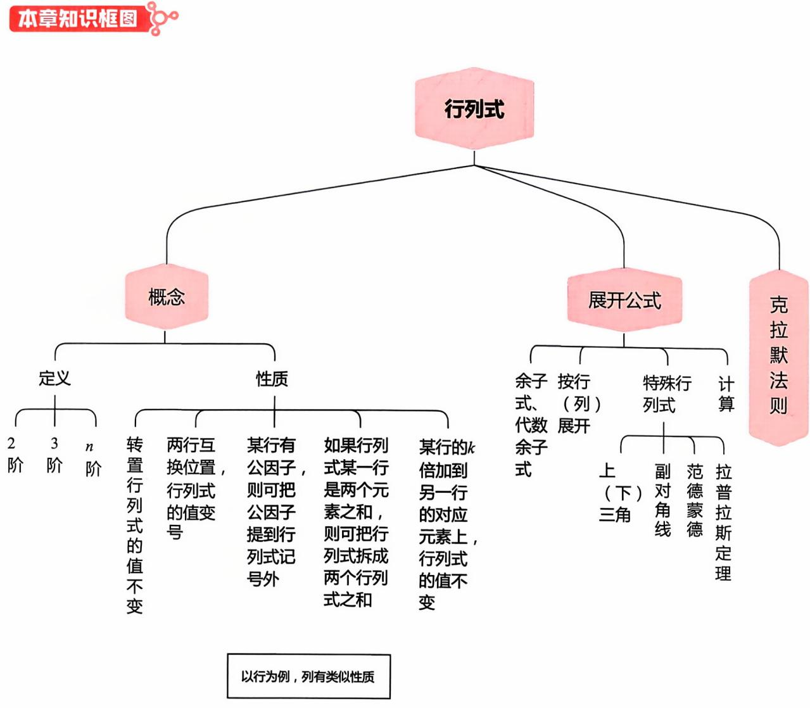
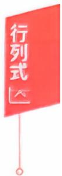
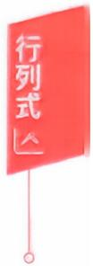

## 第一章 行列式

本章考点………………(1)  
本章知识框图……(1)  
知识梳理与例题……………………………………………………………(2)  
、行列式的概念………………………………………………………(2)  
二、行列式的性质………………………………………………………(4)  
三、行列式按行(或列)展开公式………………………………………(7)  
四、克拉默法则………………………………(12)  
例题解析…………………………(13)  
第二章 矩阵  
本章考点……………(22)  
本章知识框图……………(22)  
知识梳理与例题…………(22)  
一、矩阵的概念及运算……………………………………………(22)  
二、伴随矩阵、可逆矩阵…………(30)  
三、初等变换、初等矩阵…………………(36)  
四、分块矩阵…………………(39)  
五、方阵的行列式…………(42)  
例题解析……(45)  
第三章向量  
本章考点………(55)  
本章知识框图…………(55)  
知识梳理与例题………………(56)  
一、向量的概念、向量组的概念……………………………………(56)  
二、线性表出、线性相关……(56)  
三、向量组的秩、矩阵的秩……………(64)  
四、正交规范化、正交矩阵……(71)  
例题解析…………………………………………(73)  
第四章 线性方程组  
本章考点…………………………………………………………………(84)  
本章知识框图………………………………………………………(84)  
知识梳理与例题……………………………………………(85)  
、基本概念…………………………………………………………(85)  
二、齐次线性方程组……(86)  
三、非齐次线性方程组…………………(90)  
四、公共解、同解…………………(93)  
五、方程组的应用…………………………(93)  
例题解析……………(96)  
第五章 特征值和特征向量  
本章考点…………………………………………………………………(105)  
本章知识框图……………………………………………………(105)  
知识梳理与例题…………………………………………………………(105)  
、特征值、特征向量……………………………(105)  
二、相似矩阵…………(111)  
三、实对称矩阵……(117)  
例题解析……………(120)  
第六章 二次型  
本章考点…………………………(130)  
本章知识框图…………………(130)  
知识梳理与例题……………………(131)  
、二次型及其标准形……(131)  
二、正定二次型……(140)  
例题解析………(143)

## 第一章 行列式

## 本章考点

行列式的概念和基本性质行列式按行(列）展开定理线性方程组的克拉默(Cramer）法则

学习笔记

## 知识梳理与例题

## 一、行列式的概念

行列式是一个数，它是不同行不同列元素乘积的代数和.

例如，大家所熟悉的三阶行列式

$$
\begin{vmatrix} a_{1} & a_{2} & a_{3} \\ b_{1} & b_{2} & b_{3} \\ c_{1} & c_{2} & c_{3} \end{vmatrix} = a_{1}b_{2}c_{3} + a_{2}b_{3}c_{1} + a_{3}b_{1}c_{2} - a_{3}b_{2}c_{1} - a_{2}b_{1}c_{3} - a_{1}b_{3}c_{2}
$$

其每一项都是3个数的乘积，从字母看a，b，c各有1个，说明这3个数一个在第1行，一个在第2行，一个在第3行；而从下标看数字1，2，3各有1个，说明这3个数分别来自第1列、第2列和第3列.

在这6项中，有3项带“+”号，3项带“”号，大家可以用对角线方法来记忆：

当三阶行列式的元素中有较多的 $ \text{" }0 "$ 时，用对角线法来计算行列式的值是简便的.例如，

$$
\begin{aligned}\left| \begin{matrix}0 & 1 & 2 \\3 & 0 & 4 \\5 & 6 & 0\end{matrix} \right|&= 0 \times 0 \times 0 + 1 \times 4 \times 5 + 2 \times 3 \times 6 - 2 \times 0 \times 5 - 1 \times 3 \times 6 \\&= 0 - 0 \times 4 \times 6 = 56,\end{aligned}
$$

$$
\begin{aligned} &\begin{vmatrix}\\ &1 & 0 & - 1 \\&2 & - 2 & 1 \\&0 & - 3 & 4\\ &\end{vmatrix}=-8+0+6-0-0-(-3)=1.\\ \end{aligned}
$$

一般地，我们应当用行列式的性质将其恒等变形化简，再通过展开公式（用降阶法）来计算行列式的值.

对于n阶行列式的概念，大家要有一个简单的了解.

n阶行列式

$$
\begin{pmatrix}a_{11} & a_{12} & \cdots & a_{1n} \\a_{21} & a_{22} & \cdots & a_{2n} \\\vdots & \vdots & & \vdots \\a_{n1} & a_{n2} & \cdots & a_{nn}\end{pmatrix}
$$

是所有取自不同行不同列的n个元素的乘积

$$
\alpha_{1j_1} \alpha_{2j_2} \cdots \alpha_{nj_n}
$$

的代数和，这里 $j_{1}j_{2}\cdots j_{n}$ 是1,2，…，n的一个排列.当 $j_{1}j_{2}\cdots j_{n}$ 是偶排列时，该项的前面带正号；当 $j_{1}j_{2}\cdots j_{n}$ 是奇排列时，该项的前面带负号，即

$$
\begin{vmatrix}a_{11} & a_{12} & \cdots & a_{1n} \\a_{21} & a_{22} & \cdots & a_{2n} \\\vdots & \vdots & & \vdots \\a_{n1} & a_{n2} & \cdots & a_{nn}\end{vmatrix}= \sum_{j_1 j_2 \cdots j_n} (-1)^{\tau(j_1 j_2 \cdots j_n)} a_{1j_1} a_{2j_2} \cdots a_{nj_n} .\tag{1}
$$

这里 $\sum_{j_{1}^{}j_{2}^{}\cdots j_{n}^{}}$ 表示对所有n阶排列求和.式(1)称为n阶行列式的完全展开式.

【注】所谓排列是指由n个数1,2，…，n所构成的一个有序数组，通常用 $j_{1}j_{2}\cdots j_{n}$ 表示n阶排列，显然共有n！个n阶排列.

一个排列中，如果一个大的数排在小的数之前，就称这两个数构成一个逆序.一个排列的逆序总数称为这个排列的逆序数.用$\tau(j_1j_2\cdots j_n)$ 表示排列 $j_{1}j_{2}\cdots j_{n}$ 的逆序数.

如果一个排列的逆序数是偶数，则称这个排列为偶排列，否则称之为奇排列.

例如，2413是四级排列.2,1;4,1;4,3是逆序，故逆序数τ(2413) $= 1 + 2 = 3$ 是奇排列.

又如35142是五级排列.3,1;3,2;5,1;5,4;5,2;4,2是逆序，故 逆序数 $\tau(35142) = 2 + 3 + 1 = 6$ 是偶排列.而自然排列12345没有 逆序，逆序数为0是偶排列.

例如 $\alpha_{12} \alpha_{24} \alpha_{33} \alpha_{41}$ 是四阶行列式中的一项，那么该项所带的符号由 $\tau(2431) = 1 + 2 + 1 = 4$ （即2有1个逆序，4有2个逆序，3有1个逆序）确定，是偶排列，故取正号.

又如 $a_{13}a_{25}a_{31}a_{42}a_{54}$ 是五阶行列式中的一项，由 $\tau(35124) = 2 +$ $3 = 5$ 是奇排列，故在行列式中应取负号.

例1 四阶行列式 $\left| \textbf{\em A} \right| = \left| \begin{aligned} &0 & 0 & 0 & a \\ &0 & 0 & b & 0 \\ &0 & c & 0 & 0 \\ &d & 0 & 0 & 0 \end{aligned} \right| .$

答案见 13 页

例2（1）写出四阶行列式中含有因子 $\alpha_{12} \alpha_{34}$ 且带负号的项

(2) 多项式 $f(x)=\begin{vmatrix}x&2x&1&0\\2&x-1&1&3\\1&2&x&-1\\x&5&6&2\end{vmatrix}$ 中 $,x^{3}$ 的系数为

答案见13 页

## 二、行列式的性质

$$
 记  \left| \boldsymbol{A} \right| = \left| \begin{matrix} a_{11} & a_{12} & \cdots & a_{1n} \\ a_{21} & a_{22} & \cdots & a_{2n} \\ \vdots & \vdots & & \vdots \\ a_{n1} & a_{n2} & \cdots & a_{nn} \end{matrix} \right|, \left| \boldsymbol{A}^{\mathrm{T}} \right| = \left| \begin{matrix} a_{11} & a_{21} & \cdots & a_{n1} \\ a_{12} & a_{22} & \cdots & a_{n2} \\ \vdots & \vdots & & \vdots \\ a_{1n} & a_{2n} & \cdots & a_{nn} \end{matrix} \right|
$$

行列式 $\mid \boldsymbol{A}^{\mathrm{T}} \mid$ 称为|A|的转置行列式.

性质1经过转置，行列式的值不变，即 $| \textbf{A}^{\mathtt{T}} | = | \textbf{A} |$

$$
\begin{aligned} &\begin{vmatrix}\\ &a_{1} & a_{2} & a_{3} \\&b_{1} & b_{2} & b_{3} \\&c_{1} & c_{2} & c_{3}\\ &\end{vmatrix} = \begin{vmatrix}\\ &a_{1} & b_{1} & c_{1} \\&a_{2} & b_{2} & c_{2} \\&a_{3} & b_{3} & c_{3}\\ &\end{vmatrix}.\\ \end{aligned}
$$

由此可知行列式行的性质与列的性质是对等的(为方便说明，行列式都以三阶为例).

性质2 两行(或列）互换位置，行列式的值变号.

特别地，两行（或列）相同，行列式的值为0.

性质3 某行(或列）如有公因子k，则可把k提出行列式记号外(亦即用数k乘行列式|A|等于用k乘它的某行或列).

特别地：(1）某行（或列）的元素全为0，行列式的值为0.

（2）若两行（或列）的元素对应成比例，行列式的值为0.

性质4 如果行列式某行（或列）是两个元素之和，则可把行列式拆成两个行列式之和.

$$
\begin{vmatrix}a_{1} + b_{1} & a_{2} + b_{2} & a_{3} + b_{3} \\c_{1} & c_{2} & c_{3} \\d_{1} & d_{2} & d_{3}\end{vmatrix}=\begin{vmatrix}a_{1} & a_{2} & a_{3} \\c_{1} & c_{2} & c_{3} \\d_{1} & d_{2} & d_{3}\end{vmatrix}+\begin{vmatrix}b_{1} & b_{2} & b_{3} \\c_{1} & c_{2} & c_{3} \\d_{1} & d_{2} & d_{3}\end{vmatrix}.
$$

性质5 把某行(或列）的k倍加到另一行(或列)，行列式的值不变.

$$
\begin{vmatrix}a_{1} & a_{2} & a_{3} \\b_{1} & b_{2} & b_{3} \\c_{1} & c_{2} & c_{3}\end{vmatrix}=\begin{vmatrix}a_{1} & a_{2} & a_{3} \\b_{1} + k a_{1} & b_{2} + k a_{2} & b_{3} + k a_{3} \\c_{1} & c_{2} & c_{3}\end{vmatrix}.
$$

例3 证明：对任意的 $a,b,c$ 恒有 $\begin{vmatrix} 1 & 1 & 1 \\ a & b & c \\ b + c & c + a & a + b \end{vmatrix} = 0.$

答案见 14 页

答案见 15 页  

$$
\left| \begin{aligned} b_{1} + c_{1} & \quad c_{1} + a_{1} \quad a_{1} + b_{1} \\ b_{2} + c_{2} & \quad c_{2} + a_{2} \quad a_{2} + b_{2} \\ b_{3} + c_{3} & \quad c_{3} + a_{3} \quad a_{3} + b_{3} \end{aligned} \right| = 2 \left| \begin{aligned} a_{1} & \quad b_{1} & \quad c_{1} \\ a_{2} & \quad b_{2} & \quad c_{2} \\ a_{3} & \quad b_{3} & \quad c_{3} \end{aligned} \right| .
$$

例5 证明 $\begin{aligned} & \text{2 } \boldsymbol{D} = \left| \begin{matrix} 0 & a_{12} & a_{13} \\ -a_{12} & 0 & a_{23} \\ -a_{13} & -a_{23} & 0 \end{matrix} \right| = 0.\\ \end{aligned}$

答案见 14 页

## 三、行列式按行（或列）展开公式

在n阶行列式

$$
\begin{aligned} &D = \begin{vmatrix}\\ &a_{11} & a_{12} & \cdots & a_{1n} \\&a_{21} & a_{22} & \cdots & a_{2n} \\&\vdots & \vdots & & \vdots \\&a_{n1} & a_{n2} & \cdots & a_{nn}\\ &\end{vmatrix}\\ \end{aligned}
$$

中划去 $\alpha_{ij}$ 所在的第i行、第j列的元素，由剩下的元素按原来的位置排法构成的一个n一1阶的行列式

$$
\begin{aligned}\left| \begin{array}{ccccc}\alpha_{11} & \cdots & \alpha_{1,j-1} & \alpha_{1,j+1} & \cdots & \alpha_{1n} \\\vdots &  & \vdots & \vdots &  & \vdots \\\alpha_{i-1,1} & \cdots & \alpha_{i-1,j-1} & \alpha_{i-1,j+1} & \cdots & \alpha_{i-1,n} \\\alpha_{i+1,1} & \cdots & \alpha_{i+1,j-1} & \alpha_{i+1,j+1} & \cdots & \alpha_{i+1,n} \\\vdots &  & \vdots & \vdots &  & \vdots \\\alpha_{n1} & \cdots & \alpha_{n,j-1} & \alpha_{n,j+1} & \cdots & \alpha_{nn} \\\end{array} \right|,\end{aligned}
$$

称其为 $a_{ij}$ 的余子式，记为 $M_{ij}$ ;称 $(-1)^{i+j}M_{ij}$ 为 $\alpha_{ij}$ 的代数余子式，记 为 $A_{ij}$ ,即

$$
A _ { i j } = ( - 1 ) ^ { i + j } M _ { i j }   .
$$

定理1.1 n阶行列式等于它的任何一行(列)元素与其对应的代数余子式乘积之和，即

$$
\left| \boldsymbol{A} \right| = a_{i1}A_{i1} + a_{i2}A_{i2} + \cdots + a_{in}A_{in} = \sum_{k = 1}^{n}a_{ik}A_{ik}, i = 1,2,\cdots,n.
$$

$$
\left| \boldsymbol { A } \right| = a _ { 1 j } A _ { 1 j } + a _ { 2 j } A _ { 2 j } + \cdots + a _ { n j } A _ { n j } = \sum _ { k = 1 } ^ { n } a _ { k j } A _ { k j } , j = 1 , 2 , \cdots , n.
$$

前一个公式称|A|是按第i行展开的展开式，后一个公式称|A|是按第j列展开的展开式.

定理1.2 行列式的任一行(列）元素与另一行(列）元素的代数余子式乘积之和为0，即

$$
\sum_{k = 1}^{n}a_{ik}A_{jk} = a_{i1}A_{j1} + a_{i2}A_{j2} + \cdots + a_{in}A_{jn} = 0, i \neq j.
$$

$$
\sum_{k = 1}^{n}a_{ki}A_{kj} = a_{1i}A_{1j} + a_{2i}A_{2j} + \cdots + a_{ni}A_{nj} = 0, i \neq j.
$$

在用展开公式的时候，还要注意下面几个特殊情况的配合.

（1）上（下）三角形行列式的值等于主对角线元素的乘积.

$$
\begin{vmatrix}a_{_{11}} & a_{_{12}} \cdots a_{_{1n}} \\a_{_{22}} \cdots a_{_{2n}} \\\bigvee & \ddots & \vdots \\a_{_{nn}}\end{vmatrix}=\begin{vmatrix}a_{_{11}} &  &  \\a_{_{21}} & a_{_{22}} \\\vdots & \vdots & \ddots \\a_{_{n1}} & a_{_{n2}} \cdots a_{_{nn}}\end{vmatrix}= a_{_{11}} a_{_{22}} \cdots a_{_{nn}} .
$$

(2) 关于副对角线的行列式.

$$
\begin{aligned}\left| \begin{matrix}a_{11} & a_{12} & \cdots & a_{1,n-1} & a_{1n} \\a_{21} & a_{22} & \cdots & a_{2,n-1} & 0 \\\vdots & \vdots & & \vdots & \vdots \\a_{n1} & 0 & \cdots & 0 & 0 \\\end{matrix} \right|&=\left| \begin{matrix}0 & \cdots & 0 & a_{1n} \\0 & \cdots & a_{2,n-1} & a_{2n} \\\vdots & & \vdots & \vdots \\a_{n1} & \cdots & a_{n,n-1} & a_{nn} \\\end{matrix} \right| \\&= (-1)^{\frac{n(n-1)}{2}} a_{1n} a_{2,n-1} \cdots a_{n1}.\end{aligned}
$$

(3)两个特殊的拉普拉斯展开式.

如果 A 和 B 分别是 m 阶和 n 阶矩阵，则

$$
\begin{vmatrix} \boldsymbol { A } & \star \\ \boldsymbol { O } & \boldsymbol { B } \end{vmatrix} = \begin{vmatrix} \boldsymbol { A } & \boldsymbol { O } \\ \star & \boldsymbol { B } \end{vmatrix} = \left| \begin{array} { l l } \boldsymbol { A } \end{array} \right| \bullet \left| \begin{array} { l } \boldsymbol { B } \end{array} \right| ,
$$

$$
\begin{vmatrix} \boldsymbol{O} & \boldsymbol{A} \\ \boldsymbol{B} & \star \end{vmatrix} = \begin{vmatrix} \star & \boldsymbol{A} \\ \boldsymbol{B} & \boldsymbol{O} \end{vmatrix} = (-1)^{mn} \left| \boldsymbol{A} \right| \bullet \left| \boldsymbol{B} \right| .
$$

（4）范德蒙德行列式.

$$
\left| \begin{array} { c c c c }1 & 1 & \cdots & 1 \\x _ { 1 } & x _ { 2 } & \cdots & x _ { n } \\x _ { 1 } ^ { 2 } & x _ { 2 } ^ { 2 } & \cdots & x _ { n } ^ { 2 } \\\vdots & \vdots & & \vdots \\x _ { 1 } ^ { n - 1 } & x _ { 2 } ^ { n - 1 } & \cdots & x _ { n } ^ { n - 1 } \\\end{array} \right|= \prod _ { 1 \leqslant j < i \leqslant n } \left( x _ { i } - x _ { j } \right) .
$$

例6计算行列式的值

(1)

练习区域

$$
\begin{bmatrix} 1 & 4 & -1 & 4 \\ 2 & 2 & 2 & 3 \\ 3 & -1 & 6 & 2 \\ 4 & 0 & 5 & 3 \end{bmatrix}
$$

(2)

$$
\begin{bmatrix} 0 & 5 & 2 & 0 \\ 8 & 3 & 5 & 4 \\ 7 & 2 & 4 & 1 \\ 0 & 4 & 1 & 0 \end{bmatrix}
$$

答案见 15 页

例7 行列式 $\begin{aligned} &\begin{vmatrix} 1 & 1 & 1 & 0 \\ 1 & 1 & 0 & 1 \\ 1 & 0 & 1 & 1 \\ 0 & 1 & 1 & 1 \end{vmatrix}=\\ \end{aligned}$

答案见16 页

例8 （1996，数一）行列式 $\begin{aligned} &\left| \begin{matrix} a_{1} & 0 & 0 & b_{1} \\ 0 & a_{2} & b_{2} & 0 \\ 0 & b_{3} & a_{3} & 0 \\ b_{4} & 0 & 0 & a_{4} \end{matrix} \right| = 0\\ \end{aligned}$ (A) $a_{1}a_{2}a_{3}a_{4} - b_{1}b_{2}b_{3}b_{4}$ (B) $a_{1}a_{2}a_{3}a_{4} + b_{1}b_{2}b_{3}b_{4}$ (C) $\left( a _ { 1 } a _ { 2 } - b _ { 1 } b _ { 2 } \right) \left( a _ { 3 } a _ { 4 } - b _ { 3 } b _ { 4 } \right)$ . (D) $\left( a _ { 1 } a _ { 4 } - b _ { 1 } b _ { 4 } \right) \left( a _ { 2 } a _ { 3 } - b _ { 2 } b _ { 3 } \right)$

答案见 17 页

## 例9 计算行列式的值

练习区域

$$
\begin{aligned} &D = \left| \begin{matrix} a + x & a & a & a \\ a & a + x & a & a \\ a & a & a + x & a \\ a & a & a & a + x \end{matrix} \right| = \underline{\hspace{2cm}}.\\ \end{aligned}
$$

(1989，数五）行列式

答案见17 页

$$
\begin{vmatrix} 1 & - 1 & 1 & x - 1 \\ 1 & - 1 & x + 1 & - 1 \\ 1 & x - 1 & 1 & - 1 \\ x + 1 & - 1 & 1 & - 1 \end{vmatrix} =
$$

例11 (2023，经联）已知 $\left| \textbf{\em A} \right| = \left| \begin{matrix} 1 & 2 & - 1 & 1 \\ 0 & 2 & t & 1 \\ 3 & - 1 & 2 & 2 \\ - 1 & 3 & 2 & 1 \end{matrix} \right|$ $,A_{ij}$ 为元 素 $a_{ij}$ 的代数余子式，若 $A_{31} - A_{32} + 2A_{33} - A_{34} = 0$ ,则t =

练习区域

答案见 19 页

$$
\begin{aligned} &\begin{vmatrix}\\ &x & -m & -1 & 0 \\&0 & -x & m & 1 \\&-1 & 0 & x & -m \\&m & 1 & 0 & -x\\ &\end{vmatrix}= a_{4}x^{4} + a_{3}x^{3} + a_{2}x^{2} + a_{1}x + a_{0},\\ \end{aligned}
$$

练习区域

$$
a_{4} + a_{3} + a_{2} + a_{1} + a_{0} =
$$

答案见 20 页

## 四、克拉默法则

定理1.3（克拉默法则）若n个方程n个未知量构成的非齐次线性方程组

$$
\left\{ \begin{aligned} a_{11}x_{1} + a_{12}x_{2} + \cdots + a_{1n}x_{n} &= b_{1}, \\ a_{21}x_{1} + a_{22}x_{2} + \cdots + a_{2n}x_{n} &= b_{2}, \\ \cdots\cdots \\ a_{n1}x_{1} + a_{n2}x_{2} + \cdots + a_{nn}x_{n} &= b_{n} \end{aligned} \right.\tag{1}
$$

的系数行列式 $\left| \textbf{A} \right| \neq 0$ ，则方程组(1）有唯一解，且

$$
x_{i} = \frac{\left| \boldsymbol{A}_{i} \right|}{\left| \boldsymbol{A} \right|}, i = 1,2,\cdots,n,
$$

其中 $\left[ \begin{array}{c} \boldsymbol{A}_{i} \end{array} \right]$ 是 $\mid \boldsymbol{A} \mid$ 中第i列元素(即第i列的x的系数）替换成方程组右端的常数项 $b_{1},b_{2},\cdots,b_{n}$ 所构成的行列式.

【注】若 $\left| \textbf{A} \right| = 0$ ，方程组可能无解，也可能有无穷多解，但一定不是有唯一解.

推论若包含n个方程n个未知量的齐次线性方程组

$$
\begin{cases}a_{11}x_{1} + a_{12}x_{2} + \cdots + a_{1n}x_{n} = 0, \\a_{21}x_{1} + a_{22}x_{2} + \cdots + a_{2n}x_{n} = 0, \\\quad \cdots \cdots \\a_{n1}x_{1} + a_{n2}x_{2} + \cdots + a_{nn}x_{n} = 0\end{cases}\tag{2}
$$

的系数行列式 $\mid \boldsymbol{A} \mid \neq 0$ ，则方程组(2)只有零解.

反之，若齐次线性方程组(2）有非零解，则其系数行列式必为0，即 $| \textbf{A} | = 0$

例13 方程组

$$
\left\{ \begin{aligned} x_{1} + x_{2} + x_{3} &= 1, \\ 2x_{1} - x_{2} - 3x_{3} &= 0, \\ 4x_{1} + x_{2} + 9x_{3} &= 0 \end{aligned} \right.
$$

的解中 $,x_{1} =$

答案见 20 页

## 例题解析

## 一、行列式的概念

学习笔记

例1 【分析】因为行列式|A|的一般项为 $a_{1j_1}a_{2j_2}a_{3j_3}a_{4j_4}$ 由于有较多的 $a_{ij} = 0$ ,易分析只有 $a_{14}a_{23}a_{32}a_{41}$ 这一项非0，而逆序数$\tau(4321) = 3 + 2 + 1 = 6$ ,所以行列式 $| \boldsymbol{A} | = a b c d$

注】这也提示我们，三阶行列式的对角线法在四阶行列式中失灵.计算四阶行列式必须用展开公式法.

例2【分析】（1）一般项 $a_{1j_{1}}a_{2j_{2}}a_{3j_{3}}a_{4j_{4}},j_{1}j_{2}j_{3}j_{4}$ 是1到4的排列.现 $j_{1} = 2, j_{3} = 4$ 于是 $j_{2}, j_{4}$ 只能取自1和3.

$\tau(2143) = 1 + 1$ ,偶排列；

τ(2341)=1+1+1，奇排列.

所以仅 $a_{12}a_{23}a_{34}a_{41}$ 为所求.

(2)不同行不同列元素乘积的代数和.

若 $x^{3}$ 中的x出现在 $a_{1j}$ ,则只有两种可能 $a_{11}a_{22}a_{33}a_{44}$ 和 $a_{12}a_{24}a_{33}a_{41}$ n若 $x^{3}$ 中的x不出现在 $a _ { 1 j }$ ,则只有 $a_{14}a_{22}a_{33}a_{41}$ 一项.因 $a_{14} = 0$ 故只有两项出现 $x^{3}$ •

由 $\tau(1234)=0,\tau(2431)=4$ ，均为偶排列，带正号，可知有$x(x - 1)x \cdot 2$ 和 $2x \cdot 3 \cdot x \cdot x$ 含 $x^{3}$ ，

所以 $x^{3}$ 的系数为8.

## 二、行列式的性质

例3【证】由行列式性质，有

$$
\begin{vmatrix} 1 & 1 & 1 \\ a & b & c \\ b + c & c + a & a + b \end{vmatrix} = \begin{vmatrix} 1 & 1 & 1 \\ a & b & c \\ a + b + c & a + b + c & a + b + c \end{vmatrix}
$$

(第2行加到第3行)

$$
= ( a + b + c ) \begin{vmatrix} 1 & 1 & 1 \\ a & b & c \\ 1 & 1 & 1 \end{vmatrix}
$$

(第 3 行提公因式 a+ b + c)

(两行相同行列式为0)

例4【证】方法一 把第2列、第3列均加至第1列，并提出第1列的公因数2，得

$$
\begin{aligned} &\left| \begin{aligned}\\ &b_{1} + c_{1} & c_{1} + a_{1} & a_{1} + b_{1} \\&b_{2} + c_{2} & c_{2} + a_{2} & a_{2} + b_{2} \\&b_{3} + c_{3} & c_{3} + a_{3} & a_{3} + b_{3}\\ &\end{aligned} \right| = 2\left| \begin{aligned}\\ &a_{1} + b_{1} + c_{1} & c_{1} + a_{1} & a_{1} + b_{1} \\&a_{2} + b_{2} + c_{2} & c_{2} + a_{2} & a_{2} + b_{2} \\&a_{3} + b_{3} + c_{3} & c_{3} + a_{3} & a_{3} + b_{3}\\ &\end{aligned} \right|\\ &\xrightarrow{c_{2} - c_{1}} 2\left| \begin{aligned}\\ &a_{1} + b_{1} + c_{1} & - b_{1} & - c_{1} \\&a_{2} + b_{2} + c_{2} & - b_{2} & - c_{2} \\&a_{3} + b_{3} + c_{3} & - b_{3} & - c_{3}\\ &\end{aligned} \right|\\ \end{aligned}
$$

(把第1列的一1倍分别加至第2列和第3列)

$$
\frac{c_{1} + c_{2} + c_{3}}{} 2 \left| \begin{aligned} a_{1} \quad & -b_{1} \quad & -c_{1} \\ a_{2} \quad & -b_{2} \quad & -c_{2} \\ a_{3} \quad & -b_{3} \quad & -c_{3} \end{aligned} \right|
$$

（把第2列、第3列均加至第1列)

$$
= 2 \left| \begin{aligned} & a_{1} & b_{1} & c_{1} \\ & a_{2} & b_{2} & c_{2} \\ & a_{3} & b_{3} & c_{3} \end{aligned} \right| .
$$

(从第2列、第3列中分别提出公因数一1)

【注】倍加性质是行列式计算中常用的.

方法二本题也可用一些读者不太熟悉的拆开性质(性质4)来处理，由于行列式每一列都是2个数的和，那么用拆开性质时，该行列式可表示成8个行列式之和.但因两列相等的行列式的值为0，所以这里有6个行列式的值为0.

例如，当第1列选 $\begin{pmatrix}b_{1} \\b_{2} \\b_{3}\end{pmatrix}$ 时，若第2列选 $\begin{pmatrix}a_{1} \\a_{2} \\a_{3}\end{pmatrix}$ ，则第3列不论如何选择，

其行列式的值必为0.故

$$
\begin{aligned}\begin{vmatrix}b_{1} + c_{1} & c_{1} + a_{1} & a_{1} + b_{1} \\b_{2} + c_{2} & c_{2} + a_{2} & a_{2} + b_{2} \\b_{3} + c_{3} & c_{3} + a_{3} & a_{3} + b_{3}\end{vmatrix}&=\begin{vmatrix}b_{1} & c_{1} & a_{1} \\b_{2} & c_{2} & a_{2} \\b_{3} & c_{3} & a_{3}\end{vmatrix}+\begin{vmatrix}c_{1} & a_{1} & b_{1} \\c_{2} & a_{2} & b_{2} \\c_{3} & a_{3} & b_{3}\end{vmatrix}\\&\xlongequal{\quad *}\begin{vmatrix}a_{1} & b_{1} & c_{1} \\a_{2} & b_{2} & c_{2} \\a_{3} & b_{3} & c_{3}\end{vmatrix}+\begin{vmatrix}a_{1} & b_{1} & c_{1} \\a_{2} & b_{2} & c_{2} \\a_{3} & b_{3} & c_{3}\end{vmatrix}\\&= 2\begin{vmatrix}a_{1} & b_{1} & c_{1} \\a_{2} & b_{2} & c_{2} \\a_{3} & b_{3} & c_{3}\end{vmatrix}.\end{aligned}\\\begin{aligned}&= 2\begin{vmatrix}a_{1} & b_{1} & c_{1} \\a_{2} & b_{2} & c_{2} \\a_{3} & b_{3} & c_{3}\end{vmatrix}.\end{aligned}
$$

\*处前者先将1、3两列互换，然后再将2、3两列互换；后者先将1、2两列互换，然后再将2、3两列互换.

例5【证】由行列式性质可知，

$$
\begin{aligned} &D = \left| \begin{matrix}\\ &0 & - a_{12} & - a_{13} \\&\\&a_{12} & 0 & - a_{23} \\&\\&a_{13} & a_{23} & 0\\ &\end{matrix} \right|\\ \end{aligned}
$$

(经转置，行列式的值不变)

$$
\begin{aligned} &= (-1)^{3} \left| \begin{matrix}\\ &0 & a_{12} & a_{13} \\&-a_{12} & 0 & a_{23} \\&-a_{13} & -a_{23} & 0\\ &\end{matrix} \right|\\ &= -D,\\ \end{aligned}
$$

(每行提取公因数一1)

所以 $D = 0$

## 三、行列式按行（或列）展开公式

例6【分析】计算行列式要用展开公式，在用展开公式之前

行列式

一般先用行列式的性质把该行列式的某一行(或列）化出较多的0.

（1）例如，把第2行的—2倍加至第1行，然后把第3行的2倍加至第2行，得

$$
\begin{vmatrix} 1 & 4 & - 1 & 4 \\ 2 & 2 & 2 & 3 \\ 3 & - 1 & 6 & 2 \\ 4 & 0 & 5 & 3 \end{vmatrix} = \begin{vmatrix} - 3 & 0 & - 5 & - 2 \\ 8 & 0 & 14 & 7 \\ 3 & - 1 & 6 & 2 \\ 4 & 0 & 5 & 3 \end{vmatrix}
$$

$$
= ( - 1 ) \times ( - 1 ) ^ { 3 + 2 } \left| \begin{array} { r r r } - 3 & - 5 & - 2 \\ 8 & 1 4 & 7 \\ 4 & 5 & 3 \end{array} \right|
$$

$$
= \left| \begin{matrix} 1 & 0 & 1 \\ 8 & 14 & 7 \\ 4 & 5 & 3 \end{matrix} \right| = \left| \begin{matrix} 1 & 0 & 0 \\ 8 & 14 & - 1 \\ 4 & 5 & - 1 \end{matrix} \right|
$$

$$
= 1 \times ( - 1 ) ^ { 1 + 1 } \left| \begin{matrix} 1 4 & - 1 \\ 5 & - 1 \end{matrix} \right| = - 9.
$$

（2）除用（1）的思路在第4行再构造出一个0，用展开公式之外，还应有用拉普拉斯展开式的设想.

$$
\begin{vmatrix} 0 & 5 & 2 & 0 \\ 8 & 3 & 5 & 4 \\ 7 & 2 & 4 & 1 \\ 0 & 4 & 1 & 0 \end{vmatrix} = - \begin{vmatrix} 0 & 5 & 2 & 0 \\ 0 & 4 & 1 & 0 \\ 7 & 2 & 4 & 1 \\ 8 & 3 & 5 & 4 \end{vmatrix} = \begin{vmatrix} 2 & 5 & 0 & 0 \\ 1 & 4 & 0 & 0 \\ 4 & 2 & 7 & 1 \\ 5 & 3 & 8 & 4 \end{vmatrix}
$$

$$
= \begin{vmatrix} 2 & 5 \\ 1 & 4 \end{vmatrix} \bullet \begin{vmatrix} 7 & 1 \\ 8 & 4 \end{vmatrix} = 60.
$$

例7【分析】第1行的—1倍分别加至第2行和第3行，再用展开式

$$
\boldsymbol{D}=\left|\begin{aligned}&1 & 1 & 1 & 0 \\&0 & 0 & -1 & 1 \\&0 & -1 & 0 & 1 \\&0 & 1 & 1 & 1\end{aligned}\right|=\left|\begin{aligned}&0 & -1 & 1 \\&-1 & 0 & 1 \\&1 & 1 & 1\end{aligned}\right|
$$

$$
\begin{aligned}=\left| \begin{matrix} 0 & - 1 & 1 \\ 0 & 1 & 2 \\ 1 & 1 & 1 \end{matrix} \right| = \left| \begin{matrix} - 1 & 1 \\ 1 & 2 \end{matrix} \right| = - 3 ,\end{aligned}
$$

或每行都加至第1行，提出公因数

$$
\begin{aligned}D &= \left| \begin{matrix}3 & 3 & 3 & 3 \\1 & 1 & 0 & 1 \\1 & 0 & 1 & 1 \\1 & 0 & 1 & 1 \\0 & 1 & 1 & 1 \\\end{matrix} \right|= 3\left| \begin{matrix}1 & 1 & 1 & 1 \\1 & 1 & 0 & 1 \\0 & 1 & 1 & 1 \\\end{matrix} \right| \\&= 3\left| \begin{matrix}1 & 1 & 1 & 1 \\0 & 0 & - 1 & 0 \\0 & - 1 & 0 & 0 \\- 1 & 0 & 0 & 0 \\\end{matrix} \right|= 3 \cdot ( - 1)^{\frac{1}{2}4 \cdot 3}( - 1)^{3} ( 副对角线 ) \\&= - 3,\end{aligned}
$$

【分析】按第1行展开

$$
\begin{aligned}D &= a_{1}\begin{vmatrix}a_{2} & b_{2} & 0 \\b_{3} & a_{3} & 0 \\0 & 0 & a_{4}\end{vmatrix}- b_{1}\begin{vmatrix}0 & a_{2} & b_{2} \\0 & b_{3} & a_{3} \\b_{4} & 0 & 0\end{vmatrix} \\&= a_{1}a_{4}\begin{vmatrix}a_{2} & b_{2} \\b_{3} & a_{3}\end{vmatrix}- b_{1}b_{4}\begin{vmatrix}a_{2} & b_{2} \\b_{3} & a_{3}\end{vmatrix} \\&= (a_{1}a_{4} - b_{1}b_{4})(a_{2}a_{3} - b_{2}b_{3})  ,\end{aligned}
$$

或二、四两行互换，再二、四两列互换

$$
\begin{aligned}D = & - \left| \begin{matrix}a_{1} & 0 & 0 & b_{1} \\b_{4} & 0 & 0 & a_{4} \\0 & b_{3} & a_{3} & 0 \\0 & a_{2} & b_{2} & 0 \\\end{matrix} \right|= \left| \begin{matrix}a_{1} & b_{1} & 0 & 0 \\b_{4} & a_{4} & 0 & 0 \\0 & 0 & a_{3} & b_{3} \\0 & 0 & b_{2} & a_{2} \\\end{matrix} \right| \qquad ( 拉普 ) \\= & \left| \begin{matrix}a_{1} & b_{1} \\b_{4} & a_{4} \\\end{matrix} \right| \bullet \left| \begin{matrix}a_{3} & b_{3} \\b_{2} & a_{2} \\\end{matrix} \right|= (a_{1}a_{4} - b_{1}b_{4})(a_{2}a_{3} - b_{2}b_{3}).\end{aligned}
$$

拉斯)

例9【分析】方法一 把每一行都加至第1行，有

$$
\begin{aligned} &D = \left| \begin{matrix} 4a + x & 4a + x & 4a + x & 4a + x \\a & a + x & a & a \\a & a & a + x & a \\a & a & a & a + x \\\end{matrix} \right|\\ \end{aligned}
$$

$$
= \left( 4 a + x \right) \begin{vmatrix} 1 & 1 & 1 & 1 \\ a & a + x & a & a \\ a & a & a + x & a \\ a & a & a & a + x \end{vmatrix}
$$

$$
\begin{aligned}= (4a + x) \left| \begin{matrix} 1 & 1 & 1 & 1 \\ 0 & x & 0 & 0 \\ 0 & 0 & x & 0 \\ 0 & 0 & 0 & x \end{matrix} \right| = (4a + x)x^{3}.\end{aligned}
$$

方法二把第1行的－1倍分别加到其他各行，有

$$
\begin{aligned} &D = \left| \begin{aligned}\\ &a + x & & a & & a \\&- x & & x & & 0 & \\&- x & & 0 & & x & 0 \\&- x & & 0 & & 0 & & x\\ &\end{aligned} \right| = \left| \begin{aligned}\\ &4a + x & & a & & a & & a \\&0 & & x & & 0 & & 0 \\&0 & & 0 & & x & & 0 \\&0 & & 0 & & 0 & & x\\ &\end{aligned} \right| = (4a + x)x^3.\\ \end{aligned}
$$

方法三先把第3行的—1倍加到第4行，然后把第2行的一1倍加到第3行，最后把第1行的一1倍加到第2行，有

$$
D = \left| \begin{matrix} { a + x } & { a } & { a } & { a } \\ { - x } & { x } & { 0 } & { 0 } \\ { 0 } & { - x } & { x } & { 0 } \\ { 0 } & { 0 } & { - x } & { x } \\ \end{matrix} \right| = \left| \begin{matrix} { 4 a + x } & { a } & { a } & { a } \\ { 0 } & { x } & { 0 } & { 0 } \\ { 0 } & { - x } & { x } & { 0 } \\ { 0 } & { 0 } & { - x } & { x } \\ \end{matrix} \right|
$$

$$
\begin{aligned}= (4a + x) \left| \begin{matrix} x & 0 & 0 \\ -x & x & 0 \\ 0 & -x & x \end{matrix} \right| = (4a + x)x^3.\end{aligned}
$$

方法四

$$
\begin{aligned} &D = \left| \begin{aligned}\\ &a + x & & a + 0 & & a + 0 & & a + 0 \\&a + 0 & & a + x & & a + 0 & & a + 0 \\&a + 0 & & a + 0 & & a + x & & a + 0 \\&a + 0 & & a + 0 & & a + 0 & & a + x\\ &\end{aligned} \right|\\ \end{aligned}
$$

用拆开性质应该

是16个行列式的和，你能写出不为0的那5个行列式吗？

例10【分析】方法一 把每一列都加到第1列，并提出公因式x,

$$
D = x \begin{vmatrix} 1 & - 1 & 1 & x - 1 \\ 1 & - 1 & x + 1 & - 1 \\ 1 & x - 1 & 1 & - 1 \\ 1 & - 1 & 1 & - 1 \end{vmatrix} = x \begin{vmatrix} 1 & - 1 & 1 & x - 1 \\ 0 & 0 & x & - x \\ 0 & x & \dot{0} & - x \\ 0 & 0 & 0 & - x \end{vmatrix}
$$

$$
\begin{aligned}= x \left| \begin{matrix} 0 & x & -   x \\ x & 0 & -   x \\ 0 & 0 & -   x \end{matrix} \right| = x^{4}.\end{aligned}
$$

方法二 第1列分别加到第2列，第4列，第1列的一1倍加到

第3列，

$$
D = \left| \begin{matrix} 1 & 0 & 0 & x \\ 1 & 0 & x & 0 \\ 1 & x & 0 & 0 \\ x + 1 & x & - x & x \end{matrix} \right| = x^{3} \left| \begin{matrix} 1 & 0 & 0 & 1 \\ 1 & 0 & 1 & 0 \\ 1 & 1 & 0 & 0 \\ x + 1 & 1 & - 1 & 1 \end{matrix} \right|
$$

行列式区

$$
\begin{aligned}= x^{3} \left| \begin{aligned} 1 \quad & 0 \quad & 0 \quad & 1 \\ 1 \quad & 0 \quad & 1 \quad & 0 \\ 1 \quad & 1 \quad & 0 \quad & 0 \\ x \quad & 0 \quad & 0 \quad & 0 \end{aligned} \right| = x^{4}.\end{aligned}
$$

方法三拆开法.

$$
D = { \left[ \begin{aligned} { } & { { } 0 + 1 } & { } & { { } 0 - 1 } & { } & { { } 0 + 1 } & { } & { { } x - 1 } \\ { } & { { } 0 + 1 } & { } & { { } 0 - 1 } & { } & { { } x + 1 } & { } & { { } 0 - 1 } \\ { } & { { } 0 + 1 } & { } & { { } x - 1 } & { } & { { } 0 + 1 } & { } & { { } 0 - 1 } \\ { } & { { } x + 1 } & { } & { { } 0 - 1 } & { } & { { } 0 + 1 } & { } & { { } 0 - 1 } \end{aligned} \right] } .
$$

D可以分解成 $2^{4} = 16$ 个行列式之和，若行列式中有2个或2个以上的行(或列)相等或成比例，其行列式的值必为0，不为0的只有5个，即

$$
D = \left| \begin{matrix} 0 & 0 & 0 & x \\ 0 & 0 & x & 0 \\ 0 & x & 0 & 0 \\ x & 0 & 0 & 0 \end{matrix} \right| + \left| \begin{matrix} 1 & 0 & 0 & x \\ 1 & 0 & x & 0 \\ 1 & x & 0 & 0 \\ 1 & 0 & 0 & 0 \end{matrix} \right| + \left| \begin{matrix} 0 & - 1 & 0 & x \\ 0 & - 1 & x & 0 \\ 0 & - 1 & 0 & 0 \\ x & - 1 & 0 & 0 \end{matrix} \right| +
$$

$$
\begin{aligned}&\left| \begin{matrix}0 & 0 & 1 & x \\0 & 0 & 1 & 0 \\0 & x & 1 & 0 \\x & 0 & 1 & 0 \\\end{matrix} \right|+\left| \begin{matrix}0 & 0 & 0 & - 1 \\0 & 0 & x & - 1 \\0 & x & 0 & - 1 \\x & 0 & 0 & - 1 \\\end{matrix} \right| \\=& x^{4} + x^{3} - x^{3} + x^{3} - x^{3} = x^{4}.\end{aligned}
$$

例11【分析】由于 $A_{ij}$ 与 $\alpha_{ij}$ 的数值大小正负无关，故可构造一新的行列式|B|，即

$$
\left| \textbf { \em B } \right| = \left| \begin{matrix} { \textbf { \em 1 } } & { \textbf { \em 2 } } & { - \textbf { \em 1 } } & { \textbf { \em 1 } } \\ { \textbf { \em 0 } } & { \textbf { \em 2 } } & { \textbf { \em t } } & { \textbf { \em 1 } } \\ { \textbf { \em 1 } } & { - \textbf { \em 1 } } & { \textbf { \em 2 } } & { - \textbf { \em 1 } } \\ { - \textbf { \em 1 } } & { \textbf { \em 3 } } & { \textbf { \em 2 } } & { \textbf { \em 1 } } \end{matrix} \right| .
$$

## 【注意】

LAI与|B|虽不一样，但第3行元素的代数余子式A3是完全相同的.

则| $\left| \boldsymbol{B} \right| = A_{31} - A_{32} + 2A_{33} - A_{34} = 0.$

$$
\begin{aligned} &\left| \boldsymbol{B} \right| = \left| \begin{aligned}\\ &1 & \quad 2 & \quad -1 & \quad 1 \\&0 & \quad 2 & \quad t & \quad 1 \\&0 & \quad -3 & \quad 3 & \quad -2 \\&0 & \quad 2 & \quad 4 & \quad 0\\ &\end{aligned} \right| = \left| \begin{aligned}\\ &2 & \quad t & \quad 1 \\&-3 & \quad 3 & \quad -2 \\&2 & \quad 4 & \quad 0\\ &\end{aligned} \right| = -4t - 2.\\ \end{aligned}
$$

所以 $t = - \frac{1}{2}$

例12【分析】为方便，记行列式为 f(x)，则 $f(1) = a_{4} + a_{3}$ $+ a_{2} + a_{1} + a_{0}$

对行列式f(1）恒等变形，有

$$
\begin{aligned}f(1) &= \left| \begin{array}{cccc}1 & -m & -1 & 0 \\0 & -1 & m & 1 \\-1 & 0 & 1 & -m \\m & 1 & 0 & -1 \\\end{array} \right|= \left| \begin{array}{cccc}1 & -m & -1 & 0 \\0 & -1 & m & 1 \\0 & -m & 0 & -m \\0 & 1+m^2 & m & -1 \\\end{array} \right| \\&= \left| \begin{array}{cccc}-1 & m & 1 \\-m & 0 & -m \\1+m^2 & m & -1 \\\end{array} \right|= m^2 \left| \begin{array}{cccc}-1 & 1 & 1 \\-1 & 0 & -1 \\1+m^2 & 1 & -1 \\\end{array} \right| \\&= m^2 \left| \begin{array}{cccc}-1 & 1 & 1 \\-1 & 0 & -1 \\m^2+2 & 0 & -2 \\\end{array} \right|= -m^4 - 4m^2.\end{aligned}
$$

## 四、克拉默法则

例13【分析】系数行列式是范德蒙德行列式，故

$$
D = \left| \begin{matrix} 1 & 1 & 1 \\ 2 & - 1 & - 3 \\ 4 & 1 & 9 \end{matrix} \right| = ( - 1 - 2)( - 3 - 2)\left[ - 3 - ( - 1) \right] = - 30,
$$

又 $D_{1} = \left| \begin{aligned} &1 & 1 & 1 \\ &0 & -1 & -3 \\ &0 & 1 & 9 \end{aligned} \right| = -6.$ ,故 $x_{1} = \frac{1}{5}$

例14【分析】设所求直线方程为 $ax+by+c=0,P(x,y)$ 是该直线上任意一点，则(x，y)，(1,2)，(4,0)应满足直线方程，即有

$$
\begin{cases}ax + by + c = 0   , \\a + 2b + c = 0   , \\4a + c = 0   ,\end{cases}\tag{1}
$$

因存在经过A，B两点的直线，那么a,b，c不全为0，即齐次方程组(1）必有非零解，从而

$$
\begin{vmatrix} x & y & 1 \\ 1 & 2 & 1 \\ 4 & 0 & 1 \end{vmatrix} = 0.
$$

所以 $2x + 3y - 8 = 0$ 为所求.

## 本章作业超链接

## 《基础过关66D题》优选

<table><tr><td>数学一</td><td>361</td><td>362</td><td>363</td><td>364 421</td><td>422</td><td>423</td><td>424</td></tr><tr><td>数学二</td><td>461</td><td>462</td><td>463</td><td>464 546</td><td>547</td><td>548</td><td>549</td></tr><tr><td>数学三</td><td>361</td><td>362</td><td>363</td><td>364 421</td><td>422</td><td>423</td><td>424</td></tr></table>

