## 第二章 矩阵

## 本章考点

矩阵的概念单位矩阵、数量矩阵、对角矩阵、三角矩阵、对称矩阵和反对称矩阵以及它们的性质矩阵的线性运算矩阵的乘法方阵的幂方阵乘积的行列式矩阵的转置逆矩阵的概念和性质矩阵可逆的充分必要条件伴随矩阵矩阵的初等变换初等矩阵矩阵的秩矩阵的等价分块矩阵及其运算

定义 m× n 个数排成如下m 行n列的一个表格

$$
\begin{bmatrix}
a_{11} & a_{12} & \cdots & a_{1n} \\
a_{21} & a_{22} & \cdots & a_{2n} \\
\vdots & \vdots &  & \vdots \\
a_{m1} & a_{m2} & \cdots & a_{mn}
\end{bmatrix},
$$

称为一个 $m \times n$ 矩阵，当 $m = n$ 时，矩阵A称为n阶矩阵或叫n阶方阵.

如果一个矩阵的所有元素都是0，即

$$
\begin{bmatrix}
0 & 0 & \cdots & 0 \\
0 & 0 & \cdots & 0 \\
\vdots & \vdots &  & \vdots \\
0 & 0 & \cdots & 0
\end{bmatrix},
$$

则称这个矩阵是零矩阵，可简记为0.

两个矩阵 $\boldsymbol{A} = \left[ a_{ij} \right]_{m \times n}, \boldsymbol{B} = \left[ b_{ij} \right]_{s \times v}$ ,如果 $m = s , n = t$ ，则称A与 B是同型矩阵.

两个同型矩阵 $\boldsymbol{A} = \left[ a_{ij} \right]_{m \times n}, \boldsymbol{B} = \left[ b_{ij} \right]_{m \times n}$ ，如果对应的元素都相等，即

$$
a_{ij} = b_{ij} \left( i = 1,2,\cdots,m; j = 1,2,\cdots,n \right),
$$

则称矩阵A与B相等，记作 $\boldsymbol{A} = \boldsymbol{B}.$

n阶方阵 $\boldsymbol{A} = \left[ a_{ij} \right]_{n \times n}$ 的元素所构成的行列式

$$
\begin{bmatrix}
a_{11} & a_{12} & \cdots & a_{1n} \\
a_{21} & a_{22} & \cdots & a_{2n} \\
\vdots & \vdots &  & \vdots \\
a_{n1} & a_{n2} & \cdots & a_{nn}
\end{bmatrix}
$$

称为n阶矩阵A的行列式，记成 $\left| A \right|$ 或 detA.

【注】矩阵A是一个表格，而行列式A是一个数，这里的概念与符号不要混淆. $A = \boldsymbol{O}$ 与 $\left| \textbf{A} \right| = 0$ 是不同的，不能搞错.当 $A \ne 0$ 时可能有 $\left| \textbf{A} \right| = 0$ ，当然也可能有 $\left| \boldsymbol{A} \right| \neq 0$ .这些基本常识要想清楚.

## 2. 矩阵的运算

定义（加法）两个同型矩阵(行数与列数分别相等）可以相加，且

$$
\boldsymbol{A} + \boldsymbol{B} = \left[ a_{ij} \right]_{m \times n} + \left[ b_{ij} \right]_{m \times n} = \left[ a_{ij} + b_{ij} \right]_{m \times n}
$$

定义（数量乘法，简称数乘）设k是数 $\boldsymbol{A} = \left[ a_{ij} \right]_{m \times n}$ 是矩阵，则定义数与矩阵的乘法为

$$
k \boldsymbol{A} = k \left[ a_{ij} \right]_{m \times n} = \left[ k a_{ij} \right]_{m \times n}
$$

例如 $\begin{aligned}, \boldsymbol{A} = \begin{bmatrix}
1 & 3 & - 2 \\
0 & - 4 & 5
\end{bmatrix}, \boldsymbol{B} = \begin{bmatrix}
8 & 3 & 5 \\
1 & 2 & - 6
\end{bmatrix}\end{aligned}$ ,则

$$
\boldsymbol{A} + \boldsymbol{B} = \begin{bmatrix}
1 + 8 & 3 + 3 & - 2 + 5 \\
0 + 1 & - 4 + 2 & 5 + ( - 6 )
\end{bmatrix} = \begin{bmatrix}
9 & 6 & 3 \\
1 & - 2 & - 1
\end{bmatrix},
$$

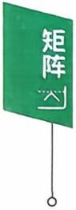

$$
3\boldsymbol{A} = \begin{bmatrix}
3 \times 1 & 3 \times 3 & 3 \times (-2) \\
3 \times 0 & 3 \times (-4) & 3 \times 5
\end{bmatrix} = \begin{bmatrix}
3 & 9 & -6 \\
0 & -12 & 15
\end{bmatrix}.
$$

定义(乘法)设A是一个 $m \times s$ 矩阵，B是一个s×n矩阵(A的列数=B的行数)，则A，B可乘，且乘积AB是一个 $m \times n$ 矩阵.记成$\boldsymbol{C} = \boldsymbol{A} \boldsymbol{B} = \left[ c_{ij} \right]_{m \times n}$ ,其中C的第i行、第j列元素 $c_{ij}$ 是A的第i行s个元素和B的第j列的s个对应元素两两乘积之和，即

$$
c _ { i j } = \sum _ { k = 1 } ^ { s } a _ { i k } b _ { k j } = a _ { i 1 } b _ { 1 j } + a _ { i 2 } b _ { 2 j } + \cdots + a _ { i s } b _ { s j } .
$$

矩阵的乘法可图示如下：

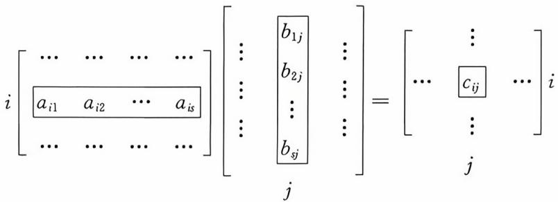  
m×s  
s×n

特别地，设A是一个n阶方阵，则记 $\overbrace{A \cdot A \cdots A}^{k  个 } = A^k$ 称为A的k次幂.

例如 $\begin{aligned} , \boldsymbol{A} = \begin{bmatrix}
1 & 2 \\
3 & 6
\end{bmatrix} , \boldsymbol{B} = \begin{bmatrix}
10 & - 4 \\
- 5 & 2
\end{bmatrix}\end{aligned}$ ,则

$$
\begin{aligned}\boldsymbol{A}\boldsymbol{B} &= \begin{bmatrix}
1 & 2 \\
3 & 6
\end{bmatrix}\begin{bmatrix}
10 & -4 \\
-5 & 2
\end{bmatrix} \\&= \begin{bmatrix}
1 \times 10 + 2 \times (-5) & 1 \times (-4) + 2 \times 2 \\
3 \times 10 + 6 \times (-5) & 3 \times (-4) + 6 \times 2
\end{bmatrix}= \begin{bmatrix}
0 & 0 \\
0 & 0
\end{bmatrix}.\end{aligned}
$$

$$
\boldsymbol{B}\boldsymbol{A} = \begin{bmatrix}
10 & - 4 \\
- 5 & 2
\end{bmatrix} \begin{bmatrix}
1 & 2 \\
3 & 6
\end{bmatrix} = \begin{bmatrix}
- 2 & - 4 \\
1 & 2
\end{bmatrix}.
$$

$$
\boldsymbol{A}^{2}=\begin{bmatrix}
1 & 2 \\
6 & 
\end{bmatrix}\begin{bmatrix}
1 & 2 \\
3 & 6
\end{bmatrix}=\begin{bmatrix}
7 & 14 \\
21 & 42
\end{bmatrix}=7\boldsymbol{A}.
$$

矩阵的乘法是基本的也是重要的，注意不要和数字运算相混淆：

（1）矩阵的乘法一般没有交换律.

(2)矩阵有零因子，即当 $A \ne \mathbf{O}, B \ne \mathbf{O}$ 时，有可能 $AB = \mathbf{O}$ 或者说当 $AB = \boldsymbol{O}$ 时≠A=0或 $\boldsymbol{B} = \boldsymbol{O}$

(3)矩阵没有消去律，即当 $AB = AC,A \ne  O时  \ne  B = C.$

定义(转置)将m×n型矩阵 $\boldsymbol{A} = \left[ \boldsymbol{a}_{ij} \right]_{m \times n}$ 的行列互换得到的 $n \times m$ 矩阵 $\left[ a_{ji} \right]_{n \times m}$ 称为A的转置矩阵，记为 $A^{\mathrm{T}}$ ,即若

$$
\boldsymbol{A} = \begin{bmatrix}
a_{11} & a_{12} & \cdots & a_{1n} \\
a_{21} & a_{22} & \cdots & a_{2n} \\
\vdots & \vdots &  & \vdots \\
a_{m1} & a_{m2} & \cdots & a_{mn}
\end{bmatrix}
$$

$$
\boldsymbol{A}^{\mathrm{T}}=\begin{bmatrix}
\boldsymbol{\alpha}_{11} & \boldsymbol{\alpha}_{21} & \cdots & \boldsymbol{\alpha}_{m1} \\
\boldsymbol{\alpha}_{12} & \boldsymbol{\alpha}_{22} & \cdots & \boldsymbol{\alpha}_{m2} \\
\vdots & \vdots &  & \vdots \\
\boldsymbol{\alpha}_{1n} & \boldsymbol{\alpha}_{2n} & \cdots & \boldsymbol{\alpha}_{nn}
\end{bmatrix}.
$$

定义(矩阵多项式)设A是n阶矩阵， $f(x) = a_m x^m + \cdots + a_1 x$ $ 1  + a_{0}$ 是x的多项式，则称

$$
a_{m}\boldsymbol{A}^{m}+a_{m - 1}\boldsymbol{A}^{m - 1}+\cdots+a_{1}\boldsymbol{A}+a_{0}\boldsymbol{E}
$$

为矩阵多项式，记为f(A).

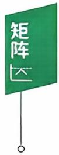

运算法则

(1)加法.A,B,C是同型矩阵，则

$$
\begin{aligned}&\boldsymbol{A} + \boldsymbol{B} = \boldsymbol{B} + \boldsymbol{A}  ;  \quad  交换律  \\&\left( \boldsymbol{A} + \boldsymbol{B} \right) + \boldsymbol{C} = \boldsymbol{A} + \left( \boldsymbol{B} + \boldsymbol{C} \right)  ;  \quad  结合律  \\&\boldsymbol{A} + \boldsymbol{O} = \boldsymbol{A}  , 其中   \boldsymbol{O}    是元素全为零的同型矩阵;  \\&\boldsymbol{A} + \left( - \boldsymbol{A} \right) = \boldsymbol{O}.\end{aligned}
$$

(2)数乘矩阵. $k(mA)=(km)A=m(kA);(k+m)A=kA+mA$ i

$$
k(\boldsymbol{A} + \boldsymbol{B}) = k\boldsymbol{A} + k\boldsymbol{B}; 1\boldsymbol{A} = \boldsymbol{A}, 0\boldsymbol{A} = \boldsymbol{O}.
$$

(3) 乘法.A，B，C满足运算条件时

$$
\begin{aligned}&(AB)C = A(BC) ; \\&A(B + C) = AB + AC ; \\&(B + C)A = BA + CA .\end{aligned}
$$

(4) 转置. $\left( \boldsymbol{A} + \boldsymbol{B} \right)^{\mathrm{T}} = \boldsymbol{A}^{\mathrm{T}} + \boldsymbol{B}^{\mathrm{T}} ; \left( k\boldsymbol{A} \right)^{\mathrm{T}} = k\boldsymbol{A}^{\mathrm{T}} ;$

$$
( \boldsymbol{A} \boldsymbol{B} )^{\mathrm{T}} = \boldsymbol{B}^{\mathrm{T}} \boldsymbol{A}^{\mathrm{T}} ; ( \boldsymbol{A}^{\mathrm{T}} )^{\mathrm{T}} = \boldsymbol{A}.
$$

关于 $\alpha \beta ^ { \mathrm { T } } , \beta \alpha ^ { \mathrm { T } } , \alpha ^ { \mathrm { T } } \beta , \beta ^ { \mathrm { T } } \alpha , \alpha \alpha ^ { \mathrm { T } } , \alpha ^ { \mathrm { T } } \alpha.$

如果有 $\boldsymbol{\alpha} = \left[ a_{1}, a_{2}, a_{3} \right]^{\mathrm{T}}, \boldsymbol{\beta} = \left[ b_{1}, b_{2}, b_{3} \right]^{\mathrm{T}}$ ,则

$$
\boldsymbol { \alpha } \boldsymbol { \beta } ^ { \mathrm { T } } = \begin{bmatrix}
a _ { 1 } \\
a _ { 2 } \\
a _ { 3 }
\end{bmatrix} \begin{bmatrix}
b _ { 1 } , b _ { 2 } , b _ { 3 }
\end{bmatrix} = \begin{bmatrix}
a _ { 1 } b _ { 1 } & a _ { 1 } b _ { 2 } & a _ { 1 } b _ { 3 } \\
a _ { 2 } b _ { 1 } & a _ { 2 } b _ { 2 } & a _ { 2 } b _ { 3 } \\
a _ { 3 } b _ { 1 } & a _ { 3 } b _ { 2 } & a _ { 3 } b _ { 3 }
\end{bmatrix},
$$

$$
\boldsymbol { \beta } ^ { \mathrm { T } } \boldsymbol { \alpha } = \left[ b _ { 1 } , b _ { 2 } , b _ { 3 } \right] \begin{bmatrix}
a _ { 1 } \\
a _ { 2 } \\
a _ { 3 }
\end{bmatrix} = a _ { 1 } b _ { 1 } + a _ { 2 } b _ { 2 } + a _ { 3 } b _ { 3 } ,
$$

$$
\boldsymbol { \beta } \boldsymbol { \alpha } ^ { \mathrm { T } } = \begin{bmatrix}
b _ { 1 } \\
b _ { 2 } \\
b _ { 3 }
\end{bmatrix} \left[ a _ { 1 } , a _ { 2 } , a _ { 3 } \right] = \begin{bmatrix}
a _ { 1 } b _ { 1 } & a _ { 2 } b _ { 1 } & a _ { 3 } b _ { 1 } \\
a _ { 1 } b _ { 2 } & a _ { 2 } b _ { 2 } & a _ { 3 } b _ { 2 } \\
a _ { 1 } b _ { 3 } & a _ { 2 } b _ { 3 } & a _ { 3 } b _ { 3 }
\end{bmatrix},
$$

$$
\boldsymbol { \alpha } ^ { \mathrm { T } } \boldsymbol { \beta } = \left[ a _ { 1 } , a _ { 2 } , a _ { 3 } \right] \begin{bmatrix}
b _ { 1 } \\
b _ { 2 } \\
b _ { 3 }
\end{bmatrix} = a _ { 1 } b _ { 1 } + a _ { 2 } b _ { 2 } + a _ { 3 } b _ { 3 } ,
$$

$$
\boldsymbol { \alpha } \boldsymbol { \alpha } ^ { \top } = \begin{bmatrix}
a _ { 1 } \\
a _ { 2 } \\
a _ { 3 }
\end{bmatrix} \left[ a _ { 1 } , a _ { 2 } , a _ { 3 } \right] = \begin{bmatrix}
a _ { 1 } ^ { 2 } & a _ { 1 } a _ { 2 } & a _ { 1 } a _ { 3 } \\
a _ { 2 } a _ { 1 } & a _ { 2 } ^ { 2 } & a _ { 2 } a _ { 3 } \\
a _ { 3 } a _ { 1 } & a _ { 3 } a _ { 2 } & a _ { 3 } ^ { 2 }
\end{bmatrix},
$$

$$
\boldsymbol{\alpha}^{\mathrm{T}} \boldsymbol{\alpha} = \left[ a_{1}, a_{2}, a_{3} \right] \begin{bmatrix}
a_{1} \\
a_{2} \\
a_{3}
\end{bmatrix} = a_{1}^{2} + a_{2}^{2} + a_{3}^{2}.
$$

【注】（1）如 $A = \boldsymbol{\alpha} \boldsymbol{\beta}^{\mathrm{T}}$ ，则 $\boldsymbol{A}^{\mathrm{T}} = \boldsymbol{\beta} \boldsymbol{\alpha}^{\mathrm{T}}$ 且 $r(\boldsymbol{A}) = r(\boldsymbol{A}^{\mathrm{T}}) = 1$ 或0.

(2) $\boldsymbol{\alpha}^{\mathrm{T}} \boldsymbol{\beta} = \boldsymbol{\beta}^{\mathrm{T}} \boldsymbol{\alpha} = \operatorname{tr}(\boldsymbol{A})$

(3) $\mathbf{a}\mathbf{a}^{\mathrm{T}}$ 是对称矩阵 $, \boldsymbol{\alpha}^{\mathrm{T}} \boldsymbol{\alpha}$ 是平方和.

## 3. 常见的矩阵

设A 是 n 阶矩阵.

（1）单位阵.主对角元素为1，其余元素为0的矩阵称为单位阵，记成 $E_{n}$

关于单位矩阵E

$$
\begin{bmatrix}
1 & 0 \\
0 & 1
\end{bmatrix}, \begin{bmatrix}
1 & 0 & 0 \\
0 & 1 & 0 \\
0 & 0 & 1
\end{bmatrix}, \cdots
$$

$$
\begin{bmatrix}
1 & 2 & 3 \\
4 & 5 & 6
\end{bmatrix} \begin{bmatrix}
1 & 0 & 0 \\
0 & 1 & 0 \\
0 & 0 & 1
\end{bmatrix} = \begin{bmatrix}
1 & 2 & 3 \\
4 & 5 & 6
\end{bmatrix};
$$

$$
\begin{bmatrix}
1 & 0 \\
0 & 1
\end{bmatrix} \begin{bmatrix}
1 & 2 & 3 \\
4 & 5 & 6
\end{bmatrix} = \begin{bmatrix}
1 & 2 & 3 \\
4 & 5 & 6
\end{bmatrix} .
$$

(2) 数量阵.数 k 与单位阵E 的积 kE 称为数量阵.

(3)对角阵.非对角元素都是0的矩阵(即 $\forall i \neq j$ 恒有 $a_{ij} = 0$ 称为对角阵，记成A.

$$
\boldsymbol { \Lambda } = \mathrm { d i a g } \left[ a _ { 1 } , a _ { 2 } , \cdots , a _ { n } \right] .
$$

关于对角矩阵

$$
\begin{bmatrix}
a_{1} & 0 & 0 \\
0 & a_{2} & 0 \\
0 & 0 & a_{3}
\end{bmatrix} \begin{bmatrix}
b_{1} & 0 & 0 \\
0 & b_{2} & 0 \\
0 & 0 & b_{3}
\end{bmatrix} = \begin{bmatrix}
a_{1}b_{1} & 0 & 0 \\
0 & a_{2}b_{2} & 0 \\
0 & 0 & a_{3}b_{3}
\end{bmatrix}.
$$

$$
\begin{align*}(1) \boldsymbol{\Lambda}_{1} \boldsymbol{\Lambda}_{2} = \boldsymbol{\Lambda}_{2} \boldsymbol{\Lambda}_{1}.\end{align*}
$$

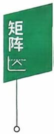

(2)

$$
\begin{bmatrix}
a_{1} \\
a_{2} \\
a_{3}
\end{bmatrix}^{n} = \begin{bmatrix}
a_{1}^{n} & 0 & 0 \\
0 & a_{2}^{n} & 0 \\
0 & 0 & a_{3}^{n}
\end{bmatrix}.\tag{3}
$$

$$
\begin{bmatrix}
a_{1} \\
a_{2} \\
a_{3}
\end{bmatrix}^{-1} = \begin{bmatrix}
\frac{1}{a_{1}} \\
\frac{1}{a_{2}} \\
\frac{1}{a_{3}}
\end{bmatrix} (a_{i} \neq 0).
$$

(4)上(下)三角阵.当 $i > j \left( i < j \right)$ 时，有 $a_{ij} = 0$ 的矩阵称为上(下）三角阵.

（5)对称阵.满足 $A^{\mathrm{T}} = A$ ,即 $a_{ij} = a_{ji}$ 的矩阵称为对称阵.

(6)反对称阵.满足 $A^{\mathrm{T}} = - A$ ,即 $a_{ij} = - a_{ji}, a_{ii} = 0$ 的矩阵称为 反对称阵.

例1

$$
\begin{aligned}& 若  \left[ \begin{aligned} 1 \quad 2 \quad 3 \\ 4 \quad 5 \quad 6 \\ 7 \quad 8 \quad 9 \end{aligned} \right] - \boldsymbol{X} + \left[ \begin{aligned} 1 \\ 2 \\ 0 \end{aligned} \right] \left[ \begin{aligned} 2 \quad 0 \quad - 1 \end{aligned} \right] = 3 \left[ \begin{aligned} 1 \quad 0 \quad 0 \\ 2 \quad 2 \quad 0 \\ 3 \quad 3 \quad 3 \end{aligned} \right]\end{aligned}
$$

X =

练习区域

例2 设 $\boldsymbol{A} = \begin{bmatrix}
1 & 0 \\
0 & -1
\end{bmatrix}, \boldsymbol{B} = \begin{bmatrix}
1 & 2 \\
3 & 4
\end{bmatrix}$ ,则

(1)AB — BA =

练习区域

(2) $(A\boldsymbol{B})^{2} =$

(3) $A^{2}B^{2}=$

例3 (1994，数一)已知 $\boldsymbol{\alpha} = (1,2,3)^{\mathrm{T}}, \boldsymbol{\beta} = (1, \frac{1}{2}, \frac{1}{3})^{\mathrm{T}}$ ,设A $= \boldsymbol{\alpha} \boldsymbol{\beta}^{\mathrm{T}}$ ,则 $A^{n} =$

答案见 45 页

例4 (1991）设 A,B 为 n阶方阵，满足等式 AB = O,则必有 (A)A = O 或 B = O. (B) $\boldsymbol{A} + \boldsymbol{B} = \boldsymbol{O}.$ (C) $| A | = 0   或   | B | = 0.$ (D) $\left| \boldsymbol{A} \right| + \left| \boldsymbol{B} \right| = 0.$

练习区域练习区域

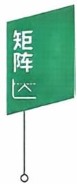

例5设 $\boldsymbol{A} = \boldsymbol{E} - \boldsymbol{\xi} \boldsymbol{\xi}^{\mathrm{T}}$ ,其中ξ是n维非零列向量.证明 $A^{2}=A\Leftrightarrow\xi^{\mathrm{T}}\xi=1$

答案见 46 页

答案见 46 页

## 二、伴随矩阵、可逆矩阵

## 1. 伴随矩阵的概念与公式

伴随矩阵：由矩阵A的行列式A所有的代数余子式所构成的形如

$$
\begin{bmatrix}
A_{11} & A_{21} & \cdots & A_{n1} \\
A_{12} & A_{22} & \cdots & A_{n2} \\
\vdots & \vdots &  & \vdots \\
A_{1n} & A_{2n} & \cdots & A_{nn}
\end{bmatrix}
$$

的矩阵称为矩阵A的伴随矩阵，记为 $A^{*}$

例如 $\mathbf{0}\boldsymbol{A} = \begin{bmatrix}
2 & 1 & 2 \\
-1 & 0 & 3 \\
1 & -2 & 1
\end{bmatrix}$ ，计算代数余子式，得

$$
A_{11} = \begin{vmatrix}
0 & 3 \\
-2 & 1
\end{vmatrix} = 6, A_{12} = - \begin{vmatrix}
-1 & 3 \\
1 & 1
\end{vmatrix} = 4,
$$

$$
A_{13} = \begin{vmatrix}
-1 & 0 \\
1 & -2
\end{vmatrix} = 2  ,
$$

$$
A_{21} = - \begin{vmatrix}
1 & 2 \\
- 2 & 1
\end{vmatrix} = - 5, A_{22} = \begin{vmatrix}
2 & 2 \\
1 & 1
\end{vmatrix} = 0,
$$

$$
A_{^{23}} = - \begin{vmatrix}
2 & 1 \\
1 & - 2
\end{vmatrix} = 5 ,
$$

$$
A_{31} = \begin{vmatrix}
1 & 2 \\
0 & 3
\end{vmatrix} = 3, A_{32} = - \begin{vmatrix}
2 & 2 \\
-1 & 3
\end{vmatrix} = - 8,
$$

$$
A_{33} = \begin{vmatrix}
2 & 1 \\
-1 & 0
\end{vmatrix} = 1  ,
$$

按定义 $\boldsymbol{A}^{*} = \begin{bmatrix}
6 & -5 & 3 \\
4 & 0 & -8 \\
2 & 5 & 1
\end{bmatrix}$

伴随矩阵的公式：

$$
\boldsymbol{A}\boldsymbol{A}^{*} = \boldsymbol{A}^{*} \boldsymbol{A} = \left| \boldsymbol{A} \right| \boldsymbol{E}.
$$

$$
\left( \boldsymbol{A}^{*} \right)^{-1} = \left( \boldsymbol{A}^{-1} \right)^{*} = \frac{1}{\left| \boldsymbol{A} \right|} \boldsymbol{A} \quad \left( \left| \boldsymbol{A} \right| \neq 0 \right).
$$

$$
(k\boldsymbol{A})^{*} = k^{n - 1}\boldsymbol{A}^{*}
$$

$$
\left( \boldsymbol{A}^{*} \right)^{\mathrm{T}} = \left( \boldsymbol{A}^{\mathrm{T}} \right)^{*}
$$

$$
\left| \boldsymbol{A}^{*} \right| = \left| \boldsymbol{A} \right|^{n - 1}
$$

$$
\left( \boldsymbol{A}^{*} \right)^{*} = \left| \boldsymbol{A} \right|^{n - 2} \boldsymbol{A} \left( n \geqslant 2 \right).
$$

{n,如 r(A) = n,

(0,如 r(A) < n− 1.

## 2. 可逆矩阵的概念与定理

定义设A是n阶矩阵，如果存在n阶矩阵B使得

$$
AB = BA = E (单位矩阵)
$$

成立，则称A是可逆矩阵或非奇异矩阵，B是A的逆矩阵，记成 $A^{-1} = B.$

定理2.1若A可逆，则A的逆矩阵唯一.

定理2.2 A可逆 $\Leftrightarrow \mid \boldsymbol{A} \mid \neq 0.$

定理 2. 3 设 A 和 B 是 n 阶矩阵且 AB = E,则 BA = E.

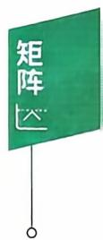

## 3. n 阶矩阵A 可逆的充分必要条件

(1)存在 n阶矩阵 B，使 $AB = E (或  BA = E )$

(2) $| \textbf{A} | \neq 0$ ，或秩r(A)= n,或A的列(行）向量线性无关.

(3) 齐次方程组 Ax = 0 只有零解.

(4) ∀ b,非齐次线性方程组 Ax = b 总有唯一解.

（5）矩阵A的特征值全不为0.

## 4. 逆矩阵的运算性质

若 $k \ne 0, A$ 可逆，则 $(k\boldsymbol{A})^{-1} = \frac{1}{k}\boldsymbol{A}^{-1}$

若A,B可逆，则 $( \boldsymbol{A} \boldsymbol{B} )^{-1} = \boldsymbol{B}^{-1} \boldsymbol{A}^{-1}$ ,特别地 $(A^{2})^{-1} = (A^{-1})^{2}$

若 $A^{\mathrm{T}}$ 可逆，则 $\left( \boldsymbol{A}^{\mathrm{T}} \right)^{-1} = \left( \boldsymbol{A}^{-1} \right)^{\mathrm{T}} ; \left( \boldsymbol{A}^{-1} \right)^{-1} = \boldsymbol{A} ; \left| \boldsymbol{A}^{-1} \right| = \frac{1}{\left| \boldsymbol{A} \right|}.$

注意即使A，B和A+B都可逆，一般地 $( \boldsymbol{A} + \boldsymbol{B} )^{-1} \neq \boldsymbol{A}^{-1} + \boldsymbol{B}^{-1}$

## 5. 求逆矩阵的方法

方法一用公式，若 $\mid \boldsymbol{A} \mid \neq 0$ ,则 $\boldsymbol{A}^{-1} = \frac{1}{\left| \boldsymbol{A} \right|} \boldsymbol{A}^{*}$

方法二初等变换法. $(A \vdots E) \xrightarrow{ 初等行变换 } (E \vdots A^{-1})$

方法三 用定义求B,使AB=E或BA=E,则A可逆，且 $A^{-1} = B.$

方法四 用分块矩阵.

设B，C都是可逆矩阵，则

$$
\begin{bmatrix}
\boldsymbol{B} & \boldsymbol{O} \\
\boldsymbol{O} & \boldsymbol{C}
\end{bmatrix}^{-1} = \begin{bmatrix}
\boldsymbol{B}^{-1} & \boldsymbol{O} \\
\boldsymbol{O} & \boldsymbol{C}^{-1}
\end{bmatrix}; \begin{bmatrix}
\boldsymbol{O} & \boldsymbol{B} \\
\boldsymbol{C} & \boldsymbol{O}
\end{bmatrix}^{-1} = \begin{bmatrix}
\boldsymbol{O} & \boldsymbol{C}^{-1} \\
\boldsymbol{B}^{-1} & \boldsymbol{O}
\end{bmatrix}.
$$

例6 若 $\boldsymbol{A} = \begin{bmatrix}
1 & 1 & 1 \\
1 & 2 & 1 \\
1 & 1 & 3
\end{bmatrix}$ ,则 $A^{-1} \cdot =$

例7设 $\boldsymbol{A} = \begin{bmatrix}
0 & \alpha_{1} & 0 & \cdots & 0 \\
0 & 0 & \alpha_{2} & \cdots & 0 \\
\vdots & \vdots & \vdots &  & \vdots \\
0 & 0 & 0 & \cdots & \alpha_{n - 1} \\
\alpha_{n} & 0 & 0 & \cdots & 0
\end{bmatrix}$ ,其中 $a_{i} \neq 0, i = 1, 2$

答案见 47 页

$$
\cdots , n
$$

$$
A^{*} =
$$

例8设 $\boldsymbol{\alpha} = \left( \frac{1}{2}, 0, \cdots, 0, \frac{1}{2} \right)^{\mathrm{T}}$ 是n维列向量，矩阵 $\boldsymbol{A} = \boldsymbol{E} -$ $\boldsymbol{\alpha} \boldsymbol{\alpha}^{\mathrm{T}}, \boldsymbol{B} = \boldsymbol{E} + a \boldsymbol{\alpha} \boldsymbol{\alpha}^{\mathrm{T}}$ ,若 B 是A 的逆矩阵，则 a=

例9 A是n 阶矩阵，满足 $\boldsymbol{A}^{2}-3 \boldsymbol{A}-2 \boldsymbol{E}=\boldsymbol{O}$ ,则 $( \boldsymbol{A} + \boldsymbol{E} )^{-1} =$

答案见 48 页

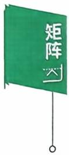  
答案见 49 页

例 10设A,B都是三阶矩阵，且

$$
AB = 2A + B,
$$

若 $\boldsymbol{B} = \begin{bmatrix}
2 & 0 & 2 \\
0 & 4 & 0 \\
2 & 0 & 2
\end{bmatrix}$ ,则 $( \boldsymbol{A} - \boldsymbol{E} )^{-1} =$

例11 (2001，数二)已知 $\boldsymbol{A} = \begin{bmatrix}
1 & 0 & 0 \\
1 & 1 & 0 \\
1 & 1 & 1
\end{bmatrix}, \boldsymbol{B} = \begin{bmatrix}
0 & 1 & 1 \\
1 & 0 & 1 \\
1 & 1 & 0
\end{bmatrix}$ ,矩

阵X满足

$$
A X A + B X B = A X B + B X A + E ,
$$

则 X =

<table><tr><td>练习区域</td></tr></table>

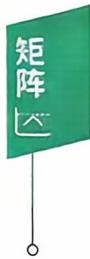

<table><tr><td>练习区域</td></tr></table>

答案见 49 页

例 12 设 $f(x)=x^{100}+x^{99}+\cdots+x+1,A=\begin{bmatrix}
1 & 0 & 0 \\
0 & 0 & 1 \\
0 & 0 & 0
\end{bmatrix}$ ,求

f(A)和 $\left[ f(A) \right]^{-1}$

例 13 A 是n阶可逆矩阵，证明：非齐次线性方程组 Ax = b 有唯一解 $A^{-1}b.$

## 三、初等变换、初等矩阵

## 1. 初等变换与初等矩阵的概念

定义(初等变换)设A是m×n矩阵.

(1) 用某个非零常数 $k(k \neq 0)$ 乘A的某行(列）的每个元素，

(2)互换A的某两行(列)的位置，

(3)将A的某行(列)元素的k倍加到另一行(列)，

称为矩阵的3种初等行(列）变换，且分别称为初等倍乘、互换、倍加行 （列）变换，统称初等变换.

定义(初等矩阵）由单位矩阵经一次初等变换得到的矩阵称为初等矩阵，它们分别是(以三阶为例)

(1)倍乘初等矩阵，记 E(i(k)).

$$
\boldsymbol{E}(2(k)) = \begin{bmatrix}
1 & 0 & 0 \\
0 & k & 0 \\
0 & 0 & 1
\end{bmatrix},
$$

E(2(k))表示由单位阵E的第二行(或第二列)乘 $k(k \neq 0)$ 得到的矩阵.

(2) 互换初等矩阵，记 $\boldsymbol{E}(i, j)$

$$
\boldsymbol{E}(1,2)=\begin{bmatrix}
0 & 1 & 0 \\
1 & 0 & 0 \\
0 & 0 & 1
\end{bmatrix},
$$

E(1,2)表示由单位阵E的第一，二行(或第一，二列)互换得到的矩阵.

（3）倍加初等矩阵，记 $E(ij(k))$

【注】初等矩阵记号各教材不同.

$$
\boldsymbol{E}(13(k)) = \begin{bmatrix}
1 & 0 & 0 \\
0 & 1 & 0 \\
k & 0 & 1
\end{bmatrix},
$$

E(13(k)）表示由单位阵E的第一行的k倍加到第三行得到的矩阵当看成列变换时，应是E的第三列的k倍加到第一列得到的矩阵.

定义(等价矩阵）矩阵A经过有限次初等变换变成矩阵B，则称A与B等价，记成 $\mathbf { \mathit { A } } \simeq \mathbf { \mathit { B } } ,$ 若 $\boldsymbol{A} \cong \begin{bmatrix}
\boldsymbol{E}_{r} & \boldsymbol{O} \\
\boldsymbol{O} & \boldsymbol{O}
\end{bmatrix}$ ，则后者称为A的等价标准形(A的等价标准形是与A等价的所有矩阵中的最简矩阵).

## 2. 初等矩阵与初等变换的性质

（1）初等矩阵的转置仍是初等矩阵.

（2）初等矩阵均是可逆阵，且其逆矩阵仍是初等矩阵.

$$
\boldsymbol{E}(i, j)^{-1} = \boldsymbol{E}(i, j) ; \boldsymbol{E}(i(k))^{-1} = \boldsymbol{E}\left(i\left(\frac{1}{k}\right)\right);
$$

$$
E(ij(k))^{-1} = E(ij(-k)).
$$

(3)用初等矩阵P左乘(右乘)A,其结果PA(AP)，相当于对A作相应的初等行(列）变换.

定理2.4 矩阵A可逆的充分必要条件是它能表示成一些初等矩阵的乘积.

## 3. 行阶梯矩阵，行最简矩阵

## 行阶梯矩阵

（1）如果矩阵中有零行(即这一行元素全是0)，则零行在矩阵的底部.

(2)每个非零行的主元(即该行最左边的第1个非零元)，它们的列指标随着行指标的递增而严格增大.

例如 $\begin{bmatrix}
2 & 1 & 3 \\
0 & 0 & 0 \\
0 & 0 & 5
\end{bmatrix}, \begin{bmatrix}
1 & 3 & - \; 2 \\
0 & 1 & \; 4 \\
0 & 2 & \; 5
\end{bmatrix}$ 都不是行阶梯矩阵.

例如 $\begin{bmatrix}
1 & 2 & 0 & 3 \\
0 & 1 & -1 & 5 \\
0 & 0 & 0 & 6
\end{bmatrix}, \begin{bmatrix}
3 & 0 & 1 & -4 \\
0 & 0 & 2 & 7 \\
0 & 0 & 0 & 0
\end{bmatrix}$ 是行阶梯矩阵.

## 行最简矩阵

一个行阶梯矩阵，如果还满足非零行的主元都是1，且主元所在的列的其他元素都是0，则称其为行最简矩阵.

例如

$$
\begin{bmatrix}
1 & 0 & 3 & 1 \\
0 & 1 & 1 & 0 \\
0 & 0 & 0 & 1
\end{bmatrix}, \begin{bmatrix}
1 & 1 & 2 & 0 \\
0 & 1 & 3 & 0 \\
0 & 0 & 0 & 1
\end{bmatrix}, \begin{bmatrix}
1 & -1 & 0 & 0 \\
0 & 2 & 1 & 0 \\
0 & 0 & 0 & 1
\end{bmatrix}
$$

最简矩阵.

例如

$$
\begin{bmatrix}
1 & 0 & - 1 & 0 \\
0 & 1 & 2 & 0 \\
0 & 0 & 0 & 1
\end{bmatrix}, \begin{bmatrix}
1 & 0 & 0 & 2 \\
0 & 0 & 1 & 3 \\
0 & 0 & 0 & 0
\end{bmatrix}
$$

如由 $A \xrightarrow{ 行 } B$ ,即 $P_{1} \cdots P_{2} P_{1} A = B.$ 记 $P = P_{1} \cdots P_{2}P_{1}$ 有 $PA = B,$ $P_{1} \cdots P_{2} P_{1} A = B$ 和 $P_{1} \cdots P_{2} P_{1} E = P$ 表明当A經行变换得到B时，E在同样的行变换下得到P，即 $(A \mid E) \to (B \mid P)$

例 14（1995，数一）设 $\boldsymbol{A} = \begin{bmatrix}
a_{11} & a_{12} & a_{13} \\
a_{21} & a_{22} & a_{23} \\
a_{31} & a_{32} & a_{33}
\end{bmatrix}$

$$
\boldsymbol{B} = \begin{bmatrix}
a_{21} & a_{22} & a_{23} \\
a_{11} & a_{12} & a_{13} \\
a_{31} + a_{11} & a_{32} + a_{12} & a_{33} + a_{13}
\end{bmatrix}, \boldsymbol{P}_{1} = \begin{bmatrix}
0 & 1 & 0 \\
1 & 0 & 0 \\
0 & 0 & 1
\end{bmatrix}, \boldsymbol{P}_{2} = \begin{bmatrix}
1 & 0 & 0 \\
0 & 1 & 0 \\
1 & 0 & 1
\end{bmatrix}
$$

必有

$$
\boldsymbol{A} \boldsymbol{P}_{1} \boldsymbol{P}_{2} = \boldsymbol{B}.
$$

(B) $\boldsymbol{A} \boldsymbol{P}_{2} \boldsymbol{P}_{1} = \boldsymbol{B}.$

(C) $\boldsymbol{P}_{1} \boldsymbol{P}_{2} \boldsymbol{A} = \boldsymbol{B}.$

(D) $P_{2}P_{1}A = B.$

例15 已知A是三阶矩阵，将矩阵A的第1，3两行互换得到B，

答案见 50 页

再将B的第2列的一1倍加到第3列，得到 $\boldsymbol{C} = \begin{bmatrix}
7 & 8 & 1 \\
4 & 5 & 1 \\
1 & 2 & 1
\end{bmatrix}$ ,则 $A =$

答案见 51 页

例16 已知矩阵 $\boldsymbol{A} = \begin{bmatrix}
a & 1 & 1 \\
1 & a & 1 \\
1 & 1 & a
\end{bmatrix}$ 和矩阵 $\boldsymbol{B} = \begin{bmatrix}
1 & 2 & -1 \\
2 & 3 & 5 \\
3 & 6 & -3
\end{bmatrix}$ 等 价，则a =

  
答案见 51 页

## 四、分块矩阵

## 1. 分块矩阵的概念

将矩阵用若干纵线和横线分成许多小块，每一小块称为原矩阵的子矩阵(或子块)，把子块看成原矩阵的一个元素，则原矩阵叫分块矩阵.

由于不同的需要，同一个矩阵可以用不同的方法分块，构成不同的分块矩阵.

$$
\boldsymbol { A } = \begin{bmatrix}
a _ { 1 1 } & a _ { 1 2 } & \cdots & a _ { 1 n } \\
\cdots \cdots \cdots \cdots \cdots \cdots \cdots \cdots \cdots \cdots \cdots \cdots \cdots &  &  &  \\
a _ { 2 1 } & a _ { 2 2 } & \cdots \cdots \cdots \cdots a _ { 2 n } &  \\
\vdots & \vdots & \vdots &  \\
a _ { m 1 } & a _ { m 2 } & \cdots \cdots \cdots \cdots \cdots & 
\end{bmatrix} = \begin{bmatrix}
\boldsymbol { \alpha } _ { 1 } \\
\boldsymbol { \alpha } _ { 2 } \\
\vdots \\
\boldsymbol { \alpha } _ { m }
\end{bmatrix},
$$

其中 $\boldsymbol { \alpha } _ { i } = \left[ a _ { i 1 } , a _ { i 2 } , \cdots , a _ { i n } \right] , i = 1 , 2 , \cdots , m$ ，是A的子矩阵，A是以行分块的分块矩阵.

$$
\boldsymbol { B } = \begin{bmatrix}
b _ { 1 1 } \vdots b _ { 1 2 } \vdots \cdots \vdots b _ { 1 n } \\
\vdots \vdots \vdots \cdots \vdots b _ { 2 n } \\
b _ { 2 1 } \vdots b _ { 2 2 } \vdots \cdots \vdots b _ { 2 n } \\
\vdots \vdots \vdots \vdots \vdots \vdots \vdots \vdots \vdots \\
b _ { m 1 } \vdots b _ { m 2 } \vdots \cdots \vdots b _ { m n }
\end{bmatrix} = \left[ \boldsymbol { \beta } _ { 1 } , \boldsymbol { \beta } _ { 2 } , \cdots , \boldsymbol { \beta } _ { n } \right] ,
$$

其中 $\boldsymbol { \beta } _ { j } = \left[ b _ { 1 j } , b _ { 2 j } , \cdots , b _ { m j } \right] ^ { \mathrm { T } } , j = 1 , 2 , \cdots , n$ ，是B的子矩阵，B是以列分块的分块矩阵.

$$
\boldsymbol{C}=\begin{bmatrix}
c_{11} & c_{12} \vdots & 0 & 0 & 0 \\
c_{21} & c_{22} \vdots & 0 & 0 & 0 \\
c_{31} & c_{32} \vdots & c_{33} & c_{34} & c_{35} \\
\vdots & \vdots &  &  &  \\
c_{41} & c_{42} \vdots & c_{43} & c_{44} & c_{45}
\end{bmatrix}=\begin{bmatrix}
\boldsymbol{C}_{1} & \boldsymbol{O} \\
\boldsymbol{C}_{3} & \boldsymbol{C}_{4}
\end{bmatrix},
$$

其中 $C_{1} = \begin{bmatrix}
c_{11} & c_{12} \\
c_{21} & c_{22}
\end{bmatrix}, \boldsymbol{O} = \begin{bmatrix}
0 & 0 & 0 \\
0 & 0 & 0
\end{bmatrix}, \boldsymbol{C}_{3} = \begin{bmatrix}
c_{31} & c_{32} \\
c_{41} & c_{42}
\end{bmatrix}, \boldsymbol{C}_{4} =$ $\begin{bmatrix}
\boldsymbol{C}_{33} & \boldsymbol{C}_{34} & \boldsymbol{C}_{35} \\
\boldsymbol{C}_{43} & \boldsymbol{C}_{44} & \boldsymbol{C}_{45}
\end{bmatrix}$ ，均是C的子矩阵.

## 2. 分块矩阵的运算

想对矩阵适当地分块处理(要保证相对应子块的运算能够合理进行），可以遵循下面的运算法则：

$$
\begin{aligned} &\begin{bmatrix}
\boldsymbol{A}_{1} & \boldsymbol{A}_{2} \\
\boldsymbol{A}_{3} & \boldsymbol{A}_{4}
\end{bmatrix} + \begin{bmatrix}
\boldsymbol{B}_{1} & \boldsymbol{B}_{2} \\
\boldsymbol{B}_{3} & \boldsymbol{B}_{4}
\end{bmatrix} = \begin{bmatrix}
\boldsymbol{A}_{1} + \boldsymbol{B}_{1} & \boldsymbol{A}_{2} + \boldsymbol{B}_{2} \\
\boldsymbol{A}_{3} + \boldsymbol{B}_{3} & \boldsymbol{A}_{4} + \boldsymbol{B}_{4}
\end{bmatrix};\\ &\begin{bmatrix}
\boldsymbol{A} & \boldsymbol{B} \\
\boldsymbol{C} & \boldsymbol{D}
\end{bmatrix} \begin{bmatrix}
\boldsymbol{X} & \boldsymbol{Y} \\
\boldsymbol{Z} & \boldsymbol{W}
\end{bmatrix} = \begin{bmatrix}
\boldsymbol{A}\boldsymbol{X} + \boldsymbol{B}\boldsymbol{Z} & \boldsymbol{A}\boldsymbol{Y} + \boldsymbol{B}\boldsymbol{W} \\
\boldsymbol{C}\boldsymbol{X} + \boldsymbol{D}\boldsymbol{Z} & \boldsymbol{C}\boldsymbol{Y} + \boldsymbol{D}\boldsymbol{W}
\end{bmatrix};\\ &\begin{bmatrix}
\boldsymbol{A} & \boldsymbol{B} \\
\boldsymbol{C} & \boldsymbol{D}
\end{bmatrix}^{\mathrm{T}} = \begin{bmatrix}
\boldsymbol{A}^{\mathrm{T}} & \boldsymbol{C}^{\mathrm{T}} \\
\boldsymbol{B}^{\mathrm{T}} & \boldsymbol{D}^{\mathrm{T}}
\end{bmatrix}.\\ \end{aligned}
$$

若B,C分别是m阶与s阶矩阵，则

$$
\left[ \begin{matrix}
{ \pmb { B } } & { \pmb { O } } \\
{ \pmb { O } } & { \pmb { C } }
\end{matrix} \right] ^ { n } = \left[ \begin{matrix}
{ \pmb { B } ^ { n } } & { \pmb { O } } \\
{ \pmb { O } } & { \pmb { C } ^ { n } }
\end{matrix} \right] .
$$

若B,C分别是 m阶与 n阶可逆矩阵，则

$$
\begin{bmatrix}
\boldsymbol{B} & \boldsymbol{O} \\
\boldsymbol{O} & \boldsymbol{C}
\end{bmatrix}^{-1} = \begin{bmatrix}
\boldsymbol{B}^{-1} & \boldsymbol{O} \\
\boldsymbol{O} & \boldsymbol{C}^{-1}
\end{bmatrix}, \begin{bmatrix}
\boldsymbol{O} & \boldsymbol{B} \\
\boldsymbol{C} & \boldsymbol{O}
\end{bmatrix}^{-1} = \begin{bmatrix}
\boldsymbol{O} & \boldsymbol{C}^{-1} \\
\boldsymbol{B}^{-1} & \boldsymbol{O}
\end{bmatrix}.
$$

例17 已知B，C分别是m阶与n阶可逆矩阵，证明： $\begin{bmatrix}
\boldsymbol{B} & \boldsymbol{O} \\
\boldsymbol{O} & \boldsymbol{C}
\end{bmatrix}$ 可逆，且

$$
\begin{bmatrix}
\boldsymbol{B} & \boldsymbol{O} \\
\boldsymbol{O} & \boldsymbol{C}
\end{bmatrix}^{-1} = \begin{bmatrix}
\boldsymbol{B}^{-1} & \boldsymbol{O} \\
\boldsymbol{O} & \boldsymbol{C}^{-1}
\end{bmatrix}.
$$

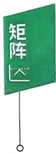  
答案见 52 页

例18 已知 X = ABA,其中

$$
\boldsymbol{A} = \begin{bmatrix}
1 & 0 & 0 & 1 \\
0 & 1 & 1 & 0 \\
0 & 1 & -1 & 0 \\
1 & 0 & 0 & -1
\end{bmatrix}, \boldsymbol{B} = \begin{bmatrix}
0 & 0 & 0 & 1 \\
0 & 0 & 1 & 0 \\
0 & 1 & 0 & 0 \\
1 & 0 & 0 & 0
\end{bmatrix},
$$

则 X =

答案见 52 页

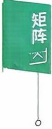

例19 已知 A,B 是 n 阶矩阵.

(1) $\begin{aligned}\begin{bmatrix}
\boldsymbol{E} & \boldsymbol{E} \\
\boldsymbol{O} & \boldsymbol{E}
\end{bmatrix}\begin{bmatrix}
\boldsymbol{A} & \boldsymbol{B} \\
\boldsymbol{B} & \boldsymbol{A}
\end{bmatrix}\begin{bmatrix}
\boldsymbol{E} & -\boldsymbol{E} \\
\boldsymbol{O} & \boldsymbol{E}
\end{bmatrix}=\end{aligned}$

(2) $\begin{aligned} &\begin{vmatrix}
\boldsymbol{A} & \boldsymbol{B} \\
\boldsymbol{B} & \boldsymbol{A}
\end{vmatrix} =\\ \end{aligned}$

练习区域

答案见 53 页

## 五、方阵的行列式

抽象方阵的行列式公式

(1)若A是n阶矩阵， $,A^{\mathrm{T}}$ 是A的转置矩阵，则 $\left| \textbf{A}^{\mathrm{T}} \right| = \left| \textbf{A} \right|$

(2)若A是n阶矩阵，则 $\left| k \boldsymbol{A} \right| = k^{n} \left| \boldsymbol{A} \right|$

(3)(行列式乘法公式)若A、B都是n阶矩阵，则 $| A B | = | A | | B |$ 特别地 $\left| \boldsymbol{A}^{2} \right| = \left| \boldsymbol{A} \right|^{2}$

(4)若A是n阶矩阵，A\*是A的伴随矩阵，则 $\left| \boldsymbol{A}^{*} \right| = \left| \boldsymbol{A} \right|^{n - 1}$

(5)若A是n阶可逆矩阵 $,A^{-1}$ 是A的逆矩阵，则 $\left| \boldsymbol{A}^{-1} \right| = \left| \boldsymbol{A} \right|^{-1}$

(6)设A是 m阶矩阵，B是 n阶矩阵，则

$$
\begin{vmatrix}
\boldsymbol{A} & \boldsymbol{O} \\
\boldsymbol{C} & \boldsymbol{B}
\end{vmatrix} = \begin{vmatrix}
\boldsymbol{A} & \boldsymbol{D} \\
\boldsymbol{O} & \boldsymbol{B}
\end{vmatrix} = \left| \begin{array}{c} \boldsymbol{A} \end{array} \right| \bullet \left| \begin{array}{c} \boldsymbol{B} \end{array} \right| ;
$$

$$
\begin{vmatrix}
\boldsymbol{O} & \boldsymbol{A} \\
\boldsymbol{B} & \boldsymbol{C}
\end{vmatrix} = \begin{vmatrix}
\boldsymbol{D} & \boldsymbol{A} \\
\boldsymbol{B} & \boldsymbol{O}
\end{vmatrix} = (-1)^{m} \left| \boldsymbol{A} \right| \cdot \left| \boldsymbol{B} \right| .
$$

【注】一般情况下， $\left| \boldsymbol{A} + \boldsymbol{B} \right| \neq \left| \boldsymbol{A} \right| + \left| \boldsymbol{B} \right|, \left| \boldsymbol{A} - \boldsymbol{B} \right| \neq \left| \boldsymbol{A} \right| -$ $\left| \textbf{B} \right|, \left| \textbf{A} \right| \neq k \left| \textbf{A} \right|$

例 20 设 A,B 均为 n 阶矩阵， $\left| \boldsymbol{A} \right| = 2, \left| \boldsymbol{B} \right| = - 3$ ，则一 $2\boldsymbol{A}^{\prime} \boldsymbol{B}^{-1} \mid =$

例21 设A是四阶矩阵，如果 $\left| \boldsymbol{A} \right| = - \frac{2}{3}$ ,则 $\left| 3 \boldsymbol{A}^{*} + 4 \boldsymbol{A}^{-1} \right| =$

答案见 53 页

例22 (2017，数农)设A是三阶矩阵，且 $(A - E)^{-1} = A^2 + A +$ E.则 $| \textbf{A} | =$

答案见 53 页

例23 (2012，数二、三)设A是三阶矩阵， $\left| \boldsymbol{A} \right| = 3, \boldsymbol{A}$ 是A的伴随矩阵，交换A的第1行与第2行得矩阵B，则 $\left| \boldsymbol{B} \boldsymbol{A}^{*} \right| =$

答案见 54 页

## 例题解析

## 一、矩阵的概念及运算

学习笔记

【分析】

$$
\begin{aligned}\boldsymbol{X} &= \begin{bmatrix}
1 & 2 & 3 \\
4 & 5 & 6 \\
7 & 8 & 9
\end{bmatrix}+\begin{bmatrix}
1 \\
2 \\
0
\end{bmatrix}\begin{bmatrix}
2 & 0 & -1
\end{bmatrix}-3\begin{bmatrix}
1 & 0 & 0 \\
2 & 2 & 0 \\
3 & 3 & 3
\end{bmatrix} \\&= \begin{bmatrix}
1 & 2 & 3 \\
4 & 5 & 6 \\
7 & 8 & 9
\end{bmatrix}+\begin{bmatrix}
2 & 0 & -1 \\
4 & 0 & -2 \\
0 & 0 & 0
\end{bmatrix}-\begin{bmatrix}
3 & 0 & 0 \\
6 & 6 & 0 \\
9 & 9 & 9
\end{bmatrix} \\&= \begin{bmatrix}
0 & 2 & 2 \\
2 & -1 & 4 \\
-2 & -1 & 0
\end{bmatrix}.\end{aligned}
$$

【分析】

$$
\begin{aligned}(1) \boldsymbol{A} \boldsymbol{B} - \boldsymbol{B} \boldsymbol{A} &= \begin{bmatrix}
1 & 0 \\
0 & -1
\end{bmatrix} \begin{bmatrix}
1 & 2 \\
3 & 4
\end{bmatrix} - \begin{bmatrix}
1 & 2 \\
3 & 4
\end{bmatrix} \begin{bmatrix}
1 & 0 \\
0 & -1
\end{bmatrix} \\&= \begin{bmatrix}
1 & 2 \\
-3 & -4
\end{bmatrix} - \begin{bmatrix}
1 & -2 \\
3 & -4
\end{bmatrix} = \begin{bmatrix}
0 & 4 \\
-6 & 0
\end{bmatrix}.\end{aligned}
$$

$$
\begin{aligned}(2) (\boldsymbol{A}\boldsymbol{B})^{2} &= \left( \begin{bmatrix}
1 & 0 \\
0 & -1
\end{bmatrix} \begin{bmatrix}
1 & 2 \\
3 & 4
\end{bmatrix} \right)^{2} = \begin{bmatrix}
1 & 2 \\
-3 & -4
\end{bmatrix}^{2} \\&= \begin{bmatrix}
-5 & -6 \\
9 & 10
\end{bmatrix}.\end{aligned}
$$

$$
\begin{aligned}(3) \boldsymbol{A}^{2} \boldsymbol{B}^{2} &= \begin{bmatrix}
1 & 0 \\
0 & -1
\end{bmatrix}^{2} \begin{bmatrix}
1 & 2 \\
3 & 4
\end{bmatrix}^{2} = \begin{bmatrix}
1 & 0 \\
0 & 1
\end{bmatrix} \begin{bmatrix}
7 & 10 \\
15 & 22
\end{bmatrix} \\&= \begin{bmatrix}
7 & 10 \\
15 & 22
\end{bmatrix}.\end{aligned}
$$

例3 设 $\boldsymbol{A} = \begin{bmatrix} 1 \\ 2 \\ 3 \end{bmatrix} \begin{bmatrix} 1 & \frac{1}{2} & \frac{1}{3} \end{bmatrix}$，求 $\boldsymbol{A}^n$.

【分析】

$$
\boldsymbol{A} = \boldsymbol{\alpha} \boldsymbol{\beta}^{\mathrm{T}} = \begin{bmatrix}
1 \\
2 \\
3
\end{bmatrix} \begin{bmatrix}
1 & \frac{1}{2} & \frac{1}{3}
\end{bmatrix}
$$

$$
= \left[ \begin{aligned} &1 & \frac{1}{2} & \frac{1}{3} \\ &2 & 1 & \frac{2}{3} \\ &3 & \frac{3}{2} & 1 \end{aligned} \right]
$$

是三阶矩阵.

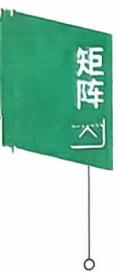

$$
\begin{aligned}\boldsymbol{A}^{n} &= (\boldsymbol{\alpha}\boldsymbol{\beta}^{\mathrm{T}})(\boldsymbol{\alpha}\boldsymbol{\beta}^{\mathrm{T}})\cdots(\boldsymbol{\alpha}\boldsymbol{\beta}^{\mathrm{T}}) \\&= \boldsymbol{\alpha}(\boldsymbol{\beta}^{\mathrm{T}}\boldsymbol{\alpha})\cdots(\boldsymbol{\beta}^{\mathrm{T}}\boldsymbol{\alpha})\boldsymbol{\beta}^{\mathrm{T}}\end{aligned}
$$

(n个)

(n-1个)

$$
\boldsymbol{\beta}^{\mathrm{T}} \boldsymbol{\alpha} = (1 \quad \frac{1}{2} \quad \frac{1}{3}) \begin{bmatrix}
1 \\
2 \\
3
\end{bmatrix} = 3 , 故   \boldsymbol{A}^{n} = 3^{n - 1} \begin{bmatrix}
1 & \dfrac{1}{2} & \dfrac{1}{3} \\
2 & 1 & \dfrac{2}{3} \\
3 & \dfrac{3}{2} & 1
\end{bmatrix}.
$$

例4【分析】由行列式乘法公式

$$
\left| \boldsymbol{A} \boldsymbol{B} \right| = \left| \boldsymbol{A} \right| \cdot \left| \boldsymbol{B} \right|.
$$

因 $AB = O \Rightarrow \left| A \right| \cdot \left| B \right| = 0$ ,所以选(C).

若 $\boldsymbol{A} = \begin{bmatrix}
1 & 1 \\
0 & 0
\end{bmatrix}, \boldsymbol{B} = \begin{bmatrix}
1 & 1 \\
-1 & -1
\end{bmatrix}$ ,有 $AB = \boldsymbol{O}$ ，可知(A)，(B)错误.

若 $\boldsymbol{A} = \begin{bmatrix}
1 & 0 \\
0 & 1
\end{bmatrix}, \boldsymbol{B} = \begin{bmatrix}
0 & 0 \\
0 & 0
\end{bmatrix}$ ，可知(D)不正确.

例5 【证】 $\begin{aligned}\boldsymbol{A}^{2} &= (\boldsymbol{E} - \boldsymbol{\xi} \boldsymbol{\xi}^{\mathrm{T}})(\boldsymbol{E} - \boldsymbol{\xi} \boldsymbol{\xi}^{\mathrm{T}}) \\&= \boldsymbol{E} - \boldsymbol{\xi} \boldsymbol{\xi}^{\mathrm{T}} - \boldsymbol{\xi} \boldsymbol{\xi}^{\mathrm{T}} + \boldsymbol{\xi} \boldsymbol{\xi}^{\mathrm{T}} \boldsymbol{\xi} \boldsymbol{\xi}^{\mathrm{T}} \\&= \boldsymbol{A} + \boldsymbol{\xi} (\boldsymbol{\xi}^{\mathrm{T}} \boldsymbol{\xi}) \boldsymbol{\xi}^{\mathrm{T}} - \boldsymbol{\xi} \boldsymbol{\xi}^{\mathrm{T}} \\&= \boldsymbol{A} + (\boldsymbol{\xi}^{\mathrm{T}} \boldsymbol{\xi} - 1) \boldsymbol{\xi} \boldsymbol{\xi}^{\mathrm{T}},\end{aligned}$

因为 $\xi \neq 0$ ,所以 $\xi \xi ^ { T } \neq O$

$$
\begin{aligned}\boldsymbol{A}^{\mathrm{T}} = \boldsymbol{A} \Leftrightarrow & (\boldsymbol{\xi}^{\mathrm{T}} \boldsymbol{\xi} - 1) \boldsymbol{\xi} \boldsymbol{\xi}^{\mathrm{T}} = \boldsymbol{O} \\\Leftrightarrow & \boldsymbol{\xi}^{\mathrm{T}} \boldsymbol{\xi} - 1 = 0 \\\Leftrightarrow & \boldsymbol{\xi}^{\mathrm{T}} \boldsymbol{\xi} = 1.\end{aligned}
$$

【注】方程组

$$
\left\{ \begin{aligned} x_{1} + 2x_{2} - x_{3} + 4x_{4} = 2, \\ 2x_{1} - x_{2} + x_{3} + x_{4} = 1, \\ x_{1} + 7x_{2} - 4x_{3} + 11x_{4} = 5. \end{aligned} \right.
$$

用矩阵可以表示为

$$
\begin{bmatrix}
1 & 2 & - 1 & 4 \\
2 & - 1 & 1 & 1 \\
1 & 7 & - 4 & 1
\end{bmatrix} \begin{bmatrix}
x_{1} \\
x_{2} \\
x_{3} \\
x_{4}
\end{bmatrix} = \begin{bmatrix}
2 \\
1 \\
5
\end{bmatrix}.
$$

若记 $\boldsymbol{A} = \begin{bmatrix}
1 & 2 & -1 & 4 \\
2 & -1 & 1 & 1 \\
1 & 7 & -4 & 11
\end{bmatrix}$ ，称为方程组的系数矩阵，未知数

$\boldsymbol{x} = \left[ x_{1}, x_{2}, x_{3}, x_{4} \right]^{\mathrm{T}}$ ，常数项 $\boldsymbol{b} = [2,1,5]^{\mathrm{T}}$ ，则方程组表示为 $Ax = \boldsymbol{b}$

如果对系数矩阵A按列分块.记 $\boldsymbol{A} = \left[ \boldsymbol{\alpha}_{1} , \boldsymbol{\alpha}_{2} , \boldsymbol{\alpha}_{3} , \boldsymbol{\alpha}_{4} \right]$ .由分块矩阵乘法，有

$$
\left[ \boldsymbol{\alpha}_{1}, \boldsymbol{\alpha}_{2}, \boldsymbol{\alpha}_{3}, \boldsymbol{\alpha}_{4} \right] \begin{bmatrix}
x_{1} \\
x_{2} \\
x_{3} \\
x_{4}
\end{bmatrix} = \boldsymbol{b},
$$

得 $x_{1}\boldsymbol{\alpha}_{1} + x_{2}\boldsymbol{\alpha}_{2} + x_{3}\boldsymbol{\alpha}_{3} + x_{4}\boldsymbol{\alpha}_{4} = \boldsymbol{b}.$

那么用向量的语言：方程组问题就可转换为向量b由向量 $\boldsymbol{\alpha}_{1} , \boldsymbol{\alpha}_{2}$ $\boldsymbol{\alpha}_{3} , \boldsymbol{\alpha}_{4}$ 线性表出的问题.

## 二、伴随矩阵、可逆矩阵

【分析】用行变换 $\left( \boldsymbol{A} \mid \boldsymbol{E} \right) \rightarrow \left( \boldsymbol{E} \mid \boldsymbol{A}^{-1} \right)$ 的方法：

$$
\begin{bmatrix}
1 & 1 & 1 \vdots 1 & 0 & 0 \\
1 & 2 & 1 \vdots 0 & 1 & 0 \\
1 & 1 & 3 \vdots 0 & 0 & 1
\end{bmatrix} \xrightarrow{} \begin{bmatrix}
1 & 1 & 1 \vdots & 1 & 0 & 0 \\
0 & 1 & 0 \vdots - 1 & 1 & 0 &  \\
0 & 0 & 2 \vdots - 1 & 0 & 1 & 
\end{bmatrix}
$$

$$
\xrightarrow{}\begin{bmatrix}
1 & 1 & 1 \vdots & 1 & 0 & 0 \\
0 & 1 & 0 \vdots & -1 & 1 & 0 \\
\vdots &  &  &  &  &  \\
0 & 0 & 1 \vdots & -\frac{1}{2} & 0 & \frac{1}{2}
\end{bmatrix}
$$

$$
\xrightarrow{}\begin{bmatrix}
1 & 1 & 0 \vdots & \cfrac{3}{2} & 0 & -\cfrac{1}{2} \\
\vdots &  &  & 0 &  &  \\
0 & 1 & 0 \vdots & -1 & 1 & 0 \\
\vdots &  &  &  &  &  \\
0 & 0 & 1 \vdots & -\cfrac{1}{2} & 0 & \cfrac{1}{2}
\end{bmatrix}
$$

$$
\xrightarrow { } \begin{bmatrix}
1 & 0 & 0 \vdots & \frac{5}{2} & -1 & -\frac{1}{2} \\
\vdots &  &  &  &  &  \\
0 & 1 & 0 \vdots & -1 & 1 & 0 \\
\vdots &  &  &  &  &  \\
0 & 0 & 1 \vdots & -\frac{1}{2} & 0 & \frac{1}{2}
\end{bmatrix},
$$

故 $\boldsymbol{A}^{-1} = \begin{bmatrix}
\frac{5}{2} & -1 & -\frac{1}{2} \\
-1 & 1 & 0 \\
-\frac{1}{2} & 0 & \frac{1}{2}
\end{bmatrix}.$

【注】这个方法是非常重要的基础计算，必须动手做题，千万别大意！当然，也可求 $A_{ij}$ ,构造出 $A^*$ 来求 $A^{-1}$ ·

例7【分析】注意，利用 $A^{*} = \left| A \right| A^{-1}$ ,通过 $A^{-1}$ 来求 $A^*$ 有时会更方便.

对A分块

$$
\boldsymbol { A } = \begin{bmatrix}
0 & \vdots & a _ { 1 } & \cdots & 0 \\
\vdots & \vdots & \vdots &  & \vdots \\
0 & \vdots & 0 & \cdots & a _ { n - 1 } \\
\cdots & \vdots & 0 & \cdots & 0
\end{bmatrix} = \begin{bmatrix}
\boldsymbol { O } & \boldsymbol { A } _ { 1 } \\
\boldsymbol { A } _ { 2 } & \boldsymbol { O }
\end{bmatrix},
$$

则 $\left| \boldsymbol{A} \right| = (-1)^{n-1} a_1 a_2 \cdots a_n \neq 0, \boldsymbol{A}$ 可逆，且

$$
\begin{aligned} &A^{-1} = \left[ \begin{aligned}\\ &0 & 0 & \cdots & 0 & \frac{1}{a_{n}} \\&\frac{1}{a_{1}} & 0 & \cdots & 0 & 0 \\&0 & \frac{1}{a_{2}} & \cdots & 0 & 0 \\&\vdots & \vdots & & \vdots & \vdots \\&0 & 0 & \cdots & \frac{1}{a_{n-1}} & 0\\ &\end{aligned} \right],\\ \end{aligned}
$$

$$
A^{*} = \left| A \right| A^{-1} = (-1)^{n-1}
$$

$$
\begin{aligned} &\\ &\begin{bmatrix}
\frac{1}{a_{1}} & 0 & \cdots & 0 & 0 \\
0 & \frac{1}{a_{2}} & \cdots & 0 & 0 \\
\vdots & \vdots &  & \vdots & \vdots \\
0 & 0 & \cdots & \frac{1}{a_{n - 1}} & 0
\end{bmatrix}.\\ \end{aligned}
$$

【注】这里用到了

$$
\begin{bmatrix}
\boldsymbol{O} & \boldsymbol{A} \\
\boldsymbol{B} & \boldsymbol{O}
\end{bmatrix}^{-1} = \begin{bmatrix}
\boldsymbol{O} & \boldsymbol{B}^{-1} \\
\boldsymbol{A}^{-1} & \boldsymbol{O}
\end{bmatrix}; \begin{bmatrix}
a_{1} \\
a_{2} \\
\ddots \\
a_{s}
\end{bmatrix}^{-1} = \begin{bmatrix}
\frac{1}{a_{1}} \\
\frac{1}{a_{2}} \\
\ddots \\
\frac{1}{a_{s}}
\end{bmatrix}.
$$

$$
\boldsymbol{A}\boldsymbol{B}=(\boldsymbol{E}-\boldsymbol{\alpha}\boldsymbol{\alpha}^{\mathrm{T}})(\boldsymbol{E}+\boldsymbol{a}\boldsymbol{\alpha}\boldsymbol{\alpha}^{\mathrm{T}})\\=\boldsymbol{E}+\boldsymbol{a}\boldsymbol{\alpha}\boldsymbol{\alpha}^{\mathrm{T}}-\boldsymbol{a}\boldsymbol{\alpha}^{\mathrm{T}}-\boldsymbol{a}\boldsymbol{\alpha}\boldsymbol{\alpha}^{\mathrm{T}}\boldsymbol{\alpha}\boldsymbol{\alpha}^{\mathrm{T}}\\=\boldsymbol{E}+(\boldsymbol{a}-1-\boldsymbol{a}\boldsymbol{\alpha}^{\mathrm{T}}\boldsymbol{\alpha})\boldsymbol{a}\boldsymbol{\alpha}^{\mathrm{T}}.
$$

又 $\boldsymbol{\alpha}^{\mathrm{T}} \boldsymbol{\alpha}=\left(\frac{1}{2}, 0, \cdots, 0, \frac{1}{2}\right)\left[\begin{aligned}\frac{1}{2} \\0 \\\vdots \\0 \\\frac{1}{2}\end{aligned}\right]=\frac{1}{2}$ ,故

$$
\boldsymbol{A}\boldsymbol{B}=\boldsymbol{E}+\left(a-1-\frac{1}{2}a\right)\boldsymbol{\alpha}\boldsymbol{\alpha}^{\mathrm{T}}=\boldsymbol{E}\Leftrightarrow\left(\frac{1}{2}a-1\right)\boldsymbol{\alpha}\boldsymbol{\alpha}^{\mathrm{T}}=\boldsymbol{O},
$$

所以 $a = 2.$

例9【分析】本题矩阵A没有具体元素，应考虑用定义法.

即

即

$$
\left( \boldsymbol{A} + \boldsymbol{E} \right) \left( \boldsymbol{A} - 4\boldsymbol{E} \right) + 2\boldsymbol{E} = \boldsymbol{A}^2 - 3\boldsymbol{A} - 2\boldsymbol{E} = \boldsymbol{O},
$$

$$
\left( \boldsymbol{A} + \boldsymbol{E} \right) \left( \boldsymbol{A} - 4\boldsymbol{E} \right) = - 2\boldsymbol{E},
$$

故

$$
\left( \boldsymbol{A} + \boldsymbol{E} \right) \cdot \frac{1}{2} \left( 4\boldsymbol{E} - \boldsymbol{A} \right) = \boldsymbol{E},
$$

$$
\left( \boldsymbol{A} + \boldsymbol{E} \right)^{-1} = \frac{1}{2} \left( 4\boldsymbol{E} - \boldsymbol{A} \right).
$$

例10【分析】由 $AB = 2A + B$ ,有

$$
\boldsymbol{A}\boldsymbol{B}-\boldsymbol{B}-2\boldsymbol{A}+2\boldsymbol{E}=2\boldsymbol{E}, 即 \left(\boldsymbol{A}-\boldsymbol{E}\right)\left(\boldsymbol{B}-2\boldsymbol{E}\right)=2\boldsymbol{E}.
$$

$$
\left( \boldsymbol{A} - \boldsymbol{E} \right)^{-1} = \frac{1}{2} \left( \boldsymbol{B} - 2\boldsymbol{E} \right) = \begin{bmatrix}
0 & 0 & 1 \\
0 & 1 & 0 \\
1 & 0 & 0
\end{bmatrix}.
$$

例11【分析】 $A X A + B X B - A X B - B X A = E ,$

$$
( \boldsymbol { A } - \boldsymbol { B } ) \boldsymbol { X } \boldsymbol { A } - ( \boldsymbol { A } - \boldsymbol { B } ) \boldsymbol { X } \boldsymbol { B } = \boldsymbol { E } ,
$$

$$
( \boldsymbol{A} - \boldsymbol{B} ) \boldsymbol{X} ( \boldsymbol{A} - \boldsymbol{B} ) = \boldsymbol{E},
$$

$$
\boldsymbol{X} = \left[ (\boldsymbol{A} - \boldsymbol{B})^{-1} \right]^2 = \left[ \begin{bmatrix}
1 & -1 & -1 \\
0 & 1 & -1 \\
0 & 0 & 1
\end{bmatrix}^{-1} \right]^2
$$

$$
= \begin{bmatrix}
1 & 1 & 2 \\
0 & 1 & 1 \\
0 & 0 & 1
\end{bmatrix}^{2} = \begin{bmatrix}
1 & 2 & 5 \\
0 & 1 & 2 \\
0 & 0 & 1
\end{bmatrix}.
$$

例12 【解】因 $\boldsymbol{A}^{2}=\begin{bmatrix}
1 & 0 & 0 \\
0 & 0 & 1 \\
0 & 0 & 0
\end{bmatrix}\begin{bmatrix}
1 & 0 & 0 \\
0 & 0 & 1 \\
0 & 0 & 0
\end{bmatrix}=\begin{bmatrix}
1 & 0 & 0 \\
0 & 0 & 0 \\
0 & 0 & 0
\end{bmatrix}$ ,又

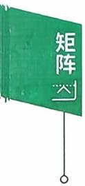

$$
\boldsymbol { A } ^ { 3 } = \boldsymbol { A } ^ { 2 } \boldsymbol { A } = \begin{bmatrix}
1 & 0 & 0 \\
0 & 0 & 0 \\
0 & 0 & 0
\end{bmatrix} \begin{bmatrix}
1 & 0 & 0 \\
0 & 0 & 1 \\
0 & 0 & 0
\end{bmatrix} = \begin{bmatrix}
1 & 0 & 0 \\
0 & 0 & 0 \\
0 & 0 & 0
\end{bmatrix} = \boldsymbol { A } ^ { 2 } .
$$

知 $A^{m} = A^{2}$ (当 $m \geqslant 2$ 时),故

$$
\begin{aligned}f(\boldsymbol{A}) &= A^{100} + \cdots + A^{\sharp} + \boldsymbol{A} + \boldsymbol{E} = 99A^{\sharp} + \boldsymbol{A} + \boldsymbol{E} \\&= \begin{bmatrix}
99 & 0 & 0 \\
0 & 0 & 0 \\
0 & 0 & 0
\end{bmatrix} + \begin{bmatrix}
1 & 0 & 0 \\
0 & 0 & 1 \\
0 & 0 & 0
\end{bmatrix} + \begin{bmatrix}
1 & 0 & 0 \\
0 & 1 & 0 \\
0 & 0 & 1
\end{bmatrix} = \begin{bmatrix}
101 & 0 & 0 \\
0 & 1 & 1 \\
0 & 0 & 1
\end{bmatrix},\end{aligned}
$$

$$
[ f ( \boldsymbol { A } ) ] ^ { - 1 } = \left[ \begin{aligned} 1 & 0 1 & 0 & 0 \\ 0 & 1 & 1 \\ 0 & 0 & 1 \end{aligned} \right] ^ { - 1 } = \left[ \begin{aligned} \frac { 1 } { 1 } & 0 & 0 \\ 0 & 1 & - 1 \\ 0 & 0 & 1 \end{aligned} \right] .
$$

例13 【证】 先证 Ax = b 有解.因为

$$
\boldsymbol{A}(\boldsymbol{A}^{-1} \boldsymbol{b}) = (\boldsymbol{A} \boldsymbol{A}^{-1}) \boldsymbol{b} = \boldsymbol{E} \boldsymbol{b} = \boldsymbol{b},
$$

所以 $A^{-1}b$ 是方程组的解，故方程组 $Ax = \boldsymbol{b}$ 有解.

再证唯一性.设α是 $Ax = \boldsymbol{b}$ 的任一个解，则 $A\boldsymbol{\alpha} = \boldsymbol{b}$ 那么

$$
\begin{aligned}A^{-1}(A\boldsymbol{\alpha}) &= A^{-1}\boldsymbol{b}, \\(A^{-1}A)\boldsymbol{\alpha} &= A^{-1}\boldsymbol{b},\end{aligned}
$$

$\Rightarrow \boldsymbol{\alpha} = \boldsymbol{A}^{-1} \boldsymbol{b}$ ,即 Ax = b 的解唯一.

【注】以三元一次方程组

$$
\begin{cases}a_{11}x_{1} + a_{12}x_{2} + a_{13}x_{3} = b_{1}, \\a_{21}x_{1} + a_{22}x_{2} + a_{23}x_{3} = b_{2}, \\a_{31}x_{1} + a_{32}x_{2} + a_{33}x_{3} = b_{3}\end{cases}
$$

为例，注意到：唯一解 $\boldsymbol{\alpha} = (x_{1}, x_{2}, x_{3})^{\mathrm{T}}$ ,即

$$
\boldsymbol{\alpha} = \boldsymbol{A}^{-1} \boldsymbol{b} = \frac{1}{\left| \boldsymbol{A} \right|} \boldsymbol{A}^{*} \boldsymbol{b} = \frac{1}{\left| \boldsymbol{A} \right|} \left[ \begin{matrix}
A_{11} & A_{21} & A_{31} \\
A_{12} & A_{22} & A_{32} \\
A_{13} & A_{23} & A_{33}
\end{matrix} \right] \left[ \begin{matrix}
b_{1} \\
b_{2} \\
b_{3}
\end{matrix} \right],
$$

$$
x_{1} = \frac{1}{\left| \boldsymbol{A} \right|}\left( b_{1}A_{11} + b_{2}A_{21} + b_{3}A_{31} \right) = \frac{1}{\left| \boldsymbol{A} \right|}\left| \begin{matrix}
b_{1} & a_{12} & a_{13} \\
b_{2} & a_{22} & a_{23} \\
b_{3} & a_{32} & a_{33}
\end{matrix} \right| .
$$

$x_{2} ,x_{3}$ 证明略.这就是克拉默法则的矩阵法证明.

## 三、初等变换、初等矩阵

例14【分析】由下标观察到矩阵A经过两次初等行变换可

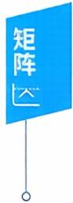

得到矩阵B，按初等矩阵的性质应该是左乘初等矩阵，排除(A)(B).

$\boldsymbol{P}_{1} \boldsymbol{P}_{2} \boldsymbol{A}$ 表示先把A的第一行加至第三行，然后再把第一、二两行互换，这正是矩阵B，所以应当选(C).

而 $P_{2}P_{1}A$ 表示先把A的第一、二两行互换，然后再把第一行加至第三行，那么这时的矩阵是

$$
\begin{aligned} &\begin{bmatrix}
a_{21} & a_{22} & a_{23} \\
a_{11} & a_{12} & a_{13} \\
a_{31} + a_{21} & a_{32} + a_{22} & a_{33} + a_{23}
\end{bmatrix}.\\ \end{aligned}
$$

例15【分析】由已知

$$
\boldsymbol{P}_{1} \boldsymbol{A} = \boldsymbol{B}, \boldsymbol{P}_{1} = \begin{bmatrix}
0 & 0 & 1 \\
0 & 1 & 0 \\
1 & 0 & 0
\end{bmatrix},
$$

$$
\boldsymbol { B } \boldsymbol { P } _ { 2 } = \boldsymbol { C } , \boldsymbol { P } _ { 2 } = \begin{bmatrix}
1 & 0 & 0 \\
0 & 1 & - 1 \\
0 & 0 & 1
\end{bmatrix},
$$

$$
\boldsymbol{P}_{1} \boldsymbol{A} \boldsymbol{P}_{2} = \boldsymbol{C},
$$

$$
\boldsymbol{A} = \boldsymbol{P}_{1}^{-1} \boldsymbol{C} \boldsymbol{P}_{2}^{-1} = \begin{bmatrix}
0 & 0 & 1 \\
0 & 1 & 0 \\
1 & 0 & 0
\end{bmatrix} \begin{bmatrix}
7 & 8 & 1 \\
4 & 5 & 1 \\
1 & 2 & 1
\end{bmatrix} \begin{bmatrix}
1 & 0 & 0 \\
0 & 1 & 1 \\
0 & 0 & 1
\end{bmatrix} = \begin{bmatrix}
1 & 2 & 3 \\
4 & 5 & 6 \\
7 & 8 & 9
\end{bmatrix}.
$$

例16【分析】A和B等价⇔A经初等变换得到矩阵B

⇔∃可逆矩阵P和Q使 $PAQ = B$

$$
\Leftrightarrow r(\boldsymbol{A}) = r(\boldsymbol{B}).
$$

明显 r(B) = 2.而

$$
\left| \begin{array} { l } \boldsymbol { A } \end{array} \right| = \left| \begin{matrix}
a & 1 & 1 \\
1 & a & 1 \\
1 & 1 & a
\end{matrix} \right| = ( a + 2 ) ( a - 1 ) ^ { 2 } ,
$$

当a = 1时， $r(\boldsymbol{A}) = 1$

当a=—2时，A中 $\begin{vmatrix}
- 2 & 1 \\
1 & - 2
\end{vmatrix} \neq 0$ ,而 $\left| \boldsymbol{A} \right| = 0$ ,从而 $r(\boldsymbol{A}) = 2$ ∴A和B等价 $\Leftrightarrow a = - 2$

## 四、分块矩阵

例17 【证】由B,C均可逆，有 $\begin{vmatrix}
\boldsymbol{B} & \boldsymbol{O} \\
\boldsymbol{O} & \boldsymbol{C}
\end{vmatrix} = | \boldsymbol{B} | \cdot | \boldsymbol{C} | \neq 0$ ,所以$\begin{bmatrix}
\boldsymbol{B} & \boldsymbol{O} \\
\boldsymbol{O} & \boldsymbol{C}
\end{bmatrix}$ 可逆.

设 $\left[ \begin{matrix}
{ \boldsymbol { B } } & { \boldsymbol { O } } \\
{ \boldsymbol { O } } & { \boldsymbol { C } }
\end{matrix} \right] ^ { - 1 } = \left[ \begin{matrix}
{ \boldsymbol { X } } & { \boldsymbol { Y } } \\
{ \boldsymbol { Z } } & { \boldsymbol { W } }
\end{matrix} \right]$ ,则

$$
\begin{aligned}\left[ \begin{matrix}
{ \boldsymbol { B } } & { \boldsymbol { O } } \\
{ } & { } \\
{ \boldsymbol { O } } & { \boldsymbol { C } }
\end{matrix} \right] \left[ \begin{matrix}
{ \boldsymbol { X } } & { \boldsymbol { Y } } \\
{ } & { } \\
{ \boldsymbol { Z } } & { \boldsymbol { W } }
\end{matrix} \right] = \left[ \begin{matrix}
{ \boldsymbol { E } } & { \boldsymbol { O } } \\
{ } & { } \\
{ \boldsymbol { O } } & { \boldsymbol { E } }
\end{matrix} \right] ,\end{aligned}
$$

$\begin{cases}\boldsymbol{B}\boldsymbol{X} = \boldsymbol{E}, \\\boldsymbol{B}\boldsymbol{Y} = \boldsymbol{O}, \\\boldsymbol{C}\boldsymbol{Z} = \boldsymbol{O}, \\\boldsymbol{C}\boldsymbol{W} = \boldsymbol{E},\end{cases}$ (1) (2)   
即 (3) (4)

由(1)有 $X = \boldsymbol{B}^{-1}$

由(2)，因B可逆，有 $\boldsymbol{Y} = \boldsymbol{B}^{-1} \boldsymbol{O} = \boldsymbol{O}$

类似地 $Z = O, W = C^{-1}$ .所以 $\left[ \begin{matrix}
{ \pmb { B } } & { \pmb { O } } \\
{ \pmb { O } } & { \pmb { C } }
\end{matrix} \right] ^ { - 1 } = \left[ \begin{matrix}
{ \pmb { B } ^ { - 1 } } & { \pmb { O } } \\
{ \pmb { O } } & { \pmb { C } ^ { - 1 } }
\end{matrix} \right]$

例如

$$
\begin{bmatrix}
5 & 2 & 0 & 0 \\
2 & 1 & 0 & 0 \\
0 & 0 & 1 & - 2 \\
0 & 0 & 1 & 1
\end{bmatrix}^{- 1} = \begin{bmatrix}
1 & - 2 & 0 & 0 \\
- 2 & 5 & 0 & 0 \\
0 & 0 & \frac{1}{3} & \frac{2}{3} \\
0 & 0 & - \frac{1}{3} & \frac{1}{3}
\end{bmatrix}.
$$

因为

$$
\begin{bmatrix}
5 & 2 \\
2 & 1
\end{bmatrix}^{-1} = \begin{bmatrix}
1 & - 2 \\
- 2 & 5
\end{bmatrix}, \quad \begin{bmatrix}
1 & - 2 \\
1 & 1
\end{bmatrix}^{-1} = \frac{1}{3} \begin{bmatrix}
1 & 2 \\
- 1 & 1
\end{bmatrix}.
$$

例18【分析】把A,B各分成4个 $2 \times 2$ 的小矩阵，即

$$
\boldsymbol{A} = \begin{bmatrix}
1 & 0 \vdots & 0 & 1 \\
0 & 1 \vdots & 1 & 0 \\
\cdots \cdots & \vdots & \cdots \cdots \cdots \cdots &  \\
0 & 1 \vdots & - 1 & 0 \\
1 & 0 \vdots & 0 & - 1
\end{bmatrix} = \begin{bmatrix}
\boldsymbol{E} & \boldsymbol{C} \\
\boldsymbol{C} & - \boldsymbol{E}
\end{bmatrix}, \boldsymbol{B} = \begin{bmatrix}
0 & 0 \vdots & 0 & 1 \\
0 & 0 \vdots & 1 & 0 \\
\cdots \cdots \cdots \cdots \cdots \cdots &  &  &  \\
0 & 1 \vdots & 0 & 0 \\
1 & 0 \vdots & 0 & 0
\end{bmatrix} = \begin{bmatrix}
\boldsymbol{O} & \boldsymbol{C} \\
\boldsymbol{C} & \boldsymbol{O}
\end{bmatrix}.
$$

由于 $\boldsymbol{C}^{\mathfrak{e}} = \begin{bmatrix}
0 & 1 \\
1 & 0
\end{bmatrix} \begin{bmatrix}
0 & 1 \\
1 & 0
\end{bmatrix} = \boldsymbol{E}$ ,就有

$$
\boldsymbol { X } = { \begin{bmatrix}
{ \boldsymbol { E } } & { \boldsymbol { C } } \\
{ \boldsymbol { C } } & { - \boldsymbol { E } }
\end{bmatrix} } { \begin{bmatrix}
{ \boldsymbol { O } } & { \boldsymbol { C } } \\
{ \boldsymbol { C } } & { \boldsymbol { O } }
\end{bmatrix} } { \begin{bmatrix}
{ \boldsymbol { E } } & { \boldsymbol { C } } \\
{ \boldsymbol { C } } & { - \boldsymbol { E } }
\end{bmatrix} } = { \begin{bmatrix}
{ \boldsymbol { E } } & { \boldsymbol { C } } \\
{ - \boldsymbol { C } } & { \boldsymbol { E } }
\end{bmatrix} } { \begin{bmatrix}
{ \boldsymbol { E } } & { \boldsymbol { C } } \\
{ \boldsymbol { C } } & { - \boldsymbol { E } }
\end{bmatrix} } = { \begin{bmatrix}
{ 2 \boldsymbol { E } } & { \boldsymbol { O } } \\
{ \boldsymbol { O } } & { - 2 \boldsymbol { E } }
\end{bmatrix} } ,
$$

$$
 即  \; \boldsymbol{X} = \begin{bmatrix}
2 & 0 & 0 & 0 \\
0 & 2 & 0 & 0 \\
0 & 0 & - 2 & 0 \\
0 & 0 & 0 & - 2
\end{bmatrix}.
$$

例19【分析】

$$
\begin{aligned}(1) \begin{bmatrix}
\boldsymbol{E} & \boldsymbol{E} \\
\boldsymbol{O} & \boldsymbol{E}
\end{bmatrix} \begin{bmatrix}
\boldsymbol{A} & \boldsymbol{B} \\
\boldsymbol{B} & \boldsymbol{A}
\end{bmatrix} \begin{bmatrix}
\boldsymbol{E} & -\boldsymbol{E} \\
\boldsymbol{O} & \boldsymbol{E}
\end{bmatrix} &= \begin{bmatrix}
\boldsymbol{A} + \boldsymbol{B} & \boldsymbol{A} + \boldsymbol{B} \\
\boldsymbol{B} & \boldsymbol{A}
\end{bmatrix} \begin{bmatrix}
\boldsymbol{E} & -\boldsymbol{E} \\
\boldsymbol{O} & \boldsymbol{E}
\end{bmatrix} \\&= \begin{bmatrix}
\boldsymbol{A} + \boldsymbol{B} & \boldsymbol{O} \\
\boldsymbol{B} & \boldsymbol{A} - \boldsymbol{B}
\end{bmatrix},\end{aligned}
$$

$$
\left( 2 \right) \begin{vmatrix}
\boldsymbol{A} & \boldsymbol{B} \\
\boldsymbol{B} & \boldsymbol{A}
\end{vmatrix} = \begin{vmatrix}
\boldsymbol{A} + \boldsymbol{B} & \boldsymbol{O} \\
\boldsymbol{B} & \boldsymbol{A} - \boldsymbol{B}
\end{vmatrix} = \left| \begin{array}{c} \boldsymbol{A} + \boldsymbol{B} \end{array} \right| \cdot \left| \begin{array}{c} \boldsymbol{A} - \boldsymbol{B} \end{array} \right| .
$$

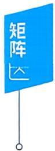

## 五、方阵的行列式

例20 【分析】 | 2A\*B−1 | = 2″ | A\*B−¹ |= 2″ |A\* || B−1 | 22π-1 = 2″ | A |n−1 | B |−1 =— 3

本题用到的公式依次是

$$
\left| k \boldsymbol { A } \right| = k ^ { n } \left| \boldsymbol { A } \right| , \left| \boldsymbol { A } \boldsymbol { B } \right| = \left| \boldsymbol { A } \right| \left| \boldsymbol { B } \right| ,
$$

$$
\left| \boldsymbol{A}^{*} \right| = \left| \boldsymbol{A} \right|^{n - 1}, \left| \boldsymbol{A}^{- 1} \right| = \frac{1}{\left| \boldsymbol{A} \right|}.
$$

例21 【分析】因 $\boldsymbol{A}^{*} = \left| \boldsymbol{A} \right| \boldsymbol{A}^{-1} = -\frac{2}{3} \boldsymbol{A}^{-1}$ ,又 $\left| \boldsymbol{A}^{-1} \right| = \frac{1}{\left| \boldsymbol{A} \right|}$ $= - \frac{3}{2}$ ,则有

$$
\begin{aligned}\left| 3\boldsymbol{A}^{*} + 4\boldsymbol{A}^{-1} \right| &= \left| -2\boldsymbol{A}^{-1} + 4\boldsymbol{A}^{-1} \right| = \left| 2\boldsymbol{A}^{-1} \right| \\&= 2^{4} \left| \boldsymbol{A}^{-1} \right| = -3 \times 2^{3} = -24.\end{aligned}
$$

例22【分析】因 $\left( \boldsymbol{A} - \boldsymbol{E} \right)^{-1} = \boldsymbol{A}^2 + \boldsymbol{A} + \boldsymbol{E}$ ,有

$$
( \boldsymbol { A } - \boldsymbol { E } ) ( \boldsymbol { A } ^ { 2 } + \boldsymbol { A } + \boldsymbol { E } ) = \boldsymbol { E } ,
$$

得

$$
\boldsymbol{A}^{3} = 2\boldsymbol{E}.
$$

那么

$$
\left| \boldsymbol{A}^{3} \right| = \left| 2\boldsymbol{E} \right| ,
$$

于是

$$
\left| \boldsymbol{A} \right|^{3} = 2^{3} \left| \boldsymbol{E} \right| = 8,
$$

所以 $| \textbf{A} | = 2$

【注】 $\left| k \boldsymbol{A} \right| = k^n \left| \boldsymbol{A} \right|$ 不要记错.

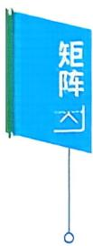

## 例23【分析】由行列式性质，知 $\left| \textbf{\em B} \right| = - \left| \textbf{\em A} \right|$

由 $| \textbf{A} \textbf{B} | = | \textbf{A} | \cdot | \textbf{B} |  和  | \textbf{A}^* | = | \textbf{A} |^{\textit{n}-1}$ 立即有

$$
| \boldsymbol{B} \boldsymbol{A}^{\star} | = | \boldsymbol{B} | \cdot | \boldsymbol{A}^{\star} | = - | \boldsymbol{A} | \cdot | \boldsymbol{A} |^{2} = - 27.
$$

或，因 $\begin{bmatrix}
0 & 1 & 0 \\
1 & 0 & 0 \\
0 & 0 & 1
\end{bmatrix} \boldsymbol{A} = \boldsymbol{B}$ ,有

$$
\boldsymbol { B } \boldsymbol { A } ^ { \star } = \begin{bmatrix}
0 & 1 & 0 \\
1 & 0 & 0 \\
0 & 0 & 1
\end{bmatrix} \boldsymbol { A } \boldsymbol { A } ^ { \star } = \left| \boldsymbol { A } \right| \begin{bmatrix}
0 & 1 & 0 \\
1 & 0 & 0 \\
0 & 0 & 1
\end{bmatrix} = 3 \begin{bmatrix}
0 & 1 & 0 \\
1 & 0 & 0 \\
0 & 0 & 1
\end{bmatrix},
$$

所以

$$
\left| \begin{array} { l } { \pmb { B } \pmb { A } ^ { \star } } \end{array} \right| = 3 ^ { 3 } \left| \begin{matrix}
{ 0 } & { 1 } & { 0 } \\
{ 1 } & { 0 } & { 0 } \\
{ 0 } & { 0 } & { 1 }
\end{matrix} \right| = -27.
$$

## 本章作业超链接《基础过关66D题》优选

<table><tr><td>数学一</td><td>365</td><td>368</td><td>370</td><td>373</td><td>375</td><td>379</td><td>380</td><td>383</td><td>425</td><td>426</td><td>432</td></tr><tr><td></td><td>435</td><td>436</td><td>438</td><td>441</td><td>446</td><td>447</td><td>449</td><td></td><td></td><td></td><td></td></tr><tr><td>数学二</td><td>465</td><td>468</td><td>470</td><td>473</td><td>475</td><td>479</td><td>480</td><td>483</td><td>550</td><td>551</td><td>557</td></tr><tr><td>数学三</td><td>560</td><td>561</td><td>563</td><td>566</td><td>571</td><td>572</td><td>574</td><td></td><td></td><td></td><td></td></tr><tr><td></td><td>365</td><td>368</td><td>370</td><td>373</td><td>375</td><td>379</td><td>380</td><td>383</td><td>425</td><td>426</td><td>432</td></tr><tr><td></td><td>435</td><td>436</td><td>438</td><td>441</td><td>446</td><td>447</td><td>449</td><td></td><td></td><td></td><td></td></tr></table>

