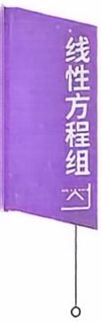
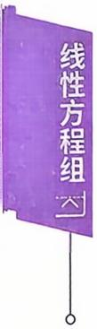

## 第四章 线性方程组

## 本章考点

线性方程组有解和无解的判定非齐次线性方程组的解与相应的齐次线性方程组(导出组）的解之间的关系线性方程组解的性质和解的结构齐次线性方程组的基础解系和通解非齐次线性方程组的通解

## 本章知识框图

## 知识梳理与例题

## 一、基本概念

我们称

$$
\begin{aligned}\left\{ \begin{aligned}a_{11}x_{1} + a_{12}x_{2} + \cdots + a_{1n}x_{n} = b_{1}, \\a_{21}x_{1} + a_{22}x_{2} + \cdots + a_{2n}x_{n} = b_{2}, \\\cdots \\a_{m1}x_{1} + a_{m2}x_{2} + \cdots + a_{mn}x_{n} = b_{m}\end{aligned} \right.\end{aligned}\tag{I}
$$

是n个未知数m个方程的非齐次线性方程组，其中 $x_{1},x_{2},\cdots,x_{n}$ 代表$n$ 个未知数，而 $b_{1},b_{2},\cdots,b_{m}$ 是不全为0的常数.

利用矩阵乘法，方程组（Ⅰ）可表示为：

$$
\begin{bmatrix}
a_{11} & a_{12} & \cdots & a_{1n} \\
a_{21} & a_{22} & \cdots & a_{2n} \\
\vdots & \vdots &  & \vdots \\
a_{m1} & a_{m2} & \cdots & a_{mn}
\end{bmatrix} \begin{bmatrix}
x_1 \\
x_2 \\
\vdots \\
x_n
\end{bmatrix} = \begin{bmatrix}
b_1 \\
b_2 \\
\vdots \\
b_m
\end{bmatrix}.
$$

于是方程组（Ⅰ）的矩阵形式为：

$$
Ax = b,
$$

称A为方程组（I）的系数矩阵.

对矩阵A按列分块，记 $\boldsymbol{A} = ( \boldsymbol{\alpha}_{1} , \boldsymbol{\alpha}_{2} , \cdots , \boldsymbol{\alpha}_{n} )$ ，则方程组（Ⅰ）有向量形式

$$
x_{1}\boldsymbol{\alpha}_{1} + x_{2}\boldsymbol{\alpha}_{2} + \cdots + x_{n}\boldsymbol{\alpha}_{n} = \boldsymbol{\beta},
$$

其中 $\boldsymbol{\alpha}_{j}=(a_{1j},a_{2j},\cdots,a_{nj})^{\mathrm{T}},j=1,2,\cdots,n,\boldsymbol{\beta}=(b_{1},b_{2},\cdots,b_{m})^{\mathrm{T}}.$

如果 $\forall j = 1,2,\cdots,m$ 恒有 $b_{j} = 0$ ,则称

$$
\left\{ \begin{aligned} a_{11}x_{1} + a_{12}x_{2} + \cdots + a_{1n}x_{n} = 0, \\ a_{21}x_{1} + a_{22}x_{2} + \cdots + a_{2n}x_{n} = 0, \\ \cdots \\ a_{m1}x_{1} + a_{m2}x_{2} + \cdots + a_{mn}x_{n} = 0. \end{aligned} \right.\tag{Ⅱ}
$$

为齐次线性方程组(也称(Ⅱ）是(Ⅰ）的导出组).其矩阵形式为：

$$
Ax = 0.
$$

而齐次方程组（Ⅱ）的向量形式，则是

$$
x_{1}\boldsymbol{\alpha}_{1} + x_{2}\boldsymbol{\alpha}_{2} + \cdots + x_{n}\boldsymbol{\alpha}_{n} = \boldsymbol{0}.
$$

若用一组数 $c_{1},c_{2},\cdots,c_{n}$ 分别代替方程组(Ⅰ)(或(Ⅱ))中的 $x_{1}$ $x_{2},\cdots,x_{n}$ ，使(Ⅰ)(或(Ⅱ)）中m个等式都成立，则称 $(c_1, c_2, \cdots, c_n)^{\mathrm{T}}$ 是方程组(Ⅰ)(或(Ⅱ))的一个解.

解方程组就是要求出方程组的所有解.

求方程组的解就是要对所给方程组进行同解变形，同解变形的方法为：

（1）两个方程互换位置.

(2)用非零常数乘方程的两端.

(3)把某个方程的k倍加到另一个方程上.

同解变形所对应的矩阵语言就是矩阵的初等行变换。

## 二、齐次线性方程组

对于齐次线性方程组

$$
\left\{ \begin{aligned} a_{11}x_{1} + a_{12}x_{2} + \cdots + a_{1n}x_{n} &= 0, \\ a_{21}x_{1} + a_{22}x_{2} + \cdots + a_{2n}x_{n} &= 0, \\ \cdots \\ a_{m1}x_{1} + a_{m2}x_{2} + \cdots + a_{mn}x_{n} &= 0, \end{aligned} \right.\tag{Ⅱ}
$$

易见 $x_{1} = 0, x_{2} = 0, \cdots, x_{n} = 0$ 必满足每一个方程.故 $(0,0,\cdots,0)^{\mathrm{T}}$ 定是齐次线性方程组的一个解，称其为零解.除去零解之外，如果齐次方程组还有其他的解，那些解就称为非零解.

基础解系如果 $\eta_{1}, \eta_{2}, \cdots, \eta_{t}$ 是齐次方程组 $Ax = \mathbf{0}$ 的解，而且满足

(1) $\eta_{1}, \eta_{2}, \cdots, \eta_{t}$ 线性无关.

(2) $Ax = \mathbf{0}$ 的任一个解η都可由 $\eta_{1}, \eta_{2}, \cdots, \eta_{t}$ 线性表出.则称 $\eta_{1}, \eta_{2}, \cdots, \eta_{t}$ 是 $Ax = \mathbf{0}$ 的一个基础解系.

解的性质如果 $\eta_{1}, \eta_{2}, \cdots, \eta_{l}$ 是齐次方程组 $Ax = \mathbf{0}$ 的解，则对任意常数 $k_{1},k_{2},\cdots,k_{t}$ ，

$$
k_{1} \boldsymbol{\eta}_{1} + k_{2} \boldsymbol{\eta}_{2} + \cdots + k_{t} \boldsymbol{\eta}_{t}
$$

仍是该齐次方程组的解.

定理 4.1 齐次方程组 $A_{m \times n}x = 0$ 有非零解 $\Leftrightarrow r(A) < n.$

推论1. 当 $m < n$ 时 $Ax = 0$ 必有非零解.

2.当 $m = n$ 时 $Ax = 0$ 有非零解 $\Leftrightarrow \left| \textbf{A} \right| = 0$

定理4.2 如齐次线性方程组(Ⅱ)的系数矩阵的秩 $r(A)=r<n,$ 则(IⅡI)有 $n - r$ 个线性无关的解，且(Ⅱ)的任一个解都可由这 $n - r$ 个线性无关的解线性表出(即(Ⅱ)的基础解系由n一r个解向量构成).

定理4.3 若 $\eta_{1}, \eta_{2}, \cdots, \eta_{t}$ 是齐次方程组（Ⅱ）的基础解系，则(Ⅱ)的通解是 $k_{1} \boldsymbol{\eta}_{1} + k_{2} \boldsymbol{\eta}_{2} + \cdots + k_{t} \boldsymbol{\eta}_{t}, k_{1}, k_{2}, \cdots, k_{t}$ 是任意常数.

求齐次方程组

$$
\begin{cases}5x_{1} + 7x_{2} + 2x_{3} = 0, \\3x_{1} + 5x_{2} + 6x_{3} - 4x_{4} = 0, \\4x_{1} + 5x_{2} - 2x_{3} + 3x_{4} = 0\end{cases}
$$

的基础解系和通解.

练习区域

答案见 96 页

例2 求齐次方程组

$$
\left\{ \begin{aligned} 2 x _ { 1 } - x _ { 2 } - 7 x _ { 3 } + 5 x _ { 4 } & = 0 , \\ x _ { 1 } - 2 x _ { 2 } - 5 x _ { 3 } - 2 x _ { 4 } & = 0 , \\ x _ { 1 } + x _ { 2 } - 2 x _ { 3 } - 2 x _ { 4 } & = 0 \end{aligned} \right.
$$

的通解.

答案见 96 页

例3 (1997,数一)设 $\boldsymbol{A} = \begin{bmatrix}
1 & 2 & - 2 \\
4 & t & 3 \\
3 & - 1 & 1
\end{bmatrix}$ ,B为三阶非零矩阵，且 $AB = O$ 则t=

答案见 97 页

例 4要使 $\boldsymbol { \alpha } _ { 1 } = ( 1 , 0 , 2 ) ^ { \mathrm { T } } , \boldsymbol { \alpha } _ { 2 } = ( 0 , 1 , - 1 ) ^ { \mathrm { T } }$ 都是齐次线性方程组Ax = 0的解，则A可以为(A) $\begin{bmatrix}
- 2 & 1 & 1 \\
4 & - 2 & - 2
\end{bmatrix}$ (B) $\begin{bmatrix}
2 & 0 & 1 \\
0 & 1 & 1
\end{bmatrix}$ (C) $\begin{bmatrix}
- 2 & 0 & 1 \\
4 & 0 & - 2
\end{bmatrix}$ (D) $\begin{bmatrix}
- 1 & 0 & 2 \\
0 & 1 & - 1
\end{bmatrix}$

例5 (2025，数农）若方程组 $\begin{cases}x_{1} + x_{2} + x_{3} = 0 \\x_{1} + ax_{2} - 3x_{3} = 0 \\x_{1} + a^{2}x_{2} + 9x_{3} = 0\end{cases}$ 有非零解，则a =(A)-3或1. (B)—1或3.(C)-3或-1. (D)-1或1.

例6 已知A是5×4矩阵，η1，η2是Ax= 0的基础解系，则$A^{\mathrm{T}} y = \mathbf{0}$ 的基础解系(A) 不存在. (B)有一个非零解.(C) 有2 个线性无关的解. (D)有3个线性无关的解.

练习区域  
答案见 98 页

例7 (2019，数二、数三)设A是四阶矩阵 $,A^{*}$ 为A的伴随矩阵，若线性方程组 $Ax = \mathbf{0}$ 的基础解系只有2个向量，则 $r(A^{*}) =$ (A)0. (B)1. (C)2. (D)3.

## 三、非齐次线性方程组

解的性质（1）设 $\xi_{1},\xi_{2}$ 是方程组 Ax = b 的两个解，则 $\xi_{1} - \xi_{2}$ 是导出组 $Ax = \mathbf{0}$ 的解.

(2) 设ξ是方程组 $Ax = b$ 的解，η是导出组 $Ax = \mathbf{0}$ 的解，k是任 意常数,则 $\xi + k\eta$ 是方程组 $Ax = \boldsymbol{b}$ 的解.

定理 4.4 Ax = b 有解 $\Leftrightarrow r(A)=r(\overline{A})$

⇔b 可由 A 的列向量线性表出.

$$
Ax = b  无解  \Leftrightarrow r(A) + 1 = r(\overline{A}).
$$

【注】 $\overline{A} = \left[ A, b \right]$ 称为方程组 Ax = b 的增广矩阵.

定理 4.5 (解的结构)设 α是Ax = b 的解， $\eta_{1}, \eta_{2}, \cdots, \eta_{t}$ 是导出组 $Ax = \mathbf{0}$ 的基础解系，则方程组Ax = b的通解为

$$
\boldsymbol { \alpha } + k _ { 1 } \boldsymbol { \eta } _ { 1 } + k _ { 2 } \boldsymbol { \eta } _ { 2 } + \cdots + k _ { t } \boldsymbol { \eta } _ { t } ,
$$

其中 $k_{1},k_{2},\cdots,k_{r}$ 是任意常数.

解方程组

$$
\begin{cases}x_{1} + x_{2} + x_{3} + x_{4} + x_{5} = 2, \\2x_{1} + 3x_{2} + x_{3} + x_{4} - 3x_{5} = 0, \\x_{1} + 2x_{3} + 3x_{4} + 3x_{5} = 4, \\4x_{1} + 5x_{2} + 3x_{3} + 2x_{4} + 2x_{5} = 6.\end{cases}
$$

练习区域

答案见 98 页

例9（1995，数四）对于线性方程组

$$
\left\{ \begin{aligned} \lambda x_{1} + x_{2} + x_{3} = \lambda - 3, \\ x_{1} + \lambda x_{2} + x_{3} = - 2, \\ x_{1} + x_{2} + \lambda x_{3} = - 2 \end{aligned} \right.
$$

讨论λ为何值时，方程组无解，有唯一解和有无穷解?在方程组有无穷解时，试用其导出组的基础解系表示全部解.

答案见 99 页

例10（1995，数一）设线性方程组

$$
\left\{ \begin{aligned} x_{1} + 3x_{2} + 2x_{3} + x_{4} &= 1, \\ x_{2} + ax_{3} - ax_{4} &= - 1, \\ x_{1} + 2x_{2} \quad + 3x_{4} &= 3, \end{aligned} \right.
$$

问a为何值时方程组有解，并在有解时求出方程组的通解.

例11 (2025，数农)设A为三阶矩阵且 $r(A) = 2.$ 若非零向量 α,β满足 $A \alpha = 0 , A \beta = - \beta ,$ 则方程组 $Ax = \boldsymbol{\beta}$ 的通解为x=

答案见 100 页

例12设 $\boldsymbol{a}_{1}, \boldsymbol{a}_{2}, \boldsymbol{a}_{3}$ 是四元非齐次线性方程组Ax = b的 3 个解向量，且秩 $r(A)=3.\alpha_{1}=(1,2,3,4)^{\mathrm{T}},\alpha_{2}+\alpha_{3}=(0,1,2,3)^{\mathrm{T}}$ ,则方程组 Ax = b 的通解是

答案见 101 页

## 四、公共解、同解

请在复习好方程组如何求解等基础知识后，再参看《线性代数辅导讲义》的相关内容.

## 五、方程组的应用

例 13 求和矩阵 $\boldsymbol{A} = \begin{bmatrix}
1 & 2 \\
-1 & 3
\end{bmatrix}$ 可交换的所有矩阵.

例14 若 $\begin{bmatrix}
1 & 2 & 3 \\
2 & 3 & 4
\end{bmatrix} \boldsymbol{X} = \begin{bmatrix}
4 & 5 \\
5 & 6
\end{bmatrix}$ ,则 X =

例15 已知向量组 $\boldsymbol{\alpha}_{1}=(1,3,1,1)^{\mathrm{T}}, \boldsymbol{\alpha}_{2}=(-1,1,3,1)^{\mathrm{T}}, \boldsymbol{\alpha}_{3}$ $= ( 5 , 7 , a , 1 ) ^ { \mathrm { T } }$ 线性相关，则a =

答案见 102 页

例16 已知 $\boldsymbol{\alpha}_{1} = (2,3,3)^{\mathrm{T}}, \boldsymbol{\alpha}_{2} = (1,0,3)^{\mathrm{T}}, \boldsymbol{\alpha}_{3} = (3,5,a +$ $2)^{\mathrm{T}}$ ,若 $\boldsymbol{\beta}_{1} = (4, -3, 15)^{\mathrm{T}}$ 可由 $\boldsymbol{\alpha}_{1}, \boldsymbol{\alpha}_{2}, \boldsymbol{\alpha}_{3}$ 线性表示，但 $\boldsymbol{\beta}_{2} = (2, 5, a)^{\mathrm{T}}$ 不能由 $\alpha_{1}, \alpha_{2}, \alpha_{3}$ 线性表出，写出 $\beta _ { 1 }$ 由 $\alpha_{1}, \alpha_{2}, \alpha_{3}$ 线性表示的表达式.

例17 求一个齐次线性方程组，使它的基础解系为$\eta_{1} = (4,3,1,2)^{\mathrm{T}}, \eta_{2} = (0,1,3,-2)^{\mathrm{T}}.$

答案见 102 页

答案见 103 页  

## 二、齐次线性方程组

例1【解】对系数矩阵作初等行变换，有

$$
\begin{aligned}\boldsymbol{A} &=\begin{bmatrix}
5 & 7 & 2 & 0 \\
3 & 5 & 6 & -4 \\
4 & 5 & -2 & 3
\end{bmatrix}\xrightarrow{}\begin{bmatrix}
1 & 2 & 4 & -3 \\
3 & 5 & 6 & -4 \\
4 & 5 & -2 & 3
\end{bmatrix}\\&\xrightarrow{}\begin{bmatrix}
1 & 2 & 4 & -3 \\
0 & -1 & -6 & 5 \\
0 & -3 & -18 & 15
\end{bmatrix}\xrightarrow{}\begin{bmatrix}
1 & 2 & 4 & -3 \\
0 & 1 & 6 & -5 \\
0 & 0 & 0 & 0
\end{bmatrix}\\&\xrightarrow{}\begin{bmatrix}
1 & 0 & -8 & 7 \\
0 & 1 & 6 & -5 \\
0 & 0 & 0 & 0
\end{bmatrix},\end{aligned}
$$

得同解方程组：

$$
\left\{ \begin{aligned} x_{1} - 8x_{3} + 7x_{4} &= 0, \\ x_{2} + 6x_{3} - 5x_{4} &= 0, \end{aligned} \right. \quad  即  \quad \left\{ \begin{aligned} x_{1} &= 8x_{3} - 7x_{4}, \\ x_{2} &= - 6x_{3} + 5x_{4}, \end{aligned} \right.
$$

令x3 = 1,x4 = 0⇒xz =- 6,x1 = 8,

$$
x_{3}=0,x_{4}=1 \Rightarrow x_{2}=5,x_{1}=-7,
$$

故基础解系为 $\eta_{1} = (8, -6, 1, 0)^{\mathrm{T}}, \eta_{2} = (-7, 5, 0, 1)^{\mathrm{T}}.$

通解是： $k_{1} \boldsymbol{\eta}_{1} + k_{2} \boldsymbol{\eta}_{2}, k_{1}, k_{2}$ 是任意常数.

或者令 $x_{3} = t, x_{4} = u$ ,得通解：

$$
\begin{cases}x_{1} = 8t - 7u, \\x_{2} = -6t + 5u, \\x_{3} = t, \\x_{4} = u,\end{cases}
$$

亦即 $\boldsymbol{x} = t \begin{bmatrix}
8 \\
- 6 \\
1 \\
0
\end{bmatrix} + u \begin{bmatrix}
- 7 \\
5 \\
0 \\
1
\end{bmatrix}$ ，基础解系为： $\begin{bmatrix}
8 \\
-6 \\
1 \\
0
\end{bmatrix}, \begin{bmatrix}
-7 \\
5 \\
0 \\
1
\end{bmatrix};$

例2【解】对系数矩阵作初等行变换，有

$$
\boldsymbol{A} = \begin{bmatrix}
2 & -1 & -7 & 5 \\
1 & -2 & -5 & -2 \\
1 & 1 & -2 & -2
\end{bmatrix} \xrightarrow{} \begin{bmatrix}
1 & 1 & -2 & -2 \\
1 & -2 & -5 & -2 \\
2 & -1 & -7 & 5
\end{bmatrix}
$$

$$
\begin{aligned}&\rightarrow\begin{bmatrix}
1 & 1 & - 2 & - 2 \\
0 & - 3 & - 3 & 0 \\
0 & - 3 & - 3 & 9
\end{bmatrix}\rightarrow\begin{bmatrix}
1 & 1 & - 2 & - 2 \\
0 & 1 & 1 & 0 \\
0 & 0 & 0 & 1
\end{bmatrix}\\&\rightarrow\begin{bmatrix}
1 & 0 & - 3 & 0 \\
0 & 1 & 1 & 0 \\
0 & 0 & 0 & 1
\end{bmatrix},\end{aligned}
$$

得同解方程组 $\left\{ \begin{aligned} x_{1} - 3x_{3} &= 0, \\ x_{2} + x_{3} &= 0, \\ x_{4} &= 0, \end{aligned} \right.$ 即 $\begin{cases}x_{1} = 3x_{3}, \\x_{2} = -x_{3}, \\x_{4} = 0.\end{cases}$

$x_{3}=1 \Rightarrow x_{4}=0,x_{2}=-1,x_{1}=3.$

故基础解系为 $\boldsymbol{\eta} = (3, -1, 1, 0)^{\mathrm{T}}$

通解为：kη，k为任意常数.

或者，令 $x_{3} = t$ ,解出

$$
\begin{cases}x_{1} = 3t, \\x_{2} = -t, \\x_{3} = t, \\x_{4} = 0,\end{cases}
$$

亦即 $x = t(3, -1, 1, 0)^{\mathrm{T}}$

【注】在处理加减消元、求解等问题时，要重视基本计算.

对自由变量既可以用(1，0,0)，(0，1,0)，(0,0，1)来赋值，也可用$t , u , v$ 来赋值.

例3 【分析】由 AB = O,对 B 按列分块，

$$
A \boldsymbol { B } = A \left( \boldsymbol { \beta } _ { 1 } , \boldsymbol { \beta } _ { 2 } , \boldsymbol { \beta } _ { 3 } \right) = \left( A \boldsymbol { \beta } _ { 1 } , A \boldsymbol { \beta } _ { 2 } , A \boldsymbol { \beta } _ { 3 } \right) = \left( \boldsymbol { 0 } , \boldsymbol { 0 } , \boldsymbol { 0 } \right) ,
$$

即 $\boldsymbol{\beta}_{1}, \boldsymbol{\beta}_{2}, \boldsymbol{\beta}_{3}$ 都是齐次方程组 $Ax = \mathbf{0}$ 的解.

又 $\boldsymbol{B} \neq \boldsymbol{O}, \exists \boldsymbol{\beta}_{i} \neq \boldsymbol{0}$ ,那么 $Ax = \mathbf{0}$ 有非零解 $\beta _ { i }$ ,从而 $r(\boldsymbol{A}) < 3, \left| \boldsymbol{A} \right| = 0.$

$$
\left| \boldsymbol{A} \right| = \left| \begin{matrix}
1 & 2 & - 2 \\
4 & t & 3 \\
3 & - 1 & 1
\end{matrix} \right| = \left| \begin{matrix}
1 & 0 & - 2 \\
4 & t + 3 & 3 \\
3 & 0 & 1
\end{matrix} \right| = 7(t + 3) = 0.
$$

所以 $t = -3$

例4【分析】因为 $\boldsymbol{a}_{1}, \boldsymbol{a}_{2}$ 线性无关，所以 $Ax = \mathbf{0}$ 有2个线性无关的解，于是 $n - r(\boldsymbol{A}) \geqslant 2.$ 即知 $r(A) \leq 1$ ,可排除(B)(D).

下面应排查 $\boldsymbol{\alpha}_{1} , \boldsymbol{\alpha}_{2}$ 是不是 $Ax = \mathbf{0}$ 的解.由在(C)中

$$
A \boldsymbol { \alpha } _ { 2 } = \begin{bmatrix}
- 2 & 0 & 1 \\
4 & 0 & - 2
\end{bmatrix} \begin{bmatrix}
0 \\
1 \\
- 1
\end{bmatrix} = \begin{bmatrix}
- 1 \\
2
\end{bmatrix} \neq \boldsymbol { 0 }
$$

可知， $\pmb { \alpha } _ { 2 }$ 不是(C) 的解.故应选(A).

例5【分析】 $Ax = \mathbf{0}$ 有非零解 $\Leftrightarrow r(\boldsymbol{A}) < n \Leftrightarrow \left| \boldsymbol{A} \right| = 0.$

$$
\begin{aligned}\left| \boldsymbol{A} \right| &= \left| \begin{matrix}
1 & 1 & 1 \\
1 & a & - 3 \\
1 & a^{2} & 9
\end{matrix} \right| \\&= (a - 1)( - 3 - 1)( - 3 - a) \\&= 0  ,\end{aligned}
$$

所以应选(A).

例6 【分析】 齐次方程组Ax=0的基础解系由 $n - r(A)$ 个线性无关的解所构成.因A是5×4矩阵，于是

$$
4 - r(A) = 2,
$$

那么 $r(\boldsymbol{A}) = 2$ ,于是 $r(A^{\mathrm{T}}) = r(A) = 2.$

又 $A^{\mathrm{T}}$ 是 $4 \times 5$ 矩阵，从而 $A^{\mathrm{T}} y = \mathbf{0}$ 的基础解系由

$$
5 - r(A^{\mathrm{T}}) = 5 - 2 = 3
$$

个线性无关的解所构成，故应选(D).

例7【分析】注意本题两个主要考点： $(1)n - r(A),(2)r(A^{*})$ 由 $n - r(\boldsymbol{A}) = 4 - r(\boldsymbol{A}) = 2$ ,得 r(A) = 2.

n,r(A) = n, 又r(A\*) = 1,r(A) = n − 1, (0,r(A) < n − 1.

现 $r(A)=2<n-1=3$ ,所以 $r(\boldsymbol{A}^{*}) = 0$ ,应选(A).

## 三、非齐次线性方程组

例8【解】对增广矩阵作初等行变换，有

$$
\begin{aligned}\overline{\boldsymbol{A}} &=\begin{bmatrix}
1 & 1 & 1 & 1 & 1 & \vdots & 2 \\
2 & 3 & 1 & 1 & -3 & \vdots & 0 \\
1 & 0 & 2 & 3 & 3 & \vdots & 4 \\
4 & 5 & 3 & 2 & 2 & \vdots & 6
\end{bmatrix}\rightarrow\begin{bmatrix}
1 & 1 & 1 & 1 & 1 & \vdots & 2 \\
0 & 1 & -1 & -1 & -5 & \vdots & -4 \\
0 & 0 & 0 & 1 & -3 & \vdots & -2 \\
0 & 0 & 0 & 0 & 0 & \vdots & 0
\end{bmatrix}\end{aligned}
$$

$$
\rightarrow \begin{bmatrix}
1 & 1 & 1 & 0 & 4 & \vdots & 4 \\
0 & 1 & -1 & 0 & -8 & \vdots & -6 \\
0 & 0 & 0 & 1 & -3 & \vdots & -2 \\
0 & 0 & 0 & 0 & 0 & \vdots & 0
\end{bmatrix} \rightarrow \begin{bmatrix}
1 & 0 & 2 & 0 & 12 & \vdots & 10 \\
0 & 1 & -1 & 0 & -8 & \vdots & -6 \\
0 & 0 & 0 & 1 & -3 & \vdots & -2 \\
0 & 0 & 0 & 0 & 0 & \vdots & 0
\end{bmatrix},
$$

得同解方程组

$$
\begin{aligned}\left\{ \begin{aligned}x_{1} + 2x_{3} + 12x_{5} &= 10, \\x_{2} - x_{3} \quad - 8x_{5} &= - 6, \\x_{4} - 3x_{5} &= - 2.\end{aligned} \right.\end{aligned}\tag{*}
$$

令 $x_{3} = 0 , x_{5} = 0$ ,得方程组 $Ax = \boldsymbol{b}$ 的一个特解

$$
\boldsymbol{\alpha} = (10, -6, 0, -2, 0)^{\mathrm{T}},
$$

对应的齐次方程组为

$$
\left\{ \begin{aligned} x_{1} + 2x_{3} + 12x_{5} &= 0, \\ x_{2} - x_{3} &= 8x_{5} = 0, \\ x_{4} - 3x_{5} &= 0, \end{aligned} \right.
$$

得 $Ax = \mathbf{0}$ 的同解方程组

$$
\begin{cases}x_{1} = - 2x_{3} - 12x_{5}, \\x_{2} = \quad x_{3} + 8x_{5}, \\x_{4} = \quad 3x_{5},\end{cases}
$$

分别令 $x_{3} = 1 , x_{5} = 0$ 和 $x_{3} = 0 , x_{5} = 1$ ,得 $Ax = \mathbf{0}$ 的基础解系

$$
\boldsymbol { \eta } _ { 1 } = ( - 2 , 1 , 1 , 0 , 0 ) ^ { \mathrm { T } } , \boldsymbol { \eta } _ { 2 } = ( - 1 2 , 8 , 0 , 3 , 1 ) ^ { \mathrm { T } }.
$$

所以方程组的通解为：

$$
(10,-6,0,-2,0)^{\mathrm{T}} + k_{1}(-2,1,1,0,0)^{\mathrm{T}} + k_{2}(-12,8,0,3,1)^{\mathrm{T}}
$$

$k_{1},k_{2}$ 为任意常数.

或对同解方程组(\*)，令 $x_{3} = t, x_{5} = u$ ,解出

$$
\begin{cases}x_{1} = 10 - 2t - 12u, \\x_{2} = -6 + t + 8u, \\x_{3} = t, \\x_{4} = -2 + 3u, \\x_{5} = u.\end{cases}
$$

亦得通解 $x = ( 1 0 , - 6 , 0 , - 2 , 0 ) ^ { \mathrm { T } } + t ( - 2 , 1 , 1 , 0 , 0 ) ^ { \mathrm { T } } + u ( - 1 2 , 8 , 0 ,$ $3,1)^{\mathrm{T}},t,u$ 为任意常数.

例9【解】对增广矩阵作初等行变换，有

$$
\overline{\boldsymbol{A}} = \begin{bmatrix}
\lambda & 1 & 1 \vdots \lambda - 3 \\
1 & \lambda & 1 \vdots - 2 \\
1 & 1 & \lambda \vdots - 2
\end{bmatrix} \rightarrow \begin{bmatrix}
1 & 1 & \lambda \vdots - 2 \\
1 & \lambda & 1 \vdots - 2 \\
\lambda & 1 & 1 \vdots \lambda - 3
\end{bmatrix}
$$

$$
\rightarrow \begin{bmatrix}
1 & 1 & \lambda & \vdots & - 2 \\
0 & \lambda - 1 & 1 - \lambda & \vdots & 0 \\
0 & 0 & (\lambda + 2)(\lambda - 1) \vdots & 3(1 - \lambda) & 
\end{bmatrix}.
$$

当 $\lambda = - 2$ 时 $r(\boldsymbol{A}) = 2, r(\overline{\boldsymbol{A}}) = 3$ ,方程组无解.

当 $\lambda \ne 1$ 且 $\lambda \ne -2$ 时 $r(\boldsymbol{A}) = r(\overline{\boldsymbol{A}}) = 3$ ，方程组有唯一解.

当 $\lambda = 1$ 时 $r(\boldsymbol{A}) = r(\overline{\boldsymbol{A}}) = 1$ ,有无穷解.

同解方程组为 $x_{1} + x_{2} + x_{3} = - 2.$

特解 $\boldsymbol{\alpha} = (-2,0,0)^{\mathrm{T}}$ ,基础解系 $\boldsymbol { \eta } _ { 1 } = ( - 1 , 1 , 0 ) ^ { \mathrm { T } } , \boldsymbol { \eta } _ { 2 } = ( - 1 , 0 ,$ $1)^{\mathrm{T}}$ .从而方程组通解

$$
\boldsymbol { \alpha } + k _ { 1 } \boldsymbol { \eta } _ { 1 } + k _ { 2 } \boldsymbol { \eta } _ { 2 } , \forall k _ { 1 } , k _ { 2 } .
$$

$$
 或  \overline{\boldsymbol{A}} = \begin{bmatrix}
\lambda & 1 & 1 \vdots \lambda - 3 \\
1 & \lambda & 1 \vdots - 2 \\
1 & 1 & \lambda \vdots - 2
\end{bmatrix} \xrightarrow{} \begin{bmatrix}
\lambda & 1 & 1 \vdots \lambda - 3 \\
1 - \lambda & \lambda - 1 & 0 \vdots 1 - \lambda \\
1 - \lambda & 0 & \lambda - 1 \vdots 1 - \lambda
\end{bmatrix}.
$$

$$
\begin{aligned} 如    \lambda \neq 1   ,  \overline{A} & \xrightarrow{}\begin{bmatrix}
\lambda & 1 & 1 & \vdots & \lambda - 3 \\
1 & - 1 & 0 & \vdots & 1 \\
1 & 0 & - 1 & \vdots & 1
\end{bmatrix}\\& \xrightarrow{}\begin{bmatrix}
\lambda + 2 & 0 & 0 & \vdots & 1 - 1 \\
1 & - 1 & 0 & \vdots & 1 \\
1 & 0 & - 1 & \vdots & 1
\end{bmatrix}.\end{aligned}
$$

当 $\lambda = - 2$ ，方程组无解.

当 $\lambda \ne 1$ 且 $\lambda \ne - 2$ ，方程组有唯一解.

当 $\lambda = 1$ ,同前略.

例10【解】对增广矩阵作初等行变换，有

$$
\begin{aligned}\overline{\boldsymbol{A}} &=\begin{bmatrix}
1 & 3 & 2 & 1 & \vdots & 1 \\
0 & 1 & a & -a & \vdots & -1 \\
1 & 2 & 0 & 3 & \vdots & 3
\end{bmatrix}\xrightarrow{}\begin{bmatrix}
1 & 3 & 2 & 1 & \vdots & 1 \\
0 & 1 & a & -a & \vdots & -1 \\
0 & -1 & -2 & 2 & \vdots & 2
\end{bmatrix}\\&\xrightarrow{}\begin{bmatrix}
1 & 3 & 2 & 1 & \vdots & 1 \\
0 & 1 & 2 & -2 & \vdots & -2 \\
0 & 0 & a-2 & 2-a & \vdots & 1
\end{bmatrix},\end{aligned}
$$

当 $a = 2$ 时 $r(A)=2,r(\overline{A})=3$ ，方程组无解.

当 $a \ne 2$ 时， $r(\boldsymbol{A}) = r(\overline{\boldsymbol{A}}) = 3 < 4$ ，方程组有无穷多解，

$$
\overline{\boldsymbol{A}} \xrightarrow{}\begin{bmatrix}
1 & 3 & 2 & 1 & \vdots & 1 \\
0 & 1 & 2 & -2 & \vdots & -2 \\
0 & 0 & 1 & -1 & \vdots & 1 \\
0 & 0 & 1 & -1 & \vdots & \overline{a-2}
\end{bmatrix}\xrightarrow{}\begin{bmatrix}
1 & 3 & 0 & 3 & \vdots & \underline{a-4} \\
\vdots & \overline{a-2} &  &  &  &  \\
0 & 1 & 0 & 0 & \vdots & \underline{a-2a} \\
\vdots & \overline{a-2} &  &  &  &  \\
\vdots & \overline{a-2} &  &  &  & 
\end{bmatrix}
$$

$$
\xrightarrow { } \left[ \begin{matrix}
{ 1 } & { 0 } & { 0 } & { 3 } & { \vdots } \\
{ } & { } & { } & { \vdots } &  \\
{ } & { } & { } & { \vdots } &  \\
{ 0 } & { 1 } & { 0 } & { 0 } & { \vdots } \\
{ } & { } & { } & { } & { \vdots } \\
{ } & { } & { } & { } & { \vdots } \\
{ 0 } & { 0 } & { 1 } & { - 1 } & { \vdots } \\
{ } & { } & { } & { } & { \vdots }
\end{matrix} \right] ,
$$

所以方程组的通解为

$x = \left( \frac{7a - 10}{a - 2}, \frac{2 - 2a}{a - 2}, \frac{1}{a - 2}, 0 \right)^{\mathrm{T}} + k(-3, 0, 1, 1)^{\mathrm{T}}$ ,k为任意常数.

例11 【分析】本题考查方程组解的结构，用推理分析方法求方程组的特解及相应齐次方程组的基础解系.

由 $n - r(\boldsymbol{A}) = 3 - 2 = 1$ ,故 $Ax = \mathbf{0}$ 的非零解即是其基础解系.  
现 $\boldsymbol{\alpha} \neq \boldsymbol{0}, A \boldsymbol{\alpha} = \boldsymbol{0}$ ,故α是 $Ax = \mathbf{0}$ 的基础解系.

又Aβ=—β即 $A(-\boldsymbol{\beta}) = \boldsymbol{\beta}$ 于是一β是 $Ax = \boldsymbol{\beta}$ 的解，所以方程组 $Ax = \boldsymbol{\beta}$ 的通解 $x = - \boldsymbol{\beta} + k\boldsymbol{\alpha}, \forall k$ •

例12 【分析】由 $n - r(A) = 4 - 3 = 1$ ，所以方程组的通解形式为 $\alpha + k\eta$ ，现在特解已知可取 $\pmb{\alpha}_{1}$ ，下面就是应找出导出组 $Ax = \mathbf{0}$ 的一个非零解.

因为 $A\alpha_{i} = b(i = 1,2,3)$ ,所以有 $\boldsymbol{A} \left[ 2 \boldsymbol{\alpha}_{1} - ( \boldsymbol{\alpha}_{2} + \boldsymbol{\alpha}_{3} ) \right] = \boldsymbol{0}$ 即

$$
2\boldsymbol{\alpha}_{1}-(\boldsymbol{\alpha}_{2}+\boldsymbol{\alpha}_{3})=(2,3,4,5)^{\mathrm{T}}
$$

是 $Ax = \mathbf{0}$ 的一个非零解.于是方程组的通解为 $(1,2,3,4)^{\mathrm{T}} + k(2,3$ $4,5)^{\mathrm{T}}$ ,k 是任意常数.

## 五、方程组的应用

例13【解】设 $\boldsymbol{X} = \begin{bmatrix}
x_{1} & x_{2} \\
x_{3} & x_{4}
\end{bmatrix}$ 和矩阵A可交换，即 $AX = XA$

$$
\begin{bmatrix}
1 & 2 \\
-1 & 3
\end{bmatrix} \begin{bmatrix}
x_1 & x_2 \\
x_3 & x_4
\end{bmatrix} = \begin{bmatrix}
x_1 & x_2 \\
x_3 & x_4
\end{bmatrix} \begin{bmatrix}
1 & 2 \\
-1 & 3
\end{bmatrix},
$$

得

$$
\left\{ \begin{aligned} x_{2} + 2x_{3} &= 0, \\ 2x_{1} + 2x_{2} &- 2x_{4} = 0, \\ - x_{1} + 2x_{3} + x_{4} &= 0, \\ x_{2} + 2x_{3} &= 0, \end{aligned} \right.
$$

$$
\boldsymbol { B } = \begin{bmatrix}
0 & 1 & 2 & 0 \\
2 & 2 & 0 & - 2 \\
- 1 & 0 & 2 & 1 \\
0 & 1 & 2 & 0
\end{bmatrix} \xrightarrow { } \begin{bmatrix}
1 & 0 & - 2 & - 1 \\
0 & 1 & 2 & 0 \\
0 & 0 & 0 & 0 \\
0 & 0 & 0 & 0
\end{bmatrix},
$$

$4 - r(\boldsymbol{B}) = 2$ ,取 $x_{3} ,x_{4}$ 为自由变量.

区 $x_{3} = t, x_{4} = u,$ 得 $x_{1} = 2t + u, x_{2} = - 2t$ ,所以 $\boldsymbol{X} = \begin{bmatrix}
2t + u & - 2t \\
t & u
\end{bmatrix}$

t, u为任意常数.

例 14 【分析】设 $\boldsymbol{X} = \begin{bmatrix}
x_{1} & y_{1} \\
x_{2} & y_{2} \\
x_{3} & y_{3}
\end{bmatrix}$ ,则有

$$
\left\{ \begin{aligned} x_{1} + 2x_{2} + 3x_{3} = 4, \\ 2x_{1} + 3x_{2} + 4x_{3} = 5 \end{aligned} \right. \quad \left\{ \begin{aligned} y_{1} + 2y_{2} + 3y_{3} = 5, \\ 2y_{1} + 3y_{2} + 4y_{3} = 6. \end{aligned} \right.
$$

两个方程组的系数矩阵一样，故可

$$
\begin{aligned}\begin{bmatrix}
1 & 2 & 3 \vdots 4 & 5 \\
2 & 3 & 4 \vdots 5 & 6
\end{bmatrix}&\rightarrow\begin{bmatrix}
1 & 2 & 3 \vdots 4 & 5 \\
0 & -1 & -2 \vdots -3 & -4
\end{bmatrix}\\&\rightarrow\begin{bmatrix}
1 & 0 & -1 \vdots -2 & -3 \\
0 & 1 & 2 \vdots 3 & 4
\end{bmatrix},\end{aligned}
$$

解出

$$
\begin{bmatrix}
x_{1} \\
x_{2} \\
x_{3}
\end{bmatrix} = \begin{bmatrix}
- 2 \\
3 \\
0
\end{bmatrix} + k_{1} \begin{bmatrix}
1 \\
- 2 \\
1
\end{bmatrix} , \begin{bmatrix}
y_{1} \\
y_{2} \\
y_{3}
\end{bmatrix} = \begin{bmatrix}
- 3 \\
4 \\
0
\end{bmatrix} + k_{2} \begin{bmatrix}
1 \\
- 2 \\
1
\end{bmatrix},
$$

故

$\boldsymbol{X} = \begin{bmatrix}
- 2 + k_{1} & - 3 + k_{2} \\
3 - 2k_{1} & 4 - 2k_{2} \\
k_{1} & k_{2}
\end{bmatrix}, k_{1}, k_{2}$ 是任意常数.

例15【分析】 $\boldsymbol{\alpha}_{1}, \boldsymbol{\alpha}_{2}, \boldsymbol{\alpha}_{3}$ 线性相关 $\Leftrightarrow \left[ \boldsymbol{\alpha}_{1}, \boldsymbol{\alpha}_{2}, \boldsymbol{\alpha}_{3} \right] \begin{bmatrix}
x_{1} \\
x_{2} \\
x_{3}
\end{bmatrix} = \mathbf{0}$ 有非零解.

$$
\left[ \pmb { \alpha } _ { 1 }   ,   \pmb { \alpha } _ { 2 }   ,   \pmb { \alpha } _ { 3 } \right] = \begin{bmatrix}
1 & - 1 & 5 \\
3 & 1 & 7 \\
1 & 3 & a \\
1 & 1 & 1
\end{bmatrix} \xrightarrow { } \begin{bmatrix}
1 & - 1 & 5 \\
0 & 4 & - 8 \\
0 & 4 & a - 5 \\
0 & 2 & - 4
\end{bmatrix} \xrightarrow { } \begin{bmatrix}
1 & - 1 & 5 \\
0 & 1 & - 2 \\
0 & 0 & a + 3 \\
0 & 0 & 0
\end{bmatrix},
$$

得 $a = -3.$

例16【解】β可由 $\alpha_{1}, \alpha_{2}, \alpha_{3}$ 线性表示，即方程组 $x_{1} \boldsymbol{\alpha}_{1} +$ $x_{2}\boldsymbol{\alpha}_{2} + x_{3}\boldsymbol{\alpha}_{3} = \boldsymbol{\beta}_{1}$ 有解.

$\beta_{2}$ 不能由 $\alpha_{1}, \alpha_{2}, \alpha_{3}$ 线性表示，即方程组 $y_{1}\boldsymbol{\alpha}_{1} + y_{2}\boldsymbol{\alpha}_{2} + y_{3}\boldsymbol{\alpha}_{3} = \boldsymbol{\beta}_{2}$ 无解.

$$
\left[ \boldsymbol { \alpha } _ { 1 } , \boldsymbol { \alpha } _ { 2 } , \boldsymbol { \alpha } _ { 3 } \mid \boldsymbol { \beta } _ { 1 } , \boldsymbol { \beta } _ { 2 } \right] = \begin{bmatrix}
2 & 1 & 3 & \vdots & 4 & 2 \\
3 & 0 & 5 & \vdots & - 3 & 5 \\
3 & 3 & a + 2 & \vdots & 1 5 & a
\end{bmatrix}
$$

$$
\xrightarrow{}\begin{bmatrix}
-1 & 1 & -2 & \vdots & 7 & -3 \\
3 & 0 & 5 & \vdots & -3 & 5 \\
0 & 3 & a-3 & \vdots & 18 & a-5
\end{bmatrix}
$$

$$
\rightarrow \begin{bmatrix}
1 & - 1 & 2 & \vdots - 7 & 3 &  \\
0 & 3 & - 1 & \vdots & 18 & - 4 \\
0 & 0 & a - 2 & \vdots & 0 & a - 1
\end{bmatrix},
$$

∀a,方程组 $\left\{ \begin{aligned} x_{1} - x_{2} & \quad + 2x_{3} = - 7 \\ 3x_{2} & \quad - x_{3} = 18 , \\ (a - 2)x_{3} & = 0 \end{aligned} \right.$ 一定有解，即 $\beta_{1}$ 一定能

由 $\boldsymbol{\alpha}_{1}, \boldsymbol{\alpha}_{2}, \boldsymbol{\alpha}_{3}$ 线性表出.

当且仅当a=2时 $\left\{ \begin{aligned} y_{1} - y_{2} + 2y_{3} &= 3, \\ 3y_{2} - y_{3} &= - 4, \\ 0y_{3} &= 1 \end{aligned} \right.$ ，无解，即 $\beta_{2}$ 不能由 $\pmb { \alpha } _ { 1 }$ ，

$\because \alpha _ { 3 }$ 线性表示.

当a=2时，

$$
\begin{bmatrix}
1 & - 1 & 2 & \vdots & - 7 \\
0 & 3 & - 1 & \vdots & 18 \\
0 & 0 & 0 & \vdots & 0
\end{bmatrix} \rightarrow \begin{bmatrix}
1 & 5 & 0 & \vdots & 29 \\
0 & - 3 & 1 & \vdots & - 18 \\
0 & 0 & 0 & \vdots & 0
\end{bmatrix},
$$

得程组通解 $\boldsymbol{x} = (29, 0, -18)^{\mathrm{T}} + k (-5, 1, 3)^{\mathrm{T}}$ ,那么

$\boldsymbol { \beta } _ { 1 } = ( 2 9 - 5 k ) \boldsymbol { \alpha } _ { 1 } + k \boldsymbol { \alpha } _ { 2 } + ( - 1 8 + 3 k ) \boldsymbol { \alpha } _ { 3 } , k$ 为任意常数.

## 例17【解】设所求齐次方程组为Ax = 0.

由 $n - r(\boldsymbol{A}) = 2$ ,且 n = 4,知 r(A) = 2.

又 $A(\boldsymbol{\eta}_{1},\boldsymbol{\eta}_{2}) = \boldsymbol{O}$ ,转置得

$$
\left[ \begin{matrix}
{ \pmb { \eta } _ { ^ { \mathtt { T } } } ^ { \mathtt { T } } } \\
{ \pmb { \eta } _ { ^ { \mathtt { Z } } } ^ { \mathtt { T } } }
\end{matrix} \right] \pmb { A } ^ { \mathtt { T } } = \pmb { O } .
$$

考查齐次方程组 $\boldsymbol{B} \boldsymbol{x}=\left[\begin{aligned}\boldsymbol{\eta}_{1}^{\mathrm{T}} \\ \boldsymbol{\eta}_{2}^{\mathrm{T}}\end{aligned}\right] \boldsymbol{x}=\boldsymbol{0} .$

由 $n - r(\boldsymbol{B}) = 4 - 2 = 2$ 可知，Bx=0的基础解系是 $A^{\mathrm{T}}$ 的列向量.

$$
\boldsymbol { B } = \binom{\pmb { \eta } _ { 1 } ^ { \mathrm { T } }}{\pmb { \eta } _ { 2 } ^ { \mathrm { T } }} = \binom{4 \quad 3 \quad 1 \quad 2}{0 \quad 1 \quad 3 \quad - 2} \xrightarrow{} \binom{4 \quad 0 \quad - 8 \quad 8}{0 \quad 1 \quad 3 \quad - 2}
$$

$$
\rightarrow { \scriptsize \left[ \begin{aligned} { 1 \quad 0 \quad - 2 \quad 2 } \\ { 0 \quad 1 \quad 3 \quad - 2 } \end{aligned} \right] } .
$$

区 $x_{3} = 1 , x_{4} = 0$ ,解出 $x_{1} = 2, x_{2} = - 3$

区 $x_{3} = 0 , x_{4} = 1$ ,解出 $x_{1} = - 2, x_{2} = 2$

于是 Bx = 0 的基础解系为

$$
(2, -3, 1, 0)^{\mathrm{T}}, (-2, 2, 0, 1)^{\mathrm{T}}.
$$

故 $\boldsymbol{A} = \begin{bmatrix}
2 & - 3 & 1 & 0 \\
- 2 & 2 & 0 & 1
\end{bmatrix}.$

那么所求齐次方程组是

$$
2x_{1} - 3x_{2} + x_{3} = 0, \quad \frac{1}{2}x_{1} + 2x_{2} + x_{3} = 0.
$$

【注】所求方程组是不唯一的.

## 本章作业超链接

## 《基础过关660题》优选

<table><tr><td>数学一</td><td>398</td><td>399</td><td>400</td><td>402</td><td>403</td><td>404</td><td>478</td><td>480</td><td>483</td><td>486</td><td>488</td></tr><tr><td>数学二</td><td>509</td><td>510</td><td>511</td><td>513</td><td>514</td><td>515</td><td>617</td><td>619</td><td>622</td><td>625</td><td>627</td></tr><tr><td>数学三</td><td>398</td><td>399</td><td>400</td><td>402</td><td>403</td><td>404</td><td>478</td><td>480</td><td>483</td><td>486</td><td>488</td></tr></table>

