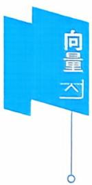
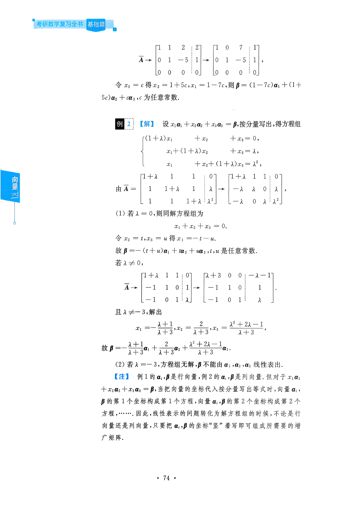
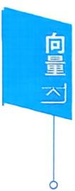
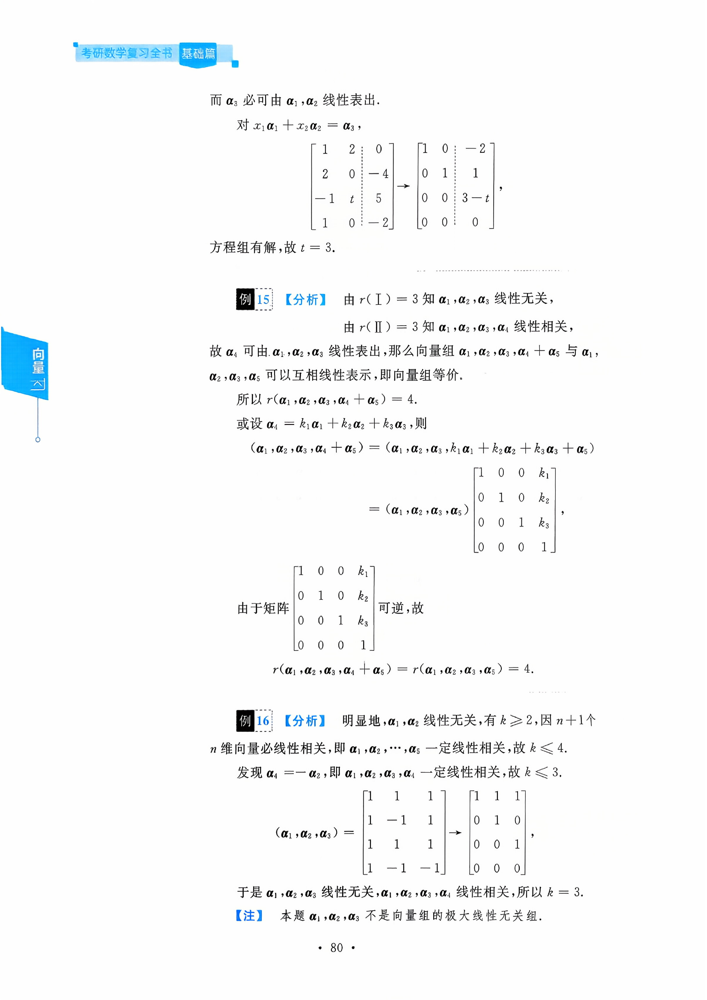

## 第三章 向量

## 本章考点

向量的概念向量的线性组合与线性表示向量组的线性相关与线性无关向量组的极大线性无关组等价向量组向量组的秩向量组的秩与矩阵的秩之间的关系向量的内积线性无关向量组正交规范化的施密特(Schmidt)方法

数學一還有向量空間的內容，這一考點的相关知识可參看《線性代数辅导讲义》相关内容.

## 本章知识框图

向量是初学线性代数时的一个难点，主要表现在对定义的理解、语言的表述、逻辑推理的合理性等方面.当然也是考研的重点.

## 知识梳理与例题

## 一、向量的概念、向量组的概念

定义n个数 $a_{1},a_{2},\cdots,a_{n}$ 所组成的有序数组

$$
\boldsymbol{\alpha} = (a_{1}, a_{2}, \cdots, a_{n})^{\mathrm{T}}  或  \boldsymbol{\alpha} = (a_{1}, a_{2}, \cdots, a_{n})
$$

叫做n维向量，其中 $a_{1}, a_{2}, \cdots, a_{n}$ 叫做向量α的分量(或坐标)，前一个表示式称为列向量，后者称为行向量.

相等 $\alpha = \beta \Leftrightarrow \alpha,\beta$ 同维，且对应分量 $a_{i}=b_{i},i=1,2,\cdots,n$

向量的基本运算

加法 $\boldsymbol{\alpha} + \boldsymbol{\beta} = (a_{1} + b_{1}, a_{2} + b_{2}, \cdots, a_{n} + b_{n})$

数乘 $k \boldsymbol{\alpha} = (k a_{1}, k a_{2}, \cdots, k a_{n})$

若干个同维数的行向量(或同维数的列向量）所组成的集合叫做 向量组.

$\alpha_{1}, \alpha_{2}, \cdots, \alpha_{r}$ 及 $\alpha_{1}, \alpha_{2}, \cdots, \alpha_{r}, \cdots, \alpha_{s}$ (其中 $s \geqslant r )$ ,称 $\alpha_{1}, \alpha_{2}, \cdots, \alpha_{r}$ 是 $\alpha_{1}, \alpha_{2}, \cdots, \alpha_{s}$ 的部分组， $\alpha_{1}, \alpha_{2}, \cdots, \alpha_{s}$ 是整体组.

向量组

$$
\boldsymbol { \alpha } _ { 1 } = \left[ a _ { 1 1 } , a _ { 2 1 } , \cdots , a _ { r 1 } \right] ^ { \mathrm { T } } , \boldsymbol { \alpha } _ { 2 } = \left[ a _ { 1 2 } , a _ { 2 2 } , \cdots , a _ { r 2 } \right] ^ { \mathrm { T } } , \cdots ,
$$

$$
\boldsymbol{a}_{m}=[a_{1m}, a_{2m}, \cdots, a_{m}]^{\mathrm{T}}
$$

及

$$
\tilde { \boldsymbol { \alpha } } _ { 1 } = [ a _ { 1 1 } , a _ { 2 1 } , \cdots , a _ { r 1 } , \cdots , a _ { r 1 } ] ^ { \mathrm { T } } , \tilde { \boldsymbol { \alpha } } _ { 2 } = [ a _ { 1 2 } , a _ { 2 2 } , \cdots , a _ { r 2 } , \cdots , a _ { r 2 } ] ^ { \mathrm { T } } ,
$$

$$
\cdots , \boldsymbol { \alpha } _ { m } = [ a _ { 1 m } , a _ { 2 m } , \cdots , a _ { m } , \cdots , a _ { m } ] ^ { \mathrm { T } } ,
$$

其中 $s \geqslant r ,$ 则称 $\widetilde{\boldsymbol{\alpha}}_{1}, \widetilde{\boldsymbol{\alpha}}_{2}, \cdots, \widetilde{\boldsymbol{\alpha}}_{m}$ 为向量组 $\alpha_{1}, \alpha_{2}, \cdots, \alpha_{m}$ 的延伸组(或称$\alpha_{1}, \alpha_{2}, \cdots, \alpha_{m}$ 是 $\tilde{\alpha}_{1}, \tilde{\alpha}_{2}, \cdots, \tilde{\alpha}_{m}$ 的缩短组).

## 二、线性表出、线性相关

定义m个n维向量 $\alpha_{1}, \alpha_{2}, \cdots, \alpha_{m}$ 及m个数 $k_{1},k_{2},\cdots,k_{m}$ ,则向量

$$
k_{1} \boldsymbol{\alpha}_{1} + k_{2} \boldsymbol{\alpha}_{2} + \cdots + k_{m} \boldsymbol{\alpha}_{m}
$$

称为向量 $\alpha_{1}, \alpha_{2}, \cdots, \alpha_{m}$ 的一个线性组合 $k_{1},k_{2},\cdots,k_{m}$ 称为这个线性组合的系数.

若 $\pmb { \beta }$ 能表示成 $\alpha_{1}, \alpha_{2}, \cdots, \alpha_{m}$ 的线性组合，即

$$
\boldsymbol { \beta } = k _ { 1 } \boldsymbol { \alpha } _ { 1 } + k _ { 2 } \boldsymbol { \alpha } _ { 2 } + \cdots + k _ { m } \boldsymbol { \alpha } _ { m }   ,
$$

则称 $\beta$ 能由 $\alpha_{1}, \alpha_{2}, \cdots, \alpha_{m}$ 线性表出.

定义对m个n维向量 $\alpha_{1}, \alpha_{2}, \cdots, \alpha_{m}$ ，若存在不全为零的数 $k_{1}$ $k_{2},\cdots,k_{m}$ ,使得

$$
k_{1} \boldsymbol{\alpha}_{1} + k_{2} \boldsymbol{\alpha}_{2} + \cdots + k_{m} \boldsymbol{\alpha}_{m} = \boldsymbol{0}
$$

成立，则称向量组 $\alpha_{1}, \alpha_{2}, \cdots, \alpha_{m}$ 线性相关，否则称它们线性无关.

显然含有零向量，或相等向量或成比例向量的向量组是线性相 关的；单个向量时，零向量是线性相关的.

m 个n维向量 $\alpha_{1}, \alpha_{2}, \cdots, \alpha_{m}$ 线性无关，下面几种表述等价：

对任意不全为零的数 $k_{1},k_{2},\cdots,k_{m}$ ,均有

$$
k_{1}\boldsymbol{\alpha}_{1} + k_{2}\boldsymbol{\alpha}_{2} + \cdots + k_{m}\boldsymbol{\alpha}_{m} \neq \boldsymbol{0}.
$$

当且 $\underset{\bullet}{ 仅 }$ 当 $k_{1} = k_{2} = \cdots = k_{m} = 0$ 时才有

$$
k_{1} \boldsymbol{\alpha}_{1} + k_{2} \boldsymbol{\alpha}_{2} + \cdots + k_{m} \boldsymbol{\alpha}_{m} = \boldsymbol{0}
$$

成立.

不存在不全为零的数 $k_{1},k_{2},\cdots,k_{m}$ ,使得

$$
k_{1} \boldsymbol{\alpha}_{1} + k_{2} \boldsymbol{\alpha}_{2} + \cdots + k_{m} \boldsymbol{\alpha}_{m} = \boldsymbol{0}
$$

成立.

向量组 $\boldsymbol{\varepsilon}_{1}=(1,0,\cdots,0),\boldsymbol{\varepsilon}_{2}=(0,1,0,\cdots,0),\cdots,\boldsymbol{\varepsilon}_{n}=(0,0,\cdots$ 0,1）是线性无关的，单个向量是非零向量时，是线性无关的；两个向量不成比例时，是线性无关的.

定理3.1 向量 $\beta$ 可由 $\alpha_{1}, \alpha_{2}, \cdots, \alpha_{m}$ 线性表出

⇔∃实数 $k_{1},k_{2},\cdots,k_{m}$ 使 $k_{1}\boldsymbol{\alpha}_{1} + k_{2}\boldsymbol{\alpha}_{2} + \cdots + k_{m}\boldsymbol{\alpha}_{m} = \boldsymbol{\beta}$

⇔方程组 $\left[ \boldsymbol{\alpha}_{1}, \boldsymbol{\alpha}_{2}, \cdots, \boldsymbol{\alpha}_{m} \right] \begin{bmatrix} x_{1} \\ x_{2} \\ \vdots \\ x_{m} \end{bmatrix} = \boldsymbol{\beta}$ 有解

⇔秩 $r(\boldsymbol{\alpha}_{1},\boldsymbol{\alpha}_{2},\cdots,\boldsymbol{\alpha}_{m}) = r(\boldsymbol{\alpha}_{1},\boldsymbol{\alpha}_{2},\cdots,\boldsymbol{\alpha}_{m},\boldsymbol{\beta})$

定理3.2 向量组 $\boldsymbol{\alpha}_{1}, \boldsymbol{\alpha}_{2}, \cdots, \boldsymbol{\alpha}_{m}(\boldsymbol{\alpha}_{j} = (a_{1j}, a_{2j}, \cdots, a_{nj})^{\mathrm{T}}, j = 1$ $2,\cdots,m)$ 线性相关⇔以 $\pmb { \alpha } _ { j }$ 为列向量的齐次线性方程组

$$
x_{1}\boldsymbol{\alpha}_{1} + x_{2}\boldsymbol{\alpha}_{2} + \cdots + x_{m}\boldsymbol{\alpha}_{m} = \boldsymbol{0},
$$

即

$$
\left\{ \begin{aligned} a_{11}x_{1} + a_{12}x_{2} + \cdots + a_{1m}x_{m} &= 0, \\ a_{21}x_{1} + a_{22}x_{2} + \cdots + a_{2m}x_{m} &= 0, \\ \cdots\cdots \\ a_{n1}x_{1} + a_{n2}x_{2} + \cdots + a_{nm}x_{m} &= 0 \end{aligned} \right.
$$

有非零解.

推论1 n个n维向量 $\alpha_{1}, \alpha_{2}, \cdots, \alpha_{n}$ 线性相关⇔行列式 $\mid \boldsymbol{a}_{1} , \boldsymbol{a}_{2}$ $\cdots, \boldsymbol{\alpha}_{n} \mid = 0$

推论2 任何n+1个n维向量必线性相关.

定理3.3 任何部分组 $\alpha_{1}, \alpha_{2}, \cdots, \alpha_{r}$ 相关⇒整体组 $\alpha_{1}, \alpha_{2}, \cdots, \alpha_{r}$ $\cdots, \boldsymbol{\alpha}_{s}$ 相关.整体组 $\alpha_{1}, \alpha_{2}, \cdots, \alpha_{r}, \cdots, \alpha_{s}$ 无关⇒任何部分组 $\alpha_{1}, \alpha_{2}, \cdots$ $\boldsymbol{\alpha}_{r}$ 无关，反之都不成立.

[..a, $\alpha_{1}, \alpha_{2}, \cdots, \alpha_{r}$ $\alpha_{1}, \alpha_{2}, \cdots, \alpha_{s}$ 及 $\alpha_{1}, \alpha_{2}, \cdots, \alpha_{r}, \cdots, \alpha_{s}$ 的部分组， $\alpha_{1}, \alpha_{2}, \cdots, \alpha_{s}$ (其中 是整体组. $s \geqslant r )$ ，称 $\boldsymbol{a}_{1}, \boldsymbol{a}_{2}, \boldsymbol{\gamma}$ ’」

定理3.4 $\alpha_{1}, \alpha_{2}, \cdots, \alpha_{m}$ 线性无关⇒延伸组 $\tilde{\alpha}_{1}, \tilde{\alpha}_{2}, \cdots, \tilde{\alpha}_{m}$ 线性无关；

$\tilde{\boldsymbol{\alpha}}_{1}, \tilde{\boldsymbol{\alpha}}_{2}, \cdots, \tilde{\boldsymbol{\alpha}}_{m}$ 线性相关⇒缩短组 $\alpha_{1}, \alpha_{2}, \cdots, \alpha_{m}$ 线性相关，反之均 不成立.

向量组 $\boldsymbol { \alpha } _ { 1 } = \left[ a _ { 1 1 } , a _ { 2 1 } , \cdots , a _ { r 1 } \right] ^ { \mathrm { T } } , \boldsymbol { \alpha } _ { 2 } = \left[ a _ { 1 2 } , a _ { 2 2 } , \cdots , a _ { r 2 } \right] ^ { \mathrm { T } } , \cdots , \boldsymbol { \alpha } _ { m }$ $\left[ a_{1m}, a_{2m}, \cdots, a_{m} \right]$ 及 $\widetilde { \boldsymbol { \alpha } } _ { 1 } = [ a _ { 1 1 } , a _ { 2 1 } , \cdots , a _ { r 1 } , \cdots , a _ { s 1 } ] ^ { \mathrm { T } } , \widetilde { \boldsymbol { \alpha } } _ { 2 } = [ a _ { 1 2 } ,$ $\left[ a _ { 2 2 } , \cdots , a _ { r 2 } , \cdots , a _ { r 2 } \right] ^ { \mathrm { T } } , \cdots , \boldsymbol { \alpha } _ { m } = \left[ a _ { 1 m } , a _ { 2 m } , \cdots , a _ { m } , \cdots , a _ { m } \right] ^ { \mathrm { T } }$ ，其中s$\geqslant r   ,$ 则称 $\alpha_{1}, \alpha_{2}, \cdots, \alpha_{m}$ 为向量组 $\alpha_{1}, \alpha_{2}, \cdots, \alpha_{m}$ 的延伸组(或称 $\pmb { \alpha } _ { 1 }$ $\left[ \alpha_{2} , \cdots , \alpha_{m} \right.$ 是 $\tilde{\boldsymbol{\alpha}}_{1}, \tilde{\boldsymbol{\alpha}}_{2}, \cdots, \tilde{\boldsymbol{\alpha}}_{m}$ 的缩短组).

定理3.5 向量组 $\alpha_{1}, \alpha_{2}, \cdots, \alpha_{s} (s \geqslant 2)$ 线性相关 $\Leftrightarrow$ 至少有一个向量 $\pmb { \alpha } _ { i }$ 可以由其余向量线性表出.

定理3.6若向量组 $\alpha_{1}, \alpha_{2}, \cdots, \alpha_{s}$ 线性无关，而向量组 $\alpha_{1}, \alpha_{2}, \cdots$ $\alpha_{s}, \beta$ 线性相关，则 $\beta$ 可由 $\alpha_{1}, \alpha_{2}, \cdots, \alpha_{s}$ 线性表出，且表出法唯一.

定理3.7 设有两个向量组 $\left( \mathrm { I } \right) \alpha _ { 1 } , \alpha _ { 2 } , \cdots , \alpha _ { s } ; \left( \mathrm { I I } \right) \beta _ { 1 } , \beta _ { 2 } , \cdots , \beta _ { t }$

(1) 若 $\boldsymbol{\beta}_{i}(i = 1,2,\cdots,t)$ 均可由（Ⅰ）线性表出，且 $t > s$ ，则 $( \Pi ) \beta _ { 1 } , \beta _ { 2 } , \cdots , \beta _ { t }$ 线性相关.

(2)若 $\beta_{i}(i = 1,2,\cdots,t)$ 均可由（Ⅰ)线性表出，且 $\beta_{1}, \beta_{2}, \cdots, \beta_{t}$ 线 性无关，则 $t \leqslant s$

例1设 $\alpha_{1} = (1,2,3), \alpha_{2} = (1,3,4), \alpha_{3} = (2, - 1,1), \beta =$ (2,5,t),问t取何值时，

(1) 行向量 $\pmb { \beta }$ 不能由 $\alpha_{1}, \alpha_{2}, \alpha_{3}$ 线性表出.

(2) 行向量 $\pmb { \beta }$ 能由 $\boldsymbol{\alpha}_{1}, \boldsymbol{\alpha}_{2}, \boldsymbol{\alpha}_{3}$ 线性表出，并写出此表达式.

答案见 73 页

例2设 $\boldsymbol{\alpha}_{1}=(1+\lambda,1,1)^{\mathrm{T}},\boldsymbol{\alpha}_{2}=(1,1+\lambda,1)^{\mathrm{T}},\boldsymbol{\alpha}_{3}=(1,1$ $1 + \lambda ) ^ { \mathrm { T } } , \boldsymbol { \beta } = ( 0 , \lambda , \lambda ^ { 2 } ) ^ { \mathrm { T } }$ .问当λ取什么值时：

(1)β可由 $\alpha_{1}, \alpha_{2}, \alpha_{3}$ 线性表示，并写出该表示式.

(2)β不能由 $\alpha_{1}, \alpha_{2}, \alpha_{3}$ 线性表示.

  
答案见74页

例3已知 $\alpha , \beta _ { 1 } , \beta _ { 2 } , \beta _ { 3 } , \gamma _ { 1 } , \gamma _ { 2 }$ 都是n维向量，试证：如果α可由$\boldsymbol{\beta}_{1}, \boldsymbol{\beta}_{2}, \boldsymbol{\beta}_{3}$ 线性表出： $\boldsymbol{\beta}_{1}, \boldsymbol{\beta}_{2}, \boldsymbol{\beta}_{3}$ 可由 $\gamma_{1}, \gamma_{2}$ 线性表出，则α可由 $\gamma_{1}, \gamma_{2}$ 线性表出.

答案见 75 页

## 例4 判断向量组

$$
\alpha_{1} = (1,2, - 1,4), \alpha_{2} = (0, - 1, - 5,3), \alpha_{3} = (2,5,3,5)
$$

的线性相关性.

答案见 75 页

例5 判断向量组的线性相关性

$$
(1) \boldsymbol{\alpha}_{1} = (3,4,2)^{\mathrm{T}}, \boldsymbol{\alpha}_{2} = (2,1,-7)^{\mathrm{T}}, \boldsymbol{\alpha}_{3} = (1,2,4)^{\mathrm{T}}.
$$

$$
(2) \boldsymbol{\alpha}_{1} = (1,2)^{\mathrm{T}}, \boldsymbol{\alpha}_{2} = (3,4)^{\mathrm{T}}, \boldsymbol{\alpha}_{3} = (5,6)^{\mathrm{T}}.
$$

答案见 75 页

## 例6 判断向量组的线性相关性

(1) $\boldsymbol{\alpha}_{1}=(1,3,-2),\boldsymbol{\alpha}_{2}=(0,2,5),\boldsymbol{\alpha}_{3}=(2,6,-4),$

(2 $\alpha_{1} = (1,1,1), \alpha_{2} = (0,0,0), \alpha_{3} = (1,3,5).$

(3) $\boldsymbol{\alpha}_{1}=(1,1,1,a),\boldsymbol{\alpha}_{2}=(0,1,1,b),\boldsymbol{\alpha}_{3}=(0,0,1,c).$

(4) $\alpha_{1} = (1,1,1,1), \alpha_{2} = (1,0,0,1), \alpha_{3} = (1,0,1,0), \alpha_{4} = (0,$ 1,0,0).

答案见 76 页

例7（1）已知向量组 $\boldsymbol{\alpha}_{1}=(1,3,2)^{\mathrm{T}}, \boldsymbol{\alpha}_{2}=(-1,1,2)^{\mathrm{T}}, \boldsymbol{\alpha}_{3}=$ $(0,a,3)^{\mathrm{T}}$ 线性相关，求a.

练习区域

（2）判断向量组 $\boldsymbol{\alpha}_{1}=(1,0,2,3)^{\mathrm{T}}, \boldsymbol{\alpha}_{2}=(1,1,3,5)^{\mathrm{T}}, \boldsymbol{\alpha}_{3}=(1$ $-1,a,1)^{\mathrm{T}}$ 的线性相关性.

$$
A = \left( \boldsymbol { \alpha } _ { 1 } , \boldsymbol { \alpha } _ { 2 } , \cdots , \boldsymbol { \alpha } _ { n } \right) , B = \left( \boldsymbol { \beta } _ { 1 } , \boldsymbol { \beta } _ { 2 } , \cdots , \boldsymbol { \beta } _ { n } \right) , A B = \left( \gamma _ { 1 } \right.
$$

$\gamma_{2}, \cdots, \gamma_{n}$ 均是n阶矩阵，记向量组

$$
\left( \mathrm { I } \right) \alpha _ { 1 } , \alpha _ { 2 } , \cdots , \alpha _ { n } , \left( \mathrm { I I } \right) \beta _ { 1 } , \beta _ { 2 } , \cdots , \beta _ { n } , \left( \mathrm { I I I } \right) \gamma _ { 1 } , \gamma _ { 2 } , \cdots , \gamma _ { n } ,
$$

若（Ⅲ）线性相关，则

(A)(I)(Ⅱ)均线性相关.

(B)（Ⅰ）或(Ⅱ）至少有一个线性相关.

(C)(I）必线性相关.

(D)（Ⅱ）必线性相关.

答案见 77 页

例9 (1997,数三)向量组 $\boldsymbol{\alpha}_{1}, \boldsymbol{\alpha}_{2}, \boldsymbol{\alpha}_{3}$ 线性无关，则下列向量组中线性无关的是

$$
\begin{aligned}( \mathrm{A} ) \boldsymbol{\alpha}_{1} + \boldsymbol{\alpha}_{2} , \boldsymbol{\alpha}_{2} + \boldsymbol{\alpha}_{3} , \boldsymbol{\alpha}_{3} - \boldsymbol{\alpha}_{1} .\end{aligned}
$$

$$
\begin{aligned}( \mathrm { B } ) \boldsymbol { \alpha } _ { 1 } + \boldsymbol { \alpha } _ { 2 } , \boldsymbol { \alpha } _ { 2 } + \boldsymbol { \alpha } _ { 3 } , \boldsymbol { \alpha } _ { 1 } + 2 \boldsymbol { \alpha } _ { 2 } + \boldsymbol { \alpha } _ { 3 } .\end{aligned}
$$

$$
\begin{aligned}( \mathrm { C } ) \boldsymbol { \alpha } _ { 1 } + 2 \boldsymbol { \alpha } _ { 2 } , 2 \boldsymbol { \alpha } _ { 2 } + 3 \boldsymbol { \alpha } _ { 3 } , 3 \boldsymbol { \alpha } _ { 3 } + \boldsymbol { \alpha } _ { 1 } .\end{aligned}
$$

$$
\begin{aligned}(  D  ) \boldsymbol{\alpha}_{1} + \boldsymbol{\alpha}_{2} + \boldsymbol{\alpha}_{3} , 2\boldsymbol{\alpha}_{1} - 3\boldsymbol{\alpha}_{2} + 22\boldsymbol{\alpha}_{3} , 3\boldsymbol{\alpha}_{1} + 5\boldsymbol{\alpha}_{2} - 5\boldsymbol{\alpha}_{3} .\end{aligned}
$$

答案见 77 页

例 10 证明定理：如果 n维向量 $\alpha_{1}, \alpha_{2}, \cdots, \alpha_{s}$ 线性无关， $, \boldsymbol{\alpha}_{1} , \boldsymbol{\alpha}_{2}$ $\cdots, \boldsymbol{\alpha}_{s}, \boldsymbol{\beta}$ 线性相关，则向量β可由 $\alpha_{1}, \alpha_{2}, \cdots, \alpha_{s}$ 线性表出且表示法唯

例11 证明定理：向量组 $\alpha_{1}, \alpha_{2}, \cdots, \alpha, (s \geqslant 2)$ 线性相关的充分必要条件是至少有一个向量 $\pmb { \alpha } _ { i }$ 可由其余的向量 $\alpha_{1}, \cdots, \alpha_{i-1}, \alpha_{i+1}, \cdots$ $\boldsymbol{\alpha}_{s}$ 线性表出.

答案见77 页

答案见 78 页

例12 证明定理：设 $\alpha_{1}, \alpha_{2}, \cdots, \alpha_{s}$ 是m维向量 $\beta_{1}, \beta_{2}, \cdots, \beta_{r}$ 是 n维向量.令 $\gamma_{1} = \left[ \begin{matrix} \boldsymbol{\alpha}_{1} \\ \boldsymbol{\beta}_{1} \end{matrix} \right], \gamma_{2} = \left[ \begin{matrix} \boldsymbol{\alpha}_{2} \\ \boldsymbol{\beta}_{2} \end{matrix} \right], \cdots, \gamma_{s} = \left[ \begin{matrix} \boldsymbol{\alpha}_{s} \\ \boldsymbol{\beta}_{s} \end{matrix} \right]$ ,那么

(1) 若 $\alpha_{1}, \alpha_{2}, \cdots, \alpha_{s}$ 线性无关，则 $\gamma_{1}, \gamma_{2}, \cdots, \gamma_{s}$ 必线性无关.

(2) 若 $\gamma_{1}, \gamma_{2}, \cdots, \gamma_{s}$ 线性相关，则 $\alpha_{1}, \alpha_{2}, \cdots, \alpha_{s}$ 必线性相关.

练习区域  
答案见 78 页

## 三、向量组的秩、矩阵的秩

## 1. 向量组的秩

定义向量组 $\boldsymbol{\alpha}_{i_1}, \boldsymbol{\alpha}_{i_2}, \cdots, \boldsymbol{\alpha}_{i_r} (1 \leqslant i_r \leqslant s)$ 是向量组 $\alpha_{1}, \alpha_{2}, \cdots, \alpha_{s}$ 的部分组，满足条件

(1) $\alpha_{i_1}, \alpha_{i_2}, \cdots, \alpha_{i_r}$ 线性无关.

(2) $\alpha_{i_1}, \alpha_{i_2}, \cdots, \alpha_{i_r}$ 中加入任一向量 $\boldsymbol{a}_{i}(1 \leqslant i \leqslant s)$ 后向量 组 $\alpha_{i_1}, \alpha_{i_2}, \cdots, \alpha_{i_r}, \alpha_{i_r}$ 线性相关，则称向量组 $\alpha_{i_1}, \alpha_{i_2}, \cdots, \alpha_{i_r}$ 是向量组 $\alpha_{1}, \alpha_{2}, \cdots, \alpha_{s}$ 的极大线性无关组.

条件(2)的等价说法是：向量组中任一向量 $\alpha_{i}(1 \leqslant i \leqslant s)$ 均可由 $\alpha_{i_1}, \alpha_{i_2}, \cdots, \alpha_{i_r}$ 线性表出.

向量组的极大无关组一般不唯一，但极大无关组的向量个数是一样的.只有一个零向量组成的向量组没有极大线性无关组，一个线性无关向量组的极大线性无关组就是该向量组本身.

向量组的极大线性无关组的向量个数称为向量组的秩，记为$r(\boldsymbol{\alpha}_{1},\boldsymbol{\alpha}_{2},\cdots,\boldsymbol{\alpha}_{s})$

定义设向量组

$$
\left( \mathrm { I } \right) \boldsymbol { \alpha } _ { 1 } , \boldsymbol { \alpha } _ { 2 } , \cdots , \boldsymbol { \alpha } _ { s } . \quad \left( \mathrm { I I } \right) \boldsymbol { \beta } _ { 1 } , \boldsymbol { \beta } _ { 2 } , \cdots , \boldsymbol { \beta } _ { t } .
$$

若（I）中的每个向量 $\boldsymbol{\alpha}_{i}(i = 1,2,\cdots,s)$ 均可由（Ⅱ）线性表出，则称（Ⅰ）可由（Ⅱ）线性表出.若向量组（Ⅰ）（Ⅱ）可以相互表出，则称向量组（Ⅰ)（Ⅱ）是等价向量组，记成 $( I ) \cong ( II )$

向量组和它的极大线性无关组是等价向量组.

一个向量组中各极大无关组之间是等价向量组，且向量个数相同.

定理3.8如果向量组（I）可由向量组（Ⅱ）线性表出，则r（I)$\leqslant r(\Pi)$

推论如果向量组（I）和（Ⅱ）等价，则r(I）=r(Ⅱ).

例13 向量组 $\boldsymbol{\alpha}_{1}=(1,-1,2,4)^{\mathrm{T}}, \boldsymbol{\alpha}_{2}=(0,3,1,2)^{\mathrm{T}}, \boldsymbol{\alpha}_{3}=(3$ $\begin{aligned}0,7,14)^{\mathrm{T}},\boldsymbol{\alpha}_{4} &= (1, - 2,2,0)^{\mathrm{T}},\boldsymbol{\alpha}_{5} = (2, - 1,5,2)^{\mathrm{T}}\end{aligned}$ 的极大线性无关组是

练习区域

  
答案见 79 页

例14 (1997数二)已知向量组 $\boldsymbol{\alpha}_{1} = (1,2, - 1,1), \boldsymbol{\alpha}_{2} = (2,0$ $\begin{aligned}(0,0),\alpha_{3} = (0, - 4,5, - 2)\end{aligned}$ 的秩为2，则t =

例15 向量组 $\left( \mathrm { I } \right) \boldsymbol { \alpha } _ { 1 } , \boldsymbol { \alpha } _ { 2 } , \boldsymbol { \alpha } _ { 3 } ; \left( \mathrm { I I } \right) \boldsymbol { \alpha } _ { 1 } , \boldsymbol { \alpha } _ { 2 } , \boldsymbol { \alpha } _ { 3 } , \boldsymbol { \alpha } _ { 4 }$ ；(Ⅲ) $\boldsymbol{\alpha}_{1}, \boldsymbol{\alpha}_{2}$ $\boldsymbol{\alpha}_{3} , \boldsymbol{\alpha}_{5}$ .若秩 $r(\mathrm{I}) = r(\mathrm{II}) = 3, r(\mathrm{II}) = 4$ .则 $r \left( \boldsymbol{\alpha}_{1} , \boldsymbol{\alpha}_{2} , \boldsymbol{\alpha}_{3} , \boldsymbol{\alpha}_{4} + \boldsymbol{\alpha}_{5} \right)$

答案见 80 页

练习区域  
答案见80 页

例16设 $\boldsymbol{\alpha}_{1}=(1,1,1,1)^{\mathrm{T}}, \boldsymbol{\alpha}_{2}=(1,-1,1,-1)^{\mathrm{T}}, \boldsymbol{\alpha}_{3}=(1$ $\begin{aligned}1,1,-1)^{\mathrm{T}},\boldsymbol{\alpha}_{4}=(-1,1,-1,1)^{\mathrm{T}},\boldsymbol{\alpha}_{5}=(1,-1,-1,-1)^{\mathrm{T}}\end{aligned}$ ,如 $\pmb{\alpha}_{1}$ $\alpha_{2},\cdots,\alpha_{k}$ 线性无关且 $\alpha_{1}, \alpha_{2}, \cdots, \alpha_{k}, \alpha_{k + 1}$ 线性相关，则k=

## 2. 矩阵的秩

定义在 $m \times n$ 矩阵A中，任取k行与k列 $(k \leqslant m, k \leqslant n)$ ,位于这些行与列的交叉点上的k²个元素按其在原来矩阵A中的次序可构成一个k阶行列式，称其为矩阵A的一个k阶子式.

定义(矩阵的秩)设A是 $m \times n$ 矩阵，若A中存在r阶子式不等于零，高于r阶的子式均等于零，则称矩阵A的秩为r，记成r(A)，零矩阵的秩规定为0.

$r(\boldsymbol{A}) = r \Leftrightarrow$ 矩阵A 中非零子式的最高阶数是r.

$r(\boldsymbol{A}) < r \Leftrightarrow \boldsymbol{A}$ 中每一个r阶子式全为0.

$r(\boldsymbol{A}) \geqslant r \Leftrightarrow \boldsymbol{A}$ 中有r阶子式不为0.

特别地， $r(\boldsymbol{A}) = 0 \Leftrightarrow \boldsymbol{A} = \boldsymbol{O}$ 9

$$
\boldsymbol{A} \neq \boldsymbol{O} \Leftrightarrow r(\boldsymbol{A}) \geqslant 1.
$$

若A 是 n阶矩阵 $r(\boldsymbol{A}) = n \Leftrightarrow |\boldsymbol{A}| \neq 0 \Leftrightarrow \boldsymbol{A}$ 可逆.

$r(\boldsymbol{A}) < n \Leftrightarrow |\boldsymbol{A}| = 0 \Leftrightarrow \boldsymbol{A}$ 不可逆.

若A是 $m \times n$ 矩阵，则 $r(A) \leqslant \min(m,n)$

定理3.9经初等变换，矩阵的秩不变.

矩阵秩的公式

$$
r(\boldsymbol{A}) = r(\boldsymbol{A}^{\mathrm{T}}) ; r(\boldsymbol{A}^{\mathrm{T}} \boldsymbol{A}) = r(\boldsymbol{A}).
$$

当 $k \neq 0$ 时 $r(k\boldsymbol{A}) = r(\boldsymbol{A}) ; r(\boldsymbol{A} + \boldsymbol{B}) \leqslant r(\boldsymbol{A}) + r(\boldsymbol{B})$

$$
r(AB) \leqslant \min(r(A),r(B))
$$

$$
\max(r(\boldsymbol{A}),r(\boldsymbol{B})) \leqslant r(\boldsymbol{A},\boldsymbol{B}) \leqslant r(\boldsymbol{A}) + r(\boldsymbol{B}).
$$

若A可逆，则 $r(\boldsymbol{A}\boldsymbol{B}) = r(\boldsymbol{B}), r(\boldsymbol{B}\boldsymbol{A}) = r(\boldsymbol{B})$

若A是 $m \times n$ 矩阵,B是 $n \times s$ 矩阵， $AB = \boldsymbol{O}$ 则 $r(\boldsymbol{A}) + r(\boldsymbol{B}) \leqslant n.$

分块矩阵 $r \begin{pmatrix} \boldsymbol{A} & \boldsymbol{O} \\ \boldsymbol{O} & \boldsymbol{B} \end{pmatrix} = r(\boldsymbol{A}) + r(\boldsymbol{B})$

定理3.10（三秩相等）设A是 $m \times n$ 矩阵，将A以行及列分块， 得

$$
\boldsymbol { A } _ { m \times n } = \left[ \begin{aligned} \boldsymbol { \alpha } _ { 1 } \\ \boldsymbol { \alpha } _ { 2 } \\ \vdots \\ \boldsymbol { \alpha } _ { m } \end{aligned} \right] = \left[ \boldsymbol { \beta } _ { 1 } , \boldsymbol { \beta } _ { 2 } , \cdots , \boldsymbol { \beta } _ { n } \right] ,
$$

则有 r(A)(矩阵 A 的秩) $r \left( \boldsymbol { \alpha } _ { 1 } , \boldsymbol { \alpha } _ { 2 } , \cdots , \boldsymbol { \alpha } _ { m } \right) \left( \boldsymbol { A } \right.$ 的行秩）$r \left( \boldsymbol { \beta } _ { 1 } , \boldsymbol { \beta } _ { 2 } , \cdots , \boldsymbol { \beta } _ { n } \right) \left( \boldsymbol { A } \right.$ 的列秩).

例如：矩阵 $\boldsymbol{A} = \begin{bmatrix} 1 & 2 & -1 & 3 \\ & & & \\ 0 & 0 & 1 & 5 \\ 0 & 0 & 0 & 0 \end{bmatrix}.$

A 中有二阶子式 $\begin{bmatrix} 1 & - 1 \\ 0 & 1 \end{bmatrix} \neq 0,\boldsymbol{A}$ 中的三阶子式 $\begin{bmatrix} 1 & 2 & - 1 \\ 0 & 0 & 1 \\ 0 & 0 & 0 \end{bmatrix}$ $\begin{bmatrix} 1 & 2 & 3 \\ 0 & 0 & 5 \\ 0 & 0 & 0 \end{bmatrix}, \begin{bmatrix} 2 & -1 & 3 \\ 0 & 1 & 5 \\ 0 & 0 & 0 \end{bmatrix}$ 全为0. 故 $r(\boldsymbol{A}) = 2$

A 的列向量 $\boldsymbol{\alpha}_{1}=\begin{bmatrix}1 \\ 0 \\ 0 \end{bmatrix},\boldsymbol{\alpha}_{2}=\begin{bmatrix}2 \\ 0 \\ 0 \end{bmatrix},\boldsymbol{\alpha}_{3}=\begin{bmatrix}-1 \\ 1 \\ 0 \end{bmatrix},\boldsymbol{\alpha}_{4}=\begin{bmatrix}3 \\ 5 \\ 0 \end{bmatrix}$ ,极大无

关组是 $\boldsymbol{a}_{1}, \boldsymbol{a}_{3}$ ,故 A的列秩 $r \left( \boldsymbol{\alpha}_{1} , \boldsymbol{\alpha}_{2} , \boldsymbol{\alpha}_{3} , \boldsymbol{\alpha}_{4} \right) = 2$

A 的行向量组 $\boldsymbol { \beta } _ { 1 } = ( 1 , 2 , - 1 , 3 ) , \boldsymbol { \beta } _ { 2 } = ( 0 , 0 , 1 , 5 ) , \boldsymbol { \beta } _ { 3 } = ( 0 , 0 , 0$ 0)，极大无关组是 $\boldsymbol{\beta}_{1}, \boldsymbol{\beta}_{2}$ ,故A的行秩 $r \left( \boldsymbol { \beta } _ { 1 } , \boldsymbol { \beta } _ { 2 } , \boldsymbol { \beta } _ { 3 } \right) = 2.$

例17设 $\boldsymbol{A} = \begin{bmatrix} 1 & 1 & 1 & -1 & 3 \\ 3 & 4 & -1 & 4 & -3 \\ 1 & 0 & 5 & -8 & 15 \end{bmatrix}$ ，错误的命题是

(A) 矩阵 A 的秩 $\geqslant 2$

(B)A 中三阶子式全为0.

(C)A 中任意两个行向量无关.

(D)A中任意两个列向量无关.

答案见 81 页

例18 (1) 已知矩阵 $\boldsymbol{A} = \begin{bmatrix} 1 & 1 & 2 & a & 3 \\ 2 & 3 & 5 & 5 & 4 \\ 2 & 2 & 3 & 1 & 4 \\ 1 & 0 & 1 & 1 & 5 \end{bmatrix}$ 的秩 $r(\boldsymbol{A}) = 3$ ,则

(2) 设 $\boldsymbol{A} = \begin{bmatrix} k & 1 & 1 & 1 \\ 1 & k & 1 & 1 \\ 1 & 1 & k & 1 \\ 1 & 1 & 1 & k \end{bmatrix}$ ，且秩 r(A) = 3,则 k =

练习区域

例19 (2003，数三）设三阶矩阵 $\boldsymbol{A} = \begin{bmatrix} a & b & b \\ b & a & b \\ b & b & a \end{bmatrix}$ ,若A的伴随矩阵 $\boldsymbol{A}^{*}$的秩为1，则必有(A)a = b 或 $a + 2b = 0.$ (B) $a = b$ 或 $a + 2b \ne 0.$ (C) $a \ne b$ 且 $a + 2b = 0.$ (D) $a \ne b$ 且 $a + 2b \ne 0.$

答案见 81 页

(I $\alpha_{1}, \alpha_{2}, \cdots, \alpha_{s}$ 和(Ⅱ $\boldsymbol{\beta}_{1}, \boldsymbol{\beta}_{2}, \cdots, \boldsymbol{\beta}_{t}$ 若（Ⅰ）可由（Ⅱ）线性表示.证明(1) $r(\mathbb{I}) \leqslant r(\mathbb{I})$ (2) 若 $s \geq t ,$ 则（I）必线性相关.

答案见 82 页

## 四、正交规范化、正交矩阵

## 1. 内积

定义设有n维向量 $\boldsymbol{\alpha} = (a_{1}, a_{2}, \cdots, a_{n})^{\mathrm{T}}, \boldsymbol{\beta} = (b_{1}, b_{2}, \cdots, b_{n})^{\mathrm{T}}$ ,令

$$
\left( \boldsymbol { \alpha } , \boldsymbol { \beta } \right) = \boldsymbol { \alpha } ^ { \mathrm { T } } \boldsymbol { \beta } = \boldsymbol { \beta } ^ { \mathrm { T } } \boldsymbol { \alpha } = \sum _ { i = 1 } ^ { n } a _ { i } b _ { i } ,
$$

则称 $( \alpha , \beta )$ 为向量 $\alpha , \beta$ 的内积.

内积满足下列性质

(1) $( \boldsymbol { \alpha } , \boldsymbol { \beta } ) = ( \boldsymbol { \beta } , \boldsymbol { \alpha } )$ (对称性).

(2) $\left( \boldsymbol { \alpha } , \boldsymbol { \beta } \right) = \left( \lambda \boldsymbol { \alpha } , \boldsymbol { \beta } \right) = \left( \boldsymbol { \alpha } , \lambda \boldsymbol { \beta } \right)$ (线性性).

(3) $\left( \boldsymbol{\alpha} + \boldsymbol{\beta} , \boldsymbol{\gamma} \right) = \left( \boldsymbol{\alpha} , \boldsymbol{\gamma} \right) + \left( \boldsymbol{\beta} , \boldsymbol{\gamma} \right)$ (线性性).

(4) $\left( \boldsymbol{\alpha} , \boldsymbol{\alpha} \right) \geqslant 0$ ，等号成立当且仅当 α = 0(正定性).

定义设 $\left| \boldsymbol{\alpha} \right| = \sqrt{(\boldsymbol{\alpha},\boldsymbol{\alpha})} = \sqrt{a_{1}^{2} + a_{2}^{2} + \cdots + a_{n}^{2}}$ 称为向量 $\alpha =$ $(a_{1}, a_{2}, \cdots, a_{n})^{\mathrm{T}}$ 的模(长度), $| \boldsymbol{a} | = 1$ 时称α为单位向量.

定义两个向量 $\alpha , \beta$ 夹角的余弦为

$$
\cos ( \boldsymbol { \alpha } , \boldsymbol { \beta } ) = \frac { ( \boldsymbol { \alpha } , \boldsymbol { \beta } ) } { | \boldsymbol { \alpha } | | \boldsymbol { \beta } | } .
$$

当 $( \alpha , \beta ) = 0$ 时， $\cos ( \boldsymbol { \alpha } , \boldsymbol { \beta } ) = 0 , ( \boldsymbol { \alpha } , \boldsymbol { \beta } ) = \frac { \pi } { 2 }$ ,此时称向量 $\alpha , \beta$ 正交.

## 2. 施密特正交化

施密特（Schmidt）标准正交化方法

设向量组 $\boldsymbol{\alpha}_{1}, \boldsymbol{\alpha}_{2}, \boldsymbol{\alpha}_{3}$ 线性无关，其标准正交化的方法如下(又称正交规范化）：

先正交化，取

$$
\boldsymbol{\beta}_{1} = \boldsymbol{\alpha}_{1}   ,
$$

$$
\beta _ { 2 } = \alpha _ { 2 } - \frac { \left( \alpha _ { 2 } , \beta _ { 1 } \right) } { \left( \beta _ { 1 } , \beta _ { 1 } \right) } \beta _ { 1 } ,
$$

$$
\boldsymbol { \beta } _ { 3 } = \boldsymbol { \alpha } _ { 3 } - \frac { \left( \boldsymbol { \alpha } _ { 3 } , \boldsymbol { \beta } _ { 1 } \right) } { \left( \boldsymbol { \beta } _ { 1 } , \boldsymbol { \beta } _ { 1 } \right) } \boldsymbol { \beta } _ { 1 } - \frac { \left( \boldsymbol { \alpha } _ { 3 } , \boldsymbol { \beta } _ { 2 } \right) } { \left( \boldsymbol { \beta } _ { 2 } , \boldsymbol { \beta } _ { 2 } \right) } \boldsymbol { \beta } _ { 2 } ,
$$

则 $\beta _ { 1 } , \beta _ { 2 } , \beta _ { 3 }$ 是正交向量组.

再将 $\boldsymbol{\beta}_{1}, \boldsymbol{\beta}_{2}, \boldsymbol{\beta}_{3}$ 单位化.取

$$
\eta _ { 1 } = \frac { \beta _ { 1 } } { \left| \beta _ { 1 } \right| } , \eta _ { 2 } = \frac { \beta _ { 2 } } { \left| \beta _ { 2 } \right| } , \eta _ { 3 } = \frac { \beta _ { 3 } } { \left| \beta _ { 3 } \right| } ,
$$

则 $\eta_{1}, \eta_{2}, \eta_{3}$ 是标准正交向量组，即有 $\left( \eta _ { i } , \eta _ { j } \right) = \left\{ \begin{aligned} 0 , \quad & i \neq j ; \\ 1 , \quad & i = j . \end{aligned} \right.$

## 3. 正交矩阵

定义设A为n阶矩阵，若 $A A ^ { \mathrm { T } } = A ^ { \mathrm { T } } A = E$ ，则称A为正交矩阵.

定理3.11 如果A是正交矩阵 $\Leftrightarrow \boldsymbol{A}^{\mathrm{T}} = \boldsymbol{A}^{-1}$

答案见 82 页  

⇔A的行(列)向量都是单位向量且两两正交.

例 21 与向量 $\boldsymbol{\alpha}_{1}=(1,3,2)^{\mathrm{T}}, \boldsymbol{\alpha}_{2}=(1,1,-2)^{\mathrm{T}}$ 都正交的单位向量是

例22 已知 $\boldsymbol{\alpha}_{1}=(1,1,1)^{\mathrm{T}}, \boldsymbol{\alpha}_{2}=(-1,0,-1)^{\mathrm{T}}, \boldsymbol{\alpha}_{3}=(-1$  
2,3)T，试用施密特正交化将这组向量正交规范化.
<table><tr><td>练习区域</td></tr></table>

例23 已知 $\boldsymbol{A} = \left[ \begin{aligned} \frac{2}{\sqrt{5}} & \quad \frac{1}{3} & \quad a \\ \frac{1}{\sqrt{5}} & \quad -\frac{2}{3} & \quad b \\ 0 & \quad \frac{2}{3} & \quad c \end{aligned} \right]$ 是正交矩阵，则 $a =$

练习区域

答案见 83 页

## 例题解析

## 二、线性表出、线性相关

例1【解】设 $x_{1}\boldsymbol{\alpha}_{1} + x_{2}\boldsymbol{\alpha}_{2} + x_{3}\boldsymbol{\alpha}_{3} = \boldsymbol{\beta}$ ，按分量写出有

$$
x_{1}(1,2,3)+x_{2}(1,3,4)+x_{3}(2,-1,1)=(2,5,t)
$$

即

$$
\begin{cases}x_{1} + x_{2} + 2x_{3} = 2, \\2x_{1} + 3x_{2} - x_{3} = 5, \\3x_{1} + 4x_{2} + x_{3} = t,\end{cases}
$$

作初等行变换得

$$
\overline{\boldsymbol{A}} = \begin{bmatrix} 1 & 1 & 2 & \vdots & 2 \\ 2 & 3 & -1 & \vdots & 5 \\ 3 & 4 & 1 & \vdots & t \end{bmatrix} \rightarrow \begin{bmatrix} 1 & 1 & 2 & \vdots & 2 \\ 0 & 1 & -5 & \vdots & 1 \\ 0 & 1 & -5 & \vdots & t-6 \end{bmatrix} \rightarrow \begin{bmatrix} 1 & 1 & 2 & \vdots & 2 \\ 0 & 1 & -5 & \vdots & 1 \\ 0 & 0 & 0 & \vdots & t-7 \end{bmatrix},
$$

解的判定

(1) 当 $t \ne 7$ 时，方程组无解，即行向量 $\beta$ 不能由 $\boldsymbol{a}_{1}, \boldsymbol{a}_{2}, \boldsymbol{a}_{3}$ 线性表出.

<!-- DIRECTED-REPAIR-FALLBACK:FALLBACK-LIN-FIXED-CH3-P89-T7-AUGMENTED-MATRICES -->
> [!WARNING]
> 原 PDF 第 89 页回退：同页两处增广矩阵组均损坏：t=7 部分漏右端常数，含 λ 部分插入虚假行且漏掉完整第三行；用一次整页回退覆盖相邻两处。

(2) 当t = 7 时，方程组有解

$$
\overline{\boldsymbol{A}} \xrightarrow{} \begin{bmatrix} 1 & 1 & 2 & \vdots \\ 0 & 1 & -5 & \vdots \\ & & \vdots \\ 0 & 0 & 0 & \vdots \\ \end{bmatrix} \xrightarrow{} \begin{bmatrix} 1 & 0 & 7 & \vdots \\ 0 & 1 & -5 & \vdots \\ & & \vdots \\ 0 & 0 & 0 & \vdots \\ \end{bmatrix},
$$

区 $x_{3} = c$ 得 $x_{2}=1+5c,x_{1}=1-7c$ ,则 $\boldsymbol{\beta} = (1 - 7c)\boldsymbol{\alpha}_{1} + (1 +$ $5c) \boldsymbol{\alpha}_{2} + c\boldsymbol{\alpha}_{3}, c$ 为任意常数.

例2【解】设 $x_{1} \boldsymbol{\alpha}_{1} + x_{2} \boldsymbol{\alpha}_{2} + x_{3} \boldsymbol{\alpha}_{3} = \boldsymbol{\beta},$ 按分量写出，得方程组

$$
\left\{ \begin{aligned} (1 + \lambda)x_{1} \quad + x_{2} \quad + x_{3} &= 0, \\ x_{1} + (1 + \lambda)x_{2} \quad + x_{3} &= \lambda, \\ x_{1} \quad + x_{2} + (1 + \lambda)x_{3} &= \lambda^{2}, \end{aligned} \right.
$$

$$
\begin{aligned}
\overline{\boldsymbol{A}}
&=\begin{bmatrix}
1+\lambda & 1 & 1 & \vdots & 0 \\
1 & 1+\lambda & 1 & \vdots & \lambda \\
1 & 1 & 1+\lambda & \vdots & \lambda^2
\end{bmatrix} \\
&\xrightarrow{}
\begin{bmatrix}
1+\lambda & 1 & 1 & \vdots & 0 \\
-\lambda & \lambda & 0 & \vdots & \lambda \\
-\lambda & 0 & \lambda & \vdots & \lambda^2
\end{bmatrix}.
\end{aligned}
$$

（1）若λ=0，则同解方程组为

$$
x_{1} + x_{2} + x_{3} = 0.
$$

区 $x_{2} = t, x_{3} = u$ 得 $x_{1} = - t - u.$

故 $\boldsymbol { \beta } = - \left( t + u \right) \boldsymbol { \alpha } _ { 1 } + t \boldsymbol { \alpha } _ { 2 } + u \boldsymbol { \alpha } _ { 3 } , t , u$ 是任意常数.

若 $\lambda \ne 0$

$$
\overline{A} \xrightarrow{} \begin{bmatrix} 1 + \lambda & 1 & 1 \vdots 0 \\ -1 & 1 & 0 \vdots 1 \\ & & \vdots \\ -1 & 0 & 1 \vdots \lambda \end{bmatrix} \xrightarrow{} \begin{bmatrix} \lambda + 3 & 0 & 0 \vdots - \lambda - 1 \\ -1 & 1 & 0 \vdots & 1 \\ & & \vdots & \lambda \end{bmatrix}.
$$

且 $\lambda \ne -3$ ,解出

$$
x_{1} = - \frac{\lambda + 1}{\lambda + 3}, x_{2} = \frac{2}{\lambda + 3}, x_{3} = \frac{\lambda^{2} + 2\lambda - 1}{\lambda + 3},
$$

故 $\boldsymbol { \beta } = - \frac { \lambda + 1 } { \lambda + 3 } \boldsymbol { \alpha } _ { 1 } + \frac { 2 } { \lambda + 3 } \boldsymbol { \alpha } _ { 2 } + \frac { \lambda ^ { 2 } + 2 \lambda - 1 } { \lambda + 3 } \boldsymbol { \alpha } _ { 3 }$

(2) 若 $\lambda = -3$ ，方程组无解 $, \beta$ 不能由 $\alpha_{1}, \alpha_{2}, \alpha_{3}$ 线性表出.

【注】例1的 $\boldsymbol{\alpha}_{i}, \boldsymbol{\beta}$ 是行向量，例2的 $\boldsymbol{\alpha}_{i} , \boldsymbol{\beta}$ 是列向量.但对于 $x_{1} \boldsymbol{\alpha}_{1}$ $+ x_{2}\boldsymbol{\alpha}_{2} + x_{3}\boldsymbol{\alpha}_{3} = \boldsymbol{\beta}$ ，当把向量的坐标代入按分量写出等式时，向量 $\pmb { \alpha } _ { i }$ ，$\pmb { \beta }$ 的第1个坐标构成第1个方程，向量 $\boldsymbol{\alpha}_{i}, \boldsymbol{\beta}$ 的第2个坐标构成第2个方程，…….因此，线性表示的问题转化为解方程组的时候，不论是行向量还是列向量，只要把 $\boldsymbol{\alpha}_{i}, \boldsymbol{\beta}$ 的坐标“竖”着写即可组成所需要的增广矩阵.

$$
\boldsymbol { \alpha } = k _ { 1 } \boldsymbol { \beta } _ { 1 } + k _ { 2 } \boldsymbol { \beta } _ { 2 } + k _ { 3 } \boldsymbol { \beta } _ { 3 } ,
$$

$$
\boldsymbol { \beta } _ { 1 } = l _ { 1 1 } \boldsymbol { \gamma } _ { 1 } + l _ { 1 2 } \boldsymbol { \gamma } _ { 2 } ,
$$

$$
\beta _ { 2 } = l _ { 2 1 } \gamma _ { 1 } + l _ { 2 2 } \gamma _ { 2 } ,
$$

$$
\beta _ { 3 } = l _ { 3 1 } \gamma _ { 1 } + l _ { 3 2 } \gamma _ { 2 } ,
$$

那么 $\boldsymbol { \alpha } = k _ { 1 } \left( l _ { 1 1 } \boldsymbol { \gamma } _ { 1 } + l _ { 1 2 } \boldsymbol { \gamma } _ { 2 } \right) + k _ { 2 } \left( l _ { 2 1 } \boldsymbol { \gamma } _ { 1 } + l _ { 2 2 } \boldsymbol { \gamma } _ { 2 } \right) + k _ { 3 } \left( l _ { 3 1 } \boldsymbol { \gamma } _ { 1 } + l _ { 3 2 } \boldsymbol { \gamma } _ { 2 } \right)$ $\begin{array} { r } { = ( k _ { 1 } l _ { 1 1 } + k _ { 2 } l _ { 2 1 } + k _ { 3 } l _ { 3 1 } ) \gamma _ { 1 } + ( k _ { 1 } l _ { 1 2 } + k _ { 2 } l _ { 2 2 } + k _ { 3 } l _ { 3 2 } ) \gamma _ { 2 } , } \end{array}$

即α可由 $\gamma_{1}, \gamma_{2}$ 线性表出.

例4【解】设 $x_{1}\boldsymbol{\alpha}_{1} + x_{2}\boldsymbol{\alpha}_{2} + x_{3}\boldsymbol{\alpha}_{3} = \boldsymbol{0}$ ，按分量写出，有$x_{1}(1,2,-1,4)+x_{2}(0,-1,-5,3)+x_{3}(2,5,3,5)=(0,0,0,0)$

即有

$$
\left\{ \begin{aligned} x_{1} + 2x_{3} = 0, \\ 2x_{1} - x_{2} + 5x_{3} = 0, \\ - x_{1} - 5x_{2} + 3x_{3} = 0, \\ 4x_{1} + 3x_{2} + 5x_{3} = 0, \end{aligned} \right.
$$

对系数矩阵作初等变换有

$$
\boldsymbol{A} = \begin{bmatrix} 1 & 0 & 2 \\ 2 & -1 & 5 \\ -1 & -5 & 3 \\ 4 & 3 & 5 \end{bmatrix} \xrightarrow{} \begin{bmatrix} 1 & 0 & 2 \\ 0 & 1 & -1 \\ 0 & 0 & 0 \\ 0 & 0 & 0 \end{bmatrix},
$$

由 $r(A) < n$ ,齐次方程组 $Ax = \mathbf{0}$ 必有非零解，故 $\boldsymbol{\alpha}_{1}, \boldsymbol{\alpha}_{2}, \boldsymbol{\alpha}_{3}$ 线性相关.

例5【解】已知向量的坐标，判断向量组的线性相关就是转化为考查齐次方程组有非零解.

(1) 设 $x_{1}\boldsymbol{\alpha}_{1} + x_{2}\boldsymbol{\alpha}_{2} + x_{3}\boldsymbol{\alpha}_{3} = \boldsymbol{0}.$ 按分量写出，即

$$
\begin{cases}3x_{1} + 2x_{2} + x_{3} = 0, \\4x_{1} + x_{2} + 2x_{3} = 0, \\2x_{1} - 7x_{2} + 4x_{3} = 0,\end{cases}
$$

由于系数行列式

$$
\begin{vmatrix} 3 & 2 & 1 \\ 4 & 1 & 2 \\ 2 & -7 & 4 \end{vmatrix} = -5 \begin{vmatrix} 1 & 2 & -3 \\ 0 & 1 & 0 \\ -6 & -7 & 18 \end{vmatrix} = 0   ,
$$

齐次方程组必有非零解，所以 $\boldsymbol{\alpha}_{1}, \boldsymbol{\alpha}_{2}, \boldsymbol{\alpha}_{3}$ 线性相关.

(2) 设 $x_{1}\boldsymbol{\alpha}_{1} + x_{2}\boldsymbol{\alpha}_{2} + x_{3}\boldsymbol{\alpha}_{3} = \boldsymbol{0}$ ，按分量写出，有

$$
\left\{ \begin{aligned} x_{1} + 3x_{2} + 5x_{3} = 0 , \\ 2x_{1} + 4x_{2} + 6x_{3} = 0 , \end{aligned} \right.
$$

由 $r(A) < n$ ，齐次方程组必有非零解，故 $\boldsymbol{\alpha}_{1}, \boldsymbol{\alpha}_{2}, \boldsymbol{\alpha}_{3}$ 必线性相关.

注】由例4和例5可以看到，线性相关时的计算题和线性表出是类似的，不论α是行向量还是列向量，只要把向量的坐标“竖”着写即可组成所需要的齐次方程组的系数矩阵.

【分析】（1） $\boldsymbol{\alpha}_{3} = 2\boldsymbol{\alpha}_{1}$ ,相关.

(2) $\boldsymbol{\alpha}_{2}=\mathbf{0}$ ,相关.

(3)因(1,1,1)，(0,1,1)，(0,0,1)无关，故 $\alpha_{1}, \alpha_{2}, \alpha_{3}$ 无关.

(4) $\begin{aligned} &\begin{vmatrix} 1 & 1 & 1 & 0 \\ 1 & 0 & 0 & 1 \\ 1 & 0 & 1 & 0 \\ 1 & 1 & 0 & 0 \end{vmatrix} = 1 \neq 0\\ \end{aligned}$ ,故 $\alpha_{1}, \alpha_{2}, \alpha_{3}, \alpha_{4}$ 无关.

例7【解】（1）n个n维向量 $\alpha_{1}, \alpha_{2}, \cdots, \alpha_{n}$ 线性相关

$$
\Leftrightarrow \left| \boldsymbol { \alpha } _ { 1 } , \boldsymbol { \alpha } _ { 2 } , \cdots , \boldsymbol { \alpha } _ { n } \right| = 0 ,
$$

$$
\left| \begin{array} { l l l }\boldsymbol { \alpha } _ { 1 } , \boldsymbol { \alpha } _ { 2 } , \boldsymbol { \alpha } _ { 3 } \end{array} \right| = \left| \begin{array} { c c c }1 & - 1 & 0 \\3 & 1 & a \\2 & 2 & 3\end{array} \right| = \left| \begin{array} { c c c }1 & 0 & 0 \\3 & 4 & a \\2 & 4 & 3\end{array} \right| = 4 ( 3 - a )   ,
$$

所以 a = 3 时，向量组 $\alpha_{1}, \alpha_{2}, \alpha_{3}$ 线性相关.

(2) 设 $x_{1}\boldsymbol{\alpha}_{1} + x_{2}\boldsymbol{\alpha}_{2} + x_{3}\boldsymbol{\alpha}_{3} = \boldsymbol{0}$ ,按分量写出.即

$$
\left\{ \begin{aligned} x_{1} + x_{2} + x_{3} = 0, \\ x_{2} - x_{3} = 0, \\ 2x_{1} + 3x_{2} + ax_{3} = 0, \\ 3x_{1} + 5x_{2} + x_{3} = 0, \end{aligned} \right.
$$

对系数矩阵作初等行变换有

$$
\boldsymbol{A} = \begin{bmatrix} 1 & 1 & 1 \\ 0 & 1 & -1 \\ 2 & 3 & a \\ 3 & 5 & 1 \end{bmatrix} \xrightarrow{} \begin{bmatrix} 1 & 1 & 1 \\ 0 & 1 & -1 \\ 0 & 1 & a-2 \\ 0 & 2 & -2 \end{bmatrix} \xrightarrow{} \begin{bmatrix} 1 & 1 & 1 \\ 0 & 1 & -1 \\ 0 & 0 & a-1 \\ 0 & 0 & 0 \end{bmatrix}.
$$

可见 $a = 1$ 时，秩 $r(A)=2<3$ ,齐次方程组 $Ax = \mathbf{0}$ 有非零解.从而 $\boldsymbol{\alpha}_{1}, \boldsymbol{\alpha}_{2}, \boldsymbol{\alpha}_{3}$ 线性相关.

当 $a \ne 1$ 时，秩 $r(\boldsymbol{A}) = 3$ ，齐次方程组Ax=0只有零解，那么 $\pmb{\alpha}_{1}$ ，$\boldsymbol{a}_{2} , \boldsymbol{a}_{3}$ 线性无关.

8【分析】（Ⅲ）线性相关⇔ $| \boldsymbol{A} \boldsymbol{B} | = 0$

$$
\Leftrightarrow \left| \boldsymbol{A} \right| = 0  或  \left| \boldsymbol{B} \right| = 0,
$$

所以应选(B).

## 例9【分析】由观察法

$$
\left( \mathrm { A } \right) \left( \boldsymbol { \alpha } _ { 1 } + \boldsymbol { \alpha } _ { 2 } \right) - \left( \boldsymbol { \alpha } _ { 2 } + \boldsymbol { \alpha } _ { 3 } \right) + \left( \boldsymbol { \alpha } _ { 3 } - \boldsymbol { \alpha } _ { 1 } \right) = \mathbf { 0 } ,
$$

$$
\left( \mathrm { B } \right) \left( \boldsymbol { \alpha } _ { 1 } + \boldsymbol { \alpha } _ { 2 } \right) + \left( \boldsymbol { \alpha } _ { 2 } + \boldsymbol { \alpha } _ { 3 } \right) - \left( \boldsymbol { \alpha } _ { 1 } + 2 \boldsymbol { \alpha } _ { 2 } + \boldsymbol { \alpha } _ { 3 } \right) = \mathbf { 0 } ,
$$

知(A)(B)均线性相关，然后可用秩继续分析，令

$$
\boldsymbol { \beta } _ { 1 } = \boldsymbol { \alpha } _ { 1 } + 2 \boldsymbol { \alpha } _ { 2 } , \boldsymbol { \beta } _ { 2 } = 2 \boldsymbol { \alpha } _ { 2 } + 3 \boldsymbol { \alpha } _ { 3 } , \boldsymbol { \beta } _ { 3 } = 3 \boldsymbol { \alpha } _ { 3 } + \boldsymbol { \alpha } _ { 1 } ,
$$

则 $\left( \boldsymbol { \beta } _ { 1 } , \boldsymbol { \beta } _ { 2 } , \boldsymbol { \beta } _ { 3 } \right) = \left( \boldsymbol { \alpha } _ { 1 } + 2 \boldsymbol { \alpha } _ { 2 } , 2 \boldsymbol { \alpha } _ { 2 } + 3 \boldsymbol { \alpha } _ { 3 } , 3 \boldsymbol { \alpha } _ { 3 } + \boldsymbol { \alpha } _ { 1 } \right)$

$$
\begin{aligned}= (\boldsymbol{\alpha}_{1},\boldsymbol{\alpha}_{2},\boldsymbol{\alpha}_{3}) \begin{bmatrix}1 & 0 & 1 \\2 & 2 & 0 \\0 & 3 & 3\end{bmatrix}= (\boldsymbol{\alpha}_{1},\boldsymbol{\alpha}_{2},\boldsymbol{\alpha}_{3})\boldsymbol{C}.\end{aligned}
$$

由 $\left| \textbf{\em C} \right| = \left| \begin{matrix} 1 & 0 & 1 \\ 2 & 2 & 0 \\ 0 & 3 & 3 \end{matrix} \right| = 12 \neq 0$ ，矩阵C可逆，又 $\boldsymbol{\alpha}_{1}, \boldsymbol{\alpha}_{2}, \boldsymbol{\alpha}_{3}$ 线性无

$$
r(\boldsymbol{\alpha}_{1},\boldsymbol{\alpha}_{2},\boldsymbol{\alpha}_{3}) = 3
$$

$$
r \left( \boldsymbol { \beta } _ { 1 } , \boldsymbol { \beta } _ { 2 } , \boldsymbol { \beta } _ { 3 } \right) = r \left[ \left( \boldsymbol { \alpha } _ { 1 } , \boldsymbol { \alpha } _ { 2 } , \boldsymbol { \alpha } _ { 3 } \right) \boldsymbol { C } \right] = r \left( \boldsymbol { \alpha } _ { 1 } , \boldsymbol { \alpha } _ { 2 } , \boldsymbol { \alpha } _ { 3 } \right) = 3 ,
$$

从而 $\boldsymbol{\beta}_{1}, \boldsymbol{\beta}_{2}, \boldsymbol{\beta}_{3}$ 必线性无关，即(C）必线性无关.

关于(D),

$$
\left( \boldsymbol { \beta } _ { 1 } , \boldsymbol { \beta } _ { 2 } , \boldsymbol { \beta } _ { 3 } \right) = \left( \boldsymbol { \alpha } _ { 1 } , \boldsymbol { \alpha } _ { 2 } , \boldsymbol { \alpha } _ { 3 } \right) \begin{bmatrix} 1 & 2 & 3 \\ 1 & - 3 & 5 \\ & & \\ 1 & 2 2 & - 5 \end{bmatrix} = \left( \boldsymbol { \alpha } _ { 1 } , \boldsymbol { \alpha } _ { 2 } , \boldsymbol { \alpha } _ { 3 } \right) C.
$$

因 $\begin{vmatrix} 1 & 2 & 3 \\ 1 & -3 & 5 \\ 1 & 22 & -5 \end{vmatrix} = 0, r(C) = 2$ ,那么

$$
r \left( \boldsymbol { \beta } _ { 1 } , \boldsymbol { \beta } _ { 2 } , \boldsymbol { \beta } _ { 3 } \right) = r \left[ \left( \boldsymbol { \alpha } _ { 1 } , \boldsymbol { \alpha } _ { 2 } , \boldsymbol { \alpha } _ { 3 } \right) \boldsymbol { C } \right] = r ( \boldsymbol { C } ) = 2.
$$

可推断出(D)线性相关.

例10【证】因为 $\alpha_{1}, \alpha_{2}, \cdots, \alpha_{s}, \beta$ 线性相关，故存在不全为0的 $k_{1},k_{2},\cdots,k_{s},k$ 使得

$$
k_{1}\boldsymbol{\alpha}_{1} + k_{2}\boldsymbol{\alpha}_{2} + \cdots + k_{s}\boldsymbol{\alpha}_{s} + k\boldsymbol{\beta} = \boldsymbol{0}.
$$

如果其中 $k = 0$ ,那么必有 $k_{1},k_{2},\cdots,k_{s}$ 不全为0，而

$$
k _ { 1 } \boldsymbol { \alpha } _ { 1 } + k _ { 2 } \boldsymbol { \alpha } _ { 2 } + \cdots + k _ { s } \boldsymbol { \alpha } _ { s } = \boldsymbol { 0 } ,
$$

这与已知条件 $\alpha_{1}, \alpha_{2}, \cdots, \alpha_{s}$ 线性无关相矛盾.所以必有 $k \neq 0$ ,那么

$$
\boldsymbol { \beta } = \left( - \frac { k _ { 1 } } { k } \right) \boldsymbol { \alpha } _ { 1 } + \left( - \frac { k _ { 2 } } { k } \right) \boldsymbol { \alpha } _ { 2 } + \cdots + \left( - \frac { k _ { s } } { k } \right) \boldsymbol { \alpha } _ { s } ,
$$

即向量 $\beta$ 可由 $\alpha_{1}, \alpha_{2}, \cdots, \alpha_{s}$ 线性表出.

若 $\pmb { \beta }$ 有两种不同的表示法，设

$$
\boldsymbol{\beta}=x_{1} \boldsymbol{\alpha}_{1}+x_{2} \boldsymbol{\alpha}_{2}+\cdots+x_{s} \boldsymbol{\alpha}_{s}, \boldsymbol{\beta}=y_{1} \boldsymbol{\alpha}_{1}+y_{2} \boldsymbol{\alpha}_{2}+\cdots+y_{s} \boldsymbol{\alpha}_{s},
$$

两式相减，得

$$
\left( x _ { 1 } - y _ { 1 } \right) \boldsymbol { \alpha } _ { 1 } + \left( x _ { 2 } - y _ { 2 } \right) \boldsymbol { \alpha } _ { 2 } + \cdots + \left( x _ { s } - y _ { s } \right) \boldsymbol { \alpha } _ { s } = \mathbf { 0 } ,
$$

因为是两种不同的表示法， $x_{i}  一  y_{i}$ 不可能全为0，于是 $\alpha_{1}, \alpha_{2}, \cdots$ $\boldsymbol{\alpha}_{s}$ 线性相关，与已知条件矛盾.故 $\beta$ 的表示法唯一.

## 例11【证】必要性

若 $\alpha_{1}, \alpha_{2}, \cdots, \alpha_{s}$ 线性相关，则存在不全为0的 $k_{1},k_{2},\cdots,k_{s}$ 使

$$
k _ { 1 } \boldsymbol { \alpha } _ { 1 } + k _ { 2 } \boldsymbol { \alpha } _ { 2 } + \cdots + k _ { s } \boldsymbol { \alpha } _ { s } = \boldsymbol { 0 } ,
$$

不妨设 $k_{1} \neq 0$ ,则有

$$
k _ { 1 } \boldsymbol { \alpha } _ { 1 } = - k _ { 2 } \boldsymbol { \alpha } _ { 2 } - k _ { 3 } \boldsymbol { \alpha } _ { 3 } - \cdots - k _ { s } \boldsymbol { \alpha } _ { s } ,
$$

那么 $\boldsymbol { \alpha } _ { 1 } = \left( - \frac { k _ { 2 } } { k _ { 1 } } \right) \boldsymbol { \alpha } _ { 2 } + \left( - \frac { k _ { 3 } } { k _ { 1 } } \right) \boldsymbol { \alpha } _ { 3 } + \cdots + \left( - \frac { k _ { s } } { k _ { 1 } } \right) \boldsymbol { \alpha } _ { s }$ ,即 $\boldsymbol{\alpha}_{1}$ 可由 $\boldsymbol{\alpha}_{2}, \boldsymbol{\alpha}_{3}$ $\cdots , a ,$ 线性表出.

充分性

如果 $\pmb { \alpha } _ { i }$ 可由 $\alpha_{1}, \cdots, \alpha_{i-1}, \alpha_{i+1}, \cdots, \alpha_{s}$ 线性表出.设

$$
\boldsymbol { \alpha } _ { i } = k _ { 1 } \boldsymbol { \alpha } _ { 1 } + \cdots + k _ { i - 1 } \boldsymbol { \alpha } _ { i - 1 } + k _ { i + 1 } \boldsymbol { \alpha } _ { i + 1 } + \cdots + k _ { s } \boldsymbol { \alpha } _ { s }
$$

即有 $k _ { 1 } \boldsymbol { \alpha } _ { 1 } + \cdots + k _ { i - 1 } \boldsymbol { \alpha } _ { i - 1 } - \boldsymbol { \alpha } _ { i } + k _ { i + 1 } \boldsymbol { \alpha } _ { i + 1 } + \cdots + k _ { i } \boldsymbol { \alpha } _ { i } = \boldsymbol { 0 } ,$

组合系数 $k_{1}, \cdots, k_{i-1}, -1, k_{i+1}, \cdots, k_{s}$ 不全为0，所以 $\alpha_{1}, \alpha_{2}, \cdots, \alpha_{s}$ 线性 相关.

## 例12【证】构造两个齐次方程组

$$
\left( \boldsymbol { \alpha } _ { 1 } , \boldsymbol { \alpha } _ { 2 } , \cdots , \boldsymbol { \alpha } _ { s } \right) \begin{bmatrix} x _ { 1 } \\ x _ { 2 } \\ \vdots \\ x _ { s } \end{bmatrix} = \boldsymbol { 0 } ,\tag{I}
$$

$$
\left( \boldsymbol { \gamma } _ { 1 }   , \boldsymbol { \gamma } _ { 2 }   , \cdots , \boldsymbol { \gamma } _ { s } \right) \begin{bmatrix} x _ { 1 } \\ x _ { 2 } \\ \vdots \\ x _ { s } \end{bmatrix} = \boldsymbol { 0 }   ,\tag{Ⅱ}
$$

$$
\left\{ \begin{aligned} ( \alpha _ { 1 } , \alpha _ { 2 } , \cdots , \alpha _ { s } ) x = 0 , \quad (  I  ) \\ ( \gamma _ { 1 } , \gamma _ { 2 } , \cdots , \gamma _ { s } ) x = 0 , \quad (  II  ) \end{aligned} \right.
$$

由于（Ⅱ）的前m个方程就是（Ⅰ）的所有方程，于是{(Ⅱ）的解}$\subset \{ ( I )$ 的解}.

(1) 当 $\alpha_{1}, \alpha_{2}, \cdots, \alpha_{s}$ 线性无关时，（Ⅰ）只有零解，因此（Ⅱ）也仅有零解，故 $\gamma_{1}, \gamma_{2}, \cdots, \gamma_{s}$ 必线性无关.

(2) 当 $\gamma_{1}, \gamma_{2}, \cdots, \gamma_{s}$ 线性相关时，（Ⅱ）有非零解，因此（Ⅰ）必有非零解，故 $\alpha_{1}, \alpha_{2}, \cdots, \alpha_{s}$ 一定线性相关.

## 三、向量组的秩、矩阵的秩

例13【分析】对列向量作初等行变换化为阶梯形，有

$$
\begin{aligned}\left( \boldsymbol{\alpha}_{1}, \boldsymbol{\alpha}_{2}, \boldsymbol{\alpha}_{3}, \boldsymbol{\alpha}_{4}, \boldsymbol{\alpha}_{5} \right)&=\begin{bmatrix}1 & 0 & 3 & 1 & 2 \\-1 & 3 & 0 & -2 & -1 \\2 & 1 & 7 & 2 & 5 \\4 & 2 & 14 & 0 & 2\end{bmatrix}\rightarrow\begin{bmatrix}1 & 0 & 3 & 1 & 2 \\0 & 1 & 1 & 0 & 1 \\0 & 0 & 0 & 1 & 2 \\0 & 0 & 0 & 0 & 0\end{bmatrix}\\&\xlongequal{ 记 }\left( \boldsymbol{\beta}_{1}, \boldsymbol{\beta}_{2}, \boldsymbol{\beta}_{3}, \boldsymbol{\beta}_{4}, \boldsymbol{\beta}_{5} \right),\end{aligned}
$$

此时每行第1个非0数在第1,2,4列，故 $\boldsymbol{a}_{1}, \boldsymbol{a}_{2}, \boldsymbol{a}_{4}$ 是一个极大线性无关组

【注】由 $(3,1,0,0)^{\mathrm{T}} = 3(1,0,0,0)^{\mathrm{T}} + (0,1,0,0)^{\mathrm{T}}$

$$
(2,1,2,0)^{\mathrm{T}} = (0,1,0,0)^{\mathrm{T}} + 2(1,0,1,0)^{\mathrm{T}}
$$

即 $\beta _ { 3 } = 3 \beta _ { 1 } + \beta _ { 2 } , \beta _ { 5 } = \beta _ { 2 } + 2 \beta _ { 4 }$ ,故知 $\boldsymbol{\alpha}_{3}=3 \boldsymbol{\alpha}_{1}+\boldsymbol{\alpha}_{2}, \boldsymbol{\alpha}_{5}=\boldsymbol{\alpha}_{2}+2 \boldsymbol{\alpha}_{4}$

于是用极大线性无关组 $\alpha_{1}, \alpha_{2}, \alpha_{4}$ 表示出 $\pmb { \alpha } _ { 3 }$ 和 $\pmb { \alpha } _ { 5 }$

14【分析】向量组的秩=矩阵的秩.

$$
\boldsymbol { A } = \begin{bmatrix} \pmb { \alpha } _ { 1 } \\ \pmb { \alpha } _ { 2 } \\ \pmb { \alpha } _ { 3 } \end{bmatrix} = \begin{bmatrix} 1 & 2 & - 1 & 1 \\ 2 & 0 & t & 0 \\ 0 & - 4 & 5 & - 2 \end{bmatrix} \xrightarrow { } \begin{bmatrix} 1 & 2 & - 1 & 1 \\ 0 & - 4 & t + 2 & - 2 \\ 0 & 0 & 3 - t & 0 \end{bmatrix},
$$

所以t = 3.

或，已知 $\boldsymbol{\alpha}_{1} , \boldsymbol{\alpha}_{2}$ 线性无关，而秩为2.于是 $\boldsymbol{a}_{1}, \boldsymbol{a}_{2}$ 是极大线性无关组，从

而 $\boldsymbol{\alpha}_{3}$ 必可由 $\boldsymbol{\alpha}_{1}, \boldsymbol{\alpha}_{2}$ 线性表出.

<!-- DIRECTED-REPAIR-FALLBACK:FALLBACK-LIN-FIXED-CH3-P95-LINEAR-REPRESENTATION -->
> [!WARNING]
> 原 PDF 第 95 页回退：同一公式块内行变换前后的两个 4×(2+1) 增广矩阵均被拆成虚假分隔行；合并重复候选。

对 $x_{1}\boldsymbol{\alpha}_{1} + x_{2}\boldsymbol{\alpha}_{2} = \boldsymbol{\alpha}_{3}$

$$
\begin{bmatrix} 1 & 2 \vdots & 0 \\ & \vdots \vdots \\ 2 & 0 \vdots - 4 \\ & \vdots \vdots \\ - 1 & t \vdots & 5 \\ & \vdots \vdots \\ 1 & 0 \vdots - 2 \end{bmatrix} \rightarrow \begin{bmatrix} 1 & 0 \vdots - 2 \\ 0 & 1 \vdots & 1 \\ & \vdots \vdots & 1 \\ 0 & 0 \vdots \vdots 3 - t \\ & \vdots \vdots & 0 \end{bmatrix},
$$

方程组有解，故 $t = 3$

例15

【分析】由 $r(I) = 3$ 知 $\boldsymbol{\alpha}_{1}, \boldsymbol{\alpha}_{2}, \boldsymbol{\alpha}_{3}$ 线性无关，

由 $r(\Pi) = 3$ 知 $\alpha_{1}, \alpha_{2}, \alpha_{3}, \alpha_{4}$ 线性相关，

故 $\boldsymbol{\alpha}_{4}$ 可由. $\boldsymbol{\alpha}_{1}, \boldsymbol{\alpha}_{2}, \boldsymbol{\alpha}_{3}$ 线性表出，那么向量组 $\alpha_{1}, \alpha_{2}, \alpha_{3}, \alpha_{4} + \alpha_{5}$ 与 $\pmb{\alpha}_{1}$ $\boldsymbol{a}_{2}, \boldsymbol{a}_{3}, \boldsymbol{a}_{5}$ 可以互相线性表示，即向量组等价。

所以 $r \left( \boldsymbol{\alpha}_{1} , \boldsymbol{\alpha}_{2} , \boldsymbol{\alpha}_{3} , \boldsymbol{\alpha}_{4} + \boldsymbol{\alpha}_{5} \right) = 4$

或设 $\boldsymbol{\alpha}_{4}=k_{1} \boldsymbol{\alpha}_{1}+k_{2} \boldsymbol{\alpha}_{2}+k_{3} \boldsymbol{\alpha}_{3}$ ,则

$$
\begin{aligned}\left( \boldsymbol{\alpha}_{1}, \boldsymbol{\alpha}_{2}, \boldsymbol{\alpha}_{3}, \boldsymbol{\alpha}_{4} + \boldsymbol{\alpha}_{5} \right) &= \left( \boldsymbol{\alpha}_{1}, \boldsymbol{\alpha}_{2}, \boldsymbol{\alpha}_{3}, k_{1} \boldsymbol{\alpha}_{1} + k_{2} \boldsymbol{\alpha}_{2} + k_{3} \boldsymbol{\alpha}_{3} + \boldsymbol{\alpha}_{5} \right) \\&= \left( \boldsymbol{\alpha}_{1}, \boldsymbol{\alpha}_{2}, \boldsymbol{\alpha}_{3}, \boldsymbol{\alpha}_{5} \right) \begin{bmatrix}1 & 0 & 0 & k_{1} \\0 & 1 & 0 & k_{2} \\0 & 0 & 1 & k_{3} \\0 & 0 & 0 & 1\end{bmatrix},\end{aligned}
$$

由于矩阵 $\begin{bmatrix} 1 & 0 & 0 & k_{1} \\ 0 & 1 & 0 & k_{2} \\ 0 & 0 & 1 & k_{3} \\ 0 & 0 & 0 & 1 \end{bmatrix}$ 可逆，故r(α1,α2,α3,α4+α5)=r(α1,α2,α3,α5)= 4.

例16【分析】明显地， $, \boldsymbol { \alpha } _ { 1 } , \boldsymbol { \alpha } _ { 2 }$ 线性无关，有 $k \geqslant 2$ ,因 $n + 1$ 个n维向量必线性相关，即 $\alpha_{1}, \alpha_{2}, \cdots, \alpha_{5}$ 一定线性相关，故 $k \leqslant$ 4.

发现 $\boldsymbol{a}_{4} = - \boldsymbol{a}_{2}$ ,即 $\alpha_{1}, \alpha_{2}, \alpha_{3}, \alpha_{4}$ 一定线性相关，故 $k \leqslant 3$ 8.

$$
\left( \boldsymbol { \alpha } _ { 1 } , \boldsymbol { \alpha } _ { 2 } , \boldsymbol { \alpha } _ { 3 } \right) = \begin{bmatrix} 1 & 1 & 1 \\ 1 & - 1 & 1 \\ 1 & 1 & 1 \\ 1 & - 1 & - 1 \end{bmatrix} \xrightarrow { } \begin{bmatrix} 1 & 1 & 1 \\ 0 & 1 & 0 \\ 0 & 0 & 1 \\ 0 & 0 & 0 \end{bmatrix},
$$

于是 $\boldsymbol{a}_{1}, \boldsymbol{a}_{2}, \boldsymbol{a}_{3}$ 线性无关， $\alpha_{1}, \alpha_{2}, \alpha_{3}, \alpha_{4}$ 线性相关，所以 $k = 3$ 【注】本题 $\alpha_{1}, \alpha_{2}, \alpha_{3}$ 不是向量组的极大线性无关组.

例17【分析】A中存在 $\begin{vmatrix} 1 & 1 \\ 3 & 4 \end{vmatrix} \neq 0$ ,故(A)正确.

A中任何两行都不成比例，故(C)正确.

A中第3列、第5列成比例，存在两列向量线性无关，(D)错误.

A中有 $C_{5}^{3} = 10$ 个三阶子式，一个一个计算不合适，用初等变换化阶梯形为好.

$$
\boldsymbol{A} \xrightarrow{} \begin{bmatrix} 1 & 1 & 1 & -1 & 3 \\ 0 & 1 & -4 & 7 & -12 \\ 0 & 0 & 0 & 0 & 0 \end{bmatrix}.
$$

例18 【分析】（1）经初等变换，矩阵的秩不变，对矩阵A作初 等变换

$$
\boldsymbol{A} = \begin{bmatrix} 1 & 1 & 2 & a & 3 \\ 2 & 3 & 5 & 5 & 4 \\ 2 & 2 & 3 & 1 & 4 \\ 1 & 0 & 1 & 1 & 5 \end{bmatrix} \xrightarrow{} \begin{bmatrix} 1 & 0 & 1 & 1 & 5 \\ 2 & 3 & 5 & 5 & 4 \\ 2 & 2 & 3 & 1 & 4 \\ 1 & 1 & 2 & a & 3 \end{bmatrix}
$$

$$
\begin{aligned}&\rightarrow\begin{bmatrix}1 & 0 & 1 & 1 & 5 \\0 & 3 & 3 & 3 & -6 \\0 & 2 & 1 & -1 & -6 \\0 & 1 & 1 & a-1 & -2\end{bmatrix}\rightarrow\begin{bmatrix}1 & 0 & 1 & 1 & 5 \\0 & 1 & 1 & 1 & -2 \\0 & 0 & 1 & 3 & 2 \\0 & 0 & 0 & a-2 & 0\end{bmatrix},\end{aligned}
$$

可见a= 2时，秩 $r(\boldsymbol{A}) = 3$

(2) 由 $\left| \boldsymbol{A} \right| = \left| \begin{aligned} & k \quad 1 \quad 1 \quad 1 \\ & 1 \quad k \quad 1 \quad 1 \\ & 1 \quad 1 \quad k \quad 1 \\ & 1 \quad 1 \quad 1 \quad k \end{aligned} \right| = \left( k + 3 \right) \left( k - 1 \right)^{3}$ 可知，

若k = 1,则 $r(A)=1$ ,故 $k = -3$

例19【分析】由

$$
r(A^{*}) = \begin{cases}n, &  若  \; r(A) = n \\1, &  若  \; r(A) = n - 1 \\0, &  若  \; r(A) < n - 1\end{cases}
$$

现 $n = 3,r(\boldsymbol{A}^{*}) = 1 \Leftrightarrow r(\boldsymbol{A}) = 2$

如 $a = b \Rightarrow r(A) \leqslant 1$ ，排除(A)，(B).

必有 $a \neq b$ ，此时 A 中 $\begin{vmatrix} a & b \\ b & a \end{vmatrix} \neq 0$ ,而

$$
\left| \boldsymbol{A} \right| = \left| \begin{aligned} \boldsymbol{a} \quad \boldsymbol{b} \quad \boldsymbol{b} \\ \boldsymbol{b} \quad \boldsymbol{a} \quad \boldsymbol{b} \\ \boldsymbol{b} \quad \boldsymbol{b} \quad \boldsymbol{a} \end{aligned} \right| = (\boldsymbol{a} + 2\boldsymbol{b})(\boldsymbol{a} - \boldsymbol{b})^{2} = 0,
$$

故应选(C).

例20【证】（1）因（I）可由（Ⅱ）线性表出，设

$$
\boldsymbol { \alpha } _ { 1 } = c _ { 1 1 } \boldsymbol { \beta } _ { 1 } + c _ { 2 1 } \boldsymbol { \beta } _ { 2 } + \cdots + c _ { t 1 } \boldsymbol { \beta } _ { t } ,
$$

$$
\boldsymbol { \alpha } _ { s } = c _ { 1 s } \boldsymbol { \beta } _ { 1 } + c _ { 2 s } \boldsymbol { \beta } _ { 2 } + \cdots + c _ { s } \boldsymbol { \beta } _ { t } ,
$$

即存在矩阵 $C = \left[ c_{ij} \right]$ ,使

那么

$$
\begin{aligned}\left( \boldsymbol { \alpha } _ { 1 } , \boldsymbol { \alpha } _ { 2 } , \cdots , \boldsymbol { \alpha } _ { s } \right) &= \left( \boldsymbol { \beta } _ { 1 } , \boldsymbol { \beta } _ { 2 } , \cdots , \boldsymbol { \beta } _ { t } \right) \boldsymbol { C } , \\r \left( \boldsymbol { \alpha } _ { 1 } , \boldsymbol { \alpha } _ { 2 } , \cdots , \boldsymbol { \alpha } _ { s } \right) &= r \left[ \left( \boldsymbol { \beta } _ { 1 } , \boldsymbol { \beta } _ { 2 } , \cdots , \boldsymbol { \beta } _ { t } \right) \boldsymbol { C } \right] \\& \leqslant r \left( \boldsymbol { \beta } _ { 1 } , \boldsymbol { \beta } _ { 2 } , \cdots , \boldsymbol { \beta } _ { t } \right) ,\end{aligned}
$$

即 $r(\mathbb{I}) \leqslant r(\mathbb{I})$

(2) 若 $s \geq t$ ,则

$$
r ( \mathrm { I } ) \leqslant r ( \mathrm { I I } ) = r ( \beta _ { 1 } , \beta _ { 2 } , \cdots , \beta _ { t } ) \leqslant t < s ,
$$

所以 $\alpha_{1}, \alpha_{2}, \cdots, \alpha_{s}$ 必线性相关.

## 四、正交规范化、正交矩阵

例21【分析】设 $\boldsymbol{\alpha} = (x_{1}, x_{2}, x_{3})^{\mathrm{T}}$ 与 $\boldsymbol{\alpha}_{1}, \boldsymbol{\alpha}_{2}$ 都正交，则

$$
\left\{ \begin{aligned} \left( \boldsymbol{\alpha}, \boldsymbol{\alpha}_{1} \right) &= x_{1} + 3x_{2} + 2x_{3} = 0, \\ \left( \boldsymbol{\alpha}, \boldsymbol{\alpha}_{2} \right) &= x_{1} + x_{2} - 2x_{3} = 0, \end{aligned} \right.
$$

$$
{ 1 \quad 3 \quad 2 \atop 1 \quad 1 \quad -   2 } { \Big ] } { \rightarrow } { 1 \quad 3 \quad 2 \atop 0 \quad 1 \quad 2 } { \Big ] } { \rightarrow } { 1 \quad 0 \quad -   4 \quad \Big ] } ,
$$

得 $\boldsymbol{\alpha} = (4, -2, 1)^{\mathrm{T}}$ ，再单位化有 $\pm \frac{1}{\sqrt{21}}(4, -2, 1)^{\mathrm{T}}$ 为所求.

例22【解】先正交化

$$
\pmb { \beta } _ { 1 } = \pmb { \alpha } _ { 1 } = \begin{bmatrix} 1 \\ 1 \\ 1 \end{bmatrix},
$$

$$
\boldsymbol { \beta } _ { 2 } = \boldsymbol { \alpha } _ { 2 } - \frac { \left( \boldsymbol { \alpha } _ { 2 } , \boldsymbol { \beta } _ { 1 } \right) } { \left( \boldsymbol { \beta } _ { 1 } , \boldsymbol { \beta } _ { 1 } \right) } \boldsymbol { \beta } _ { 1 } = \begin{bmatrix} - 1 \\ 0 \\ - 1 \end{bmatrix} + \frac { 2 } { 3 } \begin{bmatrix} 1 \\ 1 \\ 1 \end{bmatrix} = \frac { 1 } { 3 } \begin{bmatrix} - 1 \\ 2 \\ - 1 \end{bmatrix},
$$

$$
\boldsymbol{\beta}_{3}=\boldsymbol{\alpha}_{3}-\frac{\left(\boldsymbol{\alpha}_{3}, \boldsymbol{\beta}_{1}\right)}{\left(\boldsymbol{\beta}_{1}, \boldsymbol{\beta}_{1}\right)} \boldsymbol{\beta}_{1}-\frac{\left(\boldsymbol{\alpha}_{3}, \boldsymbol{\beta}_{2}\right)}{\left(\boldsymbol{\beta}_{2}, \boldsymbol{\beta}_{2}\right)} \boldsymbol{\beta}_{2}=\left[\begin{array}{c}-1 \\2 \\3\end{array}\right]-\frac{4}{3}\left[\begin{array}{c}1 \\1 \\1\end{array}\right]-\frac{1}{3}\left[\begin{array}{c}-1 \\2 \\-1\end{array}\right]
$$

$$
= \begin{bmatrix} - 2 \\ 0 \\ 2 \end{bmatrix}.
$$

再单位化 $\gamma_{1} = \frac{1}{\sqrt{3}}\left[ \begin{matrix} 1 \\ 1 \\ 1 \end{matrix} \right], \gamma_{2} = \frac{1}{\sqrt{6}}\left[ \begin{matrix} -1 \\ 2 \\ -1 \end{matrix} \right], \gamma_{3} = \frac{1}{\sqrt{2}}\left[ \begin{matrix} -1 \\ 0 \\ 1 \end{matrix} \right].$

例23 【分析】A是正交矩阵⇔A的列向量都是单位向量且两两正交

$$
\begin{cases}a^{2} + b^{2} + c^{2} = 1, \\2a + b = 0, \\a - 2b + 2c = 0.\end{cases}
$$

$$
 由  \begin{bmatrix} 1 & - 2 & 2 \\ 2 & 1 & 0 \end{bmatrix} \rightarrow \begin{bmatrix} 1 & - 2 & 2 \\ 0 & 5 & - 4 \end{bmatrix} .
$$

区 $c = 5t \Rightarrow b = 4t,a = - 2t.  又 ( - 2t)^{2} + (4t)^{2} + (5t)^{2} = 1 \Rightarrow$

$t = \pm \frac{1}{3\sqrt{5}}$ ,故 $a = \mp \frac{2}{3\sqrt{5}} ( b = \pm \frac{4}{3\sqrt{5}} , c = \pm \frac{5}{3\sqrt{5}} ) .$

## 本章作业超链接

## 《基础过关660题》优选

<table><tr><td>数学一</td><td>385</td><td>387</td><td>389</td><td>390</td><td>391</td><td>393</td><td>394</td><td>396</td><td>458</td><td>459</td><td>461</td></tr><tr><td></td><td>462</td><td>464</td><td>465</td><td>468</td><td>471</td><td></td><td></td><td></td><td></td><td></td><td></td></tr><tr><td>数学二</td><td>492</td><td>494</td><td>496</td><td>497</td><td>498</td><td>500</td><td>501</td><td>503</td><td>594</td><td>595</td><td>597</td></tr><tr><td></td><td>598</td><td>600</td><td>601</td><td>604</td><td>607</td><td></td><td></td><td></td><td></td><td></td><td></td></tr><tr><td>数学三</td><td>385</td><td>387</td><td>389</td><td>390</td><td>391</td><td>393</td><td>394</td><td>396</td><td>458</td><td>459</td><td>461</td></tr><tr><td></td><td>462</td><td>464</td><td>465</td><td>468</td><td>471</td><td></td><td></td><td></td><td></td><td></td><td></td></tr></table>

