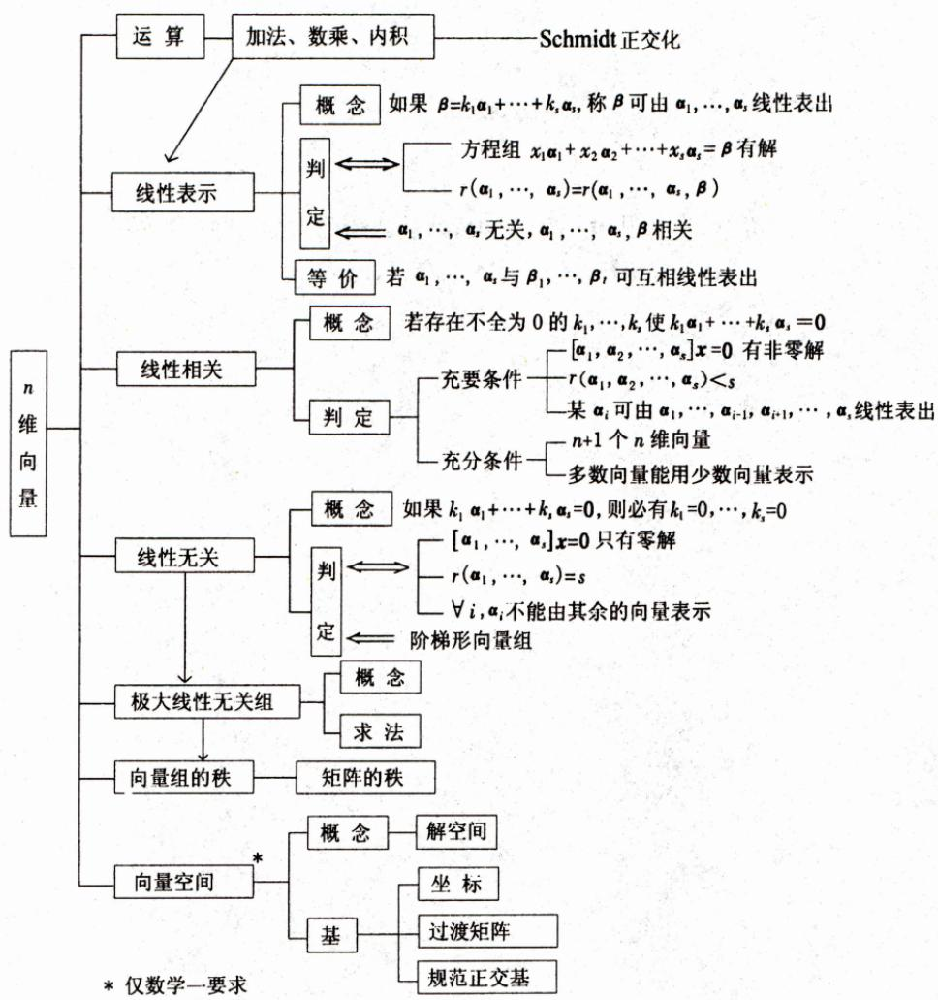
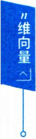

# 第三章 n 维向量难点，加油

## 一、知识结构网络图

n个数 $a_{1},a_{2},\cdots,a_{n}$ 所组成的有序数组 $\boldsymbol{\alpha} = (a_{1}, a_{2}, \cdots, a_{n})^{\mathrm{T}}$ 或 $\boldsymbol{\alpha} = (a_{1}, a_{2}, \cdots, a_{n})$ 称为n维向

量，,其中 $a_{1},a_{2},\cdots,a_{n}$ 称为向量α的分量(或坐标)，前一个表示式称为列向量，后者称为行向量

设n维向量 $\boldsymbol{\alpha} = (a_{1}, a_{2}, \cdots, a_{n})^{\mathrm{T}}, \boldsymbol{\beta} = (b_{1}, b_{2}, \cdots, b_{n})^{\mathrm{T}}$ ,则

向量加法 $\boldsymbol{\alpha} + \boldsymbol{\beta} = (a_{1} + b_{1}, a_{2} + b_{2}, \cdots, a_{n} + b_{n})^{\mathrm{T}};$

数乘向量 $k \boldsymbol{a} = (k a_{1}, k a_{2}, \cdots, k a_{n})^{\mathrm{T}};$

向量内积

$$
\left( \boldsymbol{\alpha}, \boldsymbol{\beta} \right) = \boldsymbol{\alpha}^{\mathrm{T}} \boldsymbol{\beta} = \boldsymbol{\beta}^{\mathrm{T}} \boldsymbol{\alpha} = a_{1} b_{1} + a_{2} b_{2} + \cdots + a_{n} b_{n}.
$$

设 $\alpha_{1}, \alpha_{2}, \cdots, \alpha_{s}$ 是n维向量， $k_{1},k_{2},\cdots,k_{s}$ 是一组实数，称 $k_{1}\boldsymbol{\alpha}_{1} + k_{2}\boldsymbol{\alpha}_{2} + \cdots + k_{s}\boldsymbol{\alpha}$ s是 $\alpha_{1}, \alpha_{2}, \cdots$ α, 的线性组合.

编者注】n维向量概念抽象，对逻辑推理能力要求高，是线性代数的难点之一，复习时要注意.

(1)理解向量的线性组合、线性表示、线性相关与线性无关等概念， 掌握向量线性相关、线性无关的有关性质及判别法.

(2)理解向量组的极大线性无关组的概念，掌握求向量组的极大线性无关组的方法.

(3)了解向量组等价的概念，理解向量组的秩的概念，了解矩阵的秩 与其行(列)向量组的秩之间的关系，会求向量组的秩.

(4)了解向量内积的概念，掌握线性无关向量组正交规范化的施密特(Schmidt）方法.

## 今年考题

$(2026, \frac{1}{2})$ 已知向量组 $\boldsymbol{\alpha}_{1}=\begin{pmatrix}1 \\ 0 \\ -1 \\ -1 \end{pmatrix},\boldsymbol{\alpha}_{2}=\begin{pmatrix}1 \\ -1 \\ 0 \\ -2 \end{pmatrix},\boldsymbol{\alpha}_{3}=\begin{pmatrix}0 \\ -1 \\ 1 \\ -1 \end{pmatrix},\boldsymbol{\alpha}_{4}=$

$\begin{pmatrix}0 \\1 \\- 1 \\1\end{pmatrix}$ .记 $\boldsymbol{A} = \left[ \boldsymbol{\alpha}_{1} , \boldsymbol{\alpha}_{2} , \boldsymbol{\alpha}_{3} , \boldsymbol{\alpha}_{4} \right] , \boldsymbol{G} = \left[ \boldsymbol{\alpha}_{1} , \boldsymbol{\alpha}_{2} \right] .$

(1)证明： $; \pmb { \alpha } _ { 1 } , \pmb { \alpha } _ { 2 }$ 是 $\boldsymbol{\alpha}_{1}, \boldsymbol{\alpha}_{2}, \boldsymbol{\alpha}_{3}, \boldsymbol{\alpha}_{4}$ 的极大线性无关组；

(2) 求矩阵 H 使得 $A = GH$ ,并求 $\boldsymbol{A}^{10}$

## 二、典型例题分析选讲

## 线性相关、无关

定义3.1 对n维向量 $\alpha_{1}, \alpha_{2}, \cdots, \alpha_{s}$ ，如果存在不全为零的数 $k _ { i }$ 使得k1α1 + k2α2 + … + ksa, = 0,

则称向量组 $\alpha_{1}, \alpha_{2}, \cdots, \alpha_{s}$ 线性相关.否则，称向量组 $\alpha_{1}, \alpha_{2}, \cdots, \alpha_{s}$ 线性无关(也就是说，当且仅当 $k_{1}=k_{2}=\cdots=k_{s}=0$ 时， $k_{1}\boldsymbol{\alpha}_{1} + k_{2}\boldsymbol{\alpha}_{2} + \cdots + k_{s}\boldsymbol{\alpha}_{s} =$ 0才能成立.或者说，只要 $k_{1},k_{2},\cdots,k_{s}$ 不全为零，那么 $k_{1}\boldsymbol{\alpha}_{1} + k_{2}\boldsymbol{\alpha}_{2} + \cdots +$ $k_{s} \dot{\boldsymbol{\alpha}}_{s}$ 必不为零).

$$
\boldsymbol{\alpha}_{1}=(1,2,3)^{\mathrm{T}}, \boldsymbol{\alpha}_{2}=(2,4,6)^{\mathrm{T}}, \boldsymbol{\alpha}_{3}=(3,0,5)^{\mathrm{T}};
$$

因为

$$
2\alpha_{1} - \alpha_{2} + 0\alpha_{3} = 0,
$$

组合系数2，-1,0不全为0，故向量组 $\boldsymbol{\alpha}_{1}, \boldsymbol{\alpha}_{2}, \boldsymbol{\alpha}_{3}$ 线性相关.

若 $\boldsymbol{\alpha}_{1}=(1,2,3)^{\mathrm{T}}, \boldsymbol{\alpha}_{2}=(0,4,5)^{\mathrm{T}}, \boldsymbol{\alpha}_{3}=(0,0,6)^{\mathrm{T}}.$

如果 $k_{1} \boldsymbol{\alpha}_{1} + k_{2} \boldsymbol{\alpha}_{2} + k_{3} \boldsymbol{\alpha}_{3} = \boldsymbol{0}$ ，按分量写出，有

$$
\begin{cases}k_{1} = 0, \\2k_{1} + 4k_{2} = 0, \\3k_{1} + 5k_{2} + 6k_{3} = 0.\end{cases}
$$

可见 $k_{1}\boldsymbol{\alpha}_{1} + k_{2}\boldsymbol{\alpha}_{2} + k_{3}\boldsymbol{\alpha}_{3} = \boldsymbol{0} \Leftrightarrow k_{1} = 0, k_{2} = 0, k_{3} = 0,$

故 $\boldsymbol{\alpha}_{1}, \boldsymbol{\alpha}_{2}, \boldsymbol{\alpha}_{3}$ 线性无关.

定理3.1 向量组 $\alpha_{1}, \alpha_{2}, \cdots, \alpha_{s}$ 线性相关

⇒齐次线性方程组 $\left[ \boldsymbol{\alpha}_{1}, \boldsymbol{\alpha}_{2}, \cdots, \boldsymbol{\alpha}_{s} \right] \begin{bmatrix} x_{1} \\ x_{2} \\ \vdots \\ x_{s} \end{bmatrix} = \mathbf{0}$ 有非零解

↔向量组的秩 $r(\alpha_{1},\alpha_{2},\cdots,\alpha_{s}) < s;$

推论1n个n维向量 $\alpha_{1}, \alpha_{2}, \cdots, \alpha_{n}$ 线性相关的充分必要条件是行列式

$$
\left| \boldsymbol{\alpha}_{1}, \boldsymbol{\alpha}_{2}, \cdots, \boldsymbol{\alpha}_{n} \right| = 0.
$$

推论2 n+1个 n维向量一定线性相关.

定理3.2 任何部分组 $\alpha_{1}, \alpha_{2}, \cdots, \alpha_{r}$ 相关⇒整体组 $\alpha_{1}, \alpha_{2}, \cdots, \alpha_{r}, \cdots, \alpha_{s}$ 相关；整体组 $\alpha_{1}, \alpha_{2}, \cdots, \alpha_{r}, \cdots, \alpha_{s}$ 无关⇒任何部分组 $\alpha_{1}, \alpha_{2}, \cdots, \alpha_{r}$ 无关，反之都不成立.

La $\boldsymbol{\alpha}_{1}, \boldsymbol{\alpha}_{2}, \cdots, \boldsymbol{\alpha}_{r}$ 及的 $\alpha_{1}, \alpha_{2}, \cdots, \alpha_{r}, \cdots, \alpha_{s}$ 中共是 $s > r )$ ,称 $\alpha_{1}, \alpha_{2}, \cdots,$ 一$\alpha_{1}, \alpha_{2}, \cdots, \alpha_{s}$ $\alpha_{1}, \alpha_{2}, \cdots, \alpha_{s}$

维向量

定理3.3 α1,α2,…,αm线性无关⇒ 延伸组α1,α2，…,αm线性无关；$\tilde{\boldsymbol{\alpha}}_{1}, \tilde{\boldsymbol{\alpha}}_{2}, \cdots, \tilde{\boldsymbol{\alpha}}_{m}$ 线性相关⇒缩短组 $\boldsymbol{\alpha}_{1}, \boldsymbol{\alpha}_{2}, \cdots, \boldsymbol{\alpha}_{m}$ 线性相关，反之均不成立.

向量组 $\boldsymbol{\alpha}_{1}=(a_{11},a_{21},\cdots,a_{r1})^{\mathrm{T}},\boldsymbol{\alpha}_{2}=(a_{12},a_{22},\cdots,a_{r2})^{\mathrm{T}},\cdots,\boldsymbol{\alpha}_{m}=$ $\left( a _ { 1 m } , a _ { 2 m } , \cdots , a _ { m } \right) ^ { \mathrm { T } } \mathrm { 及 } \widetilde { \boldsymbol { \alpha } } _ { 1 } = \left( a _ { 1 1 } , a _ { 2 1 } , \cdots , a _ { r 1 } , \cdots , a _ { r 1 } \right) ^ { \mathrm { T } } , \widetilde { \boldsymbol { \alpha } } _ { 2 } = \left( a _ { 1 2 } , a _ { 2 2 } , \cdots , a _ { r 2 } \right) ^ { \mathrm { T } } \mathrm { 及 } \boldsymbol { \alpha } _ { 2 }$ $\cdots, a_{r2}, \cdots, a_{r2})^{\mathrm{T}}, \cdots, \boldsymbol{\alpha}_{m} = (a_{1m}, a_{2m}, \cdots, a_{m}, \cdots, a_{sm})^{\mathrm{T}}$ ,其中 $s \gg r$ ，则称是 $\widetilde{\boldsymbol{\alpha}}_{1}, \widetilde{\boldsymbol{\alpha}}_{2}, \cdots, \widetilde{\boldsymbol{\alpha}}_{m}$ 为向量组 $\boldsymbol{\alpha}_{1}, \boldsymbol{\alpha}_{2}, \cdots, \boldsymbol{\alpha}_{m}$ 的延伸组(或称 $\boldsymbol{\alpha}_{1}, \boldsymbol{\alpha}_{2}, \cdots, \boldsymbol{\alpha}_{m}$ $\tilde{\boldsymbol{\alpha}}_{1}, \tilde{\boldsymbol{\alpha}}_{2}, \cdots, \tilde{\boldsymbol{\alpha}}_{m}$ 的缩短组).

展示新知

【例3.1】下列向量组中，线性无关的是(A)(1,2,3,4),(2,3,4,5),(0,0,0,0).(B) $\left( ( 1 , 2 , - 1 ) ^ { \mathrm { T } } , ( 3 , 5 , 6 ) ^ { \mathrm { T } } , ( 0 , 7 , 9 ) ^ { \mathrm { T } } , ( 1 , 0 , 2 ) ^ { \mathrm { T } } \right)$ (C) $(a,1,2,3)^{\mathrm{T}},(b,1,2,3)^{\mathrm{T}},(c,3,4,5)^{\mathrm{T}},(d,0,0,0)^{\mathrm{T}}$ $\left( \mathrm{D} \right) \left( a , 1 , b , 0 , 0 \right) ^ { \mathrm{T} } , \left( c , 0 , d , 6 , 0 \right) ^ { \mathrm{T} } , \left( a , 0 , c , 5 , 6 \right) ^ { \mathrm{T} } .$

## 分析（A）中有零向量必线性相关.因为

$$
0 \alpha _ { 1 } + 0 \alpha _ { 2 } + \alpha _ { 3 } = 0 ,
$$

系数0,0,1不全为0.

(B)是4个三维向量必线性相关.根据定理3.1的推论2:n+1个n维 向量必线性相关.

(C)是4 个四维向量可用行列式(定理3.1的推论1). 由于

$$
\begin{aligned}\left| \begin{matrix}a & b & c & d \\1 & 1 & 3 & 0 \\2 & 2 & 4 & 0 \\3 & 3 & 5 & 0 \\\end{matrix} \right|= -d\left| \begin{matrix}1 & 1 & 3 \\2 & 2 & 4 \\3 & 3 & 5 \\\end{matrix} \right|= 0 , \end{aligned}
$$

从而线性相关.

(D) 中，因为 $\begin{vmatrix} 1 & 0 & 0 \\ 0 & 6 & 5 \\ 0 & 0 & 6 \end{vmatrix} \neq 0$ ,知 $(1,0,0)^{\mathrm{T}},(0,6,0)^{\mathrm{T}},(0,5,6)^{\mathrm{T}}$ 线性无关，那么其延伸组 $(a,1,b,0,0)^{\mathrm{T}},(c,0,d,6,0)^{\mathrm{T}},(a,0,c,5,6)^{\mathrm{T}}$ 必线性无关.

展示新知 展示新知

【例3.2】若 $\boldsymbol{\alpha}_{1}=(1,3,4,-2)^{\mathrm{T}}, \boldsymbol{\alpha}_{2}=(2,1,3,t)^{\mathrm{T}}, \boldsymbol{\alpha}_{3}=(3,-1)$ $2 , 0 ) ^ { \mathrm { T } }$ 线性相关，则t =

分析设 $x_{1} \boldsymbol{\alpha}_{1} + x_{2} \boldsymbol{\alpha}_{2} + x_{3} \boldsymbol{\alpha}_{3} = \boldsymbol{0}$ ，按分量写出，即有

$$
\begin{aligned}x_{1} + 2x_{2} + 3x_{3} &= 0, \\3x_{1} + x_{2} - x_{3} &= 0, \\4x_{1} + 3x_{2} + 2x_{3} &= 0, \\- 2x_{1} + tx_{2} &= 0.\end{aligned}
$$

对系数矩阵 $\left[ \boldsymbol{\alpha}_{1} , \boldsymbol{\alpha}_{2} , \boldsymbol{\alpha}_{3} \right]$ 作初等行变换，有

$$
\begin{bmatrix} 1 & 2 & 3 \\ 3 & 1 & - 1 \\ 4 & 3 & 2 \\ - 2 & t & 0 \end{bmatrix} \rightarrow \begin{bmatrix} 1 & 2 & 3 \\ 0 & 1 & 2 \\ 0 & 0 & 6 - 2(t + 4) \\ 0 & 0 & 0 \end{bmatrix}.
$$

学习札记

$\boldsymbol{\alpha}_{1}, \boldsymbol{\alpha}_{2}, \boldsymbol{\alpha}_{3}$ 线性相关 $\Leftrightarrow \left[ \boldsymbol{\alpha}_{1}, \boldsymbol{\alpha}_{2}, \boldsymbol{\alpha}_{3} \right] \begin{bmatrix} x_{1} \\ x_{2} \\ x_{3} \end{bmatrix} = \boldsymbol{0}$ 有非零解

⇔秩 $r(\boldsymbol{\alpha}_{1},\boldsymbol{\alpha}_{2},\boldsymbol{\alpha}_{3}) < 3$

故6-2(t+4)=0,即t=-1.

展示新知 农小利丸

【例3.3】 若 $\boldsymbol{\alpha}_{1}=(1,2,3,1)^{\mathrm{T}}, \boldsymbol{\alpha}_{2}=(1,1,2,-1)^{\mathrm{T}}, \boldsymbol{\alpha}_{3}=(2,6,a,$ $5)^{\mathrm{T}}, \boldsymbol{\alpha}_{4} = (3, 4, 7, -1)^{\mathrm{T}}$ 线性相关，则 a =

## 分析4个四维向量可用行列式，有

$$
\begin{aligned}\left| \begin{array}{cccc}\boldsymbol{\alpha}_{1} , \boldsymbol{\alpha}_{2} , \boldsymbol{\alpha}_{3} , \boldsymbol{\alpha}_{4} \\\end{array} \right|&=\left| \begin{array}{cccc}1 & 1 & 2 & 3 \\2 & 1 & 6 & 4 \\3 & 2 & a & 7 \\1 & -1 & 5 & -1 \\\end{array} \right|=\left| \begin{array}{cccc}1 & 1 & 2 & 3 \\0 & -1 & 2 & -2 \\0 & -1 & a-6 & -2 \\0 & -2 & 3 & -4 \\\end{array} \right| \\&=\left| \begin{array}{cccc}-1 & 2 & -2 \\-1 & a-6 & -2 \\-2 & 3 & -4 \\\end{array} \right|= 0,\end{aligned}
$$

说明 $\forall a, \alpha_{1}, \alpha_{2}, \alpha_{3}, \alpha_{4}$ 恒线性相关.

【评注】例 3.2 和例 3.3 处理手法的差异，前者s 个n 维向量适合转换为齐次方程组来分析，后者n个n维向量利用行列式简便.

## 线性无关的判定与证明

若向量的坐标没有给出，通常用定义法或用秩的理论来分析判断论证，也要有反证法的构思.

(1) 用定义法证 $\alpha_{1}, \alpha_{2}, \cdots, \alpha_{s}$ 线性无关的框图是：

设 $k_{1} \boldsymbol{\alpha}_{1} + k_{2} \boldsymbol{\alpha}_{2} + \cdots + k_{s} \boldsymbol{\alpha}_{s} = \boldsymbol{0}$

↓恒等变形

$$
k_{1} = 0, k_{2} = 0, \cdots, k_{s} = 0.
$$

$\Leftrightarrow \left[ \boldsymbol{\alpha}_{1}, \boldsymbol{\alpha}_{2}, \cdots, \boldsymbol{\alpha}_{s} \right] \begin{bmatrix} x_{1} \\ x_{2} \\ \vdots \\ x_{s} \end{bmatrix} = \boldsymbol{0}$ 只有零解

⇔秩 $r(\boldsymbol{\alpha}_{1},\boldsymbol{\alpha}_{2},\cdots,\boldsymbol{\alpha}_{s}) = s.$

要注意公式：r(A） = A的列秩= A 的行秩，

$$
r(\boldsymbol{A}\boldsymbol{B}) \leqslant \min(r(\boldsymbol{A}),r(\boldsymbol{B})).
$$

若A可逆，则 $r(\boldsymbol{A}\boldsymbol{B}) = r(\boldsymbol{B}), r(\boldsymbol{B}\boldsymbol{A}) = r(\boldsymbol{B})$

若A是m× n矩阵，且 $r(\boldsymbol{A}) = n$ ,则 $r(\boldsymbol{A}\boldsymbol{B}) = r(\boldsymbol{B})$

若 A 是 m × n 矩阵,B 是 n × s 矩阵且 AB = O,则 $r(\boldsymbol{A}) + r(\boldsymbol{B}) \leqslant n.$ (3) 反证法.

## 展示新知 展示新知

【例3.4】 已知n维向量 $\alpha_{1}, \alpha_{2}, \alpha_{3}$ 线性无关，证明 $3\boldsymbol{\alpha}_{1} + 2\boldsymbol{\alpha}_{2} , \boldsymbol{\alpha}_{2}$ $\boldsymbol{\alpha}_{3}, 4\boldsymbol{\alpha}_{3} - 5\boldsymbol{\alpha}_{1}$ 线性无关.

## 证明（方法一）（用定义，重组）设

$$
k _ { 1 } \left( 3 \boldsymbol { \alpha } _ { 1 } + 2 \boldsymbol { \alpha } _ { 2 } \right) + k _ { 2 } \left( \boldsymbol { \alpha } _ { 2 } - \boldsymbol { \alpha } _ { 3 } \right) + k _ { 3 } \left( 4 \boldsymbol { \alpha } _ { 3 } - 5 \boldsymbol { \alpha } _ { 1 } \right) = \boldsymbol { 0 } ,\tag{}
$$

即 $\left( 3 k _ { 1 } - 5 k _ { 3 } \right) \boldsymbol { \alpha } _ { 1 } + \left( 2 k _ { 1 } + k _ { 2 } \right) \boldsymbol { \alpha } _ { 2 } + \left( - k _ { 2 } + 4 k _ { 3 } \right) \boldsymbol { \alpha } _ { 3 } = \boldsymbol { 0 } .$

②

由于 $\boldsymbol{a}_{1}, \boldsymbol{a}_{2}, \boldsymbol{a}_{3}$ 线性无关，故

$$
\begin{cases}3k_{1} - 5k_{3} = 0, \\2k_{1} + k_{2} = 0, \\\quad - k_{2} + 4k_{3} = 0.\end{cases}\tag{③}
$$

因为 $\begin{vmatrix} 3 & 0 & - 5 \\ 2 & 1 & 0 \\ 0 & - 1 & 4 \end{vmatrix} = 22 \neq 0$ ，齐次方程组③只有零解

$$
k_{1} = 0, k_{2} = 0, k_{3} = 0.
$$

故向量组 $3\boldsymbol{\alpha}_{1} + 2\boldsymbol{\alpha}_{2} , \boldsymbol{\alpha}_{2} - \boldsymbol{\alpha}_{3} , 4\boldsymbol{\alpha}_{3} - 5\boldsymbol{\alpha}_{1}$ 线性无关.

（方法二）（用秩）令 $\boldsymbol{\beta}_{1}=3 \boldsymbol{\alpha}_{1}+2 \boldsymbol{\alpha}_{2}, \boldsymbol{\beta}_{2}=\boldsymbol{\alpha}_{2}-\boldsymbol{\alpha}_{3}, \boldsymbol{\beta}_{3}=4 \boldsymbol{\alpha}_{3}-5 \boldsymbol{\alpha}_{1}$ ,则

$$
\left[ \boldsymbol { \beta } _ { 1 } , \boldsymbol { \beta } _ { 2 } , \boldsymbol { \beta } _ { 3 } \right] = \left[ \boldsymbol { \alpha } _ { 1 } , \boldsymbol { \alpha } _ { 2 } , \boldsymbol { \alpha } _ { 3 } \right] \begin{bmatrix} 3 & 0 & - 5 \\ 2 & 1 & 0 \\ 0 & - 1 & 4 \end{bmatrix}.
$$

因为矩阵 $\begin{bmatrix} 3 & 0 & - 5 \\ 2 & 1 & 0 \\ 0 & - 1 & 4 \end{bmatrix}$ 可逆，所以 $r \left( \boldsymbol { \beta } _ { 1 } , \boldsymbol { \beta } _ { 2 } , \boldsymbol { \beta } _ { 3 } \right) = r \left( \boldsymbol { \alpha } _ { 1 } , \boldsymbol { \alpha } _ { 2 } , \boldsymbol { \alpha } _ { 3 } \right) = 3$ ,即 $\beta _ { 1 }$ ，$\boldsymbol{\beta}_{2} : \boldsymbol{\beta}_{3}$ 线性无关，亦即 $3\boldsymbol{\alpha}_{1} + 2\boldsymbol{\alpha}_{2} , \boldsymbol{\alpha}_{2} - \boldsymbol{\alpha}_{3} , 4\boldsymbol{\alpha}_{3} - 5\boldsymbol{\alpha}_{1}$ 线性无关.

展示新知

例3.5】设A是n阶矩阵，α是n维列向量，若 $\boldsymbol{A}^{m - 1} \boldsymbol{\alpha} \neq \boldsymbol{0}, \boldsymbol{A}^{m} \boldsymbol{\alpha}$ 0,证明向量组 $\alpha , A \alpha , A ^ { 2 } \alpha , \cdots , A ^ { m - 1 } \alpha$ 线性无关.

## 证明（方法一）（用定义，同乘）设

$$
k _ { 1 } \boldsymbol { \alpha } + k _ { 2 } \boldsymbol { A } \boldsymbol { \alpha } + k _ { 3 } \boldsymbol { A } ^ { 2 } \boldsymbol { \alpha } + \cdots + k _ { m } \boldsymbol { A } ^ { m - 1 } \boldsymbol { \alpha } = \boldsymbol { 0 } ,
$$

学习札记

①

由 $\boldsymbol{A}^{m} \boldsymbol{\alpha} = \boldsymbol{0}$ 知 $\boldsymbol{A}^{m + 1} \boldsymbol{\alpha} = \boldsymbol{0}, \boldsymbol{A}^{m + 2} \boldsymbol{\alpha} = \boldsymbol{0}, \cdots$ ,用 $\boldsymbol{A}^{m - 1}$ 左乘①式两端，并把 $\boldsymbol{A}^{m} \boldsymbol{\alpha}$ $= 0 , A ^ { m + 1 } \alpha = 0 , A ^ { m + 2 } \alpha = 0 , \cdots$ 代入，有一手最快资料同步VX：kys985121

$$
k_{1} \boldsymbol{A}^{m-1} \boldsymbol{\alpha} = \boldsymbol{0}.\tag{②}
$$

因为 $\boldsymbol{A}^{m - 1} \boldsymbol{\alpha} \neq \boldsymbol{0}$ ,故 $k_{1} = 0$

把 $k_{1} = 0$ 代人①式，有

$$
k _ { 2 } \boldsymbol { A } \boldsymbol { \alpha } + k _ { 3 } \boldsymbol { A } ^ { 2 } \boldsymbol { \alpha } + \cdots + k _ { m } \boldsymbol { A } ^ { m - 1 } \boldsymbol { \alpha } = \boldsymbol { 0 } .
$$

同理用 $\boldsymbol{A}^{m - 2}$ 左乘上式，可知

$$
k _ { 2 } \boldsymbol { A } ^ { m - 1 } \boldsymbol { \alpha } = \boldsymbol { 0 } ,
$$

从而 $k_{2} = 0$

类似可得 $k_{3} = 0 , \cdots , k_{m} = 0$ ,所以 $\boldsymbol{\alpha}, A\boldsymbol{\alpha}, A^{2}\boldsymbol{\alpha}, \cdots, A^{m-1}\boldsymbol{\alpha}$ 线性无关.

（方法二）（反证法）如果 $\boldsymbol{\alpha}, A\boldsymbol{\alpha}, \cdots, A^{m-1}\boldsymbol{\alpha}$ 线性相关，则有不全为0的$k_{1},k_{2},\cdots,k_{m}$ 使得

$$
k_{1}\boldsymbol{\alpha} + k_{2}\boldsymbol{A}\boldsymbol{\alpha} + \cdots + k_{m}\boldsymbol{A}^{m - 1}\boldsymbol{\alpha} = \boldsymbol{0}.\tag{③}
$$

设 $k_{1},k_{2},\cdots,k_{m}$ 中第一个不为0的是 $k _ { p }$ (即 $k_{1} = k_{2} = \cdots = k_{p-1} = 0$ $k _ { p } \neq 0 , p \geqslant 1 )$ ，于是③式化为

$$
k _ { p } \boldsymbol { A } ^ { p - 1 } \boldsymbol { \alpha } + \cdots + k _ { m } \boldsymbol { A } ^ { m - 1 } \boldsymbol { \alpha } = \boldsymbol { 0 } .\tag{④}
$$

用 $\boldsymbol{A}^{m - p}$ 乘④并把 $A^{m} \alpha = 0, A^{m + 1} \alpha = 0, \cdots$ 代入，就有 $k_{p} \boldsymbol{A}^{m - 1} \boldsymbol{\alpha} = \boldsymbol{0}.$ 又因 $\boldsymbol{A}^{m - 1} \boldsymbol{\alpha} \neq \boldsymbol{0}$ ,那么 $k_{p} = 0$ ，与假设矛盾.故 $\boldsymbol{\alpha}, A\boldsymbol{\alpha}, A^{2}\boldsymbol{\alpha}, \cdots, A^{m-1}\boldsymbol{\alpha}$ 线性无关.展示新知

【例3.6】设A是n阶矩阵 $\alpha_{1}, \alpha_{2}, \alpha_{3}$ 是n维列向量，若 $A \alpha _ { 1 } = \alpha _ { 1 }$ $0,A\boldsymbol{\alpha}_{2}=\boldsymbol{\alpha}_{1}+\boldsymbol{\alpha}_{2},A\boldsymbol{\alpha}_{3}=\boldsymbol{\alpha}_{2}+\boldsymbol{\alpha}_{3}$ ，证明向量组 $\alpha_{1}, \alpha_{2}, \alpha_{3}$ 线性无关.

## 证明（用定义，同乘）设

$$
k _ { 1 } \boldsymbol { \alpha } _ { 1 } + k _ { 2 } \boldsymbol { \alpha } _ { 2 } + k _ { 3 } \boldsymbol { \alpha } _ { 3 } = \boldsymbol { 0 } ,\tag{}
$$

由于 $\left( \boldsymbol{A} - \boldsymbol{E} \right) \boldsymbol{\alpha}_{1} = \boldsymbol{0}, \left( \boldsymbol{A} - \boldsymbol{E} \right) \boldsymbol{\alpha}_{2} = \boldsymbol{\alpha}_{1}, \left( \boldsymbol{A} - \boldsymbol{E} \right) \boldsymbol{\alpha}_{3} = \boldsymbol{\alpha}_{2}$ ,用A-E左乘①式两端，得

$$
k_{2}\boldsymbol{\alpha}_{1} + k_{3}\boldsymbol{\alpha}_{2} = \boldsymbol{0}.\tag{②}
$$

再用A—E左乘②式两端，有

$$
k_{3} \boldsymbol{\alpha}_{1} = \mathbf{0}.
$$

因为 $\boldsymbol{\alpha}_{1} \neq \boldsymbol{0}$ ,故 $k _ { 3 } = 0$ .把 $k_{3} = 0$ 代入②得 $k_{2} = 0$ ,再把 $k_{2} = 0 , k_{3} = 0$ 代入①得 $k _ { 1 } = 0$

因此，向量组 $\boldsymbol{\alpha}_{1}, \boldsymbol{\alpha}_{2}, \boldsymbol{\alpha}_{3}$ 线性无关.

展示新知

【例3.7】 $(2008, \frac{2}{3,4})$ 设A为三阶矩阵 $a _ { 1 } , a _ { 2 }$ 为A的分别属于特征 值—1,1的特征向量，向量 $\alpha _ { 3 }$ 满足 $A\boldsymbol{\alpha}_{3} = \boldsymbol{\alpha}_{2} + \boldsymbol{\alpha}_{3}$ ,证明 $\alpha_{1}, \alpha_{2}, \alpha_{3}$ 线性无 关.

$$
A \alpha _ { 1 } = - \alpha _ { 1 } , A \alpha _ { 2 } = \alpha _ { 2 } .
$$

设

$$
k_{1} \boldsymbol{\alpha}_{1} + k_{2} \boldsymbol{\alpha}_{2} + k_{3} \boldsymbol{\alpha}_{3} = \boldsymbol{0},\tag{①}
$$

用A左乘①得

$$
- k_{1} \boldsymbol{\alpha}_{1} + k_{2} \boldsymbol{\alpha}_{2} + k_{3} \left( \boldsymbol{\alpha}_{2} + \boldsymbol{\alpha}_{3} \right) = \mathbf{0},\tag{②}
$$

①-②得

$$
2k_{1}\boldsymbol{\alpha}_{1} - k_{3}\boldsymbol{\alpha}_{2} = \boldsymbol{0}.
$$

因为 $\pmb { \alpha } _ { 1 } , \pmb { \alpha } _ { 2 }$ 是不同特征值的特征向量 $, \pmb { \alpha } _ { 1 } , \pmb { \alpha } _ { 2 }$ 线性无关，故 $k_{1} = 0 , k_{3} = 0.$ 代入(1)得 $k_{2} \boldsymbol{\alpha}_{2} = \boldsymbol{0}$ 又因 $\pmb { \alpha } _ { 2 }$ 是特征向量， $\boldsymbol{a}_{2} \neq \boldsymbol{0}$ ,从而 $k_{2} = 0$ 因此， $, \pmb { \alpha } _ { 1 } , \pmb { \alpha } _ { 2 }$ $\pmb { \alpha } _ { 3 }$ 线性无关.

(方法二）（反证法）因为 $( \pmb { \alpha } _ { 1 } , \pmb { \alpha } _ { 2 }$ 是矩阵A不同特征值的特征向量，所以它们线性无关.那么如果 $\boldsymbol{\alpha}_{1}, \boldsymbol{\alpha}_{2}, \boldsymbol{\alpha}_{3}$ 线性相关，则

$$
\boldsymbol{\alpha}_{3}=k_{1} \boldsymbol{\alpha}_{1}+k_{2} \boldsymbol{\alpha}_{2}.\tag{③}
$$

用A左乘③式两端，并把 $A\boldsymbol{\alpha}_{1} = - \boldsymbol{\alpha}_{1},A\boldsymbol{\alpha}_{2} = \boldsymbol{\alpha}_{2},A\boldsymbol{\alpha}_{3} = \boldsymbol{\alpha}_{2} + \boldsymbol{\alpha}_{3}$ 代入得

$$
\boldsymbol{\alpha}_{2}+\boldsymbol{\alpha}_{3}=-k_{1}\boldsymbol{\alpha}_{1}+k_{2}\boldsymbol{\alpha}_{2}.\tag{④}
$$

④-③得 $\boldsymbol{\alpha}_{2}=-2k_{1}\boldsymbol{\alpha}_{1}$ ,与 $\pmb { \alpha } _ { 1 } , \pmb { \alpha } _ { 2 }$ 线性无关相矛盾.

展示新知

【例3.8】设A是 $m \times n$ 矩阵，秩 $r(A)=n,\alpha_{1},\alpha_{2},\alpha_{3}$ 是n维线性无关的列向量.证明 $A\alpha_{1},A\alpha_{2},A\alpha_{3}$ 线性无关.

证明（方法一）（用定义）设

即

$$
\begin{aligned}k_{1} \boldsymbol{A} \boldsymbol{\alpha}_{1} + k_{2} \boldsymbol{A} \boldsymbol{\alpha}_{2} + k_{3} \boldsymbol{A} \boldsymbol{\alpha}_{3} &= \mathbf{0}, \\\boldsymbol{A} \left( k_{1} \boldsymbol{\alpha}_{1} + k_{2} \boldsymbol{\alpha}_{2} + k_{3} \boldsymbol{\alpha}_{3} \right) &= \mathbf{0}.\end{aligned}\tag{①}
$$

因 $r(\boldsymbol{A}) = n, \boldsymbol{A}\boldsymbol{x} = \boldsymbol{0}$ 只有零解，故

$$
k_{1} \boldsymbol{\alpha}_{1} + k_{2} \boldsymbol{\alpha}_{2} + k_{3} \boldsymbol{\alpha}_{3} = \boldsymbol{0}.\tag{②}
$$

由 $\boldsymbol{\alpha}_{1}, \boldsymbol{\alpha}_{2}, \boldsymbol{\alpha}_{3}$ 线性无关，从而 $k_{1} = 0, k_{2} = 0, k_{3} = 0$ ,所以 $\boldsymbol{A}\boldsymbol{\alpha}_{1},\boldsymbol{A}\boldsymbol{\alpha}_{2},\boldsymbol{A}\boldsymbol{\alpha}_{3}$ 线性无关.

(方法二）（用秩）

$$
\left( A \boldsymbol { \alpha } _ { 1 } , A \boldsymbol { \alpha } _ { 2 } , A \boldsymbol { \alpha } _ { 3 } \right) = A \left( \boldsymbol { \alpha } _ { 1 } , \boldsymbol { \alpha } _ { 2 } , \boldsymbol { \alpha } _ { 3 } \right) .
$$

因A是m×n矩阵， $r(\boldsymbol{A}) = n$

$$
r(A\boldsymbol{\alpha}_{1},A\boldsymbol{\alpha}_{2},A\boldsymbol{\alpha}_{3})=r[A(\boldsymbol{\alpha}_{1},\boldsymbol{\alpha}_{2},\boldsymbol{\alpha}_{3})]=r(\boldsymbol{\alpha}_{1},\boldsymbol{\alpha}_{2},\boldsymbol{\alpha}_{3})=3.
$$

$\therefore A\boldsymbol{\alpha}_{1} , A\boldsymbol{\alpha}_{2} , A\boldsymbol{\alpha}_{3}$ 线性无关.

展示新知

【例3.9】设四维列向量 $\alpha_{1}, \alpha_{2}, \alpha_{3}$ 线性无关，且与四维非零列向量$\beta _ { 1 } , \beta _ { 2 }$ 均正交，证明 $(1) \beta_{1}, \beta_{2}$ 线性相关 $(2) \boldsymbol{\alpha}_{1}, \boldsymbol{\alpha}_{2}, \boldsymbol{\alpha}_{3}, \boldsymbol{\beta}_{1}$ 线性无关.

## 证明（1)（用秩）构造矩阵

$$
\begin{aligned} { \mathbf { A } = \left[ \begin{matrix} { \pmb { \alpha } _ { 1 } ^ { \mathtt { T } } } \\ { \pmb { \alpha } _ { 2 } ^ { \mathtt { T } } } \\ { \pmb { \alpha } _ { 3 } ^ { \mathtt { T } } } \\ \end{matrix} \right] , } \\ \end{aligned}
$$

则矩阵A是秩为3的 $3 \times 4$ 矩阵.由于

$$
\boldsymbol{A} \boldsymbol{\beta}_{i}=\left[\begin{aligned}\boldsymbol{\alpha}_{1}^{\mathrm{T}} \\\boldsymbol{\alpha}_{2}^{\mathrm{T}} \\\boldsymbol{\alpha}_{3}^{\mathrm{T}}\end{aligned}\right] \boldsymbol{\beta}_{i}=\left[\begin{aligned}0 \\0 \\0\end{aligned}\right], i=1,2,
$$

所以 $\boldsymbol{\beta}_{1}, \boldsymbol{\beta}_{2}$ 均是齐次方程组 $\boldsymbol{A}\boldsymbol{x} = \boldsymbol{0}$ 的解，于是

$$
r(\beta_{1},\beta_{2}) \leqslant n - r(A) = 4 - 3 = 1,
$$

从而 $\boldsymbol{\beta}_{1}, \boldsymbol{\beta}_{2}$ 线性相关.

(2)(用定义)设

$$
k _ { 1 } \boldsymbol { \alpha } _ { 1 } + k _ { 2 } \boldsymbol { \alpha } _ { 2 } + k _ { 3 } \boldsymbol { \alpha } _ { 3 } + k \boldsymbol { \beta } _ { 1 } = \boldsymbol { 0 } ,\tag{}
$$

用 $\pmb { \beta } _ { 1 } ^ { \mathrm { T } }$ 左乘①，又 $\boldsymbol{\beta}_{1}^{\mathrm{T}} \boldsymbol{\alpha}_{i}=0(i=1,2,3)$ ,有 $k \boldsymbol{\beta}_{1}^{\mathrm{T}} \boldsymbol{\beta}_{1} = 0.$ 而 $\boldsymbol{\beta}_{1}^{\mathrm{T}} \boldsymbol{\beta}_{1} \neq 0$ ,故必有$k = 0$ 把 $k = 0$ 代入①得

$$
k_{1} \boldsymbol{\alpha}_{1} + k_{2} \boldsymbol{\alpha}_{2} + k_{3} \boldsymbol{\alpha}_{3} = \boldsymbol{0},
$$

因 $\boldsymbol{\alpha}_{1}, \boldsymbol{\alpha}_{2}, \boldsymbol{\alpha}_{3}$ 线性无关，故必有

$$
k_{1} = 0, k_{2} = 0, k_{3} = 0,
$$

所以 $\boldsymbol{\alpha}_{1}, \boldsymbol{\alpha}_{2}, \boldsymbol{\alpha}_{3}, \boldsymbol{\beta}_{1}$ 必线性无关.

练习1 $ 乙$ 知 $\lambda_{1}, \lambda_{2}$ 是矩阵A不同的特征值， $\boldsymbol{a}_{1}, \boldsymbol{a}_{2}$ 是特征值 $\lambda_{1}$ 的线性无关的特征向量 $, \pmb { \beta }$ 是特征值 $\lambda_{2}$ 的特征向量.证明 $\boldsymbol{\alpha}_{1}, \boldsymbol{\alpha}_{2}, \boldsymbol{\beta}$ 线性无关.

解题笔记

练习2证明：如果 $\boldsymbol{\beta}_{1}, \boldsymbol{\beta}_{2}, \boldsymbol{\beta}_{3}$ 可由 $\boldsymbol{\alpha}_{1}, \boldsymbol{\alpha}_{2}$ 线性表示，则 $\boldsymbol{\beta}_{1}, \boldsymbol{\beta}_{2}, \boldsymbol{\beta}_{3}$ 必线性相关.

解题笔记

练习3已知 $\boldsymbol{A} = \left[ \boldsymbol{\alpha}_{1}, \boldsymbol{\alpha}_{2}, \cdots, \boldsymbol{\alpha}_{m} \right], \boldsymbol{B} = \left[ \boldsymbol{\beta}_{1}, \boldsymbol{\beta}_{2}, \cdots, \boldsymbol{\beta}_{m} \right]$ 且 PA = B,其中P是可逆矩阵，若 $\boldsymbol{\alpha}_{1}, \boldsymbol{\alpha}_{3}, \boldsymbol{\alpha}_{5}$ 线性相(无)关，则 $\boldsymbol{\beta}_{1}, \boldsymbol{\beta}_{3}, \boldsymbol{\beta}_{5}$ 线性相(无)关.解题笔记

展示新知

【例3.10】已知向量组 $\alpha_{1}, \alpha_{2}, \alpha_{3}$ 线性无关，向量组 $\boldsymbol{a}_{1}+\boldsymbol{a} \boldsymbol{a}_{2}, \boldsymbol{a}_{1}+$ $2a_{2} + a_{3}, a_{1} - a_{3}$ 线性相关，则 a =

分析令

$$
\boldsymbol { \beta } _ { 1 } = \boldsymbol { \alpha } _ { 1 } + a \boldsymbol { \alpha } _ { 2 } , \boldsymbol { \beta } _ { 2 } = \boldsymbol { \alpha } _ { 1 } + 2 \boldsymbol { \alpha } _ { 2 } + \boldsymbol { \alpha } _ { 3 } , \boldsymbol { \beta } _ { 3 } = a \boldsymbol { \alpha } _ { 1 } - \boldsymbol { \alpha } _ { 3 } ,
$$

有

$$
\left[ \boldsymbol { \beta } _ { 1 } , \boldsymbol { \beta } _ { 2 } , \boldsymbol { \beta } _ { 3 } \right] = \left[ \boldsymbol { \alpha } _ { 1 } , \boldsymbol { \alpha } _ { 2 } , \boldsymbol { \alpha } _ { 3 } \right] \begin{bmatrix} 1 & 1 & a \\ a & 2 & 0 \\ 0 & 1 & - 1 \end{bmatrix}.
$$

从而

$$
\begin{vmatrix} 1 & 1 & a \\ a & 2 & 0 \\ 0 & 1 & - 1 \end{vmatrix} = \begin{vmatrix} 1 & a + 1 & a \\ a & 2 & 0 \\ 0 & 0 & - 1 \end{vmatrix} = a^{2} + a - 2 = 0,
$$

故a=1或a=—2.

或用定义法.如

$$
k _ { 1 } \left( \boldsymbol { \alpha } _ { 1 } + a \boldsymbol { \alpha } _ { 2 } \right) + k _ { 2 } \left( \boldsymbol { \alpha } _ { 1 } + 2 \boldsymbol { \alpha } _ { 2 } + \boldsymbol { \alpha } _ { 3 } \right) + k _ { 3 } \left( a \boldsymbol { \alpha } _ { 1 } - \boldsymbol { \alpha } _ { 3 } \right) = \boldsymbol { 0 } ,\tag{①}
$$

即(k1 + k2 + ak3)α₁ +(ak₁+ 2k2)α2 +(k2 -k3)α3 = 0.

②

由 $\boldsymbol{\alpha}_{1}, \boldsymbol{\alpha}_{2}, \boldsymbol{\alpha}_{3}$ 线性无关.从而

$$
\left\{ \begin{aligned} k_{1} + k_{2} + ak_{3} = 0, \\ ak_{1} + 2k_{2} = 0, \\ k_{2} - k_{3} = 0, \end{aligned} \right.\tag{③}
$$

因 $k_{1},k_{2},k_{3}$ 不全为0,即③必有非零解，故

$$
\begin{vmatrix} 1 & 1 & a \\ a & 2 & 0 \\ 0 & 1 & - 1 \end{vmatrix} = a^{2} + a - 2 = 0,
$$

故a=1或 $a = - 2$

## 展示新知

【例3.11】已知向量组 $\alpha_{1}, \alpha_{2}, \alpha_{3}$ 线性无关，则下列向量组中，线性无关的是

$$
( \mathrm { A } ) \boldsymbol { \alpha } _ { 1 } + \boldsymbol { \alpha } _ { 2 } , \boldsymbol { \alpha } _ { 2 } + \boldsymbol { \alpha } _ { 3 } , \boldsymbol { \alpha } _ { 3 } + \boldsymbol { \alpha } _ { 1 } .
$$

$$
\left( \mathrm{B} \right) \boldsymbol{\alpha}_{1} + \boldsymbol{\alpha}_{2} , \boldsymbol{\alpha}_{2} + 2\boldsymbol{\alpha}_{3} , \boldsymbol{\alpha}_{1} + 2\boldsymbol{\alpha}_{2} + \boldsymbol{\alpha}_{3} , \boldsymbol{\alpha}_{1} - \boldsymbol{\alpha}_{2} + 5\boldsymbol{\alpha}_{3} .
$$

$$
\left( \mathrm{C} \right) \boldsymbol{\alpha}_{1} + 2 \boldsymbol{\alpha}_{2} , 2 \boldsymbol{\alpha}_{2} + 3 \boldsymbol{\alpha}_{3} , 3 \boldsymbol{\alpha}_{3} - \boldsymbol{\alpha}_{1} .
$$

$$
\left( \mathrm{D} \right) \boldsymbol{\alpha}_{1} + \boldsymbol{\alpha}_{2} - \boldsymbol{\alpha}_{3} , 2\boldsymbol{\alpha}_{1} + 3\boldsymbol{\alpha}_{2} + 12\boldsymbol{\alpha}_{3} , 3\boldsymbol{\alpha}_{1} + 5\boldsymbol{\alpha}_{2} + 25\boldsymbol{\alpha}_{3} .
$$

分析 用秩. $\left[ \boldsymbol { \alpha } _ { 1 } + \boldsymbol { \alpha } _ { 2 } , \boldsymbol { \alpha } _ { 2 } + \boldsymbol { \alpha } _ { 3 } , \boldsymbol { \alpha } _ { 3 } + \boldsymbol { \alpha } _ { 1 } \right] = \left[ \boldsymbol { \alpha } _ { 1 } , \boldsymbol { \alpha } _ { 2 } , \boldsymbol { \alpha } _ { 3 } \right] \begin{bmatrix} 1 & 0 & 1 \\ 1 & 1 & 0 \\ 0 & 1 & 1 \end{bmatrix}$

因 $\begin{vmatrix} 1 & 0 & 1 \\ 1 & 1 & 0 \\ 0 & 1 & 1 \end{vmatrix} \neq 0$ ,于是

$$
r \left( \boldsymbol { \alpha } _ { 1 } + \boldsymbol { \alpha } _ { 2 } , \boldsymbol { \alpha } _ { 2 } + \boldsymbol { \alpha } _ { 3 } , \boldsymbol { \alpha } _ { 3 } + \boldsymbol { \alpha } _ { 1 } \right) = r \left( \boldsymbol { \alpha } _ { 1 } , \boldsymbol { \alpha } _ { 2 } , \boldsymbol { \alpha } _ { 3 } \right) = 3.
$$

所以(A）必线性无关.

利用观察法易见(B)中是4个向量，而这4个向量均是三维向量，立即知(B)必线性相关.

观察到

$$
\left( \boldsymbol { \alpha } _ { 1 } + 2 \boldsymbol { \alpha } _ { 2 } \right) - \left( 2 \boldsymbol { \alpha } _ { 2 } + 3 \boldsymbol { \alpha } _ { 3 } \right) + \left( 3 \boldsymbol { \alpha } _ { 3 } - \boldsymbol { \alpha } _ { 1 } \right) = \mathbf { 0 } ,
$$

按线性相关定义，知(C)必相关.

关于(D)请用秩来判断.

【评注】向量组的线性相关(无关)是一抽象概念，在理解时要仔细分辨“有一组”与“任一组”，许多错误往往发生在此.

对于向量组 $\alpha_{1}, \alpha_{2}, \cdots, \alpha_{s}$ ,恒有 $0\boldsymbol{\alpha}_{1} + 0\boldsymbol{\alpha}_{2} + \cdots + 0\boldsymbol{\alpha}_{s} = \boldsymbol{0}$ ,向量组 $\pmb { \alpha } _ { 1 }$ ，$\alpha_{2},\cdots,\alpha_{s}$ 是否线性相关，其实就是问除上述情况外，还能否再找到一组数，使得 $k_{1} \boldsymbol{\alpha}_{1} + k_{2} \boldsymbol{\alpha}_{2} + \cdots + k_{s} \boldsymbol{\alpha}_{s} = \boldsymbol{0}$ 仍能成立?如若可以(即有一组不全为零的 $k_{1},k_{2},\cdots,k_{s})$ ，则向量组线性相关，如若不行(即对任一组不全为0的数恒有 $k_{1}\boldsymbol{\alpha}_{1} + k_{2}\boldsymbol{\alpha}_{2} + \cdots + k_{s}\boldsymbol{\alpha}_{s} \neq \boldsymbol{0}$ ，则向量组线性无关.

## 线性表出

定义3.2 对n维向量 $\boldsymbol{\alpha}_{1}, \boldsymbol{\alpha}_{2}, \cdots, \boldsymbol{\alpha}_{s}$ 和 $| \pmb { \beta } |$ ，若存在实数 $k_{1},k_{2},\cdots,k_{s}$ 使得

$$
k_{1} \boldsymbol{\alpha}_{1} + k_{2} \boldsymbol{\alpha}_{2} + \cdots + k_{s} \boldsymbol{\alpha}_{s} = \boldsymbol{\beta},
$$

则称 $\pmb { \beta }$ 是 $\alpha_{1}, \alpha_{2}, \cdots, \alpha_{s}$ 的线性组合，或者说 $\pmb { \beta }$ 可由 $\boldsymbol{\alpha}_{1}, \boldsymbol{\alpha}_{2}, \cdots, \boldsymbol{\alpha}_{s}$ 线性表出(示).

$$
\boldsymbol{\alpha}_{1}=(1,0)^{\mathrm{T}}, \boldsymbol{\alpha}_{2}=(2,1)^{\mathrm{T}}, \boldsymbol{\alpha}_{3}=(1,-1)^{\mathrm{T}}, \boldsymbol{\beta}=(3,2)^{\mathrm{T}}
$$

$$
\boldsymbol{\beta}=-\boldsymbol{\alpha}_{1}+2\boldsymbol{\alpha}_{2}+0\boldsymbol{\alpha}_{3}=2\boldsymbol{\alpha}_{1}+\boldsymbol{\alpha}_{2}-\boldsymbol{\alpha}_{3}=5\boldsymbol{\alpha}_{1}+0\boldsymbol{\alpha}_{2}-2\boldsymbol{\alpha}_{3}=\cdots,
$$

又如 $\boldsymbol{a}_{1}=(1,0)^{\mathrm{T}}, \boldsymbol{a}_{2}=(2,0)^{\mathrm{T}}, \boldsymbol{\beta}=(0,3)^{\mathrm{T}}$ ,那么无论 $k_{1} , k_{2}$ 取何值，恒有 $k_{1} \boldsymbol{\alpha}_{1} + k_{2} \boldsymbol{\alpha}_{2} \neq \boldsymbol{\beta}$ ，即β不能由 $\alpha_{1}, \alpha_{2}$ 线性表出.

定义3.3 设有两个n维向量组 $\left( \mathrm { I } \right) \boldsymbol { \alpha } _ { 1 } , \boldsymbol { \alpha } _ { 2 } , \cdots , \boldsymbol { \alpha } _ { s } ; \left( \mathrm { I I } \right) \boldsymbol { \beta } _ { 1 } , \boldsymbol { \beta } _ { 2 } , \cdots , \boldsymbol { \beta } _ { s }$

如果（Ⅰ）中每个向量 $\boldsymbol{a}_{i}(i = 1,2,\cdots,s)$ 都可由（Ⅱ）中的向量 $\boldsymbol{\beta}_{1} \text {, } \boldsymbol{\beta}_{2}$ $\cdots , \boldsymbol{\beta}_{t}$ 线性表出，则称向量组（Ⅰ）可由向量组（Ⅱ）线性表出.

如果(I)(Ⅱ)这两个向量组可以互相线性表出，则称这两个向量组等价.

例如，已知向量组 $\boldsymbol { \alpha } _ { 1 } = ( 1 , 0 , 0 ) ^ { \mathrm { T } } , \boldsymbol { \alpha } _ { 2 } = ( 0 , 1 , 0 ) ^ { \mathrm { T } } , \boldsymbol { \alpha } _ { 3 } = ( 0 , 0 , 1 ) ^ { \mathrm { T } }$ 与$\boldsymbol { \beta } _ { 1 } = ( 1 , 1 , 1 ) ^ { \mathrm { T } } , \boldsymbol { \beta } _ { 2 } = ( 1 , 1 , 0 ) ^ { \mathrm { T } } , \boldsymbol { \beta } _ { 3 } = ( 1 , 0 , 0 ) ^ { \mathrm { T } }$

由 $\boldsymbol{\beta}_{1}=\boldsymbol{\alpha}_{1}+\boldsymbol{\alpha}_{2}+\boldsymbol{\alpha}_{3}, \boldsymbol{\beta}_{2}=\boldsymbol{\alpha}_{1}+\boldsymbol{\alpha}_{2}, \boldsymbol{\beta}_{3}=\boldsymbol{\alpha}_{1}$

$$
\boldsymbol { \alpha } _ { 1 } = \boldsymbol { \beta } _ { 3 } , \boldsymbol { \alpha } _ { 2 } = \boldsymbol { \beta } _ { 2 } - \boldsymbol { \beta } _ { 3 } , \boldsymbol { \alpha } _ { 3 } = \boldsymbol { \beta } _ { 1 } - \boldsymbol { \beta } _ { 2 } ,
$$

知向量组 $\boldsymbol{a}_{1}, \boldsymbol{a}_{2}, \boldsymbol{a}_{3}$ 与 $\boldsymbol{\beta}_{1}, \boldsymbol{\beta}_{2}, \boldsymbol{\beta}_{3}$ 可互相线性表出，所以 $\boldsymbol{\alpha}_{1}, \boldsymbol{\alpha}_{2}, \boldsymbol{\alpha}_{3}$ 与 $\boldsymbol{\beta}_{1}, \boldsymbol{\beta}_{2}, \boldsymbol{\beta}_{3}$ 是等价向量组.

定理3.4 向量β可由向量组 $\alpha_{1}, \alpha_{2}, \cdots, \alpha_{s}$ 线性表出

丁取大贝科可少VA：KKS↔非齐次线性方程组 $\left[ \boldsymbol{\alpha}_{1}, \boldsymbol{\alpha}_{2}, \cdots, \boldsymbol{\alpha}_{s} \right] \begin{bmatrix} x_{1} \\ x_{2} \\ \vdots \\ x_{s} \end{bmatrix} = \boldsymbol{\beta}$ 有解

⇔秩 $r \left[ \boldsymbol { \alpha } _ { 1 } , \boldsymbol { \alpha } _ { 2 } , \cdots , \boldsymbol { \alpha } _ { s } \right] = r \left[ \boldsymbol { \alpha } _ { 1 } , \boldsymbol { \alpha } _ { 2 } , \cdots , \boldsymbol { \alpha } _ { s } , \boldsymbol { \beta } \right]$

定理3.5如果 $\alpha_{1}, \alpha_{2}, \cdots, \alpha_{s} (s \geqslant 2)$ 线性相关，则其中必有一个向量可用其余的向量线性表出；反之，若有一个向量可用其余的s一1个向量线性表出，则这s个向量必线性相关.

定理3.6如果 $\alpha_{1}, \alpha_{2}, \cdots, \alpha_{s}$ 线性无关， $\boldsymbol{\alpha}_{1}, \boldsymbol{\alpha}_{2}, \cdots, \boldsymbol{\alpha}_{s}, \boldsymbol{\beta}$ 线性相关，则β可由 $\alpha_{1}, \alpha_{2}, \cdots, \alpha_{s}$ 线性表出，且表示法唯一

定理3.7 如果向量组 $\alpha_{1}, \alpha_{2}, \cdots, \alpha_{s}$ 可由向量组 $\boldsymbol{\beta}_{1}, \boldsymbol{\beta}_{2}, \cdots, \boldsymbol{\beta}_{t}$ 线性表出，而且 $s > t$ ,那么 $\alpha_{1}, \alpha_{2}, \cdots, \alpha_{s}$ 线性相关.即如果多数向量能用少数向量线性表出，那么多数向量一定线性相关.

推论 如果 $\alpha_{1}, \alpha_{2}, \cdots, \alpha_{s}$ 线性无关，且它可由 $\beta_{1}, \beta_{2}, \cdots, \beta_{t}$ 线性表出， 则 $s \leqslant t$

展示新知

【例3.12】设 $\boldsymbol{\alpha}_{1}=(1,2,0)^{\mathrm{T}},\boldsymbol{\alpha}_{2}=(1,a+2,-3a)^{\mathrm{T}},\boldsymbol{\alpha}_{3}=(-1)$ $-b-2,a+2b)^{\top},\boldsymbol{\beta}=(1,3,-3)^{\top}$ .当a,b 为何值时，

(1)β不能由 $\alpha_{1}, \alpha_{2}, \alpha_{3}$ 线性表示；

(2)β可由 $\alpha_{1}, \alpha_{2}, \alpha_{3}$ 线性表示，并写出表示式.

解设 $x_{1}\boldsymbol{\alpha}_{1} + x_{2}\boldsymbol{\alpha}_{2} + x_{3}\boldsymbol{\alpha}_{3} = \boldsymbol{\beta}$

按分量写出，有 $\begin{cases}x_{1} + x_{2} - x_{3} = 1, \\2x_{1} + (a + 2)x_{2} - (b + 2)x_{3} = 3, \\- 3ax_{2} + (a + 2b)x_{3} = - 3.\end{cases}$

对于 $\bar { \boldsymbol { A } } = \left[ \boldsymbol { \alpha } _ { 1 } , \boldsymbol { \alpha } _ { 2 } , \boldsymbol { \alpha } _ { 3 } , \boldsymbol { \beta } \right]$ 作初等行变换，

字习札记

$$
\overline{\boldsymbol{A}} = \begin{bmatrix} 1 & 1 & -1 & 1 \\ 2 & a+2 & -b-2 & 3 \\ 0 & -3a & a+2b & -3 \end{bmatrix} \xrightarrow{} \begin{bmatrix} 1 & 1 & -1 & 1 \\ 0 & a & -b & 1 \\ 0 & 0 & a-b & 0 \end{bmatrix}.
$$

(1) 当 $a = 0, b$ 为任意实数.

$$
\overline{\boldsymbol{A}} \rightarrow \begin{bmatrix} 1 & 1 & -1 & 1 \\ 0 & 0 & -b & 1 \\ 0 & 0 & -b & 0 \end{bmatrix} \rightarrow \begin{bmatrix} 1 & 1 & -1 & 1 \\ 0 & 0 & -b & 1 \\ 0 & 0 & 0 & -1 \end{bmatrix},
$$

由于 $r(\boldsymbol{A}) \neq r(\overline{\boldsymbol{A}})$ ，故方程组无解.因此 $, \pmb { \beta }$ 不能由 $\boldsymbol{\alpha}_{1}, \boldsymbol{\alpha}_{2}, \boldsymbol{\alpha}_{3}$ 线性表示.(2) 当 $a \ne b$ ,且 $a \neq 0$ ，方程组有唯一解，

$$
x_{3}=0,x_{2}=\frac{1}{a},x_{1}=1-\frac{1}{a}.
$$

$$
\boldsymbol{\beta} = \left( 1 - \frac{1}{a} \right) \boldsymbol{\alpha}_{1} + \frac{1}{a} \boldsymbol{\alpha}_{2}.
$$

当 $a = b \ne 0$

$$
\overline{\boldsymbol{A}} \rightarrow \begin{bmatrix} 1 & 1 & -1 & 1 \\ 0 & a & -a & 1 \\ 0 & 0 & 0 & 0 \end{bmatrix} \rightarrow \begin{bmatrix} 1 & 0 & 0 & 1-\dfrac{1}{a} \\ 0 & 1 & -1 & \dfrac{1}{a} \\ 0 & 0 & 0 & 0 \end{bmatrix}
$$

$x_{3}=t \Rightarrow x_{1}=1-\frac{1}{a}, x_{2}=\frac{1}{a}+t.$

故 $\boldsymbol{\beta}=\left(1-\frac{1}{a}\right)\boldsymbol{\alpha}_{1}+\left(t+\frac{1}{a}\right)\boldsymbol{\alpha}_{2}+t\boldsymbol{\alpha}_{3}$ t 为任意实数.

## 展示新知

【例3.13】（2005,2）确定常数a，使向量组 $\boldsymbol{\alpha}_{1} = (1,1,a)^{\mathrm{T}}, \boldsymbol{\alpha}_{2} =$ $(1,a,1)^{\mathrm{T}}, \boldsymbol{\alpha}_{3} = (a,1,1)^{\mathrm{T}}$ 可由向量组 $\boldsymbol { \beta } _ { 1 } = ( 1 , 1 , a ) ^ { \mathrm { T } } , \boldsymbol { \beta } _ { 2 } = ( - 2 , a , 4 ) ^ { \mathrm { T } } ,$ $\boldsymbol{\beta}_{3} = (-2, a, a)^{\mathrm{T}}$ 线性表示，但向量组 $B _ { 1 } , B _ { 2 } , B _ { 3 }$ 不能由向量组 $\alpha _ { 1 } , \alpha _ { 2 } , \alpha _ { 3 }$ 线性表示.

解（方法一）因为 $\boldsymbol{\alpha}_{1}, \boldsymbol{\alpha}_{2}, \boldsymbol{\alpha}_{3}$ 可由 $\boldsymbol{\beta}_{1}, \boldsymbol{\beta}_{2}, \boldsymbol{\beta}_{3}$ 线性表出，有r(α1,α2 ,α3) ≤ r(β1,β2,β3).

又因为 $\boldsymbol{\beta}_{1}, \boldsymbol{\beta}_{2}, \boldsymbol{\beta}_{3}$ 不能由 $\boldsymbol{\alpha}_{1}, \boldsymbol{\alpha}_{2}, \boldsymbol{\alpha}_{3}$ 线性表出，故必有

$$
r \left( \boldsymbol { \alpha } _ { 1 } , \boldsymbol { \alpha } _ { 2 } , \boldsymbol { \alpha } _ { 3 } \right) < r \left( \boldsymbol { \beta } _ { 1 } , \boldsymbol { \beta } _ { 2 } , \boldsymbol { \beta } _ { 3 } \right).
$$

由于 $r(\boldsymbol{\beta}_{1},\boldsymbol{\beta}_{2},\boldsymbol{\beta}_{3}) \leqslant 3$ ,故 $r(\boldsymbol{\alpha}_{1},\boldsymbol{\alpha}_{2},\boldsymbol{\alpha}_{3}) < 3$ ,于是

$$
\left| \boldsymbol{a}_{1}, \boldsymbol{a}_{2}, \boldsymbol{a}_{3} \right| = \left| \begin{matrix} 1 & 1 & a \\ 1 & a & 1 \\ a & 1 & 1 \end{matrix} \right| = - (a + 2)(a - 1)^{2} = 0,
$$

所以 $a = 1$ 或 $a = - 2.$

若 $a = 1$ ,有 $\boldsymbol{\alpha}_{1}=\boldsymbol{\alpha}_{2}=\boldsymbol{\alpha}_{3}=\boldsymbol{\beta}_{1}$ ,即 $\boldsymbol{\alpha}_{1}, \boldsymbol{\alpha}_{2}, \boldsymbol{\alpha}_{3}$ 可由 $\boldsymbol{\beta}_{1}, \boldsymbol{\beta}_{2}, \boldsymbol{\beta}_{3}$ 线性表出，

若a=—2,易见

$$
r \left( \boldsymbol { \alpha } _ { 1 } , \boldsymbol { \alpha } _ { 2 } , \boldsymbol { \alpha } _ { 3 } \right) = r \left[ \begin{aligned} 1 \quad 1 \quad - 2 \\ 1 \quad - 2 \quad 1 \\ - 2 \quad 1 \quad 1 \end{aligned} \right] = 2 ,
$$

维向量

$$
r(\beta_{1},\beta_{2},\beta_{3}) = r\left[ \begin{aligned} 1 & \quad -2 \quad -2 \\ 1 & \quad -2 \quad -2 \\ -2 & \quad 4 \quad -2 \end{aligned} \right] = 2,
$$

与 $r(\boldsymbol{\alpha}_{1},\boldsymbol{\alpha}_{2},\boldsymbol{\alpha}_{3}) < r(\boldsymbol{\beta}_{1},\boldsymbol{\beta}_{2},\boldsymbol{\beta}_{3})$ 相矛盾.

所以 $a = 1$ 为所求.

(方法二) $\boldsymbol{\alpha}_{1}, \boldsymbol{\alpha}_{2}, \boldsymbol{\alpha}_{3}$ 可由 $\boldsymbol{\beta}_{1}, \boldsymbol{\beta}_{2}, \boldsymbol{\beta}_{3}$ 线性表出，即三个方程组

$$
x_{1j}\boldsymbol{\beta}_{1}+x_{2j}\boldsymbol{\beta}_{2}+x_{3j}\boldsymbol{\beta}_{3}=\boldsymbol{\alpha}_{j},(j=1,2,3)
$$

同时有解.

解题笔记

## 展示新知

【例3.14】已知 $\alpha_{1}, \alpha_{2}, \cdots, \alpha_{s}, \beta_{1}, \beta_{2}, \cdots, \beta_{s-1}$ 都是n维向量，下列命题中错误的是

(A) 如果 $\left[ \alpha_{1} \right], \left[ \alpha_{2} \right], \cdots, \left[ \alpha_{s-1} \right]$ 线性相关，则 $\alpha_{1}, \alpha_{2}, \cdots, \alpha_{s-1}, \alpha_{s}$ 线性相关.

（B)如果秩 $r(\boldsymbol{\alpha}_{1},\boldsymbol{\alpha}_{2},\cdots,\boldsymbol{\alpha}_{s},\boldsymbol{\beta}_{1},\boldsymbol{\beta}_{2},\cdots,\boldsymbol{\beta}_{s-1}) = r(\boldsymbol{\beta}_{1},\boldsymbol{\beta}_{2},\cdots,\boldsymbol{\beta}_{s-1})$ $\alpha_{1}, \alpha_{2}, \cdots, \alpha_{s}$ 线性相关.

(C)如果 $\alpha_{1}, \alpha_{2}, \cdots, \alpha_{s}$ 线性相关，且 $\alpha ,$ 不能由 $\alpha_{1}, \alpha_{2}, \cdots, \alpha_{s-1}$ 线性表出，则 $\boldsymbol{\alpha}_{1}, \boldsymbol{\alpha}_{2}, \cdots, \boldsymbol{\alpha}_{s-1}$ 线性相关.

(D)如果 α,不能由 $\alpha_{1}, \alpha_{2}, \cdots, \alpha_{s-1}$ 线性表出，则 $\alpha_{1}, \alpha_{2}, \cdots, \alpha_{s}$ 线性无关.

分析当α不能由 $\boldsymbol{a}_{1}, \boldsymbol{a}_{2}, \cdots, \boldsymbol{a}_{s-1}$ 线性表出时，并不能保证每一个向量 $\boldsymbol{a}_{i}(i = 1,2,\cdots,s - 1)$ 都不能用其余的向量线性表出.例如， $\boldsymbol{\alpha}_{1} = (1,0$ $\boldsymbol{0})^{\mathrm{T}}, \boldsymbol{\alpha}_{2}=(2,0,0)^{\mathrm{T}}, \boldsymbol{\alpha}_{3}=(0,0,3)^{\mathrm{T}}$ ,虽然 $\pmb { \alpha } _ { 3 }$ 不能由 $\pmb { \alpha } _ { 1 } \cdot \pmb { \alpha } _ { 2 }$ 线性表出，但 $\pmb { \alpha } _ { \mathrm { { I } } }$ $\boldsymbol{a}_{2} , \boldsymbol{a}_{3}$ 是线性相关的.所以(D)不正确.

关于(A)，由 $\left[ \begin{matrix} \boldsymbol { \alpha } _ { 1 } \\ \boldsymbol { \beta } _ { 1 } \end{matrix} \right] , \left[ \begin{matrix} \boldsymbol { \alpha } _ { 2 } \\ \boldsymbol { \beta } _ { 2 } \end{matrix} \right] , \cdots , \left[ \begin{matrix} \boldsymbol { \alpha } _ { s - 1 } \\ \boldsymbol { \beta } _ { s - 1 } \end{matrix} \right]$ 线性相关 $\xrightarrow{ 定理  3.3 } \alpha_{1}, \alpha_{2}, \cdots, \alpha_{s-1}$ 线性相关 $\xrightarrow{ 定理  3.2} \boldsymbol{\alpha}_{1}, \boldsymbol{\alpha}_{2}, \cdots, \boldsymbol{\alpha}_{s-1}, \boldsymbol{\alpha}_{s}$ 线性相关.

关于(B) $r(\alpha_{1},\alpha_{2},\cdots,\alpha_{s}) \leqslant r(\alpha_{1},\alpha_{2},\cdots,\alpha_{s},\beta_{1},\beta_{2},\cdots,\beta_{s-1})$ $r(\boldsymbol{\beta}_{1},\boldsymbol{\beta}_{2},\cdots,\boldsymbol{\beta}_{s-1}) \leqslant s-1 < s.$

或者，由 $r(\alpha_{1},\alpha_{2},\cdots,\alpha_{s},\beta_{1},\beta_{2},\cdots,\beta_{s-1}) = r(\beta_{1},\beta_{2},\cdots,\beta_{s-1})$ 知 $\alpha_{1}, \alpha_{2}, \cdots, \alpha_{s}$ 可由 $\boldsymbol{\beta}_{1}, \boldsymbol{\beta}_{2}, \cdots, \boldsymbol{\beta}_{s-1}$ 线性表出，据定理3.7亦知 $\alpha_{1}, \alpha_{2}, \cdots, \alpha_{s}$ 线性相关.

对于(C),由于 $\alpha_{1}, \alpha_{2}, \cdots, \alpha_{s}$ 线性相关，故存在不全为0的 $k_{1},k_{2},\cdots,k_{s}$ 使得 $k_{1} \boldsymbol{\alpha}_{1} + k_{2} \boldsymbol{\alpha}_{2} + \cdots + k_{s} \boldsymbol{\alpha}_{s} = \boldsymbol{0}$ 此时必有 $k_{s} = 0$ ,否则 $\pmb { \alpha } _ { s }$ 可由 $\alpha_{1}, \cdots, \alpha_{s-1}$ 线性表出.于是 $k_{1},k_{2},\cdots,k_{s-1}$ 不全为0，而 $k_{1}\boldsymbol{\alpha}_{1} + k_{2}\boldsymbol{\alpha}_{2} + \cdots + k_{s - 1}\boldsymbol{\alpha}_{s - 1} = \boldsymbol{0}$ 即 $\alpha_{1}, \alpha_{2}, \cdots, \alpha_{s-1}$ 必线性相关.

展示新知

【例3.15】（1992,1）设向量组 $\alpha_{1}, \alpha_{2}, \alpha_{3}$ 线性相关，向量组 $\alpha_{2}, \alpha_{3}, \alpha_{4}$ 线性无关，问

(1) $ 区$ 能否由 $\alpha _ { 2 } , \alpha _ { 3 }$ 线性表出?证明你的结论；

(2) $\alpha_{4}$ 能否由 $\alpha_{1}, \alpha_{2}, \alpha_{3}$ 线性表出?证明你的结论.

解（1） $ ) \boldsymbol{\alpha}_{1}$ 能由 $\boldsymbol{a}_{2}, \boldsymbol{a}_{3}$ 线性表出.

(方法一) 因为已知向量组 $\boldsymbol{\alpha}_{2}, \boldsymbol{\alpha}_{3}, \boldsymbol{\alpha}_{4}$ 线性无关，那么它的部分组 $\pmb { \alpha } _ { 2 }$ $\pmb { \alpha } _ { 3 }$ 线性无关(定理3.2).又因 $\boldsymbol{\alpha}_{1}, \boldsymbol{\alpha}_{2}, \boldsymbol{\alpha}_{3}$ 线性相关，故 $\pmb { \alpha } _ { 1 }$ 可以由 $\boldsymbol{\alpha}_{2}, \boldsymbol{\alpha}_{3}$ 线性表出(定理3.6).

(方法二）因为向量组 α1,α2,α3 线性相关，故存在不全为零的数 k1，k2，$k _ { 3 }$ ,使得 $k_{1} \boldsymbol{\alpha}_{1} + k_{2} \boldsymbol{\alpha}_{2} + k_{3} \boldsymbol{\alpha}_{3} = \mathbf{0}$ ,其中必有 $k_{1} \neq 0.$ 否则，若 $k_{1} = 0$ ,则 $k_{2} , k_{3}$ 不全为零，使 $k_{2} \boldsymbol{\alpha}_{2} + k_{3} \boldsymbol{\alpha}_{3} = \boldsymbol{0}$ ,即 $\boldsymbol{\alpha}_{2}, \boldsymbol{\alpha}_{3}$ 线性相关，进而向量组 $\boldsymbol{\alpha}_{2}, \boldsymbol{\alpha}_{3}, \boldsymbol{\alpha}_{4}$ 线性相关(定理3.2)，与已知矛盾.于是 $k_{1} \neq 0$ ,由此有 $\boldsymbol{\alpha}_{1}=-\frac{k_{2}}{k_{1}} \boldsymbol{\alpha}_{2}-\frac{k_{3}}{k_{1}} \boldsymbol{\alpha}_{3}$ ,即 $\pmb { \alpha } _ { 1 }$ 可由 $\boldsymbol{a}_{2}, \boldsymbol{a}_{3}$ 线性表出.

(2) $\pmb { \alpha } _ { 4 }$ 不能由 $\boldsymbol{\alpha}_{1}, \boldsymbol{\alpha}_{2}, \boldsymbol{\alpha}_{3}$ 线性表出.

(方法一）（反证法）若 $\pmb { \alpha } _ { 4 }$ 能由 $\boldsymbol{\alpha}_{1}, \boldsymbol{\alpha}_{2}, \boldsymbol{\alpha}_{3}$ 线性表出，设

$$
\boldsymbol{\alpha}_{4}=k_{1} \boldsymbol{\alpha}_{1}+k_{2} \boldsymbol{\alpha}_{2}+k_{3} \boldsymbol{\alpha}_{3}.
$$

由(1)知， $\boldsymbol{\alpha}_{1} = l_{2} \boldsymbol{\alpha}_{2} + l_{3} \boldsymbol{\alpha}_{3}$ ，代入上式整理，得到

$$
\boldsymbol { \alpha } _ { 4 } = ( k _ { 1 } l _ { 2 } + k _ { 2 } ) \boldsymbol { \alpha } _ { 2 } + ( k _ { 1 } l _ { 3 } + k _ { 3 } ) \boldsymbol { \alpha } _ { 3 } ,
$$

即 $\pmb { \alpha } _ { 4 }$ 可由 $\boldsymbol{\alpha}_{2} , \boldsymbol{\alpha}_{3}$ 线性表出，从而 $\boldsymbol{\alpha}_{2}, \boldsymbol{\alpha}_{3}, \boldsymbol{\alpha}_{4}$ 线性相关(定理3.5)，与已知矛盾.因此， $\pmb { \alpha } _ { 4 }$ 不能由 $\boldsymbol{\alpha}_{1}, \boldsymbol{\alpha}_{2}, \boldsymbol{\alpha}_{3}$ 线性表出.

(方法二)考查方程组 $x_{1}\boldsymbol{\alpha}_{1} + x_{2}\boldsymbol{\alpha}_{2} + x_{3}\boldsymbol{\alpha}_{3} = \boldsymbol{\alpha}_{4}$ ,因为 $\boldsymbol{\alpha}_{1}, \boldsymbol{\alpha}_{2}, \boldsymbol{\alpha}_{3}$ 线性相关，故系数矩阵的秩 $r(\boldsymbol{A}) = r(\boldsymbol{\alpha}_{1},\boldsymbol{\alpha}_{2},\boldsymbol{\alpha}_{3}) < 3$ 又因 $\boldsymbol{\alpha}_{2}, \boldsymbol{\alpha}_{3}, \boldsymbol{\alpha}_{4}$ 线性无关，故增广矩阵的秩 $r(\boldsymbol{\alpha}_{1},\boldsymbol{\alpha}_{2},\boldsymbol{\alpha}_{3},\boldsymbol{\alpha}_{4}) \geqslant 3$ 于是 $r(\boldsymbol{A}) \neq r(\overline{\boldsymbol{A}})$ ，方程组无解，因此， $\pmb { \alpha } _ { 4 }$ 不能由 $\boldsymbol{\alpha}_{1}, \boldsymbol{\alpha}_{2}, \boldsymbol{\alpha}_{3}$ 线性表出.

## 展示新知

【例3.16】 设向量β可以由向量组 $\alpha_{1}, \alpha_{2}, \cdots, \alpha_{m}$ 线性表出，但 $B$ 能由向量组 $\alpha_{1}, \alpha_{2}, \cdots, \alpha_{m-1}$ 线性表出.判断$(1) \alpha_{m}$ 能否由 $\alpha_{1},\cdots,\alpha_{m-1},\beta$ 线性表出，为什么？$( 2 ) a _ { m }$ 能否由 $\alpha_{1}, \cdots, \alpha_{m-1}$ 线性表出，为什么？

解（1） $ ) \boldsymbol{\alpha}_{m}$ 可以由 $\alpha_{1}, \cdots, \alpha_{m-1}, \beta$ 线性表出.

因为 $\pmb { \beta }$ 可以由 $\alpha_{1}, \cdots, \alpha_{m}$ 线性表出，故可设

$$
\boldsymbol { \beta } = l _ { 1 } \boldsymbol { \alpha } _ { 1 } + \cdots + l _ { m - 1 } \boldsymbol { \alpha } _ { m - 1 } + l _ { m } \boldsymbol { \alpha } _ { m }\tag{}
$$

此时必有 $l_{m} \neq 0$ ，否则β可以由 $\alpha_{1}, \cdots, \alpha_{m-1}$ 线性表出，与已知矛盾.那么

$$
\alpha _ { m } = \frac { 1 } { l _ { m } } ( \beta - l _ { 1 } \alpha _ { 1 } - \cdots - l _ { m - 1 } \alpha _ { m - 1 } ) ,
$$

即 $\pmb { \alpha } _ { m }$ 可以由 $\alpha_{1}, \cdots, \alpha_{m-1}, \beta$ 线性表出.

(2) $\pmb { \alpha } _ { m }$ 不能由 $\alpha_{1},\cdots,\alpha_{m-1}$ 线性表出.

如果 $\pmb { \alpha } _ { m }$ 可以由 $\alpha_{1}, \cdots, \alpha_{m-1}$ 线性表出，可设

$$
\boldsymbol{a}_{m}=k_{1} \boldsymbol{a}_{1}+k_{2} \boldsymbol{a}_{2}+\cdots+k_{m-1} \boldsymbol{a}_{m-1}\tag{②}
$$

将 $\circledast$ 代入①，整理得

$$
\boldsymbol { \beta } = \left( l _ { 1 } + l _ { m } k _ { 1 } \right) \boldsymbol { \alpha } _ { 1 } + \left( l _ { 2 } + l _ { m } k _ { 2 } \right) \boldsymbol { \alpha } _ { 2 } + \cdots + \left( l _ { m - 1 } + l _ { m } k _ { m - 1 } \right) \boldsymbol { \alpha } _ { m - 1 }
$$

说明 $\pmb { \beta }$ 可以由 $\boldsymbol{\alpha}_{1}, \boldsymbol{\alpha}_{2}, \cdots, \boldsymbol{\alpha}_{m-1}$ 线性表出，与已知矛盾.故 $\boldsymbol{\alpha}_{m}$ 不能由 $\pmb { \alpha } _ { 1 } , \cdots$ $\pmb { \alpha } _ { m - 1 }$ 线性表出.

或者由 $\pmb { \beta }$ 可由 $\alpha_{1}, \alpha_{2}, \cdots, \alpha_{m}$ 线性表出，有

$$
r(\boldsymbol{\alpha}_{1},\boldsymbol{\alpha}_{2},\cdots,\boldsymbol{\alpha}_{m}) = r(\boldsymbol{\alpha}_{1},\boldsymbol{\alpha}_{2},\cdots,\boldsymbol{\alpha}_{m},\boldsymbol{\beta})\tag{③}
$$

学习札记

而 $\pmb { \beta }$ 不能由 $\alpha_{1}, \alpha_{2}, \cdots, \alpha_{m-1}$ 线性表出，有

$$
r(\boldsymbol{\alpha}_{1},\boldsymbol{\alpha}_{2},\cdots,\boldsymbol{\alpha}_{m-1})+1=r(\boldsymbol{\alpha}_{1},\boldsymbol{\alpha}_{2},\cdots,\boldsymbol{\alpha}_{m-1},\boldsymbol{\beta})\tag{④}
$$

那么 $r(\boldsymbol{\alpha}_{1},\boldsymbol{\alpha}_{2},\cdots,\boldsymbol{\alpha}_{m}) \leqslant r(\boldsymbol{\alpha}_{1},\boldsymbol{\alpha}_{2},\cdots,\boldsymbol{\alpha}_{m-1}) + 1$

## 向量组的秩、极大线性无关组

定义3.4 在向量组 $\alpha_{1}, \alpha_{2}, \cdots, \alpha_{s}$ 中，若存在r个向量 $\boldsymbol{a}_{i_1}, \boldsymbol{a}_{i_2}, \cdots, \boldsymbol{a}_{i_r}$ 线性无关，再加进任一个向量 $\boldsymbol{a}_{j}(j = 1,2,\cdots,s)$ ,向量组 $\boldsymbol{\alpha}_{i_1}, \boldsymbol{\alpha}_{i_2}, \cdots, \boldsymbol{\alpha}_{i_r}, \boldsymbol{\alpha}_{j}$ 就线性相关，则称 $\alpha_{i_1}, \alpha_{i_2}, \cdots, \alpha_{i_r}$ 是向量组 $\alpha_{1}, \alpha_{2} \cdots, \alpha_{s}$ 的一个极大线性无关组.

定义3.5向量组 $\boldsymbol{\alpha}_{1}, \boldsymbol{\alpha}_{2}, \cdots, \boldsymbol{\alpha}_{s}$ 的极大线性无关组中所含向量的个数r称为这个向量组的秩.

例如向量组 $\boldsymbol{\alpha}_{1}=\left[\begin{array}{l}1 \\ 0\end{array}\right], \boldsymbol{\alpha}_{2}=\left[\begin{array}{l}0 \\ 0\end{array}\right], \boldsymbol{\alpha}_{3}=\left[\begin{array}{l}1 \\ 1\end{array}\right], \boldsymbol{\alpha}_{4}=\left[\begin{array}{l}2 \\ 0\end{array}\right], \boldsymbol{\alpha}_{5}=\left[\begin{array}{l}0 \\ 1\end{array}\right], \boldsymbol{\alpha}_{6}=\left[\begin{array}{l}3 \\ 5\end{array}\right]$ 中，$\boldsymbol{\alpha}_{1}, \boldsymbol{\alpha}_{3}$ 线性无关，再添加向量组中的任一个向量 $\pmb { \alpha } _ { j }$ ，向量组 $\boldsymbol{\alpha}_{1}, \boldsymbol{\alpha}_{3}, \boldsymbol{\alpha}_{j}$ 必线性相关，所以 $\boldsymbol{\alpha}_{1}, \boldsymbol{\alpha}_{3}$ 是向量组 $\alpha_{1}, \alpha_{2}, \cdots, \alpha_{6}$ 的一个极大线性无关组.因此，向量组的秩 $r(\boldsymbol{\alpha}_{1},\boldsymbol{\alpha}_{2},\cdots,\boldsymbol{\alpha}_{6}) = 2$

注意向量组的极大线性无关组一般情况下不唯一.例如 $\pmb { \alpha } _ { 1 } , \pmb { \alpha } _ { 5 }$ 也是极大线性无关组.

定理3.8设 $\alpha_{1}, \alpha_{2}, \cdots, \alpha_{s}$ 可由 $\boldsymbol{\beta}_{1}, \boldsymbol{\beta}_{2}, \cdots, \boldsymbol{\beta}_{t}$ 线性表出，则 $r(\boldsymbol{\alpha}_{1},\boldsymbol{\alpha}_{2},\cdots$ $\boldsymbol { \alpha } _ { s } ) \leqslant r ( \boldsymbol { \beta } _ { 1 } , \boldsymbol { \beta } _ { 2 } , \cdots , \boldsymbol { \beta } _ { t } )$

推论 如果(Ⅰ)(Ⅱ）是两个等价的向量组，则 $r(\mathrm{I}) = r(\mathrm{I})$

展示新知

【例3.17】 已知 $\boldsymbol{\alpha}_{1} = (1,1,4,2)^{\mathrm{T}}, \boldsymbol{\alpha}_{2} = (1,-1,-2,4)^{\mathrm{T}}, \boldsymbol{\alpha}_{3}$ $( - 3 , 1 , a , - 1 0 ) ^ { \mathrm { T } } , \alpha _ { 4 } = ( 1 , 3 , 1 0 , 0 ) ^ { \mathrm { T } }$ ,求向量组 $\alpha_{1}, \alpha_{2}, \alpha_{3}, \alpha_{4}$ 的秩,求其个极大线性无关组，并将其余向量用该极大线性无关组线性表出

解对 $\left[ \boldsymbol{\alpha}_{1} , \boldsymbol{\alpha}_{2} , \boldsymbol{\alpha}_{3} , \boldsymbol{\alpha}_{4} \right]$ 作初等行变换，

$$
\begin{aligned}\left[ \boldsymbol{\alpha}_{1}, \boldsymbol{\alpha}_{2}, \boldsymbol{\alpha}_{3}, \boldsymbol{\alpha}_{4} \right] &=\begin{bmatrix}1 & 1 & -3 & 1 \\1 & -1 & 1 & 3 \\4 & -2 & a & 10 \\2 & 4 & -10 & 0\end{bmatrix}\rightarrow\begin{bmatrix}1 & 1 & -3 & 1 \\0 & -2 & 4 & 2 \\0 & -6 & a+12 & 6 \\0 & 2 & -4 & -2\end{bmatrix}\\&\rightarrow\begin{bmatrix}1 & 0 & -1 & 2 \\0 & 1 & -2 & -1 \\0 & 0 & a & 0 \\0 & 0 & 0 & 0\end{bmatrix}= \left[ \boldsymbol{\beta}_{1}, \boldsymbol{\beta}_{2}, \boldsymbol{\beta}_{3}, \boldsymbol{\beta}_{4} \right],\end{aligned}
$$

$$
\boldsymbol{\alpha}_{4} = 2\boldsymbol{\alpha}_{1} - \boldsymbol{\alpha}_{2}.
$$

当 $a = 0$ 时 $r(\boldsymbol{\alpha}_{1},\boldsymbol{\alpha}_{2},\boldsymbol{\alpha}_{3},\boldsymbol{\alpha}_{4}) = 2$ ，极大无关组： $\pmb{\alpha}_{1} \cdot \pmb{\alpha}_{2}$

$$
\boldsymbol{\alpha}_{3}=-\boldsymbol{\alpha}_{1}-2\boldsymbol{\alpha}_{2},\boldsymbol{\alpha}_{4}=2\boldsymbol{\alpha}_{1}-\boldsymbol{\alpha}_{2}.
$$

【评注】当 $a \neq 0$ 时，

$$
\boldsymbol{\beta}_{i}=\begin{bmatrix}2 \\ -1 \\ 0 \\ 0 \end{bmatrix}=2\begin{bmatrix}1 \\ 0 \\ 0 \\ 0 \end{bmatrix}-\begin{bmatrix}0 \\ 1 \\ 0 \\ 0 \end{bmatrix}=2\boldsymbol{\beta}_{1}-\boldsymbol{\beta}_{2},  于是  \boldsymbol{\alpha}_{i}=2\boldsymbol{\alpha}_{1}-\boldsymbol{\alpha}_{2}.
$$

展示新知

【例3.18】已知n维向量 $\boldsymbol{a}_{1}, \boldsymbol{a}_{2}, \boldsymbol{a}_{3}$ 线性无关，若

$$
\begin{aligned}\boldsymbol{\beta}_{1} &= (k + 1)\boldsymbol{\alpha}_{1} + \boldsymbol{\alpha}_{2} + \boldsymbol{\alpha}_{3}, \\\boldsymbol{\beta}_{2} &= 3\boldsymbol{\alpha}_{1} + (k + 3)\boldsymbol{\alpha}_{2} + 3\boldsymbol{\alpha}_{3}, \\\boldsymbol{\beta}_{3} &= 5\boldsymbol{\alpha}_{1} + 5\boldsymbol{\alpha}_{2} + (k + 5)\boldsymbol{\alpha}_{3}.\end{aligned}
$$

若 $\beta _ { 1 } , \beta _ { 2 } , \beta _ { 3 }$ 线性相关，求向量组 $\boldsymbol{\beta}_{1}, \boldsymbol{\beta}_{2}, \boldsymbol{\beta}_{3}$ 的一个极大线性无关组，并将其余向量用该极大线性无关组线性表出.

解记 $\boldsymbol{A} = \left[ \boldsymbol{\alpha}_{1} , \boldsymbol{\alpha}_{2} , \boldsymbol{\alpha}_{3} \right]$ .因 $\boldsymbol{\alpha}_{1}, \boldsymbol{\alpha}_{2}, \boldsymbol{\alpha}_{3}$ 线性无关，有

$$
r(\boldsymbol{A}) = r(\boldsymbol{\alpha}_{1},\boldsymbol{\alpha}_{2},\boldsymbol{\alpha}_{3}) = 3
$$

于是A列满秩.由 $\left[ \boldsymbol { \beta } _ { 1 } , \boldsymbol { \beta } _ { 2 } , \boldsymbol { \beta } _ { 3 } \right] = \left[ \boldsymbol { \alpha } _ { 1 } , \boldsymbol { \alpha } _ { 2 } , \boldsymbol { \alpha } _ { 3 } \right] \begin{bmatrix} k + 1 & 3 & 5 \\ 1 & k + 3 & 5 \\ 1 & 3 & k + 5 \end{bmatrix}$ ,且 $\boldsymbol{\beta}_{1}, \boldsymbol{\beta}_{2}, \boldsymbol{\beta}_{3}$ 线性相关.从而

$$
r(\boldsymbol{\beta}_{1},\boldsymbol{\beta}_{2},\boldsymbol{\beta}_{3})=r\left[\begin{aligned}k+1&\quad 3&\quad 5\\1&\quad k+3&\quad 5\\1&\quad 3&\quad k+5\end{aligned}\right]<3,
$$

$$
\boldsymbol{C} = \begin{bmatrix} k + 1 & 3 & 5 \\ 1 & k + 3 & 5 \\ 1 & 3 & k + 5 \end{bmatrix} \xrightarrow{} \begin{bmatrix} k + 1 & 3 & 5 \\ - k & k & 0 \\ - k & 0 & k \end{bmatrix}.
$$

当当 $k = 0$ 时， $r ( \boldsymbol { \beta } _ { 1 } , \boldsymbol { \beta } _ { 2 } , \boldsymbol { \beta } _ { 3 } ) = 1$ ，极大无关组： $; \beta _ { 1 }$ ，而 $\beta _ { 2 } = 3 \beta _ { 1 } , \beta _ { 3 } = 5 \beta _ { 1 }$ $k \neq 0$ 时，

$$
\boldsymbol{C} \xrightarrow{} \begin{bmatrix} k + 1 & 3 & 5 \\ -1 & 1 & 0 \\ -1 & 0 & 1 \end{bmatrix} \xrightarrow{} \begin{bmatrix} k + 9 & 0 & 0 \\ -1 & 1 & 0 \\ -1 & 0 & 1 \end{bmatrix}.
$$

若 $k = -9$ ,则 $r ( \boldsymbol { \beta } _ { 1 } , \boldsymbol { \beta } _ { 2 } , \boldsymbol { \beta } _ { 3 } ) = 2$ ，极大无关组： $\boldsymbol{\beta}_{2} , \boldsymbol{\beta}_{3}$ ，而 $\boldsymbol{\beta}_{1}=-\boldsymbol{\beta}_{2}-\boldsymbol{\beta}_{3}$

## 向量组等价

学习札记

(1) $r(\mathbb{I}) = r(\mathbb{I}) = r(\mathbb{I}, \mathbb{I}) \Leftrightarrow$ 向量组（Ⅰ)(Ⅱ）等价.

(2)r(I)=r(Ⅱ)且(I)可由(Ⅱ)线性表出⇔向量组(I)(Ⅱ)等价.

## 展示新知

【例3.19】已知向量组（I $\boldsymbol { \alpha } _ { 1 } = ( 1 , 1 , a ) ^ { \mathrm { T } } , \boldsymbol { \alpha } _ { 2 } = ( 1 , a , 1 ) ^ { \mathrm { T } }$ 和(Ⅱ)$\boldsymbol{\beta}_{1}=(a,1,1)^{\mathrm{T}}, \boldsymbol{\beta}_{2}=(4,1,-5)^{\mathrm{T}}$ 等价，则 a =

## 分析明显地 $\pmb { \beta } _ { 1 }   ,   \pmb { \beta } _ { 2 }$ 线性无关.于是 $r(\mathbb{H}) = 2.$

又因（Ⅰ）与(Ⅱ）等价，有 $r(\mathrm{I}) = r(\mathrm{II}) = r(\mathrm{I}, \mathrm{II}) = 2.$

$$
\left[ \boldsymbol { \alpha } _ { 1 } , \boldsymbol { \alpha } _ { 2 } , \boldsymbol { \beta } _ { 1 } , \boldsymbol { \beta } _ { 2 } \right] = \begin{bmatrix} 1 & 1 & a & 4 \\ 1 & a & 1 & 1 \\ a & 1 & 1 & - 5 \end{bmatrix} \xrightarrow { } \begin{bmatrix} 1 & 1 & a & 4 \\ 0 & a - 1 & 1 - a & - 3 \\ 0 & 0 & a ^ { 2 } + a - 2 & 4 a + 8 \end{bmatrix},
$$

那么 $\begin{cases}a - 1 \neq 0, \\a^{2} + a - 2 = 0, \\4a + 8 = 0,\end{cases}$ ,所以 $a = - 2$

练习1 $(2013, \frac{1}{2}, 3)$ 设A,B,C均为n阶矩阵，若AB=C且B可逆，则

(A)矩阵C的行向量与矩阵A 的行向量等价.

(B)矩阵C的列向量与矩阵A 的列向量等价.

(C)矩阵C的行向量与矩阵B 的行向量等价.

(D)矩阵C的列向量与矩阵B的列向量等价.

## 解题笔记

练习2 $( 2 0 2 2 , { 1 \atop 2 , 3 } )$ 设 $\boldsymbol{\alpha}_{1} = \begin{pmatrix} \lambda \\ 1 \\ 1 \end{pmatrix}, \boldsymbol{\alpha}_{2} = \begin{pmatrix} 1 \\ \lambda \\ 1 \end{pmatrix}, \boldsymbol{\alpha}_{3} = \begin{pmatrix} 1 \\ 1 \\ \lambda \end{pmatrix}, \boldsymbol{\alpha}_{4} = \begin{pmatrix} 1 \\ \lambda \\ \lambda^{2} \end{pmatrix}$ 。若

向量组 $\boldsymbol{a}_{1}, \boldsymbol{a}_{2}, \boldsymbol{a}_{3}$ 与 $\boldsymbol{\alpha}_{1}, \boldsymbol{\alpha}_{2}, \boldsymbol{\alpha}_{4}$ 等价，则λ的取值范围是

(A) $\{ 0 , 1 \}$ (B) $\left\{ \lambda \mid \lambda \in \mathbf{R}, \lambda \neq -2 \right\}$

(C) $\left\{ \lambda \mid \lambda \in \mathbf{R}, \lambda \neq -1, \lambda \neq -2 \right\}$ (D) $\left\{ \lambda \mid \lambda \in \mathbf{R}, \lambda \neq -1 \right\}$

## 矩阵秩的证明

定理3.9 如果 $r(\boldsymbol{A}) = r$ ，则A中有r个线性无关的列向量，而其他列向量都是这r个线性无关列向量的线性组合，也就是r(A)=A的列秩.

一般地， $r(\boldsymbol{A}) = \boldsymbol{A}$ 的行秩 = A 的列秩.

定理3.10 A是 $m \times n$ 矩阵，则 $Ax = \mathbf{0}$ 的解向量组的秩为 $n - r(\boldsymbol{A})$

展示新知

【例3.20】设A是 $m \times n$ 矩阵，B是n×s矩阵,证明秩

$$
r(\boldsymbol{A}\boldsymbol{B}) \leqslant \min(r(\boldsymbol{A}),r(\boldsymbol{B})).
$$

证明（方法一）对于齐次方程组

$$
(I)ABx = 0  与  (II)Bx = 0,
$$

若α是方程组（Ⅱ）的任一个解，则由

$$
( \boldsymbol{A} \boldsymbol{B} ) \boldsymbol{\alpha} = \boldsymbol{A} ( \boldsymbol{B} \boldsymbol{\alpha} ) = \boldsymbol{A} \boldsymbol{0} = \boldsymbol{0}
$$

知α是方程组（Ⅰ）的解.因此方程组(Ⅱ）的解集合是方程组（Ⅰ）的解集合的子集合.又因(I）的解向量的秩为s一r(AB)，(Ⅱ）的解向量的秩为s—$r ( \pmb { B } )$ ,故有

$$
s - r(\boldsymbol{B}) \leqslant s - r(\boldsymbol{A}\boldsymbol{B})
$$

即 $r(\boldsymbol{A}\boldsymbol{B}) \leqslant r(\boldsymbol{B})$

另一方面， $r(\boldsymbol{A}\boldsymbol{B}) = r((\boldsymbol{A}\boldsymbol{B})^{\mathrm{T}}) = r(\boldsymbol{B}^{\mathrm{T}}\boldsymbol{A}^{\mathrm{T}}) \leqslant r(\boldsymbol{A}^{\mathrm{T}}) = r(\boldsymbol{A}).$

命题得证.

(方法二) 记 $\boldsymbol{A}\boldsymbol{B} = \boldsymbol{C}$ ，并对A，C按列分块，有

$$
\left[ \boldsymbol { \alpha } _ { 1 } , \boldsymbol { \alpha } _ { 2 } , \cdots , \boldsymbol { \alpha } _ { n } \right] \begin{bmatrix} b _ { 1 1 } & b _ { 1 2 } & \cdots & b _ { 1 s } \\ b _ { 2 1 } & b _ { 2 2 } & \cdots & b _ { 2 s } \\ \vdots & \vdots & & \vdots \\ b _ { n 1 } & b _ { n 2 } & \cdots & b _ { n s } \end{bmatrix} = \left[ \boldsymbol { \gamma } _ { 1 } , \boldsymbol { \gamma } _ { 2 } , \cdots , \boldsymbol { \gamma } _ { s } \right] ,
$$

说明 AB 的列向量 $\boldsymbol{\gamma}_{i}(i = 1,2,\cdots,s)$ 可由A的列向量 $\boldsymbol{\alpha}_{1}, \boldsymbol{\alpha}_{2}, \cdots, \boldsymbol{\alpha}_{s}$ 线性表

出，因此据定理3.8与3.9有

$$
r(\boldsymbol{A}\boldsymbol{B}) = r(\gamma_{1},\gamma_{2},\cdots,\gamma_{s}) \leqslant r(\alpha_{1},\alpha_{2},\cdots,\alpha_{n}) = r(\boldsymbol{A}).
$$

学习札记

类似地，对B与C分别按行分块，有

$$
\begin{bmatrix}a_{11} & a_{12} & \cdots & a_{1n} \\a_{21} & a_{22} & \cdots & a_{2n} \\\vdots & \vdots & & \vdots \\a_{m1} & a_{m2} & \cdots & a_{mn}\end{bmatrix}\begin{bmatrix}\pmb{\beta}_{1} \\\pmb{\beta}_{2} \\\vdots \\\pmb{\beta}_{n}\end{bmatrix}=\begin{bmatrix}\pmb{\delta}_{1} \\\pmb{\delta}_{2} \\\vdots \\\pmb{\delta}_{m}\end{bmatrix},
$$

说明 AB 的行向量 $\boldsymbol{\delta}_{j}(j = 1,2,\cdots,m)$ 可由B的行向量 $\beta_{1}, \beta_{2}, \cdots, \beta_{n}$ 线性表出，因此

$$
r(A\boldsymbol{B}) = r(\boldsymbol{\delta}_{1},\boldsymbol{\delta}_{2},\cdots,\boldsymbol{\delta}_{m}) \leqslant r(\boldsymbol{\beta}_{1},\boldsymbol{\beta}_{2},\cdots,\boldsymbol{\beta}_{n}) = r(\boldsymbol{B}).
$$

特别地，若A可逆，则 $r(\boldsymbol{A}\boldsymbol{B}) = r(\boldsymbol{B})$

展示新知

【例3.21】证明： $(1)r(\boldsymbol{A}+\boldsymbol{B}) \leqslant r(\boldsymbol{A}, \boldsymbol{B}) \leqslant r(\boldsymbol{A})+r(\boldsymbol{B})$

$$
(2)r\left[ \begin{aligned} \boldsymbol{A} \quad \boldsymbol{B} \\ \boldsymbol{O} \quad \boldsymbol{B} \end{aligned} \right] = r(\boldsymbol{A}) + r(\boldsymbol{B}).
$$

证明（1）由 $\left( \boldsymbol{A}, \boldsymbol{B} \right) \left[ \begin{aligned} \boldsymbol{E} \\ \boldsymbol{E} \end{aligned} \right] = \boldsymbol{A} + \boldsymbol{B}$ ,于是

$$
r(\boldsymbol{A} + \boldsymbol{B}) \leqslant r(\boldsymbol{A}, \boldsymbol{B}).
$$

又 $\left( \boldsymbol{E}, \boldsymbol{E} \right) \left[ \begin{aligned} \boldsymbol{A} \quad \boldsymbol{O} \\ \boldsymbol{O} \quad \boldsymbol{B} \end{aligned} \right] = \left( \boldsymbol{A}, \boldsymbol{B} \right)$ ,于是

$$
r(\boldsymbol{A}, \boldsymbol{B}) \leqslant r\binom{\boldsymbol{A} \quad \boldsymbol{O}}{\boldsymbol{O} \quad \boldsymbol{B}} = r(\boldsymbol{A}) + r(\boldsymbol{B}).
$$

(2) 因 $\left[ \begin{matrix} { \boldsymbol { E } } & { - \boldsymbol { E } } \\ { \boldsymbol { O } } & { \boldsymbol { E } } \\ \end{matrix} \right] \left[ \begin{matrix} { \boldsymbol { A } } & { \boldsymbol { B } } \\ { \boldsymbol { O } } & { \boldsymbol { B } } \\ \end{matrix} \right] = \left[ \begin{matrix} { \boldsymbol { A } } & { \boldsymbol { O } } \\ { \boldsymbol { O } } & { \boldsymbol { B } } \\ \end{matrix} \right]$ ,又 $\begin{bmatrix} \boldsymbol{E} & -\boldsymbol{E} \\ \boldsymbol{O} & \boldsymbol{E} \end{bmatrix}$ 可逆，所以

$$
r \left[ \begin{aligned} \boldsymbol{A} \quad \boldsymbol{B} \\ \boldsymbol{O} \quad \boldsymbol{B} \end{aligned} \right] = r \left[ \begin{aligned} \boldsymbol{A} \quad \boldsymbol{O} \\ \boldsymbol{O} \quad \boldsymbol{B} \end{aligned} \right] = r(\boldsymbol{A}) + r(\boldsymbol{B}).
$$

展示新知

【例3.22】设A，B是n阶矩阵，证明

$$
r(\boldsymbol{A}) + r(\boldsymbol{B}) \leqslant r(\boldsymbol{A}\boldsymbol{B}) + n.
$$

证明因 $\begin{aligned}\left\lbrack \begin{aligned} \boldsymbol{E} \quad \boldsymbol{O} \\ \boldsymbol{O} \quad \boldsymbol{A}\boldsymbol{B} \end{aligned} \right\rbrack \xrightarrow{ 行 } \left\lbrack \begin{aligned} \boldsymbol{E} \quad \boldsymbol{O} \\ \boldsymbol{A} \quad \boldsymbol{A}\boldsymbol{B} \end{aligned} \right\rbrack \xrightarrow{ 列 } \left\lbrack \begin{aligned} \boldsymbol{E} \quad -\boldsymbol{B} \\ \boldsymbol{A} \quad \boldsymbol{O} \end{aligned} \right\rbrack \xrightarrow{ 行 , 列 } \left\lbrack \begin{aligned} \boldsymbol{A} \quad \boldsymbol{O} \\ \boldsymbol{E} \quad \boldsymbol{B} \end{aligned} \right\rbrack\end{aligned}$ ,有

$$
r \binom{E \quad O}{O \quad AB} = r \binom{A \quad O}{E \quad B}.
$$

由 $r(\boldsymbol{A}) + r(\boldsymbol{B}) \leqslant r\left[ \begin{aligned} \boldsymbol{A} \quad \boldsymbol{O} \\ \boldsymbol{E} \quad \boldsymbol{B} \end{aligned} \right], r\left[ \begin{aligned} \boldsymbol{E} \quad \boldsymbol{O} \\ \boldsymbol{O} \quad \boldsymbol{A}\boldsymbol{B} \end{aligned} \right] = r(\boldsymbol{E}) + r(\boldsymbol{A}\boldsymbol{B}) = r(\boldsymbol{A}\boldsymbol{B}) + n,$ $r(\boldsymbol{A}) + r(\boldsymbol{B}) \leqslant r(\boldsymbol{A}\boldsymbol{B}) + n.$

【评注】 $\begin{bmatrix} \boldsymbol{E} & \boldsymbol{O} \\ \boldsymbol{A} & \boldsymbol{E} \end{bmatrix} \begin{bmatrix} \boldsymbol{E} & \boldsymbol{O} \\ \boldsymbol{O} & \boldsymbol{A}\boldsymbol{B} \end{bmatrix} = \begin{bmatrix} \boldsymbol{E} & \boldsymbol{O} \\ \boldsymbol{A} & \boldsymbol{A}\boldsymbol{B} \end{bmatrix},$

$$
\begin{bmatrix} \boldsymbol { E } & \boldsymbol { O } \\ \boldsymbol { A } & \boldsymbol { A } \boldsymbol { B } \end{bmatrix} \begin{bmatrix} \boldsymbol { E } & - \boldsymbol { B } \\ \boldsymbol { O } & \boldsymbol { E } \end{bmatrix} = \begin{bmatrix} \boldsymbol { E } & - \boldsymbol { B } \\ \boldsymbol { A } & \boldsymbol { O } \end{bmatrix},
$$

$$
\begin{bmatrix} \boldsymbol{O} & \boldsymbol{E} \\ \boldsymbol{E} & \boldsymbol{O} \end{bmatrix} \begin{bmatrix} \boldsymbol{E} & -\boldsymbol{B} \\ \boldsymbol{A} & \boldsymbol{O} \end{bmatrix} \begin{bmatrix} \boldsymbol{E} & \boldsymbol{O} \\ \boldsymbol{O} & -\boldsymbol{E} \end{bmatrix} = \begin{bmatrix} \boldsymbol{A} & \boldsymbol{O} \\ \boldsymbol{E} & \boldsymbol{B} \end{bmatrix}.
$$

## 展示新知

【例3.23】（2008,1)设 $\boldsymbol{A} = \boldsymbol{\alpha} \boldsymbol{\alpha}^{\mathrm{T}} + \boldsymbol{\beta} \boldsymbol{\beta}^{\mathrm{T}}, \boldsymbol{\alpha}, \boldsymbol{\beta}$ 是三维列向量 $, a = \frac { \pi } { 2 }$ 为a的转置 $\rho T$ 为β的转置.证明

(1) 秩 $r ( A ) \leq 2 .$

(2)若 $\alpha , \beta$ 线性相关，则 $r(A) < 2$

证明（1）由于 $\alpha , \beta$ 均是列向量，故 $\boldsymbol{\alpha} \boldsymbol{\alpha}^{\mathrm{T}}, \boldsymbol{\beta} \boldsymbol{\beta}^{\mathrm{T}}$ 是三阶矩阵，且有$r(\boldsymbol{\alpha}\boldsymbol{\alpha}^{\mathrm{T}}) \leqslant r(\boldsymbol{\alpha}) \leqslant 1, r(\boldsymbol{\beta}\boldsymbol{\beta}^{\mathrm{T}}) \leqslant r(\boldsymbol{\beta}) \leqslant 1$ ,从而

$$
r(\boldsymbol{A}) = r(\boldsymbol{\alpha}\boldsymbol{\alpha}^{\mathrm{T}} + \boldsymbol{\beta}\boldsymbol{\beta}^{\mathrm{T}}) \leqslant r(\boldsymbol{\alpha}\boldsymbol{\alpha}^{\mathrm{T}}) + r(\boldsymbol{\beta}\boldsymbol{\beta}^{\mathrm{T}}) \leqslant 2.
$$

(2) 若 $\alpha , \beta$ 线性相关，不妨设 $\boldsymbol{\beta} = k\boldsymbol{\alpha}$ ,则

$$
\begin{aligned}r(\boldsymbol{A}) &= r\left[\boldsymbol{\alpha}\boldsymbol{\alpha}^{\mathrm{T}} + (k\boldsymbol{\alpha})(k\boldsymbol{\alpha})^{\mathrm{T}}\right] = r\left[(1 + k^{2})\boldsymbol{\alpha}\boldsymbol{\alpha}^{\mathrm{T}}\right] \\&= r(\boldsymbol{\alpha}\boldsymbol{\alpha}^{\mathrm{T}}) \leqslant 1 < 2.\end{aligned}
$$

练习 $(2018, \frac{1}{2,3})$ 设 A,B 为 n阶矩阵，记 r(X)为矩阵X的秩，

(X Y) 表示分块矩阵，则

(A) $r(\boldsymbol{A} \quad \boldsymbol{A}\boldsymbol{B}) = r(\boldsymbol{A}).$ (B) $r(\boldsymbol{A} \quad \boldsymbol{B}\boldsymbol{A}) = r(\boldsymbol{A})$

解题笔记

(C) $r(\boldsymbol{A} \quad \boldsymbol{B}) = \max\{r(\boldsymbol{A}), r(\boldsymbol{B})\}$ · (D) $r(\boldsymbol{A} \quad \boldsymbol{B}) = r(\boldsymbol{A}^{\mathrm{T}} \quad \boldsymbol{B}^{\mathrm{T}})$

A练习2（2021,1）证明r = 2r(A).LBA AT

解题笔记

## 向量空间\*

定义3.6 全体n维向量连同向量的加法和数乘运算合称为n维向量 空间.

定义3.7 设W是n维向量的非空集合，如果满足

(1) $\forall \alpha, \beta \in W$ ,必有 $\alpha + \beta \in W$

(2) $\forall \boldsymbol{\alpha} \in W$ 及任一实数k，必有 $k \boldsymbol{a} \in W$

则称W是n维向量空间的子空间.

定义3.8 如果向量空间V中的m 个向量 $\boldsymbol{\alpha}_{1}, \boldsymbol{\alpha}_{2}, \cdots, \boldsymbol{\alpha}_{m}$ 满足

(1) $\alpha_{1}, \alpha_{2}, \cdots, \alpha_{m}$ 线性无关；

(2)V 中任意向量 $\pmb { \beta }$ 均可由向量组 $\boldsymbol{\alpha}_{1}, \boldsymbol{\alpha}_{2}, \cdots, \boldsymbol{\alpha}_{m}$ 线性表出，即

$$
x_{1}\boldsymbol{\alpha}_{1} + x_{2}\boldsymbol{\alpha}_{2} + \cdots + x_{m}\boldsymbol{\alpha}_{m} = \boldsymbol{\beta},
$$

则称 $\alpha_{1}, \alpha_{2}, \cdots, \alpha_{m}$ 为向量空间V的一个基底(或基).基中所含向量的个数m称为向量空间V的维数，记作 $\dim V = m$ ，并称V是m 维向量空间.向量β的表示系数 $x_{1},x_{2},\cdots,x_{m}$ 称为向量 $\pmb { \beta }$ 在基底 $\boldsymbol{\alpha}_{1}, \boldsymbol{\alpha}_{2}, \cdots, \boldsymbol{\alpha}_{m}$ 下的坐标.

定义3.9 设 $\boldsymbol{e}_{1}, \boldsymbol{e}_{2}, \cdots, \boldsymbol{e}_{n}$ 是向量空间的一组基，如果它们满足

$$
\left( \boldsymbol { e } _ { i } , \boldsymbol { e } _ { j } \right) = \left\{ \begin{aligned} 1 , \quad i = j , \\ 0 , \quad i \neq j , \end{aligned} \right.
$$

则称 $\boldsymbol{e}_{1}, \boldsymbol{e}_{2}, \cdots, \boldsymbol{e}_{n}$ 为规范正交基.

设齐次方程组Ax=0的解向量的集合为W，由解的性质知：

若 $\alpha , \beta$ 是 $Ax = \mathbf{0}$ 的解，则 $\boldsymbol{\alpha} + \boldsymbol{\beta}, k\boldsymbol{\alpha}$ 仍是 $Ax = \mathbf{0}$ 的解，所以W是n维向量空间的子空间，通常称为解空间.

例如 ${ } _ { 0 } \boldsymbol { A } = \begin{bmatrix} 1 & 1 & 0 & - 1 \\ { } _ { 0 } & 1 & 0 & 1 \end{bmatrix}$ ,则齐次方程组 $\boldsymbol{A}\boldsymbol{x} = \boldsymbol{0}$ 的基础解系

学习札记

$$
\boldsymbol { \eta } _ { 1 } = ( 0 , 0 , 1 , 0 ) ^ { \mathrm { T } } , \boldsymbol { \eta } _ { 2 } = ( 2 , - 1 , 0 , 1 ) ^ { \mathrm { T } }
$$

是解空间的基，解空间的维数是 $n - r(A) = 4 - 2 = 2$

本题中， $\pmb { \eta } _ { 1 }$ 与 $\pmb { \eta } _ { 2 }$ 已经正交，将其单位化，

$$
\boldsymbol { \gamma } _ { 1 } = ( 0 , 0 , 1 , 0 ) ^ { \mathrm { T } } , \boldsymbol { \gamma } _ { 2 } = \frac { 1 } { \sqrt { 6 } } ( 2 , - 1 , 0 , 1 ) ^ { \mathrm { T } }
$$

就是解空间的规范正交基.

定义3.10 在n维向量空间给定两组基

$$
\left( \mathrm { I } \right) \boldsymbol { \alpha } _ { 1 } , \boldsymbol { \alpha } _ { 2 } , \cdots , \boldsymbol { \alpha } _ { n } ; \left( \mathrm { I I } \right) \boldsymbol { \beta } _ { 1 } , \boldsymbol { \beta } _ { 2 } , \cdots , \boldsymbol { \beta } _ { n } ,
$$

若

$$
\begin{aligned}\boldsymbol{\beta}_{1} &= c_{11}\boldsymbol{\alpha}_{1} + c_{21}\boldsymbol{\alpha}_{2} + \cdots + c_{n1}\boldsymbol{\alpha}_{n}, \\\boldsymbol{\beta}_{2} &= c_{12}\boldsymbol{\alpha}_{1} + c_{22}\boldsymbol{\alpha}_{2} + \cdots + c_{n2}\boldsymbol{\alpha}_{n}, \\& \cdots\cdots\end{aligned}\tag{3.1}
$$

即

$$
\boldsymbol { \beta } _ { n } = c _ { 1 n } \boldsymbol { \alpha } _ { 1 } + c _ { 2 n } \boldsymbol { \alpha } _ { 2 } + \cdots + c _ { n n } \boldsymbol { \alpha } _ { n } , \quad \left[ \boldsymbol { \beta } _ { 1 } , \boldsymbol { \beta } _ { 2 } , \cdots , \boldsymbol { \beta } _ { n } \right] = \left[ \boldsymbol { \alpha } _ { 1 } , \boldsymbol { \alpha } _ { 2 } , \cdots , \boldsymbol { \alpha } _ { n } \right] \boldsymbol { C } ,\tag{3.2}
$$

其中

$$
\boldsymbol{C} = \begin{bmatrix}c_{11} & c_{12} & \cdots & c_{1n} \\c_{21} & c_{22} & \cdots & c_{2n} \\\vdots & \vdots & & \vdots \\c_{n1} & c_{n2} & \cdots & c_{nn}\end{bmatrix},
$$

则称矩阵C为由基 $\alpha_{1}, \alpha_{2}, \cdots, \alpha_{n}$ 到基 $\beta_{1}, \beta_{2}, \cdots, \beta_{n}$ 的过渡矩阵.

定理3.11 如果 $\alpha_{1}, \alpha_{2}, \cdots, \alpha_{n}$ 与 $\beta_{1}, \beta_{2}, \cdots, \beta_{n}$ 是n维向量空间的两个基底，则由基 $\alpha_{1}, \alpha_{2}, \cdots, \alpha_{n}$ 到基 $\beta_{1}, \beta_{2}, \cdots, \beta_{n}$ 的过渡矩阵C是可逆矩阵.

定理3.12 如果向量γ在基底 $\alpha_{1}, \alpha_{2}, \cdots, \alpha_{n}$ 的坐标为 $x_{1},x_{2},\cdots,x_{n}$ 向量γ在基底 $\beta_{1}, \beta_{2}, \cdots, \beta_{n}$ 的坐标为 $y_{1}, y_{2}, \cdots, y_{n}$ ，则坐标变换公式为

$$
\begin{aligned}\begin{bmatrix}x_{1} \\x_{2} \\\vdots \\x_{n}\end{bmatrix}=\boldsymbol{C}\begin{bmatrix}y_{1} \\y_{2} \\\vdots \\y_{n}\end{bmatrix}\quad  或  \quad\boldsymbol{x} = \boldsymbol{C}\boldsymbol{y}   , \end{aligned}
$$

其中 n阶矩阵C 是由基底 $\alpha_{1}, \alpha_{2}, \cdots, \alpha_{n}$ 到基底 $\beta_{1}, \beta_{2}, \cdots, \beta_{n}$ 的过渡矩阵.

定理3.13 若n维向量 $\alpha_{1}, \alpha_{2}, \cdots, \alpha_{s}$ 非零且两两正交，则 $\alpha_{1}, \alpha_{2}, \cdots, \alpha_{s}$ 线性无关.

定理3.14 若 $\boldsymbol{e}_{1}, \boldsymbol{e}_{2}, \cdots, \boldsymbol{e}_{n}$ 是规范正交基，设

$$
\left[ \boldsymbol { \varepsilon } _ { 1 } , \boldsymbol { \varepsilon } _ { 2 } , \cdots , \boldsymbol { \varepsilon } _ { n } \right] = \left[ \boldsymbol { e } _ { 1 } , \boldsymbol { e } _ { 2 } , \cdots , \boldsymbol { e } _ { n } \right] C ,
$$

则 $\varepsilon_{1}, \varepsilon_{2}, \cdots, \varepsilon_{n}$ 是规范正交基的充分必要条件是C为正交矩阵.

展示新知

【例3.24】 (2003,1)从R²的基 $\boldsymbol{\alpha}_{1}=\left[\begin{array}{l}1 \\ 0\end{array}\right], \boldsymbol{\alpha}_{2}=\left[\begin{array}{l}1 \\ -1\end{array}\right]$ 到基 $B _ { 1 } = \left[ \begin{matrix} { 1 } \\ { 1 } \\ \end{matrix} \right]$ $\beta _ { 2 } = [ \frac { 1 } { 2 } ]$ 的过渡矩阵为

分析据已知，有 $\left\{ \begin{aligned} \boldsymbol{\beta}_{1} &= 2\boldsymbol{\alpha}_{1} - \boldsymbol{\alpha}_{2}, \\ \boldsymbol{\beta}_{2} &= 3\boldsymbol{\alpha}_{1} - 2\boldsymbol{\alpha}_{2}. \end{aligned} \right.$ 那么，按式(3.1)知，过渡矩阵为$\boldsymbol{C} = \begin{bmatrix} 2 & 3 \\ -1 & -2 \end{bmatrix}.$ 或由式(3.2)有 $\left[ \boldsymbol { \beta } _ { 1 } , \boldsymbol { \beta } _ { 2 } \right] = \left[ \boldsymbol { \alpha } _ { 1 } , \boldsymbol { \alpha } _ { 2 } \right] \boldsymbol { C }$ ,即 $\boldsymbol { C } = \left[ \boldsymbol { \alpha } _ { 1 } , \boldsymbol { \alpha } _ { 2 } \right] ^ { - 1 } \left[ \boldsymbol { \beta } _ { 1 } , \boldsymbol { \beta } _ { 2 } \right]$ ,所以$\boldsymbol{C} = \begin{bmatrix} 1 & 1 \\ 0 & -1 \end{bmatrix}^{-1} \begin{bmatrix} 1 & 1 \\ 1 & 2 \end{bmatrix} = \begin{bmatrix} 1 & 1 \\ 0 & -1 \end{bmatrix} \begin{bmatrix} 1 & 1 \\ 1 & 2 \end{bmatrix} = \begin{bmatrix} 2 & 3 \\ -1 & -2 \end{bmatrix}.$

## 展示新知

【例3.25】已知 $\alpha_{1} = (1,2,1)^{\mathrm{T}}, \alpha_{2} = (2,3,3)^{\mathrm{T}}, \alpha_{3} = (3,7,1)^{\mathrm{T}}$ 与$\beta_{1} = (2,1,1)^{\mathrm{T}}, \beta_{2} = (5,2,2)^{\mathrm{T}}, \beta_{3} = (1,3,4)^{\mathrm{T}}$ 是 $\mathbf { R } ^ { 3 }$ 的两组基，那么，在这两组基下有相同坐标的向量是

分析设向量γ在这两组基下有相同的坐标 $(x_{1},x_{2},x_{3})^{\mathrm{T}}$ ,即

$$
\boldsymbol { \gamma } = x _ { 1 } \boldsymbol { \alpha } _ { 1 } + x _ { 2 } \boldsymbol { \alpha } _ { 2 } + x _ { 3 } \boldsymbol { \alpha } _ { 3 } = x _ { 1 } \boldsymbol { \beta } _ { 1 } + x _ { 2 } \boldsymbol { \beta } _ { 2 } + x _ { 3 } \boldsymbol { \beta } _ { 3 } ,
$$

$$
x_{1}(\boldsymbol{\alpha}_{1}-\boldsymbol{\beta}_{1})+x_{2}(\boldsymbol{\alpha}_{2}-\boldsymbol{\beta}_{2})+x_{3}(\boldsymbol{\alpha}_{3}-\boldsymbol{\beta}_{3})=\mathbf{0}.
$$

把坐标代入，并整理得

$$
\left\{ \begin{aligned} - x_{1} - 3x_{2} + 2x_{3} = 0, \\ x_{1} + x_{2} + 4x_{3} = 0, \\ x_{2} - 3x_{3} = 0, \end{aligned} \right.
$$

解出 $x_{1} = - 7t,x_{2} = 3t,x_{3} = t$ ,所以$\boldsymbol{\gamma}=-7t(1,2,1)^{\mathrm{T}}+3t(2,3,3)^{\mathrm{T}}+t(3,7,1)^{\mathrm{T}}=(2t,2t,3t)^{\mathrm{T}},$ t为任意常数.  
展示新知

【例3.26】已知 $\alpha _ { 1 } , \alpha _ { 2 } , \alpha _ { 3 }$ 和 $B _ { 1 } , B _ { 2 } , B _ { 3 }$ 是 $\mathbf { R } ^ { 3 }$ 的两组基，由基 $a _ { 1 } , a _ { 2 }$ $a _ { 3 }$ 到基 $B _ { 1 } , B _ { 2 } , B _ { 3 }$ 的过渡矩阵是C.其中 $\left[ \boldsymbol{C} = \begin{bmatrix} 0 & 1 & 1 \\ -1 & -3 & -2 \\ 2 & 4 & 4 \end{bmatrix} \right]$ 而 $\beta _ { 1 } =$ $\left( 0 , 1 , 1 \right) ^ { \mathrm { T } } , \beta _ { 2 } = \left( - 1 , 1 , 0 \right) ^ { \mathrm { T } } , \beta _ { 3 } = \left( 1 , 2 , 1 \right) ^ { \mathrm { T } }$

(1) 求基 $\alpha _ { 1 } , \alpha _ { 2 } , \alpha _ { 3 } ;$

(2) 求向量 $\boldsymbol{r} = (9, 6, 5)^{\mathrm{T}}$ 在基 $\alpha _ { 1 } , \alpha _ { 2 } , \alpha _ { 3 }$ 下的坐标；

(3)若向量δ在基 $\boldsymbol{B}_{1}, \boldsymbol{B}_{2}, \boldsymbol{B}_{3}$ 下的坐标是 $(1, -3, 5)^{\mathrm{T}}$ ,求δ在基 $a _ { 1 } , a _ { 2 }$ $\bar{\boldsymbol{\alpha}}_{3}$ 下的坐标.

解（1）按定义， $\left[ \boldsymbol { \beta } _ { 1 } , \boldsymbol { \beta } _ { 2 } , \boldsymbol { \beta } _ { 3 } \right] = \left[ \boldsymbol { \alpha } _ { 1 } , \boldsymbol { \alpha } _ { 2 } , \boldsymbol { \alpha } _ { 3 } \right] \boldsymbol { C } ,$ 于是

$$
\begin{aligned}\left[ \boldsymbol{\alpha}_{1}, \boldsymbol{\alpha}_{2}, \boldsymbol{\alpha}_{3} \right] &= \left[ \boldsymbol{\beta}_{1}, \boldsymbol{\beta}_{2}, \boldsymbol{\beta}_{3} \right] C^{-1} \\&= \begin{bmatrix}0 & -1 & 1 \\1 & 1 & 2 \\1 & 0 & 1\end{bmatrix}\begin{bmatrix}0 & 1 & 1 \\-1 & -3 & -2 \\2 & 4 & 4\end{bmatrix}^{-1}= \begin{bmatrix}1 & 2 & 1 \\0 & 1 & 1 \\-1 & 1 & 1\end{bmatrix},\end{aligned}
$$

所以 $\boldsymbol{\alpha}_{1}=(1,0,-1)^{\mathrm{T}}, \boldsymbol{\alpha}_{2}=(2,1,1)^{\mathrm{T}}, \boldsymbol{\alpha}_{3}=(1,1,1)^{\mathrm{T}}$

学习札记

(2) 设 $x_{1}\boldsymbol{\alpha}_{1} + x_{2}\boldsymbol{\alpha}_{2} + x_{3}\boldsymbol{\alpha}_{3} = \boldsymbol{\gamma}$

$$
\begin{bmatrix} 1 & 2 & 1 \vdots 9 \\ 0 & 1 & 1 \vdots 6 \\ -1 & 1 & 1 \vdots 5 \end{bmatrix} \xrightarrow{} \begin{bmatrix} 1 & 0 & 0 \vdots 1 \\ 0 & 1 & 0 \vdots 2 \\ 0 & 0 & 1 \vdots 4 \end{bmatrix},
$$

故向量γ在基 $\boldsymbol{a}_{1}, \boldsymbol{a}_{2}, \boldsymbol{a}_{3}$ 下的坐标是 $(1,2,4)^{\mathrm{T}}$

(3) 由基 $\boldsymbol{\alpha}_{1}, \boldsymbol{\alpha}_{2}, \boldsymbol{\alpha}_{3}$ 到基 $\boldsymbol{\beta}_{1}, \boldsymbol{\beta}_{2}, \boldsymbol{\beta}_{3}$ 的坐标变换公式为 $x = \mathrm{Cy}$ ,有

$$
\begin{bmatrix} x_{1} \\ x_{2} \\ x_{3} \end{bmatrix} = \begin{bmatrix} 0 & 1 & 1 \\ -1 & -3 & -2 \\ 2 & 4 & 4 \end{bmatrix} \begin{bmatrix} 1 \\ -3 \\ 5 \end{bmatrix} = \begin{bmatrix} 2 \\ -2 \\ 10 \end{bmatrix},
$$

即向量δ在基 $\boldsymbol{\alpha}_{1}, \boldsymbol{\alpha}_{2}, \boldsymbol{\alpha}_{3}$ 下的坐标为 $(2, -2, 10)^{\mathrm{T}}$

展示新知

【例 $3 . 2 7 \dot { 2 }$ $\alpha_{1} = (1,2, - a)^{\mathrm{T}}, \alpha_{2} = (1,1,2)^{\mathrm{T}}, \beta_{1} = (a,5,10)^{\mathrm{T}}$ $\boldsymbol{\beta}_{2} = (4, a, 1)^{\mathrm{T}}$ $\alpha _ { 1 } , \alpha _ { 2 } , \beta _ { 1 } , \beta _ { 2 }$ 生成的向量空间 $L(\alpha_{1},\alpha_{2},\beta_{1},\beta_{2})$ ,维数是2.

(2)证明 $a _ { 1 } , a _ { 2 }$ 和 $\beta _ { 1 } , \beta _ { 2 }$ 都是 $L(\boldsymbol{\alpha}_{1},\boldsymbol{\alpha}_{2},\boldsymbol{\beta}_{1},\boldsymbol{\beta}_{2})$ 的基，并求由基 $a _ { 1 } , a _ { 2 }$ 到 $B _ { 1 } , B _ { 2 }$ 的过渡矩阵.

解 $L(\boldsymbol{\alpha}_{1},\boldsymbol{\alpha}_{2},\boldsymbol{\beta}_{1},\boldsymbol{\beta}_{2})$ 是二维向量空间⇔秩 $r(\boldsymbol{\alpha}_{1},\boldsymbol{\alpha}_{2},\boldsymbol{\beta}_{1},\boldsymbol{\beta}_{2}) = 2$

(1) 对 $\left( \boldsymbol{\alpha}_{1} , \boldsymbol{\alpha}_{2} , \boldsymbol{\beta}_{1} , \boldsymbol{\beta}_{2} \right)$ 作初等行变换

$$
\begin{bmatrix} 1 & 1 & a & 4 \\ 2 & 1 & 5 & a \\ -a & 2 & 10 & 1 \end{bmatrix} \xrightarrow{} \begin{bmatrix} 1 & 0 & 5-a & a-4 \\ 0 & 1 & 2a-5 & 8-a \\ 0 & 0 & -\left(a+4\right)\left(a-5\right) & \left(a+3\right)\left(a-5\right) \end{bmatrix}.
$$

由 $\begin{cases}(a + 4)(a - 5) = 0 \\(a + 3)(a - 5) = 0\end{cases}$ ,故 $a = 5$

(2) 因 $\boldsymbol{\alpha}_{1}=(1,2,-5)^{\mathrm{T}}, \boldsymbol{\alpha}_{2}=(1,1,2)^{\mathrm{T}}$ 线性无关.又 $r(\boldsymbol{\alpha}_{1},\boldsymbol{\alpha}_{2},\boldsymbol{\beta}_{1},\boldsymbol{\beta}_{2}) =$ 2,那么 $\beta_{1}, \beta_{2}   必$ 可由 $\pmb { \alpha } _ { 1 } , \pmb { \alpha } _ { 2 }$ 线性表出.

那么 $\forall \boldsymbol{\gamma}=k_{1} \boldsymbol{\alpha}_{1}+k_{2} \boldsymbol{\alpha}_{2}+l_{1} \boldsymbol{\beta}_{1}+l_{2} \boldsymbol{\beta}_{2} \in L(\boldsymbol{\alpha}_{1}, \boldsymbol{\alpha}_{2}, \boldsymbol{\beta}_{1}, \boldsymbol{\beta}_{2})$ 必可由 $\boldsymbol{\alpha}_{1}, \boldsymbol{\alpha}_{2}$ 线性表出.所以 $\pmb{\alpha}_{1} \cdot \pmb{\alpha}_{2}$ 是生成向量空间 $L(\boldsymbol{\alpha}_{1},\boldsymbol{\alpha}_{2},\boldsymbol{\beta}_{1},\boldsymbol{\beta}_{2})$ 的基.类似地 $\pmb{\beta}_{1} =$ $(5,5,10)^{\mathrm{T}}, \boldsymbol{\beta}_{2} = (4,5,1)^{\mathrm{T}}$ 也是生成的向量空间的基.

将 $a = 5$ 代人 $\left( \boldsymbol{\alpha}_{1} , \boldsymbol{\alpha}_{2} , \boldsymbol{\beta}_{1} , \boldsymbol{\beta}_{2} \right)$

$$
\left( \boldsymbol { \alpha } _ { 1 } , \boldsymbol { \alpha } _ { 2 } , \boldsymbol { \beta } _ { 1 } , \boldsymbol { \beta } _ { 2 } \right) \rightarrow \begin{bmatrix} 1 & 0 & 0 & 1 \\ & 1 & 5 & 3 \\ & \vdots & & \\ & & \vdots & 0 \end{bmatrix},
$$

即 $\beta _ { 1 } = 5 \alpha _ { 2 } , \beta _ { 2 } = \alpha _ { 1 } + 3 \alpha _ { 2 }$ ,所以由基 $\boldsymbol{\alpha}_{1}, \boldsymbol{\alpha}_{2}$ 到基 $\boldsymbol{\beta}_{1}, \boldsymbol{\beta}_{2}$ 的过渡矩阵

$$
\boldsymbol{C} = \begin{bmatrix} 0 & 1 \\ 5 & 3 \end{bmatrix}.
$$

## 三、练习题严选

学习札记

## 1. 填空题

(1) 向量 $\boldsymbol{\alpha}_{1}=(1,4,2)^{\mathrm{T}}, \boldsymbol{\alpha}_{2}=(2,7,3)^{\mathrm{T}}, \boldsymbol{\alpha}_{3}=(0,1,a)^{\mathrm{T}}$ 可以表示任一个三维向量，则a的取值为

(2) 已知向量组 $\boldsymbol{\alpha}_{1} = (1,3,2,a)^{\mathrm{T}}, \boldsymbol{\alpha}_{2} = (2,7,a,3)^{\mathrm{T}}, \boldsymbol{\alpha}_{3} = (0,a,5$ $-5)^{\mathrm{T}}$ 线性相关，则a =

(3) 向量组 $\boldsymbol{\alpha}_{1}=(1,3,6,2)^{\mathrm{T}}, \boldsymbol{\alpha}_{2}=(2,1,2,-1)^{\mathrm{T}}, \boldsymbol{\alpha}_{3}=(1,-1,a$ $-2)^{\mathrm{T}}$ 的秩为2,则a=

(4) 设矩阵 $\boldsymbol{A} = \begin{bmatrix} 1 & 0 & 1 \\ 1 & 1 & 2 \\ 0 & 1 & 1 \end{bmatrix}, \boldsymbol{\alpha}_{1}, \boldsymbol{\alpha}_{2}, \boldsymbol{\alpha}_{3}$ 为线性无关的三维列向量组，则 向量组 $\boldsymbol{A}\boldsymbol{\alpha}_{1},\boldsymbol{A}\boldsymbol{\alpha}_{2},\boldsymbol{A}\boldsymbol{\alpha}_{3}$ 的秩为

(5) 设矩阵 $\boldsymbol{A} = \begin{bmatrix} 1 & 1 & 1 & 1 \\ 0 & -1 & 1 & b \\ 2 & a & 3 & 4 \\ 3 & 1 & 5 & 7 \end{bmatrix}$ ，若 $r(\mathbf{A}) = 3$ ，则 a,b满足条件

(6) 已知 $\boldsymbol{A} = \begin{bmatrix} 1 \\ 3 \\ 5 \end{bmatrix} (-2, 0, 3), \boldsymbol{B} = \begin{bmatrix} 1 & 2 & 5 \\ 2 & a & 7 \\ 1 & 3 & 2 \end{bmatrix}$ ,若 $r(\boldsymbol{A}\boldsymbol{B} + 2\boldsymbol{B}) = 2$ ,则

## 2. 选择题

(1) 设向量组 $\boldsymbol{\alpha}_{1}, \boldsymbol{\alpha}_{2}, \boldsymbol{\alpha}_{3}$ 线性无关，则线性无关的向量组是

(A) $\alpha_{1} - \alpha_{2} , \alpha_{3} - \alpha_{1} , \alpha_{2} - \alpha_{3}.$

(B) $\boldsymbol{\alpha}_{1}-\boldsymbol{\alpha}_{2},2\boldsymbol{\alpha}_{2}+3\boldsymbol{\alpha}_{3},\boldsymbol{\alpha}_{1}+\boldsymbol{\alpha}_{3}.$

$$
\begin{aligned}(  C  ) \boldsymbol{\alpha}_{1} - \boldsymbol{\alpha}_{2} , 2\boldsymbol{\alpha}_{2} + \boldsymbol{\alpha}_{3} , \boldsymbol{\alpha}_{1} + \boldsymbol{\alpha}_{2} + \boldsymbol{\alpha}_{3} .\end{aligned}
$$

$$
\begin{align*}( \mathrm { D } ) \boldsymbol { \alpha } _ { 1 } + \boldsymbol { \alpha } _ { 2 } , 2 \boldsymbol { \alpha } _ { 1 } + 3 \boldsymbol { \alpha } _ { 2 } , 5 \boldsymbol { \alpha } _ { 1 } + 8 \boldsymbol { \alpha } _ { 2 } .\end{align*}
$$

(2) 设 $\boldsymbol{\alpha}_{1}=\begin{bmatrix}1 \\ 0 \\ 6 \\ a_{1}\end{bmatrix},\boldsymbol{\alpha}_{2}=\begin{bmatrix}1 \\ -1 \\ 2 \\ a_{2}\end{bmatrix},\boldsymbol{\alpha}_{3}=\begin{bmatrix}2 \\ 0 \\ 7 \\ \\ a_{3}\end{bmatrix},\boldsymbol{\alpha}_{4}=\begin{bmatrix}0 \\ 0 \\ 0 \\ a_{4}\end{bmatrix}$ ,其中 $a_{1},a_{2},a_{3}$

$a _ { 4 }$ 为任意实数，则

(B) $\boldsymbol{a}_{1}, \boldsymbol{a}_{2}, \boldsymbol{a}_{3}$ 必线性无关.

(C) $\alpha_{1}, \alpha_{2}, \alpha_{3}, \alpha_{4}$ 必线性相关.

(D) $\alpha_{1}, \alpha_{2}, \alpha_{3}, \alpha_{4}$ 必线性无关.

(3) 若 $r(\alpha_{1},\alpha_{2},\cdots,\alpha_{s})=r\left(s>r\right)$ ,则

(A)向量组中任意r-1个向量都线性无关.

(B)向量组中任意r个向量都线性无关.

(C)向量组中任意r+1个向量都线性相关.

(D)向量组中任意r个向量都线性相关.

(4) 向量组 $\alpha_{1}, \alpha_{2}, \cdots, \alpha_{s}$ 线性无关的充分必要条件是

(A) $\alpha_{1}, \alpha_{2}, \cdots, \alpha_{s}$ 中任意s一1个向量都线性无关.

(B) 存在向量 $\pmb { \alpha } _ { s + 1 }$ 使向量组 $\alpha_{1}, \alpha_{2}, \cdots, \alpha_{s}, \alpha_{s + 1}$ 仍线性无关.

(C)存在不全为0的一组数 $k_{1},k_{2},\cdots,k_{s}$ 使 $k_{1}\boldsymbol{\alpha}_{1} + k_{2}\boldsymbol{\alpha}_{2} + \cdots + k_{s}\boldsymbol{\alpha}_{s} \neq \boldsymbol{0}.$

(D)任意不全为0的一组数 $k_{1},k_{2},\cdots,k_{s}$ 恒有 $k_{1}\boldsymbol{\alpha}_{1} + k_{2}\boldsymbol{\alpha}_{2} + \cdots + k_{s}\boldsymbol{\alpha}_{s} \neq \boldsymbol{0}.$

## 3. 解答题

(1) 已知 n 维向量组 $( \mathrm { I } ) \boldsymbol { \alpha } _ { 1 } , \boldsymbol { \alpha } _ { 2 } , \cdots , \boldsymbol { \alpha } _ { s }$ 与 $\left( \Pi \right) \boldsymbol{\alpha}_{1}, \boldsymbol{\alpha}_{2}, \cdots, \boldsymbol{\alpha}_{s}, \boldsymbol{\beta}$ 有相同的秩，证明β可以由 $\boldsymbol{a}_{1}, \boldsymbol{a}_{2}, \cdots, \boldsymbol{a}_{s}$ 线性表出.

(2) 已知 n维向量 $\boldsymbol{\alpha}_{1}, \boldsymbol{\alpha}_{2}, \cdots, \boldsymbol{\alpha}_{s}$ 非零且两两正交，证明 $\boldsymbol{\alpha}_{1}, \boldsymbol{\alpha}_{2}, \cdots, \boldsymbol{\alpha}_{s}$ 线性无关.

(3) 设 $\alpha_{1}, \alpha_{2}, \beta_{1}, \beta_{2}$ 均是三维列向量，且 $\pmb { \alpha } _ { 1 } , \pmb { \alpha } _ { 2 }$ 线性无关 $, \boldsymbol { \beta } _ { 1 } , \boldsymbol { \beta } _ { 2 }$ 线性无关，证明存在非零向量γ，使得γ既可由 $\pmb { \alpha } _ { 1 } , \pmb { \alpha } _ { 2 }$ 线性表出也可由 $\boldsymbol{\beta}_{1}, \boldsymbol{\beta}_{2}$ 线性表出.

当 $\boldsymbol{\alpha}_{1}=\begin{bmatrix}1 \\ 0 \\ 2 \end{bmatrix}, \boldsymbol{\alpha}_{2}=\begin{bmatrix}2 \\ -1 \\ 3 \end{bmatrix}, \boldsymbol{\beta}_{1}=\begin{bmatrix}-3 \\ 2 \\ -5 \end{bmatrix}, \boldsymbol{\beta}_{2}=\begin{bmatrix}0 \\ 1 \\ 1 \end{bmatrix}$ 时，求出所有的向量γ.

## 参考答案与提示

1. $(1) a \neq 1$ (2)-1. (3)-2. (4)2.

(5) $a \ne 1, b = 2$ 或 $a = 1, b \neq 2.$ (6)5.

【提示】（1)n个n维向量 $\boldsymbol{a}_{1}, \boldsymbol{a}_{2}, \cdots, \boldsymbol{a}_{n}$ 可以表示任一个n维向量的充分必要条件是 $\boldsymbol{\alpha}_{1}, \boldsymbol{\alpha}_{2}, \cdots, \boldsymbol{\alpha}_{n}$ 线性无关，而 $\alpha_{1}, \alpha_{2}, \cdots, \alpha_{n}$ 线性无关的充分必要条件是行列式 $\left| \boldsymbol{\alpha}_{1}, \boldsymbol{\alpha}_{2}, \cdots, \boldsymbol{\alpha}_{n} \right| \neq 0$

(2) 因为 $\boldsymbol{\alpha}_{1}, \boldsymbol{\alpha}_{2}, \boldsymbol{\alpha}_{3}$ 线性相关，由定理3.1知齐次方程组 $x_{1} \boldsymbol{\alpha}_{1} + x_{2} \boldsymbol{\alpha}_{2} +$ $x_{3} \boldsymbol{a}_{3} = \boldsymbol{0}$ 有非零解，对系数矩阵作初等行变换，有

$$
\left[ \boldsymbol { \alpha } _ { 1 } , \boldsymbol { \alpha } _ { 2 } , \boldsymbol { \alpha } _ { 3 } \right] = \begin{bmatrix} 1 & 2 & 0 \\ 3 & 7 & a \\ 2 & a & 5 \\ a & 3 & - 5 \end{bmatrix} \rightarrow \begin{bmatrix} 1 & 2 & 0 \\ 0 & 1 & a \\ 0 & 0 & 5 + 4 a - a ^ { 2 } \\ 0 & 0 & 2 a ^ { 2 } - 3 a - 5 \end{bmatrix},
$$

学习札记

由于 $5+4a-a^{2}=(5-a)(1+a),2a^{2}-3a-5=(2a-5)(a+1)$ ,可见仅当a=一1时，上述两个数才同时为零，否则至少有一个数不为零，从而$\boldsymbol{a}_{1}, \boldsymbol{a}_{2}, \boldsymbol{a}_{3}$ 线性相关⇔秩 $r(\alpha_{1},\alpha_{2},\alpha_{3}) < 3 \Leftrightarrow a = -1$

(3)经初等变换向量组的秩不变，由

$$
\left[ \boldsymbol { \alpha } _ { 1 } , \boldsymbol { \alpha } _ { 2 } , \boldsymbol { \alpha } _ { 3 } \right] = \begin{bmatrix} 1 & 2 & 1 \\ 3 & 1 & - 1 \\ 6 & 2 & a \\ 2 & - 1 & - 2 \end{bmatrix} \xrightarrow { } \begin{bmatrix} 1 & 2 & 1 \\ 0 & 5 & 4 \\ 0 & 0 & a + 2 \\ 0 & 0 & 0 \end{bmatrix},
$$

可见 $r(\boldsymbol{\alpha}_{1},\boldsymbol{\alpha}_{2},\boldsymbol{\alpha}_{3})=2 \Leftrightarrow a+2=0.$

(4) 由于 $\left[ A \boldsymbol { \alpha } _ { 1 } , A \boldsymbol { \alpha } _ { 2 } , A \boldsymbol { \alpha } _ { 3 } \right] = A \left[ \boldsymbol { \alpha } _ { 1 } , \boldsymbol { \alpha } _ { 2 } , \boldsymbol { \alpha } _ { 3 } \right]$ ,注意 $\left[ \boldsymbol{\alpha}_{1} , \boldsymbol{\alpha}_{2} , \boldsymbol{\alpha}_{3} \right]$ 可逆.

（5）对矩阵A作初等变换，将它化为阶梯形矩阵，有

$$
\boldsymbol{A} = \begin{bmatrix} 1 & 1 & 1 & 1 \\ 0 & -1 & 1 & b \\ 2 & a & 3 & 4 \\ 3 & 1 & 5 & 7 \end{bmatrix} \xrightarrow{} \begin{bmatrix} 1 & 1 & 1 & 1 \\ 0 & -1 & 1 & b \\ 0 & 0 & a-1 & ab-2b+2 \\ 0 & 0 & 0 & 4-2b \end{bmatrix}.
$$

$r(\boldsymbol{A}) = 3 \Rightarrow a \neq 1, b = 2$ 或 $a = 1, b \neq 2.$

(6) 注意 $\boldsymbol{A} + 2\boldsymbol{E}$ 可逆， $r(\boldsymbol{A}\boldsymbol{B} + 2\boldsymbol{B}) = r[(\boldsymbol{A} + 2\boldsymbol{E})\boldsymbol{B}] = r(\boldsymbol{B}) = 2.$ 2.(1)B. (2)B. (3)C. (4)D.

【提示】（1）由于 $\left( \mathbf{A} \right) \left( \boldsymbol{\alpha}_{1} - \boldsymbol{\alpha}_{2} \right) + \left( \boldsymbol{\alpha}_{3} - \boldsymbol{\alpha}_{1} \right) + \left( \boldsymbol{\alpha}_{2} - \boldsymbol{\alpha}_{3} \right) = \mathbf{0},$

$$
\left( \boldsymbol { \alpha } _ { 1 } - \boldsymbol { \alpha } _ { 2 } \right) + \left( 2 \boldsymbol { \alpha } _ { 2 } + \boldsymbol { \alpha } _ { 3 } \right) - \left( \boldsymbol { \alpha } _ { 1 } + \boldsymbol { \alpha } _ { 2 } + \boldsymbol { \alpha } _ { 3 } \right) = \boldsymbol { 0 }
$$

利用观察法，通过简单地加加减减我们可知 $( \mathbf{A} ) ( \mathbf{C} )$ 均线性相关，可排除

至于(D)，令 $\beta _ { 1 } = \alpha _ { 1 } + \alpha _ { 2 } , \beta _ { 2 } = 2 \alpha _ { 1 } + 3 \alpha _ { 2 } , \beta _ { 3 } = 5 \alpha _ { 1 } + 8 \alpha _ { 2 }$ 即 $\boldsymbol{\beta}_{1}, \boldsymbol{\beta}_{2}, \boldsymbol{\beta}_{3}$ 可以由 $\boldsymbol{\alpha}_{1} , \boldsymbol{\alpha}_{2}$ 线性表出，亦即多数向量可以由少数向量线性表出，故 $\boldsymbol{\beta}_{1}, \boldsymbol{\beta}_{2}$ $\pmb { \beta } _ { 3 }$ 必线性相关(定理3.7).

(2) 考察 $\boldsymbol{\alpha}_{1}, \boldsymbol{\alpha}_{2}, \boldsymbol{\alpha}_{3}$ 中的前三个分量所构成的向量，由

$$
\begin{vmatrix} 1 & 1 & 2 \\ 0 & -1 & 0 \\ 6 & 2 & 7 \end{vmatrix} = 5 \neq 0   ,
$$

知 $(1,0,6)^{\mathrm{T}},(1,-1,2)^{\mathrm{T}},(2,0,7)^{\mathrm{T}}$ 线性无关，从而延伸组 $\boldsymbol{\alpha}_{1}, \boldsymbol{\alpha}_{2}, \boldsymbol{\alpha}_{3}$ 必线性 无关.

因为 $\left| \begin{array}{cccc}\boldsymbol{\alpha}_{1} , \boldsymbol{\alpha}_{2} , \boldsymbol{\alpha}_{3} , \boldsymbol{\alpha}_{4} \\\end{array} \right|= \left| \begin{array}{cccc}1 & 1 & 2 & 0 \\0 & -1 & 0 & 0 \\6 & 2 & 7 & 0 \\a_{1} & a_{2} & a_{3} & a_{4} \\\end{array} \right|= 5a_{4}$ ，所以 $\boldsymbol{\alpha}_{1}, \boldsymbol{\alpha}_{2}, \boldsymbol{\alpha}_{3}, \boldsymbol{\alpha}_{4}$

学习札记

既可能线性相关也可能线性无关，可知(C)(D)均不正确.

(3) 考察 $(1,0,0)^{\mathrm{T}},(2,0,0)^{\mathrm{T}},(0,1,0)^{\mathrm{T}},(0,0,1)^{\mathrm{T}}$ 可知(A)(B)(D)均 错误.

(4)(A)(C)都是必要条件，(B)是充分条件.

3.（1）考察方程组 $x_{1}\boldsymbol{\alpha}_{1} + x_{2}\boldsymbol{\alpha}_{2} + \cdots + x_{s}\boldsymbol{\alpha}_{s} = \boldsymbol{\beta},$ 由于秩

$$
r \left( \boldsymbol { \alpha } _ { 1 } , \cdots , \boldsymbol { \alpha } _ { s } \right) = r \left( \boldsymbol { \alpha } _ { 1 } , \cdots , \boldsymbol { \alpha } _ { s } , \boldsymbol { \beta } \right) ,
$$

即 $r(\boldsymbol{A}) = r(\overline{\boldsymbol{A}})$ ，从而方程组有解，即 $\pmb { \beta }$ 可由 $\alpha_{1}, \cdots, \alpha_{s}$ 线性求出.

或者，设 $\alpha_{i_1}, \alpha_{i_2}, \cdots, \alpha_{i_r}$ 是 $\alpha_{1}, \alpha_{2}, \cdots, \alpha_{s}$ 的极大线性无关组，由于r(Ⅰ)$= r ( \parallel )$ ,可知 $\alpha_{i_1}, \alpha_{i_2}, \cdots, \alpha_{i_r}$ 在（Ⅱ）中仍是（Ⅱ）的极大线性无关组，那么$\alpha_{i_1}, \alpha_{i_2}, \cdots, \alpha_{i_r}, \beta$ 必线性相关，从而 $\pmb { \beta }$ 可由 $\alpha_{i_1}, \alpha_{i_2}, \cdots, \alpha_{i_r}$ 线性表出，故β可由$\alpha_{1}, \alpha_{2}, \cdots, \alpha_{s}$ 线性表出.

$$
k _ { 1 } \boldsymbol { \alpha } _ { 1 } + k _ { 2 } \boldsymbol { \alpha } _ { 2 } + \cdots + k _ { s } \boldsymbol { \alpha } _ { s } = \boldsymbol { 0 } ,\tag{}
$$

因为 $\pmb { \alpha } _ { i }$ 与 $\boldsymbol{a}_{j}(i \neq j)$ 两两正交，有 $\boldsymbol{\alpha}_{i}^{\mathrm{T}} \boldsymbol{\alpha}_{j} = 0$ ,用 $\pmb { \alpha } _ { 1 } ^ { \mathrm { T } }$ 左乘①式，得

$$
k_{1} \boldsymbol{\alpha}_{1}^{\mathrm{T}} \boldsymbol{\alpha}_{1} = 0.
$$

注意 $\boldsymbol{\alpha}_{1}^{\mathrm{T}} \boldsymbol{\alpha}_{1} = \parallel \boldsymbol{\alpha}_{1}$ 11 $^ 2 > 0$

(3)4个三维向量 $\boldsymbol{\alpha}_{1}, \boldsymbol{\alpha}_{2}, \boldsymbol{\beta}_{1}, \boldsymbol{\beta}_{2}$ 必线性相关，故有不全为0的 $k_{1},k_{2},l_{1},l_{2}$ 使得

$$
k_{1} \boldsymbol{\alpha}_{1} + k_{2} \boldsymbol{\alpha}_{2} + l_{1} \boldsymbol{\beta}_{1} + l_{2} \boldsymbol{\beta}_{2} = \boldsymbol{0}.
$$

注意 $k_{1},k_{2}$ 必不全为0(想清楚为什么)，取 $\dot { \boldsymbol { \gamma } } = k _ { 1 } \boldsymbol { \alpha } _ { 1 } + k _ { 2 } \boldsymbol { \alpha } _ { 2 } = - l _ { 1 } \boldsymbol { \beta } _ { 1 } - l _ { 2 } \boldsymbol { \beta } _ { 2 }$

解方程组 $x_{1}\boldsymbol{\alpha}_{1} + x_{2}\boldsymbol{\alpha}_{2} + y_{1}\boldsymbol{\beta}_{1} + y_{2}\boldsymbol{\beta}_{2} = \mathbf{0}$ ,求其通解可知

$\boldsymbol{\gamma} = k(0,1,1)^{\mathrm{T}}$ ,k为任意非零常数

## 线性代数|做题进阶·三步法

《数学基础过关660题》本章对应全部题目

《线性代数辅导讲义·严选题》本章对应全部题目

《数学强化通关330题》本章优选题目

数学一 |191 192 195 198

数学二 | 251 252 256 261

数学三 |191 192 195 198
