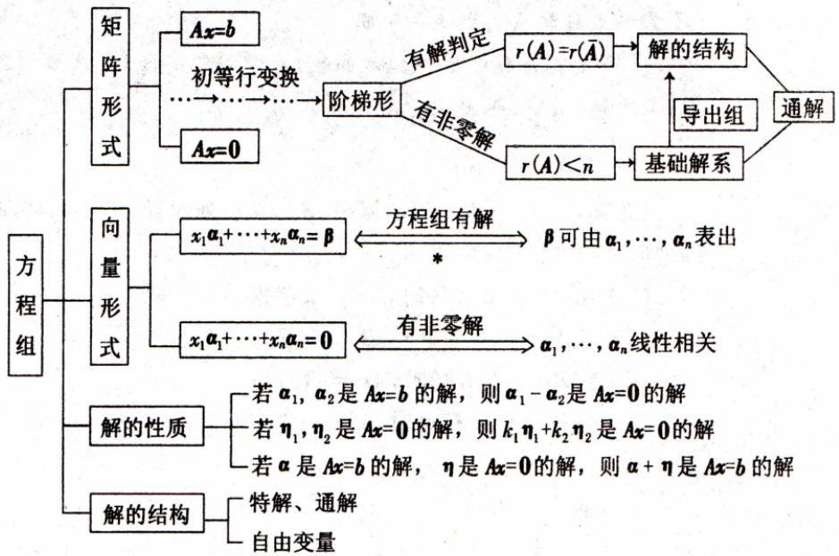
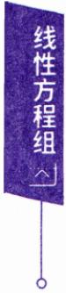
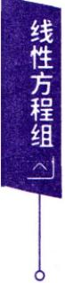

# 第四章 线性方程组重点，别马虎大意

## 一、知识结构网络图

如有方程组就加减消 $ 元$ 、讨论参数，求解.

如没有方程组大概需求秩，用解的结构分析推理来求解.

$$
\boldsymbol{x} \boldsymbol{A} \boldsymbol{x} = \boldsymbol{b} \Leftrightarrow \left[ \boldsymbol{\alpha}_{1}, \boldsymbol{\alpha}_{2}, \cdots, \boldsymbol{\alpha}_{n} \right] \begin{bmatrix} x_{1} \\ x_{2} \\ \vdots \\ x_{n} \end{bmatrix} = \boldsymbol{\beta}
$$

$$
\Leftrightarrow x_{1}\boldsymbol{\alpha}_{1} + x_{2}\boldsymbol{\alpha}_{2} + \cdots + x_{n}\boldsymbol{\alpha}_{n} = \boldsymbol{\beta}
$$

$\boldsymbol{A}\boldsymbol{x} = \boldsymbol{b}$ 有解⇐β可由 $\boldsymbol{\alpha}_{1}, \boldsymbol{\alpha}_{2}, \cdots, \boldsymbol{\alpha}_{n}$ 线性表示

$$
\Leftrightarrow r(\boldsymbol{\alpha}_{1},\boldsymbol{\alpha}_{2},\cdots,\boldsymbol{\alpha}_{n})=r(\boldsymbol{\alpha}_{1},\boldsymbol{\alpha}_{2},\cdots,\boldsymbol{\alpha}_{n},\boldsymbol{\beta})
$$

【编者注】线性方程组在线性代数中地位重要，是考研热点之一.这一部分解题的思路比较清晰，但往届考生中有些同学忽视基本运算对概念的理解上亦有偏差，因此出错率较高，常犯低级错误.

(1)理解线性方程组解的概念.

(2)非齐次线性方程组 $A x = b$ 可能有解(唯一解或无穷多解)，亦可能无解，要理解方程组有解的充要条件是秩 $r(\boldsymbol{A}) = r(\overline{\boldsymbol{A}})$

(3)n元齐次方程组 $Ax = 0$ 必有零解，问题是除去零解之外是否还有其他的解(即非零解)?判断方法是检查 $r(A) < n$ ，特殊情况可检查行列$\vert A \vert = 0$

要理解基础解系这一概念，其实它就是解向量的极大线性无关组，要掌握基础解系的求法与证明.

(4)要熟悉线性方程组解的性质，掌握解的结构，熟练运用初等行变换求通解(特解、导出组的基础解系).

## 今年考题

(2026,1)设A,B为n阶矩阵，β是n维列向量.若A的列向量组可由B 的列向量组线性表示，则

(A)当 $\boldsymbol{A}\boldsymbol{x} = \boldsymbol{\beta}$ 有解时， $\boldsymbol{B}\boldsymbol{x} = \boldsymbol{\beta}$ 有解.

(B)当 $\boldsymbol{A}^{\mathrm{T}} \boldsymbol{x} = \boldsymbol{\beta}$ 有解时， $\boldsymbol{B}^{\mathrm{T}} \boldsymbol{x} = \boldsymbol{\beta}$ 有解.

(C)当 $\boldsymbol{B}\boldsymbol{x} = \boldsymbol{\beta}$ 有解时， $Ax = \boldsymbol{\beta}$ 有解.

(D)当 $\boldsymbol{B}^{\mathrm{T}} \boldsymbol{x} = \boldsymbol{\beta}$ 有解时， $\boldsymbol{A}^{\mathrm{T}} \boldsymbol{x} = \boldsymbol{\beta}$ 有解.

## 基础知识

方程组

$$
\begin{cases}a_{11}x_{1} + a_{12}x_{2} + \cdots + a_{1n}x_{n} = b_{1}, \\a_{21}x_{1} + a_{22}x_{2} + \cdots + a_{2n}x_{n} = b_{2}, \\\vdots \quad \vdots \quad \vdots \\a_{m1}x_{1} + a_{m2}x_{2} + \cdots + a_{mn}x_{n} = b_{m}.\end{cases}\tag{4.1}
$$

称为n个未知数m个方程的非齐次线性方程组，其中 $x_{1},x_{2},\cdots,x_{n}$ 代表n个未知量，m是方程的个数，m可以等于n，也可以大于n或者小于 $n , a_{ij}$ 是第$i \left( i = 1 , 2 , \cdots , m \right)$ 个方程中 $x_{j}(j = 1,2,\cdots,n)$ 的系数， $b_{i}(i = 1,2,\cdots,m)$ 是第i个方程的常数项.

如果 $b_{i}=0(\forall i=1,2,\cdots,m)$ ,则称方程组

$$
\begin{cases}a_{11}x_{1} + a_{12}x_{2} + \cdots + a_{1n}x_{n} = 0, \\a_{21}x_{1} + a_{22}x_{2} + \cdots + a_{2n}x_{n} = 0, \\\vdots \quad \vdots \quad \vdots \\a_{m1}x_{1} + a_{m2}x_{2} + \cdots + a_{mn}x_{n} = 0.\end{cases}\tag{4.2}
$$

为齐次线性方程组.它是方程组(4.1)的导出组(也称(4.2)为(4.1)对应的 齐次线性方程组).

若用一组数 $c_{1},c_{2},\cdots,c_{n}$ 分别代替方程组(4.1)中的 $x_{1},x_{2},\cdots,x_{n}$ ,使式(4.1)中m个等式都成立，则称有序数组 $(c_1, c_2, \cdots, c_n)$ 是方程组(4.1)的一组解.解方程就是要找出方程组的全部解.

线性方程组(4.1)的全体系数及常数项所构成的矩阵

$$
\overline{A} = \begin{bmatrix}a_{11} & a_{12} & \cdots & a_{1n} & b_{1} \\a_{21} & a_{22} & \cdots & a_{2n} & b_{2} \\\vdots & \vdots & & \vdots & \vdots \\a_{m1} & a_{m2} & \cdots & a_{mn} & b_{m}\end{bmatrix}
$$

称为方程组(4.1)的增广矩阵，而由全体系数组成的矩阵

$$
\boldsymbol{A} = \begin{bmatrix}a_{11} & a_{12} & \cdots & a_{1n} \\a_{21} & a_{22} & \cdots & a_{2n} \\\vdots & \vdots & & \vdots \\a_{m1} & a_{m2} & \cdots & a_{mn}\end{bmatrix}
$$

称为方程组(4.1)的系数矩阵.

方程组(4.1)可以用矩阵表示为： $\boldsymbol{A}\boldsymbol{x} = \boldsymbol{b}$ ,其中 $\boldsymbol{x} = (x_{1}, x_{2}, \cdots, x_{n})^{\mathrm{T}}$ $\boldsymbol{b} = (b_1, b_2, \cdots, b_m)^{\mathrm{T}}$

如果两个方程组有相同的解集合，则称它们是同解方程组.

(1)用一个非零常数乘方程的两边.

(2)把某方程的k倍加到另一方程上.

(3)互换两个方程的位置.

线性方程组经初等变换化为阶梯形方程组后，每个方程中的第一个未知量通常称为主变量，其余的未知量称为自由变量.

例如，对增广矩阵作初等行变换，化为

$$
\overline{A} \rightarrow \cdots \rightarrow \begin{bmatrix} 1 & 0 & 3 & 2 & -1 \vdots 3 \\ & 5 & 6 & 0 & 1 \vdots 9 \\ & & & & 1 \vdots 2 \end{bmatrix},
$$

则 $x_{1},x_{2},x_{5}$ 为主变量， $x_{3},x_{4}$ 为自由变量.

定义4.2 向量组 $\eta_{1}, \eta_{2}, \cdots, \eta_{t}$ 称为齐次线性方程组 $Ax = \mathbf{0}$ 的基础解系，如果

(1) $\eta_{1}, \eta_{2}, \cdots, \eta_{t}$ 是 $Ax = \mathbf{0}$ 的解.

(2) $\eta_{1}, \eta_{2}, \cdots, \eta_{t}$ 线性无关.

(3) $Ax = \mathbf{0}$ 的任一解都可由 $\eta_{1}, \eta_{2}, \cdots, \eta_{t}$ 线性表出.

如果 $\eta_{1}, \eta_{2}, \cdots, \eta_{t}$ 是齐次线性方程组 $Ax = \mathbf{0}$ 的一组基础解系，那么，对任意常数 $c_{1},c_{2},\cdots,c_{t}$

$$
c_{1} \boldsymbol{\eta}_{1} + c_{2} \boldsymbol{\eta}_{2} + \cdots + c_{t} \boldsymbol{\eta}_{t}
$$

是齐次方程组 $Ax = \mathbf{0}$ 的通解.

注意： $Ax = \mathbf{0}$ 的基础解系是不唯一的.

## 主要定理

定理4.1 线性方程组的初等行变换把线性方程组变成与它同解的方程组.

定理4.2设n元线性方程组为(4.1)，对它的增广矩阵施行高斯消元法，得到阶梯形矩阵

$$
\overline{A} \rightarrow \cdots \rightarrow \left[ \begin{matrix}c_{11} & c_{12} & \cdots & c_{1r} & \cdots & c_{1n} \vdots & d_{1} \\& c_{22} & \cdots & c_{2r} & \cdots & c_{2n} \vdots & d_{2} \\& & \ddots & \vdots & & \vdots & \vdots \\& & & c_{r} & \cdots & c_{m} \vdots & d_{r} \\& & & & \cdots & 0 \vdots & d_{r+1} \\& & & & \ddots & \vdots & \vdots \\& & & & & \vdots & 0 \\\end{matrix} \right].
$$

如果 $d_{r + 1} \neq 0$ ，方程组(4.1)无解；如果 $d_{r + 1} = 0$ ，方程组有解，而且当$r = n$ 时有唯一解，当 $r < n$ 时有无穷多解.

$$
\Leftrightarrow r(\boldsymbol{A}) < n
$$

⇔A的列向量线性相关.

推论1当 $m < n$ 即方程的个数<未知数的个数）时，齐次线性方程组(4.2)必有非零解，

推论2当 m =n时，齐次线性方程组(4.2)有非零解的充分必要条件是行列式 $\left| \textbf{A} \right| = 0$

定理4.4 设齐次线性方程组(4.2)系数矩阵的秩 $r(\boldsymbol{A}) = r < n$ ,则$Ax = \mathbf{0}$ 的基础解系由 $n - r(\mathbf{A})$ 个线性无关的解向量所构成.

## 定理4.5 (有解判定定理)

非齐次线性方程组Ax= b有解的充分必要条件是其系数矩阵和增广矩阵的秩相等，即 $r(\boldsymbol{A}) = r(\overline{\boldsymbol{A}})$

若 $r(\boldsymbol{A}) = r(\overline{\boldsymbol{A}}) = n$ ，则方程组有唯一解；

若 $r(\boldsymbol{A}) = r(\overline{\boldsymbol{A}}) < n$ ，则方程组有无穷多解.

非齐次线性方程组 Ax = b 无解 $r(\boldsymbol{A}) + 1 = r(\overline{\boldsymbol{A}})$

⇐b不能由A 的列向量线性表出.

定理4.6 (解的性质)

(1)如果 η1，η2是齐次线性方程组 Ax = 0的两个解，那么其线性组合仍是该齐次线性方程组 Ax = 0的解.

(2) 如果 α,β是线性方程组Ax = b 的两个解，则 $\alpha - \beta$ 是导出组 $\boldsymbol{A} \boldsymbol{x} =$ 0的解.

(3) 如果α是线性方程组Ax = b的解，η是导出组 $Ax = \mathbf{0}$ 的解，则a+η 是 Ax = b 的解.

定理4.7 (解的结构)

对非齐次线性方程组 $Ax = b$ ,若 $r(\boldsymbol{A}) = r(\overline{\boldsymbol{A}}) = r$ ，且已知 $\eta_{1}, \eta_{2}, \cdots$ $\eta _ { n - r }$ 是导出组 $\boldsymbol{A} \boldsymbol{x} = \boldsymbol{0}$ 的基础解系， $\zeta _ { 0 }$ 是Ax=b的某个已知解，则 $\boldsymbol{A}\boldsymbol{x} = \boldsymbol{b}$ 的通解为

$\xi _ { 0 } + c _ { 1 } \eta _ { 1 } + c _ { 2 } \eta _ { 2 } + \cdots + c _ { n - r } \eta _ { n - r }$ ,其中 $c_{1},c_{2},\cdots,c_{n-r}$ 为任意常数.

学习札记

## 三、典型例题分析选讲

## 基础解系,n—r(A)

展示新知

【例4.1】求齐次方程组

$$
\begin{cases}x_{1} + x_{2} \quad + 3x_{4} - x_{5} = 0, \\\quad 2x_{2} + x_{3} + 4x_{4} + x_{5} = 0, \\x_{1} + 3x_{2} + x_{3} + 4x_{4} + 6x_{5} = 0\end{cases}
$$

线性方程组

的基础解系.

解先进行行变换把系数矩阵化为阶梯形

$$
\boldsymbol { A } = \begin{bmatrix} 1 & 1 & 0 & 3 & - 1 \\ 0 & 2 & 1 & 4 & 1 \\ 1 & 3 & 1 & 4 & 6 \end{bmatrix} \xrightarrow { } \begin{bmatrix} 1 & 1 & 0 & 3 & - 1 \\ 0 & 2 & 1 & 4 & 1 \\ 0 & 2 & 1 & 1 & 7 \end{bmatrix} \xrightarrow { } \begin{bmatrix} 1 & 1 & 0 & 3 & - 1 \\ 0 & 2 & 1 & 4 & 1 \\ 0 & 0 & 0 & 1 & - 2 \end{bmatrix}.
$$

(方法一) 化为行最简

$$
\boldsymbol{A} \xrightarrow{} \begin{bmatrix} 1 & 1 & 0 & 0 & 5 \\ 0 & 2 & 1 & 0 & 9 \\ 0 & 0 & 0 & 1 & -2 \end{bmatrix} \xrightarrow{} \begin{bmatrix} 1 & 1 & 0 & 0 & 5 \\ 0 & 1 & \frac{1}{2} & 0 & \frac{9}{2} \\ 0 & 0 & 0 & 1 & -2 \end{bmatrix} \xrightarrow{} \begin{bmatrix} 1 & 0 & -\dfrac{1}{2} & 0 & \dfrac{1}{2} \\ & & & & \\ 0 & 1 & \dfrac{1}{2} & 0 & \frac{9}{2} \\ 0 & 0 & 0 & \therefore & 1 & -2 \end{bmatrix}.
$$

主 $x_{1},x_{2},x_{4}$ 自由变量 $\cdot x _ { 3 }   , x _ { 5 }$

$$
n - r(A) = 5 - 3 = 2.
$$

基础解系： $\boldsymbol { \eta } _ { 1 } = \left( \frac { 1 } { 2 } , - \frac { 1 } { 2 } , 1 , 0 , 0 \right) ^ { \mathrm { T } } , \boldsymbol { \eta } _ { 2 } = \left( - \frac { 1 } { 2 } , - \frac { 9 } { 2 } , 0 , 2 , 1 \right) ^ { \mathrm { T } }$

(方法二)化出单位阵

$$
\boldsymbol { A } \xrightarrow { } \begin{bmatrix} 1 & 1 & 0 & 3 & - 1 \\ 0 & 2 & 1 & 4 & 1 \\ 0 & 0 & 0 & 1 & - 2 \end{bmatrix} \xrightarrow { } \begin{bmatrix} 1 & 1 & 0 & 0 & 5 \\ 0 & 2 & 1 & 0 & 9 \\ 0 & 0 & 0 & 1 & - 2 \end{bmatrix}.
$$

单位阵1,3，4列，自由变量 $x_{2},x_{5},n-r(A)=5-3=2.$

基础解系 $\xi_{1} = (-1,1,-2,0,0)^{\mathrm{T}}, \xi_{2} = (-5,0,-9,2,1)^{\mathrm{T}}.$

(方法三)当然也可由阶梯形直接求解

$$
\boldsymbol{A} \rightarrow \begin{bmatrix} 1 & 1 & 0 & 3 & - 1 \\ 0 & 2 & 1 & 4 & 1 \\ 0 & 0 & 0 & 1 & - 2 \end{bmatrix}.
$$

因 $\begin{vmatrix} 1 & 1 & 3 \\ 0 & 2 & 4 \\ 0 & 0 & 1 \end{vmatrix} \neq 0$ ,可选 $x _ { 3 }   , x _ { 5 }$ 为自由变量.

$$
x_{3}=1,x_{5}=0 \Rightarrow x_{4}=0,x_{2}=-\frac{1}{2},x_{1}=\frac{1}{2},
$$

$$
x_{3}=0,x_{5}=1 \Rightarrow x_{4}=2,x_{2}=-\frac{9}{2},x_{1}=-\frac{1}{2}.
$$

即方法一中的 $\eta _ { 1 } , \eta _ { 2 }$

由 $\begin{vmatrix} 1 & 0 & 3 \\ 0 & 1 & 4 \\ 0 & 0 & 1 \end{vmatrix} \neq 0$ ,选 $x_{2},x_{5}$ 为自由变量.

可得出方法二中的 $\xi _ { 1 } , \xi _ { 2 }$

【评注】求基础解系是一重要的基本功，希望大家认真对待，要正确、熟练，3种求法要会灵活运用.注意基础解系是解向量的极大线性无关组，答案是不唯一的.例 $\eta _ { 1 } , \eta _ { 2 }$ 与 $\xi_{1},\xi_{2}$

展示新知

【例4.2】（2004,1）设有齐次线性方程组

$$
\left\{ \begin{array} { c } ( 1 + a ) x _ { 1 } + x _ { 2 } + \cdots + x _ { n } = 0 , \\ 2 x _ { 1 } + ( 2 + a ) x _ { 2 } + \cdots + 2 x _ { n } = 0 , \\ \vdots \quad \vdots \quad \vdots \\ n x _ { 1 } + n x _ { 2 } + \cdots + ( n + a ) x _ { n } = 0 \end{array} \right.
$$

$$
( n \geq 2 ) ,
$$

试问a为何值时，该方程组有非零解?并求其通解.

线性方程组区

解对系数矩阵作初等行变换，有

$$
\boldsymbol{A} = \begin{bmatrix} 1 + a & 1 & 1 & \cdots & 1 \\ 2 & 2 + a & 2 & \cdots & 2 \\ 3 & 3 & 3 + a & \cdots & 3 \\ \vdots & \vdots & \vdots & & \vdots \\ n & n & n & \cdots & n + a \end{bmatrix} \rightarrow \begin{bmatrix} 1 + a & 1 & 1 & \cdots & 1 \\ - 2a & a & 0 & \cdots & 0 \\ - 3a & 0 & a & \cdots & 0 \\ \vdots & \vdots & \vdots & & \vdots \\ - m & 0 & 0 & \cdots & a \end{bmatrix} = \boldsymbol{B},
$$

(1) 若 $a = 0$ ,秩 $r(\boldsymbol{A}) = 1$ ，方程组有非零解，其同解方程组为

$$
x_{1} + x_{2} + \cdots + x_{n} = 0.
$$

由此得基础解系为

$$
\eta_{1} = (-1,1,0,\cdots,0)^{\mathrm{T}}, \eta_{2} = (-1,0,1,\cdots,0)^{\mathrm{T}}, \cdots, \eta_{n-1} = (-1,0,0,\cdots,1)^{\mathrm{T}},
$$

所以方程组的通解是

$k_{1}\eta_{1}+k_{2}\eta_{2}+\cdots+k_{n-1}\eta_{n-1}(k_{1},k_{2},\cdots,k_{n-1}$ 为任意常数).

(2) 若 $a \ne 0$ ，对矩阵B继续作初等行变换，有

学习礼记

$$
\boldsymbol { B } \rightarrow \left[ \begin{aligned} & 1 + a & 1 & 1 & \cdots & 1 \\ & - 2 & 1 & 0 & \cdots & 0 \\ & - 3 & 0 & 1 & \cdots & 0 \\ & \vdots & \vdots & \vdots & & \vdots \\ & - n & 0 & 0 & \cdots & 1 \end{aligned} \right] \rightarrow \left[ \begin{aligned} a + \frac{1}{2}n(n + 1) & \quad 0 & \quad 0 & \quad \cdots & 0 \\ & - 2 & 1 & 0 & \quad \cdots & 0 \\ & - 3 & 0 & 1 & \quad \cdots & 0 \\ & \vdots & \vdots & \vdots & & & \vdots \\ & - n & 0 & 0 & \cdots & 1 \end{aligned} \right] ,
$$

故当 $a = - \frac{1}{2}n(n + 1)$ 时，秩 $r(\boldsymbol{A}) = n - 1 < n$ ，方程组也有非零解.其同解 方程组为

线性方程组

$$
\begin{cases}- 2x_{1} + x_{2} = 0, \\- 3x_{1} + x_{3} = 0, \\\quad \vdots \quad \vdots \\- nx_{1} + x_{n} = 0, \\\boldsymbol{\eta} = (1,2,\cdots,n)^{\mathrm{T}},\end{cases}
$$

得基础解系为

于是方程组的通解为kη，k为任意常数.

或者，由于系数行列式

$$
\left| \boldsymbol{A} \right| = \left| \begin{matrix} 1 + a & 1 & \cdots & 1 \\ 2 & 2 + a & \cdots & 2 \\ \vdots & \vdots & & \vdots \\ n & n & \cdots & n + a \end{matrix} \right| = a^{n - 1}\left[ a + \frac{1}{2}(n + 1)n \right],
$$

故 $Ax = \mathbf{0}$ 有非零解 $\Leftrightarrow \left| \textbf{A} \right| = 0$

$$
\Leftrightarrow a = 0   或   a = -\frac{1}{2}(n + 1)n.
$$

再分别讨论求解.

展示新知

【例4.3】已知 $\boldsymbol { \eta } _ { 1 } = ( 1 , 1 , 2 , 3 ) ^ { \mathrm { T } } , \boldsymbol { \eta } _ { 2 } = ( 5 , - 1 , - 8 , 9 ) ^ { \mathrm { T } }$ 是Ax0的基础解系，对 $\boldsymbol{a}_{1}=(1,1,-4,1)^{\mathrm{T}}, \boldsymbol{a}_{2}=(-2,1,5,-3)^{\mathrm{T}}, \boldsymbol{a}_{3}=(1,$ $(2,7,0)^{\mathrm{T}}, \boldsymbol{\alpha}_{1} = (0,1,3,1)^{\mathrm{T}}$ $A x = 0$ 的基础解系可以是

$$
( \boldsymbol { A } ) k _ { 1 } \boldsymbol { \alpha } _ { 1 } + k _ { 2 } \boldsymbol { \alpha } _ { 2 } , \forall k _ { 1 } , k _ { 2 } .
$$

(B) $\boldsymbol{a}_{1}+\boldsymbol{a}_{2},\boldsymbol{a}_{3}+\boldsymbol{a}_{4}.$

(C $( a _ { 1 } , a _ { 2 } )$ 的等价向量组.

(D) $2\alpha_{1} - \alpha_{4}, \alpha_{1} + \alpha_{4}.$

分析如 $\pmb { \alpha } _ { i }$ 是 $Ax = \mathbf{0}$ 的解 $\Leftrightarrow \boldsymbol{a}_{i}$ 可由 $\pmb { \eta } _ { 1 } , \pmb { \eta } _ { 2 }$ 线性表出.

$$
\begin{aligned}\left[ \boldsymbol{\eta}_{1}, \boldsymbol{\eta}_{2} \vdots \boldsymbol{\alpha}_{1}, \boldsymbol{\alpha}_{2}, \boldsymbol{\alpha}_{3}, \boldsymbol{\alpha}_{4} \right]&=\begin{bmatrix}1 & 5 & \vdots & 1 & -2 & 1 & 0 \\1 & -1 & \vdots & -1 & 1 & 2 & 1 \\2 & -8 & \vdots & -4 & 5 & 7 & 3 \\3 & 9 & \vdots & 1 & -3 & 0 & 1\end{bmatrix}, \\&\xrightarrow{ 分别得到 }\begin{bmatrix}1 & 5 & \vdots & -2 & 1 & 0 \\0 & 6 & \vdots & 2 & -3 & -1 & -1 \\0 & 0 & \vdots & 0 & 0 & 1 & 0 \\0 & 0 & 0 & 0 & 0 & 0\end{bmatrix},\end{aligned}
$$

仅 $\pmb { \alpha } _ { 3 }$ 不是 $Ax = \mathbf{0}$ 的解，那么 $\boldsymbol{a}_{3}+\boldsymbol{a}_{4}$ 不是 $Ax = \mathbf{0}$ 的解，排除(B)；

(A) 是 $Ax = \mathbf{0}$ 的通解，排除(A)；

学习札记

$\eta_{1}, \eta_{2}, \alpha_{4}$ 与 $\boldsymbol{\alpha}_{1} , \boldsymbol{\alpha}_{2}$ 等价，但 $\eta_{1}, \eta_{2}, \alpha_{4}$ 线性相关，排除(C)；

故应选(D).

或直接地， $2\boldsymbol{\alpha}_{1}-\boldsymbol{\alpha}_{4},\boldsymbol{\alpha}_{1}+\boldsymbol{\alpha}_{4}$ 是 $A\boldsymbol{x} = \boldsymbol{0}$ 的解.

利用坐标 $(2, -3, -11, 1)^{\mathrm{T}}, (1, 0, -1, 2)^{\mathrm{T}}$ 或秩

$$
\left( 2 \boldsymbol { \alpha } _ { 1 } - \boldsymbol { \alpha } _ { 4 } , \boldsymbol { \alpha } _ { 1 } + \boldsymbol { \alpha } _ { 4 } \right) = \left( \boldsymbol { \alpha } _ { 1 } , \boldsymbol { \alpha } _ { 4 } \right) \begin{bmatrix} 2 & 1 \\ - 1 & 1 \end{bmatrix},
$$

可知 $2\alpha_{1} - \alpha_{4}, \alpha_{1} + \alpha_{4}$ 线性无关，且向量个数2符合要求.

展示新知 展小机

【例4.4】已知A是三阶非零矩阵 $a _ { 1 } , a _ { 2 } , a _ { 3 }$ 是非齐次线性方程组$A x = b$ 的3个线性无关的解.证明 $\alpha_{1} - \alpha_{2}, \alpha_{1} - \alpha_{3}$ 是齐次方程组 $A x = 0$ 的基础解系.

证明因 $\boldsymbol{a}_{1}, \boldsymbol{a}_{2}, \boldsymbol{a}_{3}$ 是方程组 $\boldsymbol{A}\boldsymbol{x} = \boldsymbol{b}$ 的解.由解的性质知 $\boldsymbol{\alpha}_{1}-\boldsymbol{\alpha}_{2},\boldsymbol{\alpha}_{1}-$ $\pmb { \alpha } _ { 3 }$ 是相应 Ax = 0 的解. 若

$$
k _ { 1 } \left( \boldsymbol { \alpha } _ { 1 } - \boldsymbol { \alpha } _ { 2 } \right) + k _ { 2 } \left( \boldsymbol { \alpha } _ { 1 } - \boldsymbol { \alpha } _ { 3 } \right) = 0 ,\tag{}
$$

即 $\left( \boldsymbol{k}_{1} + \boldsymbol{k}_{2} \right) \boldsymbol{\alpha}_{1} - \boldsymbol{k}_{1} \boldsymbol{\alpha}_{2} - \boldsymbol{k}_{2} \boldsymbol{\alpha}_{3} = \mathbf{0}$ ,因 $\boldsymbol{a}_{1}, \boldsymbol{a}_{2}, \boldsymbol{a}_{3}$ 线性无关，故

$$
\begin{cases}k_{1} + k_{2} = 0, \\- k_{1} = 0, \\- k_{2} = 0,\end{cases}
$$

故必有 $k_{1} = 0 , k_{2} = 0$ ,从而 $\boldsymbol{a}_{1}-\boldsymbol{a}_{2}, \boldsymbol{a}_{1}-\boldsymbol{a}_{3}$ 线性无关.

·又 $A \ne \mathbf{O}$ 有 $r(\mathbf{A}) \geqslant 1$

而Ax= 0已有2个线性无关的解，知 $n - r(\boldsymbol{A}) \geqslant 2$ ,亦即 $r(A) \leqslant 1$ 从而 r(A) = 1. 那么 $n - r(\boldsymbol{A}) = 3 - 1 = 2.$   
因此 $\boldsymbol{\alpha}_{1}-\boldsymbol{\alpha}_{2},\boldsymbol{\alpha}_{1}-\boldsymbol{\alpha}_{3}$ 是 $Ax = \mathbf{0}$ 的基础解系.

【评注】要证明 $\alpha_{1}, \alpha_{2}, \cdots, \alpha_{t}$ 是Ax= 0的基础解系，需要：

(1) 验证 $\alpha_{1}, \alpha_{2}, \cdots, \alpha_{t}$ 是 $\boldsymbol{A}\boldsymbol{x} = \boldsymbol{0}$ 的解.

(2) 证明 $\alpha_{1}, \alpha_{2}, \cdots, \alpha_{t}$ 线性无关.

(3) $t = n - r(\boldsymbol{A}).$

练习1 $(2019, \frac{2}{3})$ 设A是四阶矩阵 $, \boldsymbol{A}^{*}$ 为A的伴随矩阵，若线性方程组Ax=0的基础解系中只有2个向量，则 $r(\boldsymbol{A}^{*}) =$ (A)0. (B)1. (C)2. (D)3.

解题笔记

学习札记

练习2(2004,3)设n阶矩阵A的伴随矩阵 $\boldsymbol{A}^{*} \neq \boldsymbol{O}$ 若 $\xi_{1}, \xi_{2}, \xi_{3}, \xi_{4}$ 是 非齐次线性方程组Ax= b的互不相等的解，则对应的齐次线性方程组 $\boldsymbol{A}\boldsymbol{x} = \boldsymbol{0}$ 的基础解系

(A) 不存在. (B) 仅含一个非零解向量.

(C)含有两个线性无关的解向量. (D)含有三个线性无关的解向量. 解题笔记

练习3 $(2020,\frac{2}{3})$ 设四阶矩阵 $A = \left[ a_{ij} \right]$ 不可逆 $, a _ { 1 2 }$ 的代数余子式 $A_{12} \ne 0, \boldsymbol{\alpha}_{1}, \boldsymbol{\alpha}_{2}, \boldsymbol{\alpha}_{3}, \boldsymbol{\alpha}_{4}$ 为矩阵A的列向量组 $, \boldsymbol{A}^{*}$ 为A的伴随矩阵，则方程组 $\boldsymbol{A}^{*} \boldsymbol{x} = \boldsymbol{0}$ 的通解为

(A) $\boldsymbol{x} = k_{1} \boldsymbol{\alpha}_{1} + k_{2} \boldsymbol{\alpha}_{2} + k_{3} \boldsymbol{\alpha}_{3}$ ,其中 $k_{1},k_{2},k_{3}$ 为任意常数.

(B) $\boldsymbol{x} = k_{1} \boldsymbol{\alpha}_{1} + k_{2} \boldsymbol{\alpha}_{2} + k_{3} \boldsymbol{\alpha}_{4}$ ,其中 $k_{1},k_{2},k_{3}$ 为任意常数.

(C) $\boldsymbol{x} = k_{1} \boldsymbol{\alpha}_{1} + k_{2} \boldsymbol{\alpha}_{3} + k_{3} \boldsymbol{\alpha}_{4}$ ,其中 $k_{1},k_{2},k_{3}$ 为任意常数.

解题笔记

(D) $\boldsymbol{x} = k_{1} \boldsymbol{\alpha}_{2} + k_{2} \boldsymbol{\alpha}_{3} + k_{3} \boldsymbol{\alpha}_{4}$ ,其中 $k_{1},k_{2},k_{3}$ 为任意常数.

# 解方程组 Ax = b,解的结构

## 1. 要会解方程组，会处理参数

展示新知

【例4.5】解方程组

$$
\begin{cases}x_{1} - x_{2} + 2x_{3} + x_{4} = 1, \\2x_{1} - x_{2} + x_{3} + 2x_{4} = 3, \\x_{1} - x_{3} + x_{4} = 2,\end{cases}
$$

并求满足 $x _ { 1 } = - x _ { 2 }$ 的所有解.

## 解对增广矩阵作初等行变换

$$
\overline{\boldsymbol{A}} = \begin{bmatrix} 1 & -1 & 2 & 1 \vdots \\ 2 & -1 & 1 & 2 \vdots \\ 1 & 0 & -1 & 1 \vdots 2 \end{bmatrix} \rightarrow \begin{bmatrix} 1 & -1 & 2 & 1 \vdots 1 \\ 0 & 1 & -3 & 0 \vdots 1 \\ 0 & 0 & 0 & 0 \vdots 0 \end{bmatrix} \rightarrow \begin{bmatrix} 1 & 0 & -1 & 1 \vdots 2 \\ & 1 & -3 & 0 \vdots 1 \\ & & & \vdots 1 \\ & & & 0 \vdots 0 \end{bmatrix},
$$

$r(\boldsymbol{A}) = r(\overline{\boldsymbol{A}}) = 2 < 4$ ，方程组有无穷多解.

(方法一)由同解方程组

$$
\left\{ \begin{aligned} x_{1} &= x_{3} - x_{4} + 2, \\ x_{2} &= 3x_{3} + 1, \end{aligned} \right.
$$

区 $x_{3}=k_{1},x_{4}=k_{2} \Rightarrow x_{2}=3k_{1}+1,x_{1}=k_{1}-k_{2}+2$ ,方程组的通解为

$$
\boldsymbol{x} = \begin{bmatrix} \boldsymbol{k}_{1} - \boldsymbol{k}_{2} + 2 \\ 3\boldsymbol{k}_{1} + 1 \\ \boldsymbol{k}_{1} \\ \boldsymbol{k}_{2} \end{bmatrix} = \boldsymbol{k}_{1} \begin{bmatrix} 1 \\ 3 \\ 1 \\ 0 \end{bmatrix} + \boldsymbol{k}_{2} \begin{bmatrix} -1 \\ 0 \\ 0 \\ 1 \end{bmatrix} + \begin{bmatrix} 2 \\ 1 \\ 0 \\ 0 \end{bmatrix} , \boldsymbol{k}_{1} , \boldsymbol{k}_{2}
$$

为任意常数.

或(方法二),根据解的结构

$$
\begin{aligned} &\overline{A} \rightarrow \begin{bmatrix} 1 & 0 & -1 & 1 & \vdots \\&1 & -3 & 0 & \vdots \\&  &  & \vdots & 1 \\&  &  &  & 0 & \vdots \\&\end{bmatrix}, n - r(A) = 4 - 2 = 2,\\ \end{aligned}
$$

主元 $\cdot x_{1} , x_{2}$ ;自由变量 $x_{3},x_{4}$ .特解 $\boldsymbol{a} = (2,1,0,0)^{\mathrm{T}} \cdot \boldsymbol{A} \boldsymbol{x} = \boldsymbol{0}$ 的基础解系为

$$
\boldsymbol { \eta } _ { 1 } = ( 1 , 3 , 1 , 0 ) ^ { \mathrm { T } } , \boldsymbol { \eta } _ { 2 } = ( - 1 , 0 , 0 , 1 ) ^ { \mathrm { T } }.
$$

方程组的通解为 $\boldsymbol{x} = \boldsymbol{\alpha} + k_{1} \boldsymbol{\eta}_{1} + k_{2} \boldsymbol{\eta}_{2}, k_{1}, k_{2}$ 为任意常数.

由通解，若 $x_{1} = - x_{2}$ ,则

$$
k_{1}-k_{2}+2=-(3k_{1}+1)\Rightarrow k_{2}=4k_{1}+3,
$$

于是

$$
\boldsymbol{x} = \begin{bmatrix} 2 \\ 1 \\ 0 \\ 0 \end{bmatrix} + k_1 \begin{bmatrix} 1 \\ 3 \\ 1 \\ 0 \end{bmatrix} + (4k_1 + 3) \begin{bmatrix} -1 \\ 0 \\ 0 \\ 1 \end{bmatrix} = \begin{bmatrix} -1 \\ 1 \\ 0 \\ 3 \end{bmatrix} + k_1 \begin{bmatrix} -3 \\ 3 \\ 1 \\ 4 \end{bmatrix}
$$

为任意常数，

学习札记

为方程组满足 $x_{1} = - x_{2}$ 的所有解.

【评注】用 $k _ { 1 }   ,   k _ { 2 }$ 与(0,0)，(1,0)，(0,1) 两种求通解的方法一定要熟练，正确.

展示新知

【例4.6】已知线性方程组

$$
\begin{cases}x_{1} - x_{2} - 2x_{3} + 3x_{4} = 0, \\x_{1} - 3x_{2} - 5x_{3} + 2x_{4} = -1, \\x_{1} + x_{2} + ax_{3} + 4x_{4} = 1, \\x_{1} + 7x_{2} + 10x_{3} + 7x_{4} = b,\end{cases}
$$

讨论参数a，b取何值时，方程组有解、无解；当有解时，试用其导出组的基础解系表示通解

解对增广矩阵作初等行变换，有

$$
\overline{\boldsymbol{A}} = \begin{bmatrix} 1 & -1 & -2 & 3 \vdots & 0 \\ 1 & -3 & -5 & 2 \vdots -1 \\ 1 & 1 & a & 4 \vdots & 1 \\ 1 & 7 & 10 & 7 \vdots & b \end{bmatrix} \xrightarrow{} \begin{bmatrix} 1 & -1 & -2 & 3 \vdots & 0 \\ 0 & 2 & 3 & 1 \vdots & 1 \\ 0 & 0 & a-1 & 0 \vdots & 0 \\ 0 & 0 & 0 & 0 \vdots & b-4 \end{bmatrix}.
$$

当 $b \neq 4$ 时， $\forall a,r(A) \neq r(\overline{A})$ ，方程组无解.

当b =4时，∀a,恒有 $r(\boldsymbol{A}) = r(\overline{\boldsymbol{A}})$ ,方程组有解.

$$
\begin{aligned}& 若    a \neq 1    时 , \overline{\boldsymbol{A}} \xrightarrow{}\begin{bmatrix}1 & -1 & -2 & 3 \vdots 0 \\0 & 2 & 3 & 1 \vdots 1 \\0 & 0 & a-1 & 0 \vdots 0 \\0 & 0 & 0 & 0 \vdots 0\end{bmatrix}\xrightarrow{}\begin{bmatrix}1 & 0 & 0 & \dfrac{7}{2} & \vdots \dfrac{1}{2} \\0 & 1 & 0 & \dfrac{1}{2} & \vdots \dfrac{1}{2} \\0 & 0 & 1 & 0 & \vdots \\0 & 0 & 0 & 0 & 0\end{bmatrix},\end{aligned}
$$

$r(\boldsymbol{A}) = r(\overline{\boldsymbol{A}}) = 3$ ，方程组有无穷多解，通解为

$\left( \frac{1}{2}, \frac{1}{2}, 0, 0 \right)^{\mathrm{T}} + k \left( -\frac{7}{2}, -\frac{1}{2}, 0, 1 \right)^{\mathrm{T}}$ ,k为任意常数.

若a=1时

$$
\begin{aligned} &\mathbf{0} \overline{\boldsymbol{A}} \rightarrow \begin{bmatrix} 1 & -1 & -2 & 3 \vdots 0 \\ 0 & 2 & 3 & 1 \vdots 1 \\ 0 & 0 & 0 & 0 \vdots 0 \\ 0 & 0 & 0 & 0 \vdots 0 \end{bmatrix} \rightarrow \begin{bmatrix} 1 & 0 & -\dfrac{1}{2} & \dfrac{7}{2} & \dfrac{1}{2} \\ 0 & 1 & \dfrac{3}{2} & \dfrac{1}{2} & \dfrac{1}{2} \\ \vdots & \vdots & \vdots & \vdots \\ 0 & 0 & 0 & 0 \vdots 0 \\ 0 & 0 & 0 & 0 \vdots 0 \end{bmatrix},\\ \end{aligned}
$$

$r(\boldsymbol{A}) = r(\overline{\boldsymbol{A}}) = 2$ ，方程组有无穷多解，通解为

$$
\left( \frac{1}{2}, \frac{1}{2}, 0, 0 \right)^{\mathrm{T}} + k_1 \left( \frac{1}{2}, -\frac{3}{2}, 1, 0 \right)^{\mathrm{T}} + k_2 \left( -\frac{7}{2}, -\frac{1}{2}, 0, 1 \right)^{\mathrm{T}},
$$

$k _ { 1 }   ,   k _ { 2 }$ 为任意常数.

【评注】这些都是基础题，要掌握非齐次线性方程组的求解方法：

学习札记

(1)对增广矩阵作初等行变换化为阶梯形矩阵.

(2) 求导出组的一个基础解系.

(3)求方程组的一个特解(为简捷，可令自由变量全为0).

(4)按解的结构写出通解.

注意，当方程组中含有参数时，分析讨论要严谨不要丢情况，此时的特解往往比较烦琐.

展示新知

【例4.7】（2004,4）设线性方程组

$$
\begin{cases}x_{1} + \lambda x_{2} + \mu x_{3} + x_{4} = 0, \\2x_{1} + x_{2} + x_{3} + 2x_{4} = 0, \\3x_{1} + (2 + \lambda)x_{2} + (4 + \mu)x_{3} + 4x_{4} = 1,\end{cases}
$$

已知 $(1, -1, 1, -1)^{\mathrm{T}}$ 是该方程组的一个解.试求

(1)方程组的全部解，并用对应的齐次线性方程组的基础解系表示全部解；

(2) 该方程组满足 $x _ { 2 } = x _ { 3 }$ 的全部解.

解（1）因为 $(1, -1, 1, -1)^{\mathrm{T}}$ 是方程组的一个解，将其代入方程的两端，立即有 $\lambda = \mu.$

对增广矩阵作初等行变换，有

$$
\overline { \boldsymbol { A } } = \begin{bmatrix} 1 & \lambda & \lambda & \cdot 1 \vdots 0 \\ 2 & 1 & 1 & 2 \vdots 0 \\ 3 & 2 + \lambda & 4 + \lambda & 4 \vdots 1 \end{bmatrix} \xrightarrow { } \begin{bmatrix} 1 & 0 & - 2 \lambda & 1 - \lambda & - \lambda \\ 0 & 1 & 3 & 1 & 1 \\ 0 & 0 & 2 ( 2 \lambda - 1 ) & 2 \lambda - 1 & 2 \lambda - 1 \end{bmatrix}.
$$

若 $\lambda = \frac{1}{2}$

$$
\overline{\boldsymbol{A}} \xrightarrow{} \begin{bmatrix} 1 & 0 & -1 & \dfrac{1}{2} \vdots & -\dfrac{1}{2} \\ & & & \vdots \\ 0 & 1 & 3 & 1 \vdots & 1 \\ 0 & 0 & 0 & 0 \vdots & 0 \end{bmatrix},
$$

由 $r(\boldsymbol{A}) = r(\overline{\boldsymbol{A}}) = 2, n - r(\boldsymbol{A}) = 4 - 2 = 2$ ，方程组有无穷多解，其通解为$\left( - \frac { 1 } { 2 } , 1 , 0 , 0 \right) ^ { \mathrm { T } } + k _ { 1 } \left( 1 , - 3 , 1 , 0 \right) ^ { \mathrm { T } } + k _ { 2 } \left( - \frac { 1 } { 2 } , - 1 , 0 , 1 \right) ^ { \mathrm { T } } , k _ { 1 } , k _ { 2 }$ 为任意常数.

若 $\lambda \ne \frac{1}{2}$

$$
\overline { \boldsymbol { A } } \rightarrow \begin{bmatrix} 1 & 0 & - 2 \lambda & 1 - \lambda & \vdots - \lambda \\ 0 & 1 & 3 & 1 & \vdots & 1 \\ 0 & 0 & 2 & 1 & \vdots & 1 \end{bmatrix} \rightarrow \begin{bmatrix} 1 & 0 & 0 & 1 & \vdots & 0 \\ 0 & 1 & 0 & - \frac { 1 } { 2 } & \vdots & - \frac { 1 } { 2 } \\ 0 & 0 & 1 & \frac { 1 } { 2 } & \vdots & \frac { 1 } { 2 } \end{bmatrix},
$$

由 r(A) = r(Ã) = 3, n − r(A) = 4 — 3 = 1,方程组有无穷多解，其通解为$\left( 0 , - \frac { 1 } { 2 } , \frac { 1 } { 2 } , 0 \right) ^ { \mathrm { T } } + k \left( - 1 , \frac { 1 } { 2 } , - \frac { 1 } { 2 } , 1 \right) ^ { \mathrm { T } }$ ,k 为任意常数.

(2) 若 $\lambda = \frac{1}{2}$ ,对于 $x _ { 2 } = x _ { 3 }$ ,由通解知

$$
1 + \left( - 3 k _ { 1 } \right) + \left( - k _ { 2 } \right) = 0 + k _ { 1 } \Rightarrow k _ { 2 } = 1 - 4 k _ { 1 } ,
$$

故所求解为

$( - 1 , 0 , 0 , 1 ) ^ { \mathrm { T } } + k _ { 1 } ( 3 , 1 , 1 , - 4 ) ^ { \mathrm { T } } , k _ { 1 }$ 为任意常数.

若 $\lambda \ne \frac{1}{2}$ ,对于 $x_{2} = x_{3}$ ,由通解知

$$
-\frac{1}{2}+\frac{1}{2}k=\frac{1}{2}-\frac{1}{2}k \Rightarrow k=1,
$$

故所求解为

$$
\left( 0 , - \frac { 1 } { 2 } , \frac { 1 } { 2 } , 0 \right) ^ { \mathrm { T } } + \left( - 1 , \frac { 1 } { 2 } , - \frac { 1 } { 2 } , 1 \right) ^ { \mathrm { T } } = ( - 1 , 0 , 0 , 1 ) ^ { \mathrm { T } } .
$$

【评注】根据题目的具体情况求解.可以是化为阶梯形矩阵用代入来求解，也可以是化为行最简形矩阵直接写答案，要灵活把握.

2.要会用解的结构、解的性质处理抽象的方程组

展示新知

【例4.8】 四元方程组 $A x = b$ 中，系数矩阵的秩 $r(A)=3,a_{1},a_{2},$ $a _ { 3 }$ 是方程组的三个解，若 $\boldsymbol{a}_{1}=(1,1,1,1)^{\mathrm{T}}, \boldsymbol{a}_{2}+\boldsymbol{a}_{3}=(2,3,4,5)^{\mathrm{T}}$ ,则方程组通解为

分析由于 $n - r(A) = 4 - 3 = 1$ ,故方程组通解形式为 $\boldsymbol{\alpha} + k\boldsymbol{\eta}$

因为 $\pmb { \alpha } _ { 1 }$ 是方程组 $\boldsymbol{A}\boldsymbol{x} = \boldsymbol{b}$ 的解，故α可取为 $\pmb { \alpha } _ { 1 }$

如果 $\pmb { \alpha } _ { 1 } , \pmb { \alpha } _ { 2 }$ 是 $\boldsymbol{A}\boldsymbol{x} = \boldsymbol{b}$ 的解，则由 $A \alpha_{1} = \boldsymbol{b}, A \alpha_{2} = \boldsymbol{b}$ 知 $A \left( \boldsymbol{\alpha}_{1} - \boldsymbol{\alpha}_{2} \right) = \boldsymbol{0}$ 即 $\boldsymbol{a}_{1} - \boldsymbol{a}_{2}$ 是 $\boldsymbol{A}\boldsymbol{x} = \boldsymbol{0}$ 的解.由

$$
A \left( \boldsymbol { \alpha } _ { 2 } + \boldsymbol { \alpha } _ { 3 } \right) = A \boldsymbol { \alpha } _ { 2 } + A \boldsymbol { \alpha } _ { 3 } = 2 \boldsymbol { b } , \quad A \left( 2 \boldsymbol { \alpha } _ { 1 } \right) = 2 \boldsymbol { b } ,
$$

知 $A(\boldsymbol{\alpha}_{2} + \boldsymbol{\alpha}_{3} - 2\boldsymbol{\alpha}_{1}) = \boldsymbol{0}$ ,即 $(0,1,2,3)^{\mathrm{T}}$ 是 $Ax = \mathbf{0}$ 的解，所以方程组的通解为 $(1,1,1,1)^{\mathrm{T}} + k(0,1,2,3)^{\mathrm{T}}$ ,k为任意常数.

练习 $(2017, \frac{1}{2})$ 设三阶矩阵 $\boldsymbol{A} = \left[ \boldsymbol{\alpha}_{1} , \boldsymbol{\alpha}_{2} , \boldsymbol{\alpha}_{3} \right]$ 有3个不同的特征值，且 $\boldsymbol{a}_{3}=\boldsymbol{a}_{1}+2 \boldsymbol{a}_{2}$

(1) 证明 $r(\mathbf{A}) = 2$

(2) 若 $\boldsymbol{\beta} = \boldsymbol{\alpha}_{1} + \boldsymbol{\alpha}_{2} + \boldsymbol{\alpha}_{3}$ ，求方程组 $\boldsymbol{A}\boldsymbol{x} = \boldsymbol{\beta}$ 的通解.

本题难度系数0.536，0.422，0.445，区分度0.770,0.757，0.750.

解（1）因 $\boldsymbol{\alpha}_{3}=\boldsymbol{\alpha}_{1}+2\boldsymbol{\alpha}_{2}$ ,知 $\boldsymbol{\alpha}_{1}, \boldsymbol{\alpha}_{2}, \boldsymbol{\alpha}_{3}$ 线性相关，故 $r(\mathbf{A}) \leqslant 2.$ 又因A有3个不同的特征值，

$$
\boldsymbol{A} \sim \boldsymbol{\Lambda} = \begin{bmatrix} \lambda_{1} & & \\ & \lambda_{2} & \\ & & \lambda_{3} \end{bmatrix}.
$$

学习札记

解题笔记

## 3.有些题要求通过矩阵的运算构造出方程组再求解

展示新知

【例4.9】（2000,2）已知

$$
\begin{aligned} &\left\{ \begin{aligned}\\ &\boldsymbol{\alpha} = \begin{bmatrix} 1 \\ 2 \\ 1 \end{bmatrix}, \boldsymbol{\beta} = \begin{bmatrix} 1 \\ 1 \\ 2 \\ 0 \end{bmatrix}, \boldsymbol{\gamma} = \begin{bmatrix} 0 \\ 0 \\ 8 \end{bmatrix}, \boldsymbol{A} = \boldsymbol{\alpha} \boldsymbol{\beta}^{\mathrm{T}},\\ &\end{aligned} \right.\\ \end{aligned}
$$

$B = B ^ { \mathrm { T } } a .$ 求解方程 $2\boldsymbol{B}^{2}\boldsymbol{A}^{2}\boldsymbol{x}=\boldsymbol{A}^{4}\boldsymbol{x}+\boldsymbol{B}^{4}\boldsymbol{x}+\boldsymbol{\gamma}$

解由题设知，

$$
\boldsymbol{A} = \boldsymbol{\alpha} \boldsymbol{\beta}^{\mathrm{T}} = \begin{bmatrix} 1 \\ 2 \\ 1 \end{bmatrix} \left( 1, \frac{1}{2}, 0 \right) = \begin{bmatrix} 1 & \dfrac{1}{2} & 0 \\ & & \\ 2 & 1 & 0 \\ 1 & \dfrac{1}{2} & 0 \end{bmatrix},
$$

$$
\boldsymbol{B} = \boldsymbol{\beta}^{\mathrm{T}} \boldsymbol{\alpha} = \left( 1, \frac{1}{2}, 0 \right) \begin{bmatrix} 1 \\ 2 \\ 1 \end{bmatrix} = 2.
$$

又 $\boldsymbol{A}^{2}=(\boldsymbol{\alpha}\boldsymbol{\beta}^{\mathrm{T}})(\boldsymbol{\alpha}\boldsymbol{\beta}^{\mathrm{T}})=\boldsymbol{\alpha}(\boldsymbol{\beta}^{\mathrm{T}}\boldsymbol{\alpha})\boldsymbol{\beta}^{\mathrm{T}}=2\boldsymbol{A}$ ,于是 $\boldsymbol{A}^{4}=8\boldsymbol{A}$ ，代入原方程，整理有

$$
8(\boldsymbol{A} - 2\boldsymbol{E})\boldsymbol{x} = \boldsymbol{\gamma},
$$

即

$$
\begin{bmatrix} -1 & \dfrac{1}{2} & 0 \\ 2 & -1 & 0 \\ 1 & \dfrac{1}{2} & -2 \end{bmatrix} \begin{bmatrix} x_1 \\ x_2 \\ x_3 \end{bmatrix} = \begin{bmatrix} 0 \\ 0 \\ 1 \end{bmatrix}.
$$

学习札记

线性方程组

对增广矩阵作初等行变换，有

$$
\begin{bmatrix} - 1 & \frac{1}{2} & 0 & \vdots \\ & & \vdots \\ 2 & - 1 & 0 & \vdots \\ & & \vdots \\ 1 & \frac{1}{2} & - 2 & \vdots \\ \end{bmatrix} \twoheadrightarrow \begin{bmatrix} 1 & 0 & - 1 \vdots \\ \vdots \\ 0 & 1 & - 2 \vdots \\ 0 & 0 & 0 \vdots \\ \end{bmatrix},
$$

特解为

$$
\boldsymbol{\alpha} = \left( \frac{1}{2}, 1, 0 \right)^{\mathrm{T}},
$$

基础解系为

$$
\boldsymbol{\eta} = (1,2,1)^{\mathrm{T}},
$$

故方程组的通解为 $\boldsymbol{\alpha} + k\boldsymbol{\eta}, k$ 为任意常数.

## 展示新知

【例4.10】 $( 2 0 1 6 , \frac { 2 } { 3 } )$ 设矩阵 $\boldsymbol{A} = \begin{bmatrix} 1 & 1 & 1 - a \\ 1 & 0 & a \\ a + 1 & 1 & a + 1 \end{bmatrix}, \boldsymbol{\beta} = \begin{bmatrix} 0 \\ 1 \\ 2a - 2 \end{bmatrix},$ 且方程组 $A x = \beta$ 无解.

(1)求a的值；

(2) 求方程组 $\boldsymbol{A}^{\mathrm{T}} \boldsymbol{A} \boldsymbol{x} = \boldsymbol{A}^{\mathrm{T}} \boldsymbol{\beta}$ 的通解.   
本题难度系数0.548,0.590，区分度0.682,0.716.

解（1）对 $[ \boldsymbol { A } \vdots \boldsymbol { \beta } ]$ 作初等行变换，有

$$
\begin{bmatrix} 1 & 1 & 1 - a \vdots & 0 \\ 1 & 0 & a \vdots & 1 \\ a + 1 & 1 & a + 1 \vdots 2a - 2 \end{bmatrix} \rightarrow \begin{bmatrix} 1 & 1 & 1 - a & \vdots & 0 \\ 0 & 1 & 1 - 2a & \vdots & - 1 \\ 0 & 0 & a(2 - a) \vdots & a - 2 \end{bmatrix},
$$

因方程组无解，故 $a = 0$

(2) 对于方程组 $\boldsymbol{A}^{\mathrm{T}} \boldsymbol{A} \boldsymbol{x} = \boldsymbol{A}^{\mathrm{T}} \boldsymbol{\beta},$ β,

$$
\boldsymbol { A } ^ { \mathtt { T } } \boldsymbol { A } = \begin{bmatrix} 1 & 1 & 1 \\ 1 & 0 & 1 \\ 1 & 0 & 1 \end{bmatrix} \begin{bmatrix} 1 & 1 & 1 \\ 1 & 0 & 0 \\ 1 & 1 & 1 \end{bmatrix} = \begin{bmatrix} 3 & 2 & 2 \\ 2 & 2 & 2 \\ 2 & 2 & 2 \end{bmatrix},
$$

$$
\boldsymbol{A}^{\mathrm{T}} \boldsymbol{\beta} = \begin{bmatrix} 1 & 1 & 1 \\ 1 & 0 & 1 \\ 1 & 0 & 1 \end{bmatrix} \begin{bmatrix} 0 \\ 1 \\ -   2 \end{bmatrix} = \begin{bmatrix} -   1 \\ -   2 \\ -   2 \end{bmatrix}.
$$

对 $\left[ \boldsymbol{A}^{\mathrm{T}} \boldsymbol{A} \vdots \boldsymbol{A}^{\mathrm{T}} \boldsymbol{\beta} \right]$ 作初等行变换，有

$$
\begin{bmatrix} 3 & 2 & 2 \vdots - 1 \\ 2 & 2 & 2 \vdots - 2 \\ 2 & 2 & 2 \vdots - 2 \end{bmatrix} \rightarrow \begin{bmatrix} 1 & 1 & 1 \vdots - 1 \\ 0 & 1 & 1 \vdots - 2 \\ 0 & 0 & 0 \vdots & 0 \end{bmatrix} \rightarrow \begin{bmatrix} 1 & 0 & 0 \vdots & 1 \\ 0 & 1 & 1 \vdots - 2 \\ 0 & 0 & 0 \vdots & 0 \end{bmatrix},
$$

得方程组 $\boldsymbol{A}^{\mathrm{T}} \boldsymbol{A} \boldsymbol{x} = \boldsymbol{A}^{\mathrm{T}} \boldsymbol{\beta}$ 的通解为

$(1,-2,0)^{\mathrm{T}}+k(0,-1,1)^{\mathrm{T}},k$ 为任意常数.

【评注】方程组 $Ax = \boldsymbol{\beta}$ 无解的必要条件： $\left| \textbf{A} \right| = 0$

字习札记

$$
\begin{aligned} 由  \left| \boldsymbol{A} \right| &= \left| \begin{array}{ccc}1 & 1 & 1 - a \\1 & 0 & a \\a + 1 & 1 & a + 1 \\\end{array} \right| = \left| \begin{array}{ccc}1 & 1 & 1 - a \\1 & 0 & a \\a & 0 & 2a \\\end{array} \right| = a^{2} - 2a = 0  ,\end{aligned}
$$

然后代入判断可知 $a = 0$ 时方程组无解.

## 有解判定、解的结构、性质

## 展示新知

【例4.11】下列命题中正确的是

(A)方程组Ax = b 有唯一解 $\Leftrightarrow \vert A \vert \neq 0 .$

(B)若 $A x = 0$ 只有零解，那么 $A x = 6$ 有唯一解.

(C)若 $A x = 0$ 有非零解，则 $A x = 6$ 有无穷多解。

(D)若 $A x = b$ 有两个不同的解，那么 $A x = 0$ 有无穷多解.

分析（A)A不一定是n阶矩阵，那么行列式可能不存在.

(B)Ax = 0 只有零解⇔ 秩 $r(\boldsymbol{A}) = n.$

$\boldsymbol{A}\boldsymbol{x} = \boldsymbol{b}$ 有唯一解⇔秩 $r(\boldsymbol{A}) = r(\overline{\boldsymbol{A}}) = n$

由于 $r(\boldsymbol{A}) = n \neq r(\overline{\boldsymbol{A}}) = n$ ,故(B) 不正确.

请考察

$$
\begin{cases}x_{1} + x_{2} = 0, \\x_{1} - x_{2} = 0, \\2x_{1} + 2x_{2} = 0\end{cases}
$$

与

$$
\begin{cases}x_{1} + x_{2} = 1, \\x_{1} - x_{2} = 2, \\2x_{1} + 2x_{2} = 3,\end{cases}
$$

有 $r(\boldsymbol{A}) = r\begin{bmatrix} 1 & 1 \\ 1 & -1 \\ 2 & 2 \end{bmatrix} = 2;$ $r(\overline{A}) = r\begin{bmatrix} 1 & 1 & 1 \\ 1 & -1 & 2 \\ 2 & 2 & 3 \end{bmatrix} = 3.$

(C) $\boldsymbol{A}\boldsymbol{x} = \boldsymbol{0}$ 有非零解 $\Leftrightarrow r(\boldsymbol{A}) < n.$

$\boldsymbol{A}\boldsymbol{x} = \boldsymbol{b}$ 有无穷多解 $\Leftrightarrow r(\boldsymbol{A}) = r(\overline{\boldsymbol{A}}) < n.$

由于 $r(\boldsymbol{A}) < n \Rightarrow r(\boldsymbol{A}) = r(\overline{\boldsymbol{A}}) < n$ ,故(C) 不正确.

例如 $\left\{ \begin{aligned} x_{1} + x_{2} = 0 , \\ 2x_{1} + 2x_{2} = 0 \end{aligned} \right.$ 与 $\left\{ \begin{aligned} x_{1} + x_{2} = 1, \\ 2x_{1} + 2x_{2} = 3, \end{aligned} \right.$

虽然 $Ax = \mathbf{0}$ 有非零解，但 $\boldsymbol{A}\boldsymbol{x} = \boldsymbol{b}$ 可以无解.

(D) 若 $\pmb { \alpha } _ { 1 } , \pmb { \alpha } _ { 2 }$ 是方程组 $\boldsymbol{A}\boldsymbol{x} = \boldsymbol{b}$ 的两个不同的解，则 $\boldsymbol{\alpha}_{1}-\boldsymbol{\alpha}_{2}$ 是 $\boldsymbol{A}\boldsymbol{x} = \boldsymbol{0}$ 的非零解，从而 $Ax = \mathbf{0}$ 有无穷多解，即(D)正确.

线性方程组

【例4.12】设A是 $m \times n$ 矩阵，非齐次线性方程组 $A x = 6$ 有解的 充分条件是

(A)A的行向量组线性无关.

(B)A的行向量组线性相关.

(C)A 的列向量组线性无关.

(D)A的列向量组线性相关.

分析非齐次线性方程组 $\boldsymbol{A}\boldsymbol{x} = \boldsymbol{b}$ 有解的充分必要条件是 $r(\boldsymbol{A}) = r(\overline{\boldsymbol{A}})$ 由于增广矩阵 $\overline{\boldsymbol{A}} = \left[ \boldsymbol{A}, \boldsymbol{b} \right]$ 是 $m \times (n + 1)$ 矩阵，按矩阵秩的概念与性质，有$r(\boldsymbol{A}) \leqslant r(\overline{\boldsymbol{A}}) \leqslant m.$

如果A的行向量组线性无关，则 $r(\boldsymbol{A}) = m$ ,则必有 $r(\boldsymbol{A}) = r(\overline{\boldsymbol{A}}) = m$ ,所以方程组 $Ax = \boldsymbol{b}$ 有解，故(A)是方程组有解的充分条件.而(B)(C)(D)均不能保证 $r(\boldsymbol{A}) = r(\overline{\boldsymbol{A}})$ ，希望你能想清楚，举出简单反例.

展示新知

【例4.13】线性方程组 $A x = 6$ 的系数矩阵是 $4 \times 5$ 矩阵，且A的行向量组线性无关，则错误的命题是

（A）齐次线性方程组 $A ^ { \top } x = 0$ 只有零解.

(B)齐次线性方程组 $A^{\mathrm{T}} A x = 0$ 必有非零解.

(C) 任意 b,方程组 $A x = 6$ 必有无穷多解.

(D)任意 b,方程组 $A ^ { \top } x = b$ 必有唯一解.

分析因为矩阵的秩 $r(\boldsymbol{A}) = \boldsymbol{A}$ 的行秩=A的列秩，由于A的行向量组线性无关，得 $r(\mathbf{A}) = 4$

$\boldsymbol{A}^{\mathrm{T}}$ 是 $5 \times 4$ 矩阵，而 $r(\boldsymbol{A}^{\mathrm{T}}) = r(\boldsymbol{A}) = 4$ ，所以齐次线性方程组 $\boldsymbol{A}^{\mathrm{T}} \boldsymbol{x} = \boldsymbol{0}$ 只有零解.（A）正确.

$\boldsymbol{A}^{\mathrm{T}} \boldsymbol{A}$ 是五阶矩阵，由于 $r(\boldsymbol{A}^{\mathrm{T}} \boldsymbol{A}) \leqslant r(\boldsymbol{A}) = 4 < 5$ ，所以齐次线性方程组$\boldsymbol{A}^{\mathrm{T}} \boldsymbol{A} \boldsymbol{x} = \boldsymbol{0}$ 必有非零解，(B)正确.

A是 $4 \times 5$ 阶矩阵，A的行向量组线性无关，那么其延伸组必线性无关， 所以从行向量来看必有 $r(\boldsymbol{A}) = r(\boldsymbol{A}, \boldsymbol{b}) = 4 < 5$ ,即 $Ax = \boldsymbol{b}$ 必有无穷多解， (C) 正确.

由于 $\boldsymbol{A}^{\mathrm{T}}$ 的列向量只是4个线性无关的五维向量，它们不能表示任一个五维向量，故方程组 $\boldsymbol{A}^{\mathrm{T}} \boldsymbol{x} = \boldsymbol{b}$ 有可能无解，即(D)不正确.

练习(2026,1)设A,B为n阶矩阵， $, \pmb { \beta }$ 是n维列向量.若A的列向量组可由B的列向量组线性表示，则

(A) 当 $Ax = \boldsymbol{\beta}$ 有解时， $\boldsymbol{B}\boldsymbol{x} = \boldsymbol{\beta}$ 有解.

(B) 当 $\boldsymbol{A}^{\mathrm{T}} \boldsymbol{x} = \boldsymbol{\beta}$ 有解时， $\boldsymbol{B}^{\mathrm{T}} \boldsymbol{x} = \boldsymbol{\beta}$ 有解.

(C) 当 $\boldsymbol{B}\boldsymbol{x} = \boldsymbol{\beta}$ 有解时 $Ax = \boldsymbol{\beta}$ 有解.

(D) 当 $\boldsymbol{B}^{\mathrm{T}} \boldsymbol{x} = \boldsymbol{\beta}$ 有解时， $\boldsymbol{A}^{\mathrm{T}} \boldsymbol{x} = \boldsymbol{\beta}$ 有解.

## 两个方程组公共解、同解

## 1. 公共解

提示 对于方程组(Ⅰ)和(Ⅱ)，如果α既是方程组(Ⅰ)的解，也是方程组(Ⅱ)的解，则称α是方程组(Ⅰ)和(Ⅱ)的公共解.

(1)已知(I)Ax = 0和(Ⅱ)Bx = 0,则联立 $\left[ \begin{matrix} \boldsymbol{A} \\ \boldsymbol{B} \end{matrix} \right] \boldsymbol{x} = \boldsymbol{0}$ Ⅲ）的解即(I） 与(Ⅱ）的公共解.

(Ⅰ)与(Ⅱ)有非零公共解 $\Leftrightarrow \left[ \begin{matrix} \boldsymbol{A} \\ \boldsymbol{B} \end{matrix} \right] \boldsymbol{x} = \boldsymbol{0}$ 有非零解 $\Leftrightarrow r\left[ \begin{matrix} \boldsymbol{A} \\ \boldsymbol{B} \end{matrix} \right] < n$ ,其中 A为 m × n阶矩阵，B 为s × n阶矩阵.

(2)已知(Ⅰ)的基础解系 $\boldsymbol{a}_{1}, \boldsymbol{a}_{2}, \boldsymbol{a}_{3}$ 和(Ⅱ）的基础解系 $\boldsymbol{\beta}_{1}, \boldsymbol{\beta}_{2}$

设公共解为γ，

$$
\gamma = k _ { 1 } \boldsymbol { \alpha } _ { 1 } + k _ { 2 } \boldsymbol { \alpha } _ { 2 } + k _ { 3 } \boldsymbol { \alpha } _ { 3 } = l _ { 1 } \boldsymbol { \beta } _ { 1 } + l _ { 2 } \boldsymbol { \beta } _ { 2 } ,\tag{①}
$$

构造方程组(Ⅱ $k_{1}\boldsymbol{\alpha}_{1} + k_{2}\boldsymbol{\alpha}_{2} + k_{3}\boldsymbol{\alpha}_{3} - l_{1}\boldsymbol{\beta}_{1} - l_{2}\boldsymbol{\beta}_{2} = \mathbf{0}$ ,求出 $k _ { i } , l _ { j }$ ,代人①求出 γ.

或 $\boldsymbol{\gamma} = l_{1} \boldsymbol{\beta}_{1} + l_{2} \boldsymbol{\beta}_{2}$ 是公共解 $\Leftrightarrow l_{1} \boldsymbol{\beta}_{1}+l_{2} \boldsymbol{\beta}_{2}$ 可由 $\boldsymbol{\alpha}_{1}, \boldsymbol{\alpha}_{2}, \boldsymbol{\alpha}_{3}$ 线性表出.

由 $r(\boldsymbol{\alpha}_{1},\boldsymbol{\alpha}_{2},\boldsymbol{\alpha}_{3}) = r(\boldsymbol{\alpha}_{1},\boldsymbol{\alpha}_{2},\boldsymbol{\alpha}_{3},l_{1}\boldsymbol{\beta}_{1} + l_{2}\boldsymbol{\beta}_{2})$ 求出 $l_{1} , l_{2}$ 的条件.

(3) 已知(I)Ax =0,(Ⅱ)的基础解系 $\boldsymbol{\beta}_{1}, \boldsymbol{\beta}_{2}$ .把(Ⅱ)的通解 $\boldsymbol{k}_{1} \boldsymbol{\beta}_{1}+\boldsymbol{k}_{2} \boldsymbol{\beta}_{2}$ 代入（Ⅰ）中，找出 $k_{1},k_{2}$ 的约束条件.

<!-- PDF pages 129-211; chunk 0002_p000129-000211 -->

【例4.14】设有两个四元齐次线性方程组

(1) $x_{1} + x_{2} = 0, \quad x_{2} - x_{3} = 0;$ (I) $\begin{cases}x_{1} - x_{2} + x_{3} = 0, \\x_{2} - x_{3} + x_{4} = 0,\end{cases}$

试问方程组（Ⅰ）和(Ⅱ）是否有非零公共解？若有，则求出所有的非零公共解；若没有，则说明理由

解关于公共解，可以有几种处理方法：

(方法一) 把(Ⅰ)(Ⅱ)联立起来直接求解，即

$$
\boldsymbol{A} = \begin{bmatrix} 1 & 1 & 0 & 0 \\ 0 & 1 & 0 & - 1 \\ 1 & - 1 & 1 & 0 \\ 0 & 1 & - 1 & 1 \end{bmatrix} \rightarrow \begin{bmatrix} 1 & 1 & 0 & 0 \\ 0 & 1 & 0 & - 1 \\ 0 & - 2 & 1 & 0 \\ 0 & 0 & - 1 & 2 \end{bmatrix} \rightarrow \begin{bmatrix} 1 & 0 & 0 & 1 \\ 0 & 1 & 0 & - 1 \\ 0 & 0 & 1 & - 2 \\ 0 & 0 & 0 & 0 \end{bmatrix},
$$

由于 $n - r(\boldsymbol{A}) = 1$ ,故基础解系是 $(-1,1,2,1)^{\mathrm{T}}$ ，从而有(I)(Ⅱ)的非零公共解为 $k(-1,1,2,1)^{\mathrm{T}},k$ 是任意非零实数.

(方法二) 通过(Ⅰ)与(Ⅱ)各自的通解，寻找非零公共解.为此，先分别求（Ⅰ）和(Ⅱ）的基础解系为

$$
\begin{align*}(  I  ) \boldsymbol{\xi}_{1} &= (0,0,1,0)^{\mathrm{T}}, \boldsymbol{\xi}_{2} = (-1,1,0,1)^{\mathrm{T}}, \\(  II  ) \boldsymbol{\eta}_{1} &= (0,1,1,0)^{\mathrm{T}}, \boldsymbol{\eta}_{2} = (-1,-1,0,1)^{\mathrm{T}},\end{align*}
$$

从而 $k_{1} \boldsymbol{\xi}_{1} + k_{2} \boldsymbol{\xi}_{2}, l_{1} \boldsymbol{\eta}_{1} + l_{2} \boldsymbol{\eta}_{2}$ 分别是（Ⅰ)，(Ⅱ）的通解，令其相等，即有$k_{1}(0,0,1,0)^{\mathrm{T}} + k_{2}(-1,1,0,1)^{\mathrm{T}} = l_{1}(0,1,1,0)^{\mathrm{T}} + l_{2}(-1,-1,0,1)^{\mathrm{T}}$

$$
\left( - k _ { 2 } , k _ { 2 } , k _ { 1 } , k _ { 2 } \right) ^ { \mathrm { T } } = \left( - l _ { 2 } , l _ { 1 } - l _ { 2 } , l _ { 1 } , l _ { 2 } \right) ^ { \mathrm { T } } ,
$$

比较两个向量的对应分量得 $k_{1} = l_{1} = 2k_{2} = 2l_{2}$ .令 $k_{2} = t$ ，所以非零公共解是

$2t(0,0,1,0)^{\mathrm{T}}+t(-1,1,0,1)^{\mathrm{T}}=t(-1,1,2,1)^{\mathrm{T}}$ t 为任意非零实数.

(方法三)把(Ⅰ）的通解代入（Ⅱ）中，如果仍是解，寻找 $k_{1},k_{2}$ 所应满足的关系式而求出公共解.

由(Ⅰ)的解 $k_{1} \boldsymbol{\xi}_{1} + k_{2} \boldsymbol{\xi}_{2} = (-k_{2}, k_{2}, k_{1}, k_{2})^{\mathrm{T}}$ 是(Ⅱ)的解，那么应满足（Ⅱ）的方程，故

$$
\left\{ \begin{aligned} - k_{2} - k_{2} + k_{1} &= 0, \\ k_{2} - k_{1} + k_{2} &= 0, \end{aligned} \right.
$$

解出 $k_{1} = 2k_{2}$ ，于是（I）和(Ⅱ）的非零公共解：

$$
2k\xi_{1}+k\xi_{2}=2k(0,0,1,0)^{\mathrm{T}}+k(-1,1,0,1)^{\mathrm{T}}=k(-1,1,2,1)^{\mathrm{T}}
$$

k为任意非零实数.

展示新知

\*表示有改编

【例4:15】（2002,4)已知四元齐次线性方程组（Ⅰ）和（Ⅱ）的基础解系分别是 $\left( \mathrm{I} \right) \boldsymbol{a}_{1} = \left( 5, - 3,1,0 \right)^{\mathrm{T}}, \boldsymbol{a}_{2} = \left( - 3,2,0,1 \right)^{\mathrm{T}}$ 和 $( 1 1 ) B _ { 1 } =$ $\left( 2 , - 1 , a + 2 , 1 \right) ^ { \mathrm { T } } , \beta _ { 2 } = \left( - 1 , 2 , 4 , a + 8 \right) ^ { \mathrm { T } }$ 求方程组(Ⅰ)和(Ⅱ)的非零公共解.

解设γ是方程组（Ⅰ）和（Ⅱ）的非零公共解，则

$\boldsymbol{\gamma}=k_{1} \boldsymbol{\alpha}_{1}+k_{2} \boldsymbol{\alpha}_{2}=l_{1} \boldsymbol{\beta}_{1}+l_{2} \boldsymbol{\beta}_{2}, k_{i}$ 与 $l _ { j }$ 不全为0，

学习札记

则 $k_{1} \boldsymbol{\alpha}_{1} + k_{2} \boldsymbol{\alpha}_{2} - l_{1} \boldsymbol{\beta}_{1} - l_{2} \boldsymbol{\beta}_{2} = \mathbf{0}.$

记 $\boldsymbol{A} = \left[ \boldsymbol{\alpha}_{1} , \boldsymbol{\alpha}_{2} , - \boldsymbol{\beta}_{1} , - \boldsymbol{\beta}_{2} \right]$

$$
\boldsymbol{A} = \begin{bmatrix} 5 & -3 & -2 & 1 \\ -3 & 2 & 1 & -2 \\ 1 & 0 & -a-2 & -4 \\ 0 & 1 & -1 & -a-8 \end{bmatrix} \rightarrow \begin{bmatrix} 1 & 0 & -a-2 & -4 \\ 0 & 1 & -1 & -a-8 \\ 0 & 0 & -3a-3 & 2a+2 \\ 0 & 0 & 5a+5 & -3a-3 \end{bmatrix}\tag{}
$$

$\gamma \ne 0 \Leftrightarrow r(A) < 4 \Leftrightarrow a = -1$ ,对① 求出通解 $(t + 4u, t + 7u, t, u)^{\mathrm{T}}$ ,故

$$
\boldsymbol { \gamma } = ( t + 4 u ) \boldsymbol { \alpha } _ { 1 } + ( t + 7 u ) \boldsymbol { \alpha } _ { 2 } = t \boldsymbol { \beta } _ { 1 } + u \boldsymbol { \beta } _ { 2 } .
$$

故a=—1时，(I）与(Ⅱ）的非零公共解为

$t(2,-1,1,1)^{\mathrm{T}} + u(-1,2,4,7)^{\mathrm{T}},t,u$ 不全为0.

或 $\gamma = l_{1} \boldsymbol{\beta}_{1} + l_{2} \boldsymbol{\beta}_{2}$ 是公共解 $\Leftrightarrow l_{1} \boldsymbol{\beta}_{1}+l_{2} \boldsymbol{\beta}_{2}$ 可由 $\boldsymbol{\alpha}_{1}, \boldsymbol{\alpha}_{2}$ 线性表出.

设 $x_{1}\boldsymbol{\alpha}_{1} + x_{2}\boldsymbol{\alpha}_{2} = l_{1}\boldsymbol{\beta}_{1} + l_{2}\boldsymbol{\beta}_{2}$

$$
\begin{bmatrix} 5 & - 3 & \vdots & 2l_{1} - l_{2} \\ - 3 & 2 & \vdots & - l_{1} + 2l_{2} \\ 1 & 0 & \vdots & (a + 2)l_{1} + 4l_{2} \\ 0 & 1 & l_{1} + (a + 8)l_{2} \end{bmatrix} \rightarrow \begin{bmatrix} 1 & 0 & \vdots & (a + 2)l_{1} + 4l_{2} \\ 0 & 1 & \vdots & l_{1} + (a + 8)l_{2} \\ 0 & 0 & \vdots & (3a + 3)l_{1} - (2a + 2)l_{2} \\ 0 & 0 & \vdots & (- 5a - 5)l_{1} + (3a + 3)l_{2} \end{bmatrix}.\tag{②}
$$

方程组②有解 $\Leftrightarrow a = - 1$ ,解出

$$
x_{1} = l_{1} + 4l_{2}, x_{2} = l_{1} + 7l_{2}.
$$

线性方程组

展示新知

【例4.16】 $( 2 0 0 7 , \frac { 1 , 2 } { 3 , 4 } )$ 设线性方程组

$$
\begin{cases}x_{1} + x_{2} + x_{3} = 0, \\x_{1} + 2x_{2} + ax_{3} = 0, \\x_{1} + 4x_{2} + a^{2}x_{3} = 0\end{cases}\tag{①}
$$

与方程

$$
x_{1} + 2x_{2} + x_{3} = a - 1\tag{②}
$$

有公共解，求a的值及所有公共解.

解因为方程组①与②的公共解即为联立方程组

$$
\begin{cases}x_{1} + x_{2} + x_{3} = 0, \\x_{1} + 2x_{2} + ax_{3} = 0, \\x_{1} + 4x_{2} + a^{2}x_{3} = 0, \\x_{1} + 2x_{2} + x_{3} = a - 1\end{cases}\tag{③}
$$

的解，对增广矩阵加减消元有

学习札记

线性方程组

$$
\overline{\boldsymbol{A}} = \begin{bmatrix}1 & 1 & 1 \vdots & 0 \\1 & 2 & a \vdots & 0 \\1 & 4 & a^2 \vdots & 0 \\1 & 2 & 1 \vdots a - 1\end{bmatrix}\rightarrow\begin{bmatrix}1 & 1 & 1 \vdots & 0 \\0 & 1 & a - 1 \vdots & 0 \\0 & 3 & a^2 - 1 \vdots & 0 \\0 & 1 & 0 & \vdots a - 1\end{bmatrix}
$$

$$
\begin{aligned}\rightarrow\begin{bmatrix}1 & 1 & 1 & \vdots & 0 \\0 & 1 & a-1 & \vdots & 0 \\0 & 0 & (a-1)(a-2) & \vdots & 0 \\0 & 0 & 1-a & \vdots & a-1\end{bmatrix}\rightarrow\begin{bmatrix}1 & 1 & 1 & \vdots & 0 \\0 & 1 & a-1 & \vdots & 0 \\0 & 0 & 1-a & \vdots & a-1 \\0 & 0 & 0 & \vdots & (a-1)(a-2)\end{bmatrix}.\end{aligned}
$$

当 $a \ne 1$ 且 $a \ne 2$ 时，方程组无解，从而①与②没有公共解.

当 $a = 1$ 时，

$$
\overline{\boldsymbol{A}} \rightarrow \begin{bmatrix} 1 & 0 & 1 \vdots 0 \\ 0 & 1 & 0 \vdots 0 \\ 0 & 0 & 0 \vdots 0 \\ 0 & 0 & 0 \vdots 0 \end{bmatrix},
$$

方程组的通解是 $k(1,0,-1)^{\mathrm{T}}$ ，即①与②的公共解是 $k(1,0,-1)^{\mathrm{T}}$ ,k是任意常数.

当 $a = 2$ 时，

$$
\overline{\boldsymbol{A}} \rightarrow \begin{bmatrix} 1 & 0 & 0 \vdots & 0 \\ 0 & 1 & 0 \vdots & 1 \\ 0 & 0 & 1 \vdots & -1 \\ 0 & 0 & 0 \vdots & 0 \end{bmatrix},
$$

方程组有唯一解 $(0,1,-1)^{\mathrm{T}}$ ，即①与②的公共解是 $(0,1,-1)^{\mathrm{T}}$

【评注】本题也可先计算方程组①的系数行列式

$$
\begin{vmatrix} 1 & 1 & 1 \\ 1 & 2 & a \\ 1 & 4 & a ^ { 2 } \end{vmatrix} = ( a - 1 ) ( a - 2 ) ,
$$

然后分情况讨论.

当 $a \ne 1$ 且 $a \ne 2$ 时，方程组①只有零解.

练习(2025，2)设三阶矩阵A，B满足 $r(\boldsymbol{A}\boldsymbol{B}) = r(\boldsymbol{B}\boldsymbol{A}) + 1$ ,则

(A) 方程组 $( \boldsymbol{A} + \boldsymbol{B} ) \boldsymbol{x} = \boldsymbol{0}$ 只有零解.

(B) 方程组 $Ax = \mathbf{0}$ 与方程组 $\boldsymbol{B} \boldsymbol{x} = \boldsymbol{0}$ 均只有零解.

(C) 方程组 $Ax = \mathbf{0}$ 与方程组 $\boldsymbol{B} \boldsymbol{x} = \boldsymbol{0}$ 没有公共非零解.

(D)方程组 $\boldsymbol{A}\boldsymbol{B}\boldsymbol{A}\boldsymbol{x} = \boldsymbol{0}$ 与方程组 $BABx = 0$ 有公共非零解.

解题笔记

提示 对于方程组(I)和(Ⅱ)，如果α是(Ⅰ)的解，则α必是(Ⅱ)的解；反过来，如果α是(Ⅱ）的解，则α也必是（Ⅰ）的解，则称(I)与(Ⅱ)同解.

(1)Ax = 0 的解全是 $\boldsymbol{B} \boldsymbol{x} = \boldsymbol{0}$ 的解，即

$\left\{ \begin{aligned} \boldsymbol{A}\boldsymbol{x} = \boldsymbol{0} \\ \boldsymbol{B}\boldsymbol{x} = \boldsymbol{0} \end{aligned} \right.$ 与 Ax = 0 同解，

$$
r \binom{\boldsymbol{A}}{\boldsymbol{B}} = r(\boldsymbol{A}) > r(\boldsymbol{B})
$$

B的行向量可由A的行向量线性表示.

【评注】

$$
\left\{ \begin{aligned} \boldsymbol{B} \boldsymbol{x} = \boldsymbol{0} \end{aligned} \right\} \subset \left\{ \boldsymbol{A} \boldsymbol{B} \boldsymbol{x} = \boldsymbol{0} \right\},
$$

(2) $Ax = \mathbf{0}$ 与 $\boldsymbol{B} \boldsymbol{x} = \boldsymbol{0}$ 同解，即

$$
A \alpha = 0 \Leftrightarrow B \alpha = 0 ,
$$

$$
r \binom{\boldsymbol{A}}{\boldsymbol{B}} = r(\boldsymbol{A}) = r(\boldsymbol{B})   ,
$$

$Ax = 0, Bx = 0$ 基础解系等价.

A,B行向量组等价.

展示新知

【例4.17】（2025,1)设矩阵 $\boldsymbol{A} = \begin{bmatrix} 4 & 2 & - 3 \\ a & 3 & - 4 \\ b & 5 & - 7 \end{bmatrix}.$ 若方程组 $A ^ { 2 } x =$ 0与 $Ax = 0$ 不同解，则 $a = \frac { 1 } { 2 }$

解如果 Aα = 0,则 $\boldsymbol{A}^{2} \boldsymbol{\alpha} = \boldsymbol{0}$ ,即

$$
\left\{ A x = 0 \right\} \subset \left\{ A ^ { 2 } x = 0 \right\}
$$

因Ax = 0 与 $\boldsymbol{A}^{2} \boldsymbol{x} = \boldsymbol{0}$ 不同解，故

$$
r(A)<3  且  r(A^{2})<r(A).
$$

又A中存在2阶子式不为0，即有

$$
r(\boldsymbol{A}) = 2, r(\boldsymbol{A}^2) = 1.
$$

因此， $\left| \boldsymbol{A} \right| = \left| \begin{matrix} 4 & 2 & - 3 \\ a & 3 & - 4 \\ b & 5 & - 7 \end{matrix} \right| = \left| \begin{matrix} 4 + a - b & 0 & 0 \\ a & 3 & - 4 \\ b & 5 & - 7 \end{matrix} \right| = 0$ ,可得 $b = a + 4$

$$
\begin{aligned} &\therefore \boldsymbol{A}^{2} = \begin{bmatrix} 4 & 2 & -3 \\ a & 3 & -4 \\ a+4 & 5 & -7 \end{bmatrix} \begin{bmatrix} 4 & 2 & -3 \\ a & 3 & -4 \\ a+4 & 5 & -7 \end{bmatrix} = \begin{bmatrix} 4-a & -1 & 1 \\ 3a-16 & 2a-11 & 16-3a \\ 2a-12 & 2a-12 & 17-3a \end{bmatrix}\\ \end{aligned}
$$

由 $r(\boldsymbol{A}^{2}) = 1$ ,可得 $a = 5$

线性方程组

展示新知

【例4.18】 $( 2 0 0 5 , \frac { 3 } { 4 } )$ 已知齐次方程组

$\begin{cases}x_{1} + 2x_{2} + 3x_{3} = 0, \\2x_{1} + 3x_{2} + 5x_{3} = 0, \\x_{1} + x_{2} + ax_{3} = 0\end{cases}$ $\begin{cases}x_{1} + bx_{2} + cx_{3} = 0, \\2x_{1} + b^{2}x_{2} + (c + 1)x_{3} = 0\end{cases}$

同解，求 $a , b , c$ 的值.

解因为方程组（Ⅱ）中方程的个数小于未知量的个数，故方程组（Ⅱ）必有无穷多解.那么由（Ⅰ）与(Ⅱ)同解，知方程组(Ⅰ)必有无穷多解.于是

$$
\left| \boldsymbol{A} \right| = \left| \begin{matrix} 1 & 2 & 3 \\ 2 & 3 & 5 \\ 1 & 1 & a \end{matrix} \right| = 2 - a = 0,
$$

从而 $a = 2 .$ 此时方程组（Ⅰ）的系数矩阵可化为

$$
\boldsymbol{A} = \begin{bmatrix} 1 & 2 & 3 \\ 2 & 3 & 5 \\ 1 & 1 & 2 \end{bmatrix} \rightarrow \begin{bmatrix} 1 & 0 & 1 \\ 0 & 1 & 1 \\ 0 & 0 & 0 \end{bmatrix},
$$

故（Ⅰ）的通解是 $k(-1,-1,1)^{\mathrm{T}}$ .把 $x_{1} = - k, x_{2} = - k, x_{3} = k$ 代入方程组(Ⅱ),有

$$
\left\{ \begin{aligned} & ( - 1 - b + c ) k = 0 , \\ & ( - 2 - b ^ { 2 } + c + 1 ) k = 0 , \end{aligned} \right.
$$

从而 $b^{2} - b = 0$ ,可得 $b = 1 , c = 2$ 或 $b = 0 , c = 1$

当 $b = 1 , c = 2$ 时，对方程组（Ⅱ）的系数矩阵B作初等行变换，有

$$
\boldsymbol{B} = \begin{bmatrix} 1 & 1 & 2 \\ 2 & 1 & 3 \end{bmatrix} \rightarrow \begin{bmatrix} 1 & 0 & 1 \\ 0 & 1 & 1 \end{bmatrix},
$$

故方程组（Ⅰ）与（Ⅱ）同解.

当 $b = 0 , c = 1$ 时， $\boldsymbol{B} = \begin{bmatrix} 1 & 0 & 1 \\ 2 & 0 & 2 \end{bmatrix} \rightarrow \begin{bmatrix} 1 & 0 & 1 \\ 0 & 0 & 0 \end{bmatrix}$ ,故方程组(Ⅰ)与(Ⅱ)不同解.

综上所述，当 $a=2,b=1,c=2$ 时，方程组（Ⅰ）与（Ⅱ）同解.

展示新知

【例4.19】（1998,4局部）已知方程组（Ⅰ)，（Ⅱ）

$$
\begin{aligned}(  I  )\left\{\begin{aligned}x_{1} + x_{2} - 2x_{4} = - 6, \\4x_{1} - x_{2} - x_{3} - x_{4} = 1, \\3x_{1} - x_{2} - x_{3} = 3.\end{aligned}\right. \\(  II  )\left\{\begin{aligned}x_{1} + mx_{2} - x_{3} - x_{4} = - 5, \\nx_{2} - x_{3} - 2x_{4} = - 11, \\x_{3} - 2x_{4} = - 4 + 1.\end{aligned}\right.\end{aligned}
$$

同解，求 $m , n , t .$

解方程组（Ⅰ)(Ⅱ)分别记为 $Ax = \alpha, Bx = \beta.$

$Ax = \boldsymbol{a}$ 与 $\boldsymbol{B}\boldsymbol{x} = \boldsymbol{\beta}$ 同解

字习札记

$\Leftrightarrow \left[ \boldsymbol{A} , \boldsymbol{\alpha} \right] \xrightarrow{ 行 } \left[ \boldsymbol{B} , \boldsymbol{\beta} \right]$ ，即行向量组等价.

$$
\begin{bmatrix} \boldsymbol{A} & \boldsymbol{\alpha} \\ \boldsymbol{B} & \boldsymbol{\beta} \end{bmatrix} = \begin{bmatrix} 1 & 1 & 0 & - 2 \vdots & - 6 \\ 4 & - 1 & - 1 & - 1 \vdots & 1 \\ 3 & - 1 & - 1 & 0 & \vdots & 3 \\ 1 & m & - 1 & - 1 \vdots & - 5 \\ 0 & n & - 1 & - 2 \vdots & - 1 1 \\ 0 & 0 & 1 & - 2 \vdots & t + 1 \end{bmatrix} \rightarrow \cdots \rightarrow \begin{bmatrix} 1 & 0 & 0 & - 1 & \vdots & - 2 \\ 0 & 1 & 0 & - 1 & \vdots & - 4 \\ 0 & 0 & 1 & - 2 & \vdots & - 5 \\ 0 & 0 & 0 & m - 2 \vdots & 4m - 8 \\ 0 & 0 & 0 & n - 4 \vdots & 4n - 16 \\ 0 & 0 & 0 & 0 & \vdots & 6 - t \end{bmatrix},
$$

可得 $m = 2, n = 4, t = 6$

展示新知

【例4.20】 设A是m×n阶矩阵，证明齐次线性方程组 $( \mathrm { I } ) A ^ { \mathrm { T } } A x =$ $( 1 ) A x = 0$ 同解.

证明如果α是（Ⅱ）的解，则 $A \boldsymbol{\alpha} = \boldsymbol{0}.$ 显然 $\boldsymbol{A}^{\mathrm{T}} \boldsymbol{A} \boldsymbol{x} = \boldsymbol{0}$ ,即α是(I)的解，故（Ⅱ）的解全是（Ⅰ）的解.

若α是(I)的解，即 $\boldsymbol{A}^{\mathrm{T}} \boldsymbol{A} \boldsymbol{\alpha} = \boldsymbol{0}$ ,那么 $\boldsymbol{\alpha}^{\mathrm{T}} \boldsymbol{A}^{\mathrm{T}} \boldsymbol{A} \boldsymbol{\alpha} = 0$ ,即 $( \boldsymbol{A} \boldsymbol{\alpha} )^{\top} ( \boldsymbol{A} \boldsymbol{\alpha} ) = 0$ 从而= $\boldsymbol{A} \boldsymbol{\alpha} \parallel^{2} = 0$ ,故 $A \boldsymbol{\alpha} = \boldsymbol{0},$ 所以α必是(Ⅱ)的解，即(I)的解全是(Ⅱ)的解.

综上所述，方程组（Ⅰ）与（Ⅱ）同解.

【评注】若 $\boldsymbol{\alpha} = (a_{1}, a_{2}, \cdots, a_{n})^{\mathrm{T}}$ ,则

$$
\boldsymbol{\alpha}^{\mathrm{T}} \boldsymbol{\alpha} = (a_{1}, a_{2}, \cdots, a_{n}) \begin{bmatrix} a_{1} \\ a_{2} \\ \vdots \\ a_{n} \end{bmatrix} = a_{1}^{2} + a_{2}^{2} + \cdots + a_{n}^{2},
$$

那么

$$
\begin{aligned}\boldsymbol{\alpha}^{\mathrm{T}} \boldsymbol{\alpha} = 0 \Leftrightarrow a_{i} &= 0 (i = 1,2,\cdots,n) \\\Leftrightarrow \boldsymbol{\alpha} &= 0.\end{aligned}
$$

由 $( \boldsymbol{A} \boldsymbol{\alpha} )^{\mathrm{T}} ( \boldsymbol{A} \boldsymbol{\alpha} ) = 0$ 要看出 $\boldsymbol{A}\boldsymbol{\alpha} = \boldsymbol{0}$

因为(Ⅰ)与(Ⅱ)同解，它们的基础解系所含解向量个数相同，即有

$$
n - r(\boldsymbol{A}^{\mathrm{T}} \boldsymbol{A}) = n - r(\boldsymbol{A})
$$

故 $r(\boldsymbol{A}^{\mathrm{T}} \boldsymbol{A}) = r(\boldsymbol{A})$

2012年的考题就是希望考生用公式 $r(\boldsymbol{A}^{\mathrm{T}} \boldsymbol{A}) = r(\boldsymbol{A})$ 来处理二次型的秩的.

练习 1 已知 A是m× n矩阵，B是 n×s矩阵，若 r(A)= n，证明$A B x = 0$ 与 Bx = 0 同解.解题笔记

练习2(2022,1)\*设A,B为n阶矩阵，且Ax=0与 $\boldsymbol{B} \boldsymbol{x} = \boldsymbol{0}$ 同解，证 明 $\left[ \begin{matrix} { \boldsymbol { A } } & { \boldsymbol { B } } \\ { \boldsymbol { O } } & { \boldsymbol { B } } \\ \end{matrix} \right] \boldsymbol { y } = \boldsymbol { 0 }$ 与 $\left[ \begin{matrix} { \boldsymbol { B } } & { \boldsymbol { A } } \\ { \boldsymbol { O } } & { \boldsymbol { A } } \\ \end{matrix} \right] \boldsymbol { y } = \boldsymbol { 0 }$ 同解.

解题笔记

## 方程组的应用

## 展示新知

【例4.21】 $(2013, \frac{1}{2,3})$ 设 $\boldsymbol{A} = \begin{bmatrix} 1 & a \\ 1 & 0 \end{bmatrix}, \boldsymbol{B} = \begin{bmatrix} 0 & 1 \\ 1 & b \end{bmatrix}$ 当a,b为何值时，存在矩阵C使得 $AC - CA = B?$ 并求所有矩阵C.

解设 $\boldsymbol{C} = \begin{bmatrix} x_{1} & x_{2} \\ x_{3} & x_{4} \end{bmatrix}$ ,由 $AC - CA = B$ 得

$$
\begin{bmatrix} 1 & a \\ 1 & 0 \end{bmatrix} \begin{bmatrix} x_1 & x_2 \\ x_3 & x_4 \end{bmatrix} - \begin{bmatrix} x_1 & x_2 \\ x_3 & x_4 \end{bmatrix} \begin{bmatrix} 1 & a \\ 1 & 0 \end{bmatrix} = \begin{bmatrix} 0 & 1 \\ 1 & b \end{bmatrix},
$$

即

亦即

$$
\begin{aligned}\left[x_{1}+ax_{3}\quad x_{2}+ax_{4}\quad\right]-\left[x_{1}+x_{2}\quad ax_{1}\quad\right]=\left[0\quad1\quad\right], \\x_{1}\quad x_{2}\quad x_{3}\quad x_{4}\quad x_{5}\quad x_{6}\quad x_{7}\quad x_{8}\quad x_{9}\quad x_{10}\quad x_{11}\quad x_{12}\quad x_{13}\quad x_{14}\quad x_{15}\quad x_{16}\quad x_{17}\quad x_{17}\quad x_{18}\quad x_{18}\quad x_{17}\quad x_{18}\quad x_{18}\quad x_{19}\quad x_{18}\quad x_{19}\quad x_{18}\quad x_{19}\quad x_{19}\quad x_{18}\quad x_{19}\quad x_{19}\quad x_{18}\quad x_{19}\quad x_{19}\quad x_{19}\quad x_{19}\quad x_{18}\quad x_{19}\quad x_{19}\quad x_{19}\quad x_{19}\quad x_{19}\quad x_{19}\quad x_{19}\quad x_{19}\quad x_{19}\quad x_{19}\quad x_{19}\quad x_{19}\quad x_{19}\quad x_{19}\quad x_{19}\quad x_{19}\quad x_{19}\quad x_{19}\quad x_{19}\quad x_{19}\quad x_{19}\quad x_{19}\quad x_{19}\quad x_{19}\quad x_{19}\quad x_{19}\quad x_{19}\quad x_{19}\quad x_{19}\quad x_{19}\quad x_{19}\quad x_{19}\quad x_{19}\quad x_{19}\quad x_{19}\quad x_{19}\quad x_{19}\quad x_{19}\quad x_{19}\quad x_{19}\quad x_{19}\quad x_{19}\quad x_{19}\quad x_{19}\quad x_{19}\quad x_{19}\quad x_{19}\quad x_{19}\quad x_{19}\quad x_{19}\quad x_{19}\quad x_{19}\quad x_{19}\quad x_{19}\quad x_{19}\quad x_{19}\quad x_{19}\quad x_{19}\quad x_{19}\quad x_{19}\quad x_{19}\quad x_{19}\quad x_{19}\quad x_{19}\quad x_{19}\quad x_{19}\quad x_{19}\quad x_{19}\quad x_{19}\quad x_{19}\quad x_{19}\quad x_{19}\quad x_{19}\quad x_{19}\quad x_{19}\quad x_{19}\quad x_{19}\quad x_{19}\quad x_{19}\quad x_{19}\quad x_{19}\quad x_{19}\quad x_{19}\quad x_{19}\quad x_{19}\quad x_{19}\quad x_{19}\quad x_{19}\quad x_{19}\quad x_{19}\quad x_{19}\quad x_{19}\quad x_{19}\quad x_{19}\quad x_{19}\quad x_{19}\quad x_{19}\quad x_{19}\quad x_{19}\quad x_{19}\quad x_{19}\quad x_{19}\quad x_{19}\quad x_{19}\quad x_{19}\quad x_{19}\quad x_{19}\quad x_{19}\quad x_{19}\quad x_{19}\quad x_{19}\quad x_{19}\quad x_{19}\quad x_{19}\quad x_{19}\quad x_{19}\quad x_{19}\quad x_{19}\quad x_{19}\quad x_{19}\quad x_{19}\quad x_{19}\quad x_{19}\quad x_{19}\quad x_{19}\quad x_{19}\quad x_{19}\quad x_{19}\quad x_{19}\quad x_{19}\quad x_{19}\quad x_{19}\quad x_{1}\quad x_{1}\quad x_{1}\quad x_{1}\quad x_{1}\quad x_{1}\quad x_{1}\quad x_{1}\quad x_{1}\quad x_{1}\quad x_{1}\quad x_{1}\quad x_{1}\quad x_{1}\quad x_{1}\ \end{aligned}
$$

对增广矩阵作初等行变换，有

字习札记

$$
\overline{\boldsymbol{A}} = \begin{bmatrix}0 & -1 & a & 0 & \vdots 0 \\-a & 1 & 0 & a & \vdots 1 \\1 & 0 & -1 & -1 & \vdots 1 \\0 & 1 & -a & 0 & \vdots b\end{bmatrix} \rightarrow \begin{bmatrix}1 & 0 & -1 & -1 & \vdots & 1 \\0 & 1 & -a & 0 & \vdots & 0 \\0 & 0 & 0 & 0 & \vdots & a+1 \\0 & 0 & 0 & 0 & \vdots & b\end{bmatrix},
$$

当 $a \ne -1$ 或 $b \ne 0$ 时，方程组无解.

当 $a = -1$ 且 $b = 0$ 时，方程组有解，此时存在矩阵C满足 $AC - CA =$ B. 由于方程组的通解为

$$
\begin{bmatrix} x_{1} \\ x_{2} \\ x_{3} \\ x_{4} \end{bmatrix} = \begin{bmatrix} 1 \\ 0 \\ 0 \\ 0 \end{bmatrix} + k_{1} \begin{bmatrix} 1 \\ -1 \\ 1 \\ 0 \end{bmatrix} + k_{2} \begin{bmatrix} 1 \\ 0 \\ 0 \\ 1 \end{bmatrix} , k_{1} , k_{2}
$$

故当且仅当 $a = -1, b = 0$ 时，存在矩阵

$$
\boldsymbol { C } = \begin{bmatrix} 1 + k _ { 1 } + k _ { 2 } & - k _ { 1 } \\ k _ { 1 } & k _ { 2 } \end{bmatrix},
$$

满足 $AC - CA = B$

【评注】这是考得比较差的一道题，难度系数为0.368，0.389，0.460，计算上的失误也非常严重，希望大家复习时要重视基本计算.

展示新知

【例4.22】已知 $\boldsymbol{A} = \begin{bmatrix} 1 & 1 & 1 \\ 0 & 1 & -1 \\ 2 & 3 & a \end{bmatrix}$ 和 $\boldsymbol{B} = \begin{bmatrix} 1 & -1 & 2 \\ 2 & 2 & 1 \\ a+3 & 0 & a+4 \end{bmatrix}$ 知

$A x = 0$ 有非零解且A经列变换能得到矩阵B.

(1)求a的值；

(2)求满足 $A P = B$ 的可逆矩阵P；

(3)A 能否经行变换得到矩阵 $B 9$ 请说明理由.

解（1） $\boldsymbol{A}\boldsymbol{x} = \boldsymbol{0}$ 有非零解，故

$$
\left| \boldsymbol{A} \right| = \left| \begin{matrix} 1 & 1 & 1 \\ 0 & 1 & - 1 \\ 2 & 3 & a \end{matrix} \right| = a - 1 = 0.
$$

$\therefore a = 1$

(2) 对(A，B)作初等行变换化为行最简，得

$$
\left( \boldsymbol { A } , \boldsymbol { B } \right) = \begin{bmatrix} 1 & 1 & 1 & \vdots & 1 & - 1 & 2 \\ 0 & 1 & - 1 & 2 & 2 & 1 \\ 2 & 3 & 1 & \vdots & 4 & 0 & 5 \end{bmatrix} \rightarrow \begin{bmatrix} 1 & 0 & 2 & \vdots & - 1 & - 3 & 1 \\ 0 & 1 & - 1 & \vdots & 2 & 2 & 1 \\ 0 & 0 & 0 & \vdots & 0 & 0 & 0 \end{bmatrix}.
$$

记 $\boldsymbol{B} = (\boldsymbol{\beta}_{1}, \boldsymbol{\beta}_{2}, \boldsymbol{\beta}_{3})$ ，则方程组 $A x = \beta _ { 1 } , A y = \beta _ { 2 } , A z = \beta _ { 3 }$ 的通解依次为

故 $\boldsymbol{A}\boldsymbol{X} = \boldsymbol{B}$ 的解为

$$
\boldsymbol{X} = \begin{bmatrix} -1 - 2k_{1} & -3 - 2k_{2} & 1 - 2k_{3} \\ 2 + k_{1} & 2 + k_{2} & 1 + k_{3} \\ k_{1} & k_{2} & k_{3} \end{bmatrix}.
$$

因 $\boldsymbol{X} \mid = - 5k_{1} + 3k_{2} + 4k_{3}$ ,所以满足 $\boldsymbol{A}\boldsymbol{P} = \boldsymbol{B}$ 的可逆矩阵P为

$$
\boldsymbol{P}=\left[-1-2k_{1}-3-2k_{2}-1-2k_{3}\right],5k_{1}-3k_{2}-4k_{3}\neq0.
$$

(3) $Ax = 0$ 的通解是 $k(-2,1,1)^{\top}$ ,而 $(-2,1,1)^{\top}$ 不是 $\boldsymbol{B} \boldsymbol{x} = \boldsymbol{0}$ 的解.  
即 $Ax = \mathbf{0}$ 与 $\boldsymbol{B} \boldsymbol{x} = \boldsymbol{0}$ 不同解.

亦即A,B行向量组不等价，所以A不能经行变换得到B.

或由 $r \binom{\boldsymbol{A}}{\boldsymbol{B}} = r \left[ \begin{aligned} 1 & \quad 1 & \quad 1 \\ 0 & \quad 1 & \quad -1 \\ 2 & \quad 3 & \quad 1 \\ 1 & \quad -1 & \quad 2 \\ 2 & \quad 2 & \quad 1 \\ 4 & \quad 0 & \quad 5 \end{aligned} \right] = 3$ 而 $r(\boldsymbol{A}) = r(\boldsymbol{B}) = 2.$

即A，B行向量组不等价，故A不能经行变换得到B.

【例4.23】（2000,3）设向量组 $\boldsymbol{\alpha}_{1}=(a,2,10)^{\mathrm{T}}, \boldsymbol{\alpha}_{2}=(-2,1,5)^{\mathrm{T}}$ $\boldsymbol{\alpha}_{3}=(-1,1,4)^{\mathrm{T}}, \boldsymbol{\beta}=(1,b,c)^{\mathrm{T}}$ .试问当 $a , b , c$ 满足什么条件时

(1)β可由 $a _ { 1 } , a _ { 2 } , a _ { 3 }$ 线性表出，且表示唯一？

(2)β不能由 $\alpha_{1}, \alpha_{2}, \alpha_{3}$ 线性表出？

(3)β可由 $\alpha_{1}, \alpha_{2}, \alpha_{3}$ 线性表出，但表示法不唯一?并写出一般表达式.

解设 $x_{1}\boldsymbol{\alpha}_{1} + x_{2}\boldsymbol{\alpha}_{2} + x_{3}\boldsymbol{\alpha}_{3} = \boldsymbol{\beta}.$ 由系数行列式

$$
\left| \boldsymbol{A} \right| = \left| \boldsymbol{\alpha}_{1}, \boldsymbol{\alpha}_{2}, \boldsymbol{\alpha}_{3} \right| = \left| \begin{matrix} a & - 2 & - 1 \\ 2 & 1 & 1 \\ 10 & 5 & 4 \end{matrix} \right| = \left| \begin{matrix} a + 4 & - 2 & - 1 \\ 0 & 1 & 1 \\ 0 & 5 & 4 \end{matrix} \right| = - a - 4.
$$

(1)当 $a \ne -4$ 时， $\left| \textbf{A} \right| \neq 0$ ，方程组有唯一解.即 $\pmb { \beta }$ 可由 $\boldsymbol{a}_{1}, \boldsymbol{a}_{2}, \boldsymbol{a}_{3}$ 线性 表出，且表示法唯一.

(2)当 $a = -4$ 时，对增广矩阵作初等行变换

$$
\overline{\boldsymbol{A}} = \begin{bmatrix} - 4 & - 2 & - 1 & \vdots & 1 \\ 2 & 1 & 1 & \vdots & b \\ 10 & 5 & 4 & \vdots & c \end{bmatrix} \rightarrow \begin{bmatrix} 2 & 1 & 1 & \vdots & b \\ 0 & 0 & 1 & \vdots & 2b + 1 \\ 0 & 0 & - 1 & \vdots & 5b + c \end{bmatrix} \rightarrow \begin{bmatrix} 2 & 1 & 1 & \vdots & b \\ 0 & 0 & 1 & 2b + 1 \\ 0 & 0 & 0 & \vdots & 3b - c - 1 \end{bmatrix}.
$$

故当 $3b - c \ne 1$ 时 $r(\boldsymbol{A}) = 2, r(\overline{\boldsymbol{A}}) = 3$ ，方程组无解.即 $\pmb { \beta }$ 不能由 $\pmb { \alpha } _ { 1 }$ ，$\boldsymbol{\alpha}_{2}, \boldsymbol{\alpha}_{3}$ 线性表出.

(3) 当a=-4且 $3b - c = 1$ 时，有 $r(\boldsymbol{A}) = r(\overline{\boldsymbol{A}}) = 2 < 3$ ,方程组有无穷多解.

学习札记

$$
\overline{\boldsymbol{A}} \rightarrow \begin{bmatrix} 2 & 1 & 1 \vdots & b \\ 0 & 0 & 1 \vdots & 2b+1 \\ 0 & 0 & 0 \vdots & 0 \end{bmatrix} \rightarrow \begin{bmatrix} 2 & 1 & 0 \vdots & -b-1 \\ 0 & 0 & 1 \vdots & 2b+1 \\ 0 & 0 & 0 \vdots & 0 \end{bmatrix}.
$$

$x_{1}=t \Rightarrow x_{2}=-2t-b-1, x_{3}=2b+1$ ,故

$\boldsymbol{\beta} = t \boldsymbol{\alpha}_{1} - (2t + b + 1) \boldsymbol{\alpha}_{2} + (2b + 1) \boldsymbol{\alpha}_{3} , t$ 为任意常数.

【评注】本题也可用增广矩阵作初等行变换化为阶梯形，再分析 讨论.

## 四、练习题严选

## 1. 填空题

(1) 方程 $x_{1} - 2x_{2} + 3x_{3} - 4x_{4} = 0$ 的通解是

(2) 设矩阵 $\boldsymbol{A} = \begin{bmatrix} 1 & 1 & 2 - a \\ 3 - 2a & 2 - a & 1 \\ 2 - a & 2 - a & 1 \end{bmatrix}, \boldsymbol{b} = \begin{bmatrix} 1 \\ a \\ - 1 \end{bmatrix}$ ,若方程组 $\boldsymbol{A}\boldsymbol{x} = \boldsymbol{b}$ 有解且不唯一，则a=

(3) 已知 $\boldsymbol{\alpha}_{1}, \boldsymbol{\alpha}_{2}, \boldsymbol{\alpha}_{3}$ 是非齐次方程组Ax=β的3个不同的解，若 $a \boldsymbol{\alpha}_{1} +$ $3\boldsymbol{a}_{2} + b\boldsymbol{a}_{3}$ 是 $\boldsymbol{A}\boldsymbol{x} = \boldsymbol{0}$ 的解， $4a\boldsymbol{\alpha}_{1} - 3b\boldsymbol{\alpha}_{2} - \boldsymbol{\alpha}_{3}$ 是 $\boldsymbol{A}\boldsymbol{x} = \boldsymbol{\beta}$ 的解，则a=

(4) 设 $\boldsymbol{a}_{1}, \boldsymbol{a}_{2}, \boldsymbol{a}_{3}$ 是四元非齐次线性方程组Ax = b的3 个解向量，且秩 $r(\mathbf{A}) = 3$ ,若 $\boldsymbol{\alpha}_{1}=(1,2,3,4)^{\mathrm{T}},2\boldsymbol{\alpha}_{2}-3\boldsymbol{\alpha}_{3}=(0,1,-1,0)^{\mathrm{T}}$ ,则方程组 $\boldsymbol{A} \boldsymbol{x} =$ b的通解是

(5) 已知方程组

$$
\begin{cases}2x_{1} - x_{2} + 3x_{3} = 0, \\4x_{1} + 2x_{2} + tx_{3} = 0, \\x_{1} + x_{3} = 0\end{cases}
$$

的系数矩阵是 A. 若B 是三阶非零矩阵且AB = O,则 B =

(6)已知A是三阶矩阵，且 $r(\boldsymbol{A}^{*}) = 1$ .若 $\boldsymbol{\xi}_{1}=(-3,2,0)^{\mathrm{T}}, \boldsymbol{\xi}_{2}=(1$ $0 , 2 ) ^ { \mathrm { T } }$ 是方程组Ax = b 的 2 个解，则方程组Ax = b 的通解是

## 2. 选择题

(1)设齐次线性方程组Ax=0的一个基础解系是 $\eta_{1}, \eta_{2}, \eta_{3}, \eta_{4}$ ,则此方程组的基础解系还可以是

$$
( \mathrm { A } ) \eta _ { 1 } + \eta _ { 2 } , \eta _ { 2 } + \eta _ { 3 } , \eta _ { 3 } + \eta _ { 4 } , \eta _ { 4 } + \eta _ { 1 } .
$$

(B) $\eta _ { 1 } - \eta _ { 2 } , \eta _ { 2 } - \eta _ { 3 } , \eta _ { 3 } + \eta _ { 1 } , \eta _ { 4 } + \eta _ { 1 } .$

(C) $\eta _ { 1 } , \eta _ { 2 } + \eta _ { 3 } , \eta _ { 1 } + \eta _ { 2 } - \eta _ { 3 } + \eta _ { 4 }.$

(D) $\eta_{1} - \eta_{2} , \eta_{2} - \eta_{3} , \eta_{3} - \eta_{4} , \eta_{4} + \eta_{1}$

(2) 设A 是 $m \times n$ 矩阵，秩 $r(\boldsymbol{A}) = n - 2$ ,若 $\boldsymbol{a}_{1}, \boldsymbol{a}_{2}, \boldsymbol{a}_{3}$ 是非齐次线性方程组 Ax = b 的 3 个线性无关的解， $,k_{1},k_{2}$ 为任意常数，则方程组 $\mathbf{A}\mathbf{x} = \mathbf{b}$ 的通解是

$$
( \mathrm { A } ) k _ { 1 } \left( \boldsymbol { \alpha } _ { 1 } - \boldsymbol { \alpha } _ { 2 } \right) + k _ { 2 } \left( \boldsymbol { \alpha } _ { 2 } - \boldsymbol { \alpha } _ { 3 } \right) .
$$

$$
\left( \mathrm{B} \right) \boldsymbol{\alpha}_{1} + k_{1} \left( \boldsymbol{\alpha}_{2} + \boldsymbol{\alpha}_{3} \right) + k_{2} \left( \boldsymbol{\alpha}_{1} + \boldsymbol{\alpha}_{3} \right).
$$

$$
\frac{1}{2} \left( \boldsymbol{\alpha}_{1} + \boldsymbol{\alpha}_{2} \right) + k_{1} \left( \boldsymbol{\alpha}_{2} - \boldsymbol{\alpha}_{3} \right) + k_{2} \left( \boldsymbol{\alpha}_{3} - \boldsymbol{\alpha}_{2} \right).
$$

(3)设A是秩为n—1的n阶矩阵 $, \pmb { \alpha } _ { 1 }$ 与 $\pmb { \alpha } _ { 2 }$ 是齐次方程组 Ax = 0 的两个不同的解向量，则Ax =0的通解必定是(A)k $\left( \boldsymbol{a}_{1} + \boldsymbol{a}_{2} \right)$ (B) $k(\boldsymbol{\alpha}_{1} - \boldsymbol{\alpha}_{2})$ (C) $k \alpha _ { 1 }$ (D) $\boldsymbol{a}_{1} - \boldsymbol{a}_{2}$

## 3. 解答题

(1) 设 $\boldsymbol{A} = \begin{bmatrix} 1 & 2 \\ 3 & 4 \end{bmatrix}$ ，求与矩阵A可交换的矩阵.

(2) 设矩阵 $\boldsymbol{A} = \begin{bmatrix} 1 & 2 & 1 & 2 \\ 0 & 1 & a & a \\ 1 & a & 0 & 1 \end{bmatrix}$ ，若齐次线性方程组Ax = 0的基础解系 有2个线性无关的解向量，试求方程组Ax =0的通解.

(3) 设线性方程组 $\begin{cases}x_{1} + 3x_{2} + 2x_{3} + x_{4} = 1, \\x_{2} + ax_{3} - ax_{4} = -1, \\x_{1} + 2x_{2} + 3x_{4} = 3,\end{cases}$ ，问a为何值时方程组有

(4)设 $\boldsymbol{A} = \left[ \boldsymbol{\alpha}_{1} , \boldsymbol{\alpha}_{2} , \boldsymbol{\alpha}_{3} , \boldsymbol{\alpha}_{4} \right]$ 是四阶矩阵，方程组Ax = b的通解是(2,1，$( 0 , 1 ) ^ { \mathrm { T } } + k ( 1 , - 1 , 2 , 0 ) ^ { \mathrm { T } }$ .证明： $; \pmb { \alpha } _ { 4 }$ 不能由 $\boldsymbol{\alpha}_{1}, \boldsymbol{\alpha}_{2}, \boldsymbol{\alpha}_{3}$ 线性表出，但 $\pmb { \alpha } _ { 4 }$ 可由 $\pmb { \alpha } _ { 1 }$ ，$\boldsymbol{a}_{2}, \boldsymbol{b}$ 线性表出并写出表达式.

## 参考答案与提示

$$
\begin{aligned}1.\left(1\right)k_{1}\left(2,1,0,0\right)^{\mathrm{T}}+k_{2}\left(-3,0,1,0\right)^{\mathrm{T}}+k_{3}\left(4,0,0,1\right)^{\mathrm{T}}.\end{aligned}
$$

(2)3. (3)-1.

(4) $(1,2,3,4)^{\mathrm{T}} + k(1,3,2,4)^{\mathrm{T}}$

(5) $\begin{bmatrix} - k_{1} & - k_{2} & - k_{3} \\ k_{1} & k_{2} & k_{3} \\ k_{1} & k_{2} & k_{3} \end{bmatrix},k_{1},k_{2},k_{3}$ 不全为0.

(6) $( - 3 , 2 , 0 ) ^ { \mathrm { T } } + k ( 2 , - 1 , 1 ) ^ { \mathrm { T } } , k$ 为任意实数.

【提示】（1）由 $n - r(A) = 4 - 1 = 3$ 先明确基础解系中解向量的个数，再确定自由变量求解.

(2) 方程组Ax = b有解且不唯一，即方程组Ax = b有无穷多解，亦即 秩 $r(\boldsymbol{A}) = r(\overline{\boldsymbol{A}}) < 3$

$$
\overline{A} \to \begin{bmatrix} 1 & 1 & 2 - a & 1 \\ 0 & a - 1 & - 2a^{2} + 7a - 5 & 3a - 3 \\ 0 & 0 & (a - 1)(a - 3) & 3 - a \end{bmatrix},
$$

再按 $a = 1 , a = 3$ 分析判断.

或者，通过方程组 $Ax = \boldsymbol{b}$ 有无穷多解的必要条件是 $\left| \textbf{A} \right| = 0$ 来分析判断.

$$
\boldsymbol{A}(a\boldsymbol{\alpha}_{1}+3\boldsymbol{\alpha}_{2}+b\boldsymbol{\alpha}_{3})=(a+3+b)\boldsymbol{\beta}=\boldsymbol{0},
$$

$\boldsymbol{A}(4a\boldsymbol{\alpha}_{1}-3b\boldsymbol{\alpha}_{2}-\boldsymbol{\alpha}_{3})=(4a-3b-1)\boldsymbol{\beta}=\boldsymbol{\beta},$ 即 $\left\{ \begin{aligned} a + b + 3 = 0, \\ 4a - 3b - 1 = 1 \end{aligned} \right.$

(4) $n - r(\boldsymbol{A}) = 4 - 3 = 1$ ,通解形式为 $\boldsymbol{\alpha} + k\boldsymbol{\eta}$ ,其中特解可取为 $\pmb { \alpha } _ { 1 }$ ,而$\boldsymbol{\alpha}_{1}+2 \boldsymbol{\alpha}_{2}-3 \boldsymbol{\alpha}_{3}=(\boldsymbol{\alpha}_{1}-\boldsymbol{\alpha}_{3})+2(\boldsymbol{\alpha}_{2}-\boldsymbol{\alpha}_{3})$ 是 $Ax = \mathbf{0}$ 的解，即 $Ax = \mathbf{0}$ 的基础解系.

(5)AB = O, B 的列向量是 Ax = 0 的解.  
由 $\boldsymbol{B} \neq \boldsymbol{O}$ 知 Ax = 0 有非零解，求出 t = 2.  
再求 $Ax = \mathbf{0}$ 的基础解系 $(-1,1,1)^{\mathrm{T}}$   
$(6)r(A^{*}) = \begin{cases}n, &  如  r(A) = n \\1, &  如  r(A) = n - 1 \\0, &  如  r(A) < n - 1\end{cases}$ ,可知 $r(\boldsymbol{A}) = 2$ $n - r(\boldsymbol{A}) = 1, \boldsymbol{A}\boldsymbol{x} = \boldsymbol{b}$ 有解的结构 $\boldsymbol{a} + k\boldsymbol{\eta}$   
$\xi_{2}-\xi_{1}=(4,-2,2)^{\mathrm{T}}$ 是 $Ax = \mathbf{0}$ 的基础解系.  
2.(1)D. (2)C. (3)B.

【提示】（1）基础解系应当是4个线性无关的解，(C）中向量个数不符，(A)(B)均线性相关.

(2) 按解的结构，通解形式为 $\alpha + k_{1} \eta_{1} + k_{2} \eta_{2}.$ 不符合通解形式，缺$Ax = \boldsymbol{b}$ 之特解；(B)中 $\boldsymbol{\alpha}_{2}+\boldsymbol{\alpha}_{3},\boldsymbol{\alpha}_{1}+\boldsymbol{\alpha}_{3}$ 不是导出组 $Ax = \mathbf{0}$ 的解；(D)中$\boldsymbol{\alpha}_{2}-\boldsymbol{\alpha}_{3},\boldsymbol{\alpha}_{3}-\boldsymbol{\alpha}_{2}$ 线性相关，不符合基础解系线性无关之要求；注意， $\frac{1}{3}(\boldsymbol{\alpha}_{1} +$ $\left( \boldsymbol{a}_{2} + \boldsymbol{a}_{3} \right), \frac{1}{2} \left( \boldsymbol{a}_{1} + \boldsymbol{a}_{2} \right)$ 都是方程组 Ax = b 的解.

(3) 因为 $\boldsymbol{a}_{1} \neq \boldsymbol{a}_{2}$ ,故 $\boldsymbol{\alpha}_{1}-\boldsymbol{\alpha}_{2} \neq \boldsymbol{0}$

若 $\boldsymbol{a}_{1}=-\boldsymbol{a}_{2}$ ，则(A)不正确；若 $\boldsymbol{\alpha}_{1}=\boldsymbol{0}$ ，则(C)不正确.(D)不是通解.   
3.(1)求与矩阵 A 可交换的矩阵，即求满足 AB = BA 的矩阵 B.   
$\left[ \begin{matrix} - 3 t + u & 2 t \\ 3 t & u \end{matrix} \right] ( t , u )$ 为任意常数). 参看例4.21.

(2)A是 $3 \times 4$ 矩阵，说明Ax=0是3个方程4个未知数的齐次方程组，基础解系含2个解向量表明 $4 - r(\boldsymbol{A}) = 2$ ,得 $r(\boldsymbol{A}) = 2$ .对A作初等行变换，有

$$
\boldsymbol{A} = \begin{bmatrix} 1 & 2 & 1 & 2 \\ 0 & 1 & a & a \\ 1 & a & 0 & 1 \end{bmatrix} \rightarrow \begin{bmatrix} 1 & 2 & 1 & \cdots & 2 \\ 0 & 1 & a & \cdots & a \\ 0 & 0 & - (a - 1)^{2} & - (a - 1)^{2} \end{bmatrix},
$$

秩 $r(\boldsymbol{A}) = 2 \quad \Leftrightarrow \quad a = 1$

$x _ { 3 }   , x _ { 4 }$ 为自由变量，令 $x_{3} = 1 , x_{4} = 0$ 得 $\boldsymbol{\eta}_{1} = (1, -1, 1, 0)^{\mathrm{T}}$ 令 $x_{3} = 0 , x_{4} = 1$ 得 $\boldsymbol{\eta}_{2}=(0,-1,0,1)^{\mathrm{T}}$

学习札记

方程组 $A\dot{x} = \mathbf{0}$ 的通解为 $k_{1} \eta_{1} + k_{2} \eta_{2}, k_{1}, k_{2}$ 为任意常数.

(3) 当 $a \ne 2$ 时，方程组有解.当 $a \ne 2$ 时，方程组的通解为

$\left( \frac{7a - 10}{a - 2}, \frac{2 - 2a}{a - 2}, \frac{1}{a - 2}, 0 \right)^{\mathrm{T}} + k (-3, 0, 1, 1)^{\mathrm{T}}$ ,k为任意常数.

(4) 由解的结构知 $r(\mathbf{A}) = 3$

又 $\boldsymbol{A} \begin{bmatrix} 1 \\ -1 \\ 2 \\ 0 \end{bmatrix} =$ 0有 $\boldsymbol{\alpha}_{1}-\boldsymbol{\alpha}_{2}+2\boldsymbol{\alpha}_{3}=\boldsymbol{0}$ ,即

$$
r(\alpha_{1},\alpha_{2},\alpha_{3}) < 3,r(\alpha_{1},\alpha_{2},\alpha_{3},\alpha_{4}) = 3.
$$

注意 $\boldsymbol{A}\begin{bmatrix}2\\1\\0\\1\end{bmatrix}=\boldsymbol{b}.$

## 线性代数|做题进阶·三步法

一阶

《数学基础过关660题》本章对应全部题目

《线性代数辅导讲义·严选题》本章对应全部题目

《数学强化通关330题》本章优选题目

数学一 | 200 201 206 208 211

数学二  263 272 273 276 279

数学三 |200 201 206 208 211

线性方程组
