# 第 2 章

# 数据的表示和运算

## 【考纲内容】

（一）数制与编码

进位计数制及其相互转换；定点数的编码表示

（二）运算方法和运算电路

基本运算部件：加法器；算术逻辑单元（ALU）

  
视频讲解

加减运算：补码加减运算器；标志位的生成

乘除运算：乘除运算的基本原理；乘法电路和除法电路的基本结构

（三）整数的表示和运算

无符号整数的表示和运算；有符号整数的表示和运算

（四）浮点数的表示和运算

浮点数的表示：IEEE754标准；浮点数的加减运算

## 【复习提示】

本章内容较为繁杂，由于计算机采用二进制表示数据，其表示与运算机制不同于日常使用的十进制，理解起来有一定的难度。纵观历年统考真题，C语言中unsigned、short、int、long、float、double等基本数据类型的表示范围、运算规则、溢出判断，以及类型转换，IEEE754浮点数的表示、特点与加减运算，均为考查重点，需要牢固掌握。

在学习本章时，建议读者思考以下问题：

1）在计算机中，为什么要采用二进制来表示数据？

2）计算机在字长足够的情况下能够精确地表示每个数吗？若不能，请举例说明。

3）字长相同的情况下，浮点数和定点数的表示范围与精度有什么区别？

4）用移码表示浮点数的阶码有什么好处？

建议读者在学习过程中尝试回答这些问题，本章末尾将提供参考答案。

## 2.1数制与编码

## 2.1.1 进位计数制及其相互转换

考点追踪采用二进制编码的原因（2018）

在计算机系统内部，所有信息均采用二进制进行编码，主要原因如下。

1）二进制只有两个状态，只需使用具有两种稳定物理状态的器件即可表示每一位，硬件实现成本较低。例如，可用高电平和低电平分别表示1和0。

2）二进制的1和0恰好对应逻辑值“真”与“假”，为计算机实现逻辑运算和程序中的条件判断提供了直接支持。

3）二进制的运算规则极为简单，可通过基本的逻辑门电路高效实现各类算术与逻辑操作。

## 1. 进位计数制

常用的进位计数制包括十进制、二进制、八进制和十六进制。十进制是日常生活中最常用的计数制，而计算机内部主要使用二进制，并常借助八进制和十六进制来简化表示。

在进位计数制中，基数是指每个数位所能使用的不同数码的个数。例如，十进制的基数为10（数码为0～9），计数时遵循“逢十进一”的规则。以十进制数101为例，百位的1表示100，个位的1表示1，二者数值不同，是因为每一位的实际值等于该数码乘以其所在位置的位权。一个进位制数的数值，等于各位数码与其位权的乘积之和。

一个r进制数 $( K _ { n } K _ { n - 1 } \ldots K _ { 0 } K _ { - 1 } \ldots K _ { - m } )$ 的数值可表示为

$$
K_{n}r^{n}+K_{n-1}r^{n-1}+\cdots+K_{0}r^{0}+K_{-1}r^{-1}+\cdots+K_{-m}r^{-m}=\sum_{i=n}^{-m}K_{i}r^{i}
$$

式中，r是基数； $r ^ { i }$ 是第i位的位权； $K _ { i }$ 是第i位的数码，取值范围为 $0,1,\cdots,r-1$

1）二进制。基数为2，数码为0和1，计数“逢二进一”。第i位的位权为 $2 ^ { i } ,$

2）八进制。基数为8，数码为0～7，计数“逢八进一”。由于 $8 = 2^{3}$ 对应1位八进制数，两者转换十分便捷。

3）十六进制。基数为16，数码为0～9和A～F（A～F分别代表10～15），计数“逢十六进一”。由于 $1 6 = 2 ^ { 4 }$ ，每4位二进制数对应1位十六进制数，转换同样便捷。

为便于区分，常在数字后添加后缀字母来标识进制：B表示二进制数，O表示八进制数，D表示十进制数（通常省略），H表示十六进制数；此外，也常用前缀0x表示十六进制数。

## 2. 不同进制数之间的相互转换

## （1）二进制数转换为八进制数和十六进制数

对于一个既有整数部分又有小数部分的二进制数，转换时以小数点为界分别处理：整数部分，从小数点向左，每3位（八进制）或每4位（十六进制）分为一组，若最左侧不足3位或4位，则在高位补0；小数部分，从小数点向右，同样每3位或4位分为一组，若最右侧不足，则在低位补0。分组完成后，将每组直接替换为对应的八进制或十六进制数码即可。

【例2.1】将二进制数1111000010.01101转换为八进制数和十六进制数。解：

$$\n\text{进制转换高低位补零示意}\n$$

所以，对应的八进制数为(1702.32)8。

$$\n\text{进制转换高低位补零示意}\n$$

所以，对应的十六进制数为(3C2.68)16。

反之，将八进制数或十六进制数转换为二进制数时，只需将每位数码分别替换为对应的3位或4位二进制数（必要时去掉整数最高位或小数最低位的0）。八进制数与十六进制数之间的转换，通常先转换为二进制数，再转为目标进制，这是最直接且不易出错的方式。

## （2）任意进制数转换为十进制数

采用按权展开相加法：将各位数码与其对应位权（基数的幂次）相乘，再求和。

例如， $(11011.1)_{2}=1 \times 2^{4}+1 \times 2^{3}+0 \times 2^{2}+1 \times 2^{1}+1 \times 2^{0}+1 \times 2^{-1}=27.5$

## （3）十进制数转换为任意进制数

考点追踪十进制小数转换为二进制小数（2021、2022）

通常采用基数乘除法，对整数部分和小数部分分别处理：

1）整数部分使用除基取余法：不断除以目标进制的基数，记录余数，直至商为0；最先得到的余数为最低位，最后得到的为最高位。

2）小数部分使用乘基取整法：不断乘以基数，记录整数部分，直至小数部分为0或达到所需精度。最先得到的整数为最高位，最后得到的为最低位。

最终将两部分的转换结果拼接，即得到目标进制数。

【例2.2】将十进制数123.6875转换为二进制数。

解：

整数部分（除2取余）：

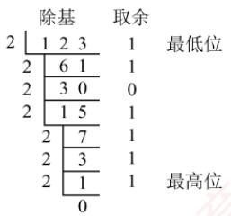

## 所以，整数部分123= (1111011)2。

小数部分（乘2取整）：

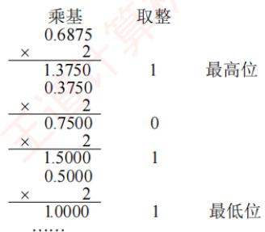

所以，小数部分 $0.6875 = (0.1011)_2$ ，因此， $1 2 3 . 6 8 7 5 { = } ( 1 1 1 1 0 1 1 . 1 0 1 1 ) _ { 2 }$

## 注意

关于除基取余法和乘基取整法的原理，建议结合r进制数的数值定义公式理解，避免死记硬背。并非所有十进制小数都能用有限位二进制小数精确表示。一个十进制小数能被有限位二进制精确表示，当且仅当它可以表示成形如k/2”的分数。例如，0.3=3/10，而10不是2的幂（其质因数包含5），因此无法用有限位二进制精确表示。相反，任何有限位二进制小数都对应一个分母为2的幂的分数，因此总能精确地转换为十进制小数。这一特性在浮点数的表示与运算中尤为重要，需特别注意。

## 2.1.2 定点数的编码表示

## 1. 真值和机器数

在日常生活中，数通常用“+”或“-”号表示正负（正号常省略），如+15、-8。这类带有符号的数称为真值，即机器数所代表的实际数值。在计算机中，数的符号与数值部分一同编码：通常用“0”表示正，“1”表示负。这种将符号数字化的表示形式称为机器数。

例如，机器数0,101（逗号仅用于分隔符号位与数值位）表示真值+5。

## 2. 机器数的定点表示

根据小数点位置是否固定，计算机中的数值表示分为定点表示和浮点表示。

定点表示用于表示定点小数和定点整数。

1）定点小数。表示纯小数，约定小数点位于符号位之后、数值部分最高位之前。若数据 $X   =$ $x_{0}.x_{1}x_{2}.\cdots x_{n}$ (其中 $x _ { 0 }$ 为符号位， $x_{1} \sim x_{n}$ 为数值位， $x _ { 1 }$ 为最高有效位），其在计算机中的表示形式如图2.1所示。

2）定点整数。表示纯整数，约定小数点位于数值部分最低位之后。若数据 $X = x_{0}x_{1}x_{2}\cdots x_{n}$ (其中 $x _ { 0 }$ 为符号位， $x _ { 1 } { \sim } x _ { n }$ 为数值位， $x _ { n }$ 为最低有效位），其表示形式如图2.2所示。

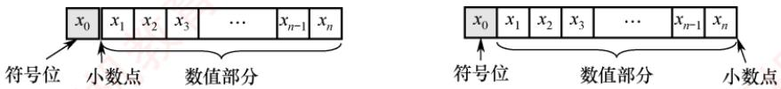  
图2.1 定点小数表示  
图 2.2 定点整数表示

事实上，在机器内部并没有小数点，只是人为约定了小数点的位置。因此，在定点数的编码和运算中，无须区分该数表示的是小数还是整数，而只需关心符号位和数值位即可。

定点数的编码表示法主要有四种：原码、补码、反码和移码。

## 3. 原码、补码、反码、移码

## (1)原码表示法

用机器数的最高位表示数的符号，其余各位表示数的绝对值。原码的定义如下。

$$
\left[ x \right]_{原} = \left\{ \begin{aligned} & 0,x, & 0 \leqslant x < 2^{n} \\ & 2^{n} - x = 2^{n} + \left| x \right|, & - 2^{n} < x \leqslant 0 \end{aligned} \right. \quad (x  是真值 , 字长为  \; n + 1)
$$

例如，若字长为8位， $x_{1} = + 1110, x_{2} = - 1110$ ，则其原码表示分别为 $[x_{1}]_{ 原 } = 0, 0001110, [x_{2}]_{ 原 } =$ $2^{7}+1110=1,0001110$ 工道

对于 $n + 1$ 位原码整数，其表示范围为 $- ( 2 ^ { n } - 1 ) \leqslant x \leqslant 2 ^ { n } - 1$ （关于原点对称）。

## 注意

零的原码表示有正零和负零两种形式，即 $\left[ + 0 \right]_{ 原 } = 0,0000000  和  \left[ - 0 \right]_{ 原 } = 1,0000000$

原码表示的优点：①与真值的对应关系简单、直观，转换简便；②用原码实现乘除运算比较简便。缺点：①零的表示不唯一，存在±0两种编码；②用原码实现加减运算比较复杂。

## (2) 补码表示法

补码表示法的加法和减法运算均可通过加法器统一实现。正数的补码与原码相同，负数的补码等于模（n+1位补码的模为 $2 ^ { n + 1 } )$ ）与该负数绝对值之差。补码的定义如下。

$$
\left[ x \right]_{补} = \left\{ \begin{aligned} 0, x, \quad 0 \leqslant x < 2^{n} \\ 2^{n + 1} + x = 2^{n + 1} - \left| x \right|, \quad - 2^{n} \leqslant x < 0 \end{aligned} \right. \quad ( mod  2^{n + 1} )
$$

等价地，无论是正数还是负数， $[x]_{补} = 2^{n + 1} + x \quad (-2^n \leq x \leq 2^n$ ${ \bmod { ~ 2 ^ { n + 1 } ) } }$ 0

例如，若字长为8位， $x_{1}=+1010,\ x_{2}=-1101$ ，则其补码表示分别为 $\left[ x_{1} \right]_{ 补 } = 0, 0001010, \left[ x_{2} \right]_{ 补 } =$ $2^{8}-|x_{2}|=1,1110011$

## 考点追踪补码的表示范围（2010、2013、2014、2022）

对于 n+1 位补码整数，其表示范围为 $-2^{n} \leqslant x \leqslant 2^{n}-1$ （比原码多表示一个负数，即-2ⁿ）。

• 几个特殊值的补码（n+1位）：

1) $\left[ + 0 \right]_{补} = \left[ - 0 \right]_{补} = 0,00 \ldots 0$ （全0），零的补码表示是唯一的。

2) $[ - 1 ] _ { \# } = 2 ^ { n + 1 } - 1 = 1 , 1 1 \cdots 1$ （全1）。

3）最大正整数： $\left[ 2 ^ { n } - 1 \right] _ { \# } = 0 , 1 1 \ldots 1$ （符号位为0，数值位全1）。

4）最小负整数： $\left[ -2^n \right]_{补} = 1, 00 \cdots 0$ （符号位为1，数值位全0）。

## ● 模运算（了解）

在模运算中，一个数与它除以“模”后得到的余数是等价的。如A、B、M满足 $A = B + K \times M   (K$ 为整数），记为 $A \equiv B \pmod{M}$ ，即A、B各除以M后的余数相同。在补码运算中， $\left[ A \right]_{补} - \left[ B \right]_{补} = \left[ A \right]_{补} +$ $M - [B]_{ 补 }$ ，而 $M - \left[ B \right]_{补} = \left[ - B \right]_{补}$ ，因此补码能够借助加法运算实现减法运算。

## ● 补码与真值之间的转换

## 考点追踪补码和真值的相互转换（2020、2023）

真值转换为补码：对于正数，与原码的方式一样。对于负数，符号位取1，其余各位由其绝对值“按位取反，末位加1”得到。补码转换为真值：若符号位为0，则直接读作正数。若符号位为1，则真值为负数，其绝对值由补码数值部分“按位取反，末位加1”得到。

## · 变形补码

为便于溢出检测，可采用双符号位的补码表示（又称变形补码），双符号位00表示正数，11表示负数。若总位数为 $n + 2$ （高2位为符号位，其余为数值位），则变形补码定义为

$$
\left[ x \right]_{变补} = \left\{ \begin{aligned} & 00, x, & 0 \leqslant x < 2^n \\ & 2^{n+2} + x = 2^{n+2} - \left| x \right|, & -2^n \leqslant x < 0 \end{aligned} \right. \quad ( mod  \quad 2^{n+2} )
$$

在双符号位中，左符表示真正的符号位，右符用于判断“溢出”。

## （3）反码表示法（了解即可）

反码可视为从原码转换为补码的中间表示形式。

正数的反码与其原码相同。负数的反码由其原码的数值部分按位取反（末位不加1）得到。

反码表示存在明显不足：①零的表示不唯一（存在±0两种编码）；②表示范围与相同字长的原码相同，比补码少一个最小负数 $( - 2 ^ { n } )$ 。因此，反码在计算机中极少使用。

## (4)移码表示法

移码主要用于表示浮点数的阶码，且用于表示整数。其核心思想是将真值x加上一个固定偏置值，实现数轴整体右移。设字长为 $n + 1$ 位，偏置值通常取2”，则移码定义为

$$
[x]_{ 移 } = 2^n + x \qquad (-2^n \leqslant x < 2^n)
$$

## 注意

在IEEE754标准的浮点数中，k位阶码的偏置值为 $2 ^ { k - 1 } - 1$ ，如8位阶码的偏置值为127。

例如，若字长为8位，偏置值为 $2^{7}, x_{1} = + 10101$ $x_{2} = - 10101$ ，则其移码表示分别为 $[x_{1}]_{ 移} = 2^{7} +$ $10101 = 1,0010101; \left[ x_{2} \right]_{标} = 2^{7} + ( - 10101) = 0,1101011$

移码（设字长为 $n + 1$ ，偏置值为2ⁿ）的主要特点如下：

①零的表示唯一， $\left[ + 0 \right]_{移} = 2^{n} + 0 = \left[ - 0 \right]_{移} = 2^{n} - 0 = 1,00\ldots0\left( n  个  0 \right)$ 0

②在相同字长下，移码与补码仅符号位相反（将补码的最高位取反即得移码）。

③移码全0时，对应真值的最小值-2ⁿ；移码全1时，对应真值的最大值 $2 ^ { n } { - } 1$

④移码保持真值的大小顺序：移码值越大，对应真值越大，便于阶码比较。

四种编码表示的总结如下：

## 考点追踪补码大小的判断（2015）

①正数的原码、反码、补码相同；移码则不同。

②原码与反码在数轴上关于原点对称，二者都存在+0与-0。

③补码与移码的表示不对称，零的表示唯一，且比原码和反码多表示一个负数（-2”）。

④原码可直观的比较大小（因数值部分即绝对值），而负数的补码和反码不能像原码那样直观判断。不过，在同为负数的前提下，补码或反码的数值部分越大，其真值也越大。

## 2.1.3 整数的表示

## 1. 无符号整数的表示

## 考点追踪机器码与补码、无符号数之间的转换（2021）

当所有二进制位均用于表示数值（无符号位）时，该编码称为无符号整数，简称无符号数。此时，数值隐含为非负整数。由于无须保留符号位，在相同字长下，无符号整数能表示的最大值大于有符号整数。无符号整数适用于仅涉及非负整数且结果不会产生负值的场景。例如，可用无符号整数进行地址运算，或用它来表示指针。 X

例如，8位无符号整数的最小值为00000000（0），最大值为 $1111\ 111\ (2^{8}-1=255)$ ，表示范围为0\~255；而8位有符号整数（补码表示）的最小值为 $1000\ 0000(-2^{7}=-128)$ ，最大值为0111 1111 $(2^{7} - 1 = 127)$ ，表示范围为-128～127。 王2

## 2. 有符号整数的表示

有符号整数通过在数值位前增设一位符号位（0表示正，1表示负）来表示正负。虽然原码、反码和补码均可用于表示有符号整数，但现代计算机统一采用补码，因其具有以下优势：

①零的表示唯一（无+0与-0之分）。

②符号位可与数值位一同参与运算，使加减法统一为加法操作。

③表示范围更大，比原码和反码多表示一个最小负数。

因此，n位有符号整数（补码）的表示范围为- $- 2 ^ { n - 1 } { \sim } 2 ^ { n - 1 } - 1$

## 2.1.4 C 语言中的整数类型及类型转换

统考大纲要求考生具备分析高级程序设计语言（如C语言）中相关问题的能力，其中变量之间的类型转换是高频考点，需要深入掌握。

## 1. C语言中的整型数据类型

考点追踪int型数据的表示范围（2017、2019、2024）

C语言提供了多种整型类型，其具体长度依赖于编译器和目标平台。常见情况如下：

•短整型：short（或 short int），通常为16位。

• 整型：int，通常为 32 位。

• 长整型：long（或long int），在32位系统中为32位，在64位系统中通常为64位。

在上述类型前添加 unsigned 关键字，可定义对应的无符号类型(如 unsigned int、unsigned short等）。若未显式指定 signed或 unsigned，则默认为有符号类型。

字符型（char，通常为8位）是一种特殊的整型，通常可按无符号整数解释。

在现代系统中，所有有符号整型均以补码形式存储。无符号整型则将全部位用于表示非负数值。因此，在相同位宽下，两者的取值范围不同。

## 2. 整型数据的类型转换

定点数在类型转换过程中，若涉及字长变化，则会触发两种基本操作：位截断与位扩展。

1）位截断：当长类型转换为短类型时，系统直接丢弃高位，仅保留低位部分。由于目标类型的表示范围较小，截断可能导致数值发生变化，具有较强的隐蔽性。

考点追踪零扩展和符号扩展的应用（2012、2021、2024）

2）位扩展：当短类型转换为长类型时，系统通过填充高位来保持数值语义不变。具体扩展的方式取决于源数据的符号性：

● 零扩展：用于无符号数，在高位补0。

· 符号扩展：用于补码表示的有符号数，高位重复填充符号位。

C语言支持通过强制类型转换实现不同类型间的转换，其语法为“TYPEb=(TYPE)a”，转换结果是一个TYPE类型的值。根据源类型与目标类型的字长和符号性，可分为三种情形。

考点追踪整型类型的相互转换（2011、2016、2019、2024）

（1）长类型转换为短类型：位截断

转换规则：保留低位，丢弃高位。

考虑如下代码片段：

int x=165537, u=-34991; //int 型为 32 位  
short y=(short)x, v=(short)u; //short 型为 16 位  
printf("x=%d, y=%d\n", x, y);  
printf("u=%d, v=%d\n", u, v);  
运行结果如下：  
x=165537, y=-31071  
u=-34991, v=30545 育

其中，x,y,u,v的十六进制表示分别为0x000286A1,0x86A1,0xFFFF7751,0x7751。可见，当长类型转换为短类型时，系统直接截断高位，仅保留低位部分。由于目标类型的数值范围较小，这种位截断可能导致结果与原值在语义上不一致。由于x=165537超出了16位有符号整数的最大值（32767），截断后的位模式被解释为-31071，这并非运算溢出，而是位截断引起的语义变化。需要注意的是，此类转换不会触发任何异常或错误报告，具有很强的隐蔽性。

## （2）相同字长的转换：仅改变解释方式

转换规则：二进制位模式保持不变，仅重新解释其含义。

考虑如下代码片段：

short x=-4321;   
unsigned short y=(unsigned short)x;   
printf("x=%d, y=%u\n", x, y);   
运行结果如下：   
x=-4321, y=61215

有符号数x为负数，而无符号数y只能表示非负值。从输出结果看，y的值似乎与x毫无关联；但将二者转换为二进制形式后（见表2.1），可观察到：short型强制转换为 unsigned short型后，所有二进制位均保持不变，x按补码规则解释为有符号数，而y则按无符号规则解读。

表 2.1 y 与 x 的位级表示对比
<table><tr><td rowspan=1 colspan=1>变 量</td><td rowspan=1 colspan=1>值</td><td rowspan=1 colspan=16>二进制位</td></tr><tr><td rowspan=1 colspan=1></td><td rowspan=1 colspan=1></td><td rowspan=1 colspan=1>15</td><td rowspan=1 colspan=1>14</td><td rowspan=1 colspan=1>13</td><td rowspan=1 colspan=1>12</td><td rowspan=1 colspan=1>11</td><td rowspan=1 colspan=1>10</td><td rowspan=1 colspan=1>9</td><td rowspan=1 colspan=1>8</td><td rowspan=1 colspan=1>7</td><td rowspan=1 colspan=1>6</td><td rowspan=1 colspan=1>5</td><td rowspan=1 colspan=1>4</td><td rowspan=1 colspan=1>3</td><td rowspan=1 colspan=1>2</td><td rowspan=1 colspan=1>1</td><td rowspan=1 colspan=1>0</td></tr><tr><td rowspan=1 colspan=1>X</td><td rowspan=1 colspan=1>-4321</td><td rowspan=1 colspan=1>1</td><td rowspan=1 colspan=1>1</td><td rowspan=1 colspan=1>1</td><td rowspan=1 colspan=1>0</td><td rowspan=1 colspan=1>1</td><td rowspan=1 colspan=1>1</td><td rowspan=1 colspan=1>1</td><td rowspan=1 colspan=1>1</td><td rowspan=1 colspan=1>0</td><td rowspan=1 colspan=1>0</td><td rowspan=1 colspan=1>0</td><td rowspan=1 colspan=1>1</td><td rowspan=1 colspan=1>1</td><td rowspan=1 colspan=1>1</td><td rowspan=1 colspan=1>1</td><td rowspan=1 colspan=1>1</td></tr><tr><td rowspan=1 colspan=1>y</td><td rowspan=1 colspan=1>61215</td><td rowspan=1 colspan=1>1</td><td rowspan=1 colspan=1>1</td><td rowspan=1 colspan=1>1</td><td rowspan=1 colspan=1>0</td><td rowspan=1 colspan=1>1</td><td rowspan=1 colspan=1>1</td><td rowspan=1 colspan=1>1</td><td rowspan=1 colspan=1>1</td><td rowspan=1 colspan=1>0</td><td rowspan=1 colspan=1>0</td><td rowspan=1 colspan=1>0</td><td rowspan=1 colspan=1>1</td><td rowspan=1 colspan=1>1</td><td rowspan=1 colspan=1>1</td><td rowspan=1 colspan=1>1</td><td rowspan=1 colspan=1>1</td></tr></table>

这表明：相同字长的整型类型转换不改变位模式，仅改变对这些位的解释方式

（3）短类型转换为长类型：位扩展

转换规则：若源数据为有符号数，则执行符号扩展；若源数据为无符号数，则执行零扩展。考虑如下代码片段： 人

运行结果如下：  
x=-4321, y=-4321  
u=61215， v=61215

```c
short x=-4321;
int y=x;
unsigned short u=(unsigned short)x;
unsigned int v=u;
printf("x=%d, y=%d\n", x, y);
printf("u=%u, v=%u\n", u, v);
```

其中，x,y,u,v的十六进制表示分别为0xEF1F,0xFFFFEF1F,0xEF1F,Ox0000EF1F。可见，短类型转换为长类型时，要对高位部分进行扩展，扩展方式取决于源数据的符号性。可见，x为有符号数，符号位为1，扩展时高16位补1；u为无符号数，扩展时高16位补0。

## 2.1.5 本节习题精选

## 单项选择题

01. 若十进制数为137.5，则其八进制数为（）。A. 89.8 B. 211.4 C. 211.5 D. 1011111.101

02.一个16位无符号二进制数的表示范围是（）。A. 0\~65536 B. 0\~65535C. -32768\~32767 D. -32768\~32768

03.下列说法有误的是（）。A. 任何二进制整数都可以用十进制表示B. 任何二进制小数都可以用十进制表示C. 任何十进制整数都可以用二进制表示D. 任何十进制小数都可以用二进制表示

04. 对真值0表示形式唯一的机器数是（）。A. 原码 B. 补码和移码C. 反码 D. 以上都不对

05.若[X]补=1.1101010，则[X]原=（）。A. 1.0010101 B. 1.0010110 C. 0.0010110 D. 0.1101010

06. 若X为负数，则由[X]补求[-X]补是将（）。A. [X]补各值保持不变B. [X]补符号位变反，其他各位不变C. [X]补除符号位外，各位变反，末位加1D. [X]补连同符号位一起变反，末位加1

07.8位原码能表示的不同数据有（）个。 自A.15 B. 16 C. 255 D. 256

08.一个n+1位整数x原码的数值范围是（）。A. $-2^{n}+1<x<2^{n}-1$ B. $-2^{n}+1 \leqslant x < 2^{n}-1$ C. $-2^{n}+1<x\leqslant 2^{n}-1$ D. $-2^{n}+1 \leqslant x \leqslant 2^{n}-1$

09. 若定点整数为64位，含1位符号位，则采用补码表示的绝对值最大的负数为（）。A. $- 2 ^ { 6 4 }$ B. $- ( 2 ^ { 6 4 }   - 1 )$ C. $\pm 2 ^ { 6 3 }$ D. $- ( 2 ^ { 6 3 }   - 1 )$

10.下列关于补码和移码关系的叙述中，（）是不正确的。A. 相同位数的补码和移码表示具有相同的数据表示范围B. 0的补码和移码表示相同C. 同一个数的补码和移码表示，其数值部分相同，而符号位相反

D. 一般用移码表示浮点数的阶码，而补码表示定点整数

11. 若 $[x]_{补}=1,x_{1}x_{2}x_{3}x_{4}x_{5}x_{6}$ ，其中 $x _ { i }$ 取0或1，若要 $x > - 3 2$ ，应当满足（）。A. $x _ { 1 }$ 为0，其他各位任意 B. $x _ { 1 }$ 为1，其他各位任意C. $x _ { 1 }$ 为1, $x _ { 2 } \cdots x _ { 6 }$ 中至少有一位为1 D. $x _ { 1 }$ 为 $0 , x _ { 2 } \cdots x _ { 6 }$ 中至少有一位为1

12. 设 $x$ 为整数， $[x]_{补} = 1, x_{1}x_{2}x_{3}x_{4}x_{5}$ ，若要 $x < -16,\ x_{1} \sim x_{5}$ 应满足的条件是（）。A. $x _ { 1 }   \sim   x _ { 5 }$ B. $x _ { 1 }$ 必须为 $0 , x _ { 2 }   \sim   x _ { 5 }$ 至少有一个为1C. $x _ { 1 }$ 必须为 $0 , x _ { 2 }   \sim   x _ { 5 }$ 任意 D. $x _ { 1 }$ 必须为1， $x _ { 2 }   \sim   x _ { 5 }$ 任意

13. 设x为真值，x\*为其绝对值，满足 $\left[ -x^{*} \right]_{补} = \left[ -x \right]_{补}$ ，当且仅当（）。A. x 任意B. x 为正数 C. x为负数

14. 假定一个十进制数为-66，按补码形式存放在一个8位寄存器中，该寄存器的内容用十六进制表示为（）。 草机A. C2H B. BEH C. BDH D. 42HX

15. 设机器数采用补码表示（含1位符号位），若寄存器内容为9BH，则对应的十进制数为道A.-27 B. -97 C. -101 D. 155

16.若寄存器内容为10000000，若它等于-0，则为（）。 1A. 原码 B. 补码 C. 反码 D. 移码

17. 若寄存器内容为11111111，若它等于+127，则为（）。A. 反码 B. 补码 C. 原码 D. 移码

18. 若寄存器内容为11111111，若它等于-1，则为（）。A. 原码 B. 补码 C. 反码 D. 移码

19.若寄存器内容为00000000，若它等于-128，则为（）。A. 原码 B. 补码 C. 反码 D. 移码

20. 若二进制定点小数真值是-0.1101，机器表示为1.0010，则为（）。A. 原码 B. 补码 C. 反码 D. 移码

21. 下列为8位移码机器数[x]移，求[-x]移时，（）将会发生溢出。A. 11111111 1 B. 00000000 C. 10000000 D. 01111111

22.一个8位的二进制整数由2个“0”和6个“1”组成，采用补码或者移码表示，则下列说法中正确的是（）。A. 若采用移码表示，偏置值为127，则此整数最小为-64B. 若采用移码表示，偏置值为128，则此整数最大为123 道计算机教C. 若采用补码表示，则此整数最小为-96D. 若采用补码表示，则此整数最大为252

23.用2个“1”和6个“0”组成的8位二进制补码，所能表示的最大整数和最小整数之差为（）。A. 223 B. 128 C. 191 D. 159

24. 计算机内部的定点数大多用补码表示，以下是一些关于补码特点的叙述：I. 零的表示是唯一的 Ⅱ. 符号位可以和数值部分一起参加运算I. 和其真值的对应关系简单、直观 IV. 减法可用加法来实现A. I和ⅡI B. I和ⅢC. I和Ⅱ和ⅢI D. I和ⅡI和IV

25. 在计算机中，通常用来表示主存地址的是（）。

A. 移码 B. 补码 C. 原码 D. 无符号数

26. 16 位补码整数 0x8FA0 扩展为 32 位应该是（）。A. 0x0000 8FA0 B. 0xFFFF 8FA0C. 0xFFFF FFA0 D. 0x8000 8FA0

27. 【2012 统考真题】假定编译器规定 int 型和 short 型长度分别为 32 位和16 位，执行下列C语言语句：unsigned short x=65530;unsigned int y=x;得到 y的机器数为（）。A. 0000 7FFAH B. 0000 FFFAH C. FFFF 7FFAH D. FFFF FFFAH 育

28.【2015统考真题】由3个“1”和5个“0”组成的8位二进制补码，能表示的最小整数是（）。B. -125 C. -32

29.【2016统考真题】有如下C语言程序段： 7short si = -32767; 王道计unsigned short usi = si;执行上述两条语句后，usi的值为（）。A. -32767 B. 32767 C. 32768 D. 32769

30.【2018统考真题】冯·诺依曼结构计算机中的数据采用二进制编码表示，其主要原因是（）。I. 二进制的运算规则简单 I. 制造两个稳态的物理器件较容易Ⅲ. 便于用逻辑门电路实现算术运算A. 仅I、Ⅱ B. 仅I、ⅢI D. I、ⅡI和III

31.【2019统考真题】考虑以下C语言代码：unsigned short usi = 65535;short si = usi;执行上述程序段后，si的值是（）。A. -1 B. -32767 C. -32768 D. -65535

32. 【2021 统考真题】已知有符号整数用补码表示，变量x, y， z 的机器数分别为 FFFDH,FFDFH，7FFCH，下列结论中，正确的是（）。A. 若x,y和z为无符号整数，则 $z < x < y$ B. 若x,y和 z 为无符号整数，则 $x < y < z$ +算机教育C. 若x,y和 z 为有符号整数，则 $x < y < z$ D. 若 x, y 和 z 为有符号整数，则 $y < x < z$

33.【2022统考真题】32位补码所能表示的整数范围是（）。A. $- 2 ^ { 3 2 } \sim 2 ^ { 3 1 } - 1$ B. $- 2 ^ { 3 1 }   \sim   2 ^ { 3 1 }   - 1$ C. $- 2 ^ { 3 2 }   \sim   2 ^ { 3 2 }   - 1$ $- 2 ^ { 3 1 } \sim 2 ^ { 3 2 } - 1$

34.【2025统考真题】在32位计算机上执行下列C语言代码段后，ui的值是（）。short si = -32767;unsigned int ui = si;A. $2 ^ { 1 5 }   - 1$ B. $2 ^ { 1 5 }   + 1$ C. $2^{32} - 2^{15} - 1$ D. $2 ^ { 3 2 } - 2 ^ { 1 5 } \pm 1$

## 2.1.6 答案与解析

## 单项选择题

01. B

十进制数转换为八进制数，整数部分采用除基取余法：将整数除以8，所得余数即为转换后的八进制数个位上的数码，再将商除以8，余数为八进制数十位上的数码，如此反复进行，直到商是0为止。小数部分采用乘基取整法：将小数乘以8，所得积的整数部分即为八进制数十分位上的数码，再将此积的小数部分乘以8，得到百分位上的数码，如此反复直到积是1.0为止。经转换得到的八进制数为211.40。

## 02. B

一个16位无符号二进制数的表示范围是 $0 { \sim } 2 ^ { 1 6 } - 1$ ，即0～65535。

## 03. D

选项A、B、C明显正确，二进制整数和十进制整数可以相互转换，仅仅是每位的位权不同而已。而二进制数的小数位只能表示1/2,1/4,1/8,…,1/2"，因此无法表示所有的十进制小数，选项D错误。

## 04. B

假设位数为5位（含1位符号位）， $[+0]_{ 原 } = 00000, \quad [-0]_{ 原 } = 10000, \quad [+0]_{ 反 } = 00000, \quad [-0]_{ 反 } = 11111$ $\left[ + 0 \right]_{补} = \left[ - 0 \right]_{补} = 00000, \quad \left[ + 0 \right]_{补} = \left[ - 0 \right]_{补} = 10000.$ 。可知，0的补码和移码的表示是唯一的。

## 05. B

若X为负数，则其补码转换为原码的规则是“符号位不变，数值位取反，末位加 $1 ^ { \prime \prime }$ ，即 $[X]_{ 原 } =$ $0010101+1=0010110$

## 06. D

不论X是正数还是负数，由[X]补求 $[ - X ] _ {  补  }$ 的方法是连同符号位一起，每位取反，末位加1。

## 07. C

8个二进制位有 $2 ^ { 8 } = 2 5 6$ 种不同表示。原码中0有两种表示，因此原码能表示的不同数据为$2 ^ { 8 } - 1 = 2 5 5$ 个。0在反码中也有两种表示，因此若题目改为反码，答案也为选项C。0在补码与移码中只有一种表示，因此题目若改为补码或移码，答案为选项D。

## 08. D

n+1位整数原码的表示范围为 $-2^{n}+1 \leqslant x \leqslant 2^{n}-1$ 0

## 09. C

对于长度为n+1（含1位符号位）定点整数x，用补码表示时， $x_{ 绝对值最大负数 } = -2^n$ ，其中 $n = 6 3$ 0

## 10. B

以机器字长5位为例， $[0]_{ 补 } = 00000$ $[0]_{移} = 2^4 + 0 = 10000$ $[0]_{ 补 } \neq [0]_{ 移 }$ ，表示不相同，但在补码或移码中的表示形式是唯一的。 XTIT

## 11. C

对于此类题型，先写出特定值的机器码表示，然后根据机器数判断大小的规则来推导数值位的特点（若条件允许，也可以取特殊值来推断）。-32的补码为1,100000，根据负数补码判断大小的规则：数值位部分越小，其绝对值越大，即负得越多。因此，若要 $x   >   - 3 2$ ，数值位 $x _ { 1 } x _ { 2 } x _ { 3 } x _ { 4 } x _ { 5 } x _ { 6 }$ 需大于100000，即 $x _ { 1 }$ 必须为1，而 $x _ { 2 } \ldots x _ { 6 }$ 中至少有一位为1。

【特殊值法】对于选项A，取1,000000，真值为-64，错误。对于选项B，取1,100000，真值为-32，错误。对于选项C，取1,100001，真值为-31，符合。对于选项D，取1,000001，真值为-63，错误。

## 12. C

解题思路与上题类似（也可采用特殊值解法，请读者自行思考），-16的补码为1,10000，根据负数补码判断大小的规则：数值位部分越小，其绝对值越大，即负得越多。因此，若要 $x   <   - 1 6$ 数值位 $x _ { 1 } x _ { 2 } x _ { 3 } x _ { 4 } x _ { 5 }$ 需小于10000，即 $x _ { 1 }$ 必为0，而 $x_{2} \sim x_{5}$ 任意。

## 13. D

当x为0或为正数时，满足 $\left[ -x^{*} \right]_{补} = \left[ -x \right]_{补}$ ，B为充分条件，因此选项B错误。而x为负数时，-x为正数，而 $- x ^ { * }$ 为负数，补码的表示是唯一的，显然二者不等，因此选项C错误。

## 14. B

x = -66 用二进制数表示， $[x]_{ 原 } = 11000010$ ，则有 $[x]_{ 补 } = 1011110 =  BEH$

## 15. C

$9BH = (1001\ 1011)_2$ ，最高位的1表示负数，所以其真值为 $(1100101)_{2}=-(64+32+4+1)=-101$ 16. A

值等于-0说明只可能是原码或反码(因为补码和移码表示0时是唯一的，没有+0和-0之分)，$[ - 0 ] _ {  原  } = 1 0 0 0 0 0 0 0 , \quad [ - 0 ] _ {  反  } = 1 1 1 1 1 1 1 1$ o

## 17. D

这里寄存器长度为8， $\left[ + 127 \right]_{ 原 } = \left[ + 127 \right]_{ 反 } = \left[ + 127 \right]_{ 补 } = 01111111$ ，又知同一数值的移码和补码除最高位相反外，其他各位相同，则 $[+127]_{ 移 } = 11111111$ 或 $[ + 127 ]_{ 移 } = 2^7 + 01111111 = 11111111$

## 18. B

这里寄存器长度为8， $\left[ - 1 \right]_{ 补 } = \left[ 10000001 \right]_{ 补 } = 11111111$ 0

## 19. D

这里寄存器长度为8， $[ - 128]_{移} = 2^{7} + ( - 10000000 ) = 00000000$

## 20. C

真值-0.1101，对应的原码表示为1.1101，补码表示为1.0011，反码表示为1.0010，移码通常用于表示阶码，不用来表示定点小数。

## 21. B

选项B对应8位最小的值-128，而-x=128发生溢出，因此无法表示其移码。

## 22. A

当采用补码表示时，要使得数值最大，就要让符号位为0，且把“1”放在高位，得到的补码为01111110B=126；要使得数值最小，就要让符号位为1，且把“1”放在低位，得到的补码为10011111B=-97。当采用移码表示时，设偏置值为128，要使得数值最大，就要把“1”放在高位，得到的移码为 $1111\ 1100\mathrm{B}-1000\ 0000\mathrm{B}=252-128=124$ ；设偏置值为127，要使得数值最小，则7X应把“1”放在低位，得到的移码为 $00111111B-01111111B=1100000B=-64$ ，选项A正确。

## 23. A

在8位补码中，符号位为最高位。要使数值最大，符号位为0，其余位中将两个“1”尽可能置于高位，最大值为01100000=96。要使数值最小，符号位为1，此时需要将另一个“1”置于最

## 24. D

[+0]补和[-0]补是相同的，所以说法Ⅰ正确。在进行补码定点数的加减运算时，符号位作为数的一部分参加运算，说法Ⅱ正确， $\left[ A \right]_{补} - \left[ B \right]_{补} = \left[ A \right]_{补} + \left[ - B \right]_{补}$ ，即将减法采用加法实现，说法IV正确。实际上，补码和其真值的对应关系远不如原码和其真值的对应关系简单直观，说法Ⅲ错误。

## 25. D

主存地址都是正数，因此不需要符号位，即直接采用无符号数表示。

## 26. B

16位扩展为32位，符号位不变，附加位是符号位的扩展。该数是一个负数，需用1来填补。A是一个正数，C的数值位发生变化，D用0来填充附加位，均不正确。

## 27. B

将一个 16 位 unsigned short 型数转换为 32 位 unsigned int 型数时，因为都是无符号数，新表示形式的高位用0填充。16位无符号整数所能表示的最大值为65535，其十六进制表示为FFFFH，因此x的十六进制表示为FFFFH-5H=FFFAH，所以y的十六进制表示为0000 FFFAH。

排除法：先直接排除C、D，然后分析余下选项的特征。A、B的值相差几乎近1倍，因此可以算出00010000H（接近B且好算的数）的值后，再推断出答案。

## 28. B

原码很容易判断大小。而负数的补码很难直接判断大小，可采用如下规则快速判断：对于负数，数值位部分越小，其绝对值越大，即负得越多。采用补码整数表示时，负数的符号位为1，因此剩下的两个“1”放在末位时其值最小，补码形式为10000011，转换为真值为-125。此外，考虑负数的补码转换为原码的方法，从右向左找到第一个数值为1的位，之后的每位进行取反操作，符号位不变，不难发现，当符号位为1，剩下的两个“1”放在末位时，补码的绝对值最大。

## 29. D

因C语言中的数据在内存中为补码表示形式，si对应的补码为1000 0000 00000001B，最前面的一位“1”为符号位，表示负数，即-32767。由signed型数转换为等长的unsigned型数时，符号位成为数据的一部分，即负数转换为无符号数（正数）时，其数值将发生变化。usi对应的补码与 si的相同，但表示正数，为32769。

## 30. D

对于说法I，二进制只有0和1两种数值，运算规则较简单，都通过ALU转换为加法运算。对于说法Ⅱ，二进制数只需要高电平和低电平两个状态就可表示，这样的物理器件很容易制造。对于说法Ⅲ，二进制数与逻辑量相吻合。二进制的0和1正好与逻辑量的“真”和“假”相对应，因此用二进制数表示二值逻辑显得十分自然，采用逻辑门电路很容易实现运算。

## 31. A

unsigned short 型为无符号短整型，长度为 2 字节，因此 unsigned short usi 型转换为二进制代码即 1111 11111111 1111。short型为短整型，长度为2字节，在采用补码的机器上，short si的二进制代码为 1111 1111 1111 1111，因此 si 的值为-1。

## 32. D

若 x, y和 z 均为无符号整数，则 $x > y > z$ ，选项A和B错误。若x,y和 z均为有符号整数，补码的最高位是符号位，0表示正数，1表示负数，因此z为正数，而x和y为负数。对于x和y的比较，数值位取反加1，可知x=-3， $y = - 3 3$ ，所以 $x   \geq   y .$ 。选项D正确。

## 33. B

n位补码整数的最小值是 $1 , 0 0 \ldots 0 ( - 2 ^ { n - 1 } )$ ；最大值是 $0,11\ldots1\left(2^{n-1}-1\right)$ 。n位补码整数所能表示的范围是 $-2^{n - 1} \sim 2^{n - 1} - 1$ ，32位补码整数所能表示的范围是 $-2^{31} \sim 2^{31} - 1$

## 34. D

在32位系统中，short通常为16位有符号整数。-32767的16位补码为1000 00000000 0001。将其赋值给 32 位 unsigned int 时，先按符号扩展转换为 32 位有符号整数 1111 1111 1111 1111 1000000000000001，再以无符号方式解释，其值为 $2^{32}-(2^{15}-1)=2^{32}-2^{15}+1$

## 2.2 运算方法和运算电路

## 2.2.1 基本运算部件

在计算机中，运算器由算术逻辑单元（ArithmeticLogicUnit，ALU）、移位器、状态寄存器（PSW）和通用寄存器组等组成。运算器的基本功能包括加、减、乘、除四则运算，与、或、非、

异或等逻辑运算，以及移位、求补等操作。ALU的核心部件是加法器。

## 1. 一位全加器

全加器（FA）是最基本的加法单元，有三个输入：加数 $A _ { i ^ { \vee } }$ 加数 $B _ { i }$ 与来自低位的进位 $C _ { i - 1 }$ 两个输出：本位和 $S _ { i }$ 及向高位的进位 $C _ { i ^ { \circ } }$ 其逻辑表达式如下。

和表达式： $S _ { i }   =   A _ { i }   \oplus   B _ { i }   \oplus   C _ { i - 1 }$ (当 $A_{i};~B_{i}、~C_{i-1}$ 中有奇数个1时， $S _ { i }   = 1$ ，否则 $S _ { i }   =   0   )$

进位表达式： $C _ { i } = A _ { i } B _ { i } + ( A _ { i } \oplus B _ { i } ) C _ { i - 1 }$ 1

一位全加器的逻辑结构如图2.3(a)所示，其逻辑符号如图2.3(b)所示。

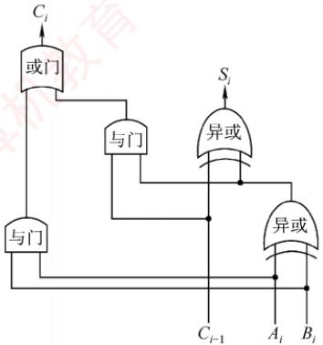  
(a)一位全加器的逻辑结构

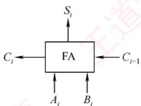  
(b) 逻辑符号  
图 2.3 一位全加器

## 2. 串行进位加法器

将n个全加器级联可构成n位串行进位加法器（又称行波进位加法器），如图2.4所示。其特点是进位信号逐级传递，每一级的进位输出直接作为下一级的进位输入。

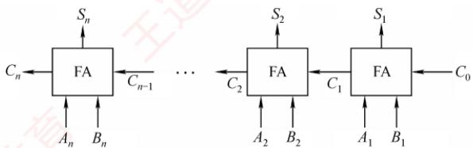  
图 2.4 n 位串行进位加法器

图2.4 中的加法器实现两个 n位二进制数 $A = A_{n}A_{n - 1}\cdots A_{1}$ 和 $B = B_{n}B_{n - 1} \cdots B_{1}$ 逐位相加的功能，得到和 $S = S_{n}S_{n - 1} \cdots S_{1}$ 及最终进位 $C _ { n ^ { \circ } }$ 例如，当A=1111，B=0001（4位）时，输出 $S = 0000, \quad C_{4} = 1$ 0由于位数固定，结果实际为模 $2 ^ { n }$ 的加法（溢出部分被丢弃）。

在串行进位加法器中，总运算延迟主要由进位信号从最低位传播到最高位的时间决定。位数越多，进位链越长，延迟越大。因此，缩短进位传递路径是提升加法器性能的关键。

## \*3. 并行进位加法器

并行进位（也称先行进位）加法器能够显著提升加法运算速度，因为它能以几乎同时生成所有进位信号的方式工作，而非逐级传递进位。为了实现这一目标，n个一位全加器被连接至一个n位先行进位逻辑部件（CLA部件），以便几平同时生成所有进位信号。因此，并行进位加法器对于较大位数的数据处理效率要高于串行进位加法器。图2.5展示了一个4位全先行进位加法器的例子。随着加法器位数的增加，电路设计复杂度也会相应提高，此处不再详述。

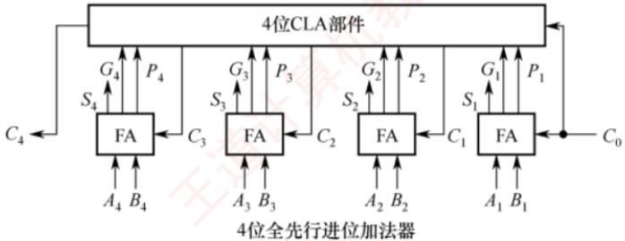  
图2.5 一个4 位全先行进位加法器

## 4. 带标志加法器

对于n位加法器来说，除了得到运算结果外，还要关注加法运算过程中是否发生了溢出、结果的正负性、结果是否为零等，这些信息对于程序的执行控制非常关键。为此，在n位加法器的基础上增加了额外的逻辑电路，不仅支持计算和/差，还能生成以下标志位：OF、CF、SF和ZF，每个标志占1位。图2.6展示了用全加器实现n位带标志加法器的电路示意图。

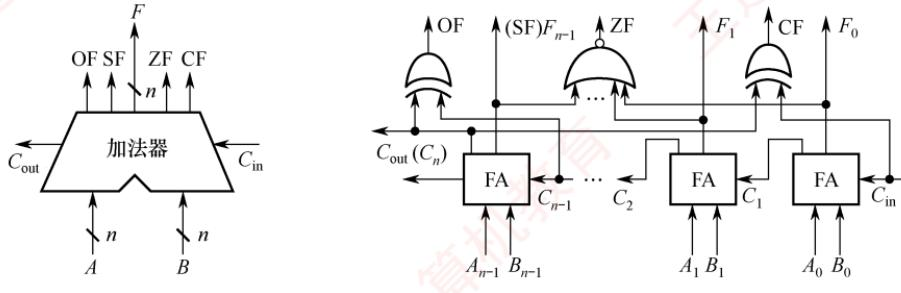  
(a) 带标志加法器符号  
(b)带标志加法器的逻辑电路  
图2.6 用全加器实现 n位带标志加法器的电路

在图2.6中，溢出标志OF通过检测最高有效位的进位输入 $C _ { n - 1 }$ 与进位输出 $C _ { n }$ 是否不同决定，即 $\mathrm { O F } = C _ { n } \oplus C _ { n - 1 }$ ，用于判断有符号数加法运算是否溢出：OF=1表示溢出，OF=0表示未溢出。符号标志SF等于结果的最高有效位，即 $\mathrm { S F } = F _ { n - 1 }$ ，用于指示有符号数加法运算结果的正负性：SF=0表示结果为正，SF=1表示结果为负。零标志ZF在结果的所有位均为0时设置为1，用于指示加减运算的结果是否为零：ZF=1表示结果为0，ZF= 0表示结果非零。进位/借位标志CF用

## 5. 算术逻辑单元（ALU）

ALU是一种功能较强的组合逻辑电路，能够执行多种算术与逻辑运算。其中，加法和减法由带标志加法器直接完成；乘法和除法则通常通过ALU配合控制逻辑，以多次加减和移位的方式迭代实现。此外，ALU还能执行与、或、非等基本逻辑运算。其基本结构如图2.7所示：A和B为两个n位操作数输入端， $C _ { \mathrm { i n } }$ 为进位输入端，ALUop为操作控制信号，用于选择ALU执行的具体功能。例如，当ALUop选择加法（Add）时，ALU输出 $A + B + C_{ in }$ ALUop的位数决定了可支持的操作种类数量。例如，3位ALUop最多可支持8种不同操作。

图2.8展示了一位ALU的结构，可完成“与”“或”“加法”三种操作。其中，加法由一个全加器实现，逻辑运算由专用门电路并行计算，最终通过多路选择器（MUX）根据ALUop选择输出结果。由于有3种操作，ALUop至少需要2位。

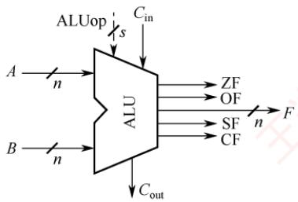  
图 2.7 ALU 的基本结构

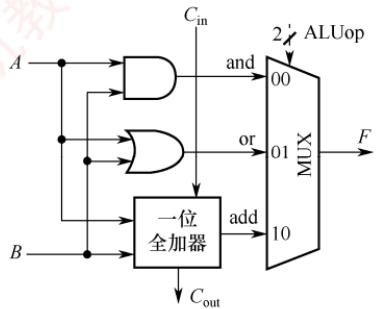  
图 2.8 一位 ALU 结构图

## 2.2.2 定点数的移位运算

当计算机中没有乘/除运算电路时，可以通过加法和移位相结合的方法来实现乘/除运算。对于任意二进制整数，左移一位，若未发生溢出，相当于乘以2（类似于十进制数左移一位相当于乘以10）；右移一位，若忽略因移出而舍去的末位尾数，相当于除以2。

根据操作数的类型不同，移位运算可以分为逻辑移位和算术移位。

## 1. 逻辑移位

## 考点追踪逻辑移位运算（2018）

逻辑移位将操作数视为无符号整数。逻辑移位的规则：左移时，高位移出，低位补0。若高位的1移出，则发生溢出。右移时，低位移出，高位补0。

例如，4位无符号数0001（+1）左移一位变为0010（+2），相当于乘以2，未溢出；0001（+1）右移一位变为0000（0），相当于除以2并舍弃小数部分。又如，1000（+8）左移一位变为0000（0），相当于乘以2，但结果超出了4位无符号数的表示范围，发生溢出。

## 2. 算术移位

考点追踪算术移位运算（2012、2017、2018）

算术移位需要考虑符号位的问题，即将操作数视为有符号整数。有符号整数采用补码表示，因此对于有符号整数的移位操作应采用补码算术移位方式。算术移位的规则：左移时，高位移出，低位补0。若移出的高位与原符号位不同（左移后符号位改变），则发生溢出。右移时，低位移出，高位补符号位。若低位的1移出，则影响精度。

例如，4位补码0010（+2）左移一位变为0100（+4），未溢出；1001（-7）左移一位变为0010，符号由负变正，表明发生溢出（因为-14超出了4位补码的表示范围）。又如，1001（-7）右移一位变为1100（-4），保留了符号位，但丢失了最低有效位，影响精度。

## 2.2.3 定点数的加减运算

## 1. 补码加减运算

考点追踪补码的加减运算（2009、2011、2017、2025）

补码加减运算规则简单，易于硬件实现。补码加减运算的公式如下（设字长为n+1）。

$$
\begin{aligned} &\left[A+B\right]_{补}=\left[A\right]_{补}+\left[B\right]_{补}\left(\bmod 2^{n+1}\right)\\ &\left[A-B\right]_{补}=\left[A\right]_{补}+\left[-B\right]_{补}\left(\bmod 2^{n+1}\right)\\ \end{aligned}
$$

补码运算具有以下特点：

1）按二进制加法规则运算，逢二进一。

2）若做加法，则两个数的补码直接相加；若做减法，则将被减数与减数的负数补码相加。

3）符号位与数值位一同参与运算，结果的符号位由运算自然得出。

4）运算结果自动截断为n+1位（模 $2 ^ { n   +   1 } )$ ，高位进位被丢弃，结果仍为补码形式。

【例2.3】设字长为8位（含1位符号位），A=15，B=24，求 $[A + B]_{ 补 }$ 和 $[A - B]_{ 补 }$ 解：

$A = + 0 0 0 1 1 1 1$ ，B=+0011000；求得 $[A]_{ 补 } = 00001111$ $[B]_{ 补 } = 00011000$ $[ - B ] _ {  补  } = 11101000$ 。则：$\left[ A + B \right]_{ 补 } = \left[ A \right]_{ 补 } + \left[ B \right]_{ 补 } = 00001111 + 00011000 = 00100111$ ，符号位为0，真值为+39。$[A-B]_{ 补 }=[A]_{ 补 }+[-B]_{ 补 }=00001111+11101000=11110111$ ，符号位为1，真值为-9。

## 2. 溢出判别方法

## 考点追踪补码运算的溢出判断（2010、2011、2014、2018、2021、2025）

补码加减运算仅在同号相加或异号相减时可能发生溢出。例如，两个正数相加结果为负，或一个负数减去一个正数结果为正。常用的溢出判别方法有以下三种。 KI

## （1）采用一位符号位

减法运算在机器中是用加法器实现的，因此加法和减法均可统一视为两个补码数相加。溢出仅发生在参与运算的两个数符号相同，而结果符号与之不同的情况下。设参与运算的两个操作数的符号位分别为 $A _ { \mathrm { s } }$ 和 $B _ { \mathrm { s } }$ ，运算结果的符号为 $S _ { \mathrm { s } }$ ，则溢出逻辑表达式为

$$
V = A_{\mathrm{s}}B_{\mathrm{s}}\overline{S_{\mathrm{s}}} + \overline{A_{\mathrm{s}}B_{\mathrm{s}}}S_{\mathrm{s}}
$$

## (2)采用一位符号位并结合进位情况

设符号位（最高位）产生的进位为 $C _ { n } ,$ 最高数值位（次高位）产生的进位为 $C _ { n - 1 }$ 。若 $C _ { n }$ 与 $C _ { n - 1 }$ 不同，则表示溢出。溢出逻辑表达式为

$$
V = C_{n} \oplus C_{n - 1}
$$

## （3）采用双符号位

使用两个符号位 $S _ { \mathrm { s } 1 } S _ { \mathrm { s } 2 } ~ \left( S _ { \mathrm { s } 1 } \right.$ 为高位符号位），若两个符号位不同，则表示溢出。 $S _ { \mathrm { s } 1 } S _ { \mathrm { s } 2 }$ 的各种情况如下： $S_{\mathrm{sl}}S_{\mathrm{s}2}=00$ 表示结果为正数，无溢出。② $S _ { \mathrm { s } 1 } S _ { \mathrm { s } 2 }   { = }   0 1$ ：表示结果正溢出。③ $S _ { \mathrm { s } 1 } S _ { \mathrm { s } 2 } =$ 10：表示结果负溢出。 $S_{\mathrm{sl}}S_{\mathrm{s}2}=11$ ：表示结果为负数，无溢出。溢出逻辑表达式为

$$
V   =   S _ { \mathrm { s } 1 }   \oplus   S _ { \mathrm { s } 2 } ,
$$

在上述三种方法中，若V=0，则表示无溢出；若 $V   =   1$ ，则表示有溢出。

## 3. 加减运算电路

## 考点追踪补码加法器的实现原理（2011）

在计算机中，无论是无符号数还是有符号数的加减运算，均采用同一套硬件电路实现，即“一套电路，两种语义”。图2.9所示为一个加减运算部件，其输入端包括两个n位操作数X和Y，以及一个控制信号Sub。其中，Y分成两路：一路直接接入二选一多路选择器（MUX），另一路经n位反相器后接入同一选择器。控制信号Sub不仅决定选择哪一路数据进入加法器，还在执行减法时作为最低位的进位输入。输出端包括n位运算结果F以及各类标志位。

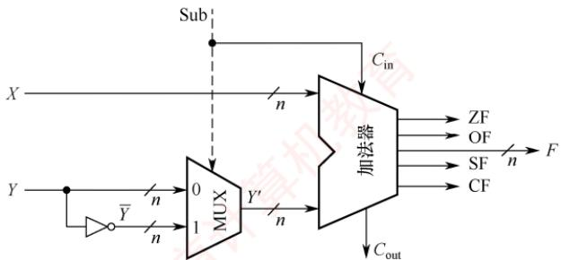  
图 2.9 加减运算部件

## （1）加法运算的工作原理

无论是无符号数还是补码表示的有符号数，其加法均通过同一加法器电路完成。当执行加法操作时 $( S u b = 0 )$ ，电路实现过程如下。

输入：X直接接入加法器的一端；Y接入MUX。

控制信号： $\mathsf { S u b }   =   0$ ，同时作为加法器的最低位进位输入 $C _ { \mathrm { i n } } { = } 0$ o

运算：MUX在 $\mathrm { S u b   =   0 }$ 时选择Y直接通过，加法器执行 $X + Y + C_{ in } (X + Y)$ ，输出 n位结果F和进位输出 $C _ { \mathrm { o u t } }$ ，并生成状态标志位。

语义解释：

1）若X、【被视为无符号数，则结果 $F = (X + Y) \bmod 2^n$ 当 $X + Y \geqslant 2 ^ { n }$ 时，产生进位 $C_{ out } = 1$ 表示发生无符号溢出；此时，标志 $\mathrm { C F }   =   C _ { \mathrm { o u t } }$ 反映进位状态。

2）若X、Y被视为有符号数 $([X]_{ 补 } 、 [Y]_{ 补 })$ ，则结果 $F = [X + Y]_{ 补 }$ 。此时，若两个操作数同号而结果异号（如正+正→负），则表示有符号溢出，由溢出标志OF指示。

## (2)减法运算的工作原理

无论是无符号数还是补码表示的有符号数，其减法也通过同一加法器电路实现。当执行减法操作时（Sub=1），电路实现过程如下： 人

输入：X直接接入加法器的一端；Y接入MUX。

控制信号：Sub=1，同时作为加法器的最低位进位输入 $C _ { \mathrm { i n } }   =   1$ o

运算：MUX在 Sub=1时选择反相后的输出，加法器执行 $X + \overline{Y} + C_{ in } \left( X + \overline{Y} + 1 \right)$ ，输出n位结果F和进位输出 $C _ { \mathrm { o u t } } ,$ ，并生成状态标志位。

语义解释：

1）若X、Y被视为无符号数，则该运算等价于计算 $X - Y + 2 ^ { n }$ （模2ⁿ运算）①：

$\bullet X \geqslant Y$ 时， $X - Y + 2^{n} \geqslant 2^{n}$ ，有进位 $C _ { \mathrm { o u t } } { = } 1$ ，舍去高位后 $F   =   X   -   Y ,$ ，表示无借位（结果非负）。$X { \leq } Y$ 时， $0 < X - Y + 2^{n} < 2^{n}$ ，无进位 $C_{ out } = 0$ ，表示有借位（结果为负，超出n位无符号数范围），表示发生无符号溢出。此时，标志 $\scriptstyle \mathrm { C F } = C _ { \mathrm { o u t } }$ 反映借位状态。

2）若X、Y被视为有符号数 $([X]_{ 补 } \cup [Y]_{ 补 })$ ，则该运算等价于 $\left[ X - Y \right]_{ 补 } = \left[ X \right]_{ 补 } + \left[ - Y \right]_{ 补 }$ :

● 结果F即为 $[ X   -   Y ] _ {  补  }$

●若运算导致结果超出n位补码表示范围（例如，正减负得负，或负减正得正），则发生有符号溢出，由溢出标志OF指示。 XI

## 注意

运算器本身无法识别所处理的二进制串是有符号数还是无符号数。例如 $0 - 1 = 00 \ldots 0 + 11 \ldots 1 =$ 11...1，若解释为有符号数，对应值为-1，结果正确：若解释为无符号数，对应值为 $2^{n} - 1$ 的最大值），与数学结果不符。此类易混点是统考极易考查的内容。 计

## （3）各类标志位的含义

考点追踪各类标志位的分析（2011、2018、2022-2024）

可通过状态标志位来区分有符号数与无符号数的运算结果，各类标志位的含义如下。

零标志 ZF：当结果F = 0时， $\mathrm { Z F }   =   1$ ；否则 $\mathrm { Z F   =   0 }   \mathrm { { _ { \circ } } }$ 对无符号数和有符号数均有意义。

溢出标志OF：用于判断有符号数运算是否发生溢出， $\mathrm{OF} = C_n \oplus C_{n-1}$ (符号位进位与最高数值

位进位的异或）。对无符号数运算无意义。即无法依据OF判断无符号数运算是否溢出。例如，无符号加法 $010+011=101$ ，虽然 $\mathrm { O F } = 1$ ，但结果并未溢出。

符号标志SF：等于结果F的最高位（符号位）。仅对有符号数有意义。

## 考点追踪CF标志位的作用（2024）

进/借位标志CF：用于表示无符号数运算中的进位/借位情况，判断是否溢出。仅对无符号数有意义。加法 $( S u b = 0 )$ 时， $\mathrm { C F } = 1$ 表示有进位，即发生上溢， $\mathrm { C F } = C _ { \mathrm { o u t } } ,$ 减法 $( \mathrm{Sub} = 1 )$ 时， $\mathrm { C F } = 1$ 表示有借位，即不够减，CF等于 $C _ { \mathrm { o u t } }$ 取反。综合得 $\mathrm { C F } = \mathrm { S u b } \oplus C _ { \mathrm { o u t } } .$ 例如，无符号数加法 $1 1 0 \pm 0 1 1$ 产生进位；无符号数减法 $0 0 0 - 1 1 1$ 产生借位，结果均发生溢出 $( \mathrm { C F } = 1 )$ 育

## (4)无符号数大小的比较

在无符号数运算中，零标志ZF和进/借位标志CF是判断大小关系的关键。设A和B为两个无符号数，执行运算 $\mathcal { A } - B$ 后，根据 ZF 和 CF 的值可判断 A 和 B 的大小。

若 $A   =   B _ { \circ }$ 如 $A - B = 011 - 011 = 000$ ，结果为零 $\mathrm { Z F } = 1$ ，无借位 $ CF  = 0.$

若 $A \geq B$ 如 $A - B = 010 - 001 = 001$ ，结果非零 $\mathrm { Z F } = 0$ ，无借位 $\mathrm{CF} \equiv 0$ 8

若 $A < B$ 如 $A-B=000-001=(1)000-001=111$ ，结果非零 $\mathrm{ZF} = 0$ ，有借位 $\mathrm { C F } = 1$

综上，判断规则如下：当 $\mathrm { Z F } = 1$ 时（无须检查CF），说明 $A = B;$ 当 $\mathrm { Z F } = 0$ 且 $\mathrm { C F } = 0$ 时，说明 $A \geq B ;$ 当 $\mathrm { C F } = 1$ 时（此时ZF必为0，无须额外检查），说明 $A \leq B ,$

## (5)有符号数大小的比较

在有符号数运算中，零标志ZF、溢出标志OF和符号标志SF共同用于判断大小关系。设A和B为两个有符号数，执行运算 $\left[ A \right]_{ 补 } - \left[ B \right]_{ 补 }$ 后，根据ZF、OF、SF的值可判断A和B的大小。

若 $A   =   B \circ$ 如 $\left[ A \right]_{ 补 } - \left[ B \right]_{ 补 } = 011 - 011 = 011 + 101 = (1)000$ ，得 $\mathrm{ZF}=1,\mathrm{OF}=C_{3}\oplus C_{2}=0,\mathrm{SF}=0。$

若 $A   \geq   B _ { \circ }$ 无溢出示例： $\left[ A \right]_{补} - \left[ B \right]_{补} = 010 - 001 = 010 + 111 = (1)001$ ，得 $\mathrm{ZF} = 0,\ \mathrm{OF} = 0$ $\mathrm { S F = 0 } ;$ 有溢出示例： $\left[ A \right]_{ 补 } - \left[ B \right]_{ 补 } = 011 - 101 = 011 + 011 = 110$ ，得 $\mathrm{ZF}=0,\ \mathrm{OF}=1,\ \mathrm{SF}=1.$

$$
A   \leq   B ,
$$

$$
\left[ A \right]_{补} - \left[ B \right]_{补} = 000 - 001 = 000 + 111 = 111
$$

$$
\mathrm{ZF} = 0,\ \mathrm{OF} = 0
$$

$$
\mathrm { S F } = 1
$$

$$
\left[ A \right]_{ 补 } - \left[ B \right]_{ 补 } = 101 - 011 = 101 + 101 = (1)010
$$

$$
\mathrm{ZF}=0,\ \mathrm{OF}=1,\ \mathrm{SF}=0
$$

综上，判断规则如下：当 $\mathrm { Z F } = 1$ 时，说明 $A = B ;$ 当 $\mathrm { Z F } = 0$ 且 $\mathrm { O F } = \mathrm { S F }$ (或 $\mathrm { O F } \oplus \mathrm { S F } = 0$ 时，说明 $A   \geq   B ;$ 当 $\mathrm { Z F } = 0$ 且 $\mathrm { O F } \neq \mathrm { S F }$ (或 $\mathrm { O F } \oplus \mathrm { S F } = 1 )$ 时，说明 $A \leq B _ { \circ }$ XT

## 注意

当 $\mathrm { Z F } = 0$ 且未发生溢出时，即 $\mathrm { O F = 0 }$ 时，若 $\mathrm { S F } = 0$ ，则表示结果非负，说明 $A \geq B;$ 当发生溢出时，即 $\mathrm { O F } = 1$ 时，若 $\mathrm { S F } = 1$ ，则必然是正数减去负数发生溢出导致结果为负，说明 $A   \geq   B ,$

当 $ ZF  = 0$ 且未发生溢出时，即 $\mathrm { O F = 0 }$ 时，若 $\mathrm { S F } = 1$ ，则表示结果为负，说明 $A \leq B;$ 当发生溢出时，即 $ OF  = 1$ 时，若 $\mathrm { S F } = 0$ ，则必然是负数减去正数发生溢出导致结果为正，说明 $A \leq B ,$

## \*4. 原码的加减运算（了解）

在原码加减运算中，需将符号位与数值位分开处理，规则较为复杂，具体如下。

加法规则：遵循“同号求和，异号求差”的原则，先判断两个操作数的符号。具体来说，若符号相同，则数值位相加，结果符号位不变，若数值位相加时最高位产生进位，则发生溢出；若符号不同，则用绝对值较大的数减去绝对值较小的数，结果符号位与绝对值较大的数相同。

减法规则：先将减数的符号取反，再将被减数与符号取反后的减数按原码加法进行运算。

## 注意

由于原码加减法需要先比较两数的绝对值大小，再决定是执行加法还是执行减法，控制逻辑复杂，难以用单一加法器高效实现。因此，现代计算机普遍采用补码进行加减运算，以简化硬件设计。

## 2.2.4 定点数的乘除运算

## 1. 乘法运算

## (1)原码乘法的运算原理

原码乘法的特点是符号位与数值位分别处理，其运算过程分为两步：①乘积的符号位由两个乘数的符号位异或得到；②乘积的数值位是两个乘数绝对值的乘积。数值位的乘法可归结为两个无符号数的相乘。以下是两个无符号数相乘的手算过程。

$$
\begin{aligned}& 被乘数  X = x_{4}x_{3}x_{2}x_{1} = 1 1 0 1 \quad (13) \\\hline& \quad \times \quad 1 0 0 1 1 1 \quad \overline{ \quad } &  乘数  Y = y_{4}y_{3}y_{2}y_{1} = 1 0 1 1 \quad (11) \\& \quad \overline{ \quad } & \quad \overline{ \quad } & \quad \overline{ \quad } & \quad \overline{ \quad } \\\hline& \quad 1 1 0 0 1 - - - - - - - - X \times y_{1} \times 2^{0} & \quad & X \times 1 \quad & \quad \overline{ \quad } & \quad \overline{ \quad } & \quad \overline{ \quad } & \quad \overline{ \quad } & \quad \overline{ \quad } & \quad \overline{ \quad } & \quad \overline{ \quad } & \quad \overline{ \quad } & \quad \overline{ \quad } & \quad \overline{ \quad } & \quad \overline{ \quad } & \quad \overline{ \quad } & \quad \overline{ \quad } & \quad \overline{ \quad } & \quad \overline{ \quad } & \quad \overline{ \quad } & \quad \overline{ \quad } & \quad \overline{ \quad } & \quad \overline{ \quad } & \quad \overline{ \quad } & \quad \overline{ \quad } & \quad \overline{ \quad } & \quad \overline{ \quad } & \quad \overline{ \quad } & \quad \overline{ \quad } & \quad \overline{ \quad } & \quad \overline{ \quad } & \quad \overline{ \quad } & \quad \overline{ \quad } & \quad \overline{ \quad } & \quad \overline{ \quad } & \quad \overline{ \quad } & \quad \overline{ \quad } & \quad \overline{ \quad } & \quad \overline{ \quad } & \quad \overline{ \quad } & \quad \overline{ \quad } & \quad \overline{ \quad } & \quad \overline{ \quad } & \quad \overline{ \quad } & \quad \overline{ \quad } & \quad \overline{ \quad } & \quad \overline{ \quad } & \quad \overline{ \quad } & \quad \overline{ \quad } & \quad \quad \overline{ \quad } & \quad \overline{ \quad } & \quad \quad \overline{ \quad } & \quad \overline{ \quad } & \quad \quad \overline{ \quad } & \quad \quad \overline{ \quad } & \quad \quad \overline{ \quad } & \quad \quad \overline{ \quad } & \quad \quad \overline{ \quad } & \quad \quad \overline{ \quad } & \quad \quad \overline{ \quad } & \quad \quad \overline{ \quad } & \quad \quad \overline{ \quad } & \quad \quad \overline{ \quad } & \quad \quad \overline{ \quad } & \quad \quad \overline{ \quad } & \quad \quad \overline{ \quad } & \quad \quad \overline{ \quad } & \quad \quad \overline{ \quad } & \quad \quad \overline{ \quad } & \quad \quad \overline{ \quad } & \quad \quad \overline{ \quad } & \quad \quad \overline{ \quad } & & \quad \quad \overline{ \quad } & \quad \quad \overline{ \quad } & & \quad \quad \overline{ \quad } & \quad \quad \overline{ \quad } & & \quad \quad \overline{ \quad } & \quad \quad \overline{ \quad } & & \quad \quad \overline{ \quad } & \quad \quad \overline{ \quad } & & \quad \quad \overline{ \quad } & & \quad \quad \overline{ \quad } & & \quad \quad \overline{ \quad } & & \quad \quad \overline{ \quad } & & \quad \quad \overline{ \quad } & & \quad \ \end{aligned}
$$

上述过程可写成数学推导形式：

$$
X \times Y = X \times (y_{4} \times 2^{3} + y_{3} \times 2^{2} + y_{2} \times 2^{1} + y_{1} \times 2^{0}) = \{[(X \times y_{4}) \times 2 + X \times y_{3}] \times 2 + X \times y_{2} \} \times 2 + X \times y_{1}
$$

## 考点追踪乘法运算的原理及分析（2020、2024）

在硬件实现中，通常采用部分积右移的方式将上述求和过程转换为迭代形式。设乘数 $Y   =   y _ { n } { \cdots }$ $y _ { 2 } y _ { 1 }$ (其中 $y _ { 1 }$ 为最低位），定义部分积序列 $P _ { 0 } , P _ { 1 } , \cdots , P _ { n }$ 如下：

$$
\begin{aligned} &P_{0}=0 \\&P_{1}=(P_{0}+X \times y_{1}) \gg 1 \\&P_{2}=(P_{1}+X \times y_{2}) \gg 1 \\&\cdots \\&P_{n}=(P_{n-1}+X \times y_{n}) \gg 1\\ \end{aligned}
$$

其中， $ \text{" } \gg 1 \text{" }$ 表示逻辑右移一位。需要注意的是，这里的右移是位操作的一部分，而非数学上的除法；所有中间结果均在2n位存储空间中保留完整精度。经过n次迭代后，最终得到的2n位部分积 $P _ { n }$ 即为乘积X×Y的完整二进制表示。因此，乘法运算可通过加法和移位实现。

为了保证精度，部分积需要使用2n位寄存器存储。原码乘法的过程可归纳如下：

①被乘数和乘数均取绝对值，作为无符号整数参与运算，结果的符号位为 $x _ { s }$ ⊕ $y _ { s }$ o

②初始化部分积 $P _ { \mathrm { 0 } }   =   0$ ，从乘数的最低位 $y _ { 1 }$ 开始，将当前部分积 $P _ { i - 1 }$ 加上 $X { \times } y _ { i }$ ，然后逻辑右移1位。重复此步骤n次，最终所得的2n位部分积即为数值乘积。

(2)无符号整数的乘法运算电路

## 考点追踪乘法运算电路中控制逻辑的作用（2020）

图2.10展示了一个32位无符号数乘法运算器的逻辑结构。该电路采用加法与移位相结合的方法来完成乘法运算，其设计思想源自手算乘法的基本原理。

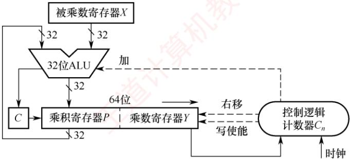  
图2.10 一个32 位无符号数乘法运算器的逻辑结构

下面介绍其主要组成部分及其工作原理。

## 1）初始化

● 被乘数寄存器X：存储32 位被乘数X，在整个乘法过程中保持不变。

• 乘数寄存器 $Y ;$ 初始时存储32 位乘数 Y。

• 乘积寄存器 $P ;$ 初始化为0，用于存放累加的部分积（高32位结果）。

· 计数器 $C _ { n } ;$ 初始化为n（本例为32），表示需进行n次迭代。

2）执行过程（循环n次）

①判断：将乘数寄存器Y的最低位，送入控制逻辑。

②加法操作：若Y的最低位为1，则将当前部分积P加上被乘数X，并将进位存入进位触发器 C；若Y的最低位为0，则执行空操作。

③移位操作：将C、P和Y视为一个整体，执行一次逻辑右移。具体来说，进位C移入P的最高位；P的最低位移入Y的最高位；Y的最低位被丢弃。

④更新计数器：计数器 $C _ { n }$ 减1。若 $C_{n} \neq 0$ ，则继续下一轮迭代，否则算法结束。

## 考点追踪无符号数乘法指令的溢出判断（2019、2020）

## 3）结果与溢出判断

• 最终结果：64 位乘积结果存储在寄存器对[P:Y]中，其中P为高32位，Y为低32 位。

● 溢出判断：若高32位结果P不为零，则表明乘积超出了32位无符号数的表示范围，发生溢出。此时，处理器将溢出标志OF与进位标志CF同时置1。 K

## 4）溢出处理

溢出处理属于软件层面的操作，通过检查CF或OF标志位即可判断是否发生溢出。若检测到溢出，则可在乘法指令后插入一条溢出自陷指令，自动触发异常处理程序，以处理错误（如报告错误、转为高精度计算等）。对于不要求结果精确性的应用，程序员可选择忽略溢出。

## （3）有符号整数的乘法运算电路

有符号整数采用补码表示，其乘法需要同时处理符号与数值。A. D. Booth提出的 Booth 算法让符号位与数值位统一参与运算，直接生成补码形式的乘积，且对正数和负数一视同仁。

图2.11所示为32位补码一位乘法器的逻辑结构，其整体架构与图2.10中的无符号乘法器非常相似，主要区别在于控制逻辑。需要说明的是，Booth

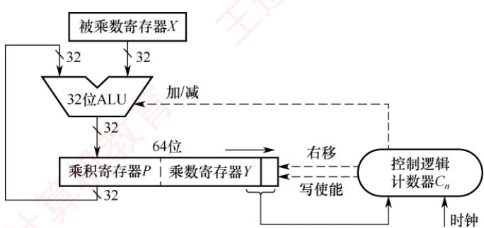  
图2.11 32 位补码一位乘法器的逻辑结构

算法的数学推导较为复杂，通常不在考研考查范围内，因此本书仅介绍其实现结构，不深入讨论其背后的原理。 东村

下面介绍其主要组成部分及其工作原理。

## 1）初始化

● 被乘数寄存器X：存储32 位被乘数，在整个乘法过程中保持不变。

● 乘积寄存器P：初始化为0，用于存放累加的部分积（高32位结果）。

● 乘数寄存器 Y：初始时存储 32 位乘数；在其右侧附加一个辅助位 $y _ { - 1 }$ ，且初始化为0。

• 计数器 $C _ { n } ;$ 初始化为n（本例为32），表示需要进行n次迭代。

2）执行过程（循环n次）

①判断：将Y的最低位 $y _ { 0 }$ 与辅助位 $y _ { - 1 }$ 组合形成两位二进制码，送入控制逻辑。

②加减法：若组合为10，则执行 $P   =   P   -   X$ （减去被乘数）；若为01，则执行 $P = P + X$ (加上被乘数）；若为00或11，则执行空操作（Booth算法的原理请参见教材）。

③移位：将P、Y和辅助位 $y _ { - 1 }$ 视为一个整体，执行一次算术右移。具体来说，P的最低位移入Y的最高位；Y的最低位移入辅助位 $y _ { - 1 }$ ；原辅助位 $y _ { - 1 }$ 被丢弃。

④循环控制：计数器 $C _ { n }$ 减1。若 $C _ { n }   \neq   0$ ，则继续下一轮迭代，否则算法结束。

## 考点追踪有符号数乘法指令的溢出判断（2021）

## 3）结果与溢出判断

·最终结果：64位乘积存储在寄存器对[P：Y中，其中P为高32位，Y为低32位。

●溢出判断：若高32位结果P不是低 32位结果Y的符号扩展（P的所有位不等于Y的符号位），则判定为溢出。此时，处理器将溢出标志OF与进位标志CF同时置1。

## 4）溢出处理

其溢出处理同样由软件完成。执行有符号乘法指令（如imul）后，应检查OF标志位：若发生溢出，则可通过条件跳转进入错误处理程序，或者利用溢出自陷机制由硬件自动触发异常处理程序，以确保程序的健壮性：若已知操作数不会导致溢出，则也可选择忽略该标志。

(4)乘法运算的三种实现方式

1）迭代式乘法器：即前文所述的经典实现结构，由ALU、移位器、寄存器和控制逻辑构成。通过多次迭代完成乘法，每次迭代处理一位乘数，若一次ALU运算和一次移位各需1个时钟周期，则完成n位乘法约需2n个时钟周期。 L

2）阵列乘法器：一种全并行的快速乘法器。所有部分积同时生成，并以二维阵列形式组织，再通过加法器网络逐级压缩求和，从而直接得到最终乘积。由于整个数据通路为组合逻辑，在时钟周期足够长的前提下，可在单个时钟周期内完成一次乘法运算。

3）移位-加减法：利用移位与加法（或减法）的组合来模拟乘法运算（例如，乘以13可分解为 $X \ll 3 + X \ll 2 + X$ 。该方法的硬件成本最低，但运算速度最慢。

## 2. 除法运算

在进行定点数除法运算之前，需要先对被除数和除数的取值进行预判，以识别异常或确定结果是否为零。具体规则如下：

1）若被除数为0、除数不为0，或|被除数|<|除数|，则商为0，余数等于被除数。

2）若被除数不为0、除数为0，则发生“除数为 $0 ^ { \prime \prime }$ 异常。

3）若被除数和除数均为0，则发生除法错误异常。

仅当被除数和除数均不为0且|被除数|≥|除数|时，才进入正式的除法计算过程。

## （1）无符号整数的除法运算原理

## 考点追踪除法运算的异常及处理（2025）

无符号整数除法与乘法类似，也是一种基于移位与加减的迭代过程，但流程更为复杂。下面以两个无符号数为例，说明手算除法步骤。

$$
\begin{array}{l}\text { 1 } \quad \text { 2 } \quad \text { 3 } \quad \text { 4 } \quad \text { 1 } \quad \text { 1 } \quad \text { 1 } \quad \text { 2 } \quad \text { 1 } \quad \text { 1 } \quad \text { 1 } \quad \text { 2 } \quad \text { 1 } \quad \text { 1 } \quad \text { 1 } \quad \text { 1 } \quad \text { 1 } \quad \text { 1 } \quad \text { 1 } \quad \text { 1 } \quad \text { 1 } \quad \text { 1 } \quad \text { 1 } \quad \text { 1 } \quad \text { 1 } \quad \text { 1 } \quad \text { 1 } \quad \text { 1 } \quad \text { 1 } \quad \text { 1 } \quad \text { 1 } \quad \text { 1 } \quad \text { 1 } \quad \text { 1 } \quad \text { 1 } \quad \text { 1 } \quad \text { 1 } \quad \text { 1 } \quad \text { 1 } \quad \text { 1 } \quad \text { 1 } \quad \text { 1 } \quad \text { 1 } \quad \text { 1 } \quad \text { 1 } \quad \text { 1 } \quad \text { 1 } \quad \text { 1 } \quad \text { 1 } \quad \text { 1 } \quad \text { 1 } \quad \text { 1 } \quad \text { 1 } \quad \text { 1 } \quad \text { 1 } \quad \text { 1 } \quad \text { 1 } \quad \text { 1 } \quad \text { 1 } \quad \text { 1 } \quad \text { 1 } \quad \text { 1 } \quad \text { 1 } \quad \text { 1 } \quad \text { 1 } \quad \text { 1 } \quad \text { 1 } \quad \text { 1 } \quad \text { 1 } \quad \text { 1 } \quad \text { 1 } \quad \text { 1 } \quad \text { 1 } \quad \text { 1 } \quad \text { 1 } \quad \text { 1 } \quad \text { 1 } \quad \text { 1 } \quad \text { 1 } \quad \text { 1 } \quad \text { 1 } \quad \text { 1 } \quad \text { 1 } \quad \text { 1 } \quad \text { 1 } \quad \text { 1 } \quad \text { 1 } \quad \text { 1 } \quad \text { 1 } \quad \text { 1 } \quad \text { 1 } \quad \text { 1 } \quad \text { 1 } \quad \text { 1 } \quad \text { 1 } \quad \text { 1 } \quad \text { 1 } \quad \text { 1 } \quad \text { 1 } \quad \text { 1 } \quad \text { 1 } \quad \text { 1 } \quad \text { 1 } \quad \text { 1 } \quad \text { 1 } \quad \text { 1 } \quad \text { 1 } \quad \text { 1 } \quad \text { 1 } \quad \text { 1 } \quad \text { 1 } \quad \text { 1 } \quad \text { 1 } \quad \text { 1 } \quad \text { 1 } \quad \text { 1 } \quad \text { 1 } \quad \text { 1 } \quad \text { 1 } \quad \text { 1 } \quad \text { 1 } \quad \text { 1 } \quad \text { 1 } \quad \text { 1 } \quad \text { 1 } \quad \text { 1 } \quad \text { 1 } \quad \text  \end{array}
$$

在手算二进制除法中，为便于从最高位开始逐位试商，通常按固定位宽书写被除数，并在高位补0（例如将4位的1111写成00001111），这些前导零不改变数值大小。具体步骤如下：

1）取被除数的高n位部分（与除数同宽）作为初始部分被除数，与除数相减。若够减，则上商1，并将差值作为中间余数；若不够减，则上商0，中间余数即为该部分被除数。

2）将被除数的下一位“带下来”，拼接到当前余数末尾，形成新的n位部分被除数；再与除数相减，确定下一位商。如此重复，直到所有位处理完毕。

手算中在被除数前补0主要是为了便于对齐和观察；硬件设计采用类似的策略，将n位被除数高位补0扩展为2n位，以支持统一的迭代过程。

## (2）无符号整数的除法运算电路

## 考点追踪除法运算器的结构（2025）

图2.12所示为一个32位除法逻辑结构图。为了适应逐位试商的迭代过程，需要将被除数加载到一个64位寄存器中（高32位为.0，低32位为实际被除数）。一般而言，n位无符号数除法采用一个2n位的被除数（高位补0）除以一个n位的除数，产生n位的商和n位的余数。

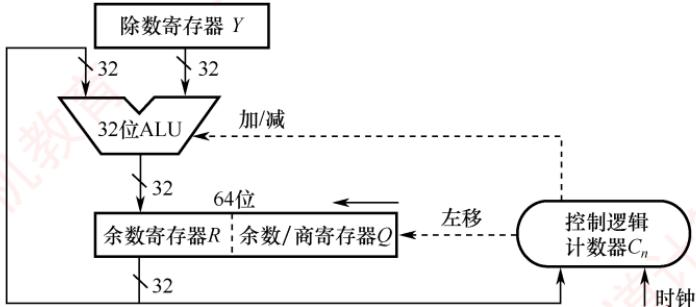  
图 2.12 一个 32 位除法逻辑结构图

下面介绍其主要组成部分及其工作原理。

## 1）初始化

• 除数寄存器 $Y ;$ 存储n位除数，在整个除法过程中保持不变。

• 余数/商寄存器 Q：初始时存储 n 位被除数；在迭代过程中逐步生成 n位商。

• 余数寄存器R：初始化为0，用于暂存中间余数。

• 计数器 $C _ { n } \colon$ 初始化为n，表示需要执行n轮迭代。

• 异常预检：若除数为0，则立即触发“除零错误”异常，停止除法运算；若被除数<除数，则商 =0，余数=被除数，无须进入执行过程。

## 2）执行过程（循环n次）

①移位：将R与Q视为一个整体，执行一次逻辑左移。具体来说，R的最高位被移出（通常丢弃），Q的最高位移入R的最低位，的最低位空出以接收新商位。

②试商与减法：计算[R]-[Y]；若结果大于或等于0，则当前商位为1，并将结果（差值）写回R；若结果小于0，则当前商位为0，并执行 $[ R ] + [ Y ]$ 以恢复余数（撤销减法）。

③ 循环控制：计数器 $C _ { n }$ 减1。若 $C_{n} \neq 0$ ，则继续下一轮迭代，否则算法结束。

## 3）最终结果

最终的n位商存储在寄存器Q中，n位余数存储在寄存器R中。

## 4）异常处理

当检测到“除数为 $0 ^ { \circ }$ 时，除法器立即停止运算，并置位“除零”异常标志。该异常通常由硬件自动捕获，并通过中断向量表跳转至预设的异常处理程序。 省村

## 注意

两个n位无符号数相除不会发生溢出。因为被除数最大为 $2 ^ { n } - 1$ ，最小的非零除数为1，此时商为最大值，即为 $2 ^ { n }   - 1$ ，恰好可用n位无符号数表示。

## (3）补码除法运算的工作原理

补码作为有符号整数的标准表示形式，其除法运算需要同时处理符号与数值。补码除法让符号位与数值位统一参与运算，商的符号在运算过程中自然生成。对于两个n位补码数相除，被除数需要先进行符号扩展至2n位；若被除数为2n位，除数为n位，则无须扩展。

由于补码除法涉及有符号数的比较、加减和移位，其试商规则要比无符号除法复杂得多。根据考试大纲要求，仅需掌握其基本实现，底层的原理可参见教材。补码除法的硬件结构与图2.11所示的无符号除法电路基本一致，下面结合该图说明其基本工作过程。

## 考点追踪除法运算器的初始化步骤（2025）

1）初始化：

· 除数寄存器Y：存储n位除数，在整个除法过程中保持不变。

• 余数/商寄存器 $Q ;$ 初始时存储n位被除数；在迭代过程中逐步生成n位商。

● 余数寄存器R：所有位都初始化为被除数的符号位，即完成符号扩展。

• 计数器 $C _ { n } ;$ 初始化为n，表示需要执行n轮迭代。

· 异常预检：若除数为0，则立即触发“除零错误”异常，停止除法运算；若|被除数<除 数|，则商=0，余数=被除数，无须进入执行过程。 -X

2）执行过程（循环n次）

①移位：将R与Q视为一个整体，执行一次算术左移。

②试商与加减：控制逻辑根据[R]与[Y]的关系，发出加法或减法信号以确定当前商位。由于涉及有符号数的恢复机制，具体判定规则较复杂，此处不展开。

③循环控制：计数器 $C _ { n }$ 减1。若 $C _ { n }   \neq   0$ ，则继续下一轮迭代，否则算法结束。

## 3）最终结果

最终的商存储在Q中，余数（符号与被除数相同）存储在R中。

## 4）异常处理

当检测到除数为0或发生商溢出时，除法器立即停止运算，并置位相应异常标志，该异常的捕获和处理方式与无符号除法类似。值得注意的是，在两个n位补码除法中，商溢出仅有一种情形：被除数为最大负数 $- 2 ^ { n - 1 }$ ，且除数为-1，此时结果 $2 ^ { n - 1 }$ 无法用n位补码表示。

## 2.2.5 本节习题精选

## 一、单项选择题

01. 算术逻辑单元（ALU）的核心部件是（）。A. 多路选择器 B. 移位器 C. 加法器 D. 寄存器

02.算术逻辑单元（ALU）的功能通常包括（）。A. 算术运算 B. 逻辑运算C. 算术运算和逻辑运算 D. 加法运算

03. 补码定点整数0101 0101算术左移两位后的值为（）。A. 0100 0111 B. 0101 0100 C. 0100 0110 D. 0101 0101

04. 下列四个补码整数存放于8位寄存器中，算术左移不会发生溢出的是（）。A. 80H B. 90H C. B0H D. COH

05. 补码定点整数10010101右移一位后的值为（）。XA.0100 1010 B. 01001010 1 C. 1000 1010 D.1100 1010

06.两个机器数7E5H 和 4D3H相加，得（）。 王人A. BD8H B. CD8H C. CB8H D. CC8H

07. 设机器数字长为8位（含1位符号位），若机器数BAH为补码，算术左移1位和算术右移1位分别得（）。 育A. F4H, EDH B. B4H, 6DH C.74H, DDH D. B5H, EDH

08. 在定点运算器中，无论是采用双符号位还是采用单符号位，必须有（）。A. 译码电路，它一般用“与非”门来实现B. 编码电路，它一般用“或非”门来实现C. 溢出判断电路，它一般用“异或”门来实现D. 移位电路，它一般用“与或非”门来实现

09. 机器运算发生溢出的根本原因是（）。A. 寄存器的位数有限 B. 运算中将符号位的进位丢弃C. 运算中将符号位的借位丢弃 D. 数据运算中发生错误

10. 假定有两个整数用8位补码分别表示为 $r _ { 1 }   =   \mathrm { F 5 H }$ $r _ { 2 } =$ EEH。若将运算结果存放在一个8位寄存器中，则下列运算会发生溢出的是（）。 A. $r_{1} + r_{2}$ B. $r _ { 1 } - r _ { 2 }$ C. $r _ { 1 } { \times } r _ { 2 }$ D. $r_{1} / r_{2}$ 草机

11.关于模4补码，下列说法正确的是（）。A. 模4补码和模2补码不同，它不容易检查乘除运算中的溢出问题B. 每个模4补码存储时只需要一个符号位 王C. 存储每个模4补码需要两个符号位D. 模4补码，在算术与逻辑单元中为一个符号位

12. 若采用双符号位，则两个正数相加产生溢出的特征时，双符号位为（）。A. 00 B. 01 C. 10 D. 11

13. 判断加减法溢出时，可采用判断进位的方式，若符号位的进位为 $C _ { 0 } ,$ 最高位的进位为$C _ { 1 }$ $ 产$ I. $C_{0}  产$ 生进位 ⅡI. $C_{1}  产$ 生进位III. $C_{0} 、 C_{1}$ 都产生进位 美IV. $C_{0} 、 C_{1}$ 都不产生进位

V. $C_{0}  产$ 生进位， $C _ { 1 }$ 不产生进位 VI. $C _ { 0 }$ 不产生进位， $C _ { 1 }$ 产生进位A. I和Ⅱ B. III C.IV D. V和 VI

14. 在补码的加减法中，用两位符号位判断溢出，两位符号位 $S _ { \mathrm { s } 1 } S _ { \mathrm { s } 2 } = 1 0$ 时，表示（）。A. 结果为正数，无溢出 B. 结果正溢出C. 结果负溢出 道计 D. 结果为负数，无溢出

15. 若 $[X]_{ 补 } = X_0 \cdot X_1X_2 \cdots X_n$ 其中 $X _ { 0 }$ 为符号位， $X _ { 1 }$ 为最高数位。若（），则当补码算术左移时，将会发生溢出。A. $X _ { 0 }   =   X _ { 1 }$ B. $X _ { 0 }   \neq   X _ { 1 }$ C. $X _ { 1 } = 0$ D. $X _ { 1 } = 1$ XTA

16. 假设一次ALU运算和一次移位操作各需1个时钟周期，则32位无符号整数乘法电路完A. 16 成一次乘法运算所需的时钟周期数约为（）。 B.64 C.96 D.100 气机教

17.下列关于移位运算的说法中，正确的是（）。I.补码算术左移时，高位移出，低位补0，若左移前后的符号位不同，则发生溢出Ⅱ.无符号数逻辑左移时，若最高位移出的是1，则发生溢出  
HⅢ.逻辑左移和补码算术左移的结果都一样，都是移出最高位，并在低位补0A. I、III B. 仅Ⅱ C. 只有Ⅲ D. I、ⅡI、ⅢII

18. 某计算机字长为8位，CPU中有一个8位加法器。已知无符号数x=69，y=38，若在该加法器中计算x-y，则加法器的两个输入端信息和输入的低位进位信息分别为（）。A. 01000101、00100110、0 B.0100 0101、1101 1001、1C. 0100 0101、1101 1010、0 D.0100 0101、1101 1010、1

19. 某计算机中有一个8位加法器，有符号整数x和y的机器数用补码表示， $[x]_{ 补 } =  F 5 H$ $[y]_{ 补 } = 7 EH$ ，若在该加法器中计算x一y，则加法器的低位进位输入信息和运算后的溢出标志 OF 分别是（）。 王道A. 1、1 B. 1、 C. 0、1 D. 0、0

20. 某8位计算机中，x和y是两个有符号整数，用补码表示， $[x]_{ 补 } = 44\mathrm{H}$ $[y]_{ 补 } =  DCH$ ，则$x / 2 + 2 y$ 的机器数及相应的溢出标志OF分别是（）。A. CAH、OB. CAH、1 C. DAH、0 D. DAH、1 收育

21. 某8位计算机中，x和y是两个有符号整数，用补码表示， $[x]_{ 补 } = 44\mathrm{H}$ $[y]_{ 补 } =  DCH$ ，则$x   ^ { - } 2 y$ 的机器数及相应的溢出标志OF分别是（）。 算机DA. 8CH、1 B. 8CH、0 C. 68H、1 D. 68H、0

22. 某 C 语言代码段如下：int si=65536;short i=si;$\mathtt { u n s i g n e d \_ j = 0 ; }$ if(i<=j-1) printf("王道");else printf("计算机教育");

当上述代码段执行到if分支条件的判断时，会根据标志寄存器中的（）决定执行顺序。最终的输出结果是（）。A. CF, 王道 B. CF, 计算机教育 C. OF, 王道 D. OF，计算机教育

23. 下图是实现32位补码一位乘法的逻辑结构图，下列说法中正确的是（）。

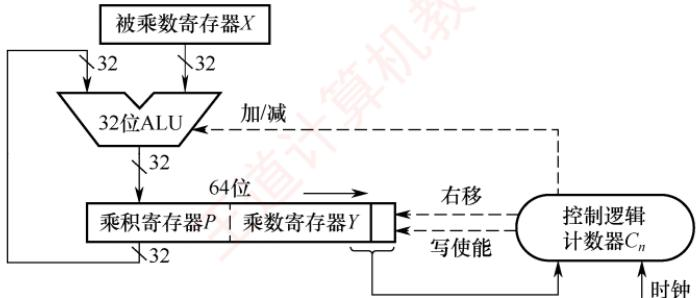

A. 32位无符号整数的乘法电路和该图没有区别B. 在执行过程中，ALU要么做加法，要么做减法，不可能执行空操作C. 图中的乘积寄存器P和乘数寄存器Y所执行的右移是算术右移D. 计算完成后，若乘积寄存器P中的值不全为0，则发生溢出

24. 某计算机采用下图所示的补码除法器执行32位补码整数除法运算，当除数寄存器Y与余数/商寄存器Q的初始值为（）时，除法执行时间最短（Y、Q均为补码表示）。

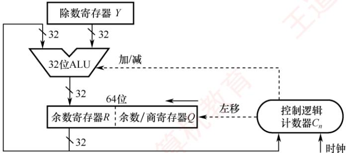

A. Y= FFFF FFFF, Q = 8000 0000 B. Y = 8000 0000, Q = FFFF FFFF C. Y = FFFF FFFF, Q = FFFF FFFF D. Y= 8000 0000, Q = 8000 0000

25.【2009统考真题】一个C语言程序在一台32位机器上运行。程序中定义了三个变量x，y, z，其中 x和 z 为 int 型，y 为 short 型。当 $x = 127, y = -9$ 时，执行赋值语句 $\mathbf { \boldsymbol { z } }   =   \mathbf { \boldsymbol { x } } + \mathbf { \boldsymbol { y } }$ 后，x, y, z 的值分别是（）。A. x = 0000007FH, y = FFF9H, z = 00000076HB. x = 0000007FH, y = FFF9H, z = FFFF0076HC. x = 0000007FH, y = FFF7H, z = FFFF0076H 算机教育D. x = 0000007FH, y = FFF7H, z = 00000076H

26.【2010统考真题】假定有四个整数用8位补码分别表示： $r _ { 1 }   =   \mathrm { F E H }$ $r_{2}=\mathrm{F}2\mathrm{H}$ $r _ { 3 }   =   9 0 \mathrm { H }$ $r_{4} = \mathrm{F8H}$ ，若将运算结果存放在一个8位寄存器中，则下列运算会发生溢出的是（）。YA. $r _ { 1 } { \times } r _ { 2 }$ B. $r _ { 2 } { \times } r _ { 3 }$ C. $r _ { 1 } { \times } r _ { 4 }$ D. $r _ { 2 } { \times } r _ { 4 }$

27. 【2013统考真题】某字长为8位的计算机中，已知整型变量x、y的机器数分别为 $\left[ x \right]_{ 补 } =$ 11110100，[y]补=10110000。若整型变量 $z = 2x + y / 2$ ，则z的机器数为（）。A. 1 1000000 B. 0 0100100 C. 1 0101010 D. 溢出

28. 【2014统考真题】若x= 103，y=-25，则下列表达式采用8位定点补码运算实现时，会发生溢出的是（）。A. $x + y$ B. $- x + y$ $x   -   y$ D. $- x - y$

29.【2018统考真题】假定有符号整数采用补码表示，若int型变量x和y的机器数分别是FFFF FFDFH和 0000 0041H，则x、y 的值及 x-y的机器数分别是（）。A. $x = -65, y = 41, x - y$ 的机器数溢出

B. x = -33, y = 65, x − y 的机器数为 FFFF FF9DH C. x = -33, y = 65, x − y 的机器数为 FFFF FF9EH D. x = −65, y = 41, x − y 的机器数为 FFFF FF96H

30. 【2018统考真题】整数x的机器数为11011000，分别对x进行逻辑右移1位和算术右移1位操作，得到的机器数各是（）。A. 1110 1100、1110 1100 B. 0110 1100、1110 1100C. 1110 1100、0110 1100 D. 0110 1100、 0110 1100

31. 【2018统考真题】减法指令“sub R1,R2,R3”的功能为“(R1)-(R2)→R3”，该指令执 行后将生成进位/借位标志 CF 和溢出标志 OF。若(R1) = FFFF FFFFH，(R2) = FFFF FFFOH，则该减法指令执行后，CF与OF分别为（）。 A. CF = 0, OF = 0 B. CF = 1, OF = 0 C. CF = 0, OF = 1 D. CF = 1, OF = 1

32. 【2023 统考真题】已知 x, y 为 int型，当 x = 100, y = 200 时，执行“x 减 y”指令得到的溢出标志OF和借位标志CF 分别为0,1，那么当x = 10, y = -20时，执行该指令得到的OF和CF分别为（）。  
A. OF = 0, CF = 0 B. OF = 0, CF = 1 C. OF = 1, CF = 0 D. OF = 1, CF = 1

33.【2024统考真题】C语言代码段如下，执行该代码段后，j的值是（）。int i=32777;short si=i;int j=si;A. -32777 B. -32759 C. 32759 D. 32777

34.【2024统考真题】下列关于整数乘法运算的叙述中，错误的是（）。A. 用阵列乘法器实现的乘运算可以在一个时钟周期内完成B. 用ALU和移位器实现的乘运算无法在一个时钟周期内完成C. 变量与常数的乘运算可编译优化为若干移位及加减运算指令D. 两个变量的乘运算无法编译转换为移位及加法等指令的循环实现

35.【2025统考真题】假设在8位字长的计算机中，两个带符号整数x和γ的补码表示分别为[x]补=A3H、[y]补=75H，则通过补码加减运算器得到的x-y的值及OF标志分别为()。A. 24, 0B. 24, 1 C. 46,0 D. 46, 1

## 二、综合应用题

01. 已知 32 位寄存器 R1 中存放的变量 x 的机器码为 8000 0004H，unsigned int 型的乘除法采用逻辑移位操作，int型的乘除法采用算术移位操作，请问：1）当 x 是 unsigned int 型时，x 的真值是多少？x/2 存放在 R1 中的机器码是什么？x/2王 的真值是多少？2x存放在R1中的机器码是什么？2x的真值是多少？

2）当 x是 int型时，x的真值是多少？x/2 存放在 R1 中的机器码是什么？x/2 的真值是多少？2x存放在R1中的机器码是什么？2x的真值是多少？

02. 假设有两个整数x=-68，y=-80，采用补码形式（含1位符号位）表示，x和y分别存放在寄存器A和B中。另外，还有两个寄存器C和D。A、B、C、D都是8位的寄存器。请回答下列问题（要求最终用十六进制数表示二进制数序列）：1）寄存器A和B中的内容分别是什么？2）x和y相加后的结果存放在寄存器C中，则寄存器C中的内容是什么？此时，溢出标志OF、符号标志SF各是什么？

3）x和y相减后的结果存放在寄存器D中，寄存器D中的内容是什么？此时，溢出标志 OF、符号标志 SF 各是什么？

03. 【2011统考真题】假定在一个8位字长的计算机中运行如下C程序段：

unsigned int x=134;   
unsigned int y=246;   
int m=x;   
int n=y;   
unsigned int z1=x-y;   
unsigned int z2=x+y;   
int k1=m-n;   
int k2=m+n;

若编译器编译时将 8 个 8 位寄存器 R1 \~ R8 分别分配给变量 x, y, m, n, z1, z2, k1 和 k2。  
请回答下列问题（提示：有符号整数用补码表示）。

1）执行上述程序段后，寄存器R1、R5和R6的内容分别是什么（用十六进制数表示）？

2）执行上述程序段后，变量m和k1的值分别是多少（用十进制数表示）？

3）上述程序段涉及有符号整数加减、无符号整数加减运算，这四种运算能否利用同一个加法器辅助电路实现？简述理由。

4）计算机内部如何判断有符号整数加减运算的结果是否发生溢出？上述程序段中，哪些有符号整数运算语句的执行结果会发生溢出？

04.【2020统考真题】有实现x×y的两个C语言函数如下：

unsigned umul (unsigned x, unsigned y){ return x\*y; }   
int imul (int x, int y) {return x \* y; }

假定某计算机M中的ALU只能进行加减运算和逻辑运算。请回答下列问题。

1）若M的指令系统中没有乘法指令，但有加法、减法和位移等指令，则在M上也能实现上述两个函数中的乘法运算，为什么？

2）若M的指令系统中有乘法指令，则基于ALU、位移器、寄存器及相应控制逻辑实现乘法指令时，控制逻辑的作用是什么？

3）针对以下三种情况：a）没有乘法指令；b）有使用ALU和位移器实现的乘法指令；c）有使用阵列乘法器实现的乘法指令，函数umul()在哪种情况下执行的时间最长？在哪种情况下执行的时间最短？说明理由。 uK

4）n位整数乘法指令可保存2n位乘积，当只取低n位作为乘积时，其结果可能发生溢出。当 $n = 32, x = 2^{31} - 1, y = 2$ 时，有符号整数乘法指令和无符号整数乘法指令得到的 x×y的2n位乘积分别是什么（用十六进制数表示）？此时函数 umul()和imul()的返回结果是否溢出？对于无符号整数乘法运算，当仅取乘积的低n位作为乘法结果时，如何用2n位乘积进行溢出判断？ 道

## 2.2.6 答案与解析

## 一、单项选择题

## 01. C

ALU的核心功能是算术与逻辑运算，其中加法是最基础的操作：减法可用补码加法实现，乘除可由加法和移位组合而成。因此，加法器是ALU最核心的部件。

02. C

ALU既能进行算术运算又能进行逻辑运算。

03. B

该数是一个正数（最高位为0），按照补码算术移位规则，算术左移两位后，移出了最高位01，低位补0，因此算术左移两位后的结果是01010100。虽然移位后该数的符号位仍为0，但是移出了有效位1，所以本次算术移位发生了溢出。

## 04. D

$80\mathrm{H}=(10000000)\cdots1=00000000$ ，左移前的符号位为1，左移后的符号位为0，溢出。90H=(1001$0000 \leq 1 = 00100000$ ，左移前的符号位为1，左移后的符号位为0，溢出。 $\mathrm{B0H}=(1011\ 0000)<<1=0110$ 0000，左移前的符号位为1，左移后的符号位为0，溢出。 $\mathrm{C0H}=(1100\ 0000)<<1=10000000$ ，左移前的符号位为1，左移后的符号位为1，未溢出，选项D正确。 XTA

## 05. D

该数是一个负数（最高位为1），按照算术补码移位规则，负数右移添1，负数左移添0，所以10010101右移一位后的值为11001010。 顺村

## 06. C

在十六进制数的加减法中，逢十六进一，因此有 $7 E 5 H +4 D 3 H = CB 8 H$

## 07.C

算术左移时，低位补0；算术右移时，高位补符号位。 $\mathrm{BAH} = (1011, 1010)_2$ ，算术左移1位得$(0111\;0100)_{2}=74\mathrm{H}$ ，左移前后的符号位不同，溢出；算术右移1位得 $(1101\ 1101)_{2} = \mathrm{DDH}$

## 08. C

三种溢出判别方法，均须有溢出判别电路，可用“异或”门来实现。

## 09. A

## 10. C

首先将r₁和 $r _ { 1 }$ $r _ { 2 }$ 转换为真值， $\mathrm{F5H} = 11110101$ ，转换为原码是10001011，真值为-11；EEH=11101110，转换为原码是10010010，真值为-18，8位补码的表示范围为[-128,127]， $r _ { 1 } { \times } r _ { 2 }$ 的结果为198，超出了8位补码的表示范围，发生溢出。

## 11. B

模4补码具有模2补码的全部优点且更易检查加减运算中的溢出问题，选项A错误。需要注意的是，存储模4补码仅需一个符号位，因为任何一个正确的数值，模4补码的两个符号位总是相同的，选项B正确。只在把两个模4补码的数送往ALU完成加减运算时，才把每个数的符号位的值同时送到ALU的双符号位中，即只在ALU中采用双符号位，选项C、D错误。

## 12. B

采用双符号位时，第一符号位表示最终结果的符号，第二符号位表示运算结果是否溢出。若第二位和第一位符号相同，则未溢出；若不同，则溢出。若发生正溢出，则双符号位为01，若发生负溢出，则双符号位为10。 X

## 13. D

采用进位位来判断溢出时，当最高有效位进位和符号位进位的值不相同时才产生溢出。两正数相加，当最高有效位产生进位 $( C _ { 1 } = 1 )$ 而符号位不产生进位 $( C _ { 0 } = 0 )$ 时，发生正溢出；两负数相加，当最高有效位不产生进位 $( C _ { 1 }   =   0 )$ 而符号位产生进位 $( C _ { 0 } = 1 )$ 时产生负溢出。因此溢出条件为 $\overline{C_{0}}C_{1}+C_{0}\overline{C_{1}}=C_{0}\oplus C_{1}$ 0 机字

## 14. C

用两位符号位判断溢出时，两个符号位不同时表示溢出，即01时表示正溢出；10时表示负溢出；两个符号位相同时（11或00）表示未溢出。

## 15. B

补码左移时，若移出的高位不同于移位后的符号位，即左移前后的符号位不同，则发生溢出。补码左移时， $X _ { 0 }$ 移出， $X _ { 1 }$ 取代 $X _ { 0 }$ 成为新的符号位，因此若 $X _ { 0 }   \neq   X _ { 1 }$ ，则表示发生了溢出。

## 16. B

32位无符号乘法通常采用“移位-相加”算法，共进行32轮迭代，每轮至少包含1次加法（或空操作）和1次移位。每轮消耗2个时钟周期（加法+移位），共需约 $32 \times 2 = 64$ 个时钟周期。

## 17. D

对于左移操作，逻辑左移和算术左移的结果都一样，高位移出，低位补0。逻辑移位不考虑符号位的问题，逻辑左移时，若最高位移出的是1，表示发生溢出。算术左移时，若移出的高位不同于移位后的符号位，即左移前后的符号位不同，表示发生溢出。因此说法Ⅰ、Ⅱ、Ⅲ均正确。

## 18. B

不管是补码减法，还是无符号数减法，都是用被减数加上减数的负数的补码来实现的。根据求补公式，减数ν的负数的补码 $[-y]_{补} = \bar{Y} + 1$ ，因此，在加法器的Y'输入端用一个反向器实现，并用控制端Sub控制多路选择器是否将ν的各位取反后，输入Y′端，同时将Sub作为低位进位送到加法器。当 Sub为1时，做减法，Sub=1控制将 $\bar { Y }$ 输入加法器 $Y ^ { \prime }$ 端，即实现“各位取反”功能：同时将Sub=1作为低位进位送到加法器，实现“末位加1”功能。69的二进制数为01000101；38的二进制数为00100110，各位取反得11011001。做减法时，低位进位为Sub，即为1。

## 注意

若仅记忆补码加减运算的过程，而未掌握加法电路的原理，则本题易误选D。

## 19. A

对补码减法运算，控制端Sub为1，所以低位进位输入位 $\xi = \mathrm{Sub} = 1 \circ [x]_{补} = 11110101, \quad [y]_{补} = 0111$ 1110, $[ - y ] _ { 8 } = 1 0 0 0 0 0 0 1 + 1 , [ x ] _ { 8 } - [ y ] _ { 8 } = [ x ] _ { 8 } + [ - y ] _ { 8 } = 1 1 1 1 0 1 0 1 + 1 0 0 0 0 0 1 0 = 0 1 1 1 0 1 1 1$ ，进位丢掉，参与运算的两个数的符号位均为1，结果的符号位为0，所以溢出标志OF为1。

## 20. C

$[x/2+2y]_{0}=[x]_{0}\gg1+[y]_{0}<<1=0100\ 0100\gg1+1101\ 1100<<1=0010\ 0010+1011\ 1000=$ $1101\ 1010= DAH$ x右移移出了0，没有溢出或损失精度；y为负数，左移后，符号位仍为1，没有溢出；且从最后一步加法操作来看，一个正数和一个负数相加，必然不会溢出。

## 21. A

$[x]_{ 补 }=44 H =0100\ 0100,\ [y]_{ 补 }=DCH =1101\ 1100 。$ 。执行x−2y时，先将y算术左移一位，得到10111000，未溢出，然后各位取反，再与x相加，做减法时Sub=1，即 $0100\;0100+0100\;0111+1=$ 10001100(8CH)，两个加数的符号都为0，而结果的符号为1，因此发生了溢出，即 $\mathrm { O F } = 1$

## 22. A

无符号数和有符号数一起参与运算时，计算机按无符号数来解释最终的执行结果，因此j-1的结果是32个全1，会被解释成最大的无符号数。 $65536 = 2^{16}$ ，当把 si 强制转换为 short 型时，直接保留机器数的末16位，即16个全0，因此，当i和j-1进行比较时，根据无符号数的解释，OF标志是没有意义的，即根据CF位可知i小于i-1，因此最终输出“王道”。

## 23. C

无符号乘法无须辅助位，电路结构更简单。当控制逻辑的输入是“00”或“11”时，ALU执行空操作，仅移位。因结果为有符号数，P和【的右移必须为算术右移，以保持符号位不变，选项C正确。溢出判断依据是P的所有位是否都等于Y的符号位，而非P是否全为0。

## 24. B

该补码除法器在正式迭代之前会先判断：若被除数的绝对值小于除数的绝对值，则直接置商为0、余数为被除数，跳过全部移位和加减操作，从而最快完成。在选项B中， $Y   =   - 2 ^ { 3 1 }$ ，绝对值为 $2 ^ { 3 1 }$ .$Q   =   - 1$ ，绝对值为1。由于 $| Q | < | Y |$ ，满足快速退出条件，故执行时间最短。

## 25. D

C语言中的整型数据为补码形式，int型为32位，short型为16位，因此x、y的机器数写为0000 007FH、FFF7H。执行 $\mathrm { z }   =   \mathrm { x }   +   \mathrm { y }$ 时，x为 int型，y 为 short型，因此需将 y的类型强制转换为int型，在机器中通过符号位扩展实现，y的符号位为1，因此在y的前面添加16个1，即可将y强制转换为 int型，其十六进制形式为FFFFFFF7H。然后执行加法，即 0000 007FH+FFFF FFF7H=00000076H，其中最高位的进位1自然丢弃。

## 26. B

本题的真正意图是考查补码的表示范围，采用补码乘法规则计算出四个选项是费力不讨好的做法，且极易出错。8位补码所能表示的整数范围为-128～+127。将四个数全部转换为十进制数：$r _ { 1 }   =   - 2$ $r_{2} = -14$ $r _ { 3 }   =   - 1 1 2$ $r _ { 4 }   =   - 8$ ，得 $r_{2} \times r_{3} = 1568$ ，远超出了表示范围，发生溢出。

## 27. A

$x ^ { * } 2$ ，将x算术左移一位为1 1101000；y/2，将y算术右移一位为11011000，均无溢出或丢失精度。补码相加为 $1\ 1101000+1\ 1011000=1\ 1000000$ ，亦无溢出。

## 28. C

8位定点补码表示的数据范围为-128～127，若运算结果超出这个范围，则会溢出。对选项A，$x + y = 103 - 25 = 78$ ，符合范围。对选项B， $-x+y=-103-25=-128$ ，符合范围。对选项D， $-x - y =$ KN$-103+25=-78$ ，符合范围。对选项C， $x - y = 103 + 25 = 128$ ，超过127。

## 29. C

利用补码转换为原码的规则：负数的符号位不变数值位取反加1；正数补码等于原码。两个机器数对应的原码是 $[x]_{ 原 } = 80000021  H ;$ 对应的数值是-33， $[y]_{ 原 } = [y]_{ 补 } = 00000041\mathrm{H} = 65$ 。排除选项A、 $D \circ x - y$ 直接利用补码减法准则， $\left[ x \right]_{补} - \left[ y \right]_{补} = \left[ x \right]_{补} + \left[ -y \right]_{补}$ ，-y的补码是连同符号位取反加1，最终减法变成加法，得出结果为FFFFFF9EH。

## 30. B

逻辑移位：左移和右移空位都补0，且所有数字参与移动；补码算术移位：仍然是所有数字参与移动，右移空位补符号位，左移空位补0。根据该规则，轻松选取选项B。

## 31. A

[x] $\left[ y \right]_{ 补 } = \left[ x \right]_{ 补 } + \left[ - y \right]_{ 补 } , \left[ - R 2 \right]_{ 补 } = 00000010 H$ ，很明显 $\left[ \mathrm{R1} \right]_{ 补 } + \left[ -\mathrm{R2} \right]_{ 补 }$ 的最高位进位和符号位进位都是1（当最高位进位和符号位进位的值不相同时才产生溢出），可以判断溢出标志OF为0。同时，减法操作只需判断借位标志，R1大于R2，所以借位标志为0。

## 32. B

ALU生成标志位时只负责计算，而不管运算对象是有符号数还是无符号数，CF =1表示当作无符号数运算时溢出，OF=1表示当作有符号数运算时溢出。当作有符号数时， $x = 10,   y = -20$ $x - y = 3 0$ ，未超过32位有符号数范围，不溢出， $\mathrm { O F } = 0$ 。当作无符号数时， $x' = 10, \quad y' = 2^{32} - 20$ （符号位读作数值位）， $x^{\prime}-y^{\prime}=30-2^{32}$ ，为负，超过32位无符号数范围，溢出， $\mathrm { C F } = 1$

## 33. B

$2^{15}=32768,\quad i=32768+9=8000\mathrm{H}+9\mathrm{H}=8009\mathrm{H}$ ，32位有符号数i的机器数为00008009H。将32 位有符号数i 强制转换为16 位有符号数 si，直接保留机器数的末16位即可，因此 si的机器数为8009H，真值为 $-2^{15}+9=-32759$ 。将16位有符号数 si强制转换为32位有符号数j，采用符号扩展（si

的符号为1，因此高位补1），j的机器数变为FFFF8009H，对应的真值为-32759。

<table><tr><td rowspan=1 colspan=1></td><td rowspan=1 colspan=1>int i</td><td rowspan=1 colspan=1>short si</td><td rowspan=1 colspan=1>int j</td></tr><tr><td rowspan=1 colspan=1>机器数</td><td rowspan=1 colspan=1>0000 8009H</td><td rowspan=1 colspan=1>8009H</td><td rowspan=1 colspan=1>FFFF 8009H</td></tr><tr><td rowspan=1 colspan=1>真值</td><td rowspan=1 colspan=1>32777</td><td rowspan=1 colspan=1>-32759</td><td rowspan=1 colspan=1>-32759</td></tr></table>

## 34. D

阵列乘法器中的所有部分积同时产生并组成一个阵列，运用多操作数相加就能得到最终的积，因此可在一个时钟周期内完成。用ALU和移位器实现的乘运算通常采用串行的乘法算法，需要多个时钟周期才能完成。当一个乘数是常数时，编译器可将乘运算优化为若干移位和加减运算指令。两个变量的乘运算可通过移位和加法等指令循环实现，选项D错误。 XTOT

## 35. D

要求计算x-y，即 $\left[ \bar{x} \right]_{补} + \left[ -y \right]_{补}$ 。首先求[-y]补：对[y]补按位取反得10001010，再加1，得1000$1 0 1 1 = 8 \mathrm { B H }$ 。然后计算 $[x]_{於}+[-y]_{於}=A3H+8BH=10100011+10001011=(1)0010.1110$ ，忽略进位后，结果为 $00101110 = 2\mathrm{EH}$ ，对应十进制数46。判断溢出：参与运算的两个操作数符号位均为1（负数），而结果符号位为0（正数），表明发生了溢出，因此 $\mathrm { O F } = 1$

## 二、综合应用题

## 01. 【解答】

1）对于无符号数，所有二进制位均为数值位。乘以2和除以2运算，相当于无符号数的逻辑左移和逻辑右移。x的真值为 $2 ^ { 3 1 } \pm 2 ^ { 2 }$ 。R1中的机器码逻辑右移一位（高位补0）为40000002H，相当于除以2，所以x/2的真值为 $2^{30} + 2$ 。R1中的机器码逻辑左移一位（低位补0）为00000008H，相当于乘以2，高位丢1，结果溢出，2x的真值为 $2 ^ { 3 }$ （溢出）。

2）对于有符号数（补码），最高位为符号位。乘以2和除以2运算，相当于补码的算术左移和算术右移。8000 0004H对应二进制数的最高位为1，即为负数，其真值为 $r ( 2 ^ { 3 1 }   - 2 ^ { 2 } )$ 。R1中的机器码算术右移一位（高位补1）为C0000002H，相当于除以2，x/2的真值 $-(2^{30} - 2)$ 0R1中的机器码算术左移一位（低位补0）为00000008H，相当于乘以2，移位前后的符号位不同，表示溢出，2x的真值为8（溢出）。

## 02. 【解答】

1）因为 $x = -68 = -(10000100)_2$ ，则 $\left[ -68 \right]_{补} = 1011\ 1100 =  BCH$ ；因 $y = - 80 = - (101\ 0000)_2$ $[-80]_{ 补 } = 1011\ 0000 =  B0H$ ，所以寄存器A 和 B 中的内容分别是BCH、BOH。

2) $[x+y]_{种}=[x]_{种}+[y]_{种}=1011\ 1100+1011\ 0000=(1)\ 0110\ 1100=6\  CH$ ，所以寄存器C中的内容是6CH，其真值为108。此时，溢出标志OF为1，表示溢出，说明寄存器C中的内容不是正确结果；符号标志SF为0，表示结果为正数（OF为1，说明SF也是错的）。

3) $[x-y]_{ 补 }=[x]_{ 补 }+[-y]_{ 补 }=1011\ 1100+0101\ 0000=(1)\ 0000\ 1100=0CH$ ，最高位前面的一位被丢弃（取模运算），结果为12，所以寄存器D中的内容是0CH，其真值为12。此时，溢出标志OF为0，表示不溢出，也就是说，寄存器D中的内容是正确的结果：符号标志SF为0，表示结果为正数。

## 03.【解答】

1）因为 $134 = 128 + 6 = 1000\;0110$ ，所以x的机器数为1000 0110B，因此R1的内容为86H。$246 = 255 - 9 = 11110110B$ ，所以y的机器数为11110110B， $x - y = 1000\ 0110 + 0000\ 1010 =$ (0)1001 0000，括号中为加法器的进位，因此R5的内容为90H。 $x + y = 1000\ 0110 + 1111$ $0 1 1 0 = ( 1 ) 0 1 1 1 1 1 0 0$ ，括号中为加法器的进位，因此R6的内容为 $7 \mathrm { C H }$

2）m的机器数与x的机器数相同，皆为 $86\mathrm{H}=10000110\mathrm{B}$ ，解释为有符号整数m（用补码表示）时，其值为 $-111\;1010B=-122\;m-n$ 的机器数与x-y的机器数相同，皆为 $9 0 \mathrm { H } = 1 0 0 1$

0000B，解释为有符号整数k1（用补码表示）时，其值为 $-111\ 0000B=-112$

3）能。n位加法器实现的是模2”无符号整数加法运算。对于无符号整数a和 $b , a + b$ 可以直接用加法器实现，而 $a   - b$ 可用a加-b的补数实现，即 $a - b = a + \left[ - b \right]_{ 补 } \left( \bmod 2^n \right)$ ，所以n位无符号整数加减运算都可在n位加法器中实现。因为有符号整数用补码表示，补码加减运算公式为 $\left[ a + b \right]_{ 补 } = \left[ a \right]_{ 补 } + \left[ b \right]_{ 补 } \left( \bmod 2^n \right) , \left[ a - b \right]_{ 补 } =$ $[a]_{补}+[-b]_{补}\left(\bmod\ 2^{n}\right)$ ，所以n位有符号整数加减运算都可在n位加法器中实现。

4）有符号整数加减运算的溢出判断规则为：若加法器的两个输入端（加法）的符号相同，且不同于输出端（和）的符号，则结果溢出，或加法器完成加法操作时，若次高位（最高数位）的进位和最高位（符号位）的进位不同，则结果溢出。最后一条语句执行时会发生溢出。因为 $1 0 0 0 0 1 1 0 + 1 1 1 1 0 1 1 0 = ( 1 ) 0 1 1 1 1 1 0 0$ ，括号中为加法器的进位，根据上述溢出判断规则可知结果溢出。或者，因为两个有符号整数均为负数，它们相加之后，结果小于8位二进制所能表示的最小负数。

## 04. 【解答】

1）乘法运算可以通过加法和移位来实现。编译器可以将乘法运算转换为一个循环代码段，在循环代码段中通过比较、加法和移位等指令实现乘法运算。

2）控制逻辑的作用是控制循环次数，控制加法和移位操作。

3）a最长，c最短。对于a，需要用循环代码段实现乘法操作，因此需要反复执行很多条指令，而每条指令都需要取指令、译码、取数、执行并保存结果，所以执行时间很长；对于b和c，都只需用一条乘法指令实现乘法操作，不过b中的乘法指令需要多个时钟周期才能完成，而c中的乘法指令可在一个时钟周期内完成，所以c的执行时间最短。

4）当 $n = 32, x = 2^{31} - 1, y = 2$ 时，有符号整数和无符号整数乘法指令得到的64位乘积都是0000 0000 FFFF FFFEH。int 型的表示范围为 $[ - 2 ^ { 3 1 } , 2 ^ { 3 1 } - 1 ]$ ，所以函数 imul()的结果溢出；unsigned int 型的表示范围为 $[0,2^{32}-1]$ ，所以函数umul()的结果不溢出。对于无符号整数乘法，若乘积高n位全为0，即使低n位全为1也正好是 $2 ^ { 3 2 } { } ^ { - } 1$ ，不溢出，否则溢出。

注意，无论是无符号数还是有符号数，用2n位来表示两个n位整数的相乘结果都不会溢出，因为2n位可以完整地存储两个n位整数的乘积。但是，若只用低n位来表示结果，则可能溢出。因此，要保证低n位转换为的真值与2n位转换为的真值相等才算是不溢出。对于无符号数，只要高n位全为0，就不会溢出，因为高n位在转换为真值后不会影响低n位的值。对于有符号数，要考虑符号位的影响。当结果是正数时，符号位为0，要求高n位也全为0，且低n位的最高位也为0（否则正数变负数）。当结果是负数时，符号位为1，要求高n位也全为1，且低n位的最高位也为1（否则负数变正数）。因此，在有符号数的情况下，高 $n + 1$ 位相同表示不溢出。

## 2.3 浮点数的表示与运算

浮点数表示法通过将比例因子嵌入数据中，使小数点位置可根据需要浮动。这样，在有限位数下，既能扩大数值的表示范围，又能保持较高的有效精度。例如，用定点数表示电子质量$(9 \times 10^{-28}  g )$ 或太阳质量 $(2 \times 10^{33} \mathrm{g})$ 极为不便，而浮点数则能高效处理此类极大或极小的数值。

通常，浮点数表示为

$$
N = (-1)^{S} \times M \times R^{E}
$$

其中，S（取值0或1）决定浮点数的符号：M是一个非负的定点小数，称为尾数，通常用原码表示；E是一个定点整数，称为阶码（或指数），通常采用偏置表示（一种移码形式）。R是基数（通常隐含约定为2、4或16）。可见，浮点数由符号、尾数和阶码三部分组成。

在IEEE754浮点数标准广泛使用之前，不同计算机所用的浮点数表示格式各不相同。图2.13展示了一种典型的32位短浮点数格式示例。

<table><tr><td>0</td><td>1 78</td><td>31</td></tr><tr><td>符号</td><td>阶码</td><td>尾数</td></tr></table>

图 2.13 一种典型的 32 位浮点数格式示例

其中，第0位为符号 $S ;$ 第1～7位为阶码E，采用偏置值为64的移码表示；第8～31位为24位尾数M，以二进制原码小数表示；基数R为2。在该格式中，阶码的值决定了小数点的实际位置；阶码的位数决定了浮点数的表示范围；尾数的位数则决定了数值的精度。

## 2.3.1 IEEE 754 标准的浮点数

## 1. IEEE 754 标准的浮点数格式

## 考点追踪IEEE754单精度数大小的比较（2014）

现代系统普遍采用IEEE754浮点数标准。该标准定义了两种常用格式：32位单精度浮点数（float型）和64位双精度浮点数（double型），其基数隐含为2，其格式如图2.14所示。

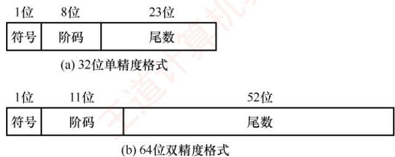  
图 2.14 IEEE 754 标准浮点数的格式

32位单精度格式包含1位符号s、8位阶码e和23位尾数f；64位双精度格式包含1位符号s、11位阶码e和52位尾数f。基数隐含为2；尾数用原码表示。对于规格化的二进制浮点数，尾数的最高位恒为1。为提升精度，IEEE754不显式存储该位，而是将其隐含在小数点之前，称为隐藏位。因此，单精度格式的23位尾数实际提供了24位有效数字，双精度格式的52位尾数实际提供了53位有效数字。例如， $(12)_{10} = (1100)_{2}$ ，规格化后为 $1 . 1   \times   2 ^ { 3 }$ 。其中，小数点前的“1”不实际存储，尾数f仅保存小数部分 $ \text{" }100  \text{... }0 \text{" }$ ，而阶码保存的是指数3的编码值。

IEEE754标准的阶码采用移码表示，但偏置值并不是通常n位移码所用的 $2 ^ { n - 1 }$ ，而是 $2 ^ { n - 1 }   - 1$ 因此，单精度和双精度格式的偏置值分别为127和1023。上例中，指数真值为3，因此在单精度格式中，阶码为 $127+3=130\left ( 82H \right )$ ；在双精度格式中，阶码为1023+3=1026（402H）。

IEEE754标准的规格化单精度浮点数的真值为

$$
(-1)^{s} \times 1, f \times 2^{e-127}
$$

规格化双精度浮点数的真值为

$$
(-1)^{s} \times 1.f \times 2^{e-1023}
$$

其中，规格化单精度浮点数的阶码e的取值范围为1～254（8位，全0和全1保留用于特殊值）：规格化双精度浮点数的阶码e的取值范围为1～2046（11位，保留用途相同）。

## 2. IEEE 754 格式浮点数的表示范围

考点追踪IEEE754浮点数的表示范围和有效位（2017、2018、2024）

IEEE754 规格化浮点数的表示范围见表2.2。

表 2.2 IEEE 754 规格化浮点数的表示范围
<table><tr><td rowspan=1 colspan=1>格式</td><td rowspan=1 colspan=1>最小值</td><td rowspan=1 colspan=1>最大值</td></tr><tr><td rowspan=1 colspan=1>单精度</td><td rowspan=1 colspan=1> $e = 1, \; f = 0$  $1.0 \times 2^{1-127} = 2^{-126}$ </td><td rowspan=1 colspan=1> $e = 254, \quad f = 111..., \quad 1.111...1 \times 2^{254-127} = 2^{127} \times (2 - 2^{-23})$ </td></tr><tr><td rowspan=1 colspan=1>双精度</td><td rowspan=1 colspan=1> $e = 1, \; f = 0$  $1.0 \times 2^{1 - 1023} = 2^{-1022}$ </td><td rowspan=1 colspan=1> $e = 2046, \quad f = 1111\ldots, \quad 1.111\ldots 1 \times 2^{2046 - 1023} = 2^{1023} \times (2 - 2^{-52})$ </td></tr></table>

当浮点运算结果的绝对值超过最大规格化数时，发生上溢（也称溢出），可分为：

● 正上溢：若结果为正且大于最大规格化正数。

·负上溢：若结果为负且小于最小规格化负数（绝对值过大）。

IEEE754对上溢的处理规则：①将结果设为+∞或-∞；②置位浮点溢出异常标志，IEEE754规定，默认情况下不触发异常中断，程序继续执行，除非显式开启此类异常响应。

当运算结果的绝对值小于最小规格化正数但不为零时，发生下溢，可分为：

● 正下溢：若结果为正，且处在0到最小规格化正数之间。

● 负下溢：若结果为负，且处在最大规格化负数到0之间。

对下溢的处理采用渐进下溢机制：①若结果落在非规格化数可表示范围内，则以非规格化形式存储，保留部分有效精度；②若结果过于接近零（舍入后为零），则存储为+0或一0，并置位浮点下溢异常标志。同样，默认不响应下溢异常，程序继续运行，除非显式启用异常处理。

IEEE754标准的单精度浮点数的表示范围如图2.15所示。

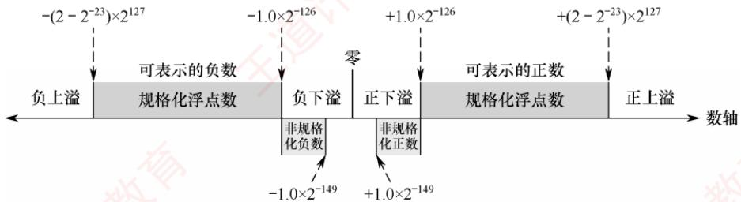  
图 2.15 IEEE 754 标准的单精度浮点数的表示范围

## 3. 几种特殊的 IEEE 754 浮点数

考点追踪IEEE754标准中的特殊浮点数（2017、2023）

在IEEE754标准中，当阶码全为0或全为1时，浮点数具有特殊含义，如表2.3所示。

表 2.3 阶码全为0或全为1 时 IEEE 754 浮点数的解释
<table><tr><td rowspan=2 colspan=1>值的类型</td><td rowspan=1 colspan=4>单精度（32位）</td><td rowspan=1 colspan=4>双精度（64位）</td></tr><tr><td rowspan=1 colspan=1>符号</td><td rowspan=1 colspan=1>阶码</td><td rowspan=1 colspan=1>尾数</td><td rowspan=1 colspan=1>值</td><td rowspan=1 colspan=1>符号</td><td rowspan=1 colspan=1>阶码</td><td rowspan=1 colspan=1>尾数</td><td rowspan=1 colspan=1>值</td></tr><tr><td rowspan=1 colspan=1>正零</td><td rowspan=1 colspan=1>0</td><td rowspan=1 colspan=1>0</td><td rowspan=1 colspan=1>0</td><td rowspan=1 colspan=1>0</td><td rowspan=1 colspan=1>0</td><td rowspan=1 colspan=1>0</td><td rowspan=1 colspan=1>0</td><td rowspan=1 colspan=1>0</td></tr><tr><td rowspan=1 colspan=1>负零</td><td rowspan=1 colspan=1>1</td><td rowspan=1 colspan=1>0</td><td rowspan=1 colspan=1>0</td><td rowspan=1 colspan=1>-0</td><td rowspan=1 colspan=1>1</td><td rowspan=1 colspan=1>0</td><td rowspan=1 colspan=1>0</td><td rowspan=1 colspan=1>-0</td></tr><tr><td rowspan=1 colspan=1>正无穷大</td><td rowspan=1 colspan=1>0</td><td rowspan=1 colspan=1>255（全1）</td><td rowspan=1 colspan=1>0</td><td rowspan=1 colspan=1>8</td><td rowspan=1 colspan=1>0</td><td rowspan=1 colspan=1>2047（全1）</td><td rowspan=1 colspan=1>0</td><td rowspan=1 colspan=1>8</td></tr><tr><td rowspan=1 colspan=1>负无穷大</td><td rowspan=1 colspan=1>1</td><td rowspan=1 colspan=1>255（全1）</td><td rowspan=1 colspan=1>0</td><td rowspan=1 colspan=1> $- \infty$ </td><td rowspan=1 colspan=1>1</td><td rowspan=1 colspan=1>2047（全1）</td><td rowspan=1 colspan=1>0</td><td rowspan=1 colspan=1>-∞</td></tr><tr><td rowspan=1 colspan=1>无定义数(非数)</td><td rowspan=1 colspan=1>0或1</td><td rowspan=1 colspan=1>255（全1）</td><td rowspan=1 colspan=1>f≠0</td><td rowspan=1 colspan=1>KE $\mathrm { N a N }$ </td><td rowspan=1 colspan=1>0或1</td><td rowspan=1 colspan=1>2047（全1）</td><td rowspan=1 colspan=1>f≠0</td><td rowspan=1 colspan=1>NaN</td></tr><tr><td rowspan=1 colspan=1>非规格化正数</td><td rowspan=1 colspan=1>0</td><td rowspan=1 colspan=1>0</td><td rowspan=1 colspan=1>f≠0</td><td rowspan=1 colspan=1> $2 ^ { - 1 2 6 } ( 0 . f )$ </td><td rowspan=1 colspan=1>0</td><td rowspan=1 colspan=1>0</td><td rowspan=1 colspan=1>f≠0</td><td rowspan=1 colspan=1> $\underline { { 2 ^ { - 1 0 2 2 } ( 0 . f ) } }$ </td></tr><tr><td rowspan=1 colspan=1>非规格化负数</td><td rowspan=1 colspan=1>1</td><td rowspan=1 colspan=1>0</td><td rowspan=1 colspan=1>f≠0</td><td rowspan=1 colspan=1> $- 2 ^ { - 1 2 6 } ( 0 . f )$ </td><td rowspan=1 colspan=1>1</td><td rowspan=1 colspan=1>0</td><td rowspan=1 colspan=1>f≠0</td><td rowspan=1 colspan=1> $- 2 ^ { - 1 0 2 2 } ( 0 . f )$ </td></tr></table>

1）全0阶码全0尾数：+0/-0。符号s决定其正负，通常情况下+0和-0是等效的。

2）全1阶码全0尾数： $+ \infty / - \infty 。  + \infty ;$ 在数值上大于所有有限数，-∞则小于所有有限数。引入 无穷大数的目的是，使程序在溢出等异常情况下仍能继续执行。

3）全1阶码非0尾数：NaN（NotaNumber）。表示一个没有定义的数，称为非数。

4）全0阶码非0尾数：非规格化数。非规格化数的特点是阶码为全0，不使用隐藏位，尾数字段不全为0。因此，单精度和双精度浮点数的指数分别为-126和-1022。非规格化数用于实现渐进下溢，填补0与最小规格化数之间的数值间隙。

考点追踪实数与IEEE754浮点数的相互转换（2011、2013、2020、2022、2023、2025）

【例2.5】将十进制数-8.25转换为IEEE754单精度浮点数格式表示。

解：

IEEE754单精度浮点数的偏置值是127；尾数最高位的“1”是被隐藏的。

先将-8.25转换为二进制，即 $-1000.01=-1.000\ 01\times2^{3}$ ，尾数部分取小数点后的23位（00001后补0至23位）；再计算阶码E， $E - 1 2 7 = 3$ ，因此 $E   =   1 3 0$ ，转换为二进制为10000010。

IEEE754单精度浮点数格式：符号（1位）+阶码（8位）+尾数（23位），即为

$$
1 ;   1 0 0 0   0 0 1 0 ;   0 0 0 0   1 0 0 0   0 0 0 0 0   0 0 0 0 0   0 0 0 0 0 0
$$

因此，其单精度浮点数格式表示为1100 0001 0000 0100 0000 0000 0000 0000= C104 0000H。

【例2.6】求 IEEE 754 单精度浮点数 C640 0000H的值是多少。

解：

先将C640 0000H按二进制展开为

$$
1 1 0 0   0 1 1 0   0 1 0 0   0 0   0 0 0 0   0 0 0 0 0 0 0 0 0 0 0 0 0 0 0 0
$$

按IEEE 754 单精度浮点数格式划分：

<table><tr><td rowspan=1 colspan=1>符号</td><td rowspan=1 colspan=1>阶码</td><td rowspan=1 colspan=1>尾数</td></tr><tr><td rowspan=1 colspan=1>1</td><td rowspan=1 colspan=1>1000 1100</td><td rowspan=1 colspan=1>100 0000 0000 0000 0000 0000</td></tr></table>

因此，符号=1表示负数；阶码真值为1000 $1 1 0 0 - 0 1 1 1 1 1 1 1 = ( 0 0 0 0 1 1 0 1 ) _ { 2 } = 1 3$ ；尾数真值为 $1+(0.1)_{2}=1.5$ （注意，尾数含隐藏位1）。因此，该单精度浮点数的值为 $-1.5  ×  2^{13}$

## 2.3.2 浮点数的加减运算

浮点数运算的特点是阶码与尾数分开处理，浮点数加减运算分为以下几个步骤。

考点追踪float型能否通过左移实现乘以2运算（2017）；浮点数的加减运算（2009）

## 1. 对阶

对阶的目的是使两个操作数的小数点位置对齐，即令它们的阶码相等，以便尾数可以直接相加减。对阶的原则是：小阶向大阶看齐，即将阶码较小的数的尾数右移，右移位数等于两阶码差的绝对值。对于EEE754标准的浮点数，对阶时需要进行移码减法运算，以求得阶码差。尾数右移时，仅移动数值位，符号位不参与移位：对于规格化数，隐藏位1会随尾数右移而进入小数部分，空出的高位补0。为保证运算精度，移出的低位不应丢弃，而应保留并参与后续尾数运算。

## 注意

若采用大阶向小阶看齐，则需将尾数左移，导致最高有效位被移出，造成不可逆的精度错误。

## 2. 尾数加减

由于EEE754标准采用定点原码小数表示尾数，因此尾数加减运算实质上是定点原码小数的加减运算，应根据相应的规则执行。对于规格化数，在运算前还需要将隐藏位还原到尾数部分，形成完整的 $1 . f 1$ 形式。此外，对阶过程中为保持精度而保留的附加位也要参与尾数加减运算。

## 3. 尾数规格化

为在浮点运算中最大限度保留有效数字，需要对运算结果进行规格化处理。所谓规格化，是指通过调整尾数与阶码，使浮点数的尾数满足最高有效位为1的形式。

IEEE 754 规格化尾数的形式为 $1 . \times . . . \times$ 。尾数相加减后可能出现两类非规格化结果：

$$
1. \times \cdots \times + 1. \times \cdots \times = 1 \times \cdots
$$

$$
1. \times \ldots \times - 1. \times \ldots \times = 0.0 \ldots 01 \times \ldots \times
$$

1）右规：当结果为1×.×...×时，需要进行右规。尾数每右移一位，阶码加1。尾数右移时，最高位1被移到小数点前一位作为隐藏位，最后一位移出时，要考虑舍入。

2）左规：当结果为0.0...01×...×时，需要进行左规。尾数每左移一位，阶码减1。可能需要左规多次，直到将第一位1移至小数点左边。

## 注意

①左规一次相当于乘以2，右规一次相当于除以2；②需要右规时，只需进行一次。

## 4. 舍入

在对阶和右规过程中，尾数右移可能导致低位丢失。为保证精度，移出的低位通常被保留用于中间计算。最终结果需通过舍入处理，还原为标准的IEEE754格式。

为此，IEEE754引入三个辅助位以指导精确舍入。

1）保护位：紧邻尾数最低有效位之后的第一位，用于初步判断舍入方向。

2）舍入位：位于保护位之后，与保护位和粘滞位共同构成完整的舍入信息。

3）粘滞位：只要舍入位之后被移出的位中存在至少一个1，粘滞位就置为1，否则为0。  
IEEE754定义了四种可选的舍入模式。

1）就近舍入（默认方式）：选择最接近真实值的可表示数。若真实值恰好位于两个可表示数的正中间，则选择尾数最低有效位为0的那个（偶数）。具体规则：①若保护位=0，直接舍去；②若保护位=1且（舍入位=1或粘滞位=1），则尾数加1；③若保护位=1、舍入位=0、粘滞位=0，则在尾数末位为奇数时向其加1，以符合向偶数舍入的要求。

例如，运算后得到浮点数的临时尾数 $M _ { 1 }$ ，舍入过程如下： $\mathbf { M } _ { 1 }$

$$
M _ { 1 } = 1 . \underline { { \underline { { 1 0 1 1 \; 0 0 1 1 \; 1 1 0 0 \; 1 1 0 0 \; 1 1 0 1 \; 0 1 0 } } } } \quad \mathbf { 1 } \; \mathbf { 0 } \; \mathbf { 1 }
$$

注意，下划线部分为保留的23位尾数，其后依次为保护位、舍入位、粘滞位。

由于保护位 = 1、舍入位 = 0、粘滞位 =1，结果属于非中间值，需要向尾数加1。加1后的23 位尾数为1011 0011110011001101011。

若运算后得到临时尾数 $M _ { 2 } ,$ ，则舍入过程如下：

$$
M _ { 2 } = 1 . \underline { { \underline { { 1 0 1 1 \; 0 0 1 1 \; 1 1 0 0 \; 1 1 0 0 \; 1 1 0 1 \; 0 1 0 } } } } \quad \textbf { 1 0 0 }
$$

由于保护位 =1、舍入位=0、粘滞位=0，结果恰好位于两个可表示数的正中间。此时尾数最低有效位为偶数，无须加 $1 _ { \circ }$ 最终的23位尾数保持为10110011110011001101010。

2）正向舍入：朝数轴+∞方向舍入，即选择数值更大的可表示数。

3）负向舍入：朝数轴一∞方向舍入，即选择数值更小的可表示数。

4）截断法：直接截取所需位数，丢弃后面的所有位，实现最为简单。对正数或负数来说，都是选择更接近原点的那个可表示数，也称为朝原点舍入。

## 5. 溢出判断

## 考点追踪浮点数运算时的溢出判断（2015）

在尾数规格化或舍入过程中，可能对阶码进行加减操作，因此需要判断指数是否溢出。在EEE  
754中，浮点数的溢出由阶码是否超出可表示范围决定；尾数溢出可通过右规修正，而真正的溢  
出仅发生在阶码上溢或下溢时。1

1）上溢判断。尾数相加后若结果≥2，或舍入时尾数末位加1引发进位（如1.111…+1=10.000…），则均需右规：尾数右移一位，阶码加1。若原阶码已为最大正规格化值（单精度阶码字段为11111110，对应真值+127），加1后变为11111111（该编码保留用于表示无穷大或NaN），则视为指数上溢，通常会引发异常。 F

2）下溢判断。左规时尾数左移，阶码减1。若阶码真值减至低于最小正规格化值(单精度-126，双精度-1022），则进入非规格化数范围（阶码字段为0）。若结果进一步小于最小可表示非规格化数（如2-149或2-1074），则视为指数下溢，通常将结果置为机器零。

【例2.7】设x和y为float型变量， $x=10.5,\ y=-120.625$ ，请给出x+y的计算过程。解：

$x=10.5=(1010.1)_{2}=(1.0101)_{2}\times2^{3}$ 。其IEEE754单精度：符号位为0；阶码为3+127=130，即10000010；机器数（注意隐含尾数最高位）为0;10000010;01010000000000000000000。

$y=-120.625=-(1111000.101)_{2}=-(1.111000101)_{2}\times2^{6}$ 。其IEEE 754单精度：符号位为1，阶码为6+127=133，即 1000 0101；机器数为1;10000101;111 0001010 00000000 0000。

1）对阶。求阶差 $E _ { x } - E _ { y } { = } { - } 3$ 。故将x的尾数右移3位，阶码调整为 $E _ { y }   =   1 3 3$ 。对阶后，x的尾数变为0.00101010000000000000000 000（含保留的附加位），此时无隐藏位。

2）尾数相加。0.0010 1010 0000 0000 0000 000 0 0 0+(-1.1110 0010 1000 0000 0000 000) =-1.10111000100000000000000 000（注意，附加位参与运算，但不会存储）。

3）规格化。尾数相加结果-1.1011100010…×2⁶，已是规格化形式。

4）舍入。单精度尾数保留23位，附加位全为0，按就近舍入规则，直接截断。因此，x +y的机器数为1;1000 0101;1011 10001000 0000 0000 000。其真值为 $-(1.101110001)_{2} \times 2^{6} = -(1101110.001)_{2} = -110.125$

## 2.3.3 C 语言中的浮点数类型

## 考点追踪不同类型数据转换后数值的变化（2010）

C 语言中的 float 型和 double 型分别对应 IEEE 754 单精度和双精度浮点数。long double 型通常对应扩展双精度格式，其长度和格式依赖于编译器与目标平台。在C语言中，表达式中的赋值、运算或比较操作会触发自动类型转换，常见的转换序列为 char→int→long→double 和 float→double，这些转换通常由范围和精度较低的类型向更高者进行，一般不会丢失信息。

当不同类型的数据混合运算时，遵循类型提升原则：较低类型自动转换为较高类型。例如，long与 int 运算时，先将 int 转换为long，然后进行运算，结果为 long；float 与 double 运算时，先将 float转换为double，结果为double。这类由编译器自动完成的转换称为隐式类型转换。

## 考点追踪int 和 float型的精度和范围分析（2017）

1）int转 float时，虽然不会发生溢出，但由于float尾数（含隐藏位）仅24位有效，而 int

为32位，当整数值的二进制有效位超过24位时，需做舍入处理，导致精度损失。

2）int或float转double时，因double的有效位更多，通常能精确表示原值。

3）double转float时，一方面float的表示范围较小，大数值转换时可能发生溢出；另一方面float的尾数有效位变少，高精度数转换时会发生舍入误差。

4）float或double转int时，由于int没有小数部分，小数部分被直接丢弃（向零截断）；同时，若浮点数值超出int的表示范围，则会发生整数溢出。

不同数据类型之间的转换常隐藏不易察觉的精度损失或溢出风险，编程时需格外谨慎。

## 2.3.4 数据的宽度和存储

## 1. 数据的宽度和单位

在计算机中，比特（bit，也称位，符号为b）是最小的信息单位，表示一个二进制位（0或1）；字节（byte，符号为B）是基本的存储和寻址单位，1字节=8比特。随着信息规模增大，常在B（字节）或b（位）前添加前缀以表示更大的容量，如KB、MB、GB等。在传统计算机系统中，这些前缀通常按2的幂定义，如 $1 \mathrm{KB} = 2^{10} \mathrm{B} = 1024 \mathrm{B}$ 人

此外，字（word）也是常用的数据组织单位。它是由体系结构定义的逻辑单位，通常用于表示整数、地址等基本数据类型的宽度，其长度因架构而异，常见的有2、4或8字节。

与字不同，字长（也称机器字长）指CPU内部整数运算的数据通路的宽度，通常等于通用寄存器的宽度。字长反映计算机一次能处理的整数数据的位数，是衡量机器性能的重要指标。日常所说的“32位机”或“64位机”，其中的32或64即指字长。例如，在Intel x86架构中，自80386起字长为32位（32位机），但其体系结构仍将16位定义为一个字，32位称为双字。这表明：字是架构层面的约定，而字长体现的是硬件的实际处理能力。

## 2.数据的“大端方式”和“小端方式”存储

在存储数据时，数据从低位到高位可以按从左到右排列，也可以按从右到左排列。因此，不宜用最左或最右来表征数据的最高位或最低位，通常使用最低有效字节（LSB）和最高有效字节（MSB）来分别表示数据的最低位和最高位。例如，在32位计算机中，一个int型变量i的机器数为01234567H，其最高有效字节 $\mathrm{MSB} = 01\mathrm{H}$ ，最低有效字节LSB=67H。

$$
 通高面瓣卜  \gg  数据的大小端存储 (2016 、 2018 、 2019 、 2024 、 2025)
$$

现代计算机普遍采用字节编址，即每个地址对应1字节。不同类型的数据占用不同字节数（如int和float占4字节，double占8字节），而程序中每个变量仅分配一个起始地址。假设变量i的地址为0800H，那么其4个字节01H、23H、45H、67H将占据连续的4个内存单元。这些字节在内存中的排列方式分为两种（见图2.16）： 道

<table><tr><td rowspan="3">大端方式</td><td></td><td>0800H</td><td>0801H</td><td>0802H</td><td>0803H</td><td></td></tr><tr><td>…</td><td>01H</td><td>23H</td><td>45H</td><td>67H</td><td>…</td></tr><tr><td colspan="3">0800H 0801H</td><td>0802H</td><td>0803H</td><td></td></tr><tr><td>小端方式</td><td></td><td>67H</td><td>45H</td><td>23H</td><td>01H</td><td>…</td></tr></table>

图2.16 采用大端方式和小端方式存储数据

## 考点追踪根据存放顺序判断大小端方式（2019、2023）

1）大端方式（big endian）：MSB存储在低地址，LSB存储在高地址，字节顺序与数值的标准十六进制书写顺序一致。

2）小端方式（little endian）：LSB存储在低地址，MSB存储在高地址，字节顺序与标准书写顺序相反。

在分析机器代码时，需特别注意字节顺序。例如，以下是由反汇编器生成的一行代码：

<table><tr><td>4004d3: 01 05 64 94 04 08 add eax, 0x08049464</td></tr></table>

其中，4004d3是指令地址，01 05649404.08是指令的机器码，add eax,0x08049464是其汇编形式。指令的第二个操作数是立即数0x08049464，其在内存中按地址递增顺序存储为：64H、94H、04H、08H。由于低地址存放的是LSB（64H），高地址存放的是MSB（08H），符合小端方式的特征。将这4个字节按小端规则重组，即可得到正确的立即数0x08049464。因此，在阅读小端机器代码时，需要将连续字节按逆序组合才能还原其逻辑数值。V

## 3. 数据按“边界对齐”方式存储

在字长为32位的系统中，边界对齐要求数据的存储地址是其对齐值（通常等于该类型大小，单位：字节）的整数倍：字节可位于任意地址，半字地址须为2的倍数，字地址须为4的倍数。满足此条件时，CPU可通过一次访存读取完整数据；否则，若数据跨越两个存储单元，则需两次访存并拼接字节，显著降低效率。为满足对齐要求，编译器会在必要时填充空白字节。这种“以空间换时间”的策略虽略微增加内存占用，但能大幅提升访问速度。

例如，数据序列“字节1、字节2、字节3、半字1、半字2、半字3、字1”按边界对齐与非对齐方式存储的格式分别如图2.17和图2.18所示。

<table><tr><td rowspan=1 colspan=1>字节1</td><td rowspan=1 colspan=1>字节2</td><td rowspan=1 colspan=1>字节3</td><td rowspan=1 colspan=1>填充</td></tr><tr><td rowspan=1 colspan=2>半字1</td><td rowspan=1 colspan=2>半字2</td></tr><tr><td rowspan=1 colspan=2>半字3</td><td rowspan=1 colspan=2>填充</td></tr><tr><td rowspan=1 colspan=4>字1</td></tr></table>

图2.17 按边界对齐方式存储

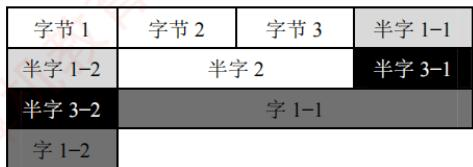  
图2.18 按边界不对齐方式存储

## 考点追踪结构体的小端、边界对齐存储（2012、2020）

C语言中，struct型的内存布局遵循以下对齐规则：①每个成员的起始地址必须是其对齐值的整数倍（例如：char为1，short为2，int为4）；②整个结构体的大小必须是其最大成员对齐值的整数倍（不足则在尾部填充）。这确保了每个结构体成员的起始地址均满足对齐要求。

先看两个例子（基于32位x86环境，GCC编译器）：
<table><tr><td>struct A{</td><td>struct B{</td></tr><tr><td>int a;</td><td>char b;</td></tr><tr><td>char b;</td><td>int a;</td></tr><tr><td>short c;</td><td>short c; J</td></tr></table>

结果却是：sizeof(A) = 8，sizeof(B) = 12。

设B从地址 0x0000开始，成员 b的对齐值是1，其存放地址符合 0x0000%1 = 0；成员 a的对齐值是4，需对齐到4字节边界，故起始于0x0004，占据0x0004～0x0007；成员c的对齐值是2，起始于0x0008，占据0x0008～0x0009。此外，结构体长度必须是最大对齐值（4）的整数倍，当前大小10字节，需填充至12字节（0x000A～0x000B）。

设A也从地址0x0000开始，成员 a的对齐值是4，存放在0x0000～0x0003；成员b的对齐值是1，存放在0x0004；成员c的对齐值是2，为满足“起始地址%对齐值=0”的条件，只能存放在0x0006～0x0007，总大小为8字节，无须尾部填充。

精简指令集计算机（RISC）普遍采用边界对齐，以支持高效的指令流水线。

## 2.3.5 本节习题精选

## 一、单项选择题

01. 在C语言的不同类型的数据混合运算中，要先转换为同一类型后进行运算。设一表达式中包含有int型、long型、char型和double型的变量与数据，则表达式最后的运算结果是（），这4种类型数据的转换规律是（）。A. long, int→char→double→long B. long, char→int→long→doubleC. double, char→int→long→double D. double, char→int→double→long

02. 长度相同但格式不同的两种浮点数，假设前者阶码长、尾数短，后者阶码短、尾数长，其他规定均相同，则它们可表示的数的范围和精度为（）。A. 两者可表示的数的范围和精度相同B. 前者可表示的数的范围大但精度低C. 后者可表示的数的范围大且精度高 D. 前者可表示的数的范围大且精度高

03. 浮点数的 IEEE 754 标准对尾数编码采用的是（）。 —XA. 原码 B. 反码 C. 补码 D. 移码

04. 在IEEE 754 标准规定的 64 位浮点数格式中，符号位为1 位，阶码为11位，尾数为 52位，则它所能表示的最小规格化负数为（）。A. $- ( 2 - 2 ^ { 5 2 } ) \times 2 ^ { - 1 0 2 3 }$ B. $- ( 2 - 2 ^ { - 5 2 } ) \times 2 ^ { + 1 0 2 3 }$ C. $- 1 \times 2 ^ { - 1 0 2 4 }$ D. $- ( 1 - 2 ^ { - 5 2 } ) \times 2 ^ { + 2 0 4 7 }$

05. 按照 IEEE 754 标准规定的 32 位单精度浮点数 41A4C000H 对应的十进制数是（）。A. 4.59375 B. -20.59375 C. -4.59375 D. 20.59375

06.在浮点数编码表示中，（）在机器数中不出现，是隐含的。A. 阶码 B. 符号 C. 尾数 D. 基数

07. 若某单精度浮点数、某原码、某补码、某移码的32位机器数均为0xF0000000，则这些数从大到小的顺序是（）。A. 浮原补移 B. 浮移补原 C. 移原补浮 D. 移补原浮

08. 采用规格化的浮点数最主要是为了（）。A. 增加数据的表示范围 B. 方便浮点运算C. 防止运算时数据溢出 D. 增加数据的表示精度

09. 设x是采用IEEE754 标准表示的 32位单精度浮点数，下列说法中正确的是（）。I. 当|x| $< 1.0 \times 2^{-126}$ 时，x将被置为机器零 算机ⅡI. 当 $|x| > 1.0 \times 2^{127}$ 时，将发生溢出Ⅲ. x所能表示的最小非规格化正数与最大非规格化负数的绝对值相等IV.x可表示的最大正数与最小负数的绝对值相等  
X A. I, II, II,I IV B. I, II C. II, III, IV

10.在浮点运算中，下溢指的是（）。A. 运算结果的绝对值小于机器所能表示的最小绝对值B. 运算的结果小于机器所能表示的最小负数C. 运算的结果小于机器所能表示的最小正数 教育D. 运算结果的最低有效位产生的错误

11. 判断浮点数运算是否溢出，取决于（。A. 尾数是否上溢 B. 尾数是否下溢C. 阶码是否上溢 D. 阶码是否下溢

12. 假定采用IEEE754 标准中的单精度浮点数格式表示一个数为45100000H，则该数的值是（）。

A. $(+1.125)_{10} \times 2^{10}$ B. $(+1.125)_{10} \times 2^{11}$ C. $(+0.125)_{10} \times 2^{11}$ D. $(+0.125)_{10} \times 2^{10}$

13. 已知 float 型采用 IEEE 754 单精度浮点数格式，若x、y为 float型变量，且 $x = -126, y = 15.75$ 则执行语句z=x+y时，在浮点运算单元中进行对阶操作后的结果是（）。A. x 不变，y 为 010000101,0.001111110...0B. x 不变，y 为 010000110,0.001111110...0C. y 不变，x为 110000101,0.001111110...0D. y 不变，x 为 110000110,0.001111110...0

14. 假设 x 和 y 均是 float型变量，x的真值为1，y 的真值为 0.1。已知 0.1 的二进制表示为无限循环小数 0.00011[0011]...（重复因子为 0011），某计算机采用 IEEE 754 单精度格式及就近舍入方式，则计算x+y的结果用十六进制机器数表示为（）。A. 3F80 0000 B. 3F8C CCCD C. 3F8C CCCC D. 3F80 000C

15. 在IEEE754标准浮点格式中，非规格化浮点数表示为（）。A. 阶码为0，尾数为任意非0的二进制数B. 阶码为 255，尾数全为 0C. 阶码为255，尾数为任意非0的二进制数 王D. 阶码为0，尾数全为0

16. 在IEEE754单精度浮点数加减运算的对阶阶段，若需将某操作数的尾数右移以对齐阶码，则关于其隐含的前导“1”，以下说法正确的是（）。A. 隐含的“1”始终保留在最高位，在右移过程中不会被移出B. 隐含的“1”参与右移，但为保持规格化形式，移位后仍重置为1C. 对阶移位前，需先将隐含的“1”恢复到尾数高位，再整体右移D. 非规格化数也包含隐含的“1”，因此同样需要恢复后再移位

17. 在IEEE754 单精度浮点数加减运算中，若两个操作数阶码之差的绝对值为ΔE，当其大于或等于（）时，阶码较小的操作数对结果无影响，结果直接取阶码较大的操作数（假设采用就近舍入的方式）。A. 24 B. 25 C. 126 D. 128 1

18.下列关于机器字长的叙述中，错误的是（）。A. 机器字长是指CPU中定点运算数据通路的宽度B. 机器字长通常与 CPU通用寄存器的位数一致C. 机器字长决定了定点数的表示范围和精度D. 机器字长对计算机硬件造价没有影响

19.计算机中的信息按边界对齐方式存储的含义是（）。 道A. 信息的字节长度必须是整数 B. 信息单元的字节长度必须是整数C. 信息单元的存储地址必须是整数 D. 信息单元的存储地址是其字节长度的整数倍

20. 假设已定义三个 int 型变量 x、y 和 z，sizeof(int) = 4，double 型采用 IEEE 754 双精度浮点数格式，变量dx、dy和dz的声明和初始化如下：

$$
\begin{array} { r l } & { \mathtt { d o u b l e \_ d x } = \mathtt { ( d o u b l e )   x } ; } \\ & { \mathtt { d o u b l e \_ d y } = \mathtt { ( d o u b l e )   y } ; } \\ & { \mathtt { d o u b l e \_ d z } = \mathtt { ( d o u b l e )   z } ; } \end{array}
$$

则下列关系表达式中永远为真的是（）。  
I. $\mathrm{dx}+\mathrm{dy}=(\mathrm{double})(\mathrm{x}+\mathrm{y})$   
II. $\left( \mathrm{dx} + \mathrm{dy} \right) + \mathrm{dz} = \mathrm{dx} + \left( \mathrm{dy} + \mathrm{dz} \right)$

A. I和ⅡI B. 仅I C. 仅Ⅱ D. 无正确项

21. 在按字节编址的计算机中，采用小端方式存储数据，某静态二维数组b的声明如下：static short b[2][4] = {{2,9,−1,5},{3,1,−6,2}};若b的首地址为0x8049820，采用按行优先存储，地址0x804982c中的内容是（）。A. FAH B. FFH C. 00H D. 05H

22. 在按字节编址的计算机中，数据在存储器中以小端方式存放。假定int型变量i的地址为 08000000H，i的机器数为 01234567H，地址 08000000H单元的内容是（）。A. 01H B. 23H C. 45H D. 67H

23. 在按字节编址的32位计算机中，按边界对齐方式为以下结构型变量x分配存储空间：struct cont info{char id;Munsigned post; 算机教char phone;} x;

若x的首地址为0x8049820，则成员变量phone的起始地址为（）。A.0x8049828 B. 0x8049826 C. 0x8049825 D.0x8049822

24. 假定变量i、f的数据类型分别是int、float。已知i = 12345，f= 1.2345×23，则在一个32 位机器中执行下列表达式时，结果为“假”的是（）。 A. i == (int)(double)i B. f == (float)(double)f C. i == (int)(float)i D. f==(float)(int)f

25. 有以下 C语言代码段：int m=13;float a=12.6,x;x=m/2+a/2;printf("%f\n",x);

执行上述代码后，输出的x值为（）。A. 12.000000 B. 12.300000 C. 12.800000 D. 12

26.【2009统考真题】浮点数加、减运算过程一般包括对阶、尾数运算、规格化、舍入和判断溢出等步骤。设浮点数的阶码和尾数均采用补码表示，且位数分别为5和7（均含2位符号位）。若有两个数 $X = 2^{7} \times 29 / 32$ 和 $Y = 2^{5} \times 5 / 8$ ，则用浮点加法计算X+Y的最终结果是（）。

27.【2010统考真题】假定变量i、f和d 的数据类型分别为 int、float和 double（int型用补码表示，float型和 double型分别用 IEEE 754 单精度和双精度浮点数格式表示），已知i = 785、f= 1.5678E3、d = 1.5E100，若在 32 位机器中执行下列关系表达式，则结果为“真”的是（）。  
王 I. i == (int)(float)i II. f== (float)(int)f III. f ==(float)(double)f IV. (d+f)−d == fA. 仅I和Ⅱ B. 仅I和Ⅲ C. 仅ⅡI和II D. 仅ⅢII和IV

28. 【2011 统考真题】float 型数据通常用 IEEE 754 单精度格式表示。若编译器将 float 型变量x分配在一个32位浮点寄存器FR1中，且 $x = - 8.25$ ，则FR1的内容是（）。A. C104 0000H B. C242 0000H C. C184 0000H D. C1C2 0000H

29.【2012统考真题】float型（IEEE754单精度浮点数格式）能表示的最大正整数是（）。A. $2 ^ { 1 2 6 }   - 2 ^ { 1 0 3 }$ B. $2 ^ { 1 2 7 } { - } 2 ^ { 1 0 4 }$ KIC. $2 ^ { 1 2 7 }   -   2 ^ { 1 0 3 }$ D. $2 ^ { 1 2 8 }   - 2 ^ { 1 0 4 }$

30.【2012统考真题】某计算机存储器按字节编址，采用小端方式存放数据。假定编译器规定int型和short型长度分别为 32位和16位，并且数据按边界对齐存储。某C语言程序

段如下：

struct{ int a; char b; short C;

若 record 变量的首地址为 0xC008，地址 0xC008中的内容及 record.c 的地址分别为（）。A. $0 \mathrm { x } 0 0 , 0 \mathrm { x } \mathrm { C } 0 0 \mathrm { D }$ B. 0x00,0xC00E C. 0x11, 0xC00D D. 0x11, 0xC00E

31. 【2013统考真题】某数采用 IEEE 754 单精度浮点数格式表示为 C640 0000H，则该数的A. 值是（）。 $-1.5 × 2^{13}$ 教育 B. $-1.5  ×  2^{12}$ C. $- 0 . 5   \times   2 ^ { 1 3 }$ D. $-0.5 \times 2^{12}$ 教育

32. 【2014 统考真题】float 型数据常用 IEEE 754 单精度浮点格式表示。假设两个 float 型变量 x 和 y 分别存放在 32 位寄存器 f1 和 f2 中，若(f1) = CC90 0000H，(f2) = B0C0 0000H,则x和y之间的关系为（）。 道计A. x <y 且符号相同 B. x < y 且符号不同C. x> y 且符号相同 D. x >y 且符号不同

33.【2015统考真题】下列有关浮点数加减运算的叙述中，正确的是（）。I. 对阶操作不会引起阶码上溢或下溢 Ⅱ. 右规和尾数舍入都可能引起阶码上溢Ⅲ. 左规时可能引起阶码下溢 IV.尾数溢出时结果不一定溢出A. 仅Ⅱ、ⅢII B. 仅I、Ⅱ、IVC.仅I、III、IVD. I、Ⅱ、III、IV

34.【2016统考真题】某计算机字长为32位，按字节编址，采用小端方式存放数据。假定有一个 double型变量，其机器数表示为 1122 3344 5566 7788H，存放在以 0000 8040H开始的连续存储单元中，则存储单元00008046H中存放的是（）。A. 22H B. 33H C. 77H D. 66H

35.【2018统考真题】IEEE754单精度浮点格式表示的数中，最小的规格化正数是（）。A. $1.0 × 2^{-126}$ B. $1.0 \times 2^{-127}$ C. $1.0 \times 2^{-128}$ D. $1.0 \times 2^{-149}$

36.【2018统考真题】某32位计算机按字节编址，采用小端方式。若语句 $\mathrm{int}_{i}^{\mathrm{m}} i = 0.$ 对应指令的机器代码为 $^{\circ}C745\;FC\;00\;00\;00\;00$ ，则语句 $\mathrm{int}_{i} = -64;$ 对应指令的机器代码是（）。A. C7 45 FC C0 FF FF FF B. C7 45 FC 0C FF FF FF 算机教C. C7 45 FC FF FF FF C0 D. C7 45 FC FF FF FF 0C

37.【2020统考真题】在按字节编址、采用小端方式的32位计算机中，按边界对齐方式为以下C语言结构型变量a分配存储空间：struct record{short x1;int x2;

若 a的首地址为 2020 FE00H，a 的成员变量 x2 的机器数为 1234 0000H，则其中 34H所在存储单元的地址是（）。A. 2020 FE03H B. 2020 FE04H C. 2020 FE05H D. 2020 FE06H

38.【2020统考真题】已知有符号整数用补码表示，float型数据用IEEE754标准表示，假定变量 x 的类型只可能是 int 或 float,当 x 的机器数为 C800 0000H 时, x 的值可能是( )。A. $- 7 { \times } 2 ^ { 2 7 }$ B. $- 2 ^ { 1 6 }$ 美 C. $2 ^ { 1 7 }$ D. $2 5 { \times } 2 ^ { 2 7 }$

39.【2021统考真题】下列数值中，不能用IEEE754浮点格式精确表示的是（）。A. 1.2 B. 1.25 C. 2.0 D. 2.5

40.【2022 统考真题】-0.4375的 IEEE 754 单精度浮点数表示为（）。A. BEE0 0000H B. BF60 0000H C. BF70 0000H D. C0E0 0000H

41.【2023统考真题】若short型变量x=-8190，则x的机器数是（）。A. E002H B. E001H C. 9FFFH D. 9FFEH

42. 【2023 统考真题】已知 float 型变量用 IEEE 754 单精度浮点数格式表示。若 float 型变量x的机器数为80200000H，则x的值是（）。A. $- 2 ^ { - 1 2 8 }$ K B. $-1.01 \times 2^{-127}$ C. $-1.01 \times 2^{-126}$ D. 非数（NaN） 育

43.【2024统考真题】某科学实验中，需要使用大量的整型参数，为了在保证表数精度的基础上提高运算速度，需要选择合理的数据表示方法。若整型参数α、β的取值范围分别为 $-2^{20} \sim 2^{20}, -2^{40} \sim 2^{40}$ ，则在下列选项中， $\alpha ,   \beta$ 最适合采用的数据表示方法分别是（）。A. 32 位整数、32 位整数 B. 单精度浮点数、单精度浮点数C. 32位整数、双精度浮点数 D. 单精度浮点数、双精度浮点数

44.【2025 统考真题】已知 float 型变量用 IEEE 754 单精度浮点数格式表示。若 float 型变量x的机器数为4730 0000H，则x的值是（）。A. $0.375 \times 2^{14}$ B. $1 . 3 7 5 { \times } 2 ^ { 1 4 }$ C. $0.375 \times 2^{15}$ D. $1 . 3 7 5   \times   2 ^ { 1 5 }$

45.【2025统考真题】某32位计算机按字节编址，采用小端方式存放数据，编译器按边界对齐方式为下列C 语言结构型数组变量 employee 分配存储空间。

```c
struct record {
int id;
char name[10];
int salary;
}employee[200] ;
```

若 employee 的首地址为 0000 A0B0H，employee[1].id 的机器数为 1234 5678H，则该机器数中的56H所在存储单元的地址是（）。A. 0000 A0C3H B. 0000 A0C4H C. 0000 A0C5H D. 0000 A0C6HV

## 二、综合应用题

01. 现有一计算机字长 32 位 $\left( \mathrm { ~ D _ { 3 1 } \sim D _ { 0 } ~ } \right)$ ，符号位是最高位。对于二进制 1000 1111 1110 1111 1100 0000 0000 0000，

1）表示一个补码整数，其十进制值是多少？

2）表示一个无符号整数，其十进制值是多少？

3）表示一个IEEE754标准的单精度浮点数，其值是多少？

02.假定变量i是一个32位的 int型整数，f和d分别为 float 型（32位）和double型（64位）实数。分析下列各布尔表达式，说明结果是否在任何情况下都是 $ `` \mathrm{time}  ''$

1 ) i == (int) ((double) i)

2) $\mathrm{f} == (\mathrm{f} \mathrm{load}) (\mathrm{(int)~f})$

3) $\mathrm{f} == (\mathrm{final}) ((\mathrm{double}) \mathrm{f})$

4) $\mathrm{d} == (\mathrm{double})   ((\mathrm{final})   \mathrm{d})$

03. 已知两个实数 $x = -68, \quad y = -8.25$ ，它们在C语言中定义为float型变量，分别存放在寄存器A和B中。另外，还有两个寄存器C和D。A、B、C、D都是32位的寄存器。请问（要求用十六进制表示二进制序列）：

1）寄存器A和B中的内容分别是什么？

2）x和y相加后的结果存放在寄存器C中，寄存器C中的内容是什么？

3）x和y相减后的结果存放在寄存器D中，寄存器D中的内容是什么？

04. 对下列每个IEEE 754 单精度数值，解释它们所表示的是哪种数字类型（规格化数、非规格化数、无穷大、0）。当它们表示某个具体数值时，请给出该数值。

1) 0000 0000 0000 0000 0000 0000 0000 0000

3) 1000 0000 0100 0000 0000 0000 0000 0000

4) 1111 1111 1000 0000 0000 0000 0000 0000

05.【2017统考真题】已知 $f(n) = \sum_{i = 0}^{n} 2^{i} = 2^{n + 1} - 1 = 1 \overbrace{11\cdots1 B}^{n + 1 位 }$ ，计算f(n)的C语言函数f1如下：

```prolog
int f1(unsigned n) {
int sum=1,power=1;
for(unsigned i=0;i<=n-1;i++){
power *= 2;
sum += power;
}
return sum;
```

将 f1 中的 int 都改为 float，可得到计算 f(n)的另一个函数 f2。假设 unsigned 型和 int 型数据都占 32位，float型数据采用 IEEE 754 单精度标准。请回答下列问题：

1）当n=0时，f1会出现死循环，为什么？若将f1中的变量i和n都定义为int型，则f1 是否还会出现死循环？为什么？

2）f1(23)和f2(23)的返回值是否相等？机器数各是什么（用十六进制表示）？

3）f1(24)和f2(24)的返回值分别为33554431和33554432.0，为什么不相等？

4）f(31)=232-1，而f1(31)的返回值却为-1，为什么？若使f1(n)的返回值与f(n)相等，则最大的n是多少？

5）f2(127)的机器数为7F80 0000H，对应的值是什么？若使f2(n)的结果不溢出，则最大的n是多少？若使f2(n)的结果精确（无舍入），则最大的n是多少？ XTON

## 2.3.6 答案与解析

## 一、单项选择题

## 01. C

不同类型的数据混合运算时，遵循的原则是“类型提升”，即较低类型转换为较高类型，最终结果为 double 型。4 种类型数据的转换规律为 char→int→long→double。

例如，long 型数据与 int型数据一起运算时，需先将 int 型转换为 long型，然后两者再进行运算，结果为long型。float型数据和double型数据一起运算时，虽然它们同为实型，但两者精度不同，仍要先将float型转换为double型再进行运算，结果亦为double型。所有这些转换都是由系统自动进行的，这种转换通常称为隐式转换。

注意在强制类型转换中，从int型转换为float型时，虽然不会发生溢出，但因尾数位数的关系，可能有数据舍入，而转换为double型则能保留精度。double型转换为float型时亦是如此。从float型或double型转换为int型时，小数部分被截断，且由于int型的表示范围更小，还可能发生溢出。

## 02. B

在浮点数总位数不变的情况下，阶码位数越多，尾数位数越少；即表示的数的范围越大，精

度越差（数变稀疏）。

## 03. A

IEEE754标准中尾数采用原码表示，阶码部分用移码表示。

## 04. B

长浮点数，其阶码为11位，尾数为52位，采取隐藏位策略，因此其最小规格化负数为阶码取最大值 $2^{+1023} \quad (1023 = 2^{11-1} - 1)$ ，尾数取最大值 $2 - 2 ^ { - 5 2 }$ （注意其有隐藏位要加1），符号位为负。

## 05. D

在EEE754单精度浮点数中，最高位为符号位：其后是8位阶码，以2为底，用移码表示，阶码的偏置值为127；其后23位是尾数数值位。对于规格化的二进制浮点数，数值的最高位总是“1”，为了能使尾数多表示一位有效值，将这个“1”隐藏，因此尾数数值实际上是24位。隐藏的“1”是一位整数。在浮点格式中表示出来的23位尾数是纯小数，用原码表示。41A4C000H写成二进制为01000001101001001100000000000000，第一位为符号位0，表示是正数。之后的8位1000.0011表示阶码，真值为 $( 1 0 0 ) _ { \mathrm { B } }$ ，即4。剩下的是隐藏了最高位1的尾数，所以为1.010010001100 0000 000000，数值左移四位后整数部分 10100表示为20。

## 06. D

在浮点数编码表示中，基数的值是约定好的，因此将其隐含。

## 07. D

这个机器数的最高位为1，对于原码、补码、单精度浮点数而言为负数，对于移码而言为正数，所以移码最大，而补码为 $- 2 ^ { 2 8 }$ ，原码为 $- ( 2 ^ { 3 0 } + 2 ^ { 2 9 } + 2 ^ { 2 8 } )$ ，单精度浮点数为 $-1.0 × 2^{97}$ ，大小依次递减。

## 08. D

与非规格化浮点数相比，采用规格化浮点数的目的主要是为了增加数据的表示精度。

## 09. D

IEEE754单精度浮点数的阶码偏置为127，规格化数的阶码范围为1～254（对应真值指数-126～+127），非规格化数用于表示接近零的数值。 $1.0 \times 2^{-126}$ 是最小规格化正数，最小非规格化正数为 $1.0 \times 2^{-149}$ ，仅当|x|小于此值时才舍入为机器零。最大可表示正数为 $(2 - 2^{-23}) \times 2^{127}$ 仅当|x超过该值时才溢出。IEEE754浮点数的表示范围在正负区间完全对称，故说法Ⅲ和IV正确。 YTA XTA

## 10. A

运算结果在0至规格化最小正数之间时称为正下溢，运算结果在0至规格化最大负数之间时 称为负下溢，正下溢和负下溢统称下溢。 省村

## 11. C

判断浮点数运算是否溢出，取决于阶码是否上溢。阶码下溢可以通过非规格化数来表示。尾数上溢或下溢，可以通过左移或右移进行调整。1

## 12. B

写成二进制表示为01000101000100000000000000000000，第一位为符号位，0表示正数，随后8位（float型）10001010是用移码表示的阶码，因此减去01111111后得十进制数11，而IEEE754标准中单精度浮点数在阶码不为0时隐藏1，因此尾数为 $(1.0010)_{\mathrm{B}} = (1.125)_{\mathrm{D}}$ ，因此该数值为 $(+1.125)_{10} \times 2^{11}$

## 13. A

规格化IEEE 754 浮点数尾数部分的数值范围为[1,2)， $-111110B=-1.11110B\times2^{6}$ $\mathrm { y } =$ $1111.11\mathrm{B}=1.1111\mathrm{B}\times2^{3}$ ，所以浮点数x、y的阶数分别为6和3。对阶操作是小阶码向大阶码看齐，即y的阶数变为6,移码表示为 $6+127=133$ ，即10000101B,y的尾数右移3位，变为0.00111111B。

## 14. B

$x = 1.0 = (1.0)_{2} \times 2^{0}$ ，尾数为1.00...0（隐含的1加上23个0）。 $y = 0.1 = (1.1\overline{0011} \ldots )_{2} \times 2^{-4}$ ，尾数为1.10011001100110011001101（最低有效位之后的3位为110，故末位加1）。执行x+y时对阶：将y的尾数右移4位使其与 x同阶 $( 2 ^ { 0 } )$ ，得0.000 1100 1100 1100 1100 1100 1101。将其与 x的尾数1.00...0相加，得1.000110011001100110011001101。根据1101进行就近舍入，末位加1，得1.00011001100110011001101。最终编码为：符号位为0，阶码为 $1 2 7 = 0 1 1 1 1 1 1 1$ ，尾数为（隐含1）00011001100110011001101，组合并转换成十六进制数为3F8CCCCD。

## 15. A

在EEE754标准浮点格式中，阶码全为0，尾数不全为0表示非规格化数，非规格化数可用于处理阶码下溢，使得出现比最小规格化数还小的数时程序也能继续进行下去。

## 16. C

IEEE754单精度规格化数的有效数字为24位 $(1.f_{22}f_{21}\cdots f_{0})$ ，其中前导“1”是隐含的，未实际存储。对阶时，必须先恢复该隐含位，与23位尾数拼接成24位，再整体右移（高位补0）以对齐阶码。因此，前导“1”会随尾数一同参与移位，可能被移出，选项A错误，选项C正确。右移是逻辑右移，高位补0；若补1，将导致数值错误，选项B错误。非规格化数无隐藏位，选项D错误。

## 17. B

IEEE754单精度浮点数的有效数字为24位（含隐含前导1）。对阶时，若阶差∆E≥25，则小阶操作数的隐含1将右移至舍入位或更低位，导致保护位为0。根据就近舍入规则，此时无论舍入位和粘滞位为何值，均直接截断，不会进位。因此，结果直接取大阶操作数。

## 18. D

机器字长是CPU一次能处理的定点整数位数，通常等于通用寄存器位数和定点运算数据通路宽度。机器字长越长，定点数的表示范围越大，可精确表示的整数位数越多。机器字长直接影响寄存器、ALU、总线等硬件的位宽，字长越长，电路规模越大，硬件成本显著增加。

## 19. D

信息在存储器中按边界对齐方式存储的含义是信息单元的存储地址是其字节长度的整数倍。  
这样可以保证对一个字长数据的读/写只需要一次存储器访问，提高了访存效率，但有时会导致  
存储空间的浪费。因此，这是一种以空间换时间的办法。 NITV

## 20. D

说法I非永真，因为x+ y可能溢出，而dx+dy不会溢出，两者结果可能不同。说法Ⅱ永真，由于dx、dy和dz均由32位 int转换而到，double可精确地表示 int，且对阶时尾数移动位数不会超过52位，因此尾数不会舍入，不会发生大数吃小数「当两浮点数阶码相差超过尾数位宽（24/53位）时，小阶操作数在右移后有效位全部丢失，导致加法结果等于大阶操作数的情况。

## 21. A

二维数组b的元素是 short型，占2字节，采用按行优先存储，b[0][0]的地址为0x8049820，b[0][1]的地址为0x8049822，以此类推，b[1][2]的地址为0x804982c。b[1][2]的值为-6，补码表示为1111111111111010，采用小端方式存储，因此地址0x804982c存放的是低位字节FAH。

## 22. D

小端方式是将最低有效字节存储在最小位置。在数01234567H中，最低有效字节为67H。

## 23. A

结构体按边界对齐存放的要求：数据成员的起始地址是其数据类型大小的整数倍，char型占1字节，char型的起始地址必须是1字节的整数倍；unsigned型占4字节，所以unsigned型的起始地址必须是4 字节的整数倍。据此分析，id的起始地址为 0x8049820，post的起始地址为

0x8049824，所以 phone的起始地址为0x8049828。结构体x的存放方式如下所示。

<table><tr><td rowspan=6 colspan=1>地址地址地址</td><td rowspan=1 colspan=1>8049820H</td><td rowspan=1 colspan=1>8049821H</td><td rowspan=1 colspan=1>8049822H</td><td rowspan=1 colspan=1>8049823H</td></tr><tr><td rowspan=1 colspan=1>char</td><td rowspan=1 colspan=1></td><td rowspan=1 colspan=1></td><td rowspan=1 colspan=1></td></tr><tr><td rowspan=1 colspan=1>8049824H</td><td rowspan=1 colspan=1>8049825H</td><td rowspan=1 colspan=1>8049826H</td><td rowspan=1 colspan=1>8049827H</td></tr><tr><td rowspan=1 colspan=4>post             N</td></tr><tr><td rowspan=1 colspan=1>8049828H</td><td rowspan=1 colspan=1>8049829H</td><td rowspan=1 colspan=1>804982AH</td><td rowspan=1 colspan=1>804982BH</td></tr><tr><td rowspan=1 colspan=1>phone</td><td rowspan=1 colspan=1></td><td rowspan=1 colspan=1></td><td rowspan=1 colspan=1></td></tr></table>

## 24. D

对于选项A和B，int型的有效位数不会超过31 位，float型的有效位数比 double型的小得多，因此都能精确转换为具有53位有效位的double型。对于选项 $12345 < 1024 \times 16 = 2^{14}$ ，因此12345对应的二进制的位数一定小于14，因此可精确转换为具有24位有效位的float型。对于选项D，f =1234.5，转换为 int型后，小数点后面的数字丢失，因此与原来的f不相等。

## 25. B

整数与整数运算，结果为整数，所以m/2的结果为6。实数与整数运算，结果为实数，所以$a / 2$ 的结果为6.3,相加为12.3。C语言的输出格式可使输出值保留小数点后6位，输出为12.300000。

## 26. D

X的浮点数格式为00,111；00,11101（分号前为阶码，分号后为尾数），Y的浮点数格式为00,101;00,10100。然后根据浮点数的加法步骤进行运算。

①对阶。X、Y阶码相减，即 $00,111-00,101=00,111+11,011=00,010$ ，可知X的阶码比Y的阶码大2（这一步可直接目测）。根据小阶码向大阶码看齐的原则，将Y的阶码加2，尾数右移2位，将Y变为00,111;00,00101。

②尾数相加。即 $00,11101+00,00101=01,00010$ ，尾数相加结果符号位为01，因此需要右规。 -X字

③规格化。将尾数右移1位，阶码加1，得X+Y为01,000;00,10001。

④判断溢出。阶码符号位为01，说明发生溢出。

本题容易误选选项B、C，因为选项B、C本身并无计算错误，只是它们不是最终结果，选项B少了第3步和第4步，选项C少了第4步。

## 27. B

题中三种数据类型强制类型转换的顺序为 int→float→double。若将float 型转换为 int 型，小数位部分会被舍去，int型是精确到32位的整数，而float型只保存到1+23位，因此一个32位的int型整数在转换为float型时可能有损失，具体判断方法如下：先将int型整数转换为二进制真值，然后将真值写为 $x \geq 1 \quad x \quad x \quad x \quad x \quad x \quad x \quad x \quad x \quad x \quad x \quad x \quad x \quad x \quad x \quad x \quad x \quad x \quad x \quad x \quad x \quad x \quad x \quad x \quad x \quad x \quad x \quad x \quad x \quad x \quad x \quad x \quad x \quad x \quad x \quad x \quad x \quad x \quad x \quad x \quad x \quad x \quad x \quad x \quad x \quad x \quad x \quad x \quad x \quad x \quad x \quad x \quad x \quad x \quad x \quad x \quad x \quad x \quad x \quad x \quad x \quad x \quad x \quad x \quad x \quad x \quad x \quad x \quad x \quad x \quad x \quad x \quad x \quad x \quad x \quad x \quad x \quad x \quad x \quad x \quad x \quad x \quad x \quad x \quad x \quad x \quad x \quad x \quad x \quad x \quad x \quad x \quad x \quad x \quad x \quad x \quad x \quad x \quad x \quad x \quad x \quad x \quad x \quad x \quad x \quad x \quad x \quad x \quad x \quad x \quad x \quad x \quad x \quad x \quad x \quad x \quad x \quad x \quad x \quad x \quad x \quad x \quad x \quad x \quad x \quad x \quad x \quad x \quad x \quad x \quad x \quad x \quad x \quad x \quad x \quad x \quad x \quad x \quad x \quad x \quad x \quad x \quad x \quad x \quad x \quad x \quad x \quad x \quad x \quad x \quad x \quad x \quad x \quad x \quad x \quad x \quad x \quad x \quad x \quad x \quad x \quad x \quad x \quad x \quad x \quad x \quad x \quad x \quad x \quad x \quad x \quad x \quad x \quad x \quad x \quad x \quad x \quad x \quad x \quad x \quad x \quad x \quad x \quad x \quad x \quad x \quad x \quad x \quad x \quad x \quad x \quad x \quad x \quad x \quad x \quad x \quad x \quad x \quad x \quad x \quad x \quad x \quad x \quad x \quad x \quad x \quad x \quad x \quad x \quad x \quad x \quad x \quad x \quad x \quad x \quad x \quad x \quad x \quad x \quad x \quad x \quad x \quad x \quad x \quad x \quad x \quad x \quad x \quad x \quad x \quad x \quad x \quad x \quad x \quad x \quad x \quad x \quad x \quad x \quad x \quad x \quad x \quad x \quad x \quad x \quad x \quad x \quad x \quad x \quad x \quad x \quad x \quad x \quad x \quad x \quad x \quad x \quad x \quad x \quad x \quad x \quad x \quad x \quad x \quad x \quad x \quad x \quad x \quad x \quad x \quad x \quad x \quad x \quad x \quad x \quad x \quad x \quad x \quad x \quad x \quad x \quad x \quad x \quad x \quad x \quad x \quad x \quad x \quad x \quad x \quad x \quad x \quad x \quad x \quad x \quad x \quad x \quad x \quad x \quad x \quad x \quad x \quad x \quad x \quad x \quad x \quad x \quad x \quad x \quad x \quad x \quad x \quad x \quad x \quad x \quad x \quad x \quad x \quad x \quad x \quad x \quad x \quad x \quad x \quad x \quad x \quad x \quad x \quad x \quad x \quad x \quad x \quad x \quad x \quad x \quad x \quad x \quad x \quad x \quad x \quad x \quad x \quad x \quad x \quad x \quad x \quad x \quad x \quad x \quad x \quad x \quad x \quad x \quad x \quad x \quad x \quad x \quad x \quad x \quad x \quad x \quad x \quad x \quad x \quad x \quad x \quad x \quad x \quad x \quad x \quad x \quad x \quad x \quad x \quad x \quad x \quad x \quad x \quad x \quad x \quad x \quad x \quad x $ 的形式，若小数点后的位数超过23位，则转换为float型会发生精度损失。本题中i=785，转换为二进制真值为 $1.100010001 \times 2^{9}$ ，小数点后只有9位，不会发生精度损失，说法I正确。对于说法Ⅱ，将float型的f转换为int型，小数点后的数位丢失，结果非真。double型的精度和范围都比float型的大，float型转换为double型不会有损失，说法Ⅲ正确。对于说法IV，初看似乎没有问题，但浮点运算d+f时需要对阶，对阶后f的尾数有效位被舍去而变为0，因此d+f仍然为d，再减去d后结果为0，结果非真。注意，从int型转换为float型时，虽然不会发生溢出，但由于尾数位数的关系，可能有数据舍入，影响精度，而转换为double型则能保留精度。

## 28. A

本题的目的在于考查IEEE754单精度浮点数的表示。首先先将x转换为二进制数，即-1000.01=$-1.000\ 01 \times 2^{3}$ ，然后计算阶码E，根据IEEE754单精度浮点数格式，有 $E - 1 2 7 = 3$ ，因此 $E = 1 3 0 ,$ 转换为二进制数，即10000010。最后，根据IEEE754标准，最高位的1是被隐藏的。

IEEE754单精度浮点数格式：符号（1位）+阶码（8位）+尾数（23位）。

因此 FR1 的内容为 1;1000 0010; 0000 1000 0000 0000 0000 000。

即 1100 0001 0000 0100 0000 0000 0000 0000 = C104 0000H.

本题易误选选项D，未考虑IEEE754标准隐藏最高位1的情况，把偏置值认为是128。

## 29. D

IEEE754单精度浮点数是尾数用采取隐藏位策略的原码表示，且阶码用移码(偏置值为127)表示的浮点数。规格化短浮点数的真值为 $( - 1 ) ^ { S } \times 1 . m \times 2 ^ { E - 1 2 7 }$ ，其中S为符号位，阶码E的取值为1～254（8位表示），尾数m为23位，共32位；因此，float型能表示的最大整数是 $1.111 \ldots 1 \times 2^{254 - 127} =$ $2^{127} \times (2 - 2^{-23}) = 2^{128} - 2^{104}$ 1

【另解】IEEE754单精度浮点数格式如下图所示。

<table><tr><td>符号（1）</td><td>阶码（8）</td><td>尾数（23）</td></tr></table>

表示最大正整数时：符号取0；阶码取最大值127；尾数部分隐藏了整数部分的“1”，23位尾数全取1时尾数最大，为 $2 - 2 ^ { - 2 3 }$ ，此时浮点数的大小为 $(2 - 2^{-23}) \times 2^{127} = 2^{128} - 2^{104}$

## 30. D

尽管record大小为7B（成员a有4B，成员b有1B，成员c有2B），因为数据按边界对齐方式存储，所以record共占用8B。record.a的十六进制表示为0x00000111，因为采用小端方式存放数据，所以地址 0xC008中的内容应为低字节 0x11；record.b只占1B，后面的1B留空；record.c占2B，因此其地址为0xC00E。各字节的存储分配如下表所示。

<table><tr><td rowspan=1 colspan=1>地址</td><td rowspan=1 colspan=1>0xC008</td><td rowspan=1 colspan=1>0xC009</td><td rowspan=1 colspan=1>0xC00A</td><td rowspan=1 colspan=1>0xC00B</td></tr><tr><td rowspan=1 colspan=1>内容</td><td rowspan=1 colspan=1>record.a (0x11)</td><td rowspan=1 colspan=1>record.a (0x01)</td><td rowspan=1 colspan=1>record.a (0x00)</td><td rowspan=1 colspan=1>record.a (0x00)</td></tr><tr><td rowspan=1 colspan=1>地址</td><td rowspan=1 colspan=1>0xC00C</td><td rowspan=1 colspan=1>0xC00D  K</td><td rowspan=1 colspan=1>0xC00E</td><td rowspan=1 colspan=1>0xC00F</td></tr><tr><td rowspan=1 colspan=1>内容</td><td rowspan=1 colspan=1>record.b</td><td rowspan=1 colspan=1></td><td rowspan=1 colspan=1>record.c</td><td rowspan=1 colspan=1>record.c</td></tr></table>

## 31. A

IEEE 754 单精度浮点数格式为 C640 0000H，二进制格式为 1100 0110 0100 0000 0000 000000000000，转换为标准的格式为

<table><tr><td rowspan=1 colspan=1>符号</td><td rowspan=1 colspan=1>阶码</td><td rowspan=1 colspan=1>尾数</td></tr><tr><td rowspan=1 colspan=1>1</td><td rowspan=1 colspan=1>自     1000 1100</td><td rowspan=1 colspan=1>100 0000 0000 0000 0000 0000</td></tr></table>

符号为1表示负数；阶码为10001100- 01111111= 00001101=13；尾数为1.5（注意其有隐藏位，要加1）。因此，浮点数的值为 $-1.5 \times 2^{13}$ 0

## 32. A

(f1)和(f2)对应的二进制分别是(110011001001...)₂和(101100001100...)2，根据 IEEE 754 浮点数标准，可知(f1)的符号为1，阶码为10011001，尾数为1.001，而(f2)的符号为1，阶码为01100001，尾数为1.1，可知两数均为负数，符号相同，B、D排除；(f1)的绝对值为 $1 . 0 0 1   \times   2 ^ { 2 6 }$ ，(f2)的绝对值为 $1.1 \times 2^{-30}$ ，(f1)的绝对值比(f2)的绝对值大，而符号为负，真值大小相反，即(f1)的真值比(f2)的真值小，即 $\mathrm { x } \leq \mathrm { y }$

## 33. D

对阶是较小的阶码向较大的阶码对齐，所以对阶后的阶码是当前那个较大的阶码而不会导致阶码溢出，说法Ⅰ正确。右规和尾数舍入过程，阶码加1而可能上溢，说法Ⅱ正确，同理说法Ⅲ也正确。尾数溢出时可能仅产生误差，结果不一定溢出，说法IV正确。

## 34. A

大端方式：一个字中的高位字节存放在内存中这个字区域的低地址处。小端方式：一个字中

的低位字节存放在内存中这个字区域的低地址处。各字节的存储分配如下表所示。

<table><tr><td rowspan=1 colspan=1>地址</td><td rowspan=1 colspan=1>0000 8040H</td><td rowspan=1 colspan=1>0000 8041H</td><td rowspan=1 colspan=1>0000 8042H</td><td rowspan=1 colspan=1>0000 8043H</td></tr><tr><td rowspan=1 colspan=1>内容</td><td rowspan=1 colspan=1>88H</td><td rowspan=1 colspan=1>77H  X</td><td rowspan=1 colspan=1>66H</td><td rowspan=1 colspan=1>55H</td></tr><tr><td rowspan=1 colspan=1>地址</td><td rowspan=1 colspan=1>0000 8044H</td><td rowspan=1 colspan=1>0000 8045H</td><td rowspan=1 colspan=1>0000 8046H</td><td rowspan=1 colspan=1>0000 8047H</td></tr><tr><td rowspan=1 colspan=1>内容</td><td rowspan=1 colspan=1>44H</td><td rowspan=1 colspan=1>33H</td><td rowspan=1 colspan=1>22H</td><td rowspan=1 colspan=1>11H</td></tr></table>

从而存储单元00008046H中存放的是22H。

## 35. A

IEEE754单精度浮点数的符号位、阶码位、尾数位（省去正数位1）所占的位数分别是1、8、23。最小正数，符号位取0，移码的取值范围是1～254，取1，得阶码1-127=-126（127为我们规定的偏置值），尾数取全0，最终推出最小规格化正数为A。 机

## 36. A

按字节编址，采用小端方式，低位的数据存储在低地址位、高位的数据存储在高地址位，并且按照一字节相对不变的顺序存储。由题意，存储0的位数是后32位，则我们只需要把-64的补码按字节存储在其中即可，而-64表示成32位的十六进制是FFFFFFC0，根据小端方式的特点，低位字节存储在低地址位，就是COFFFFFF。

## 37. D

在32位计算机中，按字节编址，根据小端方式和按边界对齐的定义，变量a的存放方式：

<table><tr><td>地址</td><td>2020 FE00H</td><td>2020 FE01H</td><td>2020 FE02H</td><td>2020 FE03H</td></tr><tr><td rowspan="4">说明 地址</td><td>未知</td><td>未知</td><td>X</td><td></td></tr><tr><td>x1 (LSB)</td><td>x1 (MSB)</td><td></td><td></td></tr><tr><td>2020 FE04H</td><td>2020 FE05H</td><td>2020 FE06H</td><td>2020 FE07H</td></tr><tr><td>00H</td><td>00H</td><td>34H</td><td>12H</td></tr><tr><td>说明</td><td colspan="3">x2 (LSB)</td><td>x2 (MSB)</td></tr></table>

于是，34H所在存储单元的地址为2020FE06H。

## 38. A

C800 0000H= 1100 1000 0000 0000 0000 0000 0000 0000 .

将其转换为对应的 float 型或 int型。

1）若为float型，则尾数隐藏最高位1，符号为1表示负数，阶码 $1001\ 0000=2^{7}+2^{4}=128+16$ 再减去偏置值127得到17，算出x值为 $- 2 ^ { 1 7 }$ 饰村

2）若为int型，则有符号补码，为负数，数值部分取反加1，得0111000 0000 0000000000000000 0000，算出 x值为 $- 7   \times   2 ^ { 2 7 }$

## 39. A

使用排除法。选项B： $1.25 = 1.01  B  \times 2^{0}$ 选项C: $2.0 = 1.0 \times 2^{1}$ ；选项D: $2.5 = 1.01\mathrm{B} \times 2^{1}$ 。因此，选项B、C和D均可以用IEEE754浮点格式精确表示。选项A的十进制小数1.2转换为二进制的结果是无限循环小数1.001100110011...，无法用精度有限的IEEE754浮点格式精确表示。

## 40. A

IEEE754单精度浮点数格式中依次为符号1位、阶码8位（偏置值127）、尾数23位（隐藏1位）。 $-0.4375 = -1.75 \times 2^{-2}$ ，保证小数点前是1。根据单精度浮点数格式，符号为1；阶码为移码表示， $-2 + 127 = 125$ ，写成8位二进制数为01111101；尾数隐藏小数点前的1，剩下的0.75写成二进制数为0.11，所以尾数部分是1100…0。该浮点数的二进制格式为1011111011100000 0000 0000 0000 0000，对应的十六进制格式为BEE0 0000H。

## 41. A

short型变量是补码表示的16位有符号整数。x是负数，可先求出8190的机器数，8190=8192-$2 = 2 ^ { 1 3 } - 2 ^ { 1 }$ ，8190 的机器数为 0010 0000 0000 0000B - 0000 0000 0000 0010B = 0001 1111 11111110B，因此–8190的机器数为11100000 00000010B=E002H（按位取反，末位加1）。

## 42. A

把x的机器数按二进制展开，8020 0000H=1000 0000 0010 0000 0000 0000 0000 0000B，符号为负，阶码全为0，尾数不全为0，由下表可知，这是非规格化数，对于32位非规格化负数，若尾数的二进制为 $f ,$ 则真值为 $-2^{-126} \times 0.f = -2^{-126} \times 0.01 = -2^{-128}$ 0

<table><tr><td rowspan=2 colspan=1>值的类型</td><td rowspan=1 colspan=4>单精度（32位）</td></tr><tr><td rowspan=1 colspan=1>符号</td><td rowspan=1 colspan=1>阶码</td><td rowspan=1 colspan=1>尾数</td><td rowspan=1 colspan=1>值</td></tr><tr><td rowspan=1 colspan=1>非规格化正数</td><td rowspan=1 colspan=1>0</td><td rowspan=1 colspan=1>0</td><td rowspan=1 colspan=1> $f \neq 0$ </td><td rowspan=1 colspan=1> $2 ^ { - 1 2 6 } ( 0 . f )$ </td></tr><tr><td rowspan=1 colspan=1>非规格化负数</td><td rowspan=1 colspan=1>1</td><td rowspan=1 colspan=1>0</td><td rowspan=1 colspan=1> $f \neq 0$ </td><td rowspan=1 colspan=1>享 $- 2 ^ { - 1 2 6 } ( 0 . f )$ </td></tr></table>

## 43. C

表示整数时，相同位数的浮点型的精度不如整型，因此在能满足α、β的取值范围的前提下，应优先选择整型；否则，才选择浮点型。32位补码整数的表示范围为 $- 2 ^ { 3 1 } \sim 2 ^ { 3 1 } - 1$ ，满足α的取值范围，因此α应采用32位整数。双精度浮点数的精度比单精度浮点数的更高， $- 2 ^ { 4 0 } { \sim }$ $2 ^ { 4 0 }$ 超出了单精度浮点数可以表示的精度（由尾数位数+隐含位决定），因此β应采用双精度浮点数。

## 44. D

根据IEEE 754 单精度浮点数格式，机器数4730 0000H对应的二进制数为0,100 0111 0,01100000000000000000000。符号位为0，表示正数；8位阶码10001110的十进制值为142，减去偏置127，得到实际指数为15；23位尾数为01100000000000000000000，规格化形式隐含了前导1，故有效数字为1.011（二进制），即十进制数1.375，因此x的值为 $1 . 3 7 5   \times   2 ^ { 1 5 }$ 5°

## 45. C

首先分析结构体 record 的内存布局：int id 占4 字节；char name[10]占10 字节，为使后续 intsalary 对齐到4字节边界，需要在 name后填充2字节，使 salary 从4的整数倍偏移处开始。因此结构体总大小为4+10+2+4=20字节。employee[1]的首地址为0000A0B0H+20= 0000A0C4H，id 为其第一个成员，起始地址即为 0000A0C4H。已知 id的值为 12345678H，在小端方式下，字节按78H、56H、34H、12H的顺序存放，故56H位于0000A0C5H。

## 二、综合应用题

## 01.【解答】

1）最高位为符号位，符号位为1，表示是一个负数，对应真值的二进制为

-1110000000100000100000000000000（数值位取反，末位加1）

对应的十进制值为 $- ( 2 ^ { 3 0 } + 2 ^ { 2 9 } + 2 ^ { 2 8 } + 2 ^ { 2 0 } + 2 ^ { 1 4 } )$

2）全部32位均为数值位，按权相加可知其十进制值为

$$
2^{31}+2^{27}+2^{26}+2^{25}+2^{24}+2^{23}+2^{22}+2^{21}+2^{19}+2^{18}+2^{17}+2^{16}+2^{15}+2^{14}
$$

3）表示一个IEEE754标准的单精度浮点数：

<table><tr><td>符号</td><td>阶码</td><td>尾数</td></tr><tr><td></td><td>00011111</td><td>11011111100000000000000</td></tr><tr><td>1</td><td>.n</td><td></td></tr></table>

因为阶码为 00011111，所以对应的十进制数为 31。IEEE 754 标准中的阶码用移码表示，其

偏置值为127，所以阶码的十进制真值为 $31 - 127 = -96$ 。

因为尾数为1.11011111100000000000000。IEEE 754标准中的尾数用原码表示，且采用隐藏尾数最高数位1的方法，隐藏的1是一位整数。所以尾数真值为

$$
1 + 2^{-1} + 2^{-2} + 2^{-4} + 2^{-5} + 2^{-6} + 2^{-7} + 2^{-8} + 2^{-9}
$$

因为符号为1，表示这个浮点数是个负数。所以单精度浮点数的真值为

$$
- ( 1 + 2 ^ { - 1 } + 2 ^ { - 2 } + 2 ^ { - 4 } + 2 ^ { - 5 } + 2 ^ { - 6 } + 2 ^ { - 7 } + 2 ^ { - 8 } + 2 ^ { - 9 } ) \times 2 ^ { - 9 6 }
$$

## 02. 【解答】

强制类型转换，转换过程有两个，一是 unsigned int→int→long→double，二是 float→double， 从后向前转换会使得数据丢失，进而使等号不成立。 uK

1)是。因为double型比 int 型精度高，所以 int 型变量转换为 double型变量时不会有精度损失。

2）不是。因为 float型有小数部分，而 int型没有小数部分，所以把float型变量转换为 int型变量时，可能丢失小数部分。

3）是。因为 double型比float 型精度高，所以float 型变量转换为 double型变量时不会有精度损失。

4）不是。因为float型比 double型的有效位数少，所以double型变量转换为float型变量时会有精度损失。

## 03.【解答】

1）float 型变量在计算机中都被表示成 IEEE 754 单精度格式。 $X = -68 = -(1000100)_2 =$ -1.0001×2⁶，符号位为1，阶码为 $127+6=128+5=(1000\;0101)_{2}$ ，尾数为1.0001，所以小数部分为000 1000 0000 0000 0000 0000，合起来整个浮点数表示为1 1000 0101 0001000 0000 0000 0000 0000，写成十六进制为C2880000H。$Y = - 8.25 = - (1000.01)_{2} = - 1.00001 \times 2^{3};$ ，符号位为1，阶码为 $127+3=128+2=(1000\;0010)_{2}$ 尾数为1.00001，所以小数部分为0000100 0000000000000000，合起来整个浮点数表示为11000 0010 000 0100 0000 00000000 0000，写成十六进制为C1040000H。因此，寄存器A和B的内容分别为C2880000H、C1040000H。

2）两个浮点数相加的步骤如下。

①对阶： $E_{x}=10000101,\ E_{y}=10000010$ ，则

$$
\left[ E _ { x } - E _ { y } \right] _ {  补  } = \left[ E _ { x } \right] _ {  补  } + \left[ - E _ { y } \right] _ {  补  } = 1 0 0 0 0 1 0 1 + 0 1 1 1 1 1 1 0 = 0 0 0 0 0 0 1 1
$$

$E _ { x }$ 大于 $E _ { y } ,$ 所以对y进行对阶。对阶后， $y = -0.00100001 \times 2^{6}$ 0

② 尾数相加：x的尾数为-1.000 1000 0000 0000 0000 0000,y的尾数为-0.001 0000 1000 000000000000，用原码加法运算实现，两数的符号相同，做加法，结果为-1.0011000100000000000 0000. 道即 x加y的结果为 $-1.001\ 1000\ 1 \times 2^{6}$ ，所以符号位为1，尾数为0011000 1000 0000 00000000，阶码为 $127+6=128+5$ ，即1000 0101。合起来为11000 010100110001000 00000000 0000，转换为十六进制形式为C2988000H。所以寄存器C 中的内容是 C2988000H。

3）两个浮点数相减的步骤同加法，对阶的结果也一样，只是尾数相减。

尾数相减：x的尾数为-1.0001000 0000 0000 0000 0000，y的尾数为-0.001 0000 100000000000 0000.

用原码减法运算实现，两数的符号相同，做减法；符号位：取大数的符号，负数，为1；数值部分：大数加小数负数的补码： 道

<table><tr><td>1. 000 1000 0000 0000 0000 0000 + 1. 110 1111 1000 0000 0000 0000</td></tr><tr><td>0. 111 0111 1000 0000 0000 0000</td></tr></table>

x 减 y 的结果为 $-0.11101111 \times 2^{6} = -1.1101111 \times 2^{5}$ ，所以符号位为1，尾数为11011110000000000000000，阶码为 $127+5=128+4$ 即 $1 0 0 0   0 1 0 0 _ { \circ }$

合起来为11000010011011110000000000000000，转换为十六进制形式为C26F0000H。所以寄存器D 中的内容是C26F0000H。

## 提示

若为选择题，则第二问可先计算十进制数 $x + y , x - y$ 的结果，再将其转成 IEEE 754 格式。

## 04. 【解答】

1）因为该数的阶码字段内容为0，符号位为0，尾数字段内容也为0，所以它表示IEEE浮点格式的+0。 道

2）该数的阶码字段内容为132，尾数字段内容为10000000000000000000000，因为阶码字段的内容既不全部为0，也不全部为1，所以它表示一个规格化数，其实际值为 $(1.1)_{2} \times 2^{5} = 48$

3）因为该数的阶码字段内容全部为0，且尾数字段内容不全部为0，所以它表示一个非规格化数，其实际值为 $(-0.1)_{2} \times 2^{-126} = -2^{-127} = -5.877 \times 10^{-39}$ （表示成4位有效数字形式）。

4）因为该数的阶码字段内容全部为1，且尾数字段内容为0，符号位为1，所以它表示负无穷大。

## 05.【解答】

1）i 和 n是 unsigned型，因此 $\mathrm{i} \Leftarrow \mathrm{n}-\mathrm{l}$ 是无符号数比较，n=0时，n-1的机器数为全1，值是 $2 ^ { 3 2 } { - } 1$ ，为unsigned型可表示的最大数，条件 $\mathrm{i} <= \mathrm{n} - 1$ 永真，因此出现死循环。若i 和 n改为 int型，则不会出现死循环。因为 $i \Leftarrow n-1$ 是有符号整数比较，当n=0时，n−1的值是-1，当i =0时，条件“i<=$ n -1 "$ 不成立，此时退出 for循环。

2）f1(23)与f2(23)的返回值相等。 $\mathrm{f}(23) = 2^{23+1} - 1 = 2^{24} - 1$ ，其二进制形式是24个1。int型数占32位，没有溢出。float型数有1个符号位，8个指数位，23个底数位，23个底数位可以表示24位的底数，所以两者返回值相等。 算机f1(23)的机器数是 00FF FFFFH，f2(23)的机器数是 4B7FFFFFH。显而易见，前者是24个1，即 $0 0 0 0 \; 0 0 0 0 \; 1 1 1 1 \; 1 1 1 1 \; 1 1 1 1 \; 1 1 1 1 \; 1 \underline { { 1 1 1 } } \; 1 \underline { { 1 1 } } \; 1 1 _ { ( 2 ) }$ ，后者的符号位是0，指数位为 $23+127_{(10)}=10010110_{(2)}$ ，底数位是 $1 1 1 1 1 1 1 1 1 1 1 1 1 1 1 1 1 1 1 1 1 1 1 1 1 1 _ { ( 2 ) } .$

3）当n = 24时，f(24)= 1 1111 11111111111111111111B，而float型数只有24 位有效位，舍入后数值增大，所以f2(24)比f1(24)大1。

4）显然f(31)已超出了int型数的表示范围，用f1(31)实现时得到的机器数为32个1，作为 int型解释时其值为-1，即f1(31)的返回值为-1。因为int型最大可表示的数是0后面加 31个1，因此使f1(n)的返回值与f(n)相等的最大 n值是30。 机

5）IEEE754 标准使用“阶码全1、尾数全 $0 ^ { \prime \prime }$ 表示无穷大。f2的返回值为float型，机器数7F80 0000H对应的值是+∞。当 $n = 126$ 时， $\mathrm{f}(126)=2^{127}-1=1.1 \times 1 \times 2^{126}$ ，对应的阶码为 $127 + 126 = 253$ ，尾数部分舍入后阶码加1，最终阶码为254，是IEEE754单精度格式表示的最大阶码。因此使f2结果不溢出的最大n值为126。

当n=23时，f(23)为24个1，float型数有24位有效位，所以不需要舍入，结果精确。  
因此使f2获得精确结果的最大n值为23。

## 2.4 本章小结

本章开头提出的问题的参考答案如下：

1）在计算机中，为什么要采用二进制来表示数据？

答案已在本章开头给出。

2）计算机在字长足够的情况下能够精确地表示每个数吗？若不能，请举例说明。

不能。对于整数，只要其数值在当前字长可表示的范围内，即可精确表示。但对于小数（实数），由于采用二进制表示，只能精确表示形如若于个1/(2（k为正整数）之和的有理数。许多十进制有限小数在二进制下是无限循环小数，无法用有限位精确表示。例如，0.1=(0.0001100110011…)₂。因此，即使字长很长，这类数值也只能被近似表示。

3）字长相同的情况下，浮点数和定点数的表示范围与精度有什么区别？

在相同字长下，浮点数与定点数存在“范围vs精度”的权衡：

● 表示范围：浮点数通过阶码可表示极大或极小的数值，远大于定点数。

● 表示精度：定点数将所有位用于数值本身，具有恒定且较高的绝对精度；而浮点数需分配部分位给阶码，导致尾数位数减少，有效精度降低，且精度随数值增大而下降。

因此，浮点数以牺牲精度换取更大的表示范围，定点数以固定精度为代价限制其数值范围。

4）用移码表示浮点数的阶码有什么好处？

IEEE754标准采用移码表示阶码，主要有以下优势：

①便于阶码比较。浮点数加减运算时需比较两个数的阶码大小，而移码比较更方便。

②支持特殊值的统一编码。阶码全0：当尾数也为0时，表示±0；尾数非零时，表示非规格化数。阶码全1：保留作特殊用途一—当尾数为0时，表示±∞；尾数非零时，表示NaN（如0/0、∞-∞等无效运算结果）。 教

## 2.5 常见问题和易混淆知识点

1. 如何表示一个数值数据？计算机中的数值数据都是二进制数吗？

在计算机内部，数值数据主要有两类表示方式：

①二进制数值表示：包括无符号数（如地址）、有符号数（通常用补码表示）和浮点数。

②二进制编码的十进制数（BCD码）：用4位二进制编码一位十进制数。

需要强调的是，所有数据在物理存储上都是二进制比特序列，区别仅在于解释规则。BCD并非真正的“十进制表示”，而是按十进制语义解释的二进制编码。

2. 什么称为无符号整数的“溢出”？

对于n位无符号整数，其表示范围为0到 $2 ^ { n } - 1$ 。当运算结果大于或等于2”时，硬件仅保留

低n位（结果对2ⁿ取模），舍去高位，导致截断后的值不等于真实结果，这种现象称为无符号溢出。在运算器中，通常通过进位标志（CF）来检测无符号溢出。

3. 对于位数相同的定点数和浮点数，可表示的浮点数个数比定点数多吗？

不是。n位编码最多表示2ⁿ个不同比特模式。定点数（如n位补码）通常能表示2ⁿ个互异的有效数值；浮点数中，部分编码用于表示±0、±∞和NaN等特殊值，实际可表示的有效实数个数少于2”。因此，在相同位数下，定点数通常能表示更多有效数值。

4. 现代计算机中是否要考虑原码加减运算？如何实现？

现代计算机一般不实现原码加减运算。尽管IEEE754浮点数的尾数采用原码表示，但尾数本身是无符号的，符号由独立的符号位表示。在加减运算时，硬件根据操作数符号和运算类型，将尾数作为无符号整数送入通用ALU进行加或减运算，结果符号由控制逻辑生成。

因此，浮点尾数运算本质上是无符号整数运算，无须原码加减机制。

购买王道书，就上育王道官方考研书店

wangdao.taobao.com


