## 7.2 I/O 接口

I/O接口（也称I/O控制器）是主机与外部设备之间的交接界面，用于实现二者之间的信息交换。由于外设种类繁多，在工作方式、数据格式和工作速度等方面存在显著差异，接口正是为弥合这些异构性而设置的。

## 7.2.1 I/O 接口的功能

## 考点追踪I/0接口的定义与特性（2021）

I/O接口的主要功能如下：

1）地址译码与设备选择。当CPU发出I/O操作请求时，会同时提供目标外设的地址码。接口对地址进行译码，产生设备选择信号，确保主机仅与指定外设通信。

2）通信联络与时序协调。主机与外设的工作速度通常不匹配。接口通过握手信号或状态轮询机制，动态协调双方操作节奏，确保数据传输可靠有序。

3）数据缓冲。接口设有数据缓冲寄存器，用于暂存传输数据，避免因速度不匹配导致的数据丢失。 K K

4）信号格式转换。主机与外设在电平标准、数据格式或信号类型上可能存在差异。接口需完成电平转换、并/串或串/并转换、模/数或数/模转换等，以实现物理兼容。

5）控制命令与状态信息传递。CPU通过向接口的控制寄存器写入命令字（如“启动”）控制外设；外设通过状态寄存器反馈状态（如“就绪”）。当外设需要主动通知CPU（如数据到达）时，接口可向CPU发出中断请求，由CPU适时响应处理。

## 7.2.2 I/O 接口的基本结构

## 考点追踪I/O端口与CPU交换的内容（2015）

图7.1所示为I/O接口的通用结构。I/O接口在主机侧通过I/O总线与CPU和内存相连，其内部主要包括三类寄存器：数据缓冲寄存器用于暂存CPU与外设之间传送的数据；状态寄存器用于记录接口及外设的当前状态；控制寄存器用于保存CPU发给外设的控制命令。由于状态寄存器仅被CPU读取，控制寄存器仅被CPU写入，二者的访问方向相反且访问时间错开，因此在某些设计中可复用同一端口地址：读操作访问状态，写操作访问控制。

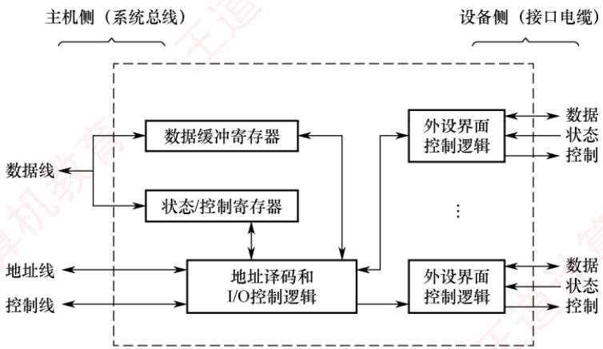  
图 7.1 一个 I/O 接口的通用结构

## 考点追踪I/O接口的数据线上传输的内容（2012）

I/O接口中的数据线传送的是读/写数据、状态信息、控制信息以及中断类型号（在向量中断中）；地址线指定要访问的I/O接口内部寄存器的端口地址；控制线传送的是读/写控制信号（用于区分寄存器访问方向），以及中断请求与响应信号、总线仲裁信号和设备握手信号。

I/O接口中的I/O控制逻辑的功能：①对控制寄存器中的命令字进行译码，并将生成的控制信号经外设界面控制逻辑送至外设。②输出时，将数据缓冲寄存器的内容发送给外设；输入时，将外设数据写入数据缓冲寄存器。③实时采集外设状态，并更新至状态寄存器。

对上述寄存器的访问通过专用指令完成，这类指令称为I/O指令。在采用独立I/O地址空间的体系结构（如x86），I/O指令通常为特权指令，仅限操作系统内核使用。

## 7.2.3 I/O 接口的类型

从不同角度，I/O接口可分为以下类型。

1）按数据传送方式（外设与接口一侧），可分为并行接口（一字节或一个字的所有位同时传送）和串行接口（一位一位有序传送），接口需完成相应的并/串或串/并格式转换。

2）按主机访问I/O设备的控制方式，可分为程序查询接口、中断接口和DMA接口等。

3）按功能灵活性，可分为可编程接口（通过编程改变接口功能）和不可编程接口。

## 7.2.4 I/O 端口及其编址

## 考点追踪V/O端口的定义及相关特性（2014）

I/O端口是指I/O接口电路中可被CPU直接访问的寄存器，主要包括：数据端口（支持CPU进行读/写操作）、状态端口（仅支持读操作）和控制端口（仅支持写操作）。

## 注意

端口与接口是两个不同概念：端口是接口内部可寻址的寄存器。

为使CPU能够访问各个I/O端口，必须对端口进行编址，每个端口对应一个唯一的端口地址。常见的编址方式有两种：独立编址与统一编址。 X

## （1）独立编址（I/O映射方式）

## 考点追踪I/0指令的作用（2017）

独立编址为I/O端口建立一个独立于主存的地址空间。I/O端口地址与内存地址在逻辑上完全分离，地址值可以相同，但由于属于不同地址空间，不会发生冲突。CPU通过专用的I/O指令（如x86中的IN和OUT）访问I/O端口，指令中的地址字段指定端口号。

优点：I/O端口数量远少于内存单元，所需地址线较少，译码电路简单，寻址速度快；使用专用I/O指令，使程序中I/O操作清晰可辨，便于阅读与调试。 K

缺点：I/O指令功能有限，通常仅支持简单的数据传输，程序设计灵活性较差；CPU需同时提供存储器读/写和I/O读/写两组控制信号，增加了控制逻辑的复杂性。

## （2）统一编址（存储器映射方式）

统一编址将部分主存地址空间分配给I/O端口，使I/O端口与内存单元共享同一地址空间。通过地址范围即可区分访问目标（如高地址段映射到I/O设备），因此无须专用I/O指令，CPU使用普通的访存指令（如加载和存储指令）即可访问I/O端口。

优点：无须专用I/O指令，使得编程更加灵活；I/O端口可获得较大的编址空间；I/O访问的保护机制可由虚拟存储管理系统统一实现，无须额外硬件支持。

缺点：I/O端口占用主存地址空间，减少了系统可用内存容量；由于需根据完整地址判断是否为I/O区域，译码电路相对复杂，可能降低译码速度。

## 7.2.5 本节习题精选

## 单项选择题

01. 在统一编址的方式下，区分存储单元和I/O设备是靠（）。

A. 不同的地址码 B. 不同的地址线C. 不同的控制线 D. 不同的数据线

02.下列功能中，属于I/O接口的功能的是（）。I. 数据格式的转换 道计 II. I/O 过程中错误与状态检测Ⅲ. I/O操作的控制与定时 IV. 与主机和外设通信A. I和IV B. I、III 和 IV C. I、ⅡI和IV D. I、II、III和IV

03.下列关于I/O端口和接口的说法中，正确的是（）。A. 在统一编址方式下，对主存单元和I/O端口的存储保存措施是独立的B. 在统一编址方式下，主存单元和I/O端口是靠不同的地址线来区分的C. 在独立编址方式下，主存单元和I/O端口是靠不同的地址线来区分的D. 在独立编址方式下，CPU需要设置专门的输入/输出指令访问I/O端口

04. 下列属于I/O接口中寄存器的有（）。I. 指令寄存器 Ⅱ. 控制寄存器 III. 状态寄存器V. 数据缓冲寄存器 IV. 存储器地址寄存器 道  
A. I、ⅡI、ⅢI和V B. II、III和IVC. II、ⅢI和VD. II、II、IV和 V

05. I/O的编址方式采用统一编址方式时，进行输入/输出的操作的指令是（）。A. 控制指令 B. 访存指令 C. 输入/输出指令 D. 都不对

06.下列关于I/O指令的说法中，错误的是（）。A. I/O 指令是 CPU 系统指令的一部分教B. I/O 指令是机器指令的一类C. I/O 指令反映 CPU 和 I/O 设备交换信息的特点D. I/O 指令的格式和通用指令的格式相同

07.下列叙述中，正确的是（）。A. 只有 I/O 指令可以访问 I/O 设备B. 在统一编址下，不能直接访问I/O设备C. 访问存储器的指令一定不能访问I/O设备D. 只有在具有专门I/O指令的计算机中，I/O设备才可以单独编址

08. 在内存地址空间与接口地址空间统一编址的计算机中，不需要的指令是（）。A. 数据传送类（如MOV指令）B. 算术、逻辑运算类（如ADD、SUB、AND和OR指令）C. 输入/输出类（如IN和 OUT指令） 计算机孝D.程序控制类（如条件转移指令和子程序调用指令）

09.在统一编址的情况下，就I/O设备而言，其对应的I/O地址不可取的是（）。A. 要求固定在地址高端 B. 要求固定在地址低端C. 要求相对固定在地址的某部分 D. 可以随意在地址的任何地方

10. 磁盘驱动器向盘片磁道记录数据时采用（）方式写入。A. 并行 B. 串行 C. 并行-串行 D. 串行-并行

11. 采用中断方式进行打印控制时，在打印控制接口和打印机之间交换的信息不包括（）。A. 打印字符点阵信息 B. 打印控制信息C. 打印机状态信息 D. 中断请求信息

12. 主机和外设之间的正确连接通路是（）。A. CPU和主存—I/O总线—通信总线（电缆）—I/O接口—外设B. CPU和主存—I/O总线—I/O接口—通信总线（电缆）—外设

C. CPU和主存—I/O接口—I/O总线—通信总线（电缆）—外设 D. CPU和主存—I/O接口—通信总线（电缆）—I/O总线—外设

13. 下列有关I/O接口功能和结构的叙述中，错误的是（）。A. I/O接口中主机侧数据宽度与设备侧数据宽度总是一样的B. I/O接口是像显卡或网卡之类的一种外设控制逻辑C. CPU可以从I/O接口读取状态信息，以了解接口和外设的状态D. CPU可以向I/O接口传送用来对设备进行控制的命令

14.【2012统考真题】下列选项中，在I/O总线的数据线上传输的信息包括（）。I. I/O 接口中的命令字 Ⅱ. I/O 接口中的状态字 I. 中断类型号A. 仅I、ⅡIB. 仅I、ⅢII C. 仅ⅡI、ⅢI D. I、ⅡI、Ⅲ

15.【2014统考真题】下列有关I/O接口的叙述中，错误的是（）。A. 状态端口和控制端口可以合用同一个寄存器B. I/O 接口 中 CPU 可访问的寄存器称为 I/O 端口C.采用独立编址方式时，I/O端口地址和主存地址可能相同D. 采用统一编址方式时，CPU不能用访存指令访问I/O端口

16.【2017统考真题】I/O指令实现的数据传送通常发生在（）。A. I/O 设备和 I/O 端口之间 B. 通用寄存器和I/O 设备之间C. I/O端口和I/O端口之间 D. 通用寄存器和I/O 端口之间

17.【2021统考真题】下列选项中，不属于I/O接口的是（）。A. 磁盘驱动器 B. 打印机适配器 C. 网络控制器 D. 可编程中断控制器

## 7.2.6 答案与解析

## 单项选择题

01. A

在统一编址的情况下，没有专门的I/O指令，因此用访存指令来实现I/O操作，区分存储单元和I/O设备是靠它们各自不同的地址码。

02. D

I/O接口的功能有：①选址功能、②传送命令功能、③传送数据功能、④反映I/O设备工作状态的功能。选项Ⅰ可参考唐朔飞老师的《计算机组成原理》教材，为设置接口的原因之一，也是接口应具有的功能；说法Ⅱ属于④；说法Ⅲ属于②；说法IV属于③。

03. D

在统一编址方式下，I/O端口和主存使用相同的地址空间，因此存储保存措施是通过相同的机制来实现的。在独立编址方式下，I/O端口和主存使用不同的地址空间，CPU访问I/O端口时需要专门的输入输出指令，例如IN和QUT指令，而不能直接使用主存操作指令。两种编址方式都是通过相同的地址总线进行访问的，通过不同的编址策略和控制信号来区分。

04. C

I/O接口中的寄存器主要有数据缓冲寄存器、控制寄存器和状态寄存器。

05. B

统一编址时，直接使用指令系统中的访存指令来完成输入/输出操作；独立编址时，则需要使用专门的输入/输出指令来完成输入/输出操作。

06. D

I/O指令是指令系统的一部分，是机器指令的一类，但其为了反映与I/O设备交互的特点，

格式和其他通用指令相比有所不同。

## 07. D

在统一编址的情况下，访存指令也可访问I/O设备，选项A、B、C错误。在独立编址的方式下，访问I/O地址空间必须通过专门的I/O指令，选项D正确。

## 08. C

统一编址方式把I/O端口当作存储器的单元进行地址分配，CPU不需要设置专门的I/O指令（输入/输出类指令），用统一的访存指令就可以访问I/O端口。

## 09. D

在统一编址方式下，指令靠地址码区分内存和I/O设备，若随意在地址的任何地方编址，则会给编程造成极大的混乱，选项D错误。选项A、B、C的做法都是可取的。

## 10. B

磁盘驱动器向盘片磁道记录数据时采用串行方式写入。

## 11. D

打印机的中断控制过程通常是：CPU先将需要打印的字符送到打印控制接口（也称打印适配器）中，打印控制接口再将字符转换为点阵信息，然后通过电缆传送到打印机，以控制打印针头在何处进行打印。同时，打印控制接口需要将“初始化”“选通”“自动走纸”等打印控制信息通过电缆传送到打印机，并通过电缆把打印机的“联机”“忙”“缺纸”等状态信号取到打印控制接口，以供CPU读取。中断请求信号是打印控制接口通过中断控制器发送给CPU的，因此不在打印控制接口和打印机之间进行交换，选项D错误。

## 12. B

CPU和主存通过I/O总线和I/O接口连接，I/O接口通过通信总线和外设相连。

## 13. A

I/O接口中主机侧通过I/O总线与主机相连，设备侧通过通信总线（电缆）与外设相连。显然，I/O总线中的数据线宽度和连接设备的电缆中的数据线宽度不一定相同。

## 14. D

I/O总线分为三类：数据线、控制线和地址线。数据缓冲寄存器和命令/状态寄存器的内容都是通过数据线来传送的：地址线用以传送与CPU交换数据的端口地址：而控制线用于给I/O端口发送读/写信号，仅用于对端口进行读/写控制。中断类型号用于指出中断向量的地址，CPU响应某一外部中断后，就从数据总线上获取该中断源的中断类型号，然后据此计算对应中断向量在中断向量表（存放在内存中）的位置。因此说法I、Ⅱ和Ⅲ均正确。

## 15. D

采用统一编址时，CPU访存和访问I/O端口用的是一样的指令，所以访存指令可访问I/O端口，选项D错误。其他三个选项均为正确陈述。 X

## 16. D

I/O端口是指I/O接口中用于缓冲信息的寄存器，由于主机和I/O设备的工作方式和工作速度有很大差异，I/O端口应运而生。在执行一条指令时，CPU使用地址总线选择所请求的I/O端口，使用数据总线在CPU寄存器和端口之间传输数据。

## 17. A

I/O接口即I/O控制器，其功能是接收主机发送的I/O控制信号，并实现主机和外部设备之间的信息交换。磁盘驱动器是由磁头、磁盘和读/写电路等组成的，也就是我们平常所说的磁盘本身，选项A错误。选项B、C和D均为I/O控制器。

## 7.3 I/O 方式

输入/输出系统实现主机与I/O设备之间的数据传送，可采用不同的控制方式。各种方式在硬件代价、系统性能及适用场景等方面各有侧重。常用的I/O方式包括程序查询、程序中断和DMA等，其中前两种方式高度依赖CPU执行程序指令来完成控制。

## 7.3.1 程序查询方式

在程序查询方式中，数据交换的控制完全由CPU通过执行程序实现。接口电路通常包含一个数据缓冲寄存器（数据端口）和一个设备状态寄存器（状态端口）。主机进行I/O操作时，首先读取设备状态，并据此决定是立即传送数据还是继续等待。 十算

## 考点追踪程序查询方式的特点（2023）

程序查询方式的工作流程如下（见图7.2）：

①CPU执行初始化程序，预置传送参数（如起始地址、数据量等）。

②向I/O接口发送命令字，启动外设。

③循环读取外设状态寄存器。

④若设备未就绪，则继续查询；若就绪，则执行一次数据传送。 K

⑤修改地址和计数器参数。

⑥判断传送是否完成，若未完成则返回步骤③，直至计数器归零。

根据查询策略的不同，程序查询方式可分为两类：

1）独占查询。一旦启动外设，CPU便连续不断地查询其状态，直至操作完成。在此期间，CPU无法执行其他任务，处于忙等待状态，导致CPU与外设完全串行工作。

2）定时查询。CPU以固定时间间隔周期性地查询外设状态。每次查询时，若设备已就绪，则传送一个数据单元，随后返回用户程序继续执行。查询间隔需根据外设的数据传输速率合理设置，以避免数据丢失。

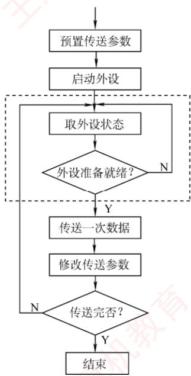  
图7.2 程序查询方式的工作流程

## 考点追踪定时查询的特点、效率分析及计算（2011、2018）

【例7.1】假设计算机主频为500MHz，CPI为4，某外设的数据传输速率为2MB/s，其I/O接口配备一个32位数据缓冲寄存器。采用定时查询方式，每次查询操作执行10条指令。问：CPU最多间隔多长时间查询一次，才能避免数据丢失？此时CPU用于该外设I/O的时间占总时间的百分比至少为多少？

解：

由于端口缓冲区容量有限，必须在外设填满该缓冲区前完成读取，否则新数据将覆盖未读取的旧数据，造成丢失。外设填满（4字节）缓冲区所需时间为 $4\mathrm{B} \div 2\mathrm{MB} / \mathrm{s} = 2\mu\mathrm{s}$ 。因此，CPU最多每隔2μs就需查询一次，即每秒至少查询 $1s \div 2\mu s = 5 \times 10^{5}$ 次。每次查询执行10条指令，每条指令平均消耗4个时钟周期，故每秒用于I/O的时钟周期数为 $5 \times 10^{5} \times 10 \times 4 = 2 \times 10^{7}$ ; CPU 主频为 500MHz（每秒5×10□个时钟周期），因此I/O时间占比为 $(2 \times 10^{7}) \div (5 \times 10 \square) = 4\%$ 0

程序查询方式的优点是设计简单、硬件开销小。缺点是CPU需耗费大量时间进行查询与等待，且在同一时间段内只能与一台外设通信，导致CPU与外设串行工作，效率很低。

## 7.3.2 程序中断方式

## 1. 程序中断的基本概念

程序中断是指在计算机执行程序的过程中，当出现某些急需处理的外部事件或内部异常时，CPU暂停当前程序的执行，转去处理该事件或异常；处理完毕后，再返回到原程序的断点处继续执行。中断技术最初被用于实现主机与I/O设备之间的异步通信。

## 考点追踪中断方式的特点（2022、2023）

随着计算机系统的发展，中断技术被赋予了多种重要功能，主要包括：

①实现 CPU与I/O 设备的并行工作。

②处理硬件故障和软件异常。

③支持人机交互（如键盘输入、鼠标点击）。

④支撑多道程序与分时操作系统的任务切换。

⑤满足实时系统对快速响应的需求。

⑥实现用户程序向操作系统的切换（如通过软中断或系统调用指令）。

⑦ 在多处理器系统中协调各处理器间的通信与任务迁移。

中断的基本工作思想：当前进程发起I/O操作时，会启动相应外设，并主动进入阻塞状态；CPU随即转而执行就绪队列中的另一进程，实现外设与CPU的并行工作。外设完成数据准备后，主动向CPU发出中断请求。CPU响应后，暂停当前指令流，保存现场，并转入中断服务程序，完成主机与外设之间的数据传送。数据传送结束后，CPU恢复被中断进程的现场，并返回断点处继续执行。此后，外设与CPU再次并行工作，如图7.3所示。

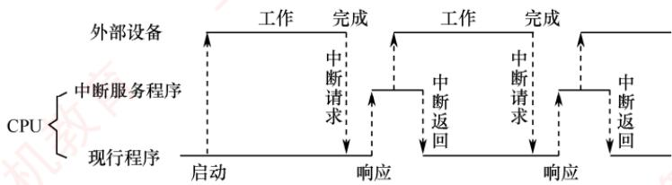  
图7.3 程序中断方式示意图  
考点追踪程序中断的效率分析及相关计算（2009、2014、2016、2018、2019）

【例7.2】假设计算机主频为500MHz，CPI为4，某外设的数据传输速率为40MB/s，其I/O接口配备一个32位数据缓冲寄存器。在中断I/O方式下，若每次中断响应与中断处理共需至少400个时钟周期，则该外设能否采用中断I/O方式？为什么？

解：

中断响应与中断处理所需时间为 $400 \times 1 / 500  M  = 0.8 \mu  S$ 。外设填满（4B）缓冲区所需时间为4B $40 \mathrm{MB/s} = 0.1 \mu \mathrm{s}$ 由于外设准备数据的时间（0.1μs）远小于中断处理时间（0.8μs），若采用每32位触发一次中断的方式，则新数据将在CPU处理完前次中断前就已到达，导致缓冲区被覆盖而丢失数据。因此，该高速外设不适合直接使用单字中断方式。

## 2. 程序中断的工作流程

考点追踪中断工作流程中的相关细节（2017、2018、2021、2024）

## （1）中断请求

中断源是指能够向CPU发出中断请求的设备或事件。一台计算机允许多个中断源同时存在，且各中断源发出请求的时间具有随机性。为记录并区分不同的中断请求，中断系统为每个中断源设置一个中断请求标记触发器：当其状态为“1”时，表示该中断源有中断请求。这些触发器可组成中断请求标记寄存器，该寄存器可集中置于CPU内部，也可分散在各个中断源中。

## 考点追踪可屏蔽中断和不可屏蔽中断的特点（2020）

通过INTR信号线发出的是可屏蔽中断，通过NMI信号线发出的是不可屏蔽中断。可屏蔽中断的优先级较低，在关中断状态下不被响应；不可屏蔽中断用于处理紧急且关键的硬件事件（如电源掉电、总线错误等），其优先级最高，且不受中断允许标志的影响。

## (2)中断响应判优

中断响应优先级是指CPU响应多个同时发生的中断请求的先后顺序。由于中断请求具有随机性，当多个中断源同时提出请求时，需通过中断判优逻辑确定优先响应哪个中断源的请求。中断响应的判优通常由硬件排队器（或中断查询程序）实现。

一般来说，①不可屏蔽中断>可屏蔽中断；②在I/传送类中断请求中，高速设备>低速设备：输入设备>输出设备；实时设备>普通设备。 XTA

## 注意

中断优先级包括响应优先级和处理优先级。响应优先级由硬件线路或查询顺序固定决定，不可动态更改；处理优先级可通过中断屏蔽技术动态调整，以支持多重中断（中断嵌套）。二者的关系可概括为：只有未被屏蔽的中断请求，才会被送入中断判优电路参与响应优先级的判定。

## （3）CPU响应中断的条件

## 考点追踪CPU响应中断的条件（2023）

CPU仅在满足特定条件时才会响应中断请求，并经过一些特定的操作，转去执行中断服务程序。CPU响应中断必须满足以下三个条件：12

①存在有效的中断请求。

②CPU处于开中断状态（中断允许标志为1；异常和不可屏蔽中断不受此限制）。

③当前指令已执行完毕（异常不受此限制），且无更高优先级任务待处理。

## 注意

I/O设备的就绪时间是随机的，而CPU仅在每条指令执行结束时统一采样中断请求信号（前提是开中断）。因此，CPU响应I/O中断的时机总是发生在某条指令执行完成之后。此处所述中断特指I/O中断，不包括异常。

## (4)中断响应过程

CPU响应中断后，由硬件自动完成一系列操作（称为中断隐指令），随后转入中断服务程序。中断隐指令并非指令系统中的真实指令，而是对硬件自动操作的统称，主要包括以下步骤：

1）关中断。CPU响应中断后，首先关闭中断允许标志，禁止响应任何可屏蔽中断（包括更高优先级者），以防止在保存断点和现场时被新中断打断；否则，现场信息可能不完整，导致中断返回后无法正确恢复原程序的执行。

2）保存断点。为保证中断返回后能正确恢复原程序执行，需将程序计数器（PC）和程序状态字（PSW）等关键现场信息保存至栈或专用寄存器中①。

中断与异常的差异：中断发生于指令执行完成后，断点为下一条指令地址；故障类异常（如缺页、除零）因指令未完成，处理后需重新执行当前指令，断点为当前指令地址；陷阱类异常（如系统调用）在指令成功执行后触发，断点为下一条指令地址。

3）引出中断服务程序。通过识别中断源，将对应中断服务程序的入口地址送入程序计数器PC。识别方法主要有硬件向量法和软件查询法，本节主要讨论更常用的硬件向量中断法。

(5)中断向量

中断识别分为向量中断和非向量中断两类。非向量中断采用软件查询法，已在第5章介绍。

## 考点追踪中断向量表的数据结构（2023）

在向量中断中，每个中断源被分配一个唯一的中断类型号，该类型号对应一个中断服务程序的入口地址，此地址称为中断向量。系统将所有中断向量集中存放在内存的特定区域，该区域称为中断向量表。 XAV

CPU响应中断后，首先在中断响应阶段从数据总线获取该中断源的中断类型号，然后据此计算出对应中断向量在中断向量表中的地址：接着从中断向量表中读取该中断向量，并送入程序计数器PC，从而转入对应的中断服务程序。这种基于中断向量表实现转移的方法称为中断向量法，采用该方法的中断即为向量中断。 XTA

## 注意

中断请求和响应信号通过I/O总线的控制线传输，而中断类型号则在中断响应阶段由中断控制器经数据总线提供给CPU，用于定位中断向量表中的相应表项。

## （6）中断处理过程

不同计算机的中断处理过程各具特色，图7.4所示为一个支持中断嵌套的典型处理流程。

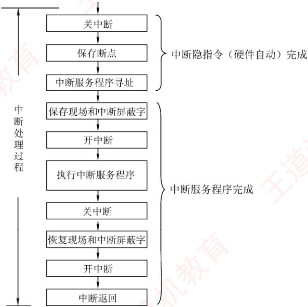  
图7.4 一个支持中断嵌套的典型处理流程

中断处理流程如下：

①关中断。防止在保存关键信息过程中被新中断打断。

②保存断点。由硬件自动将断点信息保存至栈或专用寄存器。

③中断服务程序寻址。通过中断类型号获取服务程序入口地址，并送入PC。

④保存现场和中断屏蔽字。通过软件指令将现场信息和中断屏蔽字压入栈中，以便后续恢复。现场信息是指CPU中可能被中断服务程序修改且需恢复的寄存器内容。

## 注意

断点与现场信息均不可被中断服务程序破坏。由于现场信息用指令可直接访问，因此由软件在进入中断服务程序时显式保存。而断点信息由硬件在中断响应阶段自动保存。

⑤开中断。由开中断指令实现，允许更高优先级的中断请求被响应，从而实现中断嵌套。

⑥执行中断服务程序。

⑦关中断。由关中断指令实现，确保在恢复现场和中断屏蔽字的过程中不被中断。

⑧恢复现场和中断屏蔽字。从栈中恢复寄存器内容及中断屏蔽状态。

⑨开中断、中断返回。中断服务程序的最后一条指令通常为中断返回指令，用于恢复断点现场并返回原程序继续执行。

考点追踪中断隐指令的功能（2012）

其中，①～③由中断隐指令（硬件自动）完成；④～⑨由中断服务程序（软件）完成。

考点追踪单重中断的处理流程（2010）

## 注意

对于单重中断（不支持嵌套），上述流程中省略⑤（开中断）和⑦（关中断）即可。

## 3. 多重中断和中断屏蔽技术

在CPU执行中断服务程序的过程中，若出现新的更高优先级中断请求，而CPU不予响应，则称为单重中断，如图7.5(a)所示；若CPU暂停当前中断服务程序，转去处理新中断，则称为多重中断（也称中断嵌套），如图7.5(b)所示。

(a) 单重中断  
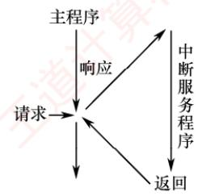

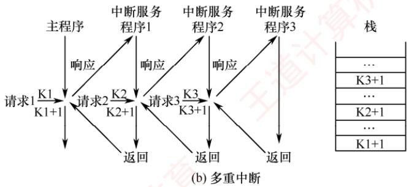  
图 7.5 单重中断和多重中断示意图

在图7.5(b)中，CPU执行主程序时收到中断请求1。由于主程序未屏蔽任何中断，CPU响应中断该请求，将主程序断点保存至栈中，并转入中断服务程序1。在执行中断服务程序1期间，若发生优先级更高的中断请求2，CPU会暂停中断服务程序1，将其断点保存至栈中，并转入中

断服务程序2。类似地，更高优先级的中断请求3可打断中断服务程序2。当中断请求3处理完毕后，CPU从栈顶恢复断点，返回至中断服务程序2的断点（K3+1）处继续执行。以此类推，直至所有中断处理完毕，最终返回主程序的断点（K1+1）处继续执行。

## 考点追踪多重中断的中断屏蔽字相关的性质（2017、2020、2021、2024）

中断处理优先级是指多重中断的实际处理顺序，可通过中断屏蔽技术动态调整。若不使用屏蔽技术，则处理优先级与响应优先级（中断请求被CPU识别的先后顺序）一致。现代计算机普遍采用中断屏蔽技术，通过设置中断屏蔽字寄存器实现灵活的优先级控制。

图7.6所示为一个简单的可编程中断控制器。来自I/O总线的外设中断请求信号（IRi）首先被记录在中断请求寄存器中。中断屏蔽字寄存器的每一位对应一个中断源：置1时屏蔽对应的中断请求，置0时允许其通过。在送入中断判优电路前，每个中断请求信号会与其对应屏蔽位的取反值进行逻辑“与”操作一一仅当屏蔽位为0时，该中断请求才被允许参与仲裁。因此，被屏蔽的中断无法进入判优电路，而未被屏蔽的中断则按固定的响应优先级次序处理。

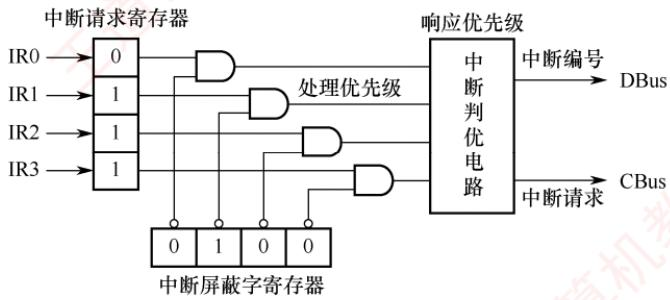  
图7.6 一个简单的可编程中断控制器

需要注意的是：中断屏蔽字通常在进入中断服务程序时由软件加载，用于控制后续中断的嵌套行为。因此，中断屏蔽仅在CPU执行中断服务程序期间生效；而在主程序运行阶段，中断响应仍由主程序所设置的屏蔽状态决定（通常为全开放）。此外，即使在中断服务程序执行期间，若有多个未屏蔽中断同时到达，其处理顺序仍由中断判优电路的

响应优先级决定。

关于中断屏蔽字的设置及多重中断程序执行的轨迹，下面通过实例说明。

【例7.3】假设某机有4个中断源A、B、C、D，其硬件响应优先级为 $\mathrm{A} > \mathrm{B} > \mathrm{C} > \mathrm{D}$ 。现要求通过中断屏蔽技术，将实际中断处理优先级调整为 $\mathrm{A} > \mathrm{D} > \mathrm{C} > \mathrm{B}$ 0 YTA

1）写出每个中断源对应的中断屏蔽字。

2）若CPU在执行用户程序时，A、C、D同时发出中断请求；随后在执行C的中断服务程序期间，B又发出中断请求。试分析CPU的程序执行轨迹。 省村

解：

1）中断处理优先级调整为 $\mathrm{A} > \mathrm{D} > \mathrm{C} > \mathrm{B}$ 后，A的处理优先级最高，需要屏蔽所有中断（包括自身），屏蔽字设为1111；D的次高，只允许被A中断，屏蔽B、C和自身，屏蔽字是0111；C的第三，允许被A和D中断，屏蔽B和自身，屏蔽字为0110；B的最低，允许被A、D、C中断，仅屏蔽自身，屏蔽字为0100；结果如表7.1所示。

表7.1 中断源对应的中断屏蔽字
<table><tr><td rowspan=2 colspan=1>中断源</td><td rowspan=1 colspan=4>屏蔽字</td></tr><tr><td rowspan=1 colspan=1>A</td><td rowspan=1 colspan=1>B</td><td rowspan=1 colspan=1>C</td><td rowspan=1 colspan=1>D</td></tr><tr><td rowspan=1 colspan=1>A</td><td rowspan=1 colspan=1>1</td><td rowspan=1 colspan=1>Iy</td><td rowspan=1 colspan=1>1</td><td rowspan=1 colspan=1>1</td></tr><tr><td rowspan=1 colspan=1>B</td><td rowspan=1 colspan=1>0</td><td rowspan=1 colspan=1>1</td><td rowspan=1 colspan=1>0</td><td rowspan=1 colspan=1>0</td></tr><tr><td rowspan=1 colspan=1>C</td><td rowspan=1 colspan=1>0～</td><td rowspan=1 colspan=1>1</td><td rowspan=1 colspan=1>1</td><td rowspan=1 colspan=1>0</td></tr><tr><td rowspan=1 colspan=1>D</td><td rowspan=1 colspan=1>0</td><td rowspan=1 colspan=1>1</td><td rowspan=1 colspan=1>1</td><td rowspan=1 colspan=1>1</td></tr></table>

2）CPU执行用户程序时，A、C和D同时发出中断请求。根据响应优先级，先响应A。进入A的服务程序前，系统保存现场，加载A的屏蔽字1111，并开中断。由于所有中断均被屏蔽，A的服务程序独占CPU直至完成，随后返回用户程序。重回用户程序后，C和D尚未处理，根据响应优先级，先响应C。但在执行C的服务程序前，系统加载其屏蔽字0110，即允许D打断C，于是CPU响应D。D的处理过程中未出现更高处理优先级的中断请求，D顺利完成后返回被中断的C继续执行。在C的处理过程中，B发出中断请求，但由于C的屏蔽字为0110，B被屏蔽，该请求不予响应。C处理完后返回用户程序。

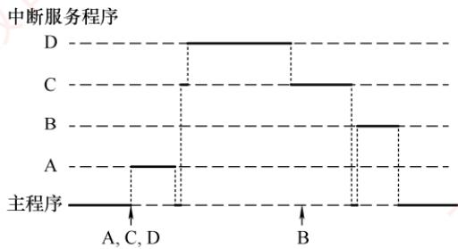  
图 7.7 CPU 执行程序的轨迹

从宏观上看，程序中断方式克服了程序查询方式中CPU的忙等待现象，显著提高了CPU利用率。但从微观操作分析，CPU在处理中断时仍需暂停原程序的运行。尤其当高速设备频繁、成批地与主存交换数据时，会不断打断CPU现行程序以执行中断服务程序，造成较大开销。

## 7.3.3 DMA 方式

DMA方式是一种完全由硬件控制的数据传输方法，它具有程序中断方式的优点，即在数据准备阶段，CPU与外设可并行工作。DMA在外设与内存之间建立了一条直接的数据通路，使得信息传送无须经过CPU，从而显著降低CPU在数据传输过程中的负担。正因如此，该方式被称为直接存储器存取，并避免了保存与恢复CPU现场等复杂操作。

## 考点追踪DMA方式的使用场景（2025）

DMA特别适用于磁盘、显卡、声卡、网卡等高速设备的大批量数据传输，但其硬件实现开销较高。在DMA方式中，中断的作用仅限于处理故障和正常传输完成的通知。

## 考点追踪DMA方式中的数据传输通路（2024）

## 1. DMA 方式的特点

DMA机制在主存与DMA控制器之间建立了一条直接的数据通路。由于数据传输不经过CPU，因此无须中断现行程序，从而实现I/O操作与CPU计算的并行执行。

## DMA方式的主要特性包括：

1）打破主存与CPU的固定关联，主存既可被CPU访问，又可被外设直接访问。

2）在块数据传输过程中，主存地址的生成与传送字数的计数均由硬件电路自动完成。

3）主存中需设置专用缓冲区，以支持高效的数据交换。

4）支持高速数据传输，且CPU与外设可并行工作，显著提升系统效率。

5）传输开始前需由软件进行预处理，结束后则通过中断机制完成后处理。

## 2. DMA 控制器的组成

在DMA方式中，对数据传送过程进行控制的硬件称为DMA控制器（DMA接口）。当I/O设备需要进行数据传送时，通过DMA 控制器向 CPU提出 DMA 请求，CPU 响应后即让出系统总线，由DMA控制器接管总线并执行数据传送。其主要功能如下：

1）接收外设发出的DMA请求，并向CPU发出总线请求信号。

2）在CPU发出总线响应信号后，DMA控制器接管总线控制权，进入DMA操作周期。

3）确定数据传送的主存起始地址及长度，并自动更新主存地址计数器和传送长度计数器。

4）指定数据在主存与外设间的传送方向，发出读/写等控制信号，完成数据传送。

5）在DMA操作结束后，向CPU报告传送完成。

图 7.8 给出了一个简单的 DMA 控制器。

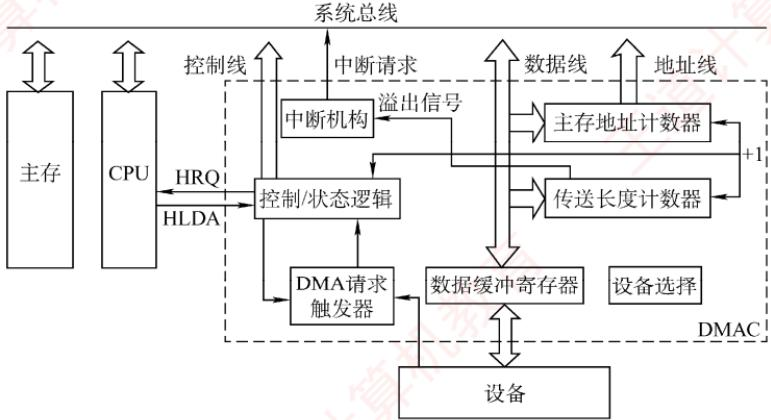  
图 7.8 一个简单的 DMA 控制器

●主存地址计数器：存放待传送数据的主存地址。传送前，保存整批数据的起始地址；每传送一个字，其内容自动加1，直至该批数据传送完毕。

● 传送长度计数器：记录待传送数据的总长度。传送前，存入整批数据的总字数；每传送一个字，计数值减1，当计数器为0时，表示传送结束。

● 数据缓冲寄存器：暂存每次传送的数据。通常，DMA控制器与主存之间以字为单位传送，而与外设之间可能以字节或字为单位。

● DMA请求触发器：当I/O设备准备好数据时，发出DMA请求信号，使其置位。

● 控制/状态逻辑：用于设定传送方向、更新传送参数，并协调DMA 请求与CPU响应信号。

● 中断机构：当一批数据传送完毕后，触发中断并向CPU发出中断请求。

在DMA传送过程中，DMA控制器接管系统总线；传送结束后，将总线控制权交还给CPU，由CPU继续执行后续操作。因此，DMA控制器必须具备控制系统总线的能力。

## 3. DMA 的传送方式

主存与I/O设备之间交换信息时不经过CPU。然而，当I/O设备和CPU同时访问主存时，可能发生冲突。为高效利用主存，DMA与CPU通常采用以下三种方式共享主存。

## （1）停止CPU访存

当I/O设备发出DMA请求时，DMA控制器向 CPU 发送停止信号，使CPU放弃总线控制权并暂停访存，直至DMA完成整块数据的传送（见图7.9）。数据传送结束后，DMA控制器通知CPU恢复主存访问，并交还总线控制权。

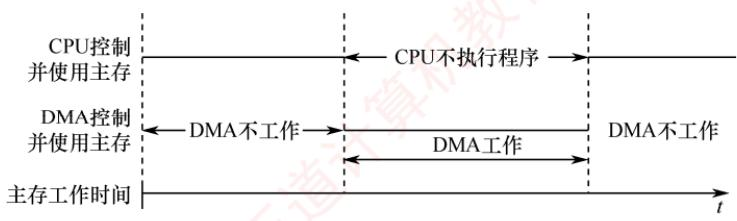  
图 7.9 停止 CPU 访存

优点：控制逻辑简单，适用于数据传输速率很高的I/O设备进行成组数据传送。

缺点：DMA访存期间，CPU基本处于空闲状态，资源利用率较低。

## (2) 周期挪用

## 考点追踪周期挪用的特点及挪用次数分析（2012、2020、2022）

对于高速I/O设备，若不及时访存可能导致数据丢失，因此其访存请求具有较高优先级。周期挪用允许I/0设备挪用一个主存存储周期，传送完一个数据字后立即释放总线（见图7.10），属于单字传送方式。当I/O设备发起DMA请求时，可能出现以下三种情况：①CPU当前不在访存，I/O请求无冲突，可直接使用总线；②CPU正在访存，则需等待当前存储周期结束，再释放总线控制权；③I/O与CPU同时请求访存，发生冲突，此时CPU暂时放弃总线控制权。

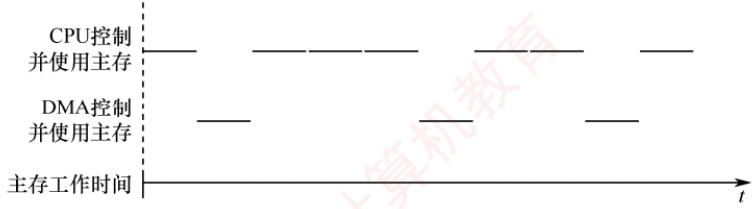  
图 7.10 周期挪用

优点：既满足了I/O数据传送需求，又较好地发挥了CPU与主存的效率。

缺点：每次挪用均需申请并释放总线控制权，带来一定开销。

## (3) DMA 与 CPU 交替访存

将CPU工作周期划分为两个子周期：一个供CPU访存，另一个供DMA访存。这样，在每个CPU周期内，两者可以轮流访问主存（见图7.11）。该方式适用于CPU工作周期长于主存存储周期的场景。例如，若CPU工作周期为1.2μs，主存存储周期小于0.6μs，则可将其分为 $\mathrm { C _ { 1 } }$ 和$\mathrm { C } _ { 2 }$ 两个子周期，其中 $\mathrm { C _ { 1 } }$ 专供 DMA 访存， $\mathrm { C } _ { 2 }$ 专供 CPU访存。总线控制权通过 $ C _{1}$ 和 $\mathrm { C } _ { 2 }$ 分时固定分配，无须动态申请或释放。

优点：无须总线控制权的申请与释放过程，数据传送速率高。

缺点：硬件控制逻辑较为复杂。

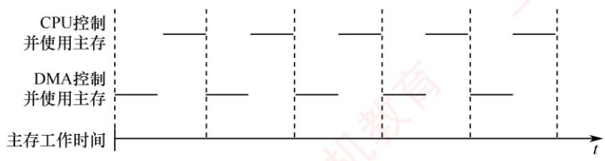  
图 7.11 DMA 与 CPU 交替访存

考点追踪DMA方式的效率分析及相关计算（2011、2018）

【例7.4】假定计算机的主频为500MHz，CPI为4，某外设的数据率为40MB/s，I/O接口中的数据端口为32位，采用DMA方式，每次DMA 传送块大小为1000B，且DMA预处理和后处理的总时钟周期数为500，则CPU用于该外设I/O的时间占CPU总时间的百分比是多少？

## 解：

DMA 每秒次数为 $40MB/s \div 1000B = 40000$ ，在DMA方式中，只有预处理和后处理需要CPU处理，数据传送全程由DMA控制。CPU用于外设I/O的总时间为 $40000 \times 500 = 2 \times 10^{7}$ 个时钟周期，占CPU总时间的百分比为 $2 \times 10^{7} \div 500M = 4\%$

## 4. DMA 的传送过程

考点追踪DMA方式的传送过程（2019）

图7.12所示为DMA的数据传送流程，分为预处理、数据传送和后处理三个阶段。

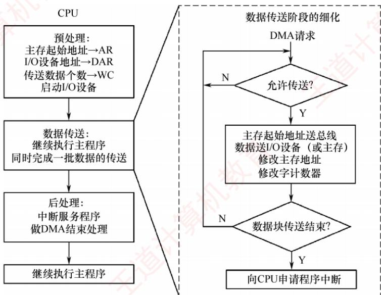  
图 7.12 DMA 的数据传送流程

## （1）预处理

由CPU完成必要的初始化工作，包括设置DMA控制器中的主存起始地址、传送方向、传送数据个数，并启动I/O设备。随后，CPU继续执行原程序。当I/O设备准备好待发送（输入）或接收（输出）的数据时，会向DMA控制器发出DMA请求；DMA控制器随即向CPU发出总线请求，申请总线控制权。

## (2）数据传送

DMA以数据块为单位进行传送。一旦获得总线控制权，DMA控制器便通过硬件循环自动完成数据的输入或输出操作，整个过程无须CPU干预。

## (3）后处理

## 考点追踪DMA传送结束时的处理（2025）

数据块传送完成后，DMA控制器向CPU发出中断请求。CPU响应后执行中断服务程序，进行后处理工作，如校验数据完整性，若出错则转入诊断程序等。

在DMA方式下，整个数据块的传送过程均由硬件完成，CPU仅在预处理阶段进行初始化在后处理阶段响应中断，因此用于I/O的开销极小。

## 5. DMA 方式和中断方式的区别

考点追踪DMA与中断方式的对比（2013、2023）

DMA方式和中断方式的主要区别如下：

①中断方式涉及程序切换，需保存和恢复CPU现场；而DMA方式不中断现行程序，无须保存现场，除预处理和后处理外，完全不占用CPU资源。

②中断请求只能在每条指令执行结束后被响应；而DMA请求可在当前总线周期结束后立即获得响应，无须等待指令完成。

③中断方式的数据传送依赖CPU执行指令完成；DMA 方式则由专用硬件直接在主存与外设间传送数据，传输速率高，适用于高速外设的成组数据传输。

④当CPU和 DMA控制器同时访问主存时，DMA 请求的优先级通常更高。

⑤中断方式具备处理异常事件的能力，而DMA方式仅用于大批量数据的高效传输。

⑥从数据传送来看，中断方式由软件控制传送，DMA方式由硬件直接完成。

## 7.3.4本节习题精选

## 一、单项选择题

01.设置中断排队判优逻辑的目的是（）。A. 产生中断源编码B. 使同时提出的请求中的优先级别最高者得到及时响应C. 使CPU 能方便地转入中断服务子程序D. 提高中断响应速度

02.下列关于中断的说法中，错误的是（）。A. 中断服务程序一般是操作系统模块B. 中断向量方法可提高中断源的识别速度C. 中断向量地址是中断服务程序的入口地址D. 重叠处理中断的现象称为中断嵌套

03. 下列关于程序中断方式和DMA方式的叙述中，错误的是（）。I. DMA 的优先级比程序中断的优先级要高 机教育Ⅱ. 程序中断方式需要保存现场，DMA方式在传输过程中不需要保存现场II. 程序中断方式的中断请求是为了报告CPU数据的传输结束，而 DMA方式的中断请求完全是为了传送数据A.仅Ⅱ B. ⅡI、ⅢII C. 仅 D. I、IⅢI

04.下列关于程序中断方式和DMA方式的说法中，错误的是（）。I. 程序中断过程是由硬件和中断服务程序共同完成的Ⅱ. 在每条指令的执行过程中，每个总线周期要检查一次有无中断请求Ⅲ. 检测有无DMA请求，一般安排在一条指令执行过程的末尾IV. 中断服务程序的最后指令是无条件转移指令V. 中断响应判优是根据中断屏蔽字来确定中断的优先级A. I、III、IV B. II、III、IV、VC. II、IV、V D. II、III、IV

05. 能产生 DMA 请求的总线部件是（）。I. 高速外设 Ⅱ. 需要与主机批量交换数据的外设

III. 具有 DMA 接口的设备 MXA. 仅I B. 仅ⅢI D. II、III

06. 在具有中断向量表的计算机中，中断向量地址是（）。A. 子程序入口地址 B. 中断服务程序的入口地址C. 中断服务程序入口地址的地址 D. 中断程序断点

07.中断响应是在（）。 ユA. 一条指令执行开始 B. 一条指令执行中间C. 一条指令执行之末 D. 一条指令执行的任何时刻

08.在下列情况下，可能不发生中断请求的是（）。A. DMA 操作结束 B. 一条指令执行完毕C. 机器出现故障 D. 执行“软中断”指令

09. 某计算机有 4 级中断，优先级从高到低为 1→2→3→4。若将优先级顺序修改，改后 1级中断的屏蔽字为1101，2级中断的屏蔽字为0100，3级中断的屏蔽字为1111，4级中断的屏蔽字为0101，则修改后的优先顺序从高到低为（）。王A. 1→2→3→4  B. 3→1→4→2 C. 1→3→4→2 D. 2→1→3→4

10.下列不属于程序控制指令的是（）。A. 无条件转移指令 B. 有条件转移指令C. 中断隐指令 D. 循环指令

11. 在中断响应周期中，CPU主要完成的工作是（）。A. 关中断，保存断点，发中断响应信号并形成向量地址B. 开中断，保存断点，发中断响应信号并形成向量地址C. 关中断，执行中断服务程序 直计D. 开中断，执行中断服务程序

12. 下列关于中断I/O方式的叙述中，错误的是（）。A. CPU对外部中断的响应不可能发生在一条指令的执行过程中B. 在中断I/O方式下，外设接口中的寄存器和CPU中的寄存器直接交换数据C. 中断请求的是CPU时间，要求CPU执行程序来处理发生的相关事件D. 只要有中断请求发生，一条指令执行结束后CPU就进入中断响应周期

13. 当CPU响应中断时，进入“中断响应周期”，采用硬件方法保存并更新程序计数器（PC）内容，而不是由软件完成的，主要是为了（）。A.能进入中断处理程序，并能正确返回源程序 王道计B. 节省主存空间C. 提高处理机速度D. 易于编制中断处理程序

14. 在I/O接口中设置中断触发器保存外设发出的中断请求，是因为（）。A. 中断不需要立即处理B. 中断设备的处理速度比 CPU快 教C. CPU无法对发生的中断请求立即进行处理D. 可能有多个中断同时发生

15. 在中断响应周期中，由（）将允许中断触发器置0。A. 关中断指令B. 中断隐指令 C. 开中断指令 D. 中断服务程序

16. CPU响应中断时最先完成的步骤是（）。A. 开中断 B. 保存断点 C.关中断 D. 转入中断服务程序

17. 设置中断屏蔽标志可以改变（）。A. 多个中断源的中断请求优先级 B. CPU对多个中断请求响应的优先次序C. 多个中断服务程序开始执行的顺序 D. 多个中断服务程序执行完的次序

18. 在CPU响应中断时，保存两个关键的硬件状态是（）。A. PC 和 IR B. PC 和 PSW C. AR和 IR D. AR 和 PSW

19. 在各种I/O方式中，中断方式的特点是（），DMA方式的特点是（）。A. CPU与外设串行工作，传送与主程序串行工作B. CPU与外设并行工作，传送与主程序串行工作C. CPU与外设串行工作，传送与主程序并行工作D. CPU与外设并行工作，传送与主程序并行工作 +算

20.下列关于程序查询方式及其工作过程的叙述中，正确的是（）。A.按启动查询方式的不同，可分为软件查询方式和硬件查询方式B. CPU主要负责启动外设和查询其状态，不参与数据传送C. 每完成一次数据传送后，会修改主存地址和计数值D. CPU需要一直查询外设的状态，直到外设准备就绪时才可去执行其他程序

21.在DMA传送方式中，由（）发出DMA请求，在传送期间总线控制权由（）掌握。A. 外部设备、CPU B. DMA 控制器、DMA 控制器C. 外部设备、DMA 控制器 D.DMA 控制器、内存

22.下列叙述中，（）是正确的。 VA. 程序中断方式和DMA方式中实现数据传送都需要中断请求B. 程序中断方式中有中断请求，DMA方式中没有中断请求C. 程序中断方式和DMA方式中都有中断请求，但目的不同D. DMA 要等指令周期结束时才可以进行周期窃取

23. 以下关于DMA方式进行I/O的描述中，正确的是（）。A. 一个完整的 DMA 过程，部分由 DMA 控制器控制，部分由 CPU 控制B. 一个完整的 DMA 过程，完全由 CPU 控制C. 一个完整的 DMA 过程，完全由 DMA 控制器控制，CPU 不介入任何控制D. 一个完整的 DMA 过程，完全由 CPU 采用周期挪用法控制 X

24. 当某五级流水线CPU正在执行某条指令的第二级流水段时，外部设备产生了一个DMA请求，则CPU 对该 DMA 请求响应的时机是（）。 王道  
王 A. 立即响应B. 在该指令的第二级流水段执行完毕后响应C. 在该指令的第三级流水段执行完毕后响应D. 在该指令执行结束后响应 LK

25. 关于外中断（故障除外）和DMA，下列说法中正确的是（）。A. DMA 请求和中断请求同时发生时，响应 DMA 请求B. DMA请求、非屏蔽中断、可屏蔽中断都要在当前指令结束之后才能被响应C. 非屏蔽中断请求优先级最高，可屏蔽中断请求优先级最低D. 若不开中断，所有中断请求就不能响应

26. 磁盘和主存进行数据交换时，大致可分为四个过程：①寻道；②旋转；③连续读/写磁盘块；④结束、校验。则下列关于磁盘读/写过程的叙述中，错误的是（）。A. 在①②④三个阶段都用到了中断处理B. 在第③阶段，DMA 控制器向 CPU请求的是总线使用权C. 在第③阶段，DMA 控制器使用总线的优先级比 CPU 低D. 在第③阶段，磁盘的读/写和CPU执行其他任务是可以并行执行的

27.中断发生时，程序计数器内容的保存和更新是由（）完成的。A. 硬件自动 B. 进栈指令和转移指令育C. 访存指令 D. 中断服务程序

28. 在DMA方式传送数据的过程中，因为没有破坏（）的内容，所以CPU可以正常工作（访存除外）。A. 程序计数器 B. 程序计数器和寄存器C. 指令寄存器 D. 堆栈寄存器

29.在DMA方式下，数据从内存传送到外设经过的路径是（）。A. 内存→数据总线→数据通路→外设 B. 内存→数据总线→DMAC→外设C. 内存→数据通路→数据总线→外设 D. 内存→CPU→外设

30.采用周期挪用进行DMA数据传送时，每传送一个数据要占用一个（）的时间。A. 指令周期 B. 中断周期 C. 时钟周期 D. 存储周期

31. 启动一次DMA传送，外设和主机之间将完成一个（）的数据传送。A. 字节 B. 字 C. 总线宽度 D. 数据块

32. 在磁盘存储器进行读/写操作之前，CPU需要对磁盘控制器或DMA控制器进行初始化。在下列选项中，不包含在初始化信息中的是（）。A. 传送信息所在的主存起始地址 B. 传送方向（是读磁盘还是写磁盘）C. 传送信息所在的通用寄存器编号 D. 传送数据的字数或字节数

33.【2009统考真题】下列选项中，能引起外部中断的事件是（）。A. 键盘输入 B. 除数为 0 C. 浮点运算下溢 D. 访存缺页

34.【2010统考真题】单重中断系统中，中断服务程序内的执行顺序是（）。I. 保存现场 Ⅱ. 开中断 . 关中断 IV. 保存断点 V. 中断事件处理VI. 恢复现场 VII. 中断返回A. I→V→VI→II→VII B. III→I→V→VIIC.III→IV→V→VI→VII

35.【2011统考真题】某计算机有五级中断 $\mathrm { L } _ { 4 } \sim \mathrm { L } _ { 0 } ,$ 中断屏蔽字为 $\mathrm{M}_{4}\mathrm{M}_{3}\mathrm{M}_{2}\mathrm{M}_{1}\mathrm{M}_{0}$ ,Mi = 1(0≤i ≤4）表示对 $\mathrm { L } _ { i }$ 级中断进行屏蔽。若中断响应优先级从高到低的顺序是 $\mathrm { L } _ { 0 } { \rightarrow } \mathrm { L } _ { 1 } { \rightarrow } \mathrm { L } _ { 2 }$ $\rightarrow \mathrel { \mathop { \mathrm { L } } } _ { 3 } \rightarrow \mathrel { \mathop { \mathrm { L } } } _ { 4 }$ ，且要求中断处理优先级从高到低的顺序为 $\mathrm{L}_{4} \rightarrow \mathrm{L}_{0} \rightarrow \mathrm{L}_{2} \rightarrow \mathrm{L}_{1} \rightarrow \mathrm{L}_{3}$ ，则 $\mathrm { L } _ { 1 }$ 的中断处理程序中设置的中断屏蔽字是（）。A. 11110 B. 01101 C. 00011 D. 01010

36. 【2011统考真题】某计算机处理器主频为 50MHz，采用定时查询方式控制设备A的I/O，查询程序运行一次所用的时钟周期数至少为500。在设备A工作期间，为保证数据不丢失，每秒需对其查询至少 200 次，则 CPU用于设备A 的I/O的时间占整个CPU 时间的百分比至少是（）。A. 0.02% C. 0.20% D. 0.50%

37.【2012统考真题】响应外部中断的过程中，中断隐指令完成的操作，除保存断点外，还包括（）。I. 关中断 I. 保存通用寄存器的内容I. 形成中断服务程序入口地址并送PCA. 仅I、Ⅱ B. 仅I、ⅢII C. 仅ⅡI、ⅢII D. I、II、ⅢII

38.【2013统考真题】下列关于中断I/O方式和DMA方式比较的叙述中，错误的是（）。A. 中断I/O 方式请求的是CPU 处理时间，DMA 方式请求的是总线使用权B. 中断响应发生在一条指令执行结束后，DMA响应发生在一个总线事务完成后C. 中断I/O方式下数据传送通过软件完成，DMA方式下数据传送由硬件完成D. 中断I/O方式适用于所有外部设备，DMA方式仅适用于快速外部设备

39.【2014统考真题】若某设备中断请求的响应和处理时间为100ns，每400ns发出一次中断请求，中断响应所允许的最长延迟时间为50ns，则在该设备持续工作过程中，CPU用于该设备的I/O时间占整个CPU时间的百分比至少是（）。  
A.12.5% B. 25% C. 37.5% D. 50%

40.【2015统考真题】在采用中断I/O方式控制打印输出的情况下，CPU和打印控制接口中的I/O端口之间交换的信息不可能是（）。A. 打印字符 B. 主存地址 C. 设备状态 D. 控制命令

41.【2017统考真题】下列关于多重中断系统的叙述中，错误的是（）。A. 在一条指令执行结束时响应中断 草机教B. 中断处理期间 CPU处于关中断状态C. 中断请求的产生与当前指令的执行无关D. CPU通过采样中断请求信号检测中断请求

42.【2018统考真题】下列关于外部I/0中断的叙述中，正确的是（）。A. 中断控制器按所接收中断请求的先后次序进行中断优先级排队B. CPU响应中断时，通过执行中断隐指令完成通用寄存器的保存C. CPU只有在处于中断允许状态时，才能响应外部设备的中断请求D. 有中断请求时，CPU立即暂停当前指令执行，转去执行中断服务程序

43.【2019统考真题】某设备以中断方式与CPU进行数据交换，CPU主频为1GHz，设备接口中的数据缓冲寄存器为32位，设备的数据传输速率为50kB/s。若每次中断开销（包括中断响应和中断处理）为1000个时钟周期，则CPU用于该设备输入/输出的时间占整个CPU时间的百分比最多是（）。  
A. 1.25% B. 2.5% C. 5% D. 12.5%

44.【2019统考真题】下列关于DMA方式的叙述中，正确的是（）。I. DMA 传送前由设备驱动程序设置传送参数I. 数据传送前由 DMA 控制器请求总线使用权Ⅲ. 数据传送由DMA控制器直接控制总线完成IV. DMA 传送结束后的处理由中断服务程序完成A. 仅 I、Ⅱ B. 仅I、III、IVC.仅ⅡI、III、IVD. I、ⅡI、III、IV

45.【2020统考真题】下列事件中，属于外部中断事件的是（）。I. 访存时缺页 Ⅱ. 定时器到时 III. 网络数据包到达A. 仅I、ⅡI B. 仅I、Ⅲ C. 仅ⅡI、ⅢI D. I、ⅡI 和III

46.【2020统考真题】外部中断包括不可屏蔽中断（NMI）和可屏蔽中断，下列关于外部中断的叙述中，错误的是（）。A. CPU 处于关中断状态时，也能响应 NMI 请求B. 一旦可屏蔽中断请求信号有效，CPU就立即响应C. 不可屏蔽中断的优先级比可屏蔽中断的优先级高D. 可通过中断屏蔽字改变可屏蔽中断的处理优先级

47.【2020统考真题】若设备采用周期挪用DMA方式进行输入和输出，每次DMA传送的数据块大小为512字节，相应的I/0接口中有一个32位数据缓冲寄存器。对于数据输入过程，下列叙述中，错误的是（）。A. 每准备好32位数据，DMA 控制器就发出一次总线请求B. 相对于CPU，DMA 控制器的总线使用权的优先级更高 首计算机教育C. 在整个数据块的传送过程中，CPU不可以访问主存储器D.数据块传送结束时，会产生“DMA传送结束”中断请求

48.【2021统考真题】下列是关于多重中断系统中CPU响应中断的叙述，错误的是（）。A.仅在用户态（执行用户程序）下，CPU才能检测和响应中断B. CPU只有在检测到中断请求信号后，才会进入中断响应周期C. 进入中断响应周期时，CPU一定处于中断允许（开中断）状态D. 若CPU检测到中断请求信号，则一定存在未被屏蔽的中断源请求信号

49.【2022统考真题】下列关于中断I/0方式的叙述中，不正确的是（）。A. 适用于键盘、针式打印机等字符型设备B. 外设和主机之间的数据传送通过软件完成C. 外设准备数据的时间应小于中断处理时间D. 外设为某进程准备数据时CPU可运行其他进程

50.【2023统考真题】下列关于硬件和异常/中断关系的叙述中，错误的是（）。A. CPU在执行一条指令的过程中检测异常事件B. CPU 在执行完一条指令时检测中断请求信号C. 开中断时CPU检测到中断请求后就进行中断响应D. 外部设备通过中断控制器向CPU发中断结束信号

51.【2023统考真题】下列关于I/O控制方式的叙述中，错误的是（）A. 查询方式下，通过 CPU执行查询程序进行I/O操作B. 中断方式下，通过CPU执行中断服务程序进行I/O操作C. DMA 方式下，通过 CPU 执行 DMA 传送程序进行 I/O 操作D. 对于 SSD、网络适配器等高速设备，采用 DMA 方式输入/输出

52.【2024统考真题】下列关于中断I/O方式的叙述中，错误的是（）。A. 中断屏蔽字用于确定中断响应的优先级B. 保存断点和程序状态字在中断响应阶段完成C. 保存通用寄存器和设置新中断屏蔽字由软件实现D. 单重中断方式下中断处理时CPU处于关中断状态

53.【2024统考真题】DMA控制I/O方式下，设备的输入/输出由DMA控制器控制完成，此时，DMA控制器控制的数据传输通路位于（）。A. CPU 和主存之间 B. CPU 和 DMA 控制器之间

C. 设备接口和主存之间 D. 设备接口和 DMA 控制器之间

54.【2025统考真题】下列设备中，适合采用DMA输入/输出方式的是（）。I. 键盘 ⅡI. 网卡 II. 固态硬盘 IV. 针式打印机A. 仅I、Ⅱ C. 仅ⅡI、IV D. 仅ⅢII、IV

55.【2025统考真题】下列选项中，会触发外部中断请求的事件是（）。A. DMA 传送结束 B. 总线事务结束 C. 页故障处理结束 D. 执行断点指令

## 二、综合应用题

01. 在 DMA 方式下，主存和I/O 设备之间有一条物理通路相连吗？

02. 假定某I/O设备向CPU传送信息的最高频率为4万次/秒，而相应中断处理程序的执行时间为 $4 0 \mu \mathrm { s }$ ，则该I/O设备是否可采用中断方式工作？为什么？

03. 在程序查询方式的输入/输出系统中，假设不考虑处理时间，每个查询操作需要100个时钟周期，CPU的时钟频率为 50MHz。现有鼠标和硬盘两个设备，而且CPU必须每秒对鼠标进行30次查询，硬盘以32位字长为单位传输数据，即每32位被CPU查询一次，传输速  
反率为 $2 { \times } 2 ^ { 2 0 } \mathrm { B / s }$ 。求CPU对这两个设备查询所花费的时间比率，由此可得出什么结论？

04. 设某计算机有4个中断源1、2、3、4，其硬件排队优先次序按1→2→3→4 降序排列，各中断源的服务程序中所对应的屏蔽字如下表所示。

<table><tr><td rowspan=2 colspan=1>中断源</td><td rowspan=1 colspan=4>屏蔽字</td></tr><tr><td rowspan=1 colspan=1>1</td><td rowspan=1 colspan=1>2</td><td rowspan=1 colspan=1>3</td><td rowspan=1 colspan=1>4</td></tr><tr><td rowspan=1 colspan=1>1</td><td rowspan=1 colspan=1>1</td><td rowspan=1 colspan=1>X</td><td rowspan=1 colspan=1>0</td><td rowspan=1 colspan=1>1</td></tr><tr><td rowspan=1 colspan=1>2</td><td rowspan=1 colspan=1>0</td><td rowspan=1 colspan=1>F</td><td rowspan=1 colspan=1>0</td><td rowspan=1 colspan=1>0</td></tr><tr><td rowspan=1 colspan=1>3</td><td rowspan=1 colspan=1>1</td><td rowspan=1 colspan=1>71</td><td rowspan=1 colspan=1>1</td><td rowspan=1 colspan=1>1</td></tr><tr><td rowspan=1 colspan=1>4</td><td rowspan=1 colspan=1>0</td><td rowspan=1 colspan=1>1</td><td rowspan=1 colspan=1>0</td><td rowspan=1 colspan=1>1</td></tr></table>

1）给出上述4个中断源的中断处理次序。

2）若4个中断源同时有中断请求，画出CPU执行程序的轨迹。

05.一个DMA接口可采用周期窃取方式把字符（字节）传送到存储器，它支持的最大批量为400B。若存储周期为0.2μs，每处理一次中断需5μs,现有的字符设备的传输速率为9600b/s。假设字符之间的传输是无间隙的，试问DMA方式每秒因数据传输占用处理器多少时间？若完全采用中断方式，又需占处理器多少时间（忽略预处理所需时间）？

06. 假设磁盘传输数据以 32 位的字为单位，传输速率为1MB/s，CPU 的时钟频率为 50MHz。回答以下问题：

1）采取程序查询方式，假设查询操作需要100个时钟周期，求CPU为I/O查询所花费的时间比率（假设进行足够的查询以避免数据丢失）。

2）采用中断方式进行控制，每次传输的开销（包括中断处理）为80个时钟周期。求CPU为传输硬盘所花费的时间比率。

3）采用DMA的方式，假定DMA的启动需要1000个时钟周期，DMA完成时后处理需要500个时钟周期。若平均传输的数据长度为4KB（此处K=1000），试问硬盘工作时CPU将用多少时间比率进行输入/输出操作？忽略DMA申请总线的影响。

07.【2009 统考真题】某计算机的CPU主频为 500MHz，CPI为 5（执行每条指令平均需5个时钟周期）。假定某外设的数据传输速率为0.5MB/s，采用中断方式与主机进行数据传送，以32位为传输单位，对应的中断服务程序包含18条指令，中断服务的其他开销相当于

2条指令的执行时间。回答下列问题，要求给出计算过程。

1）在中断方式下，CPU用于该外设I/O的时间占整个CPU时间的百分比是多少？

2）当该外设的数据传输速率达到5MB/s时，改用DMA方式传送数据。假定每次DMA传送块大小为 5000B，且DMA预处理和后处理的总开销为 500 个时钟周期，则 CPU用于该外设I/O的时间占整个CPU时间的百分比是多少（假设DMA与CPU之间没有访存冲突）？

08.【2012 统考真题】假定某计算机的CPU主频为80MHz，CPI为4，平均每条指令访存1.5 次，主存与 Cache之间交换的块大小为 16B，Cache 的命中率为 99%，存储器总线宽带为32位。回答下列问题。 K

1）该计算机的 MIPS 数是多少？平均每秒 Cache 缺失的次数是多少？在不考虑 DMA 传送的情况下，主存带宽至少达到多少才能满足CPU的访存要求？

2）假定在Cache缺失的情况下访问主存时，存在0.0005%的缺页率，则CPU平均每秒产生多少次缺页异常？若页面大小为4KB，每次缺页都需要访问磁盘，访问磁盘时DMA传送采用周期挪用方式，磁盘I/O接口的数据缓冲寄存器为32位，则磁盘I/O接口平均每秒发出的DMA请求次数至少是多少？ 7

3）CPU和DMA控制器同时要求使用存储器总线时，哪个优先级更高？为什么？

4）为了提高性能，主存采用4体低位交叉存储模式，工作时每1/4个存储周期启动一个体。若每个体的存储周期为50ns，则该主存能提供的最大带宽是多少？

09.【2016统考真题】假定CPU 主频为50MHz，CPI为4。设备D采用异步串行通信方式向主机传送7位ASCI码字符，通信规程中有1位奇校验位和1位停止位，从 D 接收启动命令到字符送入I/O端口需要0.5ms。回答下列问题，要求说明理由。

1）每传送一个字符，在异步串行通信线上共需传输多少位？在设备D持续工作过程中，每秒最多可向I/O端口送入多少个字符？

2）设备D采用中断方式进行输入/输出，示意图如下所示：

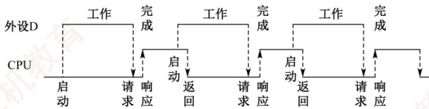

I/0端口每收到一个字符申请一次中断，中断响应需10个时钟周期，中断服务程序共有20条指令，其中第15条指令启动D工作。若CPU需从D读取1000个字符，则完成这一任务所需时间大约是多少个时钟周期？CPU用于完成这一任务的时间大约是多少个时钟周期？在中断响应阶段CPU进行了哪些操作？

10.【2018统考真题】假定计算机的主频为500MHz，CPI为4。现有设备A和B，其数据传输速率分别为2MB/s和 40MB/s，对应 I/O接口中各有一个32 位数据缓冲寄存器。回答下列问题，要求给出计算过程。 K I

1）若设备A采用定时查询I/O方式，每次输入/输出都至少执行10条指令。设备A最多间隔多长时间查询一次才能不丢失数据？CPU 用于设备A 输入/输出的时间占CPU总时间的百分比至少是多少？

2）在中断I/O方式下，若每次中断响应和中断处理的总时钟周期数至少为400，则设备B 能否采用中断I/O方式？为什么？

3）若设备B 采用 DMA 方式，每次 DMA 传送的数据块大小为 1000B，CPU 用于 DMA预处理和后处理的总时钟周期数为500，则CPU用于设备B输入/输出的时间占CPU总时间的百分比最多是多少？ V

11.【2022统考真题】假设某磁盘驱动器中有4个双面盘片，每个盘面有20000个磁道，每个磁道有500个扇区，每个扇区可记录512字节的数据，盘片转速为7200rpm（转/分），平均寻道时间为5ms。请回答下列问题。

1）每个扇区包含数据及其地址信息，地址信息分为3个字段。这3个字段的名称各是什么？对于该磁盘，各字段至少占多少位？

2）一个扇区的平均访问时间约为多少？

3）若采用周期挪用DMA方式进行磁盘与主机之间的数据传送，磁盘控制器中的数据缓冲区大小为64位，则在一个扇区的读/写过程中，DMA控制器向CPU发送了多少次总线请求？若CPU检测到DMA控制器的总线请求信号时也需要访问主存，则DMA控制器是否可以获得总线使用权？为什么？ .-X

## 7.3.5答案与解析

## 一、单项选择题

## 01. B

当有多个中断请求同时出现时，中断服务程序必须能从中选出当前最需要给予响应的且最重要的中断请求，这就需要预先对所有的中断进行优先级排队，这个工作可由中断判优逻辑来完成，排队的规则可由软件通过对中断屏蔽寄存器进行设置来确定。

## 02. C

中断服务程序是处理器处理的紧急事件，可理解为一种服务，是事先编好的某些特定的程序，一般属于操作系统的模块，以供调用执行，选项A正确。中断向量由向量地址形成部件，即由硬件产生，且不同的中断源对应不同的中断服务程序，因此通过该方法可以较快速地识别中断源，选项B正确。中断向量是中断服务程序的入口地址，中断向量地址是内存中存放中断向量的地址，即中断服务程序入口地址的地址，选项C错误。重叠处理中断的现象称为中断嵌套，选项D正确。

## 03. C

当CPU与DMA控制器同时访问主存时，DMA请求通常具有更高的优先级，以确保高速外设数据及时传输，避免丢失：因此，在总线仲裁层面，DMA的优先级高于普通中断请求，说法正确。程序中断方式需要切换CPU执行流程，必须保存和恢复现场；而DMA由专用硬件直接完成数据传送，不经过CPU，不使用其寄存器，因此无须保存现场一一正如唐朔飞所编教材《计算机组成原理》中所述：“DMA方式无须保存现场”，说法Ⅱ正确。说法Ⅲ的情形正好相反。

## 注意

DMA方式对应的中断服务程序确实无须保存现场，因其不涉及CPU寄存器的使用。

## 04. B

程序中断过程是由硬件（称为中断隐指令）和中断服务程序共同完成的，说法Ⅰ正确。在每条指令执行结束时（而不是执行过程中），CPU统一扫描各个中断源，检查有无中断请求，说法Ⅱ错误。CPU会在每个存储周期（总线周期）结束后检查是否有DMA请求，而不是在一条指令执行过程的末尾，说法Ⅲ错误。中断服务程序的最后指令通常是中断返回指令，与无条件转移指令不同的是，它不仅要修改PC值，而且要将CPU中的所有寄存器都恢复到中断前的状态，说法IⅣ错误。在中断响应阶段之前，CPU根据中断屏蔽字将所有未被屏蔽的中断请求送到硬件电路（或中断查询程序）进行中断响应判优，中断响应的优先级不是由中断屏蔽字决定的，说法Ⅴ错误。

## 05. B

只有具有DMA接口的设备才能产生DMA请求，即使当前设备是高速设备或需要与主机批量交换数据，若没有DMA接口的话，也不能产生DMA请求。

## 06. C

中断向量地址是中断向量表的地址，因为中断向量表保存着中断服务程序的入口地址，所以中断向量地址是中断服务程序入口地址的地址。 XTA

## 07. C

CPU响应中断必须满足下列3个条件：①CPU接收到中断请求信号。首先中断源要发出中  
断请求，同时CPU还要收到这个中断请求信号。②CPU允许中断，即开中断。③一条指令执  
行完毕。因此中断响应是在指令执行末尾，选项C正确。X

## 08. B

DMA操作结束、机器出现故障、执行“软中断”指令时都会产生中断请求。一条指令执行完毕可能响应中断请求，但它本身不会引起中断请求。

## 09. B

屏蔽字“1”表示不可被中断，“0”表示可被中断。由3级中断的屏蔽字可知，它屏蔽所有中断，优先级最高；再由1级中断的屏蔽字可知，它屏蔽除3外的所有中断，优先级次之；以此类推，可知选择选项B。

【另解】“1”越多表示优先级越高，因此屏蔽其他中断源就越多。

## 10. C

中断隐指令并不是一条由程序员安排的真正的指令，因此不可能把它预先编入程序中，只能在响应中断时由硬件直接执行。中断隐指令不在指令系统中，因此不属于程序控制指令。

## 11. A

在中断响应周期，CPU主要完成关中断、保存断点、发中断响应信号并形成中断向量地址的工作，即执行中断隐指令。

## 12. D

CPU总是在一条指令结束时检查外中断请求，因此对外中断的响应只可能发生在一条指令结束时。中断I/O方式下，CPU执行中断服务程序时会执行相应的I/O指令，实现CPU的通用寄存器和外设接口中的寄存器之间的直接数据交换。中断请求就是要求CPU执行程序来处理发生的相关事件。选项D在下列两种情况下错误：①关中断时，CPU检测不到中断请求，因此不会进入中断响应周期；②当有中断请求的请求源被中断屏蔽字屏蔽时，也不会进入中断响应周期。

## 13. A

在中断响应周期中，采用硬件方法保存并更新PC内容，而不由软件完成，这样可以避免因为软件保存和恢复PC内容而造成的时间开销和错误风险，提高中断处理的效率和正确性。

## 14. C

因为CPU无法对发生的中断请求立即进行处理，因此需要在I/O接口中设置中断触发器，以保存是哪些外设发出了中断请求，等CPU当前的指令周期结束后，响应中断并进行处理。

## 15. B

允许中断触发器置0表示关中断，在中断响应周期由硬件自动完成，即中断隐指令完成。虽然关中断指令也能实现关中断的功能，但在中断响应周期，关中断是由中断隐指令完成的。在恢复现场和屏蔽字的时候，也需要关中断的操作，此时是由关中断指令来完成的。

## 16. C

只有先关中断，才可以保存断点。若先不保存断点，则可能丢失当前程序的断点。同理，在恢复现场前也要关中断。这个过程和操作系统中的信号量PV操作类似，都是将内部过程变为不可打断的原子操作。

## 17. D

中断优先级包括响应优先级和处理优先级，中断屏蔽标志改变的是处理优先级。中断响应优  
先级是由中断查询程序或中断判优电路决定的，它反映的是多个中断同时请求时哪个先被响应  
即中断服务程序开始执行的顺序。在多重中断系统中，中断处理优先级决定了本中断是否能打断  
正在执行的中断服务程序，决定了多个中断服务程序执行完的次序。V

## 18. B

PC的内容是被中断程序尚未执行的第一条指令地址，PSW寄存器保存各种状态信息。CPU响应中断后，需要保存中断的CPU现场，将PC和PSW压入堆栈，这样等到中断结束后，就可以将压入堆栈的原PC和PSW的内容恢复到相应的寄存器，原程序从断点开始继续执行。

## 19. B、D

在程序查询方式中，CPU与外设串行工作，传送与主程序串行工作。在中断方式中，CPU与外设并行工作，当数据准备好时仍需中断主程序以执行数据传送，因此传送与主程序仍是串行的。在DMA方式中，CPU与外设、传送与主程序都是并行的。

## 20. C

按启动查询方式的不同，程序查询方式可分为定时查询方式和独占查询方式。在程序查询方式中，由CPU负责数据的传送。每完成一次数据传送后，将主存地址加1，计数值减1。

## 21. C

在DMA 方式中，由外部设备向 DMA控制器发出DMA请求信号，然后由DMA控制器向CPU发出总线请求信号。DMA控制器在传送期间有总线控制权，此时CPU不能响应I/O中断。

## 22. C

程序中断方式在数据传输时，首先要发出中断请求，此时CPU中断正在进行的操作，转而进行数据传输，直到数据传送结束，CPU才返回中断前执行的操作。DMA方式只是在后处理阶段需要用中断方式请求CPU做结束处理，但在整个数据传送过程，并不需要中断请求，选项A错误。DMA方式和程序中断方式都有中断请求，但目的不同，程序中断方式的中断请求是为了进行数据传送，而DMA方式的中断请求是在DMA传送结束后请求CPU做DMA结束处理，选项B错误、选项C正确。CPU对DMA的响应可在指令执行过程中的任何两个存储周期之间，选项D错误。

## 23. A

一个完整的 DMA 过程主要由 DMA 控制器控制，但也需要CPU参与控制，只是 CPU 干预比较少，只需在数据传输开始和结束时干预，从而提高了CPU的效率。

## 24. B

DMA请求的是总线的使用权，因此CPU对DMA请求的响应时机是一个总线周期结束时。在流水线CPU中，流水段的长度以最复杂的操作所花的时间为准，总线周期（访存时间）通常是耗时最长的，因此通常可认为总线周期、存储周期和流水段长度是等价的。

## 25. A

DMA连接的是高速设备，其优先级高于中断请求，以防止高速设备数据丢失，选项A正确。DMA请求的响应时间可以发生在每个总线周期结束时，只要CPU不占用总线；中断请求的响应时间只能发生在每条指令执行完毕，选项B错误。DMA的优先级要比外中断（非屏蔽中断、可屏蔽中断）高，选项C错误。若不开中断，则内中断和非屏蔽中断仍可响应，选项D错误。

## 26. C

寻道结束后会通过中断方式通知CPU寻道已结束，可进行下一步操作。通过旋转定位到某个扇区后，也会通过中断方式来通知CPU磁盘已准备好，可进行数据读取或写入操作。DMA传输结束后的校验是由中断服务程序完成的。综上所述，①②④都用到了中断处理，选项A正确。DMA控制器中数据缓冲寄存器的个数是有限的，为避免后续到来的数据覆盖掉原有的数据，必须保证已到的数据能被及时送到主存，因此DMA控制器使用总线的优先级比CPU高，选项B正确，选项C错误。DMA的数据传输过程是完全由DMA控制器控制的，可以和CPU完全并行，选项D正确。

## 27. A

中断发生时，程序计数器内容的保存和更新是由硬件自动完成的，即由中断隐指令完成。

## 28. B

DMA 传送数据时，挪用周期不会改变CPU现场，因此无须占用CPU的PC和寄存器。

## 29. B

DMA方式的数据传送不经过CPU，但需要经过DMA控制器中的数据缓冲寄存器。输入时，数据由外设（如磁盘）先送往DMA的数据缓冲寄存器，再通过数据总线送到主存。反之，输出时，数据由主存通过数据总线送到DMA的数据缓冲寄存器，然后送到外设。

## 30. D

当采用周期挪用进行DMA数据传送时，每当CPU收到DMA控制器的总线申请，就将下一个总线周期的总线控制权交给DMA控制器。DMA控制器利用这个总线周期完成一个数据字的传送后，立即将总线控制权交回给CPU，因此这里的总线周期也等于存储周期的长度。

## 31. D

DMA方式主要用于磁盘等高速设备的成批数据传送，这类高速设备的记录方式多采用数据块组织方式，因此每启动一次DMA传送，外设和主机之间就完成一个数据块的数据传送。

## 32. C

传送信息所在的通用寄存器编号不包含在初始化信息中，因为数据不是通过CPU中的通用寄存器来传输的，而是直接通过DMA控制器进行数据传输的。

## 33. A

外部中断是指CPU执行指令以外的事件产生的中断，通常指来自CPU与内存以外的中断。选项A中键盘输入属于外部事件，每次键盘输入CPU都需要执行中断以读入输入数据，所以能引起外部中断。选项B中除数为0属于异常，也就是内中断，发生在CPU内部。选项C中浮点运算下溢将按机器零处理，不会产生中断。而选项D中访存缺页属于CPU执行指令时产生的中

## 34. A

在单级（或单重）中断系统中不允许中断嵌套。中断处理过程为：①关中断；②保存断点；③识别中断源；④保存现场；⑤中断事件处理；⑥恢复现场；⑦开中断；⑧中断返回。其中①～③由硬件完成，④～⑧由中断服务程序完成。

## 35. D

中断响应优先级是由硬件线路（或查询程序）决定的，不便改动，而中断处理优先级可以利用屏蔽字技术来动态调整。1表示屏蔽该中断源的请求，0表示可以被该中断源中断。从中断处理优先级来看， $\mathrm { L } _ { 1 }$ 只能屏蔽 $\mathrm { L } _ { 3 }$ 和其自身，因此中断屏蔽字 $\mathrm{M}_{4}\mathrm{M}_{3}\mathrm{M}_{2}\mathrm{M}_{1}\mathrm{M}_{0}=01010$

## 36. C

每秒至少查询200次，每次查询至少500个时钟周期，则每秒最少占用200×500=100000个时钟周期，因此占CPU时间的百分比为100000/50M=0.20%。

## 37. B

在响应外部中断的过程中，中断隐指令完成的操作包括：①关中断；②保存断点；③引出中断服务程序（形成中断服务程序入口地址并送PC），所以只有说法I、Ⅲ正确。说法Ⅱ中保存通用寄存器的内容是在进入中断服务程序后首先进行的操作。

## 38. D

中断I/O方式：在I/O设备输入每个数据的过程中，由于无须CPU于预，因此可使CPU与I/O设备并行工作。仅当输完一个数据时，才需要CPU花费极短的时间去做一些中断处理。因此中断申请使用的是CPU处理时间，发生的时间是在一条指令执行结束之后，数据在软件的控制下完成传送。而DMA方式与之不同。DMA方式：数据传输的基本单位是数据块，即在CPU与I/O设备之间，每次传送至少一个数据块；DMA方式每次申请的是总线的使用权，所传送的数据是从设备直接送入内存的，或者相反；仅在传送一个或多个数据块的开始和结束时，才需要CPU于预，整块数据的传送是在控制器的控制下完成的。中断I/O方式不适合高速外设；多路型DMA控制器也适合同时为多个慢速外设服务，选项D错误。

## 39. B

每400ns发出一次中断请求，而响应和处理时间为100ns，其中允许的延迟为干扰信息，因为在50ns内，无论怎么延迟，每400ns仍要花费100ns处理中断，所以该设备的I/O时间占整个CPU时间的百分比为 100ns/400ns = 25%。

## 40. B

在程序中断I/O方式中，CPU和打印机直接交换，打印字符直接传输到打印机的I/O端口，不会涉及主存地址。而CPU和打印机通过I/O端口中的状态口和控制口来实现交互。

## 41. B

多重中断在保存被中断进程现场时关中断，执行中断处理程序时开中断，选项B错误。CPU一般在一条指令执行结束的阶段采样中断请求信号，查看是否存在中断请求，然后决定是否响应中断，选项A、D正确。中断是指来自CPU执行指令以外的事件，选项C正确。

## 42. C

中断优先级分为响应优先级和处理优先级，响应优先级由硬件排队器（或中断查询程序）决定，处理优先级由屏蔽字决定，而非请求的先后次序决定。中断隐指令完成的工作有：①关中断：②保存断点；③引出中断服务程序，通用寄存器的保存由中断服务程序完成。中断允许状态（开中断后），才能响应外部设备的中断请求，外部设备通常不能发出不可屏蔽中断，外部设备的中断请求通常是为了输入/输出，这些事件并不是系统级的紧急事件，可以被屏蔽或延迟处理，若允许外部设备发出不可屏蔽中断，则可能影响系统的稳定性和安全性。有中断请求时，若是关

## 43. A

设备接口中的数据缓冲寄存器为32位，即一次中断可以传输4B数据，设备数据传输速率为50kB/s，共需要12.5k次中断，每次中断开销为1000个时钟周期，CPU主频为1GHz，则CPU用于该设备输入/输出的时间占整个CPU时间的百分比最多是(12.5k×1000)÷1G=1.25%。

## 44. D

每类设备都配置一个设备驱动程序，设备驱动程序向上层用户程序提供一组标准接口，负责实现对设备发出各种具体操作指令，用户程序不能直接和DMA打交道。DMA的数据传送过程分为预处理、数据传送和后处理3个阶段。预处理阶段由CPU完成必要的准备工作，数据传送前由DMA控制器请求总线使用权：数据传送由DMA控制器直接控制总线完成：传送结束后，DMA控制器向CPU发送中断请求，CPU执行中断服务程序做DMA结束处理。

## 45. C

访存时缺页属于内部异常，说法Ⅰ错误；定时器到时描述的是时钟中断，属于外部中断，说法Ⅱ正确；网络数据包到达描述的是CPU执行指令以外的事件，属于外部中断，说法Ⅲ正确。

## 46. B

由CPU内部产生的异常称为内中断，内中断是不可屏蔽中断。通过中断请求线INTR和NMI，从CPU外部发出的中断请求称为外中断，通过INTR信号线发出的外中断是可屏蔽中断，而通过NM信号线发出的是不可屏蔽中断。不可屏蔽中断即使在关中断（F=0）情况下也被响应，选项A正确。不可屏蔽中断的优先级最高，任何时候只要发生不可屏蔽中断，都要中止现行程序的执行，转到不可屏蔽中断处理程序执行，选项C正确。CPU响应中断需要满足3个条件：①中断源有中断请求；②CPU允许中断及开中断；③一条指令执行完毕，且没有更紧迫的任务。选项B错误。

## 47. C

周期挪用法由DMA控制器挪用一个或几个主存周期来访问主存，传送完一个数据字后立即释放总线，是一种单字传送方式，每个字传送完后CPU可以访问主存，选项C错误。停止CPU访存法则是指在整个数据块的传送过程中，使CPU脱离总线，停止访问主存。

## 48. A

中断服务程序在内核态下执行，若只能在用户态下检测和响应中断，则显然无法实现多重中断（中断嵌套），选项A错误。在多重中断中，CPU只有在检测到中断请求信号后（中断处理优先级更低的中断请求信号是检测不到的），才会进入中断响应周期。进入中断响应周期时，说明此时CPU一定处于中断允许状态，否则无法响应该中断。若所有中断源都被屏蔽（说明该中断的处理优先级最高），则CPU不会检测到任何中断请求信号。

## 49. C

中断I/O方式适用于字符型设备，此类设备的特点是数据传输速率慢，以字符或字为单位进行传输，选项A正确。若采用中断I/O方式，当外设准备好数据后，向CPU发出中断请求，CPU暂时中止现行程序，转去运行中断服务程序，由中断服务程序完成数据传送，选项B正确。若外设准备数据的时间小于中断处理时间，则可能导致数据丢失，以输入设备为例，设备为进程准备的数据会先写入设备控制器的缓冲区（缓冲区大小有限），缓冲区每写满一次，就向CPU发出一次中断请求，CPU响应并处理中断的过程，就是将缓冲区中的数据“取走”的过程，因此若外设准备数据的时间小于中断处理时间，则可能导致外设往缓冲区写入数据的速度快于CPU从缓冲区取走数据的速度，从而导致缓冲区的数据被覆盖，进而导致数据丢失，选项C错误。若采用中断I/O方式，则外设为某进程准备数据时，可令该进程阻塞，CPU运行其他进程，选项D正确。

## 50. D

选项A和B显然正确。开中断时，CPU在执行完一条指令时检测中断请求信号，若检测到中断请求信号，就立即响应：即便是多重中断，CPU正在处理某个中断的过程中，因为中断屏蔽字的存在，所以CPU检测不到处理优先级更低的中断请求信号，若检测到中断请求信号，则说明其处理优先级更高，同样也立即响应，选项C正确。外设通过中断控制器向CPU发中断请求信号，CPU响应中断请求后开始执行中断服务程序，中断服务程序执行结束后CPU自行返回（中断服务程序的最后一条指令是返回指令），无须外设发中断结束信号，选项D错误。

## 51. C

DMA在预处理和后处理阶段需要CPU来处理，而数据传输阶段由DMA控制器完成。

## 52. A

中断优先级包括响应优先级和处理优先级。响应优先级由硬件线路或查询程序的查询顺序确

定，不可动态改变；处理优先级由中断屏蔽字确定，可灵活改变。

## 53. C

DMA的传送过程：①预处理：CPU 完成一些必要的准备工作，由DMA控制器向 CPU 发总线请求。②数据传送：DMA控制器接管总线后，在设备接口和主存之间进行数据传送，此阶段由DMA控制器控制。③后处理：传送结束后，DMA控制器向CPU发送中断信号，做结束处理。

## 54. B

DMA（直接内存访问）适用于高速、大块数据传输的设备，因其可在不占用CPU的情况下直接与内存交换数据。网卡和固态硬盘均属于高带宽的块设备，适合采用DMA方式。而键盘和针式打印机是典型的低速字符设备，采用中断或程序查询方式通常更高效。

## 55. A

外部中断由 CPU外部事件触发。DMA控制器完成数据传输后，会向 CPU发出中断请求，这是由外部设备发起的硬件中断，属于典型的外部中断。而页故障（缺页异常）和执行断点指令均在指令执行过程中由CPU内部检测并触发，属于内部中断（异常）。总线事务（如一次读/写操作）的完成通常是CPU或主控设备主动发起并等待的结果，一般不会产生中断。

## 二、综合应用题

## 01.【解答】

没有。通常所说的DMA方式在主存和I/O设备之间建立一条“直接的数据通路”，使得数据在主存和I/O设备之间直接进行传送，其含义并不是在主存和I/O之间建立一条物理直接通路，而是主存和I/O设备通过I/O设备接口、系统总线及总线桥接部件等相连，建立一个信息可以相互通达的通路，这在逻辑上可视为直接相连的。其“直接”是相对于要通过CPU才能和主存相连这种方式而言的。 -X甲

## 02.【解答】

I/O设备传送一个数据的时间为 $1 \div (4 \times 10^{4}) \mathrm{s} = 25 \mu \mathrm{s}$ ，所以请求中断的周期为25μs，而相应中断处理程序的执行时间为40μs，大于请求中断的周期，会丢失数据（单位时间内I/O请求数量比中断处理的多，自然会丢失数据），所以不能采用中断方式。

## 03. 【解答】

1）CPU每秒对鼠标进行30次查询，所需的时钟周期数为100×30=3000。CPU的时钟频率为50MHz，即每秒 $5 0   \times   1 0 ^ { 6 }$ 个时钟周期，因此对鼠标的查询占用CPU的时间比率为

$$
[3000 \div (50 \times 10^6)] \times 100\% = 0.006\%
$$

可见，对鼠标的查询基本不影响CPU的性能。

2）对于硬盘，每32位（4B）被CPU查询一次，因此每秒查询次数为 $2 \times 2^{20} \mathrm{B} \div 4 \mathrm{B} = 512 \mathrm{K}$ 则每秒查询的时钟周期数为 人

$$
100 \times 512 \times 1024 = 52.4 \times 10^{6}
$$

因此对硬盘的查询占用CPU的时间比率为

$$
[52.4 × 10^{6} ÷ (50 × 10^{6})] × 100\%=105\%
$$

可见，即使CPU将全部时间都用于对硬盘的查询，也不能满足磁盘传输的要求，因此CPU一般不采用程序查询方式与磁盘交换信息。】

## 04. 【解答】

1）中断屏蔽字“1”表示不可被中断， “0”表示可被中断。根据表中“1”的个数的降序排列可知，4个中断源的处理次序是 $3 \rightarrow 1 \rightarrow 4 \rightarrow 2$

2）当4个中断源同时有中断请求时，硬件排队的优先次序是1→2→3→4，因此CPU先响应

1的请求，执行1的服务程序。该程序中设置了屏蔽字1101，因此开中断指令后转去执行3服务程序，且3服务程序执行结束后又回到了1服务程序。1服务程序结束后，CPU还有2、4两个中断源请求未响应。2的响应优先级高于4，因此CPU先响应2的请求，执行2服务程序。在2服务程序中因为设置了屏蔽字0100，意味着1、3、4可中断2服务程序。而1、3的请求已经结束，因此在开中断指令后转去执行4服务程序，4服务程序执行结束后又回到2服务程序的断点处，继续执行2服务程序，直至该程序执行结束。CPU执行程序的轨迹如下图所示。

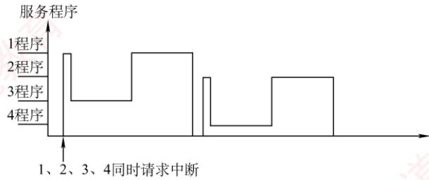

## 05.【解答】

根据字符设备的传输速率为9600b/s，得每秒能传输

9600/8=1200B，即1200个字符（本题中字符、字节不加以区分）

1）若采用DMA方式，传输1200个字符共需1200个存储周期，考虑到每传400个字符需中断处理一次，因此DMA方式每秒因数据传输占用处理器的时间是

$$
5\mu s \times (1200/400) = 15\mu s
$$

2）若采用中断方式，每秒因数据传输占用处理器的时间是

$$
5\mu s \times 1200 = 6000\mu s
$$

## 06. 【解答】

1）采用程序查询方式，硬盘传输速率为1MB/s，一个字为32bit=4B，每秒查询的次数为$1MB/4B=2.5\times10^{5}$ ，每秒查询所需的总时钟周期数为 $2.5 \times 10^{5} \times 100 = 2.5 \times 10^{7}$ CPU 的时钟频率为 50MHz。

因此，I/O查询所花费的时间比率为 $2.5 \times 10^{7} \div 50M = 2.5 \times 10^{7} \div (5 \times 10^{7}) = 50\%$

2）采用中断方式时，每传输一个字便进行一次中断处理。每秒产生的中断次数为 $1MB/4B=2.5\times10^{5}$ 次。每秒用于传输的开销为 $2.5 \times 10^{5} \times 80 = 2 \times 10^{7}$ 个时钟周期。因此花费的时间比率为 $(2 \times 10^{7}) \div (5 \times 10^{7}) = 40\%$

3）采用DMA方式时，CPU所花时间仅为启动时间和后处理时间。每传输一次数据CPU所花的时间为 $1000+500=1500$ 个时钟周期。DMA平均传送长度为4000B，每秒产生的DMA次数为 $1\mathrm{MB/s} \div (4 \times 10^3\mathrm{B}) = 250$ 因此，CPU为DMA所花费时间的比率为(1500×250)÷50M=0.75%。

## 07. 【解答】

1）按题意，外设每秒传送0.5MB，中断时每次传送32bit=4B。由于CPI为5，在中断方式下，CPU每次用于数据传送的时钟周期为 $5 \times 18 + 5 \times 2 = 100$ （中断服务程序+其他开销）。为达到外设0.5MB/s的数据传输速率，外设每秒申请的中断次数为 $0.5  MB /4  B  = 125000$ 1 秒内用于中断的开销为 $100 \times 125000 = 12500000 = 12.5  M$ 个时钟周期。CPU用于外设I/O的时间占整个CPU时间的百分比为 $12.5\mathrm{M}/500\mathrm{M}=2.5\%$

2）当外设数据传输速率提高到5MB/s时改用 DMA方式传送，每次DMA 传送一个数据块，

大小为 5000B，则1秒内需产生的DMA次数为 $5\mathrm{MB}/5000\mathrm{B}=1000$ 0

CPU用于DMA 处理的总开销为 $1000 \times 500 = 500000 = 0.5M$ 个时钟周期。

CPU 用于外设I/O 的时间占整个 CPU 时间的百分比为 $0.5\mathrm{M/500M=0.1\%}$

## 08.【解答】

本题涉及多个考点：计算机的性能指标、存储器的性能指标、DMA的性能分析、DMA方式的特点及多体交叉存储器的性能分析。

1）平均每秒CPU执行的指令数为 $80\mathrm{M/4=20M}$ ，因此MIPS数为20。平均每条指令访存1.5次，因此平均每秒 Cache缺失的次数 $20\mathrm{M} \times 1.5 \times (1 - 99\%) = 300\mathrm{K}$ 。当Cache 缺失时，CPU访问主存，主存与Cache之间以块为传送单位，此时主存带宽为 $16\mathrm{B} \times 300\mathrm{k/s} = 4.8\mathrm{MB/s}$ 在不考虑DMA传送的情况下，主存带宽至少达到4.8MB/s才能满足CPU的访存要求。

2）题中假定在Cache缺失的情况下访问主存，平均每秒产生缺页中断 $300000 \times 0.0005\% = 1.5$ 次。因为存储器总线宽度为32位，所以每传送32位数据，磁盘控制器发出一次DMA请求，因此平均每秒磁盘DMA请求的次数至少为 $1.5 \times 4 \mathrm{KB} / 4 \mathrm{B} = 1.5 \mathrm{K} = 1536$

3）CPU和DMA控制器同时要求使用存储器总线时，DMA请求的优先级更高。因为，若DMA请求得不到及时响应，I/O传输数据可能丢失。 X

4）4体交叉存储模式能提供的最大带宽为 $4 \times 4 \mathrm { B } / 5 0 \mathrm { n s } = 3 2 0 \mathrm { M B } / \mathrm { s }$ o

## 09.【解答】

1）每传送一个ASCI码字符，需要传输的位数有1位起始位、7位数据位（ASCⅡ码字符占7位）、1位奇校验位和1位停止位，因此总位数为 $1 + 7 + 1 + 1 = 1 0$ 0I/O端口每秒最多可接收 $1000/0.5 = 2000$ 个字符。

2）一个字符传送时间包括：设备D将字符送I/O端口的时间、中断响应时间和中断服务程序前15条指令的执行时间。时钟周期为 $1 \div 50 MHz  = 20 ns$ ，设备D将字符送I/O端口的时间为 $0.5 ms /20 ms =2.5 \times 10^{4}$ 个时钟周期。一个字符的传送时间约为 $2.5 \times 10^{4} + 10 + 15 \times 4 = 25070$ 个时钟周期。完成1000个字符传送所需的时间约为 $1000 \times 25070 = 25070000$ 个时钟周期。CPU用于该任务的时间约为 $1000 \times (10 + 20 \times 4) = 9 \times 10^{4}$ 个时钟周期。在中断响应阶段，CPU主要进行以下操作：关中断、保存断点和程序状态、识别中断源。

## 10. 【解答】

1）程序定时向缓存端口查询数据，由于缓存端口大小有限，必须在传输完端口大小的数据时访问端口，以防止部分数据未被及时读取而丢失。设备A准备32 位数据所用的时间为$4\mathrm{B}/2\mathrm{MB}=2\mu\mathrm{S}$ ，所以最多每隔 $2 \mu \mathrm { s }$ 必须查询一次，每秒的查询次数至少是 $1\mathrm{s}/2\mu\mathrm{s}=5\times10^{5}$ 每秒CPU用于设备A输入/输出的时间至少为 $5 \times 10^{5} \times 10 \times 4 = 2 \times 10^{7}$ 个时钟周期，占整个CPU时间的百分比至少是 $2 \times 10^{7} \div 500M = 4\%$ 0

2）中断响应和中断处理的时间为 $400 \times (1/500  M ) = 0.8 \mu  s$ ，这时只需判断设备B准备32位数据要多久，若准备数据的时间小于中断响应和中断处理的时间，则数据被刷新，造成丢失。经过计算，设备B准备32位数据所用的时间为 $4\mathrm{B}/40\mathrm{MB}=0.1\mu\mathrm{s}$ ，因此设备B不适合采用中断I/O方式。

3）在DMA方式中，只有预处理和后处理需要CPU处理。设备B每秒的DMA次数最多为 $40MB/s \div 1000B=40000, CPU$ 用于设备B输入/输出的时间最多为 $40000 \times 500 = 2 \times 10^{7}$ 个时钟周期，占CPU总时间的百分比最多为 $(2 \times 10^{7}) / 500  M  = 4\%$

## 11.【解析】

1）3个字段的名称为柱面号（或磁道号）、磁头号（或盘面号）、扇区号。每个盘面有20000个磁道，因此该磁盘共有20000个柱面，柱面号字段至少占 $\left[ \log_{2} 20000 \right] = 15$ 位；该磁盘共有4个盘片，每个盘片有2个盘面，因此磁头号字段至少占 $\log_{2}(4 \times 2) = 3$ 位；每个磁道有500个扇区，因此扇区号字段至少占 $\left[ \log_{2}500 \right] = 9$ 位。

2）一个扇区的访问时间由寻道时间、延迟时间、传输时间三部分组成。平均寻道时间为5ms，平均延迟时间等于磁盘转半圈所需要的时间，平均传输时间等于一个扇区划过磁头下方所需要的时间。而该磁盘转一圈的时间为 $( 6 0 \times 1 0 ^ { 3 } ) / 7 2 0 0 \approx 8 . 3 3 \mathrm { m s }$ ，因此一个扇区的平均访问时间约为 $5+8.33/2+8.33/500\approx9.18 ms$

3）磁盘控制器中的数据缓冲区每充满一次，DMA控制器就需要发出一次总线请求，将这64bit 数据通过总线传送到主存，因此，在一个扇区的读/写过程中，DMA控制器向 CPU发送了 $512\mathrm{B}/64\mathrm{bit} = 64$ 次总线请求。采用周期挪用DMA方式，因此当CPU和DMA控制器都需要访问主存时，DMA控制器可以优先获得总线使用权。因为一旦磁盘开始读/写，就必须按时完成数据传送，否则数据缓冲区中的数据会发生丢失。

## 7.4 本章小结

本章开头提出的问题的参考答案如下。

## 1）I/O设备有哪些编址方式？各有何特点？

I/O设备的编址方式主要有统一编址和独立编址。统一编址是指将主存地址空间的一部分分配给I/O端口，CPU可使用普通访存指令直接访问I/O设备，编程简便；但会占用主存地址空间，减少可用主存容量。独立编址是指I/O地址空间与主存地址空间相互独立，I/O端口不占用主存资源；但访问I/O设备需使用专用I/O指令（如IN、OUT），增加了指令集的复杂性。

2）CPU响应中断应具备哪些条件？

① CPU 内部的中断屏蔽触发器处于开放状态。

②外设发出中断请求，且其接口中的中断请求触发器置为“1”，以维持中断请求信号。

③外设接口的中断允许触发器为“1”，才能将中断请求送达CPU。

当上述三个条件同时满足时，CPU在当前指令执行结束后响应中断。

## 7.5 常见问题和易混淆知识点

## 1. 在开中断情况下，CPU检测到中断就一定会立即响应吗？

是的。在开中断状态下，CPU总在每条指令执行结束时采样中断请求。一旦检测到中断请求，即表明该请求未被屏蔽且有效，CPU必定会立即响应。 X

需要说明的是：在单重中断系统中，进入中断服务程序后通常会自动关中断，此后即使有新的中断请求也无法被检测，但这不属于“开中断”情形，违背题设前提。而在多重中断系统中，高优先级中断可在低优先级的中断服务程序执行期间被检测并响应，因其未被屏蔽。

## 2. 向量中断、中断向量、向量地址三个概念是什么关系？

中断向量：中断向量指中断服务程序的入口地址。每个中断源对应一个唯一的中断服务程序，其入口地址即为该中断源的中断向量。系统通常将所有中断向量集中组织成一张中断向量表；也有系统在表中存放转移指令，构成中断向量转移表。

向量地址：向量地址指中断向量表（或转移表）中某一项的内存起始地址。它通常由中断类

型号（也称中断号）乘以表项长度计算得出。例如，若表项占4字节，中断类型号为5，则向量地址为5×4=20（假设表从0开始）。因此，向量地址是CPU用于定位中断向量的“索引位置”。

向量中断：是一种能够自动识别中断源并快速转移至对应服务程序的中断处理方式。当中断发生时，中断源（或中断控制器）向CPU提供中断类型号，CPU据此生成向量地址，并从向量表中取出对应的中断向量（入口地址），直接转移执行相应的中断服务程序。

## 3. 程序中断和调用子程序有何区别？

虽然程序中断和子程序调用都会引起程序执行流程的转移，但二者在本质上存在显著差异，主要体现在以下几个方面：

1）触发时机：子程序调用由程序员通过CALL指令主动发起，发生时刻和位置是确定的：而中断由外部设备或内部事件随机触发，CPU只在每条指令执行结束时采样中断请求，一旦条件满足便转入中断处理，具有明显的异步性和不可预测性。 爱

2）服务关系：子程序完全为主程序服务，二者构成主从关系：主程序在需要时调用子程序，执行完毕后返回主程序继续运行。中断服务程序通常与主程序无直接关联，是为响应外部事件（如数据到达、定时器溢出等）而执行的独立任务，二者属于平行关系。

3）实现机制：子程序调用是纯软件行为，只需利用堆栈保存返回地址，无须额外硬件支持；而中断处理依赖软硬件协同，需借助中断请求线、中断控制器和优先级判优电路等硬件，才能完成中断请求的接收、判优、响应和断点保护等操作。

4）嵌套级别：子程序可多层嵌套，嵌套深度主要受限于系统堆栈空间；中断嵌套则受优先级机制约束一一只有更高优先级的中断才能打断当前正在执行的中断服务程序。出于硬件复杂性和实时性考虑，实际系统中中断优先级通常较少，嵌套层次有限。

# 机教 购买王道书，就上算机王道官方考研书店

wangdao.taobao.com

## 参考文献

[1] 袁春风. 计算机系统基础[M]. 北京：机械工业出版社，2018.

[2] 袁春风. 计算机组成与系统结构[M]. 北京：清华大学出版社，2015.

[3] 袁春风． 计算机系统基础习题解答与教学指导[M]. 北京：机械工业出版社，2019.

[4] 唐朔飞. 计算机组成原理[M]. 北京：高等教育出版社，2008.

[5] 唐朔飞. 计算机组成原理：学习指导与习题解答[M]. 北京：高等教育出版社，2012.

[6] 布莱恩特，奥哈洛伦，等．深入理解计算机系统[M].3版．龚奕利，贺莲，译．北京：机械工业出版社，2016.

[7] 李春葆，肖忠付，杭小庆.计算机组成原理联考辅导教程[M]. 北京：清华大学出版社，2010.

[8] 全国考研计算机大纲配套教材专家委员会.全国硕士研究生入学统一考试计算机专业基础综合考试大纲解析[M].北京：高等教育出版社，2014.

[9] 徐爱萍．计算机组成原理考研指导[M]. 北京：清华大学出版社，2003.

[10]谭志虎．计算机组成原理（微课版）[M]．北京：人民邮电出版社，2022.

购买王道书，就上育王道官方考研书店

wangdao.taobao.com

