<!-- DIRECTED-REPAIR-MOVE:A-MOVE-HIGH-CH3-TABLE-PREFIX -->
## 第3讲
## 一元函数微分学的概念

<table><tr><td rowspan=1 colspan=1>考题</td><td rowspan=1 colspan=1>

一元函数微分学的概念</td></tr><tr><td rowspan=1 colspan=1>题型</td><td rowspan=1 colspan=1>选择题、填空题</td></tr><tr><td rowspan=1 colspan=1>目标</td><td rowspan=1 colspan=1>①理解导数与微分的概念；②理解导数与微分的关系；③理解导数的几何意义</td></tr><tr><td rowspan=1 colspan=1>重难点</td><td rowspan=1 colspan=1>①高阶导数的计算；②导数几何意义的应用；③可导充要条件的应用</td></tr></table>

## 基础知识结构

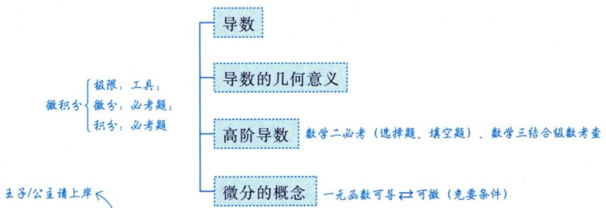

引例一位王子/公主去往高铁站乘车，零时刻在家门口乘坐出租车出发，由于时间上有些来不及，便不断催促师傅加速，当到达高铁站后，整理文件时却发现重要文件遗落在家，焦急难耐，但已经来不及返回拿文件再乘车，遂放弃原车次列车，乘坐出租车匀速回家.

实际问题数学化，时间与位移图像如图3-1所示.

  
图 3-1

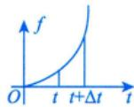

① $I _ { 1 }$ $\lim_{\Delta t \to 0} \frac{f(t + \Delta t) - f(t)}{\Delta t} = \underline{a}$ 注意：a是瞬时变化率，不是平均变化率。→线性函数变化率不变0 t t+∆t

② $I _ { 2 }$ 0 ↑f >t $\lim_{\Delta t \to 0} \frac{f(t + \Delta t) - f(t)}{\Delta t} = \lim_{\Delta t \to 0} \frac{0}{\Delta t} = 0$

③ $I _ { 3 }$ $\lim_{\Delta t \to 0} \frac{f(t + \Delta t) - f(t)}{\Delta t} =$ 定值. ol t t+∆t t

极限是研究函数变化趋势的，导数是研究变化快慢趋势的.

## 基础内容精讲

## 1 导数

$$
\Delta x \to 0^{+} , \quad \Delta x \to 0^{-}
$$

设 $y = f(x)$ 定义在区间I上，让自变量在 $x   =   x _ { _ 0 }$ 处加一个增量Δx（可正可负），其中$x_{0} \in I, x_{0} + \Delta x \in I$ ，则可得函数的增量 $\Delta y = f(x_{0} + \Delta x) - f(x_{0})$ .若函数增量Δy与自变量增量Δx的比值在 $\Delta x   \to   0$ 时的极限存在，即 $\lim_{\Delta x \to 0} \frac{\Delta y}{\Delta x}$ 存在，则称函数 $y = f(x)$ 在点 $x _ { 0 }$ 处可导，并称这个极限为 $y = f(x)$ 在点 $x _ { 0 }$ 处的导数，记作 $f^{\prime}(x_{0})$ ，即

变化率

$$
f^{\prime}(x_0) = \lim_{\Delta x \to 0} \frac{\Delta y}{\Delta x} = \lim_{\Delta x \to 0} \frac{f(x_0 + \Delta x) - f(x_0)}{\Delta x}\tag{*}
$$

当然， $\left. \frac{\mathrm{d}y}{\mathrm{d}x} \right|_{x = x_0} , \left. \frac{\mathrm{d}[f(x)]}{\mathrm{d}x} \right|_{x = x_0} , y'(x_0)$ 或 $\left. y^{\prime} \right|_{x = x_{0}}$ 这些符号记法与 $f^{\prime}(x_{0})$ 等价.顺便交代一下，“导数”这个名词被认为是拉格朗日最先使用的，记号 $f^{\prime}(x_0), \left. y^{\prime} \right|_{x = x_0}$ 多次出现在拉格朗日的文章中，而莱布尼茨则喜欢写作 $\left. \frac{\mathrm{d}y}{\mathrm{d}x} \right|_{x = x_0} , \left. \frac{\mathrm{d}[f(x)]}{\mathrm{d}x} \right|_{x = x_0} .$ 微分的形式，也叫微商：考研只用拉格朗日和莱布尼茨写法

莱布尼茨所用的符号d具有普适意义：如果要求A对B的变化率，就把A，B填进 $\frac{\mathrm{d}\triangle}{\mathrm{d}\triangle}$ ，得 $\frac { \mathrm { d } A } { \mathrm { d } B }$ ，它可表示几乎所有你想研究的变化率问题，而不仅仅是位移s对时间t的变化率— $-\frac{\mathrm{d}s}{\mathrm{d}t}$ 等于速度ν.

比如： $\frac{\mathrm{d}\left( 兴巍 \right)}{\mathrm{d}\left( 时间 \right)}$ ，它往往小于零，你同意吗？再比如： $\frac{\mathrm{d}( 利词 )}{\mathrm{d}( 价裕 )} , \frac{\mathrm{d}( 利词 )}{\mathrm{d}( 价裕 )} > 0$ ，也就是涨价可以增加利润，此时定价低了：若$\frac{{\mathrm{d}\left( 刮润 \right)}}{{\mathrm{d}\left( 价裕 \right)}} < 0;$ ，也就是降价可以增加利润，此时定价高了.综上， $\frac{\mathrm{d}( 利润 )}{\mathrm{d}( 价格 )} = 0$ ，利润最大，也就是说导数为零时的价格应是商品标签上的数字.懂得了这些道理后，请问，当 $\frac{\mathrm{d}( 成债 )}{\mathrm{d}( 劈力 )} > 0$ 时，说明什么？

注这里有几点需要说明.

(1)在考题中，增量Δx一般会被命题人广义化为“狗”：

$$
\boxed{ 可锯者  - \Delta x , (\Delta x)^2  等 }
$$

增量式

$$
f^{\prime}(x_0) = \lim_{\Delta x \to 0} \frac{f(x_0 + \Delta x) - f(x_0)}{\Delta x} \xlongequal{ 广义化 } \lim_{\eta \to 0} \frac{f(x_0 + \eta) - f(x_0)}{\eta}\tag{**}
$$

(2) 若在上面(\*) 式中，令 $x_{0} + \Delta x = x$ ，则可将导数定义式写成

增量式⇔函数式

$$
f^{\prime}(x_0) = \lim_{x \to x_0} \frac{f(x) - f(x_0)}{x - x_0}\tag{***}
$$

(\*\*)，(\*\*\*)两式等价，考生将会在各种场合见到这两种等价写法。

(3)下面这三种提法是等价的.

①y = f(x)在点 $x_{0}$ 处可导；

②y = f(x)在点 $x_{0}$ 处导数存在；

③ $f^{\prime}(x_0) = A$ (A 为有限数).

(4) 函数在一点可导的充要条件.考研必考

①单侧导数.

$$
\lim _ { \Delta x \rightarrow 0 ^ { - } } \frac { f ( x _ { 0 } + \Delta x ) - f ( x _ { 0 } ) } { \Delta x } \xlongequal { \mathrm {  记  } } f _ { - } ^ { \prime } ( x _ { 0 } ) ,
$$

$$
\lim_{\Delta x \to 0^{+}} \frac{f(x_{0} + \Delta x) - f(x_{0})}{\Delta x} \xlongequal{记} f_{+}^{\prime}(x_{0}),
$$

这里， $f_{-}^{\prime}(x_0), f_{+}^{\prime}(x_0)$ 分别是f(x)在点 $x_{0}$ 处的左导数、右导数，统称为单侧导数.

注意：在实际问题中，在一点处可导⇔左、右的变化率均存在且相等；

在几何上：有斜着的切线或水平的切线，但是没有铅直切线

② $f^{\prime}(x_0)$ 存在⇔其左导数 $f^{\prime}_{-}(x_0)$ 与右导数 $f_{+}^{\prime}(x_{0})$ 均存在且相等.这一点当然是与极限存在的充分必要条件(左、右极限均存在且相等)对应.因为从本质上来说，导数的定义就是一个极限问题.

(5) 函数在一点可导的必要条件：若f(x)在一点可导，则f(x)在该点连续.反之未必.

如： $f(x) = \left| x \right|$ 在x=0处的情形.

再如： $f(x)=\begin{cases}x^{2},x\in \\0,\ x\in\end{cases}$ 有理数 $\frac{x^{2}D(x)}{}$ 在x=0处的无理数情形. 狄利克雷函数 $D(x)=\left\{\begin{aligned}1,&x\in 有理数 ,\\0,&x\in 无理数 .\end{aligned}\right.$

$$
\lim_{\Delta x \to 0} \frac{f(x_0 + \Delta x) - f(x_0)}{\Delta x} = a
$$

$$
\begin{aligned}\Rightarrow \lim_{\Delta x \rightarrow 0} f(x_{0}+\Delta x)-f(x_{0})=\lim_{\Delta x \rightarrow 0} \frac{f(x_{0}+\Delta x)-f(x_{0})}{\Delta x} \Delta x\end{aligned}
$$

$$
\Rightarrow f(x_{0}) = \lim_{\Delta x \to 0} f(x_{0} + \Delta x)
$$

$$
f^{\prime}(0)=\lim_{x \to 0}\frac{f(x)-f(0)}{x-0}=\lim_{x \to 0}\frac{f(x)}{x}=\lim_{x \to 0}\frac{x^{2}D(x)}{x}=\lim_{x \to 0}xD(x)=0
$$

$$
\boxed{ 无穷小量  \times  有界量  =  无穷小量 }
$$

(6)还记得在函数连续性那里的直观解释吗？现在把可导放进来，再看一遍.

存在是说，给了一个x，就有一个y对应在那里（见图 3-2)，它附近的点X们所对应的Y们，也是如此，它们只是在那里，无牵无挂；连续是说，Y们充分靠近y（见图3-3)，它们彼此的距离小到无法用任何小的

## 考研数学基础30讲·高等数学分册

正实数表达，只能用超实数“无穷小”来衡量，它们并不只是在那里，它们相依相偎；可导是说，它们不仅依偎在一起，而且Y们靠近y的速度不会比X们靠近x的速度慢，也就是速度一样或者速度更快(见图34).

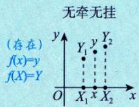  
图3-2

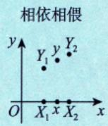  
图3-3

  
图3-4

所以，函数存在是y和Y们无牵无挂地待在那里；函数连续是y和Y们充分靠近；导函数存在是y和Y们不仅充分靠近，且靠近的速度更快.连续曲线不是曲线不断开，恰恰相反，它每一个位置都是断开的.就算Y们靠得更近，比如可导，也只是靠得更近而已，依然是断开的.

例3.1 以下命题，错误的是（).

(A)若f(x)是可导的偶函数，则f′(x)是奇函数导数的性质，选项当结论记住，会应用即可  
(B)若f(x)是可导的奇函数，则f′(x)是偶函数

(C)若f(x)是可导的周期为T的周期函数，则f'(x)也是以T为周期的周期函数

(D)若f(x)是可导的有界函数，则f′(x)是有界函数

解应选 (D).

对于选项(A)，由导数定义，得

$$
f^{\prime}(-x)=\lim_{\Delta x \to 0}\frac{f(-x+\Delta x)-f(-x)}{\Delta x}=\lim_{\Delta x \to 0}\frac{f(x-\Delta x)-f(x)}{\Delta x}\\=(-1)\lim_{\frac{-\Delta x}{x} \to 0}\frac{f(x-\Delta x)-f(x)}{\frac{-\Delta x}{x}}=-f^{\prime}(x),
$$

故f′(x)是奇函数.

对于选项(B)，由导数定义，得

$$
\begin{aligned}f^{\prime}(-x) &= \lim_{\Delta x \to 0} \frac{f(-x + \Delta x) - f(-x)}{\Delta x} \\&= \lim_{\Delta x \to 0} \frac{-f(x - \Delta x) + f(x)}{\Delta x} \\&= \lim_{-\Delta x \to 0} \frac{f(x - \Delta x) - f(x)}{-\Delta x} \\&= f^{\prime}(x) ,\end{aligned}
$$

故f′(x)是偶函数.

对于选项(C)，由导数定义，得

$$
f^{\prime}(x + T) = \lim_{\Delta x \to 0} \frac{f(x + T + \Delta x) - f(x + T)}{\Delta x}
$$

$$
\frac{f(x + T) = f(x)}{\lim\limits_{\Delta x \to 0} \frac{f(x + \Delta x) - f(x)}{\Delta x}} = f'(x) \;,
$$

故 $f^{\prime}(x)$ 也是以T为周期的周期函数.

对于选项(D)，举反例： $f(x)=\sqrt{x}(x\in(0,1])$ 有界，而 $f^{\prime}(x)=\frac{1}{2\sqrt{x}}(x\in(0,1])$ 无界.应选(D).

## 注选项(A)，(B) 结论的应用见注例 1 和注例 2.

注例1 设 $f(x)=\ln(1-x)-\ln(1+x),-1<x<1$ ，则 $f^{\prime\prime}(0) =$

解 $f(x) = \left| \ln \frac{1 - x}{1 + x} \right|$ (每求导一次，奇偶性互换一次)，故 $f''(x)$ 是奇函数，所以 $f^{\prime\prime}(0) = 0$

注例2 设 $f(x)=\frac{1}{2^{x}+1}, x \in \mathbf{R}$ ，则 $f^{(4)}(0) =$

解 $f(x)=\frac{1}{2^{x}+1}-\frac{1}{2}+\frac{1}{2}=g(x)+\frac{1}{2}$

因为 $g(-x)+g(x)=\frac{1}{2^{-x}+1}-\frac{1}{2}+\frac{1}{2^{x}+1}-\frac{1}{2}=\frac{2^{x}}{2^{x}+1}+\frac{1}{2^{x}+1}-1=0$ ，所以 $g(x)$ 是奇函数，于是 $g^{(4)}(x)$ 是奇函数，即 $g^{(4)}(0) = 0$ ，所以 $f^{(4)}(0) = g^{(4)}(0) = 0$

## 注2 由例 3.1 结论，若 $f(x) = \sin(\cos x) + \cos(\sin x)$ ，则 $f^{(5)}(2\pi) =$

分析 利用函数的奇偶性、周期性.

复合函数奇偶性：内偶则偶，内奇同外.

解 $f(x) = \sin(\cos x) + \cos(\sin x)$ 为偶函数，故 $f^{(5)}(x)$ 为奇函数，因为f(x)的周期为2π，故 $f^{(5)}(2\pi) =$ $f^{(5)}(0) = 0$

例3.2 设f(x)是二阶可导且以2为周期的奇函数， $f\left(\frac{1}{2}\right)>0,\ f^{\prime}\left(\frac{1}{2}\right)>0$ ，记 $M = f\left( - \frac{1}{2} \right)$ $N = f'\left(\frac{3}{2}\right), K = f''(0)$ .则( ).(A) $M < N < K$ (B) $M > N > K$ (C) $M < K < N$ (D) $M > K > N$

## 解应选(C).

由f(x)为奇函数，则 $f\left( -\frac{1}{2} \right) = -f\left( \frac{1}{2} \right) < 0$ .根据例3.1(B)选项的结论，知f'(x)为偶函数，由例3.1(A)选项的结论，知 $f''(x)$ 为奇函数（事实上，若f(x)无穷阶可导，则每求导一次，奇偶性即互换一次），由 $f''(x)$ 存在，故 $f''(0) = 0$ 必背结论

又 $f^{\prime}\left(\frac{1}{2}\right)>0$ ，由例3.1(C)选项的结论，知f'(x)也是以2为周期的周期函数，则 $f^{\prime}\left(\frac{3}{2}\right)=$ $f^{\prime}\left(\frac{3}{2}-2\right)=f^{\prime}\left(-\frac{1}{2}\right)=f^{\prime}\left(\frac{1}{2}\right)>0$ ，故 $f\left(-\frac{1}{2}\right)<f''(0)<f'\left(\frac{3}{2}\right)$ ，即 $M < K < N$ ，应选(C).

例3.3 设f(x)在x=0的某邻域内有定义，并且 $| f(x) | \leqslant 1 - \cos x$ ，则f(x)在x=0处（).

(A) 极限存在但不连续 (B)连续但不可导(C) 可导且 $f^{\prime}(0) = 0$ (D) 可导且 $f^{\prime}(0) \neq 0$

## 解应选(C).

可分为三个层次去做题.

第一层次：夹逼准则找极限

因为 $0 \leqslant \left| f(x) \right| \leqslant 1 - \cos x$ ，且 $\lim_{x \to 0} (1 - \cos x) = 0$ ，所以由夹逼准则知 $\lim_{x \to 0} |f(x)| = 0$ ，故 $\lim_{x \to 0} f(x) = 0$

第二层次：特殊点找函数值.

将x=0代入所给不等式，有 $| f(0) | \leqslant 1 - \cos 0 = 0$ ，所以 $f(0) = 0$ ，故 $\lim_{x \to 0} f(x) = f(0)$ ，得f(x)在 $x = 0$ 处连续，且

$$
| f(x) - f(0) | = | f(x) - 0 | = | f(x) | \leq 1 - \cos x
$$

第三层次：夹逼准则找极限，此时极限是导数的定义

$$
0 \leqslant \left| \frac{f(x) - f(0)}{x - 0} \right| \leqslant \frac{1 - \cos x}{|x|}
$$

因为 $\lim_{x \to 0} \frac{1 - \cos x}{|x|} = \lim_{x \to 0} \frac{\frac{1}{2}x^2}{|x|} = 0$ ，再次使用夹逼准则，有 $\lim_{x \to 0} \left| \frac{f(x) - f(0)}{x - 0} \right| = 0$ ，也即 $\lim_{x \to 0} \frac{f(x) - f(0)}{x - 0} = 0$ 故 $f^{\prime}(0) = 0$ ，应选(C).

方法总结f(x)是抽象函数，利用抽象函数和具体函数的关系式，通过具体函数的信息去求抽象函数的点信息.

例3.4 设函数 $f(x) = (\mathrm{e}^{x} - 1)(\mathrm{e}^{2x} - 2)\cdots(\mathrm{e}^{nx} - n)$ ，其中 n为正整数，则f'(0) =().(A) $(-1)^{n-1}(n-1)!$ (B) $(-1)^{n}(n-1)!$ (C) $(-1)^{n-1}n!$ (D) $(-1)^{n}n!$

## 解应选(A).

关于多项式相乘函数在一个点处的导数问题

方法一 利用导数的定义，有

$$
\begin{aligned}f^{\prime}(0) &= \lim_{x \to 0} \frac{f(x) - f(0)}{x - 0} = \lim_{x \to 0} \frac{(\mathrm{e}^{x} - 1)(\mathrm{e}^{2x} - 2) \cdots (\mathrm{e}^{nx} - n) - 0}{x} \\&= \lim_{x \to 0} \frac{\mathrm{e}^{x} - 1}{x} \cdot \lim_{x \to 0} \left[ (\mathrm{e}^{2x} - 2) \cdots (\mathrm{e}^{nx} - n) \right] = (-1)^{n - 1} (n - 1)!\end{aligned}
$$

方法二 公式法.

$$
f^{\prime}(x) = (\mathrm{e}^{x} - 1)^{\prime}(\mathrm{e}^{2x} - 2)\cdots(\mathrm{e}^{mx} - n) + (\mathrm{e}^{x} - 1)(\mathrm{e}^{2x} - 2)^{\prime}\cdots(\mathrm{e}^{mx} - n) + \cdots + (\mathrm{e}^{x} - 1)(\mathrm{e}^{2x} - 2)\cdots(\mathrm{e}^{mx} - n)^{\prime}
$$

故 $f^{\prime}(0)=(1-2)\cdots(1-n)+0+\cdots+0=(-1)^{n-1}(n-1)!$

方法三令 $g(x) = (e^{2x} - 2)(e^{3x} - 3)\cdots(e^{nx} - n)$ (令不为0的项为g(x)），则 $f(x) = (e^{x} - 1)g(x)$ ，于是$f^{\prime}(x) = \mathrm{e}^{x}g(x) + (\mathrm{e}^{x} - 1)g^{\prime}(x)$ ，故 $f^{\prime}(0)=g(0)+0=(-1)^{n-1}(n-1)!$

注(1)多项相乘不建议用方法二，一方面多项相乘公式不一定知道，另一方面就算知道公式，计算也很烦琐.

(2) 针对方法三，关键： $\mathrm{e}^{0}-1=0,\left(\mathrm{e}^{0}-2\right)\left(\mathrm{e}^{0}-3\right)\cdots\left(\mathrm{e}^{0}-n\right)\neq0$ M

必背公式： $(uv)^{\prime} = u^{\prime}v + uv^{\prime}.$

必背公式应用： $\left[ \left( \mathrm{e}^{x} - 1 \right) g(x) \right]' = \mathrm{e}^{x} g(x) + \left( \mathrm{e}^{x} - 1 \right) g'(x)$

推广公式： $(u_{1}u_{2}u_{3})^{\prime} = u_{1}^{\prime}u_{2}u_{3} + u_{1}u_{2}^{\prime}u_{3} + u_{1}u_{2}u_{3}^{\prime}$

例3.5 设f(x)在 $x = a$ 处连续， $F(x) = f(x) \left| x - a \right|$ ，则 f(a) =0是 F(x)在 $x = a$ 处可导的 ( ). 此题可当结论直接记住

(A) 充要条件 (B) 充分非必要条件(C) 必要非充分条件 (D)既非充分又非必要条件

分析 $f^{\prime}(x_{0})$ 存在↔其左导数 $f_{-}^{\prime}(x_{0})$ 和右导数 $f_{+}^{\prime}(x_{0})$ 均存在且相等.

解应选(A).

由题意得，

$$
F(x)=\begin{cases}-(x-a)f(x),&x<a,\\0,&x=a,\\(x-a)f(x),&x>a.\end{cases}
$$

又

$$
F _ { - } ^ { \prime } ( a ) = \lim _ { x \rightarrow a ^ { - } } \frac { - ( x - a ) f ( x ) } { x - a } = - \lim _ { x \rightarrow a ^ { - } } f ( x ) = - f ( a ) ,
$$

$$
F_{+}^{\prime}(a)=\lim_{x \to a^{+}}\frac{(x-a)f(x)}{x-a}=\lim_{x \to a^{+}}f(x)=f(a)
$$

故 $f(a) = 0$ 是 $F ( x )$ 在x=a处可导的充要条件，应选(A).

例3.6 设函数

$$
f_{1}(x)=(x^{2}-1)\left|x^{3}+x^{2}-2x-2\right|
$$

$$
f_{2}(x)=(x^{2}-1)\left|x^{3}-2x^{2}-x+2\right|
$$

$$
f_{3}(x)=(x^{2}-1)\left|x^{3}+3x^{2}-2x-6\right|
$$

将函数f{(x)(i=1,2,3)的不可导点个数记为 $n _ { i }$ ，则（）.(A) $n_{2} < n_{1} < n_{3}$ (B) $n_{1} < n_{2} < n_{3}$

(C) $n_{3} < n_{2} < n_{1}$

(D) $n_{2} < n_{3} < n_{1}$

分析该题是例3.5结论的具体应用.

## 解应选(A).

由例3.5 可知，若φ(x)在 $x   =   x _ { 0 }$ 处连续，则 $f(x) = \left| x - x_{0} \right| \varphi(x)$ 在点 $x _ { 0 }$ 处可导的充分必要条件是$\varphi(x_{0}) = 0$ 因式分解：

$$
f_{1}(x)=\left(x^{2}-1\right)\left|x^{3}+x^{2}-2x-2\right|=\left|x^{3}+x^{2}-2x-2\right|
$$

当 $f_{1}(x)=\left|x+\sqrt{2}\right|\left[(x+1)(x-1)\left|x-\sqrt{2}\right|\left|x+1\right|\right]=\left|x+\sqrt{2}\right|Q_{1}(x)$ 时， $Q_{1}(-\sqrt{2}) \neq 0$ ，故 $x = - \sqrt{2}$ 是 $\mathcal { j } f _ { 1 } ( x )$ 的不可导点.

当 $f_{1}(x)=\left|x-\sqrt{2}\right|\left[(x+1)(x-1)\left|x+\sqrt{2}\right|\left|x+1\right|\right]=\left|x-\sqrt{2}\right|Q_{2}(x)$ 时， $Q_{2}(\sqrt{2}) \neq 0$ ，故 $x = { \sqrt { 2 } }$ 是 $f _ { 1 } ( x )$ 的不可因式分解导点

$$
f_{2}(x)=(x^{2}-1)\boxed{x^{3}-2x^{2}-x+2}=(x+1)(x-1)(x+1)(x-1)(x-2)\boxed{\begin{aligned}&\left|x^{3}-2x^{2}-x+2\right|\\&=\left|x^{3}-2x^{2}-(x-2)\right|\\&=(x+1)(x-1)\boxed{x-2}\boxed{x-1}\boxed{x+1}\end{aligned}}
$$

当 $f_{2}(x)=|x-2|\left[(x+1)(x-1)|x-1||x+1|\right]=|x-2|Q_{3}(x)$ 时， $Q _ { 3 } ( 2 ) \neq 0$ ，故x=2是 $f_{2}(x)$ 的不可导点.

$$
f_{3}(x)=(x^{2}-1)\left|x^{3}+3x^{2}-2x-6\right|=(x+1)(x-1)\left|(x+\sqrt{2})(x-\sqrt{2})(x+3)\right|
$$

当 $f_{3}(x)=\left|x+\sqrt{2}\right|\left[(x+1)(x-1)\left|x-\sqrt{2}\right|\left|x+3\right|\right]=\left|x+\sqrt{2}\right|Q_{4}(x)$ 时， $Q_{4}(-\sqrt{2}) \neq 0$ ,=|(x−√2)(x+√2)(x+3)|故 $x = - { \sqrt { 2 } }$ 是 $\begin{aligned}(f_{3}(x)\end{aligned}$ 的不可导点.

当 $f_{3}(x)=\left|x-\sqrt{2}\right|\left[(x+1)(x-1)\left|x+\sqrt{2}\right|\left|x+3\right|\right]=\left|x-\sqrt{2}\right|Q_{5}(x)$ 时， $Q_{5}(\sqrt{2}) \neq 0$ ，故 $x = \sqrt{2}$ 是 $f_{3}(x)$ 的不可导点.

当 $\left| f_{3}(x) \right| = \left| x + 3 \right| \left[ (x + 1)(x - 1) \left| x - \sqrt{2} \right| \left| x + \sqrt{2} \right| \right] = \left| x + 3 \right| Q_{6}(x)$ 时， $Q_{6}(-3) \neq 0$ ,故x=-3是 $f_{3}(x)$ 的不可导点.

所以 $f_{1}(x)$ 有两个不可导点 $x = - \sqrt{2}$ $x = \sqrt{2}$ $f_{2}(x)$ 有一个不可导点x=2； $f_{3}(x)$ 有三个不可导点$x = - \sqrt{2} , \quad x = \sqrt{2} , \quad x = - 3$ .于是， $n_{2} < n_{1} < n_{3}$ ，应选(A).

注(1) f(x)与|f(x)|连续、可导的关系总结.

①设f(x)在 $x _ { 0 }$ 处连续，则|f(x)|在 $x_{0}$ 处连续；反之不真.

②设f(x)在 $x_{0}$ 处可导，则

a. $f(x_{0}) \neq 0 \Rightarrow |f(x)|$ 在 $x_{0}$ 处可导且 $\left[ \left[ f(x) \right]' \right]_{x = x_0} = \left\{ \begin{aligned} f'(x_0), \quad f(x_0) > 0, \\ -f'(x_0), \quad f(x_0) < 0. \end{aligned} \right.$

b. $f(x_{0}) = 0$ ，且 $\begin{cases}f^{\prime}(x_0) = 0 \Rightarrow \left| f(x) \right| \\f^{\prime}(x_0) \neq 0 \Rightarrow \left| f(x) \right|\end{cases}$ 在在 $x_{0}$ $\left[ \left| f(x) \right| \right]' \big|_{x = x_0} = 0$ $x_{0}$ 处不可导.

(2) f(x) 在 $x_{0}$ 处连续 $\begin{aligned}\xrightarrow{\Rightarrow} \left| f(x) \right|\end{aligned}$ 在 $x_{0}$ 处必连续，为什么？

因为在 $x_{0}$ 处，f(x)的微观性态图（放大足够多倍）如图 3-5(a)\~(c)所示.

  
(a)

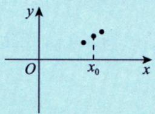  
(b)

  
(c)

而|f(x)|如图 3-6(a)\~(c) 所示.

  
(a)

图3-5  
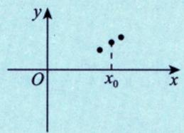  
(b)  
图3-6

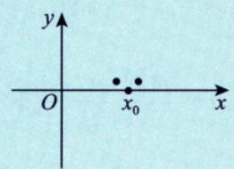  
(c)

点点相依相偎的图 3-5(a)\~(c)，加上绝对值后依然相依相偎成为图 3-6(a)\~(c)，故成立（无论是，还是，只要相依相偎即可）.为什么反过来不对？很简单，你看|f(x)|相依相偎，连续「见图 3-7(b)]，可f(x)却相距甚远，自然不连续「见图 3-7(a)].

  
(a)

  
图3-7  
(b)

(3) f(x)在 $x_{0}$ 处可导 $\sum_{x \in \mathbb{Z}} \left| f(x) \right|$ 在 $x _ { 0 }$ 处可导.

比如，f(x)在 $x _ { 0 }$ 点处的微观性态图如图3-8（a）所示（放大足够多倍），其在 $x_{0}$ 处可导，则$\left| f(x) \right|$ 如图 3-8（b）所示.

  
(a)  
图3-8

  
(b)

如果说连续，f(x)在 $x_{0}$ 处连续 $\Rightarrow \left| f(x) \right|$ 在 $x _ { 0 }$ 处连续，是的，点与点就是相依相偎在一起的，正如(2)所述.但说可导，不仅要相依相偎，而且要 $\lim_{x \to x_0} \frac{f(x) - f(x_0)}{x - x_0}$ 存在（唯一的数)，也就是f(x)相依相偎到 $f(x_{0})$ 的速度要不比 $x \to x_{0}$ 的速度慢.(①若快，则 $\lim_{x \to x_0} \frac{f(x) - f(x_0)}{x - x_0} = 0$ ②若同阶，则$\lim_{x \to x_0} \frac{f(x) - f(x_0)}{x - x_0} = A \neq 0$ )

请看图 3-8(a) 和图 3-8(b)，对于|f(x)|， $\lim_{x \to x_0} \frac{\left| f(x) \right| - \left| f(x_0) \right|}{x - x_0} < 0$ 而 $\lim_{x \to x_0^+} \frac{\left| f(x) \right| - \left| f(x_0) \right|}{x - x_0} > 0$ $( 1 , 1 0 ^ { \circ } ) ,$ 故 $\lim_{x \to x_0} \frac{\left| f(x) - \left| f(x_0) \right| \right|}{x - x_0}$ 不存在，|f(x)|在 $x_{0}$ 处不可导，即若f(x)在 $x _ { 0 }$ 处可导， $f(x_{0}) = 0$ $f^{\prime}(x_0) \neq 0$ ，则|f(x)|在 $x _ { 0 }$ 处必不可导.反例同(2).

现在，试试看，你应该可以清楚回答了：若f(x)在 $x_{0}$ 处可导，且 $f(x_{0}) \neq 0$ ，则|f(x)|在 $x _ { 0 }$ 处必可导，如图 3-9(a)，图 3-9(b) 所示.

  
(a)

  
(b)  
图3-9

提示：对于连续或可导函数，只要 $f(x_{0}) \stackrel{>}{<} 0$ ，无论 $f(x_{0})$ 与0的距离有多小，它旁边相依相偎的f(x)一定 $( < ) 0$ ，考研中常用这一点.

例3.7设函数f(x)处处可导，f(0)=-1， $f^{\prime}(0) = 1$ ，令 $g(x) = |f(x - 1)|$ ，则（）. (A) g(x)在x=0处必可导 (B) g(x)在x=0处必不可导 (C) g(x)在x=1处必可导 (D) g(x)在x=1处必不可导

## 解应选(C).

因为f(x)处处可导，所以 $g(x) = \left| f(x - 1) \right|$ 可能不可导的点有且仅有f(x-1)=0的点，而当x=0时，f(0-1)的值不得而知，故g(x)可能可导也可能不可导；当x=1时， $f(1 - 1) = f(0) \neq 0$ ，所以g(x)在x=1处必可导.

## 2 导数的几何意义

函数 $y = f ( x )$ 在点 $x _ { 0 }$ 处的导数值 $f^{\prime}(x_0)$ 就是曲线 $y = f(x)$ 在点 $(x_{0},y_{0})$ 处切线（见图3-10）的斜率k，即 $k = f^{\prime}(x_0)$ ，于是曲线y =f(x)在点 $(x_{0},y_{0})$ 处的切线方程为 $y - y_{0} = f^{\prime}(x_{0})(x - x_{0})$

什么是切线？它就像一把锋利无比的刀，“嗖”地切过点$\left( x _ { 0 } \: , \: y _ { 0 } \right)$ ，在此瞬间，切线的方向就是点 $\left( x _ { 0 } , y _ { 0 } \right)$ 运动的方向.想想看，掷铁饼（作为质点）时，运动员旋转轨迹的每一点的切线方向就是铁饼那一瞬时的运动方向.在那一瞬时脱手，铁饼就会沿着该点的切线方向飞出.

图3-10

法线方程为

$$
y - y_{0} = - \frac{1}{f^{\prime}(x_{0})}(x - x_{0})(f^{\prime}(x_{0}) \neq 0)
$$

注切线存在不代表导数存在，但导数存在切线一定存在.注例1 研究 $y = f(x) = |x|$ 在x=0处的切线问题.解 从x=0出发，取增量Δx，有 $\Delta y = f(0 + \Delta x) - f(0) = |\Delta x|$ 当 $\Delta x > 0$ 时， $\Delta y = \Delta x$ 则 $f_{+}^{\prime}(0)=\lim_{\Delta x \to 0^{+}}\frac{\Delta y}{\Delta x}=1\xlongequal{记}k_{+}$ 当 $\Delta x < 0$ 时， $\Delta y = - \Delta x$ ，则 $f_{-}^{\prime}(0)=\lim_{\Delta x \to 0^{-}}\frac{\Delta y}{\Delta x}=-1\xlongequal{记}k_{-}$

  
图3-11

尖点（角点）

如图 3-11 所示，曲线 $y = f(x) = |x|$ 在原点O处出现了两条单侧切线，这两条单侧切线形成了一  
个角，数学上称这里的原点O为一个角点.不过，虽然此曲线在角点O处有两条单侧切线，但按照  
前面讲到的f(x)在点 $x_{0}$ 处可导的充要条件，这里的 $f_{+}^{\prime}(0)=k_{+} \neq k_{-}=f_{-}^{\prime}(0)$ ，显然f'(0) 不存在，所以  
我们说 $y = f(x) = |x|$ 在原点O处不可导，也就没有切线.注例2 研究 $y = f(x) = x^{\frac{1}{3}}$ 在x=0处的切线问题

解 显然，在x=0处 $\frac{\Delta y}{\Delta x} = \frac{f(0 + \Delta x) - f(0)}{\Delta x} = \frac{(\Delta x)^{\frac{1}{3}}}{\Delta x} = \frac{1}{(\Delta x)^{\frac{2}{3}}}$

当 $\Delta x > 0$ 时， $f_{+}^{\prime}(0)=\lim_{\Delta x \to 0^{+}}\frac{1}{(\Delta x)^{\frac{2}{3}}}=+\infty;$ (其中(∆x)²>0)

当 $\Delta x < 0$ 时， $f_{-}^{\prime}(0)=\lim_{\Delta x \to 0^{-}}\frac{1}{(\Delta x)^{\frac{2}{3}}}=+\infty$

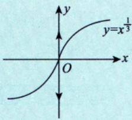

这样的结果称为无穷导数.又±∞被叫作广义的数，所以无穷导数在有些数学场合也可被视为导数存在的特殊情形.不过要强调的是，学习“高等数学’这门课程的考生，还是将无穷导数视为导数不存在为好，因为这是“高等数学”里的“规矩”.

图3-12

还要指出，如图3-12和图3-13所示， $y = f(x) = x^{\frac{1}{3}}$ 与 $y = f(x) = -x^{\frac{1}{3}}$ 在$x = 0$ 处有垂直于x轴的切线 $x = 0$ .我们说，若曲线 $y = f(x)$ 在点 $P(x_{0},y_{0})$ 处有垂直于x轴的切线，则等价于

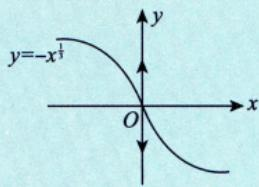

$$
f^{\prime}(x_0) = +\infty  或  -\infty   (为无穷导数)
$$

图3-13

总结： $f_{+}^{\prime}(x_{0}) \neq f_{-}^{\prime}(x_{0})$ ，出现角点（尖点），则f(x)在 $x_{0}$ 处不可导，没有切线；

$\textcircled{2} f(x)$ 在点 $x _ { 0 }$ 的导数是无穷导数时，在该点有切线但无导数.

例3.8 设曲线 $y = f(x) = x^n$ 在点(1，1)处的切线与x轴的交点为 $(\xi_{n}   ,   0)$ ，则 $\lim_{n \to \infty} f(\xi_n) =$ 分析由 $f_{n}(x) = x^{n}$ (其中 $\{ f _ { n } ( x ) \}$ 是函数列），知

$$
\begin{aligned}f_{1}(x) &= x^{1} \Rightarrow f_{1}^{\prime}(1) = 1 , \\f_{2}(x) &= x^{2} \Rightarrow f_{2}^{\prime}(1) = 2 , \\& \cdots\cdots \\f_{n}(x) &= x^{n} \Rightarrow f_{n}^{\prime}(1) = n .\end{aligned}
$$

解应填 $\frac{1}{\mathrm{e}}$

由于 $f^{\prime}(1)=\left.\frac{\mathrm{d}y}{\mathrm{d}x}\right|_{x=1}=nx^{n-1}\Big|_{x=1}=n,\;n=1,\;2,\;\cdots$ ，故过点(1，1)的切线方程为 $y - 1 = n(x - 1)$ ，令y=0得$x = \xi_{n} = 1 - \frac{1}{n}$ .于是

$$
\lim_{n \to \infty} f(\xi_n) = \lim_{n \to \infty} \left( 1 - \frac{1}{n} \right)^n = \frac{1}{\mathrm{e}}
$$

③高阶导数 (重点)

函数f(x)在点 $x_{0}$ 处的二阶导数为

$$
f^{\prime\prime}(x_0) = \lim_{\Delta x \to 0} \frac{f^{\prime}(x_0 + \Delta x) - f^{\prime}(x_0)}{\Delta x}  或  f^{\prime\prime}(x_0) = \lim_{x \to x_0} \frac{f^{\prime}(x) - f^{\prime}(x_0)}{x - x_0}
$$

函数f(x)在点 $x _ { 0 }$ 处的n(n为大于2的整数)阶导数为

$$
f^{(n)}(x_0) = \lim_{\Delta x \to 0} \frac{f^{(n-1)}(x_0 + \Delta x) - f^{(n-1)}(x_0)}{\Delta x}  或  \left| \frac{f^{(n)}(x_0) - \lim_{x \to x_0} f^{(n-1)}(x) - f^{(n-1)}(x_0)}{x - x_0} \right|
$$

写法： $f^{\prime}(x) , f^{\prime\prime}(x) , f^{\prime\prime\prime}(x)$ ，当 $n   \geq   4$ 时，要写 $f^{(n)}(x)$

注(1)如果f(x)在点 $x_{0}$ 处有二阶导数，则f(x)在 $x_{0}$ 的某个邻域内有一阶导数且 $f^{\prime}(x)$ 在 $x _ { 0 }$ 处连续.

$$
f^{\prime\prime}(x_0) = \lim_{x \to x_0} \frac{f^{\prime}(x) - f^{\prime}(x_0)}{x - x_0} = a
$$

$$
\lim_{x \to x_0} \left[ f'(x) - f'(x_0) \right] = \lim_{x \to x_0} \frac{f'(x) - f'(x_0)}{x - x_0} \left( x - x_0 \right) = 0
$$

$$
\lim_{x \to x_0} f'(x) = f'(x_0)  ,故   f'(x)  在  x_0  处连续
$$

$$
 分意思是从一阶导到  $n - 1$  阶导数都存在
$$

(2) 如果f(x)在点 $x _ { 0 }$ 处有n阶导数，则f(x)在 $x_{0}$ 的某个邻域内有1\~(n-1)阶的各阶导数.

总结： $f^{\prime}(x_{0})$ 存在⇒f(x)在 $x_{0}$ 附近有定义且在 $x _ { 0 }$ 处连续；

$f''(x_0)$ 存在⇒ f'(x)在 $x_{0}$ 附近有定义且在 $x _ { 0 }$ 处连续；

$f^{(n)}(x_0)  存在  \Rightarrow f^{(n-1)}(x)$ 在 $x_{0}$ 附近有定义且在 $x_{0}$ 处连续.

例3.9设f(x)在 $x = x_{0}$ 处二阶可导，且 $f^{\prime}(x_0) = 0, f^{\prime\prime}(x_0) \neq 0$ .证明：

(1)若 $f^{\prime\prime}(x_0) < 0$ ，则f(x)在 $x _ { 0 }$ 处取得极大值；

(2)若 $f^{\prime\prime}(x_0) > 0$ ，则f(x)在 $x _ { 0 }$ 处取得极小值.

分析概念题.

必背公式来源：函数极限的局部保号性.

$$
\lim_{x \to x_0} f(x) = A < 0 \xrightarrow{x \in (x_0 - \delta, x_0) \cup (x_0, x_0 + \delta)} f(x) < 0
$$

$$
\lim_{x \to x_0} f(x) = A > 0 \xrightarrow{x \in (x_0 - \delta, x_0) \cup (x_0, x_0 + \delta)} f(x) > 0
$$

必背公式应用：

$$
\lim_{x \to x_0} \frac{f'(x) - f'(x_0)}{x - x_0} < 0 \Rightarrow \frac{f'(x) - f'(x_0)}{x - x_0} < 0
$$

(1)因 $f^{\prime\prime}(x_0) < 0$ ，故按二阶导数的定义有

$$
f''(x_0) = \lim_{x \to x_0} \frac{f'(x) - f'(x_0)}{x - x_0} < 0
$$

根据函数极限的局部保号性，存在 $x _ { 0 }$ 的去心邻域 $\mathring{U}(x_0,\delta)$ ，当 $x \in \mathring{U}(x_0, \delta)$ 时，有 $\frac{f^{\prime}(x) - f^{\prime}(x_0)}{x - x_0} < 0$ 因为 $f^{\prime}(x_0) = 0$ ，所以上式为 $\frac{f^{\prime}(x)}{x - x_{0}} < 0$ .从而当 $x \in \mathring{U}(x_0, \delta)$ 时， $f^{\prime}(x)$ 与 $x   -   x _ { 0 }$ 符号相反.当 $x - x_{0} < 0$ 时， $f^{\prime}(x) > 0$ ；当 $x - x_{0} > 0$ 时， $f^{\prime}(x) < 0$ .根据判别极值的第一充分条件，f(x)在点 $x _ { 0 }$ 处取得极大值

(2)因 $f^{\prime\prime}(x_0) > 0$ ，故按二阶导数的定义有

$$
f^{\prime\prime}(x_0) = \lim_{x \to x_0} \frac{f^{\prime}(x) - f^{\prime}(x_0)}{x - x_0} > 0
$$

根据函数极限的局部保号性，存在 $x _ { 0 }$ 的去心邻域 $\mathring{U}(x_0, \delta)$ ，当 $x \in \dot{U}(x_0, \delta)$ 时，有 $\frac{f^{\prime}(x) - f^{\prime}(x_0)}{x - x_0} > 0$ 因为 $f^{\prime}(x_0) = 0$ ，所以上式为 $\frac{f^{\prime}(x)}{x - x_{0}} > 0$ .从而当 $x \in \mathring{U}(x_0, \delta)$ 时， $f^{\prime}(x)$ 与 $x   -   x _ { 0 }$ 符号相同.当 $x - x_{0} < 0$ 时，$f^{\prime}(x) < 0$ ；当 $x - x_{0} > 0$ 时， $f^{\prime}(x) > 0$ .根据判别极值的第一充分条件，f(x)在点 $x _ { 0 }$ 处取得极小值.

## 4 微分的概念 一元函数可微↔可导

(1) 引例.

如图3-14所示，设正方形边长为1，当其边长增加Δx时，它的面积S增加了

$$
\Delta S = (1 + \Delta x)^{2} - 1^{2} = \frac{2\Delta x}{1} + \frac{(\Delta x)^{2}}{1}
$$

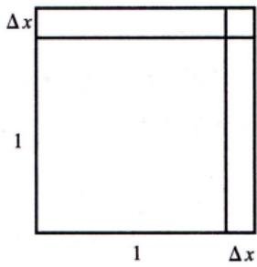  
图 3-14

上述面积的增量ΔS由两部分组成，一部分是2Δx（图3-14中两个小长

方形的面积），它是Δx的一次项；另一部分是 $\left( \Delta x \right) ^ { 2 }$ （图3-14中右上角小正方形的面积），它满足$\lim_{\Delta x \to 0} \frac{(\Delta x)^2}{\Delta x} = 0$ ，即 $( \Delta x ) ^ { 2 } = o ( \Delta x )$ .故 $\Delta S = 2\Delta x + o(\Delta x)$ ，2Δx为增量的主要部分，也叫线性主部， $o ( \Delta x )$ 为$\Delta x   \to   0$ 时Δx的高阶无穷小，是误差，当Δx足够小时，有 $\Delta S \approx 2 \Delta x$

(2) 概念.

设函数 $y = f(x)$ 在点 $x _ { 0 }$ 的某邻域内有定义，且 $x_{0} + \Delta x$ 在该邻域内，对于函数增量

$$
\Delta y = f(x_{0} + \Delta x) - f(x_{0}) ,
$$

若存在与∆x无关的常数A，使得

$$
\Delta y = A\Delta x + o(\Delta x),
$$

其中 $o ( \Delta x )$ 是在 $\Delta x   \to   0$ 时比∆x更高阶的无穷小，则称f(x)在点 $x _ { 0 }$ 处可微，并把增量的主要部分AΔx称为线性主部，也叫作f(x)在点 $x _ { 0 }$ 处的微分，记 $\mathrm{d}y|_{x = x_0} = A\Delta x$ 或 $\mathrm{d}y\big|_{x = x_0} = f'(x_0)\mathrm{d}x$

可微⇔可导的证明：

$$
\begin{aligned} &f^{\prime}(x_{0}) = \lim_{\Delta x \to 0} \frac{\Delta y}{\Delta x} = \lim_{\Delta x \to 0} \frac{\Delta \Delta x}{\Delta x} + \lim_{\Delta x \to 0} \frac{o(\Delta x)}{\Delta x} = A , \quad\\ & 由此可知  \left. \mathrm{d}y \right|_{x = x_{0}} = A \circ \Delta x = f^{\prime}(x_{0}) \Delta x , \quad\\ & 又  \frac{\mathrm{d}x = \Delta x}{\left| \begin{matrix}
\mathrm{d}x
\end{matrix} \right|} , \quad  故  \left. \mathrm{d}y \right|_{x = x_{0}} = f^{\prime}(x_{0}) \mathrm{d}x\\ &\Delta x = \begin{matrix}
\mathrm{d}x + o(\Delta x) , &  \\
\left| \begin{matrix} \mathrm{d}x & \left| \mathrm{d} \right|
\end{matrix} \right. \end{matrix} , \quad  故  \Delta x = \mathrm{d}x\\ \end{aligned}
$$

## 注(1)可微的判别.

①写增量 $\Delta y = f(x_{0} + \Delta x) - f(x_{0})$

②写线性增量 $A\Delta x = f^{\prime}(x_0)\Delta x$ i

③作极限 $\lim_{\Delta x \to 0} \frac{\Delta y - A\Delta x}{\Delta x} \Leftrightarrow \Delta y = A\Delta x + o(\Delta x)$

若该极限等于 0，则 y=f(x)在点 $x_{0}$ 处可微，否则不可微.

(2)从上述判别步骤可以看出，用形式简单的“线性增量 $A \Delta x$ 去代替形式复杂的“增量 $\Delta y$ 且其误差 $\Delta y - A\Delta x$ 是o(∆x)，这就是说，用“简单的量”代替了“复杂的量”，且产生的误差又可以忽略不计，这就是可微的含义.

判别可微首先考虑(3)，若没有则结合f'(x)的信息考虑(1)

(3) $ \text{" } f(x)$ 在点 $x_{0}$ 处可微”与“f(x)在点 $x_{0}$ 处可导”互为充要条件，故判别f(x)在点 $x_{0}$ 处是否可 微可以转化为判别其在点 $x_{0}$ 处是否可导，这样的话考生会比较熟悉.

(4) 可微的几何意义.

若f(x)在点 $x_{0}$ 处可微，则在点 $(x_{0},y_{0})$ 附近可以用切线段近似代替曲线段，这是可微的几何意义.  
(5) 图 3-15 可以较好地帮助考生理解以上论述.

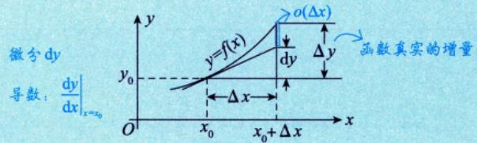  
图3-15

例3.10 设函数 y = f(x) 在任意点 x 处的增量 $\Delta y = \frac{y \Delta x}{x + \sqrt{x^2 + y^2}} + o(\Delta x)$ ，且f(0)=1，则$y = f(x)$ 在点x=0处的微分dy =().

(A) 0 (B) dx (C) 2dx (D) 3dx

分析概念题，转化成导数 $\frac{\mathrm{d}y}{\mathrm{d}x}$ 代入数值即可.

## 解应选(B).

由 $\Delta y = \frac{y \Delta x}{x + \sqrt{x^2 + y^2}} + o(\Delta x)$ ，知 $\frac{\mathrm{d}y}{\mathrm{d}x} = y^{\prime} = \frac{y}{x + \sqrt{x^{2} + y^{2}}}$ ，又f(0)=1，可得 $y^{\prime}(0) = 1$ ，进而 $\mathrm{d}y\big|_{x = 0} =$ $y^{\prime}(0) \mathrm{d}x = \mathrm{d}x$ ，应选(B).

例3.11设函数f(u)可导，且 $y = f(x^{2})$ ，当自变量x在x=-1处取得增量 $\Delta x = - 0 . 1$ 时，相应的函数增量Δy的线性主部为0.1，则f'(1) =().(A) -1 (B) 0.1 (C) 0.5 (D)1

分析概念题.对复合函数 $y = f[g(x)]$ 求导，有 $y ^ { \prime } = f ^ { \prime } \left[ g ( x ) \right] \cdot g ^ { \prime } ( x )$

必背公式来源： $\Delta y = A\Delta x + o(\Delta x)$ ，其中 $\mathrm{d}y = A\Delta x = y^{\prime}\mathrm{d}x$ 为线性主部.

## 解应选(C).

本题依然是考查微分的定义.函数的微分是函数增量的线性主部，且 $\mathrm{d}y = y^{\prime}\mathrm{d}x = y^{\prime}\Delta x$ ，而

$$
\mathrm{d}y = f^{\prime}(x^{2})\mathrm{d}(x^{2}) = 2xf^{\prime}(x^{2})\mathrm{d}x = 2xf^{\prime}(x^{2})\Delta x,
$$

因此，由0.1=-2f′(1)·(-0.1)，可得 $f^{\prime}(1) = 0.5$ ，故选(C).

一练设函数f(x)在x=1处可导，且∆Δf(1)是f(x)在增量为∆x时的函数值增量，则 $\lim_{\Delta x \to 0} \frac{\left. \Delta f(1) - \mathrm{d}f \right|_{x = 1}}{\Delta x} =$ ( ).(A) f′(l) (B) 1 (C) ∞ (D) 0

分析 $\Delta y = \mathrm{d}y + o(\Delta x)$ ，则 $\Delta y - \mathrm{d}y = o(\Delta x)$ ，故 $\Delta f(x) - \mathrm{d}[f(x)] = o(\Delta x)$

由于 $\Delta f(1) = f(1 + \Delta x) - f(1)$ ，故 $\lim_{\Delta x \to 0} \frac{\Delta f(1)}{\Delta x} = \lim_{\Delta x \to 0} \frac{f(1 + \Delta x) - f(1)}{\Delta x} = f'(1)$ ，又

$$
\lim _ { \Delta x \rightarrow 0 } \frac { \mathrm { d } f \left| _ { x = 1 } \right. } { \Delta x } = \lim _ { \Delta x \rightarrow 0 } \frac { f ^ { \prime } ( 1 ) \mathrm { d } x } { \Delta x } = \lim _ { \Delta x \rightarrow 0 } \frac { f ^ { \prime } ( 1 ) \Delta x } { \Delta x } = f ^ { \prime } ( 1 ) ,
$$

于是，原式 $f^{\prime}(1) - f^{\prime}(1) = 0$

注在微分概念中，由 $\Delta y = A\Delta x + o(\Delta x)$ ，得 $dy = A\Delta x$ 故由 $\Delta x = 1 \cdot \Delta x + o(\Delta x)$ ，得 $\mathrm{d}x = 1 \cdot \Delta x$ ，也就有$\mathrm{d}y = A\Delta x = A\mathrm{d}x$ 线性主部

## 习题

3.1 设 $f(x)=\left\{\begin{aligned}\frac{1-\cos x}{\sqrt{x}}, \quad x>0, \\x^{2}g(x), \quad x \leqslant 0,\end{aligned}\right.$ 其中g(x)是有界函数，则f(x)在x=0处（).(A) 极限不存在 (B)极限存在，但不连续(C)连续，但不可导 (D) 可导

3.2 设函数 $f(x) = \left| x^{3} - 1 \right| \varphi(x)$ ，其中φ(x)在x=1处连续，则φ(1)=0是f(x)在x=1处可导的().(A) 充分必要条件 (B) 充分但非必要条件(C) 必要但非充分条件 (D)既非充分又非必要条件

3.3 设函数f(x) 可导，且曲线 y = f(x) 在点 $(x_{0},f(x_{0}))$ 处的切线与直线y=2-x垂直，则当∆x→0时，该函数在 $x   =   x _ { 0 }$ 处的微分dy是().(A)与∆x同阶但非等价的无穷小 (B)与∆x等价的无穷小(C) 比 Δx 高阶的无穷小 (D) 比 ∆x低阶的无穷小

3.4 设函数y = f(x)在点 $x _ { 0 }$ 处可导，且 $f^{\prime}(x_0) \neq 0$ .当自变量有增量∆x时，函数y=f(x)的增量为∆y，则当∆x→0时，∆y-dy是dy的（).(A) 高阶无穷小 (B) 低阶无穷小 (C)同阶非等价无穷小 (D)等价无穷小

3.5 设f(x) =(x−a)·φ(x)，其中 φ(x)连续，则f'(a) =

3.6 设f(x)满足f(0)=0，且f′(0)存在，则 $\lim_{x \to 0} \frac{f(1 - \sqrt{\cos x})}{\ln(1 - x \sin x)}$

3.7 证明：(1)若F(x)在 $\left[ x _ { 0 } , x _ { 0 } + \delta \right) ( \delta > 0 )$ 连续，在 $(x_{0}, x_{0} + \delta)$ 内可导，当 $\lim_{x \to x_0^+} F'(x) \xlongequal{ 存在 } A$ 时，有 $F_{+}^{\prime}(x_{0}) = A$

(2)若F(x)在 $(x_{0} - \delta, x_{0}] (\delta > 0)$ 连续，在 $(x_{0} - \delta,   x_{0})$ 内可导，当 $\lim_{x \to x_0^-} F'(x) \xlongequal{ 存在 } A$ 时，有 $F_{-}^{\prime}(x_{0}) = A$

3.8 设 $f(x)=\begin{cases}x^{2}\sin\frac{\pi}{x},&x<0,\\A,&x=0,\\ax^{2}+b,&x>0,\end{cases}$ 求常数A,a,b的值，使f(x)在x=0处可导，并求f′(0).

3.9 设δ>0，f(x)在[-δ,δ]上有定义，f(0)=1，且满足

$$
\lim_{x \to 0} \frac{\ln(1 - 2x) + 2xf(x)}{x^2} = 0
$$

证明：f(x)在x=0处可导，并求f′(0)

## 解答

3.1 (D) 解

$$
f_{+}^{\prime}(0)=\lim_{x \to 0^{+}}\frac{f(x)-f(0)}{x}=\lim_{x \to 0^{+}}\frac{1-\cos x}{x^{\frac{3}{2}}}=0
$$

$$
f_{-}^{\prime}(0)=\lim_{x \to 0^{-}}\frac{x^{2}g(x)}{x}=\lim_{x \to 0^{-}}xg(x)=0
$$

第二个等式利用了g(x)是有界函数这一条件，有界函数乘以无穷小量仍是无穷小量.由于f(x)在点x=0处的左导数等于右导数，因而f(x)在x=0处可导.

3.2 (A) 解 由 φ(1) =0 可知

$$
f_{+}^{\prime}(1)=\lim_{x \to 1^{+}}\frac{f(x)-f(1)}{x-1}=\lim_{x \to 1^{+}}\frac{\left | x^{3}-1 \right | \varphi (x)}{x-1}=\lim_{x \to 1^{+}}\left ( x^{2}+x+1 \right )\varphi (x)=0,
$$

$$
f_{-}^{\prime}(1)=\lim_{x \to 1^{-}}\frac{f(x)-f(1)}{x-1}=\lim_{x \to 1^{-}}\frac{\left | x^{3}-1 \right | \varphi (x)}{x-1}=-\lim_{x \to 1^{-}}(x^{2}+x+1)\varphi (x)=0,
$$

即 $f_{+}^{\prime}(1)=f_{-}^{\prime}(1)=0$ ，所以$f'(1)=0$.

设f(x)在x=1处可导，因为f(1)=0，所以

$$
f_{+}^{\prime}(1)=\lim_{x \to 1^{+}}\frac{f(x)-f(1)}{x-1}=\lim_{x \to 1^{+}}\frac{\left | x^{3}-1 \right | \varphi (x)}{x-1}=\lim_{x \to 1^{+}}\left ( x^{2}+x+1 \right )\varphi (x)=3\varphi (1),
$$

$$
f_{-}^{\prime}(1)=\lim_{x \to 1^{-}}\frac{f(x)-f(1)}{x-1}=\lim_{x \to 1^{-}}\frac{\left | x^{3}-1 \right | \varphi (x)}{x-1}=-\lim_{x \to 1^{-}}\left ( x^{2}+x+1 \right )\varphi (x)=-3\varphi (1)
$$

由$f_{+}^{\prime}(1)=f_{-}^{\prime}(1)$可得， $3\varphi(1)=-3\varphi(1)$ ，故φ(1)=0，应选(A).

3.3 (B) 解 由题设可知 $f^{\prime}(x_0) = 1$ .而 $\mathrm{d}y\big|_{x = x_0} = f^{\prime}(x_0)\Delta x = \Delta x$ ,因而 $\lim_{\Delta x \to 0} \frac{\mathrm{d}y}{\Delta x} \bigg|_{x = x_0} = 1$ ,即当 $\Delta x \to 0$ 时，该函数在 $x   =   x _ { 0 }$ 处dy与∆x是等价无穷小，故选(B).

3.4 (A) 解 题目给出f(x)在 $x _ { 0 }$ 处可导，考查 $\lim_{\Delta x \to 0} \frac{\Delta y - \mathrm{d}y}{\mathrm{d}y}$ ，注意，如果f(x)在 $x _ { 0 }$ 处可导，则必定可微分，因此可以由微分的性质入手.

由微分的定义可知 $\Delta y - \mathrm{d}y = o(\Delta x)$ ，而 $\mathrm{d}y = y^{\prime}\mathrm{d}x,\left.\mathrm{d}y\right|_{x = x_{0}} = f^{\prime}(x_{0})\Delta x$

由题设知 $f^{\prime}(x_0) \neq 0$ ，可得

$$
\lim _ { \Delta x \rightarrow 0 } \frac { \Delta y - \mathrm { d } y } { \mathrm { d } y } = \lim _ { \Delta x \rightarrow 0 } \frac { o ( \Delta x ) } { f ^ { \prime } ( x _ { 0 } ) \Delta x } = \lim _ { \Delta x \rightarrow 0 } \frac { 1 } { f ^ { \prime } ( x _ { 0 } ) } \cdot \frac { o ( \Delta x ) } { \Delta x } = 0 ,
$$

故选(A).

3.5 φ(a) 分析 概念题. 有的同学用公式法求出f'(a)，但这是错误解法，

$$
f^{\prime}(a)=f^{\prime}(x)\big|_{x=a}=\left[\varphi(x)+(x-a)\cdot\varphi^{\prime}(x)\right]\big|_{x=a}=\varphi(a)+0=\varphi(a)\ ,
$$

错误，因为φ(x)仅连续， $\varphi ^ { \prime } ( x )$ 不一定存在！应该用“导数定义”求出.

解导数定义.

$$
f^{\prime}(a)=\lim_{x \to a}\frac{f(x)-f(a)}{x-a}=\lim_{x \to a}\frac{(x-a)\cdot \varphi(x)-0}{x-a}=\lim_{x \to a}\varphi(x)=\varphi(a)
$$

注求导数时，当函数不具备“导数存在”的条件时，往往只能用“导数定义”求.

3.6 $-\frac{1}{4}f^{\prime}(0)$ 解

$$
\begin{aligned} & 原式 =\lim_{x \to 0} \frac{f(1-\sqrt{\cos x})-f(0)}{(1-\sqrt{\cos x})-0} \cdot \lim_{x \to 0} \frac{1-\sqrt{\cos x}}{\ln(1-x\sin x)}\\ &=f^{\prime}(0)\lim_{x \to 0} \frac{1-\sqrt{\cos x}}{\ln(1-x\sin x)}\\ &=\frac{\frac{1}{2}\cdot \frac{1}{2}\cdot \frac{1}{2}x^2}{\sin x}f^{\prime}(0)\lim_{x \to 0} \frac{\frac{1}{2}\cdot \frac{1}{2}x^2}{-x\sin x}=-\frac{1}{4}f^{\prime}(0)\lim_{x \to 0} \frac{x^2}{x^2}=-\frac{1}{4}f^{\prime}(0).\\ \end{aligned}
$$

3.7 证明 (1) $F_{+}^{\prime}(x_{0}) = \lim_{x \to x_{0}^{+}} \frac{F(x) - F(x_{0})}{x - x_{0}}$ 洛必达法则 $\lim_{x \to x_0^+} \frac{F'(x)}{1} = A$

(2) $F^{\prime}_{-}(x_{0}) = \lim_{x \to x_{0}^{-}} \frac{F(x) - F(x_{0})}{x - x_{0}}$ 洛必达法则 $\lim_{x \to x_0^-} \frac{F'(x)}{1} = A$

注满足(1)，(2)的条件时，有 $\lim_{x \to x_0^+} F'(x) \xlongequal{ 存在 } A$ 则 $F^{\prime}_{+}(x_{0}) \xlongequal{ 存在 } A$ 但 $\lim_{\substack{x \to x_0^+ \\ (x_0^-)}} F'(x)$ 不存在时，

$\hat{F}_{+}^{\prime}(x_0)$ 亦可能存在.如 $F(x)=\left\{\begin{aligned}&x^{2}\sin\frac{1}{x}, &x\neq0,\\&0, &x=0.\end{aligned}\right.$

当x=0时， $F^{\prime}(0)=\lim_{x \to 0}\frac{F(x)-F(0)}{x-0}=\lim_{x \to 0}x\sin\frac{1}{x}=0.$

当 $x \neq 0$ 时， $F^{\prime}(x)=2x\sin\frac{1}{x}-\cos\frac{1}{x},\lim_{x \to 0^{+}}F^{\prime}(x)$ 不存在.但由 $F^{\prime}(0) = 0$ ，知 $F_{+}^{\prime}(0) = 0$ (存在).

3.8 解 由可导与连续的关系有

$$
\lim_{x \to 0^{-}} x^{2} \sin \frac{\pi}{x} = \lim_{x \to 0^{+}} (ax^{2} + b) = A,
$$

所以 $A = b = 0$ .又

$$
f_{-}^{\prime}(0)=\lim_{x \to 0^{-}}\frac{x^{2}\sin\frac{\pi}{x}-0}{x-0}=0,\ f_{+}^{\prime}(0)=\lim_{x \to 0^{+}}\frac{ax^{2}-0}{x-0}=0,
$$

所以a可以为任意常数，且 $f^{\prime}(0) = 0$

3.9 证明使用泰勒公式，有

$$
\lim_{x \to 0} \frac{\ln(1 - 2x) + 2xf(x)}{x^2} = \lim_{x \to 0} \frac{- 2x - \frac{1}{2} \cdot 4x^2 + o(x^2) + 2xf(x)}{x^2} = 2\lim_{x \to 0} \frac{f(x) - 1}{x} - 2 + 0 = 0
$$

于是极限 $\lim_{x \to 0} \frac{f(x) - f(0)}{x - 0} = 1$ ，即为 $f^{\prime}(0)$ ，于是函数f(x)在x=0处可导，且 $f^{\prime}(0) = 1$
