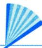
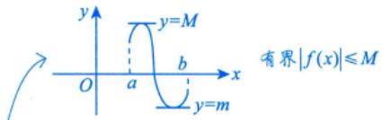
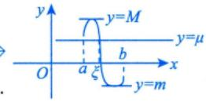
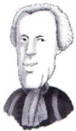
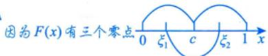
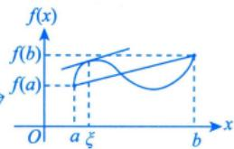
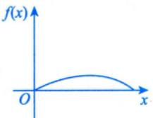

## 第6讲

## 一元函数微分学的应用（二）—中值定理、微分等式与微分不等式

①连续函数+可导函数

②方程(数学二、三常考)

③用导数的方法证明(数学三常考)

<table><tr><td rowspan=1 colspan=1>考题</td><td rowspan=1 colspan=1>中值定理、微分等式与微分不等式</td></tr><tr><td rowspan=1 colspan=1>题型</td><td rowspan=1 colspan=1>选择题、填空题、解答题</td></tr><tr><td rowspan=1 colspan=1>目标</td><td rowspan=1 colspan=1>①理解闭区间上连续函数的性质(有界性、最大值和最小值定理、介值定理)，并会应用这些性质;②理解并会用罗尔定理、拉格朗日中值定理和泰勒定理，了解并会用柯西中值定理</td></tr><tr><td rowspan=1 colspan=1>重难点</td><td rowspan=1 colspan=1>①平均值定理；②罗尔定理的推论；③用函数性态证明微分不等式；④用中值定理证明微分不等式</td></tr></table>

## 基础知识结构

第6讲一元函数微分学的应用（二）——中值定理、微分等式与微分不等式

零点定理（证存在性）

配合起来考

微分等式方程的根，函数的零点，曲线的交点

单调性（证唯一性）

罗尔原话

★罗尔定理的推论

实系数奇次方程至少有一个实根

用函数性态证明

★首先考虑研究辅助函数F(x)的凹凸性、最值、正负

微分不等式数学一综合题中的一个小步骤

用常数变量化证明

用中值定理证明

★中值ξ， $a < \xi < b , f(a) < f(\xi) < f(b)$

## 基础内容精讲

## 中值定理

## 涉及函数的中值定理

设f(x)在[a,b]上连续，则

定理1(有界与最值定理) $m \leq f(x) \leq M$ ，其中m，M分别为f(x)在[a,b]上的最小值与最大值.

定理2(介值定理)当 $m \leqslant \mu \leqslant M$ 时，存在 $\xi \in [a,   b]$ ，使得 $f(\xi) = \mu$

如，f(x)在[0,2]上连续， $f(0)=0,\ f(1)=1$ ，则存在 $\xi \in (0,1)$ ，使 $f(\xi) = \frac{1}{2}$

(离散的)平均值定理： $f(\xi) = \frac{1}{n} \sum_{i=1}^{n} f(x_i)$

(连续的)平均值定理： $f(\xi) = \frac{1}{b - a}\int_{a}^{b}f(x)\mathrm{d}x  .$

定理3(平均值定理)当 $a < x_{1} < x_{2} < \cdots < x_{n} < b$ 时，在 $\left[ x _ { 1 } ,   x _ { n } \right]$ 内至少存在一点 $\xi$ ，使得

$$
f(\xi) = \frac{f(x_1) + f(x_2) + \cdots + f(x_n)}{n}
$$

注证 由闭区间连续函数的最值定理，得

$$
m \leqslant f(x_1) \leqslant M
$$

$$
m \leqslant f(x_{2}) \leqslant M,
$$

$$
m \leqslant f(x_n) \leqslant M
$$

$$
m \leqslant \frac{f(x_{1}) + \cdots + f(x_{n})}{n} \leqslant M,
$$

则存在 $\xi \in [x_1, x_n] \subset [a, b]$ 使得 $f(\xi) = \frac{f(x_1) + \cdots + f(x_n)}{n}$

定理4(零点定理)当 $f(a) \cdot f(b) < 0$ 时，存在 $\xi \in (a,   b)$ ，使得 $f(\xi) = 0$

a,b为无定义点，可直接用

注推广的零点定理：若f(x)在(a， b) 内连续， $\lim_{x \to a^{+}} f(x) = \alpha, \quad \lim_{x \to b^{-}} f(x) = \beta$ 且 $\alpha \cdot \beta < 0$ ，则$f(x) = 0$ 在(a, b)内至少有一个根，这里 $a,b,\alpha,\beta$ 可以是有限数，也可以是无穷大.

例6.1 设函数f(x)在[0,1]上连续，且 $f(1)=0,\ f\left(\frac{1}{2}\right)=1$ ，证明：存在 $\eta \in \left( \frac{1}{2}, 1 \right)$ ，使得$f(\eta) = \eta$

分析涉及关系式，“做一至两步的逆运算”只需证 $f(\eta) - \eta = 0$

证令 $F(x) = f(x) - x$ ，则函数F(x)=f(x)−x在 $\left[ \frac{1}{2}, 1 \right]$ 上连续，且有

$$
F\left(\frac{1}{2}\right)=f\left(\frac{1}{2}\right)-\frac{1}{2}=\frac{1}{2}>0,F(1)=f(1)-1=-1<0,
$$

由于 $F\left(\frac{1}{2}\right) \cdot F(1) < 0$ ，根据零点定理可知，存在 $\eta \in \left( \frac{1}{2}, 1 \right)$ ，使得 $F(\eta) = 0$ ，即 $f(\eta) = \eta$

例6.2 设函数f(x)在区间[0,1]上连续，且 $f(1)>0,\lim_{x \to 0^{+}}\frac{f(x)}{x}<0$ .证明：方程 $f(x) = 0$ 在区间(0，1)内至少存在一个实根. 一般作为解答题的第一问→极限必须存在，才可和“0”比大小

证由 $\lim_{x \to 0^{+}} \frac{f(x)}{x} < 0$ 与极限的保号性可知，存在 $a \in (0,1)$ ，使得 $\frac{f(a)}{a} < 0$ ，即 $f(a) < 0$

又 $f(1) > 0$ ，所以存在 $b \in (a,1) \subset (0,1)$ ，使得 $f(b) = 0$ ，即方程 $f(x) = 0$ 在区间(0，1)内至少存在一个实根.

## 第6讲一元函数微分学的应用（二）——中值定理、微分等式与微分不等式

拉格朗日中值定理

$$
\int_{a}^{b} f(x) \mathrm{d}x \xleftarrow{} f(x) \xrightarrow{} f^{\prime}(x) \xrightarrow{} f^{(n)}(x) (n \geqslant 2).
$$

定积分/积分中值定理

泰勒公式

## 2涉及导数（微分）的中值定理

费马 (1601—1665)  

历史故事：费马，被称为最业余的数学家，比牛顿大42岁，是个律师。

1637年他在图书馆看书时，看到了 $x^{2} + y^{2} = z^{2}$ 必存在正整数解”，他违反规定写了一段话：

$\left\{ \begin{aligned} x^{3} + y^{3} &= z^{3} \\ x^{4} + y^{4} &= z^{4} \\ \cdots \\ x^{n} + y^{n} &= z^{n} \end{aligned} \right\}$ 一律没有正整数解.

费马说：“此处太小写不下，不予证明了”.费马大定理提出了好的问题，实际上，比解决它更好！怀尔斯于1994年证明出了该定理，此时已超40岁

①可导，左右导数存在且相等定理 5(费马定理)设f(x)在点 $x _ { 0 }$ 处满足 则 $f^{\prime}(x_0) = 0$ ②取极值，极值点

## 注（1)证明费马定理.

不妨假设f(x)在点 $x_{0}$ 处取得极大值，则存在 $x_{0}$ 的邻域 $U(x_{0})$ ，对任意的 $x \in U(x_0)$ ，都有 $\Delta f =$ $f(x) - f(x_0) \leq 0$ ，于是根据导数的定义与极限的保号性，有

$$
f^{\prime}_{-}(x_0) = \lim_{x \to x_0^{-}} \frac{f(x) - f(x_0)}{x - x_0} \geq 0,
$$

$$
f_{+}^{\prime}(x_{0}) = \lim_{x \to x_{0}^{+}} \frac{f(x) - f(x_{0})}{x - x_{0}} \leq 0
$$

又f(x)在点 $x _ { 0 }$ 处可导，于是 $f_{-}^{\prime}(x_{0}) = f_{+}^{\prime}(x_{0})$ ，故 $f^{\prime}(x_0) = 0$

(2)当一个人跑到最远处时，他的速度为零；当一个人跑得最快时，他的加速度为零.这些都是费马定理在生活中的通俗应用.

例6.3 (导数零点定理)设f(x)在[a,b]上可导，证明当 $f_{+}^{\prime}(a) \bullet f_{-}^{\prime}(b) < 0$ 时，存在 $\xi \in (a,   b)$ 使得 f'(x)存在 由此知最大值取在区间内，而 由此知最大值取在区间内，而区间内的器值必为极值 区间内的最值必为极值，端

$$
f^{\prime}(\xi) = 0
$$

## 证不妨设 $f_{+}^{\prime}(a)>0,f_{-}^{\prime}(b)<0$ ，于是

点的最值不一定是极值  
三 x  
a a+δ1 b-δ2 b(端点不谈论极值，因为在  
区间外侧并无定义)

由 $f_{+}^{\prime}(a)=\lim_{x \to a^{+}}\frac{f(x)-f(a)}{x-a}>0.$ 可得存在 $\delta_{_1} > 0$ ，在 $(a,   a + \delta_1)$ 内， $f(x) > f(a)$ 脱帽法由 $f_{-}^{\prime}(b)=\lim_{x \to b^{-}}\frac{f(x)-f(b)}{x-b}<0$ ，可得存在 $\delta_{2} > 0$ ，在 $(b - \delta_{2},   b)$ 内， $f(x) > f(b)$

故f(a)与f(b)均不是f(x)在[a,b]上的最大值，则f(x)在(a,b)内取得最大值，根据费马定理可知，存在 $\xi \in (a,   b)$ ，使得 $f^{\prime}(\xi) = 0$

定理 6(罗尔定理)

①在[a,b]上连续，

三个条件同时满足才可以

设f(x)满足②在(a,b)内可导，则存在 $\xi \in (a,   b)$ ，使得 $f^{\prime}(\xi) = 0$

③f(a) = f (b) ,

① f(a) = f(b) ;

② lim f (x) = lim f(x) ; x→→a x→b

罗尔(1652—1719) 11罗尔→f'(ξ) =0

$$
\lim_{x \to a^{+}} f(x) = +\infty, \quad \lim_{x \to b^{-}} f(x) = +\infty
$$

## 注1推广的罗尔定理.

设f(x)在(a, b) 内可导， $\lim_{x \to a^{+}} f(x) = \lim_{x \to b^{-}} f(x) = A$ ，则在(a, b) 内至少存在一点ξ，使f'(ξ) =0其中区间(a,b)可以是有限区间也可以是无穷区间，A可以是有限数也可以是无穷大.

注2罗尔定理的使用往往需要构造辅助函数，其方法总结如下.

(1)简单情形：题设f(x)即为辅助函数（研究对象）.

(2)复杂情形. 一般不用f，而用一个神秘的“F”——辅助函数。

①乘积求导公式 $(uv)^{\prime} = u^{\prime}v + uv^{\prime}$ 的逆用.

a. $\left[ f(x)f(x) \right]' = \left[ f^{2}(x) \right]' = 2f(x) \cdot f'(x)$

见到f(x)f'(x)，令 $F(x) = f^{2}(x)$ ·逆运算

b. $\left[ f(x) \cdot f'(x) \right]' = \left[ f'(x) \right]^2 + f(x)f''(x)$

见到 $\left[ f^{\prime}(x) \right]^{2} + f(x)f^{\prime\prime}(x)$ ，令 $F(x) = f(x)f^{\prime}(x)$

$$
\left[ f(x)\mathrm{e}^{\varphi(x)} \right]' = f'(x)\mathrm{e}^{\varphi(x)} + f(x)\mathrm{e}^{\varphi(x)} \cdot \varphi'(x) = \left[ f'(x) + f(x)\varphi'(x) \right]\mathrm{e}^{\varphi(x)}
$$

见到 $f^{\prime}(x) + f(x)\varphi^{\prime}(x)$ ，令 $F(x) = f(x)\mathrm{e}^{\varphi(x)}$

常考以下情形.

φ(x) =x⇒ 见到f'(x)+f(x)，令F(x)=f(x)ex

φ(x)=-x⇒ 见到f'(x)−f(x)，令 $F(x) = f(x)\mathrm{e}^{-x}$ BNAL

φ(x) =kx⇒见到f′(x)+kf(x)，令 $F(x) = f(x)\mathrm{e}^{kx}$

$(uv)'' = u''v + 2u'v' + uv''$ 亦有可能考到.

②商的求导公式 $\left( \frac{u}{v} \right)' = \frac{u'v - uv'}{v^2}$ 的逆用.

a $\left[ \frac{f(x)}{x} \right]' = \frac{f'(x)x - f(x)}{x^2}$

见到 $f^{\prime}(x)x - f(x), x \neq 0$ 令 $F(x) = \frac{f(x)}{x}$

b. $\left[ \frac{f'(x)}{f(x)} \right]' = \frac{f''(x)f(x) - \left[ f'(x) \right]^2}{f^2(x)}$

见到 $f''(x)f(x)-\left[f'(x)\right]^2,\ f(x)\neq0$ $F(x) = \frac{f^{\prime}(x)}{f(x)}$

$\left[ \ln f(x) \right]' = \frac{f'(x)}{f(x)}$ 故 $\left[ \ln f(x) \right]'' = \left[ \frac{f'(x)}{f(x)} \right]' = \frac{f''(x)f(x) - \left[ f'(x) \right]^2}{f^2(x)}$

见到 $f^{\prime\prime}(x)f(x)-\left[f^{\prime}(x)\right]^{2}, f(x)>0$ ，亦可考虑令 $F(x) = \ln f(x)$

事实上，这些辅助函数的构造不仅仅限于罗尔定理的使用.

例6.4 设f(x)在[0,3]上连续，在(0,3)内可导，且 $f(0)+f(1)+f(2)=3,\;f(3)=1$ .证明：必存在 $\xi \in (0,   3)$ ，使得 $f^{\prime}(\xi) = 0$

证因为f(x)在[0,3]上连续，所以f(x)在[0,2]上连续，且在[0,2]上必有最大值M和最小值 m，于是

$$
m \leqslant f(0) \leqslant M, \; m \leqslant f(1) \leqslant M, \; m \leqslant f(2) \leqslant M,
$$

故

$$
m \leq \frac{f(0) + f(1) + f(2)}{3} = 1 \leq M
$$

由介值定理可知，至少存在一点 $c \in [0, 2]$ ，使得 $f(c)=\frac{f(0)+f(1)+f(2)}{3}=1$

所以函数f(x)在[c,3]上满足罗尔定理的条件，于是存在 $\xi \in (c, 3) \subset (0, 3)$ ，使得 $f^{\prime}(\xi) = 0$

例6.5 设f(x)在[a,b]上连续，在(a,b)内可导， $f(a) = 0,   a > 0$ ，证明：存在 $\xi \in (a,   b)$ 使得 $f(\xi) = \frac{b - \xi}{a} f'(\xi)$

分析先将结论改写为 $f^{\prime}(\xi) - \frac{a}{b - \xi}f(\xi) = 0$ (对照 $f^{\prime}(x) + f(x)\varphi^{\prime}(x)$ )，所以构造辅助函数 $F(x) = f(x) \mathrm{e}^{\int \left( -\frac{a}{b-x} \right) \mathrm{d}x}$ =$f ( x ) ( b - x ) ^ { a }$ ，再利用罗尔定理即可. $\begin{aligned}\hat{F}(a) &= f(a)(b - a)^{a} = 0, \\\hat{F}(b) &= f(b)(b - b)^{a} = 0\end{aligned}$

证令 $F(x) = f(x)(b - x)^a$ ，显然 $F(a) = F(b) = 0$ ，由罗尔定理知，存在 $\xi \in (a,   b)$ ，使得 $F^{\prime}(\xi) = 0$ 即 $f^{\prime}(\xi)(b - \xi)^{a} - af(\xi)(b - \xi)^{a - 1} = 0$ ，已知 $a > 0$ ，故 $f(\xi) = \frac{b - \xi}{a} f'(\xi)$

注上面是证明一阶导数为0，也就是使用一次罗尔定理的问题，但有些题目涉及二阶导数为0，即要多次使用罗尔定理，这种问题的难点是要找到函数值相等的三个不同点，即 $f(a) = f(b) = f(c)$

妨设 $a<b<c$ ，分别在[a,b],[b,c]上使用罗尔定理，有 $f^{\prime}(\xi_{1}) = f^{\prime}(\xi_{2}) = 0, \quad \xi_{1} \in (a, b), \quad \xi_{2} \in (b, c)$ 进而在 $[ \xi _ { 1 } , \xi _ { 2 } ]$ 上再对 $f^{\prime}(x)$ 使用罗尔定理，得 $f^{\prime\prime}(\xi) = 0$ ，其中 $\xi \in (\xi_1, \xi_2) \subset (a, c)$ .如例 6.6.

  
由F'(ξ1)=F'(ξ2)=0，得F"(ξ)=0

例6.6 设函数f(x)在[0,1]上连续，在(0,1)内二阶可导，过点A(0，f(0))与点B(1，f(1))的直线与曲线 $y = f(x)$ 相交于点 C(c， f(c))，其中 $0 < c < 1$ ，证明：存在 $\xi \in (0,1)$ ，使得 $f^{\prime\prime}(\xi) = 0$

证根据题意，过点A与点B的直线方程为 $y_{1} = \left[ f(1) - f(0) \right] x + f(0)$

$\cdot F(x)=f(x)-y_{1}=f(x)-\left[f(1)-f(0)\right]x-f(0),\quad  又  f(c)=\left[f(1)-f(0)\right]\cdot c+f(0),\quad  且  F(0)=0,\quad F(1)=0$ $F(c)=f(c)-\left[f(1)-f(0)\right]\cdot c-f(0)=0$ ，则F(x)在 $\left[ 0 ,   c \right]$ 与[c,1]上均满足罗尔定理的条件，于是可得 $F^{\prime}(\xi_{1}) = F^{\prime}(\xi_{2}) = 0, \; \xi_{1} \in (0, c), \; \xi_{2} \in (c, 1)$ 因为F(x)有三个零点5cx

再由罗尔定理可得 $F^{\prime\prime}(\xi)=f^{\prime\prime}(\xi)=0,\ \xi\in(\xi_1,\ \xi_2)\subset(0,1)$ ，命题得证.

公式直线方程 $y_{1}-f(0)=\frac{f(1)-f(0)}{1-0}(x-0)$

## 注大于等于2阶为高阶.

若证 $f^{(n)}(\xi) = 0$ 用罗尔定理可能性大；

若证 $f^{(n)}(\xi) \neq 0$ （不等式）用泰勒公式可能性大.

例6.7 设函数f(x)在区间[0,1]上具有二阶导数，且 $f(1)>0,\lim_{x \to 0^{+}}\frac{f(x)}{x}<0$ .证明：方程$f(x)f''(x)+[f'(x)]^2=0$ 在区间(0,1)内至少存在两个不同实根. 说明函数f(x)在闭区间上左端点右连续，右端点左连续

分析辅助函数为 $F(x) = f(x) \cdot f^{\prime}(x)$ ，即证 $\begin{cases}F^{\prime}(\xi_{1}) = 0, \\F^{\prime}(\xi_{2}) = 0,\end{cases}$ 其中 $\xi _ { 1 }$ 与 $\xi _ { z }$ 不相等.

证由题设知f(x)连续且 $\lim_{x \to 0^{+}} \frac{f(x)}{x}$ 存在，所以f(0)=0.又由例6.2知f(b)=0， $b \in (0,1)$ ，由罗尔$\lim_{x \to 0^{+}} \frac{f(x)}{x} < 0 \quad  和  \quad \lim_{x \to 0^{+}} f(x) = 0 = f(0)$ 定理知，存在 $c \in (0,   b) \subset (0,   1)$ ，使得

$$
f^{\prime}(c) = 0
$$

$F(x) = f(x)f^{\prime}(x)$ ，由题设知F(x)在区间[0,b]上可导，且

$$
F(0)=0,\;F(c)=0,\;F(b)=0.\;  由 \;f^{\prime}(c)=0\; 得到
$$

根据罗尔定理，存在 $\xi \in (0,c), \eta \in (c,b)$ ，使得 $F^{\prime}(\xi) = F^{\prime}(\eta) = 0$ ，即 $\xi , \eta$ 是方程 $f(x)f''(x)+$ $\left[ f^{\prime}(x) \right]^{2} = 0$ 在区间(0,1)内的两个不同实根.

定理7(拉格朗日中值定理)

设f(x)满足 $\left\{ \begin{aligned} \textcircled{1}  在  \left[ a , b \right] \\ \textcircled{2}  在  \left( a , b \right) \end{aligned} \right.$ 上连续， 则存在 $\xi \in (a,   b)$ ，使得内可导，

$$
f(b) - f(a) = \underbrace{f^{\prime}(\xi)}_{ 变化率 } \underbrace{(b - a)}_{ 烹值 }
$$

或者写成

若在区间(a, b)上处处变化率为0，则f(b)=f(a)为常数

  
拉格朗日 (1736—1813)

$$
f^{\prime}(\xi)=\frac{f(b)-f(a)}{b-a}
$$

注见到f(a)-f(b)或f与f'的关系，一般想到用拉格朗日中值定理.拉格朗日中值定理的作用是用导函数的值来控制函数值的增减.

例6.8 若f(x)在 $\left[ (a,   b) \right.$ 内可导且f′(x)有界，证明：f(x)在(a,b)内有界.

证 因为f(x)在(a,b)内可导，所以f(x)在(a，b)内连续，因此对任意 $x_{0} \in (a, b), f(x_{0})$ 存在，对任意 $x \in (a,   b)$ ，不妨设 $x < x _ { 0 }$ ，对f(x)在 $\left[ x ,   x _ { 0 } \right]$ 上应用拉格朗日中值定理，有→在(a, b) 内取闭区间[x,x0]

$$
f(x)-f(x_{0})=f^{\prime}(\xi)(x-x_{0}),\ \xi\in(x,\ x_{0})
$$

则 $\left| f(x) \right| \leqslant \left| f(x_0) \right| + \left| f^{\prime}(\xi) \right| \left| x - x_0 \right|$ ，由于f′(x)有界，故存在 $k > 0$ ，使得对任意 $x \in (a,   b)$ ，有 $\left| f^{\prime}(x) \right| \leq k$ 学会翻译数学名词 ★关系式

$$
\left| f^{\prime}(\xi) \right| \leqslant k
$$

$$
\left| f(x) \right| \leqslant \left| f(x_0) \right| + k \left| x - x_0 \right| \leqslant \left| f(x_0) \right| + k(b - a) \xlongequal{ 记 } M,
$$

即f(x)在(a，b)内有界.

$$
\begin{aligned}\geqslant \left| f(x) \right| = & \left| f(x_0) + f^{\prime}(\xi)(x - x_0) \right| \\\leqslant & \left| f(x_0) \right| + \left| f^{\prime}(\xi) \right| \left| x - x_0 \right| \\\leqslant & \left\| \right. \\\leqslant & \left.  数  + k \cdot (b - a) \right. \\\left.  决  \left| A \right| - \left| B \right| \leqslant \left| A + B \right| \leqslant \left| A \right| + \left| B \right| \right.\end{aligned}
$$

例6.9 设f(x)在[0,1]上连续，在(0,1)内可导，f(0)=0，且f(x)在[0,1]上不恒等于零.证∃a∈(0,1]，使f(a)≠0明：存在 $\xi \in (0,1)$ ，使得 $f(\xi) f^{\prime}(\xi) > 0$

分析 $F(x)=\frac{1}{2}f^{2}(x),\quad\frac{1}{2}f^{2}\to f^{\prime}\to(f^{\prime})^{2}+ff^{\prime\prime}$ ，欲证 $F^{\prime}(\xi) = 0$ 想到罗尔定理；欲证 $F ^ { \prime } ( \xi )   >   0$ 想到拉格朗日中值定理.

证令 $F(x)=\frac{1}{2}f^{2}(x)$ ，则 $F(0)=\frac{1}{2}f^{2}(0)=0$ ，因为f(x)不恒为0，于是必存在某点 $a \in (0,1]$ 使得 $f(a) \neq 0$ ，则 $F(a)=\frac{1}{2}f^{2}(a)>0$ ，由拉格朗日中值定理可知，存在 $\xi \in (0, a) \subset (0, 1)$ ，使得函数值不等于0，平方大于0$F^{\prime}(\xi)=\frac{F(a)-F(0)}{a-0}>0$ ，即 $f(\xi) f^{\prime}(\xi) > 0$

★例6.10 设函数f(x)满足f(0)=0，且当 $x > 0$ 时， $f(x) < 0,\ f^{\prime}(x) < 0,\ f^{\prime\prime}(x) > 0$ ，则当 $0 < a <$ $x < b$ 时，有().

(A) $xf(x) > af(a)$ (B) $bf(b) > xf(x)$ (C) $xf(a) > af(x)$ (D) $xf(b) > bf(x)$

## 解应选(D).

令 $g(x) = x f(x), \; x > 0$ ，则 $g^{\prime}(x) = f(x) + x f^{\prime}(x) < 0,   g(x)$ 单调减少，故当 $0 < a < x < b$ 时， $g(b) <$ $g(x) < g(a)$ ，即 $bf(b) < xf(x) < af(a)$ ，选项(A)，(B)错误.

再令 $h(x) = \frac{f(x)}{x},   x > 0$ ，则

$$
h^{\prime}(x) = \frac{\frac{x f^{\prime}(x) - f(x)}{x^{2}}}{x} = \frac{\frac{x f^{\prime}(x) - f(x)}{x^{2}}}{x} = \frac{\frac{x f^{\prime}(x) - f(x)}{x}}{x} = \frac{\frac{x f^{\prime}(x) - f(x)}{x}}{x}
$$

其中 $0 < \xi < x$ .由 $f''(x) > 0$ ，知 f′(x)单调增加， $f^{\prime}(x) > f^{\prime}(\xi)$ ，则 $h ^ { \prime } ( x ) > 0 , h ( x )$ 单调增加，故当$0 < a < x < b$ 时， $h(a) < h(x) < h(b)$ ，即 $\frac{f(a)}{a} < \frac{f(x)}{x} < \frac{f(b)}{b}$ ，也即 $af(x) > xf(a),   xf(b) > bf(x)$ ，选项(C)

定理8(柯西中值定理)用参数方程来表达

①在[a,b]上连续，设 $f(x),   g(x)$ 满足 ②在(a，b)内可导，则存在 $\xi \in (a,   b)$ ，使得③ $g^{\prime}(x) \neq 0$

法国科学院院长拉格朗日（欧拉的学生）的学生，微积分收官人之一.数学故事：拉格朗日让其父亲答应柯西15岁前不学数学，15岁后拉格朗日亲自来教

  
柯西 (1789—1857)

★往往考查一个具体函数，一个抽象函数

$\frac{f(b) - f(a)}{g(b) - g(a)} = \frac{f^{\prime}(\xi)}{g^{\prime}(\xi)} \xrightarrow{ 引一个 \xi}  基数$ 方程 $\begin{cases}x = g(t), \\y = f(t)\end{cases}$ 求导而来”

例6.11 设f(x)在[a，b]上连续，在(a,b)内可导， $0 < a < b$ ，证明：至少存在一点 $\xi \in (a,   b)$ 使得 $f(b) - f(a) = \xi \left| \ln \frac{b}{a} \right| f^{\prime}(\xi)$ ln a >0

证 因为f(x)与g(x)=lnx在[a,b]上连续，在(a,b)内可导，且 $g^{\prime}(x)=\frac{1}{x} \neq 0(0<a<x<b)$ ，即f(x)与g(x)=lnx在[a,b]上满足柯西中值定理的条件，则至少存在一点 $\xi \in (a,   b)$ ，使得

$$
\frac{f(b) - f(a)}{\ln b - \ln a} = \frac{f^{\prime}(\xi)}{\frac{1}{\xi}},
$$

即

$$
f(b) - f(a) = \xi \ln \frac{b}{a} f^{\prime}(\xi)
$$

## 定理9(泰勒公式)徽分中值定理

此公式适用于区间[a，b]，常在证明题中使用，如证不等(1)带拉格朗日余项的n阶泰勒公式. 式、中值等式等

设f(x)在点 $x _ { 0 }$ 的某个邻域内n+1阶导数存在，则对该邻域内的任意点x，有

区间上

$$
f(x)=f(x_{0})+f^{\prime}(x_{0})(x-x_{0})+\cdots+\frac{1}{n!}f^{(n)}(x_{0})(x-x_{0})^{n}+\frac{f^{(n+1)}(\xi)(x-x_{0})^{n+1}}{(n+1)!}
$$

其中 $\xi$ 介于 $x ,   x_0$ 之间.

此公式仅适用于点 $x = x _ { 0 }$ 及其邻域，常用于研究点 $x   =   x _ { 0 }$ 处的某些结论，如求极限、判定无穷小的阶数、判定极值等

(2) 带佩亚诺余项的n阶泰勒公式.

设f(x)在点 $x _ { 0 }$ 处n阶可导，则存在 $x _ { 0 }$ 的一个邻域，对于该邻域内的任意点x，有

局部上

$$
f(x) = f(x_0) + f'(x_0)(x - x_0) + \cdots + \frac{1}{n!}f^{(n)}(x_0)(x - x_0)^n + o((x - x_0)^n)
$$

思想：用多项式来近似表示f(x)

注1当 $x_{0} = 0$ 时的泰勒公式称为麦克劳林公式.

$$
f(x)=f(0)+f^{\prime}(0)x+\frac{f^{\prime\prime}(0)}{2!}x^{2}+\cdots+\frac{f^{(n)}(0)}{n!}x^{n}+\frac{f^{(n+1)}(\xi)}{(n+1)!}x^{n+1}
$$

拉格朗日余项

$$
f(x)=f(0)+f^{\prime}(0)x+\frac{f^{\prime\prime}(0)}{2!}x^{2}+\cdots+\frac{f^{(n)}(0)}{n!}x^{n}+\frac{f^{(n)}(0)}{n!}
$$

## 注2几个重要函数的麦克劳林展开式.

$$
\mathrm{e}^{x}=1+x+\frac{1}{2!}x^{2}+\cdots+\frac{1}{n!}x^{n}+o(x^{n})
$$

$$
\sin x = x - \frac{x^{3}}{3!} + \cdots + (-1)^{n} \frac{x^{2n+1}}{(2n+1)!} + o(x^{2n+1})
$$

$$
\cos x = 1 - \frac{x^{2}}{2!} + \frac{x^{4}}{4!} - \cdots + (-1)^{n} \frac{x^{2n}}{(2n)!} + o(x^{2n})
$$

$$
\frac{1}{1 - x} = 1 + x + x^{2} + \cdots + x^{n} + o(x^{n})
$$

$$
\frac{1}{1 + x} = 1 - x + x^{2} - \cdots + (-1)^{n}x^{n} + o(x^{n})
$$

$$
\ln (1 + x) = x - \frac{x^{2}}{2} + \frac{x^{3}}{3} - \cdots + (-1)^{n-1} \frac{x^{n}}{n} + o(x^{n})
$$

$$
( 1 + x ) ^ { \alpha } = 1 + \alpha x + \frac { \alpha ( \alpha - 1 ) } { 2 ! } x ^ { 2 } + \cdots + \frac { \alpha ( \alpha - 1 ) \cdots ( \alpha - n + 1 ) } { n ! } x ^ { n } + o ( x ^ { n } )\tag{5) 的推广}
$$

记住前三项即可

例6.12 设函数f(x)在[0,1]上二阶可导，且 $\int_{0}^{1} f(x) \mathrm{d}x = 0$ ，则（).(A)当 $f^{\prime}(x) < 0$ 时， $f\left(\frac{1}{2}\right)<0.$ (B) 当 $f''(x) < 0$ 时， $f\left(\frac{1}{2}\right) < 0$ (C) 当f'(x)>0时， $f\left(\frac{1}{2}\right) < 0$ (D)当 $f''(x) > 0$ 时， $f\left(\frac{1}{2}\right)<0.$

分析与高阶导数有关的不等式考虑泰勒公式.

解应选 (D).

方法一已知f(x)在[0,1]上二阶可导，则由带拉格朗日余项的泰勒公式有

$$
f(x)=f\left(\frac{1}{2}\right)+f^{\prime}\left(\frac{1}{2}\right)\left(x-\frac{1}{2}\right)+\frac{1}{2}f^{\prime\prime}(\xi)\left(x-\frac{1}{2}\right)^{2},
$$

可从几何上直接得出

其中ξ介于x与 $\frac { 1 } { 2 }$ 之间.对上式在[0，1]上取积分得

$$
\int_{0}^{2x_{0}} (x - x_{0}) \mathrm{d}x = 0
$$

$$
\begin{aligned}\int_{0}^{1} f(x) \mathrm{d}x &= \int_{0}^{1} f\left(\frac{1}{2}\right) \mathrm{d}x + \int_{0}^{1} f\left(\frac{1}{2}\right)\left(x - \frac{1}{2}\right) \mathrm{d}x + \frac{1}{2} \int_{0}^{1} f''(\xi)\left(x - \frac{1}{2}\right)^2 \mathrm{d}x \\&= f\left(\frac{1}{2}\right) + f'\left(\frac{1}{2}\right) \cdot \frac{1}{2}\left(x - \frac{1}{2}\right)^2 + \frac{1}{2} \int_{0}^{1} f''(\xi)\left(x - \frac{1}{2}\right)^2 \mathrm{d}x = 0\end{aligned}
$$

移项整理得 $f\left(\frac{1}{2}\right)=-\frac{1}{2}\int_{0}^{1}f^{\prime\prime}(\xi)\left(x-\frac{1}{2}\right)^{2}\mathrm{d}x$ →关，是ξ=ξ(x)，不是常数. f"(ξ)不能提至积分号外，因为此处的ξ与x有

故当 $f''(x) > 0$ 时，有 $f^{\prime\prime}(\xi) > 0$ ，则 $f\left(\frac{1}{2}\right)<0.$ . 因此选(D). 由积分保号性. $\int_{0}^{1} f''(\xi) \left( x - \frac{1}{2} \right)^2   dx > 0$

方法二 先写出泰勒公式 $f(x)=f\left(\frac{1}{2}\right)+f^{\prime}\left(\frac{1}{2}\right)\left(x-\frac{1}{2}\right)+\frac{f^{\prime\prime}(\xi)\left(x-\frac{1}{2}\right)^2}{2}, \quad \xi\in(x,\frac{1}{2})\subset(0,1)$ →(((2')若 $f''(\xi) > 0$ ，则 $\frac{f''(\xi)}{2}\left(x - \frac{1}{2}\right)^2 \geq 0$ ，故 $f(x) \geqslant f\left(\frac{1}{2}\right) + f^{\prime}\left(\frac{1}{2}\right)\left(x - \frac{1}{2}\right)$

对上式两边同时积分，在[0,1]上有

$$
\int _ { 0 } ^ { 1 } f ( x ) \mathrm { d } x > \int _ { 0 } ^ { 1 } \left[ f \left( \frac { 1 } { 2 } \right) + f \left( \frac { 1 } { 2 } \right) \left( x - \frac { 1 } { 2 } \right) \right] \mathrm { d } x ,
$$

故

$$
\int _ { 0 } ^ { 1 } \left[ f \left( \frac { 1 } { 2 } \right) + f \left( \frac { 1 } { 2 } \right) \left( x - \frac { 1 } { 2 } \right) \right] \mathrm { d } x < 0 ,
$$

因为 $\int_{0}^{1} f^{\prime}\left(\frac{1}{2}\right)\left(x - \frac{1}{2}\right) \mathrm{d}x = 0$ ，所以 $\int_{0}^{1} f\left(\frac{1}{2}\right) \mathrm{d}x < 0, f\left(\frac{1}{2}\right) < 0$

例6.13 设函数f(x)在区间[-1,1]上具有三阶连续导数，且 $f(-1)=0,\ f(1)=1,\ f^{\prime}(0)=0$ ，证

明：在区间(-1,1)内至少存在一点 $\xi$ ，使 $f^{m}(\xi) = 3$

分析遇到f与 $f^{(n)}(n \geq 2)$ 的关系，考虑泰勒公式.

证将f(x)在x=0处展开成带拉格朗日余项的二阶泰勒公式，得

$$
f(x) = f(0) + f'(0)x + \frac{1}{2!}f''(0)x^2 + \frac{1}{3!}f'''(\eta)x^3,
$$

其中 $\eta$ 介于0与x之间， $x \in [-1,1]$

分别令x=-1和 $x   =   1$ ，并结合已知条件，得

$$
0 = f(-1) = f(0) + \frac{1}{2} f''(0) - \frac{1}{6} f'''(\eta_1), -1 < \eta_1 < 0,
$$

$$
1 = f(1) = f(0) + \frac{1}{2} f''(0) + \frac{1}{6} f'''(\eta_2), \; 0 < \eta_2 < 1,
$$

两式相减，可得 $f^{m}(\eta_{1}) + f^{m}(\eta_{2}) = 6$

由 $f'''(x)$ 的连续性知， $f'''(x)$ 在区间 $\left[ \eta _ { 1 } , \eta _ { 2 } \right]$ 上有最大值和最小值，设它们分别为M和m，则有

$$
m \leq \frac{1}{2} \left[ f'''(\eta_1) + f'''(\eta_2) \right] \leq M, \quad m \leq f'''(x) \leq M, \quad m \leq f'''(\eta_1) \leq M,
$$

再由连续函数的介值定理知，至少存在一点 $\xi \in [\eta_{1}, \eta_{2}] \subset (-1, 1)$ ，使

$$
f'''(\xi) = \frac{1}{2} \left[ f'''(\eta_1) + f'''(\eta_2) \right] = 3
$$

## 注泰勒公式：

$$
f(x) = f(x_0) + f'(x_0)(x - x_0) + \frac{1}{2!}f''(x_0)(x - x_0)^2 + \frac{1}{3!}f'''(\eta)(x - x_0)^3
$$

关键是把握好展开点 $x _ { 0 }$ (取已知导数值的点或待证导数值的点)和被展开点x(取已知函数值的点或特殊点，如端点、中间点等)，同时要想办法消去未知的函数项或导数项，向结论靠拢.

## 微分等式

方程f(x)=0的根就是函数f(x)的零点.从几何上讲，方程的根作为两条曲线的交点，代数语言$f(x) = g(x)$ 的根”与几何语言“曲线 $f ( x )$ 与 $g ( x )$ 的交点”，两者概念不同，但描述的是同一件事.基于此，为讨论方程的根，有时可改为讨论曲线的交点.讨论方程根的问题(也称为函数的零点问题)通常可以考虑下面这些方法.

## 1零点定理（证明根的存在性）

若f(x)在[a,b]上连续，且 $f(a)f(b) < 0$ ，则 $f(x) = 0$ 在(a,b)内至少有一个根.

## 2单调性（证明根的唯一性）

若f(x)在(a,b)内单调，则f(x)=0在(a,b)内至多有一个根，这里区间(a,b)可以是有限区间也可以是无穷区间.

## ③ 罗尔定理及其推论

当不易使用零点定理时，可考虑罗尔定理及其推论.(罗尔定理见“一、2.定理 $6 \text{" })$

注若f(x)在区间I上n阶可导，且 $f^{(n)}(x) \neq 0$ ，即 $f^{(n)}(x) = 0$ 无实根(至多有0个根)，于是 $f(x) = 0$ 至多有n个根.如 $f^{m}(x) \neq 0$ ，则 $f(x) = 0$ 至多3个根（以阶数换个数）.

证（反证法）假设f(x)=0在I上至少有n+1个实根，此处只证明n+1个根时推出矛盾，其余同理，则 $f(x_{1}) = f(x_{2}) = \cdots = f(x_{n + 1}) = 0$

不妨设 $x_{1} < x_{2} < \cdots < x_{n+1}$ 由罗尔定理，则 $f^{\prime}(x) = 0$ 至少有n个实根（每一个小区间用罗尔定理）.依次逐阶递推，则 $f^{\prime\prime}(x) = 0$ 至少有n-1个实根， $\cdots, f^{(n)}(x) = 0$ 必至少有一个实根，设为ξ，即 $f^{(n)}(\xi) = 0$ ，与题干矛盾，故假设不成立，原命题得证.

事实上有更一般的结论，即罗尔原话（罗尔定理的推论）：若 $f^{(n)}(x) = 0$ 至多有k个根，则 $f(x) = 0$ 阶数降几个，根个数 $( 1 ) a \pi  不$ 至多有k+n个根.如 $f^{m}(x) = 0$ 至多一个根，则 $f^{\prime}(x) = 0$ 至多3个根.

## 4实系数奇次方程至少有一个实根

## 注证明任何实系数奇次方程

$$
x^{2n + 1} + a_{1}x^{2n} + \cdots + a_{2n}x + a_{2n + 1} = 0
$$

至少有一个实根.

证设

$$
f(x)=x^{2n+1}+a_1x^{2n}+\cdots+a_{2n}x+a_{2n+1}
$$

则 $\lim_{x \to +\infty} f(x) = +\infty, \quad \lim_{x \to -\infty} f(x) = -\infty$ ，由f(x)的连续性及推广的零点定理，知存在 $\xi \in (-\infty, +\infty)$ ，使$f(\xi) = 0$ ，即 $f(x) = 0$ 至少有一个实根

例6.14 在区间 $(-\infty, +\infty)$ 内，方程 $\left| x \right|^{\frac{1}{4}} + \left| x \right|^{\frac{1}{2}} - \cos x = 0$ ( ).

(A)无实根

(B)有且仅有一个实根

(C)有且仅有两个实根

(D)有无穷多个实根

## 解应选(C).

$$
\left| x \right|^{\frac{1}{4}} > 1, \left| x \right|^{\frac{1}{2}} > 1, \left| x \right|^{\frac{1}{4}} + \left| x \right|^{\frac{1}{2}} - \cos x > 0
$$

记 $f(x) = \left| x \right|^{\frac{1}{4}} + \left| x \right|^{\frac{1}{2}} - \cos x$ $f(x) > 0$ ，故只需判断 $f(x) = 0$ 故无实根在[0,1]内有无实根即可.因为 $f(0)=-1<0,\ f(1)=2-\cos1>0$ ，且当 $x \in (0,1)$ 时， $f^{\prime}(x) = \frac{1}{4}x^{-\frac{3}{4}} +$ 不是方程的根 故只需研究$\frac{1}{2}x^{-\frac{1}{2}} + \sin x > 0$ ，所以f(x)=0在(0，+∞)内有且仅有一个实根.故在 $(-\infty, +\infty)$ 内f(x)=0有且仅有两对称区间上的偶函数个实根. 故答案选(C).

注此题若换元，令 $\vert x \vert ^ { \frac { 1 } { 4 } } = t$ 方程变为 $t + t^{2} - \cos t^{4} = 0$ ，计算时看起来更“舒服”

$$
3a^{2}-5b<0
$$

$$
x^{5}+2ax^{3}+3bx+4c=0
$$

(A)无实根

(C)有三个不同实根

## 解应选(B).

结论

由于 $f(x)=x^{5}+2ax^{3}+3bx+4c$ 是奇次多项式，故方程f(x)=0至少有一个实根，令 $f^{\prime}(x) = 0$ ，可知双二次方程 $5x^{4} + 6ax^{2} + 3b = 0$ 对应于 $x^{2}$ 的判别式 $\Delta = 12(3a^{2} - 5b) < 0$ ,则方程f′(x)=0无实根，f(x)单调，$f(x) = 0$ 罗尔定理的推论←所以方程 有唯一实根.故答案选(B)

$$
t = x^{2} , \quad  则  \quad 5t^{2} + 6at + 3b = 0, \quad \varDelta = 36a^{2} - 60b = 12(3a^{2} - 5b) < 0
$$

## 例6.16 证明 $2^{x}-x^{2}-1=0$ 有且仅有三个根.

## 证①存在性.

令 $f(x) = 2^{x} - x^{2} - 1 = 0$ ，显然 $x_{1} = 0, x_{2} = 1$ 为根，又 $f(2)=-1<0,\;f(5)=2^{5}-25-1=6>0$ ，则$f(x) = 0$ 在(2，5)内至少有一个根，即f(x)=0至少有三个根.

②唯一性.

由 $f^{\prime}(x)=2^{x}\cdot\ln 2-2x,\ f^{\prime\prime}(x)=2^{x}\cdot\ln ^{2}2-2,\ f^{\prime\prime}(x)=2^{x}\cdot\ln ^{3}2\neq0$ ，知f(x)=0至多有三个根，即$f(x) = 0$ 有且仅有三个根.单调性不好判断就继续求导 $\xrightarrow{ 一一一一 } f''(x) = 0$ 至多0个根 $\frac{ 阶数换 }{ 个数 } f(x) = 0$ 至多0+3=3个根例6.17已知方程 $\mathbf { e } ^ { x } = k x$ 有且仅有一个实根，则k的取值范围是

分析含参方程(不等式)的讨论.题中“有且仅有一个实根”表示 $y = \frac { \mathbf { e } ^ { x } } { x }$ 与y=k两条曲线的交点仅有一个.  
解应填k=e或k<0.

方法一 直接法.令 $F(x) = \mathrm{e}^{x} - kx$ ，则 $F^{\prime}(x) = \mathrm{e}^{x} - k$ ，当 $k < 0$ 时， $F^{\prime}(x) > 0,   F(x)$ 单调增加，又$\lim_{x \to -\infty} F(x) = -\infty, \lim_{x \to +\infty} F(x) = +\infty$ ，则 $F(x) = 0$ 有且仅有一个实根；

当k=0时， $F(x) = \mathrm{e}^{x}, F(x)$ 恒大于0，显然不满足；

当k>0时，令 $F^{\prime}(x) = 0$ ，有 $x = \ln k$ ，则当 $x \in (-\infty, \ln k)$ 时，F(x)单调减少，当 $x \in (\ln k, +\infty)$ 时，$F ( x )$ 单调增加，又 $\lim_{x \to +\infty} F(x) = +\infty, \quad \lim_{x \to -\infty} F(x) = +\infty$ ，则当且仅当 $F(\ln k) = 0$ 时，F(x)=0有且仅有一个实根，解得k=e.

综上，当k=e或k<0时，方程 $\mathbf{e}^{x} = kx$ 有且仅有一个实根.

方法二 分离法.联立方程组 $\begin{cases}y = \frac{\mathbf{e}^{x}}{x}, \\y = k,\end{cases}$ ’且由例5.13，可得图6-1.

  
图 6-1

故当k=e或k<0时， $y = \frac{\mathbf{e}^{x}}{x}$ 与y=k有且仅有一个交点，即方程 $\mathbf{e}^{x} = kx$ 有且仅有一个实根.

例6.18已知方程 $x^{n}+nx-1=0$ ，其中n为正整数.证明此方程存在唯一正实根 $x _ { n }$

证记 $f_{n}(x)=x^{n}+nx-1$ .当x>0时， $f_{n}^{\prime}(x)=nx^{n - 1}+n>0$ ，故 $f_{n}(x)$ 在 $\left[0,   +\infty \right)$ 上单调增加.由于 $f_{n}(0)=-1<0,\ f_{n}(1)=n\geq1$ ，根据连续函数的零点定理知方程至多有一个实根

$$
x^{n}+nx-1=0
$$

存在唯一正实根 $x _ { n }$ ，且 $0 < x_{n} < 1$

注新概念： $\{ f_{n}(x) \}$ 函数列———族函数.

$$
f_{n}(x)=x^{n}+nx-1=0
$$

$$
\begin{aligned}f_{1}(x) &= x + x - 1 = 0 \Rightarrow x_{1} \quad , \\f_{2}(x) &= x^{2} + 2x - 1 = 0 \Rightarrow x_{2} \quad , \\\cdots \quad & \cdots \quad \cdots \quad \\f_{n}(x) &= x^{n} + nx - 1 = 0 \Rightarrow x_{n} \quad . \\& 解龄数燕 \end{aligned}
$$

## 微分不等式

## 1用函数性态（包括单调性、凹凸性和最值等）证明不等式

一般地，使用如下依据.

(1)若有 $f^{\prime}(x) \geqslant 0, a < x < b$ ，则有 $f(a) \leqslant f(x) \leqslant f(b)$

★ (2)若有 $f ^ { \prime \prime } ( x ) \geqslant 0 , a < x < b$ ，则有 $f^{\prime}(a) \leqslant f^{\prime}(x) \leqslant f^{\prime}(b)$

①当f′(a)>0时，f′(x)>0，则f(x)单调增加；

②当 $f^{\prime}(b) < 0$ 时， $f^{\prime}(x) < 0$ ，则f(x)单调减少.

当 $x _ { 0 }$ 为极大值点时，即为I内的最大值点，有f(x)≤M$f(x_{0}) \geqslant f(x)$ ★(3)设f(x)在I内连续，且有唯一的极值点 $x _ { 0 }$ ，则当 $x _ { 0 }$ 为极小值点时，即为I内的最小值点，有$f(x) \geqslant m$ $f(x_{0}) \leqslant f(x)$

其中x∈I.

★(4)若有 $f''(x)>0,\;a<x<b,\;f(a)=f(b)=0$ ，则有 $f(x) < 0$

例6.19 证明当 $0 < x < \frac{\pi}{2}$ 时，有 $\frac{\sin x > \frac{2x}{\pi}}{x} \xrightarrow{\frac{2x}{\pi} < \sin x < x}$

证方法一若证 $\sin x > \frac{2x}{\pi}$ ，即需证 $\frac{\sin x}{x} > \frac{2}{\pi}$ ，令 $f(x)=\frac{\sin x}{x},x\in\left(0,\frac{\pi}{2}\right)$ ，则

$f^{\prime}(x) = \frac{\left| x\cos x - \sin x \right|}{x^{2}}$ 定不出正负，继续求导

分母大于0，只需研究分子

$g(x) = x\cos x - \sin x, \quad x \in \left(0, \frac{\pi}{2}\right)$ ，得 $g^{\prime}(x) = -x\sin x < 0$ ，则g(x)单调递减， $g(x) < g(0) = 0$ ，所 以在 $\left(0,\frac{\pi}{2}\right)$ 上f′(x)<0，f(x)单调递减， $f(x) > f\left(\frac{\pi}{2}\right) = \frac{2}{\pi}$ ，即

$$
\sin x > \frac{2x}{\pi}, x \in \left(0, \frac{\pi}{2}\right).
$$

方法二设 $f(x)=\sin x-\frac{2x}{\pi},\;x\in\left(0,\frac{\pi}{2}\right)$ ，则

$$
f^{\prime}(x)=\cos x-\frac{2}{\pi}, f^{\prime\prime}(x)=-\sin x<0,
$$

所以曲线 $f(x) = \sin x - \frac{2x}{\pi}$ 在 $\left( 0 , \frac { \pi } { 2 } \right)$ 内是凸的， $f(0)=f\left(\frac{\pi}{2}\right)=0$ ，所以 $f(x)=\sin x-\frac{2x}{\pi}>0$ ，即

$$
\sin x > \frac{2x}{\pi}, x \in \left(0, \frac{\pi}{2}\right).
$$

例6.20 证明： $\left( \ln \frac{1 + x}{x} - \frac{1}{1 + x} \right)^{2} < \frac{1}{x(1 + x)^{2}} \quad (x > 0)$

证 只要证明当x>0时， $\left| \ln \frac{1 + x}{x} - \frac{1}{1 + x} \right| - \frac{1}{\sqrt{x}(1 + x)} < 0$ 即可.→带绝对值无法求导

$$
f(x)=\ln\frac{1+x}{x}-\frac{1}{1+x}=\ln(1+x)-\ln x-\frac{1}{1+x}
$$

则

补充中值定理结论：

$$
\begin{aligned}f^{\prime}(x) = & \frac{1}{1 + x} - \frac{1}{x} + \frac{1}{(1 + x)^{2}} \\= & \frac{(1 + x)x - (1 + x)^{2} + x}{x(1 + x)^{2}} \\= & \frac{- 1}{x(1 + x)^{2}} < 0 ,\end{aligned}
$$

令 $f(t) = \ln t$ ，则存在 $\xi \in (x, x+1)$

使得 $\ln(1 + x) - \ln x = \frac{1}{\xi} \cdot 1$

又因为 $\frac{1}{1 + x} < \frac{1}{\xi} < \frac{1}{x}$

所 $\frac{1}{1 + x} < \ln\left( 1 + \frac{1}{x} \right) < \frac{1}{x}$ .记住！！！

又 $\lim_{x \to +\infty} f(x) = 0$ ，所以 $f(x) > 0$

$$
g(x)=\ln\frac{1+x}{x}-\frac{1}{1+x}-\frac{1}{\sqrt{x}(1+x)}
$$

则

$$
\begin{aligned}g^{\prime}(x) = & \frac{1}{1 + x} - \frac{1}{x} + \frac{1}{(1 + x)^{2}} + \frac{\frac{1}{2\sqrt{x}} \cdot (1 + x) + \sqrt{x}}{x(1 + x)^{2}} \\= & \frac{- 2\sqrt{x} + 1 + x + 2x}{2x^{\frac{3}{2}}(1 + x)^{2}} = \frac{1 + 3x - 2\sqrt{x}}{2x^{\frac{3}{2}}(1 + x)^{2}} + \frac{\sqrt[6]{x^{2}} > 0}{2x^{\frac{3}{2}}(1 + x)^{2}}\end{aligned}
$$

为 $h ( x )$ 的驻点。

①当 $x > \frac{1}{9}.$ 时， $h ^ { \prime } ( x ) > 0$

②当 $x < \frac{1}{9}$ 时， $h ^ { \prime } ( x ) < 0$

唯一的极小值为最小值

再令 $h(x) = 1 + 3x - 2\sqrt{x}$ ，则 $h^{\prime}(x)=3-\frac{1}{\sqrt{x}}\xlongequal{令}0$ ，得 $x   =   \frac { 1 } { 9 }   ,$ ，为唯一极小值点，也即最小值点，且 $h_{\min} = \frac{2}{3} > 0$ ，故 $h ( x ) > 0$ ，于是 $g^{\prime}(x) > 0$ ，即 $g ( x )$ 在 $(0, +\infty)$ 上单调增加，且 $\lim_{x \to +\infty} g(x) = 0$ ，所以$g ( x )   <   0$ ，证毕.

## 2 用常数变量化证明不等式

如果欲证的不等式中都是常数，则可以将其中一个或者几个常数变量化，再利用上面所述的导数工具去证明. 常数不可直接求导

## 3 用中值定理证明不等式

主要用拉格朗日中值定理或者泰勒公式.

例6.21设 $0 < a < b$ ，证明不等式

利用中值定理： $\frac{\ln b - \ln a}{b - a} = \frac{1}{\xi}$ ，其中

$0 < a < \xi < b$ ，即 $0 < \frac{1}{b} < \frac{1}{\xi} < \frac{1}{a}$

$$
a^{2}+b^{2}\geqslant 2ab\quad \frac{2a}{a^{2}+b^{2}}<\frac{\ln b-\ln a}{b-a}<\frac{1}{\sqrt{ab}}
$$

## 证先证右边的不等式.

设

$$
\varphi(x)=\ln x-\ln a-\frac{x-a}{\sqrt{ax}}(x>a>0)
$$

因为

$$
\varphi^{\prime}(x)=\frac{1}{x}-\frac{1}{\sqrt{a}}\left(\frac{1}{2\sqrt{x}}+\frac{a}{2x\sqrt{x}}\right)=\frac{2\sqrt{ax}-x-a}{2x\sqrt{ax}}=-\frac{(\sqrt{x}-\sqrt{a})^{2}}{2x\sqrt{ax}}<0
$$

故当 $x > a$ 时， $\varphi ( x )$ 单调减少，又 $\varphi(a) = 0$ ，所以当 $x > a$ 时， $\varphi(x) < \varphi(a) = 0$ ，即

$$
\ln x - \ln a < \frac{x - a}{\sqrt{ax}}
$$

特别地，当 $x = b > a$ 时，便有

常数变量化

$$
\ln b - \ln a < \frac{b - a}{\sqrt{ab}}
$$

即

$$
\frac{\ln b - \ln a}{b - a} < \frac{1}{\sqrt{ab}}
$$

再证左边的不等式.

设

$$
f(x) = \ln x (x > a > 0)
$$

由拉格朗日中值定理知，至少存在一点 $\xi \in (a,   b)$ ，使

$$
\frac{\ln b - \ln a}{b - a} = \left. (\ln x)^{\prime} \right|_{x = \xi} = \frac{1}{\xi}
$$

由于 $0 < a < \xi < b$ ，且 $a^{2}+b^{2}>2ab$ ，所以 $\frac{1}{\xi} > \frac{1}{b} > \frac{2a}{a^{2} + b^{2}}$ ，从而有

$$
\frac{\ln b - \ln a}{b - a} = \frac{1}{\xi} > \frac{2a}{a^{2} + b^{2}}
$$

综上，不等式 $\frac{2a}{a^{2}+b^{2}}<\frac{\ln b-\ln a}{b-a}<\frac{1}{\sqrt{ab}}$ 成立.

## 基础习题精练

## 习题

6.1 设常数 $k > 0$ ，函数 $f(x) = \ln x - \frac{x}{\mathrm{e}} + k$ 在 $(0, +\infty)$ 内的零点个数为（ ).(A)3 (B)2 (C)1 (D)0

6.2 若函数 $f(x) = \frac{1}{x\mathrm{e}^{-x} - a}$ 在 $(-\infty, +\infty)$ 内处处连续，则常数a的取值范围为（）.(A) $a < 0$ (B) $a > \mathbf{e}^{-1}$ (C) $a < \mathbf{e}^{-1}$ (D) $0 < a < \mathrm{e}^{-1}$

6.3 设实数 $a_{0}, a_{1}, a_{2}, \cdots, a_{n}$ 满足 $a_{0}+\frac{a_{1}}{2}+\frac{a_{2}}{3}+\cdots+\frac{a_{n}}{n+1}=0$ .证明：方程

$$
a_{0}+a_{1}x+a_{2}x^{2}+\cdots+a_{n}x^{n}=0
$$

在(0,1)内至少有一个根.

6.4 设函数f(x)在[a,b]上连续，在(a, b)内可导，且 $f(a) = f(b) = 0$ ，证明：

(1)存在 $\xi \in (a,   b)$ ，使 $f(\xi) + \xi f^{\prime}(\xi) = 0$ i

(2) 存在 $\eta \in (a,   b)$ ，使 $\eta f(\eta) + f^{\prime}(\eta) = 0$

6.5 设f(x)在[0,1]上连续，在(0,1)内可导，证明：至少存在一点 $\xi \in (0,1)$ ，使得 $f(1) =$ $3 \xi ^ { 2 } f ( \xi ) + \xi ^ { 3 } f ^ { \prime } ( \xi )$

6.6 已知f(x)在[0,1]上连续，在(0,1)内可导，且 $f(0)=0,\ f(1)=1$ .证明：

(1)存在 $\xi \in (0,1)$ ，使得 $f(\xi) = 1 - \xi$

(2) 存在 $\eta , \tau \in ( 0 , 1 ) , \eta \neq \tau$ ，使得 $f^{\prime}(\eta) f^{\prime}(\tau) = 1$

6.7 设函数 f(x) 在 [a, b] 上连续 $(0 < a < b)$ ，在(a，b)内可导，且 $f(a) \neq f(b)$ .证明：存在$\xi , \eta \in (a,   b)$ ，使得 $\frac{f^{\prime}(\xi)}{2\xi} = \frac{f^{\prime}(\eta)}{b + a}$

6.8 设f(x)在[0,1]上具有二阶导数，且满足条件 $\left| f(x) \right| \leqslant a,\left| f''(x) \right| \leqslant b$ ，其中a，b都是非负常数，c是(0,1)内任意一点.

(1)写出f(x)在点 $x = c$ 处带拉格朗日型余项的一阶泰勒公式；

(2) 证明 $\left| f^{\prime}(x) \right| \leqslant 2a + \frac{b}{2}$

6.9 证明 $0 < x < \frac{\pi}{4}$ 时，有 $\tan x < \frac{4}{\pi}x$

6.10 设p，q是大于1的常数，并且 $\frac{1}{p} + \frac{1}{q} = 1$ .证明：对于任意的 $x > 0$ ，有 $\frac{1}{p}x^{p}+\frac{1}{q}\geqslant x$

## 解答

6.1 (B) 解 易知 $f^{\prime}(x) = \frac{1}{x} - \frac{1}{\mathrm{e}}$ .当x>e时， $f^{\prime}(x) < 0$ ；当 $0 < x < \mathbf{c}$ 时，f′(x)> 0，故在(0,e)和(e,+∞)内f(x)分别至多有一个零点，又 $f(e)=k>0,\ \lim_{x \to 0^{+}} f(x)=-\infty,\ \lim_{x \to +\infty} f(x)=-\infty$ ，所以f(x)在$(0, +\infty)$ 内有两个零点.故答案选(B)

6.2 (B) 解 令 $g(x) = x \mathrm{e}^{-x} - a$ ，则函数 $f(x) = \frac{1}{xe^{-x} - a}$ 在 $(-\infty, +\infty)$ 内处处连续等价于函数g(x)在(-∞，+∞)内没有零点.

$$
g^{\prime}(x) = \mathrm{e}^{-x}(1 - x)
$$

令 $g^{\prime}(x) = 0$ ，得x=1.因为当x<1时，g′(x)>0,g(x)单调增加，当x>1时，g′(x)<0,g(x)单调减少，所以 $\max\{g(x)\}=g(1)=\mathrm{e}^{-1}-a$ .又 $\lim_{x \to -\infty} g(x) = \lim_{x \to -\infty} (xe^{-x} - a) = -\infty, \quad \lim_{x \to +\infty} g(x) = \lim_{x \to +\infty} (xe^{-x} - a) = -a$ ，故当$\max\{g(x)\} = \mathrm{e}^{-1} - a < 0$ 时，即当 $a > \mathbf{e}^{-1}$ 时，函数g(x)没有零点.此时，函数f(x)在(-∞，+∞)内处处连续.

6.3 证明令 $F(x)=a_{0}x+\frac{a_{1}}{2}x^{2}+\frac{a_{2}}{3}x^{3}+\cdots+\frac{a_{n}}{n+1}x^{n+1},0\leqslant x\leqslant1$ ，显然F(0)=0，且

$$
F(1)=a_{0}+\frac{a_{1}}{2}+\frac{a_{2}}{3}+\cdots+\frac{a_{n}}{n+1}=0\ ,
$$

故由罗尔定理知，存在 $\xi \in (0,1)$ ，使 $F^{\prime}(\xi) = 0$ ，即 $a_{0}+a_{1}\xi+a_{2}\xi^{2}+\cdots+a_{n}\xi^{n}=0$ ，故所证方程在(0，1)内至少有一个根.

6.4 证明 (1)设 φ(x) =xf(x)，则 φ(x)在 [a, b]上连续，在(a, b)内可导，且 $\varphi(a)=\varphi(b)=0$ ，由罗尔定理得，存在 $\xi \in (a,   b)$ ，使 $\varphi^{\prime}(\xi) = 0$ ，即 $f(\xi) + \xi f^{\prime}(\xi) = 0$

(2)设 $F(x) = \mathrm{e}^{\frac{x^2}{2}} f(x)$ ，则F(x)在[a,b]上连续，在(a，b)内可导，且F(a)=F(b)=0，由罗尔定理得，存在 $\eta \in (a,   b)$ ，使 $F^{\prime}(\eta)=\mathrm{e}^{\frac{\eta^{2}}{2}}f^{\prime}(\eta)+\mathrm{e}^{\frac{\eta^{2}}{2}}\cdot\eta\cdot f(\eta)=0$ ，由于 $\mathbf{e}^{\frac{\eta^{2}}{2}} \neq 0$ ，则有 $\eta f(\eta) + f^{\prime}(\eta) = 0$

6.5 证明 注意到 $3x^{2}f(x)+x^{3}f^{\prime}(x)$ 是 $x^{3}f(x)$ 的导函数，故令 $F(x) = x^{3}f(x)$ ，易知F(x)在[0,1]上连续，在(0,1)内可导，即F(x)在[0,1]上满足拉格朗日中值定理的条件，于是得

$$
F(1)-F(0)=F^{\prime}(\xi),\ \xi\in(0,1),
$$

即

$$
f(1)=3\xi^{2}f(\xi)+\xi^{3}f^{\prime}(\xi)
$$

6.6 证明 (1)令F(x) = f(x)-1+x，可得 $\left\{ \begin{aligned} F(0) &= f(0) - 1 + 0 = - 1 < 0, \\ F(1) &= f(1) - 1 + 1 = 1 > 0, \end{aligned} \right.$ 由零点定理可知，存在 $\xi \in$ (0,1)，使得F(ξ)=0，即f(ξ)=1-ξ.

(2) 用 $\xi _ { 1 }$ 将[0,1]划分为[0，ξ]，[ξ，1]，再用拉格朗日中值定理有

$$
f(\xi) - f(0) = f^{\prime}(\eta)(\xi - 0), \; \eta \in (0, \xi),
$$

$$
f(1)-f(\xi)=f^{\prime}(\tau)(1-\xi),\tau\in(\xi,1),
$$

则

$$
f^{\prime}(\eta)=\frac{f(\xi)-f(0)}{\xi}=\frac{1-\xi}{\xi}, f^{\prime}(\tau)=\frac{f(1)-f(\xi)}{1-\xi}=\frac{\xi}{1-\xi}
$$

故 $f^{\prime}(\eta) f^{\prime}(\tau) = 1$

6.7 证明 对f(x)在[a,b]上应用拉格朗日中值定理，则

$$
f(b)-f(a)=f^{\prime}(\eta)(b-a),\;\eta\in(a,\;b),
$$

对 $f(x),   x^{2}$ 在[a，b]上应用柯西中值定理，则

$$
\frac{f(b) - f(a)}{b^{2} - a^{2}} = \frac{f^{\prime}(\xi)}{2\xi}, \quad \xi \in (a,   b),
$$

所以 $f(b) - f(a) = \frac{f^{\prime}(\xi)}{2\xi}(b^{2} - a^{2})$ ，则

$$
f^{\prime}(\eta)(b - a) = \frac{f^{\prime}(\xi)}{2\xi}(b^{2} - a^{2}),
$$

即 $\frac{f^{\prime}(\xi)}{2\xi} = \frac{f^{\prime}(\eta)}{b + a}$

6.8 (1) 解 $f(x) = f(c) + f'(c)(x - c) + \frac{f''(\xi)}{2!}(x - c)^2$ ，其中 $\xi = c + \theta (x - c), \; 0 < \theta < 1$

(2)证明 在以上一阶泰勒公式中，分别令x=0和x=1，则有

$$
f(0)=f(c)-f'(c)c+\frac{f''(\xi_1)}{2!}c^2,\ 0<\xi_1<c<1\ ,
$$

$$
f(1)=f(c)+f'(c)(1-c)+\frac{f''(\xi_2)}{2!}(1-c)^2,0<c<\xi_2<1
$$

两式相减得

$$
f(1)-f(0)=f^{\prime}(c)+\frac{1}{2!}\left[f^{\prime\prime}(\xi_{2})(1-c)^{2}-f^{\prime\prime}(\xi_{1})c^{2}\right],
$$

于是

$$
\left| f ^ { \prime } ( c ) \right| \leqslant \left| f ( 1 ) \right| + \left| f ( 0 ) \right| + \frac { 1 } { 2 } \left| f ^ { \prime \prime } ( \xi _ { 2 } ) \right| ( 1 - c ) ^ { 2 } + \frac { 1 } { 2 } \left| f ^ { \prime \prime } ( \xi _ { 1 } ) \right| c ^ { 2 } \leqslant a + a + \frac { b } { 2 } \left[ ( 1 - c ) ^ { 2 } + c ^ { 2 } \right] ,
$$

又因 $c \in (0,1), \; (1-c)^2 + c^2 \leq 1$ ，故 $\left| f^{\prime}(c) \right| \leqslant 2a + \frac{b}{2}$

又

$$
f(0)=f(1)+f^{\prime}(1)(0-1)+\frac{f^{\prime\prime}(\xi_3)}{2!}(0-1)^2,\;0<\xi_3<1\;,
$$

$$
f(1)=f(0)+f^{\prime}(0)(1-0)+\frac{f^{\prime\prime}(\xi_4)}{2!}(1-0)^2,\quad 0<\xi_4<1,
$$

故

$$
\left| f ^ { \prime } ( 0 ) \right| \leqslant \left| f ( 1 ) \right| + \left| f ( 0 ) \right| + \frac { 1 } { 2 } \left| f ^ { \prime \prime } ( \xi _ { 4 } ) \right| \leqslant 2 a + \frac { b } { 2 } ,
$$

$$
\left| f ^ { \prime } ( 1 ) \right| \leqslant \left| f ( 1 ) \right| + \left| f ( 0 ) \right| + \frac { 1 } { 2 } \left| f ^ { \prime \prime } ( \xi _ { 3 } ) \right| \leqslant 2 a + \frac { b } { 2 } .
$$

综上所述， $\left| f^{\prime}(x) \right| \leq 2a + \frac{b}{2}$

6.9 证明设 $f(x)=\tan x-\frac{4}{\pi}x,\quad x\in\left(0,\frac{\pi}{4}\right)$ ，则

$$
f^{\prime}(x)=\sec^{2}x-\frac{4}{\pi},f^{\prime\prime}(x)=2\sec^{2}x\tan x>0,
$$

所以曲线 $f(x) = \tan x - \frac{4}{\pi}x$ 在 $\left(0,\frac{\pi}{4}\right)$ 内是凹的.又 $f(0) = f\left(\frac{\pi}{4}\right) = 0$ ，所以 $f(x)=\tan x-\frac{4}{\pi}x<0$ ，即

$$
\tan x < \frac{4}{\pi}x, x \in \left(0, \frac{\pi}{4}\right).
$$

6.10 证明令 $f(x)=\frac{1}{p}x^{p}+\frac{1}{q}-x$ ，则

$$
f^{\prime}(x) = x^{p - 1} - 1, f^{\prime\prime}(x) = (p - 1)x^{p - 2}
$$

令 $f^{\prime}(x) = 0$ ，得唯一驻点 $x = 1$ .由 $f''(1) = p - 1 > 0$ ，知当 $_ { x } = 1$ 时， $f ( x )$ 取极小值，即最小值，从而当 $x > 0$ 时，有 $f(x) \geq f(1) = 0$ ，即

$$
\frac{1}{p}x^{p}+\frac{1}{q}\geqslant x
$$

