## 第12讲

## 一元函数积分学的应用（三）——物理应用与经济应用

<table><tr><td rowspan=1 colspan=1>考题</td><td rowspan=1 colspan=1>变力沿直线做功、抽水做功、静水压力、引力的求法(仅数学一、数学二)，经济类题目求解（仅数学三）</td></tr><tr><td rowspan=1 colspan=1>题型</td><td rowspan=1 colspan=1>选择题、填空题、解答题</td></tr><tr><td rowspan=1 colspan=1>目标</td><td rowspan=1 colspan=1>①掌握求解变力沿直线做功、抽水做功、静水压力、引力的方法(仅数学一、数学二)；②掌握求解经济应用的题目(仅数学三)</td></tr><tr><td rowspan=1 colspan=1>重难点</td><td rowspan=1 colspan=1>静水压力的求法（仅数学一、数学二）</td></tr></table>

## 基础知识结构

  
涉及：①平均值：②边际与总量关系（用牛顿-莱布尼茨公式处理问题）

## 基础内容精讲

## 物理应用（仅数学一、数学二）

## 1变力沿直线做功

设方向沿x轴正向的力函数为 $y = F(x) (a \leqslant x \leqslant b)$ ，则物体沿x轴从点a移动到点b时，变力 $F ( x )$ 所做的功(见图12-1)为

几何上为曲边梯形的面积。  
物理上为变力沿直线做功.

$$
W = \int _ { a } ^ { b } F ( x ) \mathrm { d } x ,
$$

功的微元 $\mathrm{d}W = F(x)\mathrm{d}x$

表示小的矩形条的面积(从a到b进行累加，表示总功)

## 例12.1用铁锤将一铁钉击入木板，设木板对铁钉的阻力与铁钉

图 12-1

击入木板的深度成正比，在击第一次时，将铁钉击入木板1cm.如果铁锤每次击打做功相等，则第二锤可将铁钉又击入

分析 ①翻译成数学语言 + 引入记号↓ ↓

成正比： $f = kx$ 阻力：f 深度：x

功相等： $W _ { 1 } = W _ { 2 }$ 第一次做的功： $W _ { 1 }$ 第二次做的功： $W _ { z }$

②取微元： $\mathrm{d}W_{1} = kx\mathrm{d}x , \mathrm{d}W_{2} = kx\mathrm{d}x$

③积分 $W_{1} = \int_{0}^{x_{1}}kx\mathrm{d}x , \quad W_{2} = \int_{x_{1}}^{x_{2}}kx\mathrm{d}x$

## 解应填 $(\sqrt{2} - 1)  cm$

设第n次击打后，铁钉击入木板的深度为 $x_{n}\  cm$ ，第n次击打时，铁锤所做的功为 $W_{n}(n = 1,2)$ ，由题设，当铁钉击入木板的深度为xcm时，木板对铁钉的阻力的大小为kx（k为常数），所以

$$
W_{1} = \int_{0}^{x_{1}}kx\mathrm{d}x = \frac{k}{2}x_{1}^{2}, x_{1} = 1 ;
$$

$$
W _ { 2 } = \int _ { x _ { 1 } } ^ { x _ { 2 } } k x \mathrm { d } x = \frac { k } { 2 } x _ { 2 } ^ { 2 } - \frac { k } { 2 } x _ { 1 } ^ { 2 } ,
$$

又 $W_{2}=W_{1}$ ，从而

$$
\frac{k}{2}x_{2}^{2}=2W_{1}=k
$$

于是

$$
x_{2} = \sqrt{2} ,
$$

所以第二锤可将铁钉又击入 $(\sqrt{2} - 1)  cm$

## 考研数学基础30讲·高等数学分册

## ②抽水做功

如图12-2所示，将容器中的水全部抽出所做的功为

$$
W = \rho g \int _ { a } ^ { b } x A ( x ) \mathrm { d } x ,
$$

其中 $\rho$ 为水的密度， $g$ 为重力加速度.

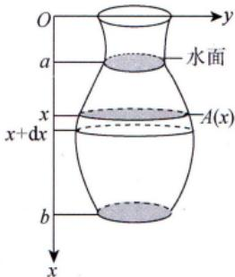

功的微元 $\mathrm{d}W = \rho g x A(x) \mathrm{d}x$ 为位于x处厚度为dx，水平截面面积为A(x)的一层水被抽出（路程为x)所做的功.

图 12-2

求解这类问题的关键是确定x处的水平截面面积 $A(x)$ ，其余的量都是固定的.

$\mathrm{d}W = \rho g A(x) \mathrm{d}x = \rho g A(x) \cdot x \mathrm{d}x$

例12.2有一倒圆锥形容器，高为 $a$ ，上底半径为b，装满水.记水的密度为 $\rho$ ，重力加速度为g，则将容器中的水全部从容器顶部抽出所做的功为

分析①建立坐标系（对称、高为正）；

②取微元 $\mathrm{d}W = \rho g A(x) x \mathrm{d}x$

$$
\frac{\frac{1}{\sqrt{b}}}{a \cdot \frac{(a - x)^2 b^2}{a^2}}
$$

③积分 $W = \int_{0}^{a} \rho g \pi x \frac{(a - x)^2 b^2}{a^2}   dx$

解应填 $\frac{1}{12} \rho g a^{2} b^{2} \pi$

如图12-3所示，建立坐标系.在x处的水平截面的半径r满足 $\frac{r}{b}=\frac{a-x}{a}$ ，即

$$
r = \frac{b(a - x)}{a}
$$

截面面积

$$
A(x)=\pi r^{2}=\pi\cdot\left[\frac{b(a-x)}{a}\right]^{2}=\frac{b^{2}(a-x)^{2}\pi}{a^{2}}
$$

所以将水全部抽出所做的功

$$
\begin{aligned}W = \rho g \int_{0}^{a} x A(x) \mathrm{d}x = \rho g \int_{0}^{a} x \frac{b^{2}(a - x)^{2} \pi}{a^{2}} \mathrm{d}x , \\= \frac{1}{12} \rho g a^{2} b^{2} \pi .\end{aligned}
$$

  
图 12-3

## 第12讲 一元函数积分学的应用（三）——物理应用与经济应用

→默认不流动水给的压力为静水压力

## ③静水压力（水压力）

垂直浸没在水中的平板ABCD(见图12-4)的一侧受到的水压力为

$$
P = \rho g \int _ { a } ^ { b } x [ f ( x ) - h ( x ) ] \mathrm { d } x ,
$$

其中 $\rho$ 为水的密度，g为重力加速度

压力微元 $\mathrm{d}P = \rho g x [ f(x) - h(x) ] \mathrm{d}x$ ，即图中矩形条所受到的压力.x表示水深， $f(x) - h(x)$ 是矩形条的宽度，dx是矩形条的高度.

  
图 12-4

注水压力问题的特点：压强随水的深度的改变而改变.求解这类问题的关键是确定水深x处的平板的宽度 $f(x) - h(x)$

例12.3斜边长为2a的等腰直角三角形平板铅直地沉没在水中，且斜边与水面相齐.记重力加速度为g，水的密度为 $\rho$ ，则该平板一侧所受的水压力为

分析建系、取微元、再积分即可.

解应填 $\frac{1}{3}a^{3}\rho g$

如图12-5所示，该平板一侧所受的水压力为

$$
P = \int_{0}^{a} 2 \rho g ( a - y ) y \mathrm{d}y = 2 \rho g \int_{0}^{a} ( a y - y ^ { 2 } ) \mathrm{d}y = 2 \rho g \left( \frac{a ^ { 3 } } { 2 } - \frac{a ^ { 3 } } { 3 } \right) = \frac{1}{3} a ^ { 3 } \rho g .
$$

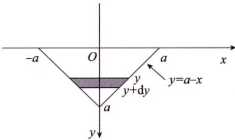  
图 12-5

## 4引力

设有一长度为l、线密度为常数 $\mu$ 的细棒，在与细棒右端的距离为a处有一质量为m的质点M（见图12-6），已知引力常量为G，则质点M与细棒之间的引力的大小为 $\int_{-l}^{0} \frac{G m \mu}{(a-x)^2}   dx$

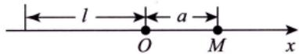  
图 12-6

## “三心”的概念

首先，要知道质心、重心与形心的概念.

质心是指物体的质量分布中心，是物体的固有特性.

重心是指物体所受地球引力的重力分布中心，依赖于重力场，在均匀重力场下，重心与质心重合，在非均匀重力场下，重心一般不是质心.

形心是指几何图形的分布中心，是固有几何量.当物体密度为常数时，物体质心与其几何体形心重合.

故在满足均匀重力场及均质条件下，重心、质心、形心三心重合.

## 2 质心计算公式与力矩计算公式

先考虑一个简单情形.

如图12-7(a)所示，设 $x _ { 1 }$ 处质量为 $m_{1} \text { , } x_{2}$ 处质量为 $m _ { 2 }$ ，问x为何值时，系统平衡？

显然，由力矩相等，有 $( \overline { x } - x _ { 1 } ) m _ { 1 } g = ( x _ { 2 } - \overline { x } ) m _ { 2 } g$ ，得

$$
\bar{x} = \frac{x_{1}m_{1} + x_{2}m_{2}}{m_{1} + m_{2}}
$$

推广至二维平面上有n个质点的情形，如图12-7(b)所示，有

$$
\bar{x} = \frac{\sum\limits_{i = 1}^{n} x_{i} m_{i}}{\sum\limits_{i = 1}^{n} m_{i}} , \bar{y} = \frac{\sum\limits_{i = 1}^{n} y_{i} m_{i}}{\sum\limits_{i = 1}^{n} m_{i}} ,
$$

其中， $M_{y}=\sum_{i = 1}^{n}x_{i}m_{i}$ 刻画系统绕y轴旋转的趋势大小，称为力矩. $M _ { x }$ 同理可解释.

  
(b)  
图 12-7

进一步地，如图12-8(a)所示，质量系统对任一条直线 $L_{0}:ax+by+c=0$ 的力矩为

$$
M_{L_{0}}=\sum_{i = 1}^{n}r_{i}m_{i}=\sum_{i = 1}^{n}\frac{\left | ax_{i}+by_{i}+c \right | }{\sqrt{a^{2}+b^{2}}}m_{i}
$$

当质量系统为连续可求长曲线段L： $y = f(x)$ 时，如图12-8(b)所示，有

$$
\Delta m _ { i } = \rho ( \xi _ { i } ) \Delta s _ { i } , \Delta M _ { i L _ { 0 } } = r _ { i } \rho ( \xi _ { i } ) \Delta s _ { i } ,
$$

故总力矩为

$$
\begin{align*}M_{L_0} = \lim_{n \to \infty} \sum_{i=1}^n \Delta M_{iL_0} = \lim_{n \to \infty} \sum_{i=1}^n r_i \rho(\xi_i) \Delta s_i = \int_a^b \frac{\left| ax + by + c \right|}{\sqrt{a^2 + b^2}} \rho(x) \mathrm{d}s, \\= \int_a^b \frac{\left| ax + by + c \right|}{\sqrt{a^2 + b^2}} \rho(x) \sqrt{1 + \left[ f'(x) \right]^2} \mathrm{d}x .\end{align*}\tag{12-1}
$$

当 $\rho =$ 常数时，则有

$$
r ( \bar { x } , \bar { y } ) = \frac { M _ { L _ { 0 } } } { M } = \frac { \int _ { a } ^ { b } \left| \frac { a x + b y + c } { \sqrt { a ^ { 2 } + b ^ { 2 } } } \sqrt { 1 + \left[ f ^ { \prime } ( x ) \right] ^ { 2 } } \mathrm { d } x \right. } { \int _ { a } ^ { b } \sqrt { 1 + \left[ f ^ { \prime } ( x ) \right] ^ { 2 } } \mathrm { d } x } ,\tag{12-2}
$$

其中 $r(\overline{x}   ,   \overline{y})$ 指形心(x，y)到直线 $L _ { 0 }$ 的距离.

  
(a)

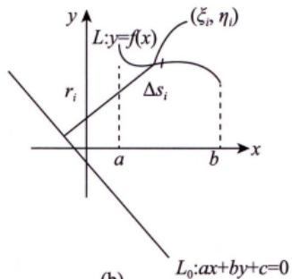  
(b)  
图 12-8

## 3 古鲁金第一定理

如图12-9所示，将曲线段L任意切分成n段， $\Delta s_{i}(i = 1,2,\cdots,n)$ 为每一小段的长度，在 $\Delta s _ { i }$ 上任取一点 $(\xi_{i}, \eta_{i})$ ，记 $\lambda = \max_{i} \{ \Delta s_{i} \}$ ，则 $\Delta s _ { i }$ 绕直线 $L _ { 0 }$ 旋转一周的侧面积为

$$
\Delta A_{i} = 2 \pi r_{i} \Delta s_{i} = 2 \pi \cdot \frac{\left| a \xi_{i} + b \eta_{i} + c \right|}{\sqrt{a^{2} + b^{2}}} \Delta s_{i}
$$

故曲线段L绕直线 $L _ { 0 }$ 旋转一周的侧面积为

$$
\begin{aligned}A = & \lim_{\lambda \rightarrow 0} \sum_{i = 1}^{n} \Delta A_{i} = \lim_{\lambda \rightarrow 0} 2\pi \cdot \frac{\left| a\xi_{i} + b\eta_{i} + c \right|}{\sqrt{a^{2} + b^{2}}} \Delta s_{i} \\= & \int_{a}^{b} 2\pi \cdot \frac{\left| ax + by + c \right|}{\sqrt{a^{2} + b^{2}}} \sqrt{1 + \left[ f^{\prime}(x) \right]^{2}}   dx .\end{aligned}\tag{12-3}
$$

与公式(12-2)比较，得

$$
r(\bar{x}, \bar{y}) = \frac{M_{L_0}}{M} = \frac{2\pi M_{L_0}}{2\pi M} = \frac{A}{2\pi \bullet l},
$$

即

  
图 12-9

如图12-10所示，当质量系统为连续可求面积的平面有界闭区域时，有

$$
\Delta M _ { i } = \rho ( \xi _ { i } , \eta _ { i } ) \Delta \sigma _ { i } , \Delta M _ { i L _ { 0 } } = r _ { i } \rho ( \xi _ { i } , \eta _ { i } ) \Delta \sigma _ { i } ,
$$

记 $\lambda = \max_{i} \{ \Delta \sigma_{i} \}$ ，则总力矩为

$$
\begin{align*}M_{I_0} = \lim_{\lambda \to 0} \sum_{i=1}^n \Delta M_{I_0} = \lim_{\lambda \to 0} \sum_{i=1}^n r_i \rho(\xi_i, \eta_i) \Delta \sigma_i = \iint_D r(x, y) \rho(x, y) \mathrm{d}\sigma \\= \iint_D \frac{|ax + by + c|}{\sqrt{a^2 + b^2}} \rho(x, y) \mathrm{d}\sigma .\end{align*}\tag{12-4}
$$

当ρ=常数时，则有

$$
r ( \bar { x } , \bar { y } ) = \frac { M _ { L _ { 0 } } } { M } = \frac { \iint \limits _ { D } \frac { \left| a x + b y + c \right| } { \sqrt { a ^ { 2 } + b ^ { 2 } } } \mathrm { d } \sigma } { \iint \limits _ { D } \mathrm { d } \sigma } ,\tag{12-5}
$$

其中 $r(\overline{x},   \overline{y})$ 为形心(x，y)到直线L的距离.

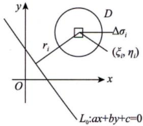  
图 12-10

注注例曲线 $x^{2} + y^{2} = 1$ 绕直线x=2旋转一周所成的旋转体的表面积为解 由古鲁金第一定理，有 y

$$
\begin{aligned}A &= 2\pi \cdot l \cdot \frac{r(\bar{x}, \bar{y})}{\left| \right|} \\&= 2\pi \cdot 2\pi \cdot 2 = 8\pi^{2}\end{aligned}
$$

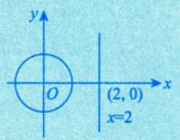

①总成本 C(Q)，边际成本 C'(Q)，固定成本 $C _ { 0 }$ 之间的关系为

$$
C ( Q ) = \int _ { 0 } ^ { Q } C ^ { \prime } ( t ) \mathrm { d } t + C _ { 0 } .
$$

②总收益R(Q)与边际收益R'(Q)之间的关系为

牛顿—莱布尼茨公式

$$
R(Q)=\int_{0}^{Q}R^{\prime}(t)\mathrm{d}t
$$

$\overline{y} = \frac{1}{b - a}\int_{a}^{b}f(x)\mathrm{d}x$ →经济量

例12.4 已知某产品的边际成本为 $4 + \frac{x}{4}$ (万元/单位)，固定成本为1万元，产品对价格的需求弹性为 $\frac{p}{8 - p}, p > 0$ ，产品最大需求量为8，其中x表示产量，p表示价格，求使产品取最大利润时的产量和价格.

分析翻译成数学语言+引入记号： $\left\{ \begin{aligned} C^{\prime}(x) &= 4 + \frac{x}{4}, \quad C(0) = 1, \\ -\frac{\mathrm{d}x}{\mathrm{d}p} &\cdot \frac{p}{x} = \frac{p}{8 - p}, \quad x(0) = 8. \end{aligned} \right.$

解由 $C^{\prime}(x)=4+\frac{x}{4},C(0)=1$ ，可得

$$
C(x)=\int_{0}^{x}C^{\prime}(t)dt+C(0)=4x+\frac{x^{2}}{8}+1
$$

又 $\eta_{0}=\frac{-p\mathrm{d}x}{x\mathrm{d}p}=\frac{p}{8-p}$ (注意：由经济意义知 $\frac{p}{8 - p} > 0$ ，故 $\frac{\mathrm{d}x}{x} = \frac{\mathrm{d}p}{p - 8}$ ，可得

$$
\ln |x| = \ln |p - 8| + \ln c
$$

由x(0)=8可得c =1.所以 $x = 8 - p, \quad R(x) = 8x - x^2$ .故

$$
\begin{aligned}L(x) &= R(x) - C(x) = (8x - x^2) - \left(4x + \frac{x^2}{8} + 1\right) \\&= -\frac{9}{8}x^2 + 4x - 1 .\end{aligned}
$$

区 $L^{\prime}(x) = 4 - \frac{9}{4}x = 0$ ，可得 $x_{0}=\frac{16}{9}$

因为 $L''(x) = -\frac{9}{4} < 0$ ，所以 $x_{0}=\frac{16}{9}$ 为最大值点，这时 $p = 8 - x_{0} = \frac{56}{9}$ .故当产量为 $\frac{16}{9}$ 个单位，价格为 $\frac{56}{9}$ 万元时，利润最大.

## 基础习题精练

## 习题

12.1（仅数学一、数学二)由曲线 $y = f_{1}(x), \; y = f_{2}(x)$ 及直线  
$x = a, x = b(a < b)$ 所围成的平面板铅直地没入容重为 $r(r = \rho g$ ，表示  
单位体积液体的重力）的液体中，x轴铅直向下，液面与y轴重合，如  
图12-11所示，平面板所受液压力为（）.(A) $\int _ { a } ^ { b } x [ f _ { 2 } ( x ) - f _ { 1 } ( x ) ] \mathrm { d } x$ (B) $\int _ { a } ^ { b } r x [ f _ { 1 } ( x ) - f _ { 2 } ( x ) ] \mathrm { d } x$ (C) $\int _ { a } ^ { b } r [ f _ { 2 } ( x ) - f _ { 1 } ( x ) ] \mathrm { d } x$ (D) $\int _ { a } ^ { b } r x [ f _ { 2 } ( x ) - f _ { 1 } ( x ) ] \mathrm { d } x$

  
图 12-11

12.2（仅数学三)当某商品销售量为a时，边际收入为 $R^{\prime}(a)=200-\frac{a}{50}$ ，则销售量为2000时的平均单位收入为

12.3（仅数学一、数学二)有一半径为4m的半球形水池蓄满了水，现在要将水全部抽到距水池原水面6m高的水箱中，求需做多少功.(水的密度 $\rho = 1000   kg/m ^3$ ，重力加速度 $g = 9.8    m/s ^2 , \pi = 3.14$

12.4(仅数学三)设某商品的最大需求量为1200件，该商品的需求函数 $Q = Q(p)$ ，需求弹性$\eta = \frac{p}{120 - p} (\eta > 0)$ ，p为单价(单位：万元).

(1) 求需求函数的表达式;

(2)求 $p = 100$ 万元时的边际收益，并说明其经济意义

## 解答

12.1 (D) 解 由图 12-12 可知，在 $\left[ x , x + \mathrm{d}x \right]$ 上液体对阴影部分的压力微元为

$$
r x [ f _ { 2 } ( x ) - f _ { 1 } ( x ) ] \mathrm { d } x .
$$

因此平面板所受液压力为

  
图 12-12

$$
F = \int _ { a } ^ { b } r x [ f _ { 2 } ( x ) - f _ { 1 } ( x ) ] \mathrm { d } x .
$$

故选(D).

12.2 180 解 由题意可得，

$$
\bar{R} = \frac{1}{2\ 000}\int_{0}^{2000}\left(200 - \frac{a}{50}\right)\mathrm{d}a = \frac{1}{2\ 000}\left(200a - \frac{a^{2}}{100}\right)_{0}^{2000} = 180
$$

12.3 解 如图12-13所示，建立坐标系.在y处的水面面积为

$$
\pi ( 4 ^ { 2 } - y ^ { 2 } ) = \pi ( 1 6 - y ^ { 2 } ) ,
$$

在区间 $\left[ y , y + \mathrm{d}y \right]$ 上的体积微元为

$$
\pi(16 - y^{2})\mathrm{d}y,
$$

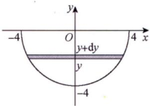

提升此体积微元的水所需要的力的微元为

$$
\rho g \pi ( 1 6 - y ^ { 2 } ) \mathrm { d } y ,
$$

图 12-13

其中 $\rho = 1000    kg/m ^3, \quad g = 9.8    m/s ^2, \quad \pi = 3.14$ .提升到距原水面6m高处等于提升距离为 $(6 - y) \mathrm{m}$ ，从而提升此微元的水需做功的微元为

$$
(6 - y) \rho g \pi (16 - y^2) \mathrm{d}y
$$

所以将水全部提升至原水面上方6m处需做功为

$$
W = \int_{-4}^{0} (6 - y) \rho g \pi (16 - y^2)   dy = 320 \pi \rho g \approx 9847 ( kJ ) .
$$

12.4 解 (1) 由题设

$$
-\frac{p}{Q}Q'=\frac{p}{120-p},
$$

所以 $\int \frac{\mathrm{d}Q}{Q} = - \int \frac{1}{120 - p}   \mathrm{d}p$ ，可得 $\ln Q = \ln(120 - p) + \ln C$ ，即 $Q = C(120 - p)$

又最大需求量为1200件，故C=10，所以需求函数 $Q = 1200 - 10p$

(2)由(1)知，收益函数 $R = 120Q - \frac{1}{10}Q^2$ ，边际收益 $R^{\prime}(Q)=120-\frac{1}{5}Q$

当 $p = 100$ 时， $Q = 200$ ，故当 $p = 100$ 万元时的边际收益 $R^{\prime}(200) = 80$ .其经济意义：当销售量为200时，再增加一个单位的销售量，商品所得收益增加80万元.

↓ ①联系联想与一元的 形式②区别本质

<table><tr><td>考题</td><td>连续、可微、隐函数存在定理、极值与最值</td></tr><tr><td>题型</td><td>选择题、填空题、解答题</td></tr><tr><td>目标</td><td>①会求全微分，了解全微分存在的必要条件和充分条件，了解全微分形式不变性，了解隐函数 存在定理，会求多元隐函数的偏导数； ②了解二元函数的二阶泰勒公式（仅数学一）； ③掌握多元函数极值存在的必要条件，了解二元函数极值存在的充分条件，会求二元函数的极 值，会用拉格朗日乘数法求条件极值，会求简单多元函数的最大值和最小值，并会解决一些简 单的应用问题</td></tr><tr><td>重难点</td><td>①可微的判断；②条件最值与拉格朗日乘数法</td></tr></table>

## 基础知识结构

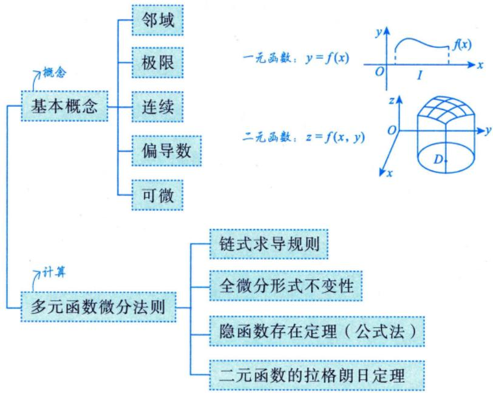

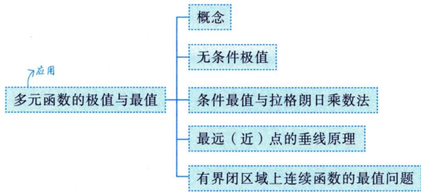

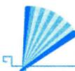

## 基础内容精讲

## 基本概念

## 1邻域

δ邻域设 $P_{0}(x_{0},y_{0})$ 是xOy平面上的一个点，δ是某一正数.与点$P_{0}(x_{0},y_{0})$ 的距离小于δ的点 $P(x,   y)$ 的全体，称为点 $P _ { 0 }$ 的δ邻域（见图13-1），记为 $U(P_{0},\delta)$ ，即

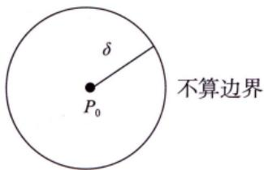  
图 13-1

$$
U(P_{0},\delta)=\left\{ P \mid \left| P P_{0} \right| < \delta \right\} 或 U(P_{0},\delta)=\left\{ (x, y) \mid \sqrt{\left( x-x_{0} \right)^{2}+\left( y-y_{0} \right)^{2}} < \delta \right\}
$$

去心δ邻域点 $P _ { 0 }$ 的去心δ邻域（见图13-2），记作 $\stackrel{\circ}{U}(P_{0},\delta)$ ，即$U(P_{0},\delta)=\left\{P\left|0<\left|PP_{0}\right|<\delta\right.\right\}$

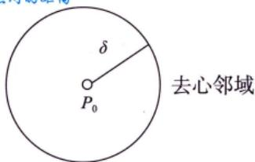

特别指出，如果不需要强调邻域的半径 $\delta$ ，则用 $U ( P _ { 0 } )$ 表示点 $P _ { 0 }$ 的某个邻域，点 $P _ { 0 }$ 的去心邻域记作 $\stackrel{\circ}{U}(P_{0})$

图 13-2

δ邻域的几何意义 $U(P_{0},\delta)$ 表示 $x O y$ 平面上以点 $P_{0}(x_{0},y_{0})$ 为中心， $\delta > 0$ 为半径的圆内部的点$P(x,   y)$ 的全体.一元极限：limf(x)=A ⇔∀ε>0,3δ>0,0<|x−x0|<δ时，|f(x)−A|<ε—此刻画f(x)与A充分靠近 x→I0

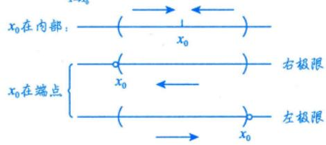

## 2 极限

设函数f(x,y)在区域D上有定义， $P_{0}(x_{0}, y_{0}) \in D$ 或为区域D边界上的一点.如果对于任意给定的$\varepsilon > 0$ ，总存在 $\delta > 0$ ，当点 $P(x, y) \in D$ ，且满足 $0 < \left| P P _ { 0 } \right| = \sqrt { \left( x - x _ { 0 } \right) ^ { 2 } + \left( y - y _ { 0 } \right) ^ { 2 } } < \delta$ 时，恒有

$$
\left| f(x, y) - A \right| < \varepsilon   ,
$$

则称常数A为 $(x, y) \to (x_0, y_0)$ 时f(x，y)的极限，记作

也常记作

$$
\begin{aligned}\lim\limits_{(x, y) \to (x_0, y_0)} f(x, y) &= A  或  \left| \lim\limits_{\substack{x \to x_0 \\ y \to y_0}} \frac{f(x, y) = A}{} \right|, \\\lim\limits_{P \to P_0} f(P) &= A.\end{aligned}
$$

注(1)一元极限中 $x \to x_{0}$ 有且仅有两种方式 $x \rightarrow x_{0}^{-}$ 和 $x \rightarrow x_{0}^{+}$ ，二重极限中 $(x, y) \to (x_0, y_0)$ 一般有无穷多种方式，如图13-3所示.

  
图13-3

→否定存在

★ (2) 若有两条不同路径使极限 $\lim _ { ( x , y ) \rightarrow ( x _ { 0 } , y _ { 0 } ) } f ( x , y )$ 的值不相等或某一路径使极限 $\lim _ { ( x , y ) \rightarrow ( x _ { 0 } , y _ { 0 } ) } f ( x , y )$ 的值不存在，则说明 $\lim _ { ( x , y ) \rightarrow ( x _ { 0 } , y _ { 0 } ) } f ( x , y )$ 不存在.（根据极限若存在，则必具有唯一性这一准则去判断.)

→肯定存在

★(3)除洛必达法则和单调有界准则外，可照搬一元函数求极限的方法来求二重极限，重极限保持了一元极限的各种性质，如唯一性、局部有界性、局部保号性、运算规则及脱帽法：$\lim _ { ( x , y ) \rightarrow ( x _ { 0 } , y _ { 0 } ) } f ( x , y ) = A \Leftrightarrow f ( x , y ) = A + \alpha$ 其中当 $(x, y) \to (x_0, y_0)$ 时，α是无穷小量.

一元脱帽法：limm $f(x)=A \Leftrightarrow f(x)=A+\alpha,\lim_{x \to x_0} \alpha = 0$

等价替换法： $\mathrm{e}^{x^{2}+y^{2}}-1\sim x^{2}+y^{2}\quad(x,\ y)\to(0,\ 0).$

例13.1 设 $\lim_{\substack{x \to 0 \\ y \to 0}} \frac{|xy|}{\sqrt{x^2 + y^2}}, \quad I_2 = \lim_{\substack{x \to 0 \\ y \to 0}} \frac{|xy|}{x^2 + y^2}$ ，则（）.

(A) $I _ { 1 }$ 存在， $I _ { z }$ 不存在 (B) $I _ { 1 }$ 存在， $I _ { 2 }$ 存在

(C) $I _ { 1 }$ 不存在， $I _ { 2 }$ 存在 (D) $I _ { 1 }$ 不存在， $I _ { 2 }$ 不存在

分析 $I _ { 1 }$ ：分子次数为2，分母次数为1.
