## 第17讲

## 多元函数积分学的预备知识（仅数学一）

<table><tr><td rowspan=1 colspan=1>考题</td><td rowspan=1 colspan=1>空间曲线与曲面方程、曲线切线与法平面、曲面切平面与法线的求解，散度与旋度的概念、方向导数和梯度的计算</td></tr><tr><td rowspan=1 colspan=1>题型</td><td rowspan=1 colspan=1>选择题、填空题</td></tr><tr><td rowspan=1 colspan=1>目标</td><td rowspan=1 colspan=1>①会计算空间曲线与曲面的方程，会求曲线的切线与法平面、曲面的切平面与法线；②了解散度与旋度的概念，并会计算方向导数和梯度</td></tr><tr><td rowspan=1 colspan=1>重难点</td><td rowspan=1 colspan=1>空间曲线与曲面方程的求解</td></tr></table>

## 基础知识结构

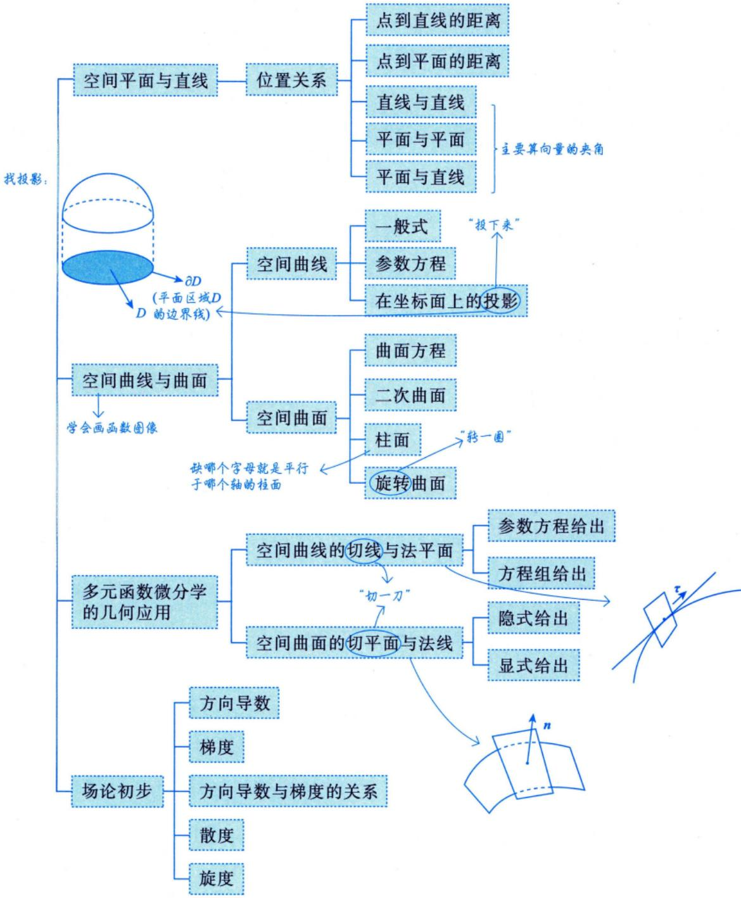

## 向量及其表达形式

既有大小又有方向的量称为向量.

注两个向量，只要它们的大小相等、方向相同，它们就是相等的向量，与它们在空间中的位置无关（这也称为向量的自由性).

向量的表达形式为

$$
\boldsymbol{a} = (a_{x}, a_{y}, a_{z}) = a_{x}\boldsymbol{i} + a_{y}\boldsymbol{j} + a_{z}\boldsymbol{k}
$$

→高等数学中手写要打箭头：a.

## 2向量的运算及其应用

设 $\boldsymbol{a} = (a_{x}, a_{y}, a_{z}), \boldsymbol{b} = (b_{x}, b_{y}, b_{z}), \boldsymbol{c} = (c_{x}, c_{y}, c_{z}), \boldsymbol{a}, \boldsymbol{b}, \boldsymbol{c}$ 均是非零向量.

线性代数中不需要。 $a = \begin{bmatrix} 1 \\ 1 \\ 2 \end{bmatrix}$

(1)数量积(内积、点积)及其应用.

→结果是数

① $\boldsymbol{a} \cdot \boldsymbol{b} = (a_{x}, a_{y}, a_{z}) \cdot (b_{x}, b_{y}, b_{z}) = a_{x}b_{x} + a_{y}b_{y} + a_{z}b_{z}$

可以用此公式反求买用② $\boldsymbol{a} \cdot \boldsymbol{b} = |\boldsymbol{a}| |\boldsymbol{b}| \cos \theta$ ，则 $\cos \theta = \frac{\boldsymbol{a} \cdot \boldsymbol{b}}{\left| \boldsymbol{a} \right| \left| \boldsymbol{b} \right|} = \frac{a_{x}b_{x} + a_{y}b_{y} + a_{z}b_{z}}{\sqrt{a_{x}^{2} + a_{y}^{2} + a_{z}^{2}} \cdot \sqrt{b_{x}^{2} + b_{y}^{2} + b_{z}^{2}}}$ ，其中θ为a，b的夹角.

7天③ $\boldsymbol{a} \perp \boldsymbol{b} \Leftrightarrow \boldsymbol{\theta}=\frac{\pi}{2} \Leftrightarrow \boldsymbol{a} \cdot \boldsymbol{b}=|\boldsymbol{a}| |\boldsymbol{b}| \cos \theta=0 \Leftrightarrow \left|\frac{a_{x} b_{x}+a_{y} b_{y}+a_{z} b_{z}=0}{}\right|$ ·垂直方程最常用

例：若(1，2，1)与(a，1，-1)垂直，则a+2-1=0，即a=-1

=la|cosθ④ $\frac{\left| \mathrm{Prj}_{b} \boldsymbol{a} \right|}{\left| \boldsymbol{b} \right|} = \frac{\boldsymbol{a} \cdot \boldsymbol{b}}{\left| \boldsymbol{b} \right|} = \frac{a_{x} b_{x} + a_{y} b_{y} + a_{z} b_{z}}{\sqrt{b_{x}^{2} + b_{y}^{2} + b_{z}^{2}}}$ ，称为a在b上的投影.

(2)向量积(外积、叉积)及其应用.

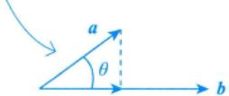

① $\boldsymbol{a} \times \boldsymbol{b} = \begin{vmatrix} \boldsymbol{i} & \boldsymbol{j} & \boldsymbol{k} \\ a_{_x} & a_{_y} & a_{_z} \\ b_{_x} & b_{_y} & b_{_z} \end{vmatrix}$ ，其中 $| \boldsymbol{a} \times \boldsymbol{b} | = | \boldsymbol{a} | | \boldsymbol{b} | \sin \theta$ ，用右手规则确定方向(转向角不超过π)，θ为a,b b

的夹角.

②a $\sqrt{b} \Leftrightarrow \theta = 0$ 或 $\boxed{\pi} \Leftrightarrow \boxed{\frac{a_{x}}{b_{x}} = \frac{a_{y}}{b_{y}} = \frac{a_{z}}{b_{z}}}$

(3) 混合积及其应用.

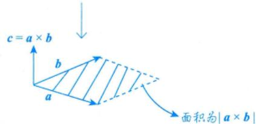

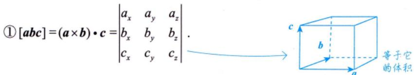

② $\begin{vmatrix} a_{_x} & a_{_y} & a_{_z} \\ b_{_x} & b_{_y} & b_{_z} \\ c_{_x} & c_{_y} & c_{_z} \end{vmatrix} = 0 \Leftrightarrow$ 三向量共面：

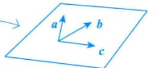

## ③向量的方向角和方向余弦

(1)非零向量a与x轴、y轴和z轴正向的夹角α，β，γ称为a的方向角.

(2) $\cos \alpha , \cos \beta , \cos \gamma$ 称为a的方向余弦，且 $\cos \alpha = \frac{a_{x}}{\left | \boldsymbol{a} \right | }, \cos \beta = \frac{a_{y}}{\left | \boldsymbol{a} \right | }, \cos \gamma = \frac{a_{z}}{\left | \boldsymbol{a} \right | }$

(3) $\boldsymbol{a}^{*} = \frac{\boldsymbol{a}}{\left | \boldsymbol{a} \right | } = \left ( \cos \alpha , \cos \beta , \cos \gamma \right )$ 称为向量a的单位向量(表示方向的向量).

(4)任意向量 $\boldsymbol{r} = x\boldsymbol{i} + y\boldsymbol{j} + z\boldsymbol{k} = (r\cos\alpha, r\cos\beta, r\cos\gamma) = r(\cos\alpha, \cos\beta, \cos\gamma)$ ，其中 $\cos \alpha, \cos \beta$ cosγ为r的方向余弦，r为r的模， $\cos \alpha = \frac{x}{\sqrt{x^{2} + y^{2} + z^{2}}} , \cos \beta = \frac{y}{\sqrt{x^{2} + y^{2} + z^{2}}} , \cos \gamma = \frac{z}{\sqrt{x^{2} + y^{2} + z^{2}}} ,$ $r = \sqrt{x^{2} + y^{2} + z^{2}}$ $\cos ^{2}\alpha +\cos ^{2}\beta +\cos ^{2}\gamma =1$

例 $a = (1,1,2) , \left| a \right| = \sqrt{1^{2} + 1^{2} + 2^{2}} = \sqrt{6}$

$$
f(0,0)=0
$$

$$
a^{*} = \left( \frac{1}{\sqrt{6}}, \frac{1}{\sqrt{6}}, \frac{2}{\sqrt{6}} \right)
$$

$\boldsymbol{n} = \left( \frac{\partial f}{\partial x}, \frac{\partial f}{\partial y}, -1 \right) \bigg|_{(0,0)}$ ，则lim $\frac{n \cdot (x, y, f(x, y))}{\sqrt{x^2 + y^2}}$ (x, y)→(0, 0)

分析可微： $\Delta z - \mathrm{d}z = o(\rho)$

解应填0.

因为f(x，y)在点(0,0)处可微，且f(0,0)=0，所以

$$
f(x,y)=f(x,y)-f(0,0)=\left.\frac{\partial f}{\partial x}\right|_{(0,0)}(x-0)+\left.\frac{\partial f}{\partial y}\right|_{(0,0)}(y-0)+o\left(\sqrt{x^2+y^2}\right),
$$

故 $\left. \frac { \partial f } { \partial x } \right| _ { ( 0 , 0 ) } x + \left. \frac { \partial f } { \partial y } \right| _ { ( 0 , 0 ) } y - f ( x , y ) = o \left( \sqrt { x ^ { 2 } + y ^ { 2 } } \right)$ ，即

$$
\frac{\partial f\bigg|_{(0,0)}x+\frac{\partial f}{\partial y}\bigg|_{(0,0)}y-f(x,y)}{\sqrt{x^{2}+y^{2}}}=0
$$

因为 $\boldsymbol{n} = \left( \frac{\partial f}{\partial x}, \frac{\partial f}{\partial y}, -1 \right) \bigg|_{(0,0)}$ ，所以 $\boldsymbol { n } \cdot ( x , y , f ( x , y ) ) = \left. \frac { \partial f } { \partial x } \right| _ { ( 0 , 0 ) } x + \left. \frac { \partial f } { \partial y } \right| _ { ( 0 , 0 ) } y - f ( x , y ) .$ ，从而0,0)

$$
\lim _ { ( x , y ) \rightarrow ( 0 , 0 ) } \frac { n \cdot ( x , y , f ( x , y ) ) } { \sqrt { x ^ { 2 } + y ^ { 2 } } } = 0 .
$$

## 空间平面与直线

## 平面方程

以下假设平面的法向量n=(A,B，C)

法向量 $\boldsymbol{n} = (A, B, C)$，确定平面的两要素：平面上一点 $P_0(x_0, y_0, z_0)$ 与法向量 $\boldsymbol{n}$.

①一般式： $Ax + By + Cz + D = 0$

$$
\overrightarrow{P_{0}P}=\left(x-x_{0}, y-y_{0}, z-z_{0}\right), \quad  由  \overrightarrow{P_{0}P} \perp \boldsymbol{n} \Rightarrow\left(\overrightarrow{P_{0}P}, \boldsymbol{n}\right)=0 ,
$$

即 $A(x - x_{0}) + B(y - y_{0}) + C(z - z_{0}) = 0$

将点法式展开，记 $D_{1}=Ax_{0}+By_{0}+Cz_{0}$ ，则得到一般式的形式

②点法式： $A(x - x_{0}) + B(y - y_{0}) + C(z - z_{0}) = 0$

③三点式： $$\begin{vmatrix} x - x_{1} & y - y_{1} & z - z_{1} \\ x - x_{2} & y - y_{2} & z - z_{2} \\ x - x_{3} & y - y_{3} & z - z_{3} \end{vmatrix} = 0$$ (平面过不共线的三点 $P_{i}(x_{i},y_{i},z_{i}),i=1,2,3$ 常用）

三点连线构成一个平面

④截距式： $\frac{x}{a} + \frac{y}{b} + \frac{z}{c} = 1$ (平面过(a,0,0),(0,b,0)，(0,0,c)三点).

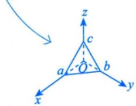

⑤平面束方程：设 $\pi _ { i } : A _ { i } x + B _ { i } y + C _ { i } z + D _ { i } = 0 , i = 1 , 2 . A _ { 1 } , B _ { 1 } , C _ { 1 }$ 与 $A_{2}, B_{2}, C_{2}$ 不成比例，则 过L: $\begin{cases}A_{1}x + B_{1}y + C_{1}z + D_{1} = 0, \\A_{2}x + B_{2}y + C_{2}z + D_{2} = 0.\end{cases}$ 的平面束方程为

(交面式方程)

$$
A_{1}x + B_{1}y + C_{1}z + D_{1} + \lambda(A_{2}x + B_{2}y + C_{2}z + D_{2}) = 0
$$

或

$$
A_{2}x + B_{2}y + C_{2}z + D_{2} + \lambda(A_{1}x + B_{1}y + C_{1}z + D_{1}) = 0
$$

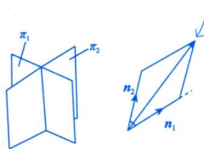

π1， $\pi _ { 2 }$ 的法向量分别为 $n_{1} = \left( A_{1}, B_{1}, C_{1} \right), \quad n_{2} = \left( A_{2}, B_{2}, C_{2} \right)$

$\lambda n_{1} + \mu n_{2}$ 生成整个平面，

$\lambda ( A _ { 1 } x + B _ { 1 } y + C _ { 1 } z + D _ { 1 } ) + \mu ( A _ { 2 } x + B _ { 2 } y + C _ { 2 } z + D _ { 2 } ) = 0$ 表示过交线的所有平面。

令λ=1，则不包含 $\pi_{2} , \mathrm{令} \mu = 1$ ，则不包含 $\pi _ { \parallel }$

## 2直线方程

以下假设直线的方向向量 $\boldsymbol{\tau} = (l, m, n)$

①一般式： $\left\{ \begin{aligned} A_{1}x + B_{1}y + C_{1}z + D_{1} = 0, \quad \boldsymbol{n}_{1} = (A_{1}, B_{1}, C_{1}), \\ A_{2}x + B_{2}y + C_{2}z + D_{2} = 0, \quad \boldsymbol{n}_{2} = (A_{2}, B_{2}, C_{2}) \end{aligned} \right.$ 其中 $n _ { 1 }$ 不平行于 $n _ { 2 }$ (交面式方程)

## 注其几何背景很直观，是两个平面的交线，且该直线的方向向量 $\tau = \boldsymbol{n}_{1} \times \boldsymbol{n}_{2}$

方向向量τ②点向式： $\frac{x - x_{0}}{l} = \frac{y - y_{0}}{m} = \frac{z - z_{0}}{n}$ 二要素过一点P

$$
n _ { 1 }
$$

$$
n _ { 2 }
$$

③参数式： $\begin{cases}x = x_{0} + l t, \\y = y_{0} + m t, P_{0}(x_{0}, y_{0}, z_{0}), \\z = z_{0} + n t,\end{cases}$ 为直线上的已知点，t为参数.

④两点式： $\frac{x - x_{1}}{x_{2} - x_{1}} = \frac{y - y_{1}}{y_{2} - y_{1}} = \frac{z - z_{1}}{z_{2} - z_{1}}$ (直线过不同的两点 $P_{i}(x_{i}, y_{i}, z_{i}), i = 1, 2$ 1

## ③位置关系

(1) 点到直线的距离.

点 $M_{1}(x_{1}, y_{1}, z_{1})$ 到直线 $L:\frac{x - x_{0}}{l} = \frac{y - y_{0}}{m} = \frac{z - z_{0}}{n}$ 的距离

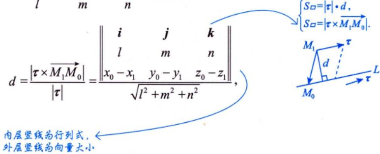

其中向量 $\overrightarrow { M _ { 1 } M _ { 0 } } = ( x _ { 0 } - x _ { 1 } , y _ { 0 } - y _ { 1 } , z _ { 0 } - z _ { 1 } ) , M _ { 0 } = ( x _ { 0 } , y _ { 0 } , z _ { 0 } ) , \boldsymbol { \tau } = ( l , m , n )$

注更为简单的是平面的情形：设在二维平面上直线L的方程为 $Ax + By + C = 0$ ，点 $P _ { 0 }$ 的坐标为$(x_{0},y_{0})$ ，则点 $P_{0}$ 到直线L的距离公式为 $d = \frac{\left| A x_{0} + B y_{0} + C \right|}{\sqrt{A^{2} + B^{2}}}$

若B≠0. $ \begin{cases} { \mathcal { S } _ { \varsquare } { = } \left| \overrightarrow { P _ { 0 } P } { \times } \tau \right| , } \\ { \mathcal { S } _ { \varsquare } { = } \left| \tau \right| { \ast } \textit { d } , } \\ \end{cases}$ 贝 $\frac{\left\| x - x_{0} \quad y - y_{0} \right\|}{\left| \frac{1}{A} - \frac{A}{B} \right|} = \frac{\left| Ax_{0} + By_{0} + C \right|}{\sqrt{A^{2} + B^{2}}}$

若 $A \ne 0,   B = 0$ ，则 $Ax + C = 0, x = -\frac{C}{A},$ 于是

综上，成立

$$
d = \left| x - x_{0} \right| = \left| x_{0} + \frac{C}{A} \right| = \frac{\left| Ax_{0} + 0y_{0} + C \right|}{\sqrt{A^{2} + 0^{2}}}
$$

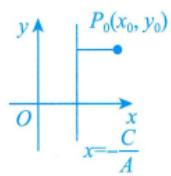

(2) 点到平面的距离.

P点 $P_{0}(x_{0},y_{0},z_{0})$ 到平面 $Ax + By + Cz + D = 0$ 的距离 $\frac{\left|Ax_{0}+By_{0}+Cz_{0}+D\right|}{\sqrt{A^{2}+B^{2}+C^{2}}}$ d(3) 直线与直线

设 $\tau _ { 1 } = ( l _ { 1 } , m _ { 1 } , n _ { 1 } ) , \tau _ { 2 } = ( l _ { 2 } , m _ { 2 } , n _ { 2 } )$ 分别为直线 $L_{1},L_{2}$ 的方向向量.

① $L_{1} \perp L_{2} \Leftrightarrow \tau_{1} \perp \tau_{2} \Leftrightarrow l_{1}l_{2} + m_{1}m_{2} + n_{1}n_{2} = 0$

② $L_{1} \parallel L_{2} \Leftrightarrow \tau_{1} \parallel \tau_{2} \Leftrightarrow \frac{l_{1}}{l_{2}} = \frac{m_{1}}{m_{2}} = \frac{n_{1}}{n_{2}}$

$$
\begin{aligned}\frac{d = \frac{\left| \overrightarrow{P_{0}P} \cdot \overrightarrow{n} \right|}{\left| \boldsymbol{n} \right|} = \frac{\left| \overrightarrow{P_{0}P} \right|\left| \boldsymbol{n} \right|\cos\theta}{\left| \boldsymbol{n} \right|}}{\left| \boldsymbol{n} \right|} \\= \frac{\left| \overrightarrow{P_{0}P} \right|\cos\theta}{\left| \boldsymbol{n} \right|} \\= \frac{\left| \boldsymbol{A}(x - x_{0}) + \boldsymbol{B}(y - y_{0}) + \boldsymbol{C}(z - z_{0}) \right|}{\sqrt{\boldsymbol{A}^{2} + \boldsymbol{B}^{2} + \boldsymbol{C}^{2}}} \\= \frac{\left| \boldsymbol{A}x_{0} + \boldsymbol{B}y_{0} + \boldsymbol{C}z_{0} + \boldsymbol{D} \right|}{\sqrt{\boldsymbol{A}^{2} + \boldsymbol{B}^{2} + \boldsymbol{C}^{2}}}\end{aligned}
$$

③直线 $L _ { 1 } , L _ { 2 }$ 的夹角 $\theta = \arccos \frac{\left| \boldsymbol{\tau}_{1} \cdot \boldsymbol{\tau}_{2} \right|}{\left| \boldsymbol{\tau}_{1} \right| \left| \boldsymbol{\tau}_{2} \right|}$ ，其中 $\theta = \min \left\{ \left( \widehat{\tau_{1}, \tau_{2}} \right), \pi - \left( \widehat{\tau_{1}, \tau_{2}} \right) \right\} \in \left[ 0, \frac{\pi}{2} \right]$

(4) 平面与平面.

设平面 $\pi_{1}, \pi_{2}$ 的法向量分别为 $\boldsymbol { n } _ { 1 } = ( A _ { 1 } , B _ { 1 } , C _ { 1 } ) , \boldsymbol { n } _ { 2 } = ( A _ { 2 } , B _ { 2 } , C _ { 2 } )$

① $\pi_{1} \perp \pi_{2} \Leftrightarrow \boldsymbol{n}_{1} \perp \boldsymbol{n}_{2} \Leftrightarrow A_{1}A_{2}+B_{1}B_{2}+C_{1}C_{2}=0$

② $\pi_{1} \parallel \pi_{2} \Leftrightarrow \boldsymbol{n}_{1} \parallel \boldsymbol{n}_{2} \Leftrightarrow \frac{A_{1}}{A_{2}} = \frac{B_{1}}{B_{2}} = \frac{C_{1}}{C_{2}}$

③平面 $\pi_{1}, \pi_{2}$ 的夹角 $\theta = \arccos \frac{\left| \boldsymbol{n}_{1} \cdot \boldsymbol{n}_{2} \right|}{\left| \boldsymbol{n}_{1} \right| \left| \boldsymbol{n}_{2} \right|}$ ，其中 $\theta = \min \left\{ \left( \widehat{n_1, n_2} \right), \pi - \left( \widehat{n_1, n_2} \right) \right\} \in \left[ 0, \frac{\pi}{2} \right]$

(5) 平面与直线.

设直线L的方向向量为 $\boldsymbol{\tau} = (l, m, n)$ ，平面π的法向量为 $\boldsymbol{n} = (A,   B,   C)$

① $L \perp \pi \Leftrightarrow \tau \parallel n \Leftrightarrow \frac{l}{A} = \frac{m}{B} = \frac{n}{C}$ 平行方程   
7

② $L \parallel \pi \Leftrightarrow \tau \perp n \Leftrightarrow Al + Br + Cn = 0$ 垂直方程

③直线L与平面π的夹角 $\theta = \arcsin \frac{ \left| \boldsymbol{\tau} \cdot \boldsymbol{n} \right| }{ \left| \boldsymbol{\tau} \right| \left| \boldsymbol{n} \right| }$ ，其中 $\theta = \left| \frac{\pi}{2} - (\widehat{\tau, n}) \right| \in \left[ 0, \frac{\pi}{2} \right]$

例17.2 与两直线

$$
\left\{ \begin{aligned} x = 1, & x = 1 + 0 \cdot t \\ y = - 1 + t, & \frac{x + 1}{1} = \frac{y + 2}{2} = \frac{z - 1}{1} \\ z = 2 + t, & \end{aligned} \right.
$$

$$
\tau \cdot n = | \tau | \cdot | n | \cdot \cos( \tau , n ) .
$$

都平行，且过原点的平面方程为

分析两直线的方向向量分别为 $\tau _ { 1 }$ ， $\tau _ { 2 }$ ，则所求平面的法向量 $\boldsymbol{n} = \boldsymbol{\tau}_{1} \times \boldsymbol{\tau}_{2}$

解应填 $x - y + z = 0$

所求平面法向量可取为

$$
\boldsymbol { n } = \begin{vmatrix} \boldsymbol { i } & \boldsymbol { j } & \boldsymbol { k } \\ 0 & 1 & 1 \\ 1 & 2 & 1 \end{vmatrix} = - \boldsymbol { i } + \boldsymbol { j } - \boldsymbol { k } .
$$

由题设可知所求平面过原点，则所求平面方程为

$$
-1 \cdot (x-0)+1 \cdot (y-0)-1 \cdot (z-0)=0
$$

即

$$
x - y + z = 0
$$

例17.3 已知直线L是直线 $L _ { 0 }$

$$
\begin{cases}2x - z - 3 = 0, \\y - 2z + 4 = 0\end{cases}
$$

在平面 $x + y - z = 5$ 上的投影方程，求L的表达式

→用交面式方程表示

解设过直线 $L _ { 0 }$ 的平面束方程为 $(2x - z - 3) + \lambda (y - 2z + 4) = 0$ ，即

$$
2x + \lambda y - (2\lambda + 1)z + 4\lambda - 3 = 0 ,
$$

其中λ为待定常数.此平面与平面x+y-z=5垂直的条件是

$$
2 \cdot 1 + \lambda \cdot 1 - (2\lambda + 1) \cdot (-1) = 0 ,
$$

解得λ=-1，故直线L为

$$
\begin{cases}2x - y + z - 7 = 0, \\x + y - z = 5.\end{cases}
$$

例17.4 设有直线 $L_{1}:\frac{x - 1}{1} = \frac{y - 5}{- 2} = \frac{z + 8}{1}$ 与 $L _ { z }$ $\begin{cases}x - y = 6, \\2y + z = 3\end{cases}$ 则 $L _ { 1 }$ 与 $L _ { z }$ 的夹角为(). (A) $\frac{\pi}{6}$ (B) $\frac{\pi}{4}$

(C) $\frac{\pi}{3}$

(D) $\frac{\pi}{2}$

分析先求出直线 $L _ { 1 } , L _ { 2 }$ 的方向向量 $\tau _ { 1 } ,   \tau _ { 2 }$ ，再利用公式 $\varphi = \arccos \frac{\left| \boldsymbol{\tau}_{1} \cdot \boldsymbol{\tau}_{2} \right|}{\left| \boldsymbol{\tau}_{1} \right| \left| \boldsymbol{\tau}_{2} \right|}$ 求出其夹角.  
解应选(C).

直线 $L _ { 1 }$ 的方向向量为 $\tau_{1} = (1, -2, 1)$ ，直线 $L _ { 2 }$ 的方向向量为

$$
\boldsymbol { \tau } _ { 2 } = \begin{vmatrix} \boldsymbol { i } & \boldsymbol { j } & \boldsymbol { k } \\ 1 & - 1 & 0 \\ 0 & 2 & 1 \end{vmatrix} = - \boldsymbol { i } - \boldsymbol { j } + 2 \boldsymbol { k } ,
$$

从而直线 $L _ { 1 }$ 和 $L _ { z }$ 的夹角φ的余弦为 $\cos \varphi = \frac{\left| \boldsymbol{\tau}_{1} \cdot \boldsymbol{\tau}_{2} \right|}{\left| \boldsymbol{\tau}_{1} \right| \left| \boldsymbol{\tau}_{2} \right|} = \frac{3}{\sqrt{6} \cdot \sqrt{6}} = \frac{1}{2}$ ，因此 $\varphi = \frac{\pi}{3}$

## 空间曲线与曲面

## ①空间曲线

(1)一般式 $\varGamma : \left\{ \begin{aligned} F(x, y, z) = 0, \\ G(x, y, z) = 0. \end{aligned} \right.$

## 注其几何背景为两个曲面的交线.

(2) 参数方程 $\begin{aligned}\varGamma : \left\{\begin{aligned}x = & \varphi(t), \\y = & \psi(t), t \in [\alpha, \beta], \\z = & \omega(t);\end{aligned}\right.\end{aligned}$

进在 $\begin{cases}F(x, y, z) = 0, \\G(x, y, z) = 0\end{cases}$ 中选取某直角坐标变量为自变量（看作参数)，解出其他两变量为此变量的函数，即得参数式.如曲线 $\begin{cases}z = f(x, y), \\y = 0,\end{cases}$ 今 $x = t$ 则可写成参数式方程： $\begin{cases}x = t, \\y = 0, \\z = f(t, 0).\end{cases}$ 当然，有时由于后两变量解出为第一变量的函数表达式带来多值或根式等麻烦事，或者甚至“解不出”，故一般用新的变量作参数再写参数方程，如下面的注；亦或题设直接给出参数方程，如例17.6.

(3)在坐标面上的投影.

以求曲线Γ在 $x O y$ 平面上的投影曲线为例.将 $\varGamma : \left\{ \begin{aligned} F(x, y, z) = 0, \\ G(x, y, z) = 0 \end{aligned} \right.$ 中的z消去，得到 $\varphi(x, y) = 0$ 则曲线Γ在xOy面上的投影曲线包含于曲线 $\begin{cases}\varphi(x, y) = 0, \\z = 0.\end{cases}$ ①往xOy面投影，消z；往xOz面投影，消y；往 $y O z$ 面投影，消x.曲线Γ在其他平面上的投影曲线可类似求得.②联立方程，且令z=0或y=0或x=0.

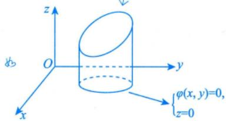

注将 $\begin{cases}F(x,   y,   z) = 0, \\G(x,   y,   z) = 0\end{cases}$ 消去某变量（例如消去z)，便得该曲线在z=0平面上的投影曲线方程$\begin{cases}f(x, y) = 0, \\z = 0,\end{cases}$ 如果 $f(x,y)=0$ 能容易地写出它的参数式：

$$
x = x(t), \; y = y(t), \; t \in I,
$$

其中I为某区间，则以x=x(t)，y=y(t)代入原曲线的方程中，若能解得单值的 $z = z(t)$ ，则得原曲线的参数式：

$$
x = x(t), \; y = y(t), \; z = z(t), \; t \in I \; .
$$

如将 $\begin{aligned}\varGamma : \begin{cases}x^{2} + y^{2} = 1, \\z = x + y\end{cases}\end{aligned}$ 的方程化为参数形式

$$
\begin{cases}x = \cos t, \\y = \sin t, \quad (0 \leqslant t \leqslant 2\pi) \\z = \cos t + \sin t\end{cases}
$$

## 2空间曲面

(1) 曲面方程： $F(x, y, z) = 0$

(2) 二次曲面.

<table><tr><td rowspan=1 colspan=1>曲面名称</td><td rowspan=1 colspan=1>方程</td><td rowspan=1 colspan=1>图形</td></tr><tr><td rowspan=1 colspan=1>椭球面</td><td rowspan=1 colspan=1> $\frac{x^{2}}{a^{2}}+\frac{y^{2}}{b^{2}}+\frac{z^{2}}{c^{2}}=1$ 当 $a = b = c$ 时为球面</td><td rowspan=1 colspan=1>用平行于坐标平           →面的平面去切。得出椭圆或圆</td></tr><tr><td rowspan=1 colspan=1>单叶双曲面</td><td rowspan=1 colspan=1> $\frac{x^{2}}{a^{2}}+\frac{y^{2}}{b^{2}}-\frac{z^{2}}{c^{2}}=1$ </td><td rowspan=1 colspan=1>用 $x = k _ { 1 } ( k _ { 1 }$ 不等于a)或 $y =$  $k _ { 2 } ( k _ { 2 }$ 不等于b)切得双曲线，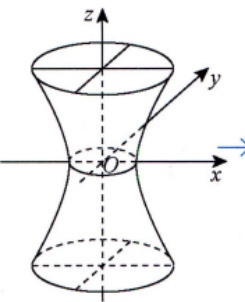           用 $z = k _ { 3 } ($ 任意常数)切得椭圆或圓</td></tr><tr><td rowspan=1 colspan=1>双叶双曲面</td><td rowspan=1 colspan=1> $-\frac{x^{2}}{a^{2}}-\frac{y^{2}}{b^{2}}+\frac{z^{2}}{c^{2}}=1$ (一正两负) </td><td rowspan=1 colspan=1>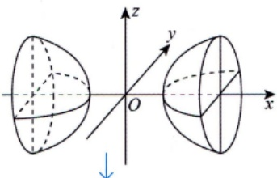用y=k或z=k切得双曲线.用 $x = k( \left |  k \right |  > \left |  a \right |  )$ 切得椭圆或圓</td></tr><tr><td rowspan=1 colspan=1>椭圆抛物面</td><td rowspan=1 colspan=1> $\frac{x^{2}}{2p}+\frac{y^{2}}{2q}=z(p,q>0)$  $x^{2} + y^{2} = z$ 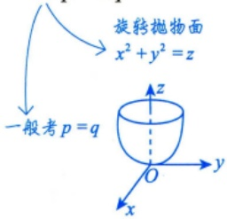</td><td rowspan=1 colspan=1>用x=k或 $y = k$ 切得抛物线。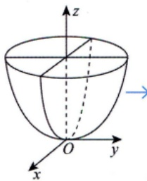         用 $z = k ( k > 0 )$ 切得椭圆或圆</td></tr><tr><td rowspan=1 colspan=1>椭圆锥面</td><td rowspan=1 colspan=1> $\frac{x^{2}}{a^{2}}+\frac{y^{2}}{b^{2}}=\frac{z^{2}}{c^{2}}$  $z = \sqrt{x^{2} + y^{2}}$ ，只有上半部分一般考a=b</td><td rowspan=1 colspan=1></td></tr></table>

## 第17讲多元函数积分学的预备知识（仅数学一）

续表

<table><tr><td rowspan=1 colspan=1>曲面名称</td><td rowspan=1 colspan=3>方程</td><td rowspan=1 colspan=1>图形</td></tr><tr><td rowspan=1 colspan=1>双曲抛物面(马鞍面)</td><td rowspan=1 colspan=3> $-\frac{x^{2}}{2p}+\frac{y^{2}}{2q}=z(p,q>0).$ </td><td rowspan=1 colspan=1>→用 $z = k(k > 0)$ 切得双曲线，           用x=k或y=k切得抛物线，其中k为任意常数</td></tr><tr><td rowspan=1 colspan=1>双曲抛物面(马鞍面)</td><td rowspan=1 colspan=3> $z = xy \quad  则  \quad z = y^{2} - x^{2} = (y + x)(y - x)$ 坐标变换： $\left\{ \begin{aligned} u = y + x, \\ v = y - x, \end{aligned} \right.  则  \; z = uv.$ </td><td rowspan=1 colspan=1>在上图的基础上，令x轴与y                        $\frac{\pi}{4}$ 轴逆时针旋转</td></tr><tr><td rowspan=1 colspan=5> $z = xy$ 中由 $x + y = 1$ 截出的图形，                       可以与三重积分、曲线积分、曲面积分相结合缺z，母线平行于z轴←(3)柱面：动直线沿定曲线平行移动所形成的曲面.</td></tr><tr><td rowspan=1 colspan=2>椭圆柱面</td><td rowspan=1 colspan=1> $\frac{x^{2}}{a^{2}}+\frac{y^{2}}{b^{2}}=1$ </td><td rowspan=1 colspan=2>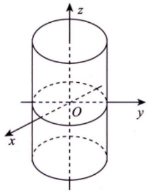准线是椭圆或圆</td></tr><tr><td rowspan=1 colspan=2>双曲柱面</td><td rowspan=1 colspan=1> $\frac{x^{2}}{a^{2}}-\frac{y^{2}}{b^{2}}=1$ </td><td rowspan=1 colspan=2>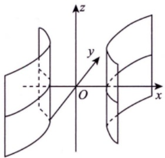准线是双曲线</td></tr><tr><td rowspan=1 colspan=2>抛物柱面</td><td rowspan=1 colspan=1> $y = a x ^ { 2 } ( a > 0 )$ </td><td rowspan=1 colspan=2>准线是抛物线</td></tr></table>

(4)旋转曲面：曲线Γ绕一条定直线旋转一周所形成的曲面.

曲线 $\varGamma : \left\{ \begin{aligned} F(x, y, z) = 0, \\ G(x, y, z) = 0 \end{aligned} \right.$ 绕直线 $\frac{x - x_{0}}{l} = \frac{y - y_{0}}{m} = \frac{z - z_{0}}{n}$ 旋转一周形成一个旋转曲面，旋转曲面方程的求法如下.

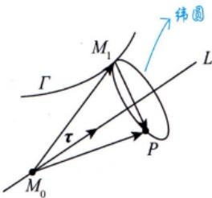

如图17-1所示，设 $M_{0}(x_{0},y_{0},z_{0})$ ，方向向量 $\boldsymbol{\tau} = (l, m, n)$ .在母线 $T  上$ 任取一点 $M_{1}(x_{1}, y_{1}, z_{1})$ ，则过 $M_{1}$ 的纬圆上的任意一点 $P(x,   y,   z)$ 满足条件

图 17-1

$$
\overrightarrow { M _ { 1 } P } \perp \tau , \left| \overrightarrow { M _ { 0 } P } \right| = \left| \overrightarrow { M _ { 0 } M _ { 1 } } \right| ,
$$

即

$$
\begin{cases}l(x - x_{1}) + m(y - y_{1}) + n(z - z_{1}) = 0, \\(x - x_{0})^{2} + (y - y_{0})^{2} + (z - z_{0})^{2} = (x_{1} - x_{0})^{2} + (y_{1} - y_{0})^{2} + (z_{1} - z_{0})^{2},\end{cases}
$$

与方程 $F(x_{1}, y_{1}, z_{1}) = 0$ 和 $G(x_{1}, y_{1}, z_{1}) = 0$ 联立消去 $x_{1}, y_{1}, z_{1}$ ，便可得到旋转曲面的方程.

注常考曲线Γ： $\begin{cases}F(x,   y,   z) = 0, \\G(x,   y,   z) = 0\end{cases}$ 绕z轴旋转一周而成的旋转曲面的方程如图17-2所示，在曲线Γ上任取一点 $M_{1}(x_{1},y_{1},z_{1})$ 则过点 $M_{1}$ 的纬圆上的任意一点P(x,y，z)满足条件 $\left| \overrightarrow{OP} \right| = \left| \overrightarrow{OM_1} \right|$ 和 $z = z_{1}$ 即$x^{2}+y^{2}+z^{2}=x_{1}^{2}+y_{1}^{2}+z_{1}^{2}$ 且 $z = z_{1}$ ，得 因为 $(x - x_{1}, y - y_{1}, z - z_{1}) \perp (0, 0, 1)$

$$
x^{2} + y^{2} = x_{1}^{2} + y_{1}^{2}
$$

  
图17-2

从方程组 $\begin{cases}F(x_{1}, y_{1}, z) = 0, \\G(x_{1}, y_{1}, z) = 0, \\x^{2} + y^{2} = x_{1}^{2} + y_{1}^{2}\end{cases}$ 中消去 $x_{1}$ 和 $y_{1}$ ，便得到旋转曲面的方程

如果能从方程组 $\begin{cases}F(x, y, z) = 0, \\G(x, y, z) = 0\end{cases}$ 中解出 $x = f_{1}(z)$ 和 $y = f_{2}(z)$ ，则旋转曲面的方程为

$$
x^{2}+y^{2}=\left[f_{1}(z)\right]^{2}+\left[f_{2}(z)\right]^{2}
$$

如求 $\begin{cases}y^{2} - (z - 1)^{2} = 1, \\x = 0\end{cases}$ 绕z轴旋转一周而成的旋转曲面的方程，由方程组知 $\begin{cases}x = 0, \\y^{2} = 1 + (z - 1)^{2}\end{cases}$ 则旋转曲面的方程为 $x^{2}+y^{2}=0^{2}+1+(z-1)^{2}$ ，即 $x^{2}+y^{2}-(z-1)^{2}=1$

例17.5设 $\Sigma _ { 1 }$ 是由过点(0，-1,1)与点(0,0,0)的直线L绕z轴旋转一周所得的旋转曲面位于$z   \geqslant   0$ 的部分， $\Sigma _ { z }$ 的方程为 $z^{2} = 2x$ ，则 $\Sigma _ { \mathrm { i } }$ 与 $\Sigma _ { z }$ 的交线Γ在 $x O y$ 面上的投影曲线方程为

解应填 $\begin{cases}x^{2} + y^{2} = 2x, \\z = 0.\end{cases}$

直线L的两点式方程为 $\frac{x}{0}=\frac{y+1}{1}=\frac{z-1}{-1}$ ，参数方程为 $\begin{cases}x = 0, \\y = -1 + t, \\z = 1 - t,\end{cases}$ ,t为参数，即 $\begin{cases}x = 0, \\y = -z\end{cases}$ 由“三、2.(4)注”，得 $\Sigma _ { 1 }$ 的方程为 $x^{2}+y^{2}=0^{2}+(-z)^{2}=z^{2}$ ，也即 $z = \sqrt{x^{2} + y^{2}}$

将 $\begin{cases}z = \sqrt{x^{2} + y^{2}} \\z^{2} = 2x\end{cases}$ '中的z消去，得 $x^{2} + y^{2} = 2x$ ，即得到投影曲线方程为$\begin{cases}x^{2} + y^{2} = 2x, \\z = 0.\end{cases}$ 曲线Γ和其在 $x O y$ 面上的投影如图17-3所示.

  
图 17-3

## 四多元函数微分学的几何应用

## 1空间曲线的切线与法平面

(1) 用参数方程给出曲线： $\begin{cases}x = x(t), \\y = y(t),   t \in I, \\z = z(t),\end{cases}$

其中 $x(t),   y(t),   z(t)$ 在I上可导，且三个导数不同时为0，则曲线在 $P_{0}(x_{0},y_{0},z_{0})$ 处的切向量$\boldsymbol{\tau} = \left( x^{\prime}(t_{0}), y^{\prime}(t_{0}), z^{\prime}(t_{0}) \right)$

切线方程： $\frac{x - x_{0}}{x^{\prime}(t_{0})} = \frac{y - y_{0}}{y^{\prime}(t_{0})} = \frac{z - z_{0}}{z^{\prime}(t_{0})}$

法平面方程： $x^{\prime}(t_{0})(x - x_{0}) + y^{\prime}(t_{0})(y - y_{0}) + z^{\prime}(t_{0})(z - z_{0}) = 0$

(2) 用方程组给出曲线： $\begin{cases}F(x,   y,   z) = 0, \\G(x,   y,   z) = 0.\end{cases}$

当 $\frac{\partial(F,\ G)}{\partial(y,\ z)} = \left| \begin{matrix} \frac{\partial F}{\partial y} & \frac{\partial F}{\partial z} \\ \frac{\partial G}{\partial y} & \frac{\partial G}{\partial z} \end{matrix} \right| \neq 0$ 时，可确定 $\begin{cases}x = x, \\y = y(x), \\z = z(x).\end{cases}$

雅可比行列式

其在 $P_{0}(x_{0},y_{0},z_{0})$ 处的切向量 $\tau=\frac{\left| \begin{matrix} i & j & k \\ F_{x}^{\prime} & F_{y}^{\prime} & F_{z}^{\prime} \end{matrix} \right|}{\left| \begin{matrix} G_{x}^{\prime} & G_{y}^{\prime} & G_{z}^{\prime} \end{matrix} \right|}=(A, B, C)$ 梯度向量n两个梯度向量的叉乘：n×2G在P的梯度向量 $n _ { z }$

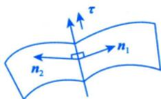

切线方程： $\frac{x - x_{0}}{A} = \frac{y - y_{0}}{B} = \frac{z - z_{0}}{C}$

法平面方程： $A(x - x_{0}) + B(y - y_{0}) + C(z - z_{0}) = 0$

## 2空间曲面的切平面与法线

(1) 用隐式方程给出曲面： $F(x, y, z) = 0$ ，其中F的一阶偏导数连续.F在P的梯度向量

其在 $P_{0}(x_{0},y_{0},z_{0})$ 处的法向量 $\boldsymbol { n } = \left( F _ { x } ^ { \prime } \big | _ { P _ { 0 } } , F _ { y } ^ { \prime } \big | _ { P _ { 0 } } , F _ { z } ^ { \prime } \big | _ { P _ { 0 } } \right)$

切平面方程： $F_{x}^{\prime}\left|_{P_{0}}\right.\bullet\left(x-x_{0}\right)+F_{y}^{\prime}\left|_{P_{0}}\right.\bullet\left(y-y_{0}\right)+F_{z}^{\prime}\left|_{P_{0}}\right.\bullet\left(z-z_{0}\right)=0$

法线方程： $\frac{x - x_{0}}{\left. F_{x}^{\prime} \right|_{P_{0}}} = \frac{y - y_{0}}{\left. F_{y}^{\prime} \right|_{P_{0}}} = \frac{z - z_{0}}{\left. F_{z}^{\prime} \right|_{P_{0}}}$ 或 $z - f(x, y) = 0$ ，则曲面在P处的法向量为 $\left( - f _ { x } ^ { \prime } ( x _ { 0 } , y _ { 0 } ) , - f _ { y } ^ { \prime } ( x _ { 0 } , y _ { 0 } ) , 1 \right)$

(2) 用显式函数给出曲面： $z = f(x, y) \Rightarrow f(x, y) - z = 0$ ，其中f的一阶偏导数连续.

其在 $P_{0}(x_{0},y_{0},z_{0})$ 处的法向量 $\boldsymbol { n } = \left( f _ { x } ^ { \prime } ( x _ { 0 } , y _ { 0 } ) , f _ { y } ^ { \prime } ( x _ { 0 } , y _ { 0 } ) , - 1 \right)$ .此法向量方向向下.

→若为正值，与z轴正方向夹角为切平面方程： $f_{x}^{\prime}(x_{0}, y_{0})(x - x_{0}) + f_{y}^{\prime}(x_{0}, y_{0})(y - y_{0}) - (z - z_{0}) = 0$ 锐角，即法向量向上：若为负值，与z轴正方向夹角为钝角，即法向量向下

法线方程： $\frac{x - x_{0}}{f_{x}^{\prime}(x_{0}, y_{0})} = \frac{y - y_{0}}{f_{y}^{\prime}(x_{0}, y_{0})} = \frac{z - z_{0}}{- 1}$

例17.6 空间曲线 $\begin{aligned}\varGamma : \left\{\begin{aligned}x = \int_{0}^{t} \mathrm{e}^{u} \cos u   du, \\y = 2\sin t + \cos t, \\z = 1 + \mathrm{e}^{3t}\end{aligned}\right.\end{aligned}$ 在t=0处的切线方程为

分析x，y，z分别对t求导，然后代入t=0.

解应填 $\frac{x - 0}{1} = \frac{y - 1}{2} = \frac{z - 2}{3}$

当t =0时， $x = 0, \; y = 1, \; z = 2$ ；由 $x^{\prime} = \mathrm{e}^{t} \cos t, \quad y^{\prime} = 2\cos t - \sin t, \quad z^{\prime} = 3\mathrm{e}^{3t}$ ，得 $x^{\prime}(0)=1,\ y^{\prime}(0)=2$ $z^{\prime}(0) = 3$ .于是，切线方程为 $\frac{x - 0}{1} = \frac{y - 1}{2} = \frac{z - 2}{3}$

例17.7 设函数z=f(x，y)在点(0,0)附近有定义，且 $f_{x}^{\prime}(0,0)=3$ ，则曲线 $\left\{ \begin{aligned} z = f(x, y), \\ y = 0 \end{aligned} \right.$ 111 点(0,0, f(0,0))处的法平面方程为

解应填 $x + 3z - 3f(0, 0) = 0$

曲线 $\begin{cases}z = f(x, y), \\y = 0\end{cases}$ 可写成参数式： $\begin{cases}x = t, \\y = 0, \\z = f(t,   0).\end{cases}$ 则

$$
\boldsymbol { \tau } = \left( x _ { t } ^ { \prime } , y _ { t } ^ { \prime } , z _ { t } ^ { \prime } \right) \Big| _ { t = 0 } = \left( 1 , 0 , f _ { x } ^ { \prime } ( 0 , 0 ) \right) = \left( 1 , 0 , 3 \right) .
$$

故所求法平面方程为 $x + 3z - 3f(0, 0) = 0$

例17.8曲面 $z - \mathrm{e}^{z} + 2xy = 3$ 在点(1，2,0)处的切平面方程为

应填2x+y−4=0.

区 $F(x, y, z) = z - \mathrm{e}^{z} + 2xy - 3$ ，则 $\boldsymbol{n} = \left( F_{x}^{\prime}, F_{y}^{\prime}, F_{z}^{\prime} \right) |_{(1,2,0)}$ ，其中

$$
F_{x}^{\prime}\big|_{(1,2,0)} = 2y\big|_{(1,2,0)} = 4, \left. F_{y}^{\prime}\right|_{(1,2,0)} = 2x\big|_{(1,2,0)} = 2, \left. F_{z}^{\prime}\right|_{(1,2,0)} = \left. (1 - \mathrm{e}^{z}) \right|_{(1,2,0)} = 0 .
$$

故切平面方程为 $4(x - 1) + 2(y - 2) + 0 \cdot (z - 0) = 0$ ，即 $2x + y - 4 = 0$

例17.9设f可微，则曲面 $\mathrm{e}^{2x - z} = f(\pi y - \sqrt{2}z)$ 是( ).

(A) 旋转抛物面 (B) 双叶双曲面 (C) 单叶双曲面 (D)柱面

解应选 (D).

设 $F = f(\pi y - \sqrt{2}z) - \mathrm{e}^{2x - z}$ ，则曲面上任一点处的法向量为

定直线L

$$
\boldsymbol { n } = \left( - 2 \mathrm { e } ^ { 2 x - z } , \pi f ^ { \prime } , - \sqrt { 2 } f ^ { \prime } + \mathrm { e } ^ { 2 x - z } \right) .
$$

设某定向量τ =(a,b,c)(a,b,c不同时为零)与n垂直，即

$$
\boldsymbol { n } \cdot ( a , b , c ) = - 2 a \mathrm { e } ^ { 2 x - z } + \pi b f ^ { \prime } + ( - \sqrt { 2 } f ^ { \prime } + \mathrm { e } ^ { 2 x - z } ) c = 0 ,
$$

解得 $a = \frac{c}{2},   b = \frac{\sqrt{2}}{\pi}c$ ，令 $_ c = 1$ ，则 $a = \frac{1}{2}, b = \frac{\sqrt{2}}{\pi}$ ，这样曲面上任一点处的法向量n均与定向量$\left( \frac{1}{2}, \frac{\sqrt{2}}{\pi}, 1 \right)$ 垂直，这说明该曲面是柱面.

## 场论初步

什么叫“场”？从数学上说，场就是空间区域Ω上的一种对应法则.

(1)如果Ω上的每一点M(x，y，z)都对应着一个数量u，则在Ω上就确定了一个数量函数$u = u(x, y, z)$ ，它表示一个数量场.数量场的例子很多，比如温度场，温度场只讲大小，不讲方向.

(2)如果Ω上的每一点 $M(x,   y,   z)$ 都对应着一个向量F，则在Ω上就确定了一个向量函数

$$
\boldsymbol { F } ( x , y , z ) = \boldsymbol { P } ( x , y , z ) \boldsymbol { i } + \boldsymbol { Q } ( x , y , z ) \boldsymbol { j } + \boldsymbol { R } ( x , y , z ) \boldsymbol { k } ,
$$

它表示一个向量场.向量场的例子也很多，比如引力场，引力场既讲大小，也讲方向

## 1方向导数

定义 设三元函数 $u = u(x, y, z)$ 在点 $P_{0}(x_{0},y_{0},z_{0})$ 的某空间邻域 $U \subset \mathbf { R } ^ { 3 }$ 内有定义，l为从点 $P _ { 0 }$ 出发的射线， $P(x,   y,   z)$ 为l上且在U内的任一点，则

$$
\begin{cases}x - x_{0} = \Delta x = t \cos \alpha, \\y - y_{0} = \Delta y = t \cos \beta, \\z - z_{0} = \Delta z = t \cos \gamma.\end{cases} 三个方向向量
$$

以 $t = \sqrt{ \left( \Delta x \right)^2 + \left( \Delta y \right)^2 + \left( \Delta z \right)^2 }$ 表示P与 $P _ { 0 }$ 之间的距离，如图17-4所示，若极限

$$
\lim_{t \to 0^{+}} \frac{u(P) - u(P_{0})}{t} = \lim_{t \to 0^{+}} \frac{u(x_{0} + t\cos\alpha, y_{0} + t\cos\beta, z_{0} + t\cos\gamma) - u(x_{0}, y_{0}, z_{0})}{t}
$$

存在，则称此极限为函数 $u = u(x, y, z)$ 在点 $P _ { 0 }$ 沿方向l的方向导数，记$\left| \frac { \partial u } { \partial l } \right| _ { P _ { 0 } }$

定理(方向导数的计算公式) 设三元函数 $u = u(x, y, z)$ 在点$P_{0}(x_{0},y_{0},z_{0})$ 处可微分，则 $u = u(x, y, z)$ 在点 $P _ { 0 }$ 处沿任一方向l的方向导数都存在，且

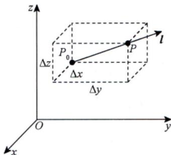  
图 17-4

$$
\begin{aligned}\left. \frac{\partial u}{\partial I} \right|_{P_0} = & \lim_{t \to 0^+} \frac{u(x_0 + \Delta x, y_0 + \Delta y, z_0 + \Delta z) - u(x_0, y_0, z_0)}{\sqrt{(\Delta x)^2 + (\Delta y)^2 + (\Delta z)^2}} \quad  当  \quad 1  个唯 \\= & \lim_{t \to 0^+} \frac{u'_x(P_0) \Delta x + u'_y(P_0) \Delta y + u'_z(P_0) \Delta z + o(t)}{\sqrt{(\Delta x)^2 + (\Delta y)^2 + (\Delta z)^2}} \quad  其中  \quad \Delta x \\= & u'_x(P_0) \cos \alpha + u'_y(P_0) \cos \beta + u'_z(P_0) \cos \gamma, \quad \frac{\Delta y}{\sqrt{(\Delta x)^2 + (\Delta y)^2 + (\Delta z)^2}} = \cos \beta, \\\Delta y  为  & 为  \gamma  为  \gamma  为  \gamma  为  \gamma  为  \gamma  为  \gamma  为  \gamma  为  \gamma  为  \gamma  为  \gamma  为  \gamma \quad \frac{\Delta z}{\sqrt{(\Delta x)^2 + (\Delta y)^2 + (\Delta z)^2}} = \cos \gamma\end{aligned}
$$

$$
\frac{\cos \alpha,\cos \beta,\cos \gamma}{\downarrow}
$$

其中

(cosα，cosβ，cosγ)一定是单位向量

注二元函数 $f(x,y)$ 的情况与三元函数类似.

## 2梯度

定义 设三元函数 $u = u(x, y, z)$ 在点 $P_{0}(x_{0},y_{0},z_{0})$ 处具有一阶连续偏导数，则定义

$$
\mathrm{grad} u \Big|_{P_0} = (u'_x(P_0), u'_y(P_0), u'_z(P_0))
$$

为函数 $u = u(x, y, z)$ 在点 $P _ { 0 }$ 处的梯度.

$$
\begin{aligned} & 当  \quad  grad (u \pm v) =  grad  u \pm  grad  v ; \quad\\ &\quad  grad (uv) = v grad  u + u grad  v ; \quad\\ &\quad  grad \left(\frac{u}{v}\right) = \frac{v grad  u - u grad  v}{v^2} (v \neq 0) .\\ \end{aligned}
$$

## ③方向导数与梯度的关系

由方向导数的计算公式 $\left. \frac { \partial u } { \partial l } \right| _ { P _ { 0 } } = u _ { x } ^ { \prime } ( P _ { 0 } ) \cos \alpha + u _ { y } ^ { \prime } ( P _ { 0 } ) \cos \beta + u _ { z } ^ { \prime } ( P _ { 0 } ) \cos \gamma$ 与梯度的定义

$$
\mathrm { g r a d } u \big | _ { P _ { 0 } } = ( u _ { x } ^ { \prime } ( P _ { 0 } ) , u _ { y } ^ { \prime } ( P _ { 0 } ) , u _ { z } ^ { \prime } ( P _ { 0 } ) ) ,
$$

可得到

$$
\begin{align*}\left. \frac{\partial u}{\partial l} \right|_{P_0} = & \left( u_x'(P_0), u_y'(P_0), u_z'(P_0) \right) \cdot \left( \cos \alpha, \cos \beta, \cos \gamma \right) = \left. \mathrm{grad} u \right|_{P_0} \cdot l^* \\= & \left| \mathrm{grad} u \right|_{P_0} \mid \left| l^* \right| \cos \theta = \left| \mathrm{grad} u \right|_{P_0} \left| \cos \theta \right.,\end{align*}
$$

其中θ为 $\left. \mathbf { g r a d }   u \right| _ { P _ { 0 } }$ 与 $\boldsymbol { \iota } ^ { \circ }$ 的夹角.

→此时向量I与梯度同方向①当 $\cos \theta = 1$ 时， $\left. \frac { \partial u } { \partial l } \right| _ { P _ { 0 } }$ 有最大值.

②当 $\cos \theta = 0$ ，即 $\theta = \frac{\pi}{2}$ 时，向量l与梯度垂直，有 $\left. \frac { \partial u } { \partial \pmb { l } } \right| _ { P _ { 0 } } = 0 .$ ，即变化率为0.

于是有重要结论：函数在某点的梯度是一个向量，它的方向与取得最大方向导数的方向一致，而它的模为方向导数的最大值，为

$$
| \mathrm { g r a d } \; u | = \sqrt { ( u _ { x } ^ { \prime } ) ^ { 2 } + ( u _ { y } ^ { \prime } ) ^ { 2 } + ( u _ { z } ^ { \prime } ) ^ { 2 } } \; .
$$

## 4散度

定义 设向量场 $\boldsymbol{A}(x, y, z) = \boldsymbol{P}(x, y, z)\boldsymbol{i} + \boldsymbol{Q}(x, y, z)\boldsymbol{j} + \boldsymbol{R}(x, y, z)\boldsymbol{k}$ ，则

$$
\mathrm{div} \boldsymbol{A} = \frac{\partial P}{\partial x} + \frac{\partial Q}{\partial y} + \frac{\partial R}{\partial z}
$$

叫作向量场A的散度.

## 5旋度

表示向外（内）流的强度

定义 设向量场 $\boldsymbol{A}(x, y, z) = \boldsymbol{P}(x, y, z)\boldsymbol{i} + \boldsymbol{Q}(x, y, z)\boldsymbol{j} + \boldsymbol{R}(x, y, z)\boldsymbol{k}$ ，则

$$
\mathbf{rot} \boldsymbol{A} = \left| \begin{matrix} \boldsymbol{i} & \boldsymbol{j} & \boldsymbol{k} \\ \partial & \partial & \partial \\ \overline{\partial x} & \overline{\partial y} & \overline{\partial z} \\ P & Q & R \end{matrix} \right|
$$

叫作向量场A的旋度.描述向量场中向量旋转量的强度

例17.10 函数 $f(x, y, z) = x^{2}y + z^{2}$ 在点(1,2,0)处沿向量n=(1，2,2)的方向导数为().(A) 12 (B) 6 (C) 4 (D)2

解应选 (D).

因为函数可微分，且

$$
\left. \frac { \partial f } { \partial x } \right| _ { ( 1 , 2 , 0 ) } = 2 x y \Big| _ { ( 1 , 2 , 0 ) } = 4 , \left. \frac { \partial f } { \partial y } \right| _ { ( 1 , 2 , 0 ) } = x ^ { 2 } \Big| _ { ( 1 , 2 , 0 ) } = 1 , \left. \frac { \partial f } { \partial z } \right| _ { ( 1 , 2 , 0 ) } = 2 z \Big| _ { ( 1 , 2 , 0 ) } = 0 ,
$$

与n同方向的单位向量为 $\frac{\boldsymbol{n}}{\left| \boldsymbol{n} \right|} = \left( \frac{1}{3}, \frac{2}{3}, \frac{2}{3} \right)$ ，所以所求方向导数为

$$
\left. \frac{\partial f}{\partial \boldsymbol{n}} \right|_{(1,2,0)} = 4 \times \frac{1}{3} + 1 \times \frac{2}{3} + 0 \times \frac{2}{3} = 2
$$

例17.11 设a,b为实数，函数 $z = 2 + ax^{2} + by^{2}$ 在点(3,4)处的方向导数中，沿方向$l = - 3i - 4j$ 的方向导数最大，最大值为10.则a，b的值分别为（).(A)-1, -1 (B)-1, 1(C)1, -1 (D)1, 1

分析方向导数最大时，即为梯度方向，值为梯度的模.

函数 $z = 2 + ax^{2} + by^{2}$ 在点(3,4)处的梯度为

$$
\left. \mathbf{grad} z \right|_{(3,\;4)} = 6 a \boldsymbol{i} + 8 b \boldsymbol{j} .
$$

由题设条件，知 $\begin{cases}6a = - 3k, \\8b = - 4k, \\\sqrt{36a^{2} + 64b^{2}} = 10.\end{cases}$ 其中 $k > 0$ ，解得a=-1,b=-1.

例17.12已知函数 $z = f(x, y)$ 可微，其在点 $P _ { 0 } ( 1 ,   2 )$ 处沿从 $P _ { 0 }$ 到 $P_{1}(2,3)$ 的方向的方向导数为$2 \sqrt { 2 }$ ，沿从 $P _ { 0 }$ 到P2(1，0)的方向的方向导数为-3，则z在点 $P _ { 0 }$ 处的最大方向导数为

$$
\sqrt { 1 0 }
$$

如图17-5所示， $I_{1} = \overrightarrow{P_{0}P_{1}} = (1,1), I_{2} = \overrightarrow{P_{0}P_{2}} = (0, - 2)$ ，且

$$
\boldsymbol { l } _ { 1 } ^ { * } = \left( \cos \alpha _ { 1 } , \cos \beta _ { 1 } \right) = \left( \frac { 1 } { \sqrt { 2 } } , \frac { 1 } { \sqrt { 2 } } \right) ,
$$

$$
l _ { 2 } ^ { \circ } = \left( \cos \alpha _ { 2 } , \cos \beta _ { 2 } \right) = \left( 0 , - 1 \right) .
$$

由方向导数计算公式，有

$$
\left. \frac { \partial f } { \partial x } \right| _ { P _ { 0 } } \cdot \left. \frac { 1 } { \sqrt { 2 } } + \frac { \partial f } { \partial y } \right| _ { P _ { 0 } } \cdot \frac { 1 } { \sqrt { 2 } } = 2 \sqrt { 2 } ,
$$

$$
\left. \frac { \partial f } { \partial x } \right| _ { P _ { 0 } } \cdot 0 + \left. \frac { \partial f } { \partial y } \right| _ { P _ { 0 } } \cdot ( - 1 ) = - 3 ,
$$

解得 $z_{x}^{\prime}(P_{0}) = 1, \; z_{y}^{\prime}(P_{0}) = 3$ ，故z在点 $P _ { 0 }$ 处的最大方向导数为

$$
\left| \mathrm{grad} z \right|_{P_0} = \sqrt{\left[ z_x'(P_0) \right]^2 + \left[ z_y'(P_0) \right]^2} = \sqrt{10}
$$

  
图 17-5

注本题的问题可作如下推广：设 $z = f(x, y)$ 可微，记任意一点 $P_{0}(x_{0},y_{0})$ ，从 $P_{0}$ 出发，沿两条不共线的方向 $l_{1}^{\circ} = (\cos \alpha_{1}, \cos \beta_{1})$ 与 $l_{2}^{\circ} = \left( \cos \alpha_{2}, \cos \beta_{2} \right)$ 的方向导数分别为

$$
\left\{ \left. \frac { \partial f } { \partial l _ { 1 } ^ { \circ } } \right| _ { P _ { 0 } } = \left. \frac { \partial f } { \partial x } \right| _ { P _ { 0 } } \cdot \cos \alpha _ { 1 } + \left. \frac { \partial f } { \partial y } \right| _ { P _ { 0 } } \cdot \cos \beta _ { 1 } , \right.
$$

$$
\left| \frac { \partial f } { \partial l _ { 2 } ^ { \circ } } \right| _ { P _ { 0 } } = \left. \frac { \partial f } { \partial x } \right| _ { P _ { 0 } } \cdot \cos \alpha _ { 2 } + \left. \frac { \partial f } { \partial y } \right| _ { P _ { 0 } } \cdot \cos \beta _ { 2 } ,
$$

其中 $\left| \begin{matrix} \cos \alpha_{1} & \cos \beta_{1} \\ \cos \alpha_{2} & \cos \beta_{2} \end{matrix} \right| \neq 0$

(1)若 $\left. \frac{\partial f}{\partial \boldsymbol{l}_{1}^{\circ}} \right|_{P_{0}}, \left. \frac{\partial f}{\partial \boldsymbol{l}_{2}^{\circ}} \right|_{P_{0}^{\circ}}$ 不全为0，则该非齐次方程组有唯一解，如例17.12的解答过程

(2)若 $\left. \frac { \partial f } { \partial \boldsymbol { l } _ { 1 } ^ { * } } \right| _ { \boldsymbol { P } _ { 0 } } = \left. \frac { \partial f } { \partial \boldsymbol { l } _ { 2 } ^ { * } } \right| _ { \boldsymbol { P } _ { 0 } } = 0$ 则该齐次方程组只有零解，即 $\left. \frac{\partial f}{\partial x} \right|_{P_0} = \left. \frac{\partial f}{\partial y} \right|_{P_0} = 0$ 故 $\left. \mathrm{d} f \right|_{P_{0}} = \left. \frac{\partial f}{\partial x} \right|_{P_{0}} \mathrm{d} x +$ $\left. \frac{\partial f}{\partial y} \right|_{P_0} \mathrm{d}y = 0$ 由 $P_{0}$ 的任意性，有 $df = 0$ 故 $f(x,y)$ 为一常数.

例17.13 设 $\boldsymbol{F}(x, y, z) = xy\boldsymbol{i} - yz\boldsymbol{j} + zx\boldsymbol{k}$ ，则 $\mathrm{rot}   F(1,1,0) =$

## 解应填i-k.

记三元向量函数 $F(x, y, z) = (P, Q, R)$ ，则

$$
\mathrm{rot} \boldsymbol{F}(x, y, z) = \left| \begin{matrix} \boldsymbol{i} & \boldsymbol{j} & \boldsymbol{k} \\ \partial & \partial & \partial \\ \partial x & \partial y & \partial z \\ P & Q & R \end{matrix} \right|,
$$

其中 $P = xy, \; Q = -yz, \; R = zx$ ，于是

$$
\begin{aligned}\mathbf{rot} \; \boldsymbol{F}(1, 1, 0) =\begin{vmatrix}\boldsymbol{i} & \boldsymbol{j} & \boldsymbol{k} \\\partial & \partial & \partial \\\partial x & \partial y & \partial z \\xy & -yz & zx\end{vmatrix}_{(1, 1, 0)} = (y \boldsymbol{i} - z \boldsymbol{j} - x \boldsymbol{k})|_{(1, 1, 0)} = \boldsymbol{i} - \boldsymbol{k} \;.\end{aligned}
$$

②

## 基础习题精练

## 习题

17.1 设直线 $\begin{cases}x + y - z + 1 = 0, \\x - y + 3z + 3 = 0\end{cases}$ 平面 $\pi : x - 2y - z + 3 = 0$ ，则直线L（）.(A) 平行于π (B)在π上 (C) 垂直于π (D)与π相交但不垂直

17.2 在曲线 $\begin{cases}x = t, \\y = -t^2, \\z = t^3\end{cases}$ ,的所有切线中，与平面 $x + 2y + z = 4$ 平行的切线（).(A)只有1条 (B) 只有2条 (C) 至少有 3 条 (D) 不存在

17.3 已知曲面 $z = 4 - x^{2} - y^{2}$ 上点P处的切平面平行于平面 $2x + 2y + z - 1 = 0$ ，则点P的坐标是().(A) (1, −1, 2) (B) (−1, 1, 2) (C) (1, 1, 2) (D) (−1, −1, 2)

17.4 设 $\left| \boldsymbol{a} + \boldsymbol{b} \right| = \left| \boldsymbol{a} - \boldsymbol{b} \right|$ ，且a=(3,−5,8),b=(−1,1,z)，则z=

17.5 直线 $\frac{x - 1}{1} = \frac{y}{1} = \frac{z - 1}{- 1}$ 在平面 $\pi : 3x - y + 3z = 5$ 上的投影直线 $L _ { 0 }$ 的方程为

17.6 经过点A(1,0, 0)与点B(0,1,1)的直线绕z轴旋转一周生成的曲面方程是

17.7 函数 $u = \ln(x + \sqrt{y^2 + z^2})$ 在点A(1,0,1)处沿点A指向点B(3,-2,2)方向的方向导数为

17.8 设u是由方程 $\mathrm{e}^{z+u}-xy-yz-zu=0$ 所确定的x,y，z的隐函数，则 $u = u(x, y, z)$ 在点P(1,1,0)处方向导数的最大值为

17.9 已知 $\boldsymbol{F} = x^{3}\boldsymbol{i} + y^{3}\boldsymbol{j} + z^{3}\boldsymbol{k}$ ，则在点(1，0，-1)处的divF为

17.10 向量场 $\boldsymbol{A} = (z, 3x, 2y)$ 的旋度 rot A =

## 解答

## 17.1 (C) 解 先将直线

$$
\begin{aligned}L:\left\{\begin{aligned}x + y - z + 1 = 0, \\x - y + 3z + 3 = 0\end{aligned}\right.\end{aligned}
$$

化为点向式方程.

由①+②可得 $\frac{x + 2}{-1} = z$

由①-②可得 $\frac{y - 1}{2} = z$

因此所给直线化为

$$
\frac{x + 2}{- 1} = \frac{y - 1}{2} = \frac{z}{1}
$$

其方向向量为 τ =(-1, 2, 1).

又所给平面的法向量为 $\boldsymbol{n} = (1, -2, -1)$ ，有 $\tau \not / / \boldsymbol { n }$ ，因此 $L \perp \pi$ ，故选(C).

17.2 (B) 解 曲线在 $t _ { 0 }$ 处的切向量为 $\boldsymbol{\tau} = (1, - 2t_{0}, 3t_{0}^{2})$ ，该切线与平面 $x + 2y + z = 4$ 平行 $\Leftrightarrow \tau .$ 与该平面的法向量n=(1,2,1)垂直 $\Leftrightarrow \tau \cdot n = 0 \Leftrightarrow 1 - 4t_{0} + 3t_{0}^{2} = 0 \Leftrightarrow t_{0} = 1$ 或 $t_{0} = \frac{1}{3}$

将 $t_{0}=1,\ t_{0}=\frac{1}{3}$ 代入曲线方程可得点(1，-1,1)和点 $\left( \frac{1}{3}, -\frac{1}{9}, \frac{1}{27} \right)$ ，再代入平面方程知两点均不在平面上，符合题意.故与平面平行的切线只有2条.

17.3 (C) 解 设P点的坐标为 $(x_{0}, y_{0}, z_{0})$ ，则曲面在P点的法向量为

$$
\boldsymbol{n} = ( - 2 x _ { 0 } , - 2 y _ { 0 } , - 1 ) ,
$$

又因为切平面平行于平面 $2x + 2y + z - 1 = 0$ ，则

$$
\frac{-2x_{0}}{2}=\frac{-2y_{0}}{2}=\frac{-1}{1},
$$

从而可得 $x_{0}=1,\;y_{0}=1$ ，代入曲面方程解得 $z_{0} = 2$ .故选(C).

17.4 1 解 由 $\boldsymbol{a} = (3, -5, 8), \boldsymbol{b} = (-1, 1, z)$ ，可知

$$
\boldsymbol{a}+\boldsymbol{b}=(3-1,-5+1,8+z)=(2,-4,8+z),
$$

$$
\boldsymbol{a}-\boldsymbol{b}=(3+1,-5-1,8-z)=(4,-6,8-z),
$$

$$
\left| \boldsymbol{a} + \boldsymbol{b} \right| = \sqrt{2^{2} + (-4)^{2} + (8 + z)^{2}} = \sqrt{20 + (8 + z)^{2}}
$$

$$
\left| \boldsymbol{a} - \boldsymbol{b} \right| = \sqrt{4^{2} + (-6)^{2} + (8 - z)^{2}} = \sqrt{52 + (8 - z)^{2}}
$$

由题设可知

$$
\sqrt{20+\left ( 8+z \right ) ^{2} } =\sqrt{52+\left ( 8-z \right ) ^{2} }
$$

可解得z=1.

17.5 $\begin{cases}3x - y + 3z = 5, \\x - 3y - 2z + 1 = 0.\end{cases}$ 解 欲求直线L在已给平面π上的投影直线 $L _ { 0 }$ ，应先求过L且与π垂直

的平面 $\pi _ { 1 }$ . 为此先将L的方程化为一般式方程：

$$
\begin{cases}x + z - 2 = 0, \\y + z - 1 = 0,\end{cases}
$$

则过L的平面束方程为

$$
(x + z - 2) + \lambda (y + z - 1) = 0
$$

其中与 $\pi \colon$ 垂直的平面 $\pi _ { 1 }$ 的法向量应满足

$$
3 \times 1 + ( - 1 ) \lambda + 3 ( 1 + \lambda ) = 0 ,
$$

可解得 $\lambda = - 3$ ，则 $\pi _ { 1 }$ 的方程为

$$
x - 3y - 2z + 1 = 0
$$

因此L在π上的投影直线 $L _ { 0 }$ 的方程为

$$
\begin{cases}3x - y + 3z = 5, \\x - 3y - 2z + 1 = 0.\end{cases}
$$

17.6 $x^{2}+y^{2}-2z^{2}+2z-1=0$ 解 由直线方程的两点式得直线AB的方程：

$$
\frac{x - 1}{1} = \frac{y}{- 1} = \frac{z}{- 1}
$$

写成参数式：

$$
x = 1 + t , y = - t , z = - t ,
$$

得旋转曲面的方程：

$$
x^{2}+y^{2}=(1-z)^{2}+z^{2} , 即 x^{2}+y^{2}-2 z^{2}+2 z-1=0 .
$$

17.7 $\frac{1}{2}$ 解因为

$$
\left. \frac { \partial u } { \partial x } \right| _ { A } = \left. \frac { 1 } { x + \sqrt { y ^ { 2 } + z ^ { 2 } } } \right| _ { ( 1 , 0 , 1 ) } = \frac { 1 } { 2 } ,
$$

$$
\left. \frac { \partial u } { \partial y } \right| _ { A } = \left. \frac { 1 } { x + \sqrt { y ^ { 2 } + z ^ { 2 } } } \cdot \frac { y } { \sqrt { y ^ { 2 } + z ^ { 2 } } } \right| _ { ( 1 , 0 , 1 ) } = 0 ,
$$

$$
\left. \frac { \partial u } { \partial z } \right| _ { A } = \left. \frac { 1 } { x + \sqrt { y ^ { 2 } + z ^ { 2 } } } \cdot \frac { z } { \sqrt { y ^ { 2 } + z ^ { 2 } } } \right| _ { ( 1 , 0 , 1 ) } = \frac { 1 } { 2 } ,
$$

而 $\overrightarrow { A B }$ 的单位向量为 $\left( \frac{2}{3}, -\frac{2}{3}, \frac{1}{3} \right)$ ，故所求的方向导数为

$$
\frac{\partial u}{\partial \overrightarrow{AB}} \bigg|_{A} = \frac{1}{2} \times \frac{2}{3} + 0 \times \left( - \frac{2}{3} \right) + \frac{1}{2} \times \frac{1}{3} = \frac{1}{2}
$$

17.8 $\sqrt { 2 }$ 解 方向导数的最大值就是 $\left| \mathbf{grad}   u \right|_P$ .由所给方程两边对x求偏导数，u视为x，y，z的函数，有

$$
\mathrm{e}^{z + u} \frac{\partial u}{\partial x} - y - z \frac{\partial u}{\partial x} = 0, \quad \frac{\partial u}{\partial x} = \frac{y}{\mathrm{e}^{z + u} - z} .
$$

当 $x = 1, \; y = 1, \; z = 0$ 时 $u = 0$ ，代入上式后，得 $\left. { \frac { \partial u } { \partial x } } \right| _ { P } = 1$ .类似可得 $\left. \frac{\partial u}{\partial y} \right|_{P} = 1, \left. \frac{\partial u}{\partial z} \right|_{P} = 0$ .所以

$$
\mathrm{grad} u \big|_{P} = (1, 1, 0), \left| \mathrm{grad} u \right|_{P} = \sqrt{2}
$$

17.9 6 解 设向量场 $\boldsymbol{F} = P\boldsymbol{i} + Q\boldsymbol{j} + R\boldsymbol{k}$ ，则在点 $M(x_{0},y_{0},z_{0})$ 处

$$
\mathrm{div} \boldsymbol{F} = \left( \left. \frac{\partial P}{\partial x} + \frac{\partial Q}{\partial y} + \frac{\partial R}{\partial z} \right) \right|_{M(x_0, y_0, z_0)}
$$

因为 $\frac{\partial(x^{3})}{\partial x}=3x^{2},\frac{\partial(y^{3})}{\partial y}=3y^{2},\frac{\partial(z^{3})}{\partial z}=3z^{2}$ ，故

$$
\mathrm{div} \boldsymbol{F} = \left( 3x^{2} + 3y^{2} + 3z^{2} \right) \Big|_{(1,0,-1)} = 6
$$

17.10 2i + j +3k 解 设向量场 $\boldsymbol{A} = P\boldsymbol{i} + Q\boldsymbol{j} + R\boldsymbol{k}$ ，则

$$
\begin{aligned}\mathbf{rot} \boldsymbol{A} = & \left| \begin{matrix}\boldsymbol{i} & \boldsymbol{j} & \boldsymbol{k} \\\hat{\boldsymbol{\partial}} & \hat{\boldsymbol{\partial}} & \hat{\boldsymbol{\partial}} \\\boldsymbol{P} & \boldsymbol{Q} & \boldsymbol{R}\end{matrix} \right| \\= & \left( \frac{\partial \boldsymbol{R}}{\partial y} - \frac{\partial \boldsymbol{Q}}{\partial z} \right) \boldsymbol{i} + \left( \frac{\partial \boldsymbol{P}}{\partial z} - \frac{\partial \boldsymbol{R}}{\partial x} \right) \boldsymbol{j} + \left( \frac{\partial \boldsymbol{Q}}{\partial x} - \frac{\partial \boldsymbol{P}}{\partial y} \right) \boldsymbol{k} .\end{aligned}
$$

因 $P = z , Q = 3 x , R = 2 y$ ，则

$$
\mathbf{rot} \boldsymbol{A} = 2\boldsymbol{i} + \boldsymbol{j} + 3\boldsymbol{k}
$$
