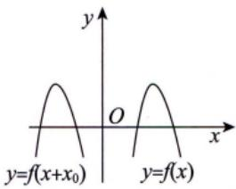
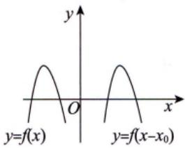
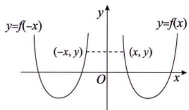
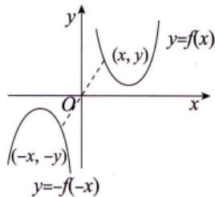
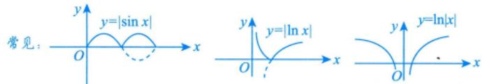

## 附录1
## 图像变换

图像变换方式一般有如下三种

(1) 平移变换.

①将函数y=f(x)的图像沿x轴向左平移 $x_{0}(x_{0} > 0)$ 个单位长度，得到函数 $y = f(x + x_{0})$ 的图像[见图1(a)]；将函数y =f(x)的图像沿x轴向右平移 $x_{0}(x_{0} > 0)$ 个单位长度，得到函数 $y = f(x - x_{0})$ 的图像[见图 1(b)].

  
(a)

  
(b)  
图1

②将函数y=f(x)的图像沿y轴向上平移 $y_{0}(y_{0} > 0)$ 个单位长度，得到函数 $y = f(x) + y_0$ 的图像[见图 2(a)]； 将函数 $y = f(x)$ 的图像沿y轴向下平移 $y_{0}(y_{0} > 0)$ 个单位长度，得到函数 $y = f(x) - y_{0}$ 的图像[见图 2(b)].

  
(a)

  
(b)  
图2

(2) 对称变换.

①将函数y=f(x)的图像关于x轴对称，得到函数y=-f(x)的图像[见图 3(a)]

②将函数y =f(x)的图像关于y轴对称，得到函数y=f(-x)的图像[见图 3(b)]

  
(a)

  
(b)  
图3

③将函数 $y = f(x)$ 的图像关于原点对称，得到函数 $y = - f( - x )$ 的图像[见图 4(a)].

④将函数 $y = f(x)$ 的图像关于直线 $y = x$ 对称，得到函数 $y = f ^ { - 1 } ( x )$ 的图像 [ 见图 4(b)].

  
(a)

  
(b)  
图4

⑤保留函数 $y = f(x)$ 在x轴及x轴上方的部分，把x轴下方的部分关于x轴对称到x轴上方并去掉原来下方的部分，得到函数 $y = \left| f(x) \right|$ 的图像[见图 5(a)].

⑥保留函数 $y = f(x)$ 在y轴及y轴右侧的部分，去掉y轴左侧的部分，再将y轴右侧图像关于y轴对称到y轴左侧，得到函数 $y = f( \left |  x \right |  )$ 的图像[见图 5(b)].

  
(a)

  
(b)

图5  

注 $y = f(x) \Rightarrow F(x, y) = f(x) - y$

①若 $F(x, y) = F(-x, y)$ ，则 $y = f(x)$ 关于y轴(x=0)对称.←对应

②若 $F(x, y) = F(2T - x, y)$ 或 $F(T + x, y) = F(T - x, y)$ ，则 $y = f(x)$ 关于 $x = T$ 对称.

③若 $F(x, y) = F(x, -y)$ ，则 $y = f(x)$ 关于x轴(y=0)对称.←对应

④若 $F(x, y) = F(x, 2T - y)$ 或 $F(x,T+y)=F(x,T-y)$ ，则 $y = f(x)$ 关于y=T对称.

⑤若 $F(x, y) = F(-x, -y)$ ，则 y = f(x) 关于(0, 0) 点对称.

⑥若 $F(a+x,y)=F(a-x,-y)$ ，则 y = f(x)关于(a, 0) 点对称.

⑦若 $F(x, y) = F(y, x)$ ，则 y = f(x)关于 y =x对称.

以上结论中，②，④，⑥分别是①，③，⑤的更一般结论，将原对称性进行“平移”，要重视.

如

$$
y^{2}=x^{3}-x^{4}, \quad y^{2}=(1-x^{2})^{3}, \quad x^{3}+y^{3}-3xy=0
$$

$$
F(x,y)=x^{3}-x^{4}-y^{2}
$$

关于x轴，y轴，(0，0)点对称：

$$
F(x,y)=(1-x^{2})^{3}-y^{2}
$$

$$
F(x,y)=x^{3}+y^{3}-3xy
$$

$$
F(x,y)=F(y,x)
$$

$$
F(x,y)=F(x,-y)
$$

$$
\begin{cases}x = t - \sin t, \\y = 1 - \cos t.\end{cases}
$$

$$
F(x,y)=F(-x,-y)
$$

$$
\left\{ \begin{aligned} x_{2} &= (2\pi - t) - \sin(2\pi - t) = 2\pi - (t - \sin t) = 2\pi - x_{1}, \\ y_{2} &= 1 - \cos(2\pi - t) = 1 - \cos t = y_{1}, \end{aligned} \right.  即  F(x_{1}, y_{1}) = F(2\pi - x_{1}, y_{1})
$$

关于x=π对称

(3) 伸缩变换.

①水平伸缩： $y = f(kx)(k > 1)$ 的图像，可由 $y = f(x)$ 的图像上每点的横坐标缩短到原来的 $\frac{1}{k}$ 倍且纵坐标不变得到[见图6(a)]; $y = f(kx)(0 < k < 1)$ 的图像，可由 $y = f(x)$ 的图像上每点的横坐标伸长到原来的 $\frac{1}{k}$ 倍且纵坐标不变得到.

②垂直伸缩： $y = k f(x) (k > 1)$ 的图像，可由 $y = f(x)$ 的图像上每点的纵坐标伸长到原来的k倍且横坐标不变得到[见图6(b)] $y = k f(x) (0 < k < 1)$ 的图像，可由 $y = f(x)$ 的图像上每点的纵坐标缩短到原来的k倍且横坐标不变得到.

  
(a)

图6  
  
(b)

(b)
