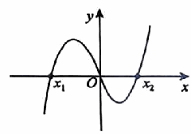
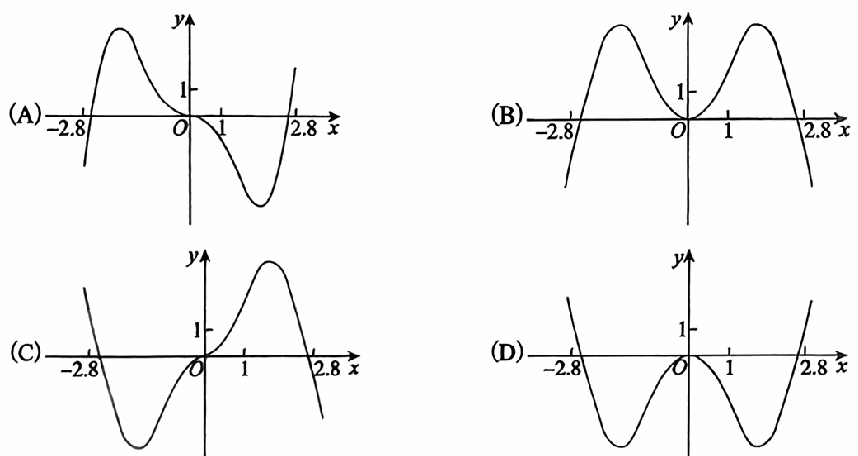

# 《张宇1000题》 · 基础篇 · 第0章 零基础

> 本章节收录第 1 页至第 16 页共 16 道题。

---

### 【ZY1000-JC-GS00-T01】第 1 题（P1）

1. “$\sin^2\alpha + \sin^2\beta = 1$”是“$\sin\alpha + \cos\beta = 0$”的（ ）.

- **A.** 充分非必要条件
- **B.** 必要非充分条件
- **C.** 充分必要条件
- **D.** 既非充分又非必要条件

> **【唯一编号】** `ZY1000-JC-GS00-T01`
> **【科目】** 基础篇
> **【专题】** 第0章 零基础

---

### 【ZY1000-JC-GS00-T02】第 2 题（P2）

2. 证明:对任意正整数n,均有2n+2>n2.

> **【唯一编号】** `ZY1000-JC-GS00-T02`
> **【科目】** 基础篇
> **【专题】** 第0章 零基础

---

### 【ZY1000-JC-GS00-T03】第 3 题（P3）

3. 设实数a\in (0, 1) .数列{x n }
1
满足x =1,且对任意正整数n,均有x = +a.证明:对任意正整 0 n x
n-1
数n,有x >1.
n

> **【唯一编号】** `ZY1000-JC-GS00-T03`
> **【科目】** 基础篇
> **【专题】** 第0章 零基础

---

### 【ZY1000-JC-GS00-T04】第 4 题（P4）

4. (2a3+ab2+b3 ) (a2b-ab2 )
=_____。

> **【唯一编号】** `ZY1000-JC-GS00-T04`
> **【科目】** 基础篇
> **【专题】** 第0章 零基础

---

### 【ZY1000-JC-GS00-T05】第 5 题（P5）

\lambda4-3\lambda3-6\lambda2+16\lambda
\lambda2-2\lambda

> **【唯一编号】** `ZY1000-JC-GS00-T05`
> **【科目】** 基础篇
> **【专题】** 第0章 零基础

---

### 【ZY1000-JC-GS00-T06】第 6 题（P6）

6. 设函数f(x)
x2
= ,则f)1
1+x2
) +f(2) +f(3) +f(4)
1
+f)
2
)
1
+f)
3
)
1
+f)
4
)
=_____.

> **【唯一编号】** `ZY1000-JC-GS00-T06`
> **【科目】** 基础篇
> **【专题】** 第0章 零基础

---

### 【ZY1000-JC-GS00-T07】第 7 题（P7）

7. 设f(x) 在[0, 1] 上有定义,f(0) =f(1) ,且对任意x 1 ,x_2 \in [0, 1] ,均有
f)x
1
(-f)x
2
) | |\le |x -x |.
1 2
证明:当a,b\in [0, 1] 时, f(a) -f(b)
1
| |\le  .
2

> **【唯一编号】** `ZY1000-JC-GS00-T07`
> **【科目】** 基础篇
> **【专题】** 第0章 零基础

---

### 【ZY1000-JC-GS00-T08】第 8 题（P8）

4
8. 设x>0,求函数y=x+ 的最小值.
x2

> **【唯一编号】** `ZY1000-JC-GS00-T08`
> **【科目】** 基础篇
> **【专题】** 第0章 零基础

---

### 【ZY1000-JC-GS00-T09】第 9 题（P9）

9. 设实数x,y满足3x2+2y2=6,求2x+y的最大值.

> **【唯一编号】** `ZY1000-JC-GS00-T09`
> **【科目】** 基础篇
> **【专题】** 第0章 零基础

---

### 【ZY1000-JC-GS00-T10】第 10 题（P10）

10. 函数f(x) =ax3+bx2-2x)a,b\in R,ab\neq 0 )
的图像如图所示，且x +x <0，则有( ). 1 2
A. a>0,b>0
B. a<0,b<0
C. a<0,b>0
D. a>0,b<0

> **【唯一编号】** `ZY1000-JC-GS00-T10`
> **【科目】** 基础篇
> **【专题】** 第0章 零基础

---

### 【ZY1000-JC-GS00-T11】第 11 题（P11）

11. 设函数f(x) 满足af(x)
1
+f)
x
) =ax,其中x\neq 0,a2\neq 1,求函数f(x)
的表达式.

> **【唯一编号】** `ZY1000-JC-GS00-T11`
> **【科目】** 基础篇
> **【专题】** 第0章 零基础

---

### 【ZY1000-JC-GS00-T12】第 12 题（P12）

\pi
12. 已知cos) -\theta
12
)
1 5\pi
= ,则sin) +\theta
3 12
)
的值为_____.

> **【唯一编号】** `ZY1000-JC-GS00-T12`
> **【科目】** 基础篇
> **【专题】** 第0章 零基础

---

### 【ZY1000-JC-GS00-T13】第 13 题（P13）

13. 已知|x -3|<1,|x -3|<1.求证:
1 2
(1)4<x +x <8,|x -x |<2;
1 2 1 2
(2)若f(x) =x2-x+1，且x \neq x ，则|x -x |< f(x_1 2 1 2 1) -f(x_2)
| |<7|x -x |. 1 2

> **【唯一编号】** `ZY1000-JC-GS00-T13`
> **【科目】** 基础篇
> **【专题】** 第0章 零基础

---

### 【ZY1000-JC-GS00-T14】第 14 题（P14）

14. 已知等差数列{a n } 满足(a +a_1 2 ) +(a +a_2 3 ) +⋯+(a n +a n+1 ) =2n(n+1 ) (n\in N + ) .求:
(1)数列{a n } 的通项公式；
a
(2)数列{  n
2n-1
{
的前n项和S . n

> **【唯一编号】** `ZY1000-JC-GS00-T14`
> **【科目】** 基础篇
> **【专题】** 第0章 零基础

---

### 【ZY1000-JC-GS00-T15】第 15 题（P15）

15. 函数y=-x2+(ex-e-x ) sinx在区间]-2.8,2.8 ]
的图像大致为( ).

> **【唯一编号】** `ZY1000-JC-GS00-T15`
> **【科目】** 基础篇
> **【专题】** 第0章 零基础

---

### 【ZY1000-JC-GS00-T16】第 16 题（P16）

16. 已知曲线C的极坐标方程是r=1,以极点为原点,极轴为x轴的正半轴建立平面直角坐标系，直
t
{  x=1+
2
,
线l的参数方程为 (t为参数).
3
y=2+ t
2
(1)写出直线l与曲线C的直角坐标方程；
x'=3x,
(2)设曲线C经过伸缩变换 {  得到曲线C'，设曲线C'上任一点为M)x,y
y'=y
)
x ，求 + 3y的最
3
小值.

> **【唯一编号】** `ZY1000-JC-GS00-T16`
> **【科目】** 基础篇
> **【专题】** 第0章 零基础

---

