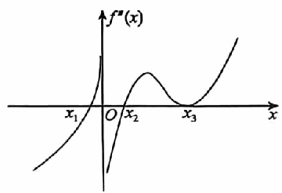

# 《张宇1000题》 · 基础篇 · 第5章 一元函数微分学的应用(一)——几何应用

> 本章节收录第 85 页至第 108 页共 24 道题。

---

### 【ZY1000-JC-GS05-T01】第 1 题（P85）

e-x
1. 函数y=ex+ 的最小值为_____.
2

> **【唯一编号】** `ZY1000-JC-GS05-T01`
> **【科目】** 基础篇
> **【专题】** 第5章 一元函数微分学的应用(一)——几何应用

---

### 【ZY1000-JC-GS05-T02】第 2 题（P86）

2. 若函数f(x)
=e-ax-ex的极值点小于零，则常数a的取值范围为_____.

> **【唯一编号】** `ZY1000-JC-GS05-T02`
> **【科目】** 基础篇
> **【专题】** 第5章 一元函数微分学的应用(一)——几何应用

---

### 【ZY1000-JC-GS05-T03】第 3 题（P87）

3. 设函数f(x)
{
cos|x|-1, x\le 0,
= 则x=0是f)x
xlnx, x>0,
)
的( ).
- **A.** 可导点,极值点
- **B.** 不可导点,极值点
- **C.** 可导点,非极值点
- **D.** 不可导点,非极值点

> **【唯一编号】** `ZY1000-JC-GS05-T03`
> **【科目】** 基础篇
> **【专题】** 第5章 一元函数微分学的应用(一)——几何应用

---

### 【ZY1000-JC-GS05-T04】第 4 题（P88）

10
4. 已知x2+ax-3\ge  )x>0
3
)
恒成立,则a的取值范围为_____.

> **【唯一编号】** `ZY1000-JC-GS05-T04`
> **【科目】** 基础篇
> **【专题】** 第5章 一元函数微分学的应用(一)——几何应用

---

### 【ZY1000-JC-GS05-T05】第 5 题（P89）

5. 已知函数y=f(x) 连续,其二阶导函数的图像如图所示,则曲线y=f(x)
的拐点个数为( ).
- **A.** 1
- **B.** 2
- **C.** 3
- **D.** 4

> **【唯一编号】** `ZY1000-JC-GS05-T05`
> **【科目】** 基础篇
> **【专题】** 第5章 一元函数微分学的应用(一)——几何应用

---

### 【ZY1000-JC-GS05-T06】第 6 题（P90）

6. 设函数f(x) >0且二阶可导,曲线y= f(x) 有拐点(1, 2) ,f' (1 ) =2,则f'' (1 )
=_____.

> **【唯一编号】** `ZY1000-JC-GS05-T06`
> **【科目】** 基础篇
> **【专题】** 第5章 一元函数微分学的应用(一)——几何应用

---

### 【ZY1000-JC-GS05-T07】第 7 题（P91）

7. 曲线y(x)
=ln|e2x-1|的斜渐近线为( ).
1 1
- **A.** y=2x+
- **B.** y=2x
- **C.** y=-2x+
- **D.** y=-2x
e e

> **【唯一编号】** `ZY1000-JC-GS05-T07`
> **【科目】** 基础篇
> **【专题】** 第5章 一元函数微分学的应用(一)——几何应用

---

### 【ZY1000-JC-GS05-T08】第 8 题（P92）

1
8. 曲线y=xln)e+
x
)
的斜渐近线为( ).
1 1
- **A.** y=x+e
- **B.** y=x-e
- **C.** y=x+
- **D.** y=x-
e e

> **【唯一编号】** `ZY1000-JC-GS05-T08`
> **【科目】** 基础篇
> **【专题】** 第5章 一元函数微分学的应用(一)——几何应用

---

### 【ZY1000-JC-GS05-T09】第 9 题（P93）

9. 曲线x2-xy+y2=1在点(1, 1)
处的曲率为_____.

> **【唯一编号】** `ZY1000-JC-GS05-T09`
> **【科目】** 基础篇
> **【专题】** 第5章 一元函数微分学的应用(一)——几何应用

---

### 【ZY1000-JC-GS05-T10】第 10 题（P94）

10. 已知曲线y= f(x) 在其点(0, 1) 处的曲率圆方程为(x-1 ) 2 +y2=2,且当x\to 0时,二阶可导函
数f(x) 与a+bx+cx2的差为o(x2 )
,则( ).
3
- **A.** a=0,b=1,c=
- **B.** a=1,b=0,c=1
- **C.** a=1,b=1,c=-1
- **D.** a=1,b=0,c=-1
2

> **【唯一编号】** `ZY1000-JC-GS05-T10`
> **【科目】** 基础篇
> **【专题】** 第5章 一元函数微分学的应用(一)——几何应用

---

### 【ZY1000-JC-GS05-T11】第 11 题（P95）

11. 设在(-\infty, +\infty) 内,f'' (x ) <0,f(0)
f)x
\ge 0,则函数
)
( ).
x
A. 在(-\infty, 0) 内单调减少,在(0, +\infty) 内单调增加
B. 在(-\infty, 0) 和(0, +\infty) 内单调减少
C. 在(-\infty, 0) 内单调增加,在(0, +\infty) 内单调减少
D. 在(-\infty, 0) 和(0, +\infty)
内单调增加

> **【唯一编号】** `ZY1000-JC-GS05-T11`
> **【科目】** 基础篇
> **【专题】** 第5章 一元函数微分学的应用(一)——几何应用

---

### 【ZY1000-JC-GS05-T12】第 12 题（P96）

12. 设f(x)
f)x
连续,且lim
x\to 0
)
=k)k<0
x2
) ,则f(x) 在点x=0处( ).
A. 导数不存在 B. 导数存在,且f' (0 )
\neq 0
C. 取得极小值 D. 取得极大值

> **【唯一编号】** `ZY1000-JC-GS05-T12`
> **【科目】** 基础篇
> **【专题】** 第5章 一元函数微分学的应用(一)——几何应用

---

### 【ZY1000-JC-GS05-T13】第 13 题（P97）

13. 设M=max{1, 2,3 3,⋯,n n})n>4 )
,则M=( )
- **A.** 2
- **B.** 3 3
- **C.** 4 4
- **D.** n n

> **【唯一编号】** `ZY1000-JC-GS05-T13`
> **【科目】** 基础篇
> **【专题】** 第5章 一元函数微分学的应用(一)——几何应用

---

### 【ZY1000-JC-GS05-T14】第 14 题（P98）

14. 设函数f(x)
x
=n2en -(1+n ) x,若f(x)
在x=\xi 处取得极值,则lim\xi =_____. n n
n\to \infty

> **【唯一编号】** `ZY1000-JC-GS05-T14`
> **【科目】** 基础篇
> **【专题】** 第5章 一元函数微分学的应用(一)——几何应用

---

### 【ZY1000-JC-GS05-T15】第 15 题（P99）

|lnx|
15. 曲线y=x+ ( ).
x
A. 有铅直渐近线,也有斜渐近线 B. 有水平渐近线,也有斜渐近线
C. 有且仅有铅直渐近线 D. 有且仅有水平渐近线

> **【唯一编号】** `ZY1000-JC-GS05-T15`
> **【科目】** 基础篇
> **【专题】** 第5章 一元函数微分学的应用(一)——几何应用

---

### 【ZY1000-JC-GS05-T16】第 16 题（P100）

16. 设函数f(x) 在[0, 1] 上可导，f(0) =0，f' (x ) 严格单调递增，则对任意x\in (0, 1) ，有( ).
A. f(x) >f' (0 ) x>f(1) x B. f' (0 ) x>f(x) >f(1) x
C. f(1) x>f' (0 ) x>f(x) D. f(1) x>f(x) >f' (0 )
x

> **【唯一编号】** `ZY1000-JC-GS05-T16`
> **【科目】** 基础篇
> **【专题】** 第5章 一元函数微分学的应用(一)——几何应用

---

### 【ZY1000-JC-GS05-T17】第 17 题（P101）

17. 已知函数y=f(x) 对一切x满足3 x f'' (x ) +xf' (x ) =e-x-1,若f' (x_0 ) =0(x \neq 0 0 ) ,则( )
A. x=x_0 是f(x) 的极小值点 B. x=x_0 是f(x) 的极大值点
C. x ,f(x_0 0) ) ) 是曲线y=f(x)
的拐点 D. 以上结论均不正确

> **【唯一编号】** `ZY1000-JC-GS05-T17`
> **【科目】** 基础篇
> **【专题】** 第5章 一元函数微分学的应用(一)——几何应用

---

### 【ZY1000-JC-GS05-T18】第 18 题（P102）

18. 已知函数f(x) =ax3+x2+2在x=0和x=-1处取得极值,求f(x)
的增减区间、极大值、极小
值和拐点.

> **【唯一编号】** `ZY1000-JC-GS05-T18`
> **【科目】** 基础篇
> **【专题】** 第5章 一元函数微分学的应用(一)——几何应用

---

### 【ZY1000-JC-GS05-T19】第 19 题（P103）

19. 设f(x) =nx(1-x(n )n\in N + ) ，且记M(n ) = max
x\in [0, 1]
f(x) ，则必有( ).
A. limM)n
n\to \infty
) =e B. limM)n
n\to \infty
)
1
= C. limM)n
e n\to \infty
) =0 D. limM)n
n\to \infty
)
=\infty

> **【唯一编号】** `ZY1000-JC-GS05-T19`
> **【科目】** 基础篇
> **【专题】** 第5章 一元函数微分学的应用(一)——几何应用

---

### 【ZY1000-JC-GS05-T20】第 20 题（P104）

x2+1
20. 曲线y= 的渐近线的条数为( ).
x2-1
- **A.** 4
- **B.** 3
- **C.** 2
- **D.** 1

> **【唯一编号】** `ZY1000-JC-GS05-T20`
> **【科目】** 基础篇
> **【专题】** 第5章 一元函数微分学的应用(一)——几何应用

---

### 【ZY1000-JC-GS05-T21】第 21 题（P105）

2+e-x4
21. 曲线y= ( ).
1-e-x4
A. 仅有斜渐近线 B. 仅有水平渐近线
C. 仅有铅直渐近线 D. 既有水平渐近线,又有铅直渐近线

> **【唯一编号】** `ZY1000-JC-GS05-T21`
> **【科目】** 基础篇
> **【专题】** 第5章 一元函数微分学的应用(一)——几何应用

---

### 【ZY1000-JC-GS05-T22】第 22 题（P106）

22. 曲线y=(4+5x )
1
ex 的斜渐近线是_____.

> **【唯一编号】** `ZY1000-JC-GS05-T22`
> **【科目】** 基础篇
> **【专题】** 第5章 一元函数微分学的应用(一)——几何应用

---

### 【ZY1000-JC-GS05-T23】第 23 题（P107）

1
23. 曲线y=ex x2-4x+1的渐近线条数为( ).
- **A.** 1
- **B.** 2
- **C.** 3
- **D.** 4

> **【唯一编号】** `ZY1000-JC-GS05-T23`
> **【科目】** 基础篇
> **【专题】** 第5章 一元函数微分学的应用(一)——几何应用

---

### 【ZY1000-JC-GS05-T24】第 24 题（P108）

24. 曲线x2=y+1在点(0, -1)
的曲率圆方程为_____.

> **【唯一编号】** `ZY1000-JC-GS05-T24`
> **【科目】** 基础篇
> **【专题】** 第5章 一元函数微分学的应用(一)——几何应用

---

