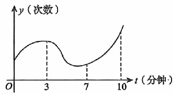

# 《张宇1000题》 · 基础篇 · 第7章 一元函数微分学的应用(三)——物理应用

> 本章节收录第 131 页至第 135 页共 5 道题。

---

### 【ZY1000-JC-GS07-T01】第 1 题（P131）

1. 一动点P在曲线9y=4x2上运动,设坐标轴的单位长度是1cm,若点P横坐标的变化率是30cm/s，
则当点P经过点(3, 4)
时，点P到原点距离的变化率为_____.

> **【唯一编号】** `ZY1000-JC-GS07-T01`
> **【科目】** 基础篇
> **【专题】** 第7章 一元函数微分学的应用(三)——物理应用

---

### 【ZY1000-JC-GS07-T02】第 2 题（P132）

2. 设二阶可导函数y=f(t)
表示某人在10分钟内心跳次数的变化曲线，如图所示.则关于此人心跳
次数的增长速度，说法正确的是( ).
A. 0∼3分钟增速变大;7∼10分钟增速变大 B. 0∼3分钟增速变大;7∼10分钟增速变小
C. 0∼3分钟增速变大;7∼10分钟增速变大 D. 0∼3分钟增速变小;7∼10分钟增速变小

> **【唯一编号】** `ZY1000-JC-GS07-T02`
> **【科目】** 基础篇
> **【专题】** 第7章 一元函数微分学的应用(三)——物理应用

---

### 【ZY1000-JC-GS07-T03】第 3 题（P133）

\pi
3. 已知一容器中水增加的速率为1m3/min,且水的体积V与水面高度y满足V= y2,当水面上升到
2
高为1m时,求水面高度上升的速率.

> **【唯一编号】** `ZY1000-JC-GS07-T03`
> **【科目】** 基础篇
> **【专题】** 第7章 一元函数微分学的应用(三)——物理应用

---

### 【ZY1000-JC-GS07-T04】第 4 题（P134）

4. 已知某圆柱体底面半径与高随时间变化的速率分别为2cm/s,-3cm/s，且圆柱体的体积与表面积
随时间变化的速率分别为-100\picm3/s,40\picm2/s，则圆柱体的底面半径与高分别为( ).
- **A.** 5cm,5cm
- **B.** 10cm,5cm
- **C.** 5cm,10cm
- **D.** 10cm,10cm

> **【唯一编号】** `ZY1000-JC-GS07-T04`
> **【科目】** 基础篇
> **【专题】** 第7章 一元函数微分学的应用(三)——物理应用

---

### 【ZY1000-JC-GS07-T05】第 5 题（P135）

5. 一物体在距离同一水平面上的地面观测器10m处离地匀速垂直上升,其速度为am/s.若该物体上
1
升到离地20m时,观测器视线倾角的变化率为 ,则a=( ).
10
- **A.** 1
- **B.** 2
- **C.** 3
- **D.** 5

> **【唯一编号】** `ZY1000-JC-GS07-T05`
> **【科目】** 基础篇
> **【专题】** 第7章 一元函数微分学的应用(三)——物理应用

---

