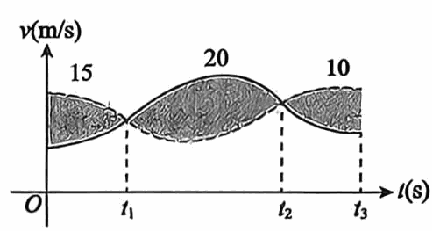

# 《张宇1000题》 · 基础篇 · 第8章 一元函数积分学的概念与性质

> 本章节收录第 136 页至第 160 页共 25 道题。

---

### 【ZY1000-JC-GS08-T01】第 1 题（P136）

1. 设函数f(x) 在区间[0, 1]
1
上连续,则\int  f)x
0
) dx=( ).
n
3k-1
A. lim\sum  f)
n\to \infty 3n
k=1
)
n
1 3k-1
B. lim\sum  f)
3n n\to \infty 3n
k=1
)
1
n
3n
k-1
C. lim\sum  f)
n\to \infty 3n
k=1
)
3n
1 k
D. lim\sum  f)
n n\to \infty 3n
k=1
)
3
n

> **【唯一编号】** `ZY1000-JC-GS08-T01`
> **【科目】** 基础篇
> **【专题】** 第8章 一元函数积分学的概念与性质

---

### 【ZY1000-JC-GS08-T02】第 2 题（P137）

1 1 2 2. lim ln +4ln +⋯+)n-1
n\to \inftyn3 n n
) [ ] 2 ln n-1
[ n
[][
=_____.

> **【唯一编号】** `ZY1000-JC-GS08-T02`
> **【科目】** 基础篇
> **【专题】** 第8章 一元函数积分学的概念与性质

---

### 【ZY1000-JC-GS08-T03】第 3 题（P138）

3. 甲、乙两人赛跑,图中实线和虚线分别为甲和乙的速度曲线(单位:m/s),三块阴影部分面积依次为
15,20,10,且当t=0时,甲在乙前面10m处,则在]0,t
3
]
上,甲、乙相遇的次数为( ).
A. 1
B. 2
C. 4
D. 4

> **【唯一编号】** `ZY1000-JC-GS08-T03`
> **【科目】** 基础篇
> **【专题】** 第8章 一元函数积分学的概念与性质

---

### 【ZY1000-JC-GS08-T04】第 4 题（P139）

1 4. 设M= 2 )1+ x
-1
2
1+x2
(1 )1+x \int  dx,N=
0
(ln2 )1+x )
1 ex \int  dx,K=\int  dx,则( ).
x2
0
1+x
- **A.** M>N>K
- **B.** N>K>M
- **C.** K>M>N
- **D.** K>N>M

> **【唯一编号】** `ZY1000-JC-GS08-T04`
> **【科目】** 基础篇
> **【专题】** 第8章 一元函数积分学的概念与性质

---

### 【ZY1000-JC-GS08-T05】第 5 题（P140）

5. 设f(x) 是(0, +\infty) 内的正值连续函数,且f' (x ) <0,g(x)
x
=\int  f)t
1
)
1
dt,则g)
2
)
3
和g)
2
)
的可能取
值是( ).
- **A.** -2,1
- **B.** -2,3
- **C.** 2,-1
- **D.** 2,-3

> **【唯一编号】** `ZY1000-JC-GS08-T05`
> **【科目】** 基础篇
> **【专题】** 第8章 一元函数积分学的概念与性质

---

### 【ZY1000-JC-GS08-T06】第 6 题（P141）

6. 设f(x)
{ xlnx, x>0, b
= 若\int  f)x
x2+x, x\le 0, a
(dx)a<b ) 取得最小值,则(a, b) =( ).
- **A.** (-1, 1)
- **B.** (-1, 2)
- **C.** (0, 1)
- **D.** (1, 2)

> **【唯一编号】** `ZY1000-JC-GS08-T06`
> **【科目】** 基础篇
> **【专题】** 第8章 一元函数积分学的概念与性质

---

### 【ZY1000-JC-GS08-T07】第 7 题（P142）

7. 设函数g(x) 在[ ]0, \pi
[ 2
[][ \pi 上连续,若在)0,
2
) 内g' (x ) \pi \ge 0,则对任意的x\in )0,
2
) ,有( ).
\pi
A. \int 2 g)t
x
)
\pi
dt\ge \int 2 g)sint
x
)
1
dt B. \int  g)t
x
)
1
dt\le \int  g)sint
x
) dt
1
C. \int  g)t
x
)
1
dt\ge \int  g)sint
x
)
\pi
dt D. \int 2 g)t
x
)
\pi
dt\le \int 2 g)sint
x
)
dt

> **【唯一编号】** `ZY1000-JC-GS08-T07`
> **【科目】** 基础篇
> **【专题】** 第8章 一元函数积分学的概念与性质

---

### 【ZY1000-JC-GS08-T08】第 8 题（P143）

8. 若 1-x2是xf(x)
1 1
的一个原函数，则
0 f(x)
\int  dx=( ).
\pi \pi
- **A.** -1
- **B.** 
- **C.** -
- **D.** 1
4 4

> **【唯一编号】** `ZY1000-JC-GS08-T08`
> **【科目】** 基础篇
> **【专题】** 第8章 一元函数积分学的概念与性质

---

### 【ZY1000-JC-GS08-T09】第 9 题（P144）

n
1
9. lim\sum  =_____.
n\to \infty in
i=1

> **【唯一编号】** `ZY1000-JC-GS08-T09`
> **【科目】** 基础篇
> **【专题】** 第8章 一元函数积分学的概念与性质

---

### 【ZY1000-JC-GS08-T10】第 10 题（P145）

10. 设 f(x) 是 (-\infty, +\infty) 上可导的奇函数,任意的x\in  (-\infty, +\infty) ,均有 f(x+1) - f(x) = f(1) ,
1
f)
2
) =0,则以下是偶函数的是( ).
x
A. sinf)t
0
) +f(t+1) ] ]
x
\int  dt B. sinf' )t
0
) +f' (t+1 ) ] ] \int  dt
x
C. cosf)t
0
) +f(t+2) ] ]
x
\int  dt D. cosf' )t
0
) +f' (t+2 ) ] ]
\int  dt

> **【唯一编号】** `ZY1000-JC-GS08-T10`
> **【科目】** 基础篇
> **【专题】** 第8章 一元函数积分学的概念与性质

---

### 【ZY1000-JC-GS08-T11】第 11 题（P146）

11. 设f(x) 是实数集上连续的偶函数,在(-\infty, 0) 上有唯一零点x =-1,且f' (x_0 0 ) =1,则函数F(x )
x
=\int  f)t
0
) dt的严格单调增区间是( ).
- **A.** (-\infty, -1)
- **B.** (-1, +\infty)
- **C.** (-1, 1)
- **D.** (1, +\infty)

> **【唯一编号】** `ZY1000-JC-GS08-T11`
> **【科目】** 基础篇
> **【专题】** 第8章 一元函数积分学的概念与性质

---

### 【ZY1000-JC-GS08-T12】第 12 题（P147）

12. 设 f(x) 在 [0, 2] 上单调连续, f(0) =1,f(2) =2,且对任意x 1 ,x_2 \in  [0, 2]
x +x
总有 f(1 2 2) >
f)x
1
(+f)x
2
)
,g)x
2
) 是f(x)
2
的反函数，P=\int  g)x
1
)
dx，则( ).
- **A.** 3<P<4
- **B.** 2<P<3
- **C.** 1<P<2
- **D.** 0<P<1

> **【唯一编号】** `ZY1000-JC-GS08-T12`
> **【科目】** 基础篇
> **【专题】** 第8章 一元函数积分学的概念与性质

---

### 【ZY1000-JC-GS08-T13】第 13 题（P148）

13. 下列反常积分中,发散的是( ).
- **A.** \int  +\infty xe-xdx
- **B.** \int  +\infty xe-x2 dx
- **C.** \int  +\inftyarctanx dx
- **D.** \int  +\infty x dx
0 -\infty -\infty
1+x2
-\infty
1+x2

> **【唯一编号】** `ZY1000-JC-GS08-T13`
> **【科目】** 基础篇
> **【专题】** 第8章 一元函数积分学的概念与性质

---

### 【ZY1000-JC-GS08-T14】第 14 题（P149）

+\infty lnx
14. 若反常积分
0 (1+x )
\int  dx收敛，则( ).
1-p
x
- **A.** p<1
- **B.** p>1
- **C.** 0\le p<1
- **D.** 0\le p<1

> **【唯一编号】** `ZY1000-JC-GS08-T14`
> **【科目】** 基础篇
> **【专题】** 第8章 一元函数积分学的概念与性质

---

### 【ZY1000-JC-GS08-T15】第 15 题（P150）

15. 下列反常积分收敛的是( ).
- **A.** \int  +\infty 1 dx
- **B.** \int  +\infty e-x2 dx
- **C.** \int  1 1 dx
- **D.** 1 x
2 xlnx 0 -1 sinx 0 ln2 (1+x )
\int  dx

> **【唯一编号】** `ZY1000-JC-GS08-T15`
> **【科目】** 基础篇
> **【专题】** 第8章 一元函数积分学的概念与性质

---

### 【ZY1000-JC-GS08-T16】第 16 题（P151）

1 16. lim n2-1+ n2-22+⋯+ n2-)n-1
n\to \inftyn2
) 2 ] ]
=_____.

> **【唯一编号】** `ZY1000-JC-GS08-T16`
> **【科目】** 基础篇
> **【专题】** 第8章 一元函数积分学的概念与性质

---

### 【ZY1000-JC-GS08-T17】第 17 题（P152）

n
n
17. lim\sum  =_____.
n\to \infty n2+9i2
i=1

> **【唯一编号】** `ZY1000-JC-GS08-T17`
> **【科目】** 基础篇
> **【专题】** 第8章 一元函数积分学的概念与性质

---

### 【ZY1000-JC-GS08-T18】第 18 题（P153）

\pi
18. 定积分I=\int 2 sinx dx的值满足( ).
\pi x
4
1 1 2 2
- **A.** 0\le I\le
- **B.** \le I\le
- **C.** \le I\le 1
- **D.** 1\le I\le 2 2
2 2 2 2

> **【唯一编号】** `ZY1000-JC-GS08-T18`
> **【科目】** 基础篇
> **【专题】** 第8章 一元函数积分学的概念与性质

---

### 【ZY1000-JC-GS08-T19】第 19 题（P154）

19. 设f(x) ≢0为(-\infty, +\infty) 上可导的奇函数，则下列函数为奇函数的是( ).
x
A. x3\int  f' )t
0
)
x
dt B. \int  f)-t
0
)
x
dt C. f' )t
0
) +f(t) ] ]
x
\int  dt D. f)t
0
)
\int  | |dt

> **【唯一编号】** `ZY1000-JC-GS08-T19`
> **【科目】** 基础篇
> **【专题】** 第8章 一元函数积分学的概念与性质

---

### 【ZY1000-JC-GS08-T20】第 20 题（P155）

\pi \pi
20. 设M=\int 2 x cos5xdx,N= 2 )x2sinx+sin2xcosx
-\pi
2
1+x2 -\pi
2
)
\pi
\int  dx,P= 2 )sin3x-cos4x
-\pi
2
)
\int  dx,则有( ).
- **A.** N<P<M
- **B.** M<P<N
- **C.** N<M
 **【唯一编号】** `ZY1000-JC-GS08-T20`
> **【科目】** 基础篇
> **【专题】** 第8章 一元函数积分学的概念与性质

---

### 【ZY1000-JC-GS08-T21】第 21 题（P156）

1 lnx
21. 设a,b为常数，
0 xa )tan\pi x
2
)
\int  dx收敛，则( ).
b
A. a+b>1且b>-2 B. a+b<1且b>-2
C. a+b>1且b<-2 D. a+b<1且b<-2

> **【唯一编号】** `ZY1000-JC-GS08-T21`
> **【科目】** 基础篇
> **【专题】** 第8章 一元函数积分学的概念与性质

---

### 【ZY1000-JC-GS08-T22】第 22 题（P157）

22. 设F(x )
x
= t-]t
0
] ) ) \int  dt,其中]x ] 表示不超过x的最大整数,则F - ' (1 ) -F + ' (1 )
=_____.

> **【唯一编号】** `ZY1000-JC-GS08-T22`
> **【科目】** 基础篇
> **【专题】** 第8章 一元函数积分学的概念与性质

---

### 【ZY1000-JC-GS08-T23】第 23 题（P158）

23. 下列命题中不成立的是( ).
A. 若f(x) 连续,x\in [a, b]
x
,则\int  f)t
a
) dt必为f(x) 的原函数
B. 若f(x) 可积,x\in [a, b] ,则f(x) 在(a, b) 内存在原函数
C. 若f(x) 连续,且为奇函数,x\in [-a, a]
a
,则\int  f)x
-a
) dx=0
D. 若f(x)
a+T
连续,T为其周期,则\int  f)x
a
)
T
dx=\int  f)x
0
)
dx

> **【唯一编号】** `ZY1000-JC-GS08-T23`
> **【科目】** 基础篇
> **【专题】** 第8章 一元函数积分学的概念与性质

---

### 【ZY1000-JC-GS08-T24】第 24 题（P159）

24. 设f(x-5)
4 4
= ,则\int  f)2x+1
x2-10x
0
)
dx( ).
A. 为反常积分,且发散 B. 为反常积分,且收敛
\pi
C. 不是反常积分,且其值为10 D. 不是反常积分,且其值为
4

> **【唯一编号】** `ZY1000-JC-GS08-T24`
> **【科目】** 基础篇
> **【专题】** 第8章 一元函数积分学的概念与性质

---

### 【ZY1000-JC-GS08-T25】第 25 题（P160）

25. 下列表达式中正确的是( ).
2\pi 2\pi
A. \int  |sinx|dx\le \int  sin2xdx
\pi \pi
\pi \pi
B. \int 4 x dx< 4 ) sinx + 1
-\pi
4
1+cosx -\pi
4
1+x4 1+x2
) \int  dx
b
C. \int  f)x
a
)
d
dx\le \int  f)x
c
) dx,[a, b] \subset [c, d] ,f(x) 连续,x\in [c, d]
1
D. f)x
-1
)
1
\int  | |dx=2 f)x
0
) \int  | |dx,f(x) 连续,x\in [-1, 1]

> **【唯一编号】** `ZY1000-JC-GS08-T25`
> **【科目】** 基础篇
> **【专题】** 第8章 一元函数积分学的概念与性质

---

