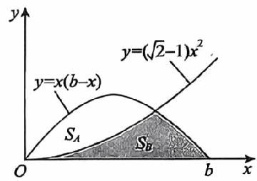
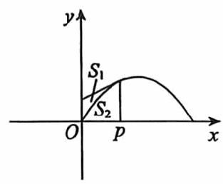

# 《张宇1000题》 · 基础篇 · 第10章 一元函数积分学的应用(一)——几何应用

> 本章节收录第 198 页至第 216 页共 19 道题。

---

### 【ZY1000-JC-GS10-T01】第 1 题（P198）

1
1. 曲线y= 在区间)0,+\infty
x2+4x+5
)
上与x轴所围成的图形的面积为_____.

> **【唯一编号】** `ZY1000-JC-GS10-T01`
> **【科目】** 基础篇
> **【专题】** 第10章 一元函数积分学的应用(一)——几何应用

---

### 【ZY1000-JC-GS10-T02】第 2 题（P199）

lnx
2. 曲线y= 在]1,e2
x
]
上与x轴所围成的图形的面积是_____.

> **【唯一编号】** `ZY1000-JC-GS10-T02`
> **【科目】** 基础篇
> **【专题】** 第10章 一元函数积分学的应用(一)——几何应用

---

### 【ZY1000-JC-GS10-T03】第 3 题（P200）

3. 如图所示，抛物线y=(2-1 ) x2把曲线y=x(b-x) )b>0 )
与x轴所围成的闭区域分成面积为
S 与S 的两部分，则( ).
A B
A. S <S
A B
B. S =S
A B
C. S >S
A B
D. S 与S 的大小关系与b的数值有关
A B

> **【唯一编号】** `ZY1000-JC-GS10-T03`
> **【科目】** 基础篇
> **【专题】** 第10章 一元函数积分学的应用(一)——几何应用

---

### 【ZY1000-JC-GS10-T04】第 4 题（P201）

4. 过点(p, sinp)
作曲线y=sinx的切线(见图),设该曲线与切线及y轴所围成的图形的面积为S ,曲 1
线与直线x=p及x轴所围成的图形的面积为S ,则( ).
2
A. lim S_2 = 1
p\to 0+S
1
+S
2
3
B. lim S_2 = 1
p\to 0+S
1
+S
2
2
C. lim S_2 = 2
p\to 0+S
1
+S
2
3
S
D. lim 2 =1
p\to 0+S
1
+S
2

> **【唯一编号】** `ZY1000-JC-GS10-T04`
> **【科目】** 基础篇
> **【专题】** 第10章 一元函数积分学的应用(一)——几何应用

---

### 【ZY1000-JC-GS10-T05】第 5 题（P202）

5. 平面无界区域D= )x,y( (1+x2 ) {  | |y∣\le 1 {
的面积为_____.

> **【唯一编号】** `ZY1000-JC-GS10-T05`
> **【科目】** 基础篇
> **【专题】** 第10章 一元函数积分学的应用(一)——几何应用

---

### 【ZY1000-JC-GS10-T06】第 6 题（P203）

6. 设平面区域D由曲线段y=sin\pix(0\le x\le 1)
与x轴围成,则D绕y轴旋转一周所成旋转体的体积
为_____.

> **【唯一编号】** `ZY1000-JC-GS10-T06`
> **【科目】** 基础篇
> **【专题】** 第10章 一元函数积分学的应用(一)——几何应用

---

### 【ZY1000-JC-GS10-T07】第 7 题（P204）

7. 已知函数f(x)
xet2
=x\int  dt，则f)x
t
1
) 在(0, 1)
上的平均值为_____.

> **【唯一编号】** `ZY1000-JC-GS10-T07`
> **【科目】** 基础篇
> **【专题】** 第10章 一元函数积分学的应用(一)——几何应用

---

### 【ZY1000-JC-GS10-T08】第 8 题（P205）

8. 已知曲线L:y=e-x(x\ge 0) ,设P是L上的动点,V是L上从点A(0, 1) 到点P的一段弧绕x轴旋转一
1
周所得的旋转体体积,当P运动到点)1,
e
)
时,沿x轴正向的速度为1,求此时V关于时间t的变化
率.

> **【唯一编号】** `ZY1000-JC-GS10-T08`
> **【科目】** 基础篇
> **【专题】** 第10章 一元函数积分学的应用(一)——几何应用

---

### 【ZY1000-JC-GS10-T09】第 9 题（P206）

\pi \pi
9. 曲线y=lnsinx) \le x\le
6 3
)
的弧长为_____.

> **【唯一编号】** `ZY1000-JC-GS10-T09`
> **【科目】** 基础篇
> **【专题】** 第10章 一元函数积分学的应用(一)——几何应用

---

### 【ZY1000-JC-GS10-T10】第 10 题（P207）

10. 曲线r=e\theta从\theta=0到\theta=1的弧长为_____.

> **【唯一编号】** `ZY1000-JC-GS10-T10`
> **【科目】** 基础篇
> **【专题】** 第10章 一元函数积分学的应用(一)——几何应用

---

### 【ZY1000-JC-GS10-T11】第 11 题（P208）

11. 已知函数y=y(x) 由方程y4-6xy+3=0(1\le y\le 2 ) 所确定,则曲线y=y(x)
2
从点) ,1
3
) 到点
19
) ,2
12
)
的长度为_____.

> **【唯一编号】** `ZY1000-JC-GS10-T11`
> **【科目】** 基础篇
> **【专题】** 第10章 一元函数积分学的应用(一)——几何应用

---

### 【ZY1000-JC-GS10-T12】第 12 题（P209）

12. 曲线y=ex与其过原点的切线及y轴所围图形的面积为( ).
1
A. )lny-ylny
0
)
1
\int  dx B. )ex-ex
0
)
e
\int  dx C. )lny-ylny
1
)
e
\int  dx D. )ex-xex
1
)
\int  dx

> **【唯一编号】** `ZY1000-JC-GS10-T12`
> **【科目】** 基础篇
> **【专题】** 第10章 一元函数积分学的应用(一)——几何应用

---

### 【ZY1000-JC-GS10-T13】第 13 题（P210）

13. 曲线y=x2e-x )0\le x<+\infty )
绕x轴旋转一周所得延展到无穷远的旋转体的体积为_____.

> **【唯一编号】** `ZY1000-JC-GS10-T13`
> **【科目】** 基础篇
> **【专题】** 第10章 一元函数积分学的应用(一)——几何应用

---

### 【ZY1000-JC-GS10-T14】第 14 题（P211）

14. 曲线f(x) =xlnx)0<x\le 2 )
绕x轴旋转一周所得旋转体的体积为_____.

> **【唯一编号】** `ZY1000-JC-GS10-T14`
> **【科目】** 基础篇
> **【专题】** 第10章 一元函数积分学的应用(一)——几何应用

---

### 【ZY1000-JC-GS10-T15】第 15 题（P212）

1
15. 曲线y= x2 )0\le x\le 1
2
)
的长度为_____.

> **【唯一编号】** `ZY1000-JC-GS10-T15`
> **【科目】** 基础篇
> **【专题】** 第10章 一元函数积分学的应用(一)——几何应用

---

### 【ZY1000-JC-GS10-T16】第 16 题（P213）

16. 设平面D是由y=lnx,x=1,y=1围成的第一象限的有界区域,记D绕x轴与绕y=1旋转一周
所得旋转体的体积分别为V,V,则( ).
1 2
\pi \pi \pi \pi
- **A.** V > >V
- **B.** V > >V
- **C.** >V >V
- **D.** >V >V
1 2 2 2 2 1 2 1 2 2 2 1

> **【唯一编号】** `ZY1000-JC-GS10-T16`
> **【科目】** 基础篇
> **【专题】** 第10章 一元函数积分学的应用(一)——几何应用

---

### 【ZY1000-JC-GS10-T17】第 17 题（P214）

17. 曲线y=x2从点(1, 1) 到点(2, 4)
的一段弧绕y轴旋转一周所得旋转体的侧面积为_____.

> **【唯一编号】** `ZY1000-JC-GS10-T17`
> **【科目】** 基础篇
> **【专题】** 第10章 一元函数积分学的应用(一)——几何应用

---

### 【ZY1000-JC-GS10-T18】第 18 题（P215）

x2
18. 函数y= 在区间]0,1
1-x2
]
上的平均值为_____.

> **【唯一编号】** `ZY1000-JC-GS10-T18`
> **【科目】** 基础篇
> **【专题】** 第10章 一元函数积分学的应用(一)——几何应用

---

### 【ZY1000-JC-GS10-T19】第 19 题（P216）

19. 设平面区域D= (x, y) {  |0\le y\le
x2-1
, 2\le x\le 2
x2
{
,求:
(1)D的面积；
(2)D绕x轴旋转一周所成旋转体的体积.

> **【唯一编号】** `ZY1000-JC-GS10-T19`
> **【科目】** 基础篇
> **【专题】** 第10章 一元函数积分学的应用(一)——几何应用

---

