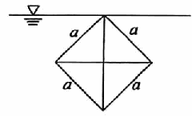

# 《张宇1000题》 · 基础篇 · 第12章 一元函数积分学的应用(三)——物理应用

> 本章节收录第 228 页至第 234 页共 7 道题。

---

### 【ZY1000-JC-GS12-T01】第 1 题（P228）

1. 设沿y轴上的区间[0, 1]
放置一长度为1且线密度为ρ的均匀细杆,在x轴上x=1处有一单位质
点，则该细杆对此质点的引力(G为引力常量)沿x轴正向的分力为_____.

> **【唯一编号】** `ZY1000-JC-GS12-T01`
> **【科目】** 基础篇
> **【专题】** 第12章 一元函数积分学的应用(三)——物理应用

---

### 【ZY1000-JC-GS12-T02】第 2 题（P229）

2. 边长为a的正方形平板置于水面下，且一个顶点与水面相齐，其中一条对角线与水面垂直，如
图所示.记水的密度为ρ，重力加速度为g，则其一侧所受的静水压力为_____.

> **【唯一编号】** `ZY1000-JC-GS12-T02`
> **【科目】** 基础篇
> **【专题】** 第12章 一元函数积分学的应用(三)——物理应用

---

### 【ZY1000-JC-GS12-T03】第 3 题（P230）

3. 将地面上质量为1的物体铅直向上举高，记地球半径为R，质量为M，引力常数为G，则物体摆
脱地球引力所做的功至少为_____.

> **【唯一编号】** `ZY1000-JC-GS12-T03`
> **【科目】** 基础篇
> **【专题】** 第12章 一元函数积分学的应用(三)——物理应用

---

### 【ZY1000-JC-GS12-T04】第 4 题（P231）

4. 有一内表面为旋转抛物面的水缸,其深为a(单位:米)，缸口直径为2a(单位:米)，缸内盛满了水，
设水的密度为ρ(单位:千克/立方米).若以每秒Q立方米的速率将缸中的水全部抽出，问:
(1)共需多少时间？
(2)需做多少功?

> **【唯一编号】** `ZY1000-JC-GS12-T04`
> **【科目】** 基础篇
> **【专题】** 第12章 一元函数积分学的应用(三)——物理应用

---

### 【ZY1000-JC-GS12-T05】第 5 题（P232）

5. 在一个高为1m的圆柱形容器内储存某种液体,并将容器横放.底面圆的方程为x2+y2=1(单位:
m).如果容器内存满了液体后,以0.2m3/min的速率将液体从容器顶端抽出.
(1)当液面在y=0时,求液面下降的速率;
(2)如果1m3液体所受重力为1N，求抽完全部液体需做多少功?

> **【唯一编号】** `ZY1000-JC-GS12-T05`
> **【科目】** 基础篇
> **【专题】** 第12章 一元函数积分学的应用(三)——物理应用

---

### 【ZY1000-JC-GS12-T06】第 6 题（P233）

1
6. 设一单位质量细杆的长为1,G为引力常数.当质量为a的质点在细杆延长线上距杆右端点的 处
2
1
移至 处时，引力做功大小为( ).
3
4 5
- **A.** Galn
- **B.** Galn
- **C.** Galn2
- **D.** Galn3
3 3

> **【唯一编号】** `ZY1000-JC-GS12-T06`
> **【科目】** 基础篇
> **【专题】** 第12章 一元函数积分学的应用(三)——物理应用

---

### 【ZY1000-JC-GS12-T07】第 7 题（P234）

7. 直角三角板的斜边长度为1,将该直角三角板竖直插入水中,并使其中一个直角边与水面对齐，当
三角板受到水的压力最大时，其水平直角边的长度为( ).
3 5 6 2
A. B. C. D.
3 5 3 2

> **【唯一编号】** `ZY1000-JC-GS12-T07`
> **【科目】** 基础篇
> **【专题】** 第12章 一元函数积分学的应用(三)——物理应用

---

