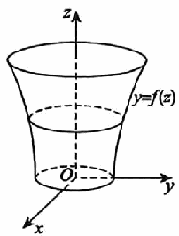

# 《张宇1000题》 · 基础篇 · 第15章 微分方程

> 本章节收录第 283 页至第 303 页共 21 道题。

---

### 【ZY1000-JC-GS15-T01】第 1 题（P283）

1. xdy+ydx=sinxdx满足y(\pi)
=0的特解为_____.

> **【唯一编号】** `ZY1000-JC-GS15-T01`
> **【科目】** 基础篇
> **【专题】** 第15章 微分方程

---

### 【ZY1000-JC-GS15-T02】第 2 题（P284）

2. 已知曲线上任一点的切线在y轴上的截距与法线在x轴上的截距之比为3:1,则该曲线方程为__
___.

> **【唯一编号】** `ZY1000-JC-GS15-T02`
> **【科目】** 基础篇
> **【专题】** 第15章 微分方程

---

### 【ZY1000-JC-GS15-T03】第 3 题（P285）

3. 设y 1 ,y_2 是一阶非齐次线性微分方程y'+p(x) y=q(x)
的两个特解,若常数\lambda,\mu使\lambday +\muy 是该方 1 2
程的解,\lambday -\muy 是该方程对应的齐次方程的解,则( ).
1 2
1 1 1 1 2 1 2 2
- **A.** \lambda= ,\mu=
- **B.** \lambda=- ,\mu=-
- **C.** \lambda= ,\mu=
- **D.** \lambda= ,\mu=
2 2 2 2 3 3 3 3

> **【唯一编号】** `ZY1000-JC-GS15-T03`
> **【科目】** 基础篇
> **【专题】** 第15章 微分方程

---

### 【ZY1000-JC-GS15-T04】第 4 题（P286）

4. 求微分方程(2x-3xy2-y3 )
y'+y3=0的通解.

> **【唯一编号】** `ZY1000-JC-GS15-T04`
> **【科目】** 基础篇
> **【专题】** 第15章 微分方程

---

### 【ZY1000-JC-GS15-T05】第 5 题（P287）

5. 过原点的曲线y=y(x)
dy
满足 =)x+y
dx
) 2 ,则lim y)x
x\to 0+
) ] ]
x =_____.

> **【唯一编号】** `ZY1000-JC-GS15-T05`
> **【科目】** 基础篇
> **【专题】** 第15章 微分方程

---

### 【ZY1000-JC-GS15-T06】第 6 题（P288）

6. 微分方程y'=(x+1 )
secy-tany的通解为_____.

> **【唯一编号】** `ZY1000-JC-GS15-T06`
> **【科目】** 基础篇
> **【专题】** 第15章 微分方程

---

### 【ZY1000-JC-GS15-T07】第 7 题（P289）

7. 设函数y(x)
1 1 1
是微分方程y'+ y=2ex 满足y)
x2 2
) =0的解.
(1)求y=y(x) 的表达式；
(2)求曲线y(x)
的斜渐近线.

> **【唯一编号】** `ZY1000-JC-GS15-T07`
> **【科目】** 基础篇
> **【专题】** 第15章 微分方程

---

### 【ZY1000-JC-GS15-T08】第 8 题（P290）

8. 以yOz面上的平面曲线段y=f(z) (z\ge 0 ) 绕z轴旋转一周所成旋转曲面与xOy面围成一个无上盖
容器(见图),现以3cm3/s的速率把水注入容器内,水面的面积以\picm2/s的速率增大.已知容器底面积
为16\picm2,求曲线y=f(z)
的方程.

> **【唯一编号】** `ZY1000-JC-GS15-T08`
> **【科目】** 基础篇
> **【专题】** 第15章 微分方程

---

### 【ZY1000-JC-GS15-T09】第 9 题（P291）

9. 设f(x)
x
有连续导数,x\in [0, +\infty),且满足方程 )x-1
0
) \int  f(t)
x
dt-\int  ff)t
0
) dt=x,求函数f(x)
.

> **【唯一编号】** `ZY1000-JC-GS15-T09`
> **【科目】** 基础篇
> **【专题】** 第15章 微分方程

---

### 【ZY1000-JC-GS15-T10】第 10 题（P292）

10. 设\varphi(x ) 为连续函数, \varphi(x )
dy
| |\le k(k为常数),求微分方程 +y=\varphi)x
dx
) 满足初始条件y(0) =0的
特解y(x) ,并证明当x\ge 0时,有 y(x) | |\le k(1-e-x )
.

> **【唯一编号】** `ZY1000-JC-GS15-T10`
> **【科目】** 基础篇
> **【专题】** 第15章 微分方程

---

### 【ZY1000-JC-GS15-T11】第 11 题（P293）

11. 设函数y=y(x) 是微分方程2xy'-4y=2lnx-1满足条件y(1)
1
= 的解,求曲线y=y)x
4
) 在
[1, e]
上的平均值.

> **【唯一编号】** `ZY1000-JC-GS15-T11`
> **【科目】** 基础篇
> **【专题】** 第15章 微分方程

---

### 【ZY1000-JC-GS15-T12】第 12 题（P294）

12. 设曲线y=y(x) )x>0 ) 经过点(1, 0) ,该曲线上任一点P(x, y) 到y轴的距离等于该点处的切线在
y轴上的截距,求y(x) 在区间(0, 1)
上与x轴所围平面图形的面积.

> **【唯一编号】** `ZY1000-JC-GS15-T12`
> **【科目】** 基础篇
> **【专题】** 第15章 微分方程

---

### 【ZY1000-JC-GS15-T13】第 13 题（P295）

13. 设曲线y=y(x) 上点P(0, 4) 处的切线垂直于直线x-2y+5=0,且该曲线满足微分方程y''+
2y'+y=0,则此曲线方程为( ).
9 9
A. y= xe-x B. y=(4+ x_2 2 ) e-x C. y=(C x+C_1 2 ) e-x D. y=2(x+2 )
e-x

> **【唯一编号】** `ZY1000-JC-GS15-T13`
> **【科目】** 基础篇
> **【专题】** 第15章 微分方程

---

### 【ZY1000-JC-GS15-T14】第 14 题（P296）

14. 设曲线y=y(x) 经过原点,且在原点处的切线与直线2x+y+6=0平行,而y(x) 满足微分方程
y''-2y'+5y=0，则此曲线的方程为( ).
A. y=exsin2x B. y=-exsin2x
C. y=ex(cos2x-sin2x) D. y=ex(sin2x-cos2x)

> **【唯一编号】** `ZY1000-JC-GS15-T14`
> **【科目】** 基础篇
> **【专题】** 第15章 微分方程

---

### 【ZY1000-JC-GS15-T15】第 15 题（P297）

15. 设y=y(x) 满足y''-2y'+y=0,且y(0) =0,y' (0 )
0
=1,则\int  y)x
-\infty
)
dx=_____.

> **【唯一编号】** `ZY1000-JC-GS15-T15`
> **【科目】** 基础篇
> **【专题】** 第15章 微分方程

---

### 【ZY1000-JC-GS15-T16】第 16 题（P298）

16. 已知某常系数齐次线性微分方程的通解为y=C +ex )C cos2x+C sin2x
1 2 3
)
,则该微分方程为__
___.

> **【唯一编号】** `ZY1000-JC-GS15-T16`
> **【科目】** 基础篇
> **【专题】** 第15章 微分方程

---

### 【ZY1000-JC-GS15-T17】第 17 题（P299）

3x
17. 微分方程4y''-12y'+9y=e2 (3x2+2 ) 的特解形式为( ).
3x
A. Ax2+Bx+C+De2 B. (Ax2+Bx+C )
3x
e2
C. x(Ax2+Bx+C)
3x
e2 D. x2 (Ax2+Bx+C )
3x
e2

> **【唯一编号】** `ZY1000-JC-GS15-T17`
> **【科目】** 基础篇
> **【专题】** 第15章 微分方程

---

### 【ZY1000-JC-GS15-T18】第 18 题（P300）

18. 已知y =xex+e2x,y =xex+e-x,y =xex+e2x-e-x是某二阶常系数非齐次线性微分方程的三
1 2 3
个解,则此微分方程为_____.

> **【唯一编号】** `ZY1000-JC-GS15-T18`
> **【科目】** 基础篇
> **【专题】** 第15章 微分方程

---

### 【ZY1000-JC-GS15-T19】第 19 题（P301）

19. 求微分方程y''-2y'+y=2(3x2-2 )
ex的通解.

> **【唯一编号】** `ZY1000-JC-GS15-T19`
> **【科目】** 基础篇
> **【专题】** 第15章 微分方程

---

### 【ZY1000-JC-GS15-T20】第 20 题（P302）

20. 求微分方程y''+4y'+5y=8cosx,当x\to -\infty时为有界的特解.

> **【唯一编号】** `ZY1000-JC-GS15-T20`
> **【科目】** 基础篇
> **【专题】** 第15章 微分方程

---

### 【ZY1000-JC-GS15-T21】第 21 题（P303）

21. 欧拉方程x2y''+3xy'+3y=0满足条件y(1) =0,y' (1 )
= 2的解为y=_____.

> **【唯一编号】** `ZY1000-JC-GS15-T21`
> **【科目】** 基础篇
> **【专题】** 第15章 微分方程

---

