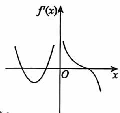
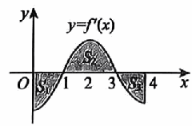

# 《张宇1000题》 · 强化篇 · 第5章 一元函数微分学的应用(一)——几何应用

> 本章节收录第 440 页至第 472 页共 33 道题。

---

### 【ZY1000-QH-GS05-T01】第 1 题（P440）

1. 设f(x) =|ln|x||，则( ).
A. x=1不是f(x) 的极值点 B. (1, 0) 不是y=f(x) 的拐点
C. x=-1不是f(x) 的驻点 D. x=0不是y=f(x)
的渐近线

> **【唯一编号】** `ZY1000-QH-GS05-T01`
> **【科目】** 强化篇
> **【专题】** 第5章 一元函数微分学的应用(一)——几何应用

---

### 【ZY1000-QH-GS05-T02】第 2 题（P441）

2. 设f(x)
f)x
在x=0处连续,且lim
x\to 0
) ] +1 ] x2
=2,则曲线y=f)x
x-sinx
) 在点 0,f(0) ) )
处的切线方程为_
____.

> **【唯一编号】** `ZY1000-QH-GS05-T02`
> **【科目】** 强化篇
> **【专题】** 第5章 一元函数微分学的应用(一)——几何应用

---

### 【ZY1000-QH-GS05-T03】第 3 题（P442）

3. 设f(x) 在[a, b] 上可导,且在点x=a处取最小值,在点x=b处取最大值,则( ).
A. f + ' (a ) \le 0,f - ' (b ) \le 0 B. f + ' (a ) \le 0,f - ' (b ) \ge 0
C. f + ' (a ) \ge 0,f - ' (b ) \le 0 D. f + ' (a ) \ge 0,f - ' (b )
\ge 0

> **【唯一编号】** `ZY1000-QH-GS05-T03`
> **【科目】** 强化篇
> **【专题】** 第5章 一元函数微分学的应用(一)——几何应用

---

### 【ZY1000-QH-GS05-T04】第 4 题（P443）

4. 设函数f(x) =(x2+a ) ex,若f(x)
既没有极值点也没有拐点,则a的取值范围是( ).
- **A.** [0, 1)
- **B.** [1, +\infty)
- **C.** [1, 2)
- **D.** [2, +\infty)

> **【唯一编号】** `ZY1000-QH-GS05-T04`
> **【科目】** 强化篇
> **【专题】** 第5章 一元函数微分学的应用(一)——几何应用

---

### 【ZY1000-QH-GS05-T05】第 5 题（P444）

5. 使得lnx\le a x恒成立的最小正数a为_____.

> **【唯一编号】** `ZY1000-QH-GS05-T05`
> **【科目】** 强化篇
> **【专题】** 第5章 一元函数微分学的应用(一)——几何应用

---

### 【ZY1000-QH-GS05-T06】第 6 题（P445）

6. 设eax\ge 1+x对任意实数x均成立,则a的取值范围为_____.

> **【唯一编号】** `ZY1000-QH-GS05-T06`
> **【科目】** 强化篇
> **【专题】** 第5章 一元函数微分学的应用(一)——几何应用

---

### 【ZY1000-QH-GS05-T07】第 7 题（P446）

7. 设函数f(x)
1
= t)t-x
0
) \int  | |dt)0<x<1 ) ,则f(x) 的单调区间及曲线y=f(x) 的凹凸区间分别为( ).
2
A. 单调增区间) ,1
2
)
2
;单调减区间)0,
2
) ;在(0, 1) 内曲线为凹
2
B. 单调减区间) ,1
2
)
2
;单调增区间)0,
2
) ;在(0, 1) 内曲线为凹
2
C. 单调增区间) ,1
2
)
2
;单调减区间)0,
2
) ;在(0, 1) 内曲线为凸
2
D. 单调减区间) ,1
2
)
2
;单调增区间)0,
2
) ;在(0, 1)
内曲线为凸

> **【唯一编号】** `ZY1000-QH-GS05-T07`
> **【科目】** 强化篇
> **【专题】** 第5章 一元函数微分学的应用(一)——几何应用

---

### 【ZY1000-QH-GS05-T08】第 8 题（P447）

8. 求函数f(x)
x
= )x2-t2
1
(\int  ln)1+t2 )
dt的极值.

> **【唯一编号】** `ZY1000-QH-GS05-T08`
> **【科目】** 强化篇
> **【专题】** 第5章 一元函数微分学的应用(一)——几何应用

---

### 【ZY1000-QH-GS05-T09】第 9 题（P448）

9. 设函数f(x) 在x=0的某邻域内有定义，则以下结论正确的是( ).
A. 若f(0) =0,f' (0 ) =0,则x=0必不是极值点
B. 若f' (0 ) =0,f'' (0 ) =0,则x=0必是极值点
C. 若f(0) =0,f' (0 ) >0,则存在δ>0,使得f(x) 在)0,δ ) 内单调递增
D. 若f' (0 ) =0,f'' (0 ) >0,则存在δ>0,使得f(x) 在)-δ,0 )
内单调递减

> **【唯一编号】** `ZY1000-QH-GS05-T09`
> **【科目】** 强化篇
> **【专题】** 第5章 一元函数微分学的应用(一)——几何应用

---

### 【ZY1000-QH-GS05-T10】第 10 题（P449）

10. 曲线x3-y3=3x2的斜渐近线方程为( ).
- **A.** x+y-1=0
- **B.** x+y+1=0
- **C.** x-y+1=0
- **D.** x-y-1=0

> **【唯一编号】** `ZY1000-QH-GS05-T10`
> **【科目】** 强化篇
> **【专题】** 第5章 一元函数微分学的应用(一)——几何应用

---

### 【ZY1000-QH-GS05-T11】第 11 题（P450）

11. 设f' (x ) 在[0, 1] 上单调增加,f(0) =f' (0 ) =0,则在[0, 1] 上( ).
A. exf(x) 单调增加,e-xf(x) 单调减少 B. exf(x) 单调增加,e-xf(x) 单调增加
C. exf(x) 单调减少,e-xf(x) 单调增加 D. exf(x) 单调减少,e-xf(x)
单调减少

> **【唯一编号】** `ZY1000-QH-GS05-T11`
> **【科目】** 强化篇
> **【专题】** 第5章 一元函数微分学的应用(一)——几何应用

---

### 【ZY1000-QH-GS05-T12】第 12 题（P451）

12. 已知函数y=f(x) 对一切x满足xf'' (x ) +3x f' (x ) ] ] 2 =1-e-x.若f' (x_0 ) =0(x \neq 0 0 ) ,则( ).
A. f(x_0) 是函数f(x) 的极大值
B. f(x_0) 是函数f(x) 的极小值
C. x ,f(x_0 0) ) ) 是曲线y=f(x) 的拐点
D. f(x_0) 不是函数f(x) 的极值, x ,f(x_0 0) ) ) 也不是曲线y=f(x)
的拐点

> **【唯一编号】** `ZY1000-QH-GS05-T12`
> **【科目】** 强化篇
> **【专题】** 第5章 一元函数微分学的应用(一)——几何应用

---

### 【ZY1000-QH-GS05-T13】第 13 题（P452）

y -t2 1 13. 由\int  e 4dt= ) x-2
3
0
) 2所确定的函数y=y(x)
( ).
A. 只有极大值点x=4，极大值为0 B. 只有极小值点x=4,极小值为0
C. 只有极大值点x=0 D. 有极大值点和极小值点分别为x=0,x=4

> **【唯一编号】** `ZY1000-QH-GS05-T13`
> **【科目】** 强化篇
> **【专题】** 第5章 一元函数微分学的应用(一)——几何应用

---

### 【ZY1000-QH-GS05-T14】第 14 题（P453）

14. 设函数f(x) ,g(x) 在[a, b] 上连续,在(a, b) 内可导,g' (x ) >0,则在(a, b)
f' )x
上,“
)
g' (x )
严格单调递
f)x
增”是“
) -f(a)
g(x) -g(a)
严格单调递增”的( )
A. 充分非必要条件 B. 必要非充分条件
C. 充分必要条件 D. 既非充分又非必要条件

> **【唯一编号】** `ZY1000-QH-GS05-T14`
> **【科目】** 强化篇
> **【专题】** 第5章 一元函数微分学的应用(一)——几何应用

---

### 【ZY1000-QH-GS05-T15】第 15 题（P454）

15. 曲线y=(5x-3 )
-1
e x 有渐近线( ).
- **A.** x=0,y=5x+2
- **B.** x=0,y=5x-8
- **C.** x=0,y=5x-3
- **D.** x=0,y=5x-2

> **【唯一编号】** `ZY1000-QH-GS05-T15`
> **【科目】** 强化篇
> **【专题】** 第5章 一元函数微分学的应用(一)——几何应用

---

### 【ZY1000-QH-GS05-T16】第 16 题（P455）

x2-x+1
16. 曲线y= 的渐近线共有( ).
ex-1
- **A.** 1条
- **B.** 2条
- **C.** 3条
- **D.** 4条或4条以上

> **【唯一编号】** `ZY1000-QH-GS05-T16`
> **【科目】** 强化篇
> **【专题】** 第5章 一元函数微分学的应用(一)——几何应用

---

### 【ZY1000-QH-GS05-T17】第 17 题（P456）

17. 曲线r(3\theta-\pi )
=1的斜渐近线为( ).
3 3 2 2
- **A.** y= 2x-
- **B.** y= 2x+
- **C.** y= 3x-
- **D.** y= 3x+
2 2 3 3

> **【唯一编号】** `ZY1000-QH-GS05-T17`
> **【科目】** 强化篇
> **【专题】** 第5章 一元函数微分学的应用(一)——几何应用

---

### 【ZY1000-QH-GS05-T18】第 18 题（P457）

1 1
18. 曲线y=x2ln)sin +cos
x x
)
的斜渐近线为_____.

> **【唯一编号】** `ZY1000-QH-GS05-T18`
> **【科目】** 强化篇
> **【专题】** 第5章 一元函数微分学的应用(一)——几何应用

---

### 【ZY1000-QH-GS05-T19】第 19 题（P458）

)1+1
19. 求曲线y=x2 x
) x [
] ] -1
[ e
[]][
)x>0 )
的斜渐近线.

> **【唯一编号】** `ZY1000-QH-GS05-T19`
> **【科目】** 强化篇
> **【专题】** 第5章 一元函数微分学的应用(一)——几何应用

---

### 【ZY1000-QH-GS05-T20】第 20 题（P459）

20. 设函数f(x)
ln f)x+2
在x=2的某邻域内连续,且有lim
x\to 0
) ]
+ex2
]
=4,则x=2是f)x
1-cosx
)
的( ).
A. 不可导点 B. 驻点且是极大值点
C. 驻点且是极小值点 D. 可导点但不是驻点

> **【唯一编号】** `ZY1000-QH-GS05-T20`
> **【科目】** 强化篇
> **【专题】** 第5章 一元函数微分学的应用(一)——几何应用

---

### 【ZY1000-QH-GS05-T21】第 21 题（P460）

21. 设函数 f(x) 在(-\infty, +\infty) 内连续,其一阶导函数 f' (x ) 的图形如图所示，并设在 f' (x ) 存在处
f'' (x ) 也存在，则曲线y=f(x)
的拐点个数为( ).
A. 1
B. 2
C. 3
D. 4

> **【唯一编号】** `ZY1000-QH-GS05-T21`
> **【科目】** 强化篇
> **【专题】** 第5章 一元函数微分学的应用(一)——几何应用

---

### 【ZY1000-QH-GS05-T22】第 22 题（P461）

22. f(x)
1 1
= + )a>0
1+|x| 1+|x-a|
)
的最大值为( ).
1+a_2+a_1+2a 2+a
A. B. C. D.
2+a_1+a_2+a_1+2a

> **【唯一编号】** `ZY1000-QH-GS05-T22`
> **【科目】** 强化篇
> **【专题】** 第5章 一元函数微分学的应用(一)——几何应用

---

### 【ZY1000-QH-GS05-T23】第 23 题（P462）

23. 设f' (x ) 在区间[0, 4] 上连续,曲线y=f' (x ) 与直线x=0,x=4,y=0围成如图所示的三个区域,
其面积分别为S 1 =3,S_2 =4,S_3 =2,且f(0) =1，则f(x) 在[0, 4]
上的最大值与最小值分别为( ).
A. 2,-3
B. 4,-3
C. 2,-2
D. 4,-2

> **【唯一编号】** `ZY1000-QH-GS05-T23`
> **【科目】** 强化篇
> **【专题】** 第5章 一元函数微分学的应用(一)——几何应用

---

### 【ZY1000-QH-GS05-T24】第 24 题（P463）

\pi
24. 设y=tannx在x= 处的切线在x轴上的截距为x n ,则limy)x n
4 n\to \infty
)
=____.

> **【唯一编号】** `ZY1000-QH-GS05-T24`
> **【科目】** 强化篇
> **【专题】** 第5章 一元函数微分学的应用(一)——几何应用

---

### 【ZY1000-QH-GS05-T25】第 25 题（P464）

x2
25. 过曲线 +y2=1)x>0,y>0
4
)
任意点作该曲线的切线,切线夹在两坐标轴之间的部分为L,求
L的最小长度,以及L的长度达到最小时的切点坐标.

> **【唯一编号】** `ZY1000-QH-GS05-T25`
> **【科目】** 强化篇
> **【专题】** 第5章 一元函数微分学的应用(一)——几何应用

---

### 【ZY1000-QH-GS05-T26】第 26 题（P465）

26. 求f(x)
1
=\int  ln|x-t|dt)0\le x\le 1
0
)
的最大值.

> **【唯一编号】** `ZY1000-QH-GS05-T26`
> **【科目】** 强化篇
> **【专题】** 第5章 一元函数微分学的应用(一)——几何应用

---

### 【ZY1000-QH-GS05-T27】第 27 题（P466）

27. 设y=y(x) 满足微分方程)xy'-2 ) lnx+y=0,y(e) =2.
(1)求y=y(x) 的表达式及其定义域；
(2)求函数y=y(x)
的极值.

> **【唯一编号】** `ZY1000-QH-GS05-T27`
> **【科目】** 强化篇
> **【专题】** 第5章 一元函数微分学的应用(一)——几何应用

---

### 【ZY1000-QH-GS05-T28】第 28 题（P467）

28. 设y=y(x) 满足(xy-1 ) dx+x2dy=0,x>0,y(1) =0,求:
(1)y=y(x) 的表达式;
(2)曲线y=y(x)
的拐点及渐近线.

> **【唯一编号】** `ZY1000-QH-GS05-T28`
> **【科目】** 强化篇
> **【专题】** 第5章 一元函数微分学的应用(一)——几何应用

---

### 【ZY1000-QH-GS05-T29】第 29 题（P468）

1
29. 曲线y=xln)2+
x-1
)
的斜渐近线方程为( ).
1 1
- **A.** y=xln2+1
- **B.** y=xln2+
- **C.** y=xln2-1
- **D.** y=xln2-
2 2

> **【唯一编号】** `ZY1000-QH-GS05-T29`
> **【科目】** 强化篇
> **【专题】** 第5章 一元函数微分学的应用(一)——几何应用

---

### 【ZY1000-QH-GS05-T30】第 30 题（P469）

1 1
30. 求曲线y=x3(ex +ex -2 )
的全部渐近线.

> **【唯一编号】** `ZY1000-QH-GS05-T30`
> **【科目】** 强化篇
> **【专题】** 第5章 一元函数微分学的应用(一)——几何应用

---

### 【ZY1000-QH-GS05-T31】第 31 题（P470）

31. 设函数y=y(x)
x=2et+t+1,
由参数方程
y=4(t-1 )
{
确定,则曲线y=y)x
et+t2
)
在t=0对应点处的曲率为
_____.

> **【唯一编号】** `ZY1000-QH-GS05-T31`
> **【科目】** 强化篇
> **【专题】** 第5章 一元函数微分学的应用(一)——几何应用

---

### 【ZY1000-QH-GS05-T32】第 32 题（P471）

32. 设y=f(x) 是由方程x(1+y) -e y +1=0确定的隐函数,则曲线y=f(x) 在点(0, 0)
处的曲率为
_____.

> **【唯一编号】** `ZY1000-QH-GS05-T32`
> **【科目】** 强化篇
> **【专题】** 第5章 一元函数微分学的应用(一)——几何应用

---

### 【ZY1000-QH-GS05-T33】第 33 题（P472）

33. 设圆与曲线x=y2在(0, 0)
处有公切线且它们关于y的二阶导数值相同,则该圆的方程为___.

> **【唯一编号】** `ZY1000-QH-GS05-T33`
> **【科目】** 强化篇
> **【专题】** 第5章 一元函数微分学的应用(一)——几何应用

---

