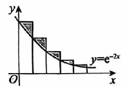
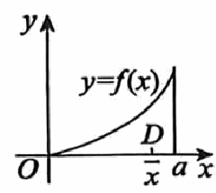

# 《张宇1000题》 · 强化篇 · 第10章 一元函数积分学的应用(一)——几何应用

> 本章节收录第 544 页至第 569 页共 26 道题。

---

### 【ZY1000-QH-GS10-T01】第 1 题（P544）

1. 曲线e y +xy+x3=e在点(0, 1)
处的切线与两坐标轴所围成的三角形的面积为_____.

> **【唯一编号】** `ZY1000-QH-GS10-T01`
> **【科目】** 强化篇
> **【专题】** 第10章 一元函数积分学的应用(一)——几何应用

---

### 【ZY1000-QH-GS10-T02】第 2 题（P545）

\pi
2. 曲线r=2cos3\theta)0\le \theta\le
6
)
\pi
与\theta=0及\theta= 所围图形面积为_____.
6

> **【唯一编号】** `ZY1000-QH-GS10-T02`
> **【科目】** 强化篇
> **【专题】** 第10章 一元函数积分学的应用(一)——几何应用

---

### 【ZY1000-QH-GS10-T03】第 3 题（P546）

3. 若曲线r=a(1+cos\theta ) )a>0 )
所围图形的面积为6\pi,则a=_____.

> **【唯一编号】** `ZY1000-QH-GS10-T03`
> **【科目】** 强化篇
> **【专题】** 第10章 一元函数积分学的应用(一)——几何应用

---

### 【ZY1000-QH-GS10-T04】第 4 题（P547）

4. 设函数y=y(x)
y)x
满足方程y''+3y'+2y=e-x,且lim
x\to 0
)
=1,求曲线y=y)x
x
)
与x轴正半轴之间
的平面图形的面积及该平面图形绕y轴旋转一周所形成的旋转体体积.

> **【唯一编号】** `ZY1000-QH-GS10-T04`
> **【科目】** 强化篇
> **【专题】** 第10章 一元函数积分学的应用(一)——几何应用

---

### 【ZY1000-QH-GS10-T05】第 5 题（P548）

5. 曲线y= x与y=x2所围平面有界区域绕直线y=x旋转一周所得旋转体的体积为_____.

> **【唯一编号】** `ZY1000-QH-GS10-T05`
> **【科目】** 强化篇
> **【专题】** 第10章 一元函数积分学的应用(一)——几何应用

---

### 【ZY1000-QH-GS10-T06】第 6 题（P549）

6. 过坐标原点作曲线y=ex的切线,该切线与曲线y=ex以及x轴围成的向x轴负向无限伸展的图
形记为D.
(1)求D的面积；
(2)求D绕直线x=1旋转一周所成的旋转体体积.

> **【唯一编号】** `ZY1000-QH-GS10-T06`
> **【科目】** 强化篇
> **【专题】** 第10章 一元函数积分学的应用(一)——几何应用

---

### 【ZY1000-QH-GS10-T07】第 7 题（P550）

-x
7. 求曲线y=e_2 sinx(x\ge 0)
绕x轴旋转一周所成旋转体的体积.

> **【唯一编号】** `ZY1000-QH-GS10-T07`
> **【科目】** 强化篇
> **【专题】** 第10章 一元函数积分学的应用(一)——几何应用

---

### 【ZY1000-QH-GS10-T08】第 8 题（P551）

8. 设曲线y=ax2 )x\ge 0,常数a>0 ) 与曲线y=1-x2交于点A,过坐标原点O和点A的直线与曲线y
=ax2围成一平面图形D.
(1)求D绕x轴旋转一周所成的旋转体体积V(a ) ；
(2)求使V(a )
为最大值时a的值.

> **【唯一编号】** `ZY1000-QH-GS10-T08`
> **【科目】** 强化篇
> **【专题】** 第10章 一元函数积分学的应用(一)——几何应用

---

### 【ZY1000-QH-GS10-T09】第 9 题（P552）

9. 设函数f(x) 在[0, 1] 上连续,在(0, 1) 内可导,且满足xf' (x ) =f(x) +x2.已知曲线y=f(x) 与x=
0,x=1,y=0所围的图形S面积为2.求 f(x)
的表达式,以及图形S绕x轴旋转一周所得旋转体的体
积.

> **【唯一编号】** `ZY1000-QH-GS10-T09`
> **【科目】** 强化篇
> **【专题】** 第10章 一元函数积分学的应用(一)——几何应用

---

### 【ZY1000-QH-GS10-T10】第 10 题（P553）

10. 当x\ge 0时,在曲线y=e-2x上面作一个台阶曲线,台阶的宽度皆为1(见图).则图中无穷多个阴影
部分的面积之和S=_____.

> **【唯一编号】** `ZY1000-QH-GS10-T10`
> **【科目】** 强化篇
> **【专题】** 第10章 一元函数积分学的应用(一)——几何应用

---

### 【ZY1000-QH-GS10-T11】第 11 题（P554）

11. 设函数y=f(x)
e-xcosx
满足微分方程y'+y= ,且f)\pi
2 sinx
) =0,求曲线y=f(x) (x\ge 0 )
绕x轴旋转
一周所得旋转体的体积.

> **【唯一编号】** `ZY1000-QH-GS10-T11`
> **【科目】** 强化篇
> **【专题】** 第10章 一元函数积分学的应用(一)——几何应用

---

### 【ZY1000-QH-GS10-T12】第 12 题（P555）

12. 设f(x) 在(-\infty, +\infty)
x
内非负连续,且\int  tf)x2
0
) f(x2-t2) dt=sin2x2,求f(x) 在[0, \pi]
上的平均值.

> **【唯一编号】** `ZY1000-QH-GS10-T12`
> **【科目】** 强化篇
> **【专题】** 第10章 一元函数积分学的应用(一)——几何应用

---

### 【ZY1000-QH-GS10-T13】第 13 题（P556）

1
13. 已知 是函数f)x
1
1+ex
) 的一个原函数,则f(x) 在[-1, 1]
上的平均值为_____.

> **【唯一编号】** `ZY1000-QH-GS10-T13`
> **【科目】** 强化篇
> **【专题】** 第10章 一元函数积分学的应用(一)——几何应用

---

### 【ZY1000-QH-GS10-T14】第 14 题（P557）

14. 已知函数f(x) 在[0, 1] 上连续,在(0, 1)
sin\pix
内是函数 的一个原函数,且f)1
x
) =0,则f(x) 在区
间[0, 1]
上的平均值为_____.

> **【唯一编号】** `ZY1000-QH-GS10-T14`
> **【科目】** 强化篇
> **【专题】** 第10章 一元函数积分学的应用(一)——几何应用

---

### 【ZY1000-QH-GS10-T15】第 15 题（P558）

15. 设函数f(x) 非负连续，且f(x)
1
\int  f)xt
0
) dt=2x2，则f(x) 在区间[0, 2]
上的平均值为_____.

> **【唯一编号】** `ZY1000-QH-GS10-T15`
> **【科目】** 强化篇
> **【专题】** 第10章 一元函数积分学的应用(一)——几何应用

---

### 【ZY1000-QH-GS10-T16】第 16 题（P559）

16. 设 f(x) 为[0, 3] 上的非负连续函数,且满足 f(x)
2
\int  f)xt-x
1
) dt=2x2,x\in [0, 3] ,则 f(x) 在区间
[1, 3]
上的平均值为_____.

> **【唯一编号】** `ZY1000-QH-GS10-T16`
> **【科目】** 强化篇
> **【专题】** 第10章 一元函数积分学的应用(一)——几何应用

---

### 【ZY1000-QH-GS10-T17】第 17 题（P560）

17. 已知函数 f(x) 在 [ ]0, 3\pi
[ 2
[][ 3\pi 上连续,在 )0,
2
) cosx 内是函数 的一个原函数,且 f )0
2x-3\pi
) =0则
f(x) 在区间[ ]0, 3\pi
[ 2
[][
上的平均值为_____.

> **【唯一编号】** `ZY1000-QH-GS10-T17`
> **【科目】** 强化篇
> **【专题】** 第10章 一元函数积分学的应用(一)——几何应用

---

### 【ZY1000-QH-GS10-T18】第 18 题（P561）

18. 设f(x)
x
=\int  t|t|dt,求曲线y=f)x
-1
)
与x轴所围成的封闭图形的面积.

> **【唯一编号】** `ZY1000-QH-GS10-T18`
> **【科目】** 强化篇
> **【专题】** 第10章 一元函数积分学的应用(一)——几何应用

---

### 【ZY1000-QH-GS10-T19】第 19 题（P562）

19. 已知函数 f(x) ,g(x) 分别满足 f' (x ) =2 f(x) ,g' (x )
g)x
=
) x-2
+ ,f)0
x-2 x
) =1,g(1) =0.求曲线
f(x) +g(y)
=0所围图形绕直线x=-1旋转一周所成旋转体体积.

> **【唯一编号】** `ZY1000-QH-GS10-T19`
> **【科目】** 强化篇
> **【专题】** 第10章 一元函数积分学的应用(一)——几何应用

---

### 【ZY1000-QH-GS10-T20】第 20 题（P563）

20. 在曲线 x+ y=1上的横坐标为a)0<a<1 )
处作曲线的切线,将切线与x轴、y轴所围成的
图形绕y轴旋转一周,使得旋转体的体积最大,求a的值.

> **【唯一编号】** `ZY1000-QH-GS10-T20`
> **【科目】** 强化篇
> **【专题】** 第10章 一元函数积分学的应用(一)——几何应用

---

### 【ZY1000-QH-GS10-T21】第 21 题（P564）

21. 设函数x=x(y)
4y3
满足y=∫ dx,L为曲线x=x)y
4-y6
) (-2\le y\le -1 ) ,且x(-1)
9
=- ,记L的长
16
度为s.求:
(1)s;
(2)x的最大值.

> **【唯一编号】** `ZY1000-QH-GS10-T21`
> **【科目】** 强化篇
> **【专题】** 第10章 一元函数积分学的应用(一)——几何应用

---

### 【ZY1000-QH-GS10-T22】第 22 题（P565）

22. 设连续函数y=y(x)
t2 y
满足y'+ x3= ,y)1
y x
) = 9-t2,其中0\le t\le 3,x>0.
(1)利用换元z=y2求y=y(x) 的表达式；
(2)令f(x)
1 3
= \int  y)x
9
0
) dt，求曲线y=f(x)
的全长.

> **【唯一编号】** `ZY1000-QH-GS10-T22`
> **【科目】** 强化篇
> **【专题】** 第10章 一元函数积分学的应用(一)——几何应用

---

### 【ZY1000-QH-GS10-T23】第 23 题（P566）

23. 设非负函数 y(x) 是微分方程 2yy' = cosx 满足条件 y(0) = 0 的解, 求曲线 f n(x ) =
x
n\int n y)t
0
(dt)0\le x\le n\pi )
的弧长.

> **【唯一编号】** `ZY1000-QH-GS10-T23`
> **【科目】** 强化篇
> **【专题】** 第10章 一元函数积分学的应用(一)——几何应用

---

### 【ZY1000-QH-GS10-T24】第 24 题（P567）

24. 设函数y=f(x) 在区间[0, a] 上非负,f'' (x ) >0,且f(0) =0.有一块质量均匀分布的平板D,其占
据的区域是曲线y=f(x)

与直线x=a以及x轴围成的平面图形.用x表示平板D的质心的横坐标(见
 2
图).证明:x> a.
3

> **【唯一编号】** `ZY1000-QH-GS10-T24`
> **【科目】** 强化篇
> **【专题】** 第10章 一元函数积分学的应用(一)——几何应用

---

### 【ZY1000-QH-GS10-T25】第 25 题（P568）

x=a)t-sint
25. 求摆线的一拱
) ,
y=a(1-cost )
)0\le t\le 2\pi,a>0 )
{
与x轴围成的平面图形绕x轴旋转一周所形成的
旋转体的体积与表面积.

> **【唯一编号】** `ZY1000-QH-GS10-T25`
> **【科目】** 强化篇
> **【专题】** 第10章 一元函数积分学的应用(一)——几何应用

---

### 【ZY1000-QH-GS10-T26】第 26 题（P569）

x=a)t-sint
26. 已知摆线的参数方程为
) ,
y=a(1-cost )
{
其中0\le t\le 2\pi,常数a>0.设该摆线一拱的弧长的数值
,
等于该弧段绕x轴旋转一周所形成的旋转曲面面积的数值.求a的值.

> **【唯一编号】** `ZY1000-QH-GS10-T26`
> **【科目】** 强化篇
> **【专题】** 第10章 一元函数积分学的应用(一)——几何应用

---

