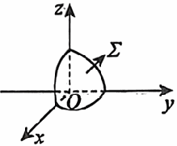

# 《张宇1000题》 · 强化篇 · 第18章 多元函数积分学

> 本章节收录第 760 页至第 788 页共 29 道题。

---

### 【ZY1000-QH-GS18-T01】第 1 题（P760）

1. 设\Omega= )x,y,z ) { ∣x2+y2+z2\le 1,x\ge 0,y\ge 0,z\ge 0  { ,则 )x2+2y2+3z2
\Omega
)
\iiint  dxdydz=_____.

> **【唯一编号】** `ZY1000-QH-GS18-T01`
> **【科目】** 强化篇
> **【专题】** 第18章 多元函数积分学

---

### 【ZY1000-QH-GS18-T02】第 2 题（P761）

2. 设曲线L的方程为2x=y2 (0\le y\le 1 )
,则\int  yds=_____.
L

> **【唯一编号】** `ZY1000-QH-GS18-T02`
> **【科目】** 强化篇
> **【专题】** 第18章 多元函数积分学

---

### 【ZY1000-QH-GS18-T03】第 3 题（P762）

1 3. 设 L 为曲线 )x-
2
(2 1 + )y-
2
) 2 1 = , 取逆时针方向, I = \oint  4ydx + )x+y
2
L
) 2 dy,J = \oint  4xdx +
L
(x+y ) 2 dy,K=\oint  4xydx+)x+y
L
)
2 dy，则I,J,K的大小顺序为( ).
- **A.** I<K⋖J
- **B.** J<K<I
- **C.** I<J<K
- **D.** K<I<J

> **【唯一编号】** `ZY1000-QH-GS18-T03`
> **【科目】** 强化篇
> **【专题】** 第18章 多元函数积分学

---

### 【ZY1000-QH-GS18-T04】第 4 题（P763）

4. 已知有界闭区域\Omega由锥面z= x2+y2与平面z=1围成，计算三重积分I= )x+y+z
\Omega
)
\iiint  2 dxdydz.

> **【唯一编号】** `ZY1000-QH-GS18-T04`
> **【科目】** 强化篇
> **【专题】** 第18章 多元函数积分学

---

### 【ZY1000-QH-GS18-T05】第 5 题（P764）

x2+y2+z2=a2,
5. 设\Gamma是空间圆周 3 )a>0
x+y+z= a
2
)
{
,则 )2yz+2zx+2xy
\Gamma
)
\oint  ds=____.

> **【唯一编号】** `ZY1000-QH-GS18-T05`
> **【科目】** 强化篇
> **【专题】** 第18章 多元函数积分学

---

### 【ZY1000-QH-GS18-T06】第 6 题（P765）

6. 设\Gamma是球面x2+y2+z2=1与平面x=y的交线,则 )x2+y2
\Gamma
)
\oint  ds=_____.

> **【唯一编号】** `ZY1000-QH-GS18-T06`
> **【科目】** 强化篇
> **【专题】** 第18章 多元函数积分学

---

### 【ZY1000-QH-GS18-T07】第 7 题（P766）

7. 设\Gamma为球面x2+y2+z2=m2与平面x+z=m)m>0 ) 的交线,计算I=\oint  xz)1+yz-xy
\Gamma
)
ds.

> **【唯一编号】** `ZY1000-QH-GS18-T07`
> **【科目】** 强化篇
> **【专题】** 第18章 多元函数积分学

---

### 【ZY1000-QH-GS18-T08】第 8 题（P767）

8. 设D= (x, y) {  |x2+y2\le 4 {
x2+4y2
)xe +y
,∂D为D的正向边界,则
∂D
)
x2+4y2
dx+(4ye -x )
dy
\oint  =___ x2+4y2
__.

> **【唯一编号】** `ZY1000-QH-GS18-T08`
> **【科目】** 强化篇
> **【专题】** 第18章 多元函数积分学

---

### 【ZY1000-QH-GS18-T09】第 9 题（P768）

9. 设函数f(x) ,g(x) 二阶导数连续,f(0) =0,g(0) =0,且对于平面上任一简单闭曲线L,均有
y2f)x
L
) +2yex+2yg(x) ] ] \oint  dx+2 yg(x) +f(x) ] ] dy=0.
(1)求f(x) ，g(x) 的表达式；
(2)设L 1 为任一条从点(0, 0) 到点(1, 1) 的曲线，计算
y2f)x
L1
) +2yex+2yg(x) ] ] \int  dx+2 yg(x) +f(x) ] ]
dy.

> **【唯一编号】** `ZY1000-QH-GS18-T09`
> **【科目】** 强化篇
> **【专题】** 第18章 多元函数积分学

---

### 【ZY1000-QH-GS18-T10】第 10 题（P769）

10. 设P)x,y,z ) 为球面\Sigma:x2+y2+z2-2z=0上的动点,球面\Sigma在点P)x,y,z )
处的法线与平面x+z
=0平行.
(1)求点P的轨迹\Gamma的方程；
(2)计算曲线积分\oint  y2dx+z2dy+x2dz，从z轴正向看下去，\Gamma取逆时针方向.
\Gamma

> **【唯一编号】** `ZY1000-QH-GS18-T10`
> **【科目】** 强化篇
> **【专题】** 第18章 多元函数积分学

---

### 【ZY1000-QH-GS18-T11】第 11 题（P770）

11. 已知\Sigma为曲面4x2+y2+z2=1)x\ge 0,y\ge 0,z\ge 0 ) 的上侧(见图)，L为\Sigma的边界曲线,其方向与
\Sigma的正法向量满足右手法则,计算曲线积分I= )yz2-cosz
L
(\oint  dx+2xz2dy+)2xyz+xsinz )
dz.

> **【唯一编号】** `ZY1000-QH-GS18-T11`
> **【科目】** 强化篇
> **【专题】** 第18章 多元函数积分学

---

### 【ZY1000-QH-GS18-T12】第 12 题（P771）

12. 设曲面 z = 1-x2-y2 与平面 z =-x 的交线为 L, 起点为 A)0,1,0 ) , 终点为 B)0,-1,0 ) , 则
)x+y-z
L
)
\int  dx+|y|dz=_____.

> **【唯一编号】** `ZY1000-QH-GS18-T12`
> **【科目】** 强化篇
> **【专题】** 第18章 多元函数积分学

---

### 【ZY1000-QH-GS18-T13】第 13 题（P772）

13. 设 L 为曲线 y = 2 1-x2 上从点 (0, 2) 到点 (1, 0) 的一段弧, 则曲线积分 )2y+1
L
) \int  dx +
(3x+2 )
dy=_____.

> **【唯一编号】** `ZY1000-QH-GS18-T13`
> **【科目】** 强化篇
> **【专题】** 第18章 多元函数积分学

---

### 【ZY1000-QH-GS18-T14】第 14 题（P773）

14. 设函数 f(x, y) 在区域D= (x, y) { ∣x2+4y2\le 4  { 上二阶偏导数连续,∂D是D取正向的边界曲线,
则 f x ' )x,y
∂D
) ] -y ] \oint  dx+f y ' (x, y)
dy=______.

> **【唯一编号】** `ZY1000-QH-GS18-T14`
> **【科目】** 强化篇
> **【专题】** 第18章 多元函数积分学

---

### 【ZY1000-QH-GS18-T15】第 15 题（P774）

15. 设y'=f(x, y) 是一条简单封闭曲线L(取正向),f(x, y) \neq 0,其所围区域记为D,D的面积为a,a>
0,则I=\oint  xf)x,y
L
)
y
dx-
f(x, y)
dy=_____.

> **【唯一编号】** `ZY1000-QH-GS18-T15`
> **【科目】** 强化篇
> **【专题】** 第18章 多元函数积分学

---

### 【ZY1000-QH-GS18-T16】第 16 题（P775）

{x2+y2+z2=a2,
\pi \pi
16. 设\Gamma为曲线  其中a>0,- <\theta< 且\theta\neq 0,从x轴的正向看去,\Gamma的方向为
y=xtan\theta, 2 2
顺时针方向.当\theta为何值时,I= )y-z
\Gamma
(\oint  dx+)z-x(dy+(x-y )
dz最大?并求出最大值.

> **【唯一编号】** `ZY1000-QH-GS18-T16`
> **【科目】** 强化篇
> **【专题】** 第18章 多元函数积分学

---

### 【ZY1000-QH-GS18-T17】第 17 题（P776）

17. 设函数f(x) 具有一阶连续导数,且对右半平面x>0内任意分段光滑简单闭曲线L,均有
f)x
L
) y2dy-y3dx
\oint  =0.
2x2+y6
(1)求f(x) 的表达式；
f)x
(2)计算
L0
)
y2dy-y3dx
\oint  ，其中L 为2x2+y2=1，取逆时针方向.
2x2+y6 0

> **【唯一编号】** `ZY1000-QH-GS18-T17`
> **【科目】** 强化篇
> **【专题】** 第18章 多元函数积分学

---

### 【ZY1000-QH-GS18-T18】第 18 题（P777）

18. 设L为从点A(-1, 0) 到点B(3, 0) 的上半个圆周(x-1 ) 2 +y2=22,y\ge 0,则
)x-y
L
(dx+)x+y )
dy
\int  =_____.
x2+y2

> **【唯一编号】** `ZY1000-QH-GS18-T18`
> **【科目】** 强化篇
> **【专题】** 第18章 多元函数积分学

---

### 【ZY1000-QH-GS18-T19】第 19 题（P778）

19. 设 f(x) 有连续导数, 且 f(0) = 0, 若对于平面内的任意简单封闭曲线 L, 均有曲线积分
f)x
L
) ] -ex ] \oint  y2dx-2yf(x) dy=0,则f(x)
=______.

> **【唯一编号】** `ZY1000-QH-GS18-T19`
> **【科目】** 强化篇
> **【专题】** 第18章 多元函数积分学

---

### 【ZY1000-QH-GS18-T20】第 20 题（P779）

20. 设I 1 =\int  f)x,y
L
(dx+)6xy-6x ) dy,I_2 = )6x2y+6xy+x
L
) \int  dx+f(x, y) dy.已知曲线积分I 与I 均在 1 2
整个xOy平面内与路径无关,且f(0, 0) =0,求函数f(x, y)
的极值.

> **【唯一编号】** `ZY1000-QH-GS18-T20`
> **【科目】** 强化篇
> **【专题】** 第18章 多元函数积分学

---

### 【ZY1000-QH-GS18-T21】第 21 题（P780）

m_1
21. 设\Sigma为球面x2+y2+z2=m被平面z= 所截下的顶部,计算 )|x|y+
3 z
\Sigma
)
\iint  dS.

> **【唯一编号】** `ZY1000-QH-GS18-T21`
> **【科目】** 强化篇
> **【专题】** 第18章 多元函数积分学

---

### 【ZY1000-QH-GS18-T22】第 22 题（P781）

x=t,
x=0,
22. 设\Sigma是由直线 {  绕直线 y=t,)t为参数
y=0
)
{
旋转一周得到的曲面,\sum 是\Sigma介于平面 介于平面x
1
z=t
+y+z=0与x+y+z=1之间部分的外侧.计算曲面积分I=\iint  xdydz+)y+1
\Sigma
1
(dzdx+)z+2 )
dxdy.

> **【唯一编号】** `ZY1000-QH-GS18-T22`
> **【科目】** 强化篇
> **【专题】** 第18章 多元函数积分学

---

### 【ZY1000-QH-GS18-T23】第 23 题（P782）

23. 设锥面\Sigma的顶点是A)0,1,1 )
{x2+y2=1,
,准线是  直线L过顶点A和准线上任一点M 1 )x_1 ,y_1 ,0
z=0,
) .
\Omega是\Sigma(0\le z\le 1 )
与平面z=0所围成的锥体.求:
(1)L和\Sigma的方程；
(2)\Omega的形心坐标.

> **【唯一编号】** `ZY1000-QH-GS18-T23`
> **【科目】** 强化篇
> **【专题】** 第18章 多元函数积分学

---

### 【ZY1000-QH-GS18-T24】第 24 题（P783）

z=y2,
24. 设锥面\Sigma的顶点为原点,准线为曲线\Gamma: )|y|\le 1
x=1
)
{
.
(1)求\Sigma的方程；
(2)计算I=\iint  2x2dydz+xydzdx+)z+1
\Sigma
)
dxdy，\Sigma取上侧.

> **【唯一编号】** `ZY1000-QH-GS18-T24`
> **【科目】** 强化篇
> **【专题】** 第18章 多元函数积分学

---

### 【ZY1000-QH-GS18-T25】第 25 题（P784）

25. 设a,b为实数,函数 f(x, y) =ax2+by2在点(1, 1) 处沿方向l=i+ j的方向导数最大,最大值为
2 2.若\Sigma为曲面x2+z2=2z被曲面z= f(x, y)
所截取的部分.
(1)求a,b的值；
(2)计算\iint  zdS.
\Sigma

> **【唯一编号】** `ZY1000-QH-GS18-T25`
> **【科目】** 强化篇
> **【专题】** 第18章 多元函数积分学

---

### 【ZY1000-QH-GS18-T26】第 26 题（P785）

26. 设\Sigma是柱面x2+y2=1介于平面z=0,z=2之间的部分,方向向外.记I =\iint  x2dS，I =\iint  z2dS,
1 2
\Sigma \Sigma
I_3 = )x2+z2
\Sigma
)
\iint  dydz,则( ).
- **A.** I >I >I
- **B.** I >I >I
- **C.** I >I >I
- **D.** I >I >I
1 2 3 2 1 3 3 1 2 3 2 1

> **【唯一编号】** `ZY1000-QH-GS18-T26`
> **【科目】** 强化篇
> **【专题】** 第18章 多元函数积分学

---

### 【ZY1000-QH-GS18-T27】第 27 题（P786）

27. 设P=2xzf(y+z) -y3,Q=2yzf(y+z)
x2+y2
+x3,R=\int  f)z-t
0
)
dt,其中f具有一阶连续导数.L为曲
面z=x2+y2与平面y+z=1的交线,从z轴正向往下看为逆时针方向,计算\oint  Pdx+Qdy+Rdz
L

> **【唯一编号】** `ZY1000-QH-GS18-T27`
> **【科目】** 强化篇
> **【专题】** 第18章 多元函数积分学

---

### 【ZY1000-QH-GS18-T28】第 28 题（P787）

28. 设 \Sigma为曲面 z = 1-x2-y2 ,\alpha,\beta 分别为曲面 \Sigma的外法线向量与 x 轴, z 轴的夹角, 则
)|xy|cos\alpha+z2cos\beta
\Sigma
)
\iint  dS=_____.

> **【唯一编号】** `ZY1000-QH-GS18-T28`
> **【科目】** 强化篇
> **【专题】** 第18章 多元函数积分学

---

### 【ZY1000-QH-GS18-T29】第 29 题（P788）

29. 设曲面\Sigma:z=1-x2-y2 (z\ge -3 ) ,取上侧,求曲面积分
I=\iint  yz x2+y2+z2dydz+xz x2+y2+z2dzdx+)x2y2-2xy x2+y2+z2
\Sigma
)
dxdy.

> **【唯一编号】** `ZY1000-QH-GS18-T29`
> **【科目】** 强化篇
> **【专题】** 第18章 多元函数积分学

---

