# 《王道操作系统》· 第3章 内存管理（综合大题全解）

> 本章包含 3.1 内存管理概念 (11题), 3.2 虚拟内存管理 (22题)，共计 33 道综合大题与历年统考真题。

---

## 3.1 内存管理概念

### 【WD-OS-A-3.1-T01】第 1 题（P34）

1.某系统的空闲分区见下表,采用可变式分区管理策略,现有如下作业序列:96KB, 20KB, 200KB。若用
首次适应算法和最佳适应算法来处理这些作业序列,则哪种算法能满足该作业序列请求? 为什么?

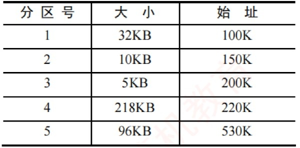

> **【唯一编号】** `WD-OS-A-3.1-T01`
> **【课程】** 操作系统
> **【章节】** 第3章 内存管理 · 3.1 内存管理概念

---

### 【WD-OS-A-3.1-T02】第 2 题（P34）

2.某操作系统采用段式管理, 用户区主存为512KB,空闲块链入空块表,分配时截取空块的前半部分
(小地址部分),初始时全部空闲。执行申请、释放操作序列reg(300KB), reg(100KB), release(300KB),
reg(150KB), reg(50KB), reg(90KB) 后:
(1) 采用最先适配，空块表中有哪些空块?(指出大小及始址)
(2) 采用最佳适配，空块表中有哪些空块?(指出大小及始址)
(3) 若随后又要申请80KB，针对上述两种情况会产生什么后果？这说明了什么问题？

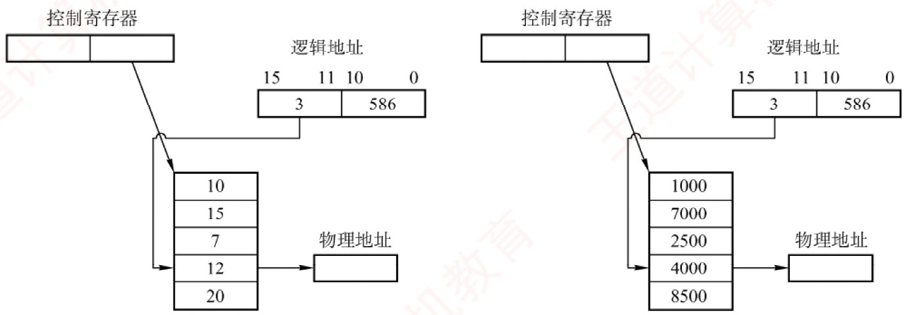

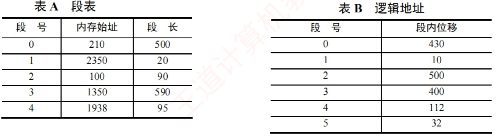

> **【唯一编号】** `WD-OS-A-3.1-T02`
> **【课程】** 操作系统
> **【章节】** 第3章 内存管理 · 3.1 内存管理概念

---

### 【WD-OS-A-3.1-T03】第 3 题（P35）

3. 下图给出了页式和段式两种地址变换示意(假定段式变换对每段不进行段长越界检查,即段表中无
段长信息)。
(1) 指出这两种变换各属于何种存储管理。
(2) 计算出这两种变换所对应的物理地址。

> **【唯一编号】** `WD-OS-A-3.1-T03`
> **【课程】** 操作系统
> **【章节】** 第3章 内存管理 · 3.1 内存管理概念

---

### 【WD-OS-A-3.1-T04】第 4 题（P35）

4. 在一个段式存储管理系统中,其段表见下表A。试求表B 中的逻辑地址所对应的物理地址。

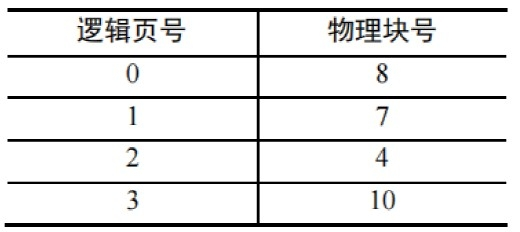

> **【唯一编号】** `WD-OS-A-3.1-T04`
> **【课程】** 操作系统
> **【章节】** 第3章 内存管理 · 3.1 内存管理概念

---

### 【WD-OS-A-3.1-T05】第 5 题（P36）

5. 页式存储管理允许用户的编程空间为32 个页面(每页1KB),主存为16KB。如有一用户程序为10
页长,且某时刻该用户程序页表见下表。
若分别遇到三个逻辑地址0AC5H, 1AC5H, 3AC5H 处的操作,计算并说明存储管理系统将如何处理。

> **【唯一编号】** `WD-OS-A-3.1-T05`
> **【课程】** 操作系统
> **【章节】** 第3章 内存管理 · 3.1 内存管理概念

---

### 【WD-OS-A-3.1-T06】第 6 题（P36）

6. 在某页式管理系统中, 假定主存为64KB, 分成16 个页框, 页框号为0,1,2, ⋯,15。设某进程有4
页, 其页号为0,1,2,3, 被分别装入主存的第9,0,1,14 号页框。
(1) 该进程的总长度是多大？
(2) 写出该进程每页在主存中的始址。
(3) 若给出逻辑地址0,0
, 1,72
, 2,1023
, 3,99
, 请计算出相应的内存地址(括号内的第一个数为
十进制页号,第二个数为十进制页内地址)。

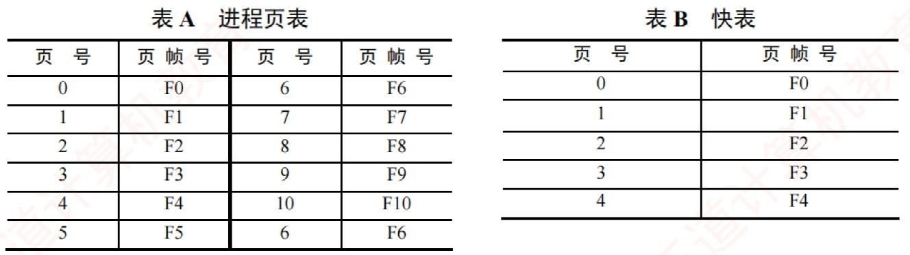

> **【唯一编号】** `WD-OS-A-3.1-T06`
> **【课程】** 操作系统
> **【章节】** 第3章 内存管理 · 3.1 内存管理概念

---

### 【WD-OS-A-3.1-T07】第 7 题（P37）

7. 某操作系统存储器采用页式存储管理,页面大小为64B,假定一进程的代码段的长度为702B,页表见
表A，该进程在快表中的页表见表B。现进程有如下访问序列: 其逻辑地址为八进制的0105，0217,
0567,01120,02500。试问给定的这些地址能否进行转换？

> **【唯一编号】** `WD-OS-A-3.1-T07`
> **【课程】** 操作系统
> **【章节】** 第3章 内存管理 · 3.1 内存管理概念

---

### 【WD-OS-A-3.1-T08】第 8 题（P37）

8. 在某页式系统中,假设在查找主存页表的过程中不发生缺页的情况,请回答:
(1) 若对主存的一次存取需1.5μs，问实现一次页面访问时存取时间是多少？
(2) 若系统有快表且其平均命中率为85%，而页表项在快表中的查找时间可忽略不计，试问此时的
存取时间为多少?

> **【唯一编号】** `WD-OS-A-3.1-T08`
> **【课程】** 操作系统
> **【章节】** 第3章 内存管理 · 3.1 内存管理概念

---

### 【WD-OS-A-3.1-T09】第 9 题（P38）

9. 在页式、段式和段页式存储管理中,当访问一条指令或数据时,各需要访问内存几次? 其过程如何?
假设一个页式存储系统具有快表,多数活动页表项都可以存在其中。若页表存放在内存中,内存访问
时间是1μs, 检索快表的时间为0.2μs, 若快表的命中率是85%, 则有效存取时间是多少? 若快表的命
中率为50%,则有效存取时间是多少?

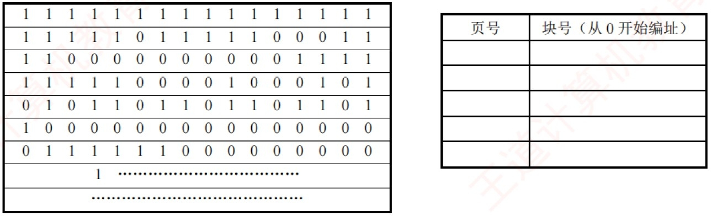

> **【唯一编号】** `WD-OS-A-3.1-T09`
> **【课程】** 操作系统
> **【章节】** 第3章 内存管理 · 3.1 内存管理概念

---

### 【WD-OS-A-3.1-T10】第 10 题（P39）

10. 在一个分页存储管理系统中,地址空间分页(每页1KB),物理空间分块,设主存总容量是256KB,描
述主存分配情况的位示图如下图所示(0 表示未分配, 1 表示已分配),此时作业调度程序选中一个长
为5.2KB 的作业投入内存。试问:
(1) 为该作业分配内存后(分配内存时,首先分配低地址的内存空间),请填写该作业的页表内容。
(2) 页式存储管理有无内存碎片存在？若有，会存在哪种内存碎片？为该作业分配内存后，会产生
内存碎片吗? 若产生,那么大小为多少?
(3) 假设一个64MB 内存容量的计算机，采用页式存储管理(页面大小为4KB)，内存分配采用位示
图方式管理，请问位示图将占用多大的内存?

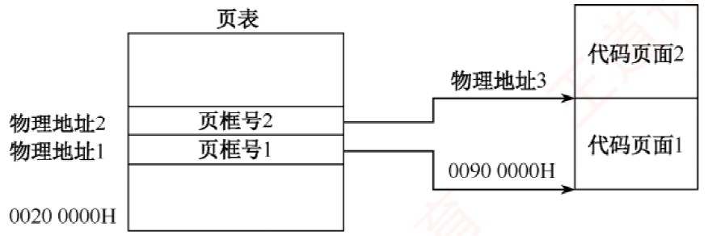

> **【唯一编号】** `WD-OS-A-3.1-T10`
> **【课程】** 操作系统
> **【章节】** 第3章 内存管理 · 3.1 内存管理概念

---

### 【WD-OS-A-3.1-T11】第 11 题（P40）

11. 【2013 统考真题】某计算机主存按字节编址,逻辑地址和物理地址都是32 位,页表项大小为4B。
请回答下列问题:
(1) 若使用一级页表的分页存储管理方式,逻辑地址结构为
页号(20 位)
页内偏移量(12 位)
则页的大小是多少字节? 页表最大占用多少字节?
(2) 若使用二级页表的分页存储管理方式，逻辑地址结构为
页目录号(10 位)
页表索引(10 位)
页内偏移量(12 位)
设逻辑地址为LA,请分别给出其对应的页目录号和页表索引的表达式。
(3) 采用(1) 中的分页存储管理方式,一个代码段的起始逻辑地址为00008000H,其长度为8KB,被装载
到从物理地址00900000H 开始的连续主存空间中。页表从主存00200000H 开始的物理地址处连续
存放，如下图所示(地址大小自下向上递增)。请计算出该代码段对应的两个页表项的物理地址、这
两个页表项中的页框号，以及代码页面2 的起始物理地址。

> **【唯一编号】** `WD-OS-A-3.1-T11`
> **【课程】** 操作系统
> **【章节】** 第3章 内存管理 · 3.1 内存管理概念

---

## 3.2 虚拟内存管理

### 【WD-OS-A-3.2-T01】第 1 题（P41）

1.假定某操作系统存储器采用页式存储管理,一个进程在相联存储器中的页表项见表A,不在相联存
储器的页表项见表B。
假定该进程长度为320B, 每页32B。现有逻辑地址(八进制) 为101,204,576, 若上述逻辑地址能转换
成物理地址,说明转换的过程,并指出具体的物理地址; 若不能转换,说明其原因。

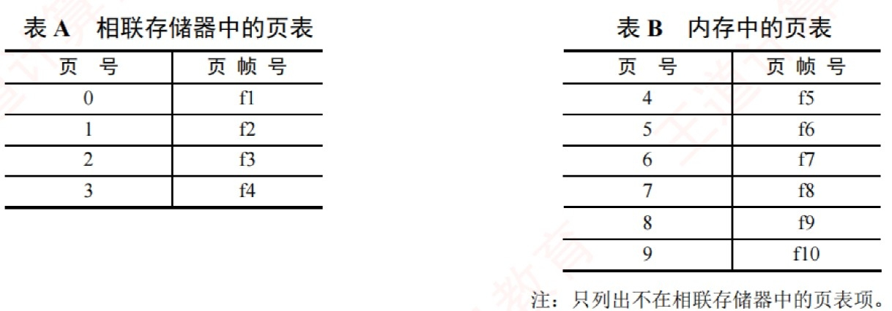

> **【唯一编号】** `WD-OS-A-3.2-T01`
> **【课程】** 操作系统
> **【章节】** 第3章 内存管理 · 3.2 虚拟内存管理

---

### 【WD-OS-A-3.2-T02】第 2 题（P41）

2.某分页式虚拟存储系统,用于页面交换的磁盘的平均访问及传输时间是20ms。页表保存在主存中，
访问时间为1μs，即每引用一次指令或数据，需要访问内存两次。为改善性能，可以增设一个关联
寄存器,若页表项在关联寄存器中,则只需访问一次内存。假设80% 的访问的页表项在关联寄存器中,
剩下的20% 中, 10% 的访问(即总数的2%) 会产生缺页。请计算有效访问时间。

> **【唯一编号】** `WD-OS-A-3.2-T02`
> **【课程】** 操作系统
> **【章节】** 第3章 内存管理 · 3.2 虚拟内存管理

---

### 【WD-OS-A-3.2-T03】第 3 题（P42）

3.在页式虚存管理系统中, 假定驻留集为m 个页帧(初始所有页帧均为空), 在长为p 的引用串中具有
n 个不同页号n>m
, 对于FIFO、LRU 两种页面置换算法, 试给出页故障数的上限和下限, 说明理
由并举例说明。

> **【唯一编号】** `WD-OS-A-3.2-T03`
> **【课程】** 操作系统
> **【章节】** 第3章 内存管理 · 3.2 虚拟内存管理

---

### 【WD-OS-A-3.2-T04】第 4 题（P42）

4.在一个请求分页存储管理系统中,一个作业的页面走向为4, 3, 2, 1, 4, 3, 5, 4, 3, 2, 1, 5，当分配给作业
的物理块数分别为3 和4 时,试计算采用下述页面淘汰算法时的缺页率(假设开始执行时主存中没有
页面),并比较结果。
(1) 最佳置换算法。
(2) 先进先出置换算法。
(3) 最近最久未使用算法。

> **【唯一编号】** `WD-OS-A-3.2-T04`
> **【课程】** 操作系统
> **【章节】** 第3章 内存管理 · 3.2 虚拟内存管理

---

### 【WD-OS-A-3.2-T05】第 5 题（P43）

5. 一个页式虚拟存储系统,其并发进程数固定为4 个。最近测试了它的CPU 利用率和用于页面交换
的磁盘的利用率,得到的结果就是下列3 组数据中的一组。针对每组数据,说明系统发生了什么事情。
增加并发进程数能提升CPU 的利用率吗? 页式虚拟存储系统有用吗?
(1)CPU 利用率为13%；磁盘利用率为97%。
(2)CPU 利用率为87%; 磁盘利用率为3%。
(3)CPU 利用率为13%; 磁盘利用率为3%。

> **【唯一编号】** `WD-OS-A-3.2-T05`
> **【课程】** 操作系统
> **【章节】** 第3章 内存管理 · 3.2 虚拟内存管理

---

### 【WD-OS-A-3.2-T06】第 6 题（P43）

6. 现有一请求页式系统,页表保存在寄存器中。若有一个可用的空页或被置换的页未被修改,则它处
理一个缺页中断需要8μs; 若被置换的页已被修改, 则处理一缺页中断因增加写回外存时间而需要
20μs, 内存的存取时间为1μs。假定70% 被置换的页被修改过, 为保证有效存取时间不超过2μs, 可接
受的最大缺页中断率是多少?

> **【唯一编号】** `WD-OS-A-3.2-T06`
> **【课程】** 操作系统
> **【章节】** 第3章 内存管理 · 3.2 虚拟内存管理

---

### 【WD-OS-A-3.2-T07】第 7 题（P44）

7. 已知系统为32 位实地址，采用48 位虚拟地址，页面大小为4KB，页表项大小为8B，每段最大
为4GB。
(1) 假设系统使用纯页式存储，则要采用多少级页表？页内偏移多少位？
(2) 假设系统采用一级页表，TLB 命中率为98%，TLB 访问时间为10ns，内存访问时间为100ns，
并假设当TLB 访问失败时才开始访问内存,问平均页面访问时间是多少?
(3) 若是二级页表,页面平均访问时间是多少?
(4) 上题中,若要满足访问时间小于120ns,则命中率至少需要为多少?
(5) 若系统采用段页式存储,则每用户最多可以有多少个段? 段内采用几级页表?

> **【唯一编号】** `WD-OS-A-3.2-T07`
> **【课程】** 操作系统
> **【章节】** 第3章 内存管理 · 3.2 虚拟内存管理

---

### 【WD-OS-A-3.2-T08】第 8 题（P44）

8. 在一个请求分页系统中,采用LRU 页面置换算法时,假如一个作业的页面走向为1,3,2,1,1,3, 5, 1, 3,
2, 1, 5，当分配给该作业的物理块数分别为3 和4 时，试计算在访问过程中发生的缺页次数和缺页
率。

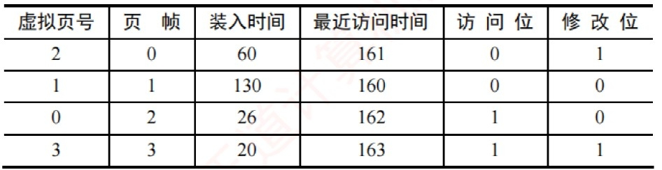

> **【唯一编号】** `WD-OS-A-3.2-T08`
> **【课程】** 操作系统
> **【章节】** 第3章 内存管理 · 3.2 虚拟内存管理

---

### 【WD-OS-A-3.2-T09】第 9 题（P45）

9. 一个进程分配给4 个页帧,见下表(所有数字均为十进制,均从0 开始计数)。时间均为从进程开始
到该事件之前的时钟值，而不是从事件发生到当前的时钟值。请回答:
(1) 当进程访问虚页4 时,产生缺页中断,请分别用FIFO(先进先出)、LRU(最近最少使用)、改进型
CLOCK 算法,决定缺页中断服务程序选择换出的页面。
(2) 在缺页之前给定上述的存储器状态，考虑虚页访问串4,0,0,0,2,4,2,1,0,3,2，如果使用LRU 页面
置换算法,分给4 个页帧,那么会发生多少缺页?

> **【唯一编号】** `WD-OS-A-3.2-T09`
> **【课程】** 操作系统
> **【章节】** 第3章 内存管理 · 3.2 虚拟内存管理

---

### 【WD-OS-A-3.2-T10】第 10 题（P45）

10.在页式虚拟管理的页面替换算法中,对于任何给定的驻留集大小,在什么样的访问串情况下, FIFO
与LRU 替换算法一样(即被替换的页面和缺页情况完全一样)?

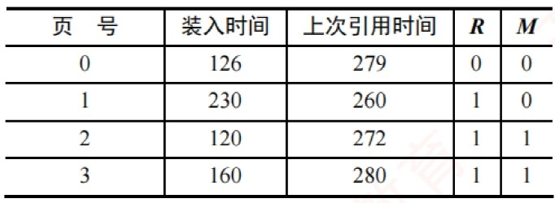

> **【唯一编号】** `WD-OS-A-3.2-T10`
> **【课程】** 操作系统
> **【章节】** 第3章 内存管理 · 3.2 虚拟内存管理

---

### 【WD-OS-A-3.2-T11】第 11 题（P46）

11.某系统有4 个页框,某个进程的页面使用情况见下表,问采用FIFO、LRU、简单CLOCK 和改进
型CLOCK 置换算法, 将会替换哪一页? 其中, R 是读标志位, M 是修改标志位。

> **【唯一编号】** `WD-OS-A-3.2-T11`
> **【课程】** 操作系统
> **【章节】** 第3章 内存管理 · 3.2 虚拟内存管理

---

### 【WD-OS-A-3.2-T12】第 12 题（P46）

12. 有一个矩阵intA[100,100] 以行优先方式进行存储。计算机采用虚拟存储系统,物理内存共有三
页，其中一页用来存放程序，其余两页用于存放数据。假设程序已在内存中占一页，其余两页空
闲。若每页可存放200 个整数,程序1、程序2 执行的过程中各会发生多少次缺页? 每页只能存放
100 个整数时,会发生多少次缺页? 以上结果说明了什么问题?
程序1:
程序2:
for(i=0; i<100; i++)
for(j=0; j<100; j++)
for(j=0; j<100; j++)
for(i=0; i<100; i++)
A[i,j]=0;
A[i,j]=0;

> **【唯一编号】** `WD-OS-A-3.2-T12`
> **【课程】** 操作系统
> **【章节】** 第3章 内存管理 · 3.2 虚拟内存管理

---

### 【WD-OS-A-3.2-T13】第 13 题（P47）

13. Gribble 公司正在开发一款64 位的计算机体系结构,也就是说,在访问内存时,最多可以使用64 位
的地址。假设采用的是虚拟页式存储管理,现在要为这款机器设计相应的地址映射机制。
(1) 假设页面的大小是4KB，每个页表项的长度是4B，而且必须采用三级页表结构，每级页表结构
中的每个页表都必须正好存放在一个物理页面中，请问在这种情形下，如何实现地址的映射? 具体
来说，对于给定的一个虚拟地址,应该把它划分为几部分,每部分的长度分别是多少,功能是什么? 另
外,采用这种地址映射机制后,可以访问的虚拟地址空间有多大?(提示:64 位地址并不一定全部用上)
(2) 假设每个页表项的长度变成了8B，而且必须采用四级页表结构，每级页表结构中的页表都必须
正好存放在一个物理页面中,请问在这种情形下,系统能够支持的最大的页面大小是多少? 此时,虚拟
地址应该如何划分?

> **【唯一编号】** `WD-OS-A-3.2-T13`
> **【课程】** 操作系统
> **【章节】** 第3章 内存管理 · 3.2 虚拟内存管理

---

### 【WD-OS-A-3.2-T14】第 14 题（P48）

14. 某设备TLB 的分页管理系统按字节编址,虚拟地址为32 位,物理地址为24 位,页面大小为4KB,页
表项大小为4B,采用二级页表, TLB 命中率为98%, TLB 的访问时间为10ns,内存的访问时间为100ns,
处理一次缺页中断的时间为10ms。请回答:
(1) 物理地址中的页框号占多少位? 虚拟地址中的一级页号和二级页号各占多少位? 系统的页表基址
寄存器中存放的内容是什么? 一级页表页表项中的内容是什么?
(2) 若访问一级页表和二级页表的过程中均不发生缺页,则系统进行地址转换的平均时间是多少?
(3) 若访问一级页表不发生缺页，访问二级页表的缺页率为10%，则系统进行地址转换的平均时间
是多少?

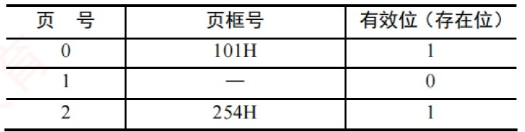

> **【唯一编号】** `WD-OS-A-3.2-T14`
> **【课程】** 操作系统
> **【章节】** 第3章 内存管理 · 3.2 虚拟内存管理

---

### 【WD-OS-A-3.2-T15】第 15 题（P49）

15. 【2009 统考真题】请求分页管理系统中,假设某进程的页表内容如下表所示。
页面大小为4KB，一次内存的访问时间是100ns，一次快表(TLB) 的访问时间是10ns，处理一次缺
页的平均时间为108ns(已含更新TLB 和页表的时间), 进程的驻留集大小固定为2, 采用最近最少使
用(LRU) 置换算法和局部淘汰策略。假设:
①TLB 初始为空;
②地址转换时先访问TLB,若TLB 未命中,再访问页表(忽略访问页表后的TLB 更新时间);
③有效位为0 表示页面不在内存,产生缺页中断,缺页中断处理后,返回到产生缺页中断的指
令处重新执行。
设有虚地址访问序列2362H, 1565H, 25A5H,问:
(1) 依次访问上述三个虚拟地址，各需多少时间？给出计算过程。
(2) 基于上述访问序列，虚地址1565H 的物理地址是多少? 请说明理由。

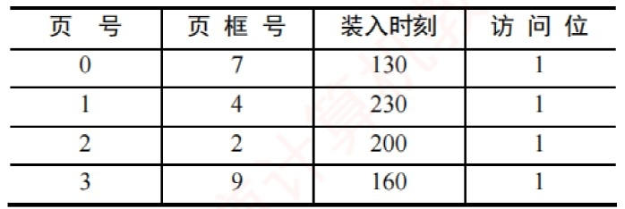

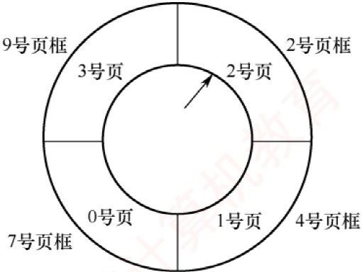

> **【唯一编号】** `WD-OS-A-3.2-T15`
> **【课程】** 操作系统
> **【章节】** 第3章 内存管理 · 3.2 虚拟内存管理

---

### 【WD-OS-A-3.2-T16】第 16 题（P50）

16.【2010 统考真题】设某计算机的逻辑地址空间和物理地址空间均为64KB，按字节编址。若某进
程最多需要6 页(Page) 数据存储空间,页的大小为1KB,操作系统采用固定分配局部置换策略为此进
程分配4 个页框(PageFrame),见下表。在装入时刻260 前,该进程的访问情况也见下表(访问位即使
用位)。当该进程执行到时刻260 时,要访问逻辑地址为17CAH 的数据。回答下列问题:
(1) 该逻辑地址对应的页号是多少?
(2) 若采用先进先出(FIFO) 置换算法，则该逻辑地址对应的物理地址是多少？要求给出计算过程。
若采用时钟(Clock) 置换算法,则该逻辑地址对应的物理地址是多少? 要求给出计算过程。设搜索下
一页的指针沿顺时针方向移动，且当前指向2 号页框，如下图所示。

> **【唯一编号】** `WD-OS-A-3.2-T16`
> **【课程】** 操作系统
> **【章节】** 第3章 内存管理 · 3.2 虚拟内存管理

---

### 【WD-OS-A-3.2-T17】第 17 题（P51）

17. 【2012 统考真题】某请求分页系统的页面置换策略如下: 从0 时刻开始扫描，每隔5 个时间单位
扫描一轮驻留集(扫描时间忽略不计) 且本轮未被访问过的页框将被系统回收,并放入空闲页框链尾,
其中内容在下一次分配之前不清空。当发生缺页时,若该页曾被使用过且还在空闲页链表中,则重新
放回进程的驻留集中; 否则,从空闲页框链表头部取出一个页框。忽略其他进程的影响和系统开销。
初始时进程驻留集为空。目前系统空闲页的页框号依次为32,15,21,41。进程P 依次访问的< 虚拟
页号,访问时刻> 为< 1,1 > , < 3,2 > , < 0,4 > , < 0,6 > , < 1,11 > , < 0,13 > , < 2,14 >。请回答
下列问题:
(1) 当虚拟页为< 0,4 > 时, 对应的页框号是什么?
(2) 当虚拟页为< 1,11 > 时，对应的页框号是什么？说明理由。
(3) 当虚拟页为< 2，14 > 时，对应的页框号是什么？说明理由。
(4) 这种方法是否适合于时间局部性好的程序？说明理由。

> **【唯一编号】** `WD-OS-A-3.2-T17`
> **【课程】** 操作系统
> **【章节】** 第3章 内存管理 · 3.2 虚拟内存管理

---

### 【WD-OS-A-3.2-T18】第 18 题（P52）

18. 【2015 统考真题】某计算机系统按字节编址,采用二级页表的分页存储管理方式,虚拟地址格式
如下所示:
页目录号(10 位)
页表索引(10 位)
页内偏移量(12 位)
(1) 页和页框的大小各为多少字节? 进程的虚拟地址空间大小为多少页？
(2) 若页目录项和页表项均占4B，则进程的页目录和页表共占多少页？写出计算过程。
(3) 若某指令周期内访问的虚拟地址为01000000H 和01112048H，则进行地址转换时共访问多少个
二级页表? 说明理由。

> **【唯一编号】** `WD-OS-A-3.2-T18`
> **【课程】** 操作系统
> **【章节】** 第3章 内存管理 · 3.2 虚拟内存管理

---

### 【WD-OS-A-3.2-T19】第 19 题（P53）

19. 【2017 统考真题】假定2017 年题44 给出的计算机M 采用二级分页虚拟存储管理方式,虚拟地址
格式如下:
页目录号(10 位)
页表索引(10 位)
页内偏移量(12 位)
请针对2017 年题43 的函数f 1 和题44 中的机器指令代码,回答下列问题:
(1) 函数f 1 的机器指令代码占多少页?
(2) 取第一条指令(pushebp) 时,若在进行地址变换的过程中需要访问内存中的页目录和页表,则会分
别访问它们各自的第几个表项(编号从0 开始)?
(3)M 的I/O 采用中断控制方式。若进程P 在调用f 1 前通过scanf () 获取n 的值, 则在执行scanf () 的
过程中,进程P 的状态会如何变化?CPU 是否会进入内核态?

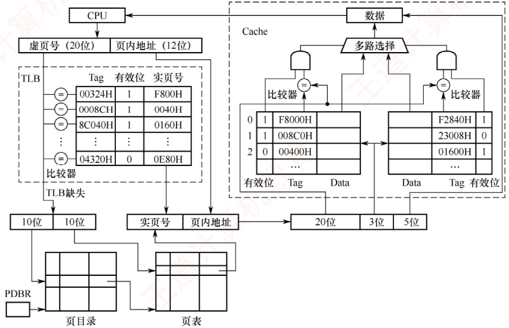

> **【唯一编号】** `WD-OS-A-3.2-T19`
> **【课程】** 操作系统
> **【章节】** 第3章 内存管理 · 3.2 虚拟内存管理

---

### 【WD-OS-A-3.2-T20】第 20 题（P54）

20.【2018 统考真题】某计算机采用页式虚拟存储管理方式,按字节编址, CPU 进行存储访问的过程
如下图所示，回答下列问题。
(1) 某虚拟地址对应的页目录号为6，在相应的页表中对应的页号为6，页内偏移量为8，该虚拟地
址的十六进制表示是什么?
(2) 寄存器PDBR 用于保存当前进程的页目录起始地址,该地址是物理地址还是虚拟地址? 进程切换
时, PDBR 的内容是否会变化? 说明理由。同一进程的线程切换时, PDBR 的内容是否会变化? 说明理
由。
(3) 为了支持改进型CLOCK 置换算法,需要在页表项中设置哪些字段？

> **【唯一编号】** `WD-OS-A-3.2-T20`
> **【课程】** 操作系统
> **【章节】** 第3章 内存管理 · 3.2 虚拟内存管理

---

### 【WD-OS-A-3.2-T21】第 21 题（P55）

21.【2020 统考真题】某32 位系统采用基于二级页表的请求分页存储管理方式,按字节编址,页目录
项和页表项长度均为4 字节，虚拟地址结构如下所示。
页目录号(10 位)
页号(10 位)
页内偏移量(12 位)
某C 程序中数组a[1024] [1024] 的起始虚拟地址为10800000H,数组元素占4 字节,该程序运行时,其
进程的页目录起始物理地址为00201000H，请回答下列问题。
(1) 数组元素a[1] [2] 的虚拟地址是什么? 对应的页目录号和页号分别是什么? 对应的页目录项的物
理地址是什么? 若该目录项中存放的页框号为00301H，则a[1] [2] 所在页对应的页表项的物理地址
是什么?
(2) 数组a 在虚拟地址空间中所占的区域是否必须连续？在物理地址空间中所占的区域是否必须连
续？
(3) 已知数组a 按行优先方式存放, 若对数组a 分别按行遍历和按列遍历, 则哪种遍历方式的局部性
更好?

> **【唯一编号】** `WD-OS-A-3.2-T21`
> **【课程】** 操作系统
> **【章节】** 第3章 内存管理 · 3.2 虚拟内存管理

---

### 【WD-OS-A-3.2-T22】第 22 题（P56）

22.【2024 统考真题】某计算机按字节编址,采用页式虚拟存储管理方式,虚拟地址和物理地址的长度
均为32 位,页表项的大小为4 字节,页大小为4MB,虚拟地址结构如下:
页号(10 位)
页内偏移量(22 位)
进程P 的页表起始虚拟地址为B8C00000H，被装载到从物理地址65400000H 开始的连续主存空间
中。请回答下列问题，要求答案用十六进制表示。
(1) 若CPU 在执行进程P 的过程中，访问虚拟地址12345678H 时发生了缺页异常，经过缺页异常处
理和MMU 地址转换后得到的物理地址是BAB45678H，在此次缺页异常处理过程中，需要为所缺
页分配页框并更新相应的页表项，则该页表项的虚拟地址和物理地址分别是什么？该页表项中的
页框号更新后的值是什么?
(2) 进程P 的页表所在页的页号是什么? 该页对应的页表项的虚拟地址是什么? 该页表项中的页框号
是什么?

> **【唯一编号】** `WD-OS-A-3.2-T22`
> **【课程】** 操作系统
> **【章节】** 第3章 内存管理 · 3.2 虚拟内存管理
