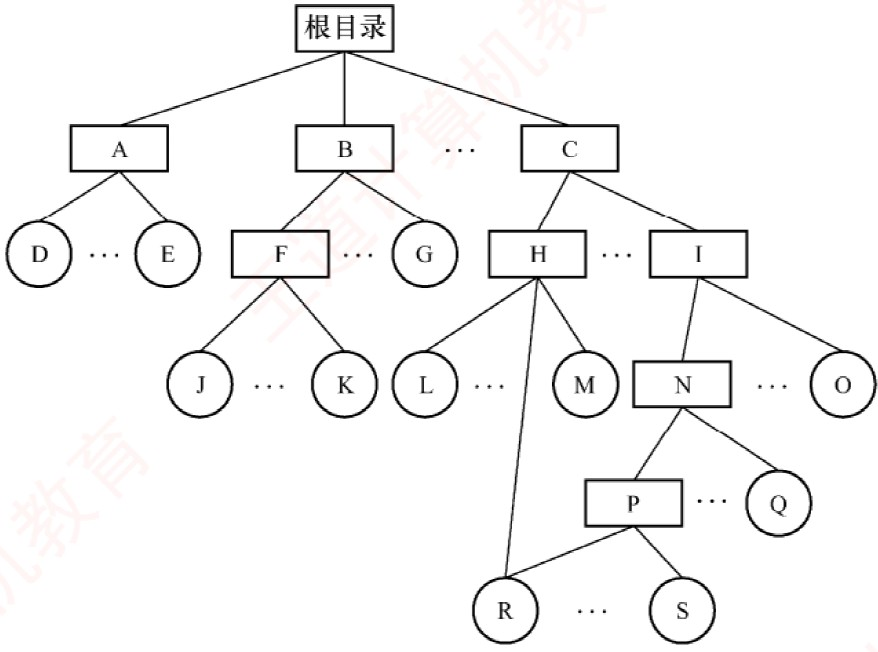
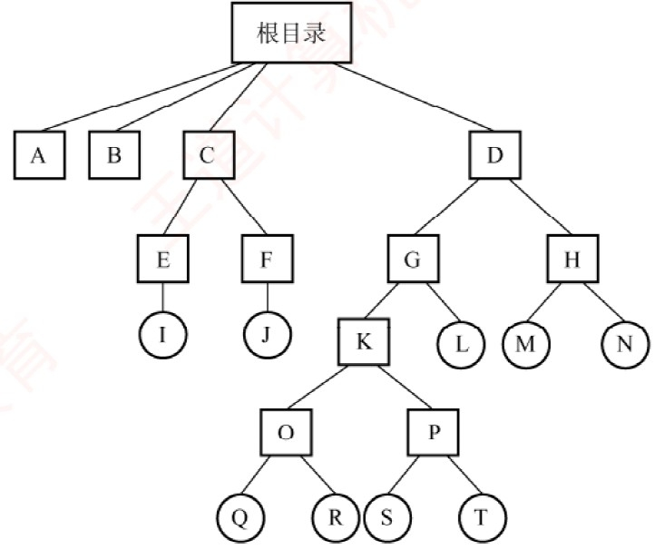
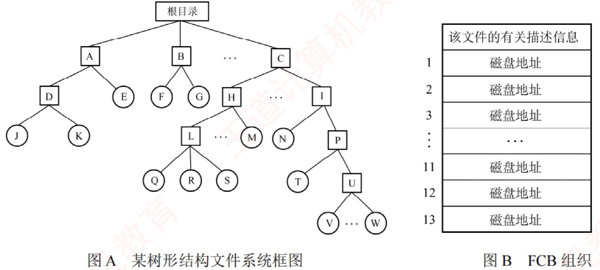
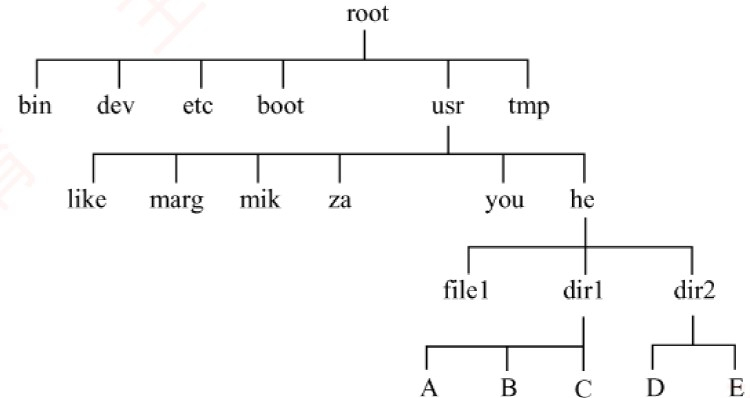
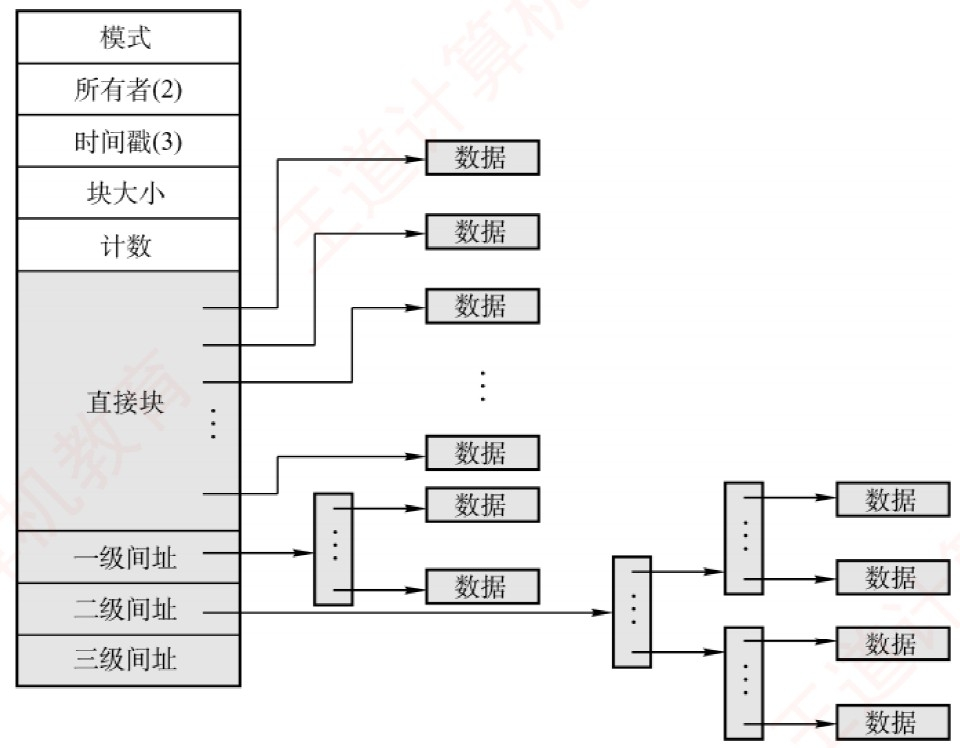
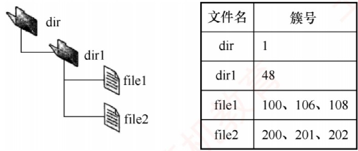
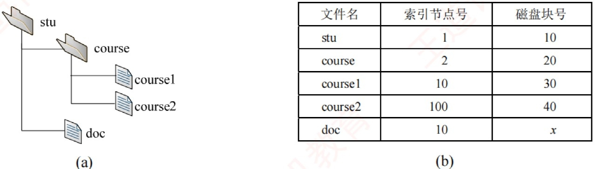
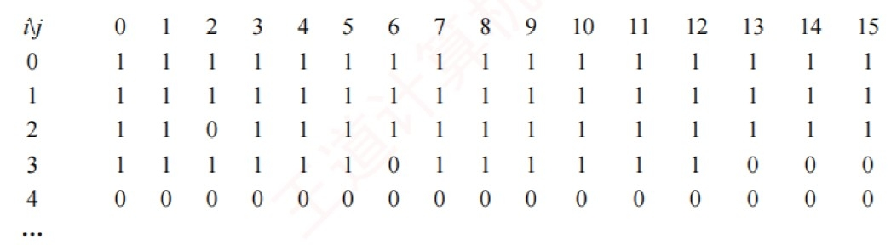

# 《王道操作系统》· 第4章 文件管理（综合大题全解）

> 本章包含 4.2 目录与文件 (15题), 4.3 文件系统 (2题)，共计 17 道综合大题与历年统考真题。

---

## 4.2 目录与文件

### 【WD-OS-A-4.2-T01】第 1 题（P57）

1. 简述文件的外存分配中,连续分配、链接分配和索引分配各自的主要优缺点。

> **【唯一编号】** `WD-OS-A-4.2-T01`
> **【课程】** 操作系统
> **【章节】** 第4章 文件管理 · 4.2 目录与文件

---

### 【WD-OS-A-4.2-T02】第 2 题（P57）

2.在实现文件系统时，为加快文件目录的检索速度，可利用“FCB 分解法”。假设目录文件存放在磁
盘上, 每个盘块512B。FCB 占64B, 其中文件名占8B。通常将FCB 分解成两部分, 第一部分占10B
(包括文件名和文件内部号),第二部分占56B(包括文件内部号和文件的其他描述信息)。
(1) 假设某一目录文件共有254 个FCB，试分别给出采用分解法前和分解法后，查找该目录文件的
某个FCB 的平均访问磁盘次数(访问每个文件的概率相同)。
(2) 一般地，若目录文件分解前占用n 个盘块，分解后改用m 个盘块存放文件名和文件内部号，请
给出访问磁盘次数减少的条件(假设m 和n 个盘块中都正好装满)。

> **【唯一编号】** `WD-OS-A-4.2-T02`
> **【课程】** 操作系统
> **【章节】** 第4章 文件管理 · 4.2 目录与文件

---

### 【WD-OS-A-4.2-T03】第 3 题（P58）

3. 有文件系统如下图所示，图中的框表示目录，圆圈表示普通文件。
(1) 可否建立F 与R 的链接? 试加以说明。
(2) 能否删除R? 为什么?
(3) 能否删除N? 为什么?

> **【唯一编号】** `WD-OS-A-4.2-T03`
> **【课程】** 操作系统
> **【章节】** 第4章 文件管理 · 4.2 目录与文件

---

### 【WD-OS-A-4.2-T04】第 4 题（P59）

4. 某树形目录结构的文件系统如下图所示。该图中的方框表示目录,圆圈表示文件。
(1) 可否进行下列操作?
①在目录D 中建立一个文件,取名为A。②将目录C 改名为A。
(2) 若E 和G 分别为两个用户的目录:
①在一段时间内用户G 主要使用文件S 和T。为简化操作和提高速度,应如何处理? ②用户E 欲对文
件I 加以保护,不许别人使用,能否实现? 如何实现?

> **【唯一编号】** `WD-OS-A-4.2-T04`
> **【课程】** 操作系统
> **【章节】** 第4章 文件管理 · 4.2 目录与文件

---

### 【WD-OS-A-4.2-T05】第 5 题（P60）

5. 有一个文件系统如下图所示。图中的方框表示目录,圆圈表示普通文件。根目录常驻内存,目录文
件组织成链接文件,不设FCB,普通文件组织成索引文件。目录表指示下一级文件名及其磁盘地址
(各占2B,共4B)。下级文件是目录文件时,指示其第一个磁盘块地址。下级文件是普通文件时,指示
其FCB 的磁盘地址。每个目录的文件磁盘块的最后4B 供拉链使用。下级文件在上级目录文件中的
次序在图中为从左至右。每个磁盘块有512B，与普通文件的一页等长。
普通文件的FCB 组织如上表所示。其中,每个磁盘地址占2B,前10 个地址直接指示该文件前10 页的
地址。第11 个地址指示一级索引表地址,一级索引表中的每个磁盘地址指示一个文件页地址; 第12
个地址指示二级索引表地址,二级索引表中的每个地址指示一个一级索引表地址; 第13 个地址指示
三级索引表地址,三级索引表中的每个地址指示一个二级索引表地址。请问:
(1) 一个普通文件最多可有多少个文件页?
(2) 若要读文件J 中的某一页，最多启动磁盘多少次？
(3) 若要读文件W 中的某一页,最少启动磁盘多少次?
(4) 根据(3)，为最大限度地减少启动磁盘的次数，可采用什么方法? 此时，磁盘最多启动多少次？

> **【唯一编号】** `WD-OS-A-4.2-T05`
> **【课程】** 操作系统
> **【章节】** 第4章 文件管理 · 4.2 目录与文件

---

### 【WD-OS-A-4.2-T06】第 6 题（P61）

6. 某个文件系统中,外存为硬盘。物理块大小为512B,有文件A 包含598 条记录,每条记录占255B,每
个物理块放2 条记录。文件A 所在的目录如下图所示。文件目录采用多级树形目录结构,由根目录
结点、作为目录文件的中间结点和作为信息文件的树叶组成,每个目录项占127B,每个物理块放4 个
目录项,根目录的第一块常驻内存。试问:
(1) 若文件的物理结构采用链式存储方式，链指针地址占2B，则要将文件A 读入内存，至少需要存
取几次硬盘?
(2) 若文件为连续文件，则要读文件A 的第487 条记录至少要存取几次硬盘？

> **【唯一编号】** `WD-OS-A-4.2-T06`
> **【课程】** 操作系统
> **【章节】** 第4章 文件管理 · 4.2 目录与文件

---

### 【WD-OS-A-4.2-T07】第 7 题（P61）

7. 假定磁盘块的大小为1KB, 对于540MB 的硬盘, 其文件分配表(FAT) 最少需要占用多少存储空间?

> **【唯一编号】** `WD-OS-A-4.2-T07`
> **【课程】** 操作系统
> **【章节】** 第4章 文件管理 · 4.2 目录与文件

---

### 【WD-OS-A-4.2-T08】第 8 题（P62）

8. 某文件系统采用混合索引分配方式,如下图所示。在索引节点中,有10 个直接块,有1 个一级间接
块、1 个二级间接块及1 个三级间接块,间接块指向的是一个索引块,每个索引块和数据块的大小均
为4KB，而系统中地址所占空间为4B(指针大小为4B)，假设以下问题都建立在该索引节点已在内
存中的前提下。现请回答:
(1) 文件的大小为多大时可以只用到索引结点的直接块?
(2) 该索引结点能访问到的地址空间大小总共为多大(小数点后保留2 位)？
(3) 若要读取一个文件的第10000B 的内容,需要访问磁盘多少次？
(4) 若要读取一个文件的第10MB 的内容,需要访问磁盘多少次?

> **【唯一编号】** `WD-OS-A-4.2-T08`
> **【课程】** 操作系统
> **【章节】** 第4章 文件管理 · 4.2 目录与文件

---

### 【WD-OS-A-4.2-T09】第 9 题（P63）

9. 某文件系统采用多级索引的方式组织文件的数据存放,假定在文件的i_node 中设有13 个地址项,
其中直接索引10 项,一次间接索引项1 项,二次间接索引项1 项,三次间接索引项1 项。数据块的大小
为4KB, 磁盘地址用4B 表示, 试问:
(1) 这个文件系统允许的最大文件长度是多少？
(2) 一个2GB 大小的文件，在这个文件系统中实际占用多少空间？(文件索引块所占的磁盘空间也
需要考虑)

> **【唯一编号】** `WD-OS-A-4.2-T09`
> **【课程】** 操作系统
> **【章节】** 第4章 文件管理 · 4.2 目录与文件

---

### 【WD-OS-A-4.2-T10】第 10 题（P64）

10. 【2014 统考真题】文件F 由200 条记录组成,记录从1 开始编号。用户打开文件后,欲将内存中的
一条记录插入文件F，作为其第30 条记录。请回答下列问题，并说明理由。
(1) 若文件系统采用连续分配方式，每个磁盘块存放一条记录，文件F 存储区域前后均有足够的空
闲磁盘空间,则完成上述插入操作最少需要访问多少次磁盘块?F 的文件控制块内容会发生哪些改变?
(2) 若文件系统采用链接分配方式，每个磁盘块存放一条记录和一个链接指针，则完成上述插入操
作需要访问多少次磁盘块? 若每个存储块大小为1KB, 其中4B 存放链接指针, 则该文件系统支持的
文件最大长度是多少?

> **【唯一编号】** `WD-OS-A-4.2-T10`
> **【课程】** 操作系统
> **【章节】** 第4章 文件管理 · 4.2 目录与文件

---

### 【WD-OS-A-4.2-T11】第 11 题（P65）

11. 【2016 统考真题】某磁盘文件系统使用链接分配方式组织文件,簇大小为4KB。目录文件的每个
目录项包括文件名和文件的第一个簇号,其他簇号存放在文件分配表FAT 中。
(1) 假定目录树如上图所示，各文件占用的簇号及顺序如上表所示，其中dir，dir1 是目录，file1，
file2 是用户文件。请给出所有目录文件的内容。
(2) 若FAT 的每个表项仅存放簇号，占2B，则FAT 的最大长度为多少字节？该文件系统支持的文件
长度最大是多少?
(3) 系统通过目录文件和FAT 实现对文件的按名存取,说明file1 的106, 108 两个簇号分别存放在FAT
的哪个表项中。
(4) 假设仅FAT 和dir 目录文件已读入内存,若需将文件dir/dir1/file1 的第5000 个字节读入内存,则要
访问哪几个簇?

> **【唯一编号】** `WD-OS-A-4.2-T11`
> **【课程】** 操作系统
> **【章节】** 第4章 文件管理 · 4.2 目录与文件

---

### 【WD-OS-A-4.2-T12】第 12 题（P66）

12.【2011 统考真题】某文件系统为一级目录结构,文件的数据一次性写入磁盘,已写入的文件不可修
改,但可多次创建新文件。请回答如下问题。
(1) 在连续、链式、索引三种文件的数据块组织方式中，哪种更合适？说明理由。为定位文件数据
块，需要在FCB 中设计哪些相关描述字段？
(2) 为快速找到文件，对于FCB，是集中存储好，还是与对应的文件数据块连续存储好？说明理
由。

> **【唯一编号】** `WD-OS-A-4.2-T12`
> **【课程】** 操作系统
> **【章节】** 第4章 文件管理 · 4.2 目录与文件

---

### 【WD-OS-A-4.2-T13】第 13 题（P66）

13. 【2012 统考真题】某文件系统空间的最大容量为4TB 1TB=240B
，以磁盘块为基本分配单位。
磁盘块大小为1KB。文件控制块(FCB) 包含一个512B 的索引表区。请回答下列问题:
(1) 假设索引表区仅采用直接索引结构，索引表区存放文件占用的磁盘块号，索引表项中块号最少
占多少字节? 可支持的单个文件的最大长度是多少字节?
(2) 假设索引表区采用如下结构: 第0 ∼7 字节采用< icausel >< icoaddel > 卷一，块数> 格式表示
文件创建时预分配的连续存储空间。其中起始块号占6B, 块数占2B, 剩余504B 采用直接索引结构,
一个索引项占6B,则可支持的单个文件的最大长度是多少字节? 为使单个文件的长度达到最大,请指
出起始块号和块数分别所占字节数的合理值并说明理由。

> **【唯一编号】** `WD-OS-A-4.2-T13`
> **【课程】** 操作系统
> **【章节】** 第4章 文件管理 · 4.2 目录与文件

---

### 【WD-OS-A-4.2-T14】第 14 题（P67）

14.【2018 统考真题】某文件系统采用索引结点存放文件的属性和地址信息,簇大小为4KB。每个文
件索引结点占64B,有11 个地址项,其中直接地址项8 个,一级、二级和三级间接地址项各1 个,每个地
址项长度为4B。请回答下列问题:
(1) 该文件系统能支持的最大文件长度是多少？(给出计算表达式即可)
(2) 文件系统用1M 1M=220
个簇存放文件索引结点，用512M 个簇存放文件数据。若一个图像文
件的大小为5600B,则该文件系统最多能存放多少个这样的图像文件?
(3) 若文件F1 的大小为6KB，文件F2 的大小为40KB，则该文系统获取F1 和F2 最后一个簇的簇
号需要的时间是否相同? 为什么?

> **【唯一编号】** `WD-OS-A-4.2-T14`
> **【课程】** 操作系统
> **【章节】** 第4章 文件管理 · 4.2 目录与文件

---

### 【WD-OS-A-4.2-T15】第 15 题（P68）

15.【2022 统考真题】某文件系统的磁盘块大小为4KB，目录项由文件名和索引结点号构成，每个
索引结点占256 字节，其中包含直接地址项10 个，一级、二级和三级间接地址项各1 个，每个地
址项占4 字节。该文件系统中子目录stu 的结构如图(a) 所示, stu 包含子目录course 和文件doc,
course 子目录包含文件course1 和course2。各文件的文件名、索引结点号、占用磁盘块的块号如图
(b) 所示。
(1) 目录文件stu 中每个目录项的内容是什么？
(2) 文件doc 占用的磁盘块的块号x 的值是多少?
(3) 若目录文件course 的内容已在内存,则打开文件course1 并将其读入内存,需要读几个磁盘块? 说
明理由。
(4) 若文件course2 的大小增长到6MB，则为了存取course2 需要使用该文件索引结点的哪几级间接
地址项? 说明理由。

> **【唯一编号】** `WD-OS-A-4.2-T15`
> **【课程】** 操作系统
> **【章节】** 第4章 文件管理 · 4.2 目录与文件

---

### 【WD-OS-A-4.2-T16】第 1 题（P69）

1. 一计算机系统利用位示图来管理磁盘文件空间。假定该磁盘组共有100 个柱面,每个柱面有20 个
磁道,每个磁道分成8 个盘块(扇区),每个盘块1KB,位示图如下图所示。
(1) 试给出位示图中位置(i, j) 与对应盘块所在的物理位置(柱面号,磁头号,扇区号) 之理间的计算公
式。假定柱面号、磁头号、扇区号都从0 开始编号。
(2) 试说明分配和回收一个盘块的过程。

> **【唯一编号】** `WD-OS-A-4.2-T16`
> **【课程】** 操作系统
> **【章节】** 第4章 文件管理 · 4.2 目录与文件

---

### 【WD-OS-A-4.2-T17】第 2 题（P69）

2.假定一个盘组共有100 个柱面,每个柱面上有16 个磁道,每个磁道分成4 个扇区。
(1) 整个磁盘空间共有多少个存储块?(每个扇区对应一个存储块)
(2) 若用字长32 位的单元来构造位示图，共需要多少个字？
(3) 位示图中第18 个字的第16 位对应的块号是多少？(字号和位号都从1 开始)

> **【唯一编号】** `WD-OS-A-4.2-T17`
> **【课程】** 操作系统
> **【章节】** 第4章 文件管理 · 4.2 目录与文件

---

## 4.3 文件系统

### 【WD-OS-A-4.3-T01】第 1 题（P69）

1. 一计算机系统利用位示图来管理磁盘文件空间。假定该磁盘组共有100 个柱面,每个柱面有20 个
磁道,每个磁道分成8 个盘块(扇区),每个盘块1KB,位示图如下图所示。
(1) 试给出位示图中位置(i, j) 与对应盘块所在的物理位置(柱面号,磁头号,扇区号) 之理间的计算公
式。假定柱面号、磁头号、扇区号都从0 开始编号。
(2) 试说明分配和回收一个盘块的过程。

> **【唯一编号】** `WD-OS-A-4.3-T01`
> **【课程】** 操作系统
> **【章节】** 第4章 文件管理 · 4.3 文件系统

---

### 【WD-OS-A-4.3-T02】第 2 题（P69）

2.假定一个盘组共有100 个柱面,每个柱面上有16 个磁道,每个磁道分成4 个扇区。
(1) 整个磁盘空间共有多少个存储块?(每个扇区对应一个存储块)
(2) 若用字长32 位的单元来构造位示图，共需要多少个字？
(3) 位示图中第18 个字的第16 位对应的块号是多少？(字号和位号都从1 开始)

> **【唯一编号】** `WD-OS-A-4.3-T02`
> **【课程】** 操作系统
> **【章节】** 第4章 文件管理 · 4.3 文件系统
