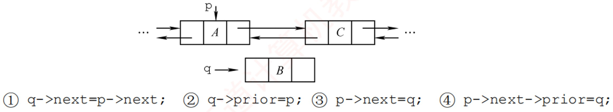

# 《王道数据结构》· 第2章 线性表（课后选择题全解）

> 本章共包含 3 个小节，共计 56 道精选选择题。

---
## 2.1 线性表的定义和基本操作
---

### 【WD-DS-C-2.1-T01】第 1 题（P2）

1. 线性表是具有n 个(
) 的有限序列。
A. 数据表
B. 字符
C. 数据元素
D. 数据项

> **【唯一编号】** `WD-DS-C-2.1-T01`
> **【课程】** 数据结构
> **【章节】** 第2章 线性表 · 2.1 线性表的定义和基本操作

---

### 【WD-DS-C-2.1-T02】第 2 题（P2）

2. 下列几种描述中，(
) 是一个线性表。
A. 由n 个实数组成的集合
B. 由100 个字符组成的序列
C. 所有整数组成的序列
D. 邻接表

> **【唯一编号】** `WD-DS-C-2.1-T02`
> **【课程】** 数据结构
> **【章节】** 第2章 线性表 · 2.1 线性表的定义和基本操作

---

### 【WD-DS-C-2.1-T03】第 3 题（P2）

3. 在线性表中，除开始元素外，每个元素(
)。
A. 只有唯一的前驱元素
B. 只有唯一的后继元素
C. 有多个前驱元素
D. 有多个后继元素

> **【唯一编号】** `WD-DS-C-2.1-T03`
> **【课程】** 数据结构
> **【章节】** 第2章 线性表 · 2.1 线性表的定义和基本操作

---

### 【WD-DS-C-2.1-T04】第 4 题（P2）

4. 若非空线性表中的元素既没有直接前驱，又没有直接后继，则该表中有(
) 个元素。
A. 1
B. 2
C. 3
D. n

> **【唯一编号】** `WD-DS-C-2.1-T04`
> **【课程】** 数据结构
> **【章节】** 第2章 线性表 · 2.1 线性表的定义和基本操作

---
## 2.2 线性表的顺序表示
---

### 【WD-DS-C-2.2-T01】第 1 题（P2）

1. 下列叙述中，(
) 是顺序存储结构的优点。
A. 存储密度大
B. 插入运算方便
C. 删除运算方便
D. 方便地运用于各种逻辑结构的存储表示

> **【唯一编号】** `WD-DS-C-2.2-T01`
> **【课程】** 数据结构
> **【章节】** 第2章 线性表 · 2.2 线性表的顺序表示

---

### 【WD-DS-C-2.2-T02】第 2 题（P2）

2. 下列关于顺序表的叙述中，正确的是(
)。
A. 顺序表可以利用一维数组表示,因此顺序表与一维数组在逻辑结构上是相同的
B. 在顺序表中,逻辑上相邻的元素物理位置上不一定相邻
C. 顺序表和一维数组一样,都可以进行随机存取
D. 在顺序表中，每个元素的类型不必相同

> **【唯一编号】** `WD-DS-C-2.2-T02`
> **【课程】** 数据结构
> **【章节】** 第2章 线性表 · 2.2 线性表的顺序表示

---

### 【WD-DS-C-2.2-T03】第 3 题（P2）

3. 通常说顺序表具有随机存取的特性，指的是(
)。
A. 查找值为x 的元素的时间与顺序表中元素个数n 无关
B. 查找值为x 的元素的时间与顺序表中元素个数n 有关
C. 查找序号为i 的元素的时间与顺序表中元素个数n 无关
D. 查找序号为i 的元素的时间与顺序表中元素个数n 有关

> **【唯一编号】** `WD-DS-C-2.2-T03`
> **【课程】** 数据结构
> **【章节】** 第2章 线性表 · 2.2 线性表的顺序表示

---

### 【WD-DS-C-2.2-T04】第 4 题（P2）

4. 一个顺序表所占用的存储空间大小与(
) 无关。
A. 表的长度
B. 元素的存放顺序
C. 元素的类型
D. 元素中各字段的类型

 2.线性表

> **【唯一编号】** `WD-DS-C-2.2-T04`
> **【课程】** 数据结构
> **【章节】** 第2章 线性表 · 2.2 线性表的顺序表示

---

### 【WD-DS-C-2.2-T05】第 5 题（P7）

5. 若线性表最常用的操作是存取第i 个元素及其前驱和后继元素的值, 为了提高效率, 应采用(
) 的
存储方式。
A. 单链表
B. 双链表
C. 循环单链表
D. 顺序表

> **【唯一编号】** `WD-DS-C-2.2-T05`
> **【课程】** 数据结构
> **【章节】** 第2章 线性表 · 2.2 线性表的顺序表示

---

### 【WD-DS-C-2.2-T06】第 6 题（P7）

6. 一个线性表最常用的操作是存取任意一个指定序号的元素并在最后进行插入、删除操作,则利用
(
) 存储方式可以节省时间。
A. 顺序表
B. 双链表
C. 带头结点的循环双链表
D. 循环单链表

> **【唯一编号】** `WD-DS-C-2.2-T06`
> **【课程】** 数据结构
> **【章节】** 第2章 线性表 · 2.2 线性表的顺序表示

---

### 【WD-DS-C-2.2-T07】第 7 题（P7）

7. 在n 个元素的线性表的数组表示中，时间复杂度为O 1

的操作是(
)。
I.访问第i 1≤i≤n

个结点和求第i 2≤i≤n

个结点的直接前驱
II.在最后一个结点后插入一个新的结点
III.删除第1 个结点
IV.在第i 1≤i≤n

个结点后插入一个结点
A. I
B. II、III
C. I、II
D. I、II、III

> **【唯一编号】** `WD-DS-C-2.2-T07`
> **【课程】** 数据结构
> **【章节】** 第2章 线性表 · 2.2 线性表的顺序表示

---

### 【WD-DS-C-2.2-T08】第 8 题（P7）

8. 设线性表有n 个元素, 严格说来, 以下操作中,(
) 在顺序表上实现要比在链表上实现的效率高。
I.输出第i 1≤i≤n

个元素值
II.交换第3 个元素与第4 个元素的值
III.顺序输出这n 个元素的值
A. I
B. I、III
C. I、II
D. II、III

> **【唯一编号】** `WD-DS-C-2.2-T08`
> **【课程】** 数据结构
> **【章节】** 第2章 线性表 · 2.2 线性表的顺序表示

---

### 【WD-DS-C-2.2-T09】第 9 题（P7）

9. 在一个长度为n 的顺序表中删除第i 1≤i≤n

个元素时, 需向前移动(
) 个元素。
A. n
B. i - 1
C. n - i
D. n - i + 1

> **【唯一编号】** `WD-DS-C-2.2-T09`
> **【课程】** 数据结构
> **【章节】** 第2章 线性表 · 2.2 线性表的顺序表示

---

### 【WD-DS-C-2.2-T10】第 10 题（P7）

10. 对于顺序表, 访问第i 个位置的元素和在第i 个位置插入一个元素的时间复杂度为(
)。
A. O n

,O n

B. O n

,O 1

C. O 1

,O n

D. O 1

,O 1

> **【唯一编号】** `WD-DS-C-2.2-T10`
> **【课程】** 数据结构
> **【章节】** 第2章 线性表 · 2.2 线性表的顺序表示

---

### 【WD-DS-C-2.2-T11】第 11 题（P7）

11. 对于顺序存储的线性表, 其算法时间复杂度为O 1

的运算应该是(
)。
A. 将n 个元素从小到大排序
B. 删除第i 1≤i≤n

个元素
C. 改变第i 1≤i≤n

个元素的值
D. 在第i 1≤i≤n

个元素后插入一个新元素

> **【唯一编号】** `WD-DS-C-2.2-T11`
> **【课程】** 数据结构
> **【章节】** 第2章 线性表 · 2.2 线性表的顺序表示

---

### 【WD-DS-C-2.2-T12】第 12 题（P7）

12. 顺序表的插入算法中, 当n 个空间已满时, 可再申请增加分配m 个空间, 若申请失败,则说明系统
没有(
) 可分配的存储空间。
A. m 个
B. m 个连续
C. n + m 个
D. n + m 个连续

> **【唯一编号】** `WD-DS-C-2.2-T12`
> **【课程】** 数据结构
> **【章节】** 第2章 线性表 · 2.2 线性表的顺序表示

---

### 【WD-DS-C-2.2-T13】第 13 题（P7）

13.【2023 统考真题】在下列对顺序存储的有序表(长度为n) 实现给定操作的算法中，平均时间复杂
度为O 1

的是(
)。
A. 查找包含指定值元素的算法
B. 插入包含指定值元素的算法
C. 删除第i 1≤i≤n

个元素的算法
D. 获取第i 1≤i≤n

个元素的算法

 2.线性表

> **【唯一编号】** `WD-DS-C-2.2-T13`
> **【课程】** 数据结构
> **【章节】** 第2章 线性表 · 2.2 线性表的顺序表示

---
## 2.3 线性表的链式表示
---

### 【WD-DS-C-2.3-T01】第 1 题（P2）

1. 下列关于线性表的存储结构的描述中,正确的是(
)。
I.线性表的顺序存储结构优于其链式存储结构
II.链式存储结构比顺序存储结构能更方便地表示各种逻辑结构
III.若频繁使用插入和删除结点操作,则顺序存储结构更优于链式存储结构
IV.顺序存储结构和链式存储结构都可以进行顺序存取
A. I、II、III
B. II、IV
C. II、III
D. III、IV

> **【唯一编号】** `WD-DS-C-2.3-T01`
> **【课程】** 数据结构
> **【章节】** 第2章 线性表 · 2.3 线性表的链式表示

---

### 【WD-DS-C-2.3-T02】第 2 题（P2）

2. 对于一个线性表,既要求能进行较快速地插入和删除,又要求存储结构能反映数据之间的逻辑关系，
则应该用(
)。
A. 顺序存储方式
B. 链式存储方式
C. 散列存储方式
D. 以上均可以

> **【唯一编号】** `WD-DS-C-2.3-T02`
> **【课程】** 数据结构
> **【章节】** 第2章 线性表 · 2.3 线性表的链式表示

---

### 【WD-DS-C-2.3-T03】第 3 题（P2）

3. 链式存储设计时，结点内的存储单元地址(
)。
A. 一定连续
B. 一定不连续
C. 不一定连续
D. 部分连续,部分不连续

> **【唯一编号】** `WD-DS-C-2.3-T03`
> **【课程】** 数据结构
> **【章节】** 第2章 线性表 · 2.3 线性表的链式表示

---

### 【WD-DS-C-2.3-T04】第 4 题（P2）

4. 下列关于线性表的说法中，正确的是(
)。
I.顺序存储方式只能用于存储线性结构
II.在一个设有头指针和尾指针的单链表中，删除表尾元素的时间复杂度与表长无关
III.带头结点的循环单链表中不存在空指针
IV.在一个长度为n 的有序单链表中插入一个新结点并仍保持有序的时间复杂度为O n

V.若用单链表来表示队列，则应该选用带尾指针的循环链表
A. I、II
B. I、III、IV、V
C. IV、V
D. III、IV、V

> **【唯一编号】** `WD-DS-C-2.3-T04`
> **【课程】** 数据结构
> **【章节】** 第2章 线性表 · 2.3 线性表的链式表示

---

### 【WD-DS-C-2.3-T05】第 5 题（P2）

5. 设线性表中有2n 个元素，(
) 在单链表上实现要比在顺序表上实现效率更高。
A. 删除所有值为x 的元素
B. 在最后一个元素的后面插入一个新元素
C. 顺序输出前k 个元素
D. 交换第i 个元素和第2n - i - 1 个元素的值i=0,⋯,n-1

> **【唯一编号】** `WD-DS-C-2.3-T05`
> **【课程】** 数据结构
> **【章节】** 第2章 线性表 · 2.3 线性表的链式表示

---

### 【WD-DS-C-2.3-T06】第 6 题（P2）

6. 在一个单链表中, 已知q 所指结点是p 所指结点的前驱结点, 若在q 和p 之间插入结点s，则执行
(
)。
A. s -> next = p -> next;p -> next = s;
B. p -> next = s -> next;s -> next = p;
C. q -> next = s;s -> next = p;
D. p -> next = s;s -> next = q;

> **【唯一编号】** `WD-DS-C-2.3-T06`
> **【课程】** 数据结构
> **【章节】** 第2章 线性表 · 2.3 线性表的链式表示

---

### 【WD-DS-C-2.3-T07】第 7 题（P2）

7. 给定有n 个元素的一维数组, 建立一个有序单链表的最低时间复杂度是(
)。
A. O 1

B. O n

C. O n2

D. O nlog2n

 2.线性表

> **【唯一编号】** `WD-DS-C-2.3-T07`
> **【课程】** 数据结构
> **【章节】** 第2章 线性表 · 2.3 线性表的链式表示

---

### 【WD-DS-C-2.3-T08】第 8 题（P9）

8. 将长度为n 的单链表链接在长度为m 的单链表后面, 其算法的时间复杂度采用大O 形式表示应该
是(
)。
A. O 1

B. O n

C. O m

D. O n+m

> **【唯一编号】** `WD-DS-C-2.3-T08`
> **【课程】** 数据结构
> **【章节】** 第2章 线性表 · 2.3 线性表的链式表示

---

### 【WD-DS-C-2.3-T09】第 9 题（P9）

9. 单链表中,增加一个头结点的目的是(
)。
A. 使单链表至少有一个结点
B. 标识表结点中首结点的位置
C. 方便运算的实现
D. 说明单链表是线性表的链式存储

> **【唯一编号】** `WD-DS-C-2.3-T09`
> **【课程】** 数据结构
> **【章节】** 第2章 线性表 · 2.3 线性表的链式表示

---

### 【WD-DS-C-2.3-T10】第 10 题（P9）

10. 在一个长度为n 的带头结点的单链表h 上, 设有尾指针r, 则执行(
) 操作与链表的表长有关。
A. 删除单链表中的第一个元素
B. 删除单链表中的最后一个元素
C. 在单链表第一个元素前插入一个新元素
D. 在单链表最后一个元素后插入一个新元素

> **【唯一编号】** `WD-DS-C-2.3-T10`
> **【课程】** 数据结构
> **【章节】** 第2章 线性表 · 2.3 线性表的链式表示

---

### 【WD-DS-C-2.3-T11】第 11 题（P9）

11. 对于一个头指针为head 的带头结点的单链表，判定该表为空表的条件是(
)；对于不带头结点
的单链表，判定空表的条件为(
)。
A. head == NULL
B. head -> next == NULL
C. head -> next == head
D. head! = NULL

> **【唯一编号】** `WD-DS-C-2.3-T11`
> **【课程】** 数据结构
> **【章节】** 第2章 线性表 · 2.3 线性表的链式表示

---

### 【WD-DS-C-2.3-T12】第 12 题（P9）

12. 在线性表a0,a1, ⋯,a100 中, 删除元素a50 需要移动(
) 个元素。
A. 0
B. 50
C. 51
D. 0 或50

> **【唯一编号】** `WD-DS-C-2.3-T12`
> **【课程】** 数据结构
> **【章节】** 第2章 线性表 · 2.3 线性表的链式表示

---

### 【WD-DS-C-2.3-T13】第 13 题（P9）

13. 通过含有n n>1

个元素的数组a, 采用头插法建立单链表L, 则L 中的元素次序(
)。
A. 与数组a 的元素次序相同
B. 与数组a 的元素次序相反
C. 与数组a 的元素次序无关
D. 以上都错误

> **【唯一编号】** `WD-DS-C-2.3-T13`
> **【课程】** 数据结构
> **【章节】** 第2章 线性表 · 2.3 线性表的链式表示

---

### 【WD-DS-C-2.3-T14】第 14 题（P9）

14. 下面关于线性表的一些说法中,正确的是(
)。
A. 对一个设有头指针和尾指针的单链表执行删除最后一个元素的操作与链表长度无关
B. 线性表中每个元素都有一个直接前驱和一个直接后继
C. 为了方便插入和删除数据，可以使用双链表存放数据
D. 取线性表第i 个元素的时间与i 的大小有关

> **【唯一编号】** `WD-DS-C-2.3-T14`
> **【课程】** 数据结构
> **【章节】** 第2章 线性表 · 2.3 线性表的链式表示

---

### 【WD-DS-C-2.3-T15】第 15 题（P9）

15. 在双链表中向p 所指的结点之前插入一个结点q 的操作为(
)。
A. p -> prior = q;q -> next = p;p -> prior -> next = q;q -> prior = p -> prior;
B. q -> prior = p -> prior;p -> prior -> next = q;q -> next = p;p -> prior = q -> next;
C. q -> next = p;p -> next = q;q -> prior -> next = q;q -> next = p;
D. p -> prior -> next = q;q -> next = p;q -> prior = p -> prior;p -> prior = q;

> **【唯一编号】** `WD-DS-C-2.3-T15`
> **【课程】** 数据结构
> **【章节】** 第2章 线性表 · 2.3 线性表的链式表示

---

### 【WD-DS-C-2.3-T16】第 16 题（P9）

16. 在双链表存储结构中，删除p 所指的结点时必须修改指针(
)。
A. p -> prior -> next = p -> next;p -> next -> prior = p -> prior;
B. p -> prior = p -> prior -> prior;p -> prior -> next = p;
C. p -> next -> prior = p;p -> next = p -> next -> next;

 2.线性表

D. p -> next = p -> prior -> prior;p -> prior = p -> next -> next;

> **【唯一编号】** `WD-DS-C-2.3-T16`
> **【课程】** 数据结构
> **【章节】** 第2章 线性表 · 2.3 线性表的链式表示

---

### 【WD-DS-C-2.3-T17】第 17 题（P10）

17. 在如下图所示的双链表中, 已知指针p 指向结点A, 若要在结点A 和C 之间插入指针q 所指的结
点B, 则依次执行的语句序列可以是(
)。
A. ①②④③
B. ④③②①
C. ③④①②
D. ①③④②

> **【唯一编号】** `WD-DS-C-2.3-T17`
> **【课程】** 数据结构
> **【章节】** 第2章 线性表 · 2.3 线性表的链式表示

---

### 【WD-DS-C-2.3-T18】第 18 题（P10）

18. 在双链表的两个结点之间插入一个新结点,需要修改(
) 个指针域。
A. 1
B. 3
C. 4
D. 2

> **【唯一编号】** `WD-DS-C-2.3-T18`
> **【课程】** 数据结构
> **【章节】** 第2章 线性表 · 2.3 线性表的链式表示

---

### 【WD-DS-C-2.3-T19】第 19 题（P10）

19. 在长度为n 的有序单链表中插入一个新结点, 并仍然保持有序的时间复杂度是(
)。
A. O 1

B. O n

C. O n2

D. O nlog2n

> **【唯一编号】** `WD-DS-C-2.3-T19`
> **【课程】** 数据结构
> **【章节】** 第2章 线性表 · 2.3 线性表的链式表示

---

### 【WD-DS-C-2.3-T20】第 20 题（P10）

20. 与单链表相比，双链表的优点之一是(
)。
A. 插入、删除操作更方便
B. 可以进行随机访问
C. 可以省略表头指针或表尾指针
D. 访问前后相邻结点更灵活

> **【唯一编号】** `WD-DS-C-2.3-T20`
> **【课程】** 数据结构
> **【章节】** 第2章 线性表 · 2.3 线性表的链式表示

---

### 【WD-DS-C-2.3-T21】第 21 题（P10）

21. 对于一个带头结点的循环单链表L，判断该表为空表的条件是(
)。
A. 头结点的指针域为空
B. L 的值为NULL
C. 头结点的指针域与L 的值相等
D. 头结点的指针域与L 的地址相等

> **【唯一编号】** `WD-DS-C-2.3-T21`
> **【课程】** 数据结构
> **【章节】** 第2章 线性表 · 2.3 线性表的链式表示

---

### 【WD-DS-C-2.3-T22】第 22 题（P10）

22. 对于一个带头结点的循环双链表L，判断该表为空表的条件是(
)。
A. L -> prior == L &&L -> next == NULL
B. L -> prior == NULL &&L -> next == NULL
C. L -> prior == NULL &&L -> next == L
D. L -> prior == L&&L -> next == L

> **【唯一编号】** `WD-DS-C-2.3-T22`
> **【课程】** 数据结构
> **【章节】** 第2章 线性表 · 2.3 线性表的链式表示

---

### 【WD-DS-C-2.3-T23】第 23 题（P10）

23. 一个链表最常用的操作是在末尾插入结点和删除结点,则选用(
) 最节省时间。
A. 带头结点的循环双链表
B. 循环单链表
C. 带尾指针的循环单链表
D. 单链表

> **【唯一编号】** `WD-DS-C-2.3-T23`
> **【课程】** 数据结构
> **【章节】** 第2章 线性表 · 2.3 线性表的链式表示

---

### 【WD-DS-C-2.3-T24】第 24 题（P10）

24. 设对n n>1

个元素的线性表的运算只有4 种: 删除第一个元素；删除最后一个元素；在第一个
元素之前插入新元素；在最后一个元素之后插入新元素，则最好使用(
)。
A. 只有尾结点指针没有头结点指针的循环单链表
B. 只有尾结点指针没有头结点指针的非循环双链表
C. 只有头结点指针没有尾结点指针的循环双链表
D. 既有头结点指针又有尾结点指针的循环单链表

 2.线性表

> **【唯一编号】** `WD-DS-C-2.3-T24`
> **【课程】** 数据结构
> **【章节】** 第2章 线性表 · 2.3 线性表的链式表示

---

### 【WD-DS-C-2.3-T25】第 25 题（P11）

25. 有两个长度为n 的循环单链表, 若要求两个循环单链表头尾相接的时间复杂度为O 1

,则对应两
个循环单链表各设置一个指针，分别指向(
)。
A. 各自的头结点
B. 各自的尾结点
C. 各自的首结点
D. 一个表的头结点，另一个表的尾结点

> **【唯一编号】** `WD-DS-C-2.3-T25`
> **【课程】** 数据结构
> **【章节】** 第2章 线性表 · 2.3 线性表的链式表示

---

### 【WD-DS-C-2.3-T26】第 26 题（P11）

26. 有一个长度为n 的循环单链表, 若从表中删除首元结点的时间复杂度达到O n

, 则此时采用的循
环单链表的结构可能是(
)。
A. 只有表头指针，没有头结点
B. 只有表尾指针，没有头结点
C. 只有表尾指针，带头结点
D. 只有表头指针，带头结点

> **【唯一编号】** `WD-DS-C-2.3-T26`
> **【课程】** 数据结构
> **【章节】** 第2章 线性表 · 2.3 线性表的链式表示

---

### 【WD-DS-C-2.3-T27】第 27 题（P11）

27. 某线性表用带头结点的循环单链表存储,头指针为head,当head -> next -> next == head 成立
时，线性表的长度可能是(
)。
A. 0
B. 1
C. 2
D. 可能为0 或1

> **【唯一编号】** `WD-DS-C-2.3-T27`
> **【课程】** 数据结构
> **【章节】** 第2章 线性表 · 2.3 线性表的链式表示

---

### 【WD-DS-C-2.3-T28】第 28 题（P11）

28. 有两个长度都为n 的双链表, 若以h1 为头指针的双链表是非循环的, 以h2 为头指针的双链表是循
环的,则下列叙述中正确的是(
)。
A. 对于双链表h1, 删除首结点的时间复杂度是O n

B. 对于双链表h2, 删除首结点的时间复杂度是O n

C. 对于双链表h1, 删除尾结点的时间复杂度是O 1

D. 对于双链表h2, 删除尾结点的时间复杂度是O 1

> **【唯一编号】** `WD-DS-C-2.3-T28`
> **【课程】** 数据结构
> **【章节】** 第2章 线性表 · 2.3 线性表的链式表示

---

### 【WD-DS-C-2.3-T29】第 29 题（P11）

29. 一个链表最常用的操作是在最后一个元素后插入一个元素和删除第一个元素,则选用(
) 最节省
时间。
A. 不带头结点的循环单链表
B. 双链表
C. 单链表
D. 不带头结点且有尾指针的循环单链表

> **【唯一编号】** `WD-DS-C-2.3-T29`
> **【课程】** 数据结构
> **【章节】** 第2章 线性表 · 2.3 线性表的链式表示

---

### 【WD-DS-C-2.3-T30】第 30 题（P11）

30. 需要分配较大连续空间，插入和删除不需要移动元素的线性表，其存储结构为(
)。
A. 单链表
B. 静态链表
C. 顺序表
D. 双链表

> **【唯一编号】** `WD-DS-C-2.3-T30`
> **【课程】** 数据结构
> **【章节】** 第2章 线性表 · 2.3 线性表的链式表示

---

### 【WD-DS-C-2.3-T31】第 31 题（P11）

31. 下列关于静态链表的说法中，正确的是(
)。
I.静态链表兼具顺序表和单链表的优点, 因此存取表中第i 个元素的时间与i 无关
II.静态链表能容纳的最大元素个数在表定义时就确定了,以后不能增加
III.静态链表与动态链表在元素的插入、删除上类似,不需要移动元素
IV.相比动态链表，静态链表可能浪费较多的存储空间
A. I、II、III
B. II、III、IV
C. I、III、IV
D. I、II、IV

 2.线性表

> **【唯一编号】** `WD-DS-C-2.3-T31`
> **【课程】** 数据结构
> **【章节】** 第2章 线性表 · 2.3 线性表的链式表示

---

### 【WD-DS-C-2.3-T32】第 32 题（P12）

32.【2016 统考真题】已知一个带有表头结点的循环双链表L，结点结构为丨prev 丨data 丨next 丨
其中prev 和next 分别是指向其直接前驱和直接后继结点的指针。现要删除指针p 所指的结点,正确
的语句序列是(
)。
A. p -> next -> prev = p -> prev;p -> prev -> next = p -> prev;free(p);
B. p -> next -> prev = p -> next;p -> prev -> next = p -> next;free(p);
C. p -> next -> prev = p -> next;p -> prev -> next = p -> prev;free(p);
D. p -> next -> prev = p -> prev;p -> prev -> next = p -> next;free(p);

> **【唯一编号】** `WD-DS-C-2.3-T32`
> **【课程】** 数据结构
> **【章节】** 第2章 线性表 · 2.3 线性表的链式表示

---

### 【WD-DS-C-2.3-T33】第 33 题（P12）

33.【2016 统考真题】已知表头元素为c 的单链表在内存中的存储状态如下表所示。
地址
元素
链接地址
1000H
a
1010H
1004H
b
100CH
1008H
c
1000H
100CH
d
NULL
1010H
e
1004H
1014H
（空）
现将f 存放于1014H 处并插入单链表, 若f 在逻辑上位于a 和e 之间, 则a、e、f 的“链接地址”依次
是(
)。
A. 1010H、1014H、1004H
B. 1010H、1004H、1014H
C. 1014H、1010H、1004H
D. 1014H、1004H、1010H

> **【唯一编号】** `WD-DS-C-2.3-T33`
> **【课程】** 数据结构
> **【章节】** 第2章 线性表 · 2.3 线性表的链式表示

---

### 【WD-DS-C-2.3-T34】第 34 题（P12）

34.【2021 统考真题】已知头指针h 指向一个带头结点的非空循环单链表, 结点结构为data 丨next,其
中next 是指向直接后继结点的指针，p 是尾指针，q 是临时指针。现要删除该链表的第一个元素，
正确的语句序列是(
)。
A. h -> next = h -> next -> next;q = h -> next;free(q);
B. q = h -> next;h -> next = h -> next -> next;free(q);
C. q = h -> next;h -> next = q -> next;if (p! = q)p = h;free(q);
D. q = h -> next;h -> next = q -> next;if (p == q)p = h;free(q);

> **【唯一编号】** `WD-DS-C-2.3-T34`
> **【课程】** 数据结构
> **【章节】** 第2章 线性表 · 2.3 线性表的链式表示

---

### 【WD-DS-C-2.3-T35】第 35 题（P12）

35.【2023 统考真题】现有非空双链表L，其结点结构为prevdatanext，prev 是指向直接前驱结点的
指针，next 是指向直接后继结点的指针。若要在L 中指针p 所指向的结点(非尾结点) 之后插入指
针s 指向的新结点，则在执行语句序列< s -> next = p -> next；p -> next = s;”后，下列语句序
列中还需要执行的是(
)。
A. s -> next -> prev = p;s -> prev = p;
B. p -> next -> prev = s;s -> prev = p;
C. s -> prev = s -> next -> prev;s -> next -> prev = s;
D. p -> next -> prev = s -> prev;s -> next -> prev = p;

 2.线性表

> **【唯一编号】** `WD-DS-C-2.3-T35`
> **【课程】** 数据结构
> **【章节】** 第2章 线性表 · 2.3 线性表的链式表示

---

### 【WD-DS-C-2.3-T36】第 36 题（P13）

36.【2024 统考真题】已知带头结点的非空单链表L 的头指针为h，结点结构为datanext.其中next 是
指向直接后继结点的指针。现有指针p 和q，若p 指向L 中非首且非尾的任意一个结点，则执行语
句序列“q = p -> next;p -> next = q -> next;q -> next = h -> next;h -> next = q;”的结果是(
)
A. 在p 所指结点后插入q 所指结点
B. 在q 所指结点后插入p 所指结点
C. 将p 所指结点移至L 的头结点之后
D. 将q 所指结点移动到L 的头结点之后

 2.线性表

第3 章
栈、队列和数组

> **【唯一编号】** `WD-DS-C-2.3-T36`
> **【课程】** 数据结构
> **【章节】** 第2章 线性表 · 2.3 线性表的链式表示
