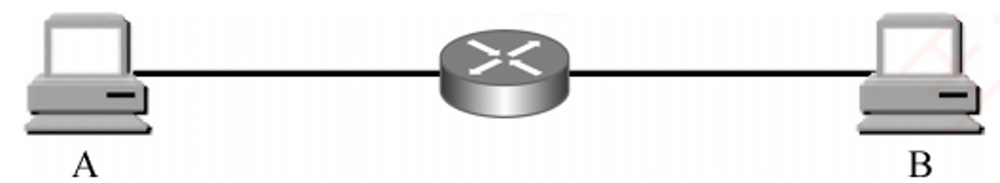
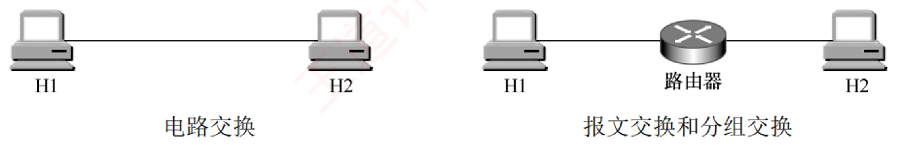
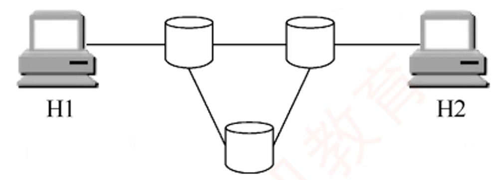
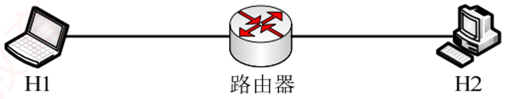
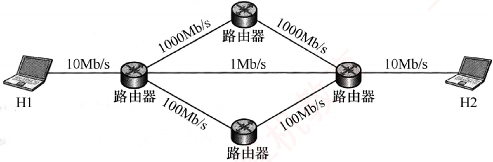
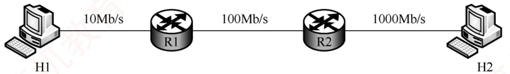
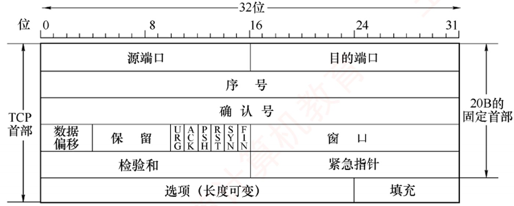
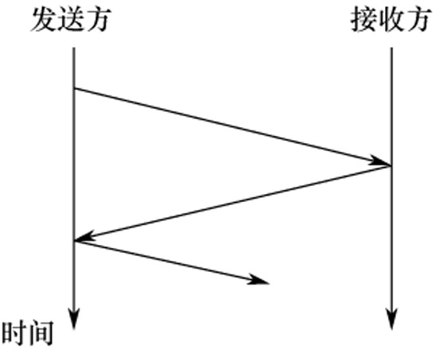
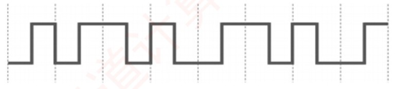

# 《王道计算机网络》· 第1章 计算机网络体系结构（课后选择题全解）

> 本章共包含 2 个小节，共计 55 道精选选择题。

---

## 1.1 计算机网络概述

### 【WD-CN-C-1.1-T01】第 1 题（P2）

1.1 计算机网络概述
1. 计算机网络可被理解为(
)
A. 执行计算机数据处理的软件模块
B. 由自治的计算机互联起来的集合体
C. 多个处理器通过共享内存实现的紧耦合系统
D. 用于共同完成一项任务的分布式系统

> **【唯一编号】** `WD-CN-C-1.1-T01`
> **【课程】** 计算机网络
> **【章节】** 第1章 计算机网络体系结构 · 1.1 计算机网络概述

---

### 【WD-CN-C-1.1-T02】第 2 题（P2）

2. 下列不属于计算机网络功能的是(
)
A. 提高系统可靠性
B. 提高工作效率
C. 分散数据的综合处理
D. 使各计算机相对独立

> **【唯一编号】** `WD-CN-C-1.1-T02`
> **【课程】** 计算机网络
> **【章节】** 第1章 计算机网络体系结构 · 1.1 计算机网络概述

---

### 【WD-CN-C-1.1-T03】第 3 题（P2）

3. 下列关于网络中的计算机的描述中, 正确的是(
)
A. 各自独立,没有联系
B. 拥有独立的操作系统
C. 互相干扰
D. 拥有共同的操作系统

> **【唯一编号】** `WD-CN-C-1.1-T03`
> **【课程】** 计算机网络
> **【章节】** 第1章 计算机网络体系结构 · 1.1 计算机网络概述

---

### 【WD-CN-C-1.1-T04】第 4 题（P2）

4. 分组交换相比报文交换的主要改进是(
)
A. 差错控制更加完善
B. 路由算法更加简单
C. 传输单位更小且有固定的最大长度
D. 传输单位更大且有固定的最大长度

> **【唯一编号】** `WD-CN-C-1.1-T04`
> **【课程】** 计算机网络
> **【章节】** 第1章 计算机网络体系结构 · 1.1 计算机网络概述

---

### 【WD-CN-C-1.1-T05】第 5 题（P2）

5. 下列(
) 是分组交换网络的缺点。
A. 信道利用率低
B. 附加信息开销大
C. 传播时延大
D. 不同规格的终端很难相互通信

> **【唯一编号】** `WD-CN-C-1.1-T05`
> **【课程】** 计算机网络
> **【章节】** 第1章 计算机网络体系结构 · 1.1 计算机网络概述

---

### 【WD-CN-C-1.1-T06】第 6 题（P2）

6. 不同的数据交换方式有不同的性能。为了使数据在网络中的传输时延最小,首选的交换方式是
( ①)；为保证数据无差错地传送，不应选用的交换方式是( ②); 分组交换对报文交换的主要改进
是( ③)，这种改进产生的直接结果是( ④)
①A.电路交换
B.报文交换
C.分组交换
②A.电路交换
B.报文交换
C.分组交换
③A.传输单位更小且有固定的最大长度
B.传输单位更大且有固定的最大长度
C.差错控制更完善
D.路由算法更简单
④A.降低了误码率
B.提高了数据传输速率
C.减少传输时延
D.增加传输时延

> **【唯一编号】** `WD-CN-C-1.1-T06`
> **【课程】** 计算机网络
> **【章节】** 第1章 计算机网络体系结构 · 1.1 计算机网络概述

---

### 【WD-CN-C-1.1-T07】第 7 题（P2）

7. 下列说法中, (
) 是数据报方式的特点。
A. 同一报文的不同分组可以经过不同的传输路径通过通信子网
B. 同一报文的不同分组到达目的结点时顺序是确定的
C. 适合于短报文的通信
D. 同一报文的不同分组在路由选择时只需要进行一次

> **【唯一编号】** `WD-CN-C-1.1-T07`
> **【课程】** 计算机网络
> **【章节】** 第1章 计算机网络体系结构 · 1.1 计算机网络概述

---

### 【WD-CN-C-1.1-T08】第 8 题（P3）

8. 计算机网络分为广域网、城域网和局域网,其划分的主要依据是(
)
A. 网络的作用范围
B. 网络的拓扑结构
C. 网络的通信方式
D. 网络的传输介质

> **【唯一编号】** `WD-CN-C-1.1-T08`
> **【课程】** 计算机网络
> **【章节】** 第1章 计算机网络体系结构 · 1.1 计算机网络概述

---

### 【WD-CN-C-1.1-T09】第 9 题（P3）

9. 假设主机A 和B 之间的链路带宽为100Mb/s,主机A 的网卡速率为1Gb/s,主机B 的网卡速率为
10Mb/s,主机A 给主机B 发送数据的最高理论速率为(
)
A. 1Mb/s
B. 10Mb/s
C. 100Mb/s
D. 1Gb/s

> **【唯一编号】** `WD-CN-C-1.1-T09`
> **【课程】** 计算机网络
> **【章节】** 第1章 计算机网络体系结构 · 1.1 计算机网络概述

---

### 【WD-CN-C-1.1-T10】第 10 题（P3）

10. 某点对点链路的长度为100km, 若数据在该链路上的传输速率为108m/s, 链路带宽为20Mb/s, 已
知一个已发送的分组的发送时延和传播时延相等，则该分组的大小为(
)
A. 20Kb
B. 30Kb
C. 40Kb
D. 50Kb

> **【唯一编号】** `WD-CN-C-1.1-T10`
> **【课程】** 计算机网络
> **【章节】** 第1章 计算机网络体系结构 · 1.1 计算机网络概述

---

### 【WD-CN-C-1.1-T11】第 11 题（P3）

11. 在下图所示的采用存储转发方式的分组交换网中, 主机A 向B 发送两个长度为1000B 的分组,路
由器处理单个分组的时延为10ms(假设路由器同时最多只能处理一个分组, 若在处理某个分组时有
新的分组到达, 则存入缓存区), 忽略链路的传播时延, 所有链路的数据传输速率为1Mb/s, 则分组从
A 发送开始到B 接收完为止,需要的时间至少是(
)
A. 34ms
B. 36ms
C. 38ms
D. 52ms

> **【唯一编号】** `WD-CN-C-1.1-T11`
> **【课程】** 计算机网络
> **【章节】** 第1章 计算机网络体系结构 · 1.1 计算机网络概述

---

### 【WD-CN-C-1.1-T12】第 12 题（P3）

12. 如下图所示, 主机H1 和H2 之间有三种可选的交换方式: 电路交换、报文交换和分组交换,其中
电路交换建立电路连接的时间为2s, 报文交换和分组交换都要经过由一个路由器连接的链路, 分组
大小为5kb。三种交换方式的数据传输速率均为2.5kb/s，忽略所有的传播时延、分组开销和不可预
料的线路延迟，则下列说法中正确的是(
)
A. 若H1 向H2 发送5kb 的数据，则电路交换最节省时间
B. 若H1 向H2 发送500kb 的数据,则电路交换和分组交换的时间相同
C. 若H1 向H2 发送10kb 的数据,则报文交换比分组交换更节省时间
D. 若H1 向H2 发送15kb 的数据,则报文交换比电路交换更节省时间

> **【唯一编号】** `WD-CN-C-1.1-T12`
> **【课程】** 计算机网络
> **【章节】** 第1章 计算机网络体系结构 · 1.1 计算机网络概述

---

### 【WD-CN-C-1.1-T13】第 13 题（P4）

13.【2010 统考真题】在下图所示的采用“存储- 转发”方式的分组交换网络中,所有链路的数据传输
速率为100Mb/s，分组大小为1000B，其中分组头大小为20B。若主机H1 向主机H2 发送一个大小
为980000B 的文件,则在不考虑分组拆装时间和传播延迟的情况下,从H1 发送开始到H2 接收完为止,
需要的时间至少是(
)
A. 80ms
B. 80.08ms
C. 80.16ms
D. 80.24ms

> **【唯一编号】** `WD-CN-C-1.1-T13`
> **【课程】** 计算机网络
> **【章节】** 第1章 计算机网络体系结构 · 1.1 计算机网络概述

---

### 【WD-CN-C-1.1-T14】第 14 题（P4）

14.【2013 统考真题】主机甲通过一个路由器(存储转发方式) 与主机乙互连,两段链路的数据传输速
率均为10Mb/s，主机甲分别采用报文交换和分组大小为10kb 的分组交换向主机乙发送一个大小为
8Mb 1M=106

的报文。若忽略链路传播延迟、分组头开销和分组拆装时间, 则两种交换方式完成
该报文传输所需的总时间分别为(
)
A. 800ms、1600ms
B. 801ms、1600ms
C. 1600ms、800ms
D. 1600ms、801ms

> **【唯一编号】** `WD-CN-C-1.1-T14`
> **【课程】** 计算机网络
> **【章节】** 第1章 计算机网络体系结构 · 1.1 计算机网络概述

---

### 【WD-CN-C-1.1-T15】第 15 题（P4）

15.【2023 统考真题】在下图所示的分组交换网络中, 主机H1 和H2 通过路由器互连,2 段链路的带
宽均为100Mb/s，时延带宽积(单向传播时延× 带宽) 均为1000b。若H1 向H2 发送一个大小为
1MB 的文件，分组长度为1000B，则从H1 开始发送的时刻起到H2 收到文件全部数据时刻止，所
需的时间至少是(
) (注:1M = 106)
A. 80.02ms
B. 80.08ms
C. 80.09ms
D. 80.09ms

> **【唯一编号】** `WD-CN-C-1.1-T15`
> **【课程】** 计算机网络
> **【章节】** 第1章 计算机网络体系结构 · 1.1 计算机网络概述

---

### 【WD-CN-C-1.1-T16】第 16 题（P4）

16.【2024 统考真题】若某分组交换网络及每段链路的带宽如下图所示,则H1 到H2 的最大吞吐量约
为(
)
A. 1Mb/s
B. 10Mb/s
C. 100Mb/s
D. 1000Mb/s

> **【唯一编号】** `WD-CN-C-1.1-T16`
> **【课程】** 计算机网络
> **【章节】** 第1章 计算机网络体系结构 · 1.1 计算机网络概述

---

### 【WD-CN-C-1.1-T17】第 17 题（P5）

17. 某网络拓扑及各链路带宽如下图所示。网络按电路交换方式运行时, 主机H1 与H2 建立一条带
宽为10Mb/s 的电路, 建立电路的时间为32μs; 按分组交换方式运行时, 分组长度为400B, 忽略分组首
部开销。现主机H1 向H2 发送一个2MB 1M=106

的文件, 分别采用电路交换、报文交换、分组交
换方式时, H2 至少分别需要TCS、TMS、TPS 的时间才能接收到全部文件内容, 则TCS、TMS、TPS 三
者的大小关系是(
)
A. TCS > TMS > TPS
B. TMS > TPS > TCS
C. TMS > TCS > TPS
D. TPS > TMS > TCS

> **【唯一编号】** `WD-CN-C-1.1-T17`
> **【课程】** 计算机网络
> **【章节】** 第1章 计算机网络体系结构 · 1.1 计算机网络概述

---

## 1.2 计算机网络体系结构与参考模型

### 【WD-CN-C-1.2-T01】第 1 题（P2）

1.2 计算机网络体系结构与参考模型
1. 下列选项中,不属于对网络模型进行分层的目标的是(
)
A. 提供标准语言
B. 定义功能执行的方法
C. 定义标准界面
D. 增加功能之间的独立性

> **【唯一编号】** `WD-CN-C-1.2-T01`
> **【课程】** 计算机网络
> **【章节】** 第1章 计算机网络体系结构 · 1.2 计算机网络体系结构与参考模型

---

### 【WD-CN-C-1.2-T02】第 2 题（P2）

2. 将用户数据分成一个个数据块传输的优点不包括(
)
A. 减少延迟时间
B. 提高错误控制效率
C. 使多个应用更公平地使用共享通信介质
D. 有效数据在协议数据单元(PDU) 中所占比例更大

> **【唯一编号】** `WD-CN-C-1.2-T02`
> **【课程】** 计算机网络
> **【章节】** 第1章 计算机网络体系结构 · 1.2 计算机网络体系结构与参考模型

---

### 【WD-CN-C-1.2-T03】第 3 题（P2）

3. 协议是指在(
) 之间进行通信的规则或约定
A. 同一节点的上下层
B. 不同结点
C. 相邻实体
D. 不同结点对等实体

> **【唯一编号】** `WD-CN-C-1.2-T03`
> **【课程】** 计算机网络
> **【章节】** 第1章 计算机网络体系结构 · 1.2 计算机网络体系结构与参考模型

---

### 【WD-CN-C-1.2-T04】第 4 题（P2）

4. OSI 参考模型中的实体指的是(
)
A. 实现各层功能的规则
B. 上下层之间进行交互时所要的信息
C. 各层中实现该层功能的软件或硬件
D. 同一结点中相邻两层相互作用的地方

> **【唯一编号】** `WD-CN-C-1.2-T04`
> **【课程】** 计算机网络
> **【章节】** 第1章 计算机网络体系结构 · 1.2 计算机网络体系结构与参考模型

---

### 【WD-CN-C-1.2-T05】第 5 题（P2）

5. 在OSI 参考模型中, 第n 层与它之上的第n + 1 层的关系是(
)
A. 第n 层为第n + 1 层提供服务
B. 第n + 1 层为从第n 层接收的报文添加一个报头
C. 第n 层使用第n + 1 层提供的服务
D. 第n 层和第n + 1 层相互没有影响

> **【唯一编号】** `WD-CN-C-1.2-T05`
> **【课程】** 计算机网络
> **【章节】** 第1章 计算机网络体系结构 · 1.2 计算机网络体系结构与参考模型

---

### 【WD-CN-C-1.2-T06】第 6 题（P6）

6. 关于计算机网络及其结构模型,下列几种说法中错误的是(
)
A. 世界上第一个计算机网络是ARPAnet
B. Internet 最早起源于ARPAnet
C. 国际标准化组织(ISO) 设计出了OSI/RM 参考模型,即实际执行的标准
D. TCP/IP 参考模型分为4 个层次

> **【唯一编号】** `WD-CN-C-1.2-T06`
> **【课程】** 计算机网络
> **【章节】** 第1章 计算机网络体系结构 · 1.2 计算机网络体系结构与参考模型

---

### 【WD-CN-C-1.2-T07】第 7 题（P6）

7. (
) 是计算机网络中OSI 参考模型的3 个主要概念。
A. 服务、接口、协议
B. 结构、模型、交换
C. 子网、层次、端口
D. 广域网、城域网、局域网

> **【唯一编号】** `WD-CN-C-1.2-T07`
> **【课程】** 计算机网络
> **【章节】** 第1章 计算机网络体系结构 · 1.2 计算机网络体系结构与参考模型

---

### 【WD-CN-C-1.2-T08】第 8 题（P6）

8. 下列关于网络协议三要素的描述中,正确的是(
)
A. 数据格式、编码、信号电平
B. 数据格式、控制信息、速度匹配
C. 语法、语义、同步
D. 编码、控制信息、同步

> **【唯一编号】** `WD-CN-C-1.2-T08`
> **【课程】** 计算机网络
> **【章节】** 第1章 计算机网络体系结构 · 1.2 计算机网络体系结构与参考模型

---

### 【WD-CN-C-1.2-T09】第 9 题（P6）

9. 释放TCP 连接的四次挥手报文的先后关系,属于网络协议三要素中的(
)
A. 语法
B. 时序
C. 语义
D. 服务

> **【唯一编号】** `WD-CN-C-1.2-T09`
> **【课程】** 计算机网络
> **【章节】** 第1章 计算机网络体系结构 · 1.2 计算机网络体系结构与参考模型

---

### 【WD-CN-C-1.2-T10】第 10 题（P6）

10. 下图是TCP 报文段的首部格式,它描述的是网络协议三要素中的(
)
I.语法
II.语义
III.时序(同步)
A. 仅I
B. 仅II
C. 仅III
D. I、II 和III

> **【唯一编号】** `WD-CN-C-1.2-T10`
> **【课程】** 计算机网络
> **【章节】** 第1章 计算机网络体系结构 · 1.2 计算机网络体系结构与参考模型

---

### 【WD-CN-C-1.2-T11】第 11 题（P6）

11. 下列关于OSI 参考模型的描述中,错误的是(
)
A. OSI 参考模型定义了开放系统的层次结构
B. OSI 参考模型定义了各层所包括的可能的服务
C. OSI 参考模型作为一个框架协调组织各层协议的制定
D. OSI 参考模型定义了各层接口的实现方法

> **【唯一编号】** `WD-CN-C-1.2-T11`
> **【课程】** 计算机网络
> **【章节】** 第1章 计算机网络体系结构 · 1.2 计算机网络体系结构与参考模型

---

### 【WD-CN-C-1.2-T12】第 12 题（P6）

12. 负责将比特转换成电信号进行传输的层是(
)
A. 应用层
B. 网络层
C. 数据链路层
D. 物理层

> **【唯一编号】** `WD-CN-C-1.2-T12`
> **【课程】** 计算机网络
> **【章节】** 第1章 计算机网络体系结构 · 1.2 计算机网络体系结构与参考模型

---

### 【WD-CN-C-1.2-T13】第 13 题（P6）

13. 下列关于OSI 参考模型的物理层功能的描述中,错误的是(
)
A. 比特0 和1 使用何种电信号表示
B. 传输能否在两个方向上同时进行
C. 1 个比特持续多长时间
D. 避免快速发送方“淹没”慢速接收方

> **【唯一编号】** `WD-CN-C-1.2-T13`
> **【课程】** 计算机网络
> **【章节】** 第1章 计算机网络体系结构 · 1.2 计算机网络体系结构与参考模型

---

### 【WD-CN-C-1.2-T14】第 14 题（P7）

14. OSI 参考模型中的数据链路层不具有(
) 功能。
A. 物理寻址
B. 流量控制
C. 差错检验
D. 拥塞控制

> **【唯一编号】** `WD-CN-C-1.2-T14`
> **【课程】** 计算机网络
> **【章节】** 第1章 计算机网络体系结构 · 1.2 计算机网络体系结构与参考模型

---

### 【WD-CN-C-1.2-T15】第 15 题（P7）

15. 下列能够最好地描述OSI 参考模型的数据链路层功能的是(
)
A. 提供用户和网络的接口
B. 处理信号通过介质的传输
C. 控制报文通过网络的路由选择
D. 保证数据正确的顺序和完整性

> **【唯一编号】** `WD-CN-C-1.2-T15`
> **【课程】** 计算机网络
> **【章节】** 第1章 计算机网络体系结构 · 1.2 计算机网络体系结构与参考模型

---

### 【WD-CN-C-1.2-T16】第 16 题（P7）

16. 当数据由端系统A 传送至端系统B 时,不参与数据封装工作的是(
)
A. 物理层
B. 数据链路层
C. 网络层
D. 表示层

> **【唯一编号】** `WD-CN-C-1.2-T16`
> **【课程】** 计算机网络
> **【章节】** 第1章 计算机网络体系结构 · 1.2 计算机网络体系结构与参考模型

---

### 【WD-CN-C-1.2-T17】第 17 题（P7）

17. 在OSI 参考模型中,实现端到端的应答、分组排序和流量控制功能的协议层是(
)
A. 会话层
B. 网络层
C. 传输层
D. 数据链路层

> **【唯一编号】** `WD-CN-C-1.2-T17`
> **【课程】** 计算机网络
> **【章节】** 第1章 计算机网络体系结构 · 1.2 计算机网络体系结构与参考模型

---

### 【WD-CN-C-1.2-T18】第 18 题（P7）

18. 在ISO/OSI 参考模型中,可同时提供无连接服务和面向连接服务的是(
)
A. 物理层
B. 数据链路层
C. 网络层
D. 传输层

> **【唯一编号】** `WD-CN-C-1.2-T18`
> **【课程】** 计算机网络
> **【章节】** 第1章 计算机网络体系结构 · 1.2 计算机网络体系结构与参考模型

---

### 【WD-CN-C-1.2-T19】第 19 题（P7）

19. 在OSI 参考模型中,当两台计算机进行文件传输时,为防止中间出现网络故障而重传整个文件的情
况，可通过在文件中插入同步点来解决，这个动作发生在(
)
A. 表示层
B. 会话层
C. 网络层
D. 应用层

> **【唯一编号】** `WD-CN-C-1.2-T19`
> **【课程】** 计算机网络
> **【章节】** 第1章 计算机网络体系结构 · 1.2 计算机网络体系结构与参考模型

---

### 【WD-CN-C-1.2-T20】第 20 题（P7）

20. 数据的格式转换及压缩属于OSI 参考模型中(
) 的功能。
A. 应用层
B. 表示层
C. 会话层
D. 传输层

> **【唯一编号】** `WD-CN-C-1.2-T20`
> **【课程】** 计算机网络
> **【章节】** 第1章 计算机网络体系结构 · 1.2 计算机网络体系结构与参考模型

---

### 【WD-CN-C-1.2-T21】第 21 题（P7）

21. OSI 参考模型中(
) 通过设置检验点,使通信双方在通信失效时可从检验点恢复通信。
A. 传输层
B. 网络层
C. 表示层
D. 会话层

> **【唯一编号】** `WD-CN-C-1.2-T21`
> **【课程】** 计算机网络
> **【章节】** 第1章 计算机网络体系结构 · 1.2 计算机网络体系结构与参考模型

---

### 【WD-CN-C-1.2-T22】第 22 题（P7）

22. 下列说法中,正确描述了OSI 参考模型中数据的封装过程的是(
)
A. 数据链路层在分组上仅增加了源物理地址和目的物理地址
B. 网络层将高层协议产生的数据封装成分组,并增加第三层的地址和控制信息
C. 传输层将数据流封装成数据帧,并增加可靠性和流控制信息
D. 表示层将高层协议产生的数据分割成数据段,并增加相应的源和目的端口信息

> **【唯一编号】** `WD-CN-C-1.2-T22`
> **【课程】** 计算机网络
> **【章节】** 第1章 计算机网络体系结构 · 1.2 计算机网络体系结构与参考模型

---

### 【WD-CN-C-1.2-T23】第 23 题（P7）

23. 在OSI 参考模型中,提供流量控制功能的层是第(①) 层; 提供建立、维护和拆除端到端的连接的
层是(②); 为数据分组提供在网络中路由的功能的是(③); 传输层提供(④) 的数据传送: 为网络层实
体提供数据发送和接收功能及过程的是(⑤)
①A. 1、2、3
B. 2、3、4
C. 3、4、5
D. 4、5、6
②A.物理层
B.数据链路层
C.会话层
D.传输层
③A.物理层
B.数据链路层
C.网络层
D.传输层
④A.主机进程之间
B.网络之间
C.数据链路之间
D.物理线路之间
⑤A.物理层
B.数据链路层
C.会话层
D.传输层

> **【唯一编号】** `WD-CN-C-1.2-T23`
> **【课程】** 计算机网络
> **【章节】** 第1章 计算机网络体系结构 · 1.2 计算机网络体系结构与参考模型

---

### 【WD-CN-C-1.2-T24】第 24 题（P8）

24. 在OSI 参考模型中, (
) 利用通信子网提供的服务实现两个进程之间的端到端通信。
A. 网络层
B. 传输层
C. 会话层
D. 表示层

> **【唯一编号】** `WD-CN-C-1.2-T24`
> **【课程】** 计算机网络
> **【章节】** 第1章 计算机网络体系结构 · 1.2 计算机网络体系结构与参考模型

---

### 【WD-CN-C-1.2-T25】第 25 题（P8）

25. 互联网采用的核心技术是(
)
A. TCP/IP
B. 局域网技术
C. 远程通信技术
D. 光纤技术

> **【唯一编号】** `WD-CN-C-1.2-T25`
> **【课程】** 计算机网络
> **【章节】** 第1章 计算机网络体系结构 · 1.2 计算机网络体系结构与参考模型

---

### 【WD-CN-C-1.2-T26】第 26 题（P8）

26. 在TCP/IP 模型中, (
) 处理关于可靠性、流量控制和错误校正等问题。
A. 网络接口层
B. 网际层
C. 传输层
D. 应用层

> **【唯一编号】** `WD-CN-C-1.2-T26`
> **【课程】** 计算机网络
> **【章节】** 第1章 计算机网络体系结构 · 1.2 计算机网络体系结构与参考模型

---

### 【WD-CN-C-1.2-T27】第 27 题（P8）

27. 上下邻层实体之间的接口称为服务访问点,应用层的服务访问点也称(
)
A. 用户接口
B. 网卡接口
C. IP 地址
D. MAC 地址

> **【唯一编号】** `WD-CN-C-1.2-T27`
> **【课程】** 计算机网络
> **【章节】** 第1章 计算机网络体系结构 · 1.2 计算机网络体系结构与参考模型

---

### 【WD-CN-C-1.2-T28】第 28 题（P8）

28. 在OSI 参考模型中,各层都有差错控制过程,指出以下每种差错发生在哪些层中。噪声使传输链路
上的一个0 变成1 或一个1 变成0(①); 收到一个序号错误的目的帧(②); 一台打印机正在打印,突然
收到一个错误指令要打印头回到本行的开始位置(③)
①A.物理层
B.网络层
C.数据链路层
D.会话层
②A.物理层
B.网络层
C.数据链路层
D.会话层
③A.物理层
B.网络层
C.应用层
D.会话层

> **【唯一编号】** `WD-CN-C-1.2-T28`
> **【课程】** 计算机网络
> **【章节】** 第1章 计算机网络体系结构 · 1.2 计算机网络体系结构与参考模型

---

### 【WD-CN-C-1.2-T29】第 29 题（P8）

29.【2009 统考真题】在OSI 参考模型中,自下而上第一个提供端到端服务的层次是(
)
A. 数据链路层
B. 传输层
C. 会话层
D. 应用层

> **【唯一编号】** `WD-CN-C-1.2-T29`
> **【课程】** 计算机网络
> **【章节】** 第1章 计算机网络体系结构 · 1.2 计算机网络体系结构与参考模型

---

### 【WD-CN-C-1.2-T30】第 30 题（P8）

30.【2010 统考真题】下列选项中,不属于网络体系结构所描述的内容是(
)
A. 网络的层次
B. 每层使用的协议
C. 协议的内部实现细节
D. 每层必须完成的功能

> **【唯一编号】** `WD-CN-C-1.2-T30`
> **【课程】** 计算机网络
> **【章节】** 第1章 计算机网络体系结构 · 1.2 计算机网络体系结构与参考模型

---

### 【WD-CN-C-1.2-T31】第 31 题（P8）

31.【2013 统考真题】在OSI 参考模型中,功能需由应用层的相邻层实现的是(
)
A. 对话管理
B. 数据格式转换
C. 路由选择
D. 可靠数据传输

> **【唯一编号】** `WD-CN-C-1.2-T31`
> **【课程】** 计算机网络
> **【章节】** 第1章 计算机网络体系结构 · 1.2 计算机网络体系结构与参考模型

---

### 【WD-CN-C-1.2-T32】第 32 题（P8）

32.【2014 统考真题】在OSI 参考模型中,直接为会话层提供服务的是(
)
A. 应用层
B. 表示层
C. 传输层
D. 网络层

> **【唯一编号】** `WD-CN-C-1.2-T32`
> **【课程】** 计算机网络
> **【章节】** 第1章 计算机网络体系结构 · 1.2 计算机网络体系结构与参考模型

---

### 【WD-CN-C-1.2-T33】第 33 题（P8）

33.【2016 统考真题】在OSI 参考模型中,路由器、交换机(Switch)、集线器(Hub) 实现的最高功能层
分别是(
)
A. 2、2、1
B. 2、2、2
C. 3、2、1
D. 3、2、2

> **【唯一编号】** `WD-CN-C-1.2-T33`
> **【课程】** 计算机网络
> **【章节】** 第1章 计算机网络体系结构 · 1.2 计算机网络体系结构与参考模型

---

### 【WD-CN-C-1.2-T34】第 34 题（P8）

34.【2017 统考真题】假设OSI 参考模型的应用层欲发送400B 的数据(无拆分),除物理层和应用层外,
其他各层在封装PDU 时均引入20B 的额外开销,则应用层的数据传输效率约为(
)
A. 80%
B. 83%
C. 87%
D. 91%

> **【唯一编号】** `WD-CN-C-1.2-T34`
> **【课程】** 计算机网络
> **【章节】** 第1章 计算机网络体系结构 · 1.2 计算机网络体系结构与参考模型

---

### 【WD-CN-C-1.2-T35】第 35 题（P8）

35.【2019 统考真题】OSI 参考模型的第5 层(自下而上) 完成的主要功能是(
)
A. 差错控制
B. 路由选择
C. 会话管理
D. 数据表示转换

> **【唯一编号】** `WD-CN-C-1.2-T35`
> **【课程】** 计算机网络
> **【章节】** 第1章 计算机网络体系结构 · 1.2 计算机网络体系结构与参考模型

---

### 【WD-CN-C-1.2-T36】第 36 题（P9）

36.【2020 统考真题】下图描述的协议要素是(
)
I.语法
II.语义
III.时序
A. 仅I
B. 仅II
C. 仅III
D. I、II 和III

> **【唯一编号】** `WD-CN-C-1.2-T36`
> **【课程】** 计算机网络
> **【章节】** 第1章 计算机网络体系结构 · 1.2 计算机网络体系结构与参考模型

---

### 【WD-CN-C-1.2-T37】第 37 题（P9）

37.【2021 统考真题】在TCP/IP 参考模型中,由传输层相邻的下一层实现的主要功能是(
)
A. 对话管理
B. 路由选择
C. 端到端报文段传输
D. 节点到节点流量控制

> **【唯一编号】** `WD-CN-C-1.2-T37`
> **【课程】** 计算机网络
> **【章节】** 第1章 计算机网络体系结构 · 1.2 计算机网络体系结构与参考模型

---

### 【WD-CN-C-1.2-T38】第 38 题（P9）

38.【2022 统考真题】在ISO/OSI 参考模型中,实现两个相邻结点间流量控制功能的是(
)
A. 物理层
B. 数据链路层
C. 网络层
D. 传输层

第2 章
物理层

> **【唯一编号】** `WD-CN-C-1.2-T38`
> **【课程】** 计算机网络
> **【章节】** 第1章 计算机网络体系结构 · 1.2 计算机网络体系结构与参考模型
