# 《王道计算机网络》· 第4章 网络层（课后选择题全解）

> 本章共包含 7 个小节，共计 163 道精选选择题。

---
## 4.1 网络层的功能
---

### 【WD-CN-C-4.1-T01】第 1 题（P2）

1. 路由器连接的异构网络是指(
)
A. 网络的拓扑结构不同
B. 网络中计算机操作系统不同
C. 数据链路层协议和物理层协议至少有一个不同
D. 数据链路层协议相同,物理层协议不同

> **【唯一编号】** `WD-CN-C-4.1-T01`
> **【课程】** 计算机网络
> **【章节】** 第4章 网络层 · 4.1 网络层的功能

---

### 【WD-CN-C-4.1-T02】第 2 题（P2）

2. 网络中发生了拥塞,根据是(
)
A. 随着通信子网负载的增加,吞吐量也增加
B. 网络节点接收和发出的分组越来越少
C. 网络节点接收和发出的分组越来越多
D. 随着通信子网负载的增加,吞吐量反而降低

> **【唯一编号】** `WD-CN-C-4.1-T02`
> **【课程】** 计算机网络
> **【章节】** 第4章 网络层 · 4.1 网络层的功能

---

### 【WD-CN-C-4.1-T03】第 3 题（P2）

3. 在路由器互连的多个局域网的结构中,要求每个局域网(
)
A. 物理层协议可以不同，而数据链路层及其以上的高层协议必须相同
B. 物理层、数据链路层协议可以不同，而数据链路层以上的高层协议必须相同
C. 物理层、数据链路层、网络层协议可以不同,而网络层以上的高层协议必须相同
D. 物理层、数据链路层、网络层及高层协议都可以不同

> **【唯一编号】** `WD-CN-C-4.1-T03`
> **【课程】** 计算机网络
> **【章节】** 第4章 网络层 · 4.1 网络层的功能

---

### 【WD-CN-C-4.1-T04】第 4 题（P2）

4. 在互联网中,一个路由器的路由表通常包含(
)
A. 目的网络和到达目的网络的完整路径
B. 所有目的主机和到达该目的主机的完整路径
C. 目的网络和到达该目的网络路径上的下一个路由器的IP 地址
D. 目的网络和到达该目的网络路径上的下一个路由器的MAC 地址

> **【唯一编号】** `WD-CN-C-4.1-T04`
> **【课程】** 计算机网络
> **【章节】** 第4章 网络层 · 4.1 网络层的功能

---

### 【WD-CN-C-4.1-T05】第 5 题（P2）

5. 路由器转发分组的根据是报文的(
)
A. 端口号
B. MAC 地址
C. IP 地址
D. 域名

> **【唯一编号】** `WD-CN-C-4.1-T05`
> **【课程】** 计算机网络
> **【章节】** 第4章 网络层 · 4.1 网络层的功能

---

### 【WD-CN-C-4.1-T06】第 6 题（P2）

6. 路由器在能够开始向输出链路传输分组的第一位之前,必须先接收到整个分组,这种机制称为(
)
A. 存储转发机制
B. 直通交换机制
C. 分组交换机制
D. 分组检测机制

> **【唯一编号】** `WD-CN-C-4.1-T06`
> **【课程】** 计算机网络
> **【章节】** 第4章 网络层 · 4.1 网络层的功能

---

### 【WD-CN-C-4.1-T07】第 7 题（P2）

7. 在互联网中，IP 分组的传输需要经过源主机和中间路由器到达目的主机，通常(
)
A. 源主机和中间路由器都知道IP 分组到达目的主机需要经过的完整路径
B. 源主机和中间路由器都不知道IP 分组到达目的主机需要经过的完整路径
C. 源主机知道IP 分组到达目的主机需要经过的完整路径,而中间路由器不知道
D. 源主机不知道IP 分组到达目的主机需要经过的完整路径,而中间路由器知道

> **【唯一编号】** `WD-CN-C-4.1-T07`
> **【课程】** 计算机网络
> **【章节】** 第4章 网络层 · 4.1 网络层的功能

---

### 【WD-CN-C-4.1-T08】第 8 题（P37）

8. 下列协议中,属于网络层协议的是(
)
I. IP
II. TCP
III. FTP
IV. ICMP
A. I 和II
B. II 和III
C. III 和IV
D. I 和IV

> **【唯一编号】** `WD-CN-C-4.1-T08`
> **【课程】** 计算机网络
> **【章节】** 第4章 网络层 · 4.1 网络层的功能

---

### 【WD-CN-C-4.1-T09】第 9 题（P37）

9. 下列关于各种数据交换方式的叙述中,错误的是(
)
A. 电路交换不提供差错控制功能
B. 分组交换的分组有最大长度的限制
C. 虚电路是面向连接的,它提供的是一种可靠的服务
D. 在故障率很高的传输系统中,选择虚电路方式更合适

> **【唯一编号】** `WD-CN-C-4.1-T09`
> **【课程】** 计算机网络
> **【章节】** 第4章 网络层 · 4.1 网络层的功能

---

### 【WD-CN-C-4.1-T10】第 10 题（P37）

10. 下列有关虚电路服务和数据报服务的叙述中, 正确的是(
)
A. 虚电路服务和数据报服务都是无连接的服务
B. 数据报服务中,分组在网络中沿同一条路径传输,并且按发出顺序到达
C. 虚电路在建立连接后,分组中需携带虚电路标识
D. 虚电路中的分组到达顺序可能与发出顺序不同

> **【唯一编号】** `WD-CN-C-4.1-T10`
> **【课程】** 计算机网络
> **【章节】** 第4章 网络层 · 4.1 网络层的功能

---

### 【WD-CN-C-4.1-T11】第 11 题（P37）

11. 同一报文中的分组可以由不同的传输路径通过通信子网的方法是(
)
A. 分组交换
B. 电路交换
C. 虚电路方式
D. 数据报方式

> **【唯一编号】** `WD-CN-C-4.1-T11`
> **【课程】** 计算机网络
> **【章节】** 第4章 网络层 · 4.1 网络层的功能

---

### 【WD-CN-C-4.1-T12】第 12 题（P37）

12. 下列有关数据报和虚电路的叙述中,错误的是(
)
A. 数据报方式中,某个节点若因故障而丢失分组,则其他分组仍可正常传输
B. 数据报方式中,每个分组独立地进行路由选择和转发,不同分组之间没有必然联系
C. 虚电路方式中,属于同一条虚电路的分组按照同一路由转发
D. 尽管虚电路方式是面向连接的,但它并不保证分组的有序到达

> **【唯一编号】** `WD-CN-C-4.1-T12`
> **【课程】** 计算机网络
> **【章节】** 第4章 网络层 · 4.1 网络层的功能

---

### 【WD-CN-C-4.1-T13】第 13 题（P37）

13. 下列关于虚电路和数据报的叙述中,正确的是(
)
A. 虚电路是一种分组交换技术,但不能按照存储转发的方式工作
B. 虚电路的连接是临时性连接,当会话结束时就释放这种连接
C. 数据报服务不提供可靠传输,但可以保证分组的有序到达
D. 数据报服务中,每个分组都必须携带源地址和目的地址

> **【唯一编号】** `WD-CN-C-4.1-T13`
> **【课程】** 计算机网络
> **【章节】** 第4章 网络层 · 4.1 网络层的功能

---

### 【WD-CN-C-4.1-T14】第 14 题（P37）

14. 下列关于虚电路的说法中,正确的是(
)
A. 虚电路依赖其他协议实现差错控制
B. 采用虚电路方式发送分组时,分组首部都必须包含目的地址
C. 虚电路结合了电路交换的思想,适合对实时性要求较高的长时间通信
D. 多站点同时使用一段物理链路实行虚电路交换会产生冲突,无法正常通信

> **【唯一编号】** `WD-CN-C-4.1-T14`
> **【课程】** 计算机网络
> **【章节】** 第4章 网络层 · 4.1 网络层的功能

---

### 【WD-CN-C-4.1-T15】第 15 题（P38）

15. 下列关于虚电路的说法中,正确的是(
)
A. 虚电路和电路交换一样,在数据传输前要建立物理连接
B. 虚电路中间节点发生故障后,可沿其他路径继续通信,无须重新建立连接
C. 虚电路只有建立连接的分组需要携带源地址和目的地址
D. 在虚电路上传送的同一个会话的数据分组可以走不同的路径

> **【唯一编号】** `WD-CN-C-4.1-T15`
> **【课程】** 计算机网络
> **【章节】** 第4章 网络层 · 4.1 网络层的功能

---

### 【WD-CN-C-4.1-T16】第 16 题（P38）

16. 下列4 种传输方式中,由网络负责差错控制和流量控制,分组按顺序被递交的是(
)
A. 电路交换
B. 报文交换
C. 虚电路分组交换
D. 数据报分组交换

> **【唯一编号】** `WD-CN-C-4.1-T16`
> **【课程】** 计算机网络
> **【章节】** 第4章 网络层 · 4.1 网络层的功能

---

### 【WD-CN-C-4.1-T17】第 17 题（P38）

17. 下列描述中，(
) 不是软件定义网络(SDN) 的特点。
A. 控制与转发功能分离
B. 控制平面集中化
C. 接口开放可编程
D. OpenFlow 取代了路由协议

> **【唯一编号】** `WD-CN-C-4.1-T17`
> **【课程】** 计算机网络
> **【章节】** 第4章 网络层 · 4.1 网络层的功能

---

### 【WD-CN-C-4.1-T18】第 18 题（P38）

18. 下列关于SDN(软件定义网络) 的描述中,错误的是(
)
I. SDN 是近年来出现的一种新型物理网络结构
II. OpenFlow 交换机基于“流表”来转发分组
III. SDN 远程控制器位于OpenFlow 交换机中
IV. OpenFlow 可视为SDN 的控制层面与数据层面的通信接口
A. I 和III
B. I 和IV
C. II 和IV
D. I、III 和IV

> **【唯一编号】** `WD-CN-C-4.1-T18`
> **【课程】** 计算机网络
> **【章节】** 第4章 网络层 · 4.1 网络层的功能

---

### 【WD-CN-C-4.1-T19】第 19 题（P38）

19.【2011 统考真题】TCP/IP 模型的网络层提供的是(
)
A. 无连接不可靠的数据报服务
B. 无连接可靠的数据报服务
C. 有连接不可靠的虚电路服务
D. 有连接可靠的虚电路服务

> **【唯一编号】** `WD-CN-C-4.1-T19`
> **【课程】** 计算机网络
> **【章节】** 第4章 网络层 · 4.1 网络层的功能

---

### 【WD-CN-C-4.1-T20】第 20 题（P38）

20.【2020 统考真题】下列关于虚电路网络的叙述中,错误的是(
)
A. 可以确保数据分组传输顺序
B. 需要为每条虚电路预分配带宽
C. 建立虚电路时需要进行路由选择
D. 依据虚电路号(VCID) 进行数据分组转发

> **【唯一编号】** `WD-CN-C-4.1-T20`
> **【课程】** 计算机网络
> **【章节】** 第4章 网络层 · 4.1 网络层的功能

---

### 【WD-CN-C-4.1-T21】第 21 题（P38）

21.【2022 统考真题】在SDN 网络体系结构中, SDN 控制器向数据平面的SDN 交换机下发流表时所
使用的接口是(
)
A. 东向接口
B. 南向接口
C. 西向接口
D. 北向接口

> **【唯一编号】** `WD-CN-C-4.1-T21`
> **【课程】** 计算机网络
> **【章节】** 第4章 网络层 · 4.1 网络层的功能

---
## 4.2 IPv
---

### 【WD-CN-C-4.2-T01】第 1 题（P2）

1. Internet 的网络层含有4 个重要的协议,分别为(
)
A. IP, ICMP, ARP, UDP
B. TCP, ICMP, UDP, ARP
C. IP, ICMP, ARP, RARP
D. UDP, IP, ICMP, RARP

> **【唯一编号】** `WD-CN-C-4.2-T01`
> **【课程】** 计算机网络
> **【章节】** 第4章 网络层 · 4.2 IPv4

---

### 【WD-CN-C-4.2-T02】第 2 题（P39）

2. 以下关于IPv4 分组结构的描述中,错误的是(
)
A. IPv4 分组头的长度是可变的
B. 协议字段表示IP 的版本，值为4 表示IPv4
C. IP 分组首部长度字段以4B 为单位, 总长度字段以字节为单位
D. 生存时间字段值表示一个分组可以经过的最多的跳数

> **【唯一编号】** `WD-CN-C-4.2-T02`
> **【课程】** 计算机网络
> **【章节】** 第4章 网络层 · 4.2 IPv4

---

### 【WD-CN-C-4.2-T03】第 3 题（P39）

3. IPv4 分组首部中有两个有关长度的字段: 首部长度和总长度,其中(
)
A. 首部长度字段和总长度字段都以8 比特为计数单位
B. 首部长度字段以8 比特为计数单位,总长度字段以32 比特为计数单位
C. 首部长度字段以32 比特为计数单位,总长度字段以8 比特为计数单位
D. 首部长度字段和总长度字段都以32 比特为计数单位

> **【唯一编号】** `WD-CN-C-4.2-T03`
> **【课程】** 计算机网络
> **【章节】** 第4章 网络层 · 4.2 IPv4

---

### 【WD-CN-C-4.2-T04】第 4 题（P39）

4. 下列关于IP 分组的首部检验和字段的说法中,正确的是(
)
A. 检验和字段检查的范围是整个IP 分组
B. 计算检验和的方法是对首部的每个16 比特按反码运算求和再取反码
C. 若网络层发现检验和错误,则丢弃该IP 分组并发送ICMP 差错报文
D. IP 分组的检验和的计算需要加入一个伪首部

> **【唯一编号】** `WD-CN-C-4.2-T04`
> **【课程】** 计算机网络
> **【章节】** 第4章 网络层 · 4.2 IPv4

---

### 【WD-CN-C-4.2-T05】第 5 题（P39）

5. 当数据报到达目的网络后,要传送到目的主机,需要知道IP 地址对应的(
)
A. 逻辑地址
B. 动态地址
C. 域名
D. 物理地址

> **【唯一编号】** `WD-CN-C-4.2-T05`
> **【课程】** 计算机网络
> **【章节】** 第4章 网络层 · 4.2 IPv4

---

### 【WD-CN-C-4.2-T06】第 6 题（P39）

6. 如果IPv4 的分组太大,会在传输中被分片,则在(
) 将对分片后的数据报重组。
A. 中间路由器
B. 下一跳路由器
C. 核心路由器
D. 目的主机

> **【唯一编号】** `WD-CN-C-4.2-T06`
> **【课程】** 计算机网络
> **【章节】** 第4章 网络层 · 4.2 IPv4

---

### 【WD-CN-C-4.2-T07】第 7 题（P39）

7. 在IP 首部的字段中，与分片和重组无关的字段是(
)
A. 总长度
B. 标识
C. 标志
D. 片偏移

> **【唯一编号】** `WD-CN-C-4.2-T07`
> **【课程】** 计算机网络
> **【章节】** 第4章 网络层 · 4.2 IPv4

---

### 【WD-CN-C-4.2-T08】第 8 题（P39）

8. 下列关于IP 分组的分片与组装的描述中,错误的是(
)
A. IP 分组头中与分片和组装相关的字段是: 标识、标志与片偏移
B. IP 分组规定的最大长度为65535B
C. 以太网的MTU 为1500B
D. 片偏移的单位是4B

> **【唯一编号】** `WD-CN-C-4.2-T08`
> **【课程】** 计算机网络
> **【章节】** 第4章 网络层 · 4.2 IPv4

---

### 【WD-CN-C-4.2-T09】第 9 题（P39）

9. 若一个IP 分组的片偏移字段的值为100，则意味着(
)
A. 该IP 分组没有分片
B. 该IP 分组的长度为100B
C. 该IP 分组的第一个字节是分片前的第100 个字节
D. 该IP 分组的第一个字节是分片前的第800 个字节

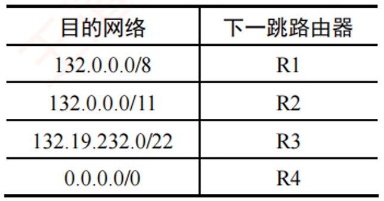

> **【唯一编号】** `WD-CN-C-4.2-T09`
> **【课程】** 计算机网络
> **【章节】** 第4章 网络层 · 4.2 IPv4

---

### 【WD-CN-C-4.2-T10】第 10 题（P40）

10. 下列关于IP 分组分片基本方法的描述中,错误的是(
)
A. IP 分组长度大于MTU 时,就必须对其进行分片
B. DF = 1,分组的长度又超过MTU 时,则丢弃该分组,不需要向源主机报告
C. 分片的MF 值为1 表示接收到的分片不是最后一个分片
D. 属于同一原始IP 分组的分片具有相同的标识

> **【唯一编号】** `WD-CN-C-4.2-T10`
> **【课程】** 计算机网络
> **【章节】** 第4章 网络层 · 4.2 IPv4

---

### 【WD-CN-C-4.2-T11】第 11 题（P40）

11. 某IP 分组的片偏移字段值为100，首部长度字段值为5，总长度字段值为100，则该IP 分组的
数据部分的第一个字节的编号与最后一个字节的编号是(
)
A. 100, 200
B. 100, 500
C. 800, 879
D. 800, 900

> **【唯一编号】** `WD-CN-C-4.2-T11`
> **【课程】** 计算机网络
> **【章节】** 第4章 网络层 · 4.2 IPv4

---

### 【WD-CN-C-4.2-T12】第 12 题（P40）

12. 路由器R0 的路由表见下表。若进入路由器R0 的分组的目的地址为132.19.237.5，则该分组应该
被转发到(
) 下一跳路由器。
A. R1
B. R2
C. R3
D. R4

> **【唯一编号】** `WD-CN-C-4.2-T12`
> **【课程】** 计算机网络
> **【章节】** 第4章 网络层 · 4.2 IPv4

---

### 【WD-CN-C-4.2-T13】第 13 题（P40）

13. IP 规定每个C 类网络最多可以有(
) 台主机或路由器
A. 254
B. 256
C. 32
D. 1024

> **【唯一编号】** `WD-CN-C-4.2-T13`
> **【课程】** 计算机网络
> **【章节】** 第4章 网络层 · 4.2 IPv4

---

### 【WD-CN-C-4.2-T14】第 14 题（P40）

14. 在下列4 个地址中,属于子网86.32.0.0/12 的地址是(
)
A. 86.33.224.123
B. 86.79.65.126
C. 86.79.65.216
D. 86.68.206.154

> **【唯一编号】** `WD-CN-C-4.2-T14`
> **【课程】** 计算机网络
> **【章节】** 第4章 网络层 · 4.2 IPv4

---

### 【WD-CN-C-4.2-T15】第 15 题（P40）

15. 在下列4 个地址中,属于单播地址的是(
)
A. 172.31.128.255/18
B. 10.255.255.255
C. 192.168.24.59/30
D. 224.105.5.211

> **【唯一编号】** `WD-CN-C-4.2-T15`
> **【课程】** 计算机网络
> **【章节】** 第4章 网络层 · 4.2 IPv4

---

### 【WD-CN-C-4.2-T16】第 16 题（P40）

16. 在下列4 个地址中,属于本地回路地址的是(
)
A. 10.10.10.1
B. 255.255.255.0
C. 192.0.0.1
D. 127.0.0.1

> **【唯一编号】** `WD-CN-C-4.2-T16`
> **【课程】** 计算机网络
> **【章节】** 第4章 网络层 · 4.2 IPv4

---

### 【WD-CN-C-4.2-T17】第 17 题（P40）

17. 访问互联网的每台主机都需要分配IP 地址(假定采用默认子网掩码),下列可以分配给主机的IP
地址是(
)
A. 192.46.10.0
B. 110.47.10.0
C. 127.10.10.17
D. 211.60.256.21

> **【唯一编号】** `WD-CN-C-4.2-T17`
> **【课程】** 计算机网络
> **【章节】** 第4章 网络层 · 4.2 IPv4

---

### 【WD-CN-C-4.2-T18】第 18 题（P41）

18. IP 规定,一些特殊的IP 地址一般是不会被指派的,下列说法错误的是(
)
A. 0.0.0.0 可以作为DHCP 客户的源IP 地址
B. 路由器不会转发目的IP 地址是255.255.255.255 的IP 数据报
C. 127.0.0.1 可以作为目的IP 地址,但不能作为源IP 地址
D. 路由器可以转发目的IP 地址的主机号为全1 的IP 数据报

> **【唯一编号】** `WD-CN-C-4.2-T18`
> **【课程】** 计算机网络
> **【章节】** 第4章 网络层 · 4.2 IPv4

---

### 【WD-CN-C-4.2-T19】第 19 题（P41）

19. 为了提供更多的子网,为一个B 类地址指定了子网掩码255.255.240.0,则每个子网最多可以有的主
机数是(
)
A. 16
B. 256
C. 4094
D. 4096

> **【唯一编号】** `WD-CN-C-4.2-T19`
> **【课程】** 计算机网络
> **【章节】** 第4章 网络层 · 4.2 IPv4

---

### 【WD-CN-C-4.2-T20】第 20 题（P41）

20. 不考虑NAT,在Internet 中, IP 数据报从源节点到目的节点可能需要经过多个网络和路由器。在整
个传输过程中，IP 数据报头部中的(
)
A. 源地址和目的地址都不会发生变化
B. 源地址有可能发生变化而目的地址不会发生变化
C. 源地址不会发生变化而目的地址有可能发生变化
D. 源地址和目的地址都有可能发生变化

> **【唯一编号】** `WD-CN-C-4.2-T20`
> **【课程】** 计算机网络
> **【章节】** 第4章 网络层 · 4.2 IPv4

---

### 【WD-CN-C-4.2-T21】第 21 题（P41）

21. 把IP 网络划分成子网,这样做的好处是(
)
A. 增加冲突域的大小
B. 增加主机的数量
C. 减少广播域的大小
D. 增加网络的数量

> **【唯一编号】** `WD-CN-C-4.2-T21`
> **【课程】** 计算机网络
> **【章节】** 第4章 网络层 · 4.2 IPv4

---

### 【WD-CN-C-4.2-T22】第 22 题（P41）

22. 一个网段的网络号为198.90.10.0/27,最多可以分成(
) 个子网; 此网段划分成若干子网后,每个子
网最多具有(
) 个可分配给主机的IP 地址。
A. 8,30
B. 4,62
C. 16, 14
D. 32,6

> **【唯一编号】** `WD-CN-C-4.2-T22`
> **【课程】** 计算机网络
> **【章节】** 第4章 网络层 · 4.2 IPv4

---

### 【WD-CN-C-4.2-T23】第 23 题（P41）

23. 一台主机有两个IP 地址,一个地址是192.168.11.25,另一个地址可能是(
)
A. 192.168.11.0
B. 192.168.11.26
C. 192.168.13.25
D. 192.168.11.24

> **【唯一编号】** `WD-CN-C-4.2-T23`
> **【课程】** 计算机网络
> **【章节】** 第4章 网络层 · 4.2 IPv4

---

### 【WD-CN-C-4.2-T24】第 24 题（P41）

24. CIDR 技术的主要作用是(
)
A. 有效分配IP 地址空间,并减少路由表的数目
B. 把大的网络划分成小的子网
C. 彻底解决IP 地址资源不足的问题
D. 由多台主机共享同一个网络地址

> **【唯一编号】** `WD-CN-C-4.2-T24`
> **【课程】** 计算机网络
> **【章节】** 第4章 网络层 · 4.2 IPv4

---

### 【WD-CN-C-4.2-T25】第 25 题（P41）

25. 某个CIDR 表示的IPv4 地址为126.166.66.99/22，则下面的描述中错误的是(
)
A. 网络前缀占用22 比特
B. 主机编号占用10 比特
C. 所在地址块包含的地址数为210
D. 126.166.66.99 是所在地址块的第一个地址

> **【唯一编号】** `WD-CN-C-4.2-T25`
> **【课程】** 计算机网络
> **【章节】** 第4章 网络层 · 4.2 IPv4

---

### 【WD-CN-C-4.2-T26】第 26 题（P42）

26. 某网络的一台主机的IP 地址是200.15.10.6/29,其配置的默认网关地址是200.15.10.7,这样配置后
发现主机无法PING 通任何远程设备,原因是(
)
A. 默认网关的地址不属于这个子网
B. 默认网关的地址是子网中的广播地址
C. 路由器接口的地址是子网的广播地址
D. 路由器接口的地址是多播地址

> **【唯一编号】** `WD-CN-C-4.2-T26`
> **【课程】** 计算机网络
> **【章节】** 第4章 网络层 · 4.2 IPv4

---

### 【WD-CN-C-4.2-T27】第 27 题（P42）

27. CIDR 地址块192.168.10.0/20 所包含的IP 地址范围是(①)。与地址192.16.0.19/28 同属于一个子
网的主机地址是(②)
①A. 192.168.0.0~192.168.12.255
B. 192.168.10.0~192.168.13.255
C. 192.168.10.0~192.168.14.255
D. 192.168.0.0~192.168.15.255
②A. 192.16.0.17
B. 192.16.0.31
C. 192.16.0.15
D. 192.16.0.14

> **【唯一编号】** `WD-CN-C-4.2-T27`
> **【课程】** 计算机网络
> **【章节】** 第4章 网络层 · 4.2 IPv4

---

### 【WD-CN-C-4.2-T28】第 28 题（P42）

28. 路由表错误和软件故障都可能使得网络中的数据形成传输环路而无限转发环路的分组，IPv4 协
议解决该问题的方法是(
)
A. 报文分片
B. 设定生命期
C. 增加检验和
D. 增加选项字段

> **【唯一编号】** `WD-CN-C-4.2-T28`
> **【课程】** 计算机网络
> **【章节】** 第4章 网络层 · 4.2 IPv4

---

### 【WD-CN-C-4.2-T29】第 29 题（P42）

29. 当下列IP 地址作为IP 数据报的目的地址时,互联网上的路由器不会正常转发的是(
)
A. 192.172.56.23
B. 172.15.34.128
C. 192.168.32.17
D. 172.128.45.34

> **【唯一编号】** `WD-CN-C-4.2-T29`
> **【课程】** 计算机网络
> **【章节】** 第4章 网络层 · 4.2 IPv4

---

### 【WD-CN-C-4.2-T30】第 30 题（P42）

30. 为了解决IP 地址耗尽的问题,可以采用以下一些措施,其中治本的是(
)
A. 划分子网
B. 采用无类比编址CIDR
C. 采用网络地址转换NAT
D. 采用IPv6

> **【唯一编号】** `WD-CN-C-4.2-T30`
> **【课程】** 计算机网络
> **【章节】** 第4章 网络层 · 4.2 IPv4

---

### 【WD-CN-C-4.2-T31】第 31 题（P42）

31. 下列对IP 分组的分片和重组的描述中, 正确的是(
)
A. IP 分组可以被源主机分片,并在中间路由器进行重组
B. IP 分组可以被路径中的路由器分片,并在目的主机进行重组
C. IP 分组可以被路径中的路由器分片,并在中间路由器上进行重组
D. IP 分组可以被路径中的路由器分片,并在最后一跳的路由器上进行重组

> **【唯一编号】** `WD-CN-C-4.2-T31`
> **【课程】** 计算机网络
> **【章节】** 第4章 网络层 · 4.2 IPv4

---

### 【WD-CN-C-4.2-T32】第 32 题（P42）

32. 一个网络中有几个子网,其中一个已分配了子网号74.178.247.96/29,则下列网络前缀中不能再分
配给其他子网的是(
)
A. 74.178.247.120/29
B. 74.178.247.64/29
C. 74.178.247.96/28
D. 74.178.247.104/29

> **【唯一编号】** `WD-CN-C-4.2-T32`
> **【课程】** 计算机网络
> **【章节】** 第4章 网络层 · 4.2 IPv4

---

### 【WD-CN-C-4.2-T33】第 33 题（P42）

33. 主机A 和主机B 的IP 地址分别为216.12.31.20 和216.13.32.21,要想让A 和B 工作在同一个IP 子
网内,应该给它们分配的子网掩码是(
)
A. 255.255.255.0
B. 255.255.0.0
C. 255.255.255.255
D. 255.0.0.0

> **【唯一编号】** `WD-CN-C-4.2-T33`
> **【课程】** 计算机网络
> **【章节】** 第4章 网络层 · 4.2 IPv4

---

### 【WD-CN-C-4.2-T34】第 34 题（P42）

34. 某单位分配了1 个B 类地址,计划将内部网络划分成35 个子网,将来可能增加16 个子网,每个子网
的主机数量接近800 台,则可行的掩码方案是(
)
A. 255.255.248.0
B. 255.255.252.0
C. 255.255.254.0
D. 255.255.255.0

> **【唯一编号】** `WD-CN-C-4.2-T34`
> **【课程】** 计算机网络
> **【章节】** 第4章 网络层 · 4.2 IPv4

---

### 【WD-CN-C-4.2-T35】第 35 题（P43）

35. 设有4 条路由172.18.129.0/24、172.18.130.0/24、172.18.132.0/24 和172.18.133.0/24,若进行路由
聚合,则能覆盖这4 条路由的地址是(
)
A. 172.18.128.0/21
B. 172.18.128.0/22
C. 172.18.130.0/22
D. 172.18.132.0/23

> **【唯一编号】** `WD-CN-C-4.2-T35`
> **【课程】** 计算机网络
> **【章节】** 第4章 网络层 · 4.2 IPv4

---

### 【WD-CN-C-4.2-T36】第 36 题（P43）

36. 下列4 个地址块中,与地址块192.168.6.192/26 不重叠且与192.168.6.192/26 聚合后的地址块不会
引入多余地址的是(
)
A. 192.168.6.0/25
B. 192.168.6.0/26
C. 192.168.6.128/26
D. 192.168.6.192/27

> **【唯一编号】** `WD-CN-C-4.2-T36`
> **【课程】** 计算机网络
> **【章节】** 第4章 网络层 · 4.2 IPv4

---

### 【WD-CN-C-4.2-T37】第 37 题（P43）

37. 在一条点对点链路上,为了减少IP 地址的浪费,子网掩码应指定为(
)
A. 255.255.255.252
B. 255.255.255.248
C. 255.255.255.240
D. 255.255.255.196

> **【唯一编号】** `WD-CN-C-4.2-T37`
> **【课程】** 计算机网络
> **【章节】** 第4章 网络层 · 4.2 IPv4

---

### 【WD-CN-C-4.2-T38】第 38 题（P43）

38. 某子网的子网掩码为255.255.255.224,共给4 台主机分配了IP 地址,其中一台因IP 地址分配不当
而存在通信故障。这一台主机的IP 地址是(
)
A. 202.3.1.33
B. 202.3.1.65
C. 202.3.1.44
D. 202.3.1.55

> **【唯一编号】** `WD-CN-C-4.2-T38`
> **【课程】** 计算机网络
> **【章节】** 第4章 网络层 · 4.2 IPv4

---

### 【WD-CN-C-4.2-T39】第 39 题（P43）

39. 某主机的IP 地址是166.66.66.66,子网掩码为255.255.192.0,若该主机向其所在子网发送广播分组,
则目的IP 地址应该是(
)
A. 166.66.66.255
B. 166.66.255.255
C. 166.255.255.255
D. 166.66.127.255

> **【唯一编号】** `WD-CN-C-4.2-T39`
> **【课程】** 计算机网络
> **【章节】** 第4章 网络层 · 4.2 IPv4

---

### 【WD-CN-C-4.2-T40】第 40 题（P43）

40. 现将一个IP 网络划分为4 个子网,若其中一个子网是192.168.1.130/26,则下列网络中不可能是另
外3 个子网之一的是(
)
A. 192.168.1.0/25
B. 192.168.1.64/26
C. 192.168.1.96/27
D. 192.168.1.224/27

> **【唯一编号】** `WD-CN-C-4.2-T40`
> **【课程】** 计算机网络
> **【章节】** 第4章 网络层 · 4.2 IPv4

---

### 【WD-CN-C-4.2-T41】第 41 题（P43）

41. 位于不同子网中的主机之间相互通信时,下列说法中正确的是(
)
A. 路由器在转发IP 数据报时,重新封装源硬件地址和目的硬件地址
B. 路由器在转发IP 数据报时,重新封装源IP 地址和目的IP 地址
C. 路由器在转发IP 数据报时,重新封装目的硬件地址和目的IP 地址
D. 源站点可以直接进行ARP 广播得到目的站点的硬件地址

> **【唯一编号】** `WD-CN-C-4.2-T41`
> **【课程】** 计算机网络
> **【章节】** 第4章 网络层 · 4.2 IPv4

---

### 【WD-CN-C-4.2-T42】第 42 题（P43）

42. 路由器收到目的IP 地址为255.255.255.255 的分组,则路由器的操作是(
)
A. 丢弃该IP 分组
B. 从所有其他接口转发该IP 分组
C. 通过路由表中的默认路由转发该IP 分组
D. 通过路由表中的特定主机路由转发该IP 分组

> **【唯一编号】** `WD-CN-C-4.2-T42`
> **【课程】** 计算机网络
> **【章节】** 第4章 网络层 · 4.2 IPv4

---

### 【WD-CN-C-4.2-T43】第 43 题（P43）

43. 某以太网中, 甲的IP 地址为211 .71 .136 .23 , 子网掩码为255 .255 .240 .0 , 已知网关地址为
211.71.136.1。若甲向乙(IP 地址为211.71.130.25) 发送一个IP 分组,则(
)
A. 该分组封装成帧后直接发送给乙，帧中目的MAC 地址为网关的MAC 地址
B. 该分组封装成帧后直接发送给乙，帧中目的MAC 地址为乙的MAC 地址
C. 该分组封装成帧后交由网关转发,帧中目的MAC 地址为网关的MAC 地址
D. 该分组封装成帧后交由网关转发，帧中目的MAC 地址为乙的MAC 地址

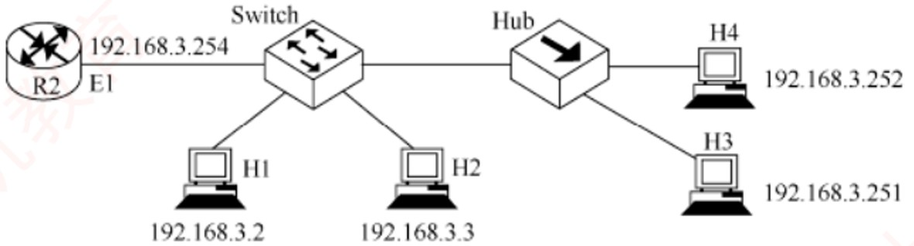

> **【唯一编号】** `WD-CN-C-4.2-T43`
> **【课程】** 计算机网络
> **【章节】** 第4章 网络层 · 4.2 IPv4

---

### 【WD-CN-C-4.2-T44】第 44 题（P44）

44. 下列情况需要启动ARP 请求的是(
)
A. 主机需要接收信息,但ARP 表中没有源IP 地址与MAC 地址的映射关系
B. 主机需要接收信息,但ARP 表中已有源IP 地址与MAC 地址的映射关系
C. 主机需要发送信息,但ARP 表中没有目的IP 地址与MAC 地址的映射关系
D. 主要需要发送信息,但ARP 表中已有目的IP 地址与MAC 地址的映射关系

> **【唯一编号】** `WD-CN-C-4.2-T44`
> **【课程】** 计算机网络
> **【章节】** 第4章 网络层 · 4.2 IPv4

---

### 【WD-CN-C-4.2-T45】第 45 题（P44）

45. 某网络拓扑如下图所示, H 1 与H 2 的默认网关和子网掩码都分别配置为192.168.3.1 和
255.255.255.0, H3 和H4 的默认网关和子网掩码都分别配置为192.168.3.254 和255.255.255.128,初始
时所有设备的ARP 缓存均为空。则下列说法中错误的是(
)
A. 若H1 向H3 发送数据,则H2、H3、H4 都能收到H1 发来的ARP 请求报文
B. 若H3 向H1 发送数据,则H3 能收到H1 发来的ARP 响应报文
C. 若H1 向H2 发送数据, 则H2、H3、H4 都能收到H1 发来的ARP 请求报文
D. 若H3 向H4 发送数据,则H3 能收到H4 发来的ARP 响应报文

> **【唯一编号】** `WD-CN-C-4.2-T45`
> **【课程】** 计算机网络
> **【章节】** 第4章 网络层 · 4.2 IPv4

---

### 【WD-CN-C-4.2-T46】第 46 题（P44）

46. 可以动态为主机配置IP 地址的协议是(
)
A. ARP
B. RARP
C. DHCP
D. NAT

> **【唯一编号】** `WD-CN-C-4.2-T46`
> **【课程】** 计算机网络
> **【章节】** 第4章 网络层 · 4.2 IPv4

---

### 【WD-CN-C-4.2-T47】第 47 题（P44）

47. 若某路由器收到一个TTL 值为1 的IP 数据报,则路由器的操作是(
)
A. 转发该IP 数据报
B. 仅仅丢弃该IP 数据报
C. 丢弃该IP 数据报并向源主机发送类型为终点不可达的ICMP 差错报告报文
D. 丢弃该IP 数据报并向源主机发送类型为时间超过的ICMP 差错报告报文

> **【唯一编号】** `WD-CN-C-4.2-T47`
> **【课程】** 计算机网络
> **【章节】** 第4章 网络层 · 4.2 IPv4

---

### 【WD-CN-C-4.2-T48】第 48 题（P44）

48. 下列关于ICMP 报文的说法中,错误的是(
)
A. ICMP 报文封装在数据链路层帧中发送
B. ICMP 报文可以用于报告IP 数据报发送错误
C. ICMP 报文封装在IP 数据报中发送
D. 对于已经携带ICMP 差错报文的分组,不再产生ICMP 差错报文

> **【唯一编号】** `WD-CN-C-4.2-T48`
> **【课程】** 计算机网络
> **【章节】** 第4章 网络层 · 4.2 IPv4

---

### 【WD-CN-C-4.2-T49】第 49 题（P44）

49. 下列关于ICMP 差错报文的描述中,错误的是(
)
A. ICMP 报文分为差错报告报文和询问报文两类
B. 对于已经分片的分组,只对第一个分片产生ICMP 差错报文
C. PING 使用了ICMP 差错报文
D. 对于多播的分组,不产生ICMP 差错报文

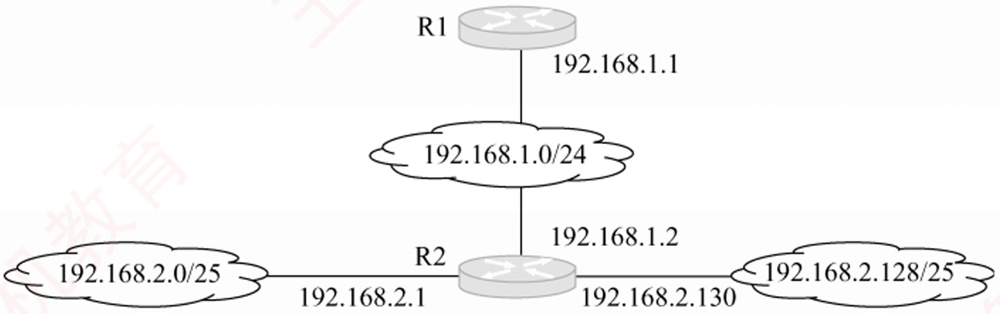

> **【唯一编号】** `WD-CN-C-4.2-T49`
> **【课程】** 计算机网络
> **【章节】** 第4章 网络层 · 4.2 IPv4

---

### 【WD-CN-C-4.2-T50】第 50 题（P45）

50.【2010 统考真题】某网络的IP 地址空间为192.168.5.0/24,采用定长子网划分,子网掩码为
255.255.255.248,则该网络中的最大子网个数、每个子网内的最大可分配地址个数分别是(
)
A. 32,8
B. 32,6
C. 8,32
D. 8,30

> **【唯一编号】** `WD-CN-C-4.2-T50`
> **【课程】** 计算机网络
> **【章节】** 第4章 网络层 · 4.2 IPv4

---

### 【WD-CN-C-4.2-T51】第 51 题（P45）

51.【2010 统考真题】若路由器R 因为拥塞丢弃IP 分组,则此时R 可向发出该IP 分组的源主机发送
的ICMP 报文类型是(
)
A. 路由重定向
B. 目的不可达
C. 源点抑制
D. 超时

> **【唯一编号】** `WD-CN-C-4.2-T51`
> **【课程】** 计算机网络
> **【章节】** 第4章 网络层 · 4.2 IPv4

---

### 【WD-CN-C-4.2-T52】第 52 题（P45）

52.【2011 统考真题】在子网192.168.4.0/30 中,能接收目的地址为192.168.4.3 的IP 分组的最大主机
数是(
)
A. 0
B. 1
C. 2
D. 4

> **【唯一编号】** `WD-CN-C-4.2-T52`
> **【课程】** 计算机网络
> **【章节】** 第4章 网络层 · 4.2 IPv4

---

### 【WD-CN-C-4.2-T53】第 53 题（P45）

53.【2011 统考真题】某网络拓扑如下图所示,路由器R1 只有到达子网192.168.1.0/24 的路由。为使
R1 可以将IP 分组正确地路由到图中的所有子网,在R1 中需要增加的一条路由(目的网络,子网掩码,
下一跳) 是(
)
A. 192.168.2.0, 255.255.255.128, 192.168.1.1
B. 192.168.2.0, 255.255.255.0, 192.168.1.1
C. 192.168.2.0, 255.255.255.128, 192.168.1.2
D. 192.168.2.0, 255.255.255.0, 192.168.1.2

> **【唯一编号】** `WD-CN-C-4.2-T53`
> **【课程】** 计算机网络
> **【章节】** 第4章 网络层 · 4.2 IPv4

---

### 【WD-CN-C-4.2-T54】第 54 题（P45）

54.【2012 统考真题】某主机的IP 地址为180.80.77.55，子网掩码为255.255.252.0。若该主机向其所
在子网发送广播分组,则目的地址可以是(
)
A. 180.80.76.0
B. 180.80.76.255
C. 180.80.77.255
D. 180.80.79.255

> **【唯一编号】** `WD-CN-C-4.2-T54`
> **【课程】** 计算机网络
> **【章节】** 第4章 网络层 · 4.2 IPv4

---

### 【WD-CN-C-4.2-T55】第 55 题（P45）

55.【2012 统考真题】ARP 的功能是(
)
A. 根据IP 地址查询MAC 地址
B. 根据MAC 地址查询IP 地址
C. 根据域名查询IP 地址
D. 根据IP 地址查询域名

> **【唯一编号】** `WD-CN-C-4.2-T55`
> **【课程】** 计算机网络
> **【章节】** 第4章 网络层 · 4.2 IPv4

---

### 【WD-CN-C-4.2-T56】第 56 题（P45）

56.【2012 统考真题】在TCP/IP 体系结构中,直接为ICMP 提供服务的协议是(
)
A. PPP
B. IP
C. UDP
D. TCP

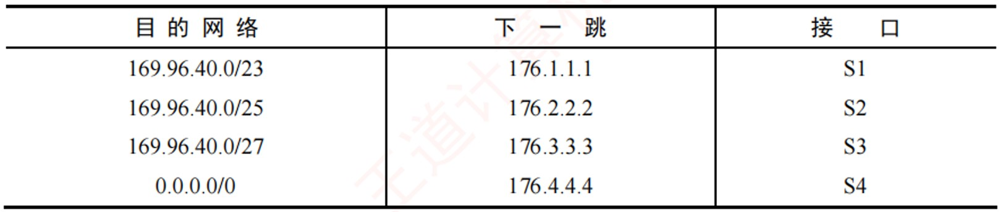

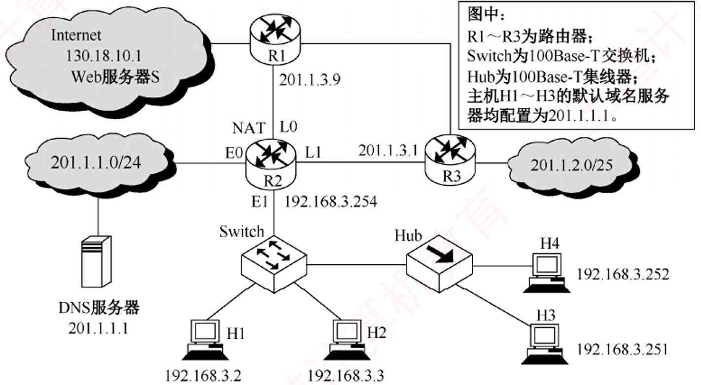

> **【唯一编号】** `WD-CN-C-4.2-T56`
> **【课程】** 计算机网络
> **【章节】** 第4章 网络层 · 4.2 IPv4

---

### 【WD-CN-C-4.2-T57】第 57 题（P46）

57.【2015 统考真题】某路由器的路由表如下所示:
若路由器收到一个目的地址为169.96.40.5 的IP 分组,则转发该IP 分组的接口是(
)
A. S1
B. S2
C. S3
D. S4

> **【唯一编号】** `WD-CN-C-4.2-T57`
> **【课程】** 计算机网络
> **【章节】** 第4章 网络层 · 4.2 IPv4

---

### 【WD-CN-C-4.2-T58】第 58 题（P46）

58.【2016 统考真题】如下图所示,假设H1 与H2 的默认网关和子网掩码均分别配置为192.168.3.1
和255.255.255.128, H3 和H4 的默认网关和子网掩码均分别配置为192.168.3.254 和255.255.255.128,
则下列现象中可能发生的是(
)
A. H1 不能与H2 进行正常IP 通信
B. H2 与H4 均不能访问Internet
C. H1 不能与H3 进行正常IP 通信
D. H3 不能与H4 进行正常IP 通信

> **【唯一编号】** `WD-CN-C-4.2-T58`
> **【课程】** 计算机网络
> **【章节】** 第4章 网络层 · 4.2 IPv4

---

### 【WD-CN-C-4.2-T59】第 59 题（P46）

59.【2016 统考真题】在上题的图中,假设连接R1、R2 和R3 之间的点对点链路使用地址201.1.3.x/30,
当H3 访问Web 服务器S 时, R2 转发出去的封装HTTP 请求报文的IP 分组是源IP 地址和目的IP 地
址,它们分别是(
)
A. 192.168.3.251、130.18.10.1
B. 192.168.3.251、201.1.3.9
C. 201.1.3.8、130.18.10.1
D. 201.1.3.10、130.18.10.1

> **【唯一编号】** `WD-CN-C-4.2-T59`
> **【课程】** 计算机网络
> **【章节】** 第4章 网络层 · 4.2 IPv4

---

### 【WD-CN-C-4.2-T60】第 60 题（P46）

60.【2017 统考真题】若将网络21.3.0.0/16 划分为128 个规模相同的子网,则每个子网可分配的最大
IP 地址个数是(
)
A. 254
B. 256
C. 510
D. 512

> **【唯一编号】** `WD-CN-C-4.2-T60`
> **【课程】** 计算机网络
> **【章节】** 第4章 网络层 · 4.2 IPv4

---

### 【WD-CN-C-4.2-T61】第 61 题（P46）

61.【2017 统考真题】下列IP 地址中,只能作为IP 分组的源IP 地址但不能作为目的IP 地址的是(
)
A. 0.0.0.0
B. 127.0.0.1
C. 200.10.10.3
D. 255.255.255.255

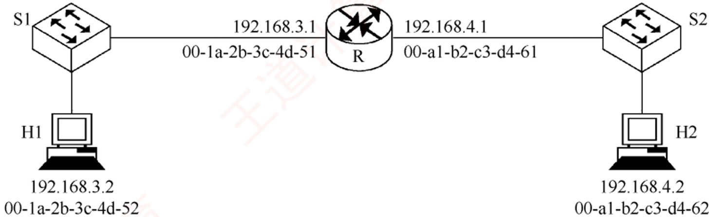

> **【唯一编号】** `WD-CN-C-4.2-T61`
> **【课程】** 计算机网络
> **【章节】** 第4章 网络层 · 4.2 IPv4

---

### 【WD-CN-C-4.2-T62】第 62 题（P47）

62.【2018 统考真题】某路由表中有转发接口相同的4 条路由表项,其目的网络地址分别为

> **【唯一编号】** `WD-CN-C-4.2-T62`
> **【课程】** 计算机网络
> **【章节】** 第4章 网络层 · 4.2 IPv4

---

### 【WD-CN-C-4.2-T63】第 35 题（P47）

35.230.32.0/21、35.230.40.0/21、35.230.48.0/21 和35.230.56.0/21，将该4 条路由聚合后的目的网络
地址为(
)
A. 35.230.0.0/19
B. 35.230.0.0/20
C. 35.230.32.0/19
D. 35.230.32.0/20

> **【唯一编号】** `WD-CN-C-4.2-T63`
> **【课程】** 计算机网络
> **【章节】** 第4章 网络层 · 4.2 IPv4

---

### 【WD-CN-C-4.2-T64】第 63 题（P47）

63.【2018 统考真题】路由器R 通过以太网交换机S1 和S2 连接两个网络, R 的接口、主机H1 和H2
的IP 地址与MAC 地址如下图所示。若H1 向H2 发送一个IP 分组P, 则H1 发出的封装P 的以太网
帧的目的MAC 地址、H2 收到的封装P 的以太网帧的源MAC 地址分别是(
)
A. 00 - a1 - b2 - c3 - d4 - 62、00 - 1a - 2b - 3c - 4d - 52
B. 00 - a1 - b2 - c3 - d4 - 62、00 - a1 - b2 - c3 - d4 - 61
C. 00 - 1a - 2b - 3c - 4d - 51、00 - 1a - 2b - 3c - 4d - 52
D. 00 - 1a - 2b - 3c - 4d - 51、00 - a1 - b2 - c3 - d4 - 61

> **【唯一编号】** `WD-CN-C-4.2-T64`
> **【课程】** 计算机网络
> **【章节】** 第4章 网络层 · 4.2 IPv4

---

### 【WD-CN-C-4.2-T65】第 64 题（P47）

64.【2019 统考真题】将101.200.16.0/20 划分为5 个子网,则可能的最小子网的可分配IP 地址数是( )
A. 126
B. 254
C. 510
D. 1022

> **【唯一编号】** `WD-CN-C-4.2-T65`
> **【课程】** 计算机网络
> **【章节】** 第4章 网络层 · 4.2 IPv4

---

### 【WD-CN-C-4.2-T66】第 65 题（P47）

65.【2021 统考真题】现将一个IP 网络划分为3 个子网,若其中一个子网是192.168.9.128/26,则下列
网络中,不可能是另外两个子网之一的是(
)
A. 192.168.9.0/25
B. 192.168.9.0/26
C. 192.168.9.192/26
D. 192.168.9.192/27

> **【唯一编号】** `WD-CN-C-4.2-T66`
> **【课程】** 计算机网络
> **【章节】** 第4章 网络层 · 4.2 IPv4

---

### 【WD-CN-C-4.2-T67】第 66 题（P47）

66.【2021 统考真题】若路由器向MTU = 800B 的链路转发一个总长度为1580B 的IP 数据报(首部长
度为20B) 时,进行了分片,且每个分片尽可能大,则第2 个分片的总长度字段和MF 标志位的值分别是
(
)
A. 796,0
B. 796,1
C. 800,0
D. 800,1

> **【唯一编号】** `WD-CN-C-4.2-T67`
> **【课程】** 计算机网络
> **【章节】** 第4章 网络层 · 4.2 IPv4

---

### 【WD-CN-C-4.2-T68】第 67 题（P47）

67.【2022 统考真题】若某主机的IP 地址是183.80.72.48,子网掩码是255.255.192.0,则该主机所在网
络的网络地址是(
)
A. 183.80.0.0
B. 183.80.64.0
C. 183.80.72.0
D. 183.80.192.0

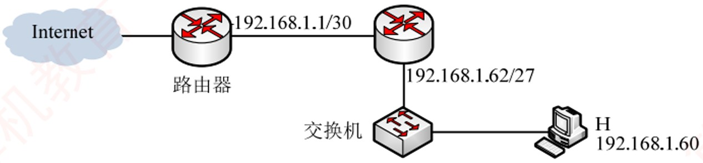

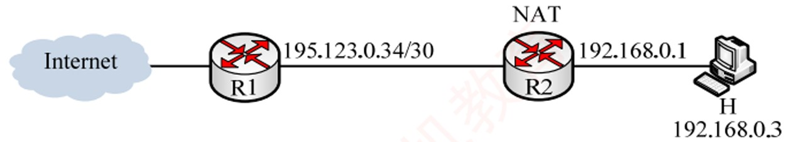

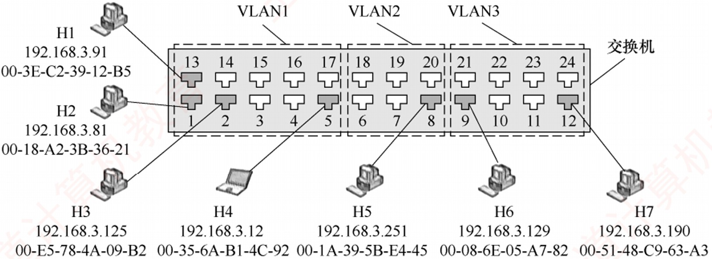

> **【唯一编号】** `WD-CN-C-4.2-T68`
> **【课程】** 计算机网络
> **【章节】** 第4章 网络层 · 4.2 IPv4

---

### 【WD-CN-C-4.2-T69】第 68 题（P48）

68.【2022 统考真题】下图所示网络中的主机H 的子网掩码与默认网关分别是(
)
A. 255.255.255.192, 192.168.1.1
B. 255.255.255.192, 192.168.1.62
C. 255.255.255.224, 192.168.1.1
D. 255.255.255.224, 192.168.1.62

> **【唯一编号】** `WD-CN-C-4.2-T69`
> **【课程】** 计算机网络
> **【章节】** 第4章 网络层 · 4.2 IPv4

---

### 【WD-CN-C-4.2-T70】第 69 题（P48）

69.【2023 统考真题】某网络拓扑如下图所示,其中路由器R2 实现NAT 功能。若主机H 向Internet 发
送1 个IP 分组,则经过R2 转发后,该IP 分组的源IP 地址是(
)
A. 195.123.0.33
B. 195.123.0.35
C. 192.168.0.1
D. 192.168.0.3

> **【唯一编号】** `WD-CN-C-4.2-T70`
> **【课程】** 计算机网络
> **【章节】** 第4章 网络层 · 4.2 IPv4

---

### 【WD-CN-C-4.2-T71】第 70 题（P48）

70.【2023 统考真题】主机168.16.84.24/20 所在子网的最小可分配IP 地址和最大可分配IP 地址分别
是(
)
A. 168.16.80.1, 168.16.84.254
B. 168.16.80.1, 168.16.95.254
C. 168.16.84.1, 168.16.84.254
D. 168.16.84.1, 168.16.95.254

> **【唯一编号】** `WD-CN-C-4.2-T71`
> **【课程】** 计算机网络
> **【章节】** 第4章 网络层 · 4.2 IPv4

---

### 【WD-CN-C-4.2-T72】第 71 题（P48）

71.【2024 统考真题】如下图所示的支持VLAN 划分的交换机,已按端口划分了3 个VLAN,部分端口
连接主机的IP 地址和MAC 地址如图中所示, ARP 表结构为< IP 地址, MAC 地址, TTL >。下列选项
中,不会出现在H4 的ARP 表中的是(
)
A. 192.168.3.81, 00 - 18 - A2 - 3B - 36 - 21, 14:32:00
B. 192.168.3.91, 00 - 3E - C2 - 39 - 12 - B5, 14:37:00
C. 192.168.3.125, 00 - E5 - 78 - 4A - 09 - B2, 14:45:00
D. 192.168.3.129, 00 - 08 - 6E - 05 - A7 - 82, 14:52:00

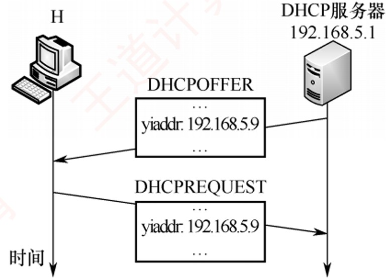

> **【唯一编号】** `WD-CN-C-4.2-T72`
> **【课程】** 计算机网络
> **【章节】** 第4章 网络层 · 4.2 IPv4

---

### 【WD-CN-C-4.2-T73】第 72 题（P49）

72.【2025 年统考真题】一台新接入网络的主机H 通过DHCP 服务器动态请求IP 地址过程中,与
DHCP 服务器交换DHCP 报文过程如下图所示。封装DHCP REQUEST 报文的IP 数据报的目的IP
地址和源IP 地址分别是(
)
A. 192.168.5.1、0.0.0.0
B. 192.168.5.1、192.168.5.9
C. 255.255.255.255、0.0.0.0
D. 255.255.255.255、192.168.5.9

> **【唯一编号】** `WD-CN-C-4.2-T73`
> **【课程】** 计算机网络
> **【章节】** 第4章 网络层 · 4.2 IPv4

---
## 4.3 IPv
---

### 【WD-CN-C-4.3-T01】第 1 题（P2）

1. 下一代因特网核心协议IPv6 的地址长度是(
)
A. 32 比特
B. 48 比特
C. 64 比特
D. 128 比特

> **【唯一编号】** `WD-CN-C-4.3-T01`
> **【课程】** 计算机网络
> **【章节】** 第4章 网络层 · 4.3 IPv6

---

### 【WD-CN-C-4.3-T02】第 2 题（P2）

2. 与IPv4 相比，IPv6(
)
A. 采用32 位IP 地址
B. 增加了首部字段数量
C. 不提供QoS 保障
D. 没有提供检验和字段

> **【唯一编号】** `WD-CN-C-4.3-T02`
> **【课程】** 计算机网络
> **【章节】** 第4章 网络层 · 4.3 IPv6

---

### 【WD-CN-C-4.3-T03】第 3 题（P2）

3. 下列关于IPv6 地址1A22:120D:0000:0000:72A2:0000:0000:00C0 的表示中,错误的是(
)
A. 1A22:120D::72A2:0000:0000:00C0
B. 1A22:120D::72A2:0:0:C0
C. 1A22::120D::72A2::00C0
D. 1A22:120D:0:0:72A2::C0

> **【唯一编号】** `WD-CN-C-4.3-T03`
> **【课程】** 计算机网络
> **【章节】** 第4章 网络层 · 4.3 IPv6

---

### 【WD-CN-C-4.3-T04】第 4 题（P2）

4. 一个IPv6 地址的简化写法为8::D0:123:CDEF:89A,则其完整地址应该是(
)
A. 8000:0000:0000:0000:00D0:1230:CDEF:89A0
B. 0008:0000:0000:0000:00D0:0123:CDEF:89A0
C. 8000:0000:0000:0000:D000:1230:CDEF:89A0
D. 0008:0000:0000:0000:00D0:0123:CDEF:089A

> **【唯一编号】** `WD-CN-C-4.3-T04`
> **【课程】** 计算机网络
> **【章节】** 第4章 网络层 · 4.3 IPv6

---

### 【WD-CN-C-4.3-T05】第 5 题（P2）

5. 下列关于IPv6 的描述中,错误的是(
)
A. IPv6 的首部长度是不可变的
B. IPv6 不允许在中间路由器进行分片
C. IPv6 采用了16B 的地址, 在可预见的将来不会用完
D. IPv6 使用了首部检验和来保证传输的正确性

> **【唯一编号】** `WD-CN-C-4.3-T05`
> **【课程】** 计算机网络
> **【章节】** 第4章 网络层 · 4.3 IPv6

---

### 【WD-CN-C-4.3-T06】第 6 题（P2）

6. 若一个路由器收到的IPv6 数据报因太大而不能转发到链路上,则路由器将把该数据报(
)
A. 丢弃
B. 暂存
C. 分片
D. 转发至能支持该数据报的链路上

> **【唯一编号】** `WD-CN-C-4.3-T06`
> **【课程】** 计算机网络
> **【章节】** 第4章 网络层 · 4.3 IPv6

---

### 【WD-CN-C-4.3-T07】第 7 题（P50）

7.【2023 统考真题】下列关于IPv4 和IPv6 的叙述中,正确的是(
)
I. IPv6 地址空间是IPv4 地址空间的96 倍
II. IPv4 首部和IPv6 基本首部的长度均可变
III. IPv4 向IPv6 过渡可以采用双协议栈和隧道技术
IV. IPv6 首部的HopLimit 字段等价于IPv4 首部的TTL 字段
A. 仅I、II
B. 仅I、IV
C. 仅II、III
D. 仅III、IV

> **【唯一编号】** `WD-CN-C-4.3-T07`
> **【课程】** 计算机网络
> **【章节】** 第4章 网络层 · 4.3 IPv6

---
## 4.4 路由算法与路由协议
---

### 【WD-CN-C-4.4-T01】第 1 题（P2）

1. 下列关于动态路由选择和静态路由选择的主要区别的描述中,正确的是(
)
A. 动态路由选择需要维护整个网络的拓扑结构信息,而静态路由选择只需要维护部分拓扑结构信息
B. 动态路由选择可随网络的通信量或拓扑变化而自适应地调整,而静态路由选择则需要手工去调整
相关的路由信息
C. 动态路由选择简单且开销小,静态路由选择复杂且开销大
D. 动态路由选择使用路由表,静态路由选择不使用路由表

> **【唯一编号】** `WD-CN-C-4.4-T01`
> **【课程】** 计算机网络
> **【章节】** 第4章 网络层 · 4.4 路由算法与路由协议

---

### 【WD-CN-C-4.4-T02】第 2 题（P2）

2. 下列关于路由算法的描述中,错误的是(
)
A. 静态路由有时也被称为非自适应算法
B. 静态路由所使用的路由选择一旦启动就不能修改
C. 动态路由也称自适应算法,会根据网络的拓扑变化和流量变化改变路由决策
D. 动态路由算法需要实时获得网络的状态

> **【唯一编号】** `WD-CN-C-4.4-T02`
> **【课程】** 计算机网络
> **【章节】** 第4章 网络层 · 4.4 路由算法与路由协议

---

### 【WD-CN-C-4.4-T03】第 3 题（P2）

3. 下列关于链路状态协议的描述中,错误的是(
)
A. 仅相邻路由器需要交换各自的路由表
B. 全网路由器的拓扑数据库是一致的
C. 采用洪泛技术更新链路变化信息
D. 具有快速收敛的优点

> **【唯一编号】** `WD-CN-C-4.4-T03`
> **【课程】** 计算机网络
> **【章节】** 第4章 网络层 · 4.4 路由算法与路由协议

---

### 【WD-CN-C-4.4-T04】第 4 题（P2）

4. 在链路状态路由算法中,每个路由器都得到网络的完整拓扑结构后,使用(
) 算法来找出它到其他
路由器的路径长度。
A. Prim 最小生成树算法
B. Dijkstra 最短路径算法
C. Kruskal 最小生成树算法
D. 拓扑排序

> **【唯一编号】** `WD-CN-C-4.4-T04`
> **【课程】** 计算机网络
> **【章节】** 第4章 网络层 · 4.4 路由算法与路由协议

---

### 【WD-CN-C-4.4-T05】第 5 题（P2）

5. 下列关于分层路由的描述中,错误的是(
)
A. 采用分层路由后,路由器被划分成区域
B. 每个路由器不仅知道如何将分组路由到自己区域的目标地址,还知道如何路由到其他区域
C. 采用分层路由后,可以将不同的网络连接起来
D. 对于大型网络,可能需要多级的分层路由来管理

> **【唯一编号】** `WD-CN-C-4.4-T05`
> **【课程】** 计算机网络
> **【章节】** 第4章 网络层 · 4.4 路由算法与路由协议

---

### 【WD-CN-C-4.4-T06】第 6 题（P51）

6. 以下关于自治系统的描述中,错误的是(
)
A. 自治系统划分区域的好处是,将利用洪泛法交换链路状态信息的范围局限在每个区域内,而不是
整个自治系统
B. 采用分层划分区域的方法使交换信息的种类增多,同时也使OSPF 协议更加简单
C. OSPF 协议将一个自治系统再划分为若干更小的范围,称为区域
D. 在一个区域内部的路由器只知道本区域的网络拓扑,而不知道其他区域的网络拓扑的情况

> **【唯一编号】** `WD-CN-C-4.4-T06`
> **【课程】** 计算机网络
> **【章节】** 第4章 网络层 · 4.4 路由算法与路由协议

---

### 【WD-CN-C-4.4-T07】第 7 题（P51）

7. 在计算机网络中,路由选择协议的功能不包括(
)
A. 交换网络状态或通路信息
B. 选择到达目的地的最佳路径
C. 更新路由表
D. 发现下一跳的物理地址

> **【唯一编号】** `WD-CN-C-4.4-T07`
> **【课程】** 计算机网络
> **【章节】** 第4章 网络层 · 4.4 路由算法与路由协议

---

### 【WD-CN-C-4.4-T08】第 8 题（P51）

8. 用于域间路由的协议是(
)
A. RIP
B. BGP
C. OSPF
D. ARP

> **【唯一编号】** `WD-CN-C-4.4-T08`
> **【课程】** 计算机网络
> **【章节】** 第4章 网络层 · 4.4 路由算法与路由协议

---

### 【WD-CN-C-4.4-T09】第 9 题（P51）

9. 在RIP 中,到某个网络的距离值为16,其意义是(
)
A. 该网络不可达
B. 存在循环路由
C. 该网络为直接连接网络
D. 到达该网络要经过15 次转发

> **【唯一编号】** `WD-CN-C-4.4-T09`
> **【课程】** 计算机网络
> **【章节】** 第4章 网络层 · 4.4 路由算法与路由协议

---

### 【WD-CN-C-4.4-T10】第 10 题（P51）

10. 在RIP 中, 假设路由器X 和路由器K 是两个相邻的路由器, X 向K 说: “我到目的网络Y 的距离为
N”, 则收到此信息的K 就知道: “若将到网络Y 的下一个路由器选为X, 则我到网络Y 的距离为(
)”
(假设N 小于15)
A. N
B. N - 1
C. 1
D. N + 1

> **【唯一编号】** `WD-CN-C-4.4-T10`
> **【课程】** 计算机网络
> **【章节】** 第4章 网络层 · 4.4 路由算法与路由协议

---

### 【WD-CN-C-4.4-T11】第 11 题（P51）

11. 下列关于RIP 的描述中,错误的是(
)
A. RIP 是基于距离- 向量路由选择算法的
B. RIP 要求内部路由器将它关于整个AS 的路由信息发布出去
C. RIP 要求内部路由器向整个AS 的路由器发布路由信息
D. RIP 要求内部路由器按照一定的时间间隔发布路由信息

> **【唯一编号】** `WD-CN-C-4.4-T11`
> **【课程】** 计算机网络
> **【章节】** 第4章 网络层 · 4.4 路由算法与路由协议

---

### 【WD-CN-C-4.4-T12】第 12 题（P51）

12. 在RIP 中,当路由器收到相邻路由器发来的路由更新信息时,若发现有更优的路由,则(
)
A. 直接更新自己的路由表
B. 向相邻路由器发送确认信息后再更新自己的路由表
C. 向所有相邻路由器发送确认信息后再更新自己的路由表
D. 不更新自己的路由表

> **【唯一编号】** `WD-CN-C-4.4-T12`
> **【课程】** 计算机网络
> **【章节】** 第4章 网络层 · 4.4 路由算法与路由协议

---

### 【WD-CN-C-4.4-T13】第 13 题（P51）

13. 对路由选择协议的一个要求是必须能够快速收敛，所谓“路由收敛”是指(
)
A. 路由器能把分组发送到预定的目标
B. 路由器处理分组的速度足够快
C. 网络设备的路由表与网络拓扑结构保持一致
D. 能把多个子网聚合成一个超网

> **【唯一编号】** `WD-CN-C-4.4-T13`
> **【课程】** 计算机网络
> **【章节】** 第4章 网络层 · 4.4 路由算法与路由协议

---

### 【WD-CN-C-4.4-T14】第 14 题（P52）

14. 下列关于RIP 和OSPF 协议的叙述中,错误的是(
)
A. RIP 和OSPF 协议都是网络层协议
B. 在进行路由信息交换时, RIP 中的路由器仅向自己相邻的路由器发送信息, OSPF 协议中的路由器
向本自治系统中的所有路由器发送信息
C. 在进行路由信息交换时, RIP 中的路由器发送的信息是整个路由表, OSPF 协议中的路由器发送的
信息只是路由表的一部分
D. RIP 的路由器不知道全网的拓扑结构, OSPF 协议的任何一个路由器都知道自己所在区域的拓扑
结构

> **【唯一编号】** `WD-CN-C-4.4-T14`
> **【课程】** 计算机网络
> **【章节】** 第4章 网络层 · 4.4 路由算法与路由协议

---

### 【WD-CN-C-4.4-T15】第 15 题（P52）

15. OSPF 协议使用(
) 分组来保持与其邻居的连接。
A. Hello
B. Keepalive
C. SPF(最短路径优先)
D. LSU(链路状态更新)

> **【唯一编号】** `WD-CN-C-4.4-T15`
> **【课程】** 计算机网络
> **【章节】** 第4章 网络层 · 4.4 路由算法与路由协议

---

### 【WD-CN-C-4.4-T16】第 16 题（P52）

16. 下列关于OSPF 协议的描述中,最准确的是(
)
A. OSPF 协议根据链路状态法计算最佳路由
B. OSPF 协议是用于自治系统之间的外部网关协议
C. OSPF 协议不能根据网络通信情况动态地改变路由
D. OSPF 协议只适用于小型网络

> **【唯一编号】** `WD-CN-C-4.4-T16`
> **【课程】** 计算机网络
> **【章节】** 第4章 网络层 · 4.4 路由算法与路由协议

---

### 【WD-CN-C-4.4-T17】第 17 题（P52）

17. 在OSPF 协议中,划分区域的最主要目的是(
)
A. 减少路由表的大小
B. 减少洪泛法交换的通信量
C. 增加路由选择的灵活性
D. 增加网络的安全性

> **【唯一编号】** `WD-CN-C-4.4-T17`
> **【课程】** 计算机网络
> **【章节】** 第4章 网络层 · 4.4 路由算法与路由协议

---

### 【WD-CN-C-4.4-T18】第 18 题（P52）

18. 下列关于OSPF 协议特征的描述中,错误的是(
)
A. OSPF 协议将一个自治域划分成若干域,有一种特殊的域称为主干区域
B. 域之间通过区域边界路由器互连
C. 在自治系统中有4 类路由器: 区域内部路由器、主干路由器、区域边界路由器和自治域边界路由
器
D. 主干路由器不能兼作区域边界路由器

> **【唯一编号】** `WD-CN-C-4.4-T18`
> **【课程】** 计算机网络
> **【章节】** 第4章 网络层 · 4.4 路由算法与路由协议

---

### 【WD-CN-C-4.4-T19】第 19 题（P52）

19. BGP 交换的网络可达性信息是(
)
A. 到达某个网络所经过的路径
B. 到达某个网络的下一跳路由器
C. 到达某个网络的链路状态摘要信息
D. 到达某个网络的最短距离及下一跳路由器

> **【唯一编号】** `WD-CN-C-4.4-T19`
> **【课程】** 计算机网络
> **【章节】** 第4章 网络层 · 4.4 路由算法与路由协议

---

### 【WD-CN-C-4.4-T20】第 20 题（P52）

20. RIP、OSPF 协议、BGP 的路由选择过程分别使用(
)
A. 路径向量协议、链路状态协议、距离向量协议
B. 距离向量协议、路径向量协议、链路状态协议
C. 路径向量协议、距离向量协议、链路状态协议
D. 距离向量协议、链路状态协议、路径向量协议

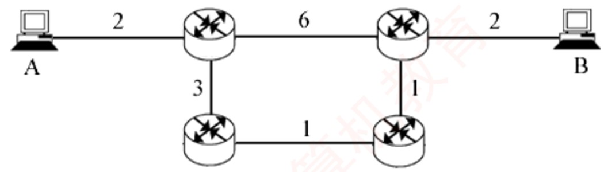

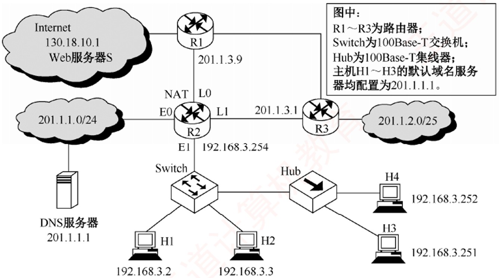

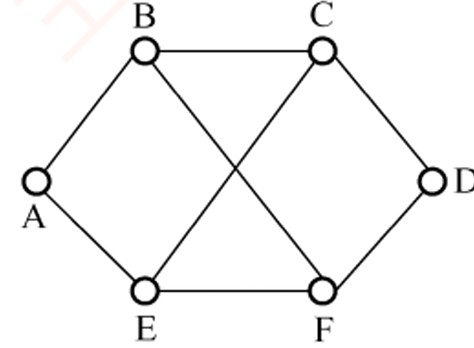

> **【唯一编号】** `WD-CN-C-4.4-T20`
> **【课程】** 计算机网络
> **【章节】** 第4章 网络层 · 4.4 路由算法与路由协议

---

### 【WD-CN-C-4.4-T21】第 21 题（P53）

21. 从数据封装的角度看，下列(
) 协议属于TCP/IP 参考模型的应用层。
I. OSPF
II. RIP
III. BGP
IV. ICMP
A. I、II
B. II、III
C. I、IV
D. I、II、III、IV

> **【唯一编号】** `WD-CN-C-4.4-T21`
> **【课程】** 计算机网络
> **【章节】** 第4章 网络层 · 4.4 路由算法与路由协议

---

### 【WD-CN-C-4.4-T22】第 22 题（P53）

22. 考虑如下图所示的子网, 该子网使用了距离向量算法, 下面的向量刚刚到达路由器C: 来自B 的向
量为5,0,8,12,6,2

; 来自D 的向量为16,12,6,0,9,10

; 来自E 的向量为7,6,3,9,0,4

。经过测量, C
到B、D 和E 的延迟分别为6、3 和5, 那么C 到达所有节点的最短路径是(
)
A.
5,6,0,9,6,2

B.
11,6,0,3,5,8

C.
5,11,0,12,8,9

D.
11,8,0,7,4,9

> **【唯一编号】** `WD-CN-C-4.4-T22`
> **【课程】** 计算机网络
> **【章节】** 第4章 网络层 · 4.4 路由算法与路由协议

---

### 【WD-CN-C-4.4-T23】第 23 题（P53）

23. 某分组交换网络的拓扑如下图所示,各路由器使用OSPF 协议且均已收敛,各链路的度量已在图中
标注。假设各段链路的带宽均为100Mb/s，分组长度为1000B，其中分组的首部长度为20B。若主
机A 向主机B 发送一个大小为980000B 的文件，忽略分组的传播时延和封装/ 解封时间，从A 发送
开始到B 接收完毕为止,需要的时间是(
)
A. 80.08ms
B. 80.16ms
C. 80.32ms
D. 80.64ms

> **【唯一编号】** `WD-CN-C-4.4-T23`
> **【课程】** 计算机网络
> **【章节】** 第4章 网络层 · 4.4 路由算法与路由协议

---

### 【WD-CN-C-4.4-T24】第 24 题（P53）

24.【2010 统考真题】某自治系统内采用RIP,若该自治系统内的路由器R1 收到其邻居路由器R2 的
距离向量，距离向量中包含信息< Net1, 16 >,则能得出的结论是(
)
A. R2 可以经过R1 到达Net1,跳数为17
B. R2 可以到达Net1,跳数为16
C. R1 可以经过R2 到达Net1,跳数为17
D. R1 不能经过R2 到达Net1

> **【唯一编号】** `WD-CN-C-4.4-T24`
> **【课程】** 计算机网络
> **【章节】** 第4章 网络层 · 4.4 路由算法与路由协议

---

### 【WD-CN-C-4.4-T25】第 25 题（P53）

25.【2016 统考真题】假设下图中的R1、R2、R3 采用RIP 交换路由信息,且均已收敛。若R3 检测到
网络201.1.2.0/25 不可达,并向R2 通告一次新的距离向量,则R2 更新后,其到达该网络的距离是(
)
A. 2
B. 3
C. 16
D. 17

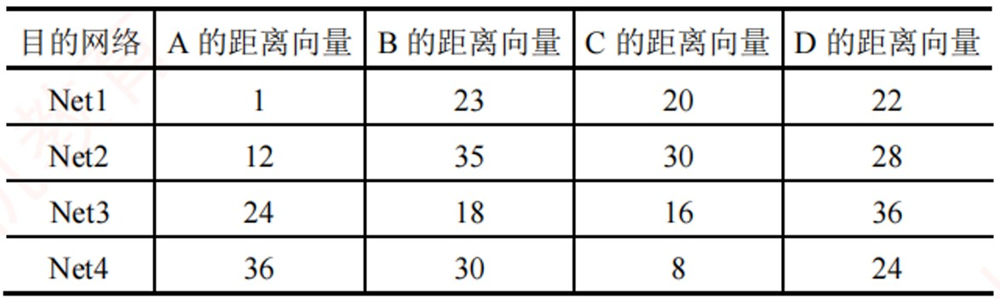

> **【唯一编号】** `WD-CN-C-4.4-T25`
> **【课程】** 计算机网络
> **【章节】** 第4章 网络层 · 4.4 路由算法与路由协议

---

### 【WD-CN-C-4.4-T26】第 26 题（P54）

26.【2017 统考真题】直接封装RIP、OSPF、BGP 报文的协议分别是(
)
A. TCP、UDP、IP
B. TCP、IP、UDP
C. UDP、TCP、IP
D. UDP、IP、TCP

> **【唯一编号】** `WD-CN-C-4.4-T26`
> **【课程】** 计算机网络
> **【章节】** 第4章 网络层 · 4.4 路由算法与路由协议

---

### 【WD-CN-C-4.4-T27】第 27 题（P54）

27.【2021 统考真题】某网络中的所有路由器均采用距离向量路由算法计算路由。若路由器E 与邻
居路由器A、B、C 和D 之间的直接链路距离分别是8,10,12 和6,且E 收到邻居路由器的距离向量
如下表所示，则路由器E 更新后的到达目的网络Net1~Net4 的距离分别是(
)
A. 9,10,12,6
B. 9,10,28,20
C. 9,20,12,20
D. 9,20,28,20

> **【唯一编号】** `WD-CN-C-4.4-T27`
> **【课程】** 计算机网络
> **【章节】** 第4章 网络层 · 4.4 路由算法与路由协议

---
## 4.5 IP多播
---

### 【WD-CN-C-4.5-T01】第 1 题（P2）

1. 下列关于多播概念的描述中,错误的是(
)
A. 在单播路由选择中,路由器只能从它的一个接口转发收到的分组
B. 在多播路由选择中,路由器可以从它的多个接口转发收到的分组
C. 用多个单播仿真一个多播时需要更多的带宽
D. 用多个单播仿真一个多播时,时延基本上是相同的

> **【唯一编号】** `WD-CN-C-4.5-T01`
> **【课程】** 计算机网络
> **【章节】** 第4章 网络层 · 4.5 IP多播

---

### 【WD-CN-C-4.5-T02】第 2 题（P2）

2. 在设计多播路由时,为了避免路由环路, (
)
A. 采用了水平分割技术
B. 构造多播转发树
C. 采用了IGMP
D. 通过生存时间(TTL) 字段

> **【唯一编号】** `WD-CN-C-4.5-T02`
> **【课程】** 计算机网络
> **【章节】** 第4章 网络层 · 4.5 IP多播

---

### 【WD-CN-C-4.5-T03】第 3 题（P2）

3. 以太网多播IP 地址224.215.145.230 应该映射到的多播MAC 地址是(
)
A. 01 - 00 - 5E - 57 - 91 - E6
B. 01 - 00 - 5E - D7 - 91 - E6
C. 01 - 00 - 5E - 5B - 91 - E6
D. 01 - 00 - 5E - 55 - 91 - E6

> **【唯一编号】** `WD-CN-C-4.5-T03`
> **【课程】** 计算机网络
> **【章节】** 第4章 网络层 · 4.5 IP多播

---

### 【WD-CN-C-4.5-T04】第 4 题（P2）

4. 在下列4 个地址中，(
) 只能用于IP 数据报的目的地址而不能用于源地址。
A. 11.255.255.100
B. 192.168.1.100
C. 228.1.1.100
D. 0.0.0.0

> **【唯一编号】** `WD-CN-C-4.5-T04`
> **【课程】** 计算机网络
> **【章节】** 第4章 网络层 · 4.5 IP多播

---
## 4.6 移动IP
---

### 【WD-CN-C-4.6-T01】第 1 题（P2）

1. 下列关于移动IP 工作原理的描述中,错误的是(
)
A. 移动IP 的基本工作过程可以分为代理发现、注册、分组路由与注销4 个阶段
B. 节点在使用移动IP 进行通信时,归属代理和外部代理之间需要建立一条隧道
C. 移动节点到达新的网络后,通过注册过程把自己新的可达信息通知外部代理
D. 移动IP 的分组路由可以分为单播、广播与多播

> **【唯一编号】** `WD-CN-C-4.6-T01`
> **【课程】** 计算机网络
> **【章节】** 第4章 网络层 · 4.6 移动IP

---

### 【WD-CN-C-4.6-T02】第 2 题（P2）

2. 移动IP 为移动主机设置了两个IP 地址: 归属地址和转交地址, (
)
A. 这两个地址都是固定的
B. 这两个地址随主机的移动而动态改变
C. 归属地址固定,转交地址动态改变
D. 归属地址动态改变,转交地址固定

> **【唯一编号】** `WD-CN-C-4.6-T02`
> **【课程】** 计算机网络
> **【章节】** 第4章 网络层 · 4.6 移动IP

---

### 【WD-CN-C-4.6-T03】第 3 题（P2）

3. 若一台主机的IP 地址为160.80.40.20/16,则当它移动到了另一个不属于160.80/16 子网的网络时,它
将(
) (能否通过被访网络的路由器直接发送/ 接收数据报)
A. 可以直接接收和直接发送数据报,没有任何影响
B. 既不可以直接接收数据报,又不可以直接发送数据报
C. 不可以直接发送数据报,但可以直接接收数据报
D. 可以直接发送数据报,但不可以直接接收数据报

> **【唯一编号】** `WD-CN-C-4.6-T03`
> **【课程】** 计算机网络
> **【章节】** 第4章 网络层 · 4.6 移动IP

---
## 4.7 网络层设备
---

### 【WD-CN-C-4.7-T01】第 1 题（P2）

1. 要控制网络上的广播风暴，可以采用的方法是(
)
A. 用交换机将网络分段
B. 用路由器将网络分段
C. 将网络转接成10Base - T
D. 用网络分析仪跟踪正在发送广播信息的计算机

> **【唯一编号】** `WD-CN-C-4.7-T01`
> **【课程】** 计算机网络
> **【章节】** 第4章 网络层 · 4.7 网络层设备

---

### 【WD-CN-C-4.7-T02】第 2 题（P2）

2. 下列关于冲突域的叙述中,正确的是(
)
A. 能接收到同一广播帧的所有设备的集合
B. 能发送同一广播帧的所有设备的集合
C. 能产生冲突的所有设备的集合
D. 能隔离冲突的所有设备的集合

> **【唯一编号】** `WD-CN-C-4.7-T02`
> **【课程】** 计算机网络
> **【章节】** 第4章 网络层 · 4.7 网络层设备

---

### 【WD-CN-C-4.7-T03】第 3 题（P2）

3. 下列设备中,能够分隔广播域的是(
)
A. 集线器
B. 交换机
C. 路由器
D. 中继器

> **【唯一编号】** `WD-CN-C-4.7-T03`
> **【课程】** 计算机网络
> **【章节】** 第4章 网络层 · 4.7 网络层设备

---

### 【WD-CN-C-4.7-T04】第 4 题（P2）

4. 一个局域网与在远处的另一个局域网互联, 则需要用到(
)
A. 物理通信介质和集线器
B. 网间连接器和集线器
C. 路由器和广域网技术
D. 广域网技术

> **【唯一编号】** `WD-CN-C-4.7-T04`
> **【课程】** 计算机网络
> **【章节】** 第4章 网络层 · 4.7 网络层设备

---

### 【WD-CN-C-4.7-T05】第 5 题（P2）

5. 路由器主要实现(
) 的功能。
A. 数据链路层、网络层与应用层
B. 网络层与传输层
C. 物理层、数据链路层与网络层
D. 物理层与网络层

> **【唯一编号】** `WD-CN-C-4.7-T05`
> **【课程】** 计算机网络
> **【章节】** 第4章 网络层 · 4.7 网络层设备

---

### 【WD-CN-C-4.7-T06】第 6 题（P56）

6. 下列关于路由器和路由表的说法中,正确的是(
)
A. 路由器处理的信息量比交换机少,因而转发速度比交换机快
B. 对于同一目标,路由器只提供延迟最小的最佳路由
C. 当路由表中的所有表项都不匹配时,按照默认路由进行转发
D. 路由器不但能够根据IP 地址进行转发,而且可以根据物理地址进行转发

> **【唯一编号】** `WD-CN-C-4.7-T06`
> **【课程】** 计算机网络
> **【章节】** 第4章 网络层 · 4.7 网络层设备

---

### 【WD-CN-C-4.7-T07】第 7 题（P56）

7. (未使用CIDR) 当一个IP 分组进行直接交付时,要求发送方和目的站具有相同的(
)
A. IP 地址
B. 主机号
C. 端口号
D. 子网地址

> **【唯一编号】** `WD-CN-C-4.7-T07`
> **【课程】** 计算机网络
> **【章节】** 第4章 网络层 · 4.7 网络层设备

---

### 【WD-CN-C-4.7-T08】第 8 题（P56）

8. 一个路由器的路由表通常包含(
)
A. 需要包含到达所有主机的完整路径信息
B. 需要包含所有到达目的网络的完整路径信息
C. 需要包含到达目的网络的下一跳路径信息
D. 需要包含到达所有主机的下一跳路径信息

> **【唯一编号】** `WD-CN-C-4.7-T08`
> **【课程】** 计算机网络
> **【章节】** 第4章 网络层 · 4.7 网络层设备

---

### 【WD-CN-C-4.7-T09】第 9 题（P56）

9. 决定路由器的转发表中的内容的算法是(
)
A. 指数回退算法
B. 分组调度算法
C. 路由算法
D. 拥塞控制算法

> **【唯一编号】** `WD-CN-C-4.7-T09`
> **【课程】** 计算机网络
> **【章节】** 第4章 网络层 · 4.7 网络层设备

---

### 【WD-CN-C-4.7-T10】第 10 题（P56）

10. 路由器中计算路由信息的是(
)
A. 输入队列
B. 输出队列
C. 交换结构
D. 路由选择处理机

> **【唯一编号】** `WD-CN-C-4.7-T10`
> **【课程】** 计算机网络
> **【章节】** 第4章 网络层 · 4.7 网络层设备

---

### 【WD-CN-C-4.7-T11】第 11 题（P56）

11. 路由表的分组转发部分由(
) 组成。
A. 交换结构
B. 输入端口
C. 输出端口
D. 以上都是

> **【唯一编号】** `WD-CN-C-4.7-T11`
> **【课程】** 计算机网络
> **【章节】** 第4章 网络层 · 4.7 网络层设备

---

### 【WD-CN-C-4.7-T12】第 12 题（P56）

12. 路由器转发分组时,需要进行(
)
A. 网络层处理和数据链路层处理
B. 网络层处理和物理层处理
C. 数据链路层处理和物理层处理
D. 网络层处理、数据链路层处理和物理层处理

> **【唯一编号】** `WD-CN-C-4.7-T12`
> **【课程】** 计算机网络
> **【章节】** 第4章 网络层 · 4.7 网络层设备

---

### 【WD-CN-C-4.7-T13】第 13 题（P56）

13. 路由器的路由选择部分包括(
)
A. 路由选择处理机
B. 路由选择协议
C. 路由表
D. 以上都是

> **【唯一编号】** `WD-CN-C-4.7-T13`
> **【课程】** 计算机网络
> **【章节】** 第4章 网络层 · 4.7 网络层设备

---

### 【WD-CN-C-4.7-T14】第 14 题（P56）

14. 不同网络设备传输数据的延迟时间是不同的,下列设备中传输时延最大的是(
)
A. 局域网交换机
B. 网桥
C. 路由器
D. 集线器

> **【唯一编号】** `WD-CN-C-4.7-T14`
> **【课程】** 计算机网络
> **【章节】** 第4章 网络层 · 4.7 网络层设备

---

### 【WD-CN-C-4.7-T15】第 15 题（P56）

15. 在路由表中设置一条默认路由,则其目的地址和子网掩码应分别置为(
)
A. 192.168.1.1、255.255.255.0
B. 127.0.0.0、255.0.0.0
C. 0.0.0.0、0.0.0.0
D. 0.0.0.0、255.255.255.255

> **【唯一编号】** `WD-CN-C-4.7-T15`
> **【课程】** 计算机网络
> **【章节】** 第4章 网络层 · 4.7 网络层设备

---

### 【WD-CN-C-4.7-T16】第 16 题（P56）

16. 路由器转发分组(在路由表中已找到匹配的条目) 时,会根据路由表中的(
) 字段来确定输出端
口。
A. 目的网络地址
B. 下一跳地址
C. 距离度量值
D. 接口标识符

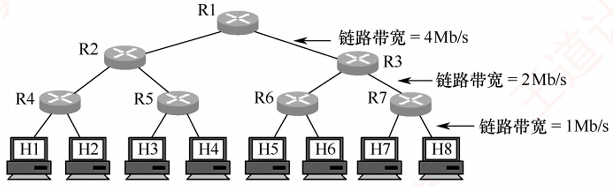

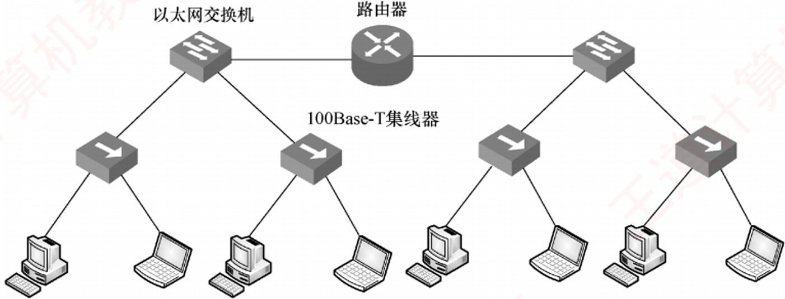

> **【唯一编号】** `WD-CN-C-4.7-T16`
> **【课程】** 计算机网络
> **【章节】** 第4章 网络层 · 4.7 网络层设备

---

### 【WD-CN-C-4.7-T17】第 17 题（P57）

17. 路由器能够分割广播域的原因是(
)
A. 路由器工作在网络层，不转发广播帧
B. 路由器工作在数据链路层,不转发广播帧
C. 路由器工作在物理层,不转发广播帧
D. 路由器工作在传输层,不转发广播帧

> **【唯一编号】** `WD-CN-C-4.7-T17`
> **【课程】** 计算机网络
> **【章节】** 第4章 网络层 · 4.7 网络层设备

---

### 【WD-CN-C-4.7-T18】第 18 题（P57）

18. 如下图所示,用7 个相同的路由器与8 台主机相连。链路带宽分为三种,最上层的最快,最下层的最
慢,都是全双工方式,图中标注了各层链路带宽的数值。所有路由器的处理速度都很快,远超链路带
宽。下列关于网络拥塞分析的说法中,正确的是(
)
A. R1 - R2 链路和R2 - R4 链路都不可能发生拥塞
B. R1 - R2 链路可能发生拥塞, R2 - R4 链路不可能发生拥塞
C. R1 - R2 链路不可能发生拥塞, R2 - R4 链路可能发生拥塞
D. R1 - R2 链路和R2 - R4 链路都可能发生拥塞

> **【唯一编号】** `WD-CN-C-4.7-T18`
> **【课程】** 计算机网络
> **【章节】** 第4章 网络层 · 4.7 网络层设备

---

### 【WD-CN-C-4.7-T19】第 19 题（P57）

19.【2010 统考真题】下列网络设备中,能够抑制广播风暴的是(
)
I.中继器
II.集线器
III.网桥
IV.路由器
A. 仅I 和II
B. 仅III
C. 仅III 和IV
D. 仅IV

> **【唯一编号】** `WD-CN-C-4.7-T19`
> **【课程】** 计算机网络
> **【章节】** 第4章 网络层 · 4.7 网络层设备

---

### 【WD-CN-C-4.7-T20】第 20 题（P57）

20.【2012 统考真题】下列关于IP 路由器功能的描述中,正确的是(
)
I.运行路由协议,设备路由表
II.监测到拥塞时,合理丢弃IP 分组
III.对收到的IP 分组头进行差错检验,确保传输的IP 分组不丢失
IV.根据收到的IP 分组的目的IP 地址,将其转发到合适的输出线路上
A. 仅III、IV
B. 仅I、II、III
C. 仅I、II、IV
D. I、II、III、IV

> **【唯一编号】** `WD-CN-C-4.7-T20`
> **【课程】** 计算机网络
> **【章节】** 第4章 网络层 · 4.7 网络层设备

---

### 【WD-CN-C-4.7-T21】第 21 题（P57）

21.【2020 统考真题】下图所示的网络中,冲突域和广播域的个数分别是(
)
A. 2,2
B. 2,4
C. 4,2
D. 4,4

第5 章
传输层

> **【唯一编号】** `WD-CN-C-4.7-T21`
> **【课程】** 计算机网络
> **【章节】** 第4章 网络层 · 4.7 网络层设备
