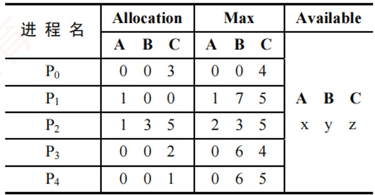
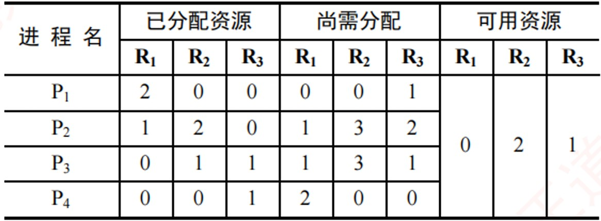
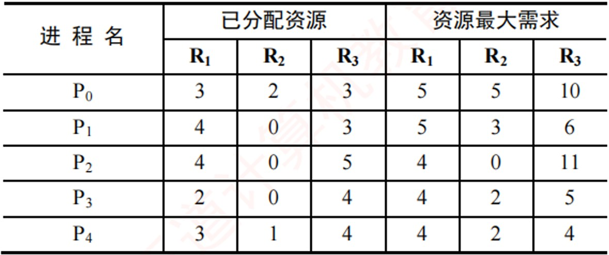
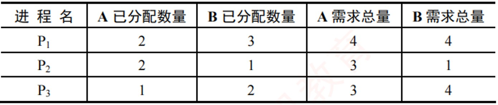
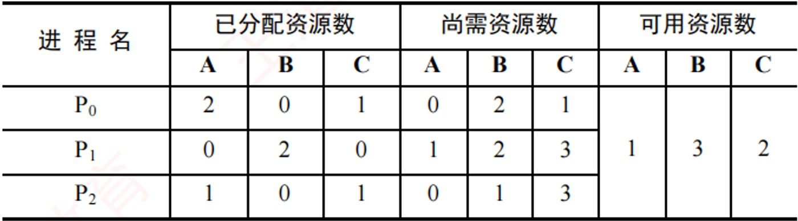

# 《王道操作系统》· 第2章 进程与线程（课后选择题全解）

> 本章共包含 4 个小节，共计 238 道精选选择题。

---
## 2.1 进程与线程简介
---

### 【WD-OS-C-2.1-T01】第 1 题（P2）

1. 一个进程映像是(
)
A. 由协处理器执行的一个程序
B. 一个独立的程序+ 数据集
C. PCB 结构与程序和数据的组合
D. 一个独立的程序

> **【唯一编号】** `WD-OS-C-2.1-T01`
> **【课程】** 操作系统
> **【章节】** 第2章 进程与线程 · 2.1 进程与线程简介

---

### 【WD-OS-C-2.1-T02】第 2 题（P2）

2. 进程之间交换数据不能通过(
) 途径进行。
A. 共享文件
B. 消息传递
C. 访问进程地址空间
D. 访问共享存储区

> **【唯一编号】** `WD-OS-C-2.1-T02`
> **【课程】** 操作系统
> **【章节】** 第2章 进程与线程 · 2.1 进程与线程简介

---

### 【WD-OS-C-2.1-T03】第 3 题（P2）

3. 进程与程序的根本区别是(
)
A. 静态和动态特点
B. 是不是被调入内存
C. 是不是具有就绪、运行和等待三种状态
D. 是不是占有处理器

> **【唯一编号】** `WD-OS-C-2.1-T03`
> **【课程】** 操作系统
> **【章节】** 第2章 进程与线程 · 2.1 进程与线程简介

---

### 【WD-OS-C-2.1-T04】第 4 题（P2）

4. 下列关于进程的描述中,最不符合操作系统对进程的理解的是(
)
A. 进程是在多程序环境中的完整程序
B. 进程可以由程序、数据和PCB 描述
C. 线程(Thread) 是一种特殊的进程
D. 进程是程序在一个数据集合上的运行过程,它是系统进行资源分配和调度的一个独立单元

> **【唯一编号】** `WD-OS-C-2.1-T04`
> **【课程】** 操作系统
> **【章节】** 第2章 进程与线程 · 2.1 进程与线程简介

---

### 【WD-OS-C-2.1-T05】第 5 题（P2）

5. 下列关于并发进程特性的叙述中,正确的是(
)
A. 进程是一个动态过程,其生命周期是连续的
B. 并发进程执行完毕后,一定能够得到相同的结果
C. 并发进程对共享变量的操作结果与执行速度无关
D. 并发进程的运行结果具有不可再现性

> **【唯一编号】** `WD-OS-C-2.1-T05`
> **【课程】** 操作系统
> **【章节】** 第2章 进程与线程 · 2.1 进程与线程简介

---

### 【WD-OS-C-2.1-T06】第 6 题（P2）

6. 下列关于进程的叙述中,正确的是(
)
A. 进程获得处理器运行是通过调度得到的
B. 优先级是进程调度的重要依据,一旦确定不能改动
C. 在单处理器系统中,任何时刻都只有一个进程处于运行态
D. 进程申请处理器而得不到满足时,其状态变为阻塞态

> **【唯一编号】** `WD-OS-C-2.1-T06`
> **【课程】** 操作系统
> **【章节】** 第2章 进程与线程 · 2.1 进程与线程简介

---

### 【WD-OS-C-2.1-T07】第 7 题（P17）

7. 并发进程执行的相对速度是(
)
A. 由进程的程序结构决定的
B. 由进程自己来控制的
C. 与进程调度策略有关
D. 在进程被创建时确定的

> **【唯一编号】** `WD-OS-C-2.1-T07`
> **【课程】** 操作系统
> **【章节】** 第2章 进程与线程 · 2.1 进程与线程简介

---

### 【WD-OS-C-2.1-T08】第 8 题（P17）

8. 下列任务中, (
) 不是由进程创建原语完成的。
A. 申请PCB 并初始化
B. 为进程分配内存空问
C. 为进程分配CPU
D. 将进程插入就绪队列

> **【唯一编号】** `WD-OS-C-2.1-T08`
> **【课程】** 操作系统
> **【章节】** 第2章 进程与线程 · 2.1 进程与线程简介

---

### 【WD-OS-C-2.1-T09】第 9 题（P17）

9. 下列关于进程和程序的叙述中,错误的是(
)
A. 一个进程在其生命周期中可执行多个程序
B. 一个进程在同一时刻可执行多个程序
C. 一个程序的多次运行可形成多个不同的进程
D. 一个程序的一次执行可产生多个进程

> **【唯一编号】** `WD-OS-C-2.1-T09`
> **【课程】** 操作系统
> **【章节】** 第2章 进程与线程 · 2.1 进程与线程简介

---

### 【WD-OS-C-2.1-T10】第 10 题（P17）

10. 下列选项中,导致创建新进程的操作是(
)
I.用户登录
II.高级调度发生时
III.操作系统响应用户提出的请求
IV.用户打开了一个浏览器程序
A. 仅I 和IV
B. 仅II 和IV
C. I、II 和IV
D. 全部

> **【唯一编号】** `WD-OS-C-2.1-T10`
> **【课程】** 操作系统
> **【章节】** 第2章 进程与线程 · 2.1 进程与线程简介

---

### 【WD-OS-C-2.1-T11】第 11 题（P17）

11. 操作系统是根据(
) 来对并发执行的进程进行控制和管理的。
A. 进程的基本状态
B. 进程控制块
C. 多道程序设计
D. 进程的优先权

> **【唯一编号】** `WD-OS-C-2.1-T11`
> **【课程】** 操作系统
> **【章节】** 第2章 进程与线程 · 2.1 进程与线程简介

---

### 【WD-OS-C-2.1-T12】第 12 题（P17）

12. 在任何时刻,一个进程的状态变化(
) 引起另一个进程的状态变化。
A. 必定
B. 一定不
C. 不一定
D. 不可能

> **【唯一编号】** `WD-OS-C-2.1-T12`
> **【课程】** 操作系统
> **【章节】** 第2章 进程与线程 · 2.1 进程与线程简介

---

### 【WD-OS-C-2.1-T13】第 13 题（P17）

13. 在单处理器系统中，若同时存在10 个进程，则处于就绪队列中的进程最多有(
) 个。
A. 1
B. 8
C. 9
D. 10

> **【唯一编号】** `WD-OS-C-2.1-T13`
> **【课程】** 操作系统
> **【章节】** 第2章 进程与线程 · 2.1 进程与线程简介

---

### 【WD-OS-C-2.1-T14】第 14 题（P18）

14. 一个进程释放了一台打印机，它可能会改变(
) 的状态。
A. 自身进程
B. 输入/ 输出进程
C. 另一个等待打印机的进程
D. 所有等待打印机的进程

> **【唯一编号】** `WD-OS-C-2.1-T14`
> **【课程】** 操作系统
> **【章节】** 第2章 进程与线程 · 2.1 进程与线程简介

---

### 【WD-OS-C-2.1-T15】第 15 题（P18）

15. 系统进程所请求的一次I/O 操作完成后,将使进程状态从(
)
A. 运行态变为就绪态
B. 运行态变为阻塞态
C. 就绪态变为运行态
D. 阻塞态变为就绪态

> **【唯一编号】** `WD-OS-C-2.1-T15`
> **【课程】** 操作系统
> **【章节】** 第2章 进程与线程 · 2.1 进程与线程简介

---

### 【WD-OS-C-2.1-T16】第 16 题（P18）

16. 一个进程的基本状态可以从其他两种基本状态转变过去,这个基本的状态一定是(
)
A. 运行态
B. 阻塞态
C. 就绪态
D. 终止态

> **【唯一编号】** `WD-OS-C-2.1-T16`
> **【课程】** 操作系统
> **【章节】** 第2章 进程与线程 · 2.1 进程与线程简介

---

### 【WD-OS-C-2.1-T17】第 17 题（P18）

17. 在分时系统中，通常处于(
) 的进程最多。
A. 运行态
B. 就绪态
C. 阻塞态
D. 终止态

> **【唯一编号】** `WD-OS-C-2.1-T17`
> **【课程】** 操作系统
> **【章节】** 第2章 进程与线程 · 2.1 进程与线程简介

---

### 【WD-OS-C-2.1-T18】第 18 题（P18）

18. 并发进程失去封闭性,是指(
)
A. 多个相对独立的进程以各自的速度向前推进
B. 并发进程的执行结果与速度无关
C. 并发进程执行时,在不同时刻发生的错误
D. 并发进程共享变量,其执行结果与速度有关

> **【唯一编号】** `WD-OS-C-2.1-T18`
> **【课程】** 操作系统
> **【章节】** 第2章 进程与线程 · 2.1 进程与线程简介

---

### 【WD-OS-C-2.1-T19】第 19 题（P18）

19. 通常用户进程被建立后, (
)
A. 便一直存在于系统中,直到被操作人员撤销
B. 随着进程运行的正常或不正常结束而撤销
C. 随着时间片轮转而撤销与建立
D. 随着进程的阻塞或者唤醒而撤销与建立

> **【唯一编号】** `WD-OS-C-2.1-T19`
> **【课程】** 操作系统
> **【章节】** 第2章 进程与线程 · 2.1 进程与线程简介

---

### 【WD-OS-C-2.1-T20】第 20 题（P19）

20. 进程在处理器上执行时，(
)
A. 进程之间是无关的,具有封闭特性
B. 进程之间都有交互性,相互依赖、相互制约,具有并发性
C. 具有并发性,即同时执行的特性
D. 进程之间可能是无关的,但也可能是有交互性的

> **【唯一编号】** `WD-OS-C-2.1-T20`
> **【课程】** 操作系统
> **【章节】** 第2章 进程与线程 · 2.1 进程与线程简介

---

### 【WD-OS-C-2.1-T21】第 21 题（P19）

21. 下列关于父进程和子进程的叙述中,正确的是(
)
A. 为了标志父子关系,可让子进程和父进程拥有相同的PID
B. 父进程和子进程是相互独立的,可以并发执行
C. 撤销子进程时,一定会同时撤销父进程
D. 父进程创建了子进程,要等父进程执行完后,子进程才能执行

> **【唯一编号】** `WD-OS-C-2.1-T21`
> **【课程】** 操作系统
> **【章节】** 第2章 进程与线程 · 2.1 进程与线程简介

---

### 【WD-OS-C-2.1-T22】第 22 题（P19）

22. 若一个进程实体由PCB、共享正文段、数据堆段和数据栈段组成,请指出下列C 语言程序中的内
容及相关数据结构各位于哪一段中。
I.全局赋值变量, (
)
II.未赋值的局部变量, (
)
III.函数调用实参传递值, (
)
IV.用malloc( ) 要求动态分配的存储区, (
)
V.常量值(如1995、"string"), (
)
VI.进程的优先级, (
)
A. PCB
B. 正文段
C. 堆段
D. 栈段

> **【唯一编号】** `WD-OS-C-2.1-T22`
> **【课程】** 操作系统
> **【章节】** 第2章 进程与线程 · 2.1 进程与线程简介

---

### 【WD-OS-C-2.1-T23】第 23 题（P19）

23. 同一程序经过多次创建,运行在不同的数据集上,形成了(
) 的进程。
A. 不同
B. 相同
C. 同步
D. 互斥

> **【唯一编号】** `WD-OS-C-2.1-T23`
> **【课程】** 操作系统
> **【章节】** 第2章 进程与线程 · 2.1 进程与线程简介

---

### 【WD-OS-C-2.1-T24】第 24 题（P19）

24. PCB 是进程存在的唯一标志,下列(
) 不属于PCB。
A. 进程ID
B. CPU 状态
C. 堆栈指针
D. 全局变量

> **【唯一编号】** `WD-OS-C-2.1-T24`
> **【课程】** 操作系统
> **【章节】** 第2章 进程与线程 · 2.1 进程与线程简介

---

### 【WD-OS-C-2.1-T25】第 25 题（P19）

25. 一个计算机系统中,进程的最大数量主要受到(
) 限制。
A. 内存大小
B. 用户数目
C. 打开的文件数
D. 外部设备数量

> **【唯一编号】** `WD-OS-C-2.1-T25`
> **【课程】** 操作系统
> **【章节】** 第2章 进程与线程 · 2.1 进程与线程简介

---

### 【WD-OS-C-2.1-T26】第 26 题（P20）

26. 进程创建完成后会进入一个序列,这个序列称为(
)
A. 阻塞队列
B. 挂起序列
C. 就绪队列
D. 运行队列

> **【唯一编号】** `WD-OS-C-2.1-T26`
> **【课程】** 操作系统
> **【章节】** 第2章 进程与线程 · 2.1 进程与线程简介

---

### 【WD-OS-C-2.1-T27】第 27 题（P20）

27. 进程自身决定(
)
A. 从运行态到阻塞态
B. 从运行态到就绪态
C. 从就绪态到运行态
D. 从阻塞态到就绪态

> **【唯一编号】** `WD-OS-C-2.1-T27`
> **【课程】** 操作系统
> **【章节】** 第2章 进程与线程 · 2.1 进程与线程简介

---

### 【WD-OS-C-2.1-T28】第 28 题（P20）

28. 下列关于原语操作的叙述中,错误的是(
)
A. 操作系统使用原语对进程进行管理和控制
B. 原语在执行过程中不允许被中断
C. 原语在内核态下执行,常驻内存
D. 原语被定义为“原子操作”,意思是其执行速度非常快

> **【唯一编号】** `WD-OS-C-2.1-T28`
> **【课程】** 操作系统
> **【章节】** 第2章 进程与线程 · 2.1 进程与线程简介

---

### 【WD-OS-C-2.1-T29】第 29 题（P20）

29. 下列进程间通信方式中, 数据传输速度最快的是(
)
A. 消息传递
B. 信号量
C. 共享内存
D. 管道

> **【唯一编号】** `WD-OS-C-2.1-T29`
> **【课程】** 操作系统
> **【章节】** 第2章 进程与线程 · 2.1 进程与线程简介

---

### 【WD-OS-C-2.1-T30】第 30 题（P20）

30. 信箱通信是一种(
) 通信方式。
A. 直接通信
B. 间接通信
C. 低级通信
D. 信号量

> **【唯一编号】** `WD-OS-C-2.1-T30`
> **【课程】** 操作系统
> **【章节】** 第2章 进程与线程 · 2.1 进程与线程简介

---

### 【WD-OS-C-2.1-T31】第 31 题（P20）

31. 下列关于信号发送和处理的描述中,错误的是(
)
A. 一个进程可以给自己发送信号
B. 操作系统的内核可以给进程发送信号
C. 操作系统的内核对每种信号都有默认处理程序
D. 用户可以对每种信号自定义处理函数

> **【唯一编号】** `WD-OS-C-2.1-T31`
> **【课程】** 操作系统
> **【章节】** 第2章 进程与线程 · 2.1 进程与线程简介

---

### 【WD-OS-C-2.1-T32】第 32 题（P20）

32. 下列关于信号的处理的描述中,错误的是(
)
A. 当进程从内核态转为用户态时,会检查是否有待处理的信号
B. 当进程从用户态转为内核态时,也会检查是否有待处理的信号
C. 操作系统对某些信号的处理是可以忽略的
D. 操作系统允许进程通过系统调用,自定义某些信号的处理程序

> **【唯一编号】** `WD-OS-C-2.1-T32`
> **【课程】** 操作系统
> **【章节】** 第2章 进程与线程 · 2.1 进程与线程简介

---

### 【WD-OS-C-2.1-T33】第 33 题（P21）

33. 下面的叙述中,正确的是(
)
A. 引入线程后,处理器只能在线程间切换
B. 引入线程后,处理器仍在进程间切换
C. 线程的切换,不会引起进程的切换
D. 线程的切换,可能引起进程的切换

> **【唯一编号】** `WD-OS-C-2.1-T33`
> **【课程】** 操作系统
> **【章节】** 第2章 进程与线程 · 2.1 进程与线程简介

---

### 【WD-OS-C-2.1-T34】第 34 题（P21）

34. 下列关于线程的叙述中,正确的是(
)
A. 线程包含CPU 现场,可以独立执行程序
B. 每个线程都有自己独立的地址空间
C. 每个进程只能包含一个线程
D. 同一进程中的线程间通信也必须使用系统调用函数

> **【唯一编号】** `WD-OS-C-2.1-T34`
> **【课程】** 操作系统
> **【章节】** 第2章 进程与线程 · 2.1 进程与线程简介

---

### 【WD-OS-C-2.1-T35】第 35 题（P21）

35. 下面的叙述中,正确的是(
)
A. 线程是比进程更小的能独立运行的基本单位，可以脱离进程独立运行
B. 引入线程可提高程序并发执行的程度,可进一步提高系统效率
C. 线程的引入增加了程序执行时的时空开销
D. 一个进程一定包含多个线程

> **【唯一编号】** `WD-OS-C-2.1-T35`
> **【课程】** 操作系统
> **【章节】** 第2章 进程与线程 · 2.1 进程与线程简介

---

### 【WD-OS-C-2.1-T36】第 36 题（P21）

36. 下面的叙述中,正确的是(
)
A. 同一进程内的线程可并发执行,不同进程的线程只能串行执行
B. 同一进程内的线程只能串行执行,不同进程的线程可并发执行
C. 同一进程或不同进程内的线程都只能串行执行
D. 同一进程或不同进程内的线程都可以并发执行

> **【唯一编号】** `WD-OS-C-2.1-T36`
> **【课程】** 操作系统
> **【章节】** 第2章 进程与线程 · 2.1 进程与线程简介

---

### 【WD-OS-C-2.1-T37】第 37 题（P21）

37. 下列选项中，(
) 不是线程的优点。
A. 提高系统并发性
B. 节约系统资源
C. 切换开销小
D. 增强进程安全性

> **【唯一编号】** `WD-OS-C-2.1-T37`
> **【课程】** 操作系统
> **【章节】** 第2章 进程与线程 · 2.1 进程与线程简介

---

### 【WD-OS-C-2.1-T38】第 38 题（P21）

38. 下列关于进程和线程的说法中,正确的是(
)
A. 一个进程可以包含一个或多个线程,一个线程可以属于一个或多个进程
B. 多线程技术具有明显的优越性,如速度快、通信简便、设备并行性高等
C. 由于线程不作为资源分配单位,线程之间可以无约束地并行执行
D. 线程又称轻量级进程,因为线程都比进程小

> **【唯一编号】** `WD-OS-C-2.1-T38`
> **【课程】** 操作系统
> **【章节】** 第2章 进程与线程 · 2.1 进程与线程简介

---

### 【WD-OS-C-2.1-T39】第 39 题（P22）

39. 在以下描述中, (
) 并不是多线程系统的特长。
A. 利用线程并行地执行矩阵乘法运算
B. Web 服务器利用线程响应HTTP 请求
C. 键盘驱动程序为每个正在运行的应用配备一个线程,用以响应该应用的键盘输入
D. 基于GUI 的调试程序用不同的线程分别处理用户输入、计算和跟踪等操作

> **【唯一编号】** `WD-OS-C-2.1-T39`
> **【课程】** 操作系统
> **【章节】** 第2章 进程与线程 · 2.1 进程与线程简介

---

### 【WD-OS-C-2.1-T40】第 40 题（P22）

40. 在进程转换时，下列(
) 转换是不可能发生的。
A. 就绪态→运行态
B. 运行态→就绪态
C. 运行态→阻塞态
D. 阻塞态→运行态

> **【唯一编号】** `WD-OS-C-2.1-T40`
> **【课程】** 操作系统
> **【章节】** 第2章 进程与线程 · 2.1 进程与线程简介

---

### 【WD-OS-C-2.1-T41】第 41 题（P22）

41. 当(
) 时，进程从执行状态转变为就绪态。
A. 进程被调度程序选中
B. 时间片到时
C. 等待某一事件
D. 等待的事件发生

> **【唯一编号】** `WD-OS-C-2.1-T41`
> **【课程】** 操作系统
> **【章节】** 第2章 进程与线程 · 2.1 进程与线程简介

---

### 【WD-OS-C-2.1-T42】第 42 题（P22）

42. 两个合作进程(CooperatingProcesses) 无法利用(
) 交换数据。
A. 文件系统
B. 共享内存
C. 高级语言程序设计中的全局变量
D. 消息传递系统

> **【唯一编号】** `WD-OS-C-2.1-T42`
> **【课程】** 操作系统
> **【章节】** 第2章 进程与线程 · 2.1 进程与线程简介

---

### 【WD-OS-C-2.1-T43】第 43 题（P22）

43. 以下可能导致一个进程从运行态变为就绪态的事件是(
)
A. 一次I/O 操作结束
B. 运行进程需做I/O 操作
C. 运行进程结束
D. 出现了比现在进程优先级更高的进程

> **【唯一编号】** `WD-OS-C-2.1-T43`
> **【课程】** 操作系统
> **【章节】** 第2章 进程与线程 · 2.1 进程与线程简介

---

### 【WD-OS-C-2.1-T44】第 44 题（P22）

44. (
) 必会引起进程切换。
A. 一个进程创建后,进入就绪态
B. 一个进程从运行态变为就绪态
C. 一个进程从阻塞态变为就绪态
D. 以上答案都不对

> **【唯一编号】** `WD-OS-C-2.1-T44`
> **【课程】** 操作系统
> **【章节】** 第2章 进程与线程 · 2.1 进程与线程简介

---

### 【WD-OS-C-2.1-T45】第 45 题（P22）

45. 进程处于(
) 时，它处于非阻塞态。
A. 等待从键盘输入数据
B. 等待协作进程的一个信号
C. 等待操作系统分配CPU 时间
D. 等待网络数据进入内存

> **【唯一编号】** `WD-OS-C-2.1-T45`
> **【课程】** 操作系统
> **【章节】** 第2章 进程与线程 · 2.1 进程与线程简介

---

### 【WD-OS-C-2.1-T46】第 46 题（P23）

46. 一个进程被唤醒，意味着(
)
A. 该进程可以重新竞争CPU
B. 优先级变大
C. PCB 移动到就绪队列之首
D. 进程变为运行态

> **【唯一编号】** `WD-OS-C-2.1-T46`
> **【课程】** 操作系统
> **【章节】** 第2章 进程与线程 · 2.1 进程与线程简介

---

### 【WD-OS-C-2.1-T47】第 47 题（P23）

47. 进程创建时,不需要做的是(
)
A. 填写一个该进程的进程表项
B. 分配该进程适当的内存
C. 将该进程插入就绪队列
D. 为该进程分配CPU

> **【唯一编号】** `WD-OS-C-2.1-T47`
> **【课程】** 操作系统
> **【章节】** 第2章 进程与线程 · 2.1 进程与线程简介

---

### 【WD-OS-C-2.1-T48】第 48 题（P23）

48. 下面关于用户级线程和内核级线程的描述中,错误的是(
)
A. 采用轮转调度算法,进程中设置内核级线程和用户级线程的效果完全不同
B. 跨进程的用户级线程调度也不需要内核参与,控制简单
C. 用户级线程可以在任何操作系统中运行
D. 若系统中只有用户级线程,则CPU 的调度对象是进程

> **【唯一编号】** `WD-OS-C-2.1-T48`
> **【课程】** 操作系统
> **【章节】** 第2章 进程与线程 · 2.1 进程与线程简介

---

### 【WD-OS-C-2.1-T49】第 49 题（P23）

49. 在内核级线程相对于用户级线程的优点的如下描述中,错误的是(
)
A. 同一进程内的线程切换,系统开销小
B. 当内核线程阻塞时,同一进程中的其他内核级线程仍可被调度
C. 内核级线程的程序实体可以在内核态运行
D. 对多处理器系统，核心可以同时调度同一进程的多个线程并行运行

> **【唯一编号】** `WD-OS-C-2.1-T49`
> **【课程】** 操作系统
> **【章节】** 第2章 进程与线程 · 2.1 进程与线程简介

---

### 【WD-OS-C-2.1-T50】第 50 题（P23）

50. 下列关于用户级线程相对于内核级线程的优点的描述中,错误的是(
)
A. 一个线程阻塞不影响另一个线程的运行
B. 线程的调度不需要内核直接参与,控制简单
C. 线程切换代价小
D. 允许每个进程定制自己的调度算法,线程管理比较灵活

> **【唯一编号】** `WD-OS-C-2.1-T50`
> **【课程】** 操作系统
> **【章节】** 第2章 进程与线程 · 2.1 进程与线程简介

---

### 【WD-OS-C-2.1-T51】第 51 题（P23）

51. 下列关于用户级线程的优点的描述中,不正确的是(
)
A. 线程切换不需要切换到内核态
B. 支持不同的应用程序采用不同的调度算法
C. 在不同操作系统上不经修改就可直接运行
D. 同一个进程内的多个线程可以同时调度到多个处理器上执行

> **【唯一编号】** `WD-OS-C-2.1-T51`
> **【课程】** 操作系统
> **【章节】** 第2章 进程与线程 · 2.1 进程与线程简介

---

### 【WD-OS-C-2.1-T52】第 52 题（P24）

52. 下列选项中,可能导致用户级线程切换的事件是(
)
A. 系统调用
B. I/O 请求
C. 异常处理
D. 线程同步

> **【唯一编号】** `WD-OS-C-2.1-T52`
> **【课程】** 操作系统
> **【章节】** 第2章 进程与线程 · 2.1 进程与线程简介

---

### 【WD-OS-C-2.1-T53】第 53 题（P24）

53. 下列关于用户级线程的描述中,错误的是(
)
A. 用户级线程由线程库进行管理
B. 用户级线程只有在创建和调度时需要内核的干预
C. 操作系统无法直接调度用户级线程
D. 线程库中线程的切换不会导致进程切换

> **【唯一编号】** `WD-OS-C-2.1-T53`
> **【课程】** 操作系统
> **【章节】** 第2章 进程与线程 · 2.1 进程与线程简介

---

### 【WD-OS-C-2.1-T54】第 54 题（P24）

54. 下面的说法中,正确的是(
)
A. 不论是系统支持的线程还是用户级线程,其切换都需要内核的支持
B. 线程是资源分配的单位,进程是调度和分派的单位
C. 不管系统中是否有线程,进程都是拥有资源的独立单位
D. 在引入线程的系统中，进程仍是资源调度和分派的基本单位

> **【唯一编号】** `WD-OS-C-2.1-T54`
> **【课程】** 操作系统
> **【章节】** 第2章 进程与线程 · 2.1 进程与线程简介

---

### 【WD-OS-C-2.1-T55】第 55 题（P24）

55. 在多对一的线程模型中,当一个多线程进程中的某个线程被阻塞后, (
)
A. 该进程的其他线程仍可继续运行
B. 整个进程都将阻塞
C. 该阻塞线程将被撤销
D. 该阻塞线程将永远不可能再执行

> **【唯一编号】** `WD-OS-C-2.1-T55`
> **【课程】** 操作系统
> **【章节】** 第2章 进程与线程 · 2.1 进程与线程简介

---

### 【WD-OS-C-2.1-T56】第 56 题（P24）

56. 并发性较好的多线程模型有(
)
I.一对一模型
II.多对一模型
III.多对多模型
A. 仅I
B. I 和II
C. I 和III
D. I、II 和III

> **【唯一编号】** `WD-OS-C-2.1-T56`
> **【课程】** 操作系统
> **【章节】** 第2章 进程与线程 · 2.1 进程与线程简介

---

### 【WD-OS-C-2.1-T57】第 57 题（P24）

57. 下列关于多对一模型的叙述中,错误的是(
)
A. 一个进程的多个线程不能并行运行在多个处理器上
B. 进程中的用户级线程由进程自己管理
C. 线程切换会导致进程切换
D. 一个线程的系统调用会导致整个进程阻塞

> **【唯一编号】** `WD-OS-C-2.1-T57`
> **【课程】** 操作系统
> **【章节】** 第2章 进程与线程 · 2.1 进程与线程简介

---

### 【WD-OS-C-2.1-T58】第 58 题（P25）

58.【2010 统考真题】下列选项中,导致创建新进程的操作是(
)
I.用户登录成功
II.设备分配
III.启动程序执行
A. 仅I 和II
B. 仅II 和III
C. 仅I 和III
D. I、II、III

> **【唯一编号】** `WD-OS-C-2.1-T58`
> **【课程】** 操作系统
> **【章节】** 第2章 进程与线程 · 2.1 进程与线程简介

---

### 【WD-OS-C-2.1-T59】第 59 题（P25）

59.【2011 统考真题】在支持多线程的系统中,进程P 创建的若干线程不能共享的是(
)
A. 进程P 的代码段
B. 进程P 中打开的文件
C. 进程P 的全局变量
D. 进程P 中某线程的栈指针

> **【唯一编号】** `WD-OS-C-2.1-T59`
> **【课程】** 操作系统
> **【章节】** 第2章 进程与线程 · 2.1 进程与线程简介

---

### 【WD-OS-C-2.1-T60】第 60 题（P25）

60.【2012 统考真题】下列关于进程和线程的叙述中,正确的是(
)
A. 不管系统是否支持线程,进程都是资源分配的基本单位
B. 线程是资源分配的基本单位,进程是调度的基本单位
C. 系统级线程和用户级线程的切换都需要内核的支持
D. 同一进程中的各个线程拥有各自不同的地址空间

> **【唯一编号】** `WD-OS-C-2.1-T60`
> **【课程】** 操作系统
> **【章节】** 第2章 进程与线程 · 2.1 进程与线程简介

---

### 【WD-OS-C-2.1-T61】第 61 题（P25）

61.【2014 统考真题】一个进程的读磁盘操作完成后,操作系统针对该进程必做的是(
)
A. 修改进程状态为就绪态
B. 降低进程优先级
C. 给进程分配用户内存空间
D. 增加进程时间片大小

> **【唯一编号】** `WD-OS-C-2.1-T61`
> **【课程】** 操作系统
> **【章节】** 第2章 进程与线程 · 2.1 进程与线程简介

---

### 【WD-OS-C-2.1-T62】第 62 题（P25）

62.【2014 统考真题】下列关于管道(Pipe) 通信的叙述中,正确的是(
)
A. 一个管道可实现双向数据传输
B. 管道的容量仅受磁盘容量大小限制
C. 进程对管道进行读操作和写操作都可能被阻塞
D. 一个管道只能有一个读进程或一个写进程对其操作

> **【唯一编号】** `WD-OS-C-2.1-T62`
> **【课程】** 操作系统
> **【章节】** 第2章 进程与线程 · 2.1 进程与线程简介

---

### 【WD-OS-C-2.1-T63】第 63 题（P25）

63.【2015 统考真题】下列选项中,会导致进程从执行态变为就绪态的事件是(
)
A. 执行P(wait) 操作
B. 申请内存失败
C. 启动I/O 设备
D. 被高优先级进程抢占

> **【唯一编号】** `WD-OS-C-2.1-T63`
> **【课程】** 操作系统
> **【章节】** 第2章 进程与线程 · 2.1 进程与线程简介

---

### 【WD-OS-C-2.1-T64】第 64 题（P26）

64.【2018 统考真题】下列选项中,可能导致当前进程P 阻塞的事件是(
)
I.进程P 申请临界资源
II.进程P 从磁盘读数据
III.系统将CPU 分配给高优先权的进程
A. 仅I
B. 仅II
C. 仅I、II
D. I、II、III

> **【唯一编号】** `WD-OS-C-2.1-T64`
> **【课程】** 操作系统
> **【章节】** 第2章 进程与线程 · 2.1 进程与线程简介

---

### 【WD-OS-C-2.1-T65】第 65 题（P26）

65.【2019 统考真题】下列选项中,可能会将进程唤醒的事件是(
)
I. I/O 结束
II.某进程退出临界区
III.当前进程的时间片用完
A. 仅I
B. 仅III
C. 仅I、II
D. I、II、III

> **【唯一编号】** `WD-OS-C-2.1-T65`
> **【课程】** 操作系统
> **【章节】** 第2章 进程与线程 · 2.1 进程与线程简介

---

### 【WD-OS-C-2.1-T66】第 66 题（P26）

66.【2019 统考真题】下列关于线程的描述中,错误的是(
)
A. 内核级线程的调度由操作系统完成
B. 操作系统为每个用户级线程建立一个线程控制块
C. 用户级线程间的切换比内核级线程间的切换效率高
D. 用户级线程可以在不支持内核级线程的操作系统上实现

> **【唯一编号】** `WD-OS-C-2.1-T66`
> **【课程】** 操作系统
> **【章节】** 第2章 进程与线程 · 2.1 进程与线程简介

---

### 【WD-OS-C-2.1-T67】第 67 题（P26）

67.【2020 统考真题】下列关于父进程与子进程的叙述中,错误的是(
)
A. 父进程与子进程可以并发执行
B. 父进程与子进程共享虚拟地址空间
C. 父进程与子进程有不同的进程控制块
D. 父进程与子进程不能同时使用同一临界资源

> **【唯一编号】** `WD-OS-C-2.1-T67`
> **【课程】** 操作系统
> **【章节】** 第2章 进程与线程 · 2.1 进程与线程简介

---

### 【WD-OS-C-2.1-T68】第 68 题（P26）

68.【2021 统考真题】下列操作中,操作系统在创建新进程时,必须完成的是(
)
I.申请空白的进程控制块
II.初始化进程控制块
III.设置进程状态为执行态
A. 仅I
B. 仅I、II
C. 仅I、III
D. 仅II、III

> **【唯一编号】** `WD-OS-C-2.1-T68`
> **【课程】** 操作系统
> **【章节】** 第2章 进程与线程 · 2.1 进程与线程简介

---

### 【WD-OS-C-2.1-T69】第 69 题（P26）

69.【2022 统考真题】下列事件或操作中, 可能导致进程P 由执行态变为阻塞态的是(
)
I.进程P 读文件
II.进程P 的时间片用完
III.进程P 申请外设
IV.进程P 执行信号量的wait( ) 操作
A. 仅I、IV
B. 仅II、III
C. 仅III、IV
D. 仅I、III、IV

> **【唯一编号】** `WD-OS-C-2.1-T69`
> **【课程】** 操作系统
> **【章节】** 第2章 进程与线程 · 2.1 进程与线程简介

---

### 【WD-OS-C-2.1-T70】第 70 题（P27）

70.【2023 统考真题】下列操作完成时,导致CPU 从内核态转为用户态的是(
)
A. 阻塞进程
B. 执行CPU 调度
C. 唤醒进程
D. 执行系统调用

> **【唯一编号】** `WD-OS-C-2.1-T70`
> **【课程】** 操作系统
> **【章节】** 第2章 进程与线程 · 2.1 进程与线程简介

---

### 【WD-OS-C-2.1-T71】第 71 题（P27）

71.【2023 统考真题】下列由当前线程引起的事件或执行的操作中,可能导致该线程由执行态变为就
绪态的是(
)
A. 键盘输入
B. 缺页异常
C. 主动出让CPU
D. 执行信号量的wait(
) 操作

> **【唯一编号】** `WD-OS-C-2.1-T71`
> **【课程】** 操作系统
> **【章节】** 第2章 进程与线程 · 2.1 进程与线程简介

---

### 【WD-OS-C-2.1-T72】第 72 题（P27）

72.【2024 统考真题】下列选项中，操作系统在终止进程时不一定执行的是(
)
A. 终止子进程
B. 回收进程占用的设备
C. 释放进程控制块
D. 回收为进程分配的内存

> **【唯一编号】** `WD-OS-C-2.1-T72`
> **【课程】** 操作系统
> **【章节】** 第2章 进程与线程 · 2.1 进程与线程简介

---

### 【WD-OS-C-2.1-T73】第 73 题（P27）

73.【2024 统考真题】若进程P 中的线程T 先打开文件,得到文件描述符fd,再创建两个线程Ta 和Tb,
则在下列资源中, Ta 与Tb 可共享的是(
)
I.进程P 的地址空间
II.线程T 的栈
III.文件描述符fd
A. 仅I
B. 仅I、III
C. 仅II、III
D. I、II、III

> **【唯一编号】** `WD-OS-C-2.1-T73`
> **【课程】** 操作系统
> **【章节】** 第2章 进程与线程 · 2.1 进程与线程简介

---
## 2.2 CPU调度
---

### 【WD-OS-C-2.2-T01】第 1 题（P2）

1. 中级调度的目的是(
)
A. 提高CPU 的效率
B. 降低系统开销
C. 提高CPU 的利用率
D. 节省内存

> **【唯一编号】** `WD-OS-C-2.2-T01`
> **【课程】** 操作系统
> **【章节】** 第2章 进程与线程 · 2.2 CPU调度

---

### 【WD-OS-C-2.2-T02】第 2 题（P2）

2. 进程从创建态转换到就绪态的工作由(
) 完成。
A. 进程调度
B. 中级调度
C. 高级调度
D. 低级调度

> **【唯一编号】** `WD-OS-C-2.2-T02`
> **【课程】** 操作系统
> **【章节】** 第2章 进程与线程 · 2.2 CPU调度

---

### 【WD-OS-C-2.2-T03】第 3 题（P2）

3. 下列哪些指标是调度算法设计时应该考虑的?(
)
I.公平性
II.资源利用率
III.互斥性
IV.平均周转时间
A. I、II
B. I、II、IV.
C. I、III、IV
D. 全部都是

> **【唯一编号】** `WD-OS-C-2.2-T03`
> **【课程】** 操作系统
> **【章节】** 第2章 进程与线程 · 2.2 CPU调度

---

### 【WD-OS-C-2.2-T04】第 4 题（P28）

4. 时间片轮转调度算法是为了(
)
A. 多个用户能及时干预系统
B. 使系统变得高效
C. 优先级较高的进程得到及时响应
D. 需要CPU 时间最少的进程最先做

> **【唯一编号】** `WD-OS-C-2.2-T04`
> **【课程】** 操作系统
> **【章节】** 第2章 进程与线程 · 2.2 CPU调度

---

### 【WD-OS-C-2.2-T05】第 5 题（P28）

5. 在单处理器的多进程系统中,进程什么时候占用处理器及决定占用时间的长短是由(
) 决定的。
A. 进程相应的代码长度
B. 进程总共需要运行的时间
C. 进程特点和进程调度策略
D. 进程完成什么功能

> **【唯一编号】** `WD-OS-C-2.2-T05`
> **【课程】** 操作系统
> **【章节】** 第2章 进程与线程 · 2.2 CPU调度

---

### 【WD-OS-C-2.2-T06】第 6 题（P28）

6. 在某单处理器系统中,若此刻有多个就绪态进程,则下列叙述中错误的是(
)
A. 进程调度的目标是让进程轮流使用处理器
B. 当一个进程运行结束后,会调度下一个就绪进程运行
C. 上下文切换是进程调度的实现手段
D. 处于临界区的进程在退出临界区前,无法被调度

> **【唯一编号】** `WD-OS-C-2.2-T06`
> **【课程】** 操作系统
> **【章节】** 第2章 进程与线程 · 2.2 CPU调度

---

### 【WD-OS-C-2.2-T07】第 7 题（P28）

7. 下列内容中,不属于进程上下文的是(
)
A. 进程现场信息
B. 进程控制信息
C. 中断向量
D. 用户堆栈

> **【唯一编号】** `WD-OS-C-2.2-T07`
> **【课程】** 操作系统
> **【章节】** 第2章 进程与线程 · 2.2 CPU调度

---

### 【WD-OS-C-2.2-T08】第 8 题（P28）

8. 下列关于进程上下文切换的叙述中,错误的是(
)
A. 进程上下文指进程的代码、数据以及支持进程执行的所有运行环境
B. 进程上下文切换机制实现了不同进程在一个处理器中交替运行的功能
C. 进程上下文切换过程中必须保存换下进程在切换处的程序计数器的值
D. 进程上下文切换过程中必须将换下进程的代码和数据从主存保存到磁盘

> **【唯一编号】** `WD-OS-C-2.2-T08`
> **【课程】** 操作系统
> **【章节】** 第2章 进程与线程 · 2.2 CPU调度

---

### 【WD-OS-C-2.2-T09】第 9 题（P28）

9. 在支持页式存储管理和多线程技术的系统中,当一个进程中的线程T1 切换到同一个进程中的线程
T2 执行时,操作系统需要执行的操作是(
)
I.更新程序计数器的值
II.更新栈基址寄存器的值
III.更新页基址寄存器的值
IV.更新进程打开文件表
A. I、II、III、IV
B. II、IV
C. I、II
D. I、III、IV

> **【唯一编号】** `WD-OS-C-2.2-T09`
> **【课程】** 操作系统
> **【章节】** 第2章 进程与线程 · 2.2 CPU调度

---

### 【WD-OS-C-2.2-T10】第 10 题（P29）

10. (
) 有利于CPU 繁忙型的作业,而不利于I/O 繁忙型的作业。
A. 时间片轮转调度算法
B. 先来先服务调度算法
C. 短作业(进程) 优先算法
D. 优先权调度算法

> **【唯一编号】** `WD-OS-C-2.2-T10`
> **【课程】** 操作系统
> **【章节】** 第2章 进程与线程 · 2.2 CPU调度

---

### 【WD-OS-C-2.2-T11】第 11 题（P29）

11. 下面有关选择进程调度算法的准则中,不正确的是(
)
A. 尽快响应交互式用户的请求
B. 尽量提高处理器利用率
C. 尽可能提高系统吞吐量
D. 适当增长进程就绪队列的等待时间

> **【唯一编号】** `WD-OS-C-2.2-T11`
> **【课程】** 操作系统
> **【章节】** 第2章 进程与线程 · 2.2 CPU调度

---

### 【WD-OS-C-2.2-T12】第 12 题（P29）

12. 实时系统的进程调度,通常采用(
) 调度算法。
A. 先来先服务
B. 时间片轮转
C. 抢占式的优先级高者优先
D. 高响应比优先

> **【唯一编号】** `WD-OS-C-2.2-T12`
> **【课程】** 操作系统
> **【章节】** 第2章 进程与线程 · 2.2 CPU调度

---

### 【WD-OS-C-2.2-T13】第 13 题（P29）

13. 支持多道程序设计的操作系统在运行过程中,不断选择新进程运行来实现CPU 的共享,但其中( )
不是引起操作系统选择新进程的直接原因。
A. 运行进程的时间片用完
B. 运行进程出错
C. 运行进程要等待某一事件发生
D. 有新进程被创建进入就绪态

> **【唯一编号】** `WD-OS-C-2.2-T13`
> **【课程】** 操作系统
> **【章节】** 第2章 进程与线程 · 2.2 CPU调度

---

### 【WD-OS-C-2.2-T14】第 14 题（P29）

14. 进程(线程) 调度的时机有(
)
I.运行的进程(线程) 运行完毕
II.运行的进程(线程) 所需资源未准备好
III.运行的进程(线程) 的时间片用完
IV.运行的进程(线程) 自我阻塞
V.运行的进程(线程) 出现错误
A. II、III、IV 和V
B. I 和III
C. II、IV 和V
D. 全部都是

> **【唯一编号】** `WD-OS-C-2.2-T14`
> **【课程】** 操作系统
> **【章节】** 第2章 进程与线程 · 2.2 CPU调度

---

### 【WD-OS-C-2.2-T15】第 15 题（P29）

15. 设有4 个作业同时到达,每个作业的执行时间均为2h,它们在一台处理器上按单道式运行,则平均
周转时间为(
)
A. 1h
B. 5h
C. 2.5h
D. 8h

> **【唯一编号】** `WD-OS-C-2.2-T15`
> **【课程】** 操作系统
> **【章节】** 第2章 进程与线程 · 2.2 CPU调度

---

### 【WD-OS-C-2.2-T16】第 16 题（P30）

16. 每个作业只能建立一个进程,为了照顾短作业用户,应采用( ); 为了照顾紧急作业用户,应采用( )；
为了能实现人机交互，应采用(
)；而能使短作业、长作业和交互作业用户都满意，应采用(
)
A. FCFS 调度算法
B. 短作业优先调度算法
C. 时间片轮转调度算法
D. 多级反馈队列调度算法
E. 剥夺式优先级调度算法

> **【唯一编号】** `WD-OS-C-2.2-T16`
> **【课程】** 操作系统
> **【章节】** 第2章 进程与线程 · 2.2 CPU调度

---

### 【WD-OS-C-2.2-T17】第 17 题（P30）

17. (
) 优先级是在创建进程时确定的,确定之后在整个运行期间不再改变。
A. 先来先服务
B. 动态
C. 短作业
D. 静态

> **【唯一编号】** `WD-OS-C-2.2-T17`
> **【课程】** 操作系统
> **【章节】** 第2章 进程与线程 · 2.2 CPU调度

---

### 【WD-OS-C-2.2-T18】第 18 题（P30）

18. 现在有三个同时到达的作业J1,J2,J3, 它们的执行时间分别是T1,T2,T3, 且T1 < T2 < T3。系统按单
道方式运行且采用短作业优先调度算法,则平均周转时间是(
)
A. T1 + T2 + T3
B.
3T1+2T2+T3

/3
C.
T1+T2+T3

/3
D.
T1+2T2+3T3

/3

> **【唯一编号】** `WD-OS-C-2.2-T18`
> **【课程】** 操作系统
> **【章节】** 第2章 进程与线程 · 2.2 CPU调度

---

### 【WD-OS-C-2.2-T19】第 19 题（P30）

19. 设有三个作业, 其运行时间分别是2h,5h,3h, 假定它们同时到达, 并在同一台处理器上以单道方式
运行，则平均周转时间最小的执行顺序是(
)
A. J1,J2,J3
B. J3,J2,J1
C. J2,J1,J3
D. J1,J3,J2

> **【唯一编号】** `WD-OS-C-2.2-T19`
> **【课程】** 操作系统
> **【章节】** 第2章 进程与线程 · 2.2 CPU调度

---

### 【WD-OS-C-2.2-T20】第 20 题（P30）

20. 采用时间片轮转调度算法分配CPU 时,当处于运行态的进程用完一个时间片后,它的状态是(
)
状态。
A. 阻塞
B. 运行
C. 就绪
D. 消亡

> **【唯一编号】** `WD-OS-C-2.2-T20`
> **【课程】** 操作系统
> **【章节】** 第2章 进程与线程 · 2.2 CPU调度

---

### 【WD-OS-C-2.2-T21】第 21 题（P30）

21. 一个作业8:00 到达系统,估计运行时间为1h。若10:00 开始执行该作业,其响应比是(
)
A. 2
B. 1
C. 3
D. 0.5

> **【唯一编号】** `WD-OS-C-2.2-T21`
> **【课程】** 操作系统
> **【章节】** 第2章 进程与线程 · 2.2 CPU调度

---

### 【WD-OS-C-2.2-T22】第 22 题（P30）

22. 关于优先权大小的论述中, 正确的是(
)
A. 计算型作业的优先权,应高于I/O 型作业的优先权
B. 用户进程的优先权,应高于系统进程的优先权
C. 在动态优先权中,随着作业等待时间的增加,其优先权将随之下降
D. 在动态优先权中,随着进程执行时间的增加,其优先权降低

> **【唯一编号】** `WD-OS-C-2.2-T22`
> **【课程】** 操作系统
> **【章节】** 第2章 进程与线程 · 2.2 CPU调度

---

### 【WD-OS-C-2.2-T23】第 23 题（P31）

23. 下列调度算法中，(
) 调度算法是绝对可抢占的。
A. 先来先服务
B. 时间片轮转
C. 优先级
D. 短进程优先

> **【唯一编号】** `WD-OS-C-2.2-T23`
> **【课程】** 操作系统
> **【章节】** 第2章 进程与线程 · 2.2 CPU调度

---

### 【WD-OS-C-2.2-T24】第 24 题（P31）

24. 作业是用户提交的,进程是由系统自动生成的,除此之外,两者的区别是(
)
A. 两者执行不同的程序段
B. 前者以用户任务为单位,后者以操作系统控制为单位
C. 前者是批处理的,后者是分时的
D. 后者是可并发执行，前者则不同

> **【唯一编号】** `WD-OS-C-2.2-T24`
> **【课程】** 操作系统
> **【章节】** 第2章 进程与线程 · 2.2 CPU调度

---

### 【WD-OS-C-2.2-T25】第 25 题（P31）

25. 进程调度算法采用固定时间片轮转调度算法,当时间片过大时,会使时间片轮转法算法转化为(
)
调度算法。
A. 高响应比优先
B. 先来先服务
C. 短进程优先
D. 以上选项都不对

> **【唯一编号】** `WD-OS-C-2.2-T25`
> **【课程】** 操作系统
> **【章节】** 第2章 进程与线程 · 2.2 CPU调度

---

### 【WD-OS-C-2.2-T26】第 26 题（P31）

26. 有以下的进程需要调度执行(见下表):
进程名
到达时间
运行时间
P1

> **【唯一编号】** `WD-OS-C-2.2-T26`
> **【课程】** 操作系统
> **【章节】** 第2章 进程与线程 · 2.2 CPU调度

---

### 【WD-OS-C-2.2-T00】第 0 题（P31）

9
P2
4
P3

> **【唯一编号】** `WD-OS-C-2.2-T00`
> **【课程】** 操作系统
> **【章节】** 第2章 进程与线程 · 2.2 CPU调度

---

### 【WD-OS-C-2.2-T27】第 5 题（P31）

4
P5
7
2
1) 若用非抢占式短进程优先调度算法,问这5 个进程的平均周转时间是多少?
2) 若采用抢占式短进程优先调度算法,问这5 个进程的平均周转时间是多少?
A. 8.62;6.34
B. 8.62;6.8
C. 10.62;6.34
D. 10.62;6.8

> **【唯一编号】** `WD-OS-C-2.2-T27`
> **【课程】** 操作系统
> **【章节】** 第2章 进程与线程 · 2.2 CPU调度

---

### 【WD-OS-C-2.2-T28】第 27 题（P31）

27. 有5 个批处理作业A, B, C, D, E 几乎同时到达,其预计运行时间分别为10, 6, 2, 4, 8,其优先级(由外
部设定) 分别为3,5,2,1,4, 这里5 为最高优先级。以下各种调度算法中, 平均周转时间为14 的是(
)
调度算法。
A. 时间片轮转(时间片为1)
B. 优先级调度
C. 先来先服务(按照顺序10,6,2,4,8)
D. 短作业优先

> **【唯一编号】** `WD-OS-C-2.2-T28`
> **【课程】** 操作系统
> **【章节】** 第2章 进程与线程 · 2.2 CPU调度

---

### 【WD-OS-C-2.2-T29】第 28 题（P32）

28. 使用抢占式最短剩余时间优先调度算法对下列进程进行调度,总周转时间是(
)
进程名
到达时间
运行时间
P1
0
3
P2
1
1
P3
2
4
P4
3
5
P5
4
2
A. 25h
B. 26h
C. 27h
D. 28h

> **【唯一编号】** `WD-OS-C-2.2-T29`
> **【课程】** 操作系统
> **【章节】** 第2章 进程与线程 · 2.2 CPU调度

---

### 【WD-OS-C-2.2-T30】第 29 题（P32）

29. 假设系统采用多级反馈队列调度算法, 系统中设置了三个不同优先级的队列A、B 和C，优先级
A > B > C,A 的时间片为10ms,B 的时间片为20ms,C 的时间片为30ms。当t = 0 时, 进程P1 到达, P1
所需的运行时间为90ms; 当t = 30ms 时, 进程P2 到达, P2 所需的运行时间为30ms, 不考虑任何其他系
统开销, 进程P1 的周转时间为(
)
A. 90ms
B. 100ms
C. 110ms
D. 120ms

> **【唯一编号】** `WD-OS-C-2.2-T30`
> **【课程】** 操作系统
> **【章节】** 第2章 进程与线程 · 2.2 CPU调度

---

### 【WD-OS-C-2.2-T31】第 30 题（P32）

30. 分时操作系统通常采用(
) 调度算法来为用户服务。
A. 时间片轮转
B. 先来先服务
C. 短作业优先
D. 优先级

> **【唯一编号】** `WD-OS-C-2.2-T31`
> **【课程】** 操作系统
> **【章节】** 第2章 进程与线程 · 2.2 CPU调度

---

### 【WD-OS-C-2.2-T32】第 31 题（P32）

31. 在进程调度算法中,对短进程不利的是(
)
A. 短进程优先调度算法
B. 先来先服务调度算法
C. 高响应比优先调度算法
D. 多级反馈队列调度算法

> **【唯一编号】** `WD-OS-C-2.2-T32`
> **【课程】** 操作系统
> **【章节】** 第2章 进程与线程 · 2.2 CPU调度

---

### 【WD-OS-C-2.2-T33】第 32 题（P32）

32. 假设系统中所有进程同时到达，则使进程平均周转时间最短的是(
) 调度算法。
A. 先来先服务
B. 短进程优先
C. 时间片轮转
D. 优先级

> **【唯一编号】** `WD-OS-C-2.2-T33`
> **【课程】** 操作系统
> **【章节】** 第2章 进程与线程 · 2.2 CPU调度

---

### 【WD-OS-C-2.2-T34】第 33 题（P32）

33. 多级反馈队列调度算法不具备的特性是(
)
A. 资源利用率高
B. 响应速度快
C. 系统开销小
D. 并行度高

> **【唯一编号】** `WD-OS-C-2.2-T34`
> **【课程】** 操作系统
> **【章节】** 第2章 进程与线程 · 2.2 CPU调度

---

### 【WD-OS-C-2.2-T35】第 34 题（P33）

34. 下列调度算法中,系统开销最小的调度算法是(
)
A. 高响应比优先调度算法
B. 多级反馈队列调度算法
C. 先来先服务调度算法
D. 时间片轮转调度算法

> **【唯一编号】** `WD-OS-C-2.2-T35`
> **【课程】** 操作系统
> **【章节】** 第2章 进程与线程 · 2.2 CPU调度

---

### 【WD-OS-C-2.2-T36】第 35 题（P33）

35. 下列进程调度算法中,可能导致饥饿现象的有(
)
I.先来先服务调度算法
II.短作业优先调度算法
III.优先级调度算法
IV.时间片轮转调度算法
A. I 和II
B. II 和III
C. II、III 和IV
D. III

> **【唯一编号】** `WD-OS-C-2.2-T36`
> **【课程】** 操作系统
> **【章节】** 第2章 进程与线程 · 2.2 CPU调度

---

### 【WD-OS-C-2.2-T37】第 36 题（P33）

36. 与单处理机调度相比,多处理机调度需要额外考虑的调度目标是(
)
I.负载平衡
II.处理器亲和性
III.进程周转时间
A. I 和II
B. II 和III
C. I 和III
D. I、II 和III

> **【唯一编号】** `WD-OS-C-2.2-T37`
> **【课程】** 操作系统
> **【章节】** 第2章 进程与线程 · 2.2 CPU调度

---

### 【WD-OS-C-2.2-T38】第 37 题（P33）

37.【2009 统考真题】下列进程调度算法中,综合考虑进程等待时间和执行时间的是(
)
A. 时间片轮转调度算法
B. 短进程优先调度算法
C. 先来先服务调度算法
D. 高响应比优先调度算法

> **【唯一编号】** `WD-OS-C-2.2-T38`
> **【课程】** 操作系统
> **【章节】** 第2章 进程与线程 · 2.2 CPU调度

---

### 【WD-OS-C-2.2-T39】第 38 题（P33）

38.【2010 统考真题】下列选项中,降低进程优先级的合理时机是(
)
A. 进程时间片用完
B. 进程刚完成I/O 操作,进入就绪队列
C. 进程长期处于就绪队列
D. 进程从就绪态转为运行态

> **【唯一编号】** `WD-OS-C-2.2-T39`
> **【课程】** 操作系统
> **【章节】** 第2章 进程与线程 · 2.2 CPU调度

---

### 【WD-OS-C-2.2-T40】第 39 题（P33）

39.【2011 统考真题】下列选项中,满足短作业优先且不会发生饥饿现象的是(
) 调度算法。
A. 先来先服务
B. 高响应比优先
C. 时间片轮转
D. 非抢占式短作业优先

> **【唯一编号】** `WD-OS-C-2.2-T40`
> **【课程】** 操作系统
> **【章节】** 第2章 进程与线程 · 2.2 CPU调度

---

### 【WD-OS-C-2.2-T41】第 40 题（P33）

40.【2012 统考真题】一个多道批处理系统中仅有P1 和P2 两个作业, P2 比P1 晚5ms 到达, 它的计算
和I/O 操作顺序如下:
P1: 计算60ms，I/O80ms，计算20ms
P2: 计算120ms，I/O40ms，计算40ms
若不考虑调度和切换时间,则完成两个作业需要的时间最少是(
)
A. 240ms
B. 260ms
C. 340ms
D. 360ms

> **【唯一编号】** `WD-OS-C-2.2-T41`
> **【课程】** 操作系统
> **【章节】** 第2章 进程与线程 · 2.2 CPU调度

---

### 【WD-OS-C-2.2-T42】第 41 题（P34）

41.【2012 统考真题】若某单处理器多进程系统中有多个就绪态进程,则下列关于处理机调度的叙述
中,错误的是(
)
A. 在进程结束时能进行处理机调度
B. 创建新进程后能进行处理机调度
C. 在进程处于临界区时不能进行处理机调度
D. 在系统调用完成并返回用户态时能进行处理机调度

> **【唯一编号】** `WD-OS-C-2.2-T42`
> **【课程】** 操作系统
> **【章节】** 第2章 进程与线程 · 2.2 CPU调度

---

### 【WD-OS-C-2.2-T43】第 42 题（P34）

42.【2013 统考真题】某系统正在执行三个进程P1,P2 和P3, 各进程的计算(CPU) 时间和I/O 时间比
例如下表所示。为提高系统资源利用率，合理的进程优先级设置应为(
)
进程名
计算时间
I/O 时间
P1
90%
10%
P2
50%
50%
P3
15%
85%
A. P1 > P2 > P3
B. P3 > P2 > P1
C. P2 > P1 = P3
D. P1 > P2 = P3

> **【唯一编号】** `WD-OS-C-2.2-T43`
> **【课程】** 操作系统
> **【章节】** 第2章 进程与线程 · 2.2 CPU调度

---

### 【WD-OS-C-2.2-T44】第 43 题（P34）

43.【2014 统考真题】下列调度算法中,不可能导致饥饿现象的是(
)
A. 时间片轮转
B. 静态优先数调度
C. 非抢占式短作业优先
D. 抢占式短作业优先

> **【唯一编号】** `WD-OS-C-2.2-T44`
> **【课程】** 操作系统
> **【章节】** 第2章 进程与线程 · 2.2 CPU调度

---

### 【WD-OS-C-2.2-T45】第 44 题（P34）

44.【2016 统考真题】某单CPU 系统中有输入和输出设备各1 台,现有3 个并发执行的作业,每个作业
的输入、计算和输出时间均分别为2ms,3ms 和4ms，且都按输入、计算和输出的顺序执行，则执行
完3 个作业需要的时间最少是(
)
A. 15ms
B. 17ms
C. 22ms
D. 27ms

> **【唯一编号】** `WD-OS-C-2.2-T45`
> **【课程】** 操作系统
> **【章节】** 第2章 进程与线程 · 2.2 CPU调度

---

### 【WD-OS-C-2.2-T46】第 45 题（P34）

45.【2017 统考真题】假设4 个作业到达系统的时刻和运行时间如下表所示。系统在t = 2 时开始作
业调度。若分别采用先来先服务和短作业优先调度算法,则选中的作业分别是(
)
作业
到达时刻t
运行时间
J1
0
3
J2
1
3
J3
1
2
J4
3
1
A. J2、J3
B. J1、J4
C. J2、J4
D. J1、J3

> **【唯一编号】** `WD-OS-C-2.2-T46`
> **【课程】** 操作系统
> **【章节】** 第2章 进程与线程 · 2.2 CPU调度

---

### 【WD-OS-C-2.2-T47】第 46 题（P35）

46.【2017 统考真题】下列有关基于时间片的进程调度的叙述中,错误的是(
)
A. 时间片越短,进程切换的次数越多,系统开销越大
B. 当前进程的时间片用完后,该进程状态由执行态变为阻塞态
C. 时钟中断发生后,系统会修改当前进程在时间片内的剩余时间
D. 影响时间片大小的主要因素包括响应时间、系统开销和进程数量等

> **【唯一编号】** `WD-OS-C-2.2-T47`
> **【课程】** 操作系统
> **【章节】** 第2章 进程与线程 · 2.2 CPU调度

---

### 【WD-OS-C-2.2-T48】第 47 题（P35）

47.【2018 统考真题】某系统采用基于优先权的非抢占式进程调度策略,完成一次进程调度和进程切
换的系统时间开销为1μs。在T 时刻就绪队列中有3 个进程P1、P2 和P3, 其在就绪队列中的等待时
间、需要的CPU 时间和优先权如下表所示。若优先权值大的进程优先获得CPU, 从T 时刻起系统
开始进程调度,则系统的平均周转时间为(
)
进程名
等待时间
需要的CPU 时间
优先权
P1
30μs
12μs
10
P2
15μs
24μs
30
P3
18μs
36μs
20
A. 54μs
B. 73μs
C. 74μs
D. 75μs

> **【唯一编号】** `WD-OS-C-2.2-T48`
> **【课程】** 操作系统
> **【章节】** 第2章 进程与线程 · 2.2 CPU调度

---

### 【WD-OS-C-2.2-T49】第 48 题（P35）

48.【2019 统考真题】系统采用二级反馈队列调度算法进行进程调度。就绪队列Q1 采用时间片轮转
调度算法, 时间片为10ms; 就绪队列Q2 采用短进程优先调度算法; 系统优先调度Q1 队列中的进程,
当Q1 为空时系统才会调度Q2 中的进程; 新创建的进程首先进入Q1;Q1 中的进程执行一个时间片后,
若未结束, 则转入Q2。若当前Q1,Q2 为空, 系统依次创建进程P1,P2 后即开始进程调度, P1,P2 需要的
CPU 时间分别为30ms 和20ms, 则进程P1,P2 在系统中的平均等待时间为(
)
A. 25ms
B. 20ms
C. 15ms
D. 10ms

> **【唯一编号】** `WD-OS-C-2.2-T49`
> **【课程】** 操作系统
> **【章节】** 第2章 进程与线程 · 2.2 CPU调度

---

### 【WD-OS-C-2.2-T50】第 49 题（P35）

49.【2020 统考真题】下列与进程调度有关的因素中,设计多级反馈队列调度算法时需要考虑的是( )
I.就绪队列的数量
II.就绪队列的优先级
III.各就绪队列的调度算法
IV.进程在就绪队列间的迁移条件
A. 仅I、II
B. 仅III、IV
C. 仅II、III、IV
D. I、II、III 和IV

> **【唯一编号】** `WD-OS-C-2.2-T50`
> **【课程】** 操作系统
> **【章节】** 第2章 进程与线程 · 2.2 CPU调度

---

### 【WD-OS-C-2.2-T51】第 50 题（P35）

50.【2021 统考真题】在下列内核的数据结构或程序中,分时系统实现时间片轮转调度需要使用的( )
I.进程控制块
II.时钟中断处理程序
III.进程就绪队列
IV.进程阻塞队列
A. 仅II、III
B. 仅I、IV
C. 仅I、II、III
D. 仅I、II、IV

> **【唯一编号】** `WD-OS-C-2.2-T51`
> **【课程】** 操作系统
> **【章节】** 第2章 进程与线程 · 2.2 CPU调度

---

### 【WD-OS-C-2.2-T52】第 51 题（P36）

51.【2021 统考真题】下列事件中,可能引起进程调度程序执行的是(
)
I.中断处理结束
II.进程阻塞
III.进程执行结束
IV.进程的时间片用完
A. 仅I、III
B. 仅II、IV
C. 仅III、IV
D. I、II、III 和IV

> **【唯一编号】** `WD-OS-C-2.2-T52`
> **【课程】** 操作系统
> **【章节】** 第2章 进程与线程 · 2.2 CPU调度

---

### 【WD-OS-C-2.2-T53】第 52 题（P36）

52.【2022 统考真题】进程P0、P1、P2 和P3 进入就绪队列的时刻、优先级(值越小优先权越高) 及
CPU 执行时间如下表所示。若系统采用基于优先权的抢占式进程调度算法, 则从0ms 时刻开始调度,
到4 个进程都运行结束为止,发生进程调度的总次数为(
)
进程名
进入就绪队列的时刻
优先级
CPU 执行时间
P0
0ms
15
100ms
P1
10ms
20
60ms
P2
10ms
10
20ms
P3
15ms
6
10ms
A. 4
B. 5
C. 6
D. 7

> **【唯一编号】** `WD-OS-C-2.2-T53`
> **【课程】** 操作系统
> **【章节】** 第2章 进程与线程 · 2.2 CPU调度

---

### 【WD-OS-C-2.2-T54】第 53 题（P36）

53.【2023 统考真题】进程P1、P2 和P3 进入就绪队列的时刻、优先级(值越大优先权越高) 和CPU
执行时间如下表所示。若系统采用基于优先权的抢占式CPU 调度算法,从0ms 时刻开始进行调度,
则P1、P2 和P3 的平均周转时间为(
)
进程名
进入就绪队列的时刻
优先级
CPU 执行时间
P1
0ms
1
60ms
P2
20ms
10
42ms
P3
30ms
100
13ms
A. 60ms
B. 61ms
C. 70ms
D. 71ms

> **【唯一编号】** `WD-OS-C-2.2-T54`
> **【课程】** 操作系统
> **【章节】** 第2章 进程与线程 · 2.2 CPU调度

---

### 【WD-OS-C-2.2-T55】第 54 题（P36）

54.【2024 统考真题】假设某系统使用时间片轮转调度算法进行CPU 调度,时间片大小为5ms,系统共
有10 个进程, 初始时均处于就绪队列, 执行结束前仅处于执行态或就绪态。若队尾的进程P 所需的
CPU 时间最短, 时间为25ms, 不考虑系统开销, 则进程P 的周转时间为(
)
A. 200ms
B. 205ms
C. 250ms
D. 295ms

> **【唯一编号】** `WD-OS-C-2.2-T55`
> **【课程】** 操作系统
> **【章节】** 第2章 进程与线程 · 2.2 CPU调度

---

### 【WD-OS-C-2.2-T56】第 55 题（P37）

55.【2024 统考真题】在支持页式存储管理的系统中,进程切换时操作系统需要执行的操作是(
)
I.更新程序计数器的值
II.更新栈基址寄存器的值
III.更新页表基地址寄存器的值
A. 仅III
B. 仅I、II
C. 仅I、III
D. I、II、III

> **【唯一编号】** `WD-OS-C-2.2-T56`
> **【课程】** 操作系统
> **【章节】** 第2章 进程与线程 · 2.2 CPU调度

---

### 【WD-OS-C-2.2-T57】第 56 题（P37）

56.【2025 统考真题】在某基于优先权的进程调度程序中,进程就绪队列采用优先权从高到低的有序
单链表实现。若就绪队列长度为n, 则就绪队列的插入操作和从就绪队列中选出将要执行进程的操
作的时间复杂度分别是(
)
A. O 1

,O 1

B. O 1

,O n

C. O n

,O 1

D. O n

,O n

> **【唯一编号】** `WD-OS-C-2.2-T57`
> **【课程】** 操作系统
> **【章节】** 第2章 进程与线程 · 2.2 CPU调度

---

### 【WD-OS-C-2.2-T58】第 57 题（P37）

57.【2025 统考真题】在采用页式虚拟存储管理方式的系统中,当发生进程上下文切换时,在下列寄存
器中，操作系统不需要更新的是(
)
A. 通用寄存器
B. 页表基址寄存器
C. 程序计数器
D. 内核中断向量表基址寄存器

> **【唯一编号】** `WD-OS-C-2.2-T58`
> **【课程】** 操作系统
> **【章节】** 第2章 进程与线程 · 2.2 CPU调度

---
## 2.3 同步与互斥
---

### 【WD-OS-C-2.3-T01】第 1 题（P2）

1. 下列对临界区的论述中, 正确的是(
)
A. 临界区是指进程中用于实现进程互斥的那段代码
B. 临界区是指进程中用于实现进程同步的那段代码
C. 临界区是指进程中用于实现进程通信的那段代码
D. 临界区是指进程中用于访问临界资源的那段代码

> **【唯一编号】** `WD-OS-C-2.3-T01`
> **【课程】** 操作系统
> **【章节】** 第2章 进程与线程 · 2.3 同步与互斥

---

### 【WD-OS-C-2.3-T02】第 2 题（P2）

2. 不需要信号量就能实现的功能是(
)
A. 进程同步
B. 进程互斥
C. 执行的前驱关系
D. 进程的并发执行

> **【唯一编号】** `WD-OS-C-2.3-T02`
> **【课程】** 操作系统
> **【章节】** 第2章 进程与线程 · 2.3 同步与互斥

---

### 【WD-OS-C-2.3-T03】第 3 题（P2）

3. 若一个信号量的初值为3,经过多次PV 操作后当前值为-1,这表示等待进入临界区的进程数是(
)
A. 1
B. 2
C. 3
D. 4

> **【唯一编号】** `WD-OS-C-2.3-T03`
> **【课程】** 操作系统
> **【章节】** 第2章 进程与线程 · 2.3 同步与互斥

---

### 【WD-OS-C-2.3-T04】第 4 题（P38）

4. 一个正在访问临界资源的进程由于申请等待I/O 操作而被中断时,它(
)
A. 允许其他进程进入与该进程相关的临界区
B. 不允许其他进程进入任何临界区
C. 允许其他进程抢占处理器,但不得进入该进程的临界区
D. 不允许任何进程抢占处理器

> **【唯一编号】** `WD-OS-C-2.3-T04`
> **【课程】** 操作系统
> **【章节】** 第2章 进程与线程 · 2.3 同步与互斥

---

### 【WD-OS-C-2.3-T05】第 5 题（P38）

5. 两个旅行社甲和乙为旅客到某航空公司订飞机票,形成互斥资源的是(
)
A. 旅行社
B. 航空公司
C. 飞机票
D. 旅行社与航空公司

> **【唯一编号】** `WD-OS-C-2.3-T05`
> **【课程】** 操作系统
> **【章节】** 第2章 进程与线程 · 2.3 同步与互斥

---

### 【WD-OS-C-2.3-T06】第 6 题（P38）

6. 临界区是指并发进程访问共享变量段的(
)
A. 管理信息
B. 信息存储
C. 数据
D. 代码程序

> **【唯一编号】** `WD-OS-C-2.3-T06`
> **【课程】** 操作系统
> **【章节】** 第2章 进程与线程 · 2.3 同步与互斥

---

### 【WD-OS-C-2.3-T07】第 7 题（P38）

7. 以下不是同步机制应遵循的准则的是(
)
A. 让权等待
B. 空闲让进
C. 忙则等待
D. 无限等待

> **【唯一编号】** `WD-OS-C-2.3-T07`
> **【课程】** 操作系统
> **【章节】** 第2章 进程与线程 · 2.3 同步与互斥

---

### 【WD-OS-C-2.3-T08】第 8 题（P38）

8. 以下(
) 不属于临界资源。
A. 打印机
B. 非共享数据
C. 共享变量
D. 共享缓冲区

> **【唯一编号】** `WD-OS-C-2.3-T08`
> **【课程】** 操作系统
> **【章节】** 第2章 进程与线程 · 2.3 同步与互斥

---

### 【WD-OS-C-2.3-T09】第 9 题（P38）

9. 以下(
) 属于临界资源。
A. 磁盘
B. 公用队列
C. 私用数据
D. 可重入的程序代码

> **【唯一编号】** `WD-OS-C-2.3-T09`
> **【课程】** 操作系统
> **【章节】** 第2章 进程与线程 · 2.3 同步与互斥

---

### 【WD-OS-C-2.3-T10】第 10 题（P38）

10. 在操作系统中，要对并发进程进行同步的原因是(
)
A. 进程必须在有限的时间内完成
B. 进程具有动态性
C. 并发进程是异步的
D. 进程具有结构性

> **【唯一编号】** `WD-OS-C-2.3-T10`
> **【课程】** 操作系统
> **【章节】** 第2章 进程与线程 · 2.3 同步与互斥

---

### 【WD-OS-C-2.3-T11】第 11 题（P39）

11. 进程A 和进程B 通过共享缓冲区协作完成数据处理,进程A 负责产生数据并放入缓冲区,进程B 从
缓冲区读数据并输出。进程A 和进程B 之间的制约关系是(
)
A. 互斥关系
B. 同步关系
C. 互斥和同步关系
D. 无制约关系

> **【唯一编号】** `WD-OS-C-2.3-T11`
> **【课程】** 操作系统
> **【章节】** 第2章 进程与线程 · 2.3 同步与互斥

---

### 【WD-OS-C-2.3-T12】第 12 题（P39）

12. 在操作系统中，P，V 操作是一种(
)
A. 机器指令
B. 系统调用命令
C. 作业控制命令
D. 低级进程通信原语

> **【唯一编号】** `WD-OS-C-2.3-T12`
> **【课程】** 操作系统
> **【章节】** 第2章 进程与线程 · 2.3 同步与互斥

---

### 【WD-OS-C-2.3-T13】第 13 题（P39）

13. P 操作可能导致(
)
A. 进程就绪
B. 进程结束
C. 进程阻塞
D. 新进程创建

> **【唯一编号】** `WD-OS-C-2.3-T13`
> **【课程】** 操作系统
> **【章节】** 第2章 进程与线程 · 2.3 同步与互斥

---

### 【WD-OS-C-2.3-T14】第 14 题（P39）

14. 原语是(
)
A. 运行在用户态的过程
B. 操作系统的内核
C. 可中断的指令序列
D. 不可分割的指令序列

> **【唯一编号】** `WD-OS-C-2.3-T14`
> **【课程】** 操作系统
> **【章节】** 第2章 进程与线程 · 2.3 同步与互斥

---

### 【WD-OS-C-2.3-T15】第 15 题（P39）

15. (
) 定义了共享数据结构和各种进程在该数据结构上的全部操作。
A. 管程
B. 类程
C. 线程
D. 程序

> **【唯一编号】** `WD-OS-C-2.3-T15`
> **【课程】** 操作系统
> **【章节】** 第2章 进程与线程 · 2.3 同步与互斥

---

### 【WD-OS-C-2.3-T16】第 16 题（P39）

16. 用V 操作唤醒一个等待进程时，被唤醒进程变为(
) 态。
A. 运行
B. 等待
C. 就绪
D. 完成

> **【唯一编号】** `WD-OS-C-2.3-T16`
> **【课程】** 操作系统
> **【章节】** 第2章 进程与线程 · 2.3 同步与互斥

---

### 【WD-OS-C-2.3-T17】第 17 题（P39）

17. 在用信号量机制实现互斥时,互斥信号量的初值为(
)
A. 0
B. 1
C. 2
D. 3

> **【唯一编号】** `WD-OS-C-2.3-T17`
> **【课程】** 操作系统
> **【章节】** 第2章 进程与线程 · 2.3 同步与互斥

---

### 【WD-OS-C-2.3-T18】第 18 题（P39）

18. 用P, V 操作实现进程同步,信号量的初值为(
)
A. - 1
B. 0
C. 1
D. 由用户确定

> **【唯一编号】** `WD-OS-C-2.3-T18`
> **【课程】** 操作系统
> **【章节】** 第2章 进程与线程 · 2.3 同步与互斥

---

### 【WD-OS-C-2.3-T19】第 19 题（P40）

19. 可以被多个进程在任意时刻共享的代码必须是(
)
A. 顺序代码
B. 机器语言代码
C. 不允许任何修改的代码
D. 无转移指令代码

> **【唯一编号】** `WD-OS-C-2.3-T19`
> **【课程】** 操作系统
> **【章节】** 第2章 进程与线程 · 2.3 同步与互斥

---

### 【WD-OS-C-2.3-T20】第 20 题（P40）

20. 一个进程映像由程序、数据及PCB 组成,其中(
) 必须用可重入编码编写。
A. PCB
B. 程序
C. 数据
D. 共享程序段

> **【唯一编号】** `WD-OS-C-2.3-T20`
> **【课程】** 操作系统
> **【章节】** 第2章 进程与线程 · 2.3 同步与互斥

---

### 【WD-OS-C-2.3-T21】第 21 题（P40）

21. 下列关于互斥锁的说法中,正确的是(
)
A. 互斥锁只能用于多线程之间,不能用于多进程之间
B. 互斥锁只能用于多进程之间,不能用于多线程之间
C. 互斥锁可用于多线程或多进程之间,但只能由创建它的线程或进程来加锁和解锁
D. 互斥锁可用于多线程或多进程之间,但只能由对它加锁的线程或进程来解锁

> **【唯一编号】** `WD-OS-C-2.3-T21`
> **【课程】** 操作系统
> **【章节】** 第2章 进程与线程 · 2.3 同步与互斥

---

### 【WD-OS-C-2.3-T22】第 22 题（P40）

22. 在使用互斥锁进行同步互斥时，下列(
) 情况会导致死锁。
A. 一个线程对同一个互斥锁连续加锁两次
B. 一个线程尝试对一个已加锁的互斥锁再次加锁
C. 两个线程分别对两个不同的互斥锁先后加锁,但顺序相反
D. 一个线程对一个互斥锁加锁后忘记解锁

> **【唯一编号】** `WD-OS-C-2.3-T22`
> **【课程】** 操作系统
> **【章节】** 第2章 进程与线程 · 2.3 同步与互斥

---

### 【WD-OS-C-2.3-T23】第 23 题（P40）

23. 用来实现进程同步与互斥的PV 操作实际上是由(
) 过程组成的。
A. 一个可被中断的
B. 一个不可被中断的
C. 两个可被中断的
D. 两个不可被中断的

> **【唯一编号】** `WD-OS-C-2.3-T23`
> **【课程】** 操作系统
> **【章节】** 第2章 进程与线程 · 2.3 同步与互斥

---

### 【WD-OS-C-2.3-T24】第 24 题（P40）

24. 对于两个并发进程, 设互斥信号量为mutex(初值为1), 若mutex = 0, 则表示(
)
A. 没有进程进入临界区
B. 有一个进程进入临界区
C. 有一个进程进入临界区,另一个进程等待进入
D. 有一个进程在等待进入

> **【唯一编号】** `WD-OS-C-2.3-T24`
> **【课程】** 操作系统
> **【章节】** 第2章 进程与线程 · 2.3 同步与互斥

---

### 【WD-OS-C-2.3-T25】第 25 题（P41）

25. 对于两个并发进程, 设互斥信号量为mutex(初值为1), 若mutex =-1,则(
)
A. 表示没有进程进入临界区
B. 表示有一个进程进入临界区
C. 表示有一个进程进入临界区,另一个进程等待进入
D. 表示有两个进程进入临界区

> **【唯一编号】** `WD-OS-C-2.3-T25`
> **【课程】** 操作系统
> **【章节】** 第2章 进程与线程 · 2.3 同步与互斥

---

### 【WD-OS-C-2.3-T26】第 26 题（P41）

26. 一个进程因在互斥信号量mutex 上执行V(mutex) 操作而导致唤醒另一个进程时,执行V 操作后
mutex 的值为(
)
A. 大于0
B. 小于0
C. 大于等于0
D. 小于等于0

> **【唯一编号】** `WD-OS-C-2.3-T26`
> **【课程】** 操作系统
> **【章节】** 第2章 进程与线程 · 2.3 同步与互斥

---

### 【WD-OS-C-2.3-T27】第 27 题（P41）

27. 一个系统中共有5 个并发进程涉及某个相同的变量A,变量A 的相关临界区是由(
) 个临界区构
成的。
A. 1
B. 3
C. 5
D. 6

> **【唯一编号】** `WD-OS-C-2.3-T27`
> **【课程】** 操作系统
> **【章节】** 第2章 进程与线程 · 2.3 同步与互斥

---

### 【WD-OS-C-2.3-T28】第 28 题（P41）

28. 下述(
) 选项不是管程的组成部分。
A. 局限于管程的共享数据结构
B. 对管程内数据结构进行操作的一组过程
C. 管程外过程调用管程内数据结构的说明
D. 对局限于管程的数据结构设置初始值的语句

> **【唯一编号】** `WD-OS-C-2.3-T28`
> **【课程】** 操作系统
> **【章节】** 第2章 进程与线程 · 2.3 同步与互斥

---

### 【WD-OS-C-2.3-T29】第 29 题（P41）

29. 以下关于管程的叙述中,错误的是(
)
A. 管程是进程同步工具,解决信号量机制大量同步操作分散的问题
B. 管程每次只允许一个进程进入管程
C. 管程中signal 操作的作用和信号量机制中的V 操作相同
D. 管程是被进程调用的,管程是语法范围,无法创建和撤销

> **【唯一编号】** `WD-OS-C-2.3-T29`
> **【课程】** 操作系统
> **【章节】** 第2章 进程与线程 · 2.3 同步与互斥

---

### 【WD-OS-C-2.3-T30】第 30 题（P41）

30. 对信号量S 执行P 操作后,使该进程进入资源等待队列的条件是(
)
A. S.value < 0
B. S.value <= 0
C. S.value > 0
D. S.value >= 0

> **【唯一编号】** `WD-OS-C-2.3-T30`
> **【课程】** 操作系统
> **【章节】** 第2章 进程与线程 · 2.3 同步与互斥

---

### 【WD-OS-C-2.3-T31】第 31 题（P41）

31. 若系统有n 个进程, 则就绪队列中进程的个数最多有(①) 个; 阻塞队列中进程的个数最多有(②)
个。
①A. n + 1
B. n
C. n - 1
D. 1
②A. n + 1
B. n
C. n - 1
D. 1

> **【唯一编号】** `WD-OS-C-2.3-T31`
> **【课程】** 操作系统
> **【章节】** 第2章 进程与线程 · 2.3 同步与互斥

---

### 【WD-OS-C-2.3-T32】第 32 题（P42）

32. 有一个计数信号量S:
1) 假如若干进程对S 进行28 次P 操作和18 次V 操作后, 信号量S 的值为0。
2) 假如若干进程对信号量S 进行了15 次P 操作和2 次V 操作。
请问此时有多少个进程等待在信号量S 的队列中?(
)
A. 2
B. 3
C. 5
D. 7

> **【唯一编号】** `WD-OS-C-2.3-T32`
> **【课程】** 操作系统
> **【章节】** 第2章 进程与线程 · 2.3 同步与互斥

---

### 【WD-OS-C-2.3-T33】第 33 题（P42）

33. 有两个并发进程P1 和P2, 其程序代码如下:
P1 ( ) {
P2 ( ) {
x=1;
//A1
x=-3;
//B1
y=2;
c=x*x;
z=x+y;
print c;
//B2
print z;
//A2
}
}
可能打印出的z 值有(
), 可能打印出的c 值有(
) (其中x 为P1,P2 的共享变量)。
A. z = 1, -3;c =-1,9
B. z =-1,3;c = 1,9
C. z =-1,3,1;c = 9
D. z = 3;c = 1,9

> **【唯一编号】** `WD-OS-C-2.3-T33`
> **【课程】** 操作系统
> **【章节】** 第2章 进程与线程 · 2.3 同步与互斥

---

### 【WD-OS-C-2.3-T34】第 34 题（P42）

34. 并发进程之间的关系是(
)
A. 无关的
B. 相关的
C. 可能相关的
D. 可能是无关的,也可能是有交往的

> **【唯一编号】** `WD-OS-C-2.3-T34`
> **【课程】** 操作系统
> **【章节】** 第2章 进程与线程 · 2.3 同步与互斥

---

### 【WD-OS-C-2.3-T35】第 35 题（P42）

35. 若系统中有4 个进程共享3 台打印机,采用信号量机制控制打印机的共享使用,则信号量的取值范
围是(
)
A.
-1,4
[
[
B.
-2,2
[
[
C.
-1,3
[
[
D.
-3,2
[
[

> **【唯一编号】** `WD-OS-C-2.3-T35`
> **【课程】** 操作系统
> **【章节】** 第2章 进程与线程 · 2.3 同步与互斥

---

### 【WD-OS-C-2.3-T36】第 36 题（P42）

36. 两个进程P0 和P1 互斥的Peterson 算法描述如下:
进程P0
进程P1
flag[0]=1;
flag[1]=1;
(1);
(2);
while(flag[1]&&turn==1);
while(flag[0]&&turn==0);
临界区;
临界区;
flag[0]=0;
flag[1]=0;
其余代码;
其余代码；

其中，(1) 和(2) 处的代码分别为(
)
A. turn = 0, turn = 0
B. turn = 0, turn = 1
C. turn = 1, turn = 0
D. turn = 1, turn = 1

> **【唯一编号】** `WD-OS-C-2.3-T36`
> **【课程】** 操作系统
> **【章节】** 第2章 进程与线程 · 2.3 同步与互斥

---

### 【WD-OS-C-2.3-T37】第 37 题（P43）

37. 在Peterson 算法中, flag 数组的作用是(
)
A. 表示每个线程是否已进入临界区
B. 表示每个线程是否已进入临界区
C. 表示每个线程是否已退出临界区
D. 表示每个线程是否已完成任务

> **【唯一编号】** `WD-OS-C-2.3-T37`
> **【课程】** 操作系统
> **【章节】** 第2章 进程与线程 · 2.3 同步与互斥

---

### 【WD-OS-C-2.3-T38】第 38 题（P43）

38. 在Peterson 算法中, turn 变量的作用是(
)
A. 表示轮到哪个线程进入临界区
B. 表示哪个线程先发出访问请求
C. 表示哪个线程后发出访问请求
D. 表示哪个线程已进入临界区

> **【唯一编号】** `WD-OS-C-2.3-T38`
> **【课程】** 操作系统
> **【章节】** 第2章 进程与线程 · 2.3 同步与互斥

---

### 【WD-OS-C-2.3-T39】第 39 题（P43）

39. 生产者- 消费者问题用于解决(
)
A. 多个进程共享一个数据对象的问题
B. 多个进程之间的同步和互斥问题
C. 多个进程共享资源的死锁与饥饿问题
D. 利用信号量实现多个进程并发的问题

> **【唯一编号】** `WD-OS-C-2.3-T39`
> **【课程】** 操作系统
> **【章节】** 第2章 进程与线程 · 2.3 同步与互斥

---

### 【WD-OS-C-2.3-T40】第 40 题（P43）

40. 所有的消费者必须等待生产者先运行的前提条件是(
)
A. 缓冲区空
B. 缓冲区满
C. 缓冲区不可用
D. 缓冲区半空

> **【唯一编号】** `WD-OS-C-2.3-T40`
> **【课程】** 操作系统
> **【章节】** 第2章 进程与线程 · 2.3 同步与互斥

---

### 【WD-OS-C-2.3-T41】第 41 题（P43）

41. 下列关于生产者- 消费者问题的唤醒操作的说法中, 正确的是(
)
I.生产者唤醒其它生产者
II.生产者唤醒消费者
III.消费者唤醒其它消费者
IV.消费者唤醒生产者
A. I 和II
B. III 和IV
C. II 和III
D. I、II、III 和IV

> **【唯一编号】** `WD-OS-C-2.3-T41`
> **【课程】** 操作系统
> **【章节】** 第2章 进程与线程 · 2.3 同步与互斥

---

### 【WD-OS-C-2.3-T42】第 42 题（P43）

42. 在9 个生产者、6 个消费者共享容量为8 的缓冲器的生产者- 消费者问题中,互斥使用缓冲器的
信号量初始值为(
)
A. 1
B. 6
C. 8
D. 9

> **【唯一编号】** `WD-OS-C-2.3-T42`
> **【课程】** 操作系统
> **【章节】** 第2章 进程与线程 · 2.3 同步与互斥

---

### 【WD-OS-C-2.3-T43】第 43 题（P43）

43. 消费者进程阻塞在wait(m) (m 是互斥信号量) 的条件是(
)
I.没有空缓冲区
II.没有满缓冲区
III.有其他生产者已进入临界区
IV.有其他消费者已进入临界区
A. I 和II
B. III 和IV
C. I 和III
D. II 和IV

> **【唯一编号】** `WD-OS-C-2.3-T43`
> **【课程】** 操作系统
> **【章节】** 第2章 进程与线程 · 2.3 同步与互斥

---

### 【WD-OS-C-2.3-T44】第 44 题（P44）

44. 在读者- 写者问题中，能同时执行的是(
)
A. 读者和写者
B. 不同的写者
C. 不同的读者
D. 都不能

> **【唯一编号】** `WD-OS-C-2.3-T44`
> **【课程】** 操作系统
> **【章节】** 第2章 进程与线程 · 2.3 同步与互斥

---

### 【WD-OS-C-2.3-T45】第 45 题（P44）

45. 哲学家就餐问题的解决方案如下:
semaphore *chopstick[5];
semaphore *seat;
哲学家i:
...
P(seat);
P(chopStick[i]);
P(chopStick[(i+1)%5]);
吃饭
V(chopStick[i]);
V(chopStick[(i+1)%5]);
V(seat)
其中，信号量seat 的初值最大为(
)
A. 0
B. 1
C. 4
D. 5

> **【唯一编号】** `WD-OS-C-2.3-T45`
> **【课程】** 操作系统
> **【章节】** 第2章 进程与线程 · 2.3 同步与互斥

---

### 【WD-OS-C-2.3-T46】第 46 题（P44）

46. 有两个优先级相同的并发程序P1 和P2, 它们的执行过程如下所示。假设当前信号量s1 = 0, s2 =
0。当前的z = 2, 进程运行结束后, x,y 和z 的值分别是(
)
进程P ₁
进程P ₂
...
...
y:=1;
x:=1;
y:=y+2;
x:=x+1;
z:=y+1;
P(s1);
V(s1);
x:=x+y;
P(s2);
z:=x+z;
y:=z+y;
V(s2);
...
...
A. 5, 9, 9
B. 5, 9, 4
C. 5,12,9
D. 5,12,4

> **【唯一编号】** `WD-OS-C-2.3-T46`
> **【课程】** 操作系统
> **【章节】** 第2章 进程与线程 · 2.3 同步与互斥

---

### 【WD-OS-C-2.3-T47】第 47 题（P45）

47.【2010 统考真题】设与某资源关联的信号量初值为3，当前值为1。若M 表示该资源的可用个
数, N 表示等待该资源的进程数, 则M,N 分别是(
)
A. 0,1
B. 1,0
C. 1,2
D. 2,0

> **【唯一编号】** `WD-OS-C-2.3-T47`
> **【课程】** 操作系统
> **【章节】** 第2章 进程与线程 · 2.3 同步与互斥

---

### 【WD-OS-C-2.3-T48】第 48 题（P45）

48.【2010 统考真题】进程P0 和进程P1 的共享变量定义及其初值为:
boolean flag[2];
int turn=0;
flag[0]=false; flag[1]=false;
若进程P0 和进程P1 访问临界资源的类C 代码如下：
void P0()
//进程P0
void P1()
//进程P1
{
{
while(true)
while(true)
{
{
flag[0]=true;turn=1;
flag[1]=true;turn=0;
while(flag[1]&&(turn==1));
while(flag[0]&&(turn==0));
临界区;
临界区;
flag[0]=false;
flag[1]=false;
}
}
}
}
则并发执行进程P0 和进程P1 时产生的情况是(
)
A. 不能保证进程互斥进入临界区，会出现“饥饿”现象
B. 不能保证进程互斥进入临界区，不会出现“饥饿”现象
C. 能保证进程互斥进入临界区,会出现“饥饿”现象
D. 能保证进程互斥进入临界区,不会出现“饥饿”现象

> **【唯一编号】** `WD-OS-C-2.3-T48`
> **【课程】** 操作系统
> **【章节】** 第2章 进程与线程 · 2.3 同步与互斥

---

### 【WD-OS-C-2.3-T49】第 49 题（P45）

49.【2011 统考真题】有两个并发执行的进程P1 和进程P2, 共享初值为1 的变量x。P1 对x 加1, P2 对
x 减1。加1 和减1 操作的指令序列分别如下:
// 加1 操作
// 减1 操作
load
R1,x
//取x 到寄存器R1
load
R2,x
//取x 到寄存器R2
inc
R1
dec
R2
store
x,R1
//将R1 的内容存入x
store
x,R2
//将R2 的内容存入x
两个操作完成后，x 的值(
)
A. 可能为-1 或3
B. 只能为1
C. 可能为0,1 或2
D. 可能为-1,0,1 或2

> **【唯一编号】** `WD-OS-C-2.3-T49`
> **【课程】** 操作系统
> **【章节】** 第2章 进程与线程 · 2.3 同步与互斥

---

### 【WD-OS-C-2.3-T50】第 50 题（P46）

50.【2016 统考真题】进程P1 和P2 均包含并发执行的线程, 部分伪代码描述如下所示。
// 进程P1
// 进程P2
int x=0;
int x=0;
Thread1( )
Thread3( )
{
int a;
{
int a;
a=1;
x += 1;
a=x;
x += 3;
}
}
Thread2( )
Thread4( )
{
int a;
{
int b;
a=2;
x += 2;
b=x;
x += 4;
}
}
下列选项中,需要互斥执行的操作是(
)
A. a = 1 与a = 2
B. a = x 与b = x
C. x += 1 与x += 2
D. x += 1 与x += 3

> **【唯一编号】** `WD-OS-C-2.3-T50`
> **【课程】** 操作系统
> **【章节】** 第2章 进程与线程 · 2.3 同步与互斥

---

### 【WD-OS-C-2.3-T51】第 51 题（P46）

51.【2016 统考真题】使用TSL(TestandSetLock) 指令实现进程互斥的伪代码如下所示。
do{
...
while(TSL(&lock));
critical section;
lock=FALSE;
...
} while(TRUE);
下列与该实现机制相关的叙述中,正确的是(
)
A. 退出临界区的进程负责唤醒阻塞态进程
B. 等待进入临界区的进程不会主动放弃CPU
C. 上述伪代码满足“让权等待”的同步准则
D. while(TSL(amp;lock)) 语句应在关中断状态下执行

> **【唯一编号】** `WD-OS-C-2.3-T51`
> **【课程】** 操作系统
> **【章节】** 第2章 进程与线程 · 2.3 同步与互斥

---

### 【WD-OS-C-2.3-T52】第 52 题（P46）

52.【2016 统考真题】下列关于管程的叙述中,错误的是(
)
A. 管程只能用于实现进程的互斥
B. 管程是由编程语言支持的进程同步机制
C. 任何时候只能有一个进程在管程中执行
D. 管程中定义的变量只能被管程内的过程访问

> **【唯一编号】** `WD-OS-C-2.3-T52`
> **【课程】** 操作系统
> **【章节】** 第2章 进程与线程 · 2.3 同步与互斥

---

### 【WD-OS-C-2.3-T53】第 53 题（P47）

53.【2018 统考真题】属于同一进程的两个线程thread1 和thread2 并发执行,共享初值为0 的全局变
量x。thread1 和thread2 实现对全局变量x 加1 的机器级代码描述如下。
thread1
thread2
mov
R1,x
//(x)→R1
inc
R1
//(R1)+1 →R1
mov
x,R1
//(R1)→x
mov
R2,x
//(x)→R2
inc
R2
//(R2)+1 →R2
mov
x,R2
//(R2)→x
在所有可能的指令执行序列中，使x 的值为2 的序列个数是(
)
A. 1
B. 2
C. 3
D. 4

> **【唯一编号】** `WD-OS-C-2.3-T53`
> **【课程】** 操作系统
> **【章节】** 第2章 进程与线程 · 2.3 同步与互斥

---

### 【WD-OS-C-2.3-T54】第 54 题（P47）

54.【2018 统考真题】若x 是管程内的条件变量，则当进程执行x.wait(
) 时所做的工作是(
)
A. 实现对变量x 的互斥访问
B. 唤醒一个在x 上阻塞的进程
C. 根据x 的值判断该进程是否进入阻塞态
D. 阻塞该进程, 并将之插入x 的阻塞队列中

> **【唯一编号】** `WD-OS-C-2.3-T54`
> **【课程】** 操作系统
> **【章节】** 第2章 进程与线程 · 2.3 同步与互斥

---

### 【WD-OS-C-2.3-T55】第 55 题（P47）

55.【2018 统考真题】在下列同步机制中,可以实现让权等待的是(
)
A. Peterson 方法
B. swap 指令
C. 信号量方法
D. TestAndSet 指令

> **【唯一编号】** `WD-OS-C-2.3-T55`
> **【课程】** 操作系统
> **【章节】** 第2章 进程与线程 · 2.3 同步与互斥

---

### 【WD-OS-C-2.3-T56】第 56 题（P47）

56.【2020 统考真题】下列准则中,实现临界区互斥机制必须遵循的是(
)
I.两个进程不能同时进入临界区
II.允许进程访问空闲的临界资源
III.进程等待进入临界区的时间是有限的
IV.不能进入临界区的执行态进程立即放弃CPU
A. 仅I、IV
B. 仅II、III
C. 仅I、II、III
D. 仅I、III、IV

> **【唯一编号】** `WD-OS-C-2.3-T56`
> **【课程】** 操作系统
> **【章节】** 第2章 进程与线程 · 2.3 同步与互斥

---
## 2.4 死锁
---

### 【WD-OS-C-2.4-T01】第 1 题（P2）

1. 下列情况中,可能导致死锁的是(
)
A. 进程释放资源
B. 一个进程进入死循环
C. 多个进程竞争资源出现了循环等待
D. 多个进程竞争使用共享型的设备

> **【唯一编号】** `WD-OS-C-2.4-T01`
> **【课程】** 操作系统
> **【章节】** 第2章 进程与线程 · 2.4 死锁

---

### 【WD-OS-C-2.4-T02】第 2 题（P2）

2. 在哲学家进餐问题中,若所有哲学家同时拿起左筷子,则发生死锁,因为他们都需要右筷子才能用
餐。为了让尽可能多的哲学家可以同时用餐，并且不发生死锁，可以利用信号量PV 操作实现同步
互斥，下列说法中正确的是(
)
A. 使用信号量进行控制的方法一定可以避免死锁
B. 同时检查两支筷子是否可用的方法可以预防死锁,但是会导致饥饿问题
C. 限制允许拿起筷子的哲学家数量可以预防死锁,它破坏了“循环等待”条件
D. 对哲学家顺序编号，奇数号哲学家先拿左筷子，然后拿右筷子，而偶数号哲学家刚好相反，可
以预防死锁，它破坏了“互斥”条件

> **【唯一编号】** `WD-OS-C-2.4-T02`
> **【课程】** 操作系统
> **【章节】** 第2章 进程与线程 · 2.4 死锁

---

### 【WD-OS-C-2.4-T03】第 3 题（P48）

3. 下列关于进程死锁的描述中,错误的是(
)
A. 若每个进程只能同时申请或拥有一个资源,就不会发生死锁
B. 若多个进程可以无冲突共享访问所有资源,就不会发生死锁
C. 若所有进程的执行严格区分优先级,就不会发生死锁
D. 若进程资源请求之间不存在循环等待,就不会发生死锁

> **【唯一编号】** `WD-OS-C-2.4-T03`
> **【课程】** 操作系统
> **【章节】** 第2章 进程与线程 · 2.4 死锁

---

### 【WD-OS-C-2.4-T04】第 4 题（P48）

4. 一次分配所有资源的方法可以预防死锁的发生,它破坏死锁4 个必要条件(
)
A. 互斥
B. 占有并请求
C. 非剥夺
D. 循环等待

> **【唯一编号】** `WD-OS-C-2.4-T04`
> **【课程】** 操作系统
> **【章节】** 第2章 进程与线程 · 2.4 死锁

---

### 【WD-OS-C-2.4-T05】第 5 题（P48）

5. 系统产生死锁的可能原因是(
)
A. 独占资源分配不当
B. 系统资源不足
C. 进程运行太快
D. CPU 内核太多

> **【唯一编号】** `WD-OS-C-2.4-T05`
> **【课程】** 操作系统
> **【章节】** 第2章 进程与线程 · 2.4 死锁

---

### 【WD-OS-C-2.4-T06】第 6 题（P48）

6. 死锁的避免是根据(
) 采取措施实现的。
A. 配置足够的系统资源
B. 使进程的推进顺序合理
C. 破坏死锁的四个必要条件之一
D. 防止系统进入不安全状态

> **【唯一编号】** `WD-OS-C-2.4-T06`
> **【课程】** 操作系统
> **【章节】** 第2章 进程与线程 · 2.4 死锁

---

### 【WD-OS-C-2.4-T07】第 7 题（P48）

7. 死锁预防是保证系统不进入死锁状态的静态策略,其解决办法是破坏产生死锁的四个必要条件之
一。下列方法中破坏了“循环等待”条件的是(
)
A. 银行家算法
B. 一次性分配策略
C. 剥夺资源法
D. 资源有序分配策略

> **【唯一编号】** `WD-OS-C-2.4-T07`
> **【课程】** 操作系统
> **【章节】** 第2章 进程与线程 · 2.4 死锁

---

### 【WD-OS-C-2.4-T08】第 8 题（P48）

8. 可以防止系统出现死锁的手段是(
)
A. 用PV 操作管理共享资源
B. 使进程互斥地使用共享资源
C. 采用资源静态分配策略
D. 定时运行死锁检测程序

> **【唯一编号】** `WD-OS-C-2.4-T08`
> **【课程】** 操作系统
> **【章节】** 第2章 进程与线程 · 2.4 死锁

---

### 【WD-OS-C-2.4-T09】第 9 题（P48）

9. 某系统中有三个并发进程都需要四个同类资源,则该系统必然不会发生死锁的最少资源是(
)
A. 9
B. 10
C. 11
D. 12

> **【唯一编号】** `WD-OS-C-2.4-T09`
> **【课程】** 操作系统
> **【章节】** 第2章 进程与线程 · 2.4 死锁

---

### 【WD-OS-C-2.4-T10】第 10 题（P49）

10. 某系统中共有11 台磁带机, X 个进程共享此磁带机设备, 每个进程最多请求使用3 台, 则系统必然
不会死锁的最大X 值是(
)
A. 4
B. 5
C. 6
D. 7

> **【唯一编号】** `WD-OS-C-2.4-T10`
> **【课程】** 操作系统
> **【章节】** 第2章 进程与线程 · 2.4 死锁

---

### 【WD-OS-C-2.4-T11】第 11 题（P49）

11. 若系统中有5 个某类资源供若干进程共享,则不会引起死锁的情况是(
)
A. 有6 个进程,每个进程需1 个资源
B. 有5 个进程,每个进程需2 个资源
C. 有4 个进程,每个进程需3 个资源
D. 有3 个进程,每个进程需4 个资源

> **【唯一编号】** `WD-OS-C-2.4-T11`
> **【课程】** 操作系统
> **【章节】** 第2章 进程与线程 · 2.4 死锁

---

### 【WD-OS-C-2.4-T12】第 12 题（P49）

12. 解除死锁通常不采用的方法是(
)
A. 终止一个死锁进程
B. 终止所有死锁进程
C. 从死锁进程处抢夺资源
D. 从非死锁进程处抢夺资源

> **【唯一编号】** `WD-OS-C-2.4-T12`
> **【课程】** 操作系统
> **【章节】** 第2章 进程与线程 · 2.4 死锁

---

### 【WD-OS-C-2.4-T13】第 13 题（P49）

13. 采用资源剥夺法可以解除死锁，还可以采用(
) 方法解除死锁。
A. 执行并行操作
B. 撤销进程
C. 拒绝分配新资源
D. 修改信号量

> **【唯一编号】** `WD-OS-C-2.4-T13`
> **【课程】** 操作系统
> **【章节】** 第2章 进程与线程 · 2.4 死锁

---

### 【WD-OS-C-2.4-T14】第 14 题（P49）

14. 在下列死锁的解决方法中,属于死锁预防策略的是(
)
A. 银行家算法
B. 资源有序分配算法
C. 死锁检测算法
D. 资源分配图化简法

> **【唯一编号】** `WD-OS-C-2.4-T14`
> **【课程】** 操作系统
> **【章节】** 第2章 进程与线程 · 2.4 死锁

---

### 【WD-OS-C-2.4-T15】第 15 题（P49）

15. 三个进程共享四个同类资源,这些资源的分配与释放只能一次一个。已知每个进程最多需要两个
该类资源,则该系统(
)
A. 有些进程可能永远得不到该类资源
B. 必然有死锁
C. 进程请求该类资源必然能得到
D. 必然是死锁

> **【唯一编号】** `WD-OS-C-2.4-T15`
> **【课程】** 操作系统
> **【章节】** 第2章 进程与线程 · 2.4 死锁

---

### 【WD-OS-C-2.4-T16】第 16 题（P49）

16. 以下有关资源分配图的描述中,正确的是(
)
A. 有向边包括进程指向资源类的分配边和资源类指向进程申请边两类
B. 矩形框表示进程,其中圆点表示申请同一类资源的各个进程
C. 圆圈结点表示资源类
D. 资源分配图是一个有向图,用于表示某时刻系统资源与进程之间的状态

> **【唯一编号】** `WD-OS-C-2.4-T16`
> **【课程】** 操作系统
> **【章节】** 第2章 进程与线程 · 2.4 死锁

---

### 【WD-OS-C-2.4-T17】第 17 题（P50）

17. 死锁的四个必要条件中,无法破坏的是(
)
A. 环路等待资源
B. 互斥使用资源
C. 占有且等待资源
D. 非抢夺式分配

> **【唯一编号】** `WD-OS-C-2.4-T17`
> **【课程】** 操作系统
> **【章节】** 第2章 进程与线程 · 2.4 死锁

---

### 【WD-OS-C-2.4-T18】第 18 题（P50）

18. 死锁与安全状态的关系是(
)
A. 死锁状态有可能是安全状态
B. 安全状态有可能成为死锁状态
C. 不安全状态就是死锁状态
D. 死锁状态一定是不安全状态

> **【唯一编号】** `WD-OS-C-2.4-T18`
> **【课程】** 操作系统
> **【章节】** 第2章 进程与线程 · 2.4 死锁

---

### 【WD-OS-C-2.4-T19】第 19 题（P50）

19. 死锁检测时检查的是(
)
A. 资源有向图
B. 前驱图
C. 搜索树
D. 安全图

> **【唯一编号】** `WD-OS-C-2.4-T19`
> **【课程】** 操作系统
> **【章节】** 第2章 进程与线程 · 2.4 死锁

---

### 【WD-OS-C-2.4-T20】第 20 题（P50）

20. 某系统采用如下资源分配策略: 当一个进程提出资源请求而暂时无法满足时,若当前没有其他进
程因等待资源而被阻塞,则该进程自行阻塞; 若已有因等待资源而被阻塞的进程,则系统检查所有被阻
塞的进程,若其中某些进程所占有的资源恰好是当前申请进程所需的,则立即剥夺这些资源并分配给
申请进程。该策略可能导致(
)
A. 系统死锁
B. 系统陷入死循环
C. 进程回退
D. 进程饥饿

> **【唯一编号】** `WD-OS-C-2.4-T20`
> **【课程】** 操作系统
> **【章节】** 第2章 进程与线程 · 2.4 死锁

---

### 【WD-OS-C-2.4-T21】第 21 题（P50）

21. 系统的资源分配图在下列情况下,无法判断是否处于死锁状态的有(
)
I.出现了环路
II.没有环路
III.每种资源只有一个,并出现环路
IV.每个进程结点至少有一条请求边
A. I、II、III、IV
B. I、III、IV
C. I、IV
D. 以上答案都不正确

> **【唯一编号】** `WD-OS-C-2.4-T21`
> **【课程】** 操作系统
> **【章节】** 第2章 进程与线程 · 2.4 死锁

---

### 【WD-OS-C-2.4-T22】第 22 题（P50）

22. 下列关于死锁的说法中, 正确的有(
)
I.死锁状态一定是不安全状态
II.产生死锁的根本原因是系统资源分配不足和进程推进顺序非法
III.资源的有序分配策略可以破坏死锁的循环等待条件
IV.采用资源剥夺法可以解除死锁,还可以采用撤销进程方法解除死锁
A. I、III
B. II
C. IV
D. 四个说法都对

> **【唯一编号】** `WD-OS-C-2.4-T22`
> **【课程】** 操作系统
> **【章节】** 第2章 进程与线程 · 2.4 死锁

---

### 【WD-OS-C-2.4-T23】第 23 题（P51）

23. 下面是一个并发进程的程序代码,正确的是(
)
Semaphore x1=x2=y=1;
int c1=c2=0;
P1()
P2()
{
{
while(1){
while(1){
P(x1);
P(x2);
if(++c1==1)P(y);
if(++c2==1)P(y);
V(x1);
V(x2);
computer(A);
computer(B);
P(x1);
P(x2);
if(--c1==0)V(y);
if(--c2==0)V(y);
V(x1);
V(x2);
}
}
}
}
A. 进程不会死锁,也不会“饥饿”
B. 进程不会死锁,但是会“饥饿”
C. 进程会死锁,但是不会“饥饿”
D. 进程会死锁，也会“饥饿”

> **【唯一编号】** `WD-OS-C-2.4-T23`
> **【课程】** 操作系统
> **【章节】** 第2章 进程与线程 · 2.4 死锁

---

### 【WD-OS-C-2.4-T24】第 24 题（P51）

24. 有两个并发进程,对于如下这段程序的运行,正确的说法是(
)
int x,y,z,t,u;
P1()
P2()
{
{
while(1){
while(1){
x=1;
x=0;
y=0;
t=0;
if x>=1 then y=y+1;
if x<=1 then t=t+2;
z=y;
u=t;
}
}
}
}
A. 程序能正确运行,结果唯一
B. 程序不能正确运行,可能有两种结果
C. 程序不能正确运行,结果不确定
D. 程序不能正确运行,可能会死锁

> **【唯一编号】** `WD-OS-C-2.4-T24`
> **【课程】** 操作系统
> **【章节】** 第2章 进程与线程 · 2.4 死锁

---

### 【WD-OS-C-2.4-T25】第 25 题（P51）

25. 一个进程在获得资源后,只能在使用完资源后由自己释放,这属于死锁必要条件的(
)
A. 互斥条件
B. 请求和释放条件
C. 不剥夺条件
D. 防止系统进入不安全状态

> **【唯一编号】** `WD-OS-C-2.4-T25`
> **【课程】** 操作系统
> **【章节】** 第2章 进程与线程 · 2.4 死锁

---

### 【WD-OS-C-2.4-T26】第 26 题（P52）

26. 假设具有5 个进程的进程集合P = P0,P1,P2,P3,P4


, 系统中有三类资源A,B,C, 假设在某时刻有
如下状态，见下表。系统是处于安全状态的，则x, y, z 的取值可能是(
)
I.1,4,0
II.0,6,2
III.1,1,1
IV. 0, 4, 7
A. I、II、IV
B. I、II
C. 仅I
D. I、III

> **【唯一编号】** `WD-OS-C-2.4-T26`
> **【课程】** 操作系统
> **【章节】** 第2章 进程与线程 · 2.4 死锁

---

### 【WD-OS-C-2.4-T27】第 27 题（P52）

27. 死锁定理是用于处理死锁的(
) 方法。
A. 预防死锁
B. 避免死锁
C. 检测死锁
D. 解除死锁

> **【唯一编号】** `WD-OS-C-2.4-T27`
> **【课程】** 操作系统
> **【章节】** 第2章 进程与线程 · 2.4 死锁

---

### 【WD-OS-C-2.4-T28】第 28 题（P52）

28. 某系统有m 个同类资源供n 个进程共享, 若每个进程最多申请k 个资源k≥1

, 采用银行家算法
分配资源,为保证系统不发生死锁,则各进程的最大需求量之和应(
)
A. 等于m
B. 等于m + n
C. 小于m + n
D. 大于m + n

> **【唯一编号】** `WD-OS-C-2.4-T28`
> **【课程】** 操作系统
> **【章节】** 第2章 进程与线程 · 2.4 死锁

---

### 【WD-OS-C-2.4-T29】第 29 题（P52）

29. 采用银行家算法可以避免死锁的发生,这是因为该算法(
)
A. 可以抢夺已分配的资源
B. 能及时为各进程分配资源
C. 任何时刻都能保证每个进程能得到所需的资源
D. 任何时刻都能保证至少有一个进程可以得到所需的全部资源

> **【唯一编号】** `WD-OS-C-2.4-T29`
> **【课程】** 操作系统
> **【章节】** 第2章 进程与线程 · 2.4 死锁

---

### 【WD-OS-C-2.4-T30】第 30 题（P52）

30. 用银行家算法避免死锁时,检测到(
) 时才分配资源。
A. 进程首次申请资源时对资源的最大需求量超过系统现存的资源量
B. 进程己占有的资源数与本次申请的资源数之和超过对资源的最大需求量
C. 进程已占有的资源数与本次申请的资源数之和不超过对资源的最大需求量,且现存资源量能满足
尚需的最大资源量
D. 进程已占有的资源数与本次申请的资源数之和不超过对资源的最大需求量,且现存资源量能满足
本次申请量,但不能满足尚需的最大资源量

> **【唯一编号】** `WD-OS-C-2.4-T30`
> **【课程】** 操作系统
> **【章节】** 第2章 进程与线程 · 2.4 死锁

---

### 【WD-OS-C-2.4-T31】第 31 题（P53）

31. 下列各种方法中,可用于解除已发生死锁的是(
)
A. 撤销部分或全部死锁进程
B. 剥夺部分或全部死锁进程的资源
C. 降低部分或全部死锁进程的优先级
D. A 和B 都可以

> **【唯一编号】** `WD-OS-C-2.4-T31`
> **【课程】** 操作系统
> **【章节】** 第2章 进程与线程 · 2.4 死锁

---

### 【WD-OS-C-2.4-T32】第 32 题（P53）

32. 假定某计算机系统有R1 和R2 两类可使用资源(其中R1 有两个单位, R2 有一个单位), 它们被进程
P1 和P2 所共享, 且已知两个进程均按下列顺序使用两类资源: 申请R1 →申请R2 →申请R1 →释放R1
→释放R2 →释放R1, 则在系统运行过程中,(
)
A. 不可能产生死锁
B. 有可能产生死锁, 因为R1 资源不足
C. 有可能产生死锁, 因为R2 资源不足
D. 只有一种进程执行序列可能导致死锁

> **【唯一编号】** `WD-OS-C-2.4-T32`
> **【课程】** 操作系统
> **【章节】** 第2章 进程与线程 · 2.4 死锁

---

### 【WD-OS-C-2.4-T33】第 33 题（P53）

33. 在哲学家就餐问题中,若同时存在左撇子和右撇子(将先拿起左侧筷子的人称为左撇子,而将先拿
起右侧筷子的人称为右撇子),则不会发生死锁,因为破坏了(
)
A. 互斥条件
B. 请求与保持条件
C. 不剥夺条件
D. 循环等待条件

> **【唯一编号】** `WD-OS-C-2.4-T33`
> **【课程】** 操作系统
> **【章节】** 第2章 进程与线程 · 2.4 死锁

---

### 【WD-OS-C-2.4-T34】第 34 题（P53）

34.【2009 统考真题】某计算机系统中有8 台打印机, 由K 个进程竞争使用, 每个进程最多需要3 台打
印机。该系统可能会发生死锁的K 的最小值是(
)
A. 2
B. 3
C. 4
D. 5

> **【唯一编号】** `WD-OS-C-2.4-T34`
> **【课程】** 操作系统
> **【章节】** 第2章 进程与线程 · 2.4 死锁

---

### 【WD-OS-C-2.4-T35】第 35 题（P53）

35.【2011 统考真题】某时刻进程的资源使用情况见下表,此时的安全序列是(
)
A. P1,P2,P3,P4
B. P1,P3,P2,P4
C. P1,P4,P3,P2
D. 不存在

> **【唯一编号】** `WD-OS-C-2.4-T35`
> **【课程】** 操作系统
> **【章节】** 第2章 进程与线程 · 2.4 死锁

---

### 【WD-OS-C-2.4-T36】第 36 题（P54）

36.【2012 统考真题】假设5 个进程P0,P1,P2,P3,P4 共享三类资源R1,R2,R3, 这些资源总数分别为18,6,
22。T0 时刻的资源分配情况如下表所示，此时存在的一个安全序列是(
)
A. P0,P2,P4,P1,P3
B. P1,P0,P3,P4,P2
C. P2,P1,P0,P3,P4
D. P3,P4,P2,P1,P0

> **【唯一编号】** `WD-OS-C-2.4-T36`
> **【课程】** 操作系统
> **【章节】** 第2章 进程与线程 · 2.4 死锁

---

### 【WD-OS-C-2.4-T37】第 37 题（P54）

37.【2013 统考真题】下列关于银行家算法的叙述中,正确的是(
)
A. 银行家算法可以预防死锁
B. 当系统处于安全状态时,系统中一定无死锁进程
C. 当系统处于不安全状态时,系统中一定会出现死锁进程
D. 银行家算法破坏了死锁必要条件中的“请求和保持”条件

> **【唯一编号】** `WD-OS-C-2.4-T37`
> **【课程】** 操作系统
> **【章节】** 第2章 进程与线程 · 2.4 死锁

---

### 【WD-OS-C-2.4-T38】第 38 题（P54）

38.【2014 统考真题】某系统有n 台互斥使用的同类设备, 三个并发进程分别需要3,4,5 台设备, 可确
保系统不发生死锁的设备数n 最小为(
)
A. 9
B. 10
C. 11
D. 12

> **【唯一编号】** `WD-OS-C-2.4-T38`
> **【课程】** 操作系统
> **【章节】** 第2章 进程与线程 · 2.4 死锁

---

### 【WD-OS-C-2.4-T39】第 39 题（P54）

39.【2015 统考真题】若系统S1 采用死锁避免方法, S2 采用死锁检测方法。下列叙述中, 正确的是( )
I. S1 会限制用户申请资源的顺序, 而S2 不会
II. S1 需要进程运行所需的资源总量信息, 而S2 不需要
III. S1 不会给可能导致死锁的进程分配资源, 而S2 会
A. 仅I、II
B. 仅II、III
C. 仅I、III
D. I、II、III

> **【唯一编号】** `WD-OS-C-2.4-T39`
> **【课程】** 操作系统
> **【章节】** 第2章 进程与线程 · 2.4 死锁

---

### 【WD-OS-C-2.4-T40】第 40 题（P54）

40.【2016 统考真题】系统中有3 个不同的临界资源R1,R2 和R3, 被4 个进程P1,P2,P3,P4 共享。各进
程对资源的需求为:P1 申请R1 和R2,P2 申请R2 和R3,P3 申请R1 和R3,P4 申请R2。若系统出现死锁,则
处于死锁状态的进程数至少是(
)
A. 1
B. 2
C. 3
D. 4

> **【唯一编号】** `WD-OS-C-2.4-T40`
> **【课程】** 操作系统
> **【章节】** 第2章 进程与线程 · 2.4 死锁

---

### 【WD-OS-C-2.4-T41】第 41 题（P55）

41.【2018 统考真题】假设系统中有4 个同类资源, 进程P1,P2 和P3 需要的资源数分别为4,3 和1, P1,
P2 和P3 已申请到的资源数分别为2,1 和0, 则执行安全性检测算法的结果是(
)
A. 不存在安全序列,系统处于不安全状态
B. 存在多个安全序列,系统处于安全状态
C. 存在唯一安全序列P3,P1,P2, 系统处于安全状态
D. 存在唯一安全序列P3,P2,P1, 系统处于安全状态

> **【唯一编号】** `WD-OS-C-2.4-T41`
> **【课程】** 操作系统
> **【章节】** 第2章 进程与线程 · 2.4 死锁

---

### 【WD-OS-C-2.4-T42】第 42 题（P55）

42.【2019 统考真题】下列关于死锁的叙述中,正确的是(
)
I.可以通过剥夺进程资源解除死锁
II.死锁的预防方法能确保系统不发生死锁
III.银行家算法可以判断系统是否处于死锁状态
IV.当系统出现死锁时,必然有两个或两个以上的进程处于阻塞态
A. 仅II、III
B. 仅I、II、IV
C. 仅I、II、III
D. 仅I、III、IV

> **【唯一编号】** `WD-OS-C-2.4-T42`
> **【课程】** 操作系统
> **【章节】** 第2章 进程与线程 · 2.4 死锁

---

### 【WD-OS-C-2.4-T43】第 43 题（P55）

43.【2020 统考真题】某系统中有A、B 两类资源各6 个, t 时刻的资源分配及需求情况如下表所示。
t 时刻安全性检测结果是(
)
A. 存在安全序列P1,P2,P3
B. 存在安全序列P2,P1,P3
C. 存在安全序列P2,P3,P1
D. 不存在安全序列

> **【唯一编号】** `WD-OS-C-2.4-T43`
> **【课程】** 操作系统
> **【章节】** 第2章 进程与线程 · 2.4 死锁

---

### 【WD-OS-C-2.4-T44】第 44 题（P55）

44.【2021 统考真题】若系统中有n n≥2

个进程, 每个进程均需要使用某类临界资源2 个, 则系统不
会发生死锁所需的该类资源总数至少是(
)
A. 2
B. n
C. n + 1
D. 2n

> **【唯一编号】** `WD-OS-C-2.4-T44`
> **【课程】** 操作系统
> **【章节】** 第2章 进程与线程 · 2.4 死锁

---

### 【WD-OS-C-2.4-T45】第 45 题（P56）

45.【2022 统考真题】系统中有三个进程P0,P1,P2 及三类资源A、B、C。若某时刻系统分配资源的
情况如下表所示，则此时系统中存在的安全序列的个数为(
)
A. 1
B. 2
C. 3
D. 4

第3 章
内存管理

> **【唯一编号】** `WD-OS-C-2.4-T45`
> **【课程】** 操作系统
> **【章节】** 第2章 进程与线程 · 2.4 死锁
