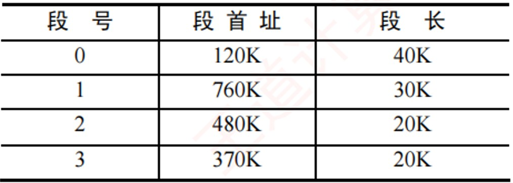
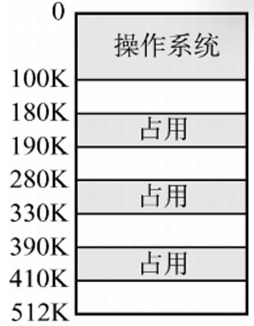
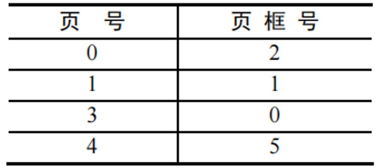
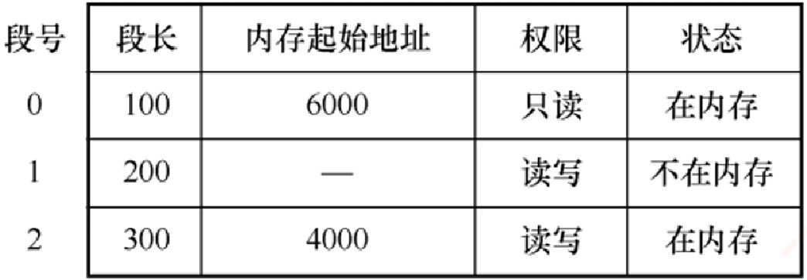
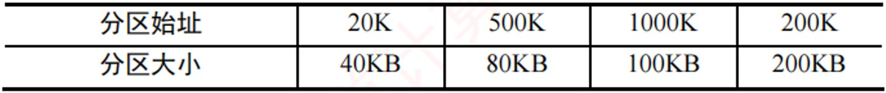
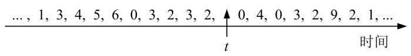
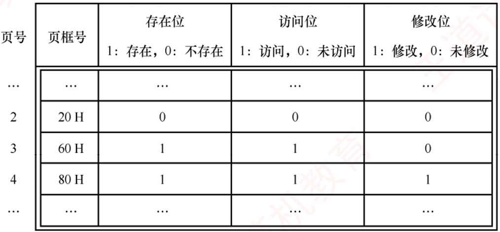

# 《王道操作系统》· 第3章 内存管理（课后选择题全解）

> 本章共包含 2 个小节，共计 135 道精选选择题。

---
## 3.1 内存管理概念
---

### 【WD-OS-C-3.1-T01】第 1 题（P2）

1. 下列关于存储管理目标的说法中,错误的是(
)
A. 为进程分配内存空间
B. 回收被进程释放的内存空间
C. 提高内存的利用率
D. 提高内存的物理存取速度

> **【唯一编号】** `WD-OS-C-3.1-T01`
> **【课程】** 操作系统
> **【章节】** 第3章 内存管理 · 3.1 内存管理概念

---

### 【WD-OS-C-3.1-T02】第 2 题（P2）

2. 下列关于内存保护的描述中,错误的是(
)
A. 一个进程不能未被授权就访问另外一个进程的内存空间
B. 内存保护可以仅通过操作系统(软件) 来满足,不需要处理器(硬件) 的支持
C. 内存保护的方法有界地址保护和上下限地址保护
D. 一个进程不能直接跳转到另一个进程的指令地址中

> **【唯一编号】** `WD-OS-C-3.1-T02`
> **【课程】** 操作系统
> **【章节】** 第3章 内存管理 · 3.1 内存管理概念

---

### 【WD-OS-C-3.1-T03】第 3 题（P2）

3. 内存保护需要由(
) 完成,以保证进程空间不被非法访问。
A. 操作系统
B. 硬件机构
C. 操作系统和硬件机构合作
D. 操作系统或者硬件机构独立完成

> **【唯一编号】** `WD-OS-C-3.1-T03`
> **【课程】** 操作系统
> **【章节】** 第3章 内存管理 · 3.1 内存管理概念

---

### 【WD-OS-C-3.1-T04】第 4 题（P2）

4. 下列各种存储管理方式中,需要硬件地址变换机构的是(
)
I.单一连续分配
II.固定分区分配
III.页式存储管理
IV.动态分区分配
V.页式虚拟存储管理
A. I、III、V
B. II、III、IV
C. III、IV、V
D. II、III、IV、V

> **【唯一编号】** `WD-OS-C-3.1-T04`
> **【课程】** 操作系统
> **【章节】** 第3章 内存管理 · 3.1 内存管理概念

---

### 【WD-OS-C-3.1-T05】第 5 题（P2）

5. 在固定分区分配中,每个分区的大小是(
)
A. 随作业长度变化
B. 可以不同但预先固定
C. 相同
D. 可以不同但根据作业长度固定

> **【唯一编号】** `WD-OS-C-3.1-T05`
> **【课程】** 操作系统
> **【章节】** 第3章 内存管理 · 3.1 内存管理概念

---

### 【WD-OS-C-3.1-T06】第 6 题（P2）

6. 在动态分区分配方案中,某一进程完成后,系统回收其主存空间并与相邻空闲区合并,为此需修改空
闲区表,造成空闲区数减1 的情况是(
)
A. 无上邻空闲区也无下邻空闲区
B. 有上邻空闲区但无下邻空闲区
C. 有下邻空闲区但无上邻空闲区
D. 有上邻空闲区也有下邻空闲区

> **【唯一编号】** `WD-OS-C-3.1-T06`
> **【课程】** 操作系统
> **【章节】** 第3章 内存管理 · 3.1 内存管理概念

---

### 【WD-OS-C-3.1-T07】第 7 题（P58）

7. 设内存的分配情况如下图所示。若要申请一块40KB 的内存空间,采用最佳适应算法,则所得到的
分区首址为(
)
A. 100K
B. 190K
C. 330K
D. 410K

> **【唯一编号】** `WD-OS-C-3.1-T07`
> **【课程】** 操作系统
> **【章节】** 第3章 内存管理 · 3.1 内存管理概念

---

### 【WD-OS-C-3.1-T08】第 8 题（P58）

8. 某分段存储管理系统中,段表内容如下表所示,逻辑地址的格式为(段号,段内偏移),则逻辑地址(2,
154) 对应的物理地址是(
)
A. 120K + 2
B. 480K + 154
C. 30K + 154
D. 480K + 2

> **【唯一编号】** `WD-OS-C-3.1-T08`
> **【课程】** 操作系统
> **【章节】** 第3章 内存管理 · 3.1 内存管理概念

---

### 【WD-OS-C-3.1-T09】第 9 题（P58）

9. 动态重定位是在作业的(
) 中进行的。
A. 编译过程
B. 装入过程
C. 链接过程
D. 执行过程

> **【唯一编号】** `WD-OS-C-3.1-T09`
> **【课程】** 操作系统
> **【章节】** 第3章 内存管理 · 3.1 内存管理概念

---

### 【WD-OS-C-3.1-T10】第 10 题（P58）

10. 下列关于程序装入的动态重定位方式的描述中,错误的是(
)
A. 系统将程序装入内存后,程序在内存中的位置可能发生移动
B. 系统为每个进程分配一个重定位寄存器
C. 被访问单元的物理地址= 逻辑地址+ 重定位寄存器的值
D. 逻辑地址到物理地址的映射过程在进程执行时发生

> **【唯一编号】** `WD-OS-C-3.1-T10`
> **【课程】** 操作系统
> **【章节】** 第3章 内存管理 · 3.1 内存管理概念

---

### 【WD-OS-C-3.1-T11】第 11 题（P58）

11. 动态重定位的过程依赖于(
)
I.可重定位装入程序
II.重定位寄存器
III.地址变换机构
IV.目标程序
A. I 和II
B. II 和III
C. I、II 和III
D. I、II、III 和IV

> **【唯一编号】** `WD-OS-C-3.1-T11`
> **【课程】** 操作系统
> **【章节】** 第3章 内存管理 · 3.1 内存管理概念

---

### 【WD-OS-C-3.1-T12】第 12 题（P59）

12. 为保证一个程序在主存中被改变存放位置后仍能正确执行,应采用(
)
A. 静态重定位
B. 动态重定位
C. 动态分配
D. 静态分配

> **【唯一编号】** `WD-OS-C-3.1-T12`
> **【课程】** 操作系统
> **【章节】** 第3章 内存管理 · 3.1 内存管理概念

---

### 【WD-OS-C-3.1-T13】第 13 题（P59）

13. 下面的存储管理方案中，(
) 方式可以采用静态重定位。
A. 固定分区
B. 可变分区
C. 页式
D. 段式

> **【唯一编号】** `WD-OS-C-3.1-T13`
> **【课程】** 操作系统
> **【章节】** 第3章 内存管理 · 3.1 内存管理概念

---

### 【WD-OS-C-3.1-T14】第 14 题（P59）

14. 对重定位存储管理方式,应(
)
A. 在整个系统中设置一个重定位寄存器
B. 为每道程序设置一个重定位寄存器
C. 为每道程序设置两个重定位寄存器
D. 为每道程序和数据都设置一个重定位寄存器

> **【唯一编号】** `WD-OS-C-3.1-T14`
> **【课程】** 操作系统
> **【章节】** 第3章 内存管理 · 3.1 内存管理概念

---

### 【WD-OS-C-3.1-T15】第 15 题（P59）

15. 在可变分区管理中,采用拼接技术的目的是(
)
A. 合并空闲区
B. 合并分配区
C. 增加主存容量
D. 便于地址转换

> **【唯一编号】** `WD-OS-C-3.1-T15`
> **【课程】** 操作系统
> **【章节】** 第3章 内存管理 · 3.1 内存管理概念

---

### 【WD-OS-C-3.1-T16】第 16 题（P59）

16. 某页式存储管理系统中,按字节编址,页表内容如下表所示。若页的大小为4KB,则地址转换机构
将逻辑地址4097 转换成的物理地址为(
) (地址均用十进制表示)
A. 8192
B. 4097
C. 2049
D. 1025

> **【唯一编号】** `WD-OS-C-3.1-T16`
> **【课程】** 操作系统
> **【章节】** 第3章 内存管理 · 3.1 内存管理概念

---

### 【WD-OS-C-3.1-T17】第 17 题（P59）

17. 不会产生内部碎片的存储管理是(
)
A. 分页式存储管理
B. 分段式存储管理
C. 固定分区式存储管理
D. 段页式存储管理

> **【唯一编号】** `WD-OS-C-3.1-T17`
> **【课程】** 操作系统
> **【章节】** 第3章 内存管理 · 3.1 内存管理概念

---

### 【WD-OS-C-3.1-T18】第 18 题（P59）

18. 多进程在主存中彼此互不干扰的环境下运行,操作系统是通过(
) 来实现的。
A. 内存分配
B. 内存保护
C. 内存扩充
D. 地址映射

> **【唯一编号】** `WD-OS-C-3.1-T18`
> **【课程】** 操作系统
> **【章节】** 第3章 内存管理 · 3.1 内存管理概念

---

### 【WD-OS-C-3.1-T19】第 19 题（P60）

19. 在动态分区分配存储管理中,随着时间的推移,会产生越来越多的小碎片,可通过紧凑技术解决,即
操作系统不时地对进程进行移动和整理,则适合采用(
) 装入技术。
A. 绝对装入
B. 静态重定位
C. 动态重定位
D. 静态重定位和动态重定位

> **【唯一编号】** `WD-OS-C-3.1-T19`
> **【课程】** 操作系统
> **【章节】** 第3章 内存管理 · 3.1 内存管理概念

---

### 【WD-OS-C-3.1-T20】第 20 题（P60）

20. 在动态分区分配存储管理中,不需要对空闲区链进行排序的分配算法是(
)
A. 首次适应法
B. 最佳适应法
C. 最差适应法
D. 都不需要

> **【唯一编号】** `WD-OS-C-3.1-T20`
> **【课程】** 操作系统
> **【章节】** 第3章 内存管理 · 3.1 内存管理概念

---

### 【WD-OS-C-3.1-T21】第 21 题（P60）

21. 分区管理中采用最佳适应分配算法时,把空闲区按(
) 次序登记在空闲区表中。
A. 长度递增
B. 长度递减
C. 地址递增
D. 地址递减

> **【唯一编号】** `WD-OS-C-3.1-T21`
> **【课程】** 操作系统
> **【章节】** 第3章 内存管理 · 3.1 内存管理概念

---

### 【WD-OS-C-3.1-T22】第 22 题（P60）

22. 首次适应算法的空闲分区(
)
A. 按大小递减顺序连在一起
B. 按大小递增顺序连在一起
C. 按地址由小到大排列
D. 按地址由大到小排列

> **【唯一编号】** `WD-OS-C-3.1-T22`
> **【课程】** 操作系统
> **【章节】** 第3章 内存管理 · 3.1 内存管理概念

---

### 【WD-OS-C-3.1-T23】第 23 题（P60）

23. 为了提高搜索空闲分区的速度,在大、中型系统中往往采用基于索引搜索的动态分区分配算法,以
下不属于基于索引搜索的动态分区分配算法的是(
)
A. 快速适应算法
B. 伙伴系统
C. 哈希算法
D. 最佳适应算法

> **【唯一编号】** `WD-OS-C-3.1-T23`
> **【课程】** 操作系统
> **【章节】** 第3章 内存管理 · 3.1 内存管理概念

---

### 【WD-OS-C-3.1-T24】第 24 题（P60）

24. 内存存储管理由连续分配方式发展为页式管理方式的主要动力是(
)
A. 提高内存利用率
B. 提高系统吞叶量
C. 满足用户的需要
D. 更好的满足多道程序的需要

> **【唯一编号】** `WD-OS-C-3.1-T24`
> **【课程】** 操作系统
> **【章节】** 第3章 内存管理 · 3.1 内存管理概念

---

### 【WD-OS-C-3.1-T25】第 25 题（P60）

25. 页式存储管理中的页表是由(
) 建立的。
A. 编译程序
B. 用户程序
C. 链接程序
D. 操作系统

> **【唯一编号】** `WD-OS-C-3.1-T25`
> **【课程】** 操作系统
> **【章节】** 第3章 内存管理 · 3.1 内存管理概念

---

### 【WD-OS-C-3.1-T26】第 26 题（P61）

26. 在段式存储管理中,共享段表是用来实现(
) 的。
A. 多个进程共享同一段代码或数据
B. 多个进程共享同一段物理内存空间
C. 多个进程共享同一段逻辑地址空间
D. 多个进程共享同一段号

> **【唯一编号】** `WD-OS-C-3.1-T26`
> **【课程】** 操作系统
> **【章节】** 第3章 内存管理 · 3.1 内存管理概念

---

### 【WD-OS-C-3.1-T27】第 27 题（P61）

27. 在段式存储管理中, 若一个进程有n 个段, 则该进程需要(
) 个段表。
A. n
B. n + 1
C. 1
D. 2

> **【唯一编号】** `WD-OS-C-3.1-T27`
> **【课程】** 操作系统
> **【章节】** 第3章 内存管理 · 3.1 内存管理概念

---

### 【WD-OS-C-3.1-T28】第 28 题（P61）

28. 采用分页或分段管理后,提供给用户的物理地址空间(
)
A. 分页支持更大的物理地址空间
B. 分段支持更大的物理地址空间
C. 不能确定
D. 一样大

> **【唯一编号】** `WD-OS-C-3.1-T28`
> **【课程】** 操作系统
> **【章节】** 第3章 内存管理 · 3.1 内存管理概念

---

### 【WD-OS-C-3.1-T29】第 29 题（P61）

29. 分页系统中的页面是为(
)
A. 用户所感知的
B. 操作系统所感知的
C. 编译系统所感知的
D. 连接装配程序所感知的

> **【唯一编号】** `WD-OS-C-3.1-T29`
> **【课程】** 操作系统
> **【章节】** 第3章 内存管理 · 3.1 内存管理概念

---

### 【WD-OS-C-3.1-T30】第 30 题（P61）

30. 在页式存储管理中,页表的始地址存放在(
) 中。
A. 物理内存
B. 页表
C. 快表(TLB)
D. 页表寄存器

> **【唯一编号】** `WD-OS-C-3.1-T30`
> **【课程】** 操作系统
> **【章节】** 第3章 内存管理 · 3.1 内存管理概念

---

### 【WD-OS-C-3.1-T31】第 31 题（P61）

31. 在页式存储管理中,当CPU 形成一个有效地址时,查找页表的工作是由(
) 实现的。
A. 操作系统
B. 页表查询程序
C. 硬件
D. 存储管理进程

> **【唯一编号】** `WD-OS-C-3.1-T31`
> **【课程】** 操作系统
> **【章节】** 第3章 内存管理 · 3.1 内存管理概念

---

### 【WD-OS-C-3.1-T32】第 32 题（P61）

32. 采用段式存储管理时，一个程序如何分段是在(
) 时决定的。
A. 分配主存
B. 用户编程
C. 装作业
D. 程序执行

> **【唯一编号】** `WD-OS-C-3.1-T32`
> **【课程】** 操作系统
> **【章节】** 第3章 内存管理 · 3.1 内存管理概念

---

### 【WD-OS-C-3.1-T33】第 33 题（P61）

33. 下面的(
) 方法有利于程序的动态链接。
A. 分段存储管理
B. 分页存储管理
C. 可变式分区管理
D. 固定式分区管理

> **【唯一编号】** `WD-OS-C-3.1-T33`
> **【课程】** 操作系统
> **【章节】** 第3章 内存管理 · 3.1 内存管理概念

---

### 【WD-OS-C-3.1-T34】第 34 题（P62）

34. 当前编程人员编写好的程序经过编译转换成目标文件后,各条指令的地址编号起始一般定为( )，
称为(
) 地址。
A. 1
B. 0
C. IP
D. CS
A. 绝对
B. 名义
C. 逻辑
D. 实

> **【唯一编号】** `WD-OS-C-3.1-T34`
> **【课程】** 操作系统
> **【章节】** 第3章 内存管理 · 3.1 内存管理概念

---

### 【WD-OS-C-3.1-T35】第 35 题（P62）

35. 可重入程序是通过(
) 方法来改善系统性能的。
A. 改变时间片长度
B. 改变用户数
C. 提高对换速度
D. 减少对换数量

> **【唯一编号】** `WD-OS-C-3.1-T35`
> **【课程】** 操作系统
> **【章节】** 第3章 内存管理 · 3.1 内存管理概念

---

### 【WD-OS-C-3.1-T36】第 36 题（P62）

36. 操作系统实现(
) 存储管理的代价最小。
A. 分区
B. 分页
C. 分段
D. 段页式

> **【唯一编号】** `WD-OS-C-3.1-T36`
> **【课程】** 操作系统
> **【章节】** 第3章 内存管理 · 3.1 内存管理概念

---

### 【WD-OS-C-3.1-T37】第 37 题（P62）

37. 动态分区又称可变式分区,它是系统运行过程中(
) 动态建立的。
A. 在作业装入时
B. 在作业创建时
C. 在作业完成时
D. 在作业未装入时

> **【唯一编号】** `WD-OS-C-3.1-T37`
> **【课程】** 操作系统
> **【章节】** 第3章 内存管理 · 3.1 内存管理概念

---

### 【WD-OS-C-3.1-T38】第 38 题（P62）

38. 在页式存储管理中选择页面的大小,需要考虑下列(
) 因素。
I.页面大的好处是页表比较少
II.页面小的好处走可以减少由内碎片引起的内存浪费
III.影响磁盘访问时间的主要因素通常不是页面大小,所以使用时优先考虑较大的页面
A. I 和III
B. II 和III
C. I 和II
D. I、II 和III

> **【唯一编号】** `WD-OS-C-3.1-T38`
> **【课程】** 操作系统
> **【章节】** 第3章 内存管理 · 3.1 内存管理概念

---

### 【WD-OS-C-3.1-T39】第 39 题（P62）

39. 某个操作系统对内存的管理采用页式存储管理方法,所划分的页面大小(
)
A. 要根据内存大小确定
B. 必须相同
C. 要根据CPU 的地址结构确定
D. 要依据外存和内存的大小确定

> **【唯一编号】** `WD-OS-C-3.1-T39`
> **【课程】** 操作系统
> **【章节】** 第3章 内存管理 · 3.1 内存管理概念

---

### 【WD-OS-C-3.1-T40】第 40 题（P62）

40. 引入段式存储管理方式,主要是为了更好地满足用户的一系列要求。下面选项中不属于这一系列
要求的是(
)
A. 提高内存利用率
B. 方便编程
C. 共享和保护
D. 动态链接和增长

> **【唯一编号】** `WD-OS-C-3.1-T40`
> **【课程】** 操作系统
> **【章节】** 第3章 内存管理 · 3.1 内存管理概念

---

### 【WD-OS-C-3.1-T41】第 41 题（P63）

41. 对主存储器的访问，(
)
A. 以块(页) 或段为单位
B. 以字节或字为单位
C. 随存储器的管理方案不同而异
D. 以用户的逻辑记录为单位

> **【唯一编号】** `WD-OS-C-3.1-T41`
> **【课程】** 操作系统
> **【章节】** 第3章 内存管理 · 3.1 内存管理概念

---

### 【WD-OS-C-3.1-T42】第 42 题（P63）

42. 以下存储管理方式中,不适合多道程序设计系统的是(
)
A. 单用户连续分配
B. 固定式分区分配
C. 可变式分区分配
D. 分页式存储管理方式

> **【唯一编号】** `WD-OS-C-3.1-T42`
> **【课程】** 操作系统
> **【章节】** 第3章 内存管理 · 3.1 内存管理概念

---

### 【WD-OS-C-3.1-T43】第 43 题（P63）

43. 在分页存储管理中, 主存的分配(
)
A. 以页框为单位进行
B. 以作业的大小进行
C. 以物理段进行
D. 以逻辑记录大小进行

> **【唯一编号】** `WD-OS-C-3.1-T43`
> **【课程】** 操作系统
> **【章节】** 第3章 内存管理 · 3.1 内存管理概念

---

### 【WD-OS-C-3.1-T44】第 44 题（P63）

44. 在段式分配中，CPU 每次从内存中取一次数据需要(
) 次访问内存。
A. 1
B. 3
C. 2
D. 4

> **【唯一编号】** `WD-OS-C-3.1-T44`
> **【课程】** 操作系统
> **【章节】** 第3章 内存管理 · 3.1 内存管理概念

---

### 【WD-OS-C-3.1-T45】第 45 题（P63）

45. 在段页式分配中，CPU 每次从内存中取一次数据需要(
) 次访问内存。
A. 1
B. 3
C. 2
D. 4

> **【唯一编号】** `WD-OS-C-3.1-T45`
> **【课程】** 操作系统
> **【章节】** 第3章 内存管理 · 3.1 内存管理概念

---

### 【WD-OS-C-3.1-T46】第 46 题（P63）

46. 采用段页式存储管理时,内存地址结构是(
)
A. 线性的
B. 二维的
C. 三维的
D. 四维的

> **【唯一编号】** `WD-OS-C-3.1-T46`
> **【课程】** 操作系统
> **【章节】** 第3章 内存管理 · 3.1 内存管理概念

---

### 【WD-OS-C-3.1-T47】第 47 题（P63）

47. 在段页式存储管理中，地址映射表是(
)
A. 每个进程一张段表,两张页表
B. 每个进程的每个段一张段表,一张页表
C. 每个进程一张段表,每个段一张页表
D. 每个进程一张页表,每个段一张段表

> **【唯一编号】** `WD-OS-C-3.1-T47`
> **【课程】** 操作系统
> **【章节】** 第3章 内存管理 · 3.1 内存管理概念

---

### 【WD-OS-C-3.1-T48】第 48 题（P64）

48. 操作系统采用分页存储管理方式,要求(
)
A. 每个进程拥有一张页表,且进程的页表驻留在内存中
B. 每个进程拥有一张页表,但只有执行进程的页表驻留在内存中
C. 所有进程共享一张页表,以节约有限的内存空间,但页表必须驻留在内存中
D. 所有进程共享一张页表,只有页表中当前使用的页面必须驻留在内存中,以最大限度地节省有限
的内存空间

> **【唯一编号】** `WD-OS-C-3.1-T48`
> **【课程】** 操作系统
> **【章节】** 第3章 内存管理 · 3.1 内存管理概念

---

### 【WD-OS-C-3.1-T49】第 49 题（P64）

49. 在分段存储管理方式中，(
)
A. 以段为单位，每段是一个连续存储区
B. 段与段之间必定不连续
C. 段与段之间必定连续
D. 每段是等长的

> **【唯一编号】** `WD-OS-C-3.1-T49`
> **【课程】** 操作系统
> **【章节】** 第3章 内存管理 · 3.1 内存管理概念

---

### 【WD-OS-C-3.1-T50】第 50 题（P64）

50. 下列关于段式存储管理的叙述中,错误的是(
)
A. 段是逻辑结构上相对独立的程序块,因此段是可变长的
B. 按程序中实际的段来分配主存,所以分配后的存储块是可变长的
C. 每个段表项必须记录对应段在主存的起始位置和段的长度
D. 分段方式对低级语言程序员和编译器来说是透明的

> **【唯一编号】** `WD-OS-C-3.1-T50`
> **【课程】** 操作系统
> **【章节】** 第3章 内存管理 · 3.1 内存管理概念

---

### 【WD-OS-C-3.1-T51】第 51 题（P64）

51. 段页式存储管理汲取了页式管理和段式管理的长处,其实现原理结合了页式和段式管理的基本思
想,即(
)
A. 用分段方法来分配和管理物理存储空间,用分页方法来管理用户地址空间
B. 用分段方法来分配和管理用户地址空间,用分页方法来管理物理存储空间
C. 用分段方法来分配和管理主存空间,用分页方法来管理辅存空间
D. 用分段方法来分配和管理辅存空间,用分页方法来管理主存空间

> **【唯一编号】** `WD-OS-C-3.1-T51`
> **【课程】** 操作系统
> **【章节】** 第3章 内存管理 · 3.1 内存管理概念

---

### 【WD-OS-C-3.1-T52】第 52 题（P64）

52. 以下存储管理方式中,会产生内部碎片的是(
)
I.分段虚拟存储管理
II.分页虚拟存储管理
III.段页式分区管理
IV.固定式分区管理
A. I、II、III
B. III、IV
C. 仅II
D. II、III、IV

> **【唯一编号】** `WD-OS-C-3.1-T52`
> **【课程】** 操作系统
> **【章节】** 第3章 内存管理 · 3.1 内存管理概念

---

### 【WD-OS-C-3.1-T53】第 53 题（P65）

53. 下列关于页式存储管理的论述中,正确的是(
)
I.若关闭TLB,则每取一条指令或一个操作数都至少要访存2 次
II.页式存储管理不会产生内部碎片
III.页式存储管理中的页面是为用户所感知的
IV.页式存储方式可以采用静态重定位
A. I、II、IV
B. I、IV
C. 仅I
D. 全都正确

> **【唯一编号】** `WD-OS-C-3.1-T53`
> **【课程】** 操作系统
> **【章节】** 第3章 内存管理 · 3.1 内存管理概念

---

### 【WD-OS-C-3.1-T54】第 54 题（P65）

54. 在某分页存储管理的系统中, 地址结构长18 位, 其中11 ∼17 位为页号, 0 ∼10 位为页内偏移量,则
主存的最大容量为(
)KB，主存可分为(
) 个页。若有一作业依次放入2、3、7 号物理块，相对
地址1500 处有一条指令“storer1, 2500”,该指令地址所在页的页号为0,则指令的物理地址为(
)，指
令数据的存储地址所在页的页框号为(
)
A. 256、256、5596、3
B. 256、128、5596、3
C. 256、128、5596、7
D. 256、128、3548、7

> **【唯一编号】** `WD-OS-C-3.1-T54`
> **【课程】** 操作系统
> **【章节】** 第3章 内存管理 · 3.1 内存管理概念

---

### 【WD-OS-C-3.1-T55】第 55 题（P65）

55. 在某页式存储管理的系统中, 主存容量为1MB, 被分成256 个页框, 页框号为0,1,2, ⋯,255。某作
业的地址空间占用4 页,其页号为0, 1, 2, 3,被分配到主存的第2,4,1,5 号页框中,则作业中的2 号页在
主存中的始址是(
)
A. 1
B. 1024
C. 2048
D. 4096

> **【唯一编号】** `WD-OS-C-3.1-T55`
> **【课程】** 操作系统
> **【章节】** 第3章 内存管理 · 3.1 内存管理概念

---

### 【WD-OS-C-3.1-T56】第 56 题（P65）

56. 下列关于分页和分段的描述中,正确的是(
)
A. 分段是信息的逻辑单位,段长由系统决定
B. 引入分段的主要目的是实现离散分配并提高内存利用率
C. 分页是信息的物理单位,页长由用户决定
D. 页面在物理内存中只能从页面大小的整数倍地址开始存放

> **【唯一编号】** `WD-OS-C-3.1-T56`
> **【课程】** 操作系统
> **【章节】** 第3章 内存管理 · 3.1 内存管理概念

---

### 【WD-OS-C-3.1-T57】第 57 题（P65）

57. 在采用页式存储管理的系统中, 逻辑地址空间大小为256TB, 页表项大小为8B, 页面大小为4KB,
则该系统中的页表应该采用(
) 级页表。
A. 2
B. 3
C. 4
D. 5

> **【唯一编号】** `WD-OS-C-3.1-T57`
> **【课程】** 操作系统
> **【章节】** 第3章 内存管理 · 3.1 内存管理概念

---

### 【WD-OS-C-3.1-T58】第 58 题（P66）

58. 若对经典的页式存储管理方式的页表做出稍微改造,允许不同页表的页表项指向同一个页帧,则可
能的结果有(
)
I.可以实现对可重入代码的共享
II.只需修改页表项,就能实现内存“复制”操作
III.容易发生越界访问
IV.可以实现进程间通信
A. I、II、IV
B. II、III
C. I、II、III
D. 仅I

> **【唯一编号】** `WD-OS-C-3.1-T58`
> **【课程】** 操作系统
> **【章节】** 第3章 内存管理 · 3.1 内存管理概念

---

### 【WD-OS-C-3.1-T59】第 59 题（P66）

59.【2009 统考真题】分区分配内存管理方式的主要保护措施是(
)
A. 界地址保护
B. 程序代码保护
C. 数据保护
D. 栈保护

> **【唯一编号】** `WD-OS-C-3.1-T59`
> **【课程】** 操作系统
> **【章节】** 第3章 内存管理 · 3.1 内存管理概念

---

### 【WD-OS-C-3.1-T60】第 60 题（P66）

60.【2009 统考真题】一个分段存储管理系统中,地址长度为32 位,其中段号占8 位,则最大段长是(
)
A. 28B
B. 216B
C. 224B
D. 232B

> **【唯一编号】** `WD-OS-C-3.1-T60`
> **【课程】** 操作系统
> **【章节】** 第3章 内存管理 · 3.1 内存管理概念

---

### 【WD-OS-C-3.1-T61】第 61 题（P66）

61.【2010 统考真题】某基于动态分区存储管理的计算机,其主存容量为55MB(初始为空),采用最佳
适配(BestFit) 算法,分配和释放的顺序为: 分配15MB,分配30MB,释放15MB,分配8MB,分配6MB,此
时主存中最大空闲分区的大小是(
)
A. 7MB
B. 9MB
C. 10MB
D. 15MB

> **【唯一编号】** `WD-OS-C-3.1-T61`
> **【课程】** 操作系统
> **【章节】** 第3章 内存管理 · 3.1 内存管理概念

---

### 【WD-OS-C-3.1-T62】第 62 题（P66）

62.【2010 统考真题】某计算机采用二级页表的分页存储管理方式, 按字节编址, 页大小为210B, 页表
项大小为2B, 逻辑地址结构为
页目录号
页号
页内偏移量
逻辑地址空间大小为216 页, 则表示整个逻辑地址空间的页目录表中包含表项的个数至少是(
)
A. 64
B. 128
C. 256
D. 512

> **【唯一编号】** `WD-OS-C-3.1-T62`
> **【课程】** 操作系统
> **【章节】** 第3章 内存管理 · 3.1 内存管理概念

---

### 【WD-OS-C-3.1-T63】第 63 题（P66）

63.【2011 统考真题】在虚拟内存管理中,地址变换机构将逻辑地址变换为物理地址,形成该逻辑地址
的阶段是(
)
A. 编辑
B. 编译
C. 链接
D. 装载

> **【唯一编号】** `WD-OS-C-3.1-T63`
> **【课程】** 操作系统
> **【章节】** 第3章 内存管理 · 3.1 内存管理概念

---

### 【WD-OS-C-3.1-T64】第 64 题（P67）

64.【2014 统考真题】下列选项中,属于多级页表优点的是(
)
A. 加快地址变换速度
B. 减少缺页中断次数
C. 减少页表项所占字节数
D. 减少页表所占的连续内存空间

> **【唯一编号】** `WD-OS-C-3.1-T64`
> **【课程】** 操作系统
> **【章节】** 第3章 内存管理 · 3.1 内存管理概念

---

### 【WD-OS-C-3.1-T65】第 65 题（P67）

65.【2016 统考真题】某进程的段表内容如下所示。
访问段号为2、段内地址为400 的逻辑地址时,进行地址转换的结果是(
)
A. 段缺失异常
B. 得到内存地址4400
C. 越权异常
D. 越界异常

> **【唯一编号】** `WD-OS-C-3.1-T65`
> **【课程】** 操作系统
> **【章节】** 第3章 内存管理 · 3.1 内存管理概念

---

### 【WD-OS-C-3.1-T66】第 66 题（P67）

66.【2017 统考真题】某计算机按字节编址,其动态分区内存管理采用最佳适应算法,每次分配和回收
内存后都对空闲分区链重新排序。当前空闲分区信息如下表所示。
回收起始地址为60K、大小为140KB 的分区后, 系统中空闲分区的数量、空闲分区链第一个分区的
起始地址和大小分别是(
)
A. 3、20K、380KB
B. 3、500K、80KB
C. 4、20K、180KB
D. 4、500K、80KB

> **【唯一编号】** `WD-OS-C-3.1-T66`
> **【课程】** 操作系统
> **【章节】** 第3章 内存管理 · 3.1 内存管理概念

---

### 【WD-OS-C-3.1-T67】第 67 题（P67）

67.【2019 统考真题】在分段存储管理系统中, 用共享段表描述所有被共享的段。若进程P1 和P2 共
享段S，则下列叙述中，错误的是(
)
A. 在物理内存中仅保存一份段S 的内容
B. 段S 在P1 和P2 中应该具有相同的段号
C. P1 和P2 共享段S 在共享段表中的段表项
D. P1 和P2 都不再使用段S 时才回收段S 所占的内存空间

> **【唯一编号】** `WD-OS-C-3.1-T67`
> **【课程】** 操作系统
> **【章节】** 第3章 内存管理 · 3.1 内存管理概念

---

### 【WD-OS-C-3.1-T68】第 68 题（P68）

68.【2019 统考真题】某计算机主存按字节编址,采用二级分页存储管理,地址结构如下:
页目录号(10 位)
页号(10 位)
页内偏移(12 位)
虚拟地址2050 1225H 对应的页目录号、页号分别是(
)
A. 081H,101H
B. 081H,401H
C. 201H, 101H
D. 201H, 401H

> **【唯一编号】** `WD-OS-C-3.1-T68`
> **【课程】** 操作系统
> **【章节】** 第3章 内存管理 · 3.1 内存管理概念

---

### 【WD-OS-C-3.1-T69】第 69 题（P68）

69.【2019 统考真题】在下列动态分区分配算法中,最容易产生内存碎片的是(
)
A. 首次适应算法
B. 最坏适应算法
C. 最佳适应算法
D. 循环首次适应算法

> **【唯一编号】** `WD-OS-C-3.1-T69`
> **【课程】** 操作系统
> **【章节】** 第3章 内存管理 · 3.1 内存管理概念

---

### 【WD-OS-C-3.1-T70】第 70 题（P68）

70.【2021 统考真题】在采用二级页表的分页系统中，CPU 页表基址寄存器中的内容是(
)
A. 当前进程的一级页表的起始虚拟地址
B. 当前进程的一级页表的起始物理地址
C. 当前进程的二级页表的起始虚拟地址
D. 当前进程的二级页表的起始物理地址

> **【唯一编号】** `WD-OS-C-3.1-T70`
> **【课程】** 操作系统
> **【章节】** 第3章 内存管理 · 3.1 内存管理概念

---

### 【WD-OS-C-3.1-T71】第 71 题（P68）

71.【2023 统考真题】进程R 和S 共享数据data, 若data 在R 和S 中所在页的页号分别为p1 和p2,两
个页所对应的页框号分别为f 1 和f 2，则下列叙述中，正确的是(
)
A. p1 和p2 一定相等，f 1 和f 2 一定相等
B. p1 和p2 一定相等，f 1 和f 2 不一定相等
C. p1 和p2 不一定相等, f 1 和f 2 一定相等
D. p1 和p2 不一定相等, f 1 和f 2 不一定相等

> **【唯一编号】** `WD-OS-C-3.1-T71`
> **【课程】** 操作系统
> **【章节】** 第3章 内存管理 · 3.1 内存管理概念

---

### 【WD-OS-C-3.1-T72】第 72 题（P68）

72.【2024 统考真题】下列算法中,每次回收分区时仅合并大小相等的空闲分区的是(
)
A. 伙伴算法
B. 最佳适应算法
C. 最坏适应算法
D. 首次适应算法

> **【唯一编号】** `WD-OS-C-3.1-T72`
> **【课程】** 操作系统
> **【章节】** 第3章 内存管理 · 3.1 内存管理概念

---
## 3.2 虚拟内存管理
---

### 【WD-OS-C-3.2-T01】第 1 题（P2）

1. 下列关于存储管理的叙述中,正确的是(
)
A. 存储保护的目的是限制内存的分配
B. 在内存为M、有N 个用户的分时系统中, 每个用户占用M/N 的内存空间
C. 在虚拟内存系统中,只要磁盘空间无限大,作业就能拥有任意大的编址空间
D. 实现虚拟内存管理必须有相应硬件的支持

> **【唯一编号】** `WD-OS-C-3.2-T01`
> **【课程】** 操作系统
> **【章节】** 第3章 内存管理 · 3.2 虚拟内存管理

---

### 【WD-OS-C-3.2-T02】第 2 题（P69）

2. 请求分页存储管理中,若把页面尺寸增大一倍而且可容纳的最大页数不变,则在程序顺序执行时缺
页中断次数会(
)
A. 增加
B. 减少
C. 不变
D. 可能增加也可能减少

> **【唯一编号】** `WD-OS-C-3.2-T02`
> **【课程】** 操作系统
> **【章节】** 第3章 内存管理 · 3.2 虚拟内存管理

---

### 【WD-OS-C-3.2-T03】第 3 题（P69）

3. 进程在执行中发生了缺页中断，经操作系统处理后，应让其执行(
) 指令。
A. 被中断的前一条
B. 被中断的那一条
C. 被中断的后一条
D. 启动时的第一条

> **【唯一编号】** `WD-OS-C-3.2-T03`
> **【课程】** 操作系统
> **【章节】** 第3章 内存管理 · 3.2 虚拟内存管理

---

### 【WD-OS-C-3.2-T04】第 4 题（P69）

4. 虚拟存储技术是(
)
A. 补充内存物理空间的技术
B. 补充内存逻辑空间的技术
C. 补充外存空间的技术
D. 扩充输入/ 输出缓冲区的技术

> **【唯一编号】** `WD-OS-C-3.2-T04`
> **【课程】** 操作系统
> **【章节】** 第3章 内存管理 · 3.2 虚拟内存管理

---

### 【WD-OS-C-3.2-T05】第 5 题（P69）

5. 下列关于虚拟存储器的论述中, 正确的是(
)
A. 作业在运行前，必须全部装入内存，且在运行过程中也一直驻留内存
B. 作业在运行前，不必全部装入内存，且在运行过程中也不必一直驻留内存
C. 作业在运行前，不必全部装入内存，但在运行过程中必须一直驻留内存
D. 作业在运行前，必须全部装入内存，但在运行过程中不必一直驻留内存

> **【唯一编号】** `WD-OS-C-3.2-T05`
> **【课程】** 操作系统
> **【章节】** 第3章 内存管理 · 3.2 虚拟内存管理

---

### 【WD-OS-C-3.2-T06】第 6 题（P69）

6. 以下不属于虚拟内存特征的是(
)
A. 一次性
B. 多次性
C. 对换性
D. 离散性

> **【唯一编号】** `WD-OS-C-3.2-T06`
> **【课程】** 操作系统
> **【章节】** 第3章 内存管理 · 3.2 虚拟内存管理

---

### 【WD-OS-C-3.2-T07】第 7 题（P69）

7. 为使虚存系统有效地发挥其预期的作用,所运行的程序应具有的特性是(
)
A. 该程序不应含有过多的I/O 操作
B. 该程序的大小不应超过实际的内存容量
C. 该程序应具有较好的局部性
D. 该程序的指令相关性不应过多

> **【唯一编号】** `WD-OS-C-3.2-T07`
> **【课程】** 操作系统
> **【章节】** 第3章 内存管理 · 3.2 虚拟内存管理

---

### 【WD-OS-C-3.2-T08】第 8 题（P69）

8. (
) 是请求分页存储管理方式和基本分页存储管理方式的区别。
A. 地址重定向
B. 不必将作业全部装入内存
C. 采用快表技术
D. 不必将作业装入连续区域

> **【唯一编号】** `WD-OS-C-3.2-T08`
> **【课程】** 操作系统
> **【章节】** 第3章 内存管理 · 3.2 虚拟内存管理

---

### 【WD-OS-C-3.2-T09】第 9 题（P70）

9. 通常所说的“存储保护”的基本含义是(
)
A. 防止存储器硬件受损
B. 防止程序在内存丢失
C. 防止程序间相互越界访问
D. 防止程序源码被人偷窃

> **【唯一编号】** `WD-OS-C-3.2-T09`
> **【课程】** 操作系统
> **【章节】** 第3章 内存管理 · 3.2 虚拟内存管理

---

### 【WD-OS-C-3.2-T10】第 10 题（P70）

10. 在页式虚拟存储管理中,程序的链接方式必然是(
)
A. 静态链接
B. 装入时动态链接
C. 运行时动态链接
D. 不确定哪种链接方式

> **【唯一编号】** `WD-OS-C-3.2-T10`
> **【课程】** 操作系统
> **【章节】** 第3章 内存管理 · 3.2 虚拟内存管理

---

### 【WD-OS-C-3.2-T11】第 11 题（P70）

11. 虚拟地址指的是(
)
A. 程序访问内存时使用的地址
B. 访问内存总线上的地址
C. 内存与磁盘交换数据时使用的地址
D. 寄存器的地址

> **【唯一编号】** `WD-OS-C-3.2-T11`
> **【课程】** 操作系统
> **【章节】** 第3章 内存管理 · 3.2 虚拟内存管理

---

### 【WD-OS-C-3.2-T12】第 12 题（P70）

12. 在采用页式虚拟存储管理和固定分配局部置换策略的系统中,数组采用行优先存储,页框大小为
512B。某个进程中有如下代码段(该代码段已提前读入内存):
int a[128][128];
for(int i=0;i<128;i++)
for(int j=0;j<128;j++)
a[j][i]=0;
系统为该进程分配的数据区只有1 个页框,则执行该代码会发生(
) 次缺页中断。
A. 1
B. 2
C. 128
D. 16384

> **【唯一编号】** `WD-OS-C-3.2-T12`
> **【课程】** 操作系统
> **【章节】** 第3章 内存管理 · 3.2 虚拟内存管理

---

### 【WD-OS-C-3.2-T13】第 13 题（P70）

13. 假设某个进程分配有4 个页框,每个页框大小为128 个字(一个整数占一个字)。进程的代码段正
好可以存放在一页中,而且总是占用0 号页框。数据会在其他3 个页框中换进或换出。数组X 为按行
优先存储，则执行该进程会发生(
) 次缺页中断。
int X[64][64];
for(int j=0;j<64;j++)
for(int i=0;i<64;i++)
X[i][j]=0;
A. 32
B. 1024
C. 2048
D. 其他都不对

> **【唯一编号】** `WD-OS-C-3.2-T13`
> **【课程】** 操作系统
> **【章节】** 第3章 内存管理 · 3.2 虚拟内存管理

---

### 【WD-OS-C-3.2-T14】第 14 题（P71）

14. 在配置了TLB 的页式虚拟存储管理的系统中,假设TLB 的命中率约为75%,忽略访问TLB 的时间，
并且使用二级页表，则每次存取的平均访存次数是(
)
A. 1.25
B. 1.5
C. 1.75
D. 2

> **【唯一编号】** `WD-OS-C-3.2-T14`
> **【课程】** 操作系统
> **【章节】** 第3章 内存管理 · 3.2 虚拟内存管理

---

### 【WD-OS-C-3.2-T15】第 15 题（P71）

15. 下面关于请求页式系统的页面调度算法中,说法错误的是(
)
A. 一个好的页面调度算法应减少和避免抖动现象
B. FIFO 算法实现简单,选择最先进入主存储器的页面调出
C. LRU 算法基于局部性原理,首先调出最近一段时间内最长时间未被访问过的页面
D. CLOCK 算法首先调出一段时间内被访问次数多的页面

> **【唯一编号】** `WD-OS-C-3.2-T15`
> **【课程】** 操作系统
> **【章节】** 第3章 内存管理 · 3.2 虚拟内存管理

---

### 【WD-OS-C-3.2-T16】第 16 题（P71）

16. 考虑页面置换算法, 系统有m 个物理块供调度, 初始时全空, 页面引用串长度为p, 包含了n 个不
同的页号，无论用什么算法，缺页次数不会少于(
)
A. m
B. p
C. n
D. min m,n

> **【唯一编号】** `WD-OS-C-3.2-T16`
> **【课程】** 操作系统
> **【章节】** 第3章 内存管理 · 3.2 虚拟内存管理

---

### 【WD-OS-C-3.2-T17】第 17 题（P71）

17. 在请求分页存储管理中,若采用FIFO 页面淘汰算法,则当可供分配的页帧数增加时,缺页中断的次
数(
)
A. 减少
B. 增加
C. 无影响
D. 可能增加也可能减少

> **【唯一编号】** `WD-OS-C-3.2-T17`
> **【课程】** 操作系统
> **【章节】** 第3章 内存管理 · 3.2 虚拟内存管理

---

### 【WD-OS-C-3.2-T18】第 18 题（P71）

18. 设主存容量为1MB, 外存容量为400MB, 计算机系统的地址寄存器有32 位, 那么虚拟存储器的最
大容量是(
)
A. 1MB
B. 401MB
C. 1MB + 232MB
D. 232B

> **【唯一编号】** `WD-OS-C-3.2-T18`
> **【课程】** 操作系统
> **【章节】** 第3章 内存管理 · 3.2 虚拟内存管理

---

### 【WD-OS-C-3.2-T19】第 19 题（P71）

19. 一台机器有32 位虚拟地址和16 位物理地址,若页面大小为512B,采用单级页表,则页表共有(
)
个页表项。
A. 27
B. 216
C. 223
D. 232

> **【唯一编号】** `WD-OS-C-3.2-T19`
> **【课程】** 操作系统
> **【章节】** 第3章 内存管理 · 3.2 虚拟内存管理

---

### 【WD-OS-C-3.2-T20】第 20 题（P71）

20. 在某分页存储管理的系统中, 逻辑地址为16 位, 页面大小为1KB, 第0,1,2,3 号页依次存放在3,7,
11,10 号页框中, 则逻辑地址0A6FH 对应的物理地址为(
)
A. 1E6FH
B. 2E6FH
C. DE6FH
D. EE6FH

> **【唯一编号】** `WD-OS-C-3.2-T20`
> **【课程】** 操作系统
> **【章节】** 第3章 内存管理 · 3.2 虚拟内存管理

---

### 【WD-OS-C-3.2-T21】第 21 题（P72）

21. 在决定页面大小时，选择较小的页面是为了减少(
)
A. 页表大小
B. 缺页次数
C. I/O 开销
D. 页内碎片

> **【唯一编号】** `WD-OS-C-3.2-T21`
> **【课程】** 操作系统
> **【章节】** 第3章 内存管理 · 3.2 虚拟内存管理

---

### 【WD-OS-C-3.2-T22】第 22 题（P72）

22. 某虚拟存储器系统采用页式内存管理,使用LRU 页面替换算法,考虑页面访问地址序列1, 8, 1,7,8,
2,7,2,1,8,3,8,2,1,3,1,7,1,3,7。假定内存容量为4 个页面, 开始时是空的, 则页面失效次数是(
)
A. 4
B. 5
C. 6
D. 7

> **【唯一编号】** `WD-OS-C-3.2-T22`
> **【课程】** 操作系统
> **【章节】** 第3章 内存管理 · 3.2 虚拟内存管理

---

### 【WD-OS-C-3.2-T23】第 23 题（P72）

23. LRU 页面置换算法软件实现开销高的直接原因是(
)
A. 需要硬件的特殊支持
B. 需要特殊的中断处理程序
C. 需要在页表中标明特殊的页类型
D. 需维护访问历史并遍历查找

> **【唯一编号】** `WD-OS-C-3.2-T23`
> **【课程】** 操作系统
> **【章节】** 第3章 内存管理 · 3.2 虚拟内存管理

---

### 【WD-OS-C-3.2-T24】第 24 题（P72）

24. 在虚拟存储器系统的页表项中,决定是否会发生页故障的是(
)
A. 有效位
B. 修改位
C. 页类型
D. 保护码

> **【唯一编号】** `WD-OS-C-3.2-T24`
> **【课程】** 操作系统
> **【章节】** 第3章 内存管理 · 3.2 虚拟内存管理

---

### 【WD-OS-C-3.2-T25】第 25 题（P72）

25. 在页面置换策略中，(
) 策略可能引起抖动
A. FIFO
B. LRU
C. 没有一种
D. 所有

> **【唯一编号】** `WD-OS-C-3.2-T25`
> **【课程】** 操作系统
> **【章节】** 第3章 内存管理 · 3.2 虚拟内存管理

---

### 【WD-OS-C-3.2-T26】第 26 题（P72）

26. 虚拟存储管理系统的基础是程序的(
) 理论。
A. 动态性
B. 虚拟性
C. 局部性
D. 全局性

> **【唯一编号】** `WD-OS-C-3.2-T26`
> **【课程】** 操作系统
> **【章节】** 第3章 内存管理 · 3.2 虚拟内存管理

---

### 【WD-OS-C-3.2-T27】第 27 题（P72）

27. 请求分页存储管理的主要特点是(
)
A. 消除了页内零头
B. 扩充了内存
C. 便于动态链接
D. 便于信息共享

> **【唯一编号】** `WD-OS-C-3.2-T27`
> **【课程】** 操作系统
> **【章节】** 第3章 内存管理 · 3.2 虚拟内存管理

---

### 【WD-OS-C-3.2-T28】第 28 题（P72）

28. 在请求分页存储管理的页表中增加了若干项信息,其中修改位和访问位供(
) 参考。
A. 分配页面
B. 调入页面
C. 置换算法
D. 程序访问

> **【唯一编号】** `WD-OS-C-3.2-T28`
> **【课程】** 操作系统
> **【章节】** 第3章 内存管理 · 3.2 虚拟内存管理

---

### 【WD-OS-C-3.2-T29】第 29 题（P73）

29. 下列关于驻留集和工作集的表述中, 正确的是(
)
I.驻留集是进程已装入内存的页面的集合
II.工作集是某段时间间隔内,进程运行所需要访问页面的集合
III.工作集是驻留集的子集
A. I
B. I、II
C. II、III
D. I、II、III

> **【唯一编号】** `WD-OS-C-3.2-T29`
> **【课程】** 操作系统
> **【章节】** 第3章 内存管理 · 3.2 虚拟内存管理

---

### 【WD-OS-C-3.2-T30】第 30 题（P73）

30. 在配置了TLB 的页式虚拟存储管理的系统中, 假设访问内存需要1μs, 查询TLB 需要0.2μs。已知
TLB 和内存的访问是串行的，请问在TLB 命中率为85% 和50% 时，系统的平均访问时间分别是多
少?(
)
A. 1.5μs,1.8μs
B. 1.35μs,1.7μs
C. 1.6μs,1.7μs
D. 1.35μs,1.8μs

> **【唯一编号】** `WD-OS-C-3.2-T30`
> **【课程】** 操作系统
> **【章节】** 第3章 内存管理 · 3.2 虚拟内存管理

---

### 【WD-OS-C-3.2-T31】第 31 题（P73）

31. 下列选项中，(
) 不是页面换进换出效率的影响因素。
A. 页面置换算法
B. 已修改页面写回磁盘的频率
C. 磁盘数据读入内存的频率
D. CPU 与内存交换的速度

> **【唯一编号】** `WD-OS-C-3.2-T31`
> **【课程】** 操作系统
> **【章节】** 第3章 内存管理 · 3.2 虚拟内存管理

---

### 【WD-OS-C-3.2-T32】第 32 题（P73）

32. 允许进程在所有页框中选择一个页面替换,而不管该页框是否已分配给其他进程的置换方法是( )
A. 局部置换
B. 全局置换
C. 进程外置换
D. 进程内置换

> **【唯一编号】** `WD-OS-C-3.2-T32`
> **【课程】** 操作系统
> **【章节】** 第3章 内存管理 · 3.2 虚拟内存管理

---

### 【WD-OS-C-3.2-T33】第 33 题（P73）

33. 在页面置换算法中,存在Belady 现象的算法是(
)
A. 最佳页面置换算法(OPT)
B. 先进先出置换算法(FIFO)
C. 最近最久未使用算法(LRU)
D. 最近未使用算法(NRU)

> **【唯一编号】** `WD-OS-C-3.2-T33`
> **【课程】** 操作系统
> **【章节】** 第3章 内存管理 · 3.2 虚拟内存管理

---

### 【WD-OS-C-3.2-T34】第 34 题（P73）

34. 页式虚拟存储管理的主要特点是(
)
A. 不要求将作业装入主存的连续区域
B. 不要求将作业同时全部装入主存的连续区域
C. 不要求进行缺页中断处理
D. 不要求进行页面置换

> **【唯一编号】** `WD-OS-C-3.2-T34`
> **【课程】** 操作系统
> **【章节】** 第3章 内存管理 · 3.2 虚拟内存管理

---

### 【WD-OS-C-3.2-T35】第 35 题（P73）

35. 提供虚拟存储技术的存储管理方法有(
)
A. 动态分区存储管理
B. 页式存储管理
C. 请求段式存储管理
D. 存储覆盖技术

> **【唯一编号】** `WD-OS-C-3.2-T35`
> **【课程】** 操作系统
> **【章节】** 第3章 内存管理 · 3.2 虚拟内存管理

---

### 【WD-OS-C-3.2-T36】第 36 题（P74）

36. 内存映射可以将一个文件映射到进程的虚拟地址空间的某个区域,实现文件磁盘地址和进程虚拟
地址空间的映射关系,下列说法中正确的是(
)
A. 内存映射文件是将整个文件内容一次性加载到内存中的一种方式
B. 内存映射文件只适用于读取文件,不支持对文件进行写操作
C. 内存映射文件可以通过修改内存中的数据来实现对文件的写操作
D. 由于进程的虚拟地址空间是独立的,内存映射文件不支持多进程映射到同一文件

> **【唯一编号】** `WD-OS-C-3.2-T36`
> **【课程】** 操作系统
> **【章节】** 第3章 内存管理 · 3.2 虚拟内存管理

---

### 【WD-OS-C-3.2-T37】第 37 题（P74）

37. 在虚拟分页存储管理系统中,若进程访问的页面不在主存中,且主存中没有可用的空闲帧时,系统
正确的处理顺序为(
)
A. 决定淘汰页→页面调出→缺页中断→页面调入
B. 决定淘汰页→页面调入→缺页中断→页面调出
C. 缺页中断→决定淘汰页→页面调出→页面调入
D. 缺页中断→决定淘汰页→页面调入→页面调出

> **【唯一编号】** `WD-OS-C-3.2-T37`
> **【课程】** 操作系统
> **【章节】** 第3章 内存管理 · 3.2 虚拟内存管理

---

### 【WD-OS-C-3.2-T38】第 38 题（P74）

38. 已知系统为32 位实地址，采用48 位虚拟地址，页面大小为4KB，页表项大小为8B。假设系统
使用纯页式存储，则要采用(
) 级页表，页内偏移(
) 位。
A. 3, 12
B. 3, 14
C. 4,12
D. 4, 14

> **【唯一编号】** `WD-OS-C-3.2-T38`
> **【课程】** 操作系统
> **【章节】** 第3章 内存管理 · 3.2 虚拟内存管理

---

### 【WD-OS-C-3.2-T39】第 39 题（P74）

39. 下列说法中, 正确的是(
)
I.先进先出(FIFO) 页面置换算法会产生Belady 现象
II.最近最少使用(LRU) 页面置换算法会产生Belady 现象
III.在进程运行时,若其工作集页面都在虚拟存储器内,则能够使该进程有效地运行,否则会出现频繁
的页面调入/ 调出现象
IV.在进程运行时,若其工作集页面都在主存储器内,则能够使该进程有效地运行,否则会出现频繁的页
面调入/ 调出现象
A. I、III
B. I、IV
C. II、III
D. II、IV

> **【唯一编号】** `WD-OS-C-3.2-T39`
> **【课程】** 操作系统
> **【章节】** 第3章 内存管理 · 3.2 虚拟内存管理

---

### 【WD-OS-C-3.2-T40】第 40 题（P74）

40. 测得某个采用按需调页策略的计算机系统的部分状态数据为:CPU 利用率为20%,用于交换空间
的磁盘利用率为97.7%，其他设备的利用率为5%。由此判断系统出现异常，这种情况下(
) 能提
高系统性能。
A. 安装一个更快的硬盘
B. 通过扩大硬盘容量增加交换空间
C. 增加运行进程数
D. 加内存条来增加物理空间容量

> **【唯一编号】** `WD-OS-C-3.2-T40`
> **【课程】** 操作系统
> **【章节】** 第3章 内存管理 · 3.2 虚拟内存管理

---

### 【WD-OS-C-3.2-T41】第 41 题（P75）

41. 假定有一个请求分页存储管理系统,测得系统各相关设备的利用率为:CPU 的利用率为10%,磁盘
交换区的利用率为99.7%，其他I/O 设备的利用率为5%。下面(
) 措施将可能改进CPU 的利用率。
I.增大内存的容量
II.增大磁盘交换区的容量
III.减少多道程序的度数
IV.增加多道程序的度数
V.使用更快速的磁盘交换区
VI.使用更快速的CPU
A. I、II、III、IV
B. I、III
C. II、III、V
D. II、VI

> **【唯一编号】** `WD-OS-C-3.2-T41`
> **【课程】** 操作系统
> **【章节】** 第3章 内存管理 · 3.2 虚拟内存管理

---

### 【WD-OS-C-3.2-T42】第 42 题（P75）

42. 在请求分页存储管理系统中,为了提高TLB 命中率,可行的方法是(
)
I.增大TLB 容量
II.采用多级页表
III.提高页面大小
IV.降低页面大小
A. I 和III
B. I 和IV
C. I、II 和III
D. II 和Ⅲ

> **【唯一编号】** `WD-OS-C-3.2-T42`
> **【课程】** 操作系统
> **【章节】** 第3章 内存管理 · 3.2 虚拟内存管理

---

### 【WD-OS-C-3.2-T43】第 43 题（P75）

43.【2011 统考真题】在缺页处理过程中，操作系统执行的操作可能是(
)
I.修改页表
II.磁盘I/O
III.分配页框
A. 仅I、II
B. 仅II
C. 仅III
D. I、II 和III

> **【唯一编号】** `WD-OS-C-3.2-T43`
> **【课程】** 操作系统
> **【章节】** 第3章 内存管理 · 3.2 虚拟内存管理

---

### 【WD-OS-C-3.2-T44】第 44 题（P75）

44.【2011 统考真题】当系统发生抖动时，可以采取的有效措施是(
)
I.撤销部分进程
II.增加磁盘交换区的容量
III.提高用户进程的优先级
A. 仅I
B. 仅II
C. 仅III
D. 仅I、Ⅱ

> **【唯一编号】** `WD-OS-C-3.2-T44`
> **【课程】** 操作系统
> **【章节】** 第3章 内存管理 · 3.2 虚拟内存管理

---

### 【WD-OS-C-3.2-T45】第 45 题（P75）

45.【2012 统考真题】下列关于虚拟存储器的叙述中,正确的是(
)
A. 虚拟存储只能基于连续分配技术
B. 虚拟存储只能基于非连续分配技术
C. 虚拟存储容量只受外存容量的限制
D. 虚拟存储容量只受内存容量的限制

> **【唯一编号】** `WD-OS-C-3.2-T45`
> **【课程】** 操作系统
> **【章节】** 第3章 内存管理 · 3.2 虚拟内存管理

---

### 【WD-OS-C-3.2-T46】第 46 题（P75）

46.【2013 统考真题】若用户进程访问内存时产生缺页,则下列选项中,操作系统可能执行的操作是( )
I.处理越界错
II.置换页
III.分配内存
A. 仅I、II
B. 仅II、III
C. 仅I、III
D. I、II 和III

> **【唯一编号】** `WD-OS-C-3.2-T46`
> **【课程】** 操作系统
> **【章节】** 第3章 内存管理 · 3.2 虚拟内存管理

---

### 【WD-OS-C-3.2-T47】第 47 题（P75）

47.【2014 统考真题】下列措施中,能加快虚实地址转换的是(
)
I.增大快表(TLB) 容量
II.让页表常驻内存
III.增大交换区(swap)
A. 仅I
B. 仅II
C. 仅I、II
D. 仅II、III

> **【唯一编号】** `WD-OS-C-3.2-T47`
> **【课程】** 操作系统
> **【章节】** 第3章 内存管理 · 3.2 虚拟内存管理

---

### 【WD-OS-C-3.2-T48】第 48 题（P76）

48.【2014 统考真题】在页式虚拟存储管理系统中,采用某些页面置换算法会出现Belady 异常现象,即
进程的缺页次数会随着分配给该进程的页框个数的增加而增加。下列算法中,可能出现Belady 异常
现象的是(
)
I. LRU 算法
II. FIFO 算法
III. OPT 算法
A. 仅II
B. 仅I、II
C. 仅I、III
D. 仅II、III

> **【唯一编号】** `WD-OS-C-3.2-T48`
> **【课程】** 操作系统
> **【章节】** 第3章 内存管理 · 3.2 虚拟内存管理

---

### 【WD-OS-C-3.2-T49】第 49 题（P76）

49.【2015 统考真题】在请求分页系统中,页面分配策略与页面置换策略不能组合使用的是(
)
A. 可变分配,全局置换
B. 可变分配,局部置换
C. 固定分配,全局置换
D. 固定分配,局部置换

> **【唯一编号】** `WD-OS-C-3.2-T49`
> **【课程】** 操作系统
> **【章节】** 第3章 内存管理 · 3.2 虚拟内存管理

---

### 【WD-OS-C-3.2-T50】第 50 题（P76）

50.【2015 统考真题】系统为某进程分配了4 个页框,该进程已访问的页号序列为2, 0, 2, 9, 3, 4, 2, 8, 2,
4, 8, 4, 5。若进程要访问的下一页的页号为7，依据LRU 算法，应淘汰页的页号是(
)
A. 2
B. 3
C. 4
D. 8

> **【唯一编号】** `WD-OS-C-3.2-T50`
> **【课程】** 操作系统
> **【章节】** 第3章 内存管理 · 3.2 虚拟内存管理

---

### 【WD-OS-C-3.2-T51】第 51 题（P76）

51.【2016 统考真题】某系统采用改进型CLOCK 置换算法, 页表项中字段A 为访问位, M 为修改位。
A = 0 表示页最近没有被访问, A = 1 表示页最近被访问过。M = 0 表示页未被修改过, M = 1 表示页
被修改过。按A,M

所有可能的取值, 将页分为0,0

, 1,0

, 0,1

和1,1

四类, 则该算法淘汰页的
次序为(
)
A.
0,0

, 0,1

, 1,0

, 1,1

B.
0,0

, 1,0

, 0,1

, 1,1

C.
0,0

, 0,1

, 1,1

, 1,0

D.
0,0

, 1,1

, 0,1

, 1,0

> **【唯一编号】** `WD-OS-C-3.2-T51`
> **【课程】** 操作系统
> **【章节】** 第3章 内存管理 · 3.2 虚拟内存管理

---

### 【WD-OS-C-3.2-T52】第 52 题（P76）

52.【2016 统考真题】某进程访问页面的序列如下所示[注意：抖动和工作集已从最新大纲中删除]。
若工作集的窗口大小为6,则在t 时刻的工作集为(
)
A. {6,0,3,2}
B. {2,3,0,4}
C. {0,4,3,2,9}
D. {4,5,6,0,3,2}

> **【唯一编号】** `WD-OS-C-3.2-T52`
> **【课程】** 操作系统
> **【章节】** 第3章 内存管理 · 3.2 虚拟内存管理

---

### 【WD-OS-C-3.2-T53】第 53 题（P76）

53.【2019 统考真题】某系统采用LRU 页置换算法和局部置换策略, 若系统为进程P 预分配了4 个页
框, 进程P 访问页号的序列为0,1,2,7,0,5,3,5,0,2,7,6, 则进程访问上述页的过程中, 产生页置换的总
次数是(
)
A. 3
B. 4
C. 5
D. 6

> **【唯一编号】** `WD-OS-C-3.2-T53`
> **【课程】** 操作系统
> **【章节】** 第3章 内存管理 · 3.2 虚拟内存管理

---

### 【WD-OS-C-3.2-T54】第 54 题（P77）

54.【2020 统考真题】下列因素中,影响请求分页系统有效(平均) 访存时间的是(
)
I.缺页率
II.磁盘读/ 写时间
III.内存访问时间
IV.执行缺页处理程序的CPU 时间
A. 仅II、III
B. 仅I、IV
C. 仅I、III、IV
D. I、II、III 和IV

> **【唯一编号】** `WD-OS-C-3.2-T54`
> **【课程】** 操作系统
> **【章节】** 第3章 内存管理 · 3.2 虚拟内存管理

---

### 【WD-OS-C-3.2-T55】第 55 题（P77）

55.【2021 统考真题】某请求分页存储系统的页大小为4KB，按字节编址。系统给进程P 分配2 个固
定的页框, 并采用改进型Clock 置换算法, 进程P 页表的部分内容见下表。
若P 访问虚拟地址为02A01H 的存储单元, 则经地址变换后得到的物理地址是(
)
A. 00A01H
B. 20A01H
C. 60A01H
D. 80A01H

> **【唯一编号】** `WD-OS-C-3.2-T55`
> **【课程】** 操作系统
> **【章节】** 第3章 内存管理 · 3.2 虚拟内存管理

---

### 【WD-OS-C-3.2-T56】第 56 题（P77）

56.【2022 统考真题】某进程访问的页b 不在内存中, 导致产生缺页异常, 该缺页异常处理过程中不
一定包含的操作是(
)
A. 淘汰内存中的页
B. 建立页号与页框号的对应关系
C. 将页b 从外存读入内存
D. 修改页表中页b 对应的存在位

> **【唯一编号】** `WD-OS-C-3.2-T56`
> **【课程】** 操作系统
> **【章节】** 第3章 内存管理 · 3.2 虚拟内存管理

---

### 【WD-OS-C-3.2-T57】第 57 题（P77）

57.【2022 统考真题】下列选项中, 不会影响系统缺页率的是(
)
A. 页置换算法
B. 工作集的大小
C. 进程的数量
D. 页缓冲队列的长度

> **【唯一编号】** `WD-OS-C-3.2-T57`
> **【课程】** 操作系统
> **【章节】** 第3章 内存管理 · 3.2 虚拟内存管理

---

### 【WD-OS-C-3.2-T58】第 58 题（P77）

58.【2023 统考真题】对于采用虚拟内存管理方式的系统,下列关于进程虚拟地址空间的叙述中,错误
的是(
)
A. 每个进程都有自己独立的虚拟地址空间
B. C 语言中malloc( ) 函数返回的是虚拟地址
C. 进程对数据段和代码段可以有不同的访问权限
D. 虚拟地址空间的大小由内存和硬盘的大小决定

> **【唯一编号】** `WD-OS-C-3.2-T58`
> **【课程】** 操作系统
> **【章节】** 第3章 内存管理 · 3.2 虚拟内存管理

---

### 【WD-OS-C-3.2-T59】第 59 题（P78）

59.【2025 统考真题】某页式虚拟存储管理系统采用固定分配局部置换的LRU 算法。若系统为进程
P 分配了3 个页框, P 从某时刻开始的页访问序列为0,1,2,0,5,1,4,3,0,2,3,2,0, 且0,1,2 三个页己在内
存中，则完成上述页序列的访问时，系统执行缺页异常处理程序的次数为(
)
A. 5
B. 6
C. 7
D. 8

> **【唯一编号】** `WD-OS-C-3.2-T59`
> **【课程】** 操作系统
> **【章节】** 第3章 内存管理 · 3.2 虚拟内存管理

---

### 【WD-OS-C-3.2-T60】第 60 题（P78）

60.【2025 统考真题】在页式虚拟存储管理系统中,确定进程正常运行所需的最少页框数时下列因素
中需要考虑的是(
)
A. 代码段长度
B. 进程的虚拟地址空间大小
C. 物理内存大小
D. 指令系统支持的寻址方式

> **【唯一编号】** `WD-OS-C-3.2-T60`
> **【课程】** 操作系统
> **【章节】** 第3章 内存管理 · 3.2 虚拟内存管理

---

### 【WD-OS-C-3.2-T61】第 61 题（P78）

61.【2025 统考真题】下列关于内存映射文件(memory - mappedfiles) 机制的叙述中,正确的是(
)
I.可实现进程之间的通信
II.可实现页到磁盘块的映射
III.将文件映射到进程的虚拟地址空间
IV.将文件映射到系统的物理地址空间
A. 仅I、III
B. 仅I、IV
C. 仅II、III
D. 仅I、II、III

第4 章
文件管理

> **【唯一编号】** `WD-OS-C-3.2-T61`
> **【课程】** 操作系统
> **【章节】** 第3章 内存管理 · 3.2 虚拟内存管理
