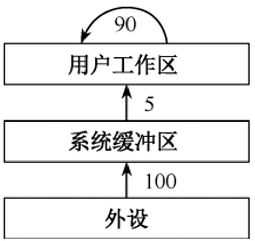

# 《王道操作系统》· 第5章 输入/输出管理（课后选择题全解）

> 本章共包含 3 个小节，共计 110 道精选选择题。

---
## 5.1 I
---

### 【WD-OS-C-5.1-T01】第 1 题（P2）

1. 以下关于设备属性的叙述中,正确的是(
)
A. 字符设备的基本特征是可寻址到字节,即能指定读/ 写操作的字节地址
B. 共享设备必须是可寻址的和可随机访问的设备
C. 共享设备是指同一时间内允许多个进程同时访问的设备
D. 在分配共享设备和独占设备时都可能引起进程死锁

> **【唯一编号】** `WD-OS-C-5.1-T01`
> **【课程】** 操作系统
> **【章节】** 第5章 输入/输出管理 · 5.1 I/O管理概述

---

### 【WD-OS-C-5.1-T02】第 2 题（P2）

2. 下列关于虚拟设备的含义的描述中, 正确的是(
)
A. 允许用户使用比系统中具有的物理设备更多的设备
B. 允许用户以标准化方式来使用物理设备
C. 把一个物理设备变换成多个对应的逻辑设备
D. 允许用户程序不必全部装入主存便可使用系统中的设备

> **【唯一编号】** `WD-OS-C-5.1-T02`
> **【课程】** 操作系统
> **【章节】** 第5章 输入/输出管理 · 5.1 I/O管理概述

---

### 【WD-OS-C-5.1-T03】第 3 题（P2）

3. 磁盘设备的I/O 控制主要采取(
) 方式。
A. 位
B. 字节
C. 帧
D. DMA

> **【唯一编号】** `WD-OS-C-5.1-T03`
> **【课程】** 操作系统
> **【章节】** 第5章 输入/输出管理 · 5.1 I/O管理概述

---

### 【WD-OS-C-5.1-T04】第 4 题（P2）

4. 为了便于上层软件的编制,设备控制器通常需要提供(
)
A. 控制寄存器、状态寄存器和控制命令
B. I/O 地址寄存器、工作方式状态寄存器和控制命令
C. 中断寄存器、控制寄存器和控制命令
D. 控制寄存器、编程空间和控制逻辑寄存器

> **【唯一编号】** `WD-OS-C-5.1-T04`
> **【课程】** 操作系统
> **【章节】** 第5章 输入/输出管理 · 5.1 I/O管理概述

---

### 【WD-OS-C-5.1-T05】第 5 题（P2）

5. 在设备控制器中用于实现设备控制功能的是(
)
A. CPU
B. 设备控制器与处理器的接口
C. I/O 逻辑
D. 设备控制器与设备的接口

> **【唯一编号】** `WD-OS-C-5.1-T05`
> **【课程】** 操作系统
> **【章节】** 第5章 输入/输出管理 · 5.1 I/O管理概述

---

### 【WD-OS-C-5.1-T06】第 6 题（P2）

6. DMA 方式是在(
) 之间建立一条直接数据通路。
A. I/O 设备和主存
B. 两个I/O 设备
C. I/O 设备和CPU
D. CPU 和主存

> **【唯一编号】** `WD-OS-C-5.1-T06`
> **【课程】** 操作系统
> **【章节】** 第5章 输入/输出管理 · 5.1 I/O管理概述

---

### 【WD-OS-C-5.1-T07】第 7 题（P95）

7. 在操作系统中，(
) 指的是一种硬件机制。
A. 通道技术
B. 缓冲池
C. SPOOLing 技术
D. 内存覆盖技术

> **【唯一编号】** `WD-OS-C-5.1-T07`
> **【课程】** 操作系统
> **【章节】** 第5章 输入/输出管理 · 5.1 I/O管理概述

---

### 【WD-OS-C-5.1-T08】第 8 题（P95）

8. 若I/O 设备与存储设备进行数据交换不经过CPU 来完成,则这种数据交换方式是(
)
A. 程序查询
B. 中断方式
C. DMA 方式
D. 直接存取方式

> **【唯一编号】** `WD-OS-C-5.1-T08`
> **【课程】** 操作系统
> **【章节】** 第5章 输入/输出管理 · 5.1 I/O管理概述

---

### 【WD-OS-C-5.1-T09】第 9 题（P95）

9. 下列关于DMA 方式的描述中,正确的是(
)
A. DMA 是一个专门负责输入/ 输出的处理机
B. 数据传输过程由DMA 控制器负责, CPU 只在预处理和后处理阶段进行干预
C. CPU 通过程序的方式给出DMA 可以解释的程序
D. DMA 不需要CPU 指出所取数据的地址与长度

> **【唯一编号】** `WD-OS-C-5.1-T09`
> **【课程】** 操作系统
> **【章节】** 第5章 输入/输出管理 · 5.1 I/O管理概述

---

### 【WD-OS-C-5.1-T10】第 10 题（P95）

10. 计算机系统中,不属于DMA 控制器的是(
)
A. 命令/ 状态寄存器
B. 内存地址寄存器
C. 数据寄存器
D. 堆栈指针寄存器

> **【唯一编号】** `WD-OS-C-5.1-T10`
> **【课程】** 操作系统
> **【章节】** 第5章 输入/输出管理 · 5.1 I/O管理概述

---

### 【WD-OS-C-5.1-T11】第 11 题（P95）

11. DMA 传输前需要进行预处理,传输后需要进行后处理,则下列说法中正确的是(
)
A. 预处理程序运行在用户态,后处理程序运行在内核态
B. 负责预处理和后处理程序的进程都是请求I/O 的进程
C. 预处理阶段不需要CPU 参与,后处理阶段需要CPU 参与
D. 预处理阶段请求I/O 的进程处于运行态,后处理阶段处于阻塞态

> **【唯一编号】** `WD-OS-C-5.1-T11`
> **【课程】** 操作系统
> **【章节】** 第5章 输入/输出管理 · 5.1 I/O管理概述

---

### 【WD-OS-C-5.1-T12】第 12 题（P95）

12. 在下列问题中，(
) 不是设备分配中应考虑的问题。
A. 及时性
B. 设备的固有属性
C. 设备独立性
D. 安全性

> **【唯一编号】** `WD-OS-C-5.1-T12`
> **【课程】** 操作系统
> **【章节】** 第5章 输入/输出管理 · 5.1 I/O管理概述

---

### 【WD-OS-C-5.1-T13】第 13 题（P95）

13. 将系统中的每台设备按某种原则统一进行编号,这些编号作为区分硬件和识别设备的代号,该编号
称为设备的(
)
A. 绝对号
B. 相对号
C. 类型号
D. 符号

> **【唯一编号】** `WD-OS-C-5.1-T13`
> **【课程】** 操作系统
> **【章节】** 第5章 输入/输出管理 · 5.1 I/O管理概述

---

### 【WD-OS-C-5.1-T14】第 14 题（P96）

14. 关于通道、设备控制器和设备之间的关系,以下叙述中正确的是(
)
A. 设备控制器和通道可以分别控制设备
B. 对于同一组输入/ 输出命令，设备控制器、通道和设备可以并行工作
C. 通道控制设备控制器、设备控制器控制设备工作
D. 以上答案都不对

> **【唯一编号】** `WD-OS-C-5.1-T14`
> **【课程】** 操作系统
> **【章节】** 第5章 输入/输出管理 · 5.1 I/O管理概述

---

### 【WD-OS-C-5.1-T15】第 15 题（P96）

15. 一个计算机系统配置了2 台相同类型的绘图机和3 台相同类型打印机,为了正确驱动这些设备,系
统应该提供(
) 个设备驱动程序。
A. 5
B. 3
C. 2
D. 1

> **【唯一编号】** `WD-OS-C-5.1-T15`
> **【课程】** 操作系统
> **【章节】** 第5章 输入/输出管理 · 5.1 I/O管理概述

---

### 【WD-OS-C-5.1-T16】第 16 题（P96）

16. 将系统调用参数翻译成设备操作命令的工作由(
) 完成。
A. 用户层I/O
B. 设备无关的操作系统软件
C. 中断处理
D. 设备驱动程序

> **【唯一编号】** `WD-OS-C-5.1-T16`
> **【课程】** 操作系统
> **【章节】** 第5章 输入/输出管理 · 5.1 I/O管理概述

---

### 【WD-OS-C-5.1-T17】第 17 题（P96）

17. 向设备寄存器的写命令是在I/O 软件的(
) 中完成的。
A. 用户层软件
B. 设备独立性软件
C. 设备驱动程序
D. 中断处理程序

> **【唯一编号】** `WD-OS-C-5.1-T17`
> **【课程】** 操作系统
> **【章节】** 第5章 输入/输出管理 · 5.1 I/O管理概述

---

### 【WD-OS-C-5.1-T18】第 18 题（P96）

18. 一个典型的文本打印页面有50 行,每行80 个字符,假定一台标准的打印机每分钟能打印6 页,向打
印机的输出寄存器中写一个字符的时间很短, 可忽略不计。若每打印一个字符都需要花费50μs 的中
断处理时间(包括所有服务),使用中断驱动I/O 方式运行这台打印机,中断的系统开销占CPU 的百分
比为(
)
A. 2%
B. 5%
C. 20%
D. 50%

> **【唯一编号】** `WD-OS-C-5.1-T18`
> **【课程】** 操作系统
> **【章节】** 第5章 输入/输出管理 · 5.1 I/O管理概述

---

### 【WD-OS-C-5.1-T19】第 19 题（P96）

19. 在接收和处理一个输入设备的中断的过程中,一定不由硬件来完成的工作是(
)
A. 判断产生中断的类型
B. CPU 模式由用户态切换到内核态
C. 主机获取设备输入
D. 保存用户程序的断点

> **【唯一编号】** `WD-OS-C-5.1-T19`
> **【课程】** 操作系统
> **【章节】** 第5章 输入/输出管理 · 5.1 I/O管理概述

---

### 【WD-OS-C-5.1-T20】第 20 题（P96）

20. 下列I/O 方式中,会导致用户进程进入阻塞态的是(
)
I.程序直接控制
II.中断方式
III. DMA 方式
A. II
B. I、III
C. II、III
D. I、II、III

> **【唯一编号】** `WD-OS-C-5.1-T20`
> **【课程】** 操作系统
> **【章节】** 第5章 输入/输出管理 · 5.1 I/O管理概述

---

### 【WD-OS-C-5.1-T21】第 21 题（P97）

21. 当一个进程请求I/O 操作时,该进程将被挂起,直到I/O 设备完成I/O 操作后,设备控制器便向CPU
发送一个中断请求, CPU 响应后便转向中断处理程序,下列关于中断处理程序的说法中,错误的是(
)
A. 中断处理程序将设备控制器中的数据传送到内存的缓冲区(读入),或将要输出的数据传送到设备
控制器(输出)
B. 对于不同的设备,有不同的中断处理程序
C. 中断处理结束后,需要恢复CPU 现场,此时一定会返回到被中断的进程
D. I/O 操作完成后,驱动程序必须检查本次I/O 操作中是否发生了错误

> **【唯一编号】** `WD-OS-C-5.1-T21`
> **【课程】** 操作系统
> **【章节】** 第5章 输入/输出管理 · 5.1 I/O管理概述

---

### 【WD-OS-C-5.1-T22】第 22 题（P97）

22. 在I/O 系统与高层之间的接口中,根据设备类型的不同,又进一步分为若干类接口,若某设备的数据
传输速率较高,且可寻址,则比较适合采用(
)
A. 块设备接口
B. 网络设备接口
C. 字符设备接口
D. 流设备接口

> **【唯一编号】** `WD-OS-C-5.1-T22`
> **【课程】** 操作系统
> **【章节】** 第5章 输入/输出管理 · 5.1 I/O管理概述

---

### 【WD-OS-C-5.1-T23】第 23 题（P97）

23.【2010 统考真题】本地用户通过键盘登录系统时,首先获得键盘输入信息的程序是(
)
A. 命令解释程序
B. 中断处理程序
C. 系统调用服务程序
D. 用户登录程序

> **【唯一编号】** `WD-OS-C-5.1-T23`
> **【课程】** 操作系统
> **【章节】** 第5章 输入/输出管理 · 5.1 I/O管理概述

---

### 【WD-OS-C-5.1-T24】第 24 题（P97）

24.【2011 统考真题】用户程序发出磁盘I/O 请求后,系统的正确处理流程是(
)
A. 用户程序→系统调用处理程序→中断处理程序→设备驱动程序
B. 用户程序→系统调用处理程序→设备驱动程序→中断处理程序
C. 用户程序→设备驱动程序→系统调用处理程序→中断处理程序
D. 用户程序→设备驱动程序→中断处理程序→系统调用处理程序

> **【唯一编号】** `WD-OS-C-5.1-T24`
> **【课程】** 操作系统
> **【章节】** 第5章 输入/输出管理 · 5.1 I/O管理概述

---

### 【WD-OS-C-5.1-T25】第 25 题（P97）

25.【2012 统考真题】操作系统的I/O 子系统通常由4 个层次组成,每层明确定义了与邻近层次的接
口,其合理的层次组织排列顺序是(
)
A. 用户级I/O 软件、设备无关软件、设备驱动程序、中断处理程序
B. 用户级I/O 软件、设备无关软件、中断处理程序、设备驱动程序
C. 用户级I/O 软件、设备驱动程序、设备无关软件、中断处理程序
D. 用户级I/O 软件、中断处理程序、设备无关软件、设备驱动程序

> **【唯一编号】** `WD-OS-C-5.1-T25`
> **【课程】** 操作系统
> **【章节】** 第5章 输入/输出管理 · 5.1 I/O管理概述

---

### 【WD-OS-C-5.1-T26】第 26 题（P98）

26.【2017 统考真题】系统将数据从磁盘读到内存的过程包括以下操作:
①DMA 控制器发出中断请求
②初始化DMA 控制器并启动磁盘
③从磁盘传输一块数据到内存缓冲区
④执行“DMA 结束”中断服务程序
正确的执行顺序是(
)
A. ③→①→②→④
B. ②→③→①→④
C. ②→①→③→④
D. ①→②→④→③

> **【唯一编号】** `WD-OS-C-5.1-T26`
> **【课程】** 操作系统
> **【章节】** 第5章 输入/输出管理 · 5.1 I/O管理概述

---
## 5.2 设备独立性软件
---

### 【WD-OS-C-5.2-T01】第 1 题（P2）

1. 设备的独立性是指(
)
A. 设备独立于计算机系统
B. 系统对设备的管理是独立的
C. 用户编程时使用的设备与实际使用的设备无关
D. 每台设备都有唯一的编号

> **【唯一编号】** `WD-OS-C-5.2-T01`
> **【课程】** 操作系统
> **【章节】** 第5章 输入/输出管理 · 5.2 设备独立性软件

---

### 【WD-OS-C-5.2-T02】第 2 题（P2）

2. 引入高速缓冲的主要目的是(
)
A. 提高CPU 的利用率
B. 提高I/O 设备的利用率
C. 改善CPU 与I/O 设备速度不匹配的问题
D. 节省内存

> **【唯一编号】** `WD-OS-C-5.2-T02`
> **【课程】** 操作系统
> **【章节】** 第5章 输入/输出管理 · 5.2 设备独立性软件

---

### 【WD-OS-C-5.2-T03】第 3 题（P2）

3. 为了使并发进程能有效地进行输入和输出,最好采用(
) 结构的缓冲技术。
A. 缓冲池
B. 循环缓冲
C. 单缓冲
D. 双缓冲

> **【唯一编号】** `WD-OS-C-5.2-T03`
> **【课程】** 操作系统
> **【章节】** 第5章 输入/输出管理 · 5.2 设备独立性软件

---

### 【WD-OS-C-5.2-T04】第 4 题（P2）

4. 缓冲技术中的缓冲池在(
) 中。
A. 主存
B. 外存
C. ROM
D. 寄存器

> **【唯一编号】** `WD-OS-C-5.2-T04`
> **【课程】** 操作系统
> **【章节】** 第5章 输入/输出管理 · 5.2 设备独立性软件

---

### 【WD-OS-C-5.2-T05】第 5 题（P2）

5. 支持双向传送的设备应使用(
)
A. 单缓冲区
B. 双缓冲区
C. 多缓冲区
D. 缓冲池

> **【唯一编号】** `WD-OS-C-5.2-T05`
> **【课程】** 操作系统
> **【章节】** 第5章 输入/输出管理 · 5.2 设备独立性软件

---

### 【WD-OS-C-5.2-T06】第 6 题（P99）

6. 下列关于缓冲区的描述中, 正确的是(
)
A. 缓冲区是一种专门的硬件缓冲器,不能用内存来实现
B. 缓冲区的作用是提高CPU 和I/O 设备之间的速度匹配
C. 缓冲区只能用于输入设备,不能用于输出设备
D. 缓冲区只能用于块设备,不能用于字符设备

> **【唯一编号】** `WD-OS-C-5.2-T06`
> **【课程】** 操作系统
> **【章节】** 第5章 输入/输出管理 · 5.2 设备独立性软件

---

### 【WD-OS-C-5.2-T07】第 7 题（P99）

7. 使用单缓冲或双缓冲进行通信时，(
) 可以实现数据的双向并行传输。
A. 只有单缓冲
B. 只有双缓冲
C. 都
D. 都不

> **【唯一编号】** `WD-OS-C-5.2-T07`
> **【课程】** 操作系统
> **【章节】** 第5章 输入/输出管理 · 5.2 设备独立性软件

---

### 【WD-OS-C-5.2-T08】第 8 题（P99）

8. 下列各种算法中, (
) 是设备分配常用的一种算法。
A. 首次适应
B. 时间片分配
C. 最佳适应
D. 先来先服务

> **【唯一编号】** `WD-OS-C-5.2-T08`
> **【课程】** 操作系统
> **【章节】** 第5章 输入/输出管理 · 5.2 设备独立性软件

---

### 【WD-OS-C-5.2-T09】第 9 题（P99）

9. 设从磁盘将一块数据传送到缓冲区所用的时间为80μs，将缓冲区中的数据传送到用户区所用的
时间为40μs, CPU 处理一块数据所用的时间为30μs。若有多块数据需要处理, 并采用单缓冲区传送
某磁盘数据,则处理一块数据所用的总时间为(
)
A. 120μs
B. 110μs
C. 150μs
D. 70μs

> **【唯一编号】** `WD-OS-C-5.2-T09`
> **【课程】** 操作系统
> **【章节】** 第5章 输入/输出管理 · 5.2 设备独立性软件

---

### 【WD-OS-C-5.2-T10】第 10 题（P99）

10. 某操作系统采用双缓冲区传送磁盘上的数据。设从磁盘将数据传送到缓冲区所用的时间为T1,将
缓冲区中的数据传送到用户区所用的时间为T2, CPU 处理一块数据所用的时间为T3, 假设一个磁盘
块和一个缓冲区的大小相等,某系统在一段时间内连续处理一大批数据,则平均处理一个磁盘块数据
的时间为(
)
A. T1 + T2 + T3
B. max T2,T3

+ T1
C. max T1,T3

+ T2
D. max T1,T2+T3

> **【唯一编号】** `WD-OS-C-5.2-T10`
> **【课程】** 操作系统
> **【章节】** 第5章 输入/输出管理 · 5.2 设备独立性软件

---

### 【WD-OS-C-5.2-T11】第 11 题（P99）

11. 若I/O 所花费的时间比CPU 的处理时间短得多,则缓冲区(
)
A. 最有效
B. 几乎无效
C. 均衡
D. 以上答案都不对

> **【唯一编号】** `WD-OS-C-5.2-T11`
> **【课程】** 操作系统
> **【章节】** 第5章 输入/输出管理 · 5.2 设备独立性软件

---

### 【WD-OS-C-5.2-T12】第 12 题（P100）

12. 缓冲区管理着主要考虑的问题是(
)
A. 选择缓冲区的大小
B. 决定缓冲区的数量
C. 实现进程访问缓冲区的同步
D. 限制进程的数量

> **【唯一编号】** `WD-OS-C-5.2-T12`
> **【课程】** 操作系统
> **【章节】** 第5章 输入/输出管理 · 5.2 设备独立性软件

---

### 【WD-OS-C-5.2-T13】第 13 题（P100）

13. 考虑单用户计算机上的下列I/O 操作,需要使用缓冲技术的是(
)
I.图形用户界面下使用鼠标
II.多任务操作系统下的磁带驱动器(假设没有设备预分配)
III.包含用户文件的磁盘驱动器
IV.使用存储器映射I/O,直接和总线相连的图形卡
A. I、III
B. II、IV
C. II、III、IV
D. 全选

> **【唯一编号】** `WD-OS-C-5.2-T13`
> **【课程】** 操作系统
> **【章节】** 第5章 输入/输出管理 · 5.2 设备独立性软件

---

### 【WD-OS-C-5.2-T14】第 14 题（P100）

14. 以下(
) 不属于设备管理数据结构。
A. PCB
B. DCT
C. COCT
D. CHCT

> **【唯一编号】** `WD-OS-C-5.2-T14`
> **【课程】** 操作系统
> **【章节】** 第5章 输入/输出管理 · 5.2 设备独立性软件

---

### 【WD-OS-C-5.2-T15】第 15 题（P100）

15. 下列(
) 不是设备的分配方式。
A. 独享分配
B. 共享分配
C. 虚拟分配
D. 分区分配

> **【唯一编号】** `WD-OS-C-5.2-T15`
> **【课程】** 操作系统
> **【章节】** 第5章 输入/输出管理 · 5.2 设备独立性软件

---

### 【WD-OS-C-5.2-T16】第 16 题（P100）

16. 设备分配程序需要访问一系列的数据结构来给进程分配设备,这些数据结构有: 设备控制表
(DCT),控制器控制表(COCT),通道控制表(CHCT),系统设备表(SDT)。在设备分配的过程中,访问这
些数据结构的正确顺序是(
)
A. SDT, DCT, COCT, CHCT
B. DCT, COCT, CHCT, SDT
C. SDT, COCT, CHCT, DCT
D. COCT, CHCT, SDT, DCT

> **【唯一编号】** `WD-OS-C-5.2-T16`
> **【课程】** 操作系统
> **【章节】** 第5章 输入/输出管理 · 5.2 设备独立性软件

---

### 【WD-OS-C-5.2-T17】第 17 题（P100）

17. 下面设备中属于共享设备的是(
)
A. 打印机
B. 磁带机
C. 磁盘
D. 磁带机和磁盘

> **【唯一编号】** `WD-OS-C-5.2-T17`
> **【课程】** 操作系统
> **【章节】** 第5章 输入/输出管理 · 5.2 设备独立性软件

---

### 【WD-OS-C-5.2-T18】第 18 题（P100）

18. 提高单机资源利用率的关键技术是(
)
A. SPOOLing 技术
B. 虚拟技术
C. 交换技术
D. 多道程序设计技术

> **【唯一编号】** `WD-OS-C-5.2-T18`
> **【课程】** 操作系统
> **【章节】** 第5章 输入/输出管理 · 5.2 设备独立性软件

---

### 【WD-OS-C-5.2-T19】第 19 题（P101）

19. 虚拟设备是靠(
) 技术来实现的。
A. 通道
B. 缓冲
C. SPOOLing
D. 控制器

> **【唯一编号】** `WD-OS-C-5.2-T19`
> **【课程】** 操作系统
> **【章节】** 第5章 输入/输出管理 · 5.2 设备独立性软件

---

### 【WD-OS-C-5.2-T20】第 20 题（P101）

20. SPOOLing 技术的主要目的是(
)
A. 提高CPU 和设备交换信息的速度
B. 提高独占设备的利用率
C. 减轻用户编程负担
D. 提供主、辅存接口

> **【唯一编号】** `WD-OS-C-5.2-T20`
> **【课程】** 操作系统
> **【章节】** 第5章 输入/输出管理 · 5.2 设备独立性软件

---

### 【WD-OS-C-5.2-T21】第 21 题（P101）

21. 在采用SPOOLing 技术的系统中,用户的打印结果首先被送到(
)
A. 磁盘固定区域
B. 内存固定区域
C. 终端
D. 打印机

> **【唯一编号】** `WD-OS-C-5.2-T21`
> **【课程】** 操作系统
> **【章节】** 第5章 输入/输出管理 · 5.2 设备独立性软件

---

### 【WD-OS-C-5.2-T22】第 22 题（P101）

22. 采用SPOOLing 技术的计算机系统，外围计算机需要(
)
A. 一台
B. 多台
C. 至少一台
D. 0 台

> **【唯一编号】** `WD-OS-C-5.2-T22`
> **【课程】** 操作系统
> **【章节】** 第5章 输入/输出管理 · 5.2 设备独立性软件

---

### 【WD-OS-C-5.2-T23】第 23 题（P101）

23. SPOOLing 系统由(
) 组成。
A. 预输入程序、井管理程序和缓输出程序
B. 预输入程序、井管理程序和井管理输出程序
C. 输入程序、井管理程序和输出程序
D. 预输入程序、井管理程序和输出程序

> **【唯一编号】** `WD-OS-C-5.2-T23`
> **【课程】** 操作系统
> **【章节】** 第5章 输入/输出管理 · 5.2 设备独立性软件

---

### 【WD-OS-C-5.2-T24】第 24 题（P101）

24. 在SPOOLing 系统中,用户进程实际分配到的是(
)
A. 用户所要求的外设
B. 外存区，即虚拟设备
C. 设备的一部分存储区
D. 设备的一部分空间

> **【唯一编号】** `WD-OS-C-5.2-T24`
> **【课程】** 操作系统
> **【章节】** 第5章 输入/输出管理 · 5.2 设备独立性软件

---

### 【WD-OS-C-5.2-T25】第 25 题（P101）

25. 下面关于SPOOLing 系统的说法中,正确的是(
)
A. 构成SPOOLing 系统的基本条件是有外围输入机与外围输出机
B. 构成SPOOLing 系统的基本条件仅是高速的大容量硬盘作为输入井和输出井
C. 当输入设备忙时, SPOOLing 系统中的用户程序暂停执行,待I/O 空闲时再被唤醒执行输出操作
D. SPOOLing 系统中的用户程序可以随时将输出数据送到输出井中,待输出设备空闲时再由
SPOOLing 系统完成数据的输出操作

> **【唯一编号】** `WD-OS-C-5.2-T25`
> **【课程】** 操作系统
> **【章节】** 第5章 输入/输出管理 · 5.2 设备独立性软件

---

### 【WD-OS-C-5.2-T26】第 26 题（P102）

26. 下面关于SPOOLing 的叙述中,不正确的是(
)
A. SPOOLing 系统中不需要独占设备
B. SPOOLing 系统加快了作业执行的速度
C. SPOOLing 系统使独占设备变成共享设备
D. SPOOLing 系统提高了独占设备的利用率

> **【唯一编号】** `WD-OS-C-5.2-T26`
> **【课程】** 操作系统
> **【章节】** 第5章 输入/输出管理 · 5.2 设备独立性软件

---

### 【WD-OS-C-5.2-T27】第 27 题（P102）

27. (
) 是操作系统中采用的以空间换取时间的技术。
A. SPOOLing 技术
B. 虚拟存储技术
C. 覆盖与交换技术
D. 通道技术

> **【唯一编号】** `WD-OS-C-5.2-T27`
> **【课程】** 操作系统
> **【章节】** 第5章 输入/输出管理 · 5.2 设备独立性软件

---

### 【WD-OS-C-5.2-T28】第 28 题（P102）

28. 采用假脱机技术,将磁盘的一部分作为公共缓冲区以代替打印机,用户对打印机的操作实际上是对
磁盘的存储操作,用以代替打印机的部分由(
) 完成。
A. 独占设备
B. 共享设备
C. 虚拟设备
D. 一般物理设备

> **【唯一编号】** `WD-OS-C-5.2-T28`
> **【课程】** 操作系统
> **【章节】** 第5章 输入/输出管理 · 5.2 设备独立性软件

---

### 【WD-OS-C-5.2-T29】第 29 题（P102）

29. 下面关于独占设备和共享设备的说法中, 不正确的是(
)
A. 打印机、扫描仪等属于独占设备
B. 对独占设备往往采用静态分配方式
C. 共享设备是指一个作业尚未撤离，另一个作业即可使用，但每个时刻只有一个作业使用
D. 对共享设备往往采用静态分配方式

> **【唯一编号】** `WD-OS-C-5.2-T29`
> **【课程】** 操作系统
> **【章节】** 第5章 输入/输出管理 · 5.2 设备独立性软件

---

### 【WD-OS-C-5.2-T30】第 30 题（P102）

30. 当用户要求使用打印机打印某文件时，用户的要求是由操作系统的(
) 实现的。
A. 文件系统
B. 设备管理程序
C. 文件系统和设备管理程序
D. 打印机启动程序和设备管理程序

> **【唯一编号】** `WD-OS-C-5.2-T30`
> **【课程】** 操作系统
> **【章节】** 第5章 输入/输出管理 · 5.2 设备独立性软件

---

### 【WD-OS-C-5.2-T31】第 31 题（P102）

31. 下列设备管理工作中,适合由设备独立性软件来完成的有(
)
I.向设备寄存器写命令
II.检查用户是否有权使用设备
III.将二进制整数转换成ASCII 码格式打印
IV.缓冲区管理
A. I、II 和III
B. II、III 和IV
C. II 和IV
D. I、III 和IV

> **【唯一编号】** `WD-OS-C-5.2-T31`
> **【课程】** 操作系统
> **【章节】** 第5章 输入/输出管理 · 5.2 设备独立性软件

---

### 【WD-OS-C-5.2-T32】第 32 题（P102）

32. 下列关于设备驱动程序的说法中,正确的是(
)
I.设备驱动程序负责处理与设备相关的中断处理过程
II.驱动程序全部使用汇编语言编写,没有使用高级语言编写
III.设备驱动程序负责处理磁盘调度
IV.设备驱动程序与设备密切相关,可以在任意操作系统运行
A. II、III、IV
B. I、III
C. III、IV
D. I、II、III

> **【唯一编号】** `WD-OS-C-5.2-T32`
> **【课程】** 操作系统
> **【章节】** 第5章 输入/输出管理 · 5.2 设备独立性软件

---

### 【WD-OS-C-5.2-T33】第 33 题（P103）

33. 下列选项中，(
) 不属于设备驱动程序的功能。
A. 接收进程发来的I/O 命令和参数,并检查其合法性
B. 查询I/O 设备的状态
C. 发出I/O 命令,启动I/O 设备
D. 对I/O 设备传回的数据进行分析和缓冲

> **【唯一编号】** `WD-OS-C-5.2-T33`
> **【课程】** 操作系统
> **【章节】** 第5章 输入/输出管理 · 5.2 设备独立性软件

---

### 【WD-OS-C-5.2-T34】第 34 题（P103）

34. 对设备驱动程序的处理过程进行排序,正确的处理顺序是(
)
①对服务请求进行校验
②传送必要的参数
③启动I/O 设备
④将抽象要求转化为具体要求
⑤检查设备的状态
A. ①④⑤②③
B. ④①⑤②③
C. ①④②⑤③
D. ④①②⑤③

> **【唯一编号】** `WD-OS-C-5.2-T34`
> **【课程】** 操作系统
> **【章节】** 第5章 输入/输出管理 · 5.2 设备独立性软件

---

### 【WD-OS-C-5.2-T35】第 35 题（P103）

35. printf (
) 是C 语言中进行格式化输出的库函数,该函数最终会转到内核态执行相应的系统调用
服务例程，进程是通过执行(
) 从用户态进入内核态的。
A. 陷入指令
B. 关中断指令
C. 无条件跳转指令
D. 输出指令

> **【唯一编号】** `WD-OS-C-5.2-T35`
> **【课程】** 操作系统
> **【章节】** 第5章 输入/输出管理 · 5.2 设备独立性软件

---

### 【WD-OS-C-5.2-T36】第 36 题（P103）

36.【2009 统考真题】单处理机系统中,可并行的是(
)
I.进程与进程
II.处理机与设备
III.处理机与通道
IV.设备与设备
A. I、II、III
B. I、II、IV
C. I、III、IV
D. II、III、IV

> **【唯一编号】** `WD-OS-C-5.2-T36`
> **【课程】** 操作系统
> **【章节】** 第5章 输入/输出管理 · 5.2 设备独立性软件

---

### 【WD-OS-C-5.2-T37】第 37 题（P103）

37.【2009 统考真题】程序员利用系统调用打开I/O 设备时，通常使用的设备标识是(
)
A. 逻辑设备名
B. 物理设备名
C. 主设备号
D. 从设备号

> **【唯一编号】** `WD-OS-C-5.2-T37`
> **【课程】** 操作系统
> **【章节】** 第5章 输入/输出管理 · 5.2 设备独立性软件

---

### 【WD-OS-C-5.2-T38】第 38 题（P103）

38.【2011 统考真题】某文件占10 个磁盘块,现要把该文件的磁盘块逐个读入主存缓冲区,并且送到用
户区进行分析, 假设一个缓冲区与一个磁盘块大小相同, 把一个磁盘块读入缓冲区的时间为100μs,将
缓冲区的数据传送到用户区的时间是50μs,CPU 对一块数据进行分析的时间为50μs。在单缓冲区和
双缓冲区结构下，读入并分析完该文件的时间分别是(
)
A. 1500μs,1000μs
B. 1550μs,1100μs
C. 1550μs,1550μs
D. 2000μs,2000μs

> **【唯一编号】** `WD-OS-C-5.2-T38`
> **【课程】** 操作系统
> **【章节】** 第5章 输入/输出管理 · 5.2 设备独立性软件

---

### 【WD-OS-C-5.2-T39】第 39 题（P104）

39.【2013 统考真题】设系统缓冲区和用户工作区均采用单缓冲,从外设读入一个数据块到系统缓冲
区的时间为100,从系统缓冲区读入一个数据块到用户工作区的时间为5,对用户工作区中的一个数据
块进行分析的时间为90(见下图)。进程从外设读入并分析2 个数据块的最短时间是(
)
A. 200
B. 295
C. 300
D. 390

> **【唯一编号】** `WD-OS-C-5.2-T39`
> **【课程】** 操作系统
> **【章节】** 第5章 输入/输出管理 · 5.2 设备独立性软件

---

### 【WD-OS-C-5.2-T40】第 40 题（P104）

40.【2013 统考真题】用户程序发出磁盘I/O 请求后, 系统的处理流程是: 用户程序→系统调用处理
程序→设备驱动程序→中断处理程序。其中, 计算数据所在磁盘的柱面号、磁头号、扇区号的程序
是(
)
A. 用户程序
B. 系统调用处理程序
C. 设备驱动程序
D. 中断处理程序

> **【唯一编号】** `WD-OS-C-5.2-T40`
> **【课程】** 操作系统
> **【章节】** 第5章 输入/输出管理 · 5.2 设备独立性软件

---

### 【WD-OS-C-5.2-T41】第 41 题（P104）

41.【2015 统考真题】在系统内存中设置磁盘缓冲区的主要目的是(
)
A. 减少磁盘I/O 次数
B. 减少平均寻道时间
C. 提高磁盘数据可靠性
D. 实现设备无关性

> **【唯一编号】** `WD-OS-C-5.2-T41`
> **【课程】** 操作系统
> **【章节】** 第5章 输入/输出管理 · 5.2 设备独立性软件

---

### 【WD-OS-C-5.2-T42】第 42 题（P104）

42.【2016 统考真题】下列关于SPOOLing 技术的叙述中,错误的是(
)
A. 需要外存的支持
B. 需要多道程序设计技术的支持
C. 可以让多个作业共享一台独占式设备
D. 由用户作业控制设备与输入/ 输出井之间的数据传送

> **【唯一编号】** `WD-OS-C-5.2-T42`
> **【课程】** 操作系统
> **【章节】** 第5章 输入/输出管理 · 5.2 设备独立性软件

---

### 【WD-OS-C-5.2-T43】第 43 题（P104）

43.【2020 统考真题】对于具备设备独立性的系统，下列叙述中，错误的是(
)
A. 可以使用文件名访问物理设备
B. 用户程序使用逻辑设备名访问物理设备
C. 需要建立逻辑设备与物理设备之间的映射关系
D. 更换物理设备后必须修改访问该设备的应用程序

> **【唯一编号】** `WD-OS-C-5.2-T43`
> **【课程】** 操作系统
> **【章节】** 第5章 输入/输出管理 · 5.2 设备独立性软件

---

### 【WD-OS-C-5.2-T44】第 44 题（P105）

44.【2022 统考真题】下列关于驱动程序的叙述中,不正确的是(
)
A. 驱动程序与I/O 控制方式无关
B. 初始化设备是由驱动程序控制完成的
C. 进程在执行驱动程序时可能进入阻塞态
D. 读/ 写设备的操作是由驱动程序控制完成的

> **【唯一编号】** `WD-OS-C-5.2-T44`
> **【课程】** 操作系统
> **【章节】** 第5章 输入/输出管理 · 5.2 设备独立性软件

---

### 【WD-OS-C-5.2-T45】第 45 题（P105）

45.【2023 统考真题】下列关于设备分配的叙述中,需要考虑的是(
)
I.设备的类型
II.设备的访问权限
III.设备的占用状态
IV.逻辑设备与物理设备的映射关系
A. 仅I、II
B. 仅II、III
C. 仅III、IV
D. I、II、III、IV

> **【唯一编号】** `WD-OS-C-5.2-T45`
> **【课程】** 操作系统
> **【章节】** 第5章 输入/输出管理 · 5.2 设备独立性软件

---

### 【WD-OS-C-5.2-T46】第 46 题（P105）

46.【2024 统考真题】当键盘中断服务例程执行结束时，所输入数据的存放位置是(
)
A. 用户缓冲区
B. CPU 中的通用寄存器
C. 内核缓冲区
D. 键盘控制器的数据寄存器

> **【唯一编号】** `WD-OS-C-5.2-T46`
> **【课程】** 操作系统
> **【章节】** 第5章 输入/输出管理 · 5.2 设备独立性软件

---
## 5.3 磁盘和固态硬盘
---

### 【WD-OS-C-5.3-T01】第 1 题（P2）

1. 文件系统和整个磁盘的关系是(
)
A. 没有磁盘就没有文件系统
B. 文件系统的组织信息放在磁盘上,这些信息和代码合在一起形成文件系统
C. 文件系统就是整个磁盘
D. 没有关系

> **【唯一编号】** `WD-OS-C-5.3-T01`
> **【课程】** 操作系统
> **【章节】** 第5章 输入/输出管理 · 5.3 磁盘和固态硬盘

---

### 【WD-OS-C-5.3-T02】第 2 题（P2）

2. 磁盘是可共享设备，但在每个时刻(
) 作业启动它。
A. 可以由任意多个
B. 能限定多个
C. 至少能由一个
D. 至多能由一个

> **【唯一编号】** `WD-OS-C-5.3-T02`
> **【课程】** 操作系统
> **【章节】** 第5章 输入/输出管理 · 5.3 磁盘和固态硬盘

---

### 【WD-OS-C-5.3-T03】第 3 题（P2）

3. 既可以顺序读/ 写,又可以按任意次序读/ 写的存储器有(
)
I.光盘
II.磁带
III. U 盘
IV.磁盘
A. II、III、IV
B. I、III、IV
C. III、IV
D. 仅IV

> **【唯一编号】** `WD-OS-C-5.3-T03`
> **【课程】** 操作系统
> **【章节】** 第5章 输入/输出管理 · 5.3 磁盘和固态硬盘

---

### 【WD-OS-C-5.3-T04】第 4 题（P2）

4. 磁盘调度的目的是缩短(
) 时间。
A. 寻道
B. 延迟
C. 传送
D. 启动

> **【唯一编号】** `WD-OS-C-5.3-T04`
> **【课程】** 操作系统
> **【章节】** 第5章 输入/输出管理 · 5.3 磁盘和固态硬盘

---

### 【WD-OS-C-5.3-T05】第 5 题（P106）

5. 下列各种算法中, (
) 算法和其他算法存在根本的不同。
A. SCAN
B. FCFS
C. C - LOOK
D. CLOCK

> **【唯一编号】** `WD-OS-C-5.3-T05`
> **【课程】** 操作系统
> **【章节】** 第5章 输入/输出管理 · 5.3 磁盘和固态硬盘

---

### 【WD-OS-C-5.3-T06】第 6 题（P106）

6. 磁盘上的文件以(
) 为单位读/ 写。
A. 块
B. 记录
C. 柱面
D. 磁道

> **【唯一编号】** `WD-OS-C-5.3-T06`
> **【课程】** 操作系统
> **【章节】** 第5章 输入/输出管理 · 5.3 磁盘和固态硬盘

---

### 【WD-OS-C-5.3-T07】第 7 题（P106）

7. 在磁盘中读取数据的下列时间中,影响最大的是(
)
A. 处理时间
B. 延迟时间
C. 传送时间
D. 寻道时间

> **【唯一编号】** `WD-OS-C-5.3-T07`
> **【课程】** 操作系统
> **【章节】** 第5章 输入/输出管理 · 5.3 磁盘和固态硬盘

---

### 【WD-OS-C-5.3-T08】第 8 题（P106）

8. 硬盘的操作系统引导扇区产生在(
)
A. 对硬盘进行分区时
B. 对硬盘进行低级格式化时
C. 硬盘出厂时自带
D. 对硬盘进行高级格式化时

> **【唯一编号】** `WD-OS-C-5.3-T08`
> **【课程】** 操作系统
> **【章节】** 第5章 输入/输出管理 · 5.3 磁盘和固态硬盘

---

### 【WD-OS-C-5.3-T09】第 9 题（P106）

9. 在磁盘中,每个扇区的头部和尾部都包含一些磁盘控制器的使用信息,如扇区号等,这些磁盘控制器
的使用信息是在(
) 阶段被创建的。
A. 低级格式化
B. 分区
C. 高级格式化
D. 系统引导

> **【唯一编号】** `WD-OS-C-5.3-T09`
> **【课程】** 操作系统
> **【章节】** 第5章 输入/输出管理 · 5.3 磁盘和固态硬盘

---

### 【WD-OS-C-5.3-T10】第 10 题（P106）

10. 在下列有关旋转延迟的叙述中,不正确的是(
)
A. 旋转延迟的大小与磁盘调度算法无关
B. 旋转延迟的大小取决于磁盘空闲空间的分配程序
C. 旋转延迟的大小与文件的物理结构有关
D. 扇区数据的处理时间对旋转延迟的影响较大

> **【唯一编号】** `WD-OS-C-5.3-T10`
> **【课程】** 操作系统
> **【章节】** 第5章 输入/输出管理 · 5.3 磁盘和固态硬盘

---

### 【WD-OS-C-5.3-T11】第 11 题（P106）

11. 当设计针对传统机械式硬盘的磁盘调度算法时, 主要考虑下列哪种因素对磁盘I/O 的性能影响最
为显著?(
)
A. 移动磁头的延迟
B. 单个磁盘块的读/ 写时间
C. 磁盘平均旋转延迟
D. 磁盘最大旋转延迟

> **【唯一编号】** `WD-OS-C-5.3-T11`
> **【课程】** 操作系统
> **【章节】** 第5章 输入/输出管理 · 5.3 磁盘和固态硬盘

---

### 【WD-OS-C-5.3-T12】第 12 题（P107）

12. 下列算法中,用于磁盘调度的是(
)
A. 时间片轮转调度算法
B. LRU 算法
C. 最短寻道时间优先算法
D. 优先级高者优先算法

> **【唯一编号】** `WD-OS-C-5.3-T12`
> **【课程】** 操作系统
> **【章节】** 第5章 输入/输出管理 · 5.3 磁盘和固态硬盘

---

### 【WD-OS-C-5.3-T13】第 13 题（P107）

13. 以下算法中，(
) 可能出现“饥饿”现象。
A. 电梯调度
B. 最短寻道时间优先
C. 循环扫描算法
D. 先来先服务

> **【唯一编号】** `WD-OS-C-5.3-T13`
> **【课程】** 操作系统
> **【章节】** 第5章 输入/输出管理 · 5.3 磁盘和固态硬盘

---

### 【WD-OS-C-5.3-T14】第 14 题（P107）

14. 在以下算法中，(
) 可能会随时改变磁头的运动方向。
A. 电梯调度
B. 先来先服务
C. 循环扫描算法
D. 以上答案都不对

> **【唯一编号】** `WD-OS-C-5.3-T14`
> **【课程】** 操作系统
> **【章节】** 第5章 输入/输出管理 · 5.3 磁盘和固态硬盘

---

### 【WD-OS-C-5.3-T15】第 15 题（P107）

15. 假设磁盘有256 个柱面, 4 个磁头(盘面),每个磁道有8 个扇区(编号均从0 开始)。文件A 在磁盘
上连续存放。若文件A 中的一个块存放在5 号柱面、1 号磁头下的7 号扇区,则文件A 的下一块应存
放在(
)
A. 5 号柱面、2 号磁头下的7 号扇区
B. 5 号柱面、2 号磁头下的0 号扇区
C. 6 号柱面、1 号磁头下的7 号扇区
D. 6 号柱面、1 号磁头下的0 号扇区

> **【唯一编号】** `WD-OS-C-5.3-T15`
> **【课程】** 操作系统
> **【章节】** 第5章 输入/输出管理 · 5.3 磁盘和固态硬盘

---

### 【WD-OS-C-5.3-T16】第 16 题（P107）

16. 假设磁盘有100 个柱面，每个柱面上有8 个磁道，每个磁道有8 个扇区。文件A 含有6400 个逻
辑记录，逻辑记录大小与扇区大小一致，该文件以顺序结构的形式存放在磁盘上。文件的第0 个逻
辑记录存放在磁盘地址(0 号柱面、0 号盘面、0 号扇区) 中，则磁盘地址(78 号柱面、6 号盘面、
6 号扇区) 中存放了该文件的第(
) 个逻辑记录。
A. 5045
B. 5046
C. 5047
D. 5048

> **【唯一编号】** `WD-OS-C-5.3-T16`
> **【课程】** 操作系统
> **【章节】** 第5章 输入/输出管理 · 5.3 磁盘和固态硬盘

---

### 【WD-OS-C-5.3-T17】第 17 题（P107）

17. 已知某磁盘的平均转速为r 秒/ 转，平均寻道时间为T 秒，每个磁道可以存储的字节数为N，现
向该磁盘读/ 写b 字节的数据, 采用随机寻道的方法, 每道的所有扇区组成一个簇, 其平均访问时间
是(
)
A.
r+T

b/N
B. b/NT
C.
b/N+T

r
D. bT/N + r

> **【唯一编号】** `WD-OS-C-5.3-T17`
> **【课程】** 操作系统
> **【章节】** 第5章 输入/输出管理 · 5.3 磁盘和固态硬盘

---

### 【WD-OS-C-5.3-T18】第 18 题（P108）

18. 设磁盘的转速为3000 转/ 分,盘面划分为10 个扇区,则读取一个扇区的时间为(
)
A. 20ms
B. 5ms
C. 2ms
D. 1ms

> **【唯一编号】** `WD-OS-C-5.3-T18`
> **【课程】** 操作系统
> **【章节】** 第5章 输入/输出管理 · 5.3 磁盘和固态硬盘

---

### 【WD-OS-C-5.3-T19】第 19 题（P108）

19. 一个磁盘的转速为7200 转/ 分,每个磁道有160 个扇区,每扇区有512B,那么理想情况下,其数据传
输率为(
)
A. 7200 × 160KB/s
B. 7200KB/s
C. 9600KB/s
D. 19200KB/s

> **【唯一编号】** `WD-OS-C-5.3-T19`
> **【课程】** 操作系统
> **【章节】** 第5章 输入/输出管理 · 5.3 磁盘和固态硬盘

---

### 【WD-OS-C-5.3-T20】第 20 题（P108）

20. 设一个磁道访问请求序列为55,58,39,18,90,160,150,38,184, 磁头的起始位置为100, 若采用
SSTF(最短寻道时间优先) 算法,则磁头移动(
) 个磁道。
A. 55
B. 184
C. 200
D. 248

> **【唯一编号】** `WD-OS-C-5.3-T20`
> **【课程】** 操作系统
> **【章节】** 第5章 输入/输出管理 · 5.3 磁盘和固态硬盘

---

### 【WD-OS-C-5.3-T21】第 21 题（P108）

21. 若当前磁头在67 号磁道,依次有4 个磁道号请求为35,77,55,121, 则当采用(
) 调度算法时,下一
次磁头才可能到达55 号磁道。
A. 循环扫描(向大磁道号方向移动)
B. 最短寻道时间优先
C. 电梯调度(向小磁道号方向移动)
D. 先来先服务

> **【唯一编号】** `WD-OS-C-5.3-T21`
> **【课程】** 操作系统
> **【章节】** 第5章 输入/输出管理 · 5.3 磁盘和固态硬盘

---

### 【WD-OS-C-5.3-T22】第 22 题（P108）

22. 假设磁盘有1000 个磁道,编号从0 到999,当前磁头正在734 号磁道,且向磁道号增大的方向移动。
磁道请求依次为164,845,911,165,788,432,396,700,25,若分别用SCAN 算法(非LOOK 调度) 和SSTF
算法完成上述请求后,磁头移动的磁道数分别是(
)
A. 1865, 1543
B. 1688, 1738
C. 1239, 1131
D. 1239, 1738

> **【唯一编号】** `WD-OS-C-5.3-T22`
> **【课程】** 操作系统
> **【章节】** 第5章 输入/输出管理 · 5.3 磁盘和固态硬盘

---

### 【WD-OS-C-5.3-T23】第 23 题（P108）

23. 假定磁带的记录密度为400 字符/ 英寸(1 英寸= 0.0254m), 每条逻辑记录为80 字符, 块间隙(每
条逻辑记录之间的间隙) 为0.4 英寸,现有3000 个逻辑记录需要存储,存储这些记录需要长度为(
)
的磁带，磁带利用率是(
)
A. 1500 英寸, 33.3%
B. 1500 英寸, 43.5%
C. 1800 英寸, 33.3%
D. 1800 英寸, 43.5%

> **【唯一编号】** `WD-OS-C-5.3-T23`
> **【课程】** 操作系统
> **【章节】** 第5章 输入/输出管理 · 5.3 磁盘和固态硬盘

---

### 【WD-OS-C-5.3-T24】第 24 题（P108）

24. 下列关于固态硬盘(SSD) 的说法中,错误的是(
)
A. 基于闪存的存储技术
B. 随机读/ 写性能明显高于磁盘
C. 随机写比较慢
D. 不易磨损

> **【唯一编号】** `WD-OS-C-5.3-T24`
> **【课程】** 操作系统
> **【章节】** 第5章 输入/输出管理 · 5.3 磁盘和固态硬盘

---

### 【WD-OS-C-5.3-T25】第 25 题（P109）

25. 下列关于固态硬盘的说法中,正确是的(
)
A. 固态硬盘的写速度比较慢,性能甚至弱于常规硬盘
B. 相比常规硬盘,固态硬盘优势主要体现在连续存取的速度
C. 静态磨损均衡算法比动态磨损均衡算法的表现更优秀
D. 写入时，静态磨损均衡算法每次选择使用长期存放数据而很少擦写的存储块

> **【唯一编号】** `WD-OS-C-5.3-T25`
> **【课程】** 操作系统
> **【章节】** 第5章 输入/输出管理 · 5.3 磁盘和固态硬盘

---

### 【WD-OS-C-5.3-T26】第 26 题（P109）

26. 下列关于固态硬盘的说法中,错误的是(
)
A. 常规硬盘需要采用磁盘调度算法,而固态硬盘不需要
B. 固态硬盘需要进行磨损均衡,而常规硬盘不需要
C. 反复写同一个块会减少固态硬盘的寿命
D. 磨损均衡机制的目的是加快固态硬盘读/ 写速度

> **【唯一编号】** `WD-OS-C-5.3-T26`
> **【课程】** 操作系统
> **【章节】** 第5章 输入/输出管理 · 5.3 磁盘和固态硬盘

---

### 【WD-OS-C-5.3-T27】第 27 题（P109）

27.【2009 统考真题】假设磁头当前位于第105 道,正在向磁道序号增加的方向移动。现有一个磁道
访问请求序列为35,45,12,68,110,180,170,195。采用SCAN 调度(电梯调度) 算法得到的磁道访问序
列是(
)
A. 110, 170, 180, 195, 68, 45, 35, 12
B. 110, 68, 45, 35, 12, 170, 180, 195
C. 110, 170, 180, 195, 12, 35, 45, 68
D. 12, 35, 45, 68, 110, 170, 180, 195

> **【唯一编号】** `WD-OS-C-5.3-T27`
> **【课程】** 操作系统
> **【章节】** 第5章 输入/输出管理 · 5.3 磁盘和固态硬盘

---

### 【WD-OS-C-5.3-T28】第 28 题（P109）

28.【2015 统考真题】下列选项中, 不能改善磁盘设备I/O 性能的是(
)
A. 重排I/O 请求次序
B. 在一个磁盘上设置多个分区
C. 预读和滞后写
D. 优化文件物理块的分布

> **【唯一编号】** `WD-OS-C-5.3-T28`
> **【课程】** 操作系统
> **【章节】** 第5章 输入/输出管理 · 5.3 磁盘和固态硬盘

---

### 【WD-OS-C-5.3-T29】第 29 题（P109）

29.【2015 统考真题】某硬盘有200 个磁道(最外侧磁道号为0),磁道访问请求序列为130, 42, 180, 15,
199。当前磁头位于第58 号磁道并从外侧向内侧移动。按照SCAN 调度方法处理完上述请求后,磁头
移过的磁道数是(
)
A. 208
B. 287
C. 325
D. 382

> **【唯一编号】** `WD-OS-C-5.3-T29`
> **【课程】** 操作系统
> **【章节】** 第5章 输入/输出管理 · 5.3 磁盘和固态硬盘

---

### 【WD-OS-C-5.3-T30】第 30 题（P109）

30.【2017 统考真题】下列选项中，磁盘逻辑格式化程序所做的工作是(
)
I.对磁盘进行分区
II.建立文件系统的根目录
III.确定磁盘扇区校验码所占位数
IV.对保存空闲磁盘块信息的数据结构进行初始化
A. 仅II
B. 仅II、IV
C. 仅III、IV
D. 仅I、II、IV

> **【唯一编号】** `WD-OS-C-5.3-T30`
> **【课程】** 操作系统
> **【章节】** 第5章 输入/输出管理 · 5.3 磁盘和固态硬盘

---

### 【WD-OS-C-5.3-T31】第 31 题（P110）

31.【2018 统考真题】下列优化方法中,可以提高文件访问速度的是(
)
I.提前读
II.为文件分配连续的簇
III.延迟写
IV.采用磁盘高速缓存
A. 仅I、II
B. 仅II、III
C. 仅I、III、IV
D. I、II、III、IV

> **【唯一编号】** `WD-OS-C-5.3-T31`
> **【课程】** 操作系统
> **【章节】** 第5章 输入/输出管理 · 5.3 磁盘和固态硬盘

---

### 【WD-OS-C-5.3-T32】第 32 题（P110）

32.【2018 统考真题】系统总是访问磁盘的某个磁道而不响应对其他磁道的访问请求,这种现象称为
磁臂黏着。下列磁盘调度算法中,不会导致磁臂黏着的是(
)
A. 先来先服务(FCFS)
B. 最短寻道时间优先(SSTF)
C. 扫描算法(SCAN)
D. 循环扫描算法(C - SCAN)

> **【唯一编号】** `WD-OS-C-5.3-T32`
> **【课程】** 操作系统
> **【章节】** 第5章 输入/输出管理 · 5.3 磁盘和固态硬盘

---

### 【WD-OS-C-5.3-T33】第 33 题（P110）

33.【2021 统考真题】某系统中磁盘的磁道数为200(0~199),磁头当前在184 号磁道上。用户进程提
出的磁盘访问请求对应的磁道号依次为184, 187, 176, 182, 199。若采用最短寻道时间优先调度算法
(SSTF) 完成磁盘访问,则磁头移动的距离(磁道数) 是(
)
A. 37
B. 38
C. 41
D. 42

> **【唯一编号】** `WD-OS-C-5.3-T33`
> **【课程】** 操作系统
> **【章节】** 第5章 输入/输出管理 · 5.3 磁盘和固态硬盘

---

### 【WD-OS-C-5.3-T34】第 34 题（P110）

34.【2024 统考真题】某个磁盘的磁道数为400(磁道号为0~399),采用循环扫描算法(C - SCAN) 进
行磁盘调度,完成对200 号磁道的请求后,磁头向磁道号减小的方向移动。若还有7 个磁盘请求,对应
的磁道号分别为300,120,110,0,160,210,399, 则完成上述磁盘访问请求后磁头移动的距离是(
)
A. 599
B. 619
C. 788
D. 799

> **【唯一编号】** `WD-OS-C-5.3-T34`
> **【课程】** 操作系统
> **【章节】** 第5章 输入/输出管理 · 5.3 磁盘和固态硬盘

---

### 【WD-OS-C-5.3-T35】第 35 题（P110）

35.【2025 统考真题】在下列选项中,文件系统需要为温彻斯特硬盘和固态硬盘都提供的功能是(
)
A. 划分扇区
B. 确定盘块大小
C. 降低寻道时间
D. 实现均衡磨损

> **【唯一编号】** `WD-OS-C-5.3-T35`
> **【课程】** 操作系统
> **【章节】** 第5章 输入/输出管理 · 5.3 磁盘和固态硬盘
