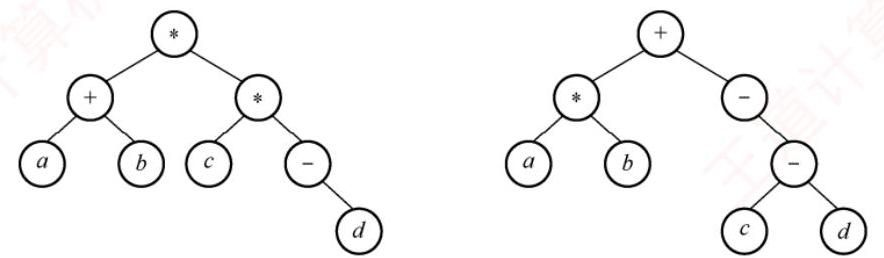
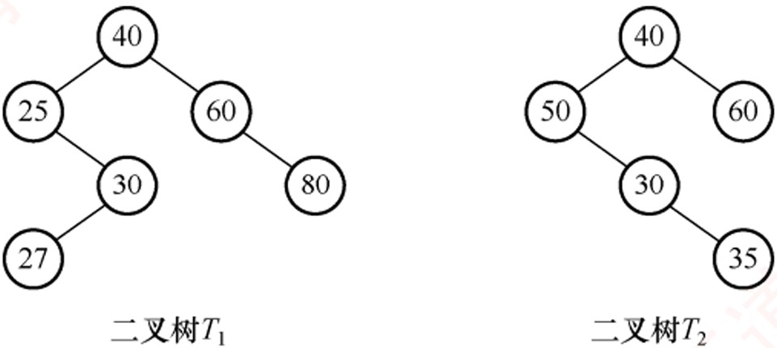
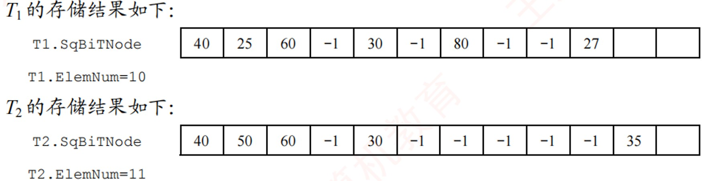
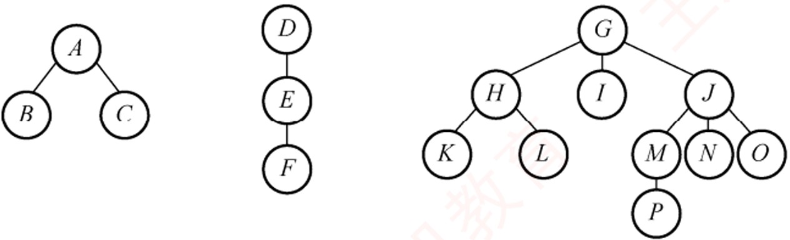
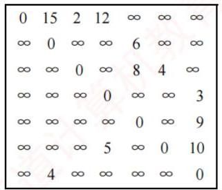

# 《王道数据结构》· 第5章 树与二叉树（综合应用大题全解）

> 本章共包含 5 个小节，共计 35 道核心综合应用题及代码设计题。

---

## 5.1 树的基本概念

### 【WD-DS-A-5.1-T01】第 1 题（P2）

1. 含有n 个结点的三叉树的最小高度是多少?

> **【唯一编号】** `WD-DS-A-5.1-T01`
> **【课程】** 数据结构
> **【章节】** 第5章 树与二叉树 · 5.1 树的基本概念

---

### 【WD-DS-A-5.1-T02】第 2 题（P2）

2. 已知一棵度为4 的树中, 度为0,1,2,3 的结点数分别为14,4,3,2, 求该树的结点总数n 和度为4 的结
点数,并给出推导过程。

> **【唯一编号】** `WD-DS-A-5.1-T02`
> **【课程】** 数据结构
> **【章节】** 第5章 树与二叉树 · 5.1 树的基本概念

---

### 【WD-DS-A-5.1-T03】第 3 题（P2）

3. 已知一棵度为m 的树中, 有n1 个度为1 的结点, 有n2 个度为2 的结点⋯⋯有nm 个度为m 的结点,
问该树有多少个叶结点?

> **【唯一编号】** `WD-DS-A-5.1-T03`
> **【课程】** 数据结构
> **【章节】** 第5章 树与二叉树 · 5.1 树的基本概念

---

## 5.2 二叉树的概念

### 【WD-DS-A-5.2-T01】第 1 题（P2）

1. 在一棵完全二叉树中, 含有n0 个叶结点, 当度为1 的结点数为1 时, 该树的高度是多少? 当度为1
的结点数为0 时,该树的高度是多少?

> **【唯一编号】** `WD-DS-A-5.2-T01`
> **【课程】** 数据结构
> **【章节】** 第5章 树与二叉树 · 5.2 二叉树的概念

---

### 【WD-DS-A-5.2-T02】第 2 题（P2）

2. 一棵有n 个结点的满二叉树有多少个分支结点和多少个叶结点? 该满二叉树的高度是多少?

> **【唯一编号】** `WD-DS-A-5.2-T02`
> **【课程】** 数据结构
> **【章节】** 第5章 树与二叉树 · 5.2 二叉树的概念

---

### 【WD-DS-A-5.2-T03】第 3 题（P2）

3. 已知完全二叉树的第9 层有240 个结点,则整个完全二叉树有多少个结点? 有多少个叶结点?

> **【唯一编号】** `WD-DS-A-5.2-T03`
> **【课程】** 数据结构
> **【章节】** 第5章 树与二叉树 · 5.2 二叉树的概念

---

### 【WD-DS-A-5.2-T04】第 4 题（P37）

4. 一棵高度为h 的满m 叉树有如下性质: 根结点所在层次为第1 层, 第h 层上的结点都是叶结点, 其
余各层上每个结点都有m 棵非空子树, 若按层次自顶向下, 同一层自左向右,顺序从1 开始对全部结
点进行编号,试问:
1) 各层的结点数是多少?
2) 编号为i 的结点的双亲结点(若存在) 的编号是多少?
3) 编号为i 的结点的第k 个孩子结点(若存在) 的编号是多少？
4) 编号为i 的结点有右兄弟的条件是什么? 其右兄弟结点的编号是多少?

> **【唯一编号】** `WD-DS-A-5.2-T04`
> **【课程】** 数据结构
> **【章节】** 第5章 树与二叉树 · 5.2 二叉树的概念

---

### 【WD-DS-A-5.2-T05】第 5 题（P37）

5. 已知一棵二叉树按顺序存储结构进行存储, 设计一个算法, 求编号分别为i 和j 的两个结点的最近
的公共祖先结点的值。

> **【唯一编号】** `WD-DS-A-5.2-T05`
> **【课程】** 数据结构
> **【章节】** 第5章 树与二叉树 · 5.2 二叉树的概念

---

### 【WD-DS-A-5.2-T06】第 6 题（P38）

6.【2016 统考真题】若一棵非空k k≥2

又树T 中的每个非叶结点都有k 个孩子，则称T 为正则k 叉
树。请回答下列问题并给出推导过程。
1) 若T 有m 个非叶结点, 则T 中的叶结点有多少个?
2) 若T 的高度为h(单结点的树h = 1), 则T 的结点数最多为多少个? 最少为多少个?

> **【唯一编号】** `WD-DS-A-5.2-T06`
> **【课程】** 数据结构
> **【章节】** 第5章 树与二叉树 · 5.2 二叉树的概念

---
## 5.3 二叉树的遍历和线索二叉树
---

### 【WD-DS-A-5.3-T01】第 1 题（P2）

1. 若某非空二叉树的先序序列和后序序列正好相反，则该二叉树的形态是什么?

> **【唯一编号】** `WD-DS-A-5.3-T01`
> **【课程】** 数据结构
> **【章节】** 第5章 树与二叉树 · 5.3 二叉树的遍历和线索二叉树

---

### 【WD-DS-A-5.3-T02】第 2 题（P39）

2. 若某非空二叉树的先序序列和后序序列正好相同，则该二叉树的形态是什么?

> **【唯一编号】** `WD-DS-A-5.3-T02`
> **【课程】** 数据结构
> **【章节】** 第5章 树与二叉树 · 5.3 二叉树的遍历和线索二叉树

---

### 【WD-DS-A-5.3-T03】第 3 题（P39）

3. 假设二叉树采用二叉链表存储结构，设计一个非递归算法求二叉树的高度。

> **【唯一编号】** `WD-DS-A-5.3-T03`
> **【课程】** 数据结构
> **【章节】** 第5章 树与二叉树 · 5.3 二叉树的遍历和线索二叉树

---

### 【WD-DS-A-5.3-T04】第 4 题（P40）

4. 二叉树按二叉链表形式存储，试编写一个判别给定二叉树是否是完全二叉树的算法。

> **【唯一编号】** `WD-DS-A-5.3-T04`
> **【课程】** 数据结构
> **【章节】** 第5章 树与二叉树 · 5.3 二叉树的遍历和线索二叉树

---

### 【WD-DS-A-5.3-T05】第 5 题（P40）

5. 假设二叉树采用二叉链表存储结构存储,试设计一个算法,计算一棵给定二叉树的所有双分支结点
数。

> **【唯一编号】** `WD-DS-A-5.3-T05`
> **【课程】** 数据结构
> **【章节】** 第5章 树与二叉树 · 5.3 二叉树的遍历和线索二叉树

---

### 【WD-DS-A-5.3-T06】第 6 题（P41）

6. 设树B 是一棵采用链式结构存储的二叉树, 编写一个把树B 中所有结点的左右子树进行交换的函
数。

> **【唯一编号】** `WD-DS-A-5.3-T06`
> **【课程】** 数据结构
> **【章节】** 第5章 树与二叉树 · 5.3 二叉树的遍历和线索二叉树

---

### 【WD-DS-A-5.3-T07】第 7 题（P41）

7. 假设二叉树采用二叉链存储结构存储，设计一个算法，求先序遍历序列中第k(1 ≤k ≤二叉树中
结点数) 个结点的值。

> **【唯一编号】** `WD-DS-A-5.3-T07`
> **【课程】** 数据结构
> **【章节】** 第5章 树与二叉树 · 5.3 二叉树的遍历和线索二叉树

---

### 【WD-DS-A-5.3-T08】第 8 题（P42）

8. 已知二叉树以二叉链表存储，编写算法完成: 对于树中每个元素值为x 的结点，删除以它为根的
子树,并释放相应的空间。

> **【唯一编号】** `WD-DS-A-5.3-T08`
> **【课程】** 数据结构
> **【章节】** 第5章 树与二叉树 · 5.3 二叉树的遍历和线索二叉树

---

### 【WD-DS-A-5.3-T09】第 9 题（P42）

9. 在二叉树中查找值为x 的结点, 试编写算法(用C 语言) 打印值为x 的结点的所有祖先,假设值为x
的结点不多于一个。

> **【唯一编号】** `WD-DS-A-5.3-T09`
> **【课程】** 数据结构
> **【章节】** 第5章 树与二叉树 · 5.3 二叉树的遍历和线索二叉树

---

### 【WD-DS-A-5.3-T10】第 10 题（P43）

10. 设一棵二叉树的结点结构为(LLINK, INFO, RLINK), ROOT 为指向该二叉树根结点的指针, p 和q
分别为指向该二叉树中任意两个结点的指针,试编写算法ANCESTOR(ROOT, p, q, r)，找到p 和q 的
最近公共祖先结点r。

> **【唯一编号】** `WD-DS-A-5.3-T10`
> **【课程】** 数据结构
> **【章节】** 第5章 树与二叉树 · 5.3 二叉树的遍历和线索二叉树

---

### 【WD-DS-A-5.3-T11】第 11 题（P43）

11. 假设二叉树采用二叉链表存储结构，设计一个算法，求非空二叉树b 的宽度(具有结点数最多的
那一层的结点数)。

> **【唯一编号】** `WD-DS-A-5.3-T11`
> **【课程】** 数据结构
> **【章节】** 第5章 树与二叉树 · 5.3 二叉树的遍历和线索二叉树

---

### 【WD-DS-A-5.3-T12】第 12 题（P44）

12. 设有一棵满二叉树(所有结点值均不同),已知其先序序列为pre,设计一个算法求其后序序列post。

> **【唯一编号】** `WD-DS-A-5.3-T12`
> **【课程】** 数据结构
> **【章节】** 第5章 树与二叉树 · 5.3 二叉树的遍历和线索二叉树

---

### 【WD-DS-A-5.3-T13】第 13 题（P44）

13. 设计一个算法将二叉树的叶结点按从左到右的顺序连成一个单链表,表头指针为head。二叉树按
二叉链表方式存储，链接时用叶结点的右指针域来存放单链表指针。

> **【唯一编号】** `WD-DS-A-5.3-T13`
> **【课程】** 数据结构
> **【章节】** 第5章 树与二叉树 · 5.3 二叉树的遍历和线索二叉树

---

### 【WD-DS-A-5.3-T14】第 14 题（P45）

14. 试设计判断两棵二叉树是否相似的算法。所谓二叉树T1 和T2 相似, 指的是T1 和T2 都是空的二叉
树或都只有一个根结点; 或者T1 的左子树和T2 的左子树是相似的, 且T1 的右子树和T2 的右子树是相
似的。

> **【唯一编号】** `WD-DS-A-5.3-T14`
> **【课程】** 数据结构
> **【章节】** 第5章 树与二叉树 · 5.3 二叉树的遍历和线索二叉树

---

### 【WD-DS-A-5.3-T15】第 15 题（P46）

15.【2014 统考真题】二叉树的带权路径长度(WPL) 是二叉树中所有叶结点的带权路径长度之和。
给定一棵二叉树T, 采用二叉链表存储, 结点结构为
left
weight
right
其中叶结点的weight 域保存该结点的非负权值。设root 为指向T 的根结点的指针,请设计求T 的
WPL 的算法, 要求:
1) 给出算法的基本设计思想。
2) 使用C 或C ++ 语言，给出二叉树结点的数据类型定义。
3) 根据设计思想，采用C 或C ++ 语言描述算法，关键之处给出注释。

> **【唯一编号】** `WD-DS-A-5.3-T15`
> **【课程】** 数据结构
> **【章节】** 第5章 树与二叉树 · 5.3 二叉树的遍历和线索二叉树

---

### 【WD-DS-A-5.3-T16】第 16 题（P47）

16.【2017 统考真题】请设计一个算法,将给定的表达式树(二叉树) 转换为等价的中缀表达式(通过
括号反映操作符的计算次序) 并输出。例如,当下列两棵表达式树作为算法的输入时:
输出的等价中缀表达式分别为(a + b) * (c * (-d)) 和(a * b) + (- (c - d))。
二叉树结点定义如下:
typedef struct node
{
char data[10];
//存储操作数或操作符
struct node *left, *right;
}BTree;
要求:
1) 给出算法的基本设计思想。
2) 根据设计思想，采用C 或C ++ 语言描述算法，关键之处给出注释。

> **【唯一编号】** `WD-DS-A-5.3-T16`
> **【课程】** 数据结构
> **【章节】** 第5章 树与二叉树 · 5.3 二叉树的遍历和线索二叉树

---

### 【WD-DS-A-5.3-T17】第 17 题（P48）

17.【2022 统考真题】已知非空二叉树T 的结点值均为正整数，采用顺序存储方式保存，数据结构
定义如下:
typedef struct {
int SqBiTNode[MAX_SIZE];
//MAX_SIZE 为已定义常量
int ElemNum;
//保存二叉树结点值的数组
} SqBiTree;
//实际占用的数组元素个数
T 中不存在的结点在数组SqBiTNode 中用-1 表示。例如, 对于下图所示的两棵非空二叉树T1 和T2,
请设计一个尽可能高效的算法,判定一棵采用这种方式存储的二叉树是否为二叉搜索树,若是,则返回
true,否则,返回false。要求:
1) 给出算法的基本设计思想。
2) 根据设计思想，采用C 或C ++ 语言描述算法，关键之处给出注释。

> **【唯一编号】** `WD-DS-A-5.3-T17`
> **【课程】** 数据结构
> **【章节】** 第5章 树与二叉树 · 5.3 二叉树的遍历和线索二叉树

---

## 5.4 树、森林

### 【WD-DS-A-5.4-T01】第 1 题（P2）

1. 给定一棵树的先根遍历序列和后根遍历序列,能否唯一确定一棵树? 若能,请举例说明; 若不能，请
给出反例。

> **【唯一编号】** `WD-DS-A-5.4-T01`
> **【课程】** 数据结构
> **【章节】** 第5章 树与二叉树 · 5.4 树、森林

---

### 【WD-DS-A-5.4-T02】第 2 题（P2）

2. 将下面一个由3 棵树组成的森林转换为二叉树。

> **【唯一编号】** `WD-DS-A-5.4-T02`
> **【课程】** 数据结构
> **【章节】** 第5章 树与二叉树 · 5.4 树、森林

---

### 【WD-DS-A-5.4-T03】第 3 题（P50）

3. 已知某二叉树的先序序列和中序序列分别为ABDEHCFIMGJKL 和DBHEAIMFCGKLJ,请画出这
棵二叉树，并画出二叉树对应的森林。

> **【唯一编号】** `WD-DS-A-5.4-T03`
> **【课程】** 数据结构
> **【章节】** 第5章 树与二叉树 · 5.4 树、森林

---

### 【WD-DS-A-5.4-T04】第 4 题（P50）

4. 编程求以孩子兄弟表示法存储的森林的叶结点数。

> **【唯一编号】** `WD-DS-A-5.4-T04`
> **【课程】** 数据结构
> **【章节】** 第5章 树与二叉树 · 5.4 树、森林

---

### 【WD-DS-A-5.4-T05】第 5 题（P51）

5. 以孩子兄弟链表为存储结构，请设计递归算法求树的深度。

> **【唯一编号】** `WD-DS-A-5.4-T05`
> **【课程】** 数据结构
> **【章节】** 第5章 树与二叉树 · 5.4 树、森林

---

## 5.5 树与二叉树的应用

### 【WD-DS-A-5.5-T01】第 1 题（P2）

1. 设给定权集w = {5,7,2,3,6,8,9}, 试构造关于w 的一棵哈夫曼树, 并求其加权路径长度WPL。

> **【唯一编号】** `WD-DS-A-5.5-T01`
> **【课程】** 数据结构
> **【章节】** 第5章 树与二叉树 · 5.5 树与二叉树的应用

---

### 【WD-DS-A-5.5-T02】第 2 题（P52）

2.【2012 统考真题】设有6 个有序表A, B, C, D, E, F，分别含有10, 35, 40, 50, 60 和200 个数据元素，
各表中的元素按升序排列。要求通过5 次两两合并，将6 个表最终合并为1 个升序表，并使最坏情
况下比较的总次数达到最小。请回答下列问题:
1) 给出完整的合并过程，并求出最坏情况下比较的总次数。
2) 根据你的合并过程, 描述n n≥2

个不等长升序表的合并策略, 并说明理由。

> **【唯一编号】** `WD-DS-A-5.5-T02`
> **【课程】** 数据结构
> **【章节】** 第5章 树与二叉树 · 5.5 树与二叉树的应用

---

### 【WD-DS-A-5.5-T03】第 3 题（P53）

3.【2020 统考真题】若任意一个字符的编码都不是其他字符编码的前缀，则称这种编码具有前缀特
性。现有某字符集(字符个数≥2) 的不等长编码,每个字符的编码均为二进制的0、1 序列, 最长为
L 位, 且具有前缀特性。请回答下列问题:
1) 哪种数据结构适宜保存上述具有前缀特性的不等长编码？
2) 基于你所设计的数据结构，简述从0/1 串到字符串的译码过程。
3) 简述判定某字符集的不等长编码是否具有前缀特性的过程。

第6 章
图

> **【唯一编号】** `WD-DS-A-5.5-T03`
> **【课程】** 数据结构
> **【章节】** 第5章 树与二叉树 · 5.5 树与二叉树的应用
