# 《王道计算机组成原理》· 第4章 指令系统（综合应用大题全解）

> 本章共包含 3 个小节，共计 16 道核心综合应用与设计大题。

---

## 4.1 指令系统

### 【WD-CO-A-4.1-T01】第 1 题（P2）

1. 一个处理器中共有32 个寄存器,使用16 位立即数,其指令系统结构中共有142 条指令。在某个给
定的程序中，20% 的指令带有一个输入寄存器和一个输出寄存器；30% 的指令带有两个输入寄存
器和一个输出寄存器;25% 的指令带有一个输入寄存器、一个输出寄存器,一个立即数寄存器; 其余
25% 的指令带有一个立即数输入寄存器和一个输出寄存器。
(1) 对于以上4 种指令类型中的任意一种指令类型来说,共需要多少位? 假定指令系统结构要求所有
指令长度必须是8 的整数倍。
(2) 与使用定长指令集编码相比，当采用变长指令集编码时，该程序能够少占用多少存储器空间？

> **【唯一编号】** `WD-CO-A-4.1-T01`
> **【课程】** 计算机组成原理
> **【章节】** 第4章 指令系统 · 4.1 指令系统

---

### 【WD-CO-A-4.1-T02】第 2 题（P2）

2. 假设指令字长为16 位，操作数的地址码为6 位，指令有零地址、一地址和二地址3 种格式。
(1) 设操作码固定，若零地址指令有M 种，一地址指令有N 种，则二地址指令最多有几种？
(2) 若采用扩展操作码技术，二地址指令最多有几种？
(3) 若采用扩展操作码技术，若二地址指令有P 条，零地址指令有Q 条，则一地址指令最多有几
种？

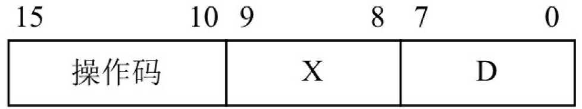

> **【唯一编号】** `WD-CO-A-4.1-T02`
> **【课程】** 计算机组成原理
> **【章节】** 第4章 指令系统 · 4.1 指令系统

---

### 【WD-CO-A-4.1-T03】第 3 题（P27）

3. 在一个36 位长的指令系统中,设计一个扩展操作码,使之能表示下列指令:
(1)7 条具有两个15 位地址和一个3 位地址的指令。
(2)500 条具有一个15 位地址和一个3 位地址的指令。
(3)50 条无地址指令。

> **【唯一编号】** `WD-CO-A-4.1-T03`
> **【课程】** 计算机组成原理
> **【章节】** 第4章 指令系统 · 4.1 指令系统

---

## 4.2 指令的寻址方式

### 【WD-CO-A-4.2-T01】第 1 题（P2）

1. 某机的机器字长为16 位,主存按字编址,指令格式如下:
其中，D 为位移量；X 为寻址特征位。
X = 00: 直接寻址；
X = 01: 用变址寄存器X1 进行变址。
X = 10: 用变址寄存器X2 进行变址；
X = 11: 相对寻址。
设PC

= 1234H, X1

= 0037H, X2

= 1122H,(H 代表十六进制数), 请确定下列指令的有效地址:
①4420H
②2244H
③1322H
④3521H
⑤6723H

> **【唯一编号】** `WD-CO-A-4.2-T01`
> **【课程】** 计算机组成原理
> **【章节】** 第4章 指令系统 · 4.2 指令的寻址方式

---

### 【WD-CO-A-4.2-T02】第 2 题（P28）

2. 某计算机字长16 位,标志寄存器FLAGS 中的ZF、SF 和OF 分别是零标志、符号标志和溢出标志,
采用双字节字长指令字。假定bgt(大于零转移) 指令的第一个字节指明操作码和寻址方式,第二个字
节为偏移地址Imm8, 用补码表示。指令功能是: 若ZF+ SF⊕OF

=0

, 则PC = PC + 2 + Imm8 × 2;
否则, PC = PC + 2。请回答下列问题:
(1) 该计算机的编址单位是多少？
(2)bgt 指令执行的是有符号整数比较,还是无符号整数比较?
(3) 偏移地址Imm8 的含义是什么? 转移目标地址的范围是什么?

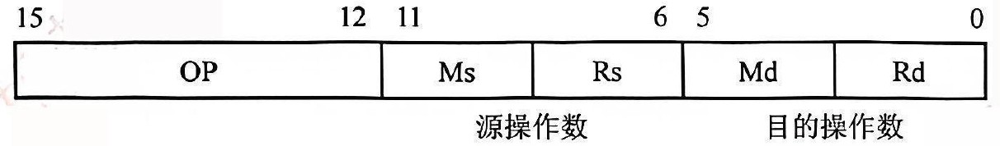

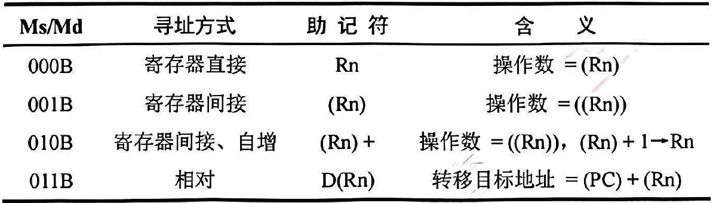

> **【唯一编号】** `WD-CO-A-4.2-T02`
> **【课程】** 计算机组成原理
> **【章节】** 第4章 指令系统 · 4.2 指令的寻址方式

---

### 【WD-CO-A-4.2-T03】第 3 题（P29）

3.【2010 统考真题】某计算机字长为16 位,主存地址空间大小为128KB,按字编址,采用单字长指令
格式,指令各字段定义如下:
转移指令采用相对寻址方式,相对偏移量用补码表示,寻址方式定义见下表。回答下列问题:
注:(X) 表示存储器地址X 或寄存器X 的内容。
(1) 该指令系统最多可有多少条指令？该计算机最多有多少个通用寄存器？存储器地址寄存器
(MAR) 和存储器数据寄存器(MDR) 至少各需要多少位?
(2) 转移指令的目标地址范围是多少?
(3) 若操作码0010B 表示加法操作(助记符为add), 寄存器R4 和R5 的编号分别为100B 和101B, R4
的内容为1234H,R5 的内容为5678H, 地址1234H 中的内容为5678H,5678H 中的内容为1234H, 则
汇编语句“add(R4), (R5) +” (逗号前为源操作数,逗号后为目的操作数) 对应的机器码是什么(用十六
进制表示)? 该指令执行后,哪些寄存器和存储单元的内容会改变? 改变后的内容是什么?

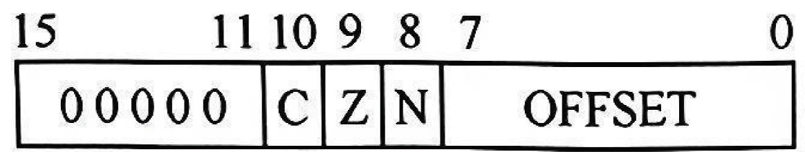

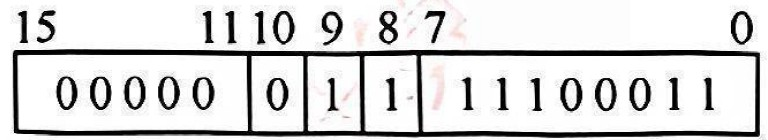

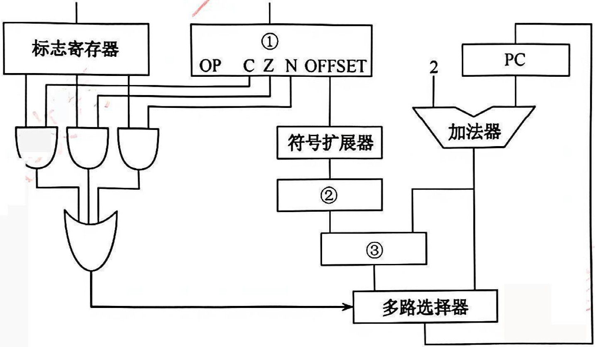

> **【唯一编号】** `WD-CO-A-4.2-T03`
> **【课程】** 计算机组成原理
> **【章节】** 第4章 指令系统 · 4.2 指令的寻址方式

---

### 【WD-CO-A-4.2-T04】第 4 题（P30）

4.【2013 统考真题】某计算机采用16 位定长指令字格式,其CPU 中有一个标志寄存器,其中包含进
位/ 借位标志CF、零标志ZF 和符号标志NF。假定为该机设计了条件转移指令,其格式如下:
其中,00000 为操作码OP;C、Z 和N 分别为CF、ZF 和NF 的对应检测位,某检测位为1 时则表示需
检测对应标志, 需检测的标志位中只要有一个为1 就转移, 否则不转移。例如, 若C = 1,Z = 0,N = 1,
则需检测CF 和NF 的值, 当CF = 1 或NF = 1 时发生转移;OFFSET 是相对偏移量,用补码表示。转移
执行时, 转移目标地址为PC

+ 2 + 2 × OFFSET; 顺序执行时, 下一条指令地址为PC

+ 2。请回
答下列问题:
(1) 该计算机存储器是按字节编址还是按字编址？该条件转移指令向后(反向) 最多可跳转多少条指
令？
(2) 某条件转移指令的地址为200CH, 指令内容如下图, 若该指令执行时CF = 0,ZF = 0,NF = 1, 则该
指令执行后PC 的值是多少? 若该指令执行时CF = 1,ZF = 0,NF = 0, 则该指令执行后PC 的值又是
多少? 请给出计算过程。
(3) 实现“无符号数比较小于或等于时转移”功能的指令中，C、Z 和N 应各是什么？
(4) 以下是该指令对应的数据通路示意图, 要求给出图中部件①∼③的名称或功能说明。

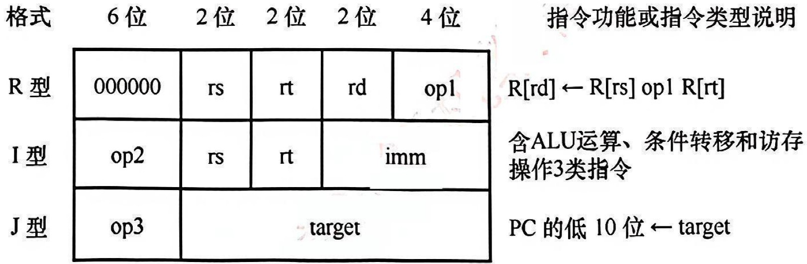

> **【唯一编号】** `WD-CO-A-4.2-T04`
> **【课程】** 计算机组成原理
> **【章节】** 第4章 指令系统 · 4.2 指令的寻址方式

---

### 【WD-CO-A-4.2-T05】第 5 题（P31）

5. 【2021 统考真题】假定计算机M 字长为16 位,按字节编址,连接CPU 和主存的系统总线中地址线
为20 位、数据线为8 位,采用16 位定长指令字,指令格式及说明如下:
其中, op1~op3 为操作码, rs, rt 和rd 为通用寄存器编号, R[r] 表示寄存器r 的内容, imm 为立即数,
target 为转移目标的形式地址。请回答下列问题:
(1)ALU 的宽度是多少位? 可寻址主存空间大小为多少字节? 指令寄存器、主存地址寄存器(MAR) 和
主存数据寄存器(MDR) 分别应有多少位?
(2)R 型格式最多可定义多少种操作?I 型和J 型格式总共最多可定义多少种操作? 通用寄存器最多有
多少个?
(3) 假定op1 为0010 和0011 时, 分别表示有符号整数减法和有符号整数乘法指令, 则指令01B2H 的
功能是什么(参考上述指令功能说明的格式进行描述)? 若1,2,3 号通用寄存器当前内容分别为
B052H, 0008H, 0020H,则分别执行指令01B2H 和01B3H 后, 3 号通用寄存器内容各是什么? 各自结果
是否溢出?
(4) 若采用I 型格式的访存指令中imm(偏移量) 为有符号整数,则地址计算时应对imm 进行零扩展还
是符号扩展?
(5) 无条件转移指令可以采用上述哪种指令格式?

> **【唯一编号】** `WD-CO-A-4.2-T05`
> **【课程】** 计算机组成原理
> **【章节】** 第4章 指令系统 · 4.2 指令的寻址方式

---
## 4.3 程序的机器级代码表示
---

### 【WD-CO-A-4.3-T01】第 1 题（P2）

1.【2017 统考真题】在按字节编址的计算机M 上, f 1 部分源程序(阴影部分) 如下。将f 1 中的int 都
改成float, 可得到计算f n

的另一个函数f 2。
int f1(unsigned n) {
int sum=1, power=1;
for(unsigned i=0; i<=n-1; i++) {
power *=2;
sum += power;
}
return sum;
}
对应的机器级代码(包括指令的虚拟地址) 如下:
1
00401020
55
push ebp
...
...
...
for(unsigned i = 0; i <= n - 1; i++)
...
...
...
20
0040105E
39 4D F4
cmp dword ptr [ebp - 0Ch], ecx
...
...
...
{
power *= 2;
...
...
...
23
00401066
D1 E2
shl edx, 1
...
...
...
return sum;
35
0040107F
C3
ret
其中,机器级代码行包括行号、虚拟地址、机器指令和汇编指令。
(1) 计算机M 是RISC 还是CISC? 为什么?
(2)f 1 的机器指令代码共占多少字节? 要求给出计算过程。
(3) 第20 条指令cmp 通过i 减n - 1 实现对i 和n - 1 的比较。在执行f 1 0

的过程中, 当i = 0 时,
cmp 指令执行后，进位/ 借位标志CF 的内容是什么? 要求给出计算过程。
(4) 第23 条指令shl 通过左移操作实现了power * 2 运算,那么在f 2 中能否用shl 指令实现power * 2?
为什么?

> **【唯一编号】** `WD-CO-A-4.3-T01`
> **【课程】** 计算机组成原理
> **【章节】** 第4章 指令系统 · 4.3 程序的机器级代码表示

---

### 【WD-CO-A-4.3-T02】第 2 题（P33）

2. 【2019 统考真题】已知f n

= n! = n × n-1

× n-2

×⋯× 2 × 1, 计算f n

的C 语言函数f 1
的源程序(阴影部分) 及其在32 位计算机M 上的部分机器级代码如下:
int f1(int n) {
1
00401000
55
push ebp
...
...
...
if(n > 1)
11
00401018
83 7D 08 01
cmp dword ptr [ebp+8], 1
12
0040101C
7E 17
jle f1+35h (00401035)
return n * f1(n - 1);
13
0040101E
8B 45 08
mov eax, dword ptr [ebp+8]
14
00401021
83 E8 01
sub eax, 1
15
00401024
50
push eax
16
00401025
E8 D6 FF FF FF
call f1 (00401000)
...
...
...
19
00401030
0F AF C1
imul eax, ecx
20
00401033
EB 05
jmp f1+3Ah (0040103a)
else return 1;
21
00401035
B8 01 00 00 00
mov eax, 1
}
...
...
...
26
00401040
3B EC
cmp ebp, esp
...
...
...
30
0040104A
C3
ret
其中,机器级代码行包括行号、虚拟地址、机器指令和汇编指令,计算机M 按字节编址, int 型数据占
32 位。请回答下列问题:
(1) 计算f 10

需要调用函数f 1 多少次? 执行哪条指令会递归调用f 1?
(2) 上述代码中，哪条指令是条件转移指令? 哪几条指令一定会使程序跳转执行？
(3) 根据第16 行的call 指令,第17 行指令的虚拟地址应是多少? 已知第16 行的call 指令采用相对寻
址方式,该指令中的偏移量应是多少(给出计算过程)? 已知第16 行的call 指令的后4 字节为偏移量,
M 是采用大端方式还是采用小端方式?
(4)f 13

= 6227020800, 但是f 1 13

的返回值为1932053504, 为什么两者不相等? 要使f 1 13

能返
回正确的结果,应如何修改f 1 的源程序?
(5) 第19 行的imul 指令(有符号整数乘) 的功能是R[eax] ←R[eax] × R[ecx],当乘法器输出的高、低
32 位乘积之间满足什么条件时, 溢出标志OF = 1? 要使CPU 在发生溢出时转异常处理, 编译器应在
imul 指令后加一条什么指令?

> **【唯一编号】** `WD-CO-A-4.3-T02`
> **【课程】** 计算机组成原理
> **【章节】** 第4章 指令系统 · 4.3 程序的机器级代码表示

---

### 【WD-CO-A-4.3-T03】第 3 题（P34）

3.【2019 统考真题】对于题2(即上一题),若计算机M 的主存地址为32 位,采用分页存储管理方式,页
大小为4KB,则第1 行的push 指令和第30 行的ret 指令是否在同一页中(说明理由)? 若指令Cache 有
64 行,采用4 路组相联映射方式,主存块大小为64B,则32 位主存地址中,哪几位表示块内地址? 哪几位
表示Cache 组号? 哪几位表示标记(tag) 信息? 读取第16 行的call 指令时,只可能在指令Cache 的哪
一组中命中(说明理由)?

> **【唯一编号】** `WD-CO-A-4.3-T03`
> **【课程】** 计算机组成原理
> **【章节】** 第4章 指令系统 · 4.3 程序的机器级代码表示

---

### 【WD-CO-A-4.3-T04】第 4 题（P35）

4.【2023 统考真题】已知计算机M 的字长为32 位,按字节编址,采用请求调页策略的虚拟存储管理方
式, 虚拟地址为32 位, 页大小为4KB, 某C 语言程序段在计算机M 上的部分机器级代码如下, 数组a
的定义为“inta[24] [64];”,每个机器级代码行中依次包含指令序号、虚拟地址、机器指令和汇编指
令。请回答下列问题。
for(i = 0; i < 24; i++)
1
00401072
C7 45 F8 00 00 00 00
mov [ebp-8], 0
2
00401079
EB 09
jmp 00401084h
3
0040107B
8B 55 F8
mov eax, [ebp-8]
... ...
... ...
... ...
7
00401088
7D 32
jge 004010bch
for(j = 0; j < 64; j++)
8
0040108A
C7 45 FC 00 00 00 00
mov [ebp-4], 0
... ...
... ...
... ...
a[i][j] = 10;
... ...
... ...
... ...
19
004010AE
C7 84 82 00 20 42 00 0A 00 00 00
mov [ecx+edx*4+00422000h], 0Ah
20
... ...
... ...
... ...
(1) 第20 条指令的虚拟地址是多少？
(2) 已知第2 条jmp 和第7 条jge 都是跳转指令，其操作码分别是EBH 和7DH，跳转目标地址分别
为00401084H、004010BCH，这两条指令都采用什么寻址方式？给出第2 条指令jmp 的跳转目标
地址计算过程。
(3) 现已知第19 条mov 指令的功能为“a[i] [ j] ←10”，其中ecx 和edx 为寄存器名，00422000H 是数
组a 的首地址，指令中源操作数采用什么寻址方式? 已知edx 中存放的是变量j, ecx 中存放的是什
么? 根据该指令的机器码判断M 采用的是大端还是小端方式。
(4) 第一次执行第19 条指令时，取指令过程中是否会发生缺页异常？为什么？

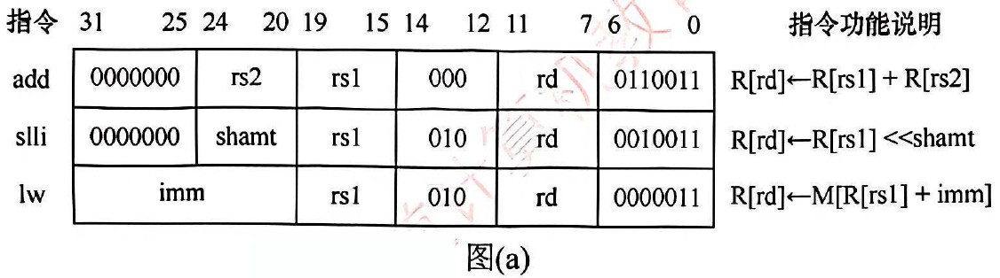

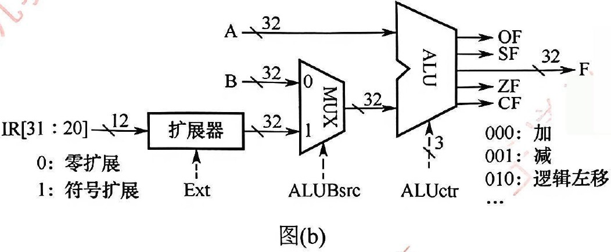

> **【唯一编号】** `WD-CO-A-4.3-T04`
> **【课程】** 计算机组成原理
> **【章节】** 第4章 指令系统 · 4.3 程序的机器级代码表示

---

### 【WD-CO-A-4.3-T05】第 5 题（P36）

5. 【2024 统考真题】假定计算机M 字长为32 位,按字节编址,采用32 位定长指令字,指令add、slli
和lw 的格式、编码和功能说明如图(a)所示。
其中，R[x] 表示通用寄存器x 的内容，M[x] 表示地址为x 的存储单元内容, shamt 为移位位数, imm
为补码表示的偏移量。图(b)给出了计算机M 的部分数据通路及其控制信号(用带箭头虚线表示),其
中, A 和B 分别表示从通用寄存器rs1 和rs2 中读出的内容;IR[31:20] 表示指令寄存器中的高12 位; 控
制信号Ext 为0、1 时扩展器分别实现零扩展、符号扩展, ALUctr 为000、001、010 时ALU 分别实
现加、减、逻辑左移运算。请回答下列问题。
(1) 计算机M 最多有多少个通用寄存器? 为什么shamt 字段占5 位?
(2) 执行add 指令时，控制信号ALUBsrc 的取值应是什么？若rs1 和rs2 寄存器内容分别是
87654321H 和98765432H,则add 指令执行后, ALU 输出端F、OF 和CF 的结果分别是什么? 若该
add 指令处理的是无符号整数,则应根据哪个标志判断是否溢出?
(3) 执行slli 指令时,控制信号Ext 的取值可以是0 也可以是1,为什么?
(4) 执行lw 指令时,控制信号Ext、ALUctr 的取值分别是什么?
(5) 若一条指令的机器码是A040A103H, 则该指令一定是Iw 指令, 为什么? 若执行该指令时, R 01H
[
[
= FFFFA2D0H,则所读取数据的存储地址是什么?

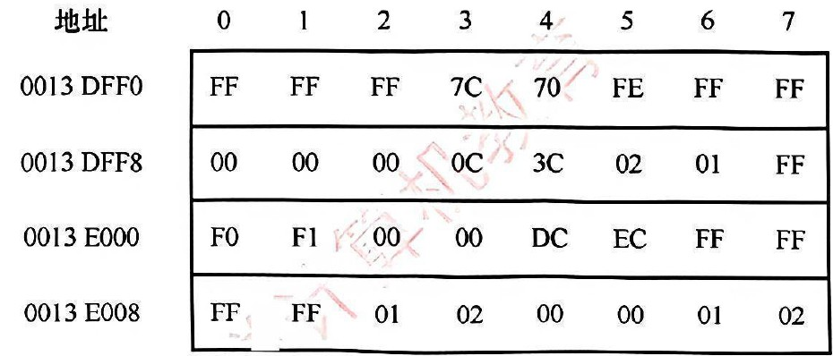

> **【唯一编号】** `WD-CO-A-4.3-T05`
> **【课程】** 计算机组成原理
> **【章节】** 第4章 指令系统 · 4.3 程序的机器级代码表示

---

### 【WD-CO-A-4.3-T06】第 6 题（P37）

6. 【2024 统考真题】对于题43 中的计算机M, C 语言程序P 包含的语句“sum += a[i];" 在M 中对应
的指令序列S 如下:
slli r4, r2, 2
//R[r4] ←R[r2] << 2
add
r4, r3, r4
//R[r4] ←R[r3] + R[r4]
lw
r5, 0(r4)
//R[r5] ←M[R[r4] + 0]
add
r1, r1, r5
//R[r1] ←R[r1] + R[r5]
已知变量i、sum 和数组a 都为int 型, 通用寄存器r1 ∼r5 的编号为01H ∼05H。请回答下列问题。
(1) 根据指令序列S 中每条指令的功能，写出存放数组a 的首地址、变量i 和sum 的通用寄存器编
号。
(2) 已知M 为小端方式计算机采用页式存储管理方式，页大小为4KB。若执行到指令序列S 中第1
条指令时, i = 5 且r1 和r3 的内容分别为00001332H 和0013DFF0H,从地址0013DFF0H 开始的存储
单元内容如下图所示,则执行“sum += a[i];”语句后, a[i] 的地址、a[i] 和sum 的机器数分别是什么
(用十六进制表示)?a[i] 所在页的页号是多少? 此次执行中,数组a 至少存放在几页中?
(3) 指令“sllir4, r2, 2”的机器码是什么(用十六进制表示)? 若数组a 改为short 类型,则指令序列S 中
slli 指令的汇编形式应是什么?

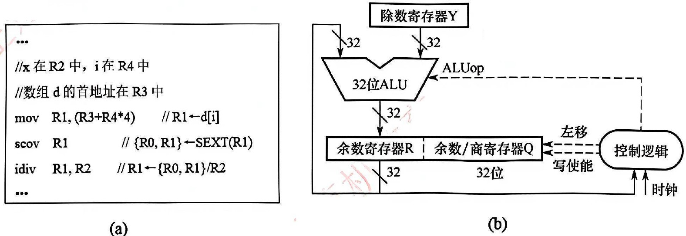

> **【唯一编号】** `WD-CO-A-4.3-T06`
> **【课程】** 计算机组成原理
> **【章节】** 第4章 指令系统 · 4.3 程序的机器级代码表示

---

### 【WD-CO-A-4.3-T07】第 7 题（P38）

7. 【2025 统考真题】现有C 语言程序P 的部分代码如下所示。假定运行程序P 的计算机M 字长为
32 位,按字节编址。假定P 的部分机器级代码如图(a) 所示,其中, ROR4 为通用寄存器, SEXT 表示按
符号扩展;M 中补码除法器逻辑结构如图(b) 所示。
int x,d[2048],i;
...
for(i=0;i<2048;i++)
d[i]=d[i]/x;
...
(1) 若执行图(a) 中idiv 指令的除运算时, d i
[
[
= 0x87654321,x = 0xff , 则补码除法器中寄存器R、Q
和Y 的初始内容分别是什么(用十六进制表示)? 图(b) 中哪个部件包含计数器? 在补码除法器执行过
程中,由ALUop 所控制的ALU 运算有哪几种?{
(2) 假设idiv 指令执行过程中会检测并触发除法异常，则执行idiv 指令时，哪些情况下会发生除法
异常(要求给出此时d[i] 和x 的十六进制机器数)? 发生除法异常时,在异常响应过程中, CPU 需要完
成哪些操作?

第5 章
中央处理器

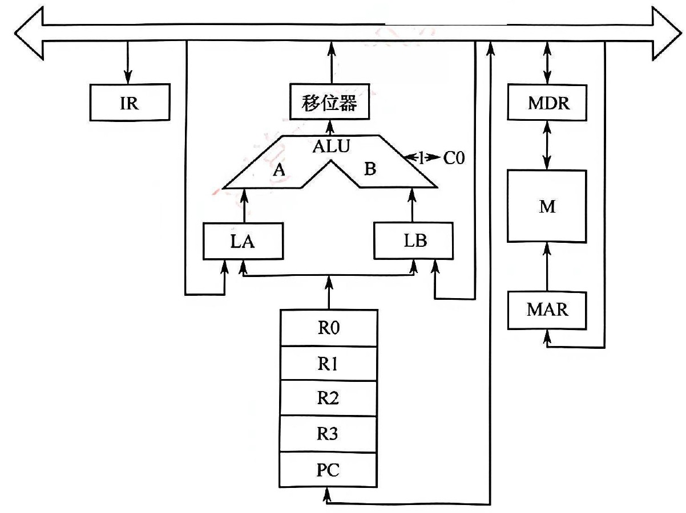

> **【唯一编号】** `WD-CO-A-4.3-T07`
> **【课程】** 计算机组成原理
> **【章节】** 第4章 指令系统 · 4.3 程序的机器级代码表示
