# 《王道计算机组成原理》· 第5章 中央处理器（综合应用大题全解）

> 本章共包含 3 个小节，共计 20 道核心综合应用与设计大题。

---
## 5.3 数据通路的功能和基本结构
---

### 【WD-CO-A-5.3-T01】第 1 题（P2）

1.某计算机的数据通路结构如下图所示,写出实现ADDR1, (R2) 的微操作序列(取指令及指令执行的
过程,包括PC 自增的过程)。

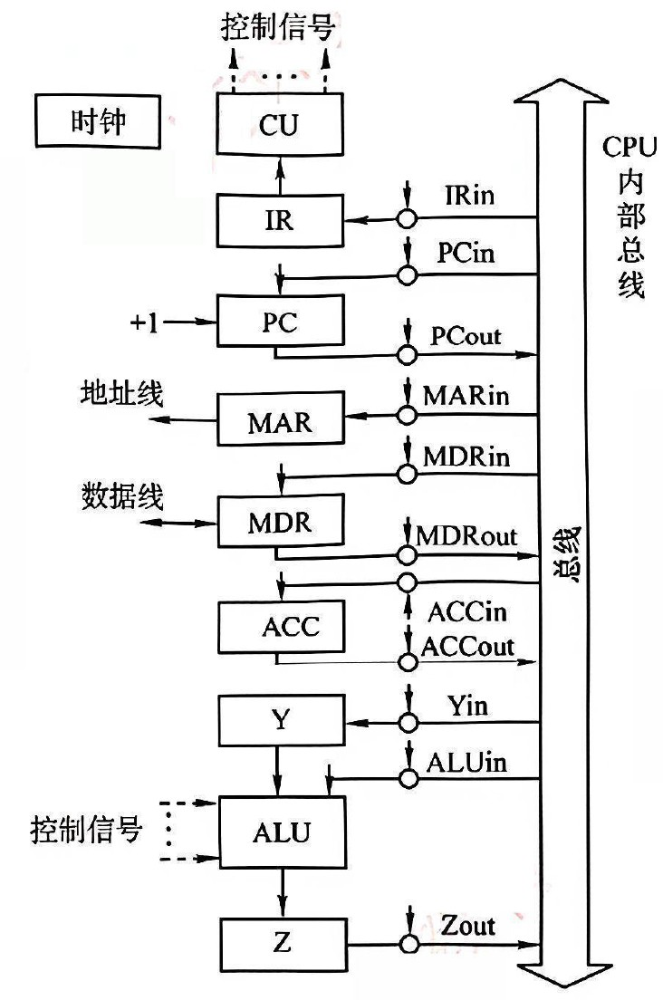

> **【唯一编号】** `WD-CO-A-5.3-T01`
> **【课程】** 计算机组成原理
> **【章节】** 第5章 中央处理器 · 5.3 数据通路的功能和基本结构

---

### 【WD-CO-A-5.3-T02】第 2 题（P40）

2. 设CPU 内部结构如下图所示, 此外还设有B、C、D、E、H、L 六个寄存器(图中未画出) 它们
各自的输入端和输出端都与内部总线相通,并分别受控制信号控制(如Bin 受寄存器B 的输入控制;
Bout 受寄存器B 的输出控制),假设ALU 的结果直接送入寄存器Z。要求从取指令开始,写出完成下
列指令的微操作序列及所需的控制信号。
ADD
B, C
(B) + (C) →B
SUB
ACC, H
(ACC) - (H) →ACC

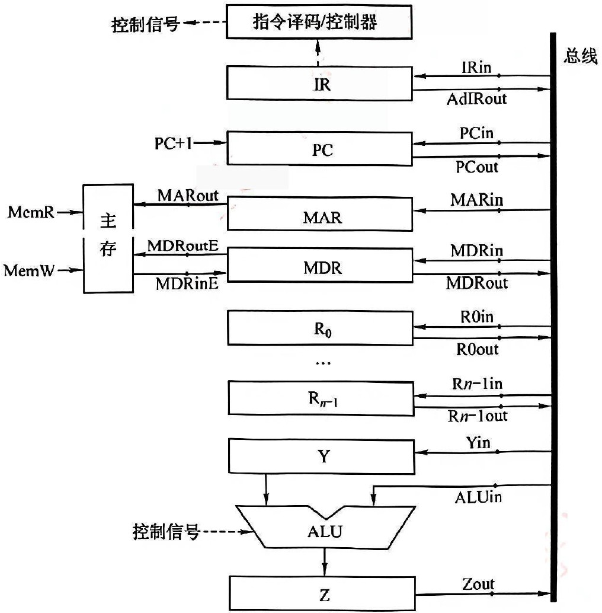

> **【唯一编号】** `WD-CO-A-5.3-T02`
> **【课程】** 计算机组成原理
> **【章节】** 第5章 中央处理器 · 5.3 数据通路的功能和基本结构

---

### 【WD-CO-A-5.3-T03】第 3 题（P41）

3.设有如下图所示的单总线结构, 分析指令ADD R0

,R1 (即实现
R0

+ R1

→R0

)的指令流程
和控制信号。

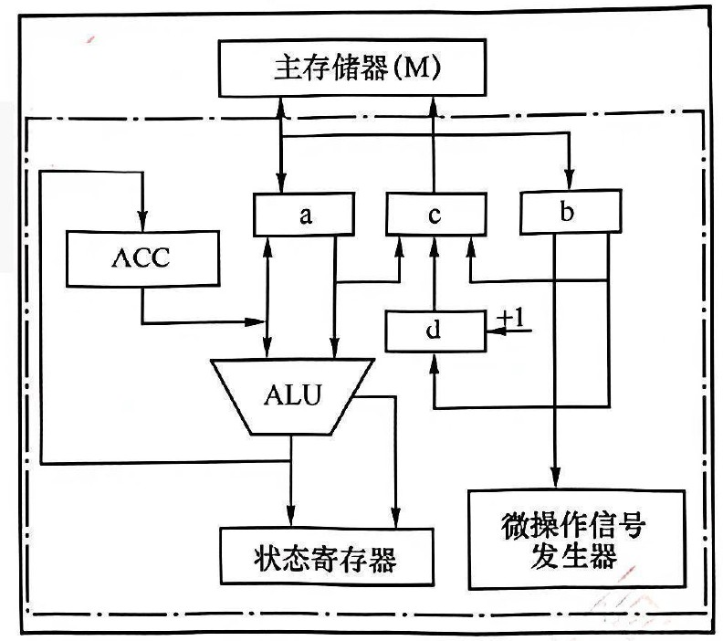

> **【唯一编号】** `WD-CO-A-5.3-T03`
> **【课程】** 计算机组成原理
> **【章节】** 第5章 中央处理器 · 5.3 数据通路的功能和基本结构

---

### 【WD-CO-A-5.3-T04】第 4 题（P42）

4. 下图是一个简化的CPU 与主存连接结构示意图(图中省略了所有的多路选择器)。其中有一个累
加寄存器(ACC)、一个状态数据寄存器和其他4 个寄存器: 存储器地址寄存器(MAR)、存储器数据
寄存器(MDR)、程序寄存器(PC) 和指令寄存器(IR),各部件及其之间的连线表示数据通路,箭头表
示信息传递方向。请回答下列问题:
(1) 写出图中a、b、c、d 四个寄存器的名称。
(2) 简述图中取指令的数据通路。
(3) 简述数据在运算器和主存之间进行存/ 取访问的数据通路(假设地址已在MAR 中)。
(4) 简述完成指令LDAX 的数据通路(X 为主存地址, LDA 的功能为X

→ACC)
(5) 简述完成指令ADDY 的数据通路(Y 为主存地址, ADD 的功能为ACC

+ Y

→ACC)
(6) 简述完成指令STAZ 的数据通路(Z 为主存地址, STA 的功能为ACC

→Z)

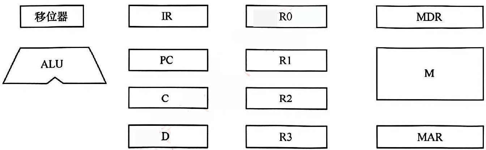

> **【唯一编号】** `WD-CO-A-5.3-T04`
> **【课程】** 计算机组成原理
> **【章节】** 第5章 中央处理器 · 5.3 数据通路的功能和基本结构

---

### 【WD-CO-A-5.3-T05】第 5 题（P43）

5. 某机主要功能部件如下图所示,其中M 为主存, MDR 为主存数据寄存器, MAR 为主存地址寄存器,
IR 为指令寄存器, PC 为程序计数器(并假设当前指令地址在PC 中), R0~R3 为通用寄存器, C、D 为
暂存器。
(1) 请补充各部件之间的主要连接线(总线自己画),并注明数据流动方向。
(2) 画出“ADD(R1), (R2) +”指令周期流程图,该指令的含义是进行求和运算,源操作数地址在R1 中,目
标操作数寻址方式为自增型寄存器间接寻址方式(先取地址后加1)，并将相加结果写回R2 寄存器。

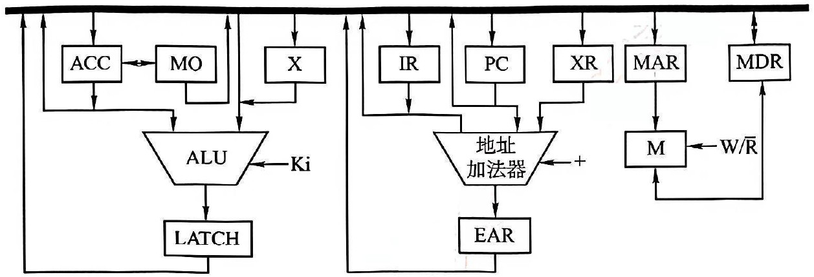

> **【唯一编号】** `WD-CO-A-5.3-T05`
> **【课程】** 计算机组成原理
> **【章节】** 第5章 中央处理器 · 5.3 数据通路的功能和基本结构

---

### 【WD-CO-A-5.3-T06】第 6 题（P44）

6. 已知单总线计算机结构如下图所示,其中M 为主存, XR 为变址寄存器, EAR 为有效地址寄存器,
LATCH 为暂存器。假设指令地址已存在于PC 中,请给出ADDX, D 指令周期信息流程和相应的控制
信号。说明:
(1)ADDX, D 指令字中, X 为变址寄存器XR, D 为形式地址,指令的功能是将变址寻址得到的操作数和
ACC 中的操作数相加,结果送回ACC。
(2) 寄存器的输入/ 输出均采用控制信号控制，如PCi 表示PC 的输入控制信号，MDRo 表示MDR
的输出控制信号。
(3) 凡需要经过总线的传送，都需要注明，如(PC) →MAR，相应的控制信号为PCo 和MARi。

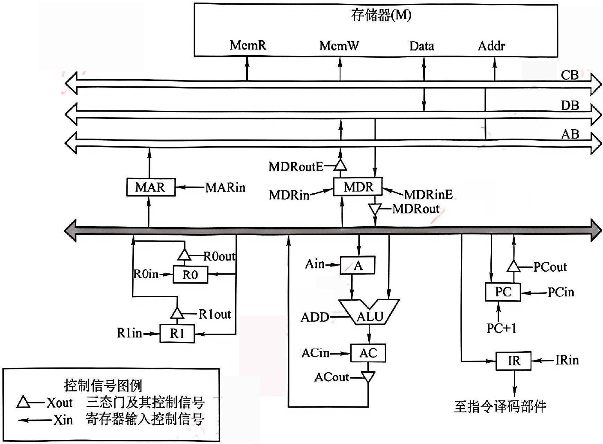

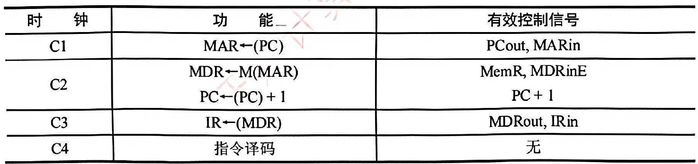

> **【唯一编号】** `WD-CO-A-5.3-T06`
> **【课程】** 计算机组成原理
> **【章节】** 第5章 中央处理器 · 5.3 数据通路的功能和基本结构

---

### 【WD-CO-A-5.3-T07】第 7 题（P45）

7.【2009 统考真题】某计算机字长16 位,采用16 位定长指令字结构,部分数据通路结构如下图所示。
图中所有控制信号为1 时表示有效，为0 时表示无效。例如，控制信号MDRinE 为1 表示允许数据
从DB 打入MDR, MDRin 为1 表示允许数据从总线打入MDR。假设MAR 的输出一直处于使能状态。
加法指令“ADD(R1), R0”的功能为(R0) + ((R1)) →(R1),即将R0 中的数据与R1 的内容所指主存单元
的数据相加,并将结果送入R1 的内容所指主存单元中保存。
下表给出了上述指令取指和译码阶段每个节拍(时钟周期) 的功能和有效控制信号,请按表中描述方
式用表格列出指令执行阶段每个节拍的功能和有效控制信号。

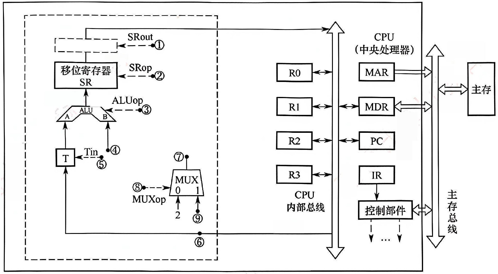

> **【唯一编号】** `WD-CO-A-5.3-T07`
> **【课程】** 计算机组成原理
> **【章节】** 第5章 中央处理器 · 5.3 数据通路的功能和基本结构

---

### 【WD-CO-A-5.3-T08】第 8 题（P46）

8. 【2015 统考真题】某16 位计算机的主存按字节编码,存取单位为16 位; 采用16 位定长指令字格
式;CPU 采用单总线结构, 主要部分如下图所示。图中R0~R3 为通用寄存器;T 为暂存器;SR 为移位寄
存器,可实现直送(mov)、左移一位(left) 和右移一位(right) 三种操作,控制信号为SRop, SR 的输出由
信号SRout 控制;ALU 可实现直送A(mova)、A 加B(add)、A 减B(sub)、A 与B(and)、A 或B(or)、
非A(not)、A 加1(inc) 七种操作,控制信号为ALUop。回答下列问题:
(1) 图中哪些寄存器是程序员可见的？为何要设置暂存器T?
(2) 控制信号ALUop 和SRop 的位数至少各是多少?
(3) 控制信号SRout 所控制部件的名称或作用是什么?
(4) 端点①∼⑨中，哪些端点须连接到控制部件的输出端？
(5) 为完善单总线数据通路,需要在端点①∼⑨中相应的端点之间添加必要的连线。写出连线的起点
和终点,以正确表示数据的流动方向。
(6) 为什么二路选择器MUX 的一个输入端是2？

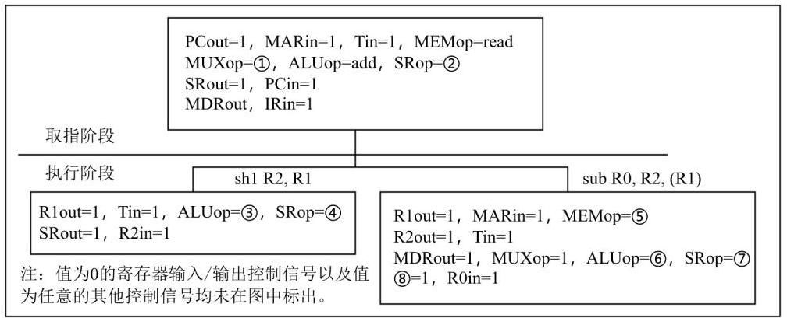

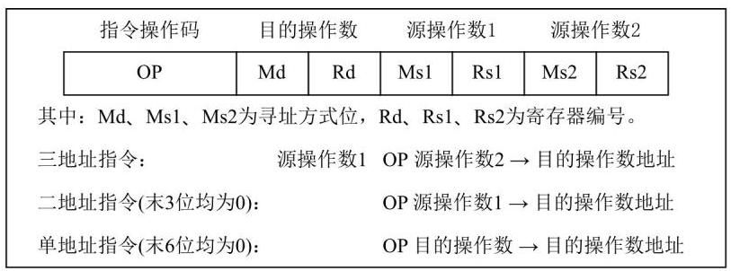

> **【唯一编号】** `WD-CO-A-5.3-T08`
> **【课程】** 计算机组成原理
> **【章节】** 第5章 中央处理器 · 5.3 数据通路的功能和基本结构

---

### 【WD-CO-A-5.3-T09】第 9 题（P47）

9. 【2015 统考真题】上一题中描述的计算机,某部分指令执行过程的控制信号如下所示。
该机指令格式如下图所示,支持寄存器直接和寄存器间接两种寻址方式,寻址方式位分别为0 和1,通
用寄存器R0~R3 的编号分别为0,1,2 和3。回答下列问题:
(1) 该机的指令系统最多可定义多少条指令？
(2) 假定inc、shl 和sub 指令的操作码分别为01H、02H 和03H，则以下指令对应的机器代码各是
什么？
inc R1;
(R1) + 1 -> R1
shl R2, R1 ; (R1) << 1 -> R2
sub R3, (R1), R2 ; ((R1)) - (R2) -> R3
(3) 假设寄存器X 的输入和输出控制信号分别为Xin 和Xout, 其值为1 表示有效, 为0 表示无效(如
PCout = 1 表示PC 内容送总线); 存储器控制信号为MEMop,用于控制存储器的读(read) 和写(write)
操作。写出本题第一幅图中标号①∼⑧处的控制信号或控制信号的取值。
(4) 指令“subR1, R3, (R2)”和“incR1”的执行阶段至少各需要多少个时钟周期?

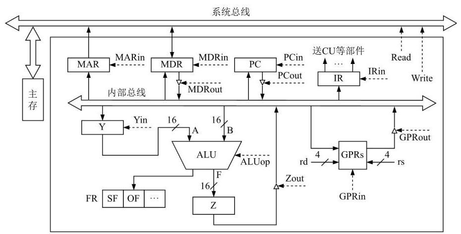

> **【唯一编号】** `WD-CO-A-5.3-T09`
> **【课程】** 计算机组成原理
> **【章节】** 第5章 中央处理器 · 5.3 数据通路的功能和基本结构

---

### 【WD-CO-A-5.3-T10】第 10 题（P48）

10.【2022 统考真题】某CPU 中部分数据通路如下图所示,其中, GPRs 为通用寄存器组;FR 为标志寄
存器,用于存放ALU 产生的标志信息; 带箭头虚线表示控制信号,如控制信号Read、Write 分别表示
主存读、主存写, MDRin 表示内部总线上的数据写入MDR, MDRout 表示MDR 的内容送给内部总线。
(1) 设ALU 的输入端A、B 及输出端F 的最高位分别为A15、B15 及F15，FR 中的符号标志和溢出标
志分别为SF 和OF,则SF 的逻辑表达式是什么?A 加B、A 减B 时OF 的逻辑表达式分别是什么? 要
求逻辑表达式的输入变量为A15、B15 及F15。
(2) 为什么要设置暂存器Y 和Z?
(3) 若GPRs 的输入端rs、rd 分别为所读、写的通用寄存器的编号，则GPRs 中最多有多少个通用
寄存器?rs 和rd 来自图中的哪个寄存器? 已知GPRs 内部有一个地址译码器和一个多路选择器, rd 应
连接地址译码器还是多路选择器?
(4) 取指令阶段(不考虑PC 增量操作) 的控制信号序列是什么？若从发出主存读指令到主存读出数
据并传送到MDR 共需5 个时钟周期,则取指令阶段至少需要几个时钟周期?
(5) 图中控制信号由什么部件产生？图中哪些寄存器的输出信号会连到该部件的输入端？

> **【唯一编号】** `WD-CO-A-5.3-T10`
> **【课程】** 计算机组成原理
> **【章节】** 第5章 中央处理器 · 5.3 数据通路的功能和基本结构

---
## 5.4 控制器的功能和工作原理
---

### 【WD-CO-A-5.4-T01】第 1 题（P2）

1. 若某机主频为200MHz，每个指令周期平均为2.5 个CPU 周期，每个CPU 周期平均包括2 个主频
周期,问:
(1) 该机平均指令执行速度为多少MIPS?
(2) 若主频不变，但每条指令平均包括5 个CPU 周期，每个CPU 周期又包含4 个主频周期，平均指
令执行速度又为多少MIPS?
(3) 由此可得出什么结论?

> **【唯一编号】** `WD-CO-A-5.4-T01`
> **【课程】** 计算机组成原理
> **【章节】** 第5章 中央处理器 · 5.4 控制器的功能和工作原理

---

### 【WD-CO-A-5.4-T02】第 2 题（P2）

2.某机有80 条指令,平均每条指令由4 条微指令组成(包含取指微指令),其中有一条取指微指令是所
有指令公用的。已知微指令长度为32 位，请估算控制存储器CM 容量。

> **【唯一编号】** `WD-CO-A-5.4-T02`
> **【课程】** 计算机组成原理
> **【章节】** 第5章 中央处理器 · 5.4 控制器的功能和工作原理

---

### 【WD-CO-A-5.4-T03】第 3 题（P2）

3. 某微程序控制器中,采用水平型直接控制(编码) 方式的微指令格式,后续微指令地址由微指令的后
继地址字段给出。已知机器共有28 个微命令，6 个互斥的可判定的外部条件，控制存储器的容量
为512 × 40 位。试设计其微指令的格式, 并说明理由。

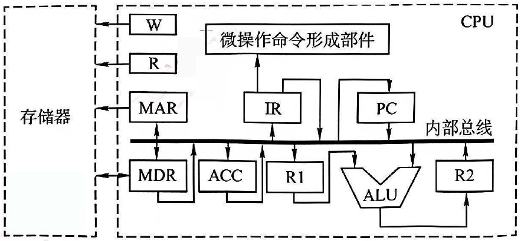

> **【唯一编号】** `WD-CO-A-5.4-T03`
> **【课程】** 计算机组成原理
> **【章节】** 第5章 中央处理器 · 5.4 控制器的功能和工作原理

---

### 【WD-CO-A-5.4-T04】第 4 题（P50）

4. 某机共有52 个微操作控制信号, 构成5 个相斥类的微命令组, 各组分别包含5、8、2、15、22 个
微命令。已知可判定的外部条件有两个，微指令字长28 位。
(1) 按水平型微指令格式设计微指令，要求微指令的后继地址字段直接给出后继微指令地址。
(2) 指出控制存储器的容量。

> **【唯一编号】** `WD-CO-A-5.4-T04`
> **【课程】** 计算机组成原理
> **【章节】** 第5章 中央处理器 · 5.4 控制器的功能和工作原理

---

### 【WD-CO-A-5.4-T05】第 5 题（P50）

5. 设CPU 中各部件及其相互连接关系如下图所示,其中W 是写控制标志;R 是读控制标志;R1、R2 是
暂存器。
(1) 写出指令ADD#a(#为立即寻址特征,隐含的操作数在ACC 寄存器中) 在执行阶段所完成的微操作
命令及节拍安排。
(2) 假设要求在取指周期实现(PC) + 1 →PC，且由ALU 完成此操作(ALU 能对它的一个源操作数完
成加1 运算)。以最少的节拍写出取指周期全部微操作命令及节拍安排。

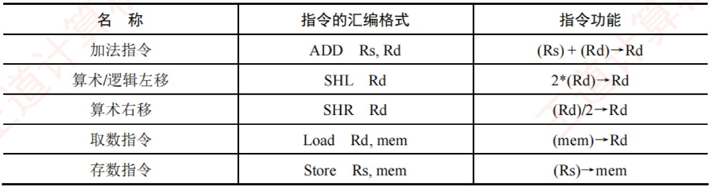

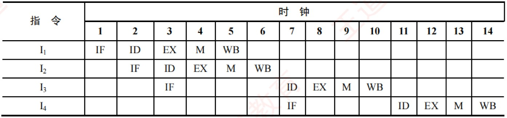

> **【唯一编号】** `WD-CO-A-5.4-T05`
> **【课程】** 计算机组成原理
> **【章节】** 第5章 中央处理器 · 5.4 控制器的功能和工作原理

---

## 5.6 指令流水线

### 【WD-CO-A-5.6-T01】第 1 题（P2）

1.【2012 统考真题】某16 位计算机中,有符号整数用补码表示,数据Cache 和指令Cache 分离。下表
给出了指令系统中的部分指令格式, 其中Rs 和Rd 表示寄存器, mem 表示存储单元地址, (x) 表示寄存
器x 或存储单元x 的内容。
该计算机采用5 段流水方式执行指令，各流水段分别是取指(IF)、译码/ 读寄存器(ID)、执行/ 计
算有效地址(EX)、访问存储器(M) 和结果写回寄存器(WB),流水线采用“按序发射,按序完成”方式,
未采用转发技术处理数据相关,且同一寄存器的读和写操作不能在同一个时钟周期内进行。回答下
列问题:
(1) 若int 型变量x 的值为-513，存放在寄存器R1 中，则执行“SHRR1”后，R1 中的内容是多少(用
十六进制表示)?
(2) 若在某个时间段中，有连续的4 条指令进入流水线，在其执行过程中未发生任何阻塞，则执行
这4 条指令所需的时钟周期数为多少?
(3) 若高级语言程序中某赋值语句为x = a + b,x、a 和b 均为int 型变量，它们的存储单元地址分别
表示为x
[
[
、a
[
[
和b
[
[
。该语句对应的指令序列及其在指令流中的执行过程如下所示。则这4 条指
令执行过程中I3 的ID 段和I4 的IF 段被阻塞的原因各是什么?
I1
LOAD
R1, [a]
I2
LOAD
R2, [b]
I3
ADD
R1, R2
I4
STORE
R2, [x]
(4) 若高级语言程序中某赋值语句为x = x * 2 + a,x 和a 均为unsignedint 类型的变量，它们的存储单
元地址分别表示为x
[
[
、a
[
[
，则执行这条语句至少需要多少个时钟周期？要求模仿上图画出这条
语句对应的指令序列及其在流水线中的执行过程示意图。

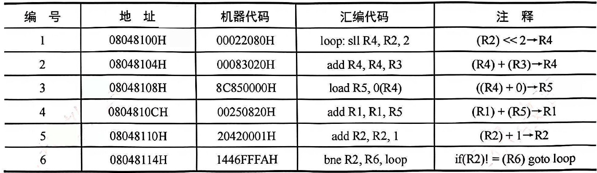

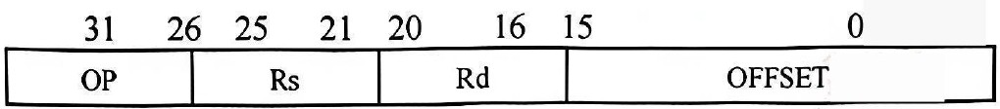

> **【唯一编号】** `WD-CO-A-5.6-T01`
> **【课程】** 计算机组成原理
> **【章节】** 第5章 中央处理器 · 5.6 指令流水线

---

### 【WD-CO-A-5.6-T02】第 2 题（P52）

2. 【2014 统考真题】某程序中有循环代码段P: “for(inti = 0;i < N;i ++)sum += A[i];"。假设编译时
变量sum 和i 分别分配在寄存器R1 和R2 中。常量N 在寄存器R6 中,数组A 的首地址在寄存器R3
中。程序段P 的起始地址为08048100H，对应的汇编代码和机器代码如下表所示。
执行上述代码的计算机M 采用32 位定长指令字,其中分支指令bne 采用如下格式:
OP 为操作码;Rs 和Rd 为寄存器编号;OFFSET 为偏移量,用补码表示。请回答下列问题,并说明理由。
(1)M 的存储器编址单位是什么?
(2) 已知sll 指令实现左移功能，数组A 中每个元素占多少位？
(3) 表中bne 指令的OFFSET 字段的值是多少? 已知bne 指令采用相对寻址方式,当前PC 内容为bne
指令地址,通过分析表中指令地址和bne 指令内容,推断bne 指令的转移目标地址计算公式。
(4) 若M 采用如下“按序发射、按序完成”的5 级指令流水线:IF(取值)、ID(译码及取数)、EXE(执
行)、MEM(访存)、WB(写回寄存器),且硬件不采取任何转发措施,分支指令的执行均引起3 个时钟
周期的阻塞,则P 中哪些指令的执行会由于数据相关而发生流水线阻塞? 哪条指令的执行会发生控制
冒险? 为什么指令1 的执行不会因为与指令5 的数据相关而发生阻塞?

> **【唯一编号】** `WD-CO-A-5.6-T02`
> **【课程】** 计算机组成原理
> **【章节】** 第5章 中央处理器 · 5.6 指令流水线

---

### 【WD-CO-A-5.6-T03】第 3 题（P53）

3.【2014 统考真题】假设对于上题中的计算机M 和程序P 的机器代码, M 采用页式虚拟存储管理;P
开始执行时, R1

= R2

= 0, R6

= 1000, 其机器代码已调入主存但不在Cache 中; 数组A 未调入主
存,且所有数组元素在同一页,并存储在磁盘的同一个扇区。请回答下列问题并说明理由。
(1)P 执行结束时, R2 的内容是多少?
(2)M 的指令Cache 和数据Cache 分离。若指令Cache 共有16 行, Cache 和主存交换的块大小为32B,
则其数据区的容量是多少? 若仅考虑程序段P 的执行, 则指令Cache 的命中率为多少?
(3)P 在执行过程中，哪条指令的执行可能发生溢出异常？哪条指令的执行可能产生缺页异常？对
于数组A 的访问,需要读磁盘和TLB 至少各多少次?

第6 章
总线

> **【唯一编号】** `WD-CO-A-5.6-T03`
> **【课程】** 计算机组成原理
> **【章节】** 第5章 中央处理器 · 5.6 指令流水线
