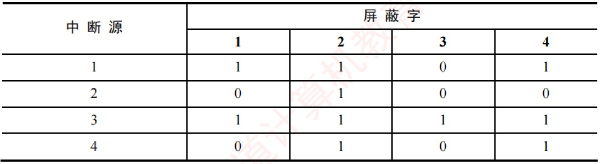
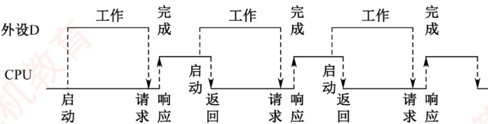

# 《王道计算机组成原理》· 第7章 输入/输出系统（综合应用大题全解）

> 本章共包含 1 个小节，共计 12 道核心综合应用与设计大题。

---
## 7.3 I
---

### 【WD-CO-A-7.3-T01】第 1 题（P2）

1. 在DMA 方式下,主存和I/O 设备之间有一条物理通路相连吗?

> **【唯一编号】** `WD-CO-A-7.3-T01`
> **【课程】** 计算机组成原理
> **【章节】** 第7章 输入/输出系统 · 7.3 I/O方式

---

### 【WD-CO-A-7.3-T02】第 2 题（P2）

2. 假定某I/O 设备向CPU 传送信息的最高频率为4 万次/ 秒，而相应中断处理程序的执行时间为
40μs, 则该I/O 设备是否可采用中断方式工作? 为什么?

> **【唯一编号】** `WD-CO-A-7.3-T02`
> **【课程】** 计算机组成原理
> **【章节】** 第7章 输入/输出系统 · 7.3 I/O方式

---

### 【WD-CO-A-7.3-T03】第 3 题（P2）

3.在程序查询方式的输入/ 输出系统中,假设不考虑处理时间,每个查询操作需要100 个时钟周期,
CPU 的时钟频率为50MHz。现有鼠标和硬盘两个设备，而且CPU 必须每秒对鼠标进行30 次查询，
硬盘以32 位字长为单位传输数据, 即每32 位被CPU 查询一次, 传输速率为2 × 220B/s。求CPU 对这
两个设备查询所花费的时间比率,由此可得出什么结论?

> **【唯一编号】** `WD-CO-A-7.3-T03`
> **【课程】** 计算机组成原理
> **【章节】** 第7章 输入/输出系统 · 7.3 I/O方式

---

### 【WD-CO-A-7.3-T04】第 4 题（P56）

4. 设某计算机有4 个中断源1、2、3、4, 其硬件排队优先次序按1 →2 →3 →4 降序排列, 各中断源
的服务程序中所对应的屏蔽字如下表所示。
(1) 给出上述4 个中断源的中断处理次序。
(2) 若4 个中断源同时有中断请求，画出CPU 执行程序的轨迹。

> **【唯一编号】** `WD-CO-A-7.3-T04`
> **【课程】** 计算机组成原理
> **【章节】** 第7章 输入/输出系统 · 7.3 I/O方式

---

### 【WD-CO-A-7.3-T05】第 5 题（P56）

5. 一个DMA 接口可采用周期窃取方式把字符(字节) 传送到存储器,它支持的最大批量为400B。若
存取周期为0.2μs, 每处理一次中断需5μs, 现有的字符设备的传输速率为9600b/s。假设字符之间的
传输是无间隙的,试问DMA 方式每秒因数据传输占用处理器多少时间? 若完全采用中断方式,又需占
处理器多少时间(忽略预处理所需时间)?

> **【唯一编号】** `WD-CO-A-7.3-T05`
> **【课程】** 计算机组成原理
> **【章节】** 第7章 输入/输出系统 · 7.3 I/O方式

---

### 【WD-CO-A-7.3-T06】第 6 题（P57）

6. 假设磁盘传输数据以32 位的字为单位, 传输速率为1MB/s,CPU 的时钟频率为50MHz。回答以下
问题:
(1) 采取程序查询方式，假设查询操作需要100 个时钟周期，求CPU 为I/O 查询所花费的时间比率
(假设进行足够的查询以避免数据丢失)。
(2) 采用中断方式进行控制，每次传输的开销(包括中断处理) 为80 个时钟周期。求CPU 为传输硬
盘所花费的时间比率。
(3) 采用DMA 的方式,假定DMA 的启动需要1000 个时钟周期, DMA 完成时后处理需要500 个时钟周
期。若平均传输的数据长度为4KB(此处K = 1000), 试问硬盘工作时CPU 将用多少时间比率进行输
入/ 输出操作? 忽略DMA 申请总线的影响。

> **【唯一编号】** `WD-CO-A-7.3-T06`
> **【课程】** 计算机组成原理
> **【章节】** 第7章 输入/输出系统 · 7.3 I/O方式

---

### 【WD-CO-A-7.3-T07】第 7 题（P57）

7. 【2009 统考真题】某计算机的CPU 主频为500MHz，CPI 为5(执行每条指令平均需5 个时钟周
期) 假定某外设的数据传输速率为0.5MB/s, 采用中断方式与主机进行数据传送, 以32 位为传输单位,
对应的中断服务程序包含18 条指令,中断服务的其他开销相当于2 条指令的执行时间。回答下列问
题,要求给出计算过程。
(1) 在中断方式下, CPU 用于该外设I/O 的时间占整个CPU 时间的百分比是多少?
(2) 当该外设的数据传输速率达到5MB/s 时, 此时改用DMA 方式传送数据。假定每次DMA 传送块
大小为5000B，且DMA 预处理和后处理的总开销为500 个时钟周期，则CPU 用于该外设I/O 的时
间占整个CPU 时间的百分比是多少(假设DMA 与CPU 之间没有访存冲突)?

> **【唯一编号】** `WD-CO-A-7.3-T07`
> **【课程】** 计算机组成原理
> **【章节】** 第7章 输入/输出系统 · 7.3 I/O方式

---

### 【WD-CO-A-7.3-T08】第 8 题（P58）

8. 【2012 统考真题】假定某计算机的CPU 主频为80MHz, CPI 为4,平均每条指令访存1.5 次,主存与
Cache 之间交换的块大小为16B, Cache 的命中率为99%，存储器总线宽带为32 位。回答下列问题。
(1) 该计算机的MIPS 数是多少? 平均每秒Cache 缺失的次数是多少? 在不考虑DMA 传送的情况下,
主存带宽至少达到多少才能满足CPU 的访存要求?
(2) 假定在Cache 缺失的情况下访问主存时,存在0.0005% 的缺页率,则CPU 平均每秒产生多少次缺
页异常? 若页面大小为4KB,每次缺页都需要访问磁盘,访问磁盘时DMA 传送采用周期挪用方式,磁
盘I/O 接口的数据缓冲寄存器为32 位，则磁盘I/O 接口平均每秒发出的DMA 请求次数至少是多少?
(3)CPU 和DMA 控制器同时要求使用存储器总线时,哪个优先级更高? 为什么?
(4) 为了提高性能，主存采用4 体低位交叉存储模式，工作时每1/4 个存储周期启动一个体。若每个
体的存储周期为50ns，则该主存能提供的最大带宽是多少？

> **【唯一编号】** `WD-CO-A-7.3-T08`
> **【课程】** 计算机组成原理
> **【章节】** 第7章 输入/输出系统 · 7.3 I/O方式

---

### 【WD-CO-A-7.3-T09】第 9 题（P59）

9. 【2016 统考真题】假定CPU 主频为50MHz, CPI 为4。设备D 采用异步串行通信方式向主机传送
7 位ASCII 码字符,通信规程中有1 位奇校验位和1 位停止位,从D 接收启动命令到字符送入I/O 端口
需要0.5ms。回答下列问题, 要求说明理由。
(1) 每传送一个字符,在异步串行通信线上共需传输多少位? 在设备D 持续工作过程中,每秒最多可向
I/O 端口送入多少个字符?
(2) 设备D 采用中断方式进行输入/ 输出,示意图如下所示:
I/O 端口每收到一个字符申请一次中断,中断响应需10 个时钟周期,中断服务程序共有20 条指令,其
中第15 条指令启动D 工作。若CPU 需从D 读取1000 个字符,则完成这一任务所需时间大约是多少
个时钟周期?CPU 用于完成这一任务的时间大约是多少个时钟周期? 在中断响应阶段CPU 进行了哪
些操作?

> **【唯一编号】** `WD-CO-A-7.3-T09`
> **【课程】** 计算机组成原理
> **【章节】** 第7章 输入/输出系统 · 7.3 I/O方式

---

### 【WD-CO-A-7.3-T10】第 10 题（P60）

10. 【2018 统考真题】假定计算机的主频为500MHz，CPI 为4。现有设备A 和B，其数据传输速率
分别为2MB/s 和40MB/s，对应I/O 接口中各有一个32 位数据缓冲寄存器。回答下列问题，要求给
出计算过程。
(1) 若设备A 采用定时查询I/O 方式，每次输入/ 输出都至少执行10 条指令。设备A 最多间隔多长
时间查询一次才能不丢失数据?CPU 用于设备A 输入/ 输出的时间占CPU 总时间的百分比至少是多
少?
(2) 在中断I/O 方式下，若每次中断响应和中断处理的总时钟周期数至少为400，则设备B 能否采用
中断I/O 方式? 为什么?
(3) 若设备B 采用DMA 方式,每次DMA 传送的数据块大小为1000B, CPU 用于DMA 预处理和后处理
的总时钟周期数为500，则CPU 用于设备B 输入/ 输出的时间占CPU 总时间的百分比最多是多少?

> **【唯一编号】** `WD-CO-A-7.3-T10`
> **【课程】** 计算机组成原理
> **【章节】** 第7章 输入/输出系统 · 7.3 I/O方式

---

### 【WD-CO-A-7.3-T11】第 11 题（P61）

11.【2022 统考真题】假设某磁盘驱动器中有4 个双面盘片，每个盘面有20000 个磁道，每个磁道
有500 个扇区,每个扇区可记录512 字节的数据,并且盘片转速为7200rpm(转/ 分) 平均寻道时间为
5ms。请回答下列问题。
(1) 每个扇区包含数据及其地址信息，地址信息分为3 个字段。这3 个字段的名称各是什么？对于
该磁盘,各字段至少占多少位?
(2) 一个扇区的平均访问时间约为多少？
(3) 若采用周期挪用DMA 方式进行磁盘与主机之间的数据传送,磁盘控制器中的数据缓冲区大小为
64 位,则在一个扇区的读/ 写过程中, DMA 控制器向CPU 发送了多少次总线请求? 若CPU 检测到
DMA 控制器的总线请求信号时也需要访问主存,则DMA 控制器是否可以获得总线使用权? 为什么?

> **【唯一编号】** `WD-CO-A-7.3-T11`
> **【课程】** 计算机组成原理
> **【章节】** 第7章 输入/输出系统 · 7.3 I/O方式
